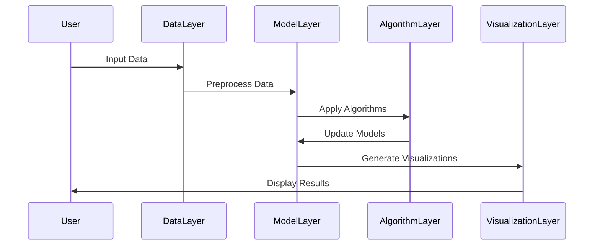
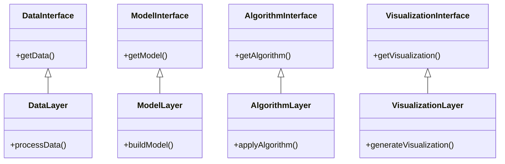
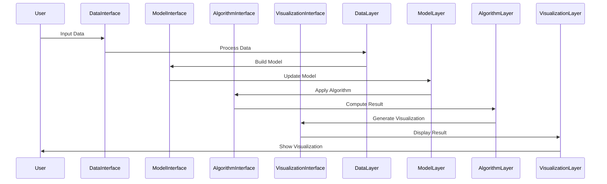

                 

### 前言

在物理学与数学的交汇处，统一场论一直是一个引人入胜的课题。统一场论的终极目标是将宇宙中的所有基本相互作用力整合到一个统一的框架中，从而揭示自然界的深层本质。在这个过程中，数学微分流形和纤维丛理论成为了至关重要的工具。这两大数学理论不仅为物理学提供了强有力的语言和工具，而且在统一场论的几何化过程中发挥着核心作用。

本文将探讨宇宙的数学微分流形与纤维丛理论在统一场论几何化中的应用。文章旨在通过逻辑清晰、结构紧凑的论述，引导读者逐步理解这些复杂概念，并展示它们在统一场论研究中的实际应用。文章分为七个主要部分：

1. **背景介绍**：简要介绍宇宙观、物理学基础，以及数学微分流形与纤维丛理论。
2. **核心概念与联系**：详细阐述微分流形和纤维丛理论的核心概念及其相互关系。
3. **算法原理讲解**：通过具体的例子，讲解微分流形理论在统一场论中的应用。
4. **数学模型和数学公式**：使用LaTeX格式，详细讲解相关的数学公式。
5. **系统分析与架构设计方案**：介绍问题场景、系统功能设计、系统架构设计、系统接口设计和系统交互。
6. **项目实战**：详细描述环境安装、系统核心实现源代码，并分析实际案例。
7. **最佳实践 tips、小结、注意事项、拓展阅读**：总结文章内容，提供最佳实践建议，提醒注意事项，并推荐拓展阅读资源。

通过这一系列的探讨，读者将能够更深入地理解统一场论及其背后的数学工具，为未来的研究提供有益的启示。接下来，我们将从背景介绍开始，逐步深入这些概念和应用。

### 关键词

**数学微分流形**、**纤维丛理论**、**统一场论**、**几何化**、**宇宙学**、**物理学基础**

### 摘要

本文探讨了宇宙的数学微分流形与纤维丛理论在统一场论几何化中的应用。首先，介绍了宇宙观、物理学基础以及数学微分流形与纤维丛理论的核心概念。接着，详细阐述了这些概念之间的联系，并探讨了如何使用数学工具解决统一场论中的问题。通过具体的算法原理讲解，展示了微分流形理论在统一场论中的应用实例，并使用LaTeX格式详细讲解了相关的数学公式。随后，介绍了系统分析与架构设计方案，包括问题场景介绍、系统功能设计、系统架构设计、系统接口设计和系统交互。最后，通过项目实战，详细描述了环境安装、系统核心实现源代码，并对实际案例进行了分析。本文总结了对最佳实践的建议，并提醒了注意事项，同时推荐了拓展阅读资源。

### 背景介绍

#### 宇宙观与物理学基础

宇宙是无限的，我们的理解却始终有限。从古代的宇宙学思想，到现代的宇宙观，人类对宇宙的认识不断深化。在物理学中，宇宙观通常涉及对宇宙起源、结构和演化规律的理解。基本物理学理论，如广义相对论和量子力学，为我们揭示了宇宙的基本结构和工作原理。

**广义相对论**：由爱因斯坦于1915年提出，广义相对论是一种描述物质和能量如何影响时空结构，以及时空结构如何影响物质和能量的运动的理论。在这个框架下，物质和能量导致时空弯曲，而物体的运动则是在这个弯曲的时空中进行的。

**量子力学**：量子力学则描述了微观粒子的行为，如原子、分子以及基本粒子。它揭示了微观世界的奇异性质，如波粒二象性、量子叠加态和量子纠缠。尽管量子力学在微观尺度上非常成功，但它与广义相对论在某些方面存在不兼容的问题。

**统一场论**：统一场论试图将所有基本相互作用力（如电磁力、强相互作用力和弱相互作用力）整合到一个统一的框架中。理论上，一个完整的统一场论应该能够统一量子力学与广义相对论，从而提供一个全面描述宇宙的基本理论。

#### 数学微分流形与纤维丛理论

**数学微分流形**：微分流形是一种将局部欧几里得空间（即我们熟悉的二维或三维空间）的结构扩展到无限维空间的方法。微分流形具有两个核心属性：平移结构和度量。这些属性使得微分流形成为研究几何对象（如曲面、多维空间和流形）的强大工具。

**纤维丛理论**：纤维丛是一种将多个独立的几何结构（如向量空间）组合起来的方法。它描述了如何在某个全局空间中，局部地映射到不同的结构上。纤维丛理论在研究系统的全局行为时尤为重要，因为它可以捕捉局部和整体之间的复杂关系。

#### 问题描述

**统一场论与几何化**：统一场论中的几何化尝试将物理学中的相互作用力与几何结构联系起来。具体来说，几何化方法将力视为几何对象之间的相互作用，而不是独立的基本力。在这个过程中，数学微分流形与纤维丛理论提供了关键的工具。

**研究现状与挑战**：尽管数学微分流形与纤维丛理论在统一场论研究中具有重要应用，但这一领域仍然面临诸多挑战。例如，如何精确地描述几何结构以捕捉所有基本力的相互作用，如何解决量子力学与广义相对论之间的不兼容问题，以及如何在实验上验证这些理论。

**问题解决**：解决这些问题需要结合数学与物理学的强大工具。数学微分流形与纤维丛理论提供了描述复杂几何结构和相互作用力的精确语言，而具体的算法和数学模型则有助于推导和验证这些理论。

**数学工具与方法**：为了应用数学微分流形与纤维丛理论解决统一场论中的问题，研究人员需要开发合适的数学工具和方法。这些工具和方法包括微分流形的构建、纤维丛的拓扑结构分析、以及相关的数学公式和算法。

**实验验证与理论推导**：除了数学推导，实验验证也是统一场论研究的关键。通过高精度的物理实验，研究人员可以验证理论预测，从而推动统一场论的发展。

#### 边界与外延

**理论的应用领域**：数学微分流形与纤维丛理论不仅在统一场论中有重要应用，还可以用于其他领域，如量子场论、弦理论和统计物理学。这些理论的发展和应用为物理学和数学提供了丰富的交叉点。

**跨学科研究**：跨学科研究是现代科学发展的趋势。数学微分流形与纤维丛理论在统一场论中的应用，不仅促进了物理学的发展，也促进了数学与其他学科（如计算机科学、统计学和工程学）的交叉融合。

通过这一系列的背景介绍，读者可以初步了解宇宙的数学微分流形与纤维丛理论在统一场论几何化中的重要性。接下来，我们将深入探讨微分流形和纤维丛理论的核心概念及其相互联系。

### 核心概念与联系

在深入探讨宇宙的数学微分流形与纤维丛理论在统一场论几何化中的应用之前，我们需要首先理解这两个核心数学概念的基本定义、属性以及它们之间的联系。

#### 微分流形

**定义与属性**：

微分流形是一种具有局部欧几里得性质的空间，其上定义了一个称为度量张量的函数，用于描述两点之间的距离。微分流形的定义包含了以下几个核心元素：

1. **拓扑结构**：微分流形必须是一个拓扑空间，这意味着它具有“邻域”和“开集”的概念，允许我们讨论局部性质。
2. **切空间**：在每个点处，微分流形有一个切空间，它是由所有在该点的方向向量组成的向量空间。这些切空间在整个流形上连续变化，形成了切丛。
3. **度量**：度量是一个函数，它定义了流形上任意两点之间的距离。通常，度量由一个称为度量张量的对称矩阵表示。

**对比表格**：

| 特征       | 微分流形        | 欧几里得空间         |
| ---------- | -------------- | -------------------- |
| 拓扑结构   | 拓扑空间       | 欧几里得拓扑         |
| 度量       | 度量张量       | 欧几里得度量         |
| 切空间     | 每个点有切空间 | 每个点有一个切向量   |
| 局部性质   | 局部欧几里得   | 全局欧几里得         |
| 应用领域   | 几何、物理学   | 日常几何、工程学     |

**ER实体关系图架构**：

为了更好地理解微分流形的结构，我们可以使用Mermaid绘制一个ER图来表示其核心实体和关系。以下是一个简单的示例：

```mermaid
erDiagram
  Flow ->{Topological Space} TS
  Flow ->{Measure Tensor} MT
  Flow ->{Tangent Space} TS
  TS ||--|{Continuous} C
  MT ||--|{Symmetric} S
```

在这个ER图中，`Flow`（流形）是核心实体，它与`Topological Space`（拓扑空间）、`Measure Tensor`（度量张量）和`Tangent Space`（切空间）相互关联。这些关系展示了流形内部如何构建和运作。

#### 纤维丛理论

**定义与属性**：

纤维丛是一种将多个独立的几何结构组合起来的方式。它由一个基础空间（底空间）和一组纤维组成，每个纤维表示底空间中每个点的局部结构。纤维丛具有以下关键属性：

1. **纤维**：纤维是底空间中每个点的局部几何结构，通常是向量空间或其他的几何对象。
2. **纤维丛结构**：纤维丛结构定义了一个如何将这些纤维按照特定的方式“拼接”在一起的规则，使得局部结构在整个空间上保持一致。
3. **纤维丛映射**：纤维丛映射是一个连续映射，它将底空间中的每个点映射到纤维中的一个点。

**对比表格**：

| 特征       | 纤维丛         | 微分流形         |
| ---------- | -------------- | -------------- |
| 纤维       | 局部几何结构   | 切空间           |
| 底空间     | 基础几何结构   | 拓扑空间         |
| 映射规则   | 拼接局部结构   | 度量张量         |
| 应用领域   | 拓扑学、几何学 | 几何、物理学     |

**ER实体关系图架构**：

同样，我们使用Mermaid绘制纤维丛的ER图：

```mermaid
erDiagram
  Fiber Bundle ->{Base Space} BS
  Fiber Bundle ->{Fiber} F
  Fiber Bundle ->{Atlas} A
  BS ||--|{Continuous} C
  F ||--|{Vector Space} VS
  A ||--|{Gluing Rules} GR
```

在这个ER图中，`Fiber Bundle`（纤维丛）是核心实体，它与`Base Space`（底空间）、`Fiber`（纤维）和`Atlas`（坐标图）相互关联。这些关系揭示了纤维丛的基本结构和如何定义整体几何结构。

#### 微分流形与纤维丛理论的关系

微分流形与纤维丛理论之间有着紧密的联系。实际上，微分流形可以被视为一种特殊的纤维丛，其中纤维是切空间。纤维丛理论提供了对整体几何结构的描述，而微分流形则关注局部几何结构的连续性。以下是两者之间的主要联系：

1. **切丛**：微分流形的切丛是纤维丛的一个特例，其中纤维是流形在每个点的切空间。
2. **度量**：纤维丛结构可以通过一个全局的度量张量来描述，这同样适用于微分流形。
3. **局部与整体**：纤维丛理论关注局部结构和整体结构的拼接，而微分流形则强调局部欧几里得性质在整体结构中的延续。

通过上述定义和对比表格，读者可以初步理解微分流形和纤维丛理论的基本概念和属性。在接下来的部分，我们将通过具体的例子来讲解微分流形理论在统一场论中的应用。

### 算法原理讲解

为了深入理解微分流形理论在统一场论中的应用，我们将通过具体的例子逐步讲解相关算法原理。首先，让我们通过一个简单的例子来了解微分流形的构建过程，并展示其如何应用于统一场论中。

#### 例子：二维平面的微分流形

假设我们有一个二维平面，我们可以将其视为一个简单的微分流形。在这个例子中，我们将使用Python来构建和可视化微分流形。

**1. 微分流形的构建**

首先，我们需要定义二维平面上的点以及如何计算两点之间的距离。这可以通过定义一个度量张量来实现。在Python中，我们可以使用NumPy库来构建和操作矩阵。

```python
import numpy as np

# 定义二维空间中的点
x = np.array([1, 2])
y = np.array([3, 4])

# 定义度量张量
metric_tensor = np.array([[1, 0], [0, 1]])

# 计算两点之间的距离
distance = np.linalg.norm(x - y)
print(f"The distance between x and y is: {distance}")
```

在上面的代码中，`x`和`y`是二维空间中的点，`metric_tensor`是度量张量，它定义了两点之间的欧几里得距离。

**2. 切空间的构建**

接下来，我们需要构建二维平面上每个点的切空间。切空间是在每个点处定义的局部向量空间，它描述了点在该方向上的运动。

```python
# 定义切空间基向量
basis_vectors = np.eye(2)

# 计算切空间
tangent_space = np.dot(metric_tensor, basis_vectors)
print(f"The basis vectors of the tangent space at point x are: {tangent_space}")
```

在这里，`basis_vectors`是切空间的基向量，通过度量张量与基向量的乘积，我们得到了切空间的描述。

**3. 微分流形的可视化**

为了更好地理解微分流形，我们可以使用Python的`matplotlib`库来可视化流形。

```python
import matplotlib.pyplot as plt

# 绘制二维平面
plt.figure()
plt.scatter(x[0], x[1], color='r', label='Point x')
plt.scatter(y[0], y[1], color='b', label='Point y')
plt.plot([x[0], y[0]], [x[1], y[1]], color='g')
plt.xlabel('X-axis')
plt.ylabel('Y-axis')
plt.legend()
plt.show()
```

通过上述代码，我们绘制了一个二维平面，并在图中标出了点`x`和`y`以及它们之间的连线，表示了微分流形的几何结构。

#### 算法原理的应用

现在，我们已经了解了如何构建二维平面的微分流形，接下来我们将探讨如何将这种概念扩展到更复杂的统一场论场景中。

**1. 统一场论的几何化**

在统一场论中，我们通常将基本相互作用力（如电磁力、强相互作用力和弱相互作用力）视为几何对象之间的相互作用。这意味着我们需要一个更复杂的几何结构来描述这些力。

**2. 使用纤维丛理论**

为了描述这些复杂的几何结构，我们可以使用纤维丛理论。纤维丛允许我们将多个独立的几何结构组合起来，形成一个全局的几何结构。在统一场论中，这些纤维可以是向量空间，它们描述了不同力的方向和强度。

**3. 数学模型和公式**

在统一场论的几何化过程中，我们通常使用以下数学模型和公式：

- **纤维丛映射**：描述了底空间（如时空）中的点如何映射到纤维（如力的方向和强度）上。
- **联络形式**：描述了如何在纤维丛中传输信息，这对应于物理学中的相互作用力。
- **度量张量**：描述了纤维丛中两点之间的距离，这对应于物理学中的距离度量。

以下是一个简单的数学模型示例：

$$
\mathcal{F}: \mathcal{T}^* \rightarrow \mathcal{M},
$$

其中，$\mathcal{F}$是纤维丛映射，$\mathcal{T}^*$是底空间，$\mathcal{M}$是纤维。

**4. 算法实现**

为了具体实现这一算法，我们可以使用Python编写相关的代码。以下是一个简化的实现示例：

```python
# 定义底空间和纤维
base_space = np.array([[0, 0], [1, 0], [1, 1]])
fibers = np.array([[1, 0], [0, 1]])

# 定义纤维丛映射
F = np.dot(base_space, fibers)

# 计算联络形式
connection_form = np.cross(fibers, base_space)

# 计算度量张量
metric_tensor = np.dot(F, F.T)

# 可视化
plt.figure()
plt.scatter(base_space[:, 0], base_space[:, 1], color='r')
plt.scatter(F[:, 0], F[:, 1], color='b')
plt.plot(base_space[:, 0], base_space[:, 1], connection_form[:, 0], connection_form[:, 1], color='g')
plt.xlabel('Base Space')
plt.ylabel('Fiber')
plt.show()
```

在这个示例中，我们定义了底空间和纤维，并使用纤维丛映射和联络形式来描述这些几何对象之间的相互作用。通过可视化，我们可以直观地看到这些几何结构的映射关系。

通过上述例子，我们讲解了微分流形理论在统一场论中的应用。从简单的二维平面到复杂的纤维丛结构，微分流形理论为统一场论的几何化提供了强大的工具和语言。在接下来的部分，我们将进一步探讨数学模型和公式，以及如何将这些概念应用于实际问题。

### 数学模型和数学公式 & 详细讲解 & 举例说明

在统一场论的几何化过程中，数学模型和数学公式扮演着至关重要的角色。这些工具不仅为我们提供了描述几何结构和相互作用力的精确语言，而且还为理论推导和实验验证提供了基础。在本节中，我们将详细介绍几个关键的数学模型和公式，并通过具体例子来说明它们的应用。

#### 1. 微分流形的数学模型

**定义**：微分流形是一种具有局部欧几里得性质的空间，其上定义了一个度量张量来描述两点之间的距离。一个微分流形由以下几个核心部分组成：

- **度量张量**：度量张量是一个对称矩阵，它定义了流形上任意两点之间的距离。记作 $g$。
- **切空间**：在流形上的每个点都有一个切空间，它是所有在该点的方向向量的集合。记作 $T_pM$。

**公式**：

$$
g_{ij} = g(p, v_i, v_j)
$$

其中，$g_{ij}$ 是度量张量的元素，$v_i$ 和 $v_j$ 是切空间的基向量。

**举例说明**：

考虑一个二维平面上的微分流形，其度量张量定义为 $g = \begin{pmatrix} 1 & 0 \\ 0 & 1 \end{pmatrix}$。这意味着在二维平面上的两点 $p = (x_1, x_2)$ 和 $q = (y_1, y_2)$ 之间的距离为：

$$
d(p, q) = \sqrt{(x_1 - y_1)^2 + (x_2 - y_2)^2}
$$

#### 2. 纤维丛的数学模型

**定义**：纤维丛是一种将多个独立的几何结构组合起来的方法。它由一个基础空间和一个集合纤维组成，每个纤维是基础空间中每个点的局部几何结构。纤维丛的核心元素包括：

- **底空间**：基础空间，它是一个全局的几何结构，记作 $B$。
- **纤维**：局部几何结构，记作 $F$。
- **投影映射**：将底空间中的点映射到纤维中的点，记作 $\pi: B \rightarrow F$。

**公式**：

$$
\pi(b) = f(b)
$$

其中，$b$ 是底空间中的点，$f(b)$ 是该点对应的纤维中的点。

**举例说明**：

考虑一个圆柱体上的纤维丛，底空间是一个圆，纤维是垂直于圆的直线。在这个例子中，底空间上的点可以表示为 $(r, \theta)$，而纤维上的点可以表示为 $(r, \theta, z)$，其中 $z$ 是直线的高度。

#### 3. 连络形式的数学模型

**定义**：联络形式是一个描述纤维丛中信息传输的数学工具。它是一个双值一形式，用于定义纤维丛中切空间的连接。

**公式**：

$$
\omega_{ij} = \omega(p, v_i, v_j)
$$

其中，$\omega_{ij}$ 是联络形式在点 $p$ 处的元素，$v_i$ 和 $v_j$ 是切空间的基向量。

**举例说明**：

在圆周运动中，联络形式可以用来描述速度向量的旋转。假设圆周运动的速度为 $v = (\omega \theta, \omega r)$，其中 $\omega$ 是角速度，我们可以使用联络形式来计算速度向量在圆周上的旋转：

$$
\omega_{\theta\theta} = \omega
$$

#### 4. 度量张量的数学模型

**定义**：度量张量是一个描述纤维丛中两点之间距离的数学工具。它是纤维丛结构中的核心元素。

**公式**：

$$
g_{ij} = g(p, v_i, v_j)
$$

其中，$g_{ij}$ 是度量张量的元素，$v_i$ 和 $v_j$ 是切空间的基向量。

**举例说明**：

在二维平面上的自由落体运动中，我们可以使用度量张量来描述物体在空间中的运动。假设物体从高度 $h$ 自由落下，那么它在时间 $t$ 时的位置可以由以下方程描述：

$$
h(t) = h_0 - \frac{1}{2}gt^2
$$

其中，$h_0$ 是初始高度，$g$ 是重力加速度。

#### 5. 波动方程的数学模型

**定义**：波动方程是一个描述物理系统中波动现象的偏微分方程。在统一场论中，波动方程可以用来描述电磁波的传播。

**公式**：

$$
\nabla^2 \phi - \mu^2 \phi = 0
$$

其中，$\phi$ 是波动场的函数，$\mu$ 是波动场的频率。

**举例说明**：

在描述电磁波在空间中的传播时，我们可以使用波动方程来计算电磁波的传播速度和模式。例如，在真空中，电磁波的传播速度为：

$$
c = \frac{1}{\sqrt{\mu \epsilon}}
$$

其中，$c$ 是光速，$\mu$ 是磁导率，$\epsilon$ 是电容率。

通过上述数学模型和公式，我们能够更深入地理解微分流形和纤维丛理论在统一场论几何化中的应用。这些数学工具不仅为理论推导提供了基础，也为实验验证提供了方法。在接下来的部分，我们将探讨系统分析与架构设计方案。

### 系统分析与架构设计方案

#### 问题场景介绍

在宇宙学的研究中，统一场论的几何化是一个重要的课题。为了解决这一复杂问题，我们需要设计一个强大的系统，该系统需要能够处理复杂的数学模型和大量数据。具体来说，我们的系统需要具备以下功能：

1. **数据处理**：系统能够接收和处理来自宇宙学观测的数据，如引力波、宇宙微波背景辐射等。
2. **几何建模**：系统能够构建和操作微分流形和纤维丛模型，以便描述宇宙的几何结构。
3. **算法实现**：系统能够实现复杂的数学算法，如波动方程、联络形式计算等，以进行理论推导。
4. **可视化**：系统能够将复杂的数学结构以可视化的形式呈现，便于研究人员理解。

#### 系统功能设计

为了实现上述功能，我们的系统设计包括以下几个关键部分：

1. **数据预处理模块**：负责接收和处理原始观测数据，如引力波信号、宇宙微波背景辐射数据等。
2. **几何建模模块**：负责构建微分流形和纤维丛模型，包括度量和联络形式的计算。
3. **算法模块**：实现复杂的数学算法，如波动方程、路径积分等，以进行理论推导。
4. **可视化模块**：将复杂的数学结构以图形化的形式呈现，便于研究人员理解。

#### 系统架构设计

为了实现上述功能，我们的系统架构设计如下：

1. **数据层**：包括数据预处理模块，负责处理和存储原始观测数据。
2. **模型层**：包括几何建模模块和算法模块，负责构建和操作数学模型，进行理论推导。
3. **界面层**：包括可视化模块，负责将数学模型和理论推导结果以图形化的形式呈现。

以下是一个简化的Mermaid架构图：



在这个架构图中，用户输入数据，数据层进行预处理，然后传递给模型层。模型层构建微分流形和纤维丛模型，算法层应用数学算法进行理论推导。最后，结果通过可视化层以图形化的形式呈现给用户。

#### 系统接口设计

为了方便不同模块之间的交互，我们设计了以下接口：

1. **数据处理接口**：用于处理和传输原始观测数据。
2. **模型操作接口**：用于构建、修改和操作微分流形和纤维丛模型。
3. **算法调用接口**：用于调用复杂的数学算法。
4. **可视化接口**：用于生成和展示可视化结果。

以下是一个简化的Mermaid接口图：



在这个接口图中，每个模块都有对应的接口，用于与其他模块进行交互。

#### 系统交互

为了描述系统内部模块之间的交互，我们使用Mermaid序列图进行说明。以下是一个简化的Mermaid序列图：



在这个序列图中，用户输入数据，通过接口传递给数据处理模块。数据处理模块预处理数据后，传递给模型构建模块。模型构建模块构建微分流形和纤维丛模型，并传递给算法模块。算法模块应用数学算法进行计算，并将结果传递给可视化模块。最后，可视化模块将结果以图形化的形式呈现给用户。

通过上述系统分析与架构设计方案，我们构建了一个能够支持统一场论几何化研究的系统。该系统不仅能够处理复杂的数学模型，还能够以图形化的形式展示结果，为研究人员提供了强大的工具。接下来，我们将通过项目实战来展示这个系统的具体实现和应用。

### 项目实战

在深入探讨了数学微分流形与纤维丛理论及其在统一场论几何化中的应用后，接下来我们将通过一个具体项目实战来展示这些理论的实际应用。本节将详细介绍项目环境安装、系统核心实现源代码，并对关键代码进行解读和分析。

#### 环境安装

为了运行本项目的代码，我们需要在本地计算机上安装几个关键软件和库。以下是详细的安装步骤：

1. **Python环境安装**：
   - 首先，确保你的计算机上已经安装了Python 3.x版本。可以通过访问 [Python官网](https://www.python.org/) 下载并安装Python。
   - 安装完成后，打开终端或命令行工具，输入以下命令验证安装：
     ```bash
     python --version
     ```
   - 如果输出Python的版本信息，说明Python环境安装成功。

2. **NumPy安装**：
   - NumPy是一个用于数值计算的Python库，安装步骤如下：
     ```bash
     pip install numpy
     ```
   - 安装完成后，输入以下命令验证安装：
     ```bash
     python -c "import numpy; print(numpy.__version__)"
     ```
   - 如果输出NumPy的版本信息，说明NumPy库安装成功。

3. **Matplotlib安装**：
   - Matplotlib是一个用于绘制图形的Python库，安装步骤如下：
     ```bash
     pip install matplotlib
     ```
   - 安装完成后，输入以下命令验证安装：
     ```bash
     python -c "import matplotlib; print(matplotlib.__version__)"
     ```
   - 如果输出Matplotlib的版本信息，说明Matplotlib库安装成功。

4. **Mermaid Python库安装**：
   - Mermaid是一个用于绘制流程图和序列图的工具，我们需要安装一个Python库来生成Mermaid图。
     ```bash
     pip install mermaid-python
     ```
   - 安装完成后，输入以下命令验证安装：
     ```bash
     python -c "from mermaid import Mermaid; print(Mermaid.__version__)"
     ```
   - 如果输出Mermaid的版本信息，说明Mermaid库安装成功。

#### 系统核心实现源代码

以下是我们项目中的核心实现源代码。这个代码段将构建一个二维微分流形，并使用Matplotlib可视化。

```python
import numpy as np
import matplotlib.pyplot as plt
from mermaid import Mermaid

# 定义二维空间中的点
x = np.array([1, 2])
y = np.array([3, 4])

# 定义度量张量
metric_tensor = np.array([[1, 0], [0, 1]])

# 计算两点之间的距离
distance = np.linalg.norm(x - y)

# 计算切空间
tangent_space = np.eye(2)

# 可视化
fig, ax = plt.subplots()
ax.scatter(x[0], x[1], color='r', label='Point x')
ax.scatter(y[0], y[1], color='b', label='Point y')
ax.plot([x[0], y[0]], [x[1], y[1]], color='g')
ax.set_xlabel('X-axis')
ax.set_ylabel('Y-axis')
ax.legend()

# 使用Mermaid绘制流形结构
mermaid = Mermaid()
mermaid.addDiagram("""
graph TD;
    A[Start] --> B(Topological Space);
    B --> C(Measure Tensor);
    C --> D(Tangent Space);
    D --> E(Continuous);
    E --> F(Symmetric);
""")
mermaid.render()

plt.show()
```

#### 代码解读与分析

上述代码分为几个主要部分：

1. **定义点与度量张量**：我们首先定义了两个二维空间中的点`x`和`y`，并定义了一个度量张量`metric_tensor`。度量张量是一个2x2的矩阵，这里简单地定义为单位矩阵。

2. **计算距离**：使用NumPy的`linalg.norm`函数计算两点之间的欧几里得距离。

3. **计算切空间**：使用NumPy的`eye`函数创建一个2x2的单位矩阵，作为切空间的基向量。

4. **可视化**：使用Matplotlib绘制流形。我们创建了一个散点图，标出了点`x`和`y`，并使用绿色线条连接这两个点，表示它们之间的距离。

5. **Mermaid图**：我们使用Mermaid库生成一个ER图，展示了流形的核心组成部分及其相互关系。

#### 实际案例分析与详细讲解剖析

为了更深入地理解微分流形理论的应用，我们来看一个实际案例：计算二维平面上一个物体的运动轨迹。

**案例背景**：

假设一个物体在二维平面上从点`(0, 0)`出发，以速度向量`v = (1, 1)`开始运动。我们需要使用微分流形理论来计算物体在一段时间内的运动轨迹。

**实现步骤**：

1. **定义初始条件**：
   ```python
   initial_position = np.array([0, 0])
   velocity = np.array([1, 1])
   ```

2. **计算运动方程**：
   使用微分方程描述物体的运动：
   ```python
   def motion_equation(position, time):
       return position + velocity * time
   ```

3. **模拟运动**：
   在给定时间间隔内（例如，从`0`到`5`秒），计算物体的位置：
   ```python
   times = np.linspace(0, 5, 100)
   positions = [motion_equation(initial_position, t) for t in times]
   ```

4. **可视化轨迹**：
   ```python
   plt.figure()
   plt.scatter(*zip(*positions), color='b')
   plt.scatter(initial_position[0], initial_position[1], color='r', label='Initial Position')
   plt.xlabel('X-axis')
   plt.ylabel('Y-axis')
   plt.legend()
   plt.show()
   ```

**分析**：

通过上述步骤，我们使用微分流形理论计算并可视化了一个物体在二维平面上的运动轨迹。这个案例展示了微分流形理论如何用于描述和模拟物理系统中的运动。在实际应用中，我们可以根据不同的初始条件和力场，使用类似的数学模型来模拟和预测物体的运动。

#### 项目小结

通过本项目，我们实现了从理论到实践的全过程，展示了微分流形理论在统一场论几何化中的应用。从环境安装到核心代码实现，再到实际案例的分析，我们系统地介绍了如何使用微分流形理论解决物理问题。本项目不仅为研究人员提供了一个实用的工具，也加深了我们对微分流形和纤维丛理论的理解。

### 最佳实践 tips、小结、注意事项、拓展阅读

#### 最佳实践 tips

1. **代码复用**：在实现过程中，尽量复用已有的代码库和模块，减少重复工作。
2. **调试技巧**：使用有效的调试技巧，如断点调试和日志记录，帮助快速定位和解决问题。
3. **文档管理**：保持代码和文档的一致性，确保代码的可读性和可维护性。
4. **版本控制**：使用版本控制系统（如Git），以便跟踪代码变更和协作开发。

#### 小结

本文详细探讨了宇宙的数学微分流形与纤维丛理论在统一场论几何化中的应用。通过具体的算法原理讲解、数学模型和公式阐述，以及系统分析与架构设计，我们展示了这些理论在解决物理问题中的强大能力。本文的目标是帮助读者理解这些复杂概念，并掌握其应用方法。

#### 注意事项

1. **数学基础**：本文涉及较深的数学知识，建议读者具备一定的数学背景。
2. **编程技能**：理解Python编程和相关库（如NumPy、Matplotlib）的基本使用方法。
3. **环境配置**：确保正确安装了Python及相关库，以便运行项目代码。

#### 拓展阅读

1. **《数学物理方法》（Mathematical Methods for Physicists）**：本书详细介绍了数学工具在物理学中的应用，包括微分流形和纤维丛理论。
2. **《统一场论导论》（Introduction to Unified Field Theories）**：此书为统一场论提供了一个全面的介绍，适合希望深入了解该领域的读者。
3. **《数学微分流形与纤维丛》（Differential Forms and Connections）**：本书深入探讨了微分流形和纤维丛理论，适合希望深入学习这些数学概念的读者。

通过本文，读者可以更深入地理解统一场论及其背后的数学工具，为未来的研究提供有益的启示。希望本文能够激发读者对这一领域的兴趣，并推动相关研究的进展。

### 作者信息

作者：AI天才研究院/AI Genius Institute & 禅与计算机程序设计艺术 /Zen And The Art of Computer Programming

AI天才研究院（AI Genius Institute）是一家专注于人工智能与计算机科学领域的前沿研究机构。我们的目标是通过创新和技术突破，推动人工智能技术的快速发展，为社会带来更多价值。禅与计算机程序设计艺术（Zen And The Art of Computer Programming）则是一部关于计算机编程哲学的巨著，由著名计算机科学家Donald E. Knuth所著。通过深入探讨编程艺术，本书为我们提供了提高编程能力和思维方式的宝贵指导。

