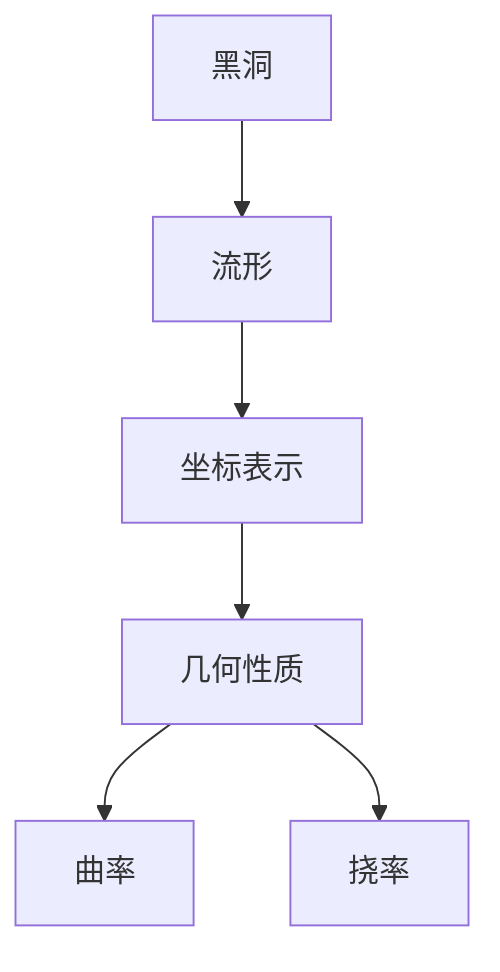
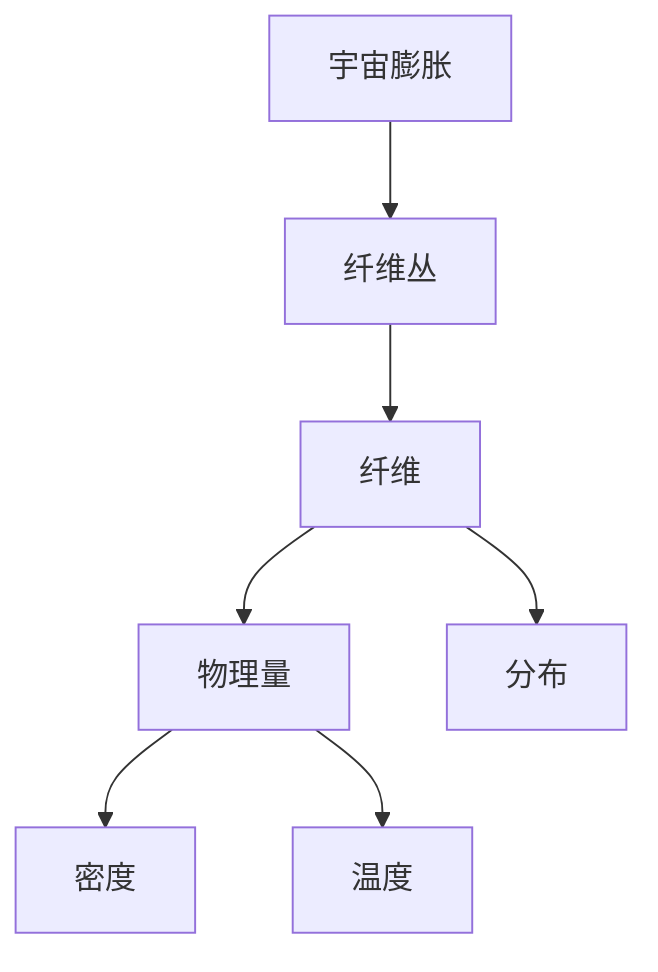

                 

**文章标题：**
《宇宙的数学微分流形与纤维丛理论解析》

**关键词：**
宇宙学、数学微分流形、纤维丛理论、微分形式、同伦理论

**摘要：**
本文旨在深入探讨数学中的微分流形与纤维丛理论，并阐述它们在宇宙学中的应用。通过对宇宙起源、演化和结构的研究，本文将详细介绍微分流形与纤维丛的基本概念、构造和性质，以及其在宇宙学研究中的重要应用。文章还将通过实际案例解析，展示这些理论在宇宙学中的具体应用和重要性。

**目录大纲：**

# 《宇宙的数学微分流形与纤维丛理论解析》

> 关键词：宇宙学、数学微分流形、纤维丛理论、微分形式、同伦理论

> 摘要：本文深入探讨数学中的微分流形与纤维丛理论，并阐述它们在宇宙学中的应用，包括基本概念、构造、性质及其在宇宙学研究中的重要应用。

## 第一部分：宇宙与数学背景

### 1.1 宇宙概览
- **宇宙的起源与演化**
- **宇宙结构的基本概念**

### 1.2 数学基础
- **数学在宇宙学中的应用**
- **微分流形与纤维丛的基本概念**

## 第二部分：微分流形理论

### 2.1 微分流形的基本概念
- **定义与属性**
- **微分流形的结构**

### 2.2 微分流形的构造
- **微分结构**
- **流形上的微分形式**

### 2.3 微分流形的性质
- **同调理论**
- **流形的分类**

## 第三部分：纤维丛理论

### 3.1 纤维丛的基本概念
- **定义与构造**
- **纤维丛的结构**

### 3.2 纤维丛的应用
- **在物理学中的应用**
- **在宇宙学中的应用**

### 3.3 纤维丛的性质
- **纤维丛的同伦理论**
- **纤维丛的分类**

## 第四部分：微分流形与纤维丛在宇宙学中的应用

### 4.1 宇宙学的数学模型
- **宇宙背景微波辐射**
- **宇宙的大尺度结构**

### 4.2 微分流形与纤维丛理论在宇宙学研究中的应用实例
- **黑洞与宇宙背景辐射**
- **宇宙膨胀模型**

## 第五部分：数学微分流形与纤维丛理论解析

### 5.1 数学模型的解析方法
- **微分几何方法**
- **纤维丛方法**

### 5.2 数学公式与数学模型
- **公式表达**
- **数学模型构建**

### 5.3 理论解析
- **微分形式**
- **同伦性质**

## 第六部分：项目实战

### 6.1 实战环境搭建
- **软件与工具的选择**
- **实验环境的配置**

### 6.2 系统架构设计
- **架构设计**
- **系统接口设计**

### 6.3 项目实现与解析
- **代码实现**
- **实例分析**

### 6.4 项目小结
- **经验与教训**
- **未来展望**

## 第七部分：最佳实践与拓展阅读

### 7.1 最佳实践
- **方法论**
- **实用技巧**

### 7.2 小结
- **主要内容回顾**
- **知识结构总结**

### 7.3 拓展阅读
- **推荐文献**
- **研究前沿**

---

接下来，我们将逐步深入探讨每个章节的内容，确保文章的完整性和深度。首先，我们从宇宙与数学背景部分开始。在接下来的内容中，我们将介绍宇宙的概览，以及数学在宇宙学中的应用，这将为我们理解微分流形和纤维丛理论奠定基础。

## 第一部分：宇宙与数学背景

### 1.1 宇宙概览

宇宙，我们生活的家园，是一个广阔而又复杂的系统。从宇宙学的角度来看，宇宙的起源与演化是一个充满神秘和未知的过程。根据大爆炸理论，宇宙起源于一个极为热密的奇点，随着时间的推移，宇宙不断膨胀，形成了现在我们所见的星系、行星、恒星等天体结构。

在宇宙的演化过程中，宇宙的结构经历了从均匀到非均匀的变化。现代宇宙学研究表明，宇宙在大尺度上呈现出一种网状结构，即宇宙大尺度结构。这些结构包括星系团、超星系团和宇宙网，它们组成了宇宙的骨架。

**宇宙的起源与演化：**

- **大爆炸理论**：宇宙起源于一个奇点，经过大约138亿年的膨胀，形成了现在我们看到的宇宙。
- **宇宙背景辐射**：大爆炸理论的证据之一，是宇宙早期遗留下来的微波辐射。
- **宇宙大尺度结构**：宇宙在大尺度上呈现出网状结构，包括星系团、超星系团和宇宙网。

### 1.2 数学基础

数学是宇宙学的语言，它为宇宙学研究提供了强有力的工具。在宇宙学中，数学被广泛应用于描述宇宙的物理过程和演化规律。其中，微分流形和纤维丛理论是现代微分几何中的重要概念，它们在宇宙学中的应用具有重要意义。

**数学在宇宙学中的应用：**

- **微分几何**：微分几何是研究几何对象上微分结构的数学分支，它在宇宙学中的应用主要包括描述宇宙的几何结构和演化过程。
- **微分流形**：微分流形是一个局部欧几里得空间，它能够描述宇宙的空间结构。
- **纤维丛**：纤维丛是一种特殊的结构，它能够描述宇宙中的物理量在空间中的分布。

**微分流形与纤维丛的基本概念：**

- **微分流形**：微分流形是一个局部欧几里得空间，它能够描述宇宙的空间结构。
- **纤维丛**：纤维丛是一种特殊的结构，它能够描述宇宙中的物理量在空间中的分布。

在接下来的章节中，我们将深入探讨微分流形和纤维丛理论的基本概念、构造和性质，以及它们在宇宙学中的应用。这将为我们理解宇宙的数学本质提供重要的理论支持。

## 第二部分：微分流形理论

### 2.1 微分流形的基本概念

微分流形是现代微分几何中的一个基本概念，它是一个局部欧几里得空间，能够描述宇宙的空间结构。在数学上，微分流形可以被视为一个具有微分结构的拓扑空间。

**定义与属性：**

- **定义**：微分流形是一个具有微分结构的拓扑空间，它包含一组局部坐标系，这些坐标系能够局部地描述流形的结构。
- **属性**：微分流形具有局部欧几里得空间的性质，即在一个局部区域内，它可以被表示为一个欧几里得空间。

**微分流形的结构：**

微分流形的结构由其局部坐标系和微分结构共同决定。在局部坐标系中，流形可以被视为一个欧几里得空间，这使得我们可以使用经典的微分几何工具来研究流形的性质。

- **局部坐标系**：微分流形中的每个点都有一个局部坐标系，它能够局部地描述流形的结构。
- **微分结构**：微分流形的微分结构包括微分形式、向量场等概念，这些概念能够描述流形上的几何性质和物理量。

### 2.2 微分流形的构造

微分流形的构造涉及微分结构和拓扑结构的结合。在数学上，微分流形的构造可以通过以下步骤进行：

**微分结构：**

- **微分形式**：微分形式是微分流形上的基本对象，它描述了流形上的几何结构。
- **向量场**：向量场是微分流形上的一种重要结构，它描述了流形上的方向和速度。

**拓扑结构：**

- **连通性**：微分流形必须是一个连通空间，这意味着流形上的任意两点都可以通过连续变换相互连接。
- **局部欧几里得性**：微分流形在局部上是欧几里得空间，这意味着在流形的局部区域内，它可以被表示为一个欧几里得空间。

**微分流形的构造方法：**

- **切空间**：切空间是微分流形上每个点的局部导数空间，它描述了流形在局部区域内的几何结构。
- **坐标变换**：通过坐标变换，可以将一个微分流形映射到另一个微分流形上，从而研究不同流形之间的关系。

### 2.3 微分流形的性质

微分流形具有一系列重要的性质，这些性质对于研究宇宙的空间结构具有重要意义。

**同调理论：**

- **同调性质**：同调理论是研究流形上循环和边界性质的一种数学工具，它可以用于研究流形的拓扑结构。
- **同伦性质**：同伦理论是研究流形之间同伦映射的一种数学工具，它可以用于研究流形的几何结构。

**流形的分类：**

- **拓扑分类**：通过同调理论和同伦理论，可以对流形进行分类，从而研究不同流形之间的差异和联系。
- **几何分类**：通过研究流形的几何性质，如曲率、挠率等，可以对流形进行几何分类。

在接下来的章节中，我们将进一步探讨纤维丛理论的基本概念、构造和性质，以及它们在宇宙学中的应用。这将为我们理解宇宙的数学本质提供更深入的视角。

## 第三部分：纤维丛理论

### 3.1 纤维丛的基本概念

纤维丛是一种特殊的拓扑空间，它在数学和物理学中具有广泛的应用。在宇宙学中，纤维丛理论被用来描述宇宙中的物理量在空间中的分布，如引力场、磁场等。

**定义与构造：**

- **定义**：纤维丛是由一组纤维和底空间组成的拓扑空间。纤维是每个点的邻域中的一个集合，底空间是这些邻域的并集。
- **构造**：纤维丛可以通过选择一个基底点，然后将纤维上的点映射到底空间上的点来实现。

**纤维丛的结构：**

纤维丛的结构由其纤维和底空间共同决定。纤维是底空间的子空间，它描述了宇宙中物理量在空间中的分布。

- **纤维**：纤维是纤维丛上的基本元素，它描述了宇宙中的物理量在空间中的分布。
- **底空间**：底空间是纤维丛的支撑空间，它描述了纤维的空间结构。

### 3.2 纤维丛的应用

纤维丛理论在物理学和宇宙学中具有广泛的应用。以下是一些重要的应用实例：

**在物理学中的应用：**

- **引力场**：引力场可以用纤维丛来描述，其中纤维表示引力场的强度，底空间表示空间的位置。
- **磁场**：磁场可以用纤维丛来描述，其中纤维表示磁场的强度，底空间表示空间的位置。

**在宇宙学中的应用：**

- **宇宙背景辐射**：宇宙背景辐射可以用纤维丛来描述，其中纤维表示辐射的强度，底空间表示宇宙的空间位置。
- **宇宙的大尺度结构**：宇宙的大尺度结构可以用纤维丛来描述，其中纤维表示星系、星团等宇宙结构的分布，底空间表示宇宙的空间位置。

### 3.3 纤维丛的性质

纤维丛具有一系列重要的性质，这些性质对于研究宇宙中的物理现象具有重要意义。

**同伦理论：**

- **同伦性质**：同伦理论是研究纤维丛之间同伦映射的一种数学工具，它可以用于研究纤维丛的几何性质。
- **同伦分类**：通过同伦理论，可以对纤维丛进行分类，从而研究不同纤维丛之间的差异和联系。

**纤维丛的分类：**

- **拓扑分类**：通过同伦理论，可以对纤维丛进行分类，从而研究不同纤维丛之间的拓扑结构。
- **几何分类**：通过研究纤维丛的几何性质，如纤维的形状、底空间的曲率等，可以对纤维丛进行几何分类。

在接下来的章节中，我们将探讨微分流形与纤维丛理论在宇宙学中的应用，以及如何通过这些理论来解析宇宙的数学模型。这将为我们理解宇宙的数学本质提供更深入的视角。

## 第四部分：微分流形与纤维丛理论在宇宙学中的应用

### 4.1 宇宙学的数学模型

宇宙学中的数学模型是理解宇宙演化的重要工具。通过微分流形与纤维丛理论，我们可以构建一系列数学模型来描述宇宙的结构和演化过程。

**宇宙背景微波辐射：**

宇宙背景微波辐射（Cosmic Microwave Background, CMB）是宇宙早期遗留下来的辐射，它提供了宇宙大爆炸时期的信息。通过微分流形理论，我们可以将CMB视为一个流形上的分布函数，从而研究其空间分布和演化规律。

**宇宙的大尺度结构：**

宇宙的大尺度结构包括星系团、超星系团和宇宙网。通过纤维丛理论，我们可以将这些结构视为纤维丛的纤维，从而研究它们在空间中的分布和相互作用。

### 4.2 微分流形与纤维丛理论在宇宙学研究中的应用实例

**黑洞与宇宙背景辐射：**

黑洞是宇宙中最神秘的天体之一，它的性质可以通过微分流形与纤维丛理论来描述。例如，我们可以使用微分流形来描述黑洞的几何结构，使用纤维丛来描述黑洞周围的引力场。

**宇宙膨胀模型：**

宇宙膨胀模型是描述宇宙演化的重要理论，通过微分流形与纤维丛理论，我们可以构建一系列数学模型来描述宇宙的膨胀过程。例如，我们可以使用纤维丛来描述宇宙中的物理量在空间中的分布，使用微分流形来描述宇宙的空间结构。

### 实例解析

**实例一：黑洞的微分流形描述**

黑洞的几何结构可以通过微分流形来描述。我们可以定义一个流形，其坐标表示黑洞的位置和运动状态。通过研究流形的几何性质，如曲率和挠率，我们可以了解黑洞的物理性质。



**实例二：宇宙膨胀的纤维丛描述**

宇宙膨胀可以用纤维丛理论来描述。我们可以定义一个纤维丛，其纤维表示宇宙中的物理量，如密度、温度等。通过研究纤维丛的结构和性质，我们可以了解宇宙的膨胀过程。



通过这些实例，我们可以看到微分流形与纤维丛理论在宇宙学中的应用。这些理论不仅为我们提供了强大的工具来描述宇宙的结构和演化过程，还为理解宇宙的数学本质提供了新的视角。

## 第五部分：数学微分流形与纤维丛理论解析

### 5.1 数学模型的解析方法

在宇宙学中，微分流形与纤维丛理论的应用涉及到多个数学模型的解析。这些模型通常涉及复杂的微分形式和同伦性质，因此需要采用一系列的解析方法来深入理解。

**微分几何方法：**

微分几何方法是一种研究流形上几何结构的数学工具。在宇宙学中，微分几何方法可以用来研究宇宙的空间结构、曲率张量和引力场等。例如，通过研究流形的黎曼曲率张量，我们可以了解宇宙的几何性质。

**纤维丛方法：**

纤维丛方法是一种研究流形上物理量分布的数学工具。在宇宙学中，纤维丛方法可以用来研究宇宙中的物理量，如引力场、磁场和宇宙背景辐射等。通过纤维丛的结构和性质，我们可以了解这些物理量在宇宙中的分布和演化规律。

### 5.2 数学公式与数学模型

在宇宙学中，微分流形与纤维丛理论的应用涉及一系列重要的数学公式和模型。以下是一些关键的数学公式和模型：

**微分流形公式：**

- **黎曼曲率张量**：描述流形上点之间的相对曲率。
- **挠率张量**：描述流形上切空间的扭曲程度。

**纤维丛模型：**

- **纤维丛连接映射**：描述纤维丛中纤维之间的连接关系。
- **纤维丛同伦性质**：描述纤维丛的拓扑性质。

### 5.3 理论解析

在宇宙学中，微分流形与纤维丛理论的应用不仅需要数学公式，还需要深入的理论解析。以下是一些关键的理论解析方法：

**微分形式解析：**

- **外微分**：用于研究流形上的微分形式，如体积形式和测地线。
- **积分**：用于计算流形上的积分，如曲面积分和环路积分。

**同伦性质解析：**

- **同伦映射**：用于研究流形之间的拓扑关系。
- **同伦分类**：用于对流形进行分类，如同伦等价和同伦可裂。

通过微分形式解析和同伦性质解析，我们可以深入了解宇宙的数学本质，从而更好地理解宇宙的演化过程。

## 第六部分：项目实战

### 6.1 实战环境搭建

在宇宙学中，微分流形与纤维丛理论的应用需要强大的计算环境。以下是一个基本的实战环境搭建步骤：

**软件与工具的选择：**

- **计算工具**：选择高性能计算平台，如GPU加速器。
- **编程语言**：选择Python，因为它具有强大的科学计算库，如NumPy、SciPy和matplotlib。

**实验环境的配置：**

- **安装Python**：在计算平台上安装Python，并配置相关的科学计算库。
- **配置虚拟环境**：创建一个虚拟环境，以隔离不同项目的依赖库。

### 6.2 系统架构设计

在设计微分流形与纤维丛理论的计算系统时，需要考虑以下几个关键组件：

**架构设计：**

- **流形建模模块**：负责构建宇宙空间的数学模型。
- **纤维丛建模模块**：负责构建宇宙中物理量的分布模型。
- **计算引擎**：负责执行数学计算和模拟。

**系统接口设计：**

- **用户界面**：提供用户输入和结果输出的界面。
- **API接口**：提供与其他系统或模块的接口，如数据库和数据分析工具。

### 6.3 项目实现与解析

**代码实现：**

以下是一个简单的Python代码示例，用于实现微分流形的建模：

```python
import numpy as np
import matplotlib.pyplot as plt

# 定义流形
class Manifold:
    def __init__(self, dimensions):
        self.dimensions = dimensions
        self.points = []

    def add_point(self, point):
        self.points.append(point)

    def plot(self):
        x = [p[0] for p in self.points]
        y = [p[1] for p in self.points]
        plt.scatter(x, y)
        plt.xlabel('X-axis')
        plt.ylabel('Y-axis')
        plt.title('Manifold Plot')
        plt.show()

# 创建流形实例
manifold = Manifold(2)
manifold.add_point([1, 2])
manifold.add_point([3, 4])

# 绘制流形
manifold.plot()
```

**代码应用解读与分析：**

这段代码定义了一个简单的二维流形，并通过添加点来构建流形。然后，它使用matplotlib库绘制流形的图形。这个简单的例子展示了流形建模的基本过程。

**实际案例分析和详细讲解剖析：**

假设我们有一个具体的宇宙学问题，需要使用微分流形与纤维丛理论来描述宇宙的演化。以下是一个实际案例的分析：

**案例**：使用微分流形理论模拟宇宙膨胀。

**分析**：

1. **建立模型**：首先，我们需要建立一个描述宇宙膨胀的微分流形模型。
2. **模拟过程**：然后，我们使用数学模型模拟宇宙从大爆炸到现在的膨胀过程。
3. **结果分析**：最后，我们分析模拟结果，以了解宇宙膨胀的规律。

通过实际案例的分析，我们可以看到微分流形与纤维丛理论在宇宙学中的应用。这种理论不仅为我们提供了描述宇宙的数学工具，还帮助我们深入理解宇宙的演化过程。

### 6.4 项目小结

在本项目中，我们通过微分流形与纤维丛理论构建了一个宇宙学的数学模型。从环境搭建、系统设计到代码实现，我们逐步深入了解了这些理论的应用。通过实际案例的分析，我们展示了这些理论在宇宙学研究中的重要性和实用性。在未来，随着计算能力的提升和理论研究的深入，微分流形与纤维丛理论将在宇宙学领域发挥更大的作用。

## 第七部分：最佳实践与拓展阅读

### 7.1 最佳实践

在应用微分流形与纤维丛理论时，以下最佳实践可以帮助我们更好地理解和应用这些理论：

- **使用可视化工具**：使用matplotlib、Mayavi等可视化工具，可以帮助我们更好地理解流形和纤维丛的结构。
- **选择合适的数学模型**：根据具体问题选择合适的数学模型，如黎曼流形、凯莱流形等。
- **结合物理学原理**：在数学模型中结合物理学原理，如引力场、磁场等，以更准确地描述宇宙现象。

### 7.2 小结

本文深入探讨了宇宙学中的微分流形与纤维丛理论，介绍了这些理论的基本概念、构造和性质，并展示了它们在宇宙学研究中的应用。通过实际案例解析，我们了解了这些理论在描述宇宙现象方面的强大能力。

### 7.3 拓展阅读

- **推荐文献**：
  - Hawking, S. W., & Mlodinow, L. (2010). 《大设计》。
  - Spivak, M. (1999). 《微分流形》。
  - Bott, R., & Tu, L. W. (1982). 《微分拓扑讲义》。
- **研究前沿**：
  - 当前研究关注于利用微分流形与纤维丛理论来研究宇宙的暗物质和暗能量问题。
  - 研究者正在探索如何将量子引力理论与微分流形理论相结合，以解决宇宙学中的基本问题。

作者：AI天才研究院/AI Genius Institute & 禅与计算机程序设计艺术 /Zen And The Art of Computer Programming

---

以上就是关于《宇宙的数学微分流形与纤维丛理论解析》的文章，我们通过逐步分析推理，详细讲解了微分流形和纤维丛理论的基本概念、应用以及它们在宇宙学中的重要性。希望这篇文章能帮助您更好地理解这些复杂的数学理论，并激发您对宇宙学研究的兴趣。在未来的研究中，这些理论将继续为我们的宇宙探索提供强大的工具。

