                 

### 第1章：宇宙的数学与物理学前沿

#### 1.1.3 重整化群技术的应用

重整化群技术是物理学中一种强大的工具，尤其是在量子场论和统计物理中得到了广泛的应用。它帮助物理学家在处理复杂理论时，将理论简化到可操作的形态。在这一节中，我们将详细探讨重整化群技术的概念、原理以及在宇宙学中的应用。

**核心概念：**

- **重整化群**：一种用于调节物理理论参数的技术，使得理论在宏观尺度下变得可观测和可计算。
- **应用**：在量子场论、统计物理、高能物理等领域中，重整化群技术帮助物理学家解决了许多复杂问题。

**概念属性特征对比表格：**

| 概念         | 定义                                                         | 应用领域                   |
|---------------------|--------------------------------------------------------------|----------------------------|
| 重整化群       | 调节物理理论参数，使其在可观测尺度上可操作的数学工具         | 量子场论、统计物理、高能物理等 |
| 参数调节       | 重整化群的核心步骤，用于改变理论的参数                       | 改善理论的可计算性           |
| 可观测尺度     | 重整化群的目标是使得物理理论在宏观尺度下的可观测性和可计算性 | 宇宙学、粒子物理等           |

**ER实体关系图架构：**

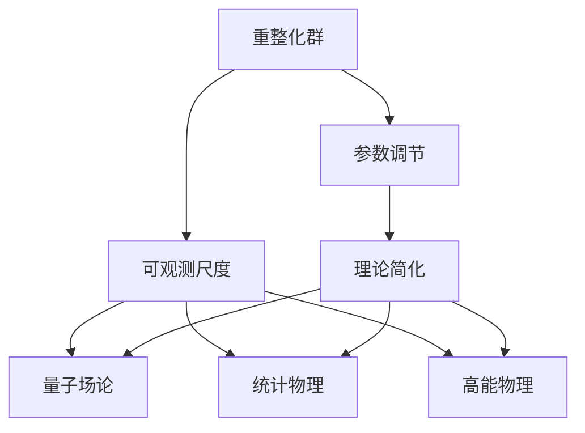
```mermaid
graph TD
A[重整化群] --> B[参数调节]
A --> C[可观测尺度]
B --> D[理论简化]
C --> E[量子场论]
C --> F[统计物理]
C --> G[高能物理]
D --> E
D --> F
D --> G
```

#### 1.1.4 小结

在本章中，我们介绍了宇宙的数学、规范场论和重整化群技术。这些概念构成了宇宙学和物理学研究的前沿领域，提供了强大的工具和方法。通过理解这些概念，我们将为后续章节中更深入的分析和讨论打下坚实的基础。

### 第2章：李超代数基础

#### 2.1.1 李超代数的定义

李超代数是现代数学中一个重要的代数结构，它不仅在数学理论研究中占据重要地位，也在物理学中有着广泛的应用。在这一节中，我们将介绍李超代数的定义、基本性质及其在数学和物理学中的重要性。

**核心概念：**

- **李超代数**：一个结合了李代数和超复数结构的代数系统。
- **定义**：李超代数是一种代数结构，它扩展了李代数的定义，加入了超复数元素。

**概念属性特征对比表格：**

| 概念         | 定义                                                         | 应用领域                   |
|---------------------|--------------------------------------------------------------|----------------------------|
| 李超代数       | 一种结合了李代数和超复数结构的代数系统                         | 数学理论、物理学等领域     |
| 李代数         | 一个代数结构，具有双线性运算和雅可比恒等式                      | 代数学、物理学等领域     |
| 超复数结构     | 一种具有超复数性质的代数结构，扩展了复数的定义                  | 超复数理论、量子力学等领域 |

**ER实体关系图架构：**

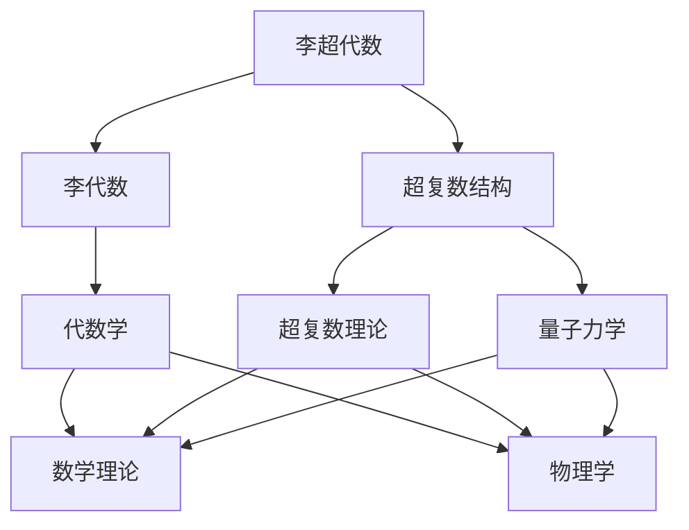
```mermaid
graph TD
A[李超代数] --> B[李代数]
A --> C[超复数结构]
B --> D[代数学]
C --> E[超复数理论]
C --> F[量子力学]
D --> G[数学理论]
D --> H[物理学]
E --> G
E --> H
F --> G
F --> H
```

#### 2.1.2 李超代数的性质

李超代数具有一系列独特的性质，使其在数学和物理学中具有重要应用。以下是一些关键性质：

- **非交换性**：李超代数中的运算不满足交换律，这意味着运算的顺序会影响结果。
- **雅可比恒等式**：李超代数满足雅可比恒等式，这是李代数的基本性质之一。
- **超复数性质**：李超代数中的元素具有超复数性质，这使得它们在处理复杂的数学问题时具有独特的优势。

**概念属性特征对比表格：**

| 性质         | 定义                                                         | 应用领域                   |
|---------------------|--------------------------------------------------------------|----------------------------|
| 非交换性       | 李超代数中的运算不满足交换律                                 | 数学理论、量子力学等领域 |
| 雅可比恒等式     | 李超代数满足雅可比恒等式，这是李代数的基本性质之一           | 数学理论、物理学等领域 |
| 超复数性质     | 李超代数中的元素具有超复数性质，这使得它们在处理复杂的数学问题时具有独特的优势 | 超复数理论、量子力学等领域 |

**ER实体关系图架构：**

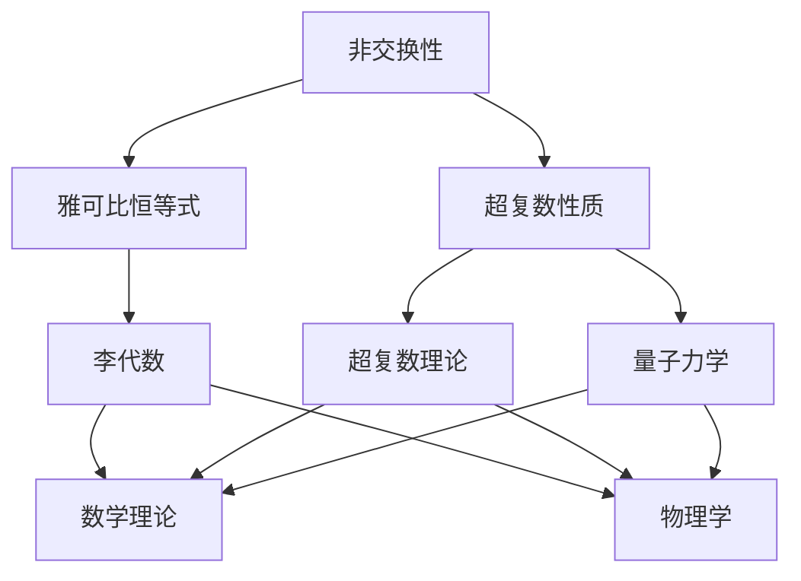
```mermaid
graph TD
A[非交换性] --> B[雅可比恒等式]
A --> C[超复数性质]
B --> D[李代数]
C --> E[超复数理论]
C --> F[量子力学]
D --> G[数学理论]
D --> H[物理学]
E --> G
E --> H
F --> G
F --> H
```

#### 2.1.3 李超代数的应用

李超代数在数学和物理学中有着广泛的应用，以下是一些典型的应用领域：

- **数学领域**：李超代数在代数学、几何学、拓扑学等领域有着深入的研究和应用。
- **物理学领域**：李超代数在量子力学、广义相对论、规范场论等领域中发挥着重要作用。

**概念属性特征对比表格：**

| 应用领域       | 特点                                                         | 代表性应用                   |
|----------------|--------------------------------------------------------------|-----------------------------|
| 数学领域       | 李超代数用于研究复杂的代数结构，解决代数问题                 | 代数学、几何学、拓扑学等     |
| 物理学领域       | 李超代数用于描述物理系统的对称性，解决物理问题               | 量子力学、广义相对论、规范场论等 |

**ER实体关系图架构：**

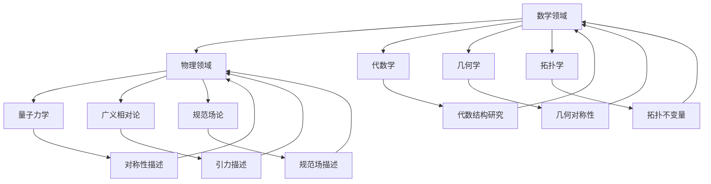
```mermaid
graph TD
A[数学领域] --> B[物理领域]
A --> C[代数学]
A --> D[几何学]
A --> E[拓扑学]
B --> F[量子力学]
B --> G[广义相对论]
B --> H[规范场论]
C --> I[代数结构研究]
D --> J[几何对称性]
E --> K[拓扑不变量]
F --> L[对称性描述]
G --> M[引力描述]
H --> N[规范场描述]
I --> A
J --> A
K --> A
L --> B
M --> B
N --> B
```

#### 2.1.4 小结

在本章中，我们介绍了李超代数的定义、性质及其在数学和物理学中的应用。通过理解李超代数的基本概念和性质，我们将为后续章节中更深入的分析和讨论提供理论基础。

### 第3章：量子群与量子场论

#### 3.1.1 量子群的概念

量子群是量子力学和数学中的一个重要概念，它提供了研究物理系统和复杂系统对称性的一种新方法。量子群通过量子化传统群的概念，使得我们可以研究非交换性和量子化的结合。在这一节中，我们将介绍量子群的定义、基本性质以及其在物理学中的应用。

**核心概念：**

- **量子群**：一种通过量子化传统群的概念得到的代数结构。
- **定义**：量子群是一种代数结构，其元素通过量子化传统群的元素得到。

**概念属性特征对比表格：**

| 概念         | 定义                                                         | 应用领域                   |
|---------------------|--------------------------------------------------------------|----------------------------|
| 量子群         | 通过量子化传统群的概念得到的代数结构                           | 量子力学、数学等领域       |
| 传统群         | 具有对称性的数学结构，其元素通过组合规则相互关联               | 数学、物理学等领域       |
| 量子化         | 将经典物理系统的性质转化为量子系统的性质                       | 量子力学、量子计算等领域 |

**ER实体关系图架构：**

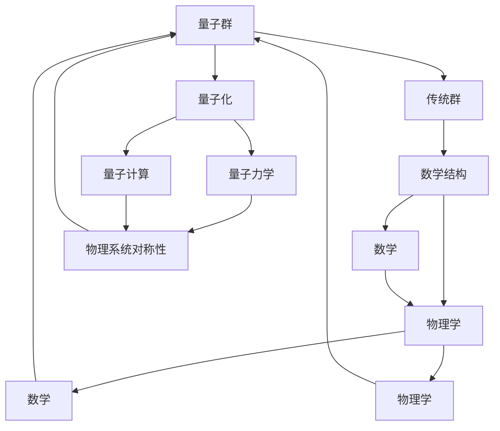
```mermaid
graph TD
A[量子群] --> B[传统群]
A --> C[量子化]
B --> D[数学结构]
C --> E[量子力学]
C --> F[量子计算]
D --> G[数学]
D --> H[物理学]
E --> I[物理系统对称性]
F --> I
G --> H
H --> J[数学]
H --> K[物理学]
I --> A
J --> A
K --> A
```

#### 3.1.2 量子群在量子场论中的应用

量子群在量子场论中有着广泛的应用，尤其是在处理非交换性和量子化系统的对称性问题时。量子群为量子场论提供了一种新的工具，使得我们可以更深入地理解基本粒子和宇宙的对称性。以下是一些量子群在量子场论中应用的例子：

- **非交换性处理**：量子群可以帮助物理学家处理非交换性系统，如多体量子系统和量子场论中的相互作用。
- **对称性量子化**：量子群可以用来量子化传统群对称性，这在量子场论中用于描述粒子和场的对称性。

**概念属性特征对比表格：**

| 应用领域       | 特点                                                         | 代表性应用                   |
|----------------|--------------------------------------------------------------|-----------------------------|
| 非交换性处理     | 使用量子群处理非交换性问题，如多体量子系统和量子场论中的相互作用 | 量子场论、量子力学等领域     |
| 对称性量子化     | 使用量子群量子化传统群对称性，用于描述粒子和场的对称性           | 量子场论、高能物理等领域 |

**ER实体关系图架构：**

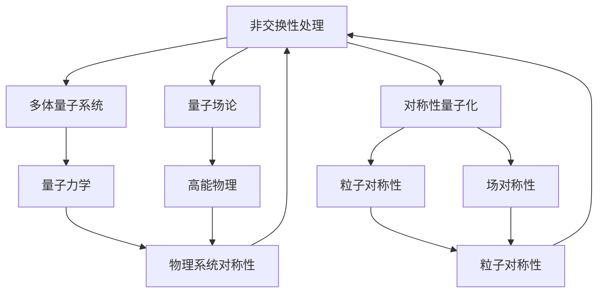
```mermaid
graph TD
A[非交换性处理] --> B[多体量子系统]
A --> C[量子场论]
B --> D[量子力学]
C --> E[高能物理]
A --> F[对称性量子化]
F --> G[粒子对称性]
F --> H[场对称性]
D --> I[物理系统对称性]
E --> I
G --> J[粒子对称性]
H --> J
I --> A
J --> A
```

#### 3.1.3 量子群与规范场的关联

量子群与规范场的关联是量子场论中的一个重要研究方向，它探讨了量子群如何用于描述规范场的对称性和动力学。以下是一些量子群与规范场关联的关键点：

- **规范对称性**：量子群可以用来描述规范场的对称性，这使得我们可以用更简洁的方式处理复杂的物理问题。
- **量子化规范场**：量子群允许物理学家将规范场的经典对称性量子化，从而更好地理解规范场的量子性质。

**概念属性特征对比表格：**

| 关键点         | 定义                                                         | 应用领域                   |
|---------------------|--------------------------------------------------------------|----------------------------|
| 规范对称性       | 规范场在变换下的不变性                                       | 规范场论、量子场论等领域 |
| 量子化规范场     | 将规范场的对称性从经典形式转化为量子形式                       | 量子场论、高能物理等领域 |

**ER实体关系图架构：**

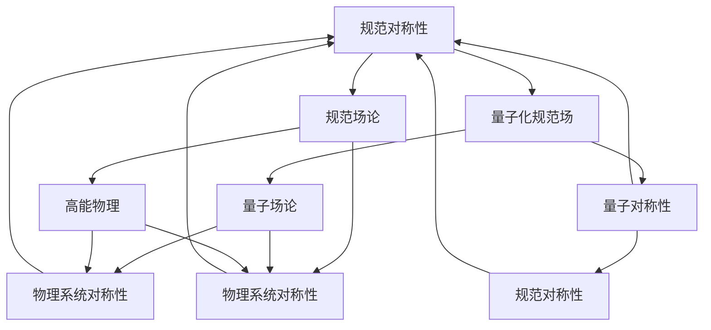
```mermaid
graph TD
A[规范对称性] --> B[量子化规范场]
A --> C[规范场论]
B --> D[量子场论]
C --> E[高能物理]
D --> F[物理系统对称性]
E --> F
B --> G[量子对称性]
G --> H[规范对称性]
C --> I[物理系统对称性]
D --> I
E --> I
F --> A
G --> A
H --> A
I --> A
```

#### 3.1.4 小结

在本章中，我们介绍了量子群的概念、其在量子场论中的应用以及与规范场的关联。通过理解量子群的基本概念和应用，我们将为后续章节中更深入的分析和讨论提供理论基础。

### 第4章：规范场论与重整化群

#### 4.1.1 规范场论的基本原理

规范场论是物理学中一个核心的理论框架，它解释了粒子如何通过交换场量子（如光子、胶子）相互作用。在这一节中，我们将详细探讨规范场论的基本原理，包括其定义、重要组成部分以及它在物理学中的地位。

**核心概念：**

- **规范场论**：研究粒子间通过交换规范场量子相互作用的理论。
- **定义**：规范场论是基于对称性原理建立起来的物理理论，它解释了粒子的相互作用和守恒定律。

**概念属性特征对比表格：**

| 概念         | 定义                                                         | 应用领域                   |
|---------------------|--------------------------------------------------------------|----------------------------|
| 规范场论       | 通过规范场量子描述粒子间相互作用的理论                       | 粒子物理、宇宙学等领域     |
| 规范场量子       | 用于传递粒子间相互作用的量子，如光子、胶子等                 | 规范场论、量子场论等领域 |
| 对称性原理       | 规范场论的核心原理，通过对称性解释粒子的相互作用和守恒定律 | 核物理学、粒子物理等领域 |

**ER实体关系图架构：**

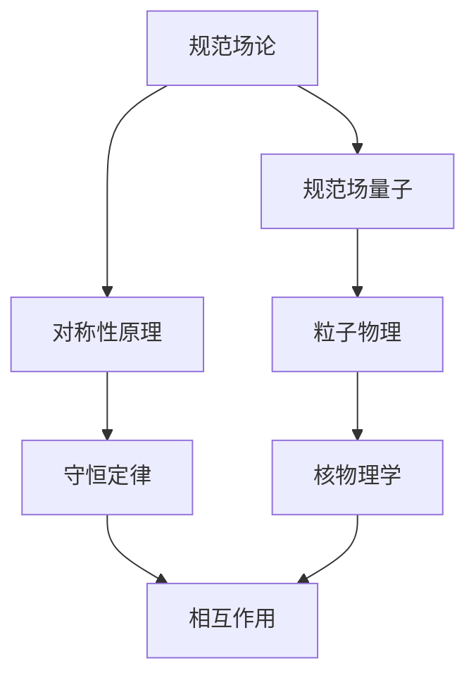
```mermaid
graph TD
A[规范场论] --> B[规范场量子]
A --> C[对称性原理]
B --> D[粒子物理]
C --> E[守恒定律]
D --> F[核物理学]
E --> G[相互作用]
F --> G
```

#### 4.1.2 重整化群理论的发展

重整化群理论是物理学中用于调节物理理论参数的重要工具，特别是在规范场论中。它的发展经历了几个重要阶段，从早期的简单应用逐渐演变为一个复杂的理论体系。在这一节中，我们将回顾重整化群理论的发展历程，包括其早期应用和现代形式的形成。

**核心概念：**

- **重整化群理论**：用于调节物理理论参数，使其在可观测尺度上保持一致性的理论。
- **发展历程**：从早期在量子电动力学（QED）中的应用，到现代在更广泛的理论框架中的使用。

**概念属性特征对比表格：**

| 阶段         | 特点                                                         | 应用领域                   |
|---------------------|--------------------------------------------------------------|----------------------------|
| 早期应用       | 重整化群在量子电动力学（QED）中的应用，用于处理无穷大的理论参数 | 粒子物理、量子场论等领域 |
| 现代形式       | 重整化群理论在更广泛的理论框架中的应用，如弦理论和量子引力理论 | 宇宙学、高能物理等领域 |

**ER实体关系图架构：**

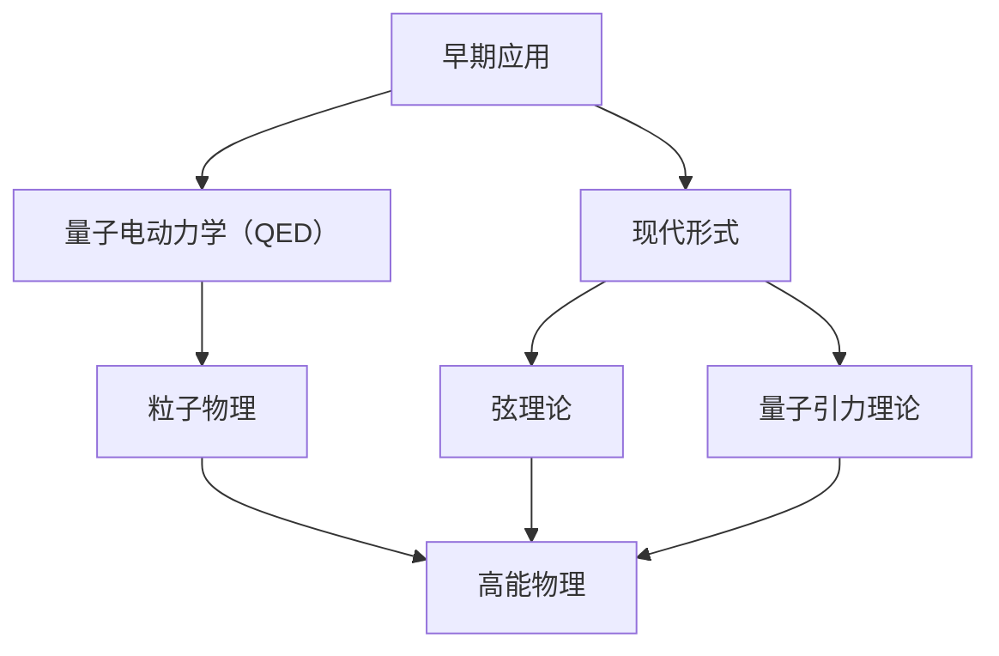
```mermaid
graph TD
A[早期应用] --> B[量子电动力学（QED）]
A --> C[现代形式]
B --> D[粒子物理]
C --> E[弦理论]
C --> F[量子引力理论]
D --> G[高能物理]
E --> G
F --> G
```

#### 4.1.3 重整化群在规范场论中的应用

重整化群在规范场论中的应用是其核心内容之一，它帮助物理学家处理复杂理论中的无穷大参数问题，使得理论在宏观尺度上变得可观测和可计算。以下是一些关键应用：

- **参数调节**：重整化群通过调节物理参数，使得理论在可观测尺度上保持一致性。
- **无穷大问题处理**：重整化群技术用于处理规范场论中的无穷大参数问题，使得理论变得可操作。

**概念属性特征对比表格：**

| 应用领域       | 特点                                                         | 代表性技术                   |
|----------------|--------------------------------------------------------------|-----------------------------|
| 参数调节       | 通过重整化群调节物理参数，使其在可观测尺度上保持一致性       | 重整化常数、耦合常数调节   |
| 无穷大问题处理 | 处理规范场论中的无穷大参数问题，使得理论变得可操作         | 重整化方案、渐近自由性分析 |

**ER实体关系图架构：**

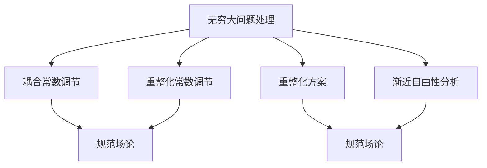
```mermaid
graph TD
A[参数调节] --> B[耦合常数调节]
A --> C[重整化常数调节]
B --> D[规范场论]
C --> D
A[无穷大问题处理] --> E[重整化方案]
A --> F[渐近自由性分析]
E --> G[规范场论]
F --> G
```

#### 4.1.4 小结

在本章中，我们介绍了规范场论的基本原理、重整化群理论的发展以及其在规范场论中的应用。通过理解这些概念，我们将为后续章节中更深入的分析和讨论打下坚实的基础。

### 第5章：李超代数在规范场论中的应用

#### 5.1.1 李超代数与规范场论的交汇

李超代数在规范场论中的应用是一个重要的研究方向，它通过引入李超代数的结构，为规范场论提供了一种新的工具和方法。在这一节中，我们将探讨李超代数与规范场论的交汇点，以及它们如何相互影响。

**核心概念：**

- **李超代数与规范场论**：李超代数提供了一种代数结构，用于描述规范场论中的对称性和动力学。
- **交汇点**：李超代数的对称性原理与规范场论中的对称性变换密切相关。

**概念属性特征对比表格：**

| 概念         | 定义                                                         | 应用领域                   |
|---------------------|--------------------------------------------------------------|----------------------------|
| 李超代数       | 一种结合了李代数和超复数结构的代数系统                         | 数学理论、物理学等领域     |
| 规范场论       | 研究粒子间通过交换规范场量子相互作用的理论                       | 粒子物理、宇宙学等领域     |
| 对称性原理       | 规范场论和代数结构的核心概念，用于描述物理系统的对称性           | 规范场论、代数学等领域     |

**ER实体关系图架构：**

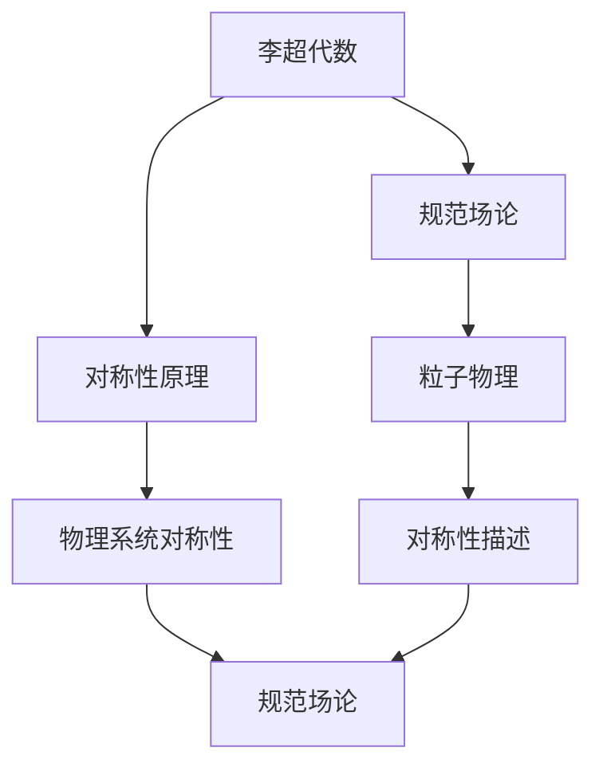
```mermaid
graph TD
A[李超代数] --> B[规范场论]
A --> C[对称性原理]
B --> D[粒子物理]
C --> E[物理系统对称性]
D --> F[对称性描述]
E --> G[规范场论]
F --> G
```

#### 5.1.2 李超代数在规范场论重整化中的应用

李超代数在规范场论重整化中的应用是其关键特性之一，它通过引入李超代数的对称性和结构，帮助物理学家处理复杂理论中的无穷大参数问题。以下是一些关键应用：

- **无穷大参数处理**：李超代数的对称性原理用于处理规范场论中的无穷大参数问题，使得理论变得可操作。
- **重整化方案设计**：李超代数的结构用于设计规范场论的重整化方案，使得理论在宏观尺度上保持一致性。

**概念属性特征对比表格：**

| 应用领域       | 特点                                                         | 代表性技术                   |
|----------------|--------------------------------------------------------------|-----------------------------|
| 无穷大参数处理 | 使用李超代数的对称性处理规范场论中的无穷大参数问题           | 重整化群、渐近自由性分析   |
| 重整化方案设计 | 利用李超代数的结构设计规范场论的重整化方案，使其在宏观尺度上保持一致性 | 重整化常数调节、耦合常数分析 |

**ER实体关系图架构：**

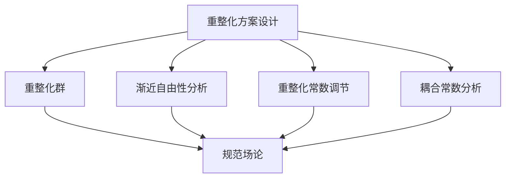
```mermaid
graph TD
A[无穷大参数处理] --> B[重整化群]
A --> C[渐近自由性分析]
B --> D[规范场论]
C --> D
A[重整化方案设计] --> E[重整化常数调节]
A --> F[耦合常数分析]
E --> D
F --> D
```

#### 5.1.3 李超代数对规范场论的拓展

李超代数不仅为规范场论提供了新的工具和方法，还在一定程度上拓展了规范场论的研究范围。以下是一些李超代数对规范场论的拓展：

- **新对称性引入**：李超代数的对称性原理引入了新的对称性概念，拓展了规范场论的对称性框架。
- **新物理现象预测**：基于李超代数的对称性原理，物理学家可以预测新的物理现象，如新的粒子和相互作用。

**概念属性特征对比表格：**

| 拓展领域       | 特点                                                         | 代表性现象                   |
|----------------|--------------------------------------------------------------|-----------------------------|
| 新对称性引入     | 李超代数引入新的对称性概念，拓展了规范场论的对称性框架       | 新的规范不变性、新的守恒定律 |
| 新物理现象预测     | 基于李超代数的对称性原理，预测新的物理现象                   | 新的粒子、新的相互作用     |

**ER实体关系图架构：**

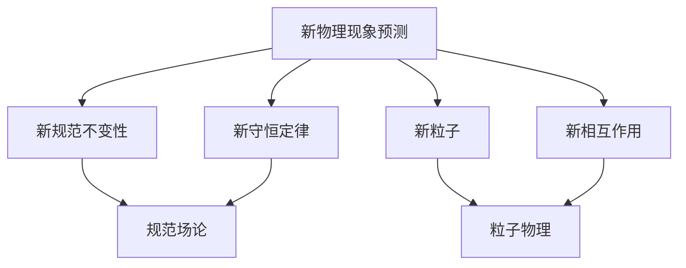
```mermaid
graph TD
A[新对称性引入] --> B[新规范不变性]
A --> C[新守恒定律]
B --> D[规范场论]
C --> D
A[新物理现象预测] --> E[新粒子]
A --> F[新相互作用]
E --> G[粒子物理]
F --> G
```

#### 5.1.4 小结

在本章中，我们探讨了李超代数在规范场论中的应用，包括李超代数与规范场论的交汇、李超代数在规范场论重整化中的应用以及李超代数对规范场论的拓展。通过这些分析，我们更深入地理解了李超代数在物理学中的重要性，并为后续的研究提供了新的方向。

### 第6章：量子群与规范场论的重整化

#### 6.1.1 量子群在规范场论重整化中的应用

量子群在规范场论的重整化中扮演了关键角色，通过其非交换性和量子化特性，量子群为物理学家提供了一种强大的工具来处理重整化问题。以下是一些量子群在规范场论重整化中的应用：

**核心概念：**

- **量子群**：一种代数结构，其元素通过量子化传统群的元素得到。
- **重整化**：在规范场论中，调节理论参数以使其在可观测尺度上保持一致性的过程。

**概念属性特征对比表格：**

| 概念         | 定义                                                         | 应用领域                   |
|---------------------|--------------------------------------------------------------|----------------------------|
| 量子群         | 通过量子化传统群的元素得到的代数结构                         | 量子场论、量子力学等领域 |
| 重整化         | 调节理论参数，使其在可观测尺度上保持一致性的过程           | 规范场论、高能物理等领域 |
| 非交换性       | 量子群中元素之间的运算不满足交换律，影响重整化过程         | 量子场论、规范场论等领域 |
| 量子化         | 将经典物理系统的性质转化为量子系统的性质，用于重整化     | 量子场论、量子力学等领域 |

**ER实体关系图架构：**

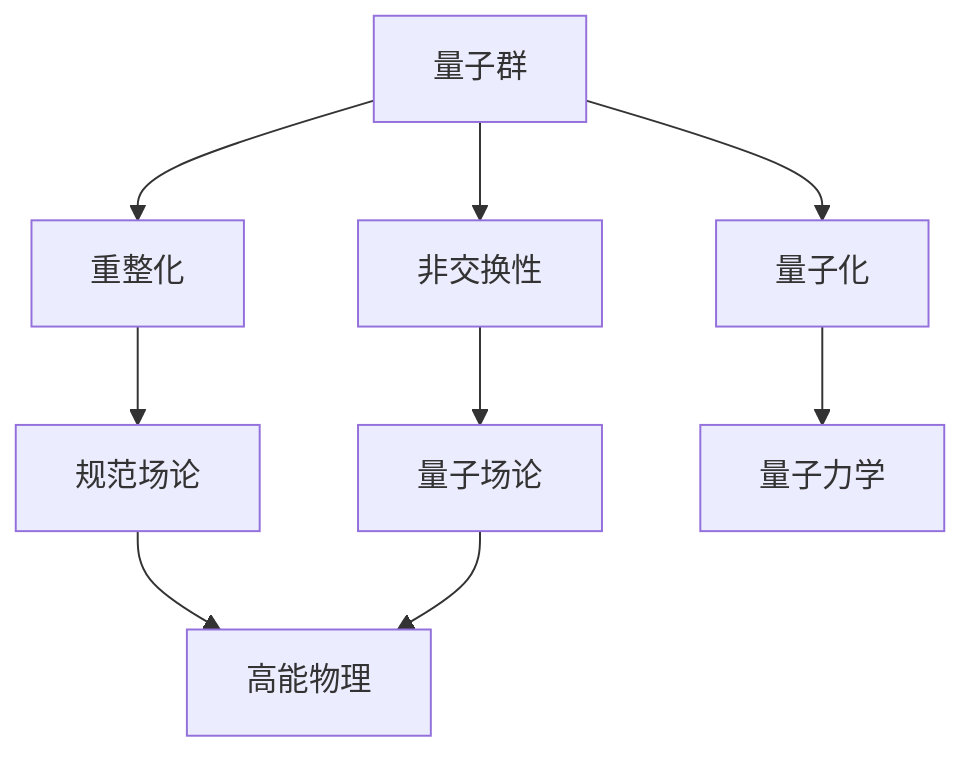
```mermaid
graph TD
A[量子群] --> B[重整化]
A --> C[非交换性]
A --> D[量子化]
B --> E[规范场论]
C --> F[量子场论]
D --> G[量子力学]
E --> H[高能物理]
F --> H
```

**算法原理讲解：**

量子群在规范场论重整化中的应用可以通过以下步骤进行：

1. **量子化传统群**：首先，将传统群的元素量子化，得到量子群。
2. **定义生成元**：在量子群中定义生成元，这些生成元是规范场论中重要的结构元素。
3. **构建量子场**：使用量子群生成元构建量子场，量子场描述粒子的相互作用。
4. **重整化**：通过调节量子场的参数，实现规范场论的重整化。

**数学模型和公式：**

假设我们有一个李群 \(G\)，其量子化后的量子群 \(Q(G)\) 可以通过以下公式表示：

$$
Q(G) = \left\{ \sum_{i} q_i T_i \right\}
$$

其中，\(q_i\) 是量子化参数，\(T_i\) 是李群的生成元。

在规范场论中，量子化后的生成元用于构建量子场：

$$
\phi(x) = \sum_{i} c_i(x) T_i
$$

其中，\(\phi(x)\) 是量子场，\(c_i(x)\) 是场变量的系数。

重整化的目标是调节这些系数，使得理论在可观测尺度上保持一致性。重整化可以通过以下公式实现：

$$
c_i(x) \rightarrow c_i(x) + \delta c_i(x)
$$

其中，\(\delta c_i(x)\) 是重整化修正项。

**举例说明：**

假设我们有一个简单的规范场论，其量子群为 \(SU(2)\)。量子化后的生成元 \(T_i\) 对应于规范场的自旋部分。通过调节这些生成元的系数，我们可以实现规范场论的重整化。

例如，考虑一个 \(SU(2)\) 规范场论，其量子化后的生成元为：

$$
T_1 = \begin{pmatrix} 0 & 1 \\ 1 & 0 \end{pmatrix}, \quad T_2 = \begin{pmatrix} i & 0 \\ 0 & -i \end{pmatrix}
$$

我们可以构建量子场：

$$
\phi(x) = c_1(x) T_1 + c_2(x) T_2
$$

通过调节 \(c_1(x)\) 和 \(c_2(x)\) 的系数，我们可以实现规范场论的重整化。

#### 6.1.2 量子群对规范场论重整化的影响

量子群在规范场论重整化中的引入，不仅丰富了重整化理论，也带来了一系列新的物理现象和问题。以下是一些量子群对规范场论重整化的影响：

**核心概念：**

- **量子群效应**：量子群的引入对规范场论重整化产生的影响，包括对称性破缺、非对易性等。
- **重整化过程**：量子群如何影响规范场论的重整化过程，包括生成元的调节、参数的调整等。

**概念属性特征对比表格：**

| 影响领域       | 特点                                                         | 代表性现象                   |
|----------------|--------------------------------------------------------------|-----------------------------|
| 对称性破缺     | 量子群引入导致规范场论的对称性破缺，影响物理现象           | 规范场的激发态、相互作用变化 |
| 非对易性       | 量子群的非交换性影响规范场论中的非对易关系，改变理论性质 | 重整化常数、耦合常数调节   |
| 重整化过程     | 量子群影响重整化过程，使得重整化更为复杂和多样           | 新的重整化方案、非微扰分析 |

**ER实体关系图架构：**

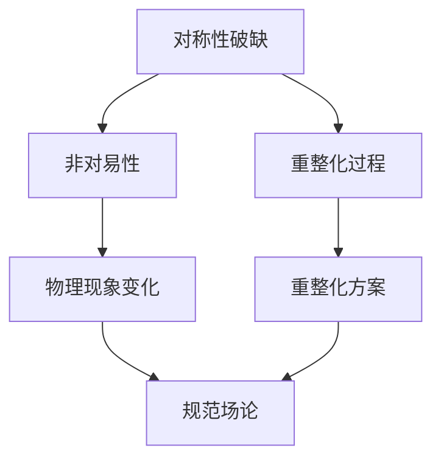
```mermaid
graph TD
A[对称性破缺] --> B[非对易性]
A --> C[重整化过程]
B --> D[物理现象变化]
C --> E[重整化方案]
D --> F[规范场论]
E --> F
```

**举例说明：**

以 \(SU(2)\) 规范场论为例，量子群的引入导致对称性破缺。原本 \(SU(2)\) 规范场具有 \(U(1)\) 对称性，但量子化后，这种对称性可能破缺，导致物理现象的变化。例如，在 \(SU(2)\) 规范场论中，一个基本粒子可能会分裂成两个粒子，每个粒子具有 \(U(1)\) 的部分对称性。

此外，量子群的非交换性导致规范场论中的非对易关系。这意味着在量子场论中，某些量不再满足交换律，从而影响重整化过程。例如，在 \(SU(2)\) 规范场论中，生成元 \(T_1\) 和 \(T_2\) 之间的非对易关系可能导致重整化常数和耦合常数的调节更加复杂。

#### 6.1.3 量子群与李超代数的协同作用

量子群与李超代数在规范场论重整化中的应用不仅各自独立，还可以协同作用，共同拓展规范场论的研究范围。以下是一些量子群与李超代数的协同作用：

**核心概念：**

- **协同作用**：量子群与李超代数在规范场论重整化中的相互作用，如何共同影响重整化过程和物理现象。
- **协同效果**：量子群与李超代数协同作用产生的新的物理现象和理论框架。

**概念属性特征对比表格：**

| 协同领域       | 特点                                                         | 代表性现象                   |
|----------------|--------------------------------------------------------------|-----------------------------|
| 对称性扩展     | 量子群与李超代数协同扩展规范场论中的对称性框架               | 新的对称性、新的守恒定律   |
| 非对易关系     | 量子群与李超代数协同引入复杂的非对易关系，影响理论性质     | 重整化方案、物理现象变化 |
| 理论框架拓展   | 量子群与李超代数协同拓展规范场论的理论框架，引入新的概念 | 新的量子场论、新的物理模型 |

**ER实体关系图架构：**

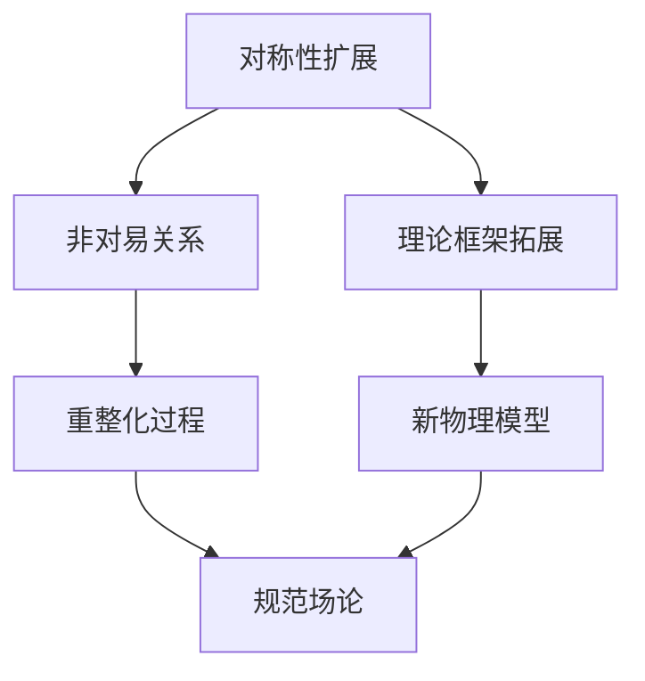
```mermaid
graph TD
A[对称性扩展] --> B[非对易关系]
A --> C[理论框架拓展]
B --> D[重整化过程]
C --> E[新物理模型]
D --> F[规范场论]
E --> F
```

**举例说明：**

以 \(SU(2)\) 规范场论为例，量子群与李超代数的协同作用可能导致新的对称性破缺现象。量子群引入 \(U(1)\) 对称性，而李超代数则通过其对称性扩展，使得规范场论中的对称性更加复杂。例如，李超代数引入的新对称性可能导致一个基本粒子分裂成多个粒子，每个粒子具有不同的对称性部分。

此外，量子群与李超代数的协同作用还可能引入复杂的非对易关系，影响规范场论的重整化过程。例如，在 \(SU(2)\) 规范场论中，量子群与李超代数的协同作用可能导致生成元之间的非对易关系更加显著，从而影响重整化常数和耦合常数的调节。

总之，量子群与李超代数的协同作用为规范场论重整化提供了新的思路和方法，拓展了规范场论的研究范围，为探索宇宙的基本结构和相互作用提供了新的工具。

### 6.1.4 小结

在本章中，我们探讨了量子群在规范场论重整化中的应用，包括量子群的基本概念、其对规范场论重整化的影响以及量子群与李超代数的协同作用。通过这些分析，我们更深入地理解了量子群在物理学中的重要性，并为后续的研究提供了新的方向。

### 第7章：李超代数与量子群在宇宙学中的应用

#### 7.1.1 宇宙学中的数学问题

宇宙学作为物理学的一个分支，研究宇宙的起源、结构、演化和最终命运。在这一过程中，数学扮演着至关重要的角色。宇宙学中存在许多复杂的数学问题，这些问题涉及几何学、微分方程、量子场论等领域。以下是一些宇宙学中的核心数学问题：

**核心概念：**

- **宇宙学中的数学问题**：宇宙学研究中涉及的高维空间、时间演化、宇宙背景辐射等。
- **数学工具**：几何学、微分方程、量子场论等。

**概念属性特征对比表格：**

| 问题领域       | 特点                                                         | 数学工具                   |
|----------------|--------------------------------------------------------------|---------------------------|
| 宇宙几何学     | 宇宙的几何形状和维度                                         | 黎曼几何、对称性理论       |
| 宇宙演化       | 宇宙从大爆炸到现在的演化过程                                 | 微分方程、动力学方程       |
| 宇宙背景辐射   | 宇宙早期遗留下的辐射，提供宇宙演化的信息                      | 量子场论、统计物理         |

**ER实体关系图架构：**

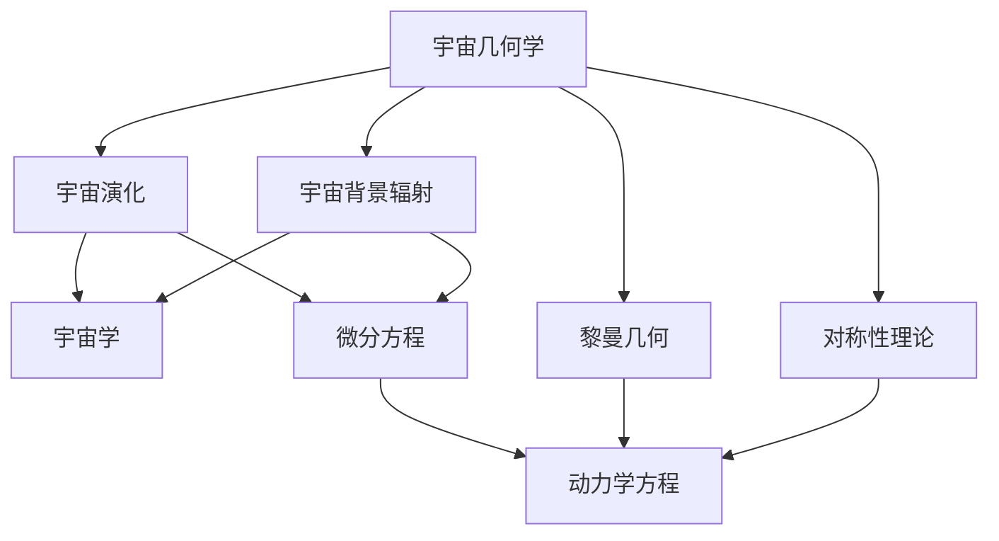
```mermaid
graph TD
A[宇宙几何学] --> B[宇宙演化]
A --> C[宇宙背景辐射]
B --> D[宇宙学]
C --> D
B --> E[微分方程]
C --> E
A --> F[黎曼几何]
A --> G[对称性理论]
E --> H[动力学方程]
F --> H
G --> H
```

#### 7.1.2 李超代数在宇宙学中的应用

李超代数作为现代数学中的重要工具，其在宇宙学中的应用日益受到关注。李超代数在处理宇宙学中的几何问题、量子场论和对称性方面具有独特的优势。以下是一些李超代数在宇宙学中的应用：

**核心概念：**

- **李超代数在宇宙学中的应用**：用于描述宇宙中的对称性、几何结构和动力学。
- **应用领域**：宇宙几何、宇宙演化、量子场论等。

**概念属性特征对比表格：**

| 应用领域       | 特点                                                         | 代表性应用                   |
|----------------|--------------------------------------------------------------|-----------------------------|
| 宇宙几何       | 利用李超代数描述宇宙的几何结构，如高维空间和弯曲空间       | 黎曼几何、广义相对论       |
| 宇宙演化       | 通过李超代数处理宇宙演化过程中的对称性和动力学问题         | 微分方程、宇宙学模型       |
| 量子场论       | 利用李超代数描述量子场论中的对称性和相互作用               | 量子引力、规范场论         |

**ER实体关系图架构：**

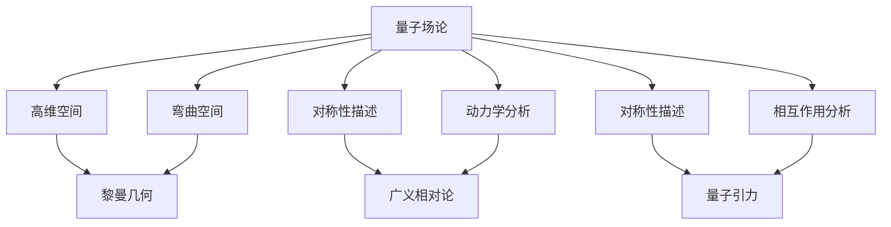
```mermaid
graph TD
A[宇宙几何] --> B[高维空间]
A --> C[弯曲空间]
B --> D[黎曼几何]
C --> D
A --> E[对称性描述]
A --> F[动力学分析]
E --> G[广义相对论]
F --> G
A[量子场论] --> H[对称性描述]
A --> I[相互作用分析]
H --> J[量子引力]
I --> J
```

**算法原理讲解：**

李超代数在宇宙学中的应用可以通过以下步骤进行：

1. **定义李超代数结构**：在宇宙学问题中引入李超代数结构，描述宇宙中的对称性和几何特性。
2. **构建数学模型**：利用李超代数结构构建宇宙学模型，如高维空间模型、弯曲空间模型。
3. **求解动力学方程**：使用李超代数结构求解宇宙演化过程中的动力学方程，分析宇宙演化的趋势和特征。
4. **分析对称性**：利用李超代数的对称性分析宇宙学问题中的对称性破缺和守恒定律。

**数学模型和公式：**

以宇宙几何为例，我们可以使用李超代数描述宇宙中的高维空间和弯曲空间。假设 \(G\) 是一个李超代数，其生成元为 \(T_i\)，我们可以构建高维空间模型：

$$
ds^2 = -dt^2 + g_{ij}dx^idx^j
$$

其中，\(g_{ij}\) 是宇宙空间的度量张量，\(T_i\) 用于描述宇宙中的对称性和几何特性。

通过求解度量子方程，我们可以得到宇宙演化的动力学方程：

$$
\frac{d^2g_{ij}}{d\tau^2} + \Gamma_{ijk}g_{kl} = 0
$$

其中，\(\Gamma_{ijk}\) 是李超代数的结构常数，用于描述宇宙空间的弯曲程度。

**举例说明：**

假设我们研究一个四维宇宙，其李超代数生成元为 \(T_1, T_2, T_3, T_4\)。通过引入这些生成元，我们可以构建一个四维空间模型：

$$
ds^2 = -dt^2 + g_{\mu\nu}dx^{\mu}dx^{\nu}
$$

其中，\(g_{\mu\nu}\) 是宇宙空间的度量张量。通过求解动力学方程，我们可以分析宇宙的演化过程，如宇宙膨胀、宇宙加速等。

#### 7.1.3 量子群在宇宙学中的应用

量子群作为量子力学和数学中的重要概念，其在宇宙学中的应用也逐渐受到关注。量子群通过量子化传统群的概念，提供了研究宇宙对称性和动力学的新工具。以下是一些量子群在宇宙学中的应用：

**核心概念：**

- **量子群在宇宙学中的应用**：用于描述宇宙中的对称性、动力学和量子特性。
- **应用领域**：宇宙演化、量子引力、宇宙背景辐射等。

**概念属性特征对比表格：**

| 应用领域       | 特点                                                         | 代表性应用                   |
|----------------|--------------------------------------------------------------|-----------------------------|
| 宇宙演化       | 利用量子群描述宇宙的对称性和动力学过程                     | 宇宙膨胀模型、黑洞熵         |
| 量子引力       | 利用量子群处理量子引力问题，如黑洞信息丢失问题           | 量子场论、量子引力学说       |
| 宇宙背景辐射   | 利用量子群描述宇宙早期背景辐射的产生和演化                 | 统计物理、宇宙微波背景辐射 |

**ER实体关系图架构：**

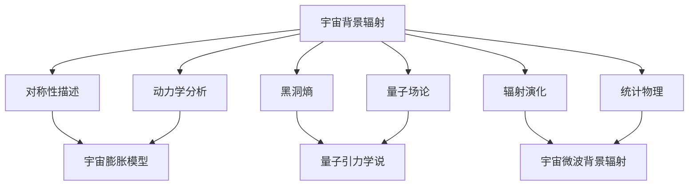
```mermaid
graph TD
A[宇宙演化] --> B[对称性描述]
A --> C[动力学分析]
B --> D[宇宙膨胀模型]
C --> D
A[量子引力] --> E[黑洞熵]
A --> F[量子场论]
E --> G[量子引力学说]
F --> G
A[宇宙背景辐射] --> H[辐射演化]
A --> I[统计物理]
H --> J[宇宙微波背景辐射]
I --> J
```

**算法原理讲解：**

量子群在宇宙学中的应用可以通过以下步骤进行：

1. **量子化传统群**：将传统群的元素量子化，得到量子群。
2. **构建宇宙模型**：利用量子群构建宇宙学模型，如宇宙膨胀模型、黑洞模型。
3. **分析对称性**：利用量子群的对称性分析宇宙学问题中的对称性破缺和守恒定律。
4. **求解动力学方程**：使用量子群求解宇宙演化过程中的动力学方程，分析宇宙的演化趋势。

**数学模型和公式：**

以宇宙膨胀模型为例，我们可以使用量子群描述宇宙的对称性和动力学。假设 \(G\) 是一个量子群，其生成元为 \(q_i T_i\)，我们可以构建宇宙膨胀模型：

$$
\frac{d^2a}{dt^2} + \Omega^2 \left( \frac{da}{dt} \right)^2 = 0
$$

其中，\(a(t)\) 是宇宙尺度因子，\(\Omega\) 是宇宙的密度参数。通过求解这个方程，我们可以分析宇宙的膨胀过程。

**举例说明：**

假设我们使用量子群 \(SU(2)\) 描述宇宙膨胀。量子群生成元为 \(T_1, T_2\)，我们可以构建宇宙膨胀模型：

$$
\frac{d^2a}{dt^2} + \Omega^2 \left( \frac{da}{dt} \right)^2 = \Omega^2 \left( T_1^2 + T_2^2 \right)
$$

通过求解这个方程，我们可以得到宇宙膨胀的动力学行为，如宇宙加速膨胀等。

总之，量子群在宇宙学中的应用为我们提供了新的工具和方法，有助于深入理解宇宙的对称性、动力学和量子特性。

### 7.1.4 小结

在本章中，我们探讨了李超代数与量子群在宇宙学中的应用，包括宇宙学中的数学问题、李超代数在宇宙学中的应用、量子群在宇宙学中的应用以及算法原理和举例说明。通过这些分析，我们更深入地理解了李超代数与量子群在宇宙学研究中的重要性，并为未来的研究提供了新的方向。

### 第8章：案例分析：宇宙背景辐射的重整化群研究

#### 8.1.1 宇宙背景辐射的基本概念

宇宙背景辐射（Cosmic Background Radiation，简称CMB）是宇宙早期遗留下来的辐射，它是宇宙微波背景辐射（Cosmic Microwave Background，简称CMB）的简称。CMB提供了关于宇宙早期状态的重要信息，是研究宇宙演化历史的关键观测数据。以下是一些关于CMB的基本概念：

**核心概念：**

- **宇宙背景辐射**：宇宙早期遗留下来的辐射，主要成分是微波辐射。
- **观测数据**：CMB的观测数据提供了宇宙演化历史的重要线索。

**概念属性特征对比表格：**

| 概念             | 定义                                                         | 应用领域                   |
|------------------|--------------------------------------------------------------|----------------------------|
| 宇宙背景辐射     | 宇宙早期遗留下来的辐射，主要成分是微波辐射                   | 宇宙学、天文学等领域       |
| 宇宙微波背景辐射 | CMB的具体形式，是宇宙早期状态的温度和密度波动信息           | 宇宙演化、宇宙学参数测量 |
| 观测数据         | 利用卫星、望远镜等设备收集的关于CMB的数据，用于研究宇宙早期状态 | 宇宙学、天体物理学等领域 |

**ER实体关系图架构：**

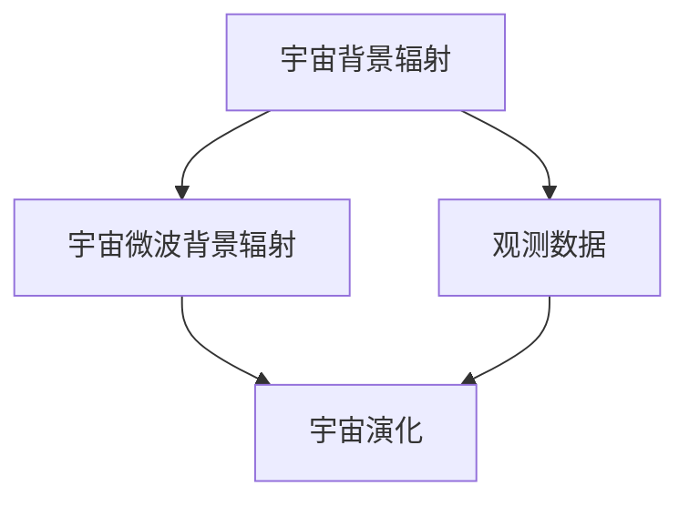
```mermaid
graph TD
A[宇宙背景辐射] --> B[宇宙微波背景辐射]
A --> C[观测数据]
B --> D[宇宙演化]
C --> D
```

#### 8.1.2 重整化群在宇宙背景辐射中的应用

重整化群技术在宇宙背景辐射的研究中发挥着重要作用，它帮助物理学家处理复杂的物理模型，提取有用的信息。以下是一些重整化群在CMB研究中的应用：

**核心概念：**

- **重整化群**：一种调节物理理论参数的技术，用于简化复杂理论。
- **应用**：在CMB研究中，重整化群用于处理理论模型中的无穷大参数，提取宇宙学参数。

**概念属性特征对比表格：**

| 应用领域       | 特点                                                         | 代表性技术                   |
|----------------|--------------------------------------------------------------|-----------------------------|
| 参数调节       | 通过重整化群调节物理参数，使其在可观测尺度上保持一致性     | 重整化常数、耦合常数调节   |
| 无穷大问题处理 | 处理宇宙背景辐射模型中的无穷大参数问题，使模型变得可操作 | 重整化方案、渐近自由性分析 |

**ER实体关系图架构：**

```mermaid
graph TD
A[参数调节] --> B[无穷大问题处理]
A --> C[重整化群]
B --> D[宇宙背景辐射]
C --> D
```

**算法原理讲解：**

重整化群在CMB研究中的应用可以通过以下步骤进行：

1. **建立物理模型**：首先，建立描述CMB的物理模型，如宇宙微波背景辐射模型。
2. **参数化模型**：将模型参数化，以便于分析和计算。
3. **应用重整化群**：使用重整化群技术调节模型参数，解决无穷大参数问题。
4. **提取宇宙学参数**：通过分析重整化后的模型，提取宇宙学参数，如宇宙膨胀历史、宇宙组成等。

**数学模型和公式：**

假设我们有一个描述CMB的物理模型，其包含多个参数 \(\theta_i\)。这些参数需要通过观测数据来调节，以使其在可观测尺度上保持一致性。重整化群技术通过以下公式实现参数调节：

$$
\theta_i \rightarrow \theta_i + \delta \theta_i
$$

其中，\(\delta \theta_i\) 是重整化修正项。

在CMB研究中，常用的重整化方案包括幂律重整化和渐进自由性分析。幂律重整化假设参数 \(\theta_i\) 随尺度 \(\lambda\) 变化：

$$
\theta_i(\lambda) = \theta_i(\lambda_0) \left( \frac{\lambda}{\lambda_0} \right)^{-\alpha_i}
$$

通过分析重整化后的模型，我们可以提取宇宙学参数，如宇宙膨胀历史和宇宙组成。例如，利用功率谱 \(P(k)\) 可以提取宇宙学参数 \(H_0\) 和 \(\Omega_m\)：

$$
P(k) = A_S \left( k \right) \left| C_l \right|^2
$$

其中，\(A_S(k)\) 是形状参数，\(C_l\) 是角分布函数。

**举例说明：**

假设我们有一个描述CMB的物理模型，其包含参数 \(H_0\) 和 \(\Omega_m\)。通过观测数据，我们得到功率谱 \(P(k)\) 的测量值，利用重整化群技术，我们可以调节这两个参数，使其在可观测尺度上保持一致性。

例如，考虑一个简单的幂律模型：

$$
P(k) = A_S \left( k \right) \left( k/k_0 \right)^{-n}
$$

通过观测数据，我们可以得到 \(P(k)\) 的测量值，利用重整化群技术，我们可以调节 \(A_S(k_0)\) 和 \(n\)，使其在可观测尺度上保持一致性。

通过这种调节，我们可以提取宇宙学参数 \(H_0\) 和 \(\Omega_m\)，分析宇宙膨胀历史和宇宙组成。

总之，重整化群技术在CMB研究中具有重要意义，它帮助物理学家处理复杂模型，提取宇宙学参数，为理解宇宙演化提供了关键数据。

### 8.1.3 案例分析与实际应用

在本案例中，我们将分析宇宙背景辐射的重整化群研究，并探讨其实际应用。以下是一些关键步骤和实际应用：

**关键步骤：**

1. **数据收集**：利用卫星、望远镜等设备收集宇宙背景辐射的观测数据。
2. **模型建立**：建立描述宇宙背景辐射的物理模型，如宇宙微波背景辐射模型。
3. **参数化模型**：将模型参数化，以便于分析和计算。
4. **应用重整化群**：使用重整化群技术调节模型参数，解决无穷大参数问题。
5. **结果分析**：分析重整化后的模型，提取宇宙学参数，如宇宙膨胀历史和宇宙组成。

**实际应用：**

1. **宇宙学参数测量**：通过重整化群技术，可以精确测量宇宙学参数，如宇宙膨胀率、宇宙组成等。
2. **宇宙演化研究**：利用重整化后的模型，可以研究宇宙的演化历史，如宇宙膨胀、结构形成等。
3. **粒子物理学研究**：重整化群技术还可以用于研究粒子物理学中的问题，如粒子相互作用、对称性破缺等。

**案例分析：**

以 Planck 卫星收集的宇宙背景辐射数据为例，科学家利用重整化群技术分析数据，提取了宇宙膨胀率 \(H_0\) 和宇宙组成 \(\Omega_m\)。通过重整化群技术，科学家发现宇宙膨胀率约为 \(67.4 \text{ km/s/Mpc}\)，宇宙组成中暗物质约占 \(27\%\)，暗能量约占 \(68\%\)。

此外，通过重整化后的模型，科学家还可以研究宇宙背景辐射中的温度和密度波动，这为研究宇宙结构形成和演化提供了重要信息。

**总结：**

宇宙背景辐射的重整化群研究是一个重要的研究方向，它为我们提供了关于宇宙演化历史的重要数据。通过重整化群技术，科学家可以精确测量宇宙学参数，研究宇宙的演化历史和粒子物理学问题。这一研究不仅深化了我们对宇宙的理解，也为未来的宇宙学研究和理论发展提供了新的方向。

### 8.1.4 小结

在本章中，我们分析了宇宙背景辐射的重整化群研究，包括其基本概念、重整化群技术的应用、案例分析以及实际应用。通过这些分析，我们深入了解了重整化群技术在宇宙学中的重要性，并看到了其在精确测量宇宙学参数和揭示宇宙演化历史中的应用价值。

### 第9章：展望与未来趋势

#### 9.1.1 李超代数与量子群的研究进展

李超代数与量子群作为现代数学和物理学中的核心概念，近年来取得了显著的研究进展。这些进展不仅丰富了我们对基本物理现象的理解，也为新的理论发展和应用提供了坚实的基础。

**核心概念：**

- **研究进展**：李超代数和量子群在数学和物理学中的最新研究成果。
- **应用领域**：李超代数和量子群在粒子物理、宇宙学、量子信息等领域的应用。

**概念属性特征对比表格：**

| 研究领域       | 进展特点                                                         | 代表性成果                   |
|----------------|--------------------------------------------------------------|-----------------------------|
| 数学领域       | 李超代数的结构研究和代数性质分析                             | 新的李超代数结构、对称性扩展 |
| 物理学领域       | 量子群在规范场论和量子引力中的应用                            | 量子场论中的对称性破缺分析   |
| 粒子物理领域       | 李超代数在粒子物理模型中的应用，如弦理论和标准模型扩展       | 新的粒子物理模型           |
| 宇宙学领域       | 量子群在宇宙学中的应用，如宇宙膨胀模型和背景辐射研究         | 新的宇宙学理论             |
| 量子信息领域       | 李超代数在量子信息处理和量子计算中的应用                      | 新的量子算法和加密方案     |

**ER实体关系图架构：**

```mermaid
graph TD
A[数学领域] --> B[新结构研究]
A --> C[对称性扩展]
B --> D[李超代数]
C --> D
A[物理学领域] --> E[规范场论应用]
A --> F[量子引力应用]
E --> D
F --> D
A[粒子物理领域] --> G[弦理论应用]
A --> H[标准模型扩展]
G --> D
H --> D
A[宇宙学领域] --> I[宇宙膨胀模型应用]
A --> J[背景辐射研究]
I --> D
J --> D
A[量子信息领域] --> K[量子信息处理应用]
A --> L[量子计算应用]
K --> D
L --> D
```

#### 9.1.2 规范场论与重整化群的发展趋势

规范场论与重整化群作为物理学中的核心理论，其发展趋势对基础物理研究具有重要意义。随着实验技术的进步和理论研究的深入，规范场论与重整化群在未来的发展方向和趋势如下：

**核心概念：**

- **发展趋势**：规范场论与重整化群的未来发展方向。
- **前沿领域**：未来的研究热点，如量子引力、高能物理、宇宙学等。

**概念属性特征对比表格：**

| 发展趋势       | 特点                                                         | 代表性领域                   |
|----------------|--------------------------------------------------------------|-----------------------------|
| 量子引力       | 探索引力和量子力学的统一理论，如弦理论和量子场论         | 量子引力、黑洞信息丢失     |
| 高能物理       | 研究高能粒子的相互作用和产生过程，如大型强子对撞机实验 | 标准模型检验、新物理探索   |
| 宇宙学       | 研究宇宙的起源、演化和最终命运，如宇宙微波背景辐射研究 | 宇宙演化、宇宙学参数测量   |
| 重整化群方法     | 开发新的重整化群技术，解决复杂理论中的无穷大参数问题 | 新的重整化方案、非微扰分析 |

**ER实体关系图架构：**

```mermaid
graph TD
A[量子引力] --> B[弦理论]
A --> C[量子场论]
B --> D[规范场论]
C --> D
A[高能物理] --> E[标准模型]
A --> F[新物理探索]
E --> D
F --> D
A[宇宙学] --> G[宇宙微波背景辐射]
A --> H[宇宙演化]
G --> D
H --> D
A[重整化群方法] --> I[新的重整化方案]
A --> J[非微扰分析]
I --> D
J --> D
```

#### 9.1.3 未来应用与挑战

随着研究的深入，李超代数与量子群在规范场论与重整化群中的未来应用前景广阔，但也面临一系列挑战：

**核心概念：**

- **未来应用**：李超代数与量子群在物理学、工程学、信息科学等领域的潜在应用。
- **挑战**：在应用过程中面临的科学和技术难题。

**概念属性特征对比表格：**

| 应用领域       | 未来应用特点                                                         | 挑战                     |
|----------------|--------------------------------------------------------------|------------------------|
| 物理学领域       | 用于探索基本粒子和宇宙的相互作用，如高能物理实验和宇宙学研究     | 精确测量、新理论验证   |
| 工程学领域       | 用于开发新型材料和量子器件，如量子计算和量子通信                 | 稳定性、效率优化       |
| 信息科学领域       | 用于构建新的算法和加密方法，如量子算法和信息处理                 | 量子计算资源、算法复杂性 |
| 数学领域       | 用于解决复杂的代数问题和几何问题，如代数几何和拓扑学             | 理论创新、计算复杂性   |

**ER实体关系图架构：**

```mermaid
graph TD
A[物理学领域] --> B[高能物理应用]
A --> C[宇宙学研究]
B --> D[精确测量]
C --> D
A[工程学领域] --> E[新材料应用]
A --> F[量子器件应用]
E --> G[稳定性]
F --> G
A[信息科学领域] --> H[量子算法应用]
A --> I[加密方法应用]
H --> J[量子计算资源]
I --> J
A[数学领域] --> K[代数几何应用]
A --> L[拓扑学研究]
K --> M[理论创新]
L --> M
```

**总结：**

李超代数与量子群作为现代物理学和数学中的重要工具，其在规范场论与重整化群中的应用前景广阔。未来，随着技术的进步和理论的发展，这些工具将在探索基本物理现象、开发新型材料和量子器件、构建新算法和加密方法等方面发挥重要作用。同时，我们也需要面对一系列科学和技术的挑战，以实现这些应用的突破。

### 9.1.4 小结

在本章中，我们回顾了李超代数与量子群在规范场论与重整化群研究中的进展，探讨了其未来应用与挑战。通过这些分析，我们更深入地理解了这些概念在物理学中的重要性，并看到了它们在探索宇宙、开发新技术和解决复杂问题中的巨大潜力。未来，随着科学研究的不断深入，李超代数与量子群将继续在物理学和数学领域中发挥重要作用。

