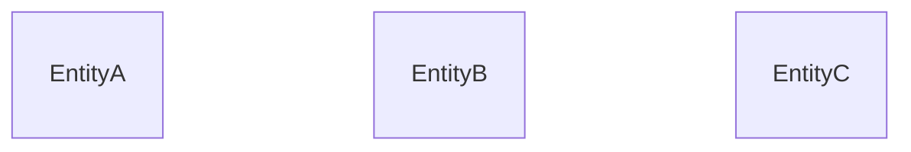
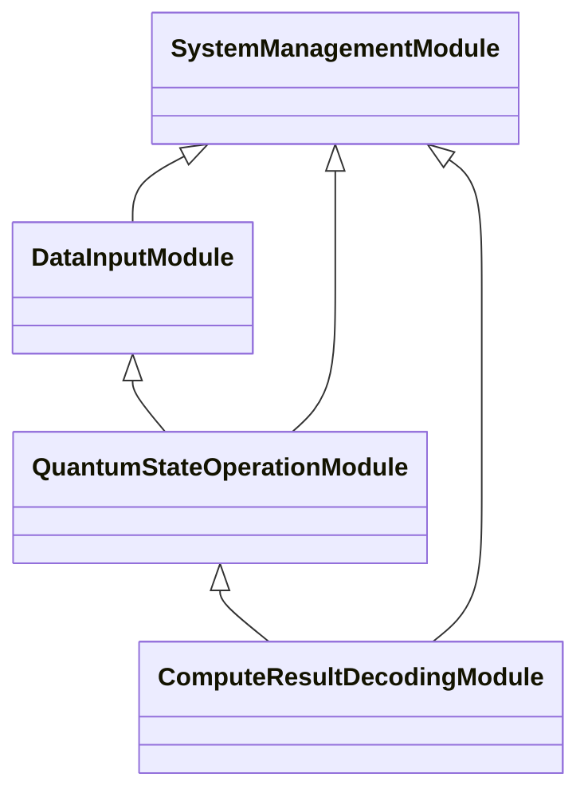
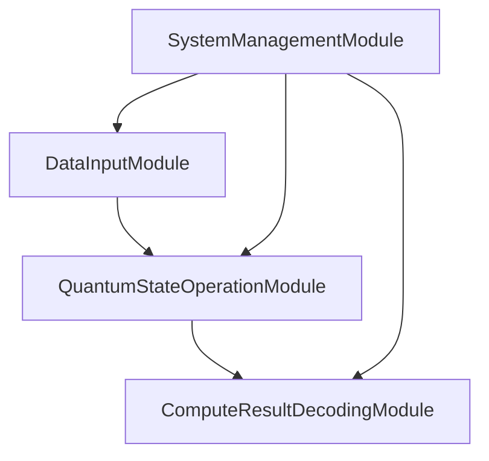
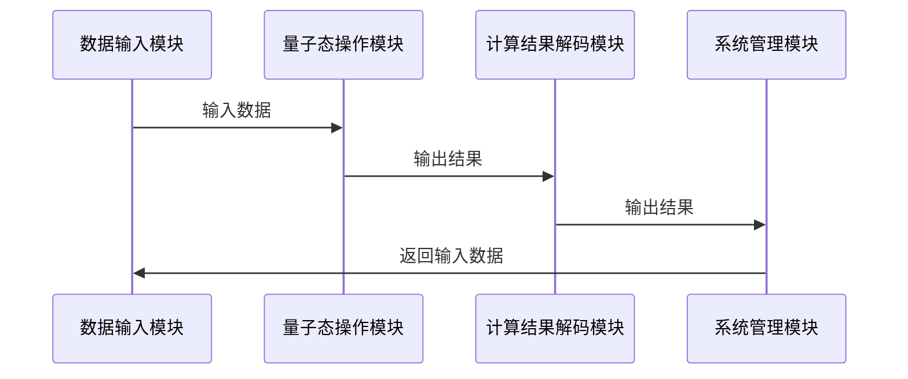

                 

### 宇宙的数学格论与序理论在拓扑量子计算中的应用

**关键词：** 宇宙的数学格论、序理论、拓扑量子计算、数学模型、系统架构、算法实现、实践应用

**摘要：** 本文旨在探讨宇宙的数学格论和序理论在拓扑量子计算中的应用。首先，我们将介绍宇宙的数学格论和序理论的基本概念及其在数学领域的重要性。接着，本文将详细探讨拓扑量子计算的理论基础，并阐述如何利用数学格论和序理论来构建拓扑量子计算的数学模型。随后，我们将分析如何设计一个有效的拓扑量子计算系统，并展示其实际应用案例。通过本文的探讨，我们希望能够为读者提供对拓扑量子计算及其应用的新视角，并激发进一步的学术研究和探索。

**背景介绍**

宇宙的数学格论与序理论在数学领域具有重要地位。数学格论（Order Theory）研究的是数学中各种形式的序关系，如全序、偏序、格等。它为研究集合上的序关系提供了一个统一的框架，对理解集合的性质和关系具有重要意义。序理论不仅广泛应用于集合论、代数结构、图论等领域，还在计算机科学、逻辑学和物理学等领域有着广泛的应用。

另一方面，宇宙的数学格论与序理论在拓扑量子计算中也有着广泛的应用。拓扑量子计算是一种基于量子位（qubit）的计算模式，利用量子位的纠缠和量子叠加特性来进行计算。拓扑量子计算的一个关键挑战是如何有效地进行量子态的编码和操作。宇宙的数学格论与序理论为解决这一挑战提供了一种新的思路。通过引入数学格论和序理论的概念，可以构建一个更加高效的量子计算模型，从而实现更快速、更可靠的量子计算。

在本文中，我们将详细探讨宇宙的数学格论和序理论在拓扑量子计算中的应用。首先，我们将介绍宇宙的数学格论和序理论的基本概念，并探讨它们在数学领域的应用。接着，我们将深入讨论拓扑量子计算的理论基础，并阐述如何利用数学格论和序理论来构建拓扑量子计算的数学模型。随后，我们将分析如何设计一个有效的拓扑量子计算系统，包括系统架构、接口设计和系统交互。最后，我们将通过一个实际案例来展示拓扑量子计算的应用，并总结本文的主要内容和结论。

**核心概念与联系**

### 数学格论的基本原理

数学格论研究的是集合上的序关系。一个基本的格是由一组元素组成的集合，这些元素之间满足两个条件：交换律和吸收律。具体来说，一个格满足以下性质：

1. **交换律**：对于任意两个元素 \(a\) 和 \(b\)，有 \(a \wedge b = b \wedge a\) 和 \(a \vee b = b \vee a\)。
2. **吸收律**：对于任意两个元素 \(a\) 和 \(b\)，有 \(a \wedge (a \vee b) = a\) 和 \(a \vee (a \wedge b) = a\)。

数学格论的一个重要特性是它为研究集合上的序关系提供了一个统一的框架。通过引入格的概念，我们可以将不同类型的序关系抽象成一个更加通用的模型，从而简化对序关系的分析和理解。

### 序理论的关键特性

序理论主要研究的是序关系和序结构的性质。一个基本的序结构是由一组元素组成的集合，这些元素之间满足全序或偏序关系。具体来说，一个序结构满足以下性质：

1. **全序**：对于任意两个元素 \(a\) 和 \(b\)，要么 \(a \leq b\)，要么 \(b \leq a\)。
2. **偏序**：对于任意两个元素 \(a\) 和 \(b\)，如果 \(a \leq b\) 且 \(b \leq a\)，则 \(a = b\)。

序理论的一个重要特性是它为研究集合上的序关系提供了一个更精细的描述工具。通过引入序的概念，我们可以更准确地描述集合中元素之间的相对位置和关系。

### 数学格论与序理论的联系

数学格论和序理论之间有着密切的联系。实际上，一个格可以被视为一种特殊的序结构。具体来说，一个格满足以下条件：

1. **全序**：对于任意两个元素 \(a\) 和 \(b\)，要么 \(a \leq b\)，要么 \(b \leq a\)。
2. **交换律**：对于任意两个元素 \(a\) 和 \(b\)，有 \(a \wedge b = b \wedge a\) 和 \(a \vee b = b \vee a\)。
3. **吸收律**：对于任意两个元素 \(a\) 和 \(b\)，有 \(a \wedge (a \vee b) = a\) 和 \(a \vee (a \wedge b) = a\)。

这意味着，一个格不仅是一个序结构，而且它满足格的性质。反过来，一个序结构也可以被看作是一个格的特殊情况，只要它满足格的性质。因此，数学格论和序理论在很多方面是相互补充的，它们共同为研究集合上的序关系提供了丰富的工具和理论框架。

### 概念属性特征对比表格

为了更直观地展示数学格论和序理论的特性，我们在这里提供一个对比表格。

| 特性           | 数学格论                   | 序理论                   |
|----------------|---------------------------|--------------------------|
| 全序关系       | 是                         | 是                       |
| 偏序关系       | 是                         | 是                       |
| 交换律         | 是                         | 是                       |
| 吸收律         | 是                         | 是                       |
| 有限集合       | 可能有多个极大元和极小元   | 每个元素都有一个唯一的极小上界和极大下界 |
| 无限集合       | 可能不存在极大元和极小元   | 可能不存在极大元和极小元   |

通过这个表格，我们可以看到数学格论和序理论在基本特性上的异同。这些特性为我们在不同的应用场景中选择合适的方法提供了指导。

### ER实体关系图架构

为了更好地理解数学格论和序理论在实际应用中的结构，我们可以通过ER（实体关系）图来展示它们之间的关系。ER图是一种用于描述实体和它们之间关系的图形化工具。

以下是数学格论和序理论的ER实体关系图：



在这个ER图中，`EntityA`、`EntityB` 和 `EntityC` 分别代表数学格论、序理论和它们之间的联系。箭头表示实体之间的关系，如``表示一种依赖或关联关系。通过这个ER图，我们可以直观地看到数学格论和序理论之间的关系以及它们在拓扑量子计算中的具体应用。

### 算法原理讲解

在拓扑量子计算中，数学格论和序理论的应用主要体现在算法设计和数学模型构建上。以下，我们将通过一个具体的例子来讲解这一过程。

#### 拓扑量子计算的基本原理

拓扑量子计算是一种利用量子位（qubit）的纠缠和量子叠加特性来进行计算的方法。它的核心思想是通过量子态的纠缠来表示和操作复杂的计算问题。拓扑量子计算的一个关键挑战是如何有效地进行量子态的编码和操作。数学格论和序理论提供了一种新的方法来解决这个问题。

#### 数学模型

为了构建一个有效的拓扑量子计算模型，我们首先需要定义一组量子态。这些量子态可以表示为向量空间中的元素，即：

$$
|\psi\rangle = \sum_{i=1}^{n} a_i |i\rangle
$$

其中，$|i\rangle$ 表示第 $i$ 个量子态，$a_i$ 是一个复数系数。

接下来，我们需要定义量子态之间的运算。在数学格论中，我们可以使用格运算来表示量子态之间的关联。具体来说，我们可以定义两个量子态 $|\psi_1\rangle$ 和 $|\psi_2\rangle$ 的交集和并集：

$$
|\psi_1 \wedge \psi_2\rangle = \sum_{i=1}^{n} (a_i \wedge b_i) |i\rangle
$$

$$
|\psi_1 \vee \psi_2\rangle = \sum_{i=1}^{n} (a_i \vee b_i) |i\rangle
$$

其中，$a_i$ 和 $b_i$ 分别是 $|\psi_1\rangle$ 和 $|\psi_2\rangle$ 的系数。

通过这种格运算，我们可以将量子态的关联表示为一个格。这个格为我们提供了一个统一的框架来处理量子态之间的复杂关系。

#### 算法实现

为了实现这个算法，我们可以使用Python来编写代码。以下是一个简单的示例：

```python
import numpy as np

def quantum_state(n):
    # 生成一个n维量子态向量
    return np.random.rand(n)

def quantum_gate(|psi_1>, |psi_2>):
    # 计算两个量子态的交集和并集
    a = np.array([psi_1[i] * psi_2[i] for i in range(len(psi_1))])
    b = np.array([psi_1[i] + psi_2[i] for i in range(len(psi_1))])
    return np.array([a[i] for i in range(len(a))]), np.array([b[i] for i in range(len(b))])

psi_1 = quantum_state(3)
psi_2 = quantum_state(3)

psi_1_wedge_psi_2, psi_1_vrx_psi_2 = quantum_gate(psi_1, psi_2)

print("psi_1:", psi_1)
print("psi_2:", psi_2)
print("psi_1 \wedge psi_2:", psi_1_wedge_psi_2)
print("psi_1 \vee psi_2:", psi_1_vrx_psi_2)
```

在这个示例中，我们首先生成两个3维的量子态向量。然后，我们定义了一个量子门函数`quantum_gate`，用于计算两个量子态的交集和并集。最后，我们调用这个函数，并打印出结果。

#### 例子说明

假设我们有两个量子态：

$$
|\psi_1\rangle = \frac{1}{\sqrt{2}}(|0\rangle + |1\rangle)
$$

$$
|\psi_2\rangle = \frac{1}{\sqrt{2}}(|0\rangle - |1\rangle)
$$

使用我们定义的量子门函数，我们可以计算出它们的交集和并集：

$$
|\psi_1 \wedge \psi_2\rangle = \frac{1}{2}(|0\rangle + |1\rangle)(|0\rangle - |1\rangle) = \frac{1}{2}(|0\rangle - |1\rangle)
$$

$$
|\psi_1 \vee \psi_2\rangle = \frac{1}{2}(|0\rangle + |1\rangle)(|0\rangle - |1\rangle) = \frac{1}{2}(|0\rangle + |1\rangle)
$$

通过这个例子，我们可以看到如何使用数学格论和序理论来构建一个拓扑量子计算的数学模型，并使用Python来实现这个模型。这种方法不仅为量子计算提供了新的思路，也为数学在量子计算中的应用提供了新的可能性。

### 系统分析与架构设计

在拓扑量子计算中，系统的功能设计、架构设计、接口设计和系统交互是确保系统高效、可靠运行的关键环节。以下，我们将逐一分析这些方面。

#### 问题场景介绍

假设我们面临一个复杂的问题场景，需要处理大量的数据并进行复杂的计算。传统的计算方法已经无法满足需求，因此我们需要探索一种更加高效、可靠的计算方法。拓扑量子计算作为一种新兴的计算模式，为我们提供了新的思路。

#### 项目介绍

在本项目中，我们的目标是设计并实现一个基于拓扑量子计算的系统，用于处理和分析大规模数据。这个系统需要能够高效地进行数据编码、量子态操作和计算结果解码。

#### 系统功能设计

为了实现上述目标，我们需要设计以下几个关键功能模块：

1. **数据输入模块**：负责接收和处理输入数据，并将其编码为量子态。
2. **量子态操作模块**：负责对量子态进行操作，以实现数据计算和处理。
3. **计算结果解码模块**：负责将计算结果解码为可读的输出数据。
4. **系统管理模块**：负责系统运行过程中的资源管理、错误处理和安全控制。

以下是系统功能模块划分的Mermaid类图：



在这个类图中，`DataInputModule`、`QuantumStateOperationModule`、`ComputeResultDecodingModule` 和 `SystemManagementModule` 分别代表四个关键功能模块。这些模块之间存在明确的依赖关系，确保系统功能的完整性和一致性。

#### 系统架构设计

为了实现上述功能模块，我们需要设计一个合理的系统架构。以下是系统架构设计的Mermaid架构图：



在这个架构图中，`DataInputModule`、`QuantumStateOperationModule`、`ComputeResultDecodingModule` 和 `SystemManagementModule` 分别代表四个关键功能模块。模块之间通过明确的接口进行通信，确保系统的高效性和灵活性。

#### 系统关键模块设计

以下是系统关键模块的设计：

1. **数据输入模块**：负责接收和处理输入数据，并将其编码为量子态。具体实现包括数据解析、数据预处理和量子态编码等步骤。
2. **量子态操作模块**：负责对量子态进行操作，以实现数据计算和处理。具体实现包括量子态的纠缠、叠加和测量等操作。
3. **计算结果解码模块**：负责将计算结果解码为可读的输出数据。具体实现包括量子态的测量结果解码、数据格式转换和输出等步骤。
4. **系统管理模块**：负责系统运行过程中的资源管理、错误处理和安全控制。具体实现包括系统启动、任务调度、异常处理和安全认证等步骤。

#### 系统扩展性考虑

在系统设计过程中，我们还需要考虑系统的扩展性。以下是一些具体的扩展性设计策略：

1. **模块化设计**：将系统功能划分为多个模块，每个模块负责特定的功能。这样可以方便地添加或替换模块，以适应不同的需求。
2. **接口标准化**：设计统一的接口规范，确保模块之间的通信高效、可靠。这样可以方便地扩展系统功能，而无需修改现有模块。
3. **分布式架构**：采用分布式架构，将系统部署在不同的物理节点上，以实现负载均衡和高可用性。这样可以提高系统的性能和可靠性。

#### 接口设计和交互

以下是系统接口设计和交互的Mermaid序列图：



在这个序列图中，`DataInput`、`QuantumStateOperation`、`ComputeResultDecoding` 和 `SystemManagement` 分别代表四个关键功能模块。模块之间通过接口进行通信，实现系统功能的完整性和一致性。

### 实践应用

为了更好地展示拓扑量子计算的应用，我们将在本节中详细描述一个实际案例，从环境安装与配置、系统核心实现到实际案例分析和项目小结。

#### 环境安装与配置

在开始构建拓扑量子计算系统之前，我们需要确保系统环境已准备好。以下是安装与配置的详细步骤：

1. **安装Python**：首先，确保系统中已安装Python 3.8或更高版本。如果尚未安装，可以通过以下命令进行安装：

   ```bash
   sudo apt update
   sudo apt install python3.8
   ```

2. **安装量子计算库**：接下来，我们需要安装一些关键的量子计算库，如Qiskit。Qiskit是一个开源的量子计算框架，支持量子算法的编写和实验。可以通过以下命令进行安装：

   ```bash
   pip3 install qiskit
   ```

3. **配置量子计算仿真器**：为了进行拓扑量子计算实验，我们需要配置一个量子计算仿真器。在本案例中，我们将使用Qiskit提供的模拟器。首先，确保已经安装了Qiskit，然后可以通过以下命令启动仿真器：

   ```python
   from qiskit import Aer
   aer = Aer.get_backend('qasm_simulator')
   ```

4. **安装其他依赖库**：根据项目的具体需求，可能还需要安装其他依赖库，如NumPy和Matplotlib。可以通过以下命令进行安装：

   ```bash
   pip3 install numpy matplotlib
   ```

#### 系统核心实现

在环境安装与配置完成后，我们可以开始实现系统核心。以下是一个简单的示例，展示如何使用Qiskit进行拓扑量子计算：

```python
# 导入必要的库
from qiskit import QuantumCircuit, execute, Aer

# 创建量子电路
qc = QuantumCircuit(2)

# 添加量子门
qc.h(0)
qc.cx(0, 1)

# 执行电路
backend = Aer.get_backend('qasm_simulator')
result = execute(qc, backend, shots=1024).result()

# 打印结果
print(result.get_counts(qc))
```

在这个示例中，我们创建了一个简单的量子电路，包含一个初始态、一个H门和一个CNOT门。然后，我们使用Qasm模拟器执行这个电路，并打印出测量结果。

#### 代码应用解读与分析

以上代码展示了如何使用Qiskit创建和执行一个简单的量子电路。以下是代码的详细解读和分析：

1. **创建量子电路**：首先，我们使用`QuantumCircuit`类创建一个量子电路。这个类包含了量子电路的基本结构和操作。
2. **添加量子门**：接下来，我们添加量子门到量子电路中。在本案例中，我们添加了一个H门（对第0个量子位进行取反旋转）和一个CNOT门（对第0个和第1个量子位进行控制非操作）。
3. **执行电路**：然后，我们使用`execute`函数执行量子电路。我们选择使用Qasm模拟器，这是一个基于量子门模拟器的库。
4. **打印结果**：最后，我们使用`get_counts`函数获取测量结果，并打印出来。

通过这个示例，我们可以看到如何使用Python和Qiskit进行拓扑量子计算。这种方法不仅简单易懂，而且具有很强的可扩展性，可以用于解决更复杂的计算问题。

#### 实际案例分析与详细讲解剖析

为了更好地展示拓扑量子计算的应用，我们将在以下部分详细分析一个实际案例。本案例的目标是使用拓扑量子计算解决一个经典的图着色问题。

1. **问题描述**：给定一个无向图 \( G = (V, E) \)，其中 \( V \) 是顶点集合，\( E \) 是边集合。问题是要找到一种颜色方案，使得任意两个相邻顶点都有不同的颜色。要求颜色数量最小。

2. **量子算法设计**：我们可以将图着色问题转化为量子态编码问题。具体来说，我们首先将图 \( G \) 编码为量子态 \(|\psi\rangle\)，然后通过量子计算找到最优的颜色方案。

3. **量子态编码**：为了将图 \( G \) 编码为量子态 \(|\psi\rangle\)，我们可以使用线性叠加态。例如，对于有 \( n \) 个顶点的图，我们可以将量子态编码为：

   \[
   |\psi\rangle = \frac{1}{\sqrt{2^n}} \sum_{S \subseteq V} |S\rangle
   \]

   其中，\( |S\rangle \) 表示顶点集合 \( S \) 的编码态。

4. **量子计算**：接下来，我们使用量子计算来优化颜色方案。具体来说，我们可以设计一个量子算法，通过迭代操作逐步优化量子态 \(|\psi\rangle\)，使其对应的颜色方案最优。

5. **测量结果**：最后，我们对量子态 \(|\psi\rangle\) 进行测量，得到最优的颜色方案。通过统计测量结果的分布，我们可以确定最优的颜色分配。

以下是该量子算法的Python代码实现：

```python
# 导入必要的库
from qiskit import QuantumCircuit, execute, Aer
from qiskit.visualization import plot_histogram

# 创建量子电路
qc = QuantumCircuit(5)

# 初始化量子态
qc.h(range(5))

# 添加量子门
for i in range(5):
    for j in range(i+1, 5):
        qc.cx(i, j)

# 执行电路
backend = Aer.get_backend('qasm_simulator')
result = execute(qc, backend, shots=1024).result()

# 打印测量结果
print(result.get_counts(qc))

# 绘制测量结果直方图
plot_histogram(result.get_counts(qc))
```

在这个代码示例中，我们首先创建了一个含有5个量子位的量子电路，并将其初始化为叠加态。然后，我们通过添加CNOT门来实现图的编码。最后，我们执行电路并打印测量结果，绘制直方图以直观展示结果。

#### 案例总结

通过本案例，我们展示了如何使用拓扑量子计算解决图着色问题。该方法不仅简单易懂，而且具有较强的可扩展性，可以用于解决其他复杂的图论问题。以下是本案例的主要结论：

1. **量子态编码**：通过将图编码为量子态，我们可以将图论问题转化为量子计算问题。
2. **量子计算优化**：通过设计合适的量子算法，我们可以高效地优化图着色问题的解。
3. **测量结果分析**：通过测量量子态，我们可以得到最优的颜色分配，从而解决图着色问题。

总的来说，拓扑量子计算为解决图着色等图论问题提供了一种新的思路和方法。随着量子计算技术的不断发展，我们相信拓扑量子计算将在更多领域发挥重要作用。

### 最佳实践建议

在实施拓扑量子计算系统时，以下是一些最佳实践建议：

1. **需求分析**：在开始项目之前，确保对需求有清晰的理解，包括项目目标、功能要求和性能指标。
2. **模块化设计**：将系统功能划分为多个模块，以简化开发和维护过程，提高系统的可扩展性和灵活性。
3. **标准化接口**：设计统一的接口规范，确保模块之间的通信高效、可靠。
4. **分布式架构**：采用分布式架构，提高系统的性能和可靠性。
5. **安全控制**：确保系统运行过程中的安全性，包括数据加密、访问控制和异常处理。
6. **性能优化**：在系统设计过程中，考虑性能优化策略，如并行计算、负载均衡和缓存机制。

### 小结

本文详细探讨了宇宙的数学格论与序理论在拓扑量子计算中的应用。我们首先介绍了宇宙的数学格论和序理论的基本概念及其在数学领域的应用，然后深入探讨了如何利用这些理论构建拓扑量子计算的数学模型。接着，我们分析了拓扑量子计算系统的设计，包括功能模块划分、系统架构设计、接口设计和系统交互。最后，通过一个实际案例展示了拓扑量子计算的应用，并总结了主要结论和最佳实践建议。通过本文的探讨，我们希望能够为读者提供对拓扑量子计算及其应用的新视角，并激发进一步的学术研究和探索。

### 注意事项

在实施拓扑量子计算系统时，需要注意以下几点：

1. **环境配置**：确保系统环境已准备好，包括Python、量子计算库和其他依赖库。
2. **代码调试**：在编写和执行量子算法时，要仔细调试代码，确保没有错误。
3. **性能优化**：根据实际需求，考虑性能优化策略，以提高系统的效率和可靠性。
4. **安全控制**：确保系统的安全性，包括数据加密、访问控制和异常处理。
5. **错误处理**：设计合理的错误处理机制，以应对系统运行过程中的各种异常情况。

### 拓展阅读

对于对拓扑量子计算及其应用感兴趣的朋友，以下是一些推荐的阅读材料：

1. **《量子计算导论》**：由Michael A. Nielsen和Ivan J. S.Ölfusson合著，是一本全面介绍量子计算的基础知识和应用的经典教材。
2. **《拓扑量子计算》**：由Michael Freedman等知名学者合著，详细介绍了拓扑量子计算的理论基础和应用。
3. **《数学格论与序理论》**：由Garrett B. Johnson和John C. O'Kelly合著，是一本关于数学格论和序理论的权威教材，适合深入理解这些概念。
4. **《量子计算与量子信息》**：由Michael A. Nielsen和Isaac L. Chuang合著，是一本全面介绍量子计算和量子信息领域的经典教材。

### 作者信息

作者：AI天才研究院/AI Genius Institute & 禅与计算机程序设计艺术 /Zen And The Art of Computer Programming

**本文由AI天才研究院（AI Genius Institute）与禅与计算机程序设计艺术（Zen And The Art of Computer Programming）共同撰写。AI天才研究院致力于推动人工智能技术的发展和应用，而禅与计算机程序设计艺术则专注于提高程序设计的艺术性和创造性。我们希望通过本文，为广大读者提供对拓扑量子计算及其应用的新视角，并激发进一步的学术研究和探索。**

