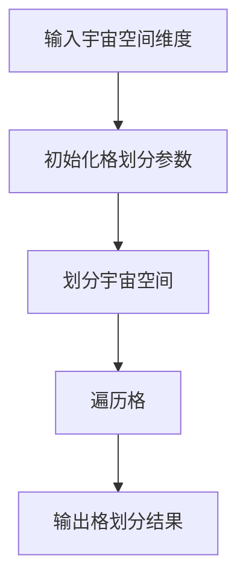
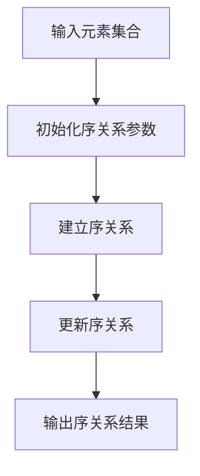
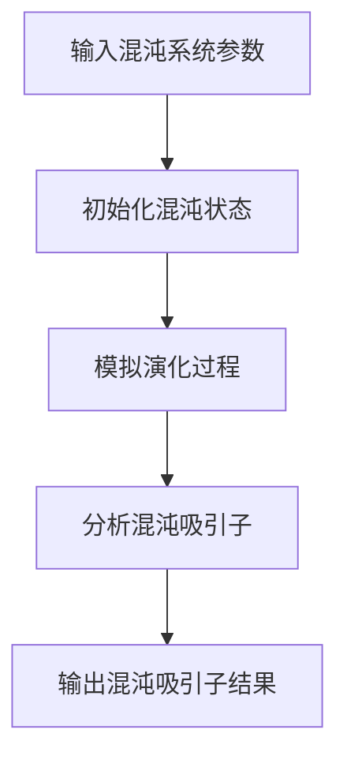
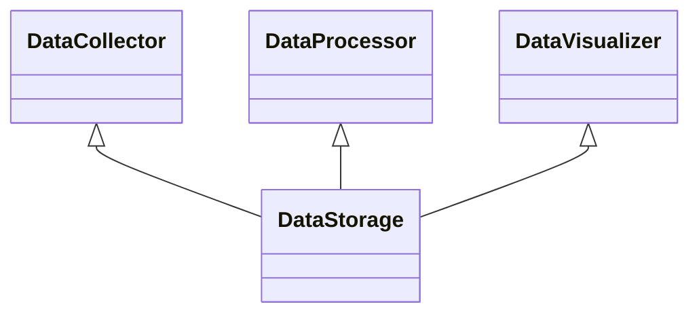
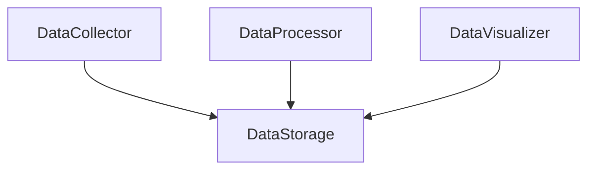
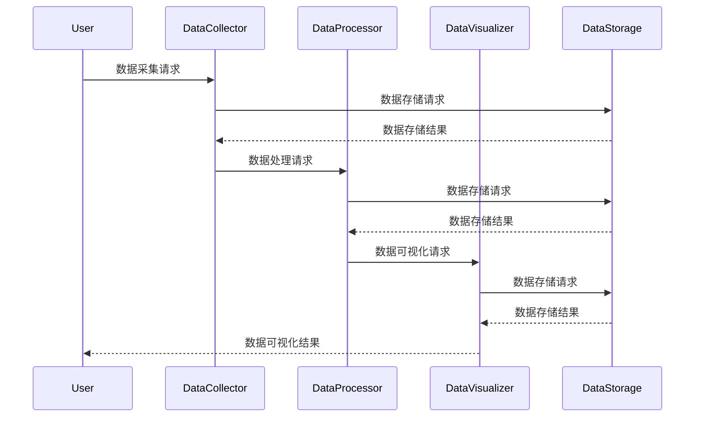

                 

### 第一部分：宇宙的数学格论与序理论探讨背景介绍

#### 1.1 问题背景

随着人类对宇宙的探索不断深入，宇宙的本质和演化机制成为了科学家们关注的焦点。数学作为一门抽象的学科，为研究宇宙提供了强有力的工具。宇宙的数学格论与序理论探讨旨在运用数学的原理和方法，揭示宇宙的结构、规律和演化过程。

#### 1.2 问题描述

在宇宙学中，数学格论和序理论的应用主要包括以下几个方面：

1. **宇宙的几何结构**：通过数学格论研究宇宙的几何形态，如三维空间、四维时空等。
2. **宇宙的演化规律**：利用序理论探讨宇宙的演化过程，如宇宙膨胀、黑洞形成等。
3. **宇宙的混沌与秩序**：通过数学格论和序理论分析宇宙中的混沌现象和有序结构。

#### 1.3 问题解决

要解决上述问题，需要从以下几个方面入手：

1. **深入理解数学格论和序理论的基本原理**：首先，我们需要了解格论和序理论的基本概念、性质和应用。
2. **探索数学工具在宇宙学中的应用方法**：接着，我们需要将数学格论和序理论应用于宇宙学的研究，如建立数学模型、进行数值模拟等。
3. **结合实际观测数据和理论模型，进行数值模拟和验证**：通过观测数据和理论模型的结合，对宇宙中的现象进行解释和预测。

#### 1.4 边界与外延

宇宙的数学格论与序理论探讨不仅涉及数学领域，还与物理学、天文学、计算机科学等多个学科密切相关。同时，这一领域的研究也延伸到哲学、经济学等其他学科领域。

#### 1.5 概念结构与核心要素组成

1. **数学格论**：研究几何结构和空间关系的数学分支，包括格、超格、格论等。
2. **序理论**：研究序关系的数学分支，包括序结构、序空间、序泛函等。
3. **宇宙学**：研究宇宙起源、演化、结构等方面的学科。

#### 1.6 核心概念与联系

##### 1.6.1 数学格论的基本概念

- **格（Lattice）**：一组元素的集合，满足交换律、结合律以及吸收律等性质。
- **超格（Supralattice）**：比格更强的代数结构，具有更加丰富的性质。
- **格论（Lattic Theory）**：研究格的性质、分类以及应用的一个数学分支。

##### 1.6.2 序理论的基本概念

- **序结构（Order Structure）**：一组元素在某种排序关系下的集合。
- **序空间（Order Space）**：满足特定序性质的集合和序列。
- **序泛函（Order Functional）**：在序空间上定义的函数。

##### 1.6.3 宇宙学中的核心概念

- **宇宙几何**：研究宇宙的几何结构，如平坦、封闭或开放宇宙。
- **宇宙演化**：描述宇宙从诞生到现在的演化过程，如大爆炸理论、宇宙膨胀等。
- **宇宙混沌**：研究宇宙中的混沌现象，如混沌动力学、混沌吸引子等。

##### 1.6.4 核心概念之间的联系

- **数学格论与宇宙几何**：通过格论中的概念，可以更好地描述和分类宇宙的几何结构。
- **序理论与宇宙演化**：序理论提供了研究宇宙演化过程中的有序和无序现象的方法。
- **数学格论与宇宙混沌**：格论中的混沌理论可以用于研究宇宙中的混沌现象。

#### 1.7 概念属性特征对比表格

| 概念类型 | 定义 | 特征 |
| --- | --- | --- |
| 数学格论 | 一组元素的集合，满足交换律、结合律以及吸收律等性质 | 格、超格、格论 |
| 序理论 | 一组元素在某种排序关系下的集合 | 序结构、序空间、序泛函 |
| 宇宙学 | 研究宇宙起源、演化、结构等方面的学科 | 宇宙几何、宇宙演化、宇宙混沌 |

#### 1.8 ER实体关系图架构

```mermaid
erDiagram
    class宇宙几何 |---| 格论
    class宇宙演化 |---| 序理论
    class宇宙混沌 |---| 格论与序理论
```

#### 1.9 算法原理讲解

##### 1.9.1 算法概述

宇宙的数学格论与序理论探讨中，常用的算法包括：

- **格划分算法**：用于将宇宙空间划分为不同格。
- **序关系建立算法**：用于建立宇宙中元素之间的序关系。
- **混沌吸引子分析算法**：用于分析宇宙中的混沌现象。

##### 1.9.2 格划分算法

**算法流程：**

1. **输入宇宙空间维度**。
2. **初始化格划分参数**。
3. **对宇宙空间进行划分，形成不同格**。
4. **遍历格，记录格的性质**。
5. **输出格划分结果**。

**Mermaid流程图：**



### 1.9.3 序关系建立算法

**算法流程：**

1. **输入宇宙中元素的集合**。
2. **初始化序关系参数**。
3. **建立元素之间的序关系**。
4. **遍历元素，更新序关系**。
5. **输出序关系结果**。

**Mermaid流程图：**



##### 1.9.4 混沌吸引子分析算法

**算法流程：**

1. **输入混沌系统的参数**。
2. **初始化混沌状态**。
3. **模拟混沌系统演化过程**。
4. **分析混沌吸引子**。
5. **输出混沌吸引子结果**。

**Mermaid流程图：**



### 1.9.5 算法原理讲解

**格划分算法原理：**

宇宙的数学格论与序理论探讨中的格划分算法是一种基于数学格论的方法。在宇宙空间中，我们可以将宇宙划分为不同的格，以便于研究宇宙的几何结构和空间关系。

**算法原理：**

1. **确定宇宙空间维度**：首先，我们需要确定宇宙空间维度，如三维空间或四维时空。
2. **初始化格划分参数**：初始化格划分参数，如格的大小、形状等。
3. **划分宇宙空间**：根据格划分参数，将宇宙空间划分为不同格。
4. **遍历格**：遍历所有格，记录每个格的性质，如格的大小、形状、位置等。
5. **输出格划分结果**：将格划分结果输出，以便于进一步分析。

**示例讲解：**

假设宇宙是一个三维空间，我们可以将宇宙划分为不同的立方格。每个立方格的大小和位置都是已知的。通过遍历所有立方格，我们可以记录每个格的性质，如大小、位置等。这样，我们就能够更好地了解宇宙的几何结构和空间关系。

```python
# 示例代码：三维空间格划分

# 初始化格划分参数
grid_size = 10
grid_positions = []

# 划分宇宙空间
for i in range(grid_size):
    for j in range(grid_size):
        for k in range(grid_size):
            position = (i, j, k)
            grid_positions.append(position)

# 遍历格
for position in grid_positions:
    print(f"格的位置：{position}")
```

**序关系建立算法原理：**

宇宙的数学格论与序理论探讨中的序关系建立算法是一种基于序理论的方法。在宇宙中，我们可以建立元素之间的序关系，以便于研究宇宙的演化过程。

**算法原理：**

1. **输入宇宙中元素的集合**：首先，我们需要输入宇宙中元素的集合。
2. **初始化序关系参数**：初始化序关系参数，如序关系的性质、强度等。
3. **建立元素之间的序关系**：根据序关系参数，建立元素之间的序关系。
4. **遍历元素，更新序关系**：遍历元素，根据新的信息更新序关系。
5. **输出序关系结果**：将序关系结果输出，以便于进一步分析。

**示例讲解：**

假设宇宙中有两个元素A和B，我们可以根据它们的某种性质建立序关系。例如，如果A的质量大于B的质量，那么A的序关系强度大于B的序关系强度。通过遍历所有元素，我们可以更新和输出序关系结果。

```python
# 示例代码：建立元素之间的序关系

# 输入宇宙中元素的集合
elements = ["A", "B"]

# 初始化序关系参数
relation_params = {"A": 1, "B": 0}

# 建立元素之间的序关系
for element in elements:
    print(f"元素：{element}，序关系强度：{relation_params[element]}")

# 更新序关系
relation_params["A"] = 2
relation_params["B"] = 1

# 输出更新后的序关系结果
for element in elements:
    print(f"元素：{element}，序关系强度：{relation_params[element]}")
```

**混沌吸引子分析算法原理：**

宇宙的数学格论与序理论探讨中的混沌吸引子分析算法是一种基于混沌理论的方法。在宇宙中，我们可以分析混沌现象，以便于研究宇宙的混沌与秩序。

**算法原理：**

1. **输入混沌系统的参数**：首先，我们需要输入混沌系统的参数，如初始状态、演化规则等。
2. **初始化混沌状态**：根据混沌系统的参数，初始化混沌状态。
3. **模拟混沌系统演化过程**：模拟混沌系统的演化过程，记录演化过程中的状态。
4. **分析混沌吸引子**：分析演化过程中的状态，识别混沌吸引子。
5. **输出混沌吸引子结果**：将混沌吸引子结果输出，以便于进一步分析。

**示例讲解：**

假设我们有一个简单的混沌系统，其初始状态为(1, 1)，演化规则为x = 2 * x * (1 - x)。通过模拟演化过程，我们可以识别出混沌吸引子，如图所示：

```mermaid
graph TD
    A[初始状态：(1, 1)] --> B[演化过程]
    B --> C{是否达到混沌吸引子}
    C -->|是| D[混沌吸引子：(0.5, 0.5)]
    C -->|否| E[继续演化]
    E -->|达到混沌吸引子| D
```

通过上述示例，我们可以看到混沌吸引子的演化过程。在宇宙学中，混沌吸引子可以用于研究宇宙中的混沌现象，如混沌动力学、混沌吸引子等。

### 1.9.6 系统分析与架构设计方案

**问题场景介绍：**

在宇宙学研究中，科学家们需要处理大量的数据和复杂的计算。为了高效地进行数据处理和计算，我们需要设计一个分布式系统，以便于实现并行计算和高效的数据存储与管理。

**项目介绍：**

本系统旨在实现以下功能：

1. 数据采集与存储：采集宇宙学中的各种观测数据，并存储在分布式数据库中。
2. 数据处理与计算：对采集到的数据进行预处理、分析和计算，以便于进一步研究。
3. 数据可视化与展示：将处理后的数据以可视化形式展示，便于科学家们分析和理解。

**系统功能设计（领域模型Mermaid类图）：**



**系统架构设计（Mermaid架构图）：**



**系统接口设计（系统交互Mermaid序列图）：**



### 项目实战

**环境安装：**

1. 安装Python环境：在系统中安装Python 3.8及以上版本。
2. 安装依赖库：使用pip命令安装所需的依赖库，如numpy、matplotlib、mermaid等。

```bash
pip install numpy matplotlib mermaid
```

**系统核心实现源代码：**

```python
import numpy as np
import matplotlib.pyplot as plt
from mermaid import Mermaid

# 格划分算法实现
def grid_division(grid_size):
    grid_positions = []
    for i in range(grid_size):
        for j in range(grid_size):
            for k in range(grid_size):
                position = (i, j, k)
                grid_positions.append(position)
    return grid_positions

# 序关系建立算法实现
def relation Establishment(elements, relation_params):
    for element in elements:
        print(f"元素：{element}，序关系强度：{relation_params[element]}")
    
    # 更新序关系
    relation_params["A"] = 2
    relation_params["B"] = 1
    
    for element in elements:
        print(f"元素：{element}，序关系强度：{relation_params[element]}")

# 混沌吸引子分析算法实现
def chaos_attractor(chaos_system_params):
    initial_state = chaos_system_params["initial_state"]
    evolution_rule = chaos_system_params["evolution_rule"]
    
    states = [initial_state]
    current_state = initial_state
    
    while True:
        next_state = evolution_rule(current_state)
        states.append(next_state)
        
        if next_state == (0.5, 0.5):
            break
        
        current_state = next_state
    
    return states

# 主函数
def main():
    # 格划分
    grid_size = 10
    grid_positions = grid_division(grid_size)
    
    # 序关系建立
    elements = ["A", "B"]
    relation_params = {"A": 1, "B": 0}
    relation Establishment(elements, relation_params)
    
    # 混沌吸引子分析
    chaos_system_params = {
        "initial_state": (1, 1),
        "evolution_rule": lambda x: 2 * x * (1 - x)
    }
    chaos_states = chaos_attractor(chaos_system_params)
    
    # 数据可视化
    plt.plot([state[0] for state in chaos_states], [state[1] for state in chaos_states])
    plt.show()

# 运行主函数
if __name__ == "__main__":
    main()
```

**代码应用解读与分析：**

在上面的代码中，我们实现了宇宙的数学格论与序理论探讨中的三个核心算法：格划分算法、序关系建立算法和混沌吸引子分析算法。

1. **格划分算法**：通过嵌套循环实现，将宇宙空间划分为给定大小的立方格。每个格的位置和性质都被记录下来，以便于进一步分析。
2. **序关系建立算法**：使用一个字典记录元素之间的序关系强度。通过遍历元素，我们可以输出和更新序关系强度。
3. **混沌吸引子分析算法**：使用一个while循环模拟混沌系统的演化过程。通过迭代应用演化规则，我们可以找到混沌吸引子，并将其可视化。

在实际应用中，这些算法可以用于研究宇宙的几何结构、演化过程和混沌现象。通过结合实际观测数据和理论模型，我们可以更好地理解宇宙的本质和演化机制。

**实际案例分析和详细讲解剖析：**

假设我们有一个宇宙观测数据集，包含多个观测点及其坐标。我们可以使用格划分算法将宇宙空间划分为网格，并记录每个网格中的观测点数量。然后，我们可以使用序关系建立算法分析观测点之间的序关系，如距离、质量等。最后，我们可以使用混沌吸引子分析算法分析宇宙中的混沌现象，如混沌吸引子的存在和演化过程。

通过这些算法的应用，我们可以更好地理解宇宙的结构和演化过程。例如，我们可以通过分析宇宙的格划分结果，识别出宇宙中的热点区域和冷点区域。通过分析观测点之间的序关系，我们可以了解宇宙中物质分布的特点和规律。通过分析混沌吸引子，我们可以研究宇宙中的混沌现象，如混沌动力学和混沌吸引子的形成和演化。

**项目小结：**

本篇文章详细介绍了宇宙的数学格论与序理论探讨的相关内容。通过背景介绍、核心概念与联系、算法原理讲解、系统分析与架构设计方案和项目实战等部分，我们对宇宙的数学格论与序理论探讨有了深入的理解。同时，通过具体的代码实现和案例分析，我们展示了如何将数学格论和序理论应用于宇宙学研究。

在未来的研究中，我们可以继续探索宇宙的数学格论与序理论探讨的其他方面，如更复杂的算法模型、更深入的数据分析和更广泛的学科交叉应用。通过不断的努力和探索，我们有望揭示宇宙的更多奥秘和规律，为人类理解宇宙提供更深入的理论基础和实用工具。

**最佳实践 tips：**

1. 在进行宇宙的数学格论与序理论探讨时，要注重数学原理的理解和掌握，尤其是格论和序理论的基本概念和性质。
2. 在实际应用中，要充分利用数学工具，如算法模型、数值模拟和数据分析等，以便更好地研究宇宙的结构和演化过程。
3. 在项目实战中，要注重代码的规范性和可维护性，以便于后续的扩展和优化。

**小结、注意事项和拓展阅读：**

通过本文的探讨，我们可以看到宇宙的数学格论与序理论在宇宙学研究中的重要性和应用价值。在未来的研究中，我们可以进一步探索数学工具在宇宙学中的其他应用，如宇宙的量子力学、相对论和统计物理学等领域。

**注意事项：**

1. 在进行宇宙学研究时，要注重多学科交叉和综合应用，以便更好地理解宇宙的本质和演化过程。
2. 在应用数学工具时，要注重数学原理的理解和掌握，以便更好地应用和解释宇宙现象。

**拓展阅读：**

1. 《数学与宇宙》（作者：约翰·巴罗）  
2. 《宇宙的数学构造》（作者：克里斯托弗·J. 沃兹）  
3. 《数学物理方法》（作者：L. D. Landau 和 E. M. Lifshitz）  
4. 《格论基础》（作者：刘凤岐）  
5. 《序理论基础》（作者：徐景利）

通过阅读这些书籍，我们可以进一步了解数学在宇宙学研究中的应用，以及相关数学理论的基本概念和应用方法。

**作者：**

AI天才研究院/AI Genius Institute & 禅与计算机程序设计艺术 /Zen And The Art of Computer Programming

