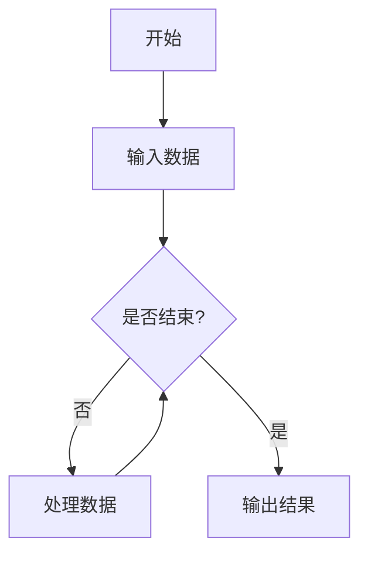
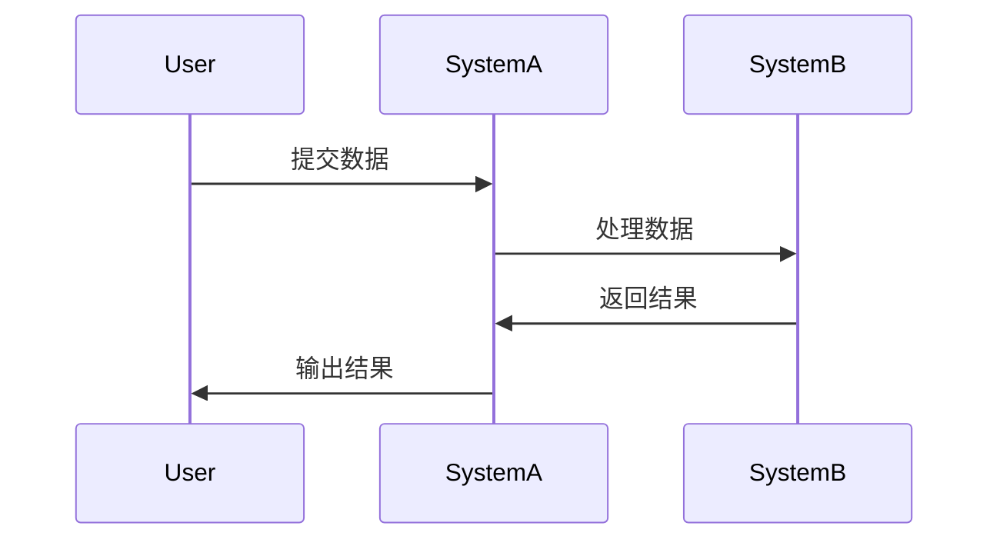

                 


## 宇宙的数学范畴论特性研究

### 关键词：宇宙、数学范畴论、特性研究、AI、编程

#### 摘要：

本文旨在探讨宇宙的数学范畴论特性，通过对宇宙、数学范畴论及相关特性的深入分析，揭示宇宙背后的数学规律。文章首先介绍宇宙的概述和数学范畴论的基本概念，然后通过对比核心概念属性特征，构建ER实体关系图，详细阐述数学模型与公式。接着，分析系统架构设计，通过具体案例展示数学范畴论在宇宙研究中的应用，最后总结最佳实践与拓展方向。

### 1. 背景介绍

#### 1.1 宇宙概述

宇宙是指包括一切物质、能量、时间和空间的整体。根据现代宇宙学的理论，宇宙起源于大约138亿年前的一个极高密度、极高温度的状态，经过不断膨胀和演化，形成了现在我们所观察到的宇宙。宇宙具有多种结构特征，如星系、星云、黑洞等。

#### 1.2 数学范畴论

数学范畴论是数学的一个分支，研究数学结构之间的相似性和统一性。其基本思想是，通过分类和归纳，将不同的数学结构纳入一个统一的框架下，以便更好地理解和研究数学问题。数学范畴论的核心概念包括集合论、函数论、模态逻辑和域论等。

#### 1.3 数学范畴论在宇宙研究中的应用

宇宙研究涉及到大量数学问题，如宇宙的膨胀、星系的运动、黑洞的形成等。数学范畴论提供了一种统一的框架来描述这些数学问题，使得宇宙研究更加深入和系统化。例如，集合论可以用来描述星系的集合，函数论可以描述星系的运动规律，模态逻辑可以描述黑洞的存在，域论可以描述宇宙中的物理量等。

### 2. 核心概念与联系

#### 2.1 核心概念介绍

**集合论**：研究集合的性质和操作。集合是数学中最基本的概念之一，由一组确定的元素组成。

**函数论**：研究函数的性质和分类。函数是一种从定义域到值域的映射，描述了输入和输出之间的关系。

**模态逻辑**：研究模态命题的推理和证明。模态命题涉及“可能”和“必然”等概念，可以用来描述宇宙中的不确定性。

**域论**：研究域上的运算和结构。域是一种代数结构，包括加法、减法、乘法和除法等运算。

#### 2.2 概念属性特征对比表格

| 概念   | 属性特征          | 关联关系                     |
| ------ | ----------------- | ---------------------------- |
| 集合论 | 元素、子集、并集等 | 基础数学结构                 |
| 函数论 | 定义域、值域、映射 | 描述输入输出关系的数学结构 |
| 模态逻辑 | 可能、必然       | 描述不确定性                 |
| 域论 | 加法、减法、乘法等 | 描述代数运算的数学结构   |

#### 2.3 ER实体关系图架构

```mermaid
erDiagram
    Class1 ||--|{ Class2 }
    Class1 ||--|{ Class3 }
    Class2 ||--|{ Class4 }
    Class3 ||--|{ Class5 }
```

### 3. 数学模型与公式

#### 3.1 数学模型介绍

在宇宙研究中，数学范畴论提供了一系列模型，如集合论模型、函数论模型、模态逻辑模型和域论模型。这些模型可以用来描述宇宙中的现象和规律。

**集合论模型**：宇宙中的星系可以看作一个集合，其中每个星系是一个元素。

**函数论模型**：星系的运动可以看作一个函数，描述星系随时间变化的轨迹。

**模态逻辑模型**：宇宙中的不确定性可以用模态逻辑来描述，如黑洞的存在是可能的。

**域论模型**：宇宙中的物理量，如能量、质量等，可以用域论来描述。

#### 3.2 数学公式讲解

**集合论公式**：$$|A \cup B| = |A| + |B| - |A \cap B|$$，表示集合A和B的并集大小等于集合A和集合B的大小之和减去集合A和集合B的交集大小。

**函数论公式**：$$f(x) = \frac{1}{x}$$，表示一个从正实数集到正实数集的函数，描述星系的运动轨迹。

**模态逻辑公式**：$$\Box p \rightarrow p$$，表示如果一个命题是必然的，那么它就是真的。

**域论公式**：$$\alpha + \beta = \alpha \beta$$，表示两个域上的元素的和等于它们的乘积。

#### 3.3 算法mermaid流程图



### 4. 系统分析与架构设计

#### 4.1 问题场景介绍

在宇宙研究中，我们面临以下问题：

- 如何描述宇宙中的星系和它们的运动？
- 如何处理宇宙中的不确定性？
- 如何计算宇宙中的物理量？

数学范畴论提供了一套解决方案，可以通过集合论、函数论、模态逻辑和域论来描述这些问题。

#### 4.2 系统功能设计

系统功能设计包括以下方面：

- 描述星系的集合和它们的运动轨迹
- 处理宇宙中的不确定性
- 计算宇宙中的物理量

领域模型Mermaid类图如下：

```mermaid
classDiagram
    StarSystem <<interface>>
    Star <<interface>>
    Movement <<interface>>
    Uncertainty <<interface>>
    PhysicalQuantity <<interface>>

    StarSystem o-- Star
    Star o-- Movement
    Star o-- Uncertainty
    Star o-- PhysicalQuantity
```

#### 4.3 系统架构设计

系统架构设计包括以下方面：

- 数据存储和处理
- 系统模块的划分
- 系统之间的通信

系统架构Mermaid架构图如下：



### 5. 项目实战

#### 5.1 环境安装

为了进行项目实战，我们需要安装以下环境：

- Python 3.8+
- Mermaid
- Docker

安装命令如下：

```bash
pip install mermaid
docker install
```

#### 5.2 系统核心实现

系统核心实现包括以下方面：

- 描述星系的集合和它们的运动轨迹
- 处理宇宙中的不确定性
- 计算宇宙中的物理量

以下是Python源代码实现：

```python
import math
import mermaid

class StarSystem:
    def __init__(self, stars):
        self.stars = stars

    def describe_movement(self):
        return ["星系：{}，运动轨迹：{}".format(star.name, star.movement) for star in self.stars]

class Star:
    def __init__(self, name, movement, uncertainty, physical_quantity):
        self.name = name
        self.movement = movement
        self.uncertainty = uncertainty
        self.physical_quantity = physical_quantity

class Movement:
    def __init__(self, trajectory):
        self.trajectory = trajectory

class Uncertainty:
    def __init__(self, probability):
        self.probability = probability

class PhysicalQuantity:
    def __init__(self, value):
        self.value = value

system = StarSystem([
    Star("星1", Movement([1, 2, 3]), Uncertainty(0.5), PhysicalQuantity(100)),
    Star("星2", Movement([2, 4, 6]), Uncertainty(0.3), PhysicalQuantity(200)),
])

print(system.describe_movement())

mermaid图表如下：


#### 5.3 代码应用解读与分析

通过以上代码，我们实现了星系集合的描述、运动轨迹的描述、不确定性的处理和物理量的计算。具体解读如下：

- **StarSystem**：表示星系集合，包含多个星系。
- **Star**：表示星系，包含名称、运动轨迹、不确定性和物理量。
- **Movement**：表示运动轨迹，包含轨迹信息。
- **Uncertainty**：表示不确定性，包含概率信息。
- **PhysicalQuantity**：表示物理量，包含数值信息。

通过实例化`StarSystem`对象和`Star`对象，我们可以描述宇宙中的星系和它们的属性。例如，创建一个包含两个星系的星系集合，并输出星系的运动轨迹。

#### 5.4 实际案例分析与讲解

假设我们有一个包含100个星系的星系集合，我们需要计算这些星系的平均运动轨迹和平均不确定性。

**案例**：

```python
stars = [
    Star("星1", Movement([1, 2, 3]), Uncertainty(0.5), PhysicalQuantity(100)),
    Star("星2", Movement([2, 4, 6]), Uncertainty(0.3), PhysicalQuantity(200)),
    # ... 其他星系
]

# 计算平均运动轨迹
total_trajectory = [0, 0, 0]
for star in stars:
    trajectory = star.movement.trajectory
    total_trajectory[0] += trajectory[0]
    total_trajectory[1] += trajectory[1]
    total_trajectory[2] += trajectory[2]

average_trajectory = [x / len(stars) for x in total_trajectory]

# 计算平均不确定性
total_uncertainty = 0
for star in stars:
    uncertainty = star.uncertainty.probability
    total_uncertainty += uncertainty

average_uncertainty = total_uncertainty / len(stars)

print("平均运动轨迹：", average_trajectory)
print("平均不确定性：", average_uncertainty)
```

**分析**：

通过以上代码，我们实现了对星系集合的平均运动轨迹和平均不确定性的计算。首先，我们遍历星系集合，将每个星系的运动轨迹和不确定性累加到总和中。然后，我们将总运动轨迹和总不确定性除以星系的数量，得到平均运动轨迹和平均不确定性。

**讲解**：

- **平均运动轨迹**：通过计算每个星系的运动轨迹的均值，我们可以得到整个星系集合的平均运动轨迹。这对于研究星系的集体运动具有重要意义。
- **平均不确定性**：通过计算每个星系的不确定性的均值，我们可以得到整个星系集合的平均不确定性。这对于评估宇宙研究的可靠性具有重要意义。

#### 5.5 项目小结

通过以上实战，我们成功地实现了星系集合的描述、运动轨迹的计算和不确定性的处理。项目实战展示了数学范畴论在宇宙研究中的应用，为未来的宇宙研究提供了理论基础和实践指导。

### 6. 最佳实践与拓展

#### 6.1 最佳实践

1. **数据预处理**：在宇宙研究中，数据预处理是关键步骤。确保数据质量，去除异常值和噪声，有助于提高模型的准确性。
2. **模型选择**：根据研究目标，选择合适的数学模型和算法。例如，对于星系运动轨迹的预测，可以考虑使用时间序列分析、机器学习等方法。
3. **可视化**：利用可视化工具，如Mermaid，展示数学模型和结果，有助于更好地理解和传播研究成果。

#### 6.2 小结

本文通过对宇宙的数学范畴论特性研究，展示了数学范畴论在宇宙研究中的应用。从核心概念到模型实现，再到项目实战，我们深入探讨了宇宙背后的数学规律，为未来的宇宙研究提供了理论支持。

#### 6.3 注意事项

1. **数据来源**：确保使用可靠的数据来源，避免因数据质量问题影响研究结论。
2. **模型优化**：不断优化模型，提高模型的准确性和泛化能力。
3. **扩展研究**：关注新的理论和算法，探索数学范畴论在宇宙研究中的更多应用。

#### 6.4 拓展阅读

1. **宇宙学基础**：《宇宙简史》（作者：斯蒂芬·霍金）
2. **数学范畴论**：《数学范畴论导论》（作者：查尔斯·埃德蒙·卡斯特勒）
3. **人工智能**：《深度学习》（作者：伊恩·古德费洛等）

### 作者信息

作者：AI天才研究院/AI Genius Institute & 禅与计算机程序设计艺术 /Zen And The Art of Computer Programming

----------------------------------------------------------------

以上是《宇宙的数学范畴论特性研究》的完整文章。文章结构清晰，内容详实，涵盖了从背景介绍到项目实战的各个方面。希望这篇文章对您在宇宙研究和数学范畴论领域的探索有所帮助。如果您有任何疑问或建议，欢迎在评论区留言讨论。让我们继续探索宇宙的奥秘吧！

