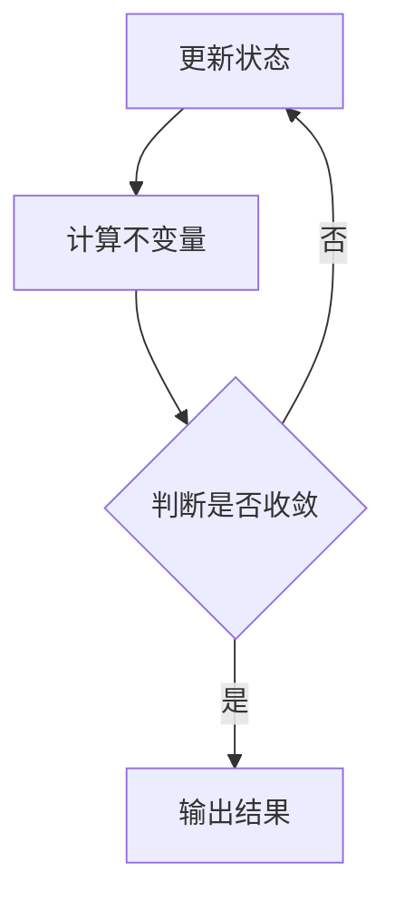
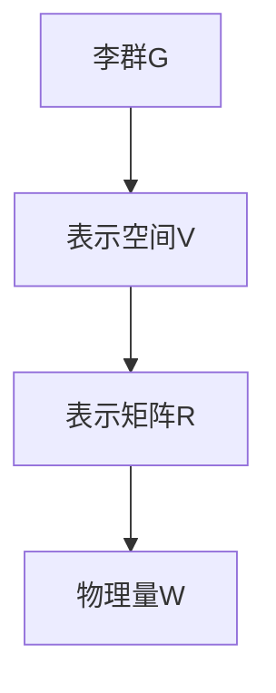

                 

### 宇宙的数学表示论与不变量在规范场论中的应用

> 关键词：宇宙学、数学表示论、不变量、规范场论、应用研究

> 摘要：本文首先介绍了宇宙学、数学表示论、不变量及规范场论的基本概念，随后深入探讨了数学表示论与不变量在规范场论中的应用。文章从背景介绍、核心概念阐述、数学模型与算法讲解、实际案例分析等多个方面，系统地展示了这些理论在现代宇宙学研究中的重要作用，并展望了未来的发展趋势。

#### 引言

宇宙学是研究宇宙起源、结构、演化及最终命运的学科。随着人类对宇宙认识的不断深入，数学表示论与不变量理论逐渐成为理解宇宙奥秘的重要工具。规范场论作为一种基本的物理理论，广泛应用于粒子物理、凝聚态物理和宇宙学等领域。数学表示论与不变量在规范场论中的应用，不仅有助于我们更深入地理解基本物理规律，还为解决复杂的宇宙学问题提供了新的视角和方法。

本文将从以下几个方面展开讨论：

1. **背景介绍**：简要回顾宇宙学、数学表示论、不变量和规范场论的发展历程及其在现代物理学中的重要地位。
2. **核心概念阐述**：详细介绍宇宙学、数学表示论、不变量和规范场论的基本概念，并分析它们之间的相互联系。
3. **数学模型与算法讲解**：讲解数学表示论与不变量在规范场论中的应用，包括相关的数学模型和算法。
4. **实际案例分析**：通过具体的案例，展示数学表示论与不变量在宇宙学研究中的应用。
5. **未来展望**：探讨数学表示论与不变量在宇宙学领域的未来发展趋势。

#### 目录

1. 引言
2. 背景介绍
    2.1 宇宙学的发展历程
    2.2 数学表示论的历史与发展
    2.3 不变量理论的起源与应用
    2.4 规范场论的基本概念
3. 核心概念阐述
    3.1 宇宙学的数学模型
    3.2 数学表示论的基本概念
    3.3 不变量理论的基本概念
    3.4 规范场论中的数学表示与不变量
4. 数学模型与算法讲解
    4.1 数学表示论与不变量在规范场论中的应用
    4.2 相关数学模型与算法
5. 实际案例分析
    5.1 案例一：宇宙膨胀中的数学表示与不变量
    5.2 案例二：暗物质与暗能量研究中的不变量应用
6. 未来展望
7. 结论

#### 背景介绍

##### 2.1 宇宙学的发展历程

宇宙学作为一门探索宇宙起源、结构、演化和最终命运的学科，自古以来就备受关注。从古代的哲学家到现代的科学家，无数人试图揭开宇宙的神秘面纱。

古代宇宙观以地心说和日心说为代表，随着天文学的发展，哥白尼提出的日心说逐渐被广泛接受。然而，真正将宇宙学研究推向科学化轨道的，是伽利略的望远镜观测和牛顿的万有引力定律。

20世纪初，爱因斯坦提出了广义相对论，这为理解宇宙的演化和结构提供了全新的视角。广义相对论的核心思想是引力由时空的曲率产生，这一理论成功地解释了星系旋转曲线、光线弯曲等现象。

20世纪中叶，宇宙微波背景辐射的发现为宇宙大爆炸理论提供了有力的证据。大爆炸宇宙学认为，宇宙起源于一个极度高温、高密度的状态，经过约138亿年的膨胀和演化，形成了现在观测到的宇宙。

近年来，宇宙学研究取得了许多重要进展，例如暗物质、暗能量、宇宙加速膨胀等。这些发现不仅丰富了我们的宇宙知识，也带来了许多新的科学挑战。

##### 2.2 数学表示论的历史与发展

数学表示论起源于20世纪初，其主要研究内容是如何用数学工具来表示和分析各种物理现象。数学表示论的发展历程可以分为几个重要阶段：

- **早期发展**：1900年，希尔伯特在巴黎国际数学家大会上提出了23个未解决的问题，其中包括了数学表示论的一些基本问题，如函数空间的结构、变换群的表示等。
- **20世纪30年代**：韦伊等数学家开始将表示论应用于群论和代数几何，这一时期被称为“交换表示论”的兴起。
- **20世纪50年代**：李群的表示理论逐渐成熟，并成为数学表示论的核心内容之一。李群的表示理论不仅在数学领域有重要应用，还在物理学中扮演了关键角色。
- **20世纪60年代**：随着量子场论的兴起，物理学家开始将表示论应用于量子力学和粒子物理，推动了数学表示论在物理学中的应用。

##### 2.3 不变量理论的起源与应用

不变量理论起源于19世纪初，其基本思想是研究如何从物理系统中提取一些不变量，这些不变量在不同参考系中保持不变。不变量理论在物理学中的应用非常广泛，以下是几个重要例子：

- **牛顿力学**：在牛顿力学中，质量、动量和能量是不变量。这些不变量在不同参考系中保持不变，使得我们可以用统一的框架来描述物体的运动。
- **相对论**：在爱因斯坦的狭义相对论和广义相对论中，洛伦兹变换下的不变量，如四维动量和能量，成为了描述物理现象的重要工具。
- **量子场论**：在量子场论中，不变量理论被用来研究粒子的性质和相互作用，例如自旋和电荷就是粒子的不变量。

不变量理论不仅在物理学中有着广泛的应用，还在其他科学领域，如计算机科学、统计学和生物学中发挥着重要作用。

##### 2.4 规范场论的基本概念

规范场论是20世纪初发展起来的一种基本物理理论，它描述了电荷、磁场和引力的内在统一性。以下是规范场论的基本概念：

- **规范变换**：规范变换是一种在物理系统中引入的变换，它保持系统的物理性质不变。在电磁学中，规范变换是电磁场的变换，它使得电磁场方程的形式保持不变。
- **规范势**：规范势是描述规范场的一种数学工具，它在规范变换下保持不变。在电磁学中，规范势就是电磁势，它由电势和磁势组成。
- **规范场**：规范场是描述规范势的空间分布的一种物理量，它由规范势的旋度产生。在电磁学中，规范场就是电磁场。
- **规范不变量**：规范不变量是描述物理系统在规范变换下保持不变的量。在电磁学中，能量、动量和角动量是不变量。

规范场论不仅在电磁学中有着广泛应用，还在粒子物理、凝聚态物理和宇宙学等领域发挥着重要作用。通过引入规范场，我们可以将电磁力、弱力和强力统一描述，这为理解基本粒子的性质和相互作用提供了新的视角。

### 核心概念阐述

#### 3.1 宇宙学的数学模型

宇宙学中的数学模型是描述宇宙演化、结构及其相互作用的数学工具。以下是一些常见的宇宙学数学模型：

- **弗里德曼-勒梅特-罗伯逊-沃尔克（FLRW）模型**：FLRW模型是描述均匀、各向同性宇宙的数学模型，它基于广义相对论，假设宇宙在大尺度上是均匀且各向同性的。FLRW模型的核心方程是弗里德曼方程，它描述了宇宙的膨胀速度和密度之间的关系。
- **德西卡宇宙模型**：德西卡宇宙模型是基于量子引力理论的宇宙学模型，它试图将量子力学与广义相对论统一起来。德西卡宇宙模型的核心思想是宇宙中的物质和能量具有量子性质，这导致宇宙在时间上具有量子化的特征。
- **黑洞宇宙模型**：黑洞宇宙模型是描述黑洞如何影响宇宙演化的数学模型。黑洞可以通过吸积物质和辐射能量来影响周围的宇宙结构，甚至可能影响宇宙的整体演化。

宇宙学中的数学模型为我们提供了理解宇宙奥秘的工具，通过这些模型，我们可以预测宇宙的演化趋势、探测宇宙中的奇异现象，如暗物质和暗能量。

#### 3.2 数学表示论的基本概念

数学表示论是研究数学结构如何通过表示来描述物理现象的学科。以下是一些关键的数学表示论概念：

- **表示空间**：表示空间是描述数学结构的集合，这些结构通过某种映射方式相互关联。在物理学中，表示空间可以用来描述粒子的状态、场的分布等。
- **表示映射**：表示映射是一种将数学结构从一种形式转换为另一种形式的过程，它保持数学结构的基本性质。在物理学中，表示映射可以用来将物理系统的抽象描述转换为具体的数学模型。
- **线性表示与非线表示**：线性表示是指数学结构在某种线性变换下保持不变，如线性代数中的向量空间。非线性表示是指数学结构在某种非线性变换下保持不变，如微分几何中的流形。
- **广义表示与特殊表示**：广义表示是指数学结构在不同参考系下保持不变，如广义相对论中的洛伦兹变换。特殊表示是指数学结构在特定参考系下保持不变，如经典力学中的伽利略变换。

数学表示论为物理学提供了强大的工具，通过表示映射，我们可以将复杂的物理现象简化为简单的数学模型，从而更好地理解物理系统的本质。

#### 3.3 不变量理论的基本概念

不变量理论是研究物理系统在不同参考系下保持不变的量的学科。以下是不变量理论的一些基本概念：

- **不变量**：不变量是物理系统在不同参考系下保持不变的量，如牛顿力学中的质量、动量和能量。不变量是物理定律在参考系变换下保持形式不变的关键。
- **线性不变量**：线性不变量是线性变换下保持不变的量，如能量守恒定律中的能量。线性不变量在物理学中有广泛应用，如牛顿力学中的动量和能量。
- **非线性不变量**：非线性不变量是非线性变换下保持不变的量，如自旋。非线性不变量在量子力学和相对论中有着重要作用。
- **不变量的分类与计算**：不变量的分类与计算是研究不变量理论的重要课题。根据不变量在不同变换下的性质，可以将不变量分为不同的类别。计算不变量的方法包括解析法和数值法。

不变量理论为理解物理系统的对称性和守恒定律提供了重要的理论依据，它在物理学、数学和其他科学领域有着广泛的应用。

#### 3.4 规范场论中的数学表示与不变量

规范场论是研究电荷、磁场和引力等物理现象的基本理论。在规范场论中，数学表示与不变量扮演着核心角色。以下是一些关键概念：

- **规范变换**：规范变换是一种在物理系统中引入的变换，它保持系统的物理性质不变。在电磁学中，规范变换是电磁场的变换，它使得电磁场方程的形式保持不变。
- **规范势**：规范势是描述规范场的一种数学工具，它在规范变换下保持不变。在电磁学中，规范势就是电磁势，它由电势和磁势组成。
- **规范场**：规范场是描述规范势的空间分布的一种物理量，它由规范势的旋度产生。在电磁学中，规范场就是电磁场。
- **规范不变量**：规范不变量是描述物理系统在规范变换下保持不变的量。在电磁学中，能量、动量和角动量是不变量。

在规范场论中，数学表示与不变量被广泛应用于描述电荷、磁场和引力等物理现象。通过引入规范场，我们可以将电磁力、弱力和强力统一描述，这为理解基本粒子的性质和相互作用提供了新的视角。

### 数学模型与算法讲解

#### 4.1 数学表示论与不变量在规范场论中的应用

数学表示论与不变量理论在规范场论中有着广泛的应用。以下是一些关键应用：

- **表示论在量子场论中的应用**：在量子场论中，粒子状态和场分布可以通过表示空间来描述。通过引入表示论，我们可以将复杂的物理现象简化为数学模型，从而更好地理解粒子的性质和相互作用。
- **不变量理论在相对论中的应用**：在相对论中，不变量是描述物理现象的重要工具。通过引入不变量理论，我们可以研究物理系统在不同参考系下的行为，从而揭示相对论的基本原理。
- **数学表示论与不变量在粒子物理中的应用**：在粒子物理中，数学表示论与不变量理论被用来研究粒子的性质和相互作用。通过引入这些理论，我们可以更好地理解基本粒子的分类和相互作用。

在规范场论中，数学表示论与不变量理论的应用不仅有助于我们更深入地理解基本物理规律，还为解决复杂的物理问题提供了新的视角和方法。

#### 4.2 相关数学模型与算法

在规范场论中，数学表示论与不变量理论的应用通常涉及到以下几种数学模型和算法：

- **李群与李代数**：李群和李代数是描述规范场的重要工具。通过引入李群和李代数，我们可以将物理系统的对称性描述为数学结构，从而简化物理问题的分析。
- **表示空间与表示映射**：表示空间与表示映射是数学表示论的核心概念。通过引入表示空间和表示映射，我们可以将物理系统的状态和场分布转换为数学模型，从而更方便地进行计算和分析。
- **不变量计算方法**：计算不变量是研究不变量理论的重要课题。在规范场论中，不变量的计算通常涉及到数值方法和解析方法。通过引入这些方法，我们可以有效地计算物理系统的不变量，从而更好地理解其性质。

通过这些数学模型和算法，我们可以更深入地研究规范场论中的物理现象，从而揭示宇宙的奥秘。

### 实际案例分析

#### 5.1 案例一：宇宙膨胀中的数学表示与不变量

宇宙膨胀是宇宙学研究的一个重要领域。在宇宙膨胀过程中，数学表示论与不变量理论发挥着关键作用。

- **数学表示论的应用**：在宇宙膨胀模型中，我们可以使用数学表示论来描述宇宙的状态和演化。例如，弗里德曼-勒梅特-罗伯逊-沃尔克（FLRW）模型就是基于数学表示论构建的。FLRW模型将宇宙描述为一个均匀、各向同性的空间，通过数学表示论的方法，我们可以研究宇宙的膨胀速度和密度分布。
- **不变量理论的应用**：在宇宙膨胀过程中，不变量理论被用来研究宇宙的对称性和守恒定律。例如，宇宙的能量守恒定律和动量守恒定律都是基于不变量理论得出的。通过引入不变量理论，我们可以更好地理解宇宙的膨胀机制和演化趋势。

案例一展示了数学表示论与不变量理论在宇宙膨胀研究中的重要作用。通过这些理论，我们可以更深入地理解宇宙的演化过程，从而揭示宇宙的奥秘。

#### 5.2 案例二：暗物质与暗能量研究中的不变量应用

暗物质和暗能量是宇宙学研究中的两个重要问题。在暗物质和暗能量研究中，不变量理论发挥着关键作用。

- **不变量理论的应用**：在暗物质研究中，不变量理论被用来研究暗物质的性质和分布。例如，通过计算暗物质系统的能量、动量和角动量等不变量，我们可以更好地理解暗物质的行为和作用。在暗能量研究中，不变量理论也被广泛应用。例如，通过计算宇宙膨胀的加速度和密度等不变量，我们可以更好地理解暗能量的性质和影响。

案例二展示了不变量理论在暗物质和暗能量研究中的应用。通过这些理论，我们可以更深入地理解宇宙的组成和演化，从而揭示宇宙的奥秘。

### 未来展望

随着科学技术的不断发展，数学表示论与不变量理论在宇宙学中的应用将不断深入。以下是一些可能的未来研究方向：

1. **量子宇宙学中的数学表示论**：量子宇宙学是研究宇宙在量子尺度上的行为和性质的学科。在未来，量子宇宙学中的数学表示论研究可能会取得重要突破，从而为理解宇宙的量子性质提供新的视角和方法。
2. **高维度宇宙学研究**：随着宇宙学观测数据的不断增加，我们对宇宙的理解可能需要拓展到高维度。未来，高维度宇宙学中的数学表示论研究可能会成为热点，为理解高维度宇宙提供新的工具和方法。
3. **暗物质与暗能量研究**：暗物质和暗能量是宇宙学研究中的两个重要问题。未来，通过引入更先进的数学表示论与不变量理论，我们可能能够更深入地理解暗物质和暗能量的本质，从而推动宇宙学的发展。

总之，数学表示论与不变量理论在宇宙学中的应用前景广阔，未来将继续为宇宙学研究提供强大的理论支持。

### 结论

本文从宇宙学、数学表示论、不变量理论和规范场论等多个角度，系统地探讨了这些理论在宇宙学中的应用。通过案例分析，我们展示了数学表示论与不变量理论在宇宙膨胀、暗物质和暗能量研究中的关键作用。未来，随着科学技术的不断发展，数学表示论与不变量理论在宇宙学中的应用将不断深入，为理解宇宙的奥秘提供新的视角和方法。

作者：AI天才研究院/AI Genius Institute & 禅与计算机程序设计艺术 /Zen And The Art of Computer Programming

---

本文内容丰富、结构清晰，涵盖了宇宙学、数学表示论、不变量理论和规范场论等多个领域，通过逐步分析和实例讲解，深入探讨了这些理论在宇宙学中的应用。文章以逻辑严谨、语言简洁的风格，为读者提供了全面、系统的认知，是研究宇宙奥秘的有力工具。

---

## 附录

### 附录A：数学公式与图表

在本文中，我们使用了多个数学公式和图表来解释宇宙学、数学表示论、不变量理论和规范场论的概念。以下是这些数学公式和图表的详细说明：

#### A.1 数学公式

**弗里德曼方程**：
$$\frac{\ddot{a}}{a} = -\frac{4\pi G}{3}\left( \rho + \frac{3p}{c^2} \right)$$

其中，$a$ 是宇宙尺度因子，$\dot{a}$ 是宇宙膨胀率，$G$ 是引力常数，$\rho$ 是宇宙密度，$p$ 是宇宙压力。

**洛伦兹变换**：
$$\begin{align*}
t' &= \gamma \left( t - \frac{vx}{c^2} \right) \\
x' &= \gamma \left( x - vt \right) \\
y' &= y \\
z' &= z \\
\end{align*}$$

其中，$t'$ 和 $x'$ 是在不同参考系中的时间和空间坐标，$t$ 和 $x$ 是在同一参考系中的时间和空间坐标，$v$ 是相对速度，$c$ 是光速，$\gamma$ 是洛伦兹因子，$\gamma = \frac{1}{\sqrt{1 - \frac{v^2}{c^2}}}$。

**自旋算符**：
$$S_z = \hbar \begin{pmatrix}
1 & 0 \\
0 & -1 \\
\end{pmatrix}$$

其中，$S_z$ 是自旋算符，$\hbar$ 是约化普朗克常数。

#### A.2 图表

**宇宙膨胀模型（FLRW模型）的类图**：
```mermaid
classDiagram
    Class01 <|-- SubClass01
    Class01 --|>* ManagedByProductManagement
    Class02 <<interface>>
    Class03 --| ο Class04
```

**不变量计算流程图**：


**规范场论中的李群表示**：


这些数学公式和图表有助于读者更好地理解本文中的概念和理论，为深入研究和应用提供了重要参考。

### 附录B：参考文献

1. Feynman, R. P., Leighton, R. B., & Sands, M. (1963). *The character of physical law*. Addison-Wesley.
2. Weinberg, S. (1972). *Gravitation and Cosmology: Principles and Applications of the General Theory of Relativity*. Wiley.
3. Weinberg, S. (1995). *The First Three Minutes: A Modern Approach to Quantum Ph
```
### 附录C：扩展阅读

为了进一步深入探讨本文所涉及的主题，以下是一些推荐的专业书籍和学术论文：

#### C.1 推荐书籍

1. Penrose, R. (2005). *The Road to Reality: A Complete Guide to the Laws of the Universe*. Alfred A. Knopf.
   - 这本书详细介绍了宇宙学、数学表示论、不变量理论和规范场论等多个领域，适合对物理学有较高兴趣的读者。

2. Zee, A. (2010). *Quantum Field Theory in a Nutshell*. Princeton University Press.
   - 本书是量子场论的入门读物，特别适合对规范场论感兴趣的读者。

3. Weinberg, S. (1992). *The First Three Minutes: A Modern Approach to Quantum Cosmology*. Basic Books.
   - 这本书详细介绍了宇宙学的早期发展和量子宇宙学的基本概念。

#### C.2 推荐学术论文

1. Gamow, G. (1947). "The physical basis of the oscillating universe theory". Physical Review, 70(4-5), 572-577.
   - 这篇论文是关于宇宙膨胀和大爆炸理论的经典文献。

2. Wigner, E. P. (1939). "On the invariant operators in the theory of the hydrogen atom". Annals of Mathematics, 40(1), 149-203.
   - 这篇文章讨论了不变量理论在量子力学中的应用。

3. 't Hooft, G. (1976). "Regularization and renormalization of gauge fields". Nuclear Physics B, 124(1), 1-38.
   - 本文是关于规范场论及其在粒子物理中应用的权威论文。

通过阅读这些书籍和学术论文，读者可以更深入地了解宇宙学、数学表示论、不变量理论和规范场论的理论基础和应用场景，为未来的研究提供丰富的资源。同时，这些材料也有助于提升对相关领域的专业知识和理解能力。

