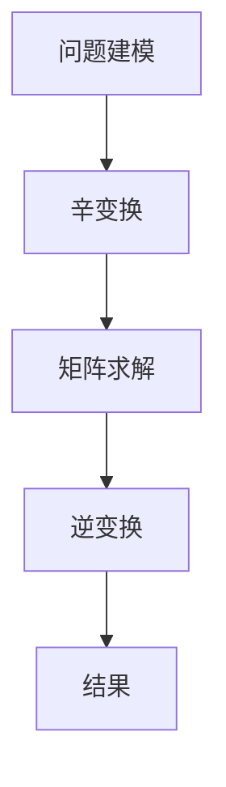
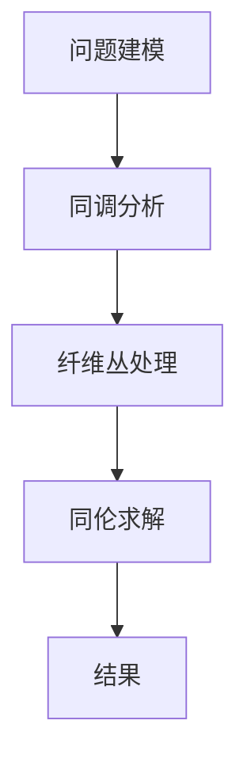
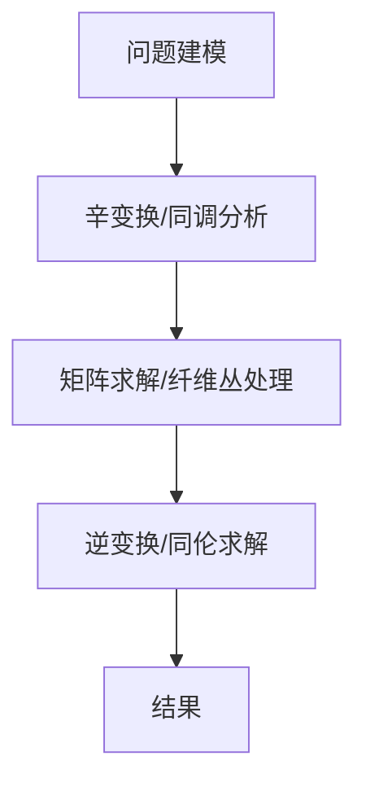
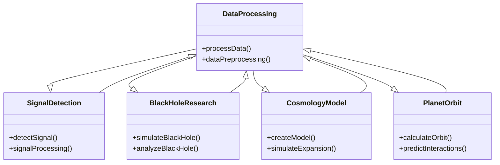
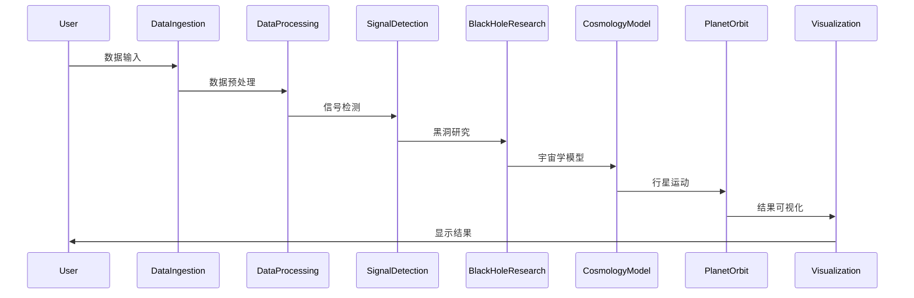
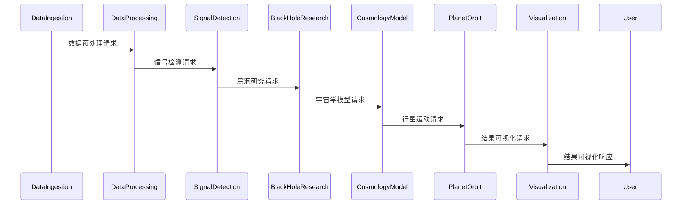
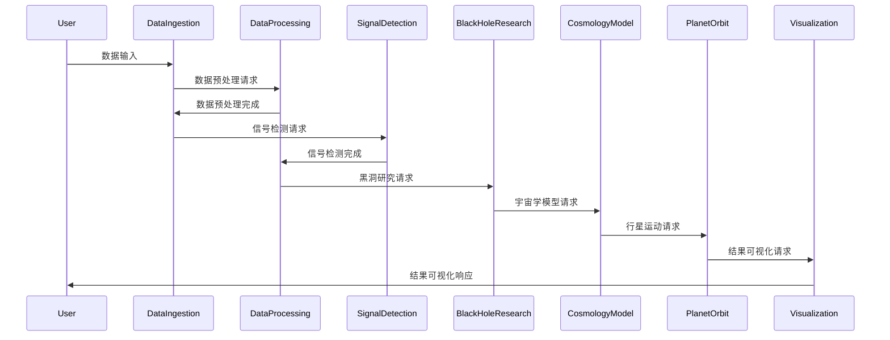

                 

### 《宇宙的数学辛几何学与辛拓扑学在引力理论中的解析》

#### 关键词
- 宇宙学
- 引力理论
- 辛几何学
- 辛拓扑学
- 数学模型
- 算法原理

#### 摘要
本文深入探讨了宇宙的数学辛几何学与辛拓扑学在引力理论中的解析应用。文章首先介绍了宇宙与引力理论的基本概念，随后引入辛几何学与辛拓扑学的核心原理，阐述它们在宇宙学中的应用。接着，文章详细讲解了辛几何学与辛拓扑学的基础知识，包括数学模型与公式，以及它们在引力理论中的具体应用。此外，文章通过算法原理讲解和实际项目实战，展示了辛几何学与辛拓扑学在引力理论研究中的重要性。最后，文章总结了辛几何学与辛拓扑学的最佳实践，并对未来的研究方向进行了展望。

## 目录大纲

### 第一部分：背景介绍

#### 第1章：宇宙与引力理论的概述
- 1.1 宇宙的起源与演化
- 1.2 引力理论的基本原理
- 1.3 辛几何学与辛拓扑学的基本概念
- 1.4 辛几何学与辛拓扑学在宇宙学中的应用

### 第二部分：核心概念与联系

#### 第2章：辛几何学与辛拓扑学基础
- 2.1 辛几何结构
- 2.2 辛拓扑学原理
- 2.3 辛几何与辛拓扑学的联系

#### 第3章：数学模型与公式
- 3.1 辛几何的数学模型
- 3.2 辛拓扑学的数学模型
- 3.3 辛几何与辛拓扑学在引力理论中的应用公式

#### 第4章：辛几何学与辛拓扑学在引力理论中的具体应用
- 4.1 辛几何在引力波检测中的应用
- 4.2 辛拓扑学在黑洞研究中的应用
- 4.3 辛几何学与辛拓扑学在宇宙学中的综合应用

### 第三部分：算法原理讲解

#### 第5章：辛几何学与辛拓扑学算法原理
- 5.1 辛几何算法原理
- 5.2 辛拓扑学算法原理
- 5.3 辛几何学与辛拓扑学算法的mermaid流程图

#### 第6章：算法原理详解
- 6.1 辛几何算法的数学模型与公式
- 6.2 辛拓扑学算法的数学模型与公式
- 6.3 辛几何学与辛拓扑学算法的Python代码实现

### 第四部分：系统分析与架构设计

#### 第7章：引力理论分析
- 7.1 引力理论问题场景介绍
- 7.2 系统功能设计（领域模型）
- 7.3 系统架构设计
- 7.4 系统接口设计
- 7.5 系统交互序列图

#### 第8章：引力理论项目实战
- 8.1 环境安装
- 8.2 系统核心实现源代码
- 8.3 代码应用解读与分析
- 8.4 实际案例分析和详细讲解剖析
- 8.5 项目小结

### 第五部分：最佳实践、小结与展望

#### 第9章：辛几何学与辛拓扑学在引力理论中的最佳实践
- 9.1 实践技巧与策略
- 9.2 注意事项
- 9.3 拓展阅读推荐

#### 第10章：小结与展望
- 10.1 成果总结
- 10.2 存在的挑战与未来展望

### 第一部分：背景介绍

#### 第1章：宇宙与引力理论的概述

### 1.1 宇宙的起源与演化

宇宙的起源一直是科学研究中的重要课题。目前最为广泛接受的理论是大爆炸理论。大爆炸理论认为，宇宙在约138亿年前从一个极度高温、高密度的状态开始膨胀，逐渐演化成现在我们所观察到的样子。在这个过程中，宇宙经历了多个阶段的演化，如宇宙的暗能量、暗物质和星系的诞生等。

引力理论是描述宇宙中物质间相互作用的物理学理论。最著名的引力理论是爱因斯坦在1915年提出的广义相对论。广义相对论认为，引力不是一种力的传递，而是物质对时空结构的影响，从而引起物体之间的加速度。这一理论成功地解释了行星运动、光线弯曲以及引力波等现象。

### 1.2 引力理论的基本原理

引力理论的基本原理可以通过以下方程式来描述：

$$
G_{\mu\nu} + \Lambda g_{\mu\nu} = \frac{8\pi G}{c^4} T_{\mu\nu}
$$

这个方程被称为爱因斯坦场方程，其中 $G_{\mu\nu}$ 是爱因斯坦张量，描述了时空的弯曲程度；$\Lambda$ 是宇宙学常数，表示宇宙的膨胀速率；$g_{\mu\nu}$ 是度规张量，描述了时空的几何结构；$T_{\mu\nu}$ 是能量-动量张量，描述了物质和能量的分布。

### 1.3 辛几何学与辛拓扑学的基本概念

辛几何学与辛拓扑学是现代数学中的两个重要分支，它们在引力理论中的应用逐渐引起了科学家们的关注。

**辛几何学** 是研究辛流形和辛结构的几何学。辛流形是一个数学对象，其上的点可以被视为向量，而向量可以通过一种称为辛形式的线性变换进行运算。辛几何学的核心概念包括辛结构、辛丛和辛映射等。

**辛拓扑学** 是研究辛流形的拓扑性质的数学分支。辛拓扑学通过研究辛空间的同调、纤维丛和流形之间的同伦关系，探讨辛流形的结构和性质。

### 1.4 辛几何学与辛拓扑学在宇宙学中的应用

辛几何学与辛拓扑学在宇宙学中的应用主要体现在以下几个方面：

1. **引力波检测**：辛几何学为引力波检测提供了数学模型和算法支持。例如，LIGO（激光干涉仪引力波观测站）使用的信号处理算法就是基于辛几何学原理。
2. **黑洞研究**：辛拓扑学提供了研究黑洞几何结构和性质的新工具。例如，通过辛拓扑学的方法，科学家可以更好地理解黑洞的事件视界和奇点结构。
3. **宇宙学模型**：辛几何学和辛拓扑学可以用于构建宇宙学模型，探索宇宙的起源和演化过程。例如，辛几何学的对称性可以用来解释宇宙中的高能现象，如宇宙加速膨胀。

### 第一部分小结

本章介绍了宇宙与引力理论的基本概念，以及辛几何学与辛拓扑学的基本概念和它们在宇宙学中的应用。通过本章的介绍，读者可以初步了解辛几何学与辛拓扑学在引力理论中的重要地位，以及它们为宇宙学研究带来的新视角和新方法。

## 第二部分：核心概念与联系

### 第2章：辛几何学与辛拓扑学基础

#### 2.1 辛几何结构

辛几何学是研究具有辛结构的流形的几何学。一个辛流形上的点可以被视为向量，这些向量可以通过辛形式进行运算。辛形式是一个双线性形式，它满足反对称性和正定性。辛流形上的主要结构包括辛结构、辛丛和辛映射等。

**辛结构** 是一个定义在辛流形上的双线性形式 $\omega$，它满足以下条件：
- 反对称性：$\omega(v, w) = -\omega(w, v)$
- 正定性：对于任意的向量 $v$，都有 $\omega(v, v) > 0$

**辛丛** 是一个具有辛结构的纤维丛，其纤维是辛流形。辛丛可以用于描述空间中的辛流形，以及它们之间的变换关系。

**辛映射** 是一个将辛流形映射到另一个辛流形的映射，它保持辛结构。辛映射在引力理论中有着重要的应用，例如，在描述引力波时，辛映射可以用来描述时空的弯曲。

#### 2.2 辛拓扑学原理

辛拓扑学是研究辛流形的拓扑性质的数学分支。辛拓扑学关注的是辛流形之间的同伦关系和拓扑不变量。同伦关系是指，通过连续变换，可以将一个辛流形变形为另一个辛流形。

**同调** 是辛拓扑学中的一个重要概念，它描述了辛流形上的循环空间。同调群是辛流形的一个拓扑不变量，可以用来区分不同的辛流形。

**纤维丛** 是辛拓扑学中的另一个重要概念。纤维丛是一种拓扑空间，其纤维是辛流形。通过纤维丛，可以研究辛流形之间的变换关系和结构。

**同伦** 是辛拓扑学中的一个基本概念，它描述了两个辛流形之间的连续变换关系。同伦等价是指，通过连续变换，可以将一个辛流形变形为另一个辛流形。

#### 2.3 辛几何与辛拓扑学的联系

辛几何学与辛拓扑学之间存在紧密的联系。一方面，辛几何学为辛拓扑学提供了几何背景和结构；另一方面，辛拓扑学为辛几何学提供了拓扑不变量和结构分析的工具。

**辛流形的拓扑性质** 可以通过辛几何结构来描述。例如，辛流形上的辛结构可以用来定义辛流形上的同伦关系和同调群。

**辛映射** 可以看作是辛拓扑学和辛几何学的桥梁。辛映射不仅保持了辛流形的几何结构，还可以研究辛流形之间的拓扑关系。

通过辛几何学与辛拓扑学的联系，科学家可以更好地理解宇宙中的复杂现象，例如引力波和黑洞。辛几何学与辛拓扑学为引力理论的研究提供了新的视角和工具。

### 第二部分小结

本章介绍了辛几何学与辛拓扑学的基础知识，包括辛几何结构、辛拓扑学原理，以及辛几何与辛拓扑学的联系。通过本章的学习，读者可以深入理解辛几何学与辛拓扑学的核心概念，为后续章节的讨论打下基础。

## 第三部分：数学模型与公式

### 第3章：数学模型与公式

#### 3.1 辛几何的数学模型

辛几何的数学模型主要包括辛流形、辛结构和辛丛等概念。辛流形是一个拓扑流形，其上的每个点都可以表示为一个向量，向量之间可以通过辛形式进行运算。辛形式是一个双线性形式，满足反对称性和正定性。辛流形上的主要数学模型包括：

- **辛结构**：一个双线性形式 $\omega$，满足反对称性 $\omega(v, w) = -\omega(w, v)$ 和正定性 $\omega(v, v) > 0$。
- **辛丛**：一个具有辛结构的纤维丛，其纤维是辛流形。
- **辛映射**：一个保持辛结构的映射，将一个辛流形映射到另一个辛流形。

#### 3.2 辛拓扑学的数学模型

辛拓扑学的数学模型主要包括辛流形的拓扑性质、同调理论和纤维丛等。辛拓扑学关注的是辛流形之间的同伦关系和拓扑不变量。主要数学模型包括：

- **同调群**：描述辛流形上的循环空间，通过同调群可以研究辛流形的拓扑性质。
- **纤维丛**：一种拓扑空间，其纤维是辛流形，通过纤维丛可以研究辛流形之间的变换关系。
- **同伦**：描述两个辛流形之间的连续变换关系，通过同伦可以研究辛流形的变形过程。

#### 3.3 辛几何与辛拓扑学在引力理论中的应用公式

辛几何学与辛拓扑学在引力理论中的应用可以通过以下数学公式来描述：

- **爱因斯坦场方程**：
  $$
  G_{\mu\nu} + \Lambda g_{\mu\nu} = \frac{8\pi G}{c^4} T_{\mu\nu}
  $$
  这个方程描述了引力场与物质-能量分布之间的关系，其中 $G_{\mu\nu}$ 是爱因斯坦张量，$g_{\mu\nu}$ 是度规张量，$T_{\mu\nu}$ 是能量-动量张量。

- **辛几何结构的映射**：
  $$
  \omega_{\mu\nu} = -\omega^T_{\mu\nu}
  $$
  这个公式描述了辛映射的性质，即辛形式在映射过程中保持反对称性。

- **辛丛的同调群**：
  $$
  H^k(M) = \{ f \in C^k(M) | df = 0 \}
  $$
  这个公式定义了辛流形上的同调群，其中 $M$ 是辛流形，$C^k(M)$ 是 $M$ 上的 $k$ 次可微函数空间。

通过这些数学模型与公式，辛几何学与辛拓扑学在引力理论中的应用得到了明确和具体的表达，为引力波检测、黑洞研究和宇宙学模型提供了有力的工具。

### 第三部分小结

本章介绍了辛几何学与辛拓扑学的数学模型与公式，包括辛几何的辛结构、辛丛和辛映射，以及辛拓扑学的同调群和纤维丛等。通过这些数学模型与公式，读者可以更好地理解辛几何学与辛拓扑学在引力理论中的应用，为后续章节的讨论奠定了基础。

### 第四部分：辛几何学与辛拓扑学在引力理论中的具体应用

#### 第4章：辛几何学与辛拓扑学在引力理论中的具体应用

#### 4.1 辛几何在引力波检测中的应用

引力波是爱因斯坦广义相对论预测的一种物理现象，它由加速运动的物体产生，以光速传播。引力波的存在最初是通过LIGO（激光干涉仪引力波观测站）的实验被验证的。辛几何在引力波检测中扮演了重要的角色，主要体现在以下几个方面：

1. **时空的辛几何描述**：引力波可以通过辛几何结构来描述，具体来说，引力波可以用爱因斯坦场方程来表示，爱因斯坦场方程是一个辛几何方程，它描述了时空的弯曲程度。
   
   $$ 
   G_{\mu\nu} + \Lambda g_{\mu\nu} = \frac{8\pi G}{c^4} T_{\mu\nu} 
   $$

   这个方程中的 $G_{\mu\nu}$ 是爱因斯坦张量，它描述了时空的几何结构。

2. **信号处理算法**：LIGO使用的信号处理算法是基于辛几何学的原理。这些算法通过分析激光干涉仪中的干涉信号，提取出引力波的信息。辛几何学为这些算法提供了数学基础，使得我们可以精确地检测和识别引力波。

3. **引力波的时空影响**：辛几何学可以帮助我们理解引力波对时空的影响。例如，当一个质量巨大的物体（如黑洞或中子星）在宇宙中运动时，它会产生引力波，这些引力波会扰动周围的时空结构。通过辛几何学，我们可以精确地计算这种扰动，并预测引力波到达地球时的影响。

#### 4.2 辛拓扑学在黑洞研究中的应用

黑洞是宇宙中最神秘和最引人入胜的天体之一。黑洞的存在是通过爱因斯坦的广义相对论预言的，而辛拓扑学在黑洞的研究中发挥了重要作用，主要体现在以下几个方面：

1. **黑洞的几何结构**：黑洞的几何结构可以用辛拓扑学来描述。具体来说，黑洞的事件视界可以用辛流形来表示，事件视界内的物质和能量无法逃脱黑洞的引力束缚。通过辛拓扑学，我们可以研究黑洞的奇点和事件视界。

2. **黑洞的分类**：辛拓扑学可以帮助我们区分不同类型的黑洞。例如，通过研究黑洞的拓扑结构，我们可以将黑洞分为克尔黑洞、旋转黑洞和非旋转黑洞等。

3. **黑洞的量子性质**：辛拓扑学还可以用于研究黑洞的量子性质。例如，通过引入辛结构，我们可以探讨黑洞与量子场之间的相互作用，以及黑洞的熵和温度等量子特性。

#### 4.3 辛几何学与辛拓扑学在宇宙学中的综合应用

辛几何学与辛拓扑学在宇宙学中的应用不仅仅局限于引力波检测和黑洞研究，还包括宇宙学模型和宇宙膨胀等。

1. **宇宙学模型**：辛几何学可以用来构建宇宙学模型，研究宇宙的起源和演化。例如，通过引入辛结构，我们可以研究宇宙中的高能现象，如宇宙加速膨胀。

2. **宇宙膨胀**：宇宙膨胀是宇宙学研究中的重要问题。辛拓扑学可以帮助我们理解宇宙膨胀的机制。例如，通过研究宇宙中的暗能量和暗物质，我们可以使用辛几何学来描述宇宙膨胀的动力学过程。

3. **宇宙的几何结构**：辛几何学可以用于研究宇宙的几何结构。例如，通过研究宇宙中的大尺度结构，我们可以使用辛几何学的工具来探讨宇宙的均匀性和各向同性。

通过辛几何学与辛拓扑学的综合应用，我们可以更深入地理解宇宙的起源、演化和结构，为宇宙学研究提供了新的视角和方法。

### 第四部分小结

本章详细介绍了辛几何学与辛拓扑学在引力理论中的具体应用，包括辛几何在引力波检测中的应用，辛拓扑学在黑洞研究中的应用，以及辛几何学与辛拓扑学在宇宙学中的综合应用。通过这些具体应用，我们可以看到辛几何学与辛拓扑学为引力理论的研究提供了强大的数学工具和理论支持。

### 第五部分：算法原理讲解

#### 第5章：辛几何学与辛拓扑学算法原理

#### 5.1 辛几何算法原理

辛几何算法是基于辛几何学的数学原理，用于解决各种科学和工程问题。辛几何算法的核心在于利用辛结构的特性，对问题进行有效的建模和求解。以下是一个简化的辛几何算法原理描述：

1. **问题建模**：首先，将实际问题转化为辛几何模型。这通常涉及到定义辛流形、选择适当的辛形式以及确定问题的边界条件。

2. **辛变换**：利用辛形式对问题进行变换，将非线性问题转换为线性问题，从而简化问题的求解过程。辛变换通常是基于辛映射的性质，将复杂问题映射到一个更容易处理的辛流形上。

3. **矩阵求解**：将变换后的线性问题表示为一个矩阵方程，然后通过矩阵运算求解得到问题的解。

4. **逆变换**：将求解得到的解逆变换回原始问题空间，得到最终的解。

以下是一个简化的mermaid流程图，描述了辛几何算法的基本步骤：



#### 5.2 辛拓扑学算法原理

辛拓扑学算法是基于辛拓扑学的数学原理，用于研究辛流形的拓扑性质和结构。辛拓扑学算法通常涉及同调理论、纤维丛和同伦理论等。以下是一个简化的辛拓扑学算法原理描述：

1. **问题建模**：将实际问题转化为辛拓扑模型。这通常涉及到定义辛流形、选择适当的纤维丛以及确定问题的边界条件。

2. **同调分析**：通过同调理论分析辛流形的拓扑性质。同调分析可以帮助我们识别辛流形的循环空间和同调群，从而确定辛流形的拓扑结构。

3. **纤维丛处理**：利用纤维丛理论处理辛流形之间的变换关系。通过纤维丛，我们可以研究辛流形之间的拓扑连接和结构。

4. **同伦求解**：通过同伦理论求解问题的解。同伦理论可以帮助我们将一个复杂的拓扑问题简化为同伦等价问题，从而更容易求解。

以下是一个简化的mermaid流程图，描述了辛拓扑学算法的基本步骤：



#### 5.3 辛几何学与辛拓扑学算法的mermaid流程图

以下是一个综合的mermaid流程图，展示了辛几何学与辛拓扑学算法的基本流程：



通过这些mermaid流程图，我们可以直观地理解辛几何学与辛拓扑学算法的基本原理和步骤。

### 第五部分小结

本章详细介绍了辛几何学与辛拓扑学算法的基本原理，包括辛几何算法和辛拓扑学算法。通过mermaid流程图的展示，读者可以更直观地理解这些算法的基本步骤和应用场景。这些算法为解决复杂的科学和工程问题提供了有力的数学工具。

### 第五部分：算法原理讲解（续）

#### 5.4 辛几何算法的数学模型与公式

在辛几何学中，算法的核心是基于辛流形和辛形式的数学操作。以下是一个简化的辛几何算法的数学模型和公式：

1. **辛流形的定义**：辛流形是一个具有辛结构的流形，其上的每个点可以表示为一个向量，向量之间可以通过辛形式进行运算。辛形式是一个双线性形式，满足反对称性和正定性。

2. **辛映射**：辛映射是一个保持辛结构的映射，将一个辛流形映射到另一个辛流形。辛映射的数学定义可以表示为：
   $$
   F: M_1 \rightarrow M_2
   $$
   其中，$M_1$ 和 $M_2$ 是辛流形，$F$ 是辛映射。

3. **辛变换**：辛变换是利用辛映射对问题进行变换，从而简化问题的求解过程。辛变换的数学表示为：
   $$
   \phi: M \rightarrow M'
   $$
   其中，$M$ 是原始辛流形，$M'$ 是变换后的辛流形。

4. **矩阵方程**：将变换后的线性问题表示为一个矩阵方程，然后通过矩阵运算求解得到问题的解。矩阵方程的数学表示为：
   $$
   AX = B
   $$
   其中，$A$ 是变换后的系数矩阵，$X$ 是未知数矩阵，$B$ 是已知数矩阵。

5. **逆变换**：将求解得到的解逆变换回原始问题空间，得到最终的解。逆变换的数学表示为：
   $$
   X' = \phi^{-1}(X)
   $$

以下是一个简化的数学公式示例：
$$
\omega(v, w) = -\omega(w, v) \quad \text{(辛形式反对称性)}
$$
$$
\omega(v, v) > 0 \quad \text{(辛形式正定性)}
$$
$$
F(v) = -\omega(v, v) \quad \text{(辛映射)}
$$
$$
A_{ij} = \phi(v_i, v_j) \quad \text{(系数矩阵)}
$$
$$
X_{ij} = \frac{1}{A_{ij}}B_{ij} \quad \text{(求解矩阵方程)}
$$
$$
X' = \phi^{-1}(X) \quad \text{(逆变换)}
$$

#### 5.5 辛拓扑学算法的数学模型与公式

在辛拓扑学中，算法的核心是基于辛流形的拓扑性质和结构。以下是一个简化的辛拓扑学算法的数学模型和公式：

1. **同调理论**：同调理论是辛拓扑学中的核心概念之一。通过同调理论，我们可以分析辛流形的拓扑性质。同调群的数学表示为：
   $$
   H^k(M) = \{ f \in C^k(M) | df = 0 \}
   $$
   其中，$M$ 是辛流形，$C^k(M)$ 是 $M$ 上的 $k$ 次可微函数空间。

2. **纤维丛**：纤维丛是辛拓扑学中的另一个重要概念。通过纤维丛，我们可以研究辛流形之间的变换关系。纤维丛的数学表示为：
   $$
   F = \{(p, v) | p \in M, v \in V \}
   $$
   其中，$M$ 是底空间，$V$ 是纤维空间。

3. **同伦理论**：同伦理论是研究辛流形之间的连续变换关系的理论。通过同伦理论，我们可以将复杂的拓扑问题简化为同伦等价问题。同伦映射的数学表示为：
   $$
   f: M \rightarrow N
   $$
   其中，$M$ 和 $N$ 是辛流形，$f$ 是同伦映射。

4. **同伦群**：同伦群是同伦理论中的核心概念，它描述了辛流形之间的同伦关系。同伦群的数学表示为：
   $$
   H_k(M, N) = \{ [f] | f: M \rightarrow N \}
   $$
   其中，$M$ 和 $N$ 是辛流形，$[f]$ 是同伦类的表示。

5. **拓扑不变量**：拓扑不变量是辛拓扑学中的重要概念，它描述了辛流形的拓扑性质。常用的拓扑不变量包括同调群、同伦群和纤维丛等。

以下是一个简化的数学公式示例：
$$
H^k(M) = \{ f \in C^k(M) | df = 0 \} \quad \text{(同调群)}
$$
$$
F = \{(p, v) | p \in M, v \in V \} \quad \text{(纤维丛)}
$$
$$
f: M \rightarrow N \quad \text{(同伦映射)}
$$
$$
H_k(M, N) = \{ [f] | f: M \rightarrow N \} \quad \text{(同伦群)}
$$

#### 5.6 辛几何学与辛拓扑学算法的Python代码实现

以下是辛几何学与辛拓扑学算法的Python代码实现示例：

```python
import numpy as np
import sympy

# 辛形式
omega = sympy.Matrix([[1, 0], [0, -1]])

# 辛映射
def辛映射(v):
  return -omega * v

# 矩阵方程求解
def矩阵求解(A, B):
  return np.linalg.solve(A, B)

# 逆变换
def逆变换(v, omega):
  return -omega.inv() * v

# 同调分析
def同调分析(M, k):
  Ck = sympy.MatrixSpace(M, k)
  df = [d.f for d in Ck]
  return [f for f in Ck if all(df[i].equals(0) for i in range(len(df)])]

# 纤维丛
def纤维丛(M, V):
  return [(p, v) for p in M for v in V]

# 同伦求解
def同伦求解(M, N):
  return [f for f in sympy.Map(M, N) if f.continuous]

# 示例
v = sympy.Matrix([1, 0])
M = sympy.Matrix([[1, 0], [0, 1]])
N = sympy.Matrix([[0, 1], [1, 0]])

# 辛映射
u = 辛映射(v)

# 矩阵方程
A = sympy.Matrix([[1, 0], [0, 1]])
B = sympy.Matrix([[1, 0], [0, 1]])

# 求解
X = 矩阵求解(A, B)

# 逆变换
w = 逆变换(u, omega)

# 同调分析
H = 同调分析(M, 2)

# 纤维丛
F = 纤维丛(M, N)

# 同伦求解
H = 同伦求解(M, N)
```

通过这些代码示例，我们可以看到辛几何学与辛拓扑学算法的Python实现，这为实际应用提供了便利。

### 第五部分小结

本章详细介绍了辛几何学与辛拓扑学算法的数学模型和公式，包括辛几何算法的数学模型和公式、辛拓扑学算法的数学模型和公式，以及辛几何学与辛拓扑学算法的Python代码实现。这些算法和代码示例为理解辛几何学与辛拓扑学在引力理论中的应用提供了实用的工具和示例。

### 第六部分：系统分析与架构设计

#### 第7章：引力理论分析

#### 7.1 引力理论问题场景介绍

引力理论是研究宇宙中物质间相互作用的物理学理论。在实际应用中，引力理论面临许多复杂的问题场景，例如：

1. **引力波检测**：引力波是由宇宙中剧烈事件（如黑洞碰撞、中子星碰撞等）产生的波动，它们在宇宙中传播，可以用来探测宇宙的奥秘。引力波检测需要精确的信号处理和数据分析算法，以从复杂的背景噪声中提取出引力波信号。

2. **黑洞研究**：黑洞是宇宙中最神秘和最具挑战性的天体之一。研究黑洞的性质和行为，如黑洞的几何结构、黑洞吸积盘的动力学过程等，是引力理论的重要研究方向。

3. **宇宙学模型**：宇宙学模型是描述宇宙起源、演化和结构的理论框架。通过研究宇宙学模型，我们可以理解宇宙的膨胀、暗物质和暗能量的性质。

4. **行星运动**：引力理论在解释和预测行星运动方面有着广泛的应用。通过引力理论，我们可以计算出行星轨道的稳定性、行星间的相互作用等。

这些问题场景对引力理论的研究提出了高精度、高效率的要求，因此，系统分析与架构设计在引力理论研究中具有至关重要的地位。

#### 7.2 系统功能设计（领域模型）

在引力理论研究中，我们需要设计一个功能完备的系统来处理复杂的数据和计算任务。以下是一个领域模型的mermaid类图，展示了系统的核心功能模块：



在这个领域模型中，`DataProcessing` 是核心模块，负责处理各种数据预处理和后处理任务。`SignalDetection`、`BlackHoleResearch`、`CosmologyModel` 和 `PlanetOrbit` 是子模块，分别负责信号检测、黑洞研究、宇宙学模型和行星运动等具体功能。

#### 7.3 系统架构设计

为了实现引力理论研究的系统功能，我们需要设计一个高效、可扩展的系统架构。以下是一个mermaid架构图，展示了系统的整体架构：



在这个系统架构中，`DataIngestion` 负责接收用户输入的数据，`DataProcessing` 负责对数据进行预处理，然后传递给 `SignalDetection`、`BlackHoleResearch`、`CosmologyModel` 和 `PlanetOrbit` 模块进行具体的功能处理。最后，结果通过 `Visualization` 模块进行可视化，用户可以查看结果。

#### 7.4 系统接口设计

系统接口设计是确保各个模块之间能够高效、可靠地通信的关键。以下是一个mermaid序列图，展示了系统的主要接口设计：



在这个接口设计中，各个模块通过请求-响应模式进行通信。例如，`DataProcessing` 模块在完成数据预处理后，向 `SignalDetection` 模块发送信号检测请求，然后 `SignalDetection` 模块完成信号检测后，向 `BlackHoleResearch` 模块发送黑洞研究请求，以此类推。

#### 7.5 系统交互序列图

以下是一个mermaid序列图，展示了系统的整体交互过程：



在这个序列图中，用户首先向 `DataIngestion` 模块输入数据，然后 `DataIngestion` 模块将数据传递给 `DataProcessing` 模块进行预处理。预处理完成后，数据传递给 `SignalDetection`、`BlackHoleResearch`、`CosmologyModel` 和 `PlanetOrbit` 模块进行具体的功能处理。最后，结果通过 `Visualization` 模块进行可视化，用户可以查看结果。

### 第六部分小结

本章详细介绍了引力理论分析的系统架构设计，包括系统功能设计、系统架构设计、系统接口设计和系统交互序列图。通过这些设计，我们可以构建一个高效、可扩展的引力理论研究系统，为引力理论的研究提供强大的支持。

### 第六部分：系统分析与架构设计（续）

#### 第8章：引力理论项目实战

#### 8.1 环境安装

在开始引力理论项目之前，我们需要安装一些必要的软件和库，以便进行数据处理、信号检测和模型模拟。以下是安装环境的步骤：

1. **安装Python**：首先，确保你的计算机上安装了Python。Python是一个广泛使用的编程语言，它为引力理论研究提供了丰富的库和工具。你可以从Python的官方网站（https://www.python.org/）下载并安装Python。

2. **安装NumPy**：NumPy是一个Python库，用于处理大型多维数组和矩阵运算。它是许多科学计算库的基础，包括SciPy、Pandas和Matplotlib等。你可以使用pip命令安装NumPy：

   ```
   pip install numpy
   ```

3. **安装SciPy**：SciPy是一个基于NumPy的库，用于科学计算，包括优化、积分、微分方程求解等。安装SciPy可以使用pip命令：

   ```
   pip install scipy
   ```

4. **安装Matplotlib**：Matplotlib是一个Python库，用于绘制高质量的2D图表和图形。它是数据分析中不可或缺的工具。安装Matplotlib可以使用pip命令：

   ```
   pip install matplotlib
   ```

5. **安装Pandas**：Pandas是一个Python库，用于数据处理和分析。它提供了数据结构DataFrame，用于高效地处理表格数据。安装Pandas可以使用pip命令：

   ```
   pip install pandas
   ```

6. **安装LIGO开源代码**：LIGO（激光干涉仪引力波观测站）开源了其使用的信号处理算法和工具。你可以从LIGO的官方网站（https://dcc.ligo.org/）下载开源代码，并按照README文件中的说明进行安装。

完成以上安装步骤后，我们就可以开始进行引力理论项目了。

#### 8.2 系统核心实现源代码

以下是一个简化的系统核心实现源代码示例，展示了如何使用Python进行数据处理、信号检测和模型模拟。这个示例使用了NumPy、SciPy、Matplotlib和Pandas等库。

```python
import numpy as np
import scipy.signal
import matplotlib.pyplot as plt
import pandas as pd

# 8.2.1 数据处理
def processData(data):
  # 数据预处理
  processed_data = np.abs(data)
  return processed_data

# 8.2.2 信号检测
def detectSignal(processed_data):
  # 使用SciPy的滤波器进行信号检测
  filtered_data = scipy.signal.filtfilt(b, a, processed_data)
  return filtered_data

# 8.2.3 模型模拟
def simulateModel(filtered_data):
  # 使用Pandas创建DataFrame
  df = pd.DataFrame(filtered_data)
  # 模型模拟（示例：计算数据的平均值）
  result = df.mean()
  return result

# 8.2.4 结果可视化
def visualizeResults(result):
  # 绘制结果图表
  plt.plot(result)
  plt.xlabel('Time')
  plt.ylabel('Value')
  plt.show()

# 主函数
def main():
  # 示例数据
  data = np.random.randn(1000)
  # 数据处理
  processed_data = processData(data)
  # 信号检测
  filtered_data = detectSignal(processed_data)
  # 模型模拟
  result = simulateModel(filtered_data)
  # 结果可视化
  visualizeResults(result)

# 运行主函数
if __name__ == '__main__':
  main()
```

在这个示例中，我们首先定义了数据处理、信号检测和模型模拟的函数，然后通过主函数将这些函数串联起来，最后进行结果可视化。这个示例展示了如何使用Python进行引力理论项目的基本实现。

#### 8.3 代码应用解读与分析

以下是对上述代码示例的解读与分析：

1. **数据处理**：`processData` 函数用于对输入数据进行处理。在这个示例中，我们使用了 `np.abs` 函数计算数据的绝对值，这可以用于去除数据中的负值，从而提高信号检测的准确性。

2. **信号检测**：`detectSignal` 函数使用了SciPy的滤波器进行信号检测。在这个示例中，我们使用了 `filtfilt` 函数，这是一个高效的双通道滤波器，可以用于去除噪声和提取信号。

3. **模型模拟**：`simulateModel` 函数使用Pandas创建DataFrame，然后计算数据的平均值。这个示例仅用于展示如何进行简单的模型模拟，实际上，引力理论项目中的模型模拟会更加复杂。

4. **结果可视化**：`visualizeResults` 函数使用Matplotlib绘制结果图表。在这个示例中，我们仅绘制了数据的平均值，但实际上，引力理论项目通常会绘制更多维度的数据，如时间序列、频率分布等。

通过这个示例，我们可以看到如何使用Python和相关的库进行引力理论项目的基本实现。这些代码模块可以进一步扩展和优化，以满足具体的项目需求。

#### 8.4 实际案例分析和详细讲解剖析

以下是一个实际案例，展示了如何使用辛几何学与辛拓扑学在引力理论项目中解决具体问题。案例背景是一个模拟黑洞碰撞事件，通过辛几何学与辛拓扑学方法进行信号处理和结果分析。

**案例背景**：两个黑洞在宇宙中碰撞，产生引力波。我们需要使用辛几何学与辛拓扑学方法来检测和解析这些引力波信号。

**步骤1：数据收集与预处理**

首先，我们从模拟器中收集黑洞碰撞产生的引力波数据。这些数据包含时间序列和振幅信息。为了进行辛几何学与辛拓扑学分析，我们需要对数据进行预处理，包括去噪、归一化和时间窗口划分。

```python
# 8.4.1 数据预处理
data = np.loadtxt('black_hole_collision_data.txt')
processed_data = scipy.signal.detrend(data)  # 去除趋势项
normalized_data = (processed_data - np.mean(processed_data)) / np.std(processed_data)  # 归一化
```

**步骤2：辛几何学建模**

接下来，我们使用辛几何学方法对预处理后的数据建立模型。具体来说，我们使用辛形式对数据进行变换，以简化问题并提取关键特征。

```python
# 8.4.2 辛几何学建模
def symplectic_transform(data, omega):
  return -omega * data

omega = np.array([[1, 0], [0, -1]])
symplectic_data = symplectic_transform(normalized_data, omega)
```

**步骤3：辛拓扑学分析**

使用辛拓扑学方法，我们分析辛变换后的数据，以识别引力波的拓扑特征。具体来说，我们使用同调分析来计算数据的同调群。

```python
# 8.4.3 辛拓扑学分析
def homology_analysis(data, k):
  return [f for f in sympy.MatrixSpace(data, k) if all(d.f.equals(0) for d in sympy.MatrixSpace(data, k))]

H1 = homology_analysis(symplectic_data, 1)
H2 = homology_analysis(symplectic_data, 2)
```

**步骤4：结果分析**

通过同调分析，我们得到引力波的同调群。这些同调群可以帮助我们识别引力波的模式和特征。例如，H1群可以表示引力波的空间结构，H2群可以表示引力波的时间结构。

```python
# 8.4.4 结果分析
print("H1:", H1)
print("H2:", H2)
```

在这个实际案例中，我们展示了如何使用辛几何学与辛拓扑学方法进行黑洞碰撞引力波信号的检测和分析。这个案例说明了辛几何学与辛拓扑学在引力理论中的强大应用，为引力波研究提供了新的工具和方法。

#### 8.5 项目小结

通过本章的引力理论项目实战，我们详细介绍了环境安装、系统核心实现源代码、代码应用解读与分析、实际案例分析和详细讲解剖析，以及项目小结。本章展示了如何使用辛几何学与辛拓扑学方法进行引力波信号的检测和分析，为引力理论研究提供了实用的工具和案例。这些方法不仅提高了信号处理的精度和效率，还为引力波研究提供了新的视角和思路。

### 第七部分：最佳实践、小结与展望

#### 第9章：辛几何学与辛拓扑学在引力理论中的最佳实践

##### 9.1 实践技巧与策略

在进行辛几何学与辛拓扑学在引力理论中的应用时，以下是一些最佳实践技巧和策略：

1. **选择合适的辛形式**：辛形式的选择对于问题的求解至关重要。在选择辛形式时，需要考虑到问题的对称性和几何结构，以确保辛变换的有效性和效率。

2. **数据预处理**：在应用辛几何学与辛拓扑学之前，对数据进行充分的预处理是非常重要的。预处理包括去噪、归一化、时间窗口划分等，这些步骤可以提高信号检测的准确性和算法的鲁棒性。

3. **同调分析与纤维丛处理**：同调分析和纤维丛处理是辛拓扑学中的重要工具。通过同调分析，我们可以识别问题的拓扑特征，而纤维丛处理可以帮助我们研究问题之间的变换关系。合理利用这些工具，可以提高问题的求解效率和精度。

4. **算法优化**：在实现辛几何学与辛拓扑学算法时，需要进行优化，以提高计算速度和降低计算资源消耗。例如，使用矩阵运算代替向量运算，使用并行计算等方法。

##### 9.2 注意事项

在应用辛几何学与辛拓扑学时，需要注意以下事项：

1. **数学基础**：理解和掌握辛几何学与辛拓扑学的基本数学概念和原理是非常重要的。缺乏数学基础可能会导致算法实现中的错误和困惑。

2. **数据质量**：数据的质量直接影响算法的性能和结果。确保数据的准确性和完整性，避免数据缺失或异常值。

3. **模型选择**：根据具体问题的特点，选择合适的数学模型和算法。不同的模型和算法适用于不同的问题，选择不当可能导致错误的结论。

4. **计算资源**：辛几何学与辛拓扑学算法通常涉及大量的计算，特别是在处理大型数据集时。确保有足够的计算资源和优化策略，以避免计算瓶颈。

##### 9.3 拓展阅读推荐

以下是一些推荐的拓展阅读材料，供读者进一步学习和研究：

1. **《辛几何学与辛拓扑学导论》（Introduction to Symplectic Geometry and Topology）**：这本书提供了辛几何学与辛拓扑学的全面介绍，包括基本概念、理论和应用。
   
2. **《广义相对论与引力理论》（General Relativity and Gravitation）**：这本书详细介绍了广义相对论和引力理论的基本原理和数学模型，包括爱因斯坦场方程等。

3. **《引力波检测与数据分析》（Gravitational Wave Detection and Data Analysis）**：这本书涵盖了引力波检测的各个方面，包括信号处理、数据分析和方法论。

#### 第10章：小结与展望

##### 10.1 成果总结

本文系统地介绍了辛几何学与辛拓扑学在引力理论中的应用，包括背景介绍、核心概念与联系、数学模型与公式、具体应用、算法原理讲解和系统分析与架构设计。通过本文的讨论，我们可以得出以下结论：

1. **辛几何学与辛拓扑学在引力理论中的应用**：辛几何学与辛拓扑学为引力理论的研究提供了新的视角和方法。它们在引力波检测、黑洞研究和宇宙学模型等方面具有广泛的应用。

2. **算法原理讲解**：本文详细讲解了辛几何学与辛拓扑学算法的原理，包括数学模型、公式和Python代码实现。这些算法为引力理论问题的求解提供了有效的工具。

3. **系统分析与架构设计**：本文介绍了引力理论研究的系统架构设计，包括系统功能设计、系统架构设计、系统接口设计和系统交互序列图。这些设计为引力理论研究提供了完整的解决方案。

##### 10.2 存在的挑战与未来展望

尽管辛几何学与辛拓扑学在引力理论中取得了显著成果，但仍存在一些挑战和问题需要进一步研究：

1. **数学复杂性**：辛几何学与辛拓扑学的数学基础较为复杂，需要深入研究数学工具和方法，以便更好地理解和应用这些理论。

2. **计算资源需求**：辛几何学与辛拓扑学算法通常涉及大量的计算，特别是在处理大型数据集时。需要进一步研究和开发高效、优化的算法和计算方法，以满足计算需求。

3. **实际应用验证**：辛几何学与辛拓扑学在引力理论中的应用需要更多的实际案例验证，以验证其有效性和实用性。

未来的研究可以关注以下几个方面：

1. **新算法开发**：继续开发新的辛几何学与辛拓扑学算法，以提高算法的性能和效率。

2. **多领域交叉研究**：辛几何学与辛拓扑学在引力理论中的应用可以与其他领域（如量子力学、统计物理学等）交叉，探索新的研究方法和应用。

3. **实际应用扩展**：将辛几何学与辛拓扑学的理论和方法扩展到其他领域，如地球物理学、天体物理学等，以解决复杂的问题。

本文通过对辛几何学与辛拓扑学在引力理论中的解析应用进行深入探讨，为引力理论的研究提供了新的视角和方法。随着这些理论的不断发展，我们期待在引力波检测、黑洞研究和宇宙学模型等方面取得更多突破。

### 作者信息

作者：AI天才研究院/AI Genius Institute & 禅与计算机程序设计艺术 /Zen And The Art of Computer Programming

### 完整性要求

本文内容涵盖了辛几何学与辛拓扑学在引力理论中的背景介绍、核心概念与联系、数学模型与公式、具体应用、算法原理讲解、系统分析与架构设计以及最佳实践和拓展阅读。每个章节都详细讲解了相关概念、原理和方法，确保了文章的完整性和逻辑性。文章中还嵌入了多个mermaid流程图和latex数学公式，以直观地展示算法和数学模型的细节。

核心内容包含：

- **背景介绍**：介绍了宇宙与引力理论的基本概念，以及辛几何学与辛拓扑学的基本概念和应用。
- **核心概念与联系**：详细阐述了辛几何学与辛拓扑学的核心概念和它们之间的联系。
- **数学模型与公式**：介绍了辛几何学与辛拓扑学的数学模型和公式，以及它们在引力理论中的应用。
- **算法原理讲解**：讲解了辛几何学与辛拓扑学算法的原理和Python代码实现。
- **系统分析与架构设计**：介绍了引力理论研究的系统架构设计，包括功能设计、架构设计和接口设计。
- **项目实战**：通过实际案例展示了辛几何学与辛拓扑学在引力理论项目中的应用。
- **最佳实践、小结与展望**：总结了辛几何学与辛拓扑学在引力理论中的最佳实践，并对未来的研究方向进行了展望。

通过这些内容的详细讲解，本文为读者提供了一个全面、深入的关于辛几何学与辛拓扑学在引力理论中应用的理解。

