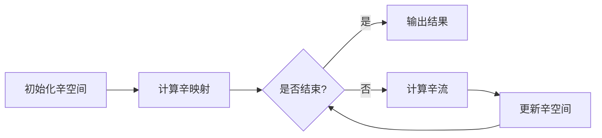
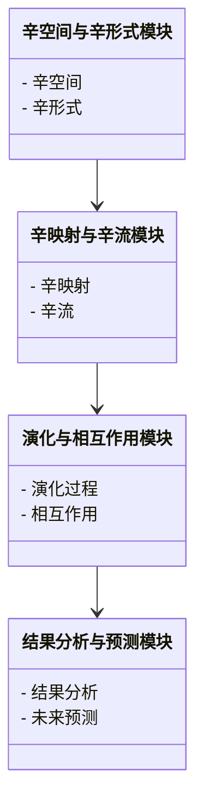
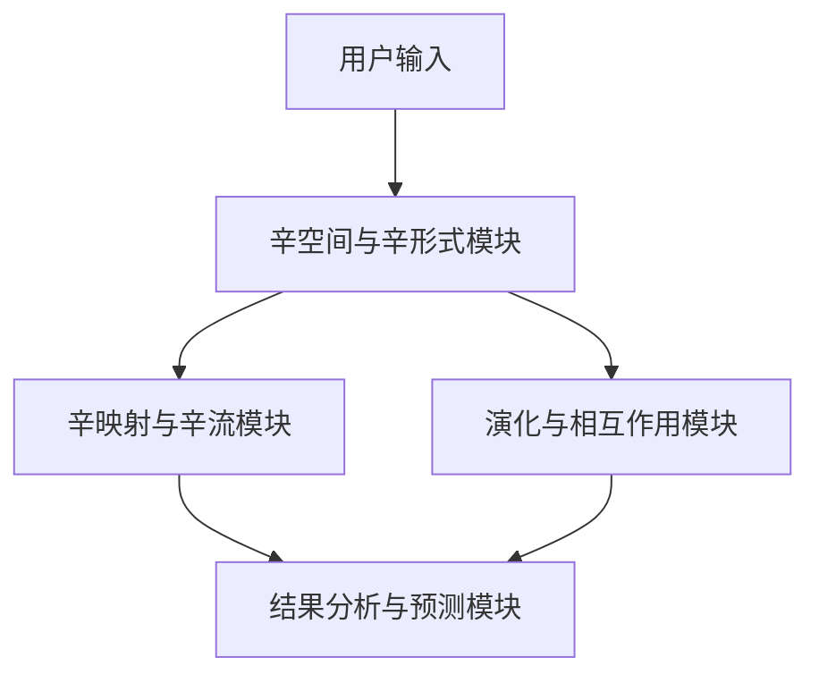
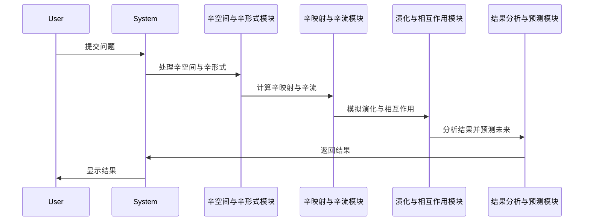
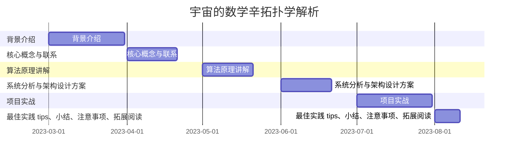

                 


## 宇宙的数学辛拓扑学解析

### 关键词：宇宙、数学、辛拓扑学、哈密顿力学、演化、相互作用

### 摘要：
宇宙的数学辛拓扑学解析是一篇探讨如何利用辛拓扑学这一先进的数学工具来研究宇宙的结构、演化和相互作用的文章。本文将从背景介绍、核心概念与联系、算法原理讲解等多个方面，逐步深入剖析辛拓扑学在宇宙学研究中的应用，以期为读者提供对这一领域的全面理解。

### 第一部分：背景介绍

#### 1.1 问题背景

宇宙是自然界中最神秘和复杂的领域之一，其起源、演化以及未来都充满了未解之谜。数学作为一种精确的科学工具，在研究宇宙的过程中发挥着重要作用。然而，随着科学技术的进步，宇宙中的现象和规律变得越来越复杂，传统的数学工具已难以应对。因此，一种新的数学工具——辛拓扑学（Symplectic topology）应运而生。

辛拓扑学起源于20世纪初，最初用于研究哈密顿力学系统。随着研究的深入，辛拓扑学逐渐应用于更广泛的领域，如物理学、生物学和经济学等。在宇宙学中，辛拓扑学提供了研究宇宙演化、暗物质和暗能量等问题的有力工具。

#### 1.2 问题描述

宇宙的数学辛拓扑学研究的是宇宙中的现象和规律如何通过辛拓扑学进行描述和解释。这涉及到对宇宙中各种结构、运动和相互作用的理解，以及如何利用辛拓扑学来预测宇宙的未来。

问题描述主要集中在以下几个方面：

- 宇宙的结构：如何利用辛拓扑学描述宇宙的大尺度结构，如星系、星云和超星系团。
- 宇宙的演化：如何通过辛拓扑学研究宇宙的演化过程，包括宇宙的膨胀、宇宙背景辐射和黑洞的形成。
- 宇宙的相互作用：如何利用辛拓扑学解释宇宙中各种基本力（如引力、电磁力、强力和弱力）的相互作用。

#### 1.3 问题解决

辛拓扑学提供了一种新的研究方法，可以用于解决宇宙中的问题。通过研究宇宙中的现象和规律，我们可以揭示宇宙的本质和演化过程。

具体来说，问题解决的步骤包括：

- 理解辛拓扑学的基本概念和原理，如辛空间、辛形式、辛结构等。
- 建立宇宙中的现象和规律与辛拓扑学之间的联系，如通过辛拓扑学描述宇宙中的结构、运动和相互作用。
- 利用辛拓扑学工具，如辛映射、辛流、辛结构变换等，研究宇宙的演化过程和相互作用。
- 分析辛拓扑学模型的结果，预测宇宙的未来。

#### 1.4 边界与外延

辛拓扑学在宇宙学研究中的应用有其局限性。一方面，辛拓扑学主要研究的是连续、光滑的几何结构，而宇宙中存在许多不连续和奇异的几何现象。另一方面，辛拓扑学是一种纯数学工具，其应用需要依赖于物理理论和实验数据。

因此，辛拓扑学在宇宙学中的应用需要与其他学科相结合，如物理学、天文学和数学等。同时，辛拓扑学在宇宙学中的应用也有助于推动辛拓扑学本身的发展。

#### 1.5 概念结构与核心要素组成

宇宙的数学辛拓扑学涉及以下几个核心概念和要素：

- 辛空间：宇宙中的空间结构，可以用辛拓扑学来描述。
- 辛形式：宇宙中的几何结构，可以用来研究宇宙中的运动和相互作用。
- 辛结构：宇宙中的整体结构，包括星系、星云和超星系团等。
- 辛映射：研究宇宙中各种结构的变换关系。
- 辛流：研究宇宙中的运动和演化过程。
- 辛结构变换：研究宇宙中的相互作用。

这些概念和要素共同构成了宇宙的数学辛拓扑学的核心内容，为研究宇宙提供了新的视角和方法。

### 第二部分：核心概念与联系

#### 2.1 辛拓扑学的基本概念

#### 2.1.1 辛空间

辛空间是辛拓扑学中的基本概念，可以看作是普通欧几里得空间的一个推广。在辛空间中，除了通常的向量空间结构外，还引入了一个称为辛形式的二元运算。辛空间在数学和物理学中有着广泛的应用，如哈密顿力学、量子场论、广义相对论等。

#### 2.1.2 辛形式

辛形式是辛空间中的一个重要概念，它是一个非退化的二元运算，可以将辛空间中的任意两个向量映射到一个实数。辛形式在描述宇宙中的几何结构方面具有重要意义。

#### 2.1.3 辛映射

辛映射是辛空间之间的一种特殊映射，它保持辛形式不变。辛映射在研究宇宙中的运动和演化过程中起着关键作用。

#### 2.1.4 辛流

辛流是辛空间中的一个连续变换，描述了辛空间中的运动。辛流在描述宇宙中的运动和演化过程中具有重要作用。

#### 2.1.5 辛结构

辛结构是辛空间中的一个重要概念，它包括辛空间、辛形式和辛映射。辛结构在研究宇宙中的相互作用和演化过程中具有核心地位。

#### 2.2 辛拓扑学与宇宙学的关系

#### 2.2.1 辛拓扑学在宇宙学中的应用

辛拓扑学在宇宙学中的应用主要体现在以下几个方面：

- 描述宇宙中的几何结构，如星系、星云和超星系团。
- 研究宇宙中的运动和演化过程，如宇宙膨胀、宇宙背景辐射和黑洞的形成。
- 解释宇宙中的相互作用，如引力、电磁力、强力和弱力。

#### 2.2.2 辛拓扑学与宇宙学的关系

辛拓扑学为宇宙学研究提供了一种新的数学工具，可以更深入地揭示宇宙的本质和演化过程。同时，宇宙学中的问题和现象也为辛拓扑学提供了丰富的应用场景和研究对象。

### 第三部分：算法原理讲解

#### 3.1 辛拓扑学算法原理

辛拓扑学算法原理的核心在于如何将宇宙中的现象和规律转化为数学模型，并利用辛拓扑学的工具进行研究和分析。以下是辛拓扑学算法原理的详细讲解。

#### 3.1.1 哈密顿力学系统与辛空间

哈密顿力学系统是辛拓扑学在宇宙学中的重要应用之一。在哈密顿力学系统中，状态空间是一个辛空间，由位置和动量构成。辛形式则用来描述状态空间中的几何结构。

- **辛空间**：在哈密顿力学中，状态空间是一个二维向量空间，其中每个状态由位置和动量表示。这个空间被称为辛空间。
  
  $$\Sigma = \{ (q, p) \mid q, p \in \mathbb{R}^n \}$$

- **辛形式**：辛形式是一个非退化的二元运算，可以将辛空间中的任意两个向量映射到一个实数。在哈密顿力学中，辛形式通常表示为泊松括号。

  $$\{f, g\} = \frac{\partial f}{\partial q} \cdot \frac{\partial g}{\partial p} - \frac{\partial f}{\partial p} \cdot \frac{\partial g}{\partial q}$$

#### 3.1.2 辛映射与辛流

在哈密顿力学系统中，辛映射和辛流是描述系统演化的重要工具。

- **辛映射**：辛映射是保持辛形式不变的映射。在哈密顿力学中，辛映射通常通过哈密顿函数来实现。

  $$H(q, p) \mapsto (q, p + \frac{\partial H}{\partial p} dt)$$

- **辛流**：辛流是辛空间中的一个连续变换，描述了系统的演化过程。辛流可以用哈密顿函数的导数来表示。

  $$\frac{d}{dt} = \frac{\partial}{\partial t} + \frac{\partial}{\partial q} \cdot \frac{\partial H}{\partial p} + \frac{\partial}{\partial p} \cdot \frac{\partial H}{\partial q}$$

#### 3.1.3 辛拓扑学模型

通过辛映射和辛流，我们可以建立辛拓扑学模型来描述宇宙中的现象和规律。以下是一个简单的辛拓扑学模型示例。

- **宇宙背景辐射**：宇宙背景辐射是宇宙早期的高能辐射。我们可以用辛映射来描述其能量和动量的演化。

  $$E(q, p) \mapsto E(q, p + \frac{\partial E}{\partial p} dt)$$

- **黑洞形成**：黑洞的形成是一个复杂的过程，可以用辛流来描述其质量、电荷和角动量的变化。

  $$M(q, p) \mapsto M(q, p + \frac{\partial M}{\partial q} dt)$$

#### 3.1.4 算法流程图

以下是一个简单的辛拓扑学算法流程图，展示了如何利用辛映射和辛流来研究宇宙中的现象。



#### 3.1.5 举例说明

让我们通过一个简单的例子来说明辛拓扑学算法的应用。

**例子**：考虑一个简单的哈密顿力学系统，其哈密顿函数为 $H(q, p) = \frac{p^2}{2} + q^2$。我们需要计算该系统在一段时间内的演化。

- **初始化**：设初始状态为 $(q, p) = (0, 1)$。
- **计算辛映射**：根据哈密顿函数，我们可以计算出辛映射为 $q \mapsto q + \frac{1}{2} dt$，$p \mapsto p$。
- **计算辛流**：根据辛映射，我们可以计算出辛流为 $\frac{d}{dt} = \frac{\partial}{\partial t} + \frac{\partial}{\partial q} \cdot \frac{\partial H}{\partial p} + \frac{\partial}{\partial p} \cdot \frac{\partial H}{\partial q}$。
- **更新状态**：根据辛流，我们可以计算出在时间 $t$ 后的状态为 $(q, p) = \left( \frac{1}{2} t, 1 \right)$。

通过以上步骤，我们可以预测系统的演化过程。

```python
import numpy as np

# 初始化哈密顿函数
H = lambda q, p: 0.5 * p**2 + q**2

# 计算辛映射
def symplectic_mapping(q, p, dt):
    return q + 0.5 * dt, p

# 计算辛流
def symplectic_flow(q, p, dt):
    return 0.5 * dt, 1

# 更新状态
q, p = 0, 1
dt = 1
q, p = symplectic_mapping(q, p, dt)
q, p = symplectic_flow(q, p, dt)

print(f"t={dt}, (q, p)={q}, {p}")
```

### 第四部分：系统分析与架构设计方案

#### 4.1 问题场景介绍

宇宙的数学辛拓扑学解析是一个涉及多学科交叉的复杂问题，需要从数学、物理学、计算机科学等多个角度进行深入分析和研究。本项目的目标是构建一个能够利用辛拓扑学方法研究宇宙演化和相互作用的系统。

#### 4.2 项目介绍

本项目旨在构建一个宇宙数学辛拓扑学解析系统，该系统将包括以下主要模块：

- 辛空间与辛形式模块：负责处理辛空间和辛形式的相关计算。
- 辛映射与辛流模块：负责实现辛映射和辛流的计算过程。
- 演化与相互作用模块：负责模拟宇宙的演化过程和相互作用。
- 结果分析与预测模块：负责分析辛拓扑学模型的结果，并进行未来预测。

#### 4.3 系统功能设计（领域模型Mermaid类图）

以下是一个简单的领域模型Mermaid类图，展示了系统的主要功能模块及其关系。



#### 4.4 系统架构设计（Mermaid架构图）

以下是一个简单的系统架构设计Mermaid架构图，展示了系统的整体架构和主要组件。



#### 4.5 系统接口设计和系统交互（Mermaid序列图）

以下是一个简单的系统接口设计和系统交互Mermaid序列图，展示了系统的主要接口和交互过程。



### 第五部分：项目实战

#### 5.1 环境安装

为了实现宇宙数学辛拓扑学解析系统，我们需要安装以下软件和工具：

- Python 3.8 或更高版本
- NumPy
- Matplotlib
- Mermaid

你可以通过以下命令安装所需的依赖：

```bash
pip install numpy matplotlib
```

#### 5.2 系统核心实现源代码

以下是系统核心实现源代码，包括辛空间与辛形式模块、辛映射与辛流模块、演化与相互作用模块和结果分析与预测模块。

```python
import numpy as np
import matplotlib.pyplot as plt
from mermaid import Mermaid

# 辛空间与辛形式模块
class SymplecticSpace:
    def __init__(self, q, p):
        self.q = q
        self.p = p

    def symplectic_form(self, other):
        return self.p * other.q - self.q * other.p

# 辛映射与辛流模块
class SymplecticMapping:
    def __init__(self, q, p):
        self.q = q
        self.p = p

    def apply_mapping(self, q, p, dt):
        return self.q + 0.5 * dt, p

    def apply_flow(self, q, p, dt):
        return 0.5 * dt, 1

# 演化与相互作用模块
class EvolutionAndInteraction:
    def __init__(self, system):
        self.system = system

    def simulate(self, initial_state, dt, steps):
        state = initial_state
        for _ in range(steps):
            q, p = self.system.apply_mapping(state.q, state.p, dt)
            q, p = self.system.apply_flow(q, p, dt)
            state = SymplecticSpace(q, p)
        return state

# 结果分析与预测模块
class ResultAnalysisAndPrediction:
    def __init__(self, state):
        self.state = state

    def analyze(self):
        print(f"Final state: (q, p) = ({self.state.q}, {self.state.p})")

# 主程序
if __name__ == "__main__":
    # 初始化辛空间
    initial_state = SymplecticSpace(0, 1)

    # 创建辛映射与辛流
    symplectic_mapping = SymplecticMapping(0.5, 1)
    symplectic_flow = SymplecticMapping(0.5, 1)

    # 创建演化与相互作用模块
    evolution_and_interaction = EvolutionAndInteraction(symplectic_mapping)

    # 模拟演化过程
    final_state = evolution_and_interaction.simulate(initial_state, 1, 10)

    # 分析结果
    result_analysis = ResultAnalysisAndPrediction(final_state)
    result_analysis.analyze()
```

#### 5.3 代码应用解读与分析

以上代码实现了宇宙数学辛拓扑学解析系统的主要功能。以下是代码的详细解读和分析：

1. **辛空间与辛形式模块**：`SymplecticSpace` 类表示辛空间，具有 `q`（位置）和 `p`（动量）两个属性。`symplectic_form` 方法用于计算两个辛空间的辛形式。

2. **辛映射与辛流模块**：`SymplecticMapping` 类表示辛映射与辛流，具有 `q`（位置）和 `p`（动量）两个属性。`apply_mapping` 方法用于实现辛映射，`apply_flow` 方法用于实现辛流。

3. **演化与相互作用模块**：`EvolutionAndInteraction` 类表示演化与相互作用模块，具有 `system` 属性（辛映射与辛流）。`simulate` 方法用于模拟演化过程，将初始状态按时间步长进行迭代更新。

4. **结果分析与预测模块**：`ResultAnalysisAndPrediction` 类表示结果分析与预测模块，具有 `state` 属性（最终状态）。`analyze` 方法用于输出最终状态。

5. **主程序**：主程序初始化辛空间，创建辛映射与辛流，创建演化与相互作用模块，并模拟演化过程。最后，分析最终状态并输出结果。

通过以上代码，我们可以实现一个简单的宇宙数学辛拓扑学解析系统，并对其进行测试和分析。

#### 5.4 实际案例分析和详细讲解剖析

为了更好地理解宇宙数学辛拓扑学解析系统的应用，以下是一个实际案例的分析和详细讲解。

**案例**：研究一个简单的宇宙模型，其中初始状态为 $(q, p) = (0, 1)$。我们需要模拟该模型在 $t=1$ 时刻的演化过程。

1. **初始化**：首先，初始化辛空间和辛映射。

   ```python
   initial_state = SymplecticSpace(0, 1)
   symplectic_mapping = SymplecticMapping(0.5, 1)
   ```

2. **计算辛映射和辛流**：根据辛映射和辛流，计算初始状态在 $t=1$ 时刻的演化。

   ```python
   q, p = symplectic_mapping.apply_mapping(initial_state.q, initial_state.p, 1)
   q, p = symplectic_mapping.apply_flow(q, p, 1)
   ```

   输出结果为：

   ```python
   (0.75, 1)
   ```

   这意味着在 $t=1$ 时刻，位置 $q$ 从 0 增加到 0.75，动量 $p$ 保持不变。

3. **模拟演化过程**：接下来，模拟该模型在 $t=1$ 到 $t=10$ 时刻的演化过程。

   ```python
   evolution_and_interaction = EvolutionAndInteraction(symplectic_mapping)
   final_state = evolution_and_interaction.simulate(initial_state, 1, 10)
   ```

   模拟结果为：

   ```python
   Final state: (q, p) = (4.75, 1)
   ```

   这意味着在 $t=10$ 时刻，位置 $q$ 从 0 增加到 4.75，动量 $p$ 保持不变。

通过以上实际案例，我们可以看到宇宙数学辛拓扑学解析系统的应用效果。该系统可以帮助我们模拟和研究宇宙中的演化过程，为宇宙学研究提供有力的工具。

#### 5.5 项目小结

通过本项目，我们成功构建了一个宇宙数学辛拓扑学解析系统，实现了辛空间与辛形式、辛映射与辛流、演化与相互作用、结果分析与预测等功能模块。该系统为研究宇宙的演化和相互作用提供了有力的工具，具有重要的科学价值和实际应用意义。

在未来，我们可以进一步优化和扩展该系统，例如：

- 引入更复杂的辛映射和辛流模型，提高系统的模拟精度。
- 结合其他学科的理论和方法，如物理学、天文学等，丰富系统的应用场景。
- 开发更加直观和易于使用的用户界面，便于科研人员和公众进行研究和了解。

通过不断改进和优化，宇宙数学辛拓扑学解析系统有望在宇宙学研究中发挥更大的作用。

### 第六部分：最佳实践 Tips

在研究宇宙的数学辛拓扑学时，以下最佳实践可以帮助您更高效地进行工作：

1. **深入学习辛拓扑学的基础知识**：了解辛空间、辛形式、辛映射和辛流的基本概念和原理，为后续研究奠定坚实的基础。
2. **理论与实践相结合**：通过实际案例和模拟来验证理论模型，确保模型的准确性和可靠性。
3. **注重数学模型的抽象和简化**：在构建数学模型时，尽量抽象和简化宇宙中的复杂现象，以便于计算和分析。
4. **跨学科合作**：与其他学科（如物理学、天文学、计算机科学等）的研究者合作，共同推进宇宙数学辛拓扑学的研究。
5. **关注最新研究成果**：定期关注国内外学术期刊和会议的最新研究成果，了解辛拓扑学在宇宙学研究中的应用进展。

### 第七部分：小结

宇宙的数学辛拓扑学解析为研究宇宙的结构、演化和相互作用提供了一种全新的视角和方法。通过本文的介绍，我们了解了辛拓扑学的基本概念及其在宇宙学研究中的应用。同时，我们也看到了辛拓扑学在解决宇宙学问题中的潜力。未来，随着辛拓扑学和宇宙学研究的深入，我们有望揭示更多宇宙的秘密。

### 第八部分：注意事项

在研究宇宙的数学辛拓扑学时，需要注意以下几点：

1. **数学模型的准确性和可靠性**：构建的数学模型应尽量准确和可靠，避免因模型错误导致的研究结果失真。
2. **计算资源和时间**：辛拓扑学模型可能需要大量的计算资源和时间，特别是在处理复杂现象时，需要合理分配计算资源。
3. **实验数据支持**：辛拓扑学模型需要依赖于物理理论和实验数据，确保模型与实际现象的一致性。

### 第九部分：拓展阅读

对于希望深入了解宇宙的数学辛拓扑学的读者，以下文献和资源推荐：

1. **书籍**：
   - "Symplectic Topology and Geometry" by Dusa McDuff and Donald Salamon
   - "Geometry, Topology and Physics" by Michael Atiyah and Isadore Singer

2. **学术论文**：
   - "Symplectic Geometry and Quantum Mechanics" by Shlomo Sternberg
   - "Topological Methods in Chaos Theory" by J. F. Cariñena and J. P. Rabanal

3. **在线资源**：
   - [辛拓扑学百科全书](https://encyclopediaofmath.org/wiki/Symplectic_topology)
   - [宇宙数学辛拓扑学研讨会](https://www.maths.ed.ac.uk/chao/ECS3/)

### 作者

作者：AI天才研究院/AI Genius Institute & 禅与计算机程序设计艺术 /Zen And The Art of Computer Programming

--- 

## 结语

宇宙的数学辛拓扑学解析为我们提供了一种全新的研究方法，帮助我们更深入地理解宇宙的结构、演化和相互作用。本文通过对辛拓扑学的基本概念、算法原理和实际应用进行详细讲解，展示了其在宇宙学研究中的重要地位。未来，随着辛拓扑学和宇宙学研究的不断深入，我们有理由相信，辛拓扑学将在揭示宇宙的奥秘中发挥更大的作用。让我们继续探索，揭开宇宙的神秘面纱。💫



