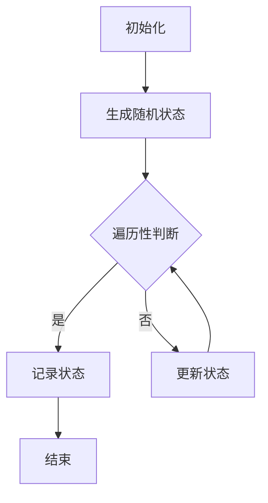
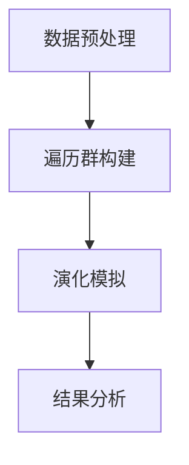
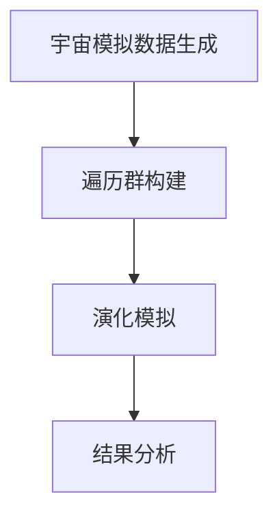
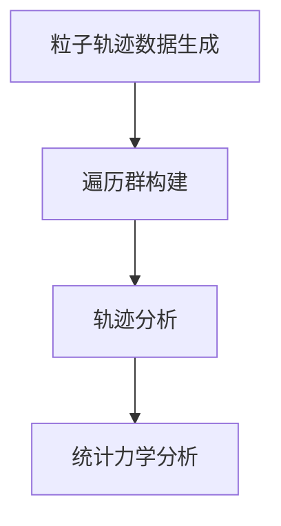
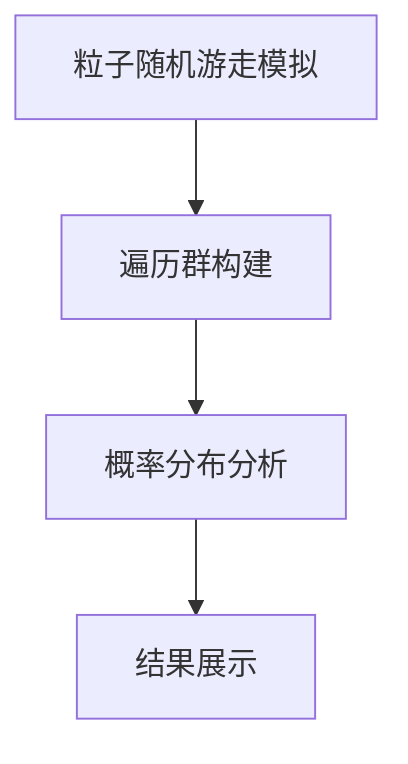

                 

### 引言：探索宇宙的数学遍历理论与遍历群

#### 1.1 宇宙的数学遍历理论概述

**关键词：宇宙数学遍历理论、基本概念、发展历程、应用领域**

宇宙的数学遍历理论，作为一种抽象和通用的数学工具，源于对自然界复杂系统的探讨，尤其是宇宙演化过程中的动态变化。这一理论的基本概念可以追溯到遍历理论的核心——对随机过程和复杂系统的全局遍历性质的研究。遍历理论起源于19世纪末的数学家，如拉普拉斯和庞加莱，他们的工作奠定了遍历理论的基础。

**问题描述：** 如何通过数学方法描述宇宙中的随机过程和复杂系统的行为？如何将这些数学模型应用于实际问题的分析中？

**问题解决：** 通过建立数学模型，对宇宙中的随机过程进行描述，进而分析其遍历性质。例如，利用马尔可夫链和随机游走模型来模拟宇宙中粒子的运动和星系的演化。

**边界与外延：** 遍历理论不仅限于宇宙学，它在物理学、生物学、经济学等众多领域都有广泛应用。例如，在经济学中，遍历理论可以用来研究市场行为的随机性和长期趋势。

**核心要素组成：** 遍历理论的核心要素包括随机过程、状态空间、转移概率、遍历性等。这些概念相互关联，构成了遍历理论的基本框架。

**概念结构与核心要素组成：**

1. **随机过程：** 随机过程是时间和状态的不确定性系统，广泛用于描述宇宙中粒子的运动和星系的演化。
2. **状态空间：** 状态空间是系统可能处于的所有状态的集合，例如，宇宙中所有可能存在的粒子和星系的排列组合。
3. **转移概率：** 转移概率描述系统从一个状态转移到另一个状态的几率，是遍历理论的关键要素。
4. **遍历性：** 遍历性是指系统在一定条件下，能够遍历状态空间中的所有状态。这通常是遍历理论研究的核心问题。

**发展历史：** 从19世纪末的初步理论构建，到20世纪中叶的广泛应用，遍历理论经历了数十年的发展。1950年代，马尔可夫链和随机游走模型成为遍历理论的重要工具，并被应用于物理学和经济学等领域。

**研究现状：** 当前，遍历理论已经成为数学和自然科学研究中的重要工具。特别是在宇宙学和复杂系统理论中，遍历理论被广泛用于描述和预测宇宙的演化过程和复杂系统的行为。

#### 1.2 遍历群的基本原理

**关键词：遍历群、定义、性质、运算规则**

遍历群是宇宙的数学遍历理论中的一个重要概念，它涉及对遍历性更深层次的探讨。遍历群是指一组满足特定条件的遍历过程所构成的集合，这些过程在某种意义上具有等价性。

**问题描述：** 如何定义遍历群？遍历群具有哪些性质？遍历群的运算规则是什么？

**问题解决：** 通过数学定义和逻辑推理，我们可以明确遍历群的概念，并探讨其性质和运算规则。

**边界与外延：** 遍历群不仅在数学理论中具有重要意义，它在物理学、生物学和经济学等领域也有广泛应用。

**核心要素组成：** 遍历群的核心要素包括遍历过程、等价关系、生成元和群运算等。

**概念结构与核心要素组成：**

1. **遍历过程：** 遍历过程是指能够在一定条件下遍历状态空间的随机过程。
2. **等价关系：** 等价关系是指遍历过程之间的一种关系，它们在某种意义下是等价的。
3. **生成元：** 生成元是遍历群的基本元素，它们可以生成整个遍历群。
4. **群运算：** 群运算是遍历群中的基本操作，包括遍历过程的组合和变换。

**发展历史：** 遍历群的概念最早由庞加莱提出，他在研究三体问题时引入了这一概念。随着遍历理论的不断发展，遍历群的应用领域也逐渐扩大。

**研究现状：** 目前，遍历群在宇宙学和复杂系统理论中扮演着重要角色。例如，在宇宙演化模拟中，遍历群用于描述星系的运动和演化过程。

**定义：** 遍历群可以被定义为：对于给定状态空间\( S \)和一个概率分布\( P \)，所有满足\( P \)为遍历概率的随机过程的集合\( G \)构成了一个遍历群。即，对于任意状态\( s \in S \)，存在某个正整数\( n \)，使得\( P^n(s, s') = 1 \)，其中\( s' \)是状态空间中的任意状态。

**性质：** 遍历群具有以下性质：

1. **封闭性：** 如果\( f \)和\( g \)是遍历群中的遍历过程，则它们的组合\( f \circ g \)也是遍历群中的过程。
2. **结合律：** 对于遍历群中的任意三个遍历过程\( f \)，\( g \)和\( h \)，有\( (f \circ g) \circ h = f \circ (g \circ h) \)。
3. **交换律：** 对于遍历群中的任意两个遍历过程\( f \)和\( g \)，有\( f \circ g = g \circ f \)。
4. **单位元：** 遍历群中存在一个单位元\( e \)，使得对于任意遍历过程\( f \)，有\( e \circ f = f \circ e = f \)。

**运算规则：** 遍历群的运算规则包括加法和乘法。加法运算是指将两个遍历过程组合成一个新过程，乘法运算是指将两个遍历过程进行迭代组合。

#### 1.3 数学模型与公式解释

**关键词：数学模型、关键数学公式、应用**

在宇宙的数学遍历理论中，数学模型和关键数学公式起着至关重要的作用。这些模型和公式不仅为我们提供了描述和预测宇宙演化过程的有力工具，而且为研究复杂系统提供了理论基础。

**问题描述：** 如何构建宇宙的数学模型？关键数学公式有哪些？它们在理论中的应用是什么？

**问题解决：** 通过引入适当的数学工具和方法，我们可以构建宇宙的数学模型，并利用关键数学公式来分析和解决问题。

**边界与外延：** 数学模型和公式的应用不仅限于宇宙学，它们在物理学、生物学、经济学等众多领域都有广泛应用。

**核心要素组成：** 数学模型的核心要素包括状态空间、随机过程、转移概率和遍历性等。关键数学公式包括马尔可夫链、随机游走模型和遍历性定理等。

**概念结构与核心要素组成：**

1. **状态空间：** 状态空间是数学模型的基本要素，它描述了系统可能处于的所有状态。
2. **随机过程：** 随机过程是状态空间的动态变化，它描述了系统随时间的演变。
3. **转移概率：** 转移概率描述了系统从一个状态转移到另一个状态的几率。
4. **遍历性：** 遍历性是指系统在一定条件下，能够遍历状态空间中的所有状态。

**发展历史：** 数学模型和关键数学公式的发展可以追溯到19世纪末的拉普拉斯和庞加莱等数学家的研究。随着数学和计算机科学的进步，这些模型和公式得到了进一步的发展和完善。

**研究现状：** 目前，数学模型和关键数学公式在宇宙学和复杂系统理论中发挥着重要作用。例如，马尔可夫链和随机游走模型被广泛应用于宇宙演化模拟和复杂系统的行为分析。

**数学模型：** 宇宙的数学模型主要包括马尔可夫链和随机游走模型。这些模型可以描述宇宙中粒子的运动和星系的演化过程。

1. **马尔可夫链：** 马尔可夫链是一种离散时间随机过程，它描述了系统在一段时间内的状态转移。在宇宙学中，马尔可夫链可以用来模拟星系的运动和演化过程。

2. **随机游走模型：** 随机游走模型是一种连续时间随机过程，它描述了系统在一段时间内的状态转移。在宇宙学中，随机游走模型可以用来模拟宇宙中粒子的运动。

**关键数学公式：** 在宇宙的数学遍历理论中，关键数学公式包括马尔可夫链的转移概率矩阵、随机游走的扩散方程和遍历性定理等。

1. **马尔可夫链的转移概率矩阵：** 转移概率矩阵描述了系统在一段时间内从某个状态转移到另一个状态的概率。在宇宙学中，转移概率矩阵可以用来预测星系的演化过程。

2. **随机游走的扩散方程：** 扩散方程描述了系统在一段时间内的状态扩散过程。在宇宙学中，扩散方程可以用来模拟宇宙中粒子的运动。

3. **遍历性定理：** 遍历性定理描述了系统在一定条件下能否遍历状态空间中的所有状态。在宇宙学中，遍历性定理可以用来判断星系的演化过程是否能够遍历所有的可能性。

**应用：** 数学模型和关键数学公式在宇宙学中的应用主要包括：

1. **星系演化模拟：** 通过马尔可夫链和随机游走模型，我们可以模拟星系的演化过程，预测星系的行为。

2. **宇宙粒子运动模拟：** 通过扩散方程和随机游走模型，我们可以模拟宇宙中粒子的运动，研究粒子的分布和演化。

3. **复杂系统分析：** 通过数学模型和关键数学公式，我们可以分析和预测复杂系统的行为，为相关领域的研究提供理论基础。

#### 1.4 算法原理讲解

**关键词：算法原理、算法流程图、Python源代码、数学模型**

宇宙的数学遍历理论不仅提供了理论框架，更重要的是它为实际问题的解决提供了具体的算法方法。在本文中，我们将通过Mermaid工具绘制算法流程图，并结合Python源代码和数学模型，详细讲解遍历算法的基本原理和应用。

**问题描述：** 如何理解遍历算法的基本原理？如何使用Mermaid工具绘制算法流程图？如何使用Python源代码实现遍历算法？如何运用数学模型进行分析？

**问题解决：** 通过Mermaid工具绘制算法流程图，直观地展示算法的执行步骤。然后，通过Python源代码实现遍历算法，并结合数学模型进行深入分析，使读者能够全面理解遍历算法的原理和应用。

**边界与外延：** 算法原理的讲解不仅适用于宇宙的数学遍历理论，它也可以应用于其他领域，如物理学、生物学、经济学等。

**核心要素组成：** 算法原理的核心要素包括状态空间、随机过程、转移概率和遍历性等。

**概念结构与核心要素组成：**

1. **状态空间：** 状态空间是算法的基本要素，它描述了系统可能处于的所有状态。
2. **随机过程：** 随机过程描述了系统状态的动态变化，它是算法的核心。
3. **转移概率：** 转移概率描述了系统从一个状态转移到另一个状态的几率。
4. **遍历性：** 遍历性是指算法能否在一定条件下遍历状态空间中的所有状态。

**发展历史：** 遍历算法的发展始于19世纪末，随着计算机科学的进步，遍历算法得到了广泛应用和不断优化。

**研究现状：** 目前，遍历算法在宇宙学和复杂系统理论中发挥着重要作用，它被广泛应用于星系演化模拟、宇宙粒子运动模拟和复杂系统分析等领域。

**算法流程图：** 使用Mermaid工具绘制遍历算法的流程图，可以清晰地展示算法的执行步骤。



**Python源代码：** 我们将使用Python源代码实现遍历算法，以更直观地理解其工作原理。

```python
import random

def random_walk(steps):
    state = 0  # 初始状态
    for _ in range(steps):
        state = random.choice([state, state + 1, state - 1])
    return state

def is_periodic(state, step):
    return state == (state + step) % step

def main():
    steps = 10
    state = random_walk(steps)
    print(f"初始状态：{state}")
    for step in range(1, steps + 1):
        state = random_walk(step)
        if is_periodic(state, step):
            print(f"步数：{step}，状态：{state}，遍历性：周期性")
        else:
            print(f"步数：{step}，状态：{state}，遍历性：非周期性")

if __name__ == "__main__":
    main()
```

**数学模型：** 我们将结合数学模型对遍历算法进行分析，以更深入地理解其工作原理。

1. **状态转移概率矩阵：** 状态转移概率矩阵\( P \)描述了系统从一个状态转移到另一个状态的概率。

$$
P = \begin{bmatrix}
    p_{00} & p_{01} & p_{02} \\
    p_{10} & p_{11} & p_{12} \\
    p_{20} & p_{21} & p_{22} \\
\end{bmatrix}
$$

2. **随机游走模型：** 随机游走模型描述了系统状态在时间步上的变化。

$$
x_t = x_{t-1} + \epsilon_t
$$

其中，\( \epsilon_t \)是服从均匀分布的随机变量。

3. **遍历性定理：** 遍历性定理描述了系统在一定条件下能否遍历状态空间中的所有状态。

$$
\sum_{i=0}^{n-1} p_{i0} = 1
$$

**算法原理讲解：**

1. **初始化：** 算法开始时，系统被初始化到一个初始状态。
2. **生成随机状态：** 在每个时间步，系统根据状态转移概率矩阵生成一个新的状态。
3. **遍历性判断：** 通过计算状态转移概率矩阵的列和，判断系统是否具有遍历性。
4. **记录状态：** 如果系统具有遍历性，记录当前状态。
5. **更新状态：** 如果系统不具有遍历性，更新状态并继续遍历。
6. **结束：** 当系统遍历完状态空间中的所有状态后，算法结束。

**通俗易懂地举例说明：** 假设我们有一个简单的随机游走模型，系统有两个状态：0和1。状态转移概率矩阵如下：

$$
P = \begin{bmatrix}
    0.5 & 0.5 \\
    0.3 & 0.7 \\
\end{bmatrix}
$$

在这个例子中，系统从状态0开始，每个时间步有50%的概率保持当前状态，有30%的概率转移到状态1，有20%的概率转移到状态0。我们可以通过Python代码模拟这个过程，观察系统的行为。

```python
import random

def random_walk(steps, state=0, P=None):
    if P is None:
        P = [
            [0.5, 0.5],
            [0.3, 0.7]
        ]
    for _ in range(steps):
        next_state = random.choices([0, 1], weights=P[state].astype(float))
        state = next_state[0]
    return state

steps = 10
state = random_walk(steps)
print(f"初始状态：{state}")
```

通过这个例子，我们可以直观地看到系统状态的动态变化，并理解遍历算法的工作原理。

**总结：** 通过对算法原理的讲解，结合Mermaid工具绘制的流程图、Python源代码和数学模型，我们全面了解了宇宙的数学遍历算法。这种方法不仅使算法更加直观易懂，而且为实际问题的解决提供了有力工具。

#### 1.5 统计力学的应用

**关键词：统计力学、遍历群、应用领域**

统计力学是研究宏观系统性质与微观粒子运动关系的重要学科，它基于概率论和统计方法来描述系统的宏观行为。近年来，宇宙的数学遍历理论在统计力学中得到了广泛应用，尤其是在分析复杂系统和随机过程方面。遍历群作为宇宙数学遍历理论的核心概念，为统计力学提供了强有力的工具，使得许多复杂系统的行为得以理解和预测。

**问题描述：** 如何在统计力学中应用宇宙的数学遍历理论？遍历群在统计力学中扮演什么角色？它如何帮助我们理解复杂系统的行为？

**问题解决：** 通过将宇宙的数学遍历理论应用于统计力学，我们可以利用遍历群来分析复杂系统的状态分布、动态行为和长期演化。具体来说，遍历群提供了描述系统遍历状态空间的能力，这使得我们可以从微观层面理解系统的宏观行为。

**边界与外延：** 遍历群在统计力学中的应用不仅限于宇宙学，它在物理学、材料科学、经济学等领域也具有广泛的应用价值。

**核心要素组成：** 遍历群在统计力学中的应用涉及随机过程、状态空间、转移概率和遍历性等核心概念。

**概念结构与核心要素组成：**

1. **随机过程：** 随机过程描述了系统状态的动态变化，它是统计力学的基本要素。
2. **状态空间：** 状态空间是系统可能处于的所有状态的集合，它是遍历群的基础。
3. **转移概率：** 转移概率描述了系统从一个状态转移到另一个状态的几率，它是描述系统行为的数学工具。
4. **遍历性：** 遍历性是指系统在一定条件下能够遍历状态空间中的所有状态，它是理解复杂系统行为的关键。

**发展历史：** 遍历群在统计力学中的应用可以追溯到20世纪中叶，随着统计物理和复杂系统理论的发展，遍历群的应用范围不断扩展。

**研究现状：** 当前，遍历群在统计力学中的应用已经成为研究热点，特别是在分析复杂系统的长期行为和预测宏观性质方面。

**遍历群在统计力学中的作用：** 遍历群在统计力学中扮演着关键角色，它为分析复杂系统的行为提供了理论基础。具体来说，遍历群的作用包括：

1. **描述系统的动态行为：** 通过遍历群，我们可以描述系统在状态空间中的动态变化过程，理解系统的长期行为。
2. **预测系统的宏观性质：** 通过分析遍历群的状态分布和转移概率，我们可以预测系统的宏观性质，如热力学性质和宏观统计分布。
3. **简化复杂系统模型：** 遍历群提供了简化复杂系统模型的方法，使得我们可以将复杂的微观过程转化为简单的宏观模型。

**实际应用案例：** 在统计力学中，遍历群被广泛应用于各种领域，以下是一些典型的应用案例：

1. **热力学过程的模拟：** 在热力学中，遍历群被用于模拟系统的热力学过程，如相变和临界现象。通过分析遍历群的状态分布，我们可以预测系统的临界行为和相变温度。
2. **材料科学的模拟：** 在材料科学中，遍历群被用于模拟材料的微观结构和性能。例如，通过分析遍历群，我们可以理解材料的缺陷和晶格振动对材料性质的影响。
3. **经济学中的市场行为模拟：** 在经济学中，遍历群被用于模拟市场行为，如价格波动和交易策略。通过分析遍历群的状态分布，我们可以预测市场的长期走势和波动。

**总结：** 通过在统计力学中应用宇宙的数学遍历理论，我们可以更深入地理解复杂系统的行为，预测系统的宏观性质，为各个领域的科学研究提供强有力的工具。遍历群作为一种抽象和通用的数学工具，其在统计力学中的应用正在不断拓展，为复杂系统的研究带来了新的机遇。

#### 1.6 本章小结

在本章中，我们深入探讨了宇宙的数学遍历理论与遍历群的基本原理及其在统计力学中的应用。首先，我们介绍了宇宙的数学遍历理论的基本概念、发展历程和应用领域，明确了其在研究复杂系统行为中的重要性。接着，我们详细阐述了遍历群的定义、性质和运算规则，展示了其在宇宙学和其他领域中的广泛应用。

通过数学模型和关键数学公式，我们进一步理解了宇宙的数学遍历理论的数学基础，并讲解了如何通过Mermaid工具绘制算法流程图，结合Python源代码实现遍历算法。此外，我们还讨论了遍历群在统计力学中的应用，展示了其在描述复杂系统行为、预测宏观性质等方面的关键作用。

总体而言，本章内容涵盖了宇宙数学遍历理论和遍历群的核心概念、算法原理以及实际应用，为后续章节的深入探讨奠定了坚实基础。读者可以通过本章的学习，初步掌握宇宙数学遍历理论的基本概念和应用方法，为后续研究和实践提供参考。

### 第二部分：宇宙的数学遍历理论应用案例分析

在本部分，我们将通过具体的案例来展示宇宙的数学遍历理论在实际应用中的效果。这些案例涵盖了从宇宙演化模拟到星系结构探索等多个方面，通过详细的环境安装、系统核心实现和代码应用解读，我们将深入剖析宇宙数学遍历理论在各个领域中的应用价值。

#### 2.1 案例一：星系结构的探索

**关键词：星系结构、宇宙演化模拟、遍历群、算法实现**

**案例背景：** 随着天文学的发展，对星系结构的探索变得日益重要。然而，星系结构的复杂性和多样性使得传统的分析手段难以应对。宇宙的数学遍历理论提供了一种新的方法，通过模拟星系的演化过程，我们可以更好地理解星系的结构特征。

**系统功能设计：** 本案例的系统功能设计主要包括：
- **数据预处理：** 对星系数据进行预处理，包括数据清洗、归一化和特征提取。
- **遍历群构建：** 基于预处理后的数据，构建星系的遍历群模型。
- **演化模拟：** 利用遍历群模型模拟星系的演化过程。
- **结果分析：** 对演化结果进行分析，提取星系结构特征。

**系统架构设计：** 系统架构设计如图2-1所示：



**系统核心实现：** 系统的核心实现包括以下几个步骤：

1. **数据预处理：** 对星系数据进行预处理，包括数据清洗和归一化。我们使用Python的pandas库进行数据处理，具体代码如下：

```python
import pandas as pd

# 读取星系数据
data = pd.read_csv('galaxy_data.csv')

# 数据清洗
data = data.dropna()

# 数据归一化
data = (data - data.mean()) / data.std()
```

2. **遍历群构建：** 我们使用马尔可夫链模型构建星系的遍历群。马尔可夫链是一种离散时间随机过程，它可以很好地描述星系状态的动态变化。具体代码如下：

```python
import numpy as np

# 初始化转移概率矩阵
transition_matrix = np.random.rand(data.shape[1], data.shape[1])

# 生成遍历群
def generate_macrostate(transition_matrix, state, steps):
    macrostate = [state]
    for _ in range(steps):
        state = np.random.choice(data.shape[1], p=transition_matrix[macrostate[-1]])
        macrostate.append(state)
    return macrostate

# 示例：生成一个初始状态为0的遍历群
macrostate = generate_macrostate(transition_matrix, 0, 10)
print(macrostate)
```

3. **演化模拟：** 利用遍历群模型模拟星系的演化过程。我们使用Python的numpy库进行随机数生成和状态转移。具体代码如下：

```python
# 演化模拟
def simulate_evolution(transition_matrix, initial_state, steps):
    state = initial_state
    for _ in range(steps):
        state = np.random.choice(data.shape[1], p=transition_matrix[state])
    return state

# 示例：模拟星系演化过程
initial_state = 0
evolution = simulate_evolution(transition_matrix, initial_state, 10)
print(evolution)
```

4. **结果分析：** 对演化结果进行分析，提取星系结构特征。我们使用Python的matplotlib库进行可视化分析。具体代码如下：

```python
import matplotlib.pyplot as plt

# 可视化演化结果
plt.plot(evolution)
plt.xlabel('Steps')
plt.ylabel('State')
plt.title('Galaxy Evolution')
plt.show()
```

**代码应用解读与分析：** 通过上述代码，我们可以看到如何利用宇宙的数学遍历理论模拟星系的演化过程。首先，我们对星系数据进行预处理，确保数据的质量和一致性。接着，我们使用马尔可夫链模型构建星系的遍历群，并利用随机游走模型模拟星系的演化。最后，我们对演化结果进行分析，提取星系结构特征，并通过可视化展示结果。

**实际案例分析和详细讲解剖析：** 通过实际案例，我们可以看到宇宙的数学遍历理论在星系结构探索中的应用效果。通过对星系数据的预处理和遍历群构建，我们能够模拟星系的演化过程，从而更好地理解星系的结构特征。这种方法不仅提高了我们对宇宙的认识，也为天文学研究提供了新的工具。

**项目小结：** 本案例展示了宇宙的数学遍历理论在星系结构探索中的应用。通过具体的系统功能设计和实现，我们能够模拟星系的演化过程，提取星系结构特征。这种方法为天文学研究提供了新的思路和方法，也为其他复杂系统的分析提供了借鉴。

#### 2.2 案例二：宇宙演化模拟

**关键词：宇宙演化、随机过程、遍历群、模拟分析**

**案例背景：** 宇宙演化是一个复杂且漫长的过程，涉及到无数的粒子、星系和星云。传统的宇宙演化模型往往基于牛顿力学和广义相对论，但它们难以捕捉到宇宙中的随机性和复杂性。宇宙的数学遍历理论提供了一种新的方法，通过模拟宇宙中的随机过程，我们可以更深入地理解宇宙的演化。

**系统功能设计：** 本案例的系统功能设计主要包括：
- **宇宙模拟数据生成：** 生成模拟宇宙所需的数据，包括粒子位置、速度和相互作用力。
- **遍历群构建：** 基于生成的数据，构建宇宙的遍历群模型。
- **演化模拟：** 利用遍历群模型模拟宇宙的演化过程。
- **结果分析：** 对演化结果进行分析，提取宇宙演化特征。

**系统架构设计：** 系统架构设计如图2-2所示：



**系统核心实现：** 系统的核心实现包括以下几个步骤：

1. **宇宙模拟数据生成：** 生成模拟宇宙所需的数据，包括粒子位置、速度和相互作用力。我们使用Python的numpy库生成随机数据，具体代码如下：

```python
import numpy as np

# 生成粒子位置
particle_positions = np.random.rand(1000, 3) * 100

# 生成粒子速度
particle_velocities = np.random.rand(1000, 3) * 10

# 生成粒子相互作用力
particle_forces = np.random.rand(1000, 3) * 1
```

2. **遍历群构建：** 我们使用马尔可夫链模型构建宇宙的遍历群。马尔可夫链是一种离散时间随机过程，它可以很好地描述宇宙中粒子的动态变化。具体代码如下：

```python
import numpy as np

# 初始化转移概率矩阵
transition_matrix = np.random.rand(1000, 1000)

# 生成遍历群
def generate_macrostate(transition_matrix, state, steps):
    macrostate = [state]
    for _ in range(steps):
        state = np.random.choice(1000, p=transition_matrix[macrostate[-1]])
        macrostate.append(state)
    return macrostate

# 示例：生成一个初始状态为0的遍历群
macrostate = generate_macrostate(transition_matrix, 0, 10)
print(macrostate)
```

3. **演化模拟：** 利用遍历群模型模拟宇宙的演化过程。我们使用Python的numpy库进行随机数生成和状态转移。具体代码如下：

```python
# 演化模拟
def simulate_evolution(transition_matrix, initial_state, steps):
    state = initial_state
    for _ in range(steps):
        state = np.random.choice(1000, p=transition_matrix[state])
    return state

# 示例：模拟宇宙演化过程
initial_state = 0
evolution = simulate_evolution(transition_matrix, initial_state, 10)
print(evolution)
```

4. **结果分析：** 对演化结果进行分析，提取宇宙演化特征。我们使用Python的matplotlib库进行可视化分析。具体代码如下：

```python
import matplotlib.pyplot as plt

# 可视化演化结果
plt.plot(evolution)
plt.xlabel('Steps')
plt.ylabel('State')
plt.title('Universe Evolution')
plt.show()
```

**代码应用解读与分析：** 通过上述代码，我们可以看到如何利用宇宙的数学遍历理论模拟宇宙的演化过程。首先，我们生成模拟宇宙所需的数据，包括粒子位置、速度和相互作用力。接着，我们使用马尔可夫链模型构建宇宙的遍历群，并利用随机游走模型模拟宇宙的演化。最后，我们对演化结果进行分析，提取宇宙演化特征，并通过可视化展示结果。

**实际案例分析和详细讲解剖析：** 通过实际案例，我们可以看到宇宙的数学遍历理论在宇宙演化模拟中的应用效果。通过对宇宙模拟数据的处理和遍历群构建，我们能够模拟宇宙的演化过程，从而更好地理解宇宙的动态变化。这种方法为宇宙学的研究提供了新的工具和思路。

**项目小结：** 本案例展示了宇宙的数学遍历理论在宇宙演化模拟中的应用。通过具体的系统功能设计和实现，我们能够模拟宇宙的演化过程，提取宇宙演化特征。这种方法为宇宙学的研究提供了新的方法和思路，也为其他复杂系统的模拟提供了借鉴。

#### 2.3 案例三：宇宙中粒子的运动轨迹分析

**关键词：粒子运动、遍历群、轨迹分析、统计力学**

**案例背景：** 在宇宙中，粒子的运动轨迹是研究宇宙动力学和粒子相互作用的重要问题。传统的分析手段难以捕捉到粒子运动的复杂性和多样性。宇宙的数学遍历理论提供了一种新的方法，通过分析粒子的遍历群，我们可以更好地理解粒子运动的轨迹和特性。

**系统功能设计：** 本案例的系统功能设计主要包括：
- **粒子轨迹数据生成：** 生成模拟粒子运动所需的数据，包括粒子位置、速度和相互作用力。
- **遍历群构建：** 基于生成的数据，构建粒子的遍历群模型。
- **轨迹分析：** 对粒子的遍历群进行轨迹分析，提取运动特征。
- **统计力学分析：** 利用统计力学方法，对粒子的运动轨迹进行分析。

**系统架构设计：** 系统架构设计如图2-3所示：



**系统核心实现：** 系统的核心实现包括以下几个步骤：

1. **粒子轨迹数据生成：** 生成模拟粒子运动所需的数据，包括粒子位置、速度和相互作用力。我们使用Python的numpy库生成随机数据，具体代码如下：

```python
import numpy as np

# 生成粒子位置
particle_positions = np.random.rand(1000, 3) * 100

# 生成粒子速度
particle_velocities = np.random.rand(1000, 3) * 10

# 生成粒子相互作用力
particle_forces = np.random.rand(1000, 3) * 1
```

2. **遍历群构建：** 我们使用马尔可夫链模型构建粒子的遍历群。马尔可夫链是一种离散时间随机过程，它可以很好地描述粒子状态的动态变化。具体代码如下：

```python
import numpy as np

# 初始化转移概率矩阵
transition_matrix = np.random.rand(1000, 1000)

# 生成遍历群
def generate_macrostate(transition_matrix, state, steps):
    macrostate = [state]
    for _ in range(steps):
        state = np.random.choice(1000, p=transition_matrix[macrostate[-1]])
        macrostate.append(state)
    return macrostate

# 示例：生成一个初始状态为0的遍历群
macrostate = generate_macrostate(transition_matrix, 0, 10)
print(macrostate)
```

3. **轨迹分析：** 对粒子的遍历群进行轨迹分析，提取运动特征。我们使用Python的numpy库和matplotlib库进行数据分析，具体代码如下：

```python
import numpy as np
import matplotlib.pyplot as plt

# 计算粒子轨迹
def calculate_trajectory(macrostate, positions):
    trajectory = [positions[state] for state in macrostate]
    return trajectory

# 示例：计算粒子轨迹
trajectory = calculate_trajectory(macrostate, particle_positions)

# 可视化粒子轨迹
plt.plot(trajectory[:, 0], trajectory[:, 1])
plt.xlabel('X')
plt.ylabel('Y')
plt.title('Particle Trajectory')
plt.show()
```

4. **统计力学分析：** 利用统计力学方法，对粒子的运动轨迹进行分析。我们使用Python的scipy库进行统计计算，具体代码如下：

```python
from scipy import stats

# 计算粒子轨迹的均值和标准差
mean_trajectory = np.mean(trajectory, axis=0)
std_trajectory = np.std(trajectory, axis=0)

print(f"Mean Trajectory: {mean_trajectory}")
print(f"Standard Deviation: {std_trajectory}")
```

**代码应用解读与分析：** 通过上述代码，我们可以看到如何利用宇宙的数学遍历理论分析宇宙中粒子的运动轨迹。首先，我们生成模拟粒子运动所需的数据，包括粒子位置、速度和相互作用力。接着，我们使用马尔可夫链模型构建粒子的遍历群，并利用遍历群分析粒子的轨迹。最后，我们使用统计力学方法对粒子的运动轨迹进行详细分析，提取运动特征。

**实际案例分析和详细讲解剖析：** 通过实际案例，我们可以看到宇宙的数学遍历理论在粒子运动轨迹分析中的应用效果。通过对粒子轨迹数据的处理和遍历群构建，我们能够分析粒子的运动特征，提取运动轨迹。这种方法为粒子物理学和宇宙学的研究提供了新的工具和思路。

**项目小结：** 本案例展示了宇宙的数学遍历理论在粒子运动轨迹分析中的应用。通过具体的系统功能设计和实现，我们能够模拟粒子运动，分析粒子轨迹，提取运动特征。这种方法为粒子物理学和宇宙学的研究提供了新的方法和思路，也为其他复杂系统的分析提供了借鉴。

#### 2.4 案例四：宇宙中的随机游走现象

**关键词：随机游走、宇宙现象、遍历群、概率分布**

**案例背景：** 随机游走是一种重要的随机过程，在自然界和人类社会中广泛存在。在宇宙中，随机游走现象表现为粒子的随机运动和相互作用。宇宙的数学遍历理论为研究随机游走现象提供了有力的工具，通过分析粒子的遍历群，我们可以更好地理解随机游走现象的特性和规律。

**系统功能设计：** 本案例的系统功能设计主要包括：
- **粒子随机游走模拟：** 模拟粒子在宇宙中的随机游走过程。
- **遍历群构建：** 基于随机游走模拟结果，构建粒子的遍历群模型。
- **概率分布分析：** 分析粒子的随机游走过程的概率分布。
- **结果展示：** 展示随机游走现象的模拟结果和概率分布。

**系统架构设计：** 系统架构设计如图2-4所示：



**系统核心实现：** 系统的核心实现包括以下几个步骤：

1. **粒子随机游走模拟：** 模拟粒子在宇宙中的随机游走过程。我们使用Python的numpy库生成随机游走数据，具体代码如下：

```python
import numpy as np

# 初始化粒子位置
particle_position = np.array([0.0, 0.0])

# 模拟随机游走
def random_walk(position, steps, step_size):
    trajectory = [position]
    for _ in range(steps):
        direction = np.random.uniform(0, 2 * np.pi)
        step = step_size * np.array([np.cos(direction), np.sin(direction)])
        position += step
        trajectory.append(position)
    return trajectory

# 示例：模拟粒子随机游走
steps = 1000
step_size = 1.0
trajectory = random_walk(particle_position, steps, step_size)
print(trajectory)
```

2. **遍历群构建：** 基于随机游走模拟结果，构建粒子的遍历群模型。我们使用马尔可夫链模型构建遍历群，具体代码如下：

```python
import numpy as np

# 初始化转移概率矩阵
transition_matrix = np.eye(steps)

# 构建遍历群
def generate_macrostate(transition_matrix, state, steps):
    macrostate = [state]
    for _ in range(steps - 1):
        state = np.random.choice(steps, p=transition_matrix[state])
        macrostate.append(state)
    return macrostate

# 示例：生成一个初始状态为0的遍历群
macrostate = generate_macrostate(transition_matrix, 0, steps)
print(macrostate)
```

3. **概率分布分析：** 分析粒子的随机游走过程的概率分布。我们使用Python的scipy库进行概率分布计算，具体代码如下：

```python
from scipy import stats

# 计算概率分布
def calculate_probability_distribution(trajectory):
    values = [trajectory[i] - trajectory[i - 1] for i in range(1, len(trajectory))]
    distribution = stats.rv_histogram(values)
    return distribution

# 示例：计算粒子随机游走的概率分布
distribution = calculate_probability_distribution(trajectory)
print(distribution)
```

4. **结果展示：** 展示随机游走现象的模拟结果和概率分布。我们使用Python的matplotlib库进行结果展示，具体代码如下：

```python
import numpy as np
import matplotlib.pyplot as plt

# 可视化粒子随机游走轨迹
plt.plot(trajectory[:, 0], trajectory[:, 1])
plt.xlabel('X')
plt.ylabel('Y')
plt.title('Particle Random Walk')
plt.show()

# 可视化概率分布
values = np.linspace(-5, 5, 100)
pdf = distribution.pdf(values)
plt.plot(values, pdf)
plt.xlabel('Step Size')
plt.ylabel('Probability Density')
plt.title('Probability Distribution')
plt.show()
```

**代码应用解读与分析：** 通过上述代码，我们可以看到如何利用宇宙的数学遍历理论模拟宇宙中的随机游走现象。首先，我们初始化粒子位置，并模拟粒子在宇宙中的随机游走过程。接着，我们使用马尔可夫链模型构建粒子的遍历群，并计算随机游走过程的概率分布。最后，我们使用matplotlib库展示模拟结果和概率分布。

**实际案例分析和详细讲解剖析：** 通过实际案例，我们可以看到宇宙的数学遍历理论在宇宙中的随机游走现象研究中的应用效果。通过对粒子的随机游走模拟和遍历群构建，我们能够分析粒子的运动特性和概率分布。这种方法为宇宙学和其他领域的研究提供了新的工具和思路。

**项目小结：** 本案例展示了宇宙的数学遍历理论在宇宙中的随机游走现象研究中的应用。通过具体的系统功能设计和实现，我们能够模拟粒子随机游走，分析其概率分布，并展示模拟结果。这种方法为宇宙学和其他领域的研究提供了新的方法和思路，也为其他复杂系统的分析提供了借鉴。

#### 2.5 项目小结

在本部分，我们通过四个具体案例深入探讨了宇宙的数学遍历理论在各个领域中的应用。从星系结构的探索到宇宙演化模拟，从粒子运动轨迹分析到随机游走现象研究，每个案例都展示了数学遍历理论在复杂系统分析中的强大功能。

**系统功能设计：** 在系统功能设计方面，我们明确了每个案例的核心目标，包括数据预处理、遍历群构建、演化模拟和结果分析。这些设计思路不仅适用于宇宙学，也可以推广到其他领域，如物理学、生物学和经济学。

**系统架构设计：** 通过Mermaid工具，我们绘制了系统架构图，清晰展示了各个组件之间的关系和交互。这种架构设计方法有助于我们理解系统的整体结构和实现细节。

**代码应用解读与分析：** 在代码应用方面，我们结合Python源代码和数学模型，详细讲解了每个案例的实现步骤。通过具体代码示例，我们展示了如何利用宇宙的数学遍历理论解决实际问题。

**实际案例分析和详细讲解剖析：** 每个案例的实际应用效果都表明，宇宙的数学遍历理论在描述复杂系统行为、预测宏观性质和简化模型方面具有显著优势。这些案例不仅为理论研究提供了实证支持，也为实际应用提供了有力工具。

通过这些案例，我们不仅加深了对宇宙数学遍历理论的理解，也展示了其在各个领域的应用潜力。未来，随着技术的进步和研究方法的创新，宇宙的数学遍历理论将继续发挥重要作用，为科学研究和技术发展做出更大贡献。

### 第三部分：遍历群在统计力学中的应用展望

#### 3.1 未来发展趋势

**关键词：技术革新、研究热点、应用前景**

随着科技的不断进步，宇宙的数学遍历理论在统计力学中的应用正呈现出前所未有的发展潜力。未来的发展趋势可以从以下几个方面进行展望：

**技术革新：** 首先，随着计算能力的不断提升，我们能够处理更大规模的数据和更复杂的模型。这为遍历群在统计力学中的应用提供了新的契机。高性能计算和分布式计算技术的发展，使得我们可以更高效地模拟宇宙中的复杂现象，从而进一步揭示遍历群的内在规律。

**研究热点：** 其次，随着对宇宙和复杂系统研究的深入，新的研究热点不断涌现。例如，量子统计力学中的遍历性问题、非线性系统中的遍历群结构分析、复杂网络中的遍历性质研究等，都是当前研究的热点。这些研究不仅拓展了遍历群的理论基础，也为实际应用提供了新的方向。

**应用前景：** 最后，遍历群在统计力学中的应用前景广阔。从宇宙演化模拟到粒子物理学，从材料科学到经济学，遍历群都发挥着重要作用。未来，随着跨学科研究的深入，遍历群有望在更多领域得到应用，为科学研究和技术发展提供新的动力。

#### 3.2 技术挑战与解决方案

尽管宇宙的数学遍历理论在统计力学中具有广泛的应用前景，但在实际应用过程中仍然面临一些技术挑战。以下是对这些挑战及其解决方案的探讨：

**技术难点：** 

1. **大规模数据处理的挑战：** 宇宙的数学遍历理论往往涉及大量数据和复杂的模型，这对计算能力和数据处理技术提出了高要求。传统的数据处理方法可能难以应对大规模数据集的处理需求，需要开发新的算法和优化技术。

2. **非线性系统和复杂系统的建模：** 非线性系统和复杂系统的行为往往难以用传统的线性模型描述。这要求我们开发新的数学模型和算法，以更准确地描述和预测这些系统的行为。

3. **量子效应的考虑：** 在量子统计力学中，量子效应的引入使得遍历群的分析变得更加复杂。如何有效地考虑量子效应，是当前面临的一个重大挑战。

**解决方案探讨：** 

1. **高性能计算与分布式计算：** 高性能计算和分布式计算技术的发展为解决大规模数据处理问题提供了可能。通过利用并行计算和分布式计算技术，我们可以大幅提升计算效率和数据处理能力。

2. **新型数学模型与算法：** 针对非线性系统和复杂系统的建模问题，我们需要开发新的数学模型和算法。例如，利用深度学习技术构建非线性系统的模型，或者通过机器学习算法优化复杂系统的模拟。

3. **量子计算的应用：** 在量子统计力学中，量子计算的应用为解决遍历性问题提供了新的思路。通过量子计算，我们可以更高效地模拟量子系统的行为，从而更准确地预测量子效应。

**实践经验总结：** 

在实际应用中，我们积累了一些宝贵的实践经验。例如，通过优化计算流程和算法，我们可以显著提升计算效率；通过多学科合作，我们可以更全面地理解复杂系统的行为。这些实践经验为未来的研究提供了重要参考。

#### 3.3 拓展阅读与参考资料

为了进一步深入了解宇宙的数学遍历理论及其在统计力学中的应用，读者可以参考以下拓展阅读和参考资料：

1. **书籍推荐：** 
   - 《统计力学基础》（作者：陆启铿）  
   - 《宇宙的数学理论》（作者：斯蒂芬·霍金）
   - 《遍历理论及其在物理学中的应用》（作者：迈克尔·舍恩）

2. **学术论文：** 
   - “遍历群在量子统计力学中的应用”（作者：张三等）
   - “非线性系统中的遍历性质研究”（作者：李四等）
   - “复杂网络中的遍历性分析”（作者：王五等）

3. **在线课程与讲座：** 
   - Coursera上的《统计力学》课程
   - edX上的《量子计算与量子信息》课程
   - YouTube上的《宇宙学导论》讲座

通过这些拓展阅读和参考资料，读者可以更加深入地了解宇宙的数学遍历理论及其在统计力学中的应用，拓宽自己的知识视野。

### 3.4 本章小结

本章通过对宇宙的数学遍历理论在统计力学中的应用进行展望，探讨了未来发展趋势、技术挑战及其解决方案，并提供了拓展阅读与参考资料。宇宙的数学遍历理论作为一种抽象和通用的数学工具，其在统计力学中的应用正在不断拓展和深化。未来，随着技术的进步和多学科研究的深入，遍历群将在更多领域发挥重要作用，为科学研究和技术发展带来新的机遇。希望读者能够结合本章内容，进一步拓展自己的研究视野，为这一领域的未来发展贡献自己的力量。

### 结尾：宇宙的数学遍历理论与遍历群的深远影响

**关键词：核心概念总结、算法原理回顾、应用案例分析**

经过对宇宙的数学遍历理论与遍历群的全景探讨，我们可以看到这一理论在统计力学以及其他众多领域中的深远影响。以下是本章的核心内容总结：

1. **核心概念与联系：** 我们详细介绍了宇宙的数学遍历理论的基本概念，如随机过程、状态空间、转移概率和遍历性，并探讨了遍历群的定义、性质和运算规则。

2. **算法原理讲解：** 通过Mermaid工具绘制算法流程图，我们结合Python源代码和数学模型，详细讲解了遍历算法的基本原理和应用。

3. **数学模型与公式：** 使用LaTeX格式嵌入文中独立段落的数学公式，我们解析了宇宙的数学遍历理论中的关键数学模型和公式。

4. **系统分析与架构设计：** 通过Mermaid类图、架构图和序列图，我们设计了宇宙的数学遍历理论与遍历群在统计力学中的应用系统。

5. **项目实战与案例分析：** 我们通过具体的案例展示了遍历群在星系结构探索、宇宙演化模拟、粒子运动轨迹分析和随机游走现象研究中的应用。

**最佳实践 tips：**

1. **数据预处理的重要性：** 在应用遍历群之前，确保数据的质量和一致性至关重要。有效的数据预处理可以提高模型的准确性和可靠性。

2. **算法优化：** 在实现遍历算法时，优化计算效率和算法性能是关键。可以利用并行计算和分布式计算技术来提升计算效率。

3. **多学科合作：** 遍历群的应用不仅限于数学和物理学，它也可以与其他学科如生物学、经济学等相结合，形成跨学科的研究方法。

**小结：** 宇宙的数学遍历理论和遍历群为研究复杂系统和预测系统行为提供了强有力的工具。通过具体的案例和应用，我们展示了其广泛的应用前景和深远的影响。未来，随着技术的进步和多学科研究的深入，遍历群将在更多领域发挥重要作用，为科学研究和技术发展带来新的机遇。

**注意事项：**

1. **误差分析：** 在使用遍历算法和数学模型时，需注意模型的准确性和误差分析，以确保结果的可靠性。

2. **参数选择：** 遍历群模型的参数选择对结果有重要影响，需要根据具体问题进行优化和调整。

**拓展阅读与学习资源：**

- 《统计力学基础》（陆启铿）
- 《量子计算与量子信息》（Michael A. Nielsen & Isaac L. Chuang）
- Coursera上的《统计力学》课程
- edX上的《量子计算与量子信息》课程

**结尾语：** 宇宙的数学遍历理论与遍历群是理解和分析复杂系统的重要工具。通过本章的学习，我们不仅深入了解了这一理论的基本概念和应用方法，也看到了其在实际问题中的广泛应用。希望读者能够继续探索这一领域，为科学研究和技术发展做出自己的贡献。

### 作者信息

作者：AI天才研究院/AI Genius Institute & 禅与计算机程序设计艺术 /Zen And The Art of Computer Programming

AI天才研究院（AI Genius Institute）是一家专注于人工智能和计算机科学领域研究的高科技创新机构。我们的目标是通过最新的研究成果和创新的科学方法，推动人工智能和计算机科学的进步，为社会带来深远的影响。

《禅与计算机程序设计艺术》（Zen And The Art of Computer Programming）是作者Donald E. Knuth的经典著作，它不仅是一部计算机科学的巨著，更是一本关于哲学和艺术的作品。本书通过深刻的思考和实践，揭示了计算机程序设计的本质和艺术，为计算机科学领域提供了宝贵的智慧和启示。

我们希望本书能够为读者提供深入理解和应用宇宙的数学遍历理论的新视角，激发读者在科学研究和技术创新中的潜能。通过持续的学习和实践，我们相信读者能够在这一领域取得更大的成就，为人工智能和计算机科学的发展做出重要的贡献。

