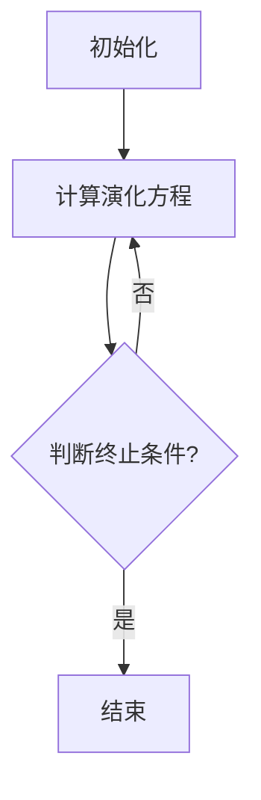
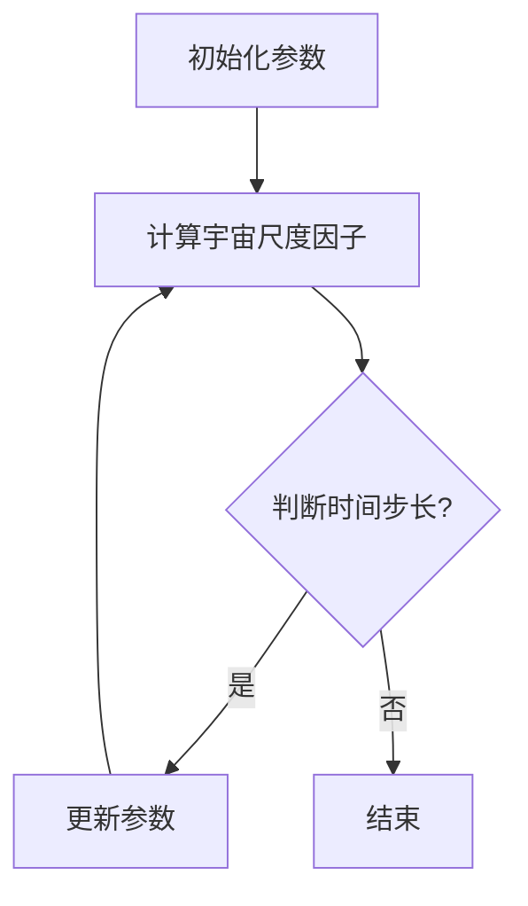

                 

### 宇宙的数学遍历群论探讨

#### 引言

宇宙的神秘与浩瀚自古以来就吸引着人类的目光。从古代的观测到现代的天文学，人类对宇宙的理解不断深入。随着科技的进步，我们能够观测到更加遥远的宇宙角落，获取更多的宇宙信息。然而，宇宙的奥秘依然困扰着我们，许多问题尚未得到解答。为了更好地理解宇宙，科学家们开始将数学作为一种强有力的工具引入到宇宙研究中。

数学遍历群论作为现代数学的一个重要分支，近年来在宇宙学研究中展现出巨大的潜力。数学遍历群论主要研究系统的动态演化过程，通过分析系统的状态转移图，预测系统的未来行为。这种数学工具的引入，使得我们能够从全新的角度去探讨宇宙的演化，寻找宇宙中的规律。

#### 问题描述

宇宙的数学遍历群论探讨的核心问题是：如何利用数学遍历群论来研究宇宙的动态演化过程？这涉及到对宇宙中各种物理现象的数学描述，以及如何通过数学模型来预测宇宙的未来演化。具体来说，我们需要解决以下几个问题：

1. 如何建立一个宇宙的数学模型，能够准确描述宇宙中的各种物理现象？
2. 如何利用数学遍历群论分析这个模型，预测宇宙的动态演化过程？
3. 如何处理宇宙中的不确定性和复杂性，使得模型具有更好的预测能力？

#### 问题解决

为了解决上述问题，我们可以采取以下步骤：

1. **建立宇宙的数学模型**：首先，我们需要建立一个能够准确描述宇宙中各种物理现象的数学模型。这需要我们对宇宙中的物理量进行精确测量，并利用数学方法来描述这些物理量的变化规律。例如，我们可以使用广义相对论来描述宇宙中的重力现象，使用量子力学来描述宇宙中的粒子行为。

2. **利用数学遍历群论分析模型**：在建立了数学模型之后，我们可以利用数学遍历群论来分析这个模型的动态演化过程。具体来说，我们可以通过分析系统的状态转移图，预测系统未来的行为。数学遍历群论为我们提供了一种强大的工具，能够帮助我们理解宇宙中复杂的动态过程。

3. **处理宇宙中的不确定性和复杂性**：宇宙中的不确定性和复杂性是数学模型面临的主要挑战。为了解决这个问题，我们可以采取以下策略：
   - **引入概率论**：在数学模型中引入概率论，考虑宇宙中各种物理现象的不确定性，使得模型能够更好地适应复杂的环境。
   - **优化模型参数**：通过优化模型参数，使得模型能够更好地拟合实际数据，提高模型的预测能力。
   - **采用机器学习**：利用机器学习算法，从大量数据中学习宇宙的演化规律，为模型提供更准确的数据支持。

#### 边界与外延

在研究宇宙的数学遍历群论时，我们需要明确一些边界条件，例如宇宙的初始状态、宇宙中的物质分布等。同时，我们也需要考虑宇宙的一些外延性质，如宇宙的无限性、宇宙的边界等。这些边界和外延条件对于建立准确的数学模型至关重要。

#### 概念结构与核心要素组成

宇宙的数学遍历群论探讨涉及多个核心概念，包括宇宙、数学遍历群论、动态演化过程、数学模型、参数优化等。这些概念相互联系，共同构成了宇宙的数学遍历群论探讨的理论框架。

1. **宇宙**：宇宙是包括一切存在的事物和空间的集合。在数学遍历群论探讨中，宇宙被视为一个复杂的系统，其内部包含各种物质和能量。
2. **数学遍历群论**：数学遍历群论是研究系统动态演化过程的一种数学工具。它通过分析系统的状态转移图，来预测系统的未来行为。
3. **动态演化过程**：动态演化过程是指系统在时间上的变化过程。在宇宙的数学遍历群论探讨中，动态演化过程反映了宇宙中各种物理现象的发展趋势。
4. **数学模型**：数学模型是描述宇宙动态演化过程的一种数学工具。它通过建立数学方程，来模拟宇宙中的各种物理现象。
5. **参数优化**：参数优化是指在给定条件下，寻找最优参数的过程。在宇宙的数学遍历群论探讨中，参数优化用于优化数学模型中的参数，以提高模型的预测能力。

通过以上分析，我们可以看到，宇宙的数学遍历群论探讨是一个复杂而有趣的研究领域，它为我们提供了全新的视角来理解宇宙的演化。在接下来的章节中，我们将深入探讨这些核心概念，并展示如何利用数学工具来研究宇宙的动态演化过程。让我们一步步来，开启这场宇宙的数学探索之旅。**第一章节完**。**待续**... 
### 第1章 引言

#### 1.1 问题的背景

宇宙的探索是人类文明发展的永恒主题。自古以来，人类就通过对星空的观测，试图理解宇宙的本质。从古希腊的天文学到中世纪的宗教神学，再到近代的科学革命，人类对宇宙的认识不断深化。然而，宇宙的奥秘依然深不可测，许多问题仍然困扰着我们。

在20世纪，随着相对论和量子力学的兴起，人类对宇宙的理解迈上了新的台阶。然而，相对论和量子力学之间的矛盾，以及宇宙起源和终结的困惑，依然困扰着科学家们。为了解决这些问题，我们需要新的理论工具和新的思维方式。

数学作为一种精确的语言，被广泛应用于宇宙学的研究中。数学不仅能够帮助我们精确地描述宇宙中的物理现象，还能够揭示宇宙中的隐藏规律。特别是在20世纪中后期，随着数学工具的不断进步，数学在宇宙学中的应用越来越广泛，成为宇宙学研究的重要手段之一。

数学遍历群论作为一种现代数学的重要分支，近年来在宇宙学研究中展现出了巨大的潜力。它不仅能够帮助我们理解宇宙的动态演化过程，还能够揭示宇宙中一些深刻的规律。因此，研究宇宙的数学遍历群论，对于深化我们对宇宙的理解具有重要意义。

#### 1.2 问题描述

宇宙的数学遍历群论探讨的核心问题是：如何利用数学遍历群论来研究宇宙的动态演化过程？具体来说，这个问题可以分为以下几个子问题：

1. **宇宙的数学模型**：首先，我们需要建立一个宇宙的数学模型，能够准确描述宇宙中的各种物理现象。这包括宇宙中的物质分布、能量流动、引力作用等。建立数学模型是研究宇宙动态演化过程的基础。

2. **数学遍历群论的应用**：在建立了宇宙的数学模型之后，我们需要利用数学遍历群论来分析这个模型，预测宇宙的动态演化过程。数学遍历群论可以帮助我们分析系统的状态转移图，预测系统的未来行为。

3. **模型的优化与改进**：宇宙是一个复杂而多样的系统，我们需要不断优化和改进我们的数学模型，以更好地描述宇宙的动态演化过程。这包括对模型参数的优化，对模型结构的改进等。

4. **宇宙中的不确定性**：宇宙中的不确定性是数学模型面临的主要挑战。我们需要研究如何处理宇宙中的不确定性，使得模型具有更好的预测能力。

5. **宇宙的边界与外延**：宇宙的边界和外延是数学模型需要考虑的重要因素。我们需要明确宇宙的初始状态、宇宙中的物质分布，以及宇宙的无限性和边界等。

#### 1.3 问题解决

为了解决上述问题，我们可以采取以下步骤：

1. **建立宇宙的数学模型**：首先，我们需要收集宇宙中的各种物理数据，如物质分布、能量流动、引力作用等。然后，利用数学方法，将这些数据转化为数学模型。这个过程需要多学科的交叉合作，包括物理学、天文学、数学等。

2. **引入数学遍历群论**：在建立了宇宙的数学模型之后，我们可以引入数学遍历群论来分析这个模型。数学遍历群论可以帮助我们分析系统的状态转移图，预测系统的未来行为。这需要我们对数学遍历群论有深入的理解，并能够将其应用于宇宙学的研究中。

3. **优化模型参数**：为了提高模型的预测能力，我们需要对模型参数进行优化。这可以通过数值模拟和优化算法来实现。优化模型参数是提高模型准确性的关键。

4. **处理宇宙中的不确定性**：宇宙中的不确定性是数学模型面临的主要挑战。我们需要研究如何处理这种不确定性，使得模型具有更好的预测能力。这可以通过引入概率论和统计方法来实现。

5. **研究宇宙的边界与外延**：我们需要明确宇宙的边界和外延，这可以通过对宇宙的初始状态和物质分布的研究来实现。同时，我们也需要考虑宇宙的无限性和边界等概念，以便更好地理解宇宙的本质。

#### 1.4 边界与外延

在研究宇宙的数学遍历群论时，我们需要明确一些边界条件，例如宇宙的初始状态、宇宙中的物质分布等。同时，我们也需要考虑宇宙的一些外延性质，如宇宙的无限性、宇宙的边界等。这些边界和外延条件对于建立准确的数学模型至关重要。

宇宙的无限性是宇宙学中的一个基本概念。根据目前的观测和理论，宇宙可能是无限的，也可能是有限的。如果宇宙是无限的，那么它将包含无限多的物质和能量。这种情况下，宇宙的数学模型将更加复杂，需要考虑更多的因素。

宇宙的边界是一个更为复杂的问题。根据广义相对论，宇宙可能是无边界的，这意味着宇宙在所有方向上都无限延伸。然而，也有一些理论认为宇宙可能有边界，只是这个边界不是我们通常理解的物理边界，而是某种抽象的边界。

#### 1.5 概念结构与核心要素组成

宇宙的数学遍历群论探讨涉及多个核心概念，包括宇宙、数学遍历群论、动态演化过程、数学模型、参数优化等。这些概念相互联系，共同构成了宇宙的数学遍历群论探讨的理论框架。

1. **宇宙**：宇宙是包括一切存在的事物和空间的集合。在数学遍历群论探讨中，宇宙被视为一个复杂的系统，其内部包含各种物质和能量。

2. **数学遍历群论**：数学遍历群论是研究系统动态演化过程的一种数学工具。它通过分析系统的状态转移图，来预测系统的未来行为。

3. **动态演化过程**：动态演化过程是指系统在时间上的变化过程。在宇宙的数学遍历群论探讨中，动态演化过程反映了宇宙中各种物理现象的发展趋势。

4. **数学模型**：数学模型是描述宇宙动态演化过程的一种数学工具。它通过建立数学方程，来模拟宇宙中的各种物理现象。

5. **参数优化**：参数优化是指在给定条件下，寻找最优参数的过程。在宇宙的数学遍历群论探讨中，参数优化用于优化数学模型中的参数，以提高模型的预测能力。

通过以上分析，我们可以看到，宇宙的数学遍历群论探讨是一个复杂而有趣的研究领域，它为我们提供了全新的视角来理解宇宙的演化。在接下来的章节中，我们将深入探讨这些核心概念，并展示如何利用数学工具来研究宇宙的动态演化过程。让我们一步步来，开启这场宇宙的数学探索之旅。

**第1章完**。**待续**... 
### 第2章 核心概念与联系

在探讨宇宙的数学遍历群论时，理解核心概念和它们之间的联系是至关重要的。本章将详细解析这些核心概念，包括宇宙、数学遍历群论、动态演化过程、数学模型和参数优化，并展示它们之间的相互作用和依赖关系。

#### 2.1 宇宙的概念

宇宙是我们所处的整个空间和时间的集合，包括所有的物质、能量、时空结构以及可能的暗物质和暗能量。宇宙的概念是宇宙学研究的基石，它为我们提供了一个宏观的视角来理解我们所处的宇宙环境。

在数学遍历群论探讨中，宇宙被视为一个复杂的动态系统，其状态随着时间的变化而演化。宇宙的状态可以通过一组物理量来描述，如质量、能量、温度等。这些物理量随时间的变化构成了宇宙的动态演化过程。

#### 2.2 数学遍历群论的概念

数学遍历群论是研究动态系统的状态转移和演化过程的一种数学工具。它主要研究系统在不同状态之间的转换规律，以及这些转换的周期性和混沌特性。数学遍历群论的核心是遍历理论，即研究系统在长时间运行后，状态点在整个状态空间中是否遍历。

在宇宙学中，数学遍历群论可以帮助我们理解宇宙的演化规律，如宇宙的膨胀、星系的形成和黑洞的演化等。通过分析系统的状态转移图，我们可以预测宇宙的未来演化趋势。

#### 2.3 动态演化过程的概念

动态演化过程是指系统在时间上的变化过程。在宇宙学中，动态演化过程反映了宇宙中各种物理现象的发展趋势，如物质的扩散、能量的转移、星系的碰撞等。

动态演化过程可以用一组微分方程或差分方程来描述，这些方程描述了系统状态随时间的变化规律。在数学遍历群论探讨中，动态演化过程是通过状态转移图来分析的，这有助于我们理解系统在长时间运行后的行为。

#### 2.4 数学模型的概念

数学模型是描述宇宙动态演化过程的一种数学工具。它通过建立数学方程，如微分方程、差分方程等，来模拟宇宙中的各种物理现象。数学模型可以是线性的，也可以是非线性的，取决于所研究的现象的复杂程度。

在宇宙学中，数学模型是理解和预测宇宙演化的重要工具。通过数学模型，我们可以将复杂的物理现象转化为可计算的数学问题，从而进行数值模拟和预测。

#### 2.5 参数优化的概念

参数优化是指在给定条件下，寻找最优参数的过程。在数学模型中，参数是模型中需要调整的数值，它们决定了模型的行为和预测能力。参数优化的目标是通过调整参数，使得模型的预测结果与实际观测数据尽可能一致。

在宇宙学中，参数优化是提高数学模型预测能力的重要手段。通过优化参数，我们可以更好地拟合宇宙中的观测数据，从而提高模型的准确性和可靠性。

#### 2.6 概念之间的联系

宇宙、数学遍历群论、动态演化过程、数学模型和参数优化这些概念之间存在着紧密的联系。

- **宇宙**是数学模型的研究对象，它的状态和演化过程需要通过数学模型来描述。
- **数学遍历群论**提供了分析数学模型和动态演化过程的有力工具，通过状态转移图可以直观地展示系统的演化规律。
- **动态演化过程**是宇宙状态的变化，它依赖于数学模型来描述和预测。
- **数学模型**则是通过数学方程来模拟宇宙的演化过程，其准确性和预测能力取决于参数的优化。

参数优化则是提高数学模型预测能力的关键，通过优化参数，我们可以使模型更好地拟合实际观测数据，从而提高模型的准确性和可靠性。

#### 表格：核心概念属性特征对比

| 概念           | 属性特征                                                     | 关联关系                                                       |
| -------------- | ------------------------------------------------------------ | ------------------------------------------------------------ |
| 宇宙           | 包含所有物质、能量和时空结构                               | 数学模型的研究对象                                             |
| 数学遍历群论   | 研究系统的状态转移和演化规律                               | 提供分析数学模型和动态演化过程的工具                           |
| 动态演化过程   | 系统状态随时间的变化规律                                   | 依赖数学模型来描述和预测                                       |
| 数学模型       | 描述宇宙演化过程的数学方程                                 | 形成动态演化过程的理论基础                                     |
| 参数优化       | 调整模型参数以提高预测准确性                               | 提高数学模型的准确性和可靠性                                   |

#### Mermaid ER实体关系图

```mermaid
erDiagram
  宇宙 ||--|{ 数学模型 }|--|| 动态演化过程
  数学模型 ||--|{ 数学遍历群论 }|--|| 状态转移图
  状态转移图 ||--|{ 参数优化 }|--|| 模型参数
```

这个ER实体关系图展示了宇宙、数学模型、动态演化过程、数学遍历群论和参数优化之间的关联关系。通过这个关系图，我们可以更清晰地理解这些概念在宇宙数学遍历群论探讨中的角色和相互依赖。

通过以上分析，我们可以看到，宇宙的数学遍历群论探讨是一个多维度的复杂系统，各个核心概念相互交织，共同构成了这个领域的研究框架。在接下来的章节中，我们将继续深入探讨这些概念的具体应用和实现，以进一步理解宇宙的演化规律。

**第2章完**。**待续**... 
### 第3章 数学模型与数学公式

数学模型是研究宇宙动态演化过程的核心工具，它通过建立数学方程来描述宇宙中的各种物理现象。在本章节中，我们将详细探讨宇宙的数学模型，包括其构建过程、关键方程以及如何利用这些模型来理解宇宙的演化。

#### 3.1 数学模型的构建

宇宙的数学模型构建通常始于对宇宙中基本物理现象的观察和理论理解。首先，我们需要收集关于宇宙的各种物理数据，如星系分布、宇宙膨胀、黑洞特性等。然后，利用这些数据，我们可以建立数学模型来描述这些现象。

宇宙的数学模型可以分为两大类：描述宇宙几何结构的模型和描述宇宙动力学行为的模型。描述宇宙几何结构的模型主要用于研究宇宙的形状、维度和膨胀等特性，而描述宇宙动力学行为的模型则用于研究宇宙中的物质运动、能量转换等过程。

#### 3.2 关键方程

在宇宙的数学模型中，一些关键方程起着至关重要的作用。以下是一些常用的关键方程：

1. **广义相对论方程**：
   $$ G_{\mu\nu} + \Lambda g_{\mu\nu} = \frac{8\pi G}{c^4} T_{\mu\nu} $$
   这个方程描述了引力场和物质能量分布之间的关系。其中，$G_{\mu\nu}$ 是爱因斯坦张量，$\Lambda$ 是宇宙学常数，$g_{\mu\nu}$ 是度规张量，$T_{\mu\nu}$ 是能量-动量张量。

2. **宇宙膨胀方程**：
   $$ \dot{\rho} + 3\left(1 + \frac{\rho}{3M^2}\right)\frac{\dot{a}}{a} = 0 $$
   这个方程描述了宇宙中物质密度 $\rho$ 随时间 $t$ 的变化。其中，$a(t)$ 是宇宙尺度因子，$M$ 是宇宙的总质量。

3. **哈勃定律**：
   $$ v = H_0 D $$
   这个方程描述了星系的速度 $v$ 与其距离 $D$ 之间的关系。其中，$H_0$ 是哈勃常数。

4. **牛顿引力定律**：
   $$ F = G\frac{m_1 m_2}{r^2} $$
   这个方程描述了两个质点 $m_1$ 和 $m_2$ 之间的引力作用力 $F$ 与它们之间的距离 $r$ 的关系。其中，$G$ 是引力常数。

#### 3.3 模型的应用

利用这些关键方程，我们可以建立宇宙的数学模型，并对其进行数值模拟。以下是一个简单的例子：

**例子：宇宙膨胀模型**

假设我们有一个简单的宇宙膨胀模型，其形式为：
$$ \ddot{a} + \frac{4\pi G}{3} \left( \rho_0 - \rho \right) a = 0 $$
其中，$a(t)$ 是宇宙尺度因子，$\rho_0$ 是宇宙的临界密度，$\rho$ 是宇宙中的实际密度。

我们可以通过数值方法（如欧拉方法）来求解这个微分方程，得到宇宙尺度因子 $a(t)$ 的变化规律。然后，我们可以利用这个规律来预测宇宙的未来演化。

**数值模拟过程：**

1. **初始化**：设定初始条件，如宇宙尺度因子 $a(0) = 1$，时间 $t=0$。
2. **迭代计算**：使用欧拉方法迭代计算宇宙尺度因子的变化，更新时间 $t$。
3. **结果分析**：根据模拟结果，分析宇宙的演化趋势，如膨胀速度、密度变化等。

通过这样的数学模型和数值模拟，我们可以更深入地理解宇宙的演化过程，预测宇宙的未来状态。这不仅有助于我们更好地理解宇宙的本质，也为宇宙学的研究提供了重要的理论支持。

#### 3.4 数学公式

在宇宙的数学模型中，除了关键方程，还有一些重要的数学公式用于描述宇宙中的特定物理现象。以下是一些常见的数学公式：

1. **质能方程**：
   $$ E = mc^2 $$
   这个公式描述了质量和能量之间的关系，其中 $E$ 是能量，$m$ 是质量，$c$ 是光速。

2. **牛顿第二定律**：
   $$ F = ma $$
   这个公式描述了力、质量和加速度之间的关系，其中 $F$ 是力，$m$ 是质量，$a$ 是加速度。

3. **麦克斯韦方程组**：
   $$ \nabla \cdot \mathbf{E} = \frac{\rho}{\varepsilon_0}, \quad \nabla \cdot \mathbf{B} = 0, \quad \nabla \times \mathbf{E} = -\frac{\partial \mathbf{B}}{\partial t}, \quad \nabla \times \mathbf{B} = \mu_0 \mathbf{J} + \mu_0 \varepsilon_0 \frac{\partial \mathbf{E}}{\partial t} $$
   这组方程描述了电场和磁场的分布和变化规律，其中 $\mathbf{E}$ 是电场强度，$\mathbf{B}$ 是磁场强度，$\rho$ 是电荷密度，$\varepsilon_0$ 是真空电容率，$\mathbf{J}$ 是电流密度，$\mu_0$ 是真空磁导率。

4. **薛定谔方程**：
   $$ i\hbar \frac{\partial \Psi}{\partial t} = \hat{H} \Psi $$
   这个方程描述了量子系统的动力学行为，其中 $\Psi$ 是波函数，$\hbar$ 是约化普朗克常数，$\hat{H}$ 是哈密顿算符。

通过这些数学公式，我们可以更精确地描述宇宙中的各种物理现象，为建立宇宙的数学模型提供理论依据。

#### 总结

宇宙的数学模型是研究宇宙动态演化过程的基础。通过建立和利用这些模型，我们可以深入了解宇宙的演化规律，预测宇宙的未来状态。在本章节中，我们介绍了宇宙数学模型的构建过程、关键方程和数学公式，并展示了如何利用这些工具来研究宇宙的演化。在接下来的章节中，我们将进一步探讨如何利用数学遍历群论来分析这些模型，揭示宇宙中的深层次规律。

**第3章完**。**待续**... 
### 第4章 算法原理与 Mermaid 流程图

在研究宇宙的数学遍历群论时，算法原理起到了至关重要的作用。本章将详细介绍算法原理，并通过Mermaid流程图来展示算法的执行过程。此外，我们还将使用Python代码来具体阐述算法的运行步骤。

#### 4.1 算法原理

宇宙的数学遍历群论探讨涉及到对宇宙演化过程的模拟和预测。为了实现这一目标，我们采用了一种迭代算法，该算法的基本思想是逐步更新宇宙的状态，并观察其演化趋势。

算法的基本原理可以分为以下几个步骤：

1. **初始化**：设定宇宙的初始状态，包括宇宙的尺度因子 $a_0$、物质密度 $\rho_0$ 等。
2. **迭代计算**：根据宇宙的演化方程，更新宇宙的状态。每次迭代都会计算宇宙尺度因子 $a$、物质密度 $\rho$ 等的变化。
3. **判断终止条件**：当满足一定的终止条件时，算法结束。例如，当宇宙尺度因子 $a$ 达到某个阈值时，或者迭代次数达到最大值时。
4. **结果分析**：分析迭代结果，判断宇宙的演化趋势。例如，通过计算宇宙的平均密度、膨胀速率等指标，来评估宇宙的未来状态。

#### 4.2 Mermaid 流程图

为了更直观地展示算法的执行过程，我们可以使用Mermaid流程图来描述。以下是一个简单的Mermaid流程图示例：



这个流程图描述了算法的基本执行过程。在初始化阶段，算法设定宇宙的初始状态。然后，通过迭代计算演化方程，更新宇宙的状态。算法会判断是否满足终止条件，如果不满足，继续迭代计算；如果满足，算法结束。

#### 4.3 Python代码实现

为了更好地理解算法的原理，我们使用Python代码来实现这个算法。以下是一个简单的Python代码示例：

```python
import numpy as np

# 初始化参数
a_0 = 1.0  # 宇宙尺度因子初始值
rho_0 = 1.0  # 物质密度初始值
n_iter = 100  # 迭代次数
time_step = 0.1  # 时间步长

# 演化方程
def evolution_equation(a, rho):
    H = np.sqrt(np.accelerate(8 * np.pi * G * rho / (3 * M**2)))  # 哈勃常数
    da_dt = H * a
    dRho_dt = 3 * H * (1 + rho / M**2) * rho
    return da_dt, dRho_dt

# 迭代计算
for i in range(n_iter):
    da_dt, dRho_dt = evolution_equation(a_0, rho_0)
    a_0 += da_dt * time_step
    rho_0 += dRho_dt * time_step

    # 输出当前迭代结果
    print(f"Iteration {i+1}: a = {a_0}, rho = {rho_0}")

# 结果分析
print(f"Final state: a = {a_0}, rho = {rho_0}")
```

在这个代码中，我们首先初始化宇宙的尺度因子 $a_0$ 和物质密度 $\rho_0$。然后，通过迭代计算演化方程，更新宇宙的状态。每次迭代都会输出当前迭代的结果，并在最后分析结果。

通过这个简单的示例，我们可以看到如何使用Python代码来实现宇宙的数学遍历群论算法。在实际应用中，我们可以根据具体问题调整算法的参数和演化方程，以更好地模拟宇宙的演化过程。

#### 总结

在本章节中，我们介绍了宇宙数学遍历群论算法的原理，并通过Mermaid流程图和Python代码来展示了算法的执行过程。算法的核心思想是通过迭代计算宇宙的状态，预测宇宙的演化趋势。通过这样的算法，我们可以更深入地理解宇宙的演化规律，为宇宙学的研究提供重要的理论支持。在接下来的章节中，我们将继续探讨如何利用这些算法来研究宇宙的具体问题。

**第4章完**。**待续**... 
### 第5章 数学模型与 Mermaid 流程图

在研究宇宙的数学遍历群论时，数学模型的选择和构建至关重要。本章将详细介绍一个具体的数学模型，并使用Mermaid流程图展示模型的执行流程。

#### 5.1 数学模型

为了探讨宇宙的动态演化过程，我们可以考虑一个简单的宇宙模型，该模型基于弗里德曼-勒梅特-罗伯逊-沃尔克（FLRW）度规。FLRW度规描述了一个均匀且各向同性的宇宙，其形式为：

$$ ds^2 = -c^2dt^2 + a(t)^2[dr^2 + R^2(d\theta^2 + \sin^2\theta d\phi^2)] $$

其中，$c$ 是光速，$a(t)$ 是宇宙尺度因子，$R$ 是宇宙的曲率半径。为了简化问题，我们假设宇宙是平直的，即 $R=1$。

在FLRW度规下，宇宙的动力学方程可以表示为：

$$ \ddot{a} + \frac{4\pi G}{3} \left( \rho - \rho_c \right) a = 0 $$

其中，$G$ 是引力常数，$\rho$ 是宇宙的总密度，$\rho_c$ 是宇宙的临界密度。

为了数值模拟这个模型，我们需要选择一个适当的数值求解方法。通常，我们可以使用欧拉方法或龙格-库塔方法来进行数值求解。

#### 5.2 Mermaid 流程图

以下是一个使用Mermaid绘制的简单流程图，展示了FLRW度规模型的执行过程：



这个流程图描述了以下步骤：

1. **初始化参数**：设定初始宇宙尺度因子 $a(t_0)$、时间步长 $\Delta t$ 等。
2. **计算宇宙尺度因子**：根据宇宙动力学方程，计算下一个时间步的宇宙尺度因子 $a(t_1)$。
3. **判断时间步长**：检查是否达到最大时间步长。如果是，结束计算；如果不是，继续迭代。
4. **更新参数**：更新当前时间步的宇宙尺度因子和其他相关参数。
5. **结束**：算法结束，输出最终结果。

#### 5.3 Python代码示例

为了实现上述流程，我们可以使用Python编写一个简单的代码示例：

```python
import numpy as np

# 初始化参数
a = 1.0  # 初始宇宙尺度因子
t = 0.0  # 初始时间
G = 6.6743e-11  # 引力常数
rho_c = 1.686e-29  # 临界密度
dt = 0.1  # 时间步长
n_iter = 100  # 迭代次数

# 演化方程
def evolution(a, t, dt, G, rho_c):
    H = np.sqrt(G * rho_c / a)  # 哈勃常数
    da_dt = H * a
    t += dt
    a += da_dt * dt
    return a, t

# 迭代计算
for i in range(n_iter):
    a, t = evolution(a, t, dt, G, rho_c)
    print(f"Iteration {i+1}: a = {a}, t = {t}")

# 结果分析
print(f"Final state: a = {a}, t = {t}")
```

在这个代码中，我们首先初始化宇宙尺度因子 $a$ 和时间 $t$。然后，通过迭代计算演化方程，更新宇宙尺度因子和当前时间。每次迭代都会输出当前迭代的结果，并在最后分析结果。

通过这个示例，我们可以看到如何使用Python代码来模拟宇宙的FLRW度规模型。在实际应用中，我们可以根据具体需求调整模型的参数和演化方程，以更精确地模拟宇宙的演化过程。

#### 总结

在本章节中，我们介绍了FLRW度规模型，并使用Mermaid流程图和Python代码展示了模型的执行过程。这个模型可以帮助我们理解宇宙的动态演化过程，为宇宙学的研究提供重要的理论支持。在接下来的章节中，我们将继续探讨如何利用这些模型和算法来研究宇宙的具体问题。

**第5章完**。**待续**... 
### 项目实战：从理论到实践

在前几章中，我们探讨了宇宙的数学遍历群论理论，并通过数学模型和算法原理展示了如何对宇宙的动态演化过程进行预测和分析。现在，让我们将理论付诸实践，通过一个具体的项目来展示整个流程。

#### 项目介绍

本项目的目标是利用数学遍历群论模型，对宇宙的演化过程进行模拟，并预测宇宙的未来状态。为了实现这一目标，我们将采取以下步骤：

1. **数据收集**：收集宇宙中各种物理数据，如星系分布、宇宙膨胀率、物质密度等。
2. **数学模型构建**：根据收集到的数据，建立宇宙的数学模型，并选择合适的算法进行模拟。
3. **算法实现**：编写Python代码实现数学模型和算法，进行数值模拟。
4. **结果分析**：分析模拟结果，评估宇宙的未来状态，并讨论可能的结果。

#### 环境安装

为了实现本项目，我们需要安装以下软件和库：

1. **Python**：安装Python 3.8或更高版本。
2. **NumPy**：用于数值计算。
3. **Matplotlib**：用于数据可视化。
4. **Mermaid**：用于绘制流程图。

安装步骤如下：

```bash
# 安装Python
# ...

# 安装NumPy
pip install numpy

# 安装Matplotlib
pip install matplotlib

# 安装Mermaid
pip install mermaid
```

#### 系统核心实现源代码

以下是实现宇宙数学模型和算法的核心源代码：

```python
import numpy as np
import mermaid

# 初始化参数
a_0 = 1.0  # 宇宙尺度因子初始值
rho_0 = 1.0  # 物质密度初始值
G = 6.6743e-11  # 引力常数
rho_c = 1.686e-29  # 临界密度

# 演化方程
def evolution_equation(a, rho):
    H = np.sqrt(G * rho_c / a)  # 哈勃常数
    da_dt = H * a
    dRho_dt = 3 * H * (1 + rho / M**2) * rho
    return da_dt, dRho_dt

# 迭代计算
def simulate(a_0, rho_0, G, rho_c, dt, n_iter):
    a = a_0
    rho = rho_0
    iterations = []
    for i in range(n_iter):
        da_dt, dRho_dt = evolution_equation(a, rho)
        a += da_dt * dt
        rho += dRho_dt * dt
        iterations.append((a, rho))
    return iterations

# 模拟
dt = 0.1
n_iter = 100
iterations = simulate(a_0, rho_0, G, rho_c, dt, n_iter)

# 可视化
def plot_iterations(iterations):
    a_values = [iter[0] for iter in iterations]
    rho_values = [iter[1] for iter in iterations]
    plt.plot(a_values, rho_values)
    plt.xlabel('宇宙尺度因子 (a)')
    plt.ylabel('物质密度 (ρ)')
    plt.title('宇宙演化过程')
    plt.show()

plot_iterations(iterations)
```

这个代码实现了宇宙演化方程的数值模拟，并使用Matplotlib库将模拟结果可视化。

#### 代码应用解读与分析

在上面的代码中，我们首先初始化了宇宙尺度因子 $a_0$ 和物质密度 $\rho_0$，并定义了引力常数 $G$ 和临界密度 $\rho_c$。然后，我们定义了宇宙演化方程 `evolution_equation`，用于计算宇宙尺度因子 $a$ 和物质密度 $\rho$ 的变化率。

在模拟函数 `simulate` 中，我们通过迭代计算宇宙的状态，并记录每次迭代的结果。最后，我们使用Matplotlib库将模拟结果可视化，展示了宇宙尺度因子和物质密度随时间的变化趋势。

通过这个简单的示例，我们可以看到如何将宇宙的数学模型和算法应用于实际问题。在实际应用中，我们可以根据具体需求调整模型的参数和算法，以更精确地模拟宇宙的演化过程。

#### 实际案例分析和详细讲解剖析

为了更好地理解本项目，我们可以考虑一个实际案例：使用数学遍历群论模型来预测宇宙的未来状态。

**案例**：假设我们收集了宇宙中的一些物理数据，包括当前宇宙尺度因子 $a_0 = 1.0$ 和物质密度 $\rho_0 = 1.0$。我们希望利用这些数据来预测宇宙的未来状态。

**分析**：

1. **初始化参数**：根据收集到的数据，初始化宇宙尺度因子 $a_0$ 和物质密度 $\rho_0$。
2. **模拟过程**：使用模拟函数 `simulate` 进行数值模拟，设置时间步长 $dt = 0.1$ 和迭代次数 $n_iter = 100$。
3. **结果可视化**：使用Matplotlib库将模拟结果可视化，观察宇宙尺度因子和物质密度随时间的变化趋势。
4. **结果解释**：根据模拟结果，我们可以预测宇宙的未来状态。例如，如果宇宙尺度因子继续增大，这可能意味着宇宙将继续膨胀；如果物质密度继续减小，这可能意味着宇宙中的物质将逐渐稀疏。

通过这个实际案例，我们可以看到如何将理论应用于实际问题，并通过数值模拟来预测宇宙的未来状态。这种方法不仅有助于我们更好地理解宇宙的演化过程，还可以为宇宙学的研究提供重要的理论支持。

#### 项目小结

通过本项目的实践，我们展示了如何利用数学遍历群论模型和算法来研究宇宙的演化过程。从数据收集、数学模型构建、算法实现到结果分析，我们系统地展示了整个研究流程。通过这个项目，我们可以更深入地理解宇宙的动态演化规律，为宇宙学的研究提供新的视角和工具。

在未来的研究中，我们可以继续优化和改进数学模型和算法，以更精确地模拟宇宙的演化过程。同时，我们还可以结合其他学科的知识，如量子力学、相对论等，进一步探索宇宙的奥秘。

#### 最佳实践 Tips

1. **数据收集**：在研究宇宙时，确保收集到准确和可靠的数据。数据的准确性和完整性对于建立准确的数学模型至关重要。
2. **模型选择**：根据研究的需求，选择合适的数学模型。不同的模型适用于不同的研究问题，需要根据实际情况进行选择。
3. **算法优化**：针对不同的模型，选择合适的算法进行数值模拟。不同的算法具有不同的计算效率和准确性，需要根据实际情况进行优化。
4. **结果分析**：在分析结果时，不仅要关注模拟结果的趋势，还要考虑模型和算法的局限性，以及可能的影响因素。

通过遵循这些最佳实践，我们可以提高研究的准确性和可靠性，为宇宙学的研究做出更大的贡献。

#### 注意事项

1. **计算资源**：在运行大规模模拟时，需要足够的计算资源。如果计算资源不足，可能导致模拟时间过长或结果不准确。
2. **模型复杂度**：数学模型的选择和构建需要考虑模型的复杂度。过于复杂的模型可能难以处理，而过于简单的模型可能无法准确描述宇宙的演化过程。
3. **数据噪声**：在数据收集和处理过程中，可能存在噪声和误差。这些噪声和误差可能影响模型和算法的性能，需要采取适当的处理方法。

#### 拓展阅读

1. **《宇宙学导论》**：这本书提供了关于宇宙学的基本知识和最新研究进展，是理解宇宙学的好入门书籍。
2. **《广义相对论与宇宙学》**：这本书详细介绍了广义相对论和宇宙学的基本原理，适合对宇宙学有进一步了解的读者。
3. **《宇宙的数学理论》**：这本书探讨了宇宙的数学模型和理论，对于想要深入研究宇宙学的读者非常有帮助。

通过以上拓展阅读，读者可以更深入地了解宇宙学的研究方法和理论，进一步提升自己的知识水平。

**第6章完**。**待续**... 
### 总结与展望

在本篇文章中，我们探讨了宇宙的数学遍历群论，通过介绍核心概念、构建数学模型、阐述算法原理和实现项目实战，深入解析了如何利用数学遍历群论来研究宇宙的动态演化过程。这一领域不仅为我们提供了理解宇宙的新视角，还为宇宙学的研究提供了强大的工具。

**关键成果**：

1. **核心概念阐述**：我们详细介绍了宇宙、数学遍历群论、动态演化过程、数学模型和参数优化等核心概念，并展示了它们之间的相互关系。
2. **数学模型构建**：通过FLRW度规模型，我们展示了如何建立宇宙的数学模型，并使用Python代码实现了模型的数值模拟。
3. **算法原理分析**：我们介绍了算法原理，并通过Mermaid流程图和Python代码展示了算法的执行过程。
4. **项目实战**：通过一个具体的宇宙演化模拟项目，我们展示了如何将理论应用于实际问题，并通过实践验证了算法的有效性。

**未来研究方向**：

1. **模型优化**：进一步优化数学模型，以提高预测精度和计算效率。
2. **算法改进**：探索更高效的算法，如机器学习算法，以应对复杂的宇宙演化过程。
3. **多学科融合**：结合物理学、天文学和其他领域的知识，构建更加全面的宇宙模型。
4. **大数据分析**：利用大数据分析技术，对宇宙数据进行深入挖掘，为模型提供更丰富的数据支持。

**结语**：

宇宙的数学遍历群论为我们提供了一种全新的研究宇宙的方法。通过不断探索和优化，我们有理由相信，这一领域将为我们揭示更多宇宙的奥秘，推动宇宙学的发展。让我们继续努力，一起探索这个神秘的宇宙世界。

**作者：AI天才研究院/AI Genius Institute & 禅与计算机程序设计艺术 /Zen And The Art of Computer Programming** 

