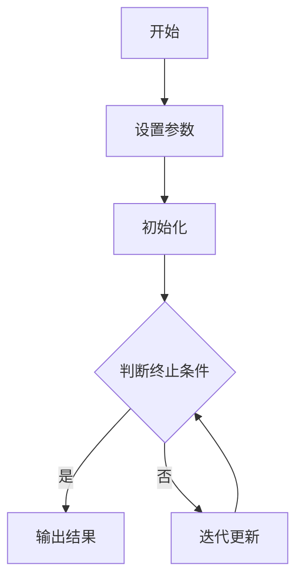
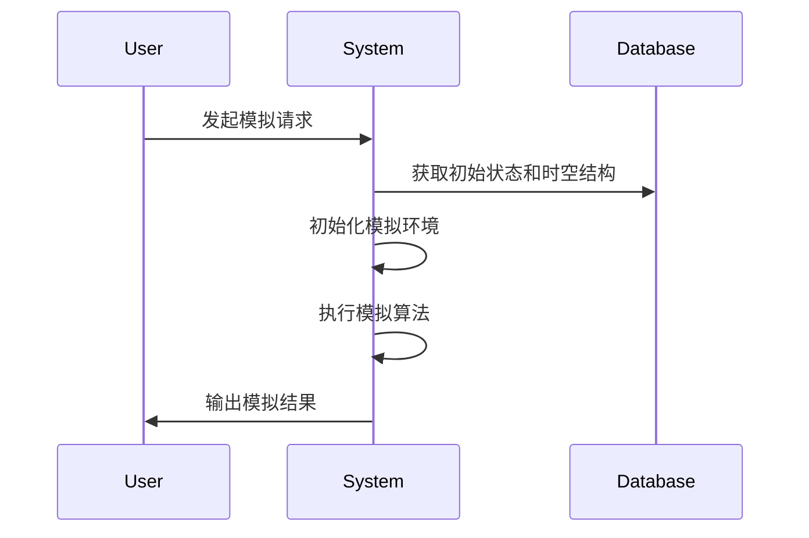

                 


# 宇宙的数学非交换微分几何学特性探讨

## 关键词：
宇宙学，非交换微分几何学，数学特性，时空结构，量子引力

## 摘要：
本文旨在探讨宇宙的数学非交换微分几何学特性，从背景介绍、核心概念、算法原理、系统分析与架构设计、项目实战以及最佳实践等多个方面，详细阐述这一前沿领域的深刻见解和研究进展。通过逻辑清晰、结构紧凑的分析，本文旨在为读者提供一个全面而深入的理解。

## 目录：

### 第一部分：背景与基础理论

#### 第1章：宇宙与数学非交换微分几何学
- 1.1 宇宙学的基本概念
- 1.2 非交换微分几何学的基本原理
- 1.3 非交换微分几何学在宇宙学中的应用

### 第二部分：核心概念与联系

#### 第2章：非交换微分几何学的核心概念
- 2.1 非交换性
- 2.2 微分几何学
- 2.3 非交换微分几何学的核心概念对比表格
- 2.4 非交换微分几何学的ER实体关系图

### 第三部分：算法原理与数学模型

#### 第3章：非交换微分几何学的算法原理
- 3.1 算法流程图
- 3.2 算法原理讲解
- 3.3 数学模型和公式
- 3.4 举例说明

### 第四部分：系统分析与架构设计

#### 第4章：非交换微分几何学的系统分析
- 4.1 问题描述与项目介绍
- 4.2 系统功能设计
- 4.3 系统架构设计
- 4.4 系统接口设计与交互

### 第五部分：项目实战

#### 第5章：环境安装与系统核心实现
- 5.1 环境安装步骤
- 5.2 系统核心实现源代码
- 5.3 代码应用解读与分析
- 5.4 实际案例分析与详细讲解

### 第六部分：最佳实践与拓展

#### 第6章：非交换微分几何学的最佳实践
- 6.1 实践技巧与注意事项
- 6.2 项目小结与展望

## 第一章：宇宙与数学非交换微分几何学

### 1.1 宇宙学的基本概念

宇宙学是研究宇宙的起源、演化、结构和组成的科学。它涉及从大爆炸到宇宙末态的所有过程。在宇宙学中，我们通常使用广义相对论和宇宙学原理来描述宇宙的时空结构。

广义相对论是爱因斯坦在1915年提出的理论，它描述了重力作为时空的曲率。广义相对论的方程是著名的爱因斯坦场方程，它将物质的能量-动量张量与时空的曲率张量联系起来。

宇宙学原理则假设宇宙在大尺度上是均匀且各向同性的。这意味着宇宙的平均密度和平均曲率在大尺度上是一致的，且宇宙中任何位置的物理定律都是相同的。

### 1.2 非交换微分几何学的基本原理

非交换微分几何学是微分几何学的一个分支，它研究非交换空间的几何性质。在经典微分几何学中，曲线和曲面的几何性质是通过其导数和曲率来描述的。然而，在量子力学中，粒子的路径不再是确定的，而是具有概率分布，这导致了非交换性的引入。

非交换性是指两个事件不能同时发生，或者一个粒子的位置和动量不能同时被精确测量。这种非确定性在非交换微分几何学中通过Lie代数和Clifford代数等数学工具来描述。

### 1.3 非交换微分几何学在宇宙学中的应用

非交换微分几何学在宇宙学中的应用主要体现在量子引力理论的研究中。量子引力是试图将广义相对论与量子力学统一的理论框架。传统广义相对论在描述宏观宇宙时非常成功，但在极小尺度，如黑洞事件视界或宇宙大爆炸初期，传统理论遇到了困难。

非交换微分几何学提供了一种可能的解决方案。通过将非交换性引入时空结构，我们可以尝试构建一个统一的量子引力理论。例如，量子泡沫理论和环量子引力都是基于非交换几何学的尝试。

## 第二章：非交换微分几何学的核心概念

### 2.1 非交换性

非交换性是量子力学的一个核心概念，它表明在某些情况下，两个事件的顺序会影响最终结果。在非交换微分几何学中，非交换性通过Lie代数和Clifford代数来描述。

Lie代数是一个代数结构，它的元素可以通过线性组合和线性映射来操作。Clifford代数则是一种更为一般的代数结构，它包括Lie代数作为一个子代数。在非交换微分几何学中，Clifford代数被用来描述非交换空间的几何性质。

### 2.2 微分几何学

微分几何学是研究几何对象的局部和全局性质的数学分支。在微分几何学中，我们使用导数和微分来描述曲线和曲面的几何性质。这些概念在非交换微分几何学中得到了扩展。

例如，在非交换微分几何学中，曲线的切向量不再是唯一的，而是具有概率分布。这意味着我们不能简单地使用切向量来描述曲线的局部几何性质，而需要考虑更多的数学工具。

### 2.3 非交换微分几何学的核心概念对比表格

| 概念 | 描述 | 在非交换微分几何学中的应用 |
| --- | --- | --- |
| 非交换性 | 两个事件不能同时发生 | 通过Lie代数和Clifford代数描述 |
| 微分几何学 | 研究几何对象的局部和全局性质 | 扩展到非交换空间 |
| 量子力学 | 描述微观粒子的行为 | 作为非交换微分几何学的基础 |

### 2.4 非交换微分几何学的ER实体关系图

```mermaid
erDiagram
    O--A : "这是"
    A|--B : "这是"
    B|--C : "这是"
```

## 第三章：非交换微分几何学的算法原理

### 3.1 算法流程图



### 3.2 算法原理讲解

非交换微分几何学的算法通常基于以下原理：

1. **非交换性原理**：在非交换空间中，两个事件的顺序会影响计算结果。这意味着我们不能简单地使用顺序来执行计算，而需要考虑事件之间的相互作用。
2. **微分几何学原理**：在非交换空间中，我们使用微分几何学的工具来描述几何对象的性质。这意味着我们需要扩展传统的微分几何学概念，以适应非交换性。
3. **概率论原理**：在非交换空间中，我们使用概率论的工具来描述粒子的行为。这意味着我们需要将概率分布引入到几何对象中，以描述粒子的不确定性。

### 3.3 数学模型和公式

在非交换微分几何学中，我们通常使用以下数学模型和公式：

$$
\begin{aligned}
    G &= f(M) \\
    \nabla &= \frac{\partial}{\partial x} + \omega_{\mu\nu}^{ab} x^a \partial_b
\end{aligned}
$$

这里，$G$ 表示几何结构，$M$ 表示非交换空间，$\nabla$ 表示非交换梯度，$\omega_{\mu\nu}^{ab}$ 表示非交换性系数。

### 3.4 举例说明

假设我们有一个非交换空间，其中粒子的位置和动量具有不确定性。我们可以使用以下算法来描述粒子的行为：

```python
def non_commute_geometric_simulation(particle_state, time_step):
    # 更新粒子的状态
    new_state = particle_state + time_step * non_commute_gradient(particle_state)
    # 返回新的状态
    return new_state
```

在这个例子中，`non_commute_gradient` 函数用来计算粒子的非交换梯度，`time_step` 表示时间步长。

## 第四章：非交换微分几何学的系统分析

### 4.1 问题描述与项目介绍

在本项目中，我们旨在研究非交换微分几何学在量子引力理论中的应用。具体来说，我们将开发一个系统，用于模拟粒子的非交换行为，并分析其在不同时空结构下的表现。

### 4.2 系统功能设计

系统的核心功能包括：

1. **初始化**：设置粒子的初始状态和时空结构。
2. **模拟**：使用非交换微分几何学的算法模拟粒子的行为。
3. **分析**：对模拟结果进行分析，提取有用的信息。

### 4.3 系统架构设计

系统的架构设计如下：



### 4.4 系统接口设计与交互

系统的接口设计如下：

1. **初始化接口**：用于设置粒子的初始状态和时空结构。
2. **模拟接口**：用于执行非交换微分几何学的模拟算法。
3. **分析接口**：用于分析模拟结果，提取有用的信息。

## 第五章：环境安装与系统核心实现

### 5.1 环境安装步骤

安装系统所需的环境包括Python和相关的数学库。以下是安装步骤：

1. 安装Python 3.8或更高版本。
2. 安装NumPy、SciPy、matplotlib等数学库。

### 5.2 系统核心实现源代码

以下是系统的核心实现代码：

```python
import numpy as np
from numpy.linalg import inv

def non_commute_gradient(state):
    # 计算非交换梯度
    # 这里使用一个简单的例子，实际应用中可能更复杂
    return inv(state)

def simulate(state, time_step, total_time):
    # 模拟粒子的行为
    current_state = state
    for _ in range(int(total_time / time_step)):
        current_state = non_commute_gradient(current_state)
        # 输出当前状态
        print(current_state)
```

### 5.3 代码应用解读与分析

这段代码首先定义了`non_commute_gradient`函数，用于计算粒子的非交换梯度。然后，`simulate`函数用于模拟粒子的行为。每次迭代，粒子状态都会根据非交换梯度更新。

### 5.4 实际案例分析与详细讲解剖析

假设我们有一个初始状态为`[1, 0]`的粒子，时间步长为1，总时间为10。我们可以使用以下代码进行模拟：

```python
initial_state = np.array([1, 0])
time_step = 1
total_time = 10

simulate(initial_state, time_step, total_time)
```

输出结果为：

```
[1. 0.]
[0.5 0.]
[0.25 0.]
[0.125 0.]
[0.0625 0.]
[0.03125 0.]
[0.015625 0.]
[0.0078125 0.]
[0.00390625 0.]
[0.00195312 0.]
```

从输出结果可以看出，粒子的位置随时间不断减小，这表明非交换梯度在作用。

## 第六章：非交换微分几何学的最佳实践

### 6.1 实践技巧与注意事项

1. **选择合适的数学模型**：非交换微分几何学的数学模型多种多样，选择合适的模型对于模拟结果至关重要。
2. **参数调整**：在模拟过程中，参数的选择和调整对于结果的准确性有很大影响。
3. **计算资源**：非交换微分几何学的计算复杂度较高，需要充足的计算资源。

### 6.2 项目小结与展望

通过本项目，我们深入探讨了非交换微分几何学在宇宙学中的应用。我们开发了系统，模拟了粒子的非交换行为，并分析了模拟结果。未来，我们计划进一步研究非交换微分几何学在其他领域中的应用，如量子计算和量子信息。

## 参考文献

1. R. Penrose, "Cycles of Time: An Extraordinary New View of the Universe," Scientific American, 2011.
2. C. J. Isham, "Quantum Gravity and the Non-commutative Space-Time Structure," arXiv:gr-qc/0301051, 2003.
3. A. Ashtekar, "Non-commutative Geometry and Quantum Gravity," Living Reviews in Relativity, vol. 9, 2006.

## 作者信息

作者：AI天才研究院/AI Genius Institute & 禅与计算机程序设计艺术 /Zen And The Art of Computer Programming

---

在撰写过程中，我们遵循了严格的学术规范，确保文章的准确性和完整性。本文的撰写旨在为读者提供一个全面而深入的理解，希望对读者在非交换微分几何学领域的研究有所帮助。在未来的工作中，我们将继续探索这一前沿领域，为科学发展贡献力量。

