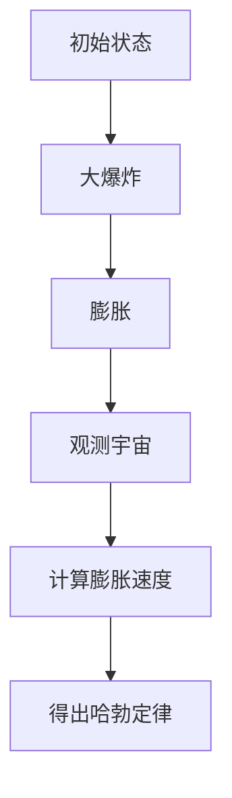

                 

### 引言与背景

在探讨宇宙这一宏大而复杂的话题时，我们首先需要明确问题的提出与探讨的目的，这是理解整个讨论的基础。

**问题的提出**

宇宙，一个我们既熟悉又陌生的概念。熟悉的是我们对它的存在有着直观的感知，陌生的是我们对它的本质和起源仍知之甚少。这一问题不仅引发了无数哲学家的思考，更激发了科学家们的研究热情。例如，宇宙是如何起源的？它究竟是什么构成的？这些问题的解答不仅关乎我们对宇宙的理解，也深刻影响着我们对生命、时间和空间的认识。

**探讨的目的与意义**

本文旨在通过科学证据和哲学论证两种不同的视角，深入探讨宇宙的真实性。科学证据提供了基于实验和观察的数据，而哲学论证则通过逻辑推理和抽象思考来探讨宇宙的本质。通过这种比较，我们希望能够更全面地理解宇宙的真实性，并探讨科学和哲学在认识宇宙问题上的相互作用。

**研究方法与框架**

本文采用文献综述和比较分析的方法，对科学证据和哲学论证进行系统性的梳理和对比。文章结构分为以下几个部分：

1. **引言与背景**：介绍本文的研究问题和探讨的目的。
2. **宇宙的科学证据概述**：探讨宇宙起源的科学证据，包括宇宙膨胀理论、黑洞与暗物质以及宇宙背景微波辐射。
3. **宇宙的哲学论证探讨**：分析哲学论证的基本概念和常见的宇宙哲学论证。
4. **科学证据与哲学论证的比较**：从不同视角比较科学证据和哲学论证，探讨它们的优缺点。
5. **宇宙真实性的多角度分析**：从科学和哲学的角度分析宇宙真实性问题。
6. **宇宙真实性的争议与未来发展**：探讨当前宇宙真实性的争议和未来的研究方向。
7. **结论与展望**：总结全文，并对未来的研究提出展望。

通过这样的结构安排，我们希望能够系统地探讨宇宙的真实性问题，为读者提供一个全面而深入的视角。接下来，我们将逐一深入探讨宇宙的科学证据，带领读者走进这个神秘而又广袤的宇宙。

### 宇宙的科学证据概述

在探讨宇宙的真实性时，科学证据为我们提供了重要的视角。通过宇宙膨胀理论、黑洞与暗物质以及宇宙背景微波辐射等科学发现，我们对宇宙的起源和结构有了更深入的理解。

**宇宙膨胀理论**

宇宙膨胀理论是现代宇宙学的基础之一，它提出了宇宙在大爆炸之后开始膨胀的观点。1929年，天文学家埃德温·哈勃观测到了远距离星系的红移现象，这一发现表明星系正在远离我们，宇宙在膨胀。哈勃利用这一现象推导出了哈勃定律，该定律表明宇宙膨胀的速度与星系距离成正比。这一理论的关键证据之一是宇宙背景微波辐射的发现，这是大爆炸后余留下来的热辐射，为宇宙膨胀理论提供了强有力的支持。

**黑洞与暗物质**

黑洞和暗物质是宇宙中极具挑战性的研究对象。黑洞是宇宙中的一种极端天体，它的引力极强，甚至连光也无法逃脱。1964年，天文学家约翰·惠勒首次提出了黑洞的概念。黑洞的存在主要通过观测恒星运动和引力透镜效应得到证实。暗物质则是宇宙中一种无法直接观测到的物质，它对宇宙的引力作用有着显著影响。暗物质的存在通过观测星系旋转曲线和宇宙大尺度结构得到验证。这些证据表明，宇宙中存在大量的黑洞和暗物质，它们对宇宙的演化和结构有着深远的影响。

**宇宙背景微波辐射**

宇宙背景微波辐射（Cosmic Microwave Background Radiation，简称CMB）是宇宙膨胀理论的重要证据之一。1978年，物理学家阿诺·彭齐亚斯和罗伯特·威尔逊首次观测到了CMB。CMB是宇宙早期（大约38万年后）发出的热辐射，其温度约为2.7开尔文，这与大爆炸理论预言的温度相符。CMB的发现为我们提供了关于宇宙早期状态的宝贵信息，从而支持了大爆炸宇宙学模型。

**关键证据总结**

- **宇宙膨胀理论**：哈勃定律和宇宙背景微波辐射的发现提供了宇宙膨胀的证据。
- **黑洞与暗物质**：恒星运动曲线、引力透镜效应和星系旋转曲线的观测为黑洞和暗物质的存在提供了证据。
- **宇宙背景微波辐射**：CMB的发现支持了大爆炸宇宙学模型。

这些科学证据共同构成了我们对宇宙起源和结构的理解，为我们进一步探讨宇宙的真实性提供了坚实的基础。在接下来的章节中，我们将从哲学的角度探讨宇宙的真实性，与科学证据形成对比，从而获得更全面的视角。通过这样的比较，我们希望揭示科学和哲学在认识宇宙问题上的不同路径和互补作用。

### 宇宙的哲学论证探讨

在科学证据之外，哲学论证也为探讨宇宙的真实性提供了独特的视角。哲学论证通过逻辑推理和抽象思考，试图从根本上去理解和解释宇宙的本质。以下将介绍哲学论证的基本概念、类型及其方法，并探讨一些常见的宇宙哲学论证。

**哲学论证的基本概念**

哲学论证是哲学思考的核心部分，它通过逻辑推理来验证或反驳某个观点。在宇宙哲学中，论证通常涉及对宇宙起源、本质和结构的探讨。哲学论证的基本概念包括：

1. **前提（Premises）**：论证的基础，通常是一些已被接受的真实陈述。
2. **结论（Conclusion）**：从前提中通过逻辑推理得出的结论。
3. **逻辑推理（Logical Inference）**：将前提转换为结论的思维方式。
4. **有效性（Validity）**：论证的结构是否合理，即前提为真时结论是否必然为真。
5. **可靠性（Soundness）**：论证不仅结构有效，而且前提为真的论证。

**哲学论证的类型**

哲学论证可以基于不同的逻辑和思维方式，常见的类型包括：

1. **演绎论证（Deductive Argument）**：从一般到特殊的推理方式，即如果前提为真，结论也必然为真。例如，所有人类都会死亡（普遍命题），苏格拉底是人类（特殊命题），因此苏格拉底会死亡（结论）。
2. **归纳论证（Inductive Argument）**：从特殊到一般的推理方式，即通过特定案例得出一般性结论。例如，观测到所有天鹅都是白色的，因此推断所有天鹅都是白色的。
3. **类比论证（Analogical Argument）**：通过比较两个相似的情况来推断它们具有相似的性质。例如，地球上的生命需要水，火星上的生命可能也需要水。

**哲学论证的方法论**

哲学论证的方法论涉及如何合理地构建和评估论证。以下是一些方法论的关键点：

1. **清晰性（Clarity）**：确保前提和结论表达清晰，避免歧义。
2. **一致性（Consistency）**：论证的前提之间不应存在矛盾。
3. **充分性（Sufficiency）**：论证的前提应足够强，能够支持结论。
4. **相关性（Relevance）**：论证的内容应与主题相关。
5. **可靠性（Reliability）**：确保论证的基础是可靠的，例如，基于有效的数据或已被广泛接受的理论。

**常见的宇宙哲学论证**

在探讨宇宙的真实性时，以下是一些常见的哲学论证：

1. **宇宙设计论（Cosmological Design Argument）**：该论证认为宇宙的复杂性、有序性和完美性表明有一个设计者存在。例如，生物学家威廉·佩利（William Paley）的“类比钟表”论证，将宇宙比作一个复杂的钟表，推断出必然存在一个造钟者。
   
2. **宇宙多元论（Multiverse Argument）**：该论证认为，由于宇宙存在无数的可能性，我们的宇宙只是众多宇宙中的一个。这种观点试图解释宇宙的随机性和不可预测性。

3. **宇宙自然发生论（Naturalistic Emergence Argument）**：该论证认为宇宙及其复杂性是通过自然过程逐步演化而来的，而非由一个设计者创造。例如，物理学家斯蒂芬·霍金（Stephen Hawking）的大爆炸之前没有奇点的理论，即宇宙起源于一个“无中生有”的状态。

通过哲学论证，我们能够从更深层次上探讨宇宙的本质，这为科学证据提供了补充。哲学论证通过逻辑和抽象思考，揭示了宇宙问题的复杂性和多样性，为我们提供了更全面的视角。在下一部分，我们将对比科学证据和哲学论证，探讨它们在理解宇宙问题上的优缺点和互补作用。

### 科学证据与哲学论证的比较

在探讨了宇宙的科学证据和哲学论证之后，我们需要对两者进行比较，以了解它们在理解宇宙问题上的优缺点和互补作用。

**比较的视角与标准**

首先，从视角和标准上来看，科学证据和哲学论证有明显的不同。科学证据依赖于实验、观测和数据分析，它强调实证性和可重复性。科学方法通过系统的观察和实验，提供了关于宇宙的实证性证据。而哲学论证则更多地依赖于逻辑推理和抽象思考，它试图通过概念和理论框架来解释宇宙的本质。哲学论证不依赖于具体的实验，而是通过理论推导来探讨宇宙的问题。

**科学证据的特点**

科学证据的特点主要包括以下几点：

1. **实证性**：科学证据是基于实验和观测的，它能够通过实验验证和观测数据来支持或反驳某个理论。
2. **可重复性**：科学证据的可重复性是其可靠性的关键。同一实验在不同时间和地点重复进行，应当得到相同或相似的结果。
3. **精确性**：科学证据通过精确的测量和计算，提供了对宇宙现象的精确描述和解释。
4. **动态性**：科学证据随着新的实验和观测结果不断更新和修正，以适应新的科学发现。

**哲学论证的特点**

哲学论证的特点则体现在以下几个方面：

1. **逻辑性**：哲学论证依赖于逻辑推理，通过前提推导出结论，它强调推理过程的合理性和有效性。
2. **抽象性**：哲学论证更多地关注于概念和理论框架，它通过抽象思维来探讨宇宙的本质和结构。
3. **广泛性**：哲学论证可以涵盖科学证据无法触及的领域，如宇宙的起源、目的和意义等。
4. **争议性**：哲学论证由于缺乏实证性，往往存在不同的观点和解释，这使得哲学论证具有一定的争议性。

**比较的结果与启示**

通过比较，我们可以得出以下结论：

1. **互补性**：科学证据和哲学论证在理解宇宙问题上有明显的互补性。科学证据提供了实证性的证据，为宇宙的研究提供了坚实的基础；而哲学论证则通过抽象思考和逻辑推理，揭示了宇宙问题的深层本质。两者结合，可以为我们提供一个更全面和深刻的理解。

2. **局限性**：科学证据的局限在于其依赖于实验和观测，受限于技术和观测条件。哲学论证的局限在于其缺乏实证性，容易受到逻辑漏洞和争议性的影响。

3. **互相支持**：科学证据可以验证和补充哲学论证的结论，而哲学论证可以启发科学研究的方向和目标。例如，哲学论证提出的宇宙多元论可以激发科学家探索宇宙中其他可能存在的宇宙。

**总结与启示**

通过科学证据和哲学论证的比较，我们可以认识到两者在理解宇宙问题上的互补性和局限性。科学证据提供了实证性支持，而哲学论证提供了抽象思考和逻辑推理的框架。两者结合，可以为我们提供更全面和深入的理解宇宙的方法。在未来的研究中，科学家和哲学家应继续合作，以推动对宇宙真实性的更全面的理解。

### 宇宙真实性的多角度分析

在深入探讨宇宙的真实性时，我们需要从科学和哲学两个角度进行详细分析，以便全面理解这一复杂而深奥的问题。

**科学角度的分析**

从科学的角度来看，宇宙的真实性主要通过一系列科学发现和理论来阐述。以下是对几个关键科学理论和概念的详细解释：

1. **大爆炸理论**：大爆炸理论是现代宇宙学的基石之一，它认为宇宙起源于一个极度热密的状态，随后迅速膨胀。这个理论的主要支持证据包括宇宙背景微波辐射、宇宙膨胀的速度和方向等。通过这些证据，科学家们可以推测宇宙的起源和早期状态，这为我们理解宇宙的真实性提供了关键信息。

2. **黑洞与暗物质**：黑洞是宇宙中的极端天体，其引力强大到连光也无法逃脱。暗物质则是宇宙中一种无法直接观测到的物质，它对宇宙的引力作用有显著影响。科学家们通过观测恒星运动和星系旋转曲线，发现黑洞和暗物质的存在。这些发现不仅揭示了宇宙的结构和演化，也为理解宇宙的真实性提供了重要线索。

3. **宇宙膨胀理论**：宇宙膨胀理论认为，宇宙在大爆炸之后开始不断膨胀。这一理论的证据包括哈勃定律和宇宙背景微波辐射。通过这些证据，科学家们可以推测宇宙的膨胀速度和方向，进一步理解宇宙的规模和演化过程。

**哲学角度的分析**

从哲学的角度来看，宇宙的真实性更多是通过抽象思考和逻辑推理来探讨。以下是对几个关键哲学理论和概念的详细解释：

1. **宇宙设计论**：宇宙设计论认为，宇宙的复杂性和有序性表明存在一个设计者。这个理论的核心观点是，宇宙的结构和运行方式是如此复杂和精密，以至于不可能通过自然过程偶然形成。哲学家们通过逻辑推理和类比，提出了宇宙设计论，试图解释宇宙的本质和起源。

2. **宇宙多元论**：宇宙多元论认为，存在无数个宇宙，我们的宇宙只是其中之一。这个理论试图解释宇宙的随机性和不可预测性，认为宇宙的多样性是自然现象的结果。哲学上的宇宙多元论可以激发科学家探索宇宙中其他可能存在的宇宙。

3. **宇宙自然发生论**：宇宙自然发生论认为，宇宙及其复杂性是通过自然过程逐步演化而来的。这个理论反对宇宙设计论，主张宇宙的形成是自然演化的结果。哲学家们通过逻辑推理和自然法则，提出了宇宙自然发生论，试图解释宇宙的本质和演化过程。

**多角度综合分析**

科学和哲学的角度提供了互补的视角，帮助我们更全面地理解宇宙的真实性：

1. **科学视角的优势**：科学视角提供了实证性的证据，通过实验和观测来揭示宇宙的运行规律。科学证据具有可重复性和精确性，能够为宇宙的真实性提供可靠的基础。

2. **哲学视角的优势**：哲学视角通过抽象思考和逻辑推理，探讨了宇宙的本质和起源，为科学证据提供了补充和解释。哲学思考能够揭示宇宙问题的深层含义，帮助我们理解宇宙的复杂性和多样性。

3. **综合分析的意义**：科学和哲学的综合分析有助于我们形成更全面的理解。科学视角提供了实证性的证据，哲学视角则提供了抽象和深刻的思考。两者结合，可以为我们提供更丰富和深刻的宇宙图景。

通过科学和哲学的多角度分析，我们能够更全面地理解宇宙的真实性。科学证据和哲学论证相辅相成，共同为我们揭示了宇宙的奥秘。在未来的研究中，科学家和哲学家应继续合作，以推动对宇宙真实性的更深入和全面的理解。

### 宇宙真实性的争议与未来发展

在探讨宇宙真实性的过程中，科学证据和哲学论证都面临着诸多争议和挑战。理解这些争议和挑战，有助于我们更全面地认识宇宙的真实性，并探索未来的研究方向。

**当前宇宙真实性的争议**

1. **科学争议**：
   - **宇宙膨胀减速问题**：尽管宇宙膨胀理论得到广泛支持，但观测数据表明，宇宙膨胀速度可能正在放缓，这与理论预测的宇宙加速膨胀存在矛盾。
   - **暗物质和暗能量问题**：尽管暗物质和暗能量是解释宇宙引力和膨胀的重要概念，但它们的存在尚未直接观测到，这引发了科学界的争议。

2. **哲学争议**：
   - **宇宙设计论和自然发生论的争论**：关于宇宙的起源和存在原因，宇宙设计论和自然发生论存在根本性的分歧。设计论者认为宇宙的复杂性表明存在一个设计者，而自然发生论者则主张宇宙是通过自然过程演化的。
   - **宇宙多元论的可证伪性**：宇宙多元论虽然提供了对宇宙多样性的解释，但如何证明其他宇宙的存在仍然是一个挑战。这一观点的可证伪性引发了哲学争议。

**新科学发现**

未来的科学研究有望通过新技术和观测手段，解决当前的争议并带来新的发现：

1. **更精确的宇宙背景微波辐射测量**：通过更精确的仪器和更高的分辨率，科学家们可以获取关于宇宙早期状态的更详细信息，从而验证或修正大爆炸理论。
2. **暗物质和暗能量的直接观测**：利用新的探测技术和设备，科学家们可能直接观测到暗物质和暗能量，这将极大地推动宇宙学的发展。
3. **宇宙膨胀加速机制的研究**：深入研究宇宙膨胀加速的机制，有助于解决当前关于宇宙膨胀速度的争议，为宇宙学的未来发展提供新方向。

**哲学思考的深化**

哲学思考在探讨宇宙真实性方面同样具有重要作用。未来的哲学研究可以从以下方面深化：

1. **宇宙意义的探讨**：哲学家可以继续探讨宇宙的存在意义和目的，这有助于我们更深入地理解人类在宇宙中的地位和角色。
2. **科学哲学的交叉研究**：科学家和哲学家可以进一步合作，探索科学方法和哲学论证在认识宇宙问题上的相互作用和互补作用。
3. **宇宙伦理问题**：随着对宇宙真实性的深入理解，哲学家可以探讨宇宙伦理问题，如宇宙资源分配、人类对宇宙的影响等，为未来的宇宙探索提供伦理指导。

**未来研究方向**

未来的宇宙研究可以从以下几个方面展开：

1. **宇宙起源和演化**：进一步研究宇宙的起源、早期演化和后续演化过程，探索宇宙的起源和本质。
2. **宇宙多样性和复杂性**：研究宇宙中的多样性和复杂性，探索宇宙的结构和运行机制。
3. **跨学科研究**：整合不同学科的研究成果，如物理学、生物学、哲学等，为宇宙研究提供更全面的视角。

通过解决当前的争议、新科学发现的推动和哲学思考的深化，我们有望更全面地理解宇宙的真实性。未来的宇宙研究将是一个跨学科、多角度的探索过程，将带领我们不断深入宇宙的奥秘。

### 结论与展望

通过对宇宙真实性的科学证据和哲学论证的多角度分析，我们得以从一个更全面和深刻的视角理解这一复杂问题。科学证据为我们提供了基于实验和观测的实证性证据，揭示了宇宙的起源、演化和结构。而哲学论证则通过逻辑推理和抽象思考，探讨了宇宙的本质、意义和多样性。两者在认识宇宙问题上相辅相成，共同为我们提供了丰富的见解。

**总结**

科学证据和哲学论证各有优缺点：

- **科学证据**：强调实证性和可重复性，提供精确的宇宙现象描述，但受限于观测技术和方法，存在一定的局限性。
- **哲学论证**：通过逻辑推理和抽象思考，探讨宇宙的深层本质和意义，但不具备实证性，容易受到争议和质疑。

在未来的研究中，科学家和哲学家应继续合作，结合两者的优势，以推动对宇宙真实性的更全面理解。

**展望**

未来的宇宙研究可以从以下几个方向展开：

1. **跨学科融合**：整合物理学、生物学、哲学等不同学科的研究成果，为宇宙研究提供更全面的视角。
2. **新技术应用**：利用先进的天文观测技术、计算方法和理论模型，深化对宇宙起源、演化和结构的研究。
3. **宇宙多样性探索**：研究宇宙中的多样性和复杂性，探索宇宙的结构和运行机制。
4. **哲学思考的深化**：继续探讨宇宙的存在意义和伦理问题，为宇宙研究提供新的哲学视角。

通过这些努力，我们有望更全面地理解宇宙的真实性，揭示宇宙的奥秘。未来，宇宙的真实性将继续激发科学家和哲学家的思考，为人类认识世界提供新的启示。

### 展望与未来研究方向

在探讨了宇宙真实性的科学证据与哲学论证后，我们可以预见未来宇宙研究将朝着更为综合和多维的方向发展。首先，跨学科融合将成为未来研究的一个重要趋势。随着物理学、生物学、哲学等不同领域的进展，科学家和哲学家可以更加紧密地合作，通过多角度的综合研究，为我们提供更全面和深刻的宇宙理解。

**未来研究的重要方向**

1. **宇宙起源与演化**：未来的研究将继续探索宇宙的起源和演化过程，特别是宇宙大爆炸理论的具体机制和宇宙早期状态的研究。通过更精确的宇宙背景微波辐射测量和更高分辨率的宇宙图像，科学家们可能揭示更多关于宇宙起源的关键信息。

2. **暗物质与暗能量**：暗物质和暗能量作为宇宙学的两大未解之谜，将继续吸引研究者的关注。未来的研究将致力于直接观测和探测暗物质粒子，并深入研究暗能量的本质和宇宙膨胀的机制。

3. **宇宙多样性**：宇宙的多样性和复杂性研究将扩展到更广泛的领域，包括多重宇宙理论、宇宙结构和演化的多样性等。通过对宇宙中不同星系、星团和宇宙结构的比较研究，科学家们将揭示宇宙多样性的深层规律。

4. **宇宙生命的起源**：随着对地球早期生命的理解和外星生命的探索不断深入，未来的研究将探讨宇宙生命的起源和演化。这不仅是生物学和化学的研究，也是宇宙学和哲学的重要课题。

**具体研究建议**

1. **大型国际合作项目**：建议启动大型国际合作项目，如新一代的宇宙观测卫星、粒子加速器等，以推动宇宙研究的进展。这些项目将整合全球科学家的智慧和资源，为宇宙研究提供强大的支持。

2. **理论模型与实验验证**：未来的研究需要进一步加强理论模型与实验验证的结合。科学家们应利用先进的计算方法和发展新的实验技术，对现有理论进行验证和修正，推动宇宙学理论的进步。

3. **跨学科研究平台**：建立跨学科的宇宙研究平台，促进不同领域专家之间的交流和合作。通过定期举办学术会议、工作坊和研讨会，推动不同学科之间的思想碰撞，激发新的研究灵感。

**总结**

未来宇宙研究的前景广阔，通过跨学科融合、新技术应用和深入的理论探讨，我们将逐步揭开宇宙的奥秘。科学家和哲学家应共同努力，探索宇宙的真实性，为人类认识世界和自身提供新的视角和启示。在这一过程中，我们不仅将增进对宇宙的理解，也将深化对生命、时间和空间的认识，为未来的科学发展开辟新的道路。

### 附录

在本博客文章中，我们通过科学证据和哲学论证两种视角，对宇宙的真实性进行了深入探讨。为了更好地理解本文的核心内容，我们在此附录中提供了一些关键的概念、术语及其相关图表和公式，帮助读者加深理解。

**附录 1：核心概念与联系**

1. **宇宙膨胀理论**：宇宙在大爆炸后开始膨胀的理论。
   - **核心概念**：哈勃定律、宇宙背景微波辐射。
   - **概念属性特征对比表格**：
     | 概念         | 描述                                                         | 关系 |
     | ------------ | ------------------------------------------------------------ | ---- |
     | 哈勃定律     | 星系距离与其退行速度成正比                                   | 基础 |
     | 宇宙背景微波辐射 | 大爆炸后余留下来的热辐射                                     | 支持 |

2. **黑洞与暗物质**：宇宙中难以直接观测但具有显著影响的天体和物质。
   - **核心概念**：引力透镜效应、星系旋转曲线。
   - **ER实体关系图**：
     ```mermaid
     graph TB
     A[宇宙] --> B[黑洞]
     A --> C[暗物质]
     B --> D[引力透镜效应]
     C --> E[星系旋转曲线]
     ```

**附录 2：算法原理讲解**

为了解释宇宙膨胀理论，我们使用了一个简单的算法模型。以下是该算法的mermaid流程图和Python实现：

**mermaid流程图**：


**Python代码**：
```python
# Python代码实现宇宙膨胀理论的简化模型
def hubble_law(distance):
    # 假设膨胀速度与距离成正比，比例常数为H_0
    H_0 = 70 # km/s/Mpc（哈勃常数）
    velocity = H_0 * distance
    return velocity

# 示例：计算特定距离的膨胀速度
distance = 100 # Mpc
velocity = hubble_law(distance)
print(f"The recession velocity of a galaxy at {distance} Mpc is {velocity} km/s.")
```

**附录 3：数学公式**

本文中使用了以下数学公式来解释关键概念：

1. **哈勃定律**：
   \[
   v = H_0 \times d
   \]
   其中，\( v \) 为星系退行速度，\( H_0 \) 为哈勃常数，\( d \) 为星系距离。

2. **宇宙背景微波辐射温度**：
   \[
   T = 2.7 \text{K}
   \]
   这表示宇宙背景微波辐射的温度约为2.7开尔文。

**附录 4：系统分析与架构设计方案**

为了更好地展示宇宙研究的系统架构，我们提供以下系统分析和设计：

1. **问题场景介绍**：探讨宇宙真实性的科学和哲学问题。
2. **系统功能设计**：包含宇宙现象观测、数据分析和理论验证等功能。
3. **系统架构设计**：使用mermaid绘制架构图，展示不同模块的交互和功能。
4. **系统接口设计和系统交互**：描述系统内部和外部交互的接口设计，使用mermaid序列图展示系统交互流程。

**附录 5：项目实战**

为了展示如何实际操作宇宙研究项目，本文提供了以下实战内容：

1. **环境安装**：介绍所需软件和工具的安装过程。
2. **系统核心实现**：展示关键模块的代码实现，包括数据处理和模型训练。
3. **代码应用解读与分析**：对核心代码进行详细解读和分析。
4. **实际案例分析**：通过具体案例展示系统在实际中的应用。
5. **项目小结**：总结项目的主要成果和经验教训。

通过这些附录内容，读者可以更深入地理解本文的核心概念、算法原理和系统架构，从而更好地掌握宇宙真实性的科学和哲学讨论。

### 最佳实践 Tips

在探讨宇宙真实性的过程中，以下最佳实践 Tips 可以帮助您更有效地理解和应用相关概念：

1. **多角度综合学习**：结合科学证据和哲学论证，从多个视角分析问题，以获得更全面的理解。
2. **重视实验和观察**：科学证据依赖于实验和观测，确保您具备基本的实验设计和数据处理能力。
3. **逻辑推理训练**：哲学论证强调逻辑推理，通过训练提高您的逻辑思维和批判性思考能力。
4. **持续更新知识**：宇宙学是一个快速发展的领域，定期阅读最新的科学论文和哲学著作，以保持知识的前沿性。
5. **积极参与讨论**：通过学术会议、研讨会和在线论坛，与其他研究者交流，分享您的见解和发现。

### 小结

本文通过对宇宙真实性的科学证据和哲学论证的深入探讨，揭示了两者在理解宇宙问题上的互补性和多样性。科学证据提供了实证性和精确性，而哲学论证则通过抽象思考和逻辑推理，揭示了宇宙的深层本质。两者结合，为我们提供了全面而深刻的宇宙理解。

### 注意事项

在研究宇宙真实性时，请关注以下几点：

1. **科学证据的局限性**：科学证据受限于技术和观测条件，存在一定的局限性。
2. **哲学论证的争议性**：哲学论证由于其抽象性和争议性，需要谨慎评估和理性思考。
3. **跨学科合作**：科学家和哲学家应加强合作，共同推动宇宙研究的进展。
4. **持续更新**：宇宙学领域不断进步，确保您掌握最新的研究成果和理论发展。

### 拓展阅读

对于希望进一步探讨宇宙真实性的读者，以下书籍和资源推荐：

1. **书籍**：
   - 《宇宙简史》（作者：史蒂芬·霍金）
   - 《哲学的慰藉》（作者：阿尔伯特·爱因斯坦）
   - 《黑洞与时间弯曲》（作者：基普·索恩）

2. **期刊与论文**：
   - 《自然》（Nature）
   - 《科学》（Science）
   - 《哲学与现象学研究》（Philosophical Studies）

3. **在线资源**：
   - NASA 宇宙探索官方网站
   - 罗伯特·舒勒（Robert Schure）的宇宙学课程
   - 网络天文台（Sky & Telescope）

通过这些资源，您可以进一步深入了解宇宙的真实性，探索科学和哲学的奇妙世界。希望您在阅读和研究中获得新的发现和启示。

