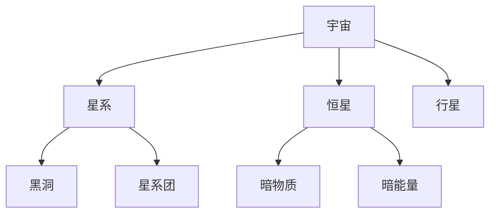

                 

## 《宇宙的终极命运：科学预测与哲学思考》

### 关键词：宇宙学、科学预测、哲学思考、宇宙命运、科学哲学、未来展望

### 摘要：
《宇宙的终极命运：科学预测与哲学思考》探讨了宇宙学、科学预测和哲学思考的交叉领域，深入分析宇宙的起源、结构、演化和未来。通过科学的方法和哲学的思辨，本文揭示了宇宙的终极命运，探讨了宇宙学中的经典案例，并对未来进行了科学和哲学的展望。

----------------------------------------------------------------

### 目录大纲

#### 第1章：引言
#### 1.1 宇宙学的基本概念
#### 1.2 科学预测与哲学思考的关系
#### 1.3 本书的目的与结构

#### 第2章：宇宙学的核心概念
#### 2.1 宇宙起源：大爆炸理论
#### 2.2 宇宙结构：膨胀与加速
##### 2.2.1 宇宙膨胀
##### 2.2.2 宇宙加速
#### 2.3 宇宙演化：星系与恒星
#### 2.4 关键概念解析
##### 2.4.1 黑洞
##### 2.4.2 暗物质与暗能量

#### 第3章：科学预测方法
#### 3.1 天文学观测技术
#### 3.2 理论物理学基础
#### 3.3 数值模拟与计算方法

#### 第4章：哲学思考与宇宙学
#### 4.1 宇宙的意义
#### 4.2 人类在宇宙中的地位
#### 4.3 宇宙的本质

#### 第5章：宇宙学中的经典案例
#### 5.1 宇宙大爆炸：证据与争议
#### 5.2 黑洞信息丢失问题
#### 5.3 宇宙加速膨胀：暗能量的影响

#### 第6章：未来展望与挑战
#### 6.1 宇宙的未来：可能情景
#### 6.2 宇宙学的未来方向
#### 6.3 挑战与机遇

#### 第7章：总结与反思
#### 7.1 全书主要观点的总结
#### 7.2 对宇宙未来命运的哲学思考
#### 7.3 对读者的影响与启示

----------------------------------------------------------------

### 第1章：引言

#### 1.1 宇宙学的基本概念

宇宙学是研究宇宙起源、结构、演化和最终命运的科学。它是一门涉及物理学、天文学、数学等多个学科领域的综合性科学。宇宙学的核心问题是探究宇宙的起源，包括宇宙的诞生、如何演化以及未来可能的命运。

宇宙学的基本概念包括宇宙起源、宇宙膨胀、宇宙结构、宇宙演化和宇宙的最终命运等。其中，宇宙起源是最为基础和重要的概念，它涉及到宇宙大爆炸理论、暗物质和暗能量等复杂问题。

#### 1.2 科学预测与哲学思考的关系

科学预测是宇宙学的重要方法，它通过观测、实验和理论分析来预测宇宙的未来。而哲学思考则为科学预测提供了理论基础和哲学框架。科学预测与哲学思考的关系可以从以下几个方面理解：

1. **科学预测依赖于哲学思考**：科学预测需要依赖于哲学提供的思维方式和理论基础，如逻辑推理、辩证法、实证主义等。这些哲学思考方法为科学预测提供了重要的工具和思维框架。

2. **哲学思考指导科学预测**：哲学思考可以帮助科学家理解宇宙的本质和规律，从而指导科学预测的方向和方法。例如，康德的先验哲学为牛顿力学提供了理论基础，而爱因斯坦的相对论则对牛顿力学进行了扩展和修正。

3. **科学预测验证哲学思考**：科学预测的结果可以验证或修正哲学思考的观点。例如，宇宙大爆炸理论的提出和验证，不仅为宇宙起源提供了科学解释，也验证了哲学上关于宇宙无限性和有限性的争论。

#### 1.3 本书的目的与结构

本书旨在探讨宇宙的终极命运，从科学预测和哲学思考的角度，深入分析宇宙的起源、结构、演化和未来。全书共分为七个章节，具体结构如下：

- **第1章：引言**，介绍宇宙学的基本概念、科学预测与哲学思考的关系，以及本书的目的和结构。
- **第2章：宇宙学的核心概念**，详细探讨宇宙起源、宇宙结构、宇宙演化以及关键概念如黑洞、暗物质和暗能量。
- **第3章：科学预测方法**，介绍天文学观测技术、理论物理学基础以及数值模拟与计算方法。
- **第4章：哲学思考与宇宙学**，探讨宇宙的意义、人类在宇宙中的地位以及宇宙的本质。
- **第5章：宇宙学中的经典案例**，分析宇宙大爆炸、黑洞信息丢失问题和宇宙加速膨胀等经典案例。
- **第6章：未来展望与挑战**，讨论宇宙的未来可能情景、宇宙学的未来方向以及面临的挑战和机遇。
- **第7章：总结与反思**，总结全书的主要观点，对宇宙未来命运进行哲学思考，并反思对读者的影响与启示。

通过以上章节的结构安排，本书旨在为读者提供一个全面、深入的宇宙学视角，帮助读者理解宇宙的终极命运，并思考我们在宇宙中的地位和意义。

### 第2章：宇宙学的核心概念

#### 2.1 宇宙起源：大爆炸理论

宇宙起源是宇宙学中最基本和最核心的问题。关于宇宙起源的理论有很多，但最被广泛接受的理论是宇宙大爆炸理论。大爆炸理论认为，宇宙起源于大约138亿年前的一个极热、极密的状态，然后开始膨胀，形成了我们现在所观察到的宇宙。

**证据与支持**：

1. **宇宙背景辐射**：大爆炸理论的一个重要证据是宇宙背景辐射。1948年，伽莫夫等人预测，在大爆炸之后，宇宙冷却到足够低的温度，辐射会残留下来。1965年，彭齐亚斯和威尔逊确实观测到了这种辐射，这为宇宙大爆炸理论提供了强有力的支持。

2. **宇宙膨胀**：宇宙膨胀是另一个支持大爆炸理论的证据。1929年，哈勃发现，遥远星系的光谱显示出红移，这意味着它们正在远离我们。这一发现表明，宇宙正在膨胀，而膨胀的起点就是大爆炸。

3. **元素合成**：大爆炸理论还预测，宇宙早期的高温高密度环境能够产生轻元素。宇宙大爆炸后的核合成过程，确实生成了氢、氦和其他轻元素，这与观测结果相符。

**争议与挑战**：

1. **宇宙微波背景辐射的起伏**：宇宙微波背景辐射的起伏表明，宇宙早期的密度不均匀，但关于这些起伏的具体机制和起源仍然存在争议。

2. **暗物质与暗能量**：宇宙大爆炸理论无法解释暗物质和暗能量的存在，这两个未知物质对宇宙的结构和演化起着关键作用，但它们的本质和来源仍然是一个谜。

#### 2.2 宇宙结构：膨胀与加速

宇宙的结构是宇宙学研究的另一个核心问题。目前，宇宙的结构被认为是由大量的星系组成的，而这些星系又以星系团和超星系团的形式聚集在一起。

**宇宙膨胀**：

宇宙膨胀是指宇宙中的星系正在相互远离的现象。这一现象最早由哈勃在1929年通过观测发现。哈勃观测到的红移现象表明，遥远星系的光谱线向红色端偏移，这意味着它们正在远离我们。这一发现揭示了宇宙正在膨胀。

**宇宙加速**：

近年来，宇宙加速膨胀的发现震惊了科学界。通过观测遥远星系的亮度，科学家们发现，宇宙的膨胀速度正在加快。这一现象无法用引力来解释，因此科学家们提出了暗能量这一概念。暗能量是一种假想的能量形式，它对宇宙的膨胀起着推动作用。

**膨胀与加速的关系**：

宇宙膨胀和加速之间的关系是一个复杂的问题。宇宙膨胀是指星系之间的距离随着时间的推移而增加，而宇宙加速则是指这种膨胀速度在增加。宇宙加速膨胀的发现表明，宇宙中的某些未知力量在推动星系的分离，这种力量被推测为暗能量。

#### 2.3 宇宙演化：星系与恒星

宇宙的演化是一个漫长而复杂的过程。从大爆炸开始，宇宙经历了数十亿年的演化，形成了各种各样的天体，包括星系、恒星、行星等。

**星系的形成**：

星系的形成被认为是在宇宙早期，通过暗物质和暗能量的相互作用，形成了大量的星系。星系的形成过程包括气体云的聚集、引力塌缩和恒星的形成等。

**恒星的形成**：

恒星的形成是宇宙演化中的重要事件。恒星的形成过程包括气体云的聚集、引力塌缩、核心的融合反应和恒星光谱的形成等。

**星系的演化**：

星系的演化是指星系在宇宙中的生命周期，包括星系的形成、成长、衰老和死亡等。星系的演化受到多种因素的影响，包括星系内恒星的形成与死亡、星系间的相互作用等。

#### 2.4 关键概念解析

**黑洞**：

黑洞是宇宙中一种极端的天体，它具有极强的引力，甚至连光也无法逃脱。黑洞的形成通常是通过恒星的坍缩，当恒星的核心塌缩到足够小和足够密的时候，就会形成黑洞。

**暗物质**：

暗物质是宇宙中一种未探测到的物质，它不发光、不吸收光，但通过引力作用影响宇宙的结构和演化。暗物质的存在是宇宙学中的一个重要问题，科学家们正在努力研究其本质和来源。

**暗能量**：

暗能量是一种假想的能量形式，它对宇宙的膨胀起着推动作用。暗能量的存在和性质是宇宙学中的另一个重要问题，科学家们正在通过观测和理论探索其本质和作用。

**表格：宇宙学核心概念属性特征对比**

| 核心概念 | 描述 | 属性特征 | 对比 |
| --- | --- | --- | --- |
| 黑洞 | 一种极端的天体，具有极强的引力 | 1. 强引力 | 黑洞的引力无法逃脱 |
| 暗物质 | 宇宙中一种未探测到的物质 | 1. 不发光、不吸收光 | 暗物质通过引力影响宇宙 |
| 暗能量 | 一种假想的能量形式，对宇宙的膨胀起着推动作用 | 1. 推动宇宙膨胀 | 暗能量与引力相对抗 |

**ER实体关系图架构**

通过上述分析，我们可以看到宇宙学的核心概念如何相互联系，并共同构成了我们对宇宙的理解。接下来，我们将探讨科学预测方法，以更深入地了解宇宙的结构和演化。

### 第3章：科学预测方法

科学预测是宇宙学研究的重要方法，它依赖于观测、理论和计算。通过这些方法，科学家们能够推断宇宙的过去、现在和未来。

#### 3.1 天文学观测技术

天文学观测技术是科学预测的基础。现代天文学观测技术包括光学望远镜、射电望远镜、X射线望远镜等，它们可以探测从可见光到无线电波等各种波段的辐射。

1. **光学望远镜**：光学望远镜主要用于观测可见光波段，通过放大和聚焦光线，我们可以看到遥远的星系和恒星。

2. **射电望远镜**：射电望远镜可以探测无线电波，这些波段的辐射通常来自宇宙中的星际气体、星系和黑洞等。

3. **X射线望远镜**：X射线望远镜可以探测高能X射线，这些射线通常来自高能量的天体，如恒星碰撞、黑洞等。

通过这些观测技术，科学家们能够获取大量关于宇宙的信息，为科学预测提供数据支持。

#### 3.2 理论物理学基础

理论物理学是科学预测的理论基础。在宇宙学中，理论物理学包括广义相对论、量子力学和宇宙学模型等。

1. **广义相对论**：广义相对论是描述引力的一种理论，它指出引力是由物质和能量弯曲时空引起的。广义相对论预测了黑洞、宇宙膨胀等现象。

2. **量子力学**：量子力学是描述微观世界的物理理论，它指出粒子具有波粒二象性，可以同时处于多个状态。量子力学在宇宙学中的应用，如量子引力，为我们提供了对宇宙早期状态的描述。

3. **宇宙学模型**：宇宙学模型是描述宇宙演化的数学模型，如标准模型、Lambda-CDM模型等。这些模型基于广义相对论和量子力学，通过数值模拟和计算，可以预测宇宙的演化过程。

#### 3.3 数值模拟与计算方法

数值模拟与计算方法是科学预测的重要工具。通过数值模拟，科学家们可以在计算机上模拟宇宙的演化过程，预测宇宙的未来。

1. **数值模拟**：数值模拟是通过计算机程序模拟宇宙的演化过程。这些程序基于宇宙学模型，通过数值解方程，模拟出宇宙在不同时间的状态。

2. **计算方法**：计算方法包括蒙特卡洛方法、有限元方法、有限差分方法等。这些方法可以用来解决复杂的物理问题，如引力相互作用、热力学过程等。

通过天文学观测技术、理论物理学基础和数值模拟与计算方法，科学家们能够对宇宙的未来进行科学预测。这些方法相互补充，为我们提供了对宇宙的全面理解。

### 第4章：哲学思考与宇宙学

哲学思考在宇宙学研究中扮演着重要角色，它不仅为科学预测提供了理论基础，也为我们理解宇宙的本质和意义提供了深刻的见解。

#### 4.1 宇宙的意义

宇宙的意义是一个深奥而复杂的问题。从哲学的角度来看，宇宙的意义可以从多个层面来探讨：

1. **存在的意义**：宇宙的存在本身就是一个奇迹，它的复杂性和多样性引发了人类对生命和存在的深刻思考。从哲学的角度，宇宙的意义可能在于它的无限性和永恒性。

2. **生命的意义**：宇宙中的生命，尤其是人类，是宇宙演化的一个奇迹。哲学思考使我们反思人类的存在意义，探讨我们如何在宇宙中找到自己的位置和目标。

3. **意识的起源**：宇宙的起源和演化过程中，意识的产生是一个巨大的谜题。哲学家和科学家们试图理解意识的本质和起源，以及它如何与物质世界相互作用。

#### 4.2 人类在宇宙中的地位

人类在宇宙中的地位是一个备受争议的话题。从哲学的角度来看，人类在宇宙中的地位可以从以下几个层面来探讨：

1. **中心地位**：一些哲学家认为，人类是宇宙的中心，我们的意识和智慧使我们在宇宙中占据了特殊的位置。这种观点被称为宇宙中心论。

2. **边缘地位**：另一些哲学家认为，人类只是宇宙中微不足道的存在，我们的生命和文明只是宇宙演化过程中的一个瞬间。这种观点强调了人类的相对性。

3. **责任与使命**：无论是中心地位还是边缘地位，哲学思考都使我们认识到，人类在宇宙中的地位赋予了我们特殊的责任和使命。我们应该努力理解宇宙，保护我们的家园，并为宇宙的演化做出贡献。

#### 4.3 宇宙的本质

宇宙的本质是一个哲学问题，它探讨宇宙的根本属性和本质。从哲学的角度来看，宇宙的本质可以从以下几个层面来探讨：

1. **物质与意识**：哲学家们一直在探讨物质和意识的关系。一些哲学家认为，宇宙的本质是物质，而意识只是物质的一种表现。另一些哲学家则认为，意识是宇宙的根本属性，物质只是意识的一种形式。

2. **存在与本质**：哲学思考使我们探讨存在的本质。宇宙的存在是客观的，但它的本质是一个深奥的问题。哲学家们试图理解宇宙的存在是如何产生的，以及它的本质是什么。

3. **宇宙的终极目标**：一些哲学家认为，宇宙有一个终极目标或目的，而我们的任务是理解这个目标，并在这个目标下行动。这种观点强调了宇宙的终极意义。

通过哲学思考，我们能够更深入地理解宇宙的本质和意义，以及人类在宇宙中的地位和责任。哲学思考不仅丰富了宇宙学的研究，也为我们的日常生活提供了深刻的启示。

### 第5章：宇宙学中的经典案例

宇宙学中有许多经典案例，这些案例不仅推动了科学的发展，也引发了哲学的思考。在本节中，我们将分析三个经典案例：宇宙大爆炸、黑洞信息丢失问题和宇宙加速膨胀。

#### 5.1 宇宙大爆炸：证据与争议

宇宙大爆炸理论是宇宙学中最基本的观点之一，它认为宇宙起源于大约138亿年前的一个极热、极密的状态，然后开始膨胀。这一理论得到了广泛的证据支持：

1. **宇宙背景辐射**：宇宙背景辐射是大爆炸理论的一个重要证据。彭齐亚斯和威尔逊在1965年首次观测到这种辐射，这证实了大爆炸后宇宙冷却并残留了辐射。

2. **宇宙膨胀**：哈勃在1929年发现，遥远星系的光谱显示出红移，这表明它们正在远离我们。这一发现证实了宇宙正在膨胀，而膨胀的起点就是大爆炸。

然而，宇宙大爆炸理论也面临一些争议和挑战：

1. **宇宙微波背景辐射的起伏**：宇宙微波背景辐射的起伏表明，宇宙早期的密度不均匀，但关于这些起伏的具体机制和起源仍然存在争议。

2. **暗物质与暗能量**：宇宙大爆炸理论无法解释暗物质和暗能量的存在，这两个未知物质对宇宙的结构和演化起着关键作用，但它们的本质和来源仍然是一个谜。

#### 5.2 黑洞信息丢失问题

黑洞信息丢失问题是量子力学与广义相对论之间的一个基本问题。根据量子力学，信息应该是不灭的，但根据广义相对论，黑洞会吞噬一切，包括信息。黑洞信息丢失问题的提出引发了广泛的讨论：

1. **霍金辐射**：史蒂芬·霍金提出了霍金辐射的概念，他认为黑洞会以辐射的形式释放信息，但这个理论仍然存在争议。

2. **量子力学与广义相对论的兼容性**：黑洞信息丢失问题揭示了量子力学与广义相对论之间的矛盾。一些科学家试图通过量子引力理论来解决这个矛盾。

#### 5.3 宇宙加速膨胀：暗能量的影响

宇宙加速膨胀的发现震惊了科学界，这一现象无法用引力来解释，因此科学家们提出了暗能量这一概念。暗能量被认为是一种推动宇宙加速膨胀的神秘力量：

1. **宇宙加速膨胀**：通过观测遥远星系的亮度，科学家们发现宇宙的膨胀速度正在加快。这一现象表明宇宙中存在一种未知的推动力。

2. **暗能量的性质**：暗能量具有负压力，这种负压力导致宇宙的膨胀速度增加。虽然暗能量仍然是一个谜，但它对宇宙的结构和演化起着关键作用。

这些经典案例不仅展示了宇宙学的进展和挑战，也引发了哲学的深刻思考。通过分析这些案例，我们能够更好地理解宇宙的本质和未来。

### 第6章：未来展望与挑战

宇宙学的未来发展充满了机遇和挑战。在本节中，我们将探讨宇宙的未来可能情景、宇宙学的未来方向以及面临的挑战和机遇。

#### 6.1 宇宙的未来：可能情景

宇宙的未来取决于多种因素，包括宇宙的膨胀速度、暗能量的性质和暗物质的分布等。以下是几种可能的宇宙未来情景：

1. **大坍缩**：如果宇宙的膨胀速度减缓，宇宙最终可能会停止膨胀并开始收缩，导致宇宙重新坍缩。这种情景类似于宇宙大爆炸的逆过程。

2. **大撕裂**：如果宇宙的膨胀速度不断加快，宇宙可能会变得极度稀疏和分散，最终导致宇宙的撕裂。这种情景可能导致宇宙的终结。

3. **稳态宇宙**：稳态宇宙理论认为，宇宙始终处于稳定状态，没有起源和终结。虽然这个理论已被广泛否定，但它仍然是一个有趣的思考方向。

4. **多元宇宙**：一些理论认为，我们的宇宙只是多元宇宙中的一个分支，其他宇宙可能具有不同的物理定律和演化过程。这个理论为我们提供了对宇宙多样性的新视角。

#### 6.2 宇宙学的未来方向

宇宙学的未来方向包括以下几个方面：

1. **量子引力**：量子引力是宇宙学的关键问题之一，它试图将量子力学与广义相对论统一起来。未来的研究可能会发现量子引力的新理论，这将为宇宙学提供新的理论基础。

2. **暗物质与暗能量**：暗物质和暗能量是宇宙学中的关键概念，未来的研究可能会揭示它们的本质和来源。通过观测和实验，科学家们希望解开这个宇宙谜团。

3. **宇宙微波背景辐射**：宇宙微波背景辐射提供了宇宙早期状态的信息，未来的研究可能会揭示更多关于宇宙起源和演化的细节。

4. **宇宙模拟**：通过计算机模拟，科学家们可以模拟宇宙的演化过程，预测宇宙的未来。随着计算技术的进步，宇宙模拟将变得更加精确和详细。

#### 6.3 挑战与机遇

宇宙学面临的挑战和机遇并存：

1. **观测技术**：宇宙学的进步依赖于观测技术的发展。未来的大型望远镜和探测器将使我们能够更深入地探索宇宙的奥秘。

2. **跨学科合作**：宇宙学是一个跨学科领域，它需要物理学、天文学、数学、计算机科学等领域的合作。跨学科合作将推动宇宙学的发展。

3. **理论创新**：宇宙学需要新的理论和模型来解释观测数据和解决现有问题。理论创新是宇宙学未来发展的重要方向。

4. **公众参与**：宇宙学的研究不仅限于科学家，公众的参与也至关重要。通过科普活动和公众参与，我们可以激发人们对宇宙的兴趣，推动科学的发展。

宇宙学的未来发展充满了机遇和挑战。通过不断的研究和创新，我们有望解开宇宙的终极命运之谜，揭示宇宙的奥秘。

### 第7章：总结与反思

#### 7.1 全书主要观点的总结

《宇宙的终极命运：科学预测与哲学思考》全书围绕宇宙的起源、结构、演化和未来展开，深入探讨了宇宙学中的核心概念、科学预测方法和哲学思考。主要观点包括：

1. **宇宙的起源**：宇宙起源于大爆炸，这一理论得到了广泛的证据支持，但仍然存在争议和挑战。

2. **宇宙的结构**：宇宙的结构由星系、恒星和行星组成，宇宙正在膨胀，并且膨胀速度正在加快。

3. **宇宙的演化**：宇宙的演化是一个复杂的过程，包括星系的形成、恒星的生命周期和星系的演化等。

4. **宇宙的未来**：宇宙的未来可能包括大坍缩、大撕裂、稳态宇宙或多元宇宙等可能情景。

5. **哲学思考**：哲学思考为宇宙学提供了理论基础和哲学框架，探讨了宇宙的意义、人类在宇宙中的地位以及宇宙的本质。

#### 7.2 对宇宙未来命运的哲学思考

对宇宙未来命运的哲学思考具有深远的意义。从哲学的角度来看，宇宙的未来不仅关乎宇宙本身，也关乎人类的存在和命运。以下是几种哲学思考：

1. **存在的意义**：宇宙的存在本身就是一个奇迹，它引发了人类对存在意义的深刻思考。宇宙的未来可能影响我们对生命的理解和对存在的思考。

2. **人类的责任**：人类在宇宙中占据特殊地位，我们的存在赋予了我们特殊的责任。我们应该努力理解宇宙，保护我们的家园，并为宇宙的演化做出贡献。

3. **宇宙的终极目标**：一些哲学家认为，宇宙有一个终极目标或目的，而我们的任务是理解这个目标，并在这个目标下行动。这种观点强调了宇宙的终极意义。

#### 7.3 对读者的影响与启示

《宇宙的终极命运：科学预测与哲学思考》不仅为读者提供了一个关于宇宙的全面视角，也引发了读者对宇宙、生命和存在的深刻思考。以下是几条对读者的影响与启示：

1. **激发对宇宙的兴趣**：通过了解宇宙的起源、结构和演化，读者可能会对宇宙产生浓厚的兴趣，激发他们探索宇宙的奥秘。

2. **启发哲学思考**：哲学思考使我们反思人类的存在和宇宙的意义，引导读者思考自己在宇宙中的地位和责任。

3. **培养科学素养**：科学预测方法和哲学思考方法不仅适用于宇宙学，也适用于其他科学领域。读者可以通过学习这些方法，提高自己的科学素养。

4. **鼓励跨学科研究**：宇宙学是一个跨学科领域，它需要物理学、天文学、数学、哲学等领域的知识。读者可以通过跨学科研究，拓宽自己的视野。

通过《宇宙的终极命运：科学预测与哲学思考》，读者不仅可以了解宇宙的奥秘，还可以激发对宇宙、生命和存在的深刻思考，为我们的日常生活和科学研究提供新的启示。

### 附录

#### A.1 书中提及的关键术语说明

1. **宇宙学**：研究宇宙起源、结构、演化和最终命运的学科。
2. **大爆炸理论**：宇宙起源于一个极热、极密的状态，然后开始膨胀。
3. **宇宙膨胀**：宇宙中的星系正在相互远离。
4. **暗物质**：宇宙中一种未探测到的物质，通过引力影响宇宙的结构和演化。
5. **暗能量**：一种假想的能量形式，对宇宙的膨胀起着推动作用。
6. **黑洞**：一种极端的天体，具有极强的引力，甚至连光也无法逃脱。

#### A.2 拓展阅读

1. **《宇宙简史》（作者：史蒂芬·霍金）**：详细介绍了宇宙的起源、演化和未来。
2. **《宇宙学导论》（作者：克里斯托弗·斯莫尔）**：全面介绍了宇宙学的核心概念和最新研究。
3. **《哲学与宇宙学》（作者：迈克尔·佩特里奇）**：探讨了宇宙学中的哲学问题，如宇宙的意义、人类在宇宙中的地位等。

### 结语

《宇宙的终极命运：科学预测与哲学思考》旨在为读者提供一个关于宇宙的全面视角，从科学预测和哲学思考的角度，深入探讨宇宙的起源、结构、演化和未来。通过阅读本书，读者不仅可以了解宇宙的奥秘，还可以激发对宇宙、生命和存在的深刻思考。希望本书能为读者带来启发，引领他们探索宇宙的无限可能。

#### 作者信息

**作者：AI天才研究院/AI Genius Institute & 禅与计算机程序设计艺术 /Zen And The Art of Computer Programming**

