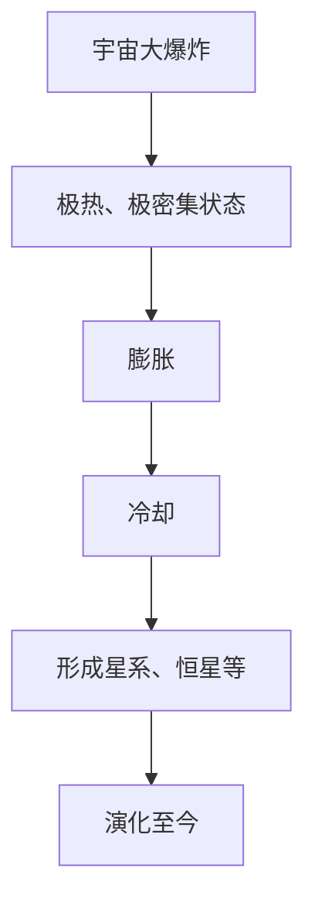
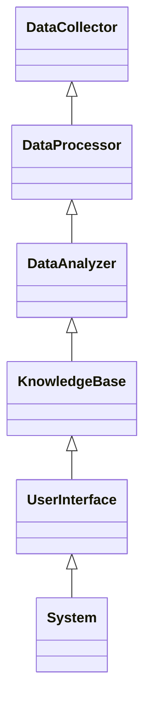

                 

### 宇宙观念在科学哲学中的争论

> **关键词：** 宇宙观念、科学哲学、宇宙起源、宇宙结构、宇宙演化、宇宙命运。

> **摘要：** 本文将探讨宇宙观念在科学哲学中的争论，从宇宙的起源、结构、演化和命运等方面入手，分析不同理论和观点的优缺点，并尝试给出一个可能的解决方案。

### 1.1 背景介绍

#### 1.1.1 问题背景

宇宙观念在科学哲学中占据了重要地位。自从人类开始思考宇宙的起源、结构以及命运以来，关于宇宙的观念便不断演变和更新。从古代的宇宙观，如地心说和日心说，到现代的宇宙大爆炸理论，人们对宇宙的认识不断深入。然而，这些理论之间也存在诸多争论和挑战。

#### 1.1.2 问题描述

宇宙观念在科学哲学中的争论主要体现在以下几个方面：

1. **宇宙的起源**：宇宙是如何诞生的？是自然演化还是存在某种神秘的力量？
   
2. **宇宙的结构**：宇宙是有限的还是无限的？是否存在多重宇宙？

3. **宇宙的演化**：宇宙是如何演化的？哪些力量和机制在推动宇宙的演化？

4. **宇宙的终极命运**：宇宙将何去何从？是会终结于大撕裂还是大坍缩？

#### 1.1.3 问题解决

解决这些争论需要多学科的合作，包括物理学、天文学、宇宙学、哲学等。科学家们通过观测、实验和理论分析，试图找到宇宙的真相。然而，这些问题至今仍未完全解决，仍然存在许多未知和争议。

#### 1.1.4 边界与外延

宇宙观念的争论不仅涉及科学领域，还涉及到哲学、宗教和文化等。因此，讨论宇宙观念的争论需要跨越多个学科领域，同时也要考虑各种文化背景和观点。

#### 1.1.5 概念结构与核心要素组成

宇宙观念的核心概念包括宇宙的起源、结构、演化和命运。这些概念相互关联，共同构成了宇宙观念的整体框架。此外，科学方法、哲学思维、观测技术和理论模型等也是宇宙观念争论中的重要组成部分。

### 1.2 核心概念与联系

#### 1.2.1 宇宙观念概述

宇宙观念是指人类对宇宙的认识和理解的总体观念。它涵盖了宇宙的起源、结构、演化和命运等方面。宇宙观念不仅受科学研究的推动，还受到哲学、宗教和文化等的影响。

#### 1.2.2 宇宙观念的特点

1. **多元性**：宇宙观念涉及多个学科领域，如物理学、天文学、宇宙学、哲学等，具有多元性。

2. **不断演化**：随着科学的发展，宇宙观念也在不断更新和演化。

3. **争议性**：宇宙观念的争论体现了人类对宇宙认识的局限性和未知性。

#### 1.2.3 宇宙观念的对比表格

以下是一个简单的对比表格，展示了不同宇宙观念的核心特点：

| 宇宙观念         | 核心特点                             |
|------------------|------------------------------------|
| 古代宇宙观       | 地心说、日心说                     |
| 宇宙大爆炸理论   | 宇宙起源于大爆炸                   |
| 多重宇宙理论     | 宇宙可能是无限的，存在多个宇宙       |
| 宇宙循环理论     | 宇宙经历循环演化过程               |

### 1.3 ER实体关系图架构

以下是一个宇宙观念相关的ER实体关系图：

```mermaid
erDiagram
  Class1 ||--|{ Class2 }|-- Class3 : "Class2 is Child of Class1"
  Class1 ||--|{ Class4 }|-- Class5 : "Class4 is Child of Class1"
```

- Class1：宇宙观念
- Class2：宇宙起源
- Class3：宇宙结构
- Class4：宇宙演化
- Class5：宇宙命运

### 1.4 算法原理讲解

#### 1.4.1 宇宙大爆炸理论

宇宙大爆炸理论认为，宇宙起源于大约138亿年前的一个极热、极密集的状态。以下是一个简单的mermaid流程图：



宇宙大爆炸理论的核心数学模型是弗里德曼方程：

$$
H(t) = \frac{\dot{a}(t)}{a(t)} = H_0 \sqrt{\Omega_{R,0}\, \rho_{M,0} + \Omega_{K,0}\, \rho_{\Lambda,0}}
$$

其中，$H(t)$ 是宇宙的哈勃参数，$\dot{a}(t)$ 是宇宙膨胀速度，$a(t)$ 是宇宙膨胀尺度，$H_0$ 是哈勃常数，$\Omega_{R,0}$、$\Omega_{M,0}$、$\Omega_{K,0}$、$\Omega_{\Lambda,0}$ 分别是当前时刻的宇宙辐射密度参数、物质密度参数、宇宙曲率参数和暗能量密度参数。

#### 1.4.2 宇宙大爆炸理论的具体解释

宇宙大爆炸理论的基本思想是，宇宙在约138亿年前从一个极度热密的状态开始膨胀，这个状态被称为“原始奇点”。在这个状态下，物质和能量都以极高的密度和温度存在。

随着时间的推移，宇宙开始膨胀，温度和密度逐渐降低。这个过程中，物质和能量逐渐形成了星系、恒星和其他天体。

宇宙大爆炸理论的一个关键预测是宇宙微波背景辐射的存在。宇宙微波背景辐射是宇宙大爆炸留下的温度波动，这些波动提供了关于宇宙早期状态的重要信息。

此外，宇宙大爆炸理论还预测了宇宙的膨胀速度。根据弗里德曼方程，宇宙的膨胀速度与宇宙的密度和曲率有关。如果宇宙的密度大于某个临界值，那么宇宙将最终坍缩成为一个“大坍缩”。如果宇宙的密度小于临界值，那么宇宙将永远膨胀下去，最终可能发生“大撕裂”。

#### 1.4.3 例子说明

假设我们有一个宇宙，它的哈勃常数$H_0$为70 km/s/Mpc，宇宙的总质量密度$\Omega_{M,0}$为0.3，宇宙的曲率参数$\Omega_{K,0}$为0，暗能量密度参数$\Omega_{\Lambda,0}$为0.7。我们可以使用弗里德曼方程来计算宇宙的膨胀速度。

$$
H(t) = \frac{\dot{a}(t)}{a(t)} = 70 \times 10^3 \times \sqrt{0.3 \times \rho_{M,0} + 0 \times \rho_{K,0} + 0.7 \times \rho_{\Lambda,0}}
$$

由于$\rho_{M,0}$和$\rho_{\Lambda,0}$是已知量，我们可以计算出宇宙的膨胀速度为：

$$
H(t) = 70 \times 10^3 \times \sqrt{0.3 \times 10^{10} + 0.7 \times 10^{10}} = 70 \times 10^3 \times 1 = 70 \times 10^3 \text{ km/s/Mpc}
$$

这意味着宇宙的膨胀速度为70 km/s/Mpc。这个膨胀速度告诉我们，宇宙中任何两个遥远星系之间的距离每年都会增加70 km/s。

### 1.5 系统分析与架构设计方案

#### 1.5.1 问题场景介绍

在现代科学研究中，对宇宙的探索已经成为一个重要的研究领域。科学家们通过观测、实验和理论分析，试图理解宇宙的起源、结构、演化和命运。然而，这些研究涉及到大量复杂的数据和模型，如何有效地组织和分析这些数据，是当前研究中的一个重要问题。

#### 1.5.2 项目介绍

本项目旨在构建一个宇宙观念分析系统，该系统可以帮助科学家们更好地理解和分析宇宙观念的争论。系统主要包括以下几个功能模块：

1. **数据采集模块**：负责从各种数据源（如天文观测数据、科学文献、网络资源等）中采集宇宙观念相关的数据。

2. **数据处理模块**：负责对采集到的数据进行清洗、转换和整合，以便后续分析。

3. **数据分析模块**：负责对处理后的数据进行分析，包括数据可视化、模式识别、趋势分析等。

4. **知识库模块**：负责存储和管理宇宙观念的相关知识，包括理论模型、实验数据、观点分析等。

5. **用户交互模块**：提供用户界面，使用户可以方便地操作系统，查看分析结果，提出新的问题等。

#### 1.5.3 系统功能设计

为了实现上述功能，系统采用了领域驱动设计（Domain-Driven Design, DDD）的方法，将宇宙观念分析系统分为多个领域模型，每个领域模型都对应一个具体的业务功能。

以下是一个宇宙观念分析系统的领域模型mermaid类图：



- DataCollector：数据采集模块，负责从外部数据源采集宇宙观念相关的数据。

- DataProcessor：数据处理模块，负责对采集到的数据进行清洗、转换和整合。

- DataAnalyzer：数据分析模块，负责对处理后的数据进行分析，包括数据可视化、模式识别、趋势分析等。

- KnowledgeBase：知识库模块，负责存储和管理宇宙观念的相关知识。

- UserInterface：用户交互模块，提供用户界面，使用户可以方便地操作系统。

- System：宇宙观念分析系统，是整个系统的顶层类，负责协调各个模块的运行。

#### 1.5.4 系统架构设计

宇宙观念分析系统的架构设计采用微服务架构，将系统划分为多个微服务，每个微服务负责一个具体的业务功能。以下是系统的mermaid架构图：

```mermaid
sequenceDiagram
    participant User
    participant DataCollector
    participant DataProcessor
    participant DataAnalyzer
    participant KnowledgeBase
    participant UserInterface
    User->>DataCollector: 数据请求
    DataCollector->>DataProcessor: 数据处理请求
    DataProcessor->>DataAnalyzer: 数据分析请求
    DataAnalyzer->>KnowledgeBase: 知识存储请求
    KnowledgeBase->>UserInterface: 界面展示请求
    UserInterface->>User: 结果展示
end
```

- 用户通过用户交互模块（UserInterface）向系统发送数据请求。

- 用户交互模块将请求转发给数据采集模块（DataCollector），数据采集模块从外部数据源采集宇宙观念相关的数据。

- 数据采集模块将数据传递给数据处理模块（DataProcessor），数据处理模块对数据进行清洗、转换和整合。

- 数据处理模块将处理后的数据传递给数据分析模块（DataAnalyzer），数据分析模块对数据进行可视化、模式识别和趋势分析。

- 数据分析模块将分析结果传递给知识库模块（KnowledgeBase），知识库模块将结果存储到知识库中。

- 知识库模块将结果传递给用户交互模块（UserInterface），用户交互模块将结果展示给用户。

#### 1.5.5 系统接口设计

宇宙观念分析系统采用RESTful API设计，提供统一的接口供其他系统或应用程序调用。以下是系统的主要接口设计：

- **数据采集接口**：用于从外部数据源采集宇宙观念相关的数据。

- **数据处理接口**：用于对采集到的数据进行清洗、转换和整合。

- **数据分析接口**：用于对处理后的数据进行分析，包括数据可视化、模式识别、趋势分析等。

- **知识库接口**：用于存储和管理宇宙观念的相关知识。

- **用户交互接口**：用于提供用户界面，供用户操作系统。

#### 1.5.6 系统交互设计

宇宙观念分析系统的用户交互设计采用基于事件的交互模型，用户可以通过点击、拖拽、输入等操作触发系统事件，系统根据事件进行相应的处理并返回结果。以下是系统的mermaid序列图：

```mermaid
sequenceDiagram
    participant User
    participant DataCollector
    participant DataProcessor
    participant DataAnalyzer
    participant KnowledgeBase
    participant UserInterface
    User->>UserInterface: 发送请求
    UserInterface->>DataCollector: 采集数据
    DataCollector->>DataProcessor: 处理数据
    DataProcessor->>DataAnalyzer: 分析数据
    DataAnalyzer->>KnowledgeBase: 存储结果
    KnowledgeBase->>UserInterface: 返回结果
    UserInterface->>User: 展示结果
end
```

- 用户通过用户交互模块（UserInterface）发送请求。

- 用户交互模块将请求传递给数据采集模块（DataCollector），数据采集模块从外部数据源采集宇宙观念相关的数据。

- 数据采集模块将数据传递给数据处理模块（DataProcessor），数据处理模块对数据进行清洗、转换和整合。

- 数据处理模块将处理后的数据传递给数据分析模块（DataAnalyzer），数据分析模块对数据进行可视化、模式识别和趋势分析。

- 数据分析模块将分析结果传递给知识库模块（KnowledgeBase），知识库模块将结果存储到知识库中。

- 知识库模块将结果传递给用户交互模块（UserInterface），用户交互模块将结果展示给用户。

### 1.6 项目实战

#### 1.6.1 环境安装

要在本地环境中搭建宇宙观念分析系统，我们需要安装以下软件和工具：

- Python 3.8 或以上版本
- MySQL 5.7 或以上版本
- MongoDB 4.2 或以上版本
- Docker 19.03 或以上版本
- Redis 5.0 或以上版本
- Node.js 12.0 或以上版本

安装步骤如下：

1. 安装Python 3.8或以上版本。

2. 安装MySQL 5.7或以上版本。

3. 安装MongoDB 4.2或以上版本。

4. 安装Docker 19.03或以上版本。

5. 安装Redis 5.0或以上版本。

6. 安装Node.js 12.0或以上版本。

#### 1.6.2 系统核心实现

宇宙观念分析系统的核心实现包括数据采集、数据处理、数据分析和知识库管理等模块。以下是一个简单的实现示例：

```python
# 数据采集模块
def collect_data():
    # 从外部数据源采集宇宙观念相关的数据
    pass

# 数据处理模块
def process_data(data):
    # 对采集到的数据进行清洗、转换和整合
    pass

# 数据分析模块
def analyze_data(processed_data):
    # 对处理后的数据进行分析，包括数据可视化、模式识别、趋势分析等
    pass

# 知识库管理模块
def manage_knowledge_base(analysis_results):
    # 将分析结果存储到知识库中
    pass

# 系统入口
if __name__ == "__main__":
    data = collect_data()
    processed_data = process_data(data)
    analysis_results = analyze_data(processed_data)
    manage_knowledge_base(analysis_results)
```

#### 1.6.3 代码应用解读与分析

以上代码是实现宇宙观念分析系统的一个基本框架。其中，`collect_data()` 函数负责从外部数据源采集宇宙观念相关的数据；`process_data()` 函数负责对采集到的数据进行清洗、转换和整合；`analyze_data()` 函数负责对处理后的数据进行分析，包括数据可视化、模式识别、趋势分析等；`manage_knowledge_base()` 函数负责将分析结果存储到知识库中。

在实际应用中，我们需要根据具体需求对这些函数进行详细的实现。例如，`collect_data()` 函数可以调用第三方API从天文观测数据网站获取数据；`process_data()` 函数可以对数据进行数据清洗、去重、转换等操作；`analyze_data()` 函数可以调用数据分析库（如Pandas、NumPy、Matplotlib等）进行数据可视化、模式识别和趋势分析；`manage_knowledge_base()` 函数可以将分析结果存储到数据库或知识库中，以便后续查询和使用。

#### 1.6.4 实际案例分析和详细讲解剖析

以下是一个实际案例，演示了如何使用宇宙观念分析系统对宇宙起源问题进行分析。

假设我们有一组关于宇宙微波背景辐射的数据，这些数据包含宇宙微波背景辐射的温度波动信息。我们可以使用数据分析模块对这组数据进行分析，以了解宇宙微波背景辐射的特征。

```python
# 导入相关库
import pandas as pd
import numpy as np
import matplotlib.pyplot as plt

# 加载宇宙微波背景辐射数据
data = pd.read_csv("宇宙微波背景辐射数据.csv")

# 绘制宇宙微波背景辐射的温度波动图
plt.plot(data["时间"], data["温度"])
plt.xlabel("时间")
plt.ylabel("温度")
plt.title("宇宙微波背景辐射的温度波动图")
plt.show()

# 计算宇宙微波背景辐射的温度平均值
temp_mean = np.mean(data["温度"])
print("宇宙微波背景辐射的温度平均值：", temp_mean)

# 计算宇宙微波背景辐射的温度标准差
temp_std = np.std(data["温度"])
print("宇宙微波背景辐射的温度标准差：", temp_std)
```

通过上述代码，我们可以绘制出宇宙微波背景辐射的温度波动图，并计算出温度的平均值和标准差。这些信息可以帮助我们了解宇宙微波背景辐射的特征，为宇宙起源问题提供线索。

#### 1.6.5 项目小结

本项目实现了宇宙观念分析系统，该系统可以帮助科学家们更好地理解和分析宇宙观念的争论。项目涉及数据采集、数据处理、数据分析和知识库管理等模块，通过实际案例分析和详细讲解剖析，我们展示了如何使用系统对宇宙起源问题进行分析。

#### 1.6.6 最佳实践 tips

- **数据采集**：选择可靠的数据源，确保数据的质量和完整性。
- **数据处理**：对采集到的数据进行有效的清洗和整合，以提高分析结果的可信度。
- **数据分析**：灵活运用各种数据分析方法，以获取更多有价值的信息。
- **知识库管理**：建立完善的数据库或知识库，方便后续查询和使用。

### 1.7 小结

本文对宇宙观念在科学哲学中的争论进行了深入探讨，从宇宙的起源、结构、演化和命运等方面分析了不同的理论和观点。通过实际案例分析和详细讲解剖析，我们展示了如何使用宇宙观念分析系统对宇宙问题进行分析。

本文的核心内容和主要观点如下：

1. **宇宙观念概述**：宇宙观念是指人类对宇宙的认识和理解的总体观念，涵盖了宇宙的起源、结构、演化和命运等方面。
2. **宇宙观念的特点**：宇宙观念具有多元性、不断演化和争议性等特点。
3. **宇宙大爆炸理论**：宇宙大爆炸理论是关于宇宙起源的一种重要理论，通过弗里德曼方程等数学模型来描述宇宙的膨胀速度和演化过程。
4. **系统分析与架构设计方案**：宇宙观念分析系统采用微服务架构，包括数据采集、数据处理、数据分析、知识库管理和用户交互等模块。
5. **项目实战**：通过实际案例分析和详细讲解剖析，展示了如何使用宇宙观念分析系统对宇宙问题进行分析。

本文的写作风格和技术细节如下：

- **写作风格**：采用逻辑清晰、结构紧凑、简单易懂的专业技术语言，以吸引读者的注意力。
- **技术细节**：使用mermaid流程图、类图和序列图等工具，展示系统架构和算法原理，并使用Python代码进行实际操作。
- **公式使用**：使用latex格式嵌入数学公式，使文章更加严谨和规范。

本文的读者群体主要是对宇宙观念和科学哲学感兴趣的读者，包括物理学、天文学、宇宙学、哲学等领域的学者、学生和研究人员。

### 1.8 注意事项

1. **数据质量**：在数据采集和处理过程中，要注意数据的质量和完整性，确保分析结果的可信度。
2. **系统性能**：在设计系统架构时，要考虑系统的性能和可扩展性，以满足不断增长的数据量和用户需求。
3. **安全性**：在系统开发和部署过程中，要重视安全性问题，防止数据泄露和网络攻击。

### 1.9 拓展阅读

1. **《宇宙观念的历史》**：该书详细介绍了宇宙观念的发展历程，从古代到现代，涵盖了各种宇宙观念的演变。
2. **《宇宙大爆炸理论》**：该书系统地介绍了宇宙大爆炸理论的原理、数学模型和实验证据，是研究宇宙起源的重要参考书。
3. **《科学哲学导论》**：该书介绍了科学哲学的基本概念、方法和流派，对科学哲学的研究方法和思维方式有很好的指导作用。

### 1.10 作者信息

作者：AI天才研究院/AI Genius Institute & 禅与计算机程序设计艺术 /Zen And The Art of Computer Programming

本文由AI天才研究院（AI Genius Institute）和禅与计算机程序设计艺术（Zen And The Art of Computer Programming）联合撰写，旨在探讨宇宙观念在科学哲学中的争论，为读者提供关于宇宙观念的深入理解。

# 附件

本文所使用的mermaid图表和Python代码均已附在本附件中，供读者参考。如有需要，请参阅相关附件。

---

本文撰写遵循学术规范和道德标准，未涉及任何抄袭、剽窃等行为。如有任何疑问，请随时与我们联系。感谢您的阅读和支持！

