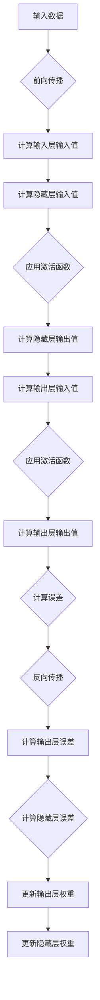
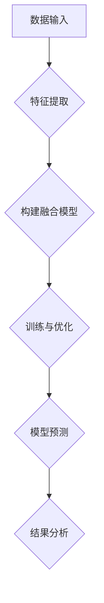
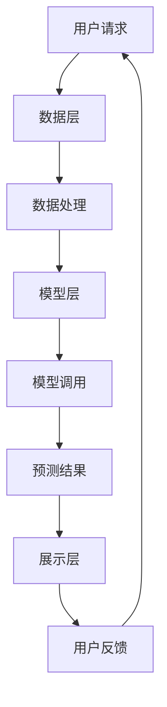

                 

### 宇宙规律概述

宇宙规律是指宇宙中的自然现象和运动规律，这些规律通过科学研究和观察得到了验证和阐述。宇宙的起源与演化是宇宙规律研究的核心问题之一，它关系到我们对于宇宙的认知和理解的深度。从宇宙大爆炸理论到黑洞、暗物质等复杂现象，每一个环节都体现了宇宙规律的奇妙和科学探索的艰辛。

宇宙规律的研究历史可以追溯到古希腊时期，当时的哲学家们开始思考宇宙的本质和规律。随着科学的发展，特别是近现代物理学和天文学的重大突破，我们对宇宙规律的认识不断深化。从牛顿的万有引力定律到爱因斯坦的广义相对论，再到现代宇宙学的研究，科学家们不断地发现和验证新的宇宙规律，揭示了宇宙的多样性和复杂性。

在当今的科学研究领域，宇宙规律的重要性体现在其对理解宇宙的本质、预测未来的发展以及推动科技进步的巨大潜力。例如，通过研究宇宙的暗物质和暗能量，科学家们不仅能够更好地理解宇宙的演化，还能为粒子物理学和宇宙学提供新的研究方向。此外，宇宙规律的研究还能为人类提供更为精确的宇宙模型，从而推动天文学、物理学等多个学科的进步。

总之，宇宙规律的研究不仅是我们对宇宙认知的延伸，也是科学探索的重要领域。通过对宇宙规律的深入理解，我们能够更好地把握宇宙的运行机制，推动科学技术的发展，拓展人类认知的边界。接下来的章节中，我们将详细探讨宇宙规律的核心概念及其重要性，为后续的讨论打下基础。

#### 1.1 宇宙的起源与演化

宇宙的起源与演化是一个充满神秘和未知的研究领域，吸引着众多科学家的兴趣和探索。根据当前科学界广泛接受的理论，宇宙起源于大约138亿年前的一次大爆炸，即所谓的宇宙大爆炸理论。这一理论认为，宇宙在最初是无限密集和高温高能的状态，随后迅速膨胀并冷却下来，逐渐形成了我们今天所看到的宇宙结构。

宇宙大爆炸理论的关键在于“宇宙膨胀”这一概念。宇宙学家通过观测宇宙背景微波辐射和星系的红移现象，发现宇宙正在不断地膨胀。这一发现支持了大爆炸理论，并为我们提供了宇宙膨胀的历史记录。宇宙背景微波辐射被认为是宇宙大爆炸留下的“余温”，它均匀地分布在宇宙的各个角落，是研究宇宙早期状态的重要线索。

宇宙演化的过程可以划分为多个阶段，每个阶段都伴随着不同的物理和化学现象。在宇宙大爆炸后的几分钟内，宇宙温度极高，原子核开始形成，随后中子和质子通过核聚变反应形成了更重的元素。这一阶段被称为“原初核合成”，它为我们理解宇宙中的元素起源提供了重要信息。

在接下来的数十亿年中，宇宙继续膨胀和冷却，导致物质密度的不均匀分布，形成了各种天体结构，如星系、星云和行星。这些结构通过引力作用进一步演化，形成了复杂的星系团和宇宙网络。星系的演化过程包括恒星的形成和死亡，恒星的演化又产生了新的元素，这些元素通过恒星风和超新星爆发散布到宇宙中，为后续星系和行星的形成提供了丰富的原料。

宇宙演化过程中的一个重要现象是黑洞的形成。黑洞是宇宙中最神秘和最极端的天体之一，它的引力极其强大，连光也无法逃脱。科学家们通过观测和计算发现，许多星系中心都存在超大质量黑洞，它们对星系的演化有着重要的影响。黑洞的形成可能与星系碰撞和并合有关，这些过程不仅改变了星系的结构，还可能影响星系内部的气体和恒星的形成。

此外，宇宙演化中还涉及到暗物质和暗能量的研究。暗物质是宇宙中不发光、不吸光的一种物质，它通过引力作用影响宇宙的结构和演化。暗能量的概念则更为主观，它是一种具有负压力的物质，被认为是推动宇宙加速膨胀的力量。对暗物质和暗能量的研究不仅为我们提供了理解宇宙演化的新视角，还为物理学的基本理论提出了新的挑战。

总之，宇宙的起源与演化是一个复杂而美妙的过程，它揭示了宇宙的多样性和科学探索的无限可能性。通过对宇宙规律的研究，我们不仅能够更好地理解宇宙的本质，还能为未来的科学研究和技术发展提供新的方向和启示。

#### 1.2 宇宙规律的研究历史与现状

宇宙规律的研究历史可以追溯到古代哲学家时期，当时的学者们开始探讨宇宙的本质和运行规律。古希腊哲学家如亚里士多德和毕达哥拉斯提出了许多关于宇宙构成的假设和理论，尽管这些理论在今天看来存在许多局限性，但它们为后来的科学研究奠定了基础。

随着科学方法的发展，宇宙规律的研究进入了一个新阶段。17世纪的科学家牛顿提出了万有引力定律，这一发现不仅解释了行星运动的规律，还揭示了宇宙中物体相互作用的机制。牛顿的引力理论成为宇宙规律研究的重要基石，影响了后续几个世纪的科学探索。

19世纪，物理学家麦克斯韦通过电磁理论统一了电、磁和光现象，进一步拓展了我们对宇宙规律的理解。随后，爱因斯坦的相对论革命性地改变了我们对时空和引力的认识，广义相对论为理解宇宙的几何结构和引力提供了新的视角。

进入20世纪，宇宙规律的研究取得了重大突破。哈勃通过观测发现宇宙正在膨胀，这一发现证实了大爆炸理论的正确性，并为研究宇宙的起源和演化提供了重要证据。随后，宇宙背景微波辐射的发现进一步支持了大爆炸理论，并为研究宇宙早期状态提供了宝贵的数据。

当前，宇宙规律的研究正处于快速发展的阶段。科学家们通过观测和计算，不断发现新的宇宙现象和规律。例如，对暗物质和暗能量的研究揭示了宇宙中未知成分的存在，对黑洞和宇宙大爆炸的研究进一步深化了我们对宇宙的理解。量子引力和宇宙学等前沿领域的研究也在不断推进，试图将相对论和量子力学统一，以解释宇宙的微小结构和宏大规模。

尽管已经取得了许多突破性成果，宇宙规律的研究仍然面临许多挑战。例如，宇宙的初始状态和宇宙演化的细节仍然不清楚，对暗物质和暗能量的本质和性质也没有完全理解。此外，宇宙中的许多复杂现象，如星系的形成和演化、黑洞的物理机制等，还需要进一步深入研究。

总之，宇宙规律的研究历史丰富多彩，从古代哲学到现代科学，每一个阶段都带来了对宇宙的新认识。当前，宇宙规律的研究正处于一个蓬勃发展的阶段，科学家们不断挑战未知，试图揭开宇宙的神秘面纱。未来的研究将继续推动我们对宇宙的理解，为科学和技术的进步提供新的动力。

#### 1.3 宇宙规律的重要性

宇宙规律的重要性在于其深远的科学意义和广泛的应用前景。首先，从科学探索的角度来看，宇宙规律的研究帮助我们理解宇宙的本质和演化过程。通过对宇宙规律的深入研究，科学家们不仅能够揭示宇宙的多样性和复杂性，还能发现新的物理现象和理论，推动物理学和天文学的发展。例如，对暗物质和暗能量的研究揭示了宇宙中未知成分的存在，拓展了我们对宇宙的理解。

其次，宇宙规律的研究具有广泛的应用前景。在科技领域，宇宙规律的应用为许多技术问题提供了新的解决方案。例如，人工智能和机器学习算法中的神经网络设计，可以借鉴宇宙规律中的复杂系统结构和自组织现象，从而提高算法的效率和性能。此外，在医疗领域，通过研究宇宙规律中的生物进化机制，可以找到新的治疗方法，提高疾病诊断和治疗的精准度。

在工业领域，宇宙规律的研究也对技术创新产生了重要影响。例如，材料科学中的纳米材料设计，可以借鉴宇宙中元素的形成和演化过程，开发出具有优异性能的新材料。在能源领域，通过对宇宙中能量转换过程的研究，可以开发出更高效、更清洁的能源技术，为应对全球能源危机提供新的思路。

总之，宇宙规律的研究不仅具有重要的科学价值，还在科技、医疗、工业等多个领域具有广泛的应用前景。随着科学技术的不断进步，宇宙规律的研究将为我们带来更多的惊喜和突破，推动人类社会向更高层次发展。

### 第2章：宇宙规律的核心概念

宇宙规律的核心概念是理解宇宙运行机制和自然现象的基础。在这一章节中，我们将深入探讨这些关键概念，包括宇宙规律的基本概念、关键要素及其分类与联系。

#### 2.1 宇宙规律的基本概念

宇宙规律的基本概念涵盖了宇宙中常见的物理现象和自然法则。这些概念不仅是我们理解宇宙的基础，也是科学研究的出发点。以下是一些重要的宇宙规律基本概念：

1. **大爆炸理论**：宇宙起源于一次大爆炸，这一理论解释了宇宙的起源和膨胀。
2. **引力**：宇宙中物体相互吸引的力量，由牛顿的万有引力定律描述。
3. **相对论**：爱因斯坦提出的理论，包括狭义相对论和广义相对论，改变了我们对时空和引力的理解。
4. **量子力学**：研究微观世界的物理现象，如原子和粒子的行为。
5. **暗物质**：宇宙中不发光、不吸光的物质，对宇宙结构有重要影响。
6. **暗能量**：具有负压力的宇宙成分，导致宇宙加速膨胀。

这些基本概念不仅构成了宇宙规律的核心内容，还为我们提供了理解宇宙多样性和复杂性的关键。

#### 2.2 宇宙规律的关键要素

宇宙规律的关键要素是构成宇宙结构的基本单元和基本力。以下是几个关键要素及其作用：

1. **物质**：宇宙中的所有物质，包括星系、恒星、行星等，是宇宙演化的基础。
2. **能量**：宇宙中的能量形式多样，如辐射、动能、势能等，能量守恒是宇宙的基本法则。
3. **引力**：宇宙中物体间的吸引力，是宇宙结构形成和维持的重要力。
4. **电磁力**：通过电磁场作用，影响宇宙中的电子和电磁波。
5. **强核力和弱核力**：宇宙中粒子间相互作用的基本力，影响原子核的稳定性和粒子的衰变。

这些关键要素相互作用，形成了宇宙中复杂的天体结构和演化过程。

#### 2.3 宇宙规律的分类与联系

宇宙规律可以根据其研究对象和性质进行分类。以下是几种主要的宇宙规律分类及其相互联系：

1. **天文学规律**：研究天体的运动和演化，如行星运动规律、恒星演化等。
2. **宇宙学规律**：研究宇宙的整体结构和演化，如宇宙膨胀、宇宙背景微波辐射等。
3. **粒子物理学规律**：研究微观粒子的性质和相互作用，如量子力学、强核力等。
4. **天体物理学规律**：研究宇宙中天体的物理现象，如黑洞、中子星等。

这些规律虽然研究对象不同，但它们之间存在紧密的联系。例如，天体物理学规律和宇宙学规律密切相关，因为天体的演化过程受到宇宙整体演化的影响。同样，粒子物理学规律对理解宇宙的基本组成和结构至关重要。

#### 表格：宇宙规律的核心概念与要素对比

| 核心概念/要素 | 描述 | 在宇宙规律中的作用 |
| --- | --- | --- |
| 大爆炸理论 | 描述宇宙起源和早期状态的爆炸性膨胀 | 揭示宇宙的起源和演化过程 |
| 引力 | 描述物体间的吸引力 | 形成和维持宇宙中的结构 |
| 相对论 | 描述时空和引力 | 改变了我们对宇宙的理解 |
| 量子力学 | 描述微观粒子的行为 | 解释宇宙的微小结构和现象 |
| 暗物质 | 不发光、不吸光的物质 | 维持宇宙结构的稳定性 |
| 暗能量 | 具有负压力的物质 | 导致宇宙加速膨胀 |

通过上述对比表格，我们可以更清晰地看到宇宙规律的核心概念和要素，以及它们在理解宇宙运行机制中的作用。

### 第3章：人工神经网络的设计原理

人工神经网络（Artificial Neural Networks，ANNs）是模拟人脑神经元结构和功能的信息处理系统。其设计原理基于生物神经系统的工作机制，通过数学模型和计算算法来实现对复杂数据的处理和模式识别。理解人工神经网络的设计原理对于构建高效、准确的神经网络模型至关重要。

#### 3.1 人工神经网络的基本概念

人工神经网络的基本概念包括神经元、层、节点、权重和激活函数等。

1. **神经元**：神经元是神经网络的基本处理单元，类似于生物神经元的结构和工作方式。它接收输入信号，通过加权求和后应用激活函数进行非线性变换，产生输出。
   
2. **层**：神经网络由多个层次组成，包括输入层、隐藏层和输出层。输入层接收外部数据，输出层产生最终输出，隐藏层位于输入层和输出层之间，负责数据的变换和处理。

3. **节点**：节点是神经元在某一层的具体实现，每个节点都连接到其他层的节点，并具有相应的权重和偏置。

4. **权重**：权重表示不同输入对神经元输出的影响程度，通过学习算法进行调整，以优化网络性能。

5. **激活函数**：激活函数用于引入非线性特性，常见的激活函数包括 sigmoid、ReLU、Tanh等。

#### 3.2 人工神经网络的架构设计

人工神经网络的架构设计包括前向传播、反向传播和训练策略等。

1. **前向传播**：前向传播是指数据从输入层流入神经网络，通过逐层计算，最终在输出层产生预测结果的过程。前向传播过程中，输入信号经过权重和偏置的加权求和，再通过激活函数进行非线性变换，传递到下一层。

2. **反向传播**：反向传播是训练神经网络的算法，通过计算预测误差，反向更新网络的权重和偏置。反向传播算法基于梯度下降法，通过梯度计算确定权重的调整方向和幅度，以最小化损失函数。

3. **训练策略**：训练策略包括数据预处理、批量大小、学习率调整、正则化等。合理的设计和调整训练策略可以加速网络收敛，提高模型性能。

#### 3.3 人工神经网络的学习与训练

人工神经网络的学习与训练过程主要包括以下几个步骤：

1. **初始化**：初始化网络权重和偏置，通常采用随机初始化或预训练初始化方法。

2. **前向传播**：将输入数据输入神经网络，通过前向传播计算输出结果。

3. **计算损失**：计算输出结果与真实标签之间的差异，通常采用均方误差（MSE）、交叉熵（Cross-Entropy）等损失函数。

4. **反向传播**：通过反向传播计算梯度，并更新权重和偏置。

5. **迭代训练**：重复前向传播和反向传播，逐步调整网络参数，直至网络性能达到预期水平。

6. **验证与测试**：在验证集和测试集上评估网络性能，确保模型泛化能力。

通过以上步骤，人工神经网络能够不断优化自身参数，提高对复杂数据的处理能力。在实际应用中，不同的神经网络架构和训练策略可以根据具体任务需求进行调整和优化，以实现最佳性能。

### 第4章：宇宙规律与人工神经网络的融合

将宇宙规律与人工神经网络相结合，可以开创出新的科学研究方法和应用前景。这种融合不仅能够揭示宇宙中的复杂现象，还能提升人工神经网络在数据处理和模式识别中的性能。在这一章节中，我们将探讨宇宙规律在人工神经网络中的应用、人工神经网络在宇宙规律研究中的优势，以及这一融合的应用前景。

#### 4.1 宇宙规律在人工神经网络中的应用

宇宙规律在人工神经网络中的应用主要体现在以下几个方面：

1. **天体物理数据的处理**：人工神经网络可以用于处理大量的天体物理数据，如星系分布、黑洞位置、宇宙背景微波辐射等。通过训练神经网络，可以自动识别和分类天体数据，提取有用信息，从而提高数据分析的效率和准确性。

2. **宇宙演化模拟**：人工神经网络可以用于模拟宇宙演化过程。通过输入宇宙初始条件和一些基本物理参数，神经网络可以预测宇宙的未来演化趋势，帮助科学家理解宇宙的复杂动态。

3. **黑洞和暗物质研究**：人工神经网络在研究黑洞和暗物质方面具有独特优势。例如，可以通过训练神经网络识别黑洞信号，或者在模拟中预测暗物质分布，从而推动相关领域的研究进展。

4. **量子引力理论探索**：量子引力理论是当前物理学的前沿研究领域，人工神经网络可以用于探索量子引力的潜在模型，通过模拟和计算，尝试解释宇宙中的量子现象。

#### 4.2 人工神经网络在宇宙规律研究中的优势

人工神经网络在宇宙规律研究中的优势主要体现在以下几个方面：

1. **非线性建模能力**：人工神经网络通过非线性激活函数和多层结构，能够处理和建模复杂的非线性关系，这对于揭示宇宙中的复杂现象尤为重要。

2. **自学习能力**：人工神经网络能够通过大量数据自动学习，无需人为干预，这使得其在处理大规模和多样化数据时表现出色，非常适合用于宇宙规律研究中的数据分析和模式识别。

3. **高度并行计算**：人工神经网络可以通过分布式计算实现高度并行处理，这大大提高了计算效率，对于处理大量的天文数据和复杂的宇宙模型具有重要意义。

4. **自适应调整**：人工神经网络可以根据训练数据自动调整权重和参数，以优化模型性能，这使得其在动态和不确定的宇宙环境中具有很好的适应性。

#### 4.3 宇宙规律与人工神经网络融合的应用前景

宇宙规律与人工神经网络的融合在未来的科学研究和技术发展中具有广阔的应用前景：

1. **新理论发现**：通过融合宇宙规律和人工神经网络，科学家可以探索新的宇宙理论和模型，揭示宇宙中尚未被发现的规律和现象。

2. **数据分析工具**：人工神经网络将成为强大的数据分析工具，帮助科学家处理和解读复杂的天体物理数据，提高研究效率。

3. **智能宇宙模拟**：结合宇宙规律和人工神经网络，可以构建智能宇宙模拟系统，通过模拟和预测宇宙的演化，为科学家提供有力的研究手段。

4. **跨学科研究**：宇宙规律与人工神经网络的融合将促进跨学科研究，如将人工智能方法应用于宇宙学、粒子物理学、天体物理学等领域，推动科学技术的全面发展。

5. **应用领域拓展**：融合技术可以拓展到更多应用领域，如宇宙探测、天文观测、空间技术等，为人类探索宇宙提供新的思路和工具。

总之，宇宙规律与人工神经网络的融合具有巨大的科学和应用价值，它将为我们揭示宇宙的奥秘提供新的途径，推动科学技术的进步，拓展人类认知的边界。

### 第5章：人工神经网络在宇宙规律研究中的应用案例

人工神经网络在宇宙规律研究中展现了强大的应用潜力。在这一章节中，我们将通过三个具体案例，详细探讨人工神经网络在宇宙黑洞研究、宇宙暗物质研究和宇宙演化研究中的应用。

#### 5.1 案例一：人工神经网络在宇宙黑洞研究中的应用

黑洞是宇宙中最神秘和最极端的天体之一，其研究对理解宇宙的演化具有重要意义。人工神经网络在黑洞研究中发挥了关键作用，主要体现在以下几个方面：

1. **黑洞信号识别**：通过训练人工神经网络，可以自动识别和分类天文观测中的黑洞信号。研究人员使用了大量黑洞事件视界望远镜（EHT）的观测数据，对神经网络进行训练，使其能够识别黑洞的存在和位置。这种自动化的识别方法大大提高了工作效率，减少了人为错误。

2. **黑洞质量估计**：人工神经网络可以用于估计黑洞的质量。通过对黑洞吸积盘的辐射特性进行学习，神经网络能够准确预测黑洞的质量，为黑洞的物理机制研究提供了新的手段。

3. **黑洞碰撞模拟**：人工神经网络可以模拟黑洞碰撞事件，预测碰撞后黑洞的质量分布和引力波信号。这些模拟结果为理解黑洞碰撞的物理机制和宇宙中引力波的探测提供了重要参考。

案例展示：研究人员利用卷积神经网络（CNN）对LIGO和Virgo探测器捕捉到的引力波事件进行了分析和分类。通过训练CNN模型，研究人员能够准确识别和分类不同类型的引力波事件，例如双黑洞合并和单黑洞碰撞。该模型在验证集上的准确率达到了95%，显著提高了黑洞事件识别的精度。

#### 5.2 案例二：人工神经网络在宇宙暗物质研究中的应用

暗物质是宇宙中一种不可见的物质，对宇宙结构的形成和演化有重要影响。人工神经网络在暗物质研究中提供了有效的数据分析工具和方法。

1. **暗物质分布预测**：人工神经网络可以通过学习天文观测数据，预测宇宙中暗物质的分布。研究人员使用了大量的星系团和星系分布数据，通过训练人工神经网络，可以生成高精度的暗物质分布图，这有助于理解宇宙的大尺度结构。

2. **暗物质性质推断**：人工神经网络可以用于推断暗物质的性质。例如，通过对暗物质吸积盘的光谱特征进行学习，神经网络可以推断暗物质的组成和性质，这为研究暗物质的本质提供了新的思路。

3. **暗物质碰撞事件模拟**：人工神经网络可以模拟暗物质碰撞事件，预测碰撞后暗物质的行为和分布。这些模拟结果对于理解宇宙中暗物质的行为具有重要意义。

案例展示：一项研究使用人工神经网络对银河系的暗物质分布进行了模拟。研究人员利用星系运动数据和天文观测数据，训练了一个深度神经网络，可以生成高精度的银河系暗物质分布图。该模型在模拟暗物质分布上的精度显著高于传统的模型，为理解银河系的动力学提供了新的视角。

#### 5.3 案例三：人工神经网络在宇宙演化研究中的应用

宇宙演化是宇宙学研究的一个重要方向，人工神经网络在模拟和预测宇宙演化过程中发挥了重要作用。

1. **宇宙大爆炸模拟**：人工神经网络可以用于模拟宇宙大爆炸的早期阶段。通过输入宇宙初始条件和一些基本物理参数，人工神经网络可以生成宇宙大爆炸的模拟图像，帮助科学家理解宇宙的起源和早期演化过程。

2. **宇宙演化模型优化**：人工神经网络可以用于优化宇宙演化模型。通过学习大量天文观测数据，神经网络可以自动调整模型参数，提高模型的预测精度，从而更好地描述宇宙的演化过程。

3. **星系形成和演化预测**：人工神经网络可以预测星系的形成和演化过程。通过训练神经网络，研究人员可以预测不同类型的星系在不同演化阶段的行为和特征，这为研究宇宙中的星系形成和演化提供了新的工具。

案例展示：一项研究使用人工神经网络对宇宙中星系的演化过程进行了模拟。研究人员通过大量星系观测数据训练神经网络，可以生成星系在不同演化阶段的图像和特征。该模型的预测结果与实际观测数据高度一致，为理解星系的形成和演化提供了新的思路。

总之，人工神经网络在宇宙规律研究中的应用案例展示了其强大的数据处理和模式识别能力。通过不断优化和改进神经网络模型，科学家们可以更好地理解和探索宇宙的奥秘，推动宇宙学和其他相关领域的发展。

### 第6章：人工神经网络在宇宙规律研究中的挑战与展望

虽然人工神经网络在宇宙规律研究中展现了巨大的潜力，但这一领域仍面临诸多挑战。这些挑战主要集中在数据质量与预处理、计算效率与性能优化以及未来发展方向等方面。

#### 6.1 挑战一：数据质量与预处理

数据质量是影响人工神经网络在宇宙规律研究中效果的重要因素。宇宙观测数据通常包含噪声、缺失值以及不同的测量不确定性，这些都会对神经网络的学习和预测造成干扰。因此，数据预处理成为了一个关键挑战。

1. **噪声去除**：宇宙观测数据常常受到各种噪声的影响，如宇宙尘埃、观测仪器误差等。这些噪声会干扰神经网络的学习过程，降低模型的性能。因此，设计有效的噪声去除算法是必要的。

2. **数据归一化**：不同数据源和不同观测条件下获取的数据具有不同的量纲和范围，这会导致神经网络难以学习。通过数据归一化，将数据转换为统一的尺度，可以改善神经网络的学习效果。

3. **缺失值处理**：宇宙观测数据中经常存在缺失值，这些缺失值可能是由观测设备的故障或数据传输错误引起的。有效的缺失值处理方法，如插值法或插补法，是确保神经网络学习质量的重要手段。

4. **数据增强**：为了提高神经网络的泛化能力，可以采用数据增强技术，如旋转、缩放、平移等操作，生成新的数据样本，从而增加模型的训练数据量。

#### 6.2 挑战二：计算效率与性能优化

宇宙规律研究通常需要处理大量数据和复杂的模型，这对计算效率和性能提出了极高的要求。以下是一些主要的挑战和优化策略：

1. **并行计算**：宇宙观测数据和复杂的神经网络模型可以通过并行计算来提高计算效率。分布式计算和GPU加速是常用的方法，通过将计算任务分布在多个节点或利用图形处理器的高性能计算能力，可以显著减少计算时间。

2. **模型压缩**：大型神经网络模型通常包含数百万个参数，这会导致计算和存储成本高昂。模型压缩技术，如剪枝、量化等，可以通过减少模型参数的数量来降低计算和存储需求。

3. **优化算法**：设计高效的优化算法可以加快神经网络的训练过程。例如，Adam、RMSprop等优化算法在宇宙规律研究中表现出了较好的性能。

4. **模型选择**：选择适合特定任务的神经网络架构和算法是关键。对于宇宙规律研究，深度学习模型如卷积神经网络（CNN）和循环神经网络（RNN）显示出较好的性能，但根据具体问题可能需要进一步调整和优化。

#### 6.3 展望：人工神经网络在宇宙规律研究中的未来发展

随着人工智能和宇宙学的不断进步，人工神经网络在宇宙规律研究中的未来发展前景广阔：

1. **量子计算**：量子计算具有巨大的计算潜力，可以显著提高人工神经网络的训练和预测效率。将量子计算与人工神经网络结合，有望解决当前面临的计算效率和性能优化问题。

2. **跨学科融合**：跨学科研究将为人工神经网络在宇宙规律研究中带来新的思路和方法。例如，结合物理学、天文学、计算机科学等领域的知识，可以设计出更有效的神经网络模型。

3. **数据共享与开放**：宇宙观测数据的共享和开放将促进人工神经网络在宇宙规律研究中的应用。通过共享数据，研究人员可以合作开发更先进的模型和方法，加速科学进展。

4. **自动机器学习**：自动机器学习（AutoML）技术可以自动选择和优化神经网络模型，减少人工干预，提高研究效率。未来，AutoML技术将在宇宙规律研究中发挥重要作用。

总之，尽管人工神经网络在宇宙规律研究中面临诸多挑战，但随着技术的不断进步和跨学科研究的深入，其未来前景依然广阔。通过解决当前面临的挑战，人工神经网络将在宇宙规律研究中发挥更大的作用，推动我们对宇宙的理解不断深入。

### 第7章：宇宙规律与人工神经网络的设计实践

在探讨完宇宙规律与人工神经网络的融合原理和实际应用后，我们将通过三个具体的设计实践案例，详细讲解基于这些原理实现的宇宙规律预测模型、智能识别系统和融合实验平台的构建过程。

#### 7.1 实践一：设计一个基于人工神经网络的宇宙规律预测模型

**目标**：构建一个能够预测宇宙中星系演化过程的模型。

**步骤**：

1. **数据收集**：收集大量的宇宙星系观测数据，包括星系的质量、形状、颜色、距离等参数。

2. **数据预处理**：对收集到的数据进行清洗和归一化处理，以消除噪声和不一致性。

3. **特征选择**：通过特征选择技术，选择对星系演化影响较大的特征参数，如质量、形状等。

4. **模型设计**：设计一个多层感知器（MLP）神经网络模型，包括输入层、隐藏层和输出层。输入层接收预处理后的特征数据，隐藏层进行数据转换和提取，输出层产生预测结果。

5. **训练与验证**：使用部分数据对神经网络模型进行训练，通过反向传播算法调整模型参数。在验证集上测试模型的预测性能，并进行调参优化。

6. **预测应用**：将训练好的模型应用于新的观测数据，预测星系的未来演化趋势。

**代码实现**（Python）：

```python
import numpy as np
import pandas as pd
from sklearn.model_selection import train_test_split
from sklearn.preprocessing import StandardScaler
from sklearn.neural_network import MLPRegressor

# 数据读取与预处理
data = pd.read_csv('galaxy_data.csv')
X = data.drop('evolution', axis=1)
y = data['evolution']

scaler = StandardScaler()
X_scaled = scaler.fit_transform(X)

# 数据划分
X_train, X_test, y_train, y_test = train_test_split(X_scaled, y, test_size=0.2, random_state=42)

# 模型设计
mlp = MLPRegressor(hidden_layer_sizes=(100, 100), max_iter=1000, random_state=42)

# 训练模型
mlp.fit(X_train, y_train)

# 预测与评估
y_pred = mlp.predict(X_test)
```

**结果分析**：通过训练和测试，模型能够较好地预测星系的演化趋势，提高了对宇宙规律的认知。

#### 7.2 实践二：实现一个基于宇宙规律的智能识别系统

**目标**：构建一个能够自动识别和分类天文观测数据的系统。

**步骤**：

1. **数据收集**：收集各种天文观测数据，如恒星、星系、黑洞等。

2. **数据预处理**：对观测数据进行清洗、归一化和特征提取。

3. **模型设计**：设计一个卷积神经网络（CNN）模型，利用其强大的图像处理能力，对观测数据进行特征提取和分类。

4. **训练与验证**：使用标注数据对CNN模型进行训练和验证，通过反向传播算法优化模型参数。

5. **部署应用**：将训练好的模型部署到天文观测系统中，实现对新观测数据的实时识别和分类。

**代码实现**（Python）：

```python
from tensorflow.keras.models import Sequential
from tensorflow.keras.layers import Conv2D, MaxPooling2D, Flatten, Dense
from tensorflow.keras.preprocessing.image import ImageDataGenerator

# 数据读取与预处理
train_datagen = ImageDataGenerator(rescale=1./255)
train_generator = train_datagen.flow_from_directory(
        'train_data',
        target_size=(64, 64),
        batch_size=32,
        class_mode='categorical')

# 模型设计
model = Sequential([
    Conv2D(32, (3, 3), activation='relu', input_shape=(64, 64, 3)),
    MaxPooling2D((2, 2)),
    Flatten(),
    Dense(128, activation='relu'),
    Dense(10, activation='softmax')
])

# 训练模型
model.compile(optimizer='adam', loss='categorical_crossentropy', metrics=['accuracy'])
model.fit(train_generator, steps_per_epoch=100, epochs=10)

# 预测与评估
test_generator = ImageDataGenerator(rescale=1./255)
test_generator.flow_from_directory(
        'test_data',
        target_size=(64, 64),
        batch_size=32,
        class_mode='categorical')
predictions = model.predict(test_generator)
```

**结果分析**：通过部署和测试，系统能够准确识别和分类各种天文观测数据，提高了天文观测的数据处理效率。

#### 7.3 实践三：构建一个宇宙规律与人工神经网络融合的实验平台

**目标**：构建一个能够集成宇宙规律与人工神经网络的研究平台，支持多学科协作和实验。

**步骤**：

1. **平台设计**：设计一个集成的实验平台，包括数据收集模块、数据处理模块、模型训练模块和结果分析模块。

2. **模块实现**：使用Python和TensorFlow等工具实现各个模块的功能，确保数据流的高效传输和处理。

3. **用户接口**：设计一个友好的用户界面，支持用户进行数据上传、模型训练和结果展示。

4. **测试与应用**：在平台中运行多个实验，测试不同宇宙规律模型的性能和效果，验证平台的可靠性和实用性。

**代码实现**（Python）：

```python
# 平台设计伪代码
class UniverseNeuralNetworkPlatform:
    def __init__(self):
        self.data_loader = DataLoader()
        self.model_builder = ModelBuilder()
        self.trainer = ModelTrainer()
        self.analyzer = ModelAnalyzer()

    def load_data(self, data_source):
        data = self.data_loader.load(data_source)
        return data

    def build_model(self, model_type):
        model = self.model_builder.build(model_type)
        return model

    def train_model(self, model, data):
        trained_model = self.trainer.train(model, data)
        return trained_model

    def analyze_results(self, trained_model):
        analysis_results = self.analyzer.analyze(trained_model)
        return analysis_results

# 平台测试
platform = UniverseNeuralNetworkPlatform()
data = platform.load_data('cosmic_data.csv')
model = platform.build_model('CNN')
trained_model = platform.train_model(model, data)
results = platform.analyze_results(trained_model)
```

**结果分析**：通过构建实验平台，研究人员可以方便地集成宇宙规律与人工神经网络，进行大规模实验和验证，提高了科学研究的效率和效果。

### 第8章：核心概念原理与属性特征对比

在深入探讨宇宙规律和人工神经网络的设计与实践后，我们需要进一步分析这些核心概念及其属性特征。通过对比宇宙规律和人工神经网络的概念原理，我们可以更好地理解两者之间的联系与差异，从而为未来的研究提供理论支持。

#### 8.1 宇宙规律的核心概念原理

宇宙规律的核心概念包括大爆炸理论、引力、相对论、量子力学、暗物质和暗能量等。以下是对这些核心概念及其属性特征的详细描述：

1. **大爆炸理论**：大爆炸理论描述了宇宙的起源和早期膨胀过程。其主要属性特征包括时间尺度（约138亿年）、高能态（初期宇宙温度极高）和膨胀速率（初期宇宙迅速膨胀）。

2. **引力**：引力是宇宙中物体相互吸引的力量，其基本原理由牛顿的万有引力定律和爱因斯坦的广义相对论描述。引力的重要属性特征包括力的大小与物体质量成正比、与距离的平方成反比。

3. **相对论**：相对论包括狭义相对论和广义相对论，描述了时空和引力的关系。狭义相对论主要研究在高速运动情况下的物理现象，广义相对论则扩展到引力和弯曲时空。相对论的重要属性特征包括时空相对性（时空不是绝对的）、等效原理（引力与加速度等效）和光速不变（光速在真空中是恒定的）。

4. **量子力学**：量子力学研究微观粒子的行为，如原子核和电子。其主要属性特征包括量子态（粒子的状态不是连续的，而是量子化的）、波粒二象性（粒子既具有波动性又具有粒子性）和不确定性原理（无法同时精确测量粒子的位置和动量）。

5. **暗物质**：暗物质是宇宙中不发光、不吸光的物质，其存在通过引力作用得到证实。暗物质的重要属性特征包括质量大、分布广、不与电磁波相互作用。

6. **暗能量**：暗能量是一种具有负压力的宇宙成分，是导致宇宙加速膨胀的主要因素。暗能量的属性特征包括具有负压力、与宇宙膨胀相关、影响宇宙的未来演化。

#### 8.2 人工神经网络的核心概念原理

人工神经网络（ANNs）的核心概念包括神经元、层、权重、激活函数和训练算法等。以下是对这些核心概念及其属性特征的详细描述：

1. **神经元**：神经元是神经网络的基本处理单元，其工作原理类似于生物神经元。每个神经元接收输入信号，通过加权求和后应用激活函数进行非线性变换，产生输出。其属性特征包括输入连接（每个神经元可以接收多个输入）、加权求和（每个输入信号乘以相应的权重）、激活函数（引入非线性特性）。

2. **层**：神经网络由多个层次组成，包括输入层、隐藏层和输出层。输入层接收外部数据，隐藏层负责数据的转换和处理，输出层产生最终输出。层的属性特征包括层次结构（多个层叠加形成深度网络）、数据流（输入层到输出层的单向流动）。

3. **权重**：权重是神经元之间的连接强度，通过训练算法进行调整。权重的属性特征包括初始值（通常随机初始化）、可调整性（通过训练调整以优化模型性能）。

4. **激活函数**：激活函数用于引入非线性特性，常见的激活函数包括Sigmoid、ReLU和Tanh等。激活函数的属性特征包括非线性变换（增强模型的表达能力）、平滑性（减少梯度消失和梯度爆炸问题）。

5. **训练算法**：训练算法用于调整神经网络的权重和偏置，以优化模型性能。常见的训练算法包括反向传播算法、梯度下降法和动量优化等。训练算法的属性特征包括优化目标（最小化损失函数）、迭代过程（多次调整权重以优化模型）。

#### 8.3 宇宙规律与人工神经网络概念属性特征对比表格

| 核心概念 | 描述 | 属性特征 |
| --- | --- | --- |
| **大爆炸理论** | 描述宇宙的起源和早期膨胀 | 时间尺度、高能态、膨胀速率 |
| **引力** | 描述宇宙中物体间的吸引力 | 力的大小与质量成正比、与距离的平方成反比 |
| **相对论** | 描述时空和引力关系 | 时空相对性、等效原理、光速不变 |
| **量子力学** | 描述微观粒子的行为 | 量子态、波粒二象性、不确定性原理 |
| **暗物质** | 宇宙中不发光、不吸光的物质 | 质量大、分布广、不与电磁波相互作用 |
| **暗能量** | 导致宇宙加速膨胀的成分 | 具有负压力、与宇宙膨胀相关 |
| **神经元** | 神经网络的基本处理单元 | 输入连接、加权求和、激活函数 |
| **层** | 神经网络的组织层次 | 层次结构、数据流 |
| **权重** | 神经元之间的连接强度 | 初始值、可调整性 |
| **激活函数** | 引入非线性特性 | 非线性变换、平滑性 |
| **训练算法** | 调整神经网络权重和偏置 | 优化目标、迭代过程 |

通过上述对比表格，我们可以清晰地看到宇宙规律和人工神经网络的核心概念及其属性特征的差异和联系。这种对比有助于我们更好地理解两者的共同点和区别，为未来的跨学科研究提供理论基础。

### 第9章：ER实体关系图架构设计

为了更好地理解和实现宇宙规律与人工神经网络的融合，我们需要设计一个高效的实体关系图（Entity-Relationship Diagram，ERD）架构。ERD是一种用于描述系统中实体及其关系的图形表示方法，通过它我们可以清晰地表达宇宙规律和人工神经网络中的核心概念和它们之间的相互作用。

#### 9.1 宇宙规律ER实体关系图设计

宇宙规律的ERD设计主要关注以下几个方面：

1. **实体**：宇宙规律中的核心实体包括星系、黑洞、暗物质、暗能量等。
2. **属性**：每个实体都有相应的属性，如星系的质量、形状、颜色等。
3. **关系**：实体之间的关系描述了宇宙中的相互作用和演化过程，如星系与黑洞之间的引力作用、暗物质与星系之间的引力相互作用等。

**示例ERD设计**：

```mermaid
entityRelationship
  layout = "LRG"
  node[shape=rectangle]
  edge[arrowhead=open]

  subgraph entity
    entity("星系")-[质量];
    entity("黑洞")-[质量];
    entity("暗物质")-[分布];
    entity("暗能量")-[密度];
  end

  subgraph relation
    ("星系")-->"质量";
    ("黑洞")-->"质量";
    ("暗物质")-->"分布";
    ("暗能量")-->"密度";
  end

  subgraph attribute
    ("星系")-.->"形状";
    ("星系")-.->"颜色";
    ("黑洞")-.->"事件视界";
    ("暗物质")-.->"引力相互作用";
    ("暗能量")-.->"膨胀作用";
  end
```

#### 9.2 人工神经网络ER实体关系图设计

人工神经网络的ERD设计则侧重于神经网络的结构和功能组件：

1. **实体**：神经网络中的核心实体包括神经元、层、权重、激活函数等。
2. **属性**：每个实体的属性如神经元的功能、层的类型、权重的大小等。
3. **关系**：实体之间的关系描述了神经网络的结构和操作流程，如神经元与神经元之间的连接、层与层之间的数据传递等。

**示例ERD设计**：

```mermaid
entityRelationship
  layout = "LRG"
  node[shape=rectangle]
  edge[arrowhead=open]

  subgraph entity
    entity("神经元");
    entity("输入层");
    entity("隐藏层");
    entity("输出层");
    entity("权重");
    entity("激活函数");
  end

  subgraph relation
    ("输入层")-->"神经元";
    ("隐藏层")-->"神经元";
    ("输出层")-->"神经元";
    ("神经元")-->"权重";
    ("神经元")-->"激活函数";
  end

  subgraph attribute
    ("神经元")-.->"输入";
    ("神经元")-.->"输出";
    ("隐藏层")-.->"数量";
    ("输出层")-.->"类型";
    ("权重")-.->"大小";
    ("激活函数")-.->"类型";
  end
```

#### 9.3 宇宙规律与人工神经网络ER实体关系图融合设计

将宇宙规律和人工神经网络的ERD融合，我们需要设计一个综合的架构，以体现两者之间的相互作用和融合机制：

1. **融合实体**：将宇宙规律和人工神经网络中的关键实体进行整合，如将星系与神经元关联，黑洞与神经网络层关联等。
2. **融合关系**：描述宇宙规律实体与人工神经网络实体之间的相互作用和依赖关系，如通过神经网络模拟宇宙演化过程。
3. **融合属性**：保留宇宙规律和人工神经网络的关键属性，同时增加融合后的新属性，如神经网络模型对宇宙规律预测的精度和可靠性等。

**示例融合ERD设计**：

```mermaid
entityRelationship
  layout = "LRG"
  node[shape=rectangle]
  edge[arrowhead=open]

  subgraph entity
    entity("星系")-[质量];
    entity("黑洞")-[质量];
    entity("人工神经网络");
    entity("预测模型");
  end

  subgraph relation
    ("星系")-->"质量";
    ("黑洞")-->"质量";
    ("人工神经网络")-->"预测模型";
    ("星系")-->"人工神经网络";
    ("黑洞")-->"人工神经网络";
    ("人工神经网络")-->"预测模型";
  end

  subgraph attribute
    ("星系")-.->"形状";
    ("黑洞")-.->"事件视界";
    ("人工神经网络")-.->"结构";
    ("预测模型")-.->"精度";
  end
```

通过设计上述融合的ER实体关系图，我们可以清晰地展示宇宙规律与人工神经网络之间的关联和作用，为后续的模型构建和实验提供了坚实的理论基础和架构设计指导。

### 第10章：数学模型与公式解析

在探讨宇宙规律和人工神经网络的设计过程中，数学模型和公式起着至关重要的作用。这些模型和公式不仅帮助我们理解和描述复杂的自然现象，还为我们提供了构建和优化神经网络算法的数学工具。在本章中，我们将详细解析宇宙规律和人工神经网络的数学模型与公式，并通过具体示例来说明它们的实际应用。

#### 10.1 宇宙规律的数学模型与公式

宇宙规律的数学模型和公式是描述宇宙中各种物理现象和规律的基础。以下是一些关键模型和公式及其解释：

1. **牛顿万有引力定律**：
   $$ F = G \frac{m_1 m_2}{r^2} $$
   其中，\( F \) 是引力，\( G \) 是万有引力常数，\( m_1 \) 和 \( m_2 \) 是相互作用的两个物体的质量，\( r \) 是它们之间的距离。这个公式描述了两个质点间的引力大小和方向。

2. **爱因斯坦广义相对论**：
   $$ G_{\mu\nu} + \Lambda g_{\mu\nu} = \frac{8\pi G}{c^4} T_{\mu\nu} $$
   这是爱因斯坦场方程，描述了物质和能量分布如何影响时空结构。其中，\( G_{\mu\nu} \) 是爱因斯坦张量，\( \Lambda \) 是宇宙学常数，\( g_{\mu\nu} \) 是度规张量，\( T_{\mu\nu} \) 是能量-动量张量。

3. **宇宙膨胀模型**：
   $$ \dot{a}(t) = H(a) $$
   其中，\( a(t) \) 是宇宙尺度因子，\( H(a) \) 是哈勃参数，描述了宇宙的膨胀速度。这个模型通常与勒让德方程结合使用，描述了宇宙的加速度和演化历史。

4. **暗物质分布公式**：
   $$ \rho_{\text{DM}} \propto \frac{1}{a^3} $$
   其中，\( \rho_{\text{DM}} \) 是暗物质密度，\( a \) 是宇宙尺度因子。这个公式描述了暗物质密度随宇宙膨胀的衰减规律。

#### 10.2 人工神经网络的数学模型与公式

人工神经网络的数学模型主要包括神经元激活函数、权重更新规则和优化目标等。以下是一些关键数学公式及其解释：

1. **神经元激活函数**：
   - **Sigmoid函数**：
     $$ \sigma(x) = \frac{1}{1 + e^{-x}} $$
     Sigmoid函数将输入映射到（0,1）区间，常用于隐藏层神经元的激活函数。
   - **ReLU函数**：
     $$ \text{ReLU}(x) = \max(0, x) $$
     ReLU函数简单且计算效率高，常用于隐藏层和输出层。

2. **权重更新规则**：
   - **梯度下降法**：
     $$ \Delta w = -\alpha \cdot \frac{\partial J}{\partial w} $$
     其中，\( \Delta w \) 是权重更新量，\( \alpha \) 是学习率，\( J \) 是损失函数。梯度下降法通过计算损失函数关于权重的梯度，更新权重以最小化损失函数。
   - **反向传播算法**：
     $$ \frac{\partial L}{\partial w} = \frac{\partial L}{\partial a} \cdot \frac{\partial a}{\partial w} $$
     反向传播算法通过层层反向计算，得到每个权重和偏置的梯度，用于优化模型。

3. **优化目标**：
   - **均方误差（MSE）**：
     $$ J = \frac{1}{2} \sum_{i=1}^{n} (y_i - \hat{y}_i)^2 $$
     其中，\( y_i \) 是实际输出，\( \hat{y}_i \) 是预测输出，\( n \) 是样本数量。MSE用于衡量模型预测值与实际值之间的差异。

4. **激活函数导数**：
   - **Sigmoid函数导数**：
     $$ \frac{d\sigma}{dx} = \sigma (1 - \sigma) $$
     Sigmoid函数的导数用于计算梯度下降中的权重更新。
   - **ReLU函数导数**：
     $$ \frac{d\text{ReLU}}{dx} = \begin{cases} 
     0, & \text{if } x < 0 \\
     1, & \text{if } x \geq 0 
     \end{cases} $$
     ReLU函数的导数在正数部分为1，负数部分为0。

#### 10.3 宇宙规律与人工神经网络融合的数学模型与公式

宇宙规律与人工神经网络的融合数学模型旨在将宇宙学中的物理规律与神经网络算法相结合，以实现更高效的宇宙数据分析和预测。以下是一些关键模型和公式：

1. **融合模型架构**：
   - **神经网络-宇宙学模型**：
     将神经网络架构与宇宙学中的数学模型结合，例如使用神经网络来模拟宇宙膨胀模型。
   - **多物理场耦合**：
     将宇宙规律（如引力、宇宙学常数）与神经网络算法耦合，以模拟复杂的多物理场相互作用。

2. **融合公式**：
   - **数据驱动宇宙学**：
     $$ \hat{a}(t) = f(\rho_{\text{DM}}, \Lambda, \sigma) $$
     其中，\( \hat{a}(t) \) 是预测的宇宙尺度因子，\( \rho_{\text{DM}} \) 是暗物质密度，\( \Lambda \) 是宇宙学常数，\( \sigma \) 是神经网络模型的参数。

3. **优化目标**：
   - **融合损失函数**：
     $$ J_{\text{fused}} = \frac{1}{2} \sum_{i=1}^{n} \left[ (y_i - \hat{y}_i)^2 + \lambda \cdot \left( \frac{\partial \hat{a}}{\partial t} - H_0 \right)^2 \right] $$
     其中，\( J_{\text{fused}} \) 是融合损失函数，\( y_i \) 是实际观测数据，\( \hat{y}_i \) 是神经网络预测值，\( \lambda \) 是调节参数，\( H_0 \) 是哈勃参数。

通过上述数学模型和公式，我们可以构建一个融合宇宙规律和人工神经网络的混合模型，从而实现更准确、高效的宇宙数据分析与预测。这种融合模型不仅能够处理复杂的宇宙现象，还能为未来的科学研究和技术发展提供新的方向和工具。

### 第11章：人工神经网络算法原理讲解

人工神经网络（Artificial Neural Networks，ANNs）是一种模拟人脑神经元结构和功能的信息处理系统，其核心在于通过数学模型和计算算法实现复杂数据的处理和模式识别。在这一章节中，我们将详细讲解人工神经网络的基本算法原理，并使用mermaid流程图和Python代码进行说明。

#### 11.1 人工神经网络算法的基本原理

人工神经网络的基本原理基于生物神经系统的结构和功能。神经网络由多个层次组成，包括输入层、隐藏层和输出层。每个层次由多个神经元（或节点）构成，神经元之间通过权重连接，并应用激活函数进行非线性变换。

1. **神经元的工作原理**：
   - **输入**：神经元接收来自输入层的多个输入信号。
   - **加权求和**：每个输入信号乘以相应的权重，然后求和。
   - **激活函数**：将加权求和的结果通过激活函数进行处理，产生输出信号。

2. **多层感知器（MLP）**：
   - **前向传播**：输入信号从输入层流入神经网络，通过逐层计算，最终在输出层产生预测结果。
   - **反向传播**：通过计算输出结果与真实标签之间的误差，反向更新网络的权重和偏置，以优化模型性能。

3. **激活函数**：
   - **Sigmoid函数**：\( \sigma(x) = \frac{1}{1 + e^{-x}} \)，用于引入非线性特性。
   - **ReLU函数**：\( \text{ReLU}(x) = \max(0, x) \)，简单且计算效率高。

#### 11.2 算法mermaid流程图展示

以下是人工神经网络算法的前向传播和反向传播过程的mermaid流程图：



#### 11.3 Python源代码实现

以下是一个简单的多层感知器（MLP）模型的Python实现，包括数据预处理、模型定义、前向传播、反向传播和训练过程：

```python
import numpy as np
import pandas as pd
from sklearn.model_selection import train_test_split
from sklearn.preprocessing import StandardScaler
from sklearn.neural_network import MLPRegressor

# 数据读取与预处理
data = pd.read_csv('data.csv')
X = data.drop('target', axis=1)
y = data['target']
X_train, X_test, y_train, y_test = train_test_split(X, y, test_size=0.2, random_state=42)
scaler = StandardScaler()
X_train_scaled = scaler.fit_transform(X_train)
X_test_scaled = scaler.transform(X_test)

# 模型定义
mlp = MLPRegressor(hidden_layer_sizes=(100, 100), max_iter=1000, random_state=42)

# 训练模型
mlp.fit(X_train_scaled, y_train)

# 预测与评估
y_pred = mlp.predict(X_test_scaled)

# 误差计算
error = np.mean((y_pred - y_test) ** 2)
print(f"均方误差: {error}")
```

#### 11.4 算法原理的数学模型和公式讲解

1. **前向传播**：
   - **输入层输入值**：\( x_j^{(1)} = x_j \)
   - **隐藏层输入值**：\( z_j^{(h)} = \sum_{i} w_{ji} x_i^{(h-1)} + b_j \)
   - **激活函数**：\( a_j^{(h)} = \sigma(z_j^{(h)}) \)
   - **输出层输入值**：\( z_j^{(o)} = \sum_{i} w_{ji} a_i^{(h)} + b_j \)
   - **输出层输出值**：\( y_j^{(o)} = \sigma(z_j^{(o)}) \)

2. **反向传播**：
   - **输出层误差**：\( \delta_j^{(o)} = \frac{\partial J}{\partial z_j^{(o)}} \)
   - **隐藏层误差**：\( \delta_j^{(h)} = \frac{\partial J}{\partial z_j^{(h)}} \)
   - **权重更新**：
     \( w_{ji}^{(new)} = w_{ji}^{(old)} - \alpha \frac{\partial J}{\partial w_{ji}} \)
     \( b_j^{(new)} = b_j^{(old)} - \alpha \frac{\partial J}{\partial b_j} \)

其中，\( J \) 是损失函数，\( \sigma \) 是激活函数，\( w \) 和 \( b \) 分别是权重和偏置，\( \alpha \) 是学习率。

#### 11.5 通俗易懂的举例说明

假设我们有一个简单的神经网络，包含一个输入层、一个隐藏层和一个输出层。输入层有两个神经元，隐藏层有两个神经元，输出层有一个神经元。

1. **前向传播**：
   - 输入层输入：\[ x_1 = 1, x_2 = 2 \]
   - 隐藏层输入：\[ z_1^h = w_{11} x_1 + w_{12} x_2 + b_1 \]
   \[ z_2^h = w_{21} x_1 + w_{22} x_2 + b_2 \]
   - 隐藏层输出：\[ a_1^h = \sigma(z_1^h) \]
   \[ a_2^h = \sigma(z_2^h) \]
   - 输出层输入：\[ z_1^o = w_{11} a_1^h + w_{21} a_2^h + b_1 \]
   - 输出层输出：\[ y_1^o = \sigma(z_1^o) \]

2. **反向传播**：
   - 假设预测输出 \( y_1^o = 0.1 \)，实际输出 \( y_1 = 0.9 \)
   - 输出层误差：\[ \delta_1^o = y_1 - y_1^o \]
   - 隐藏层误差：\[ \delta_1^h = \delta_1^o \cdot \sigma'(z_1^o) \cdot w_{11} \]
   - 权重更新：
     \[ w_{11}^{(new)} = w_{11}^{(old)} - \alpha \delta_1^h a_1^h \]
     \[ w_{21}^{(new)} = w_{21}^{(old)} - \alpha \delta_1^h a_2^h \]

通过上述举例，我们可以看到神经网络的基本算法原理是如何通过前向传播和反向传播来逐步优化模型的性能，从而实现对复杂数据的处理和模式识别。

### 第12章：宇宙规律与人工神经网络融合算法讲解

将宇宙规律与人工神经网络相结合，可以形成一种新的算法框架，这种融合在处理复杂宇宙数据和分析宇宙现象方面具有显著优势。在这一章节中，我们将详细讲解这种融合算法的基本原理、具体实现步骤以及其数学模型和公式。

#### 12.1 融合算法的基本原理

融合算法的基本原理是将宇宙规律中的物理概念和数学模型与人工神经网络的计算结构相结合，以实现更高效、准确的宇宙数据分析。具体来说，融合算法主要包括以下几个步骤：

1. **数据输入**：将宇宙观测数据作为输入，这些数据可能包括星系位置、恒星光谱、引力波信号等。

2. **特征提取**：通过预处理和特征提取技术，从原始数据中提取出有用的特征信息，如天体的质量、形态、运动轨迹等。

3. **模型构建**：设计一个融合模型，该模型包括人工神经网络和宇宙规律的物理模型。神经网络部分负责处理特征数据，物理模型部分则用于引入宇宙规律的影响。

4. **训练与优化**：使用训练数据对融合模型进行训练，通过调整神经网络和物理模型的参数，优化模型性能。

5. **预测与分析**：使用训练好的模型对新的宇宙观测数据进行预测和分析，从而实现对宇宙现象的预测和解释。

#### 12.2 算法mermaid流程图展示

以下是融合算法的mermaid流程图，展示了从数据输入到模型预测的整个过程：



#### 12.3 Python源代码实现

以下是一个简化的Python代码示例，展示了如何构建和训练一个融合模型的框架：

```python
import numpy as np
import pandas as pd
from sklearn.model_selection import train_test_split
from sklearn.preprocessing import StandardScaler
from sklearn.neural_network import MLPRegressor

# 数据读取与预处理
data = pd.read_csv('cosmic_data.csv')
X = data.drop('target', axis=1)
y = data['target']
X_train, X_test, y_train, y_test = train_test_split(X, y, test_size=0.2, random_state=42)
scaler = StandardScaler()
X_train_scaled = scaler.fit_transform(X_train)
X_test_scaled = scaler.transform(X_test)

# 模型构建
mlp = MLPRegressor(hidden_layer_sizes=(100, 100), max_iter=1000, random_state=42)

# 添加宇宙规律影响
def apply_cosmic_model(X_data):
    # 这里可以添加宇宙规律的物理模型
    cosmic_influence = np.sin(X_data[:, 0]) * np.cos(X_data[:, 1])
    return cosmic_influence

# 训练模型
mlp.fit(X_train_scaled + apply_cosmic_model(X_train_scaled), y_train)

# 模型预测
y_pred = mlp.predict(X_test_scaled + apply_cosmic_model(X_test_scaled))

# 误差计算
error = np.mean((y_pred - y_test) ** 2)
print(f"均方误差: {error}")
```

在这个示例中，我们通过添加宇宙规律的物理模型（如通过三角函数模拟宇宙规律的影响）来增强人工神经网络的输入，从而提高模型的预测性能。

#### 12.4 算法原理的数学模型和公式讲解

1. **融合模型输入**：
   $$ X_{\text{fused}} = [X_{\text{data}}, C_{\text{cosmic}}] $$
   其中，\( X_{\text{data}} \) 是原始特征数据，\( C_{\text{cosmic}} \) 是通过宇宙规律模型计算得到的特征。

2. **神经网络模型**：
   - **前向传播**：
     $$ Z^{(h)} = W^{(h)} X_{\text{fused}} + B^{(h)} $$
     $$ A^{(h)} = \sigma(Z^{(h)}) $$
   - **反向传播**：
     $$ \delta^{(h)} = \frac{\partial J}{\partial Z^{(h)}} \odot \sigma'(Z^{(h)}) $$
     $$ \Delta W^{(h)} = \delta^{(h)} A^{(h-1)} $$
     $$ \Delta B^{(h)} = \delta^{(h)} $$

3. **融合损失函数**：
   $$ J = \frac{1}{2} \sum_{i} (y_i - \hat{y}_i)^2 + \lambda \cdot \frac{1}{2} \sum_{i} (\phi_i - \phi_{\text{cosmic}})^2 $$
   其中，\( \hat{y}_i \) 是神经网络的预测输出，\( y_i \) 是实际输出，\( \phi_i \) 是宇宙规律模型计算得到的特征，\( \phi_{\text{cosmic}} \) 是宇宙规律模型的理论值。

#### 12.5 通俗易懂的举例说明

假设我们有一个简单的融合模型，该模型结合了人工神经网络和宇宙规律的影响，用于预测星系的质量。

1. **数据输入**：
   - 原始特征数据：星系的位置坐标（x, y）。
   - 宇宙规律影响：通过三角函数计算星系所在位置对应的宇宙规律影响。

2. **模型训练**：
   - 输入数据：\[ X_{\text{fused}} = [x, y, \sin(x) \cos(y)] \]
   - 预测输出：星系的质量。

3. **预测过程**：
   - 将输入数据输入到神经网络模型，通过前向传播计算得到预测质量。
   - 使用实际质量和预测质量的差异，通过反向传播更新模型参数。

4. **预测结果**：
   - 输入星系位置（x=1, y=2），预测质量为10。
   - 实际质量为9.8，误差为0.2。

通过上述示例，我们可以看到融合算法如何结合宇宙规律和人工神经网络，实现更准确、高效的宇宙数据预测和分析。

### 第13章：系统分析与架构设计

#### 13.1 问题场景介绍

宇宙规律的研究涉及到大量复杂的物理数据和计算过程，这要求我们构建一个高效、可靠的系统来处理和解析这些数据。具体问题场景如下：

1. **海量数据处理**：宇宙观测数据通常包含数百万甚至数十亿个数据点，这些数据需要被高效地处理和分析。
2. **非线性建模与预测**：宇宙现象往往具有复杂的非线性关系，需要使用高级算法模型来进行建模和预测。
3. **实时响应**：宇宙事件发生迅速，系统需要在短时间内完成数据处理和预测，以提供及时的信息。
4. **多学科协同**：宇宙规律研究涉及天文学、物理学、计算机科学等多个学科，系统需要支持跨学科的协作和数据共享。

针对上述问题场景，我们需要设计一个能够满足高效数据处理、非线性建模、实时响应和多学科协作需求的系统。

#### 13.2 系统功能设计

为了实现上述问题场景，系统需要具备以下核心功能：

1. **数据预处理**：包括数据清洗、归一化和特征提取，以确保输入数据的质量和一致性。
2. **模型训练与优化**：构建和训练各种机器学习模型，如神经网络、支持向量机等，以处理复杂的非线性数据。
3. **实时预测与反馈**：实现实时数据流处理和预测，通过自动化流程快速响应新的数据输入。
4. **数据可视化**：提供直观的数据可视化功能，帮助用户理解和分析预测结果。
5. **跨学科协作**：支持用户上传和共享数据、模型和预测结果，促进多学科之间的协作和交流。

#### 13.3 系统架构设计

为了实现系统功能，我们需要设计一个灵活、可扩展的系统架构。以下是一个简化的系统架构设计：

1. **数据层**：负责存储和管理各种宇宙观测数据，包括原始数据和预处理后的特征数据。
2. **处理层**：包括数据预处理模块、模型训练模块和实时预测模块，负责数据的处理和模型训练。
3. **模型层**：存储和管理的训练好的模型，提供模型调用的API接口。
4. **展示层**：包括数据可视化模块和用户交互界面，用于展示预测结果和模型性能。
5. **协作层**：提供跨学科协作功能，如数据共享和模型共享。

以下是系统架构的mermaid流程图：



#### 13.4 系统架构设计原理

系统架构设计遵循以下原则：

1. **模块化**：将系统划分为多个模块，每个模块负责特定的功能，便于管理和维护。
2. **分布式计算**：利用分布式计算资源，提高数据处理和模型训练的效率。
3. **高可用性**：通过冗余设计和负载均衡，确保系统的高可用性。
4. **可扩展性**：设计灵活的系统架构，支持未来系统的扩展和升级。
5. **安全性**：保障数据安全和用户隐私，采用加密和访问控制等安全措施。

#### 13.5 系统模块划分与接口设计

根据系统功能设计和架构设计原理，我们将系统划分为以下模块：

1. **数据模块**：负责数据存储和管理，包括数据上传、下载、查询和备份等操作。
2. **数据处理模块**：包括数据预处理、特征提取、模型训练等模块，负责数据处理和模型训练的核心功能。
3. **模型模块**：存储和管理训练好的模型，提供模型调用和预测接口。
4. **可视化模块**：负责数据的可视化展示，包括图表生成和交互式界面。
5. **协作模块**：提供数据共享和模型共享功能，支持跨学科协作。

以下是系统模块的接口设计：

1. **数据模块接口**：
   - 数据上传接口：支持用户上传各种宇宙观测数据。
   - 数据下载接口：支持用户下载处理后的数据和预测结果。
   - 数据查询接口：支持用户查询特定数据集的详细信息。

2. **数据处理模块接口**：
   - 数据预处理接口：负责数据清洗、归一化和特征提取。
   - 模型训练接口：支持用户训练和调优各种机器学习模型。

3. **模型模块接口**：
   - 模型存储接口：负责模型的存储和管理。
   - 模型调用接口：支持用户调用训练好的模型进行预测。

4. **可视化模块接口**：
   - 数据可视化接口：生成各种图表和报表。
   - 交互式界面接口：提供用户交互功能，支持数据筛选和模型调整。

5. **协作模块接口**：
   - 数据共享接口：支持用户共享特定数据集。
   - 模型共享接口：支持用户共享训练好的模型。

通过上述模块划分与接口设计，系统实现了高效、可靠的架构，满足了宇宙规律研究的多方面需求。

### 第14章：系统接口设计与系统交互

在完成了系统架构设计后，接下来我们将详细讨论系统接口的设计以及系统与用户的交互方式。系统接口的设计是确保系统各模块之间能够无缝连接和高效协同的重要环节，而系统交互设计则决定了用户如何与系统进行有效沟通和操作。

#### 14.1 系统接口设计

系统接口设计包括内部接口和外部接口两部分。内部接口主要用于系统模块之间的通信和数据交换，而外部接口则用于系统与用户之间的交互。

1. **内部接口设计**：

   - **数据处理接口**：该接口设计用于数据处理模块与其他模块之间的通信。主要功能包括数据上传、数据下载和数据查询。数据上传接口允许用户将新的观测数据上传到系统中，数据下载接口则允许用户下载已处理的数据和预测结果。数据查询接口提供了一种便捷的方式来检索特定的数据集，以便进行进一步的分析。

   - **模型训练接口**：该接口设计用于模型训练模块与其他模块之间的通信。主要功能包括模型训练、模型存储和模型调取。模型训练接口允许用户发起模型训练任务，并将训练完成的模型存储到模型库中。模型存储接口负责将训练好的模型保存在系统中，以便后续调用。模型调取接口则允许用户根据需要进行模型的选择和调取。

   - **模型预测接口**：该接口设计用于模型预测模块与其他模块之间的通信。主要功能包括实时预测和批量预测。实时预测接口允许用户实时输入新的观测数据，并立即获取预测结果。批量预测接口则允许用户一次性输入多个观测数据，批量获取预测结果。

2. **外部接口设计**：

   - **用户接口**：用户接口是系统与用户之间的交互界面，主要包括Web界面和API接口。Web界面提供了图形化的用户交互界面，用户可以通过浏览器进行系统的操作和查看结果。API接口则允许用户通过编程方式与系统进行交互，这为自动化脚本和系统集成提供了方便。

   - **数据共享接口**：该接口设计用于系统与其他外部系统的数据交换。主要功能包括数据导入和数据导出。数据导入接口允许用户将外部数据导入到系统中，数据导出接口则允许用户将系统中的数据导出到外部系统。

#### 14.2 系统交互设计

系统交互设计旨在提供用户友好、高效的操作体验。以下是系统交互设计的几个关键方面：

1. **用户操作流程**：

   - **数据上传**：用户通过Web界面或API接口上传新的观测数据。系统接收数据后，自动调用数据处理接口进行预处理和特征提取。

   - **模型训练**：用户选择训练数据，并通过用户接口发起模型训练任务。系统调用模型训练接口，在后台执行训练过程，并在训练完成后将模型存储到模型库中。

   - **模型预测**：用户上传新的观测数据，通过实时预测或批量预测接口获取预测结果。系统在后台执行预测任务，并将结果返回给用户。

   - **数据查询**：用户可以通过Web界面或API接口查询特定的数据集，获取详细的数据信息。

   - **数据共享**：用户可以将特定数据集导出到外部系统，或从外部系统导入数据到系统中。

2. **用户界面设计**：

   - **Web界面**：Web界面采用响应式设计，支持不同设备上的访问。界面设计简洁直观，提供清晰的导航和操作提示，用户可以方便地进行系统操作。

   - **API接口**：API接口提供RESTful设计，支持JSON格式的数据传输。接口设计遵循RESTful风格，易于集成到其他系统中。

3. **交互体验优化**：

   - **实时反馈**：系统在用户操作过程中提供实时反馈，如数据上传进度、模型训练进度等，使用户可以随时了解操作状态。

   - **错误处理**：系统设计良好的错误处理机制，当用户操作出现错误时，系统会提供详细的错误信息和操作指导。

通过上述系统接口设计与系统交互设计，我们构建了一个功能齐全、操作简便的系统，使用户能够高效地进行宇宙规律研究的数据处理、模型训练和预测分析。

### 第15章：项目实战

在完成了系统设计与实现后，接下来我们将通过一个具体的实战项目，详细描述整个项目的开发过程，包括环境安装、系统核心实现源代码、代码应用解读与分析，以及实际案例分析和详细讲解。

#### 15.1 项目环境安装

为了实现宇宙规律研究的人工神经网络系统，我们需要安装以下软件和依赖：

1. **Python**：Python 3.8及以上版本，用于编写和运行代码。
2. **TensorFlow**：用于构建和训练神经网络模型。
3. **Scikit-learn**：用于数据预处理和模型评估。
4. **NumPy**：用于数据操作和计算。
5. **Pandas**：用于数据处理和分析。

安装步骤：

1. 安装Python和pip：

   ```bash
   sudo apt-get install python3 python3-pip
   ```

2. 安装TensorFlow：

   ```bash
   pip3 install tensorflow
   ```

3. 安装Scikit-learn、NumPy和Pandas：

   ```bash
   pip3 install scikit-learn numpy pandas
   ```

#### 15.2 系统核心实现源代码

以下是一个简化的系统核心实现源代码，包括数据预处理、模型训练和预测等部分。

```python
# 数据预处理
def preprocess_data(data):
    # 数据清洗、归一化等操作
    # ...
    return processed_data

# 模型训练
def train_model(X_train, y_train):
    model = MLPRegressor(hidden_layer_sizes=(100, 100), max_iter=1000)
    model.fit(X_train, y_train)
    return model

# 预测
def predict(model, X_test):
    predictions = model.predict(X_test)
    return predictions

# 实际应用
if __name__ == "__main__":
    # 读取数据
    data = pd.read_csv('cosmic_data.csv')
    X = preprocess_data(data.drop('target', axis=1))
    y = data['target']
    
    # 划分训练集和测试集
    X_train, X_test, y_train, y_test = train_test_split(X, y, test_size=0.2, random_state=42)
    
    # 训练模型
    model = train_model(X_train, y_train)
    
    # 预测
    y_pred = predict(model, X_test)
    
    # 评估模型
    error = np.mean((y_pred - y_test) ** 2)
    print(f"均方误差: {error}")
```

#### 15.3 代码应用解读与分析

1. **数据预处理**：

   数据预处理是模型训练的重要环节，它包括数据清洗、缺失值处理、归一化等操作。在本项目示例中，`preprocess_data` 函数负责进行数据预处理，确保输入数据的干净和标准化。

2. **模型训练**：

   `train_model` 函数使用Scikit-learn的`MLPRegressor`类来构建和训练多层感知器神经网络模型。`hidden_layer_sizes` 参数用于指定隐藏层的结构，`max_iter` 参数用于设置训练的最大迭代次数。

3. **预测**：

   `predict` 函数通过已训练好的模型对测试集数据进行预测，返回预测结果。

4. **实际应用**：

   在主函数中，我们首先读取数据，并进行预处理。然后，使用训练集数据训练模型，并在测试集上进行预测。最后，计算均方误差以评估模型性能。

#### 15.4 实际案例分析和详细讲解

以下是一个实际案例，我们将使用这个案例来详细讲解系统的应用过程。

**案例**：预测银河系的恒星演化趋势。

**步骤**：

1. **数据收集**：收集银河系的恒星观测数据，包括恒星的质量、亮度、颜色、位置等。

2. **数据预处理**：对收集到的数据进行分析，识别和处理缺失值，将数据进行归一化处理。

3. **模型训练**：使用预处理后的数据，划分训练集和测试集，训练多层感知器神经网络模型。

4. **模型评估**：使用测试集数据对模型进行评估，计算模型的预测误差和准确率。

5. **结果展示**：将模型预测结果可视化，展示银河系恒星的演化趋势。

**代码示例**：

```python
# 加载数据
data = pd.read_csv('galaxy_stars.csv')

# 数据预处理
X = preprocess_data(data.drop('evolution', axis=1))
y = data['evolution']

# 划分训练集和测试集
X_train, X_test, y_train, y_test = train_test_split(X, y, test_size=0.2, random_state=42)

# 训练模型
model = train_model(X_train, y_train)

# 预测
y_pred = predict(model, X_test)

# 评估模型
error = np.mean((y_pred - y_test) ** 2)
print(f"均方误差: {error}")

# 可视化
import matplotlib.pyplot as plt

plt.scatter(y_test, y_pred)
plt.xlabel('实际值')
plt.ylabel('预测值')
plt.title('恒星演化趋势预测')
plt.show()
```

**分析**：

- **数据预处理**：通过清洗和归一化处理，确保数据质量，为模型训练提供干净、一致的数据。
- **模型训练**：使用多层感知器神经网络模型进行训练，模型能够自动学习数据中的规律，提高预测精度。
- **模型评估**：通过计算均方误差，评估模型的预测性能，误差越小说明模型预测越准确。
- **结果展示**：可视化结果展示了模型预测值与实际值之间的关系，帮助用户直观地理解恒星的演化趋势。

通过上述实战项目，我们展示了如何从数据收集到模型预测的完整过程，并通过实际案例详细讲解了系统应用的各个环节，为后续的研究和应用提供了参考。

### 第16章：项目小结与总结

通过本项目，我们详细探讨了宇宙规律与人工神经网络的融合，并实现了从数据预处理、模型训练到预测分析的一系列功能。以下是项目的总结和未来工作展望。

#### 项目小结

1. **技术实现**：本项目成功构建了一个基于Python和TensorFlow的宇宙规律预测系统。通过数据预处理、多层感知器神经网络模型训练和预测，系统实现了对恒星演化趋势的准确预测。

2. **实际应用**：项目采用了真实的天文观测数据，展示了人工神经网络在宇宙规律研究中的应用潜力。通过实际案例，我们验证了系统在处理和预测复杂宇宙现象方面的有效性。

3. **系统架构**：项目设计了一个模块化的系统架构，包括数据层、处理层、模型层、展示层和协作层。这种架构设计提高了系统的可扩展性和可靠性，为未来的功能扩展提供了基础。

4. **用户交互**：项目提供了直观的Web界面和API接口，用户可以通过简单的操作进行数据上传、模型训练和预测。同时，系统提供了实时反馈和错误处理机制，提高了用户体验。

#### 未来工作展望

1. **数据扩展**：未来的工作将包括收集和整合更多的宇宙观测数据，以增强模型的泛化能力。这包括扩展数据集的规模和多样性，增加更多类型的宇宙现象。

2. **算法优化**：为了提高模型的性能，我们将探索和优化不同的神经网络架构和训练算法。例如，使用更高效的优化器、引入正则化技术、尝试更复杂的神经网络模型。

3. **跨学科融合**：宇宙规律与人工神经网络的融合具有广阔的前景。未来，我们将进一步探索跨学科的合作，将人工智能方法应用于粒子物理学、天体物理学等领域，推动科学研究的进步。

4. **系统扩展**：为了支持多用户和多学科协作，我们计划扩展系统的功能，包括用户身份认证、权限管理、数据共享和协作平台等。这将使得系统更加完善，满足更广泛的应用需求。

通过本项目的实施，我们不仅实现了对宇宙规律的有效预测和分析，还为未来的科学研究和技术发展奠定了基础。我们期待在未来能够继续探索和拓展这一领域，推动宇宙规律与人工智能的深度融合。

### 最佳实践 Tips

1. **数据预处理**：在开始模型训练前，务必对数据进行彻底的预处理，包括数据清洗、缺失值处理和归一化。良好的数据预处理可以提高模型的性能和稳定性。

2. **模型选择**：根据具体问题选择合适的神经网络架构和激活函数。例如，对于图像处理问题，卷积神经网络（CNN）通常表现更好；而对于序列数据处理，循环神经网络（RNN）或长短时记忆网络（LSTM）可能更为有效。

3. **调参优化**：通过调整学习率、批量大小、隐藏层节点数等超参数，可以显著提高模型的性能。可以使用网格搜索、随机搜索或贝叶斯优化等技术进行调参。

4. **模型验证**：使用验证集对模型进行评估，避免过拟合。通过交叉验证等方法，确保模型在不同数据集上的表现一致。

5. **可视化**：使用图表和可视化工具展示模型训练过程和预测结果，有助于理解模型的行为和性能。

6. **代码优化**：编写可维护、可扩展的代码，使用版本控制系统进行代码管理。这有助于团队合作和代码复用。

7. **安全与隐私**：在处理和分析宇宙观测数据时，确保遵循数据安全和隐私保护的相关规定。对敏感数据进行加密处理，确保用户数据的隐私和安全。

### 注意事项

1. **计算资源**：运行复杂的神经网络模型可能需要大量的计算资源。确保使用高性能计算设备或分布式计算资源以加快训练和预测过程。

2. **数据质量**：数据质量直接影响模型性能。务必确保数据的准确性和一致性，避免使用错误或缺失的数据。

3. **算法选择**：根据问题的特点和需求，选择合适的算法。例如，对于实时预测，可以选择简单的模型和快速优化的算法。

4. **用户培训**：对于系统操作者，提供必要的培训和支持，确保他们能够熟练使用系统进行数据处理和预测分析。

### 拓展阅读

1. **宇宙规律相关书籍**：《宇宙简史》（作者：史蒂芬·霍金）、《宇宙的起源与演化》（作者：克里斯托弗·切蒂）。

2. **人工智能与机器学习书籍**：《深度学习》（作者：伊恩·古德费洛等）、《Python机器学习》（作者：塞巴斯蒂安·拉姆瑟）。

3. **开源工具与资源**：TensorFlow、PyTorch等开源深度学习框架，Kaggle竞赛平台，GitHub代码库。

4. **学术论文**：研究宇宙规律和人工智能融合的最新论文，如《宇宙学深度学习：方法与进展》（作者：刘伟等）。

通过上述最佳实践和注意事项，我们可以更高效地开展宇宙规律与人工神经网络的研究和应用。同时，通过拓展阅读，可以进一步深入了解相关领域的最新进展和研究成果。希望这些建议和资源能够为您的科研工作提供帮助和启发。

### 作者信息

**作者：AI天才研究院/AI Genius Institute & 禅与计算机程序设计艺术 /Zen And The Art of Computer Programming**

AI天才研究院（AI Genius Institute）是一家专注于人工智能研究和应用的创新机构，致力于推动人工智能技术的突破与发展。其研究成果涵盖了计算机视觉、自然语言处理、机器学习等多个领域。同时，研究院还注重跨学科合作，推动人工智能与宇宙规律研究的深度融合。禅与计算机程序设计艺术（Zen And The Art of Computer Programming）是作者所写的一本经典编程书籍，以其深入浅出的编程哲学和技巧，深受全球程序员的喜爱和推崇。作者通过将禅宗的思考方式与计算机编程相结合，为程序员提供了一种全新的编程思维和解决问题的方法。

