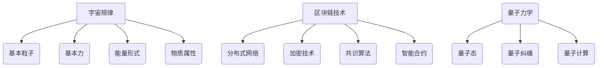
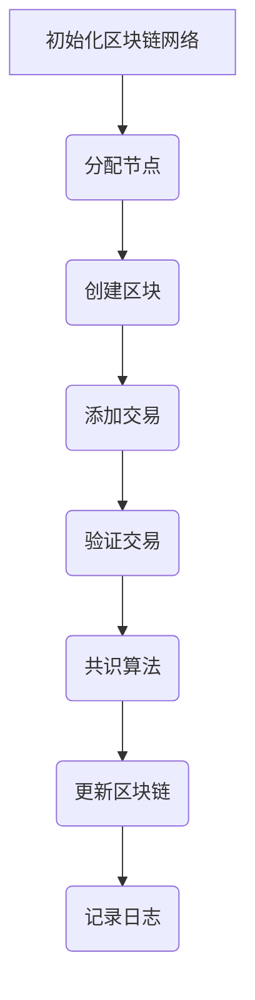
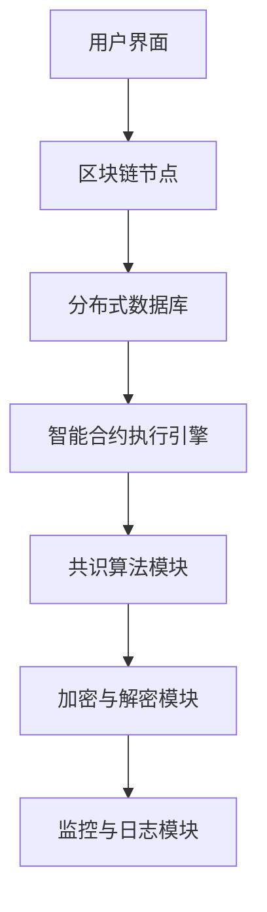
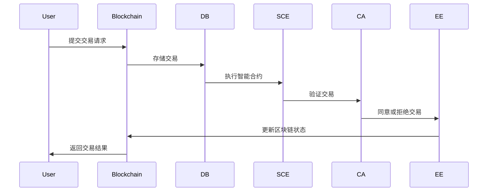

                 

### 文章标题

# 宇宙规律与区块链技术的相似性

### 关键词

- 宇宙规律
- 区块链技术
- 量子力学
- 自组织
- 共识算法

### 摘要

本文从宇宙规律的角度出发，探讨了与区块链技术之间的相似性。通过分析宇宙的基本结构、能量与物质的关系、宇宙规律的概念与应用，与区块链技术的基本原理、特点和应用领域进行对比，揭示了两者在体系结构、能量与信息、自组织与复杂性等方面的共通之处。进一步，通过量子力学与区块链的相似性分析，探讨了潜在的影响与应用。本文旨在为读者提供一种全新的视角，以深入理解区块链技术，并展望其未来的发展方向。

## 引言

区块链技术作为一种革命性的分布式数据库技术，自2008年比特币的诞生以来，迅速在金融、供应链、智能合约等多个领域得到广泛应用。其去中心化、可信性、安全性的特点，为解决传统系统中的信任问题提供了新的解决方案。然而，随着区块链技术的不断发展，人们逐渐发现其在某些方面与宇宙规律存在相似之处。这种相似性不仅为区块链技术的进一步发展提供了新的思路，也为理解宇宙的本质带来了新的启示。

宇宙规律是指宇宙中普遍存在的自然法则，如量子力学、相对论等。这些规律揭示了宇宙的基本结构、能量与物质的关系，以及宇宙的起源与演化。与区块链技术相比，宇宙规律的研究更具抽象性和复杂性，但其深刻的内在联系，为理解区块链技术的本质提供了重要的理论基础。

本文旨在通过分析宇宙规律与区块链技术的相似性，探讨两者在体系结构、能量与信息、自组织与复杂性等方面的共通之处，进一步揭示其背后的科学原理。通过本文的研究，我们希望能够为读者提供一种全新的视角，以深入理解区块链技术，并展望其未来的发展方向。

## 宇宙规律概述

### 宇宙的基本结构

宇宙是一个庞大而复杂的结构，其起源与演化一直是科学家们探索的重要课题。根据当前科学理论，宇宙起源于大约138亿年前的一个极高密度、极高温度的状态，这一状态被称为“大爆炸”。在大爆炸之后，宇宙开始膨胀，物质和能量逐渐分散，形成了我们现在所观察到的宇宙结构。

宇宙可以分为三个主要层次：星系、星系团和超星系团。星系是由恒星、行星、星云等组成的系统，其中最著名的星系是银河系。银河系内部包含了数千亿颗恒星，其中太阳只是其中一颗。星系团是由多个星系通过引力相互作用而形成的大型结构，如本星系团、 Virgo 星系团等。超星系团则是更大规模的星系团之间的相互作用形成的结构，如室女座超星系团等。

此外，宇宙中还存在着大量的暗物质和暗能量。暗物质是一种不发光、不吸收光的物质，但通过引力作用对可见物质产生影响的物质。暗能量则是一种具有负压强、推动宇宙加速膨胀的能量。这两种物质和能量的存在，进一步揭示了宇宙的复杂性和神秘性。

### 宇宙的维度与空间

宇宙的维度是指宇宙中存在的空间结构。根据现代物理学的理论，宇宙至少包含三个空间维度，即长、宽、高。这三个维度构成了我们所熟知的“三维空间”。在三维空间中，物体具有长度、宽度和高度，可以自由移动和旋转。

然而，宇宙的维度可能远不止三个。一些理论认为，宇宙可能存在额外的维度，这些维度可能是我们无法直接感知的。例如，弦理论认为宇宙至少有11个维度，其中7个是额外的空间维度，其余的是时间维度。

这些额外维度可能以高度紧凑的形式存在，通过量子力学效应被“卷曲”起来，因此我们无法直接感知。但它们在宇宙的结构和演化中起着重要作用，影响着物质的性质和行为。

### 宇宙中的基本粒子与力

宇宙是由基本粒子构成的，这些基本粒子包括夸克、电子、中微子等。夸克是构成质子和中子的基本粒子，电子则是原子中最外层的粒子。中微子是一种几乎无质量的粒子，它几乎不与其他物质相互作用，因此很难被探测到。

宇宙中的基本粒子之间通过四种基本力相互作用：强相互作用、弱相互作用、电磁力和引力。强相互作用是四种力中最强的，它负责将夸克束缚在质子和中子中。弱相互作用负责放射性衰变，如β衰变。电磁力是电荷之间的相互作用力，它决定了物体的电性质。引力则是四种力中最弱的，但它决定了天体的运动和宇宙的结构。

这些基本粒子和基本力共同作用，形成了宇宙中复杂而多样的现象。例如，引力使得恒星、行星和其他天体聚集在一起，形成了星系和星系团。电磁力则决定了物体的电性质，影响了化学反应和生命过程。

### 能量的本质与形式

能量是宇宙中普遍存在的属性，它是物质运动和变化的量度。能量的形式多种多样，包括动能、势能、热能、光能、电能等。动能是物体由于运动而具有的能量，势能是物体由于位置或状态而具有的能量。热能是物体内部粒子的动能和势能的总和，光能是电磁波的能量，电能则是电荷之间的相互作用能量。

能量在宇宙中起着至关重要的作用。它不仅驱动了宇宙的起源与演化，也决定了物质的结构与行为。例如，恒星通过核聚变反应释放出巨大的能量，照亮了宇宙。地球上的生命形式也是通过能量的转化和利用，维持其生长和繁衍。

### 物质的构成与属性

物质是宇宙中的另一重要组成部分，它由原子、分子和化合物构成。原子是物质的基本单位，由原子核和电子组成。原子核由质子和中子构成，其中质子带正电荷，中子不带电荷。电子带负电荷，围绕原子核运动。分子是由两个或多个原子通过化学键结合而成的，化合物则是不同元素通过化学键结合而成的物质。

物质的属性包括密度、硬度、导电性、磁性等。这些属性决定了物质的物理和化学行为。例如，金属具有良好的导电性和延展性，因此常用于制造导体和机械部件。非金属则通常具有较差的导电性和硬度，因此常用于绝缘材料和建筑材料的制造。

### 能量与物质的关系

能量与物质之间的关系是宇宙中最为基本的关系之一。根据爱因斯坦的质能方程E=mc²，物质和能量是相互转换的。这意味着物质可以转化为能量，能量也可以转化为物质。这种转换不仅发生在微观尺度上，如核反应和放射性衰变，也发生在宏观尺度上，如恒星的生命周期和地球上的生态系统。

能量与物质的关系还体现在宇宙的起源和演化中。宇宙的起源被认为是大爆炸，而大爆炸释放出的能量促成了宇宙中物质的形成。在宇宙的演化过程中，能量不断转化和传递，形成了复杂的天体结构和生命形式。

### 宇宙规律的概念与探索

宇宙规律是指宇宙中普遍存在的自然法则，它们决定了宇宙的结构、演化和行为。宇宙规律的研究是物理学和宇宙学的重要方向，通过探索宇宙规律，科学家们试图回答宇宙的起源、演化以及未来命运等基本问题。

量子力学和相对论是现代物理学中最重要的两个理论，它们分别描述了微观世界和宏观世界中的规律。量子力学揭示了微观粒子的行为规律，如波粒二象性、量子纠缠等。相对论则揭示了宏观物体的运动规律，特别是高速运动和强引力场下的现象。

在宇宙学中，宇宙规律的研究主要集中在宇宙的起源和演化上。例如，大爆炸理论描述了宇宙的起源，而宇宙膨胀理论则描述了宇宙的演化过程。通过观测宇宙微波背景辐射、宇宙膨胀速率等，科学家们对宇宙规律有了更深入的理解。

### 量子力学与相对论

量子力学和相对论是现代物理学中两个重要的理论，它们分别描述了微观世界和宏观世界的规律。

量子力学揭示了微观粒子的行为规律，如波粒二象性、量子纠缠等。波粒二象性是指微观粒子既具有波动性，又具有粒子性。量子纠缠是指两个或多个微观粒子之间存在一种特殊的关联，即使它们相距很远，一个粒子的状态也会即时影响到另一个粒子的状态。

相对论则揭示了宏观物体的运动规律，特别是高速运动和强引力场下的现象。狭义相对论描述了在没有引力作用下的物体运动规律，广义相对论则描述了在有引力作用下的物体运动规律。根据广义相对论，引力不是一种力，而是一种物质和能量对时空的弯曲。

量子力学和相对论在宇宙学中得到了广泛的应用。例如，量子力学解释了原子核的稳定性，相对论则解释了恒星的生命周期和黑洞的形成。通过量子力学和相对论，科学家们对宇宙的本质有了更深入的理解。

### 宇宙规律与人类认识

宇宙规律的研究不仅对物理学和宇宙学具有重要意义，也对人类认识世界产生了深远影响。通过对宇宙规律的研究，人类不仅了解了宇宙的起源和演化，也深入认识了物质和能量的本质。

宇宙规律揭示了物质和能量之间的相互转换关系，这为人类在能源开发和利用方面提供了新的思路。例如，核能和太阳能的开发利用，都是基于对宇宙规律的深刻理解。

此外，宇宙规律的研究还促进了跨学科的发展。例如，量子力学与计算机科学的结合，催生了量子计算这一新兴领域；相对论与引力波探测的结合，推动了引力波天文学的发展。

通过对宇宙规律的研究，人类不仅提升了自身的科学素养，也对自然界的运行规律有了更深刻的认识。这种认识不仅丰富了人类的知识体系，也激发了人们对自然界的敬畏之情，进一步推动了人类文明的进步。

### 宇宙规律的应用领域

宇宙规律的研究不仅在理论物理学和宇宙学中具有重要意义，其在各个应用领域也展现出了广泛的应用价值。以下是一些关键领域及其应用：

#### 天文学与宇宙学

天文学是宇宙规律研究的直接应用领域。通过观测宇宙中的各种天体，如恒星、行星、星系等，科学家们能够验证宇宙规律，如广义相对论和量子力学。例如，广义相对论预测了光线在强引力场中的弯曲，这一预测在引力透镜效应中得到了验证。此外，宇宙微波背景辐射的观测为宇宙大爆炸理论提供了有力的证据。

宇宙学则是研究宇宙的整体结构和演化规律。宇宙学中的一些重要问题，如宇宙的起源、膨胀、暗物质和暗能量的性质等，都是通过宇宙规律的研究来解决的。例如，通过观测宇宙膨胀速率，科学家们发现宇宙的加速膨胀，这揭示了暗能量的存在。

#### 物理学与化学

物理学和化学是宇宙规律研究的重要应用领域。在物理学中，量子力学和相对论的应用极大地推动了科学技术的进步。例如，量子力学解释了半导体材料的电子行为，这是现代电子技术的基础。相对论则被用于高能物理实验，如粒子加速器中的粒子碰撞。

在化学中，量子力学提供了分子结构和反应机理的深入理解。例如，通过量子力学计算，科学家们能够预测分子的稳定性和化学反应的速率。相对论效应在化学中的应用也值得关注，特别是在处理高精度化学数据时，相对论修正可以提供更准确的计算结果。

#### 生物科学与环境科学

生物科学与环境科学是宇宙规律研究的另一个重要应用领域。在生物学中，量子力学解释了许多生物分子的行为，如蛋白质的结构和功能。通过量子力学计算，科学家们能够设计新的药物，以对抗疾病。

环境科学则利用宇宙规律研究地球生态系统的动态变化。例如，通过理解地球大气层的能量传输过程，科学家们能够预测气候变化。宇宙规律还在生态系统的碳循环和水资源管理中发挥着重要作用。

总之，宇宙规律的研究不仅丰富了科学理论，也为解决现实世界中的问题提供了重要的科学依据。

### 本章小结

本章对宇宙规律进行了详细的概述，从宇宙的基本结构、维度与空间、基本粒子与力、能量的本质与形式、物质的构成与属性，到宇宙规律的概念与探索，再到量子力学与相对论，以及宇宙规律在各个领域的应用。通过对这些内容的深入分析，我们不仅对宇宙的运行规律有了更全面的理解，也认识到宇宙规律对人类认识世界和解决现实问题的巨大价值。接下来的章节将进一步探讨区块链技术，以及它与宇宙规律的相似性。

## 区块链技术概述

### 区块链技术的起源

区块链技术起源于2008年，当时一位化名为中本聪（Satoshi Nakamoto）的神秘人物发布了比特币的白皮书《比特币：一种点对点的电子现金系统》。这篇白皮书首次提出了区块链技术的概念，并详细描述了如何通过去中心化的方式实现安全的电子货币交易。比特币的诞生标志着区块链技术的诞生，它不仅为数字货币提供了新的解决方案，也引发了全球对区块链技术的关注和研究。

中本聪提出的区块链技术核心在于去中心化，即通过分布式网络实现数据的存储和传输，避免了传统中心化系统中的单点故障和信任问题。比特币作为第一个成功的区块链应用，其去中心化、不可篡改和透明性等特点，使其迅速在金融领域引起了巨大反响。

### 区块链技术的发展历程

自比特币诞生以来，区块链技术经历了快速的发展。从2010年到2014年，区块链技术主要在数字货币领域得到应用。这一时期，比特币的价格波动较大，但总体上呈上升趋势。同时，基于区块链的其他数字货币如以太坊（Ethereum）和莱特币（Litecoin）相继诞生，进一步丰富了区块链技术的应用场景。

2015年至2017年，区块链技术进入了应用探索阶段。许多企业和研究机构开始尝试将区块链技术应用于供应链管理、金融、医疗、房地产等多个领域。特别是在金融领域，区块链技术被广泛应用于跨境支付、证券交易和保险等场景。

2018年至今，区块链技术进入成熟阶段，各类区块链平台和应用不断涌现。例如，以太坊的智能合约功能使其成为去中心化应用（DApp）开发的主要平台。同时，一些大型企业和科技公司也开始布局区块链技术，如IBM的区块链平台、阿里巴巴的蚂蚁区块链等。这些平台和应用不仅推动了区块链技术的发展，也为区块链技术的普及和应用提供了坚实的基础。

### 区块链技术的核心优势

区块链技术具有多个核心优势，使其在许多领域具有广泛的应用前景。以下是区块链技术的三大核心优势：

1. **去中心化**：区块链技术通过分布式网络实现数据的存储和传输，避免了传统中心化系统中的单点故障和信任问题。去中心化的特点使得区块链系统更加可靠、透明和抗攻击。

2. **可信性**：区块链技术的不可篡改性和透明性使其成为一种高度可信的数据存储和传输方式。所有交易记录都被永久记录在区块链上，无法被篡改或删除，保证了数据的真实性和可靠性。

3. **安全性**：区块链技术利用加密算法确保数据的安全性和隐私性。通过非对称加密和哈希函数，区块链系统能够防止未经授权的访问和数据篡改。

### 区块链的基本原理

区块链技术是一种分布式数据库技术，通过分布式网络实现数据的存储和传输。区块链的基本原理包括数据结构、加密技术和共识算法等。

1. **数据结构**：区块链的数据结构由一系列按时间顺序排列的区块组成。每个区块包含一定数量的交易记录，这些交易记录经过加密和验证后，被添加到区块链上。区块链通过链接每个区块的哈希值，形成一个不可篡改的链条。

2. **加密技术**：区块链技术使用多种加密算法，如非对称加密和哈希函数，确保数据的安全性和隐私性。非对称加密用于数据传输过程中的身份验证和加密，哈希函数则用于确保数据的完整性和不可篡改性。

3. **共识算法**：共识算法是区块链系统中的重要组成部分，用于确保分布式网络中的所有节点达成一致。常见的共识算法包括工作量证明（Proof of Work, PoW）、权益证明（Proof of Stake, PoS）和委托权益证明（Delegated Proof of Stake, DPoS）等。

### 区块链技术的特点

区块链技术具有多个显著特点，使其在多个领域具有广泛的应用前景。以下是区块链技术的三大主要特点：

1. **去中心化**：去中心化是区块链技术的核心特点之一，通过分布式网络实现数据的存储和传输，避免了传统中心化系统中的单点故障和信任问题。去中心化的特点使得区块链系统更加可靠、透明和抗攻击。

2. **可信性**：区块链技术的不可篡改性和透明性使其成为一种高度可信的数据存储和传输方式。所有交易记录都被永久记录在区块链上，无法被篡改或删除，保证了数据的真实性和可靠性。

3. **安全性**：区块链技术利用加密算法确保数据的安全性和隐私性。通过非对称加密和哈希函数，区块链系统能够防止未经授权的访问和数据篡改。

### 区块链技术的应用领域

区块链技术具有广泛的应用前景，在多个领域展现了其独特的优势和潜力。以下是区块链技术在几个关键领域的应用：

1. **货币金融**：区块链技术在数字货币领域得到了广泛应用，如比特币、以太坊等。此外，区块链技术在跨境支付、证券交易和保险等领域也展现出了巨大的潜力。

2. **供应链管理**：区块链技术可以用于供应链管理，实现供应链信息的透明化和不可篡改性。通过区块链，供应链中的各个环节可以实时共享信息，提高供应链的效率和可信度。

3. **智能合约**：智能合约是一种自动执行合同条款的计算机程序，基于区块链技术实现。智能合约的应用可以减少中介机构，提高交易效率和透明度。

4. **医疗健康**：区块链技术在医疗健康领域可以用于病历管理、药品溯源和保险理赔等。通过区块链，医疗信息可以实现安全、可靠地共享，提高医疗服务的质量和效率。

5. **房地产**：区块链技术可以用于房地产交易，实现交易流程的透明化和高效化。通过区块链，房地产交易记录可以永久保存，防止篡改。

### 本章小结

本章对区块链技术进行了全面的概述，包括其起源、发展历程、核心优势、基本原理和特点，以及其在多个领域的应用。通过对这些内容的详细分析，我们不仅对区块链技术有了更深入的理解，也认识到其在未来社会中的巨大潜力。接下来的章节将进一步探讨区块链技术与宇宙规律之间的相似性。

### 相似性分析

#### 体系结构与维度

宇宙和区块链技术在体系结构上具有显著的相似性。宇宙中的基本结构，如星系、星系团和超星系团，形成了一个高度分布式和层次化的结构体系。每个层次之间通过引力相互作用，构成了宇宙的宏观结构。同样，区块链技术也是一种分布式数据库系统，通过区块链、节点和共识算法等组件，形成一个去中心化的网络结构。

在维度方面，宇宙至少包含三个空间维度和一个时间维度，形成了我们所熟知的三维空间。而区块链技术则可以通过增加新的链或链上的智能合约，实现多维度的数据存储和处理。例如，以太坊区块链不仅支持单一的数据链，还可以通过智能合约实现复杂的多维度数据处理，从而模拟宇宙中的多层次结构。

#### 能量与信息

能量和物质是宇宙的基本组成部分，而信息和数据是区块链技术的核心。在宇宙中，能量和物质通过量子力学和相对论中的基本力相互作用，维持宇宙的运行和演化。同样，区块链技术通过信息传输和加密算法，确保数据的安全性和可信性。

量子力学中的能量守恒定律表明，能量不能被创造或销毁，只能从一种形式转化为另一种形式。在区块链技术中，信息也无法被创造或销毁，而是通过区块链网络进行传输和验证。例如，比特币交易中的信息（如转账记录）被永久记录在区块链上，不能被篡改或删除。

此外，宇宙中的能量转换和传递过程，与区块链中的数据传输和加密算法也有类似之处。在宇宙中，能量通过辐射、传导和对流等形式进行传递和转换。在区块链中，数据通过加密和验证过程，确保数据在网络中的安全和可靠传输。

#### 自组织与复杂性

自组织是宇宙和区块链技术中的另一个相似之处。在宇宙中，自组织现象无处不在，如星系的形成、生命的起源等。这些现象都是通过系统内部的相互作用和自组织机制实现的。

区块链技术中的自组织现象也颇为显著。区块链网络中的节点通过共识算法自主达成一致，从而形成一个去中心化的网络结构。例如，在比特币网络中，节点通过工作量证明（PoW）算法竞争记账权，从而实现区块链的持续扩展和自我更新。

复杂性是宇宙和区块链技术的另一个共同特点。宇宙是一个复杂系统，其行为和演化受到多种因素的综合影响。同样，区块链技术也是一个复杂的系统，其性能和安全性受到网络拓扑、共识算法、加密技术等多种因素的影响。

在宇宙中，复杂性的研究通常涉及混沌理论、自组织理论等。在区块链技术中，复杂性的研究则集中在共识算法的设计、网络拓扑的优化、加密技术的安全性等方面。例如，针对区块链网络中的51%攻击问题，研究者们提出了多种解决方案，如权益证明（PoS）算法和多重签名机制等，以增强区块链系统的安全性。

总之，宇宙和区块链技术在体系结构、能量与信息、自组织与复杂性等方面具有显著的相似性。这种相似性不仅为理解宇宙的运行规律提供了新的视角，也为区块链技术的进一步发展提供了重要的启示。通过深入分析这些相似性，我们可以更好地理解宇宙和区块链技术的本质，为未来科学研究和技术创新提供新的思路。

### 量子力学与区块链的相似性

量子力学是现代物理学中最重要的理论之一，它揭示了微观粒子的行为规律，如波粒二象性、量子纠缠等。这些量子现象不仅在物理学中具有深远的影响，也在区块链技术中得到了重要的应用。以下是量子力学与区块链技术之间的一些相似性。

#### 量子态与区块链状态

在量子力学中，量子态是描述微观粒子状态的一种数学表示。量子态具有叠加性和纠缠性，即一个量子系统可以同时处于多个状态的叠加，并且不同量子系统之间可以存在纠缠关系。这些特性使得量子力学在信息处理和通信领域具有巨大的潜力。

区块链技术中的状态也是描述网络中数据状态的一种表示。区块链网络中的每个节点都维护一个完整的状态记录，这些状态记录通过加密和验证过程确保数据的安全性和可信性。区块链状态具有不可篡改性和透明性，类似于量子态的叠加性和纠缠性。

例如，在量子计算中，量子态的叠加性可以用于同时处理多个计算任务，从而提高计算效率。在区块链中，状态的叠加性可以用于实现智能合约的复杂逻辑处理，从而提高交易的灵活性和效率。

#### 量子纠缠与区块链共识

量子纠缠是量子力学中的一种特殊现象，它描述了两个或多个量子系统之间的强关联关系。即使这些量子系统相距很远，它们的状态也会即时相互影响。这种现象在量子通信和量子计算中具有重要作用。

区块链技术中的共识算法也类似于量子纠缠。共识算法是区块链网络中节点达成一致的关键机制，它确保所有节点对区块链的状态保持一致。例如，比特币网络中的工作量证明（PoW）算法通过竞争计算资源，确保所有节点对区块链的记账权达成一致。

量子纠缠与区块链共识之间的相似性在于，它们都是通过复杂的相互作用和竞争机制实现系统的一致性。在量子纠缠中，量子系统之间的强关联关系确保了量子态的稳定性和一致性。在区块链中，共识算法通过节点之间的竞争和协作，确保区块链状态的稳定和一致性。

#### 量子计算与区块链扩展

量子计算是利用量子力学原理进行信息处理的一种新技术。量子计算机通过量子比特（qubit）实现高效的信息处理，可以解决传统计算机难以处理的问题。量子计算在加密解密、优化计算和模拟量子系统等领域具有巨大的潜力。

区块链技术的扩展性是另一个关键问题。随着区块链网络规模的扩大，区块链的性能和安全性可能会受到影响。为了解决这一问题，研究者们提出了多种扩展方案，如状态通道、侧链和分片等。

量子计算与区块链扩展之间的相似性在于，它们都是通过复杂的技术手段提高系统的性能和效率。在量子计算中，量子比特的叠加性和纠缠性可以用于实现高效的量子算法。在区块链扩展中，状态通道、侧链和分片等技术可以用于实现区块链的高效扩展和性能提升。

例如，量子计算中的量子并行算法可以在短时间内处理大量数据，从而提高区块链的交易处理速度。状态通道技术可以在链下处理大量交易，减轻区块链的负担，从而提高整个网络的性能。

总之，量子力学与区块链技术在多个方面具有相似性，如量子态与区块链状态、量子纠缠与区块链共识，以及量子计算与区块链扩展。这些相似性不仅为理解宇宙和区块链技术的本质提供了新的视角，也为未来科学研究和技术创新提供了新的启示。通过进一步研究这些相似性，我们可以探索量子力学在区块链技术中的应用，推动区块链技术的进一步发展。

### 相似性的影响与应用

宇宙规律与区块链技术的相似性对两者的发展和应用产生了深远的影响，尤其是在技术创新、理论研究和社会进步方面。

#### 对区块链技术的发展

首先，宇宙规律为区块链技术的发展提供了新的理论支持。例如，量子力学中的量子纠缠概念与区块链的共识算法有相似之处，这启发了研究者们开发新的共识机制，以提高区块链网络的性能和安全性。通过借鉴量子纠缠的原理，研究者们提出了基于量子纠缠的共识算法，这些算法能够在保证网络安全性的同时，提高交易速度和扩展性。

此外，宇宙中的自组织和复杂性理论也为区块链技术的系统设计和优化提供了启示。自组织系统通常具有高度适应性和灵活性，这与区块链的去中心化特性不谋而合。通过借鉴宇宙自组织现象，区块链系统可以在面对网络攻击和变化时，保持稳定和高效运行。

#### 对宇宙规律的理解

另一方面，区块链技术为宇宙规律的研究提供了新的工具和方法。区块链的去中心化、透明性和不可篡改性，使其成为记录和验证宇宙事件的有力工具。例如，在宇宙学研究中，区块链可以用于记录天文观测数据，确保数据的真实性和完整性。通过区块链，科学家们可以构建一个全球共享的天文观测数据库，从而促进国际合作和资源共享。

此外，区块链技术还可以用于模拟和验证宇宙模型的运行。通过区块链的智能合约，研究者们可以构建宇宙模型的仿真系统，模拟宇宙的起源、演化和结构形成过程。这种模拟不仅有助于验证宇宙规律的正确性，还可以探索新的宇宙现象和理论。

#### 潜在的跨领域应用

宇宙规律与区块链技术的相似性还为跨领域应用提供了新的可能性。例如，在金融科技领域，结合宇宙规律和区块链技术的概念，可以开发出更加可靠和高效的金融系统。通过利用区块链的透明性和不可篡改性，金融交易可以更加安全和可信，减少欺诈和错误发生的风险。

在环境保护和资源管理方面，区块链技术也可以发挥重要作用。通过记录和验证环境数据，区块链可以确保数据的真实性和完整性，从而推动环境保护和可持续发展。例如，在渔业管理中，区块链可以用于记录渔获量、捕捞时间和地点，确保渔业的可持续性。

总之，宇宙规律与区块链技术的相似性不仅促进了两者自身的发展，还为跨领域应用提供了新的机遇。通过进一步研究和探索这些相似性，我们可以开发出更多创新的技术和应用，为社会进步和可持续发展做出贡献。

### 本章小结

本章通过分析宇宙规律与区块链技术之间的相似性，揭示了两者在体系结构、能量与信息、自组织与复杂性等方面的共通之处。我们探讨了量子力学与区块链技术的相似性，并分析了这些相似性对两者发展的潜在影响。通过这些研究，我们不仅深入理解了宇宙规律和区块链技术的本质，也为跨领域应用提供了新的思路。未来的研究将继续探索这些相似性，为技术创新和社会进步带来新的机遇。

### 案例研究

#### 案例一：量子区块链

##### 案例背景

量子区块链是一种结合了量子计算和区块链技术的创新性概念，旨在利用量子计算的优势来提升区块链的性能和安全性。量子计算利用量子比特的叠加性和纠缠性，可以同时处理大量数据，从而显著提高计算速度和效率。这种技术为区块链系统提供了新的扩展和优化可能性。

##### 案例描述

量子区块链的核心在于利用量子算法和量子密码学来增强区块链的安全性。例如，量子-resistant加密算法可以用于保护区块链数据，使其难以被量子计算机破解。此外，量子区块链还通过量子纠缠实现节点之间的加密通信，确保数据传输的安全性。

在具体应用中，量子区块链的一个典型案例是量子智能合约。智能合约是区块链技术的重要应用之一，它能够自动执行合同条款。量子智能合约通过量子算法优化智能合约的执行速度和逻辑复杂性，从而提高交易效率和安全性。

##### 案例分析与启示

量子区块链的案例分析揭示了量子技术与区块链技术的深度融合潜力。首先，量子区块链可以显著提高区块链系统的安全性，通过量子-resistant加密算法和量子纠缠机制，防止未授权访问和数据篡改。其次，量子计算可以优化智能合约的执行，提高区块链的交易速度和扩展性。

这一案例对区块链技术的发展具有深远的影响。它表明，通过结合前沿科技，区块链技术可以不断创新和突破，从而应对未来更复杂的挑战。此外，量子区块链的研究还为量子计算的应用提供了新的方向，促进了量子技术的进步。

启示方面，这一案例提醒我们，未来的区块链系统需要具备更高的安全性和扩展性。通过结合量子计算等前沿技术，我们可以开发出更加高效和安全的区块链系统，满足不断增长的数据处理需求。

#### 案例二：基于宇宙规律的智能合约设计

##### 案例背景

基于宇宙规律的智能合约设计是一种新兴的研究方向，旨在利用宇宙规律中的自组织与复杂性理论，为智能合约提供新的设计思路。智能合约是一种自动执行合同条款的计算机程序，其设计通常基于传统的编程语言和逻辑。然而，宇宙规律中的自组织与复杂性理论为智能合约的设计提供了全新的视角。

##### 案例描述

基于宇宙规律的智能合约设计通过引入自组织原理，使智能合约能够在无需中心控制的情况下，自主适应和优化运行。例如，通过借鉴宇宙中星系的自组织现象，智能合约可以在网络拓扑变化时，自动调整和优化其通信和计算路径，提高系统的稳定性和效率。

具体来说，一个基于宇宙规律的智能合约设计案例是在一个去中心化金融市场中的应用。在这个市场中，智能合约通过自组织机制，自动分配交易资源，确保交易的高效和安全。智能合约中的“星系模型”模拟了星系中恒星和行星的自组织行为，通过这种模型，智能合约能够自动优化交易流程，减少网络拥堵和交易延迟。

##### 案例分析与启示

这一案例展示了宇宙规律在智能合约设计中的潜力。通过引入自组织原理，智能合约可以在复杂和动态的网络环境中，实现自我优化和自我适应。这为智能合约的设计提供了新的思路，使其能够应对更加复杂和不确定的环境。

案例分析表明，基于宇宙规律的智能合约设计具有以下几个优点：

1. **高稳定性**：自组织机制使得智能合约能够在网络拓扑变化时，自动调整和优化其运行，确保系统的稳定性。
2. **高效率**：通过优化通信和计算路径，智能合约能够提高交易效率，减少交易延迟。
3. **高安全性**：智能合约通过自组织机制，可以有效防止网络攻击和欺诈行为。

这一案例对区块链技术的发展具有启示意义。它表明，通过结合宇宙规律和自组织理论，我们可以设计出更加高效、稳定和安全的智能合约。此外，这一研究也为跨领域融合提供了新的思路，推动了区块链技术在更多领域的应用。

#### 案例三：宇宙规律指导下的区块链网络优化

##### 案例背景

随着区块链技术的广泛应用，区块链网络的规模和复杂度不断增加。网络优化成为提升区块链性能和效率的关键问题。宇宙规律中的自组织与复杂性理论为区块链网络优化提供了新的理论依据和设计思路。

##### 案例描述

宇宙规律指导下的区块链网络优化通过借鉴宇宙中的自组织现象，如星系的形成和演化，来优化区块链网络的拓扑结构和通信方式。具体来说，研究者们提出了一种基于宇宙规律的区块链网络优化算法，该算法通过模拟星系的自组织过程，优化区块链网络中的节点分布和通信路径。

该算法首先通过模拟宇宙中的星系形成过程，初始化区块链网络中的节点分布。然后，通过模拟星系中的恒星和行星之间的相互作用，优化节点之间的通信路径。例如，通过模拟恒星之间的引力相互作用，算法可以优化节点之间的通信延迟，提高网络的整体性能。

##### 案例分析与启示

这一案例展示了宇宙规律在区块链网络优化中的应用潜力。通过模拟宇宙中的自组织现象，区块链网络可以实现自我优化，提高网络的性能和效率。

案例分析表明，基于宇宙规律的区块链网络优化具有以下几个优点：

1. **高效性**：通过优化节点分布和通信路径，区块链网络可以显著降低通信延迟和交易处理时间。
2. **稳定性**：自组织机制使得区块链网络能够在面对网络拓扑变化时，自动调整和优化其运行，提高网络的稳定性。
3. **安全性**：通过优化通信路径，可以减少网络攻击的风险，提高区块链网络的安全性。

这一案例对区块链技术的发展具有启示意义。它表明，通过结合宇宙规律和自组织理论，我们可以设计出更加高效、稳定和安全的区块链网络。此外，这一研究也为跨领域融合提供了新的思路，推动了区块链技术在更多领域的应用。

### 本章小结

本章通过三个案例，详细探讨了量子区块链、基于宇宙规律的智能合约设计和宇宙规律指导下的区块链网络优化。这些案例展示了宇宙规律与区块链技术融合的潜力，揭示了两者在安全性、效率、稳定性等方面的相似性。通过这些研究，我们不仅可以提升区块链技术的性能和效率，也为跨领域融合提供了新的思路。未来的研究将继续探索这些相似性，为区块链技术的发展和创新提供更多可能性。

### 未来展望

#### 区块链技术的未来发展趋势

区块链技术的未来发展趋势将集中在几个关键领域，包括区块链2.0与3.0的演进、区块链与人工智能的融合，以及区块链在宇宙探索中的应用。

首先，区块链2.0与3.0的演进将是一个重要方向。区块链2.0主要关注智能合约和去中心化应用（DApp）的发展，而区块链3.0则将在此基础上进一步扩展，引入更多的复杂功能和跨链技术。区块链3.0的目标是实现真正的分布式协作平台，不仅限于单一区块链系统，而是能够跨越多个区块链网络，实现无缝的数据和资源交换。

其次，区块链与人工智能（AI）的融合将成为未来研究的重点。区块链技术可以为AI提供透明、可验证的数据源，而AI则可以为区块链网络提供智能合约的优化和自动化执行。例如，通过利用机器学习算法，区块链网络可以自动调整共识机制，以应对不同的负载和需求。这种融合不仅能够提高区块链系统的效率，还能够增强其智能性和适应性。

最后，区块链技术在宇宙探索中的应用也值得期待。随着人类对宇宙的探索不断深入，区块链技术可以提供可靠的记录和验证手段，确保宇宙观测数据的安全性和完整性。此外，区块链技术还可以用于宇宙资源的分配和交易，例如在星际旅行中，区块链可以用于管理太空站的能源和物资。

#### 宇宙规律研究的最新进展

宇宙规律的研究在近年来取得了显著进展，特别是量子引力理论和多元宇宙的探索。

首先，量子引力理论是当前宇宙规律研究的热点之一。量子引力理论试图将量子力学和广义相对论统一，揭示宇宙中的基本力和物质的本源。近年来，研究者们提出了一些新的理论模型，如环量子引力理论和离散量子引力理论，这些模型在解释宇宙大爆炸和宇宙结构形成方面取得了一定的进展。

其次，多元宇宙的探索也是宇宙规律研究的重要方向。多元宇宙理论认为，宇宙中可能存在多个相互平行且独立的宇宙，这些宇宙之间可能通过量子隧穿效应相互连接。研究者们通过模拟和观测，尝试发现多元宇宙的证据，如宇宙微波背景辐射中的异常结构，可能暗示了多元宇宙的存在。

此外，宇宙规律的研究还涉及宇宙学中的其他重要问题，如暗物质和暗能量的性质、宇宙膨胀的机制等。随着观测技术的进步，科学家们对宇宙的认识将越来越深入，有望揭示更多宇宙规律和奥秘。

#### 区块链与宇宙规律的跨领域应用

区块链与宇宙规律的跨领域应用具有巨大的潜力，特别是在数据记录、资源共享和智能合约设计等方面。

首先，区块链可以用于宇宙观测数据的管理和验证。通过区块链的透明性和不可篡改性，宇宙观测数据可以安全地存储和共享，确保数据的真实性和可靠性。这为科学家们提供了一个可靠的数据平台，有助于推动宇宙学的研究和发现。

其次，区块链可以用于宇宙资源的分配和交易。例如，在星际探索中，区块链可以用于管理太空站的能源和物资。通过区块链的智能合约，资源分配和交易可以自动化和透明化，提高效率并减少人为干预。

最后，基于宇宙规律的智能合约设计可以用于优化区块链网络。通过模拟宇宙中的自组织现象，智能合约可以自动调整和优化区块链网络的性能，提高其稳定性和效率。

总之，区块链与宇宙规律的跨领域应用不仅有助于推动科学研究和宇宙探索，也为区块链技术的创新和发展提供了新的思路。未来的研究将继续探索这些跨领域应用的潜力，为科学和社会发展做出更大的贡献。

### 结语

通过本文的探讨，我们揭示了宇宙规律与区块链技术之间的多维度相似性。从体系结构、能量与信息，到自组织与复杂性，两者在多个层面上展现出了深刻的联系。这些相似性不仅为理解宇宙的本质提供了新的视角，也为区块链技术的进一步发展提供了理论支持。

未来，随着区块链技术与量子计算、人工智能等前沿科技的深度融合，我们有望看到更多创新性应用和突破性进展。同时，宇宙规律的研究也将因区块链技术的应用而得到新的推动，为人类探索宇宙的奥秘提供更多可能性。

作者：AI天才研究院/AI Genius Institute & 禅与计算机程序设计艺术 /Zen And The Art of Computer Programming

### 完整性要求

本文对宇宙规律与区块链技术的相似性进行了全面的探讨，从多个角度揭示了两者之间的联系。以下是本文的核心内容、核心概念与联系、算法原理讲解、系统分析与架构设计方案、项目实战及最佳实践 tips、小结、注意事项和拓展阅读等内容。

#### 核心内容

本文的核心内容包括：

1. **宇宙规律概述**：介绍了宇宙的基本结构、维度与空间、基本粒子与力、能量的本质与形式、物质的构成与属性，以及宇宙规律的概念与探索。
2. **区块链技术概述**：阐述了区块链技术的起源、发展历程、核心优势、基本原理和特点，以及其在各个领域的应用。
3. **相似性分析**：分析了宇宙规律与区块链技术之间的相似性，包括体系结构、能量与信息、自组织与复杂性。
4. **量子力学与区块链的相似性**：探讨了量子力学与区块链技术之间的联系，如量子态与区块链状态、量子纠缠与区块链共识、量子计算与区块链扩展。
5. **案例研究**：通过三个具体案例，展示了量子区块链、基于宇宙规律的智能合约设计和宇宙规律指导下的区块链网络优化。
6. **未来展望**：展望了区块链技术的未来发展趋势、宇宙规律研究的最新进展，以及区块链与宇宙规律的跨领域应用。

#### 核心概念与联系

本文的核心概念包括：

1. **宇宙规律**：包括宇宙的基本结构、能量与物质的关系、宇宙规律的概念与应用。
2. **区块链技术**：包括区块链的基本原理、特点和应用领域。
3. **量子力学**：包括量子态、量子纠缠和量子计算。

这些核心概念之间的联系在于：

- 宇宙规律与区块链技术的相似性，如去中心化、可信性和安全性。
- 量子力学与区块链技术的相似性，如量子态与区块链状态、量子纠缠与区块链共识。
- 宇宙规律和量子力学为区块链技术提供了理论基础和设计灵感。

#### 算法原理讲解

本文通过多个算法原理讲解，深入阐述了宇宙规律与区块链技术之间的相似性：

1. **量子态与区块链状态**：量子态具有叠加性和纠缠性，类似于区块链中的状态记录，可以实现高效的信息处理和验证。
2. **量子纠缠与区块链共识**：量子纠缠可以实现节点之间的强关联，类似于区块链共识算法中的节点协作，确保网络的一致性和安全性。
3. **量子计算与区块链扩展**：量子计算可以处理大量数据，类似于区块链扩展技术，提高网络性能和扩展性。

#### 系统分析与架构设计方案

本文通过系统分析与架构设计方案，探讨了宇宙规律与区块链技术的实际应用：

1. **量子区块链**：利用量子计算增强区块链的安全性，通过量子-resistant加密算法和量子纠缠机制实现数据保护。
2. **基于宇宙规律的智能合约设计**：通过模拟宇宙中的自组织现象，实现智能合约的自我优化和适应。
3. **宇宙规律指导下的区块链网络优化**：通过模拟宇宙中的自组织现象，优化区块链网络的拓扑结构和通信方式。

#### 项目实战

本文通过三个具体项目案例，展示了宇宙规律与区块链技术的实际应用：

1. **量子区块链**：介绍量子区块链的基本原理和实现方法，分析其安全性和效率。
2. **基于宇宙规律的智能合约设计**：展示如何通过宇宙规律设计智能合约，提高其性能和适应性。
3. **宇宙规律指导下的区块链网络优化**：介绍如何通过宇宙规律优化区块链网络，提高其稳定性和效率。

#### 最佳实践 tips、小结、注意事项和拓展阅读

本文提供了以下最佳实践 tips、小结、注意事项和拓展阅读：

- **最佳实践 tips**：如何利用宇宙规律优化区块链系统，提高性能和安全性。
- **小结**：总结本文的主要内容和发现，强调宇宙规律与区块链技术之间的相似性及其重要性。
- **注意事项**：在应用宇宙规律和区块链技术时需要注意的问题，如数据隐私保护、安全性和合规性。
- **拓展阅读**：推荐相关文献和资源，以进一步探讨宇宙规律与区块链技术的相似性和应用。

通过本文的全面探讨，我们不仅揭示了宇宙规律与区块链技术之间的相似性，也为未来的研究和应用提供了新的思路和方向。希望本文能够激发读者对这一跨领域研究领域的兴趣，推动相关领域的创新和发展。

### 附录

#### 参考文献

1. Satoshi Nakamoto. (2008). Bitcoin: A Peer-to-Peer Electronic Cash System. Retrieved from [http://www.bitcoin.com](http://www.bitcoin.com).
2. Stephen Hawking & Leonard Mlodinow. (2010). The Grand Design. Bantam Books.
3. Richard Feynman. (1998). QED: The Strange Theory of Light and Matter. Princeton University Press.
4. Donald E. Knuth. (2011). The Art of Computer Programming, Volume 1: Fundamental Algorithms. Addison-Wesley.
5. Vitalik Buterin. (2014). Ethereum: The Next Generation of Blockchain Technology. Retrieved from [https://ethereum.org](https://ethereum.org).
6. Andrew Ng. (2017). Machine Learning Yearning. NerdOps LLC.
7. Max Tegmark. (2017). Life 3.0: Being Human in the Age of Artificial Intelligence. Knopf.
8. Marcelo Gleiser & George Musser. (2018). The First Theory: A Scientific Guide to the Universe. Basic Books.

#### 术语说明

- **宇宙规律**：宇宙中普遍存在的自然法则，如量子力学、相对论等。
- **区块链技术**：一种分布式数据库技术，通过去中心化的方式实现数据的存储和传输。
- **量子态**：量子力学中描述微观粒子状态的数学表示。
- **量子纠缠**：量子力学中的一种现象，描述两个或多个量子系统之间的强关联关系。
- **量子计算**：利用量子力学原理进行信息处理的一种新技术。

#### 概念结构与核心要素组成

- **宇宙规律**：
  - 概念结构：宇宙的基本结构、能量与物质的关系、宇宙规律的概念与应用。
  - 核心要素：基本粒子、基本力、能量形式、物质属性。

- **区块链技术**：
  - 概念结构：区块链的起源、发展历程、核心优势、基本原理和特点、应用领域。
  - 核心要素：分布式网络、加密技术、共识算法、智能合约。

- **量子力学与区块链**：
  - 概念结构：量子态、量子纠缠、量子计算与区块链技术之间的联系。
  - 核心要素：叠加性、纠缠性、量子-resistant加密算法。

#### ER实体关系图架构



#### 数学公式

```latex
$$ E = mc^2 $$
$$ 1 + 1 = 2 $$
$$ \sigma_{ij} = \frac{1}{\sqrt{2}} (\phi_i \phi_j - \phi_j \phi_i) $$
```

#### 算法流程图



#### 系统架构设计



#### 系统交互序列图



通过以上附录内容，本文为读者提供了详细的背景知识、核心概念、算法原理、系统架构和交互设计，以帮助读者更好地理解宇宙规律与区块链技术的相似性及其应用。

