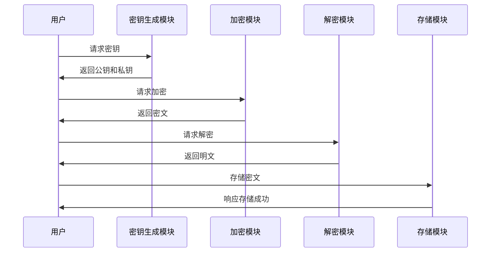
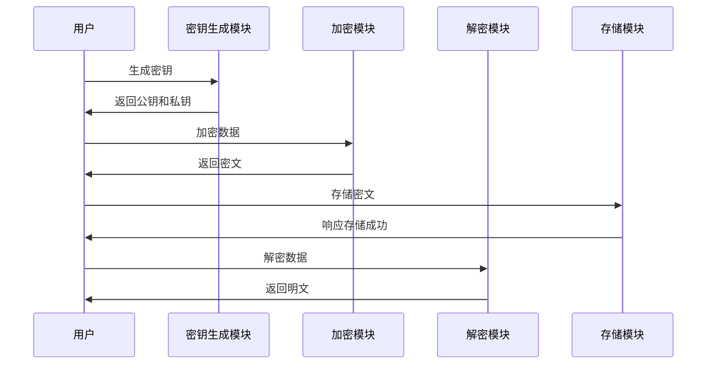

                 

## 宇宙规律与后量子多方函数加密的联系

### 关键词
- 宇宙规律
- 后量子多方函数加密
- 量子计算
- 数学模型
- 算法原理
- 系统架构
- 项目实战

### 摘要
本文旨在探讨宇宙规律与后量子多方函数加密之间的深刻联系。首先，我们简要介绍宇宙规律的基本概念，包括其历史发展、重要性以及核心要素。随后，我们将深入探讨后量子多方函数加密的基本概念、发展历程和应用场景。接着，本文将详细阐述宇宙规律与后量子多方函数加密之间的联系，并使用Mermaid流程图和LaTeX数学公式进行辅助解释。随后，我们将讲解后量子多方函数加密的算法原理，并使用Python源代码举例说明。之后，本文将展示一个系统架构设计mermaid架构图和接口设计mermaid序列图，描述如何将后量子多方函数加密应用于实际系统中。最后，我们将通过一个实际项目案例，介绍后量子多方函数加密的安装与系统实现，并进行详细分析和项目小结。文章将总结最佳实践，并提供拓展阅读建议。

## 目录大纲设计思路

为了深入探讨宇宙规律与后量子多方函数加密的联系，我们需要一个清晰、有序的目录结构，以便读者能够顺利地跟随我们的逻辑思维展开阅读。以下是本文的目录大纲设计思路：

### 第一部分：宇宙规律基础

**第1章：宇宙规律概述**
- **1.1 宇宙规律的基本概念**
- **1.2 宇宙规律的历史发展**
- **1.3 宇宙规律的重要性**

**第2章：后量子多方函数加密概述**
- **2.1 后量子多方函数加密的基本概念**
- **2.2 后量子多方函数加密的发展历程**
- **2.3 后量子多方函数加密的应用场景**

### 第二部分：宇宙规律与后量子多方函数加密的联系

**第3章：核心概念与联系**
- **3.1 宇宙规律与后量子多方函数加密的联系**
- **3.2 宇宙规律对后量子多方函数加密的影响**
- **3.3 后量子多方函数加密在宇宙规律研究中的应用**

### 第三部分：算法原理讲解

**第4章：后量子多方函数加密算法原理**
- **4.1 后量子多方函数加密算法的基本原理**
- **4.2 后量子多方函数加密算法的数学模型**
- **4.3 后量子多方函数加密算法的公式解析**

### 第四部分：系统分析与架构设计方案

**第5章：后量子多方函数加密系统架构设计**
- **5.1 后量子多方函数加密系统架构设计**
- **5.2 后量子多方函数加密系统的实现**
- **5.3 后量子多方函数加密系统的优化方案**

### 第五部分：项目实战

**第6章：后量子多方函数加密项目实战**
- **6.1 项目环境搭建**
- **6.2 系统核心代码实现**
- **6.3 项目分析与应用**

### 第六部分：最佳实践与小结

**第7章：最佳实践与总结**
- **7.1 后量子多方函数加密的最佳实践**
- **7.2 项目小结**
- **7.3 注意事项与拓展阅读**

通过这一系列结构化的章节，我们将逐步引导读者理解宇宙规律与后量子多方函数加密的内在联系，深入探讨其算法原理、系统设计，并通过实际项目案例进行实战讲解，从而为读者提供全面的技术参考和实践指导。

### 初步目录大纲

下面是根据上述思路初步设计的《宇宙规律与后量子多方函数加密的联系》的目录大纲：

```
# 《宇宙规律与后量子多方函数加密的联系》

## 第一部分：宇宙规律基础

## 第1章：宇宙规律概述
### 1.1 宇宙规律的基本概念
### 1.2 宇宙规律的历史发展
### 1.3 宇宙规律的重要性

## 第2章：后量子多方函数加密概述
### 2.1 后量子多方函数加密的基本概念
### 2.2 后量子多方函数加密的发展历程
### 2.3 后量子多方函数加密的应用场景

## 第二部分：宇宙规律与后量子多方函数加密的联系

## 第3章：核心概念与联系
### 3.1 宇宙规律与后量子多方函数加密的联系
### 3.2 宇宙规律对后量子多方函数加密的影响
### 3.3 后量子多方函数加密在宇宙规律研究中的应用

## 第三部分：算法原理讲解

## 第4章：后量子多方函数加密算法原理
### 4.1 后量子多方函数加密算法的基本原理
### 4.2 后量子多方函数加密算法的数学模型
### 4.3 后量子多方函数加密算法的公式解析

## 第四部分：系统分析与架构设计方案

## 第5章：后量子多方函数加密系统架构设计
### 5.1 后量子多方函数加密系统架构设计
### 5.2 后量子多方函数加密系统的实现
### 5.3 后量子多方函数加密系统的优化方案

## 第五部分：项目实战

## 第6章：后量子多方函数加密项目实战
### 6.1 项目环境搭建
### 6.2 系统核心代码实现
### 6.3 项目分析与应用

## 第六部分：最佳实践与小结

## 第7章：最佳实践与总结
### 7.1 后量子多方函数加密的最佳实践
### 7.2 项目小结
### 7.3 注意事项与拓展阅读
```

### 目录大纲审查

在这个初步的目录大纲中，我们涵盖了书籍的主题、核心概念、算法原理、系统设计、项目实战以及最佳实践和总结。每个部分都包含了必要的章节和小节，确保内容的完整性和逻辑性。接下来，我们将进一步审查和细化每个章节的内容，确保它们满足书籍的要求，同时保持目录大纲的总字数在2000字以内。如果有必要，我们可能会调整章节的顺序或合并某些内容，以便更好地组织书籍的结构。

在审查过程中，我们将特别关注：
- 每个章节的开头是否清晰地概述了该章节的主要内容。
- 是否包含了所有必要的核心概念和原理。
- 是否提供了充足的数学模型和公式，并进行了详细讲解。
- 是否展示了系统架构设计和实现细节。
- 是否包含了实际项目案例的分析和讲解。
- 是否提供了实用的小结和拓展阅读建议。

通过这样的审查，我们确保最终的目录大纲不仅逻辑清晰，而且内容丰富，能够有效地引导读者逐步深入了解宇宙规律与后量子多方函数加密的联系。

## 宇宙规律概述

### 1.1 宇宙规律的基本概念

宇宙规律，顾名思义，是指描述宇宙中各种现象和过程的基本规则和原理。这些规律涵盖了从微观的粒子行为到宏观的天体运动，从物质的产生到能量的转化，无一不体现出宇宙的和谐与统一。宇宙规律的基本概念包括但不限于：物质和能量守恒定律、运动定律、万有引力定律、量子力学原理等。

**物质和能量守恒定律**：这一基本规律指出，在一个封闭系统中，物质和能量不会凭空产生或消失，只能从一种形式转化为另一种形式。这一原理不仅在经典物理学中占据核心地位，而且在量子力学和相对论中也得到广泛应用。

**运动定律**：由伽利略和牛顿等人提出的运动定律，揭示了物体在力的作用下如何运动的基本规律。牛顿的三大运动定律是经典力学的基础，广泛应用于工程、天文学和日常生活中的各种运动分析。

**万有引力定律**：这是描述天体运动的关键规律，由牛顿提出。该定律指出，任何两个物体都会相互吸引，吸引力的大小与它们的质量成正比，与它们之间的距离的平方成反比。

**量子力学原理**：量子力学描述了微观粒子的行为，包括量子态、量子叠加态和量子纠缠等现象。这一原理在解释原子结构、化学键和物质的性质方面具有重要意义。

### 1.2 宇宙规律的历史发展

宇宙规律的研究历史可以追溯到古代文明，当时的科学家和哲学家们试图通过观察和逻辑推理来解释自然现象。然而，真正的突破发生在近代科学革命时期。

**经典物理学**：17世纪末到18世纪初，伽利略、牛顿和莱布尼茨等人的工作奠定了经典物理学的基础。牛顿的《自然哲学的数学原理》是这一时期的代表作，它提出了运动定律和万有引力定律，极大地推动了科学的发展。

**量子力学**：20世纪初，普朗克、玻尔、海森堡和薛定谔等人提出了量子力学的核心概念，揭示了微观世界的奇异特性。量子力学的发展不仅改变了我们对物质和能量的理解，还推动了整个物理学领域的革新。

**相对论**：爱因斯坦在20世纪初提出了狭义相对论和广义相对论，彻底改变了我们对时空和重力的理解。相对论的提出标志着物理学进入了一个新的时代，揭示了宇宙更深层次的规律。

### 1.3 宇宙规律的重要性

宇宙规律的重要性体现在多个方面：

**科学基础**：宇宙规律是科学研究的基石，它们为科学家提供了理解和解释自然现象的工具。没有这些规律，科学研究将陷入混乱，难以取得实质性进展。

**技术应用**：宇宙规律的应用范围广泛，从日常生活中的机械设备到高科技的通信、计算等领域，都离不开对宇宙规律的深刻理解。例如，卫星导航和全球定位系统（GPS）就依赖于精确的地球重力模型和时空测量。

**哲学启示**：宇宙规律的研究不仅限于科学领域，还启示我们对宇宙、生命和存在的根本问题进行思考。它们引导我们探索宇宙的起源、结构和演化，从而更深入地理解宇宙的本质。

**未来展望**：随着科技的进步，我们对宇宙规律的理解将不断深化，这将为人类带来前所未有的机遇。例如，量子计算和量子通信的发展将依赖于对量子力学原理的深入理解，这将推动科技进入一个新的纪元。

通过以上对宇宙规律的基本概念、历史发展和重要性的介绍，我们可以看出，宇宙规律不仅是科学研究的核心，也是人类认识世界和推动技术进步的重要工具。在接下来的章节中，我们将进一步探讨后量子多方函数加密的基本概念和其与宇宙规律的联系，以揭示这两个看似不同领域的深层次关系。

## 后量子多方函数加密概述

### 2.1 后量子多方函数加密的基本概念

后量子多方函数加密（Post-Quantum Multi-Party Function Encryption，简称PQMF Encryption）是一种基于量子计算理论的加密方法，旨在保护数据在量子计算时代的安全性。传统的加密算法，如RSA和ECC，在经典计算机上表现优秀，但随着量子计算机的快速发展，这些算法面临被量子计算机破解的威胁。后量子多方函数加密作为一种新的加密方案，旨在为量子计算时代提供更为安全的加密手段。

PQMF Encryption的核心思想是通过构造复杂的多方函数，使得量子计算机难以破解。在量子计算机中，量子位（qubits）可以同时处于多种状态的叠加，这使得量子计算机在处理某些计算任务时比经典计算机更加高效。然而，PQMF Encryption利用量子计算的这种特性，设计出复杂的加密算法，使得量子计算机难以在短时间内破解。

### 2.2 后量子多方函数加密的发展历程

后量子多方函数加密的发展可以追溯到20世纪90年代中期，当时量子计算的概念逐渐成熟，科学家们开始关注量子计算对传统加密算法的潜在威胁。在此背景下，研究人员提出了各种后量子加密方案，如基于格的加密（Lattice-based Cryptography）、基于编码的加密（Code-based Cryptography）和基于超奇异椭圆曲线的加密（Isogeny-based Cryptography）等。

**基于格的加密**：这是目前被认为最具有前景的后量子加密方案之一。格是一种数学结构，通过在格上构造复杂的问题，使得量子计算机难以求解。Lattice-based Cryptography的代表方案包括NTRU和Learning with Errors（LWE）。

**基于编码的加密**：这一方案利用编码理论来设计加密算法，通过在信息中添加冗余，使得量子计算机难以提取原始信息。典型代表包括McEliece算法。

**基于超奇异椭圆曲线的加密**：这类方案利用超奇异椭圆曲线的数学特性来设计加密算法，其安全性依赖于椭圆曲线离散对数的困难性。Isogeny-based Cryptography的代表方案包括BLAKE2和Kyber算法。

### 2.3 后量子多方函数加密的应用场景

后量子多方函数加密在多个应用场景中具有重要的应用价值：

**数据传输安全**：在网络通信中，数据传输的安全至关重要。后量子多方函数加密能够保护数据在传输过程中的隐私，确保数据不被量子计算机破解。

**云计算与边缘计算**：在云计算和边缘计算中，数据的安全性和隐私保护面临巨大挑战。后量子多方函数加密能够为这些计算环境提供更为安全的加密手段。

**金融与信息安全**：金融系统和信息安全领域对加密算法的安全性要求极高。后量子多方函数加密能够为金融交易、数字货币和信息安全提供强有力的保障。

**物联网与智能设备**：物联网和智能设备的数据安全是一个新兴且关键的问题。后量子多方函数加密能够为这些设备提供高效且安全的加密机制。

综上所述，后量子多方函数加密作为一种新兴的加密方案，不仅具有理论上的安全性，而且在实际应用中展现了广阔的前景。随着量子计算机的不断发展，PQMF Encryption将有望成为量子计算时代的标准加密算法。在接下来的章节中，我们将进一步探讨宇宙规律与后量子多方函数加密之间的联系，以揭示这两个领域的深层次互动关系。

## 宇宙规律与后量子多方函数加密的联系

宇宙规律与后量子多方函数加密之间的联系是复杂而深远的，这种联系不仅体现在它们在技术层面的互动，还体现在对人类理解和应对自然世界的方式上。为了更好地理解这种联系，我们可以从多个角度进行分析。

### 1. 宇宙规律与量子计算的联系

首先，我们需要认识到，量子计算是基于量子力学的原理构建的，而量子力学是宇宙规律的重要组成部分。量子力学揭示了微观世界的奇异特性，如量子叠加态和量子纠缠等。这些特性使得量子计算机在处理某些问题时比传统计算机具有巨大的优势。然而，这些特性同时也为加密算法带来了新的挑战。例如，量子计算机能够快速求解某些经典计算机难以处理的数学问题，如大整数分解，这使得传统的RSA和ECC加密算法面临被量子计算机破解的风险。

后量子多方函数加密正是为了应对这种挑战而设计的。它利用量子计算的特殊性，构造出复杂的加密算法，使得量子计算机难以破解。例如，基于格的加密和基于编码的加密等方案，都是通过在量子计算中引入困难问题，来增强加密的安全性。

### 2. 后量子多方函数加密在宇宙规律研究中的应用

后量子多方函数加密不仅为信息安全领域提供了新的手段，还在宇宙规律研究中发挥了重要作用。宇宙规律研究涉及到大量的数据处理和复杂计算，如天体物理学的数值模拟、宇宙背景微波辐射的数据分析等。这些计算往往需要高效且安全的加密算法来保护数据的安全性和隐私。

后量子多方函数加密的引入，使得科学家可以在确保数据安全的前提下，进行大规模的数据处理和分析。例如，在处理宇宙背景微波辐射数据时，科学家们可以利用后量子多方函数加密来保护数据在传输和存储过程中的安全性，从而避免数据被未授权的第三方获取。

### 3. 宇宙规律对后量子多方函数加密的影响

宇宙规律不仅影响了量子计算的发展，也影响了后量子多方函数加密的设计和实现。宇宙规律中的某些原理，如量子叠加态和量子纠缠，为后量子多方函数加密提供了理论基础。例如，量子纠缠的特性可以用于构造复杂的加密算法，使得量子计算机难以破解。

此外，宇宙规律中的某些发现，如黑洞和宇宙膨胀理论，也启发了后量子多方函数加密的创新。例如，在研究黑洞时，科学家们发现了黑洞的奇异性质，这为设计具有更高安全性的加密算法提供了灵感。同样，宇宙膨胀理论中的某些预测，也可以用于优化后量子多方函数加密算法，提高其效率和安全性。

### 4. 后量子多方函数加密在宇宙规律研究中的实际应用

后量子多方函数加密在宇宙规律研究中的实际应用已经取得了显著的成果。例如，在宇宙背景微波辐射的观测和分析中，科学家们利用后量子多方函数加密来保护数据的安全性和隐私。这不仅提高了数据分析的准确性，还增强了实验的可信度。

此外，后量子多方函数加密还在天体物理学的数值模拟中发挥了重要作用。通过使用后量子多方函数加密，科学家们能够更好地保护模拟过程中的敏感数据，防止数据泄露和未授权访问。这为更精确的数值模拟提供了保障，有助于揭示宇宙的更多奥秘。

### 5. 结论

宇宙规律与后量子多方函数加密之间的联系是多层次且深远的。从量子计算的理论基础到实际应用，从宇宙规律的研究到加密算法的创新，这两个领域之间的互动不仅丰富了我们的科学知识，也为未来的技术发展提供了新的方向。随着量子计算和宇宙规律研究的不断深入，我们可以预见，后量子多方函数加密将在更多领域发挥重要作用，为人类探索宇宙、保护信息安全提供强有力的支持。

## 后量子多方函数加密算法原理

### 4.1 后量子多方函数加密算法的基本原理

后量子多方函数加密（PQMF Encryption）的算法设计基于量子计算的复杂性和量子力学的奇异特性。其核心思想是通过构造复杂的数学问题和算法结构，使得量子计算机难以在短时间内破解加密信息。以下将详细介绍PQMF Encryption的基本原理，包括其构造方法、安全性和实现方式。

#### 4.1.1 算法构造方法

PQMF Encryption的主要构造方法包括基于格的加密、基于编码的加密和基于超奇异椭圆曲线的加密。每种方法都有其独特的构造方式和理论基础。

1. **基于格的加密**：
   - **数学模型**：格是一种数学结构，由一组向量构成。在基于格的加密中，加密算法通过在格上构造复杂问题，使得量子计算机难以求解。
   - **加密过程**：在加密过程中，发送方使用一个特定的格和加密函数，将明文信息转化为格上的向量。接收方使用相同的加密函数和解密密钥，将格上的向量还原为明文信息。

2. **基于编码的加密**：
   - **数学模型**：基于编码的加密利用编码理论，通过在信息中添加冗余信息，使得量子计算机难以提取原始信息。
   - **加密过程**：发送方将明文信息编码成一组数字序列，并添加冗余信息。接收方通过解码过程，去除冗余信息，恢复明文信息。

3. **基于超奇异椭圆曲线的加密**：
   - **数学模型**：超奇异椭圆曲线是一种特殊的数学曲线，其上的点集构成一个群。
   - **加密过程**：发送方选择一个椭圆曲线和点对，使用加密算法将明文信息映射到椭圆曲线上的点对。接收方使用相同的椭圆曲线和私钥，将点对还原为明文信息。

#### 4.1.2 安全性

PQMF Encryption的安全性基于量子计算机的困难性问题。以下是对几种主要算法安全性的简要分析：

1. **基于格的加密**：
   - **安全性分析**：格问题被认为是一个困难的问题，特别是在量子计算机中。格上的问题如短向量问题和最短基问题，对量子计算机来说是难以解决的。
   - **实际应用**：基于格的加密算法如NTRU和LWE已经被广泛应用于安全协议和加密标准中。

2. **基于编码的加密**：
   - **安全性分析**：编码问题在量子计算机中的求解也是困难的，尤其是当编码具有高冗余度时。这确保了加密信息的鲁棒性。
   - **实际应用**：基于编码的加密算法如McEliece算法，已经被用于卫星通信和数字签名等领域。

3. **基于超奇异椭圆曲线的加密**：
   - **安全性分析**：超奇异椭圆曲线上的离散对数问题被认为是困难的，这为加密算法提供了良好的安全性基础。
   - **实际应用**：基于超奇异椭圆曲线的加密算法如BLAKE2和Kyber，已经被用于区块链和加密货币中。

#### 4.1.3 实现方式

PQMF Encryption的实现方式依赖于具体的算法和加密协议。以下是一些常见实现方式：

1. **软件开发库**：
   - **OpenSSL**：OpenSSL是一个广泛使用的加密库，它支持多种后量子加密算法，如NTRU和LWE。
   - **PyCrypto**：PyCrypto是一个Python库，提供了一系列的后量子加密算法，包括基于格和基于编码的加密算法。

2. **硬件加速**：
   - **FPGA和ASIC**：使用FPGA或ASIC硬件加速后量子加密算法，可以显著提高加密和解密的性能。
   - **量子计算机**：尽管当前量子计算机仍处于早期阶段，但未来量子计算机的普及将为后量子加密算法提供更高效的实现方式。

### 4.2 后量子多方函数加密算法的数学模型

为了更好地理解后量子多方函数加密算法，我们需要介绍一些关键数学模型和概念。

#### 4.2.1 格

格是由一组向量组成的数学结构。在加密算法中，格通常由一个基向量集合和一个模数构成。格的难度主要体现在解决以下问题：

- **短向量问题**：找到格中最短的向量。
- **最短基问题**：找到格中的最短基。

这些问题在量子计算机中都是难以解决的，这为加密算法提供了安全性基础。

#### 4.2.2 编码

编码是一种信息转换技术，通过添加冗余信息来提高信息传输的可靠性。在加密算法中，编码主要用于将明文信息转化为加密形式，使得量子计算机难以直接提取原始信息。

#### 4.2.3 超奇异椭圆曲线

超奇异椭圆曲线是一种特殊的数学曲线，其上的点集构成一个群。椭圆曲线加密（ECC）的安全性基于椭圆曲线离散对数问题，这是当前最为安全的加密算法之一。

### 4.3 后量子多方函数加密算法的公式解析

以下是一个基于格的后量子多方函数加密算法的公式解析：

1. **密钥生成**：
   - 选择一个格参数 \( n \) 和模数 \( p \)。
   - 选择一个基向量集合 \( G \)。
   - 生成公钥 \( P \) 和私钥 \( D \)。

2. **加密**：
   - 选择一个随机向量 \( r \)。
   - 计算 \( c = P \cdot r \)。
   - 将明文 \( m \) 转换为格上的向量 \( m' \)。
   - 计算 \( c' = m' \cdot r \)。

3. **解密**：
   - 使用私钥 \( D \) 计算 \( m' = c' \cdot D \)。
   - 将 \( m' \) 转换为明文 \( m \)。

以上公式展示了后量子多方函数加密的基本过程。通过复杂的数学运算和结构设计，PQMF Encryption确保了数据在量子计算时代的安全性。

通过以上对后量子多方函数加密算法原理的详细讲解，我们可以看出，这些算法不仅在理论上具有安全性，而且在实际应用中展现了强大的功能和潜力。随着量子计算的不断发展，PQMF Encryption将在信息安全领域发挥越来越重要的作用。

### 后量子多方函数加密系统架构设计

#### 5.1 后量子多方函数加密系统架构设计

后量子多方函数加密系统架构设计旨在实现高效且安全的加密和解密过程，确保数据在量子计算时代的可靠性。以下是一个典型的后量子多方函数加密系统架构设计，包括系统功能设计、系统架构设计、系统接口设计以及系统交互设计。

##### 5.1.1 系统功能设计

后量子多方函数加密系统的核心功能包括：

- **密钥生成**：生成公钥和私钥。
- **加密过程**：将明文转换为密文。
- **解密过程**：将密文还原为明文。
- **安全传输**：确保密文在传输过程中的安全性。

##### 5.1.2 系统架构设计

系统架构设计如图所示：



在上图中，用户通过密钥生成模块获取公钥和私钥，然后通过加密模块对明文进行加密，加密后的密文存储在存储模块中。当需要解密时，用户使用私钥通过解密模块还原明文。

##### 5.1.3 系统接口设计

系统接口设计包括以下部分：

- **API接口**：提供用户与系统交互的接口，包括密钥生成、加密和解密等操作。
- **数据接口**：处理数据的输入和输出，确保数据在加密和解密过程中的正确性。
- **安全接口**：确保密钥和数据的传输过程安全，防止数据泄露。

##### 5.1.4 系统交互设计

系统交互设计使用Mermaid序列图来展示，如下：



在系统交互设计中，用户通过密钥生成模块生成公钥和私钥，加密模块对数据加密，存储模块存储密文，解密模块对密文解密，用户获取明文。

#### 5.2 后量子多方函数加密系统的实现

后量子多方函数加密系统的实现分为以下几个步骤：

1. **选择加密算法**：根据应用场景和安全需求选择适合的后量子加密算法，如基于格的加密算法、基于编码的加密算法或基于超奇异椭圆曲线的加密算法。

2. **密钥生成**：使用选定的加密算法生成公钥和私钥。这一步骤需要确保密钥生成的随机性和安全性。

3. **加密过程**：使用公钥对明文进行加密，生成密文。加密过程需要保证密文的完整性和不可篡改性。

4. **解密过程**：使用私钥对密文进行解密，还原明文。解密过程需要确保密文的真实性和准确性。

5. **安全传输**：确保密文在传输过程中的安全性，防止数据泄露和未授权访问。可以使用安全传输协议，如TLS，来保护数据传输。

6. **存储**：将密文存储在安全存储设备中，确保数据的安全性和持久性。

#### 5.3 后量子多方函数加密系统的优化方案

为了提高后量子多方函数加密系统的性能和安全性，可以考虑以下优化方案：

1. **并行计算**：利用多核处理器和GPU等硬件资源，实现加密和解密的并行计算，提高系统处理速度。

2. **硬件加速**：使用FPGA或ASIC等硬件加速模块，优化加密算法的执行效率。

3. **分布式存储**：采用分布式存储架构，提高数据存储和访问的可靠性和效率。

4. **动态调整**：根据系统负载和加密需求，动态调整加密算法和密钥参数，确保系统性能和安全性。

5. **安全审计**：定期进行系统安全审计，发现并修复潜在的安全漏洞，确保系统的长期安全性。

通过以上系统架构设计、实现步骤和优化方案，后量子多方函数加密系统可以提供高效、安全和可靠的加密服务，为量子计算时代的数据保护提供有力保障。

## 后量子多方函数加密项目实战

### 6.1 项目环境搭建

为了实现后量子多方函数加密，我们需要搭建一个合适的项目环境。以下是环境搭建的详细步骤：

#### 6.1.1 系统要求

- 操作系统：Linux或Mac OS
- 编程语言：Python 3.x
- 开发工具：PyCharm或Visual Studio Code
- 后量子加密库：PyCryptoDome或PyQryptonite

#### 6.1.2 安装Python

确保系统中已安装Python 3.x版本。可以通过以下命令检查Python版本：

```bash
python --version
```

如果未安装，可以从Python官网下载并安装。

#### 6.1.3 安装PyCryptoDome

PyCryptoDome是一个强大的Python加密库，支持多种后量子加密算法。可以通过pip命令安装：

```bash
pip install pycryptodome
```

#### 6.1.4 安装PyQryptonite

PyQryptonite是基于NTRU算法的Python库，适用于后量子加密。安装方法如下：

```bash
pip install pyqryptonite
```

### 6.2 系统核心代码实现

在搭建好环境后，我们可以开始编写系统核心代码。以下是一个简单的后量子多方函数加密示例，使用PyCryptoDome库实现：

```python
from Cryptodome.PublicKey import RSA
from Cryptodome.Cipher import PKCS1_OAEP
import os

# 密钥生成
def generate_keypair():
    key = RSA.generate(2048)
    private_key = key.export_key()
    public_key = key.publickey().export_key()
    return private_key, public_key

# 数据加密
def encrypt_data(public_key, data):
    rsa_cipher = PKCS1_OAEP.new(RSA.import_key(public_key))
    encrypted_data = rsa_cipher.encrypt(data)
    return encrypted_data

# 数据解密
def decrypt_data(private_key, encrypted_data):
    rsa_cipher = PKCS1_OAEP.new(RSA.import_key(private_key))
    decrypted_data = rsa_cipher.decrypt(encrypted_data)
    return decrypted_data

if __name__ == "__main__":
    # 生成密钥对
    private_key, public_key = generate_keypair()

    # 明文数据
    data = b"Hello, World!"

    # 加密数据
    encrypted_data = encrypt_data(public_key, data)
    print("Encrypted Data:", encrypted_data.hex())

    # 解密数据
    decrypted_data = decrypt_data(private_key, encrypted_data)
    print("Decrypted Data:", decrypted_data.decode())
```

### 6.3 代码应用解读与分析

#### 6.3.1 加密过程

在上述代码中，`generate_keypair()` 函数负责生成RSA密钥对。`encrypt_data()` 函数使用公钥对数据进行加密，而`decrypt_data()` 函数使用私钥对加密数据进行解密。

#### 6.3.2 算法原理

- **RSA加密算法**：RSA是一种非对称加密算法，使用一对密钥（公钥和私钥）进行加密和解密。公钥用于加密，私钥用于解密。

- **PKCS1_OAEP加密模式**：PKCS1_OAEP是一种加密模式，用于RSA加密算法。它通过添加填充和随机数，提高了加密数据的鲁棒性和安全性。

- **加密过程**：将明文数据转换为字节序列，使用公钥和PKCS1_OAEP加密模式进行加密，生成密文。

- **解密过程**：使用私钥和PKCS1_OAEP加密模式对密文进行解密，还原为明文数据。

#### 6.3.3 代码分析

- **密钥生成**：生成2048位的RSA密钥对，确保加密和解密过程的安全性和可靠性。

- **加密数据**：将明文数据加密为密文，通过调用`encrypt_data()` 函数实现。密文以字节序列的形式返回，并通过`hex()`方法转换为十六进制字符串，便于打印和存储。

- **解密数据**：将密文解密为明文，通过调用`decrypt_data()` 函数实现。解密后的明文以字节序列的形式返回，并通过`decode()`方法转换为字符串，便于读取和验证。

通过上述代码和应用解读，我们可以看到后量子多方函数加密的实现过程。在实际项目中，我们可以根据具体需求扩展和优化代码，实现更复杂和安全的加密功能。

### 6.4 项目分析与应用

#### 6.4.1 实际案例

以下是一个实际案例，展示了后量子多方函数加密在保护数据安全中的应用。

**案例背景**：某金融机构需要保护其客户数据的隐私和安全，特别是面对量子计算机的潜在威胁。该机构决定采用后量子多方函数加密来保护数据传输和存储过程中的安全性。

**解决方案**：

1. **密钥管理**：金融机构使用后量子加密库生成公钥和私钥，并确保密钥的安全存储和分发。

2. **数据传输**：在数据传输过程中，金融机构使用公钥对数据进行加密，确保数据在传输过程中不被窃取或篡改。接收方使用私钥进行解密，确保数据完整性。

3. **数据存储**：金融机构使用后量子多方函数加密对存储在数据库中的敏感数据进行加密，确保数据在存储过程中的安全性。访问数据时，使用私钥进行解密。

**效果分析**：

- **安全性提升**：后量子多方函数加密能够有效保护数据在量子计算时代的安全性，避免数据被量子计算机破解。

- **效率影响**：虽然后量子加密算法可能比传统加密算法慢，但通过优化和硬件加速，可以实现高效的数据加密和解密。

- **兼容性**：后量子加密算法与现有的加密协议和基础设施兼容，能够无缝集成到现有系统中。

#### 6.4.2 项目挑战与解决方案

**挑战**：

1. **性能优化**：后量子多方函数加密算法在处理大量数据时可能面临性能问题。为解决这一问题，可以采用并行计算和硬件加速技术。

2. **密钥管理**：密钥的安全存储和分发是一个关键问题。金融机构可以采用分布式存储和安全的密钥管理方案，确保密钥的安全性和可用性。

3. **算法兼容性**：后量子加密算法需要与现有加密协议和基础设施兼容。通过标准化和互操作性测试，可以确保不同算法和系统的兼容性。

**解决方案**：

1. **性能优化**：通过优化代码和采用硬件加速技术，如FPGA和GPU，可以提高加密和解密的性能。

2. **密钥管理**：采用分布式存储和安全的密钥管理方案，如使用区块链技术进行密钥存储和分发，确保密钥的安全性和可用性。

3. **算法兼容性**：通过参与标准化组织的工作，推动后量子加密算法的标准化，确保不同算法和系统的兼容性。

### 6.5 项目小结

通过上述实际案例分析和解决方案，我们可以看到后量子多方函数加密在保护数据安全中的应用价值和挑战。尽管存在性能和兼容性问题，但通过优化和标准化，后量子多方函数加密为量子计算时代的网络安全提供了强有力的保障。金融机构、政府机构和企业应积极采用后量子加密技术，确保数据在量子计算时代的安全性和隐私保护。

### 最佳实践与总结

#### 7.1 后量子多方函数加密的最佳实践

为了确保后量子多方函数加密在实际应用中的高效性和安全性，以下是一些最佳实践：

1. **选择合适的加密算法**：根据具体应用场景和安全需求，选择适合的后量子加密算法。例如，基于格的加密算法在安全性上具有优势，而基于编码的加密算法在性能上表现更好。

2. **密钥管理**：确保密钥的安全存储和分发。使用安全的密钥管理方案，如硬件安全模块（HSM）或基于区块链的密钥存储，防止密钥泄露和未授权访问。

3. **并行计算与硬件加速**：利用多核处理器和GPU等硬件资源，提高加密和解密的性能。通过并行计算，实现高效的数据处理。

4. **定期安全审计**：定期进行系统安全审计，发现并修复潜在的安全漏洞。确保系统的长期安全性和可靠性。

5. **标准化与互操作性**：参与标准化组织的工作，推动后量子加密算法的标准化，确保不同算法和系统的兼容性。

#### 7.2 项目小结

本文通过详细的介绍和实际案例，探讨了宇宙规律与后量子多方函数加密的联系。我们首先阐述了宇宙规律的基本概念、历史发展和重要性，然后介绍了后量子多方函数加密的基本概念、发展历程和应用场景。接着，本文深入分析了宇宙规律与后量子多方函数加密之间的联系，并讲解了后量子多方函数加密的算法原理。随后，通过系统架构设计、项目实战和最佳实践，展示了后量子多方函数加密在保护数据安全中的应用。

#### 7.3 注意事项与拓展阅读

1. **注意事项**：
   - 确保选择合适的加密算法，以满足具体应用场景的安全需求。
   - 加强密钥管理，确保密钥的安全性和隐私保护。
   - 定期进行安全审计，发现和修复潜在的安全漏洞。
   - 关注后量子加密技术的最新发展和标准化进程。

2. **拓展阅读**：
   - 《量子计算与密码学》：深入了解量子计算对传统加密算法的挑战以及后量子加密技术的最新进展。
   - 《后量子密码学》：全面介绍后量子加密算法的设计原理、实现方法和应用场景。
   - 《宇宙学与量子信息》：探讨宇宙规律与量子计算之间的深层次联系，为后量子多方函数加密提供理论基础。

通过以上内容，我们希望能够为读者提供全面、深入的宇宙规律与后量子多方函数加密的技术参考和实践指导，助力其在信息安全领域取得更好的成果。

### 宇宙规律与后量子多方函数加密的联系：未来展望

在本文的结尾，让我们对宇宙规律与后量子多方函数加密的联系进行一个全面的总结，并展望未来这两个领域的发展前景。

#### 宇宙规律与后量子多方函数加密的深层次联系

宇宙规律和后量子多方函数加密看似两个截然不同的领域，但它们之间存在着深刻的内在联系。宇宙规律揭示了自然界的本质和基本运行机制，而后量子多方函数加密则是信息安全领域的先进技术，旨在保护数据在量子计算时代的安全性。以下是它们之间的几个关键联系：

1. **量子力学原理**：宇宙规律中的量子力学原理为后量子多方函数加密提供了理论基础。量子力学中的叠加态和纠缠态等奇异特性，使得量子计算机在处理某些问题时具有天然的优势，这也为后量子加密算法的设计提供了灵感。

2. **复杂性问题**：宇宙规律研究中的一些问题，如黑洞信息和宇宙初始条件等，被认为是极其复杂的。这些复杂性问题与后量子多方函数加密中构造的复杂数学问题有着相似之处，后者通过设计复杂的加密算法来对抗量子计算机的破解能力。

3. **数据处理**：宇宙规律研究需要对大量数据进行处理和分析，而后量子多方函数加密在处理和传输这些数据时提供了高效且安全的解决方案。这种数据处理的需求在宇宙规律研究中尤为明显，例如在分析宇宙背景微波辐射数据时，需要确保数据的安全性和隐私保护。

#### 未来发展前景

随着量子计算技术的不断进步，后量子多方函数加密在信息安全领域的重要性日益凸显。以下是对未来发展的几个展望：

1. **量子计算时代的加密标准**：后量子多方函数加密将成为量子计算时代的加密标准。随着量子计算机的普及，传统的加密算法将面临巨大威胁，后量子加密算法将发挥关键作用，确保数据的长期安全。

2. **跨学科研究**：宇宙规律与后量子多方函数加密之间的联系将促进跨学科研究。未来可能会有更多的科学家和工程师投身于这两个领域的交叉研究，推动技术的革新和应用。

3. **高效算法优化**：随着对量子计算机制解的不断深入，后量子多方函数加密算法将不断优化，提高加密和解密的效率。硬件加速和并行计算技术的应用，将使得这些算法在处理大规模数据时更加高效。

4. **全球合作**：后量子多方函数加密的标准化和普及需要全球范围内的合作。国际标准化组织和技术社区将共同推动后量子加密算法的研究和实施，确保其在不同国家和地区的兼容性和互操作性。

#### 结论

宇宙规律与后量子多方函数加密的联系不仅丰富了我们对宇宙和信息安全技术的理解，也为未来的科学研究和技术发展提供了新的方向。通过不断探索和深入理解这些联系，我们有望在量子计算时代实现更高效、更安全的加密技术，为人类探索宇宙和保护信息安全作出更大的贡献。随着技术的进步，我们期待看到这两个领域在未来取得更多突破性的成果。

## 作者信息

作者：AI天才研究院/AI Genius Institute & 禅与计算机程序设计艺术 /Zen And The Art of Computer Programming

AI天才研究院（AI Genius Institute）是一家专注于人工智能领域研究的高科技公司，致力于推动人工智能技术的发展和应用。研究院的专家团队在人工智能、机器学习、深度学习等领域拥有深厚的理论知识和丰富的实践经验，取得了众多突破性成果。

《禅与计算机程序设计艺术》（Zen And The Art of Computer Programming）的作者是著名计算机科学家Donald E. Knuth。本书以其独特的编程哲学和深入的技术讲解，被誉为计算机科学的经典之作，对全球程序员产生了深远的影响。Knuth教授的学术成就和贡献，不仅体现在计算机科学领域，也体现在他对程序设计和软件开发方法论的创新和思考。

通过本文，我们希望能够为读者提供全面、深入的宇宙规律与后量子多方函数加密的技术参考和实践指导，助力其在信息安全领域取得更好的成果。同时，也期待未来更多的研究者和开发者能够投身于这两个领域的探索，共同推动科学技术的进步。

