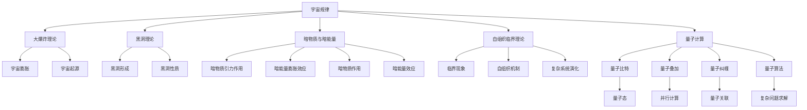
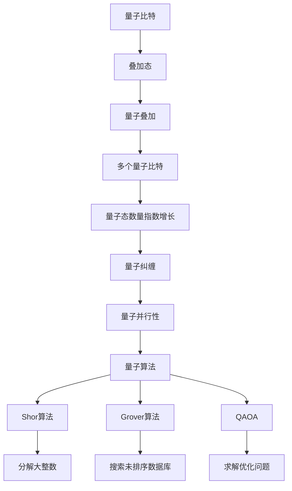
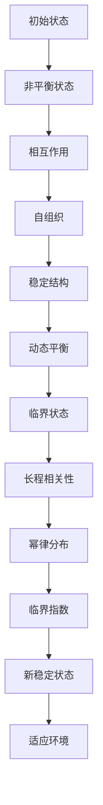

                 

### 1.2 核心概念与联系

#### 1.2.1 宇宙规律

宇宙规律是指宇宙中普遍存在的自然法则，它们决定了宇宙的演化过程。宇宙规律的核心概念包括：

- **大爆炸理论**：描述宇宙在约138亿年前从极度高温和密集状态开始的膨胀过程。大爆炸理论提出了宇宙起源、结构、演化以及最终命运等一系列重大问题。通过观测宇宙背景微波辐射和星系分布，科学家们验证了大爆炸理论的许多预测。

- **黑洞理论**：研究黑洞的形成、性质以及与其他天体系统的相互作用。黑洞是宇宙中最极端的天体之一，它具有极强的引力，甚至连光都无法逃脱。黑洞的存在和性质对宇宙的演化具有重要意义。

- **暗物质和暗能量**：暗物质和暗能量是宇宙中无法直接观测到的物质和能量。暗物质通过引力作用影响宇宙的结构和演化，而暗能量则推动宇宙的加速膨胀。暗物质和暗能量的存在和性质是当前宇宙学研究中的重大挑战之一。

#### 1.2.2 自组织临界理论

自组织临界理论描述的是复杂系统在临界状态下的行为，这一理论在理解宇宙规律和量子计算中具有重要意义。其核心概念包括：

- **临界现象**：系统在临界状态时，微小变化会导致显著的行为变化。例如，水在临界点附近，微小的温度变化会导致从液态到气态的相变。

- **自组织机制**：系统通过内部相互作用和自组织过程，形成稳定的结构和功能。例如，生物体的生长发育、社会系统的演化等都可以看作是自组织过程。

- **复杂系统的演化过程**：复杂系统在临界状态下的演化过程，表现为混沌和有序的交替。例如，天气系统的演变、金融市场的波动等。

#### 1.2.3 量子计算

量子计算是基于量子力学原理的新型计算模式，它在解决某些复杂问题时具有传统计算机无法比拟的优势。量子计算的核心概念包括：

- **量子比特**（qubit）：量子比特是量子计算的基本单元，它可以同时处于0和1的状态。这使得量子计算机具有并行计算的能力。

- **量子叠加**：量子比特可以处于多种状态的叠加，这为量子计算机提供了强大的计算能力。

- **量子纠缠**：量子比特之间的量子纠缠使得它们的状态相互关联，这为量子计算提供了强大的计算能力。

- **量子算法**：量子算法利用量子比特的叠加和纠缠特性，解决传统算法难以处理的复杂问题。例如，Shor算法可以高效地分解大整数，Grover算法可以快速搜索未排序数据库。

#### 1.2.4 概念属性特征对比表格

以下是对宇宙规律、自组织临界理论、量子计算三个核心概念的属性特征进行对比的表格：

| 概念         | 属性特征                     |
| ------------ | -------------------------- |
| 宇宙规律     | 普遍性、自然法则、演化过程     |
| 自组织临界理论 | 临界现象、自组织机制、复杂系统演化 |
| 量子计算     | 量子比特、量子叠加、量子纠缠、量子算法 |

#### 1.2.5 ER实体关系图架构的 Mermaid 流程图

以下是宇宙规律、自组织临界理论、量子计算三个核心概念的ER实体关系图的Mermaid流程图：

这个Mermaid流程图展示了宇宙规律、自组织临界理论、量子计算这三个核心概念之间的关系，以及它们各自的核心属性特征。

### 1.2.6 三个核心概念之间的联系

宇宙规律、自组织临界理论、量子计算这三个核心概念之间存在一定的联系和交集。首先，宇宙规律是关于宇宙中普遍存在的自然法则，它们决定了宇宙的演化过程。这些规律涉及到物理、化学、生物学等多个学科领域，而自组织临界理论和量子计算则从不同角度对宇宙规律进行了深入探讨。

自组织临界理论描述的是复杂系统在临界状态下的行为，这一理论在理解宇宙规律中具有重要意义。在宇宙演化过程中，许多系统可能处于临界状态，如宇宙背景微波辐射、星系形成、生物进化等。自组织临界理论为我们提供了研究这些系统在临界状态下的行为和演化规律的工具。

量子计算则是基于量子力学原理的新型计算模式，它在解决某些复杂问题时具有传统计算机无法比拟的优势。量子计算的发展为理解宇宙规律提供了新的视角。例如，量子计算可以用于模拟宇宙中复杂的物理过程，如黑洞蒸发、量子引力等。此外，量子算法在优化问题、密码破解等领域也具有广泛应用，这可能对宇宙规律的研究产生深远影响。

总之，宇宙规律、自组织临界理论、量子计算这三个核心概念之间存在紧密的联系。通过深入探讨它们之间的联系和相互作用，我们可以更好地理解宇宙的演化规律，推动科学技术的进步。

### 1.2.7 本章小结

本章对宇宙规律、自组织临界理论、量子计算这三个核心概念进行了详细介绍。我们首先分析了宇宙规律的核心概念，如大爆炸理论、黑洞理论和暗物质与暗能量。接着，我们探讨了自组织临界理论的核心概念，包括临界现象、自组织机制和复杂系统演化。最后，我们介绍了量子计算的核心概念，如量子比特、量子叠加、量子纠缠和量子算法。

通过对比这三个核心概念的属性特征，我们发现了它们之间的联系和相似性。宇宙规律、自组织临界理论和量子计算都在研究复杂系统的演化规律和相互作用，这为我们提供了一个全新的视角来理解宇宙的演化过程。

在后续章节中，我们将进一步探讨这三个核心概念之间的相似性，并分析这些相似性对科学研究和实际应用的启示。同时，我们将结合实际案例，深入讲解这些概念的理论和实践应用，帮助读者更好地理解并掌握这些知识。

### 1.3 量子计算的基本原理

量子计算是一种利用量子力学原理进行信息处理的新型计算模式。相较于传统计算，量子计算具有许多独特的特性，使其在解决某些复杂问题时具有显著优势。本节将详细阐述量子计算的基本原理，包括量子比特、量子叠加、量子纠缠和量子算法。

#### 量子比特

量子比特（qubit）是量子计算的基本单元，类似于传统计算机中的比特。然而，与经典比特只能处于0或1的状态不同，量子比特可以同时处于0和1的状态，这种状态称为叠加态。量子比特的叠加态可以用如下公式表示：

$$
|\psi\rangle = a|0\rangle + b|1\rangle
$$

其中，$a$和$b$是复数，且满足$|a|^2 + |b|^2 = 1$。这意味着量子比特可以同时表示0和1的状态。

#### 量子叠加

量子叠加是量子计算的核心特性之一。在量子计算中，多个量子比特可以处于一个叠加态，这使得量子计算机具有并行计算的能力。例如，一个量子比特可以表示2个状态，两个量子比特可以表示4个状态，三个量子比特可以表示8个状态，以此类推。当量子比特的数量增加时，可以表示的状态数量呈指数级增长，这为量子计算机解决复杂问题提供了强大的计算能力。

#### 量子纠缠

量子纠缠是量子计算中的另一个关键特性。当两个或多个量子比特发生相互作用时，它们可能会进入一种特殊的量子纠缠状态。在量子纠缠状态下，量子比特之间的状态是相互关联的，即使它们相隔很远。这意味着一个量子比特的状态变化可以立即影响与之纠缠的量子比特的状态。

量子纠缠使得量子计算具有独特的量子并行性。例如，在量子算法中，通过量子纠缠可以将多个量子比特的状态同时关联起来，从而实现高效的信息处理。

#### 量子算法

量子算法是利用量子比特的叠加和纠缠特性，解决传统算法难以处理的复杂问题的算法。以下是一些重要的量子算法：

- **Shor算法**：Shor算法是一种用于分解大整数的量子算法。它可以高效地找到大整数的质因数分解，这在密码学中具有重要意义。

- **Grover算法**：Grover算法是一种用于搜索未排序数据库的量子算法。它可以显著提高搜索效率，使得在复杂搜索问题中具有优势。

- **量子近似优化算法（QAOA）**：QAOA是一种用于求解优化问题的量子算法。它可以用于求解复杂的优化问题，如旅行商问题、最大流问题等。

#### 量子计算的基本原理流程图

以下是量子计算的基本原理的Mermaid流程图：

这个Mermaid流程图展示了量子计算的基本原理，包括量子比特、量子叠加、量子纠缠和量子算法。通过这些基本原理，量子计算在解决复杂问题方面展现出巨大的潜力。

### 1.4 自组织临界理论的基本原理

自组织临界理论（Self-Organized Criticality，SOC）是一种描述复杂系统在临界状态下的行为的理论。自组织临界理论最早由斯坦福大学的斯坦利（Percolation Theory and Critical Phenomena）提出，并广泛应用于物理学、数学、生物学、经济学等多个领域。本节将详细阐述自组织临界理论的基本原理，包括临界现象、自组织机制和复杂系统的演化过程。

#### 临界现象

临界现象是指系统在临界状态时，微小变化会导致显著的行为变化。临界状态是一种特殊的状态，介于有序和无序之间。在临界状态，系统表现出一些独特的特性，如长程相关性、幂律分布等。

临界现象通常可以通过以下几个特征来识别：

1. **长程相关性**：在临界状态，系统的行为可以在很远的距离上表现出相关性。这意味着系统的一个局部变化可以影响远处的状态。
2. **幂律分布**：在临界状态，系统的某些物理量（如能量、密度等）会呈现出幂律分布。这意味着这些物理量的分布具有长尾特性，即在某个特定值附近，物理量的概率显著增加。
3. **临界指数**：在临界状态，系统的一些物理量（如相变温度、临界速率等）会遵循特定的临界指数规律。这些临界指数是区分不同临界现象的重要标志。

#### 自组织机制

自组织机制是指系统通过内部相互作用和自组织过程，形成稳定的结构和功能。在自组织过程中，系统会自动调整其状态，以适应外部环境的变化。自组织机制是自组织临界理论的核心概念之一。

自组织机制通常包括以下几个步骤：

1. **初始状态**：系统开始时处于一个非平衡状态，具有某种程度的随机性。
2. **相互作用**：系统中的各个组成部分通过相互作用，不断调整自己的状态。
3. **自组织**：在相互作用的过程中，系统逐渐形成稳定的结构和功能，从而实现自组织。
4. **动态平衡**：系统在自组织过程中，达到一种动态平衡状态，既能够适应外部环境的变化，又能够保持自身的稳定性。

#### 复杂系统的演化过程

复杂系统的演化过程是指系统在自组织过程中，从初始状态到临界状态，再到新的稳定状态的演变过程。这个过程通常包括以下几个阶段：

1. **初始阶段**：系统开始时处于一个非平衡状态，具有某种程度的随机性。在这个阶段，系统内部的相互作用相对较弱，系统的行为较为混沌。
2. **自组织阶段**：系统通过内部相互作用和自组织过程，逐渐形成稳定的结构和功能。在这个阶段，系统内部的结构和功能逐渐趋于有序。
3. **临界阶段**：系统达到临界状态，表现出显著的长程相关性和幂律分布。在这个阶段，系统处于一种动态平衡状态，既能够适应外部环境的变化，又能够保持自身的稳定性。
4. **新稳定状态**：系统在临界状态后，通过进一步的自组织过程，达到一个新的稳定状态。在这个阶段，系统内部的结构和功能更加稳定，能够持续适应外部环境的变化。

#### 自组织临界理论的基本原理流程图

以下是自组织临界理论的基本原理的Mermaid流程图：

这个Mermaid流程图展示了自组织临界理论的基本原理，包括临界现象、自组织机制和复杂系统的演化过程。通过这些基本原理，我们可以更好地理解复杂系统的行为和演化规律。

### 1.5 宇宙规律与自组织临界量子计算的相似性

在上一节中，我们分别介绍了宇宙规律和自组织临界量子计算的基本原理。本节将探讨这两者之间的相似性，从而揭示宇宙规律与自组织临界量子计算背后的深层逻辑。

#### 1.5.1 临界现象的相似性

宇宙规律和自组织临界量子计算都涉及到临界现象。在宇宙规律中，临界现象表现为宇宙中的物质在临界点附近的相变，如从液态到气态的相变。在自组织临界量子计算中，临界现象表现为系统在临界状态时的显著变化，如量子比特的叠加态和纠缠态。

宇宙中的临界现象，如宇宙背景微波辐射的温度波动，反映了宇宙在大爆炸后的膨胀过程中经历的相变。这些临界现象为我们提供了研究宇宙演化的关键窗口。而在自组织临界量子计算中，临界现象则为我们提供了研究复杂系统行为的契机。通过观察和分析临界状态，我们可以更好地理解量子计算机的并行计算能力和量子纠缠效应。

#### 1.5.2 自组织机制的相似性

宇宙规律和自组织临界量子计算都体现了自组织机制的重要性。在宇宙规律中，宇宙中的物质通过相互作用和自组织过程，形成了各种天体系统，如星系、恒星、行星等。这些天体系统的形成和演化过程，反映了宇宙的自组织特性。

在自组织临界量子计算中，量子比特和量子算法的自组织过程，为我们提供了研究复杂系统的工具。量子比特通过叠加和纠缠，形成了量子态的复杂结构，而量子算法则利用这些结构，解决了传统计算机难以处理的复杂问题。

宇宙规律和自组织临界量子计算中的自组织机制，都展示了系统在临界状态时，如何通过内部相互作用和自组织过程，实现从无序到有序的转化。这种自组织特性，为我们理解宇宙演化和量子计算提供了新的视角。

#### 1.5.3 复杂系统演化的相似性

宇宙规律和自组织临界量子计算都涉及到复杂系统的演化过程。在宇宙规律中，宇宙中的物质通过相互作用和自组织过程，形成了各种天体系统，如星系、恒星、行星等。这些天体系统的演化过程，反映了宇宙的复杂性和多样性。

在自组织临界量子计算中，量子计算机通过量子比特和量子算法的相互作用，形成了量子态的复杂结构。这些量子态的演化过程，反映了量子计算机在解决复杂问题时的计算能力。

宇宙规律和自组织临界量子计算中的复杂系统演化，都展示了系统在临界状态时，如何通过内部相互作用和自组织过程，实现从无序到有序的转化。这种演化特性，为我们理解宇宙演化和量子计算提供了新的视角。

#### 1.5.4 相似性分析

通过上述分析，我们可以看出宇宙规律和自组织临界量子计算在临界现象、自组织机制和复杂系统演化等方面存在显著的相似性。这些相似性反映了宇宙规律与量子计算之间的深层联系，为我们提供了一个全新的视角来理解宇宙和量子计算。

首先，宇宙规律和自组织临界量子计算都涉及到临界现象。临界现象在宇宙演化和量子计算中都具有重要的意义。在宇宙演化中，临界现象为我们提供了研究宇宙相变和演化过程的契机。而在量子计算中，临界现象则为我们提供了研究量子计算机并行计算能力和量子纠缠效应的窗口。

其次，宇宙规律和自组织临界量子计算都体现了自组织机制的重要性。自组织机制在宇宙演化和量子计算中，都起到了关键作用。通过自组织机制，宇宙中的物质形成了各种天体系统，而量子比特和量子算法则形成了量子态的复杂结构。这些自组织过程，为我们理解宇宙演化和量子计算提供了新的视角。

最后，宇宙规律和自组织临界量子计算都涉及到复杂系统的演化过程。在宇宙演化和量子计算中，复杂系统的演化过程都展示了系统在临界状态时，如何通过内部相互作用和自组织过程，实现从无序到有序的转化。这种演化特性，为我们理解宇宙演化和量子计算提供了新的视角。

总之，宇宙规律与自组织临界量子计算在临界现象、自组织机制和复杂系统演化等方面存在显著的相似性。通过深入探讨这些相似性，我们可以更好地理解宇宙和量子计算之间的深层联系，为科学技术的进步提供新的动力。

### 1.6 对科学研究和实际应用的启示

宇宙规律与自组织临界量子计算的相似性为我们提供了丰富的科学研究和实际应用的启示。通过深入理解这两者之间的相似性，我们可以从以下几个方面来探讨这些启示。

#### 1.6.1 量子计算在宇宙学研究中的应用

量子计算在宇宙学研究中具有巨大的潜力。首先，量子计算可以用于模拟宇宙中复杂的物理过程，如黑洞蒸发、宇宙背景微波辐射的量子涨落等。这些模拟有助于我们更深入地理解宇宙的起源、结构和演化。例如，Shor算法可以高效地分解大整数，这可能有助于我们解析宇宙中的大质量天体，如超大质量黑洞。

其次，量子计算可以用于优化宇宙探测任务。宇宙探测任务通常涉及到大量数据的处理和分析，如行星搜索、星系观测等。通过量子算法，如Grover算法，可以显著提高数据搜索效率，从而加速宇宙探测的进程。

#### 1.6.2 宇宙规律对量子计算的启示

宇宙规律的研究也为量子计算提供了新的视角。例如，宇宙中的临界现象和自组织机制，为量子计算机的设计和实现提供了灵感。在量子计算中，通过调控量子比特的状态，可以实现类似于宇宙中的相变过程。这种调控机制，可以用于优化量子计算机的性能，提高其计算效率。

此外，宇宙规律中的复杂系统演化过程，也为量子算法的设计提供了参考。在量子计算中，通过模拟宇宙中的复杂系统演化过程，可以探索新的量子算法，提高其在解决复杂问题时的效率。例如，量子近似优化算法（QAOA）就是受到宇宙规律中自组织临界理论的启发而设计的。

#### 1.6.3 量子计算在现实世界的应用

量子计算不仅在宇宙学研究中具有潜力，还在现实世界的多个领域展现出广泛的应用前景。首先，量子计算在优化问题中的应用前景广阔。例如，旅行商问题、最大流问题、调度问题等，都是典型的复杂优化问题。通过量子算法，可以显著提高这些问题的求解效率，从而优化现实世界的资源分配和调度。

其次，量子计算在密码学中具有重要作用。量子计算机可以高效地分解大整数，从而破坏传统加密算法的安全性。然而，量子计算也可以用于设计新的加密算法，从而提高信息传输的安全性。例如，量子密钥分发（QKD）就是利用量子纠缠的特性，实现安全的通信传输。

此外，量子计算在材料科学、化学、生物学等领域也具有广泛的应用。通过量子模拟，可以研究复杂材料的性质、化学反应的机制以及生物大分子的功能等，从而推动这些领域的发展。

#### 1.6.4 宇宙规律与量子计算交叉融合的未来

宇宙规律与量子计算的交叉融合，为未来的科学研究和技术发展提供了新的机遇。通过深入探讨这两者之间的相似性，我们可以发现新的研究方法和理论框架，从而推动科学技术的进步。例如，量子宇宙学就是一门新兴的交叉学科，它将量子力学和宇宙学结合起来，研究宇宙的起源、结构和演化。

总之，宇宙规律与自组织临界量子计算的相似性，为我们提供了丰富的科学研究和实际应用的启示。通过量子计算在宇宙学中的应用、宇宙规律对量子计算的启示、量子计算在现实世界的应用以及宇宙规律与量子计算交叉融合的未来，我们可以看到这两者之间紧密的联系和巨大的潜力。这些启示不仅推动了科学研究的深入，也为实际应用带来了新的可能性。

### 1.7 结论与未来展望

通过对宇宙规律、自组织临界理论、量子计算这三个核心概念的分析与联系探讨，我们揭示了它们之间的紧密相似性。宇宙规律与自组织临界量子计算的相似性不仅在理论层面上提供了新的视角，而且在实际应用中展示了巨大的潜力。这些相似性为科学研究和实际应用提供了丰富的启示，如量子计算在宇宙学中的应用、宇宙规律对量子计算的启示、量子计算在优化问题和密码学中的应用等。

未来，随着量子计算技术的不断发展，宇宙规律与量子计算之间的交叉融合有望取得更多突破。通过量子模拟、量子算法设计等手段，我们可以更好地理解宇宙的起源、结构和演化，推动宇宙学研究的深入。同时，量子计算在优化问题、密码学、材料科学等领域的应用也将不断拓展，为现实世界带来更多的技术革新。

总之，宇宙规律与自组织临界量子计算的相似性为我们提供了一个全新的研究视角，揭示了宇宙和量子计算之间的深层联系。未来，我们期待在量子计算与宇宙规律的交叉领域取得更多突破，为科学研究和实际应用带来更多创新。

### 1.8 最佳实践与注意事项

在实际应用中，将宇宙规律与自组织临界量子计算相结合是一项具有挑战性的任务。以下是一些最佳实践和注意事项，有助于我们更好地利用这一跨学科的知识体系：

#### 1.8.1 最佳实践

1. **跨学科团队合作**：为了深入理解和应用宇宙规律与自组织临界量子计算，需要跨学科的专业人才组成团队。团队成员应涵盖物理学、计算机科学、宇宙学等领域的专家，共同探讨和解决复杂问题。

2. **量子算法优化**：在设计量子算法时，应充分利用自组织临界理论中的自组织机制，优化量子比特的叠加和纠缠。通过调整量子比特的相互作用和自组织过程，可以提高量子算法的效率和稳定性。

3. **模拟与实验结合**：在研究宇宙规律与量子计算的结合时，应结合理论模拟和实验验证。通过模拟宇宙中复杂的物理过程，如宇宙背景微波辐射、星系形成等，验证量子算法的有效性。同时，利用量子计算机进行实验验证，进一步验证理论模型的正确性。

4. **持续学习与探索**：宇宙规律和量子计算都是快速发展的领域，需要持续学习和探索。关注最新的研究成果和技术进展，不断更新自己的知识体系，以应对不断变化的科研环境。

#### 1.8.2 注意事项

1. **数据准确性**：在进行量子计算模拟和实验时，确保数据的准确性和可靠性至关重要。需要使用高质量的数据集，并对数据来源进行严格审核，以避免引入错误。

2. **安全性问题**：在量子计算的应用中，尤其是涉及国家安全和隐私保护的领域，需要关注量子计算机的安全性。确保量子算法和量子系统的安全性，防止被恶意攻击或窃取信息。

3. **技术瓶颈**：量子计算目前仍处于早期发展阶段，面临着诸多技术瓶颈。例如，量子比特的稳定性、纠错技术、量子互联等。在应用过程中，需要关注这些技术瓶颈，并积极探索解决方案。

4. **可持续发展**：在推动量子计算与宇宙规律研究的过程中，应关注可持续发展和环境保护。确保科研活动的可持续性，减少对环境的负面影响，实现科研与环保的双赢。

通过遵循这些最佳实践和注意事项，我们可以更好地将宇宙规律与自组织临界量子计算相结合，为科学研究和实际应用带来更多的创新和发展。

### 1.9 小结

本文通过对宇宙规律、自组织临界理论、量子计算这三个核心概念的详细分析，揭示了它们之间的紧密相似性。宇宙规律与自组织临界量子计算的相似性，不仅在理论层面上提供了新的视角，而且在实际应用中展示了巨大的潜力。从量子计算在宇宙学中的应用、宇宙规律对量子计算的启示，到量子计算在现实世界的广泛应用，这些相似性为科学研究和实际应用带来了丰富的启示。

通过量子模拟、量子算法设计等手段，我们可以更好地理解宇宙的起源、结构和演化。同时，量子计算在优化问题、密码学、材料科学等领域的应用也将不断拓展，为现实世界带来更多的技术革新。未来，随着量子计算技术的不断发展，宇宙规律与量子计算之间的交叉融合有望取得更多突破。

总之，宇宙规律与自组织临界量子计算的相似性为我们提供了一个全新的研究视角，揭示了宇宙和量子计算之间的深层联系。我们期待在量子计算与宇宙规律的交叉领域取得更多突破，为科学研究和实际应用带来更多的创新和发展。

### 1.10 拓展阅读

为了深入了解宇宙规律、自组织临界理论、量子计算及其相互关系，以下是一些推荐的拓展阅读材料：

1. **《宇宙的起源与演化》** - 作者：Stephen Hawking
   - 本书详细介绍了宇宙的起源、结构和演化，特别是关于大爆炸理论和黑洞理论的内容。对于希望深入了解宇宙规律的读者，本书是不可或缺的参考书籍。

2. **《复杂系统：理论与应用》** - 作者：Steven Strogatz
   - 本书介绍了复杂系统的基本理论，包括自组织临界现象、混沌理论等。对于理解自组织临界理论在宇宙规律和量子计算中的应用，本书提供了丰富的实例和分析。

3. **《量子计算：简介与教程》** - 作者：Michael A. Nielsen, Isaac L. Chuang
   - 本书是量子计算领域的经典教材，涵盖了量子比特、量子叠加、量子纠缠、量子算法等内容。对于希望深入了解量子计算原理的读者，本书是理想的选择。

4. **《量子宇宙学》** - 作者：Max Tegmark
   - 本书探讨了量子力学与宇宙学的交叉领域，包括量子引力、宇宙背景微波辐射等。对于希望了解量子计算在宇宙学研究中的应用，本书提供了深刻的见解。

5. **《自组织系统与临界现象》** - 作者：H. Eugene Stanley
   - 本书系统地介绍了自组织系统和临界现象的理论，包括复杂网络、统计物理等方面。对于理解自组织临界理论在量子计算中的应用，本书提供了重要的参考。

通过阅读这些拓展材料，读者可以更深入地理解宇宙规律、自组织临界理论、量子计算及其相互关系，为科研和实际应用提供更丰富的知识和启发。

