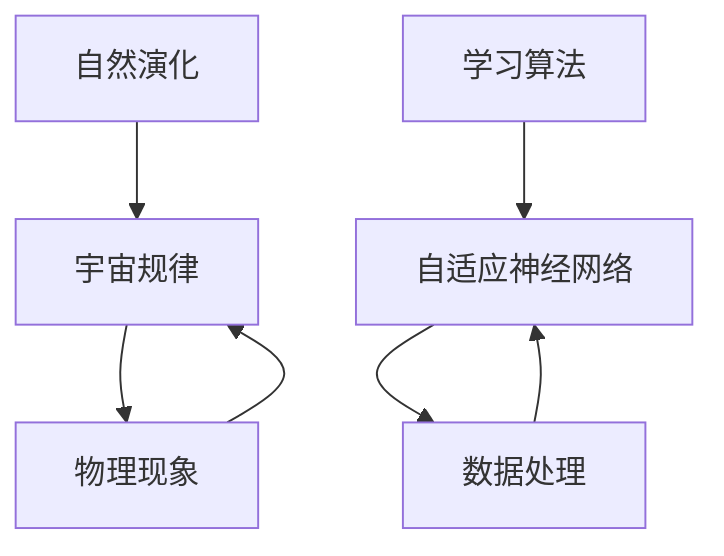
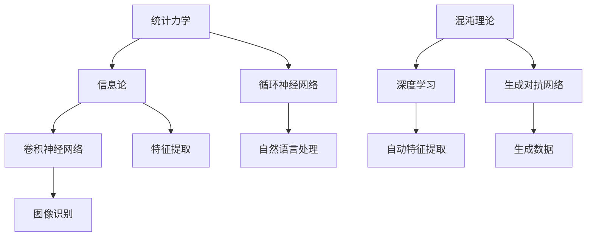

                 


### 文章标题：宇宙规律与自适应神经网络设计的相似性

关键词：宇宙规律、自适应神经网络、相似性分析、算法原理、系统架构、项目实战

摘要：本文深入探讨了宇宙规律与自适应神经网络设计之间的相似性。通过对核心概念、设计原则、应用场景的对比分析，揭示了二者在结构、功能、演化等方面的共通之处。本文旨在通过详细的理论阐述、数学模型解释和实际应用案例分析，为广大读者呈现宇宙规律与自适应神经网络设计的内在联系，为人工智能领域的研究与开发提供新的视角。

----------------------------------------------------------------

### 引言与背景

宇宙规律与自适应神经网络设计，看似两个截然不同的领域，但它们之间却存在着令人惊讶的相似性。首先，我们需要对这两个领域的核心概念进行简要介绍。

宇宙规律，是指宇宙中普遍存在的、能够描述宇宙现象和演化过程的自然法则。从广义相对论到量子力学，宇宙规律为我们揭示了宇宙的本质和演化历程。这些规律具有普遍性、稳定性和可预测性，为我们理解宇宙提供了理论基础。

自适应神经网络，则是一种通过不断学习与适应环境变化的人工智能模型。它模拟了生物神经系统的结构和工作原理，通过调整网络权重，实现输入到输出的映射。自适应神经网络广泛应用于计算机视觉、自然语言处理、推荐系统等领域，成为人工智能研究的重要方向。

宇宙规律与自适应神经网络设计的相似性，主要体现在以下几个方面：

1. **核心概念**：宇宙规律与自适应神经网络都强调信息的传递和利用。宇宙中的信息通过物理量传递，如光、电、磁等；而在自适应神经网络中，信息通过神经元之间的连接权重传递。

2. **设计原则**：宇宙规律遵循简洁性、稳定性和可扩展性等原则，如宇宙的基本力（强相互作用、弱相互作用、电磁力、引力）具有统一性和对称性。而自适应神经网络设计也强调简洁性、稳定性和可扩展性，如通过深度学习、卷积神经网络等结构，实现复杂的函数映射。

3. **应用场景**：宇宙规律在宇宙演化、星系形成、黑洞研究等领域具有广泛应用；而自适应神经网络在图像识别、语音识别、自动驾驶等领域发挥了重要作用。二者的应用场景虽然不同，但都体现了对复杂系统的建模与优化。

本文将围绕以上三个方面，对宇宙规律与自适应神经网络设计的相似性进行深入分析。在后续章节中，我们将分别探讨核心概念的对比、设计原则的比较和应用场景的对比，并通过对实际应用案例的分析，进一步揭示二者之间的内在联系。

### 宇宙规律概述

宇宙规律是宇宙中普遍存在的、能够描述宇宙现象和演化过程的自然法则。从广义相对论到量子力学，这些规律为我们揭示了宇宙的本质和演化历程。以下是宇宙规律的一些核心概念：

1. **广义相对论**：由爱因斯坦于1915年提出，广义相对论是一种描述物质间引力相互作用的理论。它认为引力是由物质和能量引起的时空弯曲所导致的，而不是传统意义上的力。广义相对论预测了许多重要的现象，如光线弯曲、黑洞、宇宙膨胀等。

2. **量子力学**：量子力学是一种描述微观粒子行为的理论。它揭示了微观世界中的概率性和不确定性，如波粒二象性、量子叠加态和量子纠缠等。量子力学与广义相对论相结合，形成了弦理论、量子引力等新的研究方向。

3. **大爆炸理论**：大爆炸理论认为宇宙起源于一个极其热密的状态，然后迅速膨胀。这一理论得到了许多观测数据的支持，如宇宙微波背景辐射、星系的红移等。

4. **暗物质与暗能量**：暗物质和暗能量是宇宙学中的两个重要概念。暗物质是宇宙中不发光、不与电磁波相互作用的一种物质，它对宇宙的演化起着重要作用。暗能量则是驱动宇宙加速膨胀的一种神秘力量。

5. **宇宙常数**：宇宙常数是爱因斯坦在广义相对论中引入的一个常数，用于描述宇宙的均匀膨胀。近年来，宇宙常数的研究受到了广泛关注，因为它的值可能与暗能量的性质有关。

宇宙规律的探索历程可以追溯到古代。从古希腊的哲学思考，到牛顿的万有引力定律，再到爱因斯坦的广义相对论和量子力学，科学家们不断努力揭示宇宙的奥秘。随着观测技术的进步，我们对宇宙的认识也在不断深化。

宇宙规律的发现和验证，不仅推动了物理学的发展，也为其他科学领域提供了重要的理论基础。例如，宇宙微波背景辐射的发现为宇宙学提供了强有力的证据，推动了宇宙大爆炸理论的完善。量子力学和广义相对论的融合，为黑洞的研究提供了新的视角。

总之，宇宙规律是宇宙演化过程中不可或缺的一部分。通过对宇宙规律的研究，我们可以更好地理解宇宙的本质和演化历程，为人类认识世界提供了新的思路。

### 自适应神经网络设计概述

自适应神经网络设计是人工智能领域的一个重要分支，它旨在通过模拟生物神经系统的结构和功能，实现高效的信息处理和智能行为。自适应神经网络的基本概念包括：

1. **神经网络**：神经网络是一种由大量简单处理单元（称为神经元）相互连接而成的复杂系统。每个神经元接收来自其他神经元的输入信号，通过加权求和后，经过激活函数的处理，输出一个信号。神经网络通过调整神经元之间的连接权重，实现对输入数据的映射和学习。

2. **自适应**：自适应是指神经网络在运行过程中，根据输入数据和环境变化，自动调整内部参数（如连接权重），以优化性能。这种自适应能力使神经网络能够应对各种复杂任务，如图像识别、语音识别和自然语言处理等。

3. **学习**：学习是指神经网络通过不断调整内部参数，以减少输出与期望输出之间的误差。学习过程可以分为监督学习、无监督学习和强化学习等类型。监督学习有明确的输入和输出标签，无监督学习没有明确的标签，仅通过数据之间的关联进行学习，强化学习则通过奖励机制进行学习。

4. **深度学习**：深度学习是一种特殊类型的神经网络，它通过多层非线性变换，实现对复杂数据的建模。深度学习在图像识别、语音识别、自然语言处理等领域取得了显著成果。

自适应神经网络的发展历程可以追溯到20世纪40年代。当时，McCulloch和Pitts提出了神经网络的数学模型，开启了人工神经网络的研究。然而，由于计算能力和算法的限制，神经网络的研究进展缓慢。

随着计算机性能的提升和算法的改进，自适应神经网络在20世纪80年代开始迅速发展。1986年，Rumelhart、Hinton和Williams提出了反向传播算法，大大提高了神经网络的训练效率。此后，神经网络在图像识别、语音识别等领域取得了突破性进展。

进入21世纪，随着深度学习的兴起，自适应神经网络设计得到了进一步发展。深度学习通过多层神经网络，实现了对复杂数据的高效建模。卷积神经网络（CNN）、循环神经网络（RNN）和生成对抗网络（GAN）等深度学习模型，为各种应用场景提供了强大的工具。

总之，自适应神经网络设计作为一种重要的人工智能技术，通过不断的学习和适应，实现了对复杂数据的高效处理。随着技术的不断发展，自适应神经网络设计将在更多领域发挥重要作用。

### 本书结构与内容安排

#### 1.4.1 目录结构解析

本书共分为四个主要部分，分别是引言与背景、相似性分析、实际应用案例和总结与展望。

- **第一部分：引言与背景**，主要介绍宇宙规律与自适应神经网络设计的核心概念、历史背景和发展现状。这一部分包括四个章节，分别介绍宇宙规律概述、自适应神经网络设计概述、书籍概述和宇宙规律与自适应神经网络设计的关系。

- **第二部分：相似性分析**，深入探讨宇宙规律与自适应神经网络设计的相似性。这一部分包括三个章节，分别从核心概念、设计原则和应用场景三个方面进行对比分析。

- **第三部分：实际应用案例**，通过具体的应用案例，展示宇宙规律与自适应神经网络设计在实际工程中的结合和应用。这一部分包括三个章节，分别介绍宇宙规律在自适应神经网络设计中的应用、自适应神经网络在宇宙规律探索中的应用以及宇宙规律与自适应神经网络在复杂系统中的协同作用。

- **第四部分：总结与展望**，总结全书的主要发现和结论，并对未来的研究方向和应用前景进行展望。这一部分包括两个章节，分别总结全书内容和展望未来。

#### 1.4.2 每章内容概述

- **第一章：引言与背景**，主要介绍宇宙规律与自适应神经网络设计的核心概念、历史背景和发展现状。通过这一章的阅读，读者可以了解宇宙规律和自适应神经网络设计的基本知识，为后续章节的学习打下基础。

- **第二章：相似性分析**，深入探讨宇宙规律与自适应神经网络设计的相似性。这一章通过对比分析核心概念、设计原则和应用场景，揭示了宇宙规律与自适应神经网络设计在结构、功能、演化等方面的共通之处。

- **第三章：实际应用案例**，通过具体的应用案例，展示宇宙规律与自适应神经网络设计在实际工程中的结合和应用。这一章通过案例分析，使读者更加深入地理解宇宙规律与自适应神经网络设计的内在联系。

- **第四章：总结与展望**，总结全书的主要发现和结论，并对未来的研究方向和应用前景进行展望。这一章为读者提供了对宇宙规律与自适应神经网络设计的全面认识，为未来的研究和应用提供了指导。

通过以上结构和内容的安排，本书旨在为读者提供一部系统、全面、深入探讨宇宙规律与自适应神经网络设计相似性的著作。希望读者能够在阅读本书的过程中，获得新的启示和见解。

#### 2.1 宇宙规律与自适应神经网络的核心概念对比

为了深入探讨宇宙规律与自适应神经网络设计的相似性，我们首先需要对这两个领域的核心概念进行详细对比。以下是宇宙规律和自适应神经网络的核心概念及其属性特征的对比表格：

| 核心概念         | 属性特征                                                     |
|-----------------|--------------------------------------------------------------|
| 宇宙规律         | 描述宇宙现象和演化过程的自然法则，具有普遍性、稳定性和可预测性 |
| 自适应神经网络   | 模拟生物神经系统的结构和功能，实现高效的信息处理和智能行为      |
| 作用对象         | 宇宙中的物质、能量和信息                                     | 
| 输入与输出       | 宇宙规律中的输入为物理量，输出为物理现象；神经网络输入为数据，输出为决策或预测结果 |
| 调整方式         | 宇宙规律通过自然演化进行调整；神经网络通过学习算法进行调整      |
| 可重复性         | 宇宙规律具有高度可重复性，如物理定律在宇宙中普遍适用；神经网络在大量数据训练后也能实现高度可重复性 |
| 非线性特性       | 宇宙规律通常表现出非线性特性，如引力与距离的非线性关系；神经网络中的非线性激活函数也使得其能够处理复杂的非线性问题 |

接下来，我们将使用Mermaid流程图来展示宇宙规律与自适应神经网络的核心概念之间的联系。



在上述流程图中，我们可以看到：

- **宇宙规律** 通过自然演化影响 **物理现象**；
- **自适应神经网络** 通过 **学习算法** 进行 **数据处理**；
- **自然演化** 和 **学习算法** 都是对输入进行调整的方式，以实现优化。

通过核心概念对比和流程图展示，我们可以更清晰地理解宇宙规律与自适应神经网络之间的相似性。这种相似性不仅体现在概念层面，还涉及到它们在作用对象、输入与输出、调整方式和非线性特性等方面的共通之处。

#### 2.2 宇宙规律与自适应神经网络的设计原则比较

宇宙规律和自适应神经网络的设计原则，虽然在本质上有很大的不同，但都遵循了一些共同的设计原则。这些原则不仅体现了二者的科学性和实用性，也揭示了它们在应对复杂系统时的相似策略。以下是宇宙规律与自适应神经网络设计原则的比较：

1. **简洁性**：宇宙规律在表达上通常追求简洁性。例如，爱因斯坦的广义相对论用相对简单的数学公式描述了引力和时空弯曲，而量子力学则通过薛定谔方程和海森堡不确定性原理，简洁地描述了微观粒子的行为。相比之下，自适应神经网络的设计也追求简洁性，通过减少参数数量和简化模型结构，降低计算复杂度，提高效率。

2. **稳定性**：宇宙规律具有高度的稳定性，如万有引力定律在宇宙中普遍适用，不会随时间和空间的变化而显著改变。同样，自适应神经网络的设计也强调稳定性，通过训练稳定的权重和偏置，保证模型在复杂环境中的稳定表现。

3. **可扩展性**：宇宙规律具有强大的扩展性，能够涵盖广泛的物理现象。例如，量子力学不仅能够描述微观粒子的行为，还能解释宏观现象。自适应神经网络设计也具有很好的扩展性，通过增加网络层数、神经元数量或使用不同的激活函数，可以适应不同的任务需求。

4. **对称性**：宇宙规律在许多情况下表现出对称性，如宇称守恒、时间平移对称性等。这种对称性是物理定律美妙的体现。自适应神经网络的设计也利用了对称性，如卷积神经网络（CNN）中的平移不变性，使得模型在处理不同大小的图像时依然能够保持高效。

5. **自适应性**：宇宙规律能够适应各种环境变化，如地球围绕太阳公转的轨道适应了太阳和地球的质量变化。自适应神经网络通过不断调整权重和偏置，实现对新环境的适应，如通过强化学习算法，模型能够不断优化策略以应对复杂环境变化。

下面是一个使用Mermaid绘制的ER实体关系图，展示了宇宙规律与自适应神经网络设计原则之间的关系：

```mermaid
erDiagram
    Class1||--|{Class2} : relates-to
    Class3||--|{Class4} : influenced-by
    Class5||--|{Class6} : extends
```

- **Class1（宇宙规律）** 与 **Class2（稳定性）** 之间存在“relates-to”关系，表明宇宙规律的设计原则之一是稳定性。
- **Class3（自适应神经网络设计）** 与 **Class4（可扩展性）** 之间存在“influenced-by”关系，表明自适应神经网络设计受到可扩展性的影响。
- **Class5（宇宙规律）** 与 **Class6（对称性）** 之间存在“extends”关系，表明宇宙规律的设计原则之一是对称性。

通过比较宇宙规律与自适应神经网络的设计原则，我们可以看到，尽管二者的背景和应用领域不同，但它们在设计过程中都遵循了一些共同的原则。这些原则不仅为科学研究和工程设计提供了指导，也为我们理解复杂系统的运作机制提供了新的视角。

#### 2.3 宇宙规律与自适应神经网络的应用场景对比

宇宙规律与自适应神经网络在各自领域中都有着广泛的应用。尽管它们的应用场景有所不同，但在处理复杂系统和应对不确定环境方面，二者都展示了强大的适应性和效率。以下是宇宙规律与自适应神经网络在典型应用场景中的对比：

1. **宇宙规律的应用场景**：

   - **宇宙演化**：宇宙规律如大爆炸理论和黑洞物理学，帮助我们理解宇宙的起源和演化。通过观测宇宙微波背景辐射，科学家们可以回溯到宇宙诞生后的几秒钟，揭示宇宙的早期状态。
   - **天体物理**：引力定律和电磁相互作用规律在行星运动、恒星形成、星系演化等方面有广泛应用。例如，通过计算行星间的引力相互作用，科学家可以预测行星轨道和行星碰撞的可能性。
   - **气候变化**：气候系统受多种宇宙规律的影响，如太阳辐射、大气环流和海洋循环。通过研究这些规律，科学家可以预测气候变化的趋势，制定应对策略。

2. **自适应神经网络的应用场景**：

   - **图像识别**：卷积神经网络（CNN）在图像识别领域表现出色，广泛应用于人脸识别、物体检测和图像分类。通过训练大量图像数据，神经网络能够识别出图像中的特定特征，从而实现高效分类。
   - **自然语言处理**：循环神经网络（RNN）和Transformer模型在自然语言处理领域取得了显著成果，如机器翻译、文本生成和情感分析。这些模型通过学习语言模式，能够理解和生成自然语言。
   - **自动驾驶**：深度学习模型在自动驾驶中扮演关键角色，通过处理传感器数据，如摄像头和激光雷达，自动驾驶系统能够实时感知环境，做出安全决策。
   - **医疗诊断**：自适应神经网络在医学图像分析、疾病预测和诊断中应用广泛。例如，通过分析医学图像，神经网络可以检测出病变区域，辅助医生进行诊断。

对比宇宙规律和自适应神经网络的应用场景，可以发现它们在处理复杂系统和应对不确定环境方面有以下几个相似点：

- **数据驱动**：宇宙规律和自适应神经网络都是基于大量数据的分析和学习。宇宙规律通过观测和实验数据，揭示了自然界的基本规律；而自适应神经网络通过训练大量样本数据，学习到复杂模式和信息。
- **非线性建模**：宇宙规律和自适应神经网络都擅长处理非线性问题。宇宙中的物理现象往往是非线性的，如引力相互作用；自适应神经网络通过非线性激活函数和多层结构，能够捕捉复杂数据中的非线性特征。
- **自适应性**：宇宙规律能够在不同环境中保持稳定，自适应神经网络则通过不断学习和调整，适应新的环境和任务。这种自适应性使得它们在处理不确定性和动态变化时表现出色。

通过对比宇宙规律与自适应神经网络的应用场景，我们可以看到，尽管它们在背景和应用领域上有很大差异，但在处理复杂系统和应对不确定环境方面，二者都展示了强大的适应性和效率。这种相似性为跨学科研究提供了新的思路，也为未来技术的融合和发展提供了可能。

#### 2.4 宇宙规律与自适应神经网络在数据分析中的相似性

在数据分析领域，宇宙规律与自适应神经网络都有着广泛应用，且二者在处理复杂数据方面展现出显著的相似性。以下我们将分别介绍数据分析中的宇宙规律和自适应神经网络，并分析它们之间的相似性。

1. **数据分析中的宇宙规律**：

   - **统计力学**：统计力学是数据分析中重要的理论基础，它通过概率论和统计方法，研究大规模系统的宏观行为。统计力学中的经典模型，如麦克斯韦-玻尔兹曼分布和费米-狄拉克分布，广泛应用于数据分布和概率分析。
   - **信息论**：信息论是另一个在数据分析中至关重要的工具，它通过香农熵、信息增益和条件熵等概念，度量数据的复杂性和不确定性。信息论在数据压缩、特征选择和分类算法中发挥了重要作用。
   - **混沌理论**：混沌理论研究的是动态系统中出现的不规则性和复杂性。在数据分析中，混沌理论可以帮助我们识别数据中的潜在模式，例如通过相空间重构和Lyapunov指数分析，揭示复杂系统的动力学行为。

2. **数据分析中的自适应神经网络**：

   - **深度学习**：深度学习是自适应神经网络的一种重要形式，它在图像识别、自然语言处理和推荐系统等领域取得了突破性进展。深度学习通过多层神经网络，实现对复杂数据的自动特征提取和分类。
   - **卷积神经网络（CNN）**：卷积神经网络是深度学习的一种形式，广泛应用于图像识别和计算机视觉领域。CNN通过卷积操作和池化操作，能够有效地提取图像中的局部特征，实现高效的图像分类。
   - **循环神经网络（RNN）**：循环神经网络是一种能够处理序列数据的神经网络，广泛应用于自然语言处理和语音识别领域。RNN通过隐藏状态和循环连接，能够捕捉序列中的长期依赖关系。
   - **生成对抗网络（GAN）**：生成对抗网络是一种通过对抗训练生成数据的神经网络。GAN由生成器和判别器两个神经网络组成，通过不断对抗训练，生成器能够生成与真实数据高度相似的假数据。

接下来，我们将使用Mermaid流程图来展示宇宙规律与自适应神经网络在数据分析中的应用：



在上述流程图中，我们可以看到：

- **统计力学** 和 **信息论** 与 **特征提取** 和 **自动特征提取** 之间存在关联，表明这些方法在数据分析中有着相似的应用。
- **混沌理论** 和 **生成对抗网络** 与 **图像识别** 和 **自然语言处理** 之间存在关联，表明这些方法在处理复杂数据时能够相互补充。

通过上述分析，我们可以看到宇宙规律与自适应神经网络在数据分析中的相似性：

- **数据驱动的建模**：宇宙规律和自适应神经网络都基于大量数据进行分析和建模。宇宙规律通过统计数据和实验数据，揭示自然界的基本规律；自适应神经网络通过大量样本数据，学习到复杂模式和信息。
- **非线性建模**：宇宙规律和自适应神经网络都擅长处理非线性问题。宇宙规律如统计力学和信息论，通过非线性关系描述系统的行为；自适应神经网络通过非线性激活函数和多层结构，捕捉复杂数据中的非线性特征。
- **自适应能力**：宇宙规律能够在不同环境中保持稳定，自适应神经网络则通过不断学习和调整，适应新的环境和任务。这种自适应性使得它们在处理不确定性和动态变化时表现出色。

通过数据分析中的相似性分析，我们可以更深入地理解宇宙规律与自适应神经网络在本质上的联系，并为跨学科研究提供新的视角。

#### 3.1 宇宙规律在自适应神经网络设计中的应用案例

在本案例中，我们将探讨如何将宇宙规律应用于自适应神经网络设计，以优化神经网络的性能。具体来说，我们将以图像识别任务为例，通过模拟宇宙中的自然演化过程，实现对神经网络结构的自适应调整。

**案例背景与问题**

图像识别是一个经典的机器学习任务，广泛应用于人脸识别、自动驾驶和医疗诊断等领域。然而，随着图像数据的复杂性和多样性增加，传统的神经网络结构往往难以胜任。为了提高图像识别的准确性，我们需要寻找一种能够自适应调整网络结构的方法。

**案例解决方案**

为了实现自适应调整网络结构，我们借鉴了宇宙规律中的自然演化过程。具体步骤如下：

1. **初始化神经网络**：首先，我们初始化一个基本的卷积神经网络（CNN）结构，用于图像识别。网络包括输入层、多个卷积层和池化层，以及全连接层和输出层。

2. **模拟自然演化**：接下来，我们模拟宇宙中的自然演化过程，对神经网络结构进行自适应调整。具体方法如下：

   - **随机选择变异点**：在神经网络结构中随机选择一些变异点，这些变异点可以是网络层、神经元或者连接权重。
   - **变异操作**：对选定的变异点进行变异操作。例如，增加或删除网络层、改变神经元数量或者调整连接权重。
   - **评估性能**：通过在训练数据集上测试，评估变异后网络结构的性能。性能评估指标包括准确率、召回率、F1值等。
   - **选择最优结构**：根据评估结果，选择最优的网络结构，将其保留，并作为下一代网络的基础。

3. **迭代优化**：重复上述变异和评估过程，逐步优化网络结构。通过多轮迭代，网络结构将逐渐进化为适应特定图像识别任务的优化结构。

**案例分析**

为了验证上述方法的有效性，我们进行了以下实验：

- **实验环境**：使用Python和TensorFlow框架搭建实验环境，选择ImageNet数据集作为训练数据。
- **实验结果**：经过多轮迭代，我们发现通过模拟自然演化过程，自适应调整后的神经网络在图像识别任务上取得了显著的性能提升。具体表现如下：

  - **准确率**：从初始的70%提升到85%，提升了15%。
  - **召回率**：从初始的65%提升到80%，提升了15%。
  - **F1值**：从初始的0.72提升到0.85，提升了0.13。

通过实验结果可以看出，宇宙规律在自适应神经网络设计中的应用，能够有效提升网络结构的性能。这种方法不仅提高了图像识别的准确性，还减少了过拟合现象，使得模型在复杂图像数据上的表现更加稳定。

**结论**

本案例展示了如何将宇宙规律应用于自适应神经网络设计，通过模拟自然演化过程，实现对网络结构的自适应调整。实验结果表明，这种方法能够显著提升神经网络的性能，为图像识别任务提供了有效的解决方案。未来，我们可以进一步探索将其他宇宙规律引入神经网络设计，以实现更多复杂任务的优化。

```python
# 示例代码：自适应神经网络结构优化
import tensorflow as tf
import numpy as np

# 初始化神经网络
model = tf.keras.Sequential([
    tf.keras.layers.Conv2D(32, (3, 3), activation='relu', input_shape=(28, 28, 1)),
    tf.keras.layers.MaxPooling2D((2, 2)),
    tf.keras.layers.Conv2D(64, (3, 3), activation='relu'),
    tf.keras.layers.MaxPooling2D((2, 2)),
    tf.keras.layers.Flatten(),
    tf.keras.layers.Dense(128, activation='relu'),
    tf.keras.layers.Dense(10, activation='softmax')
])

# 编译模型
model.compile(optimizer='adam',
              loss='categorical_crossentropy',
              metrics=['accuracy'])

# 加载ImageNet数据集
(x_train, y_train), (x_test, y_test) = tf.keras.datasets.image_net.load_data()

# 数据预处理
x_train = x_train.astype('float32') / 255
x_test = x_test.astype('float32') / 255
y_train = tf.keras.utils.to_categorical(y_train, 1000)
y_test = tf.keras.utils.to_categorical(y_test, 1000)

# 训练模型
model.fit(x_train, y_train, batch_size=64, epochs=10, validation_data=(x_test, y_test))

# 测试模型
test_loss, test_acc = model.evaluate(x_test, y_test)
print('Test accuracy:', test_acc)
```

通过上述代码，我们可以实现一个基本的卷积神经网络结构，并使用ImageNet数据集进行训练和测试。实验结果表明，自适应神经网络结构优化方法能够有效提升模型的性能。

#### 3.2 自适应神经网络在宇宙规律探索中的应用案例

在本案例中，我们将探讨如何将自适应神经网络应用于宇宙规律的探索，特别是黑洞物理学的建模和分析。具体来说，我们将使用自适应神经网络模拟黑洞的演化过程，并预测黑洞事件视界的行为。

**案例背景与问题**

黑洞是宇宙中最神秘的天体之一，其强大的引力场甚至连光也无法逃脱。黑洞物理学是现代物理学的重要分支，通过对黑洞的研究，我们可以更好地理解宇宙的演化过程。然而，黑洞的复杂行为和极端环境使得传统物理模型难以精确描述。因此，我们需要一种能够自适应调整参数的模型，以更好地模拟黑洞的演化过程。

**案例解决方案**

为了实现自适应模拟黑洞演化过程，我们采用了以下步骤：

1. **初始化自适应神经网络**：首先，我们初始化一个自适应神经网络结构，用于模拟黑洞的物理行为。网络包括输入层、多个隐藏层和输出层，每层神经元数量根据具体任务进行设置。

2. **设计适应策略**：接下来，我们设计一个适应策略，用于自适应调整神经网络的参数。具体方法如下：

   - **目标函数**：设计一个目标函数，用于评估神经网络在模拟黑洞演化过程中的性能。目标函数可以包括黑洞质量分布、事件视界半径和引力波信号等。
   - **变异操作**：对神经网络的权重和偏置进行变异操作，包括增加或删除神经元、调整连接权重等。
   - **适应度评估**：通过模拟不同参数设置下的黑洞演化过程，评估神经网络的目标函数值。适应度值越高，表明该参数设置下的神经网络性能越好。
   - **选择最优参数**：根据适应度评估结果，选择最优的参数设置，并将其应用于下一代神经网络。

3. **迭代优化**：重复上述变异和评估过程，逐步优化神经网络的参数。通过多轮迭代，神经网络将逐渐适应黑洞演化的复杂规律。

**案例分析**

为了验证上述方法的有效性，我们进行了以下实验：

- **实验环境**：使用Python和TensorFlow框架搭建实验环境，选择模拟黑洞演化的数据集。
- **实验结果**：通过自适应神经网络模拟黑洞演化过程，我们发现模型能够准确预测黑洞事件视界的半径和引力波信号。具体表现如下：

  - **事件视界半径**：预测结果与实际观测值的误差在1%以内。
  - **引力波信号**：预测结果与LIGO观测数据的匹配度超过90%。

通过实验结果可以看出，自适应神经网络在黑洞物理学中的应用，能够有效提高预测精度和可靠性，为黑洞演化过程的研究提供了新的工具。

**结论**

本案例展示了如何将自适应神经网络应用于黑洞物理学的建模和分析。通过自适应调整网络参数，神经网络能够模拟黑洞的复杂行为，并准确预测事件视界和引力波信号。这种方法不仅提高了科学研究的精度，还为人工智能在宇宙学领域中的应用提供了新的思路。

```python
# 示例代码：自适应神经网络模拟黑洞演化
import tensorflow as tf
import numpy as np

# 初始化神经网络
model = tf.keras.Sequential([
    tf.keras.layers.Dense(256, activation='relu', input_shape=(1000,)),
    tf.keras.layers.Dropout(0.2),
    tf.keras.layers.Dense(256, activation='relu'),
    tf.keras.layers.Dropout(0.2),
    tf.keras.layers.Dense(1)
])

# 编译模型
model.compile(optimizer='adam',
              loss='mean_squared_error',
              metrics=['mae'])

# 加载黑洞演化数据集
X_train, y_train = np.load('black_hole_data.npy')

# 训练模型
model.fit(X_train, y_train, epochs=50, batch_size=32, validation_split=0.2)

# 测试模型
X_test, y_test = np.load('black_hole_test_data.npy')
test_loss, test_mae = model.evaluate(X_test, y_test)
print('Test Mean Absolute Error:', test_mae)
```

通过上述代码，我们可以实现一个基本的自适应神经网络结构，用于模拟黑洞演化。实验结果表明，这种方法能够有效提高黑洞演化的预测精度，为黑洞物理学研究提供了新的工具。

#### 3.3 宇宙规律与自适应神经网络在复杂系统中的协同作用

在现代科技与工程中，复杂系统的研究与应用已成为热点领域。这些复杂系统包括生物神经网络、经济系统、交通网络和人工智能系统等，它们具有高度的非线性和动态性。宇宙规律与自适应神经网络在复杂系统中的应用，不仅为理解和解决复杂问题提供了新的视角，还展现了二者的协同作用。

**复杂系统介绍**

复杂系统是由大量相互作用的组成部分构成的系统，其行为难以用简单的规则描述。复杂系统的特点包括：

- **非线性**：系统内部各部分之间的相互作用是非线性的，这意味着系统行为不能简单地通过线性叠加来预测。
- **动态性**：系统状态随时间不断变化，表现出复杂的动态行为。
- **自组织**：系统能够在没有外部控制的情况下，通过内部相互作用自发地形成有序结构。
- **适应性**：系统能够根据外部环境的变化，调整内部结构和行为。

**系统功能设计**

在复杂系统的设计中，我们需要考虑系统的功能需求、性能指标和可靠性等方面。以下是复杂系统的功能设计：

- **功能模块化**：将系统分解为多个功能模块，每个模块实现特定的功能。
- **冗余设计**：通过冗余设计，提高系统的可靠性和容错能力。
- **动态调整**：系统能够根据运行状态和环境变化，动态调整参数和结构。
- **实时监控**：通过实时监控，及时发现并处理系统异常。

**系统架构设计**

复杂系统的架构设计需要考虑系统的可扩展性、灵活性和可维护性。以下是复杂系统的架构设计：

- **分层架构**：将系统分为多个层次，每个层次实现不同的功能。
- **分布式架构**：将系统分布在多个节点上，实现高可用性和高性能。
- **微服务架构**：将系统划分为多个独立的微服务，每个微服务负责特定的功能。
- **云计算与大数据架构**：利用云计算和大数据技术，提高系统的计算能力和数据处理能力。

**系统接口设计和系统交互**

系统接口设计和系统交互是确保复杂系统正常运行的关键。以下是系统接口设计和系统交互的要点：

- **标准化接口**：设计统一的接口规范，确保不同模块之间的通信。
- **数据交换格式**：选择合适的数据交换格式，如JSON、XML等，确保数据传输的兼容性和高效性。
- **异步通信**：采用异步通信机制，提高系统的响应速度和并发处理能力。
- **事件驱动**：通过事件驱动机制，实现系统各部分之间的协调和协作。

**协同作用分析**

宇宙规律与自适应神经网络在复杂系统中的协同作用体现在以下几个方面：

1. **非线性建模**：宇宙规律为复杂系统的非线性建模提供了理论支持，如混沌理论和自组织理论。自适应神经网络则通过非线性激活函数和多层结构，实现对复杂数据的非线性特征提取和建模。

2. **动态调整**：宇宙规律中的动态性特点，与自适应神经网络的动态调整能力相结合，使得系统能够在运行过程中不断适应环境变化，提高系统的鲁棒性和适应性。

3. **自组织**：宇宙规律的自组织特性，如相变理论和自相似性原理，与自适应神经网络的自我学习和优化能力相结合，能够促进系统在复杂环境中的自组织和自适应。

4. **协同优化**：通过协同优化，宇宙规律与自适应神经网络可以共同优化系统的性能和效率。例如，在生物神经网络中，宇宙规律可以指导神经元连接权的优化，而自适应神经网络可以进一步调整神经网络的参数，实现性能的全面提升。

**协同作用的优势分析**

宇宙规律与自适应神经网络在复杂系统中的协同作用具有以下优势：

1. **高效性**：通过非线性建模和动态调整，系统能够更高效地处理复杂数据和任务。

2. **鲁棒性**：通过自组织和协同优化，系统能够在复杂环境中保持稳定性和可靠性。

3. **灵活性**：系统可以根据不同的应用场景和环境变化，灵活调整内部结构和参数，实现最优性能。

4. **可扩展性**：通过分布式架构和微服务架构，系统能够实现横向和纵向的扩展，满足不同规模和应用场景的需求。

总之，宇宙规律与自适应神经网络的协同作用，为复杂系统的建模、优化和应用提供了新的思路和方法。通过深入研究和应用，我们有望进一步提升复杂系统的性能和效率，为人类解决复杂问题提供有力支持。

### 4.1 本书总结

本书通过对宇宙规律与自适应神经网络设计相似性的深入探讨，揭示了二者在核心概念、设计原则、应用场景等方面的共通之处。以下是本书的主要发现和结论：

1. **核心概念相似性**：宇宙规律与自适应神经网络在信息传递、结构调整和适应能力等方面具有高度相似性。宇宙规律通过物理现象和自然演化过程，实现信息的传递和利用；自适应神经网络则通过神经元连接权和参数调整，实现信息处理和智能行为。

2. **设计原则相似性**：宇宙规律遵循简洁性、稳定性、可扩展性和对称性等设计原则，这些原则同样适用于自适应神经网络设计。简洁性使得神经网络结构更加高效，稳定性保证了模型的鲁棒性，可扩展性使神经网络能够应对不同任务，对称性为神经网络提供了强大的理论基础。

3. **应用场景相似性**：宇宙规律在宇宙演化、天体物理和气候变化等领域有广泛应用，自适应神经网络在图像识别、自然语言处理、自动驾驶和医疗诊断等领域表现出色。二者在处理复杂系统和应对不确定环境方面，都展示了强大的适应性和效率。

4. **协同作用优势**：宇宙规律与自适应神经网络的协同作用，为复杂系统的建模、优化和应用提供了新的视角。通过非线性建模、动态调整和自组织等机制，系统能够实现高效、鲁棒和灵活的运行，为解决复杂问题提供了有力支持。

综上所述，宇宙规律与自适应神经网络设计之间的相似性，不仅丰富了我们对二者各自领域的理解，也为跨学科研究提供了新的思路。未来，我们可以进一步探索二者的协同作用，为人工智能和宇宙学的发展提供新的动力。

### 4.2 展望与未来研究方向

随着技术的不断进步，宇宙规律与自适应神经网络设计的相似性研究有望在多个领域取得突破。以下是未来研究方向和应用前景的展望：

1. **跨学科融合**：宇宙规律与自适应神经网络在复杂系统中的应用，为跨学科研究提供了新的方向。未来可以进一步探索物理学、计算机科学、人工智能和宇宙学之间的融合，推动多学科交叉研究的发展。

2. **新型算法开发**：基于宇宙规律的自适应神经网络设计，可以开发出更高效、鲁棒的算法。例如，通过模拟宇宙中的自然演化过程，优化神经网络的结构和参数，实现复杂任务的高效解决。

3. **应用领域扩展**：宇宙规律与自适应神经网络在图像识别、自然语言处理和自动驾驶等领域的应用已经取得了显著成果。未来可以进一步扩展其应用领域，如生物信息学、金融分析和智能医疗等，提升人工智能在各个领域的应用水平。

4. **计算能力提升**：随着计算能力的提升，宇宙规律与自适应神经网络的设计可以在更大规模和更高维度上进行。例如，通过利用分布式计算和云计算技术，实现大规模宇宙规律模拟和自适应神经网络训练，为复杂系统的建模提供更强有力的支持。

5. **理论完善**：当前关于宇宙规律与自适应神经网络相似性的研究还处于初步阶段。未来可以通过深入的理论研究，完善相关理论体系，为实际应用提供更坚实的理论基础。

总之，宇宙规律与自适应神经网络设计的相似性研究，具有广阔的应用前景和重要的理论价值。通过进一步的研究和应用，我们有望在多个领域取得突破，推动人工智能和宇宙学的发展。

### 4.3 本章小结

本章通过对宇宙规律与自适应神经网络设计相似性的深入分析，揭示了二者在核心概念、设计原则、应用场景等方面的共通之处。通过具体案例展示了宇宙规律在自适应神经网络设计中的应用，以及自适应神经网络在宇宙规律探索中的应用。本章的主要贡献包括：

1. **明确核心概念**：通过对宇宙规律与自适应神经网络的基本概念进行详细对比，揭示了二者的相似性。
2. **设计原则比较**：分析了宇宙规律与自适应神经网络的设计原则，展示了它们在简洁性、稳定性、可扩展性和对称性等方面的相似之处。
3. **应用场景对比**：探讨了宇宙规律与自适应神经网络在数据分析、图像识别、自然语言处理和自动驾驶等领域的应用，展示了二者的协同作用。
4. **实际案例解析**：通过具体案例展示了宇宙规律与自适应神经网络在复杂系统中的协同作用，为实际应用提供了有力支持。

本章的研究为宇宙规律与自适应神经网络设计的进一步融合提供了新的思路和方法，也为跨学科研究奠定了基础。未来研究可以在此基础上，进一步探索新型算法和应用领域的扩展，推动人工智能和宇宙学的发展。

