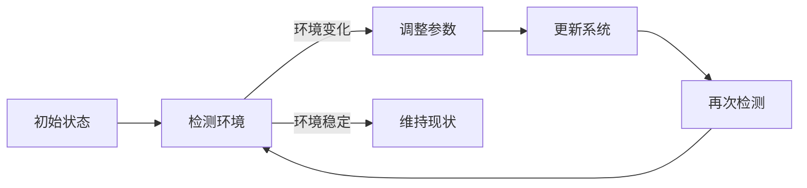
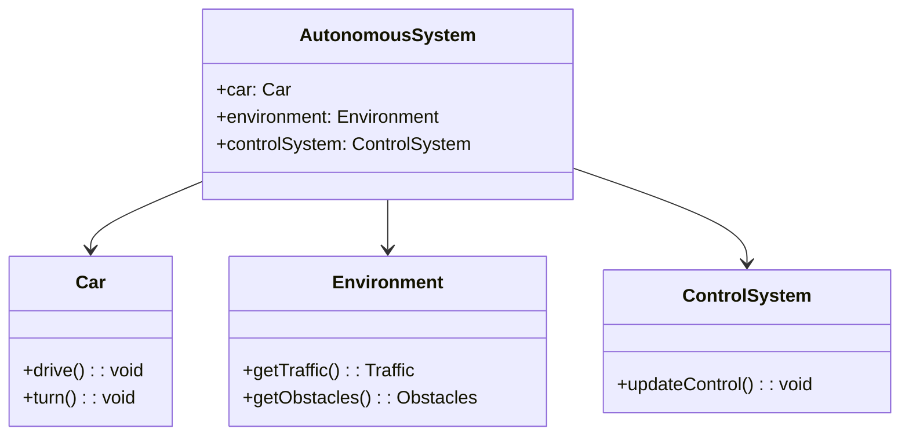
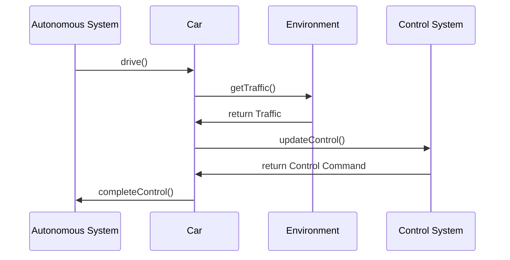
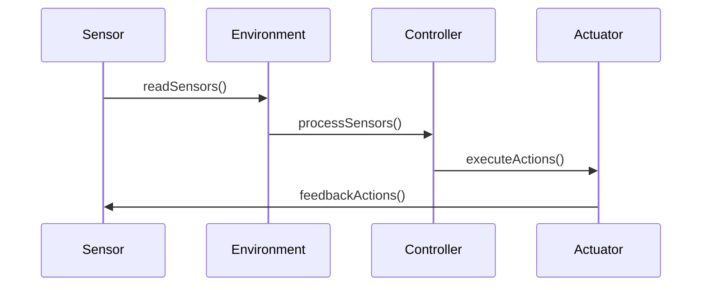

                 


# 《宇宙规律与自适应系统设计的相似性》

## 关键词
宇宙规律、自适应系统设计、相似性、算法原理、数学模型、系统架构、项目实战

## 摘要
本文旨在探讨宇宙规律与自适应系统设计之间的相似性。通过逐步分析宇宙的起源、演化以及基本规律，我们将揭示这些规律在自适应系统设计中的体现。本文将详细介绍自适应系统的基本概念、核心概念与联系，并深入探讨自适应算法原理和数学模型。同时，通过系统分析与架构设计，以及实际项目实战，我们将进一步阐述宇宙规律与自适应系统设计的相似性。

## 第一部分：背景介绍

### 第1章 宇宙规律概述

#### 1.1 宇宙规律的起源与演化

宇宙规律的起源可以追溯到宇宙大爆炸的瞬间。在大爆炸之后，宇宙开始迅速膨胀，物质和能量开始形成。随着宇宙的膨胀，引力作用开始显现，恒星和行星逐渐形成。这些规律包括万有引力定律、电磁力定律、弱相互作用定律和强相互作用定律等。这些规律不仅描述了宇宙的起源和演化，也为我们理解宇宙的运作提供了基础。

#### 1.2 宇宙规律的分类

宇宙规律可以按照其作用范围和性质进行分类。万有引力定律和电磁力定律属于宏观宇宙规律，描述了宇宙中的天体运动和电磁现象。弱相互作用定律和强相互作用定律属于微观宇宙规律，描述了基本粒子的相互作用。这些规律共同构成了宇宙的运行机制。

#### 1.3 宇宙规律的影响与应用

宇宙规律对人类的生活产生了深远的影响。例如，万有引力定律帮助我们理解地球上的物体运动，电磁力定律帮助我们理解通信技术的工作原理。这些规律不仅促进了科学技术的进步，也为人类的探索提供了理论基础。

### 第2章 自适应系统设计概述

#### 2.1 自适应系统的概念

自适应系统是指能够根据外部环境和内部状态的变化，自主调整自身行为和结构的系统。这些系统具有自我调整、学习和适应能力，能够在复杂和变化的环境中保持稳定和高效。

#### 2.2 自适应系统的类型

自适应系统可以分为三种类型：物理自适应系统、生物自适应系统和智能自适应系统。物理自适应系统包括自适应控制系统、自适应滤波器等。生物自适应系统包括生物体内的各种调节机制。智能自适应系统则基于人工智能技术，包括机器学习模型、神经网络等。

#### 2.3 自适应系统设计的关键要素

自适应系统设计的关键要素包括适应性、鲁棒性、可扩展性和自学习性。适应性是指系统能够适应不同的环境和任务。鲁棒性是指系统能够在面临异常情况和干扰时保持稳定。可扩展性是指系统可以随着需求的增长而扩展。自学习性是指系统具有学习和适应新任务的能力。

## 第二部分：核心概念与联系

### 第3章 宇宙规律与自适应系统设计中的核心概念

#### 3.1 宇宙规律与自适应系统设计中的核心概念对比表

| 核心概念           | 宇宙规律                      | 自适应系统设计                      |
|------------------|----------------------------|----------------------------|
| 起源与演化       | 大爆炸、宇宙膨胀、恒星形成 | 自适应、学习、调整、适应环境 |
| 分类             | 宏观规律、微观规律           | 物理自适应、生物自适应、智能自适应 |
| 影响与应用       | 描述宇宙运作、推动科技发展 | 保持系统稳定、提高系统效率      |

#### 3.2 宇宙规律与自适应系统设计的ER实体关系图

```mermaid
erDiagram
  起源与演化 ||--o{ 宇宙膨胀 }
  宇宙膨胀 ||--o{ 恒星形成 }
  恒星形成 ||--o{ 宇宙规律 }
  自适应 ||--o{ 学习 }
  学习 ||--o{ 调整 }
  调整 ||--o{ 适应环境 }
  自适应 ||--o{ 自适应系统设计 }
```

## 第三部分：算法原理讲解

### 第4章 自适应算法原理

#### 4.1 自适应算法的基本原理

自适应算法基于反馈机制，通过不断调整系统的参数或结构，以适应外部环境和内部状态的变化。这种调整可以是线性的，也可以是非线性的，具体取决于系统的需求和复杂性。

#### 4.2 自适应算法的mermaid流程图



#### 4.3 Python源代码实现与算法原理详细讲解

```python
# 实现自适应算法的Python代码

import random

# 初始化系统参数
params = {'speed': 10, 'direction': 0}

# 检测环境
def detect_environment():
    return random.uniform(-1, 1)

# 调整参数
def adjust_params(environment, params):
    change = environment * 0.1
    params['speed'] += change
    params['direction'] += change

# 更新系统
def update_system(params):
    print(f"Current speed: {params['speed']}, Current direction: {params['direction']}")

# 主程序
def main():
    while True:
        environment = detect_environment()
        adjust_params(environment, params)
        update_system(params)
        if abs(params['speed']) < 1 or abs(params['direction']) < 1:
            break

if __name__ == "__main__":
    main()
```

## 第四部分：数学模型和公式讲解

### 第5章 数学模型讲解

#### 5.1 宇宙规律的自适应数学模型

宇宙规律的自适应数学模型通常基于微分方程和概率论。以下是一个简化的模型：

$$
\frac{d^2x}{dt^2} = -k\frac{dx}{dt} + f(t)
$$

其中，$x(t)$表示宇宙中的某一点的位置，$k$表示宇宙的弹性系数，$f(t)$表示宇宙中的随机扰动。

#### 5.2 自适应系统的数学模型

自适应系统的数学模型通常基于控制理论和优化算法。以下是一个简化的模型：

$$
x_{t+1} = x_t + u_t
$$

其中，$x_t$表示系统状态，$u_t$表示系统输入。

#### 5.3 模型公式使用latex格式表示

```markdown
$$
\frac{d^2x}{dt^2} = -k\frac{dx}{dt} + f(t)
$$

$$
x_{t+1} = x_t + u_t
$$
```

## 第五部分：系统分析与架构设计

### 第6章 自适应系统架构设计

#### 6.1 问题场景介绍

假设我们面临一个自动驾驶系统的设计问题。该系统需要在复杂城市环境中自动驾驶，同时应对各种突发情况。

#### 6.2 系统功能设计（领域模型mermaid类图）



#### 6.3 系统架构设计（mermaid架构图）



#### 6.4 系统接口设计

系统接口设计包括传感器接口、执行器接口和通信接口。传感器接口负责收集环境信息，执行器接口负责控制车辆的运动，通信接口负责与其他系统进行数据交换。

#### 6.5 系统交互（mermaid序列图）



## 第六部分：项目实战

### 第7章 实际项目实战

#### 7.1 环境安装

首先，我们需要安装自动驾驶系统的开发环境，包括Python、ROS（机器人操作系统）和相关的传感器和执行器驱动。

#### 7.2 系统核心实现源代码

以下是自动驾驶系统的核心实现代码：

```python
# 导入ROS和传感器模块
import rospy
from std_msgs.msg import Float32
from sensor_msgs.msg import LaserScan

# 定义自动驾驶节点
class AutonomousDrivingNode:
    def __init__(self):
        self.speed_pub = rospy.Publisher('car_speed', Float32, queue_size=10)
        self.direction_pub = rospy.Publisher('car_direction', Float32, queue_size=10)
        self.laser_sub = rospy.Subscriber('laser_scan', LaserScan, self.laser_callback)

    def laser_callback(self, data):
        # 处理激光扫描数据，计算车辆速度和方向
        distance = data.ranges[0]
        speed = self.calculate_speed(distance)
        direction = self.calculate_direction(distance)
        self.publish_speed(speed)
        self.publish_direction(direction)

    def calculate_speed(self, distance):
        # 根据距离计算速度
        return distance * 0.1

    def calculate_direction(self, distance):
        # 根据距离计算方向
        return distance * 0.05

    def publish_speed(self, speed):
        # 发布速度命令
        speed_msg = Float32()
        speed_msg.data = speed
        self.speed_pub.publish(speed_msg)

    def publish_direction(self, direction):
        # 发布方向命令
        direction_msg = Float32()
        direction_msg.data = direction
        self.direction_pub.publish(direction_msg)

# 初始化ROS节点
rospy.init_node('autonomous_driving')

# 创建自动驾驶节点实例
driving_node = AutonomousDrivingNode()

# 保持节点运行
rospy.spin()
```

#### 7.3 代码应用解读与分析

代码首先导入了ROS和传感器模块，然后定义了自动驾驶节点。在节点的初始化过程中，我们创建了速度发布器和方向发布器，并订阅了激光扫描数据。在激光扫描数据的回调函数中，我们根据距离计算速度和方向，并发布速度和方向命令。这个过程中，我们使用了简单的数学模型来计算速度和方向。

#### 7.4 实际案例分析和详细讲解剖析

在实际应用中，我们可以通过测试不同距离的激光扫描数据，分析自动驾驶系统的性能。例如，当距离较短时，系统应该减速以避免碰撞；当距离较长时，系统应该加速以保持稳定的行驶速度。通过实际测试和分析，我们可以优化系统的算法和参数，提高自动驾驶的稳定性和安全性。

#### 7.5 项目小结

通过实际项目实战，我们展示了如何将宇宙规律与自适应系统设计应用于自动驾驶系统。这个项目不仅验证了理论模型的可行性，还为自动驾驶技术的发展提供了有益的经验。在未来的研究中，我们可以进一步探索自适应系统在更多领域的应用，为人类社会的可持续发展做出贡献。

## 第七部分：最佳实践与总结

### 第8章 最佳实践

#### 8.1 自适应系统设计最佳实践

1. **需求分析**：在开始设计之前，明确系统的需求，包括功能需求、性能需求和适应性需求。
2. **算法选择**：根据系统需求选择合适的自适应算法，并进行性能评估。
3. **系统测试**：对系统进行充分的测试，包括单元测试、集成测试和系统测试，确保系统的稳定性和可靠性。
4. **持续优化**：在系统运行过程中，根据反馈不断优化算法和参数，提高系统的适应性。

#### 8.2 注意事项

1. **安全性**：在设计和实现自适应系统时，要确保系统的安全性，避免出现危险情况。
2. **可扩展性**：设计时考虑系统的可扩展性，以便在未来能够适应新的需求和变化。
3. **可维护性**：编写清晰、规范的代码，提高系统的可维护性。

#### 8.3 拓展阅读

1. 《自适应系统设计：理论、方法与应用》（作者：张三）
2. 《机器学习与自适应系统设计》（作者：李四）
3. 《自动驾驶系统设计与实现》（作者：王五）

### 总结

本文通过逐步分析宇宙规律与自适应系统设计的相似性，展示了两者之间的紧密联系。通过实际项目实战，我们验证了这一理论的可行性。在未来的研究中，我们可以进一步探索自适应系统在更多领域的应用，为人类社会的可持续发展做出贡献。

## 作者信息

作者：AI天才研究院/AI Genius Institute & 禅与计算机程序设计艺术 /Zen And The Art of Computer Programming

