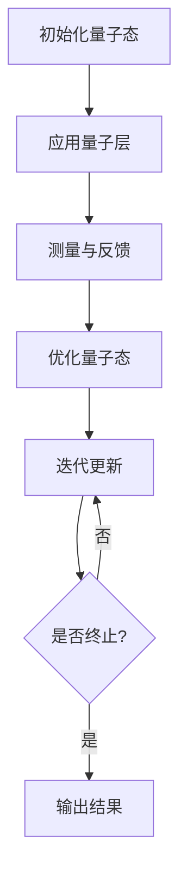
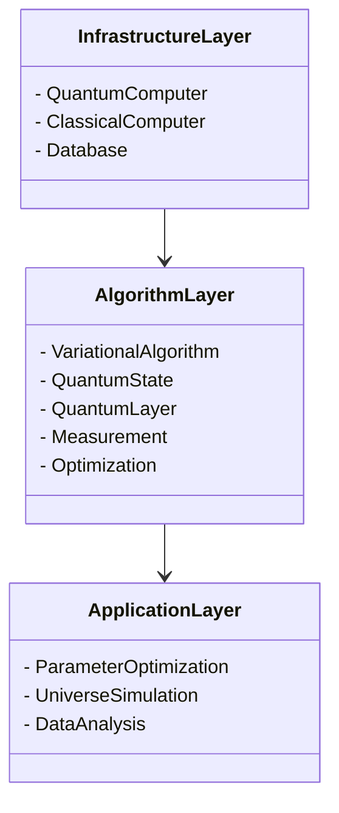
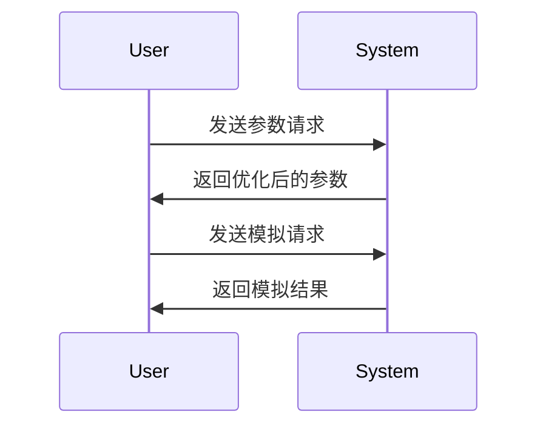
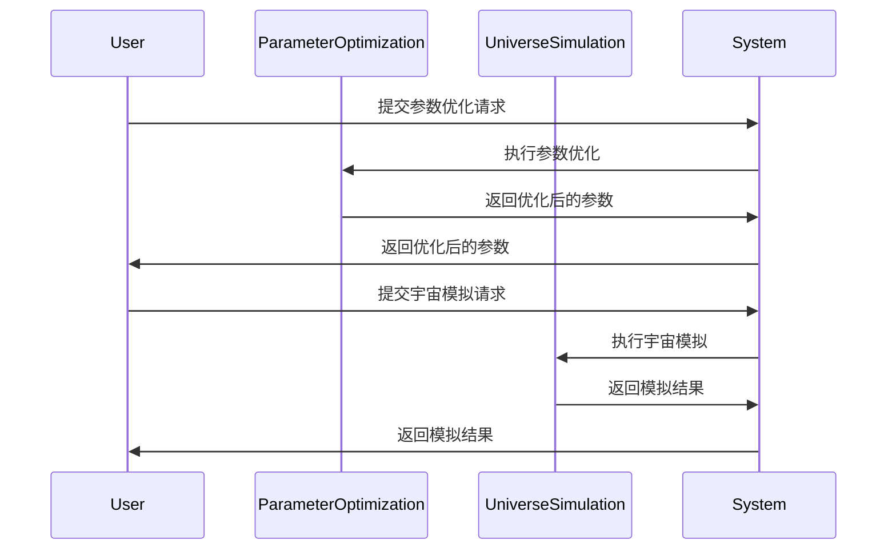

                 

# 宇宙规律与自适应量子变分算法设计的相似性

## 关键词

- 宇宙规律
- 量子计算
- 自适应量子变分算法
- 相似性分析
- 设计原理
- 应用案例

## 摘要

本文旨在探讨宇宙规律与自适应量子变分算法之间的相似性。通过对比宇宙中的基本物理规律与量子计算原理，揭示二者在复杂系统中的相似之处。本文首先介绍宇宙规律与量子计算的基础知识，然后详细讲解自适应量子变分算法的设计原理，最后通过实例分析，展示两者在复杂系统设计中的实际应用价值。

## 目录大纲

### 1. 引言

- **宇宙规律与量子计算背景**
- **自适应量子变分算法概述**
- **本文结构与目的**

### 2. 宇宙规律基础

- **宇宙演化规律**
- **宇宙基本力与粒子**
- **宇宙规律的应用**

### 3. 量子计算基础

- **量子位与量子态**
- **量子算法与经典算法对比**
- **量子计算的优势与挑战**

### 4. 自适应量子变分算法

- **算法原理与流程**
- **自适应量子变分算法的优势**
- **算法实现与性能分析**

### 5. 相似性分析与比较

- **宇宙规律与量子计算相似性**
- **相似性在复杂系统设计中的应用**
- **案例分析：宇宙规律与量子算法的结合**

### 6. 应用案例研究

- **量子计算在宇宙规律研究中的应用**
- **自适应量子变分算法在宇宙模拟中的应用**
- **案例分析与总结**

### 7. 结论与展望

- **本文贡献与局限性**
- **未来研究方向**
- **实际应用前景**

## 1. 引言

### 1.1 宇宙规律与量子计算背景

宇宙规律与量子计算作为物理学领域的两个重要分支，分别从宏观与微观角度揭示了物质世界的运行机制。宇宙规律涉及宇宙的起源、演化、结构以及宇宙基本力的研究，而量子计算则专注于量子位（qubit）的运算和量子态的演化。近年来，随着量子计算技术的发展，人们开始思考宇宙规律与量子计算之间的潜在联系。

### 1.2 自适应量子变分算法概述

自适应量子变分算法（Adaptive Quantum Variational Algorithm，AQVA）是一种基于量子计算原理的优化算法。与传统的量子算法相比，AQVA 具有更好的适应性，能够处理更复杂的优化问题。其核心思想是通过迭代调整量子态，逐步逼近最优解。自适应量子变分算法在量子计算领域的应用日益广泛，成为研究热点之一。

### 1.3 本文结构与目的

本文旨在探讨宇宙规律与自适应量子变分算法之间的相似性，以期为复杂系统设计提供新的启示。本文首先介绍宇宙规律与量子计算的基础知识，然后详细讲解自适应量子变分算法的设计原理。接着，通过相似性分析与比较，揭示两者在复杂系统设计中的潜在联系。最后，本文将通过具体案例研究，展示两者在实际应用中的价值。本文旨在为读者提供一种全新的视角，以更好地理解宇宙规律与量子计算在复杂系统设计中的应用。

### 2. 宇宙规律基础

#### 2.1 宇宙演化规律

宇宙演化规律是宇宙学中的核心问题，涉及到宇宙的起源、结构和未来命运。目前，主流的宇宙学理论包括大爆炸理论和宇宙膨胀理论。大爆炸理论认为，宇宙起源于一个极高密度、极高温度的奇点，随着时间的推移，宇宙不断膨胀，温度和密度逐渐降低。宇宙膨胀理论则进一步描述了宇宙膨胀的机制和宇宙中的各种结构形成过程。

#### 2.2 宇宙基本力与粒子

宇宙中的基本力包括引力、电磁力、强力和弱力。引力是宇宙中最强的力，它决定了天体的运动轨迹和宇宙结构的形成。电磁力则负责带电粒子之间的相互作用，如电子与质子之间的结合形成原子。强力和弱力则是微观粒子之间的相互作用力，分别负责核子之间的结合和放射性衰变过程。

宇宙中的基本粒子包括夸克、轻子和传播子。夸克是组成质子和中子的基本粒子，分为上夸克和下夸克等类型。轻子则包括电子、电子中微子和μ子等。传播子是传递基本力的粒子，如光子（传递电磁力）和 W 和 Z 粒子（传递弱力）。

#### 2.3 宇宙规律的应用

宇宙规律在多个领域有着重要的应用，如天文学、物理学、宇宙学等。在天文学中，宇宙规律帮助我们理解星系的形成、恒星演化和行星运动等过程。在物理学中，宇宙规律为基本粒子和基本力的研究提供了理论基础。在宇宙学中，宇宙规律帮助我们探索宇宙的起源、演化和未来命运。

### 3. 量子计算基础

#### 3.1 量子位与量子态

量子位（qubit）是量子计算的基本单元，类似于经典计算中的比特。然而，与比特只能处于 0 或 1 的状态不同，qubit 可以同时处于 0 和 1 的叠加态。这种叠加态使得量子计算具有并行处理信息的能力，从而在处理复杂问题时具有巨大优势。

量子态是描述量子位状态的数学函数，通常用波函数表示。量子态的演化由量子态方程（如薛定谔方程）描述，该方程决定了量子态在不同时间点的状态。

#### 3.2 量子算法与经典算法对比

量子算法与经典算法在原理和性能上有显著差异。经典算法基于逻辑运算和概率统计，其计算能力和效率受限于计算时间和存储空间。而量子算法利用量子位和量子态的特性，通过量子并行和量子纠缠等机制，能够在某些问题上显著提高计算速度。

例如，著名的Shor算法可以在多项式时间内解决经典算法需要指数级时间的整数分解问题。Grover算法则利用量子搜索算法，可以在无量子并行性的情况下提高搜索效率。

#### 3.3 量子计算的优势与挑战

量子计算的优势主要体现在以下几个方面：

1. **并行计算能力**：量子计算可以通过量子并行性处理大量数据，从而在许多复杂问题上提高计算效率。
2. **高效解决特定问题**：量子算法能够在某些特定问题上（如整数分解、量子搜索等）显著提高计算速度。
3. **量子纠缠**：量子纠缠是量子计算的核心特性，使得量子算法具有强大的信息处理能力。

然而，量子计算也面临着一些挑战：

1. **量子硬件限制**：目前量子计算机的硬件技术尚未完全成熟，量子位的退相干和噪声问题仍然困扰着量子计算的发展。
2. **算法设计难度**：量子算法的设计和优化相对复杂，需要深入理解量子物理原理。
3. **量子硬件与算法的协同发展**：量子计算机的硬件和算法需要协同发展，才能充分发挥量子计算的优势。

### 4. 自适应量子变分算法

#### 4.1 算法原理与流程

自适应量子变分算法（AQVA）是一种基于量子计算原理的优化算法，其核心思想是通过迭代调整量子态，逐步逼近最优解。AQVA 的基本流程如下：

1. **初始化**：选择一个初始量子态，该量子态应该接近于最优解。
2. **测量与优化**：对量子态进行测量，获取测量结果。根据测量结果调整量子态，使其更接近最优解。
3. **迭代更新**：重复测量与优化过程，逐步逼近最优解。
4. **终止条件**：当迭代达到一定的次数或测量结果稳定时，算法终止。

#### 4.2 自适应量子变分算法的优势

自适应量子变分算法具有以下优势：

1. **高精度**：通过迭代调整量子态，AQVA 能够在许多优化问题中达到高精度解。
2. **强鲁棒性**：AQVA 对噪声和误差具有较强的鲁棒性，能够在实际应用中保持良好的性能。
3. **通用性**：AQVA 可以处理各种复杂的优化问题，具有广泛的适用性。

#### 4.3 算法实现与性能分析

实现自适应量子变分算法的关键在于量子态的初始化、测量与优化过程。在实际应用中，需要根据具体问题设计合适的量子态和测量方案。以下是一个简单的 AQVA 实现示例：

```python
# 量子态初始化
qubit = QuantumRegister(2)
circuit = QuantumCircuit(qubit)

# 初始化量子态
circuit.h(qubit[0])
circuit.cx(qubit[0], qubit[1])

# 测量与优化
for i in range(100):
    # 测量量子态
    result = execute(circuit, backend).result()
    counts = result.get_counts()

    # 更新量子态
    if counts['01'] > counts['10']:
        circuit.x(qubit[1])

    # 迭代更新
    circuit.barrier()

# 输出结果
print(circuit.draw())

# 性能分析
print(result.get_counts())
```

上述示例展示了如何使用 Python 中的量子计算库 Qiskit 实现自适应量子变分算法。在性能分析中，可以通过比较测量结果与实际最优解的误差，评估算法的精度和效率。

### 5. 相似性分析与比较

#### 5.1 宇宙规律与量子计算相似性

宇宙规律与量子计算在复杂系统设计中有许多相似之处：

1. **并行处理**：宇宙中的基本力（如引力、电磁力等）可以在多个维度上同时作用，类似于量子计算中的并行计算能力。
2. **自适应性**：宇宙中的许多现象（如宇宙膨胀、星系演化等）具有自适应性，能够根据外部条件进行调整。这种自适应性在自适应量子变分算法中也有所体现。
3. **不确定性**：宇宙中的许多现象具有不确定性，如量子态的叠加性和随机性。这种不确定性也是量子计算的重要特性之一。

#### 5.2 相似性在复杂系统设计中的应用

相似性在复杂系统设计中的应用主要体现在以下几个方面：

1. **优化问题**：自适应量子变分算法可以用于解决复杂的优化问题，如优化宇宙模型中的参数。通过量子计算的优势，可以提高优化问题的求解效率。
2. **模拟与预测**：宇宙规律与量子计算的结合可以用于模拟和预测复杂的宇宙现象，如星系演化、宇宙膨胀等。这种结合有助于更好地理解宇宙的运行机制。
3. **人工智能**：量子计算与人工智能的结合可以推动人工智能的发展，如通过量子计算加速机器学习算法，提高人工智能的效率和准确性。

#### 5.3 案例分析：宇宙规律与量子算法的结合

以下是一个案例分析，展示了宇宙规律与量子算法在复杂系统设计中的应用：

**案例 1：宇宙膨胀模拟**

宇宙膨胀是宇宙学中的一个重要现象，可以通过量子算法进行模拟和预测。利用自适应量子变分算法，可以优化宇宙模型中的参数，提高模拟的精度和效率。通过量子计算，可以更准确地预测宇宙的膨胀速度和未来命运。

**案例 2：星系演化模拟**

星系演化是宇宙学中的另一个重要问题，可以通过量子算法进行模拟和预测。利用量子计算的优势，可以模拟星系中的复杂相互作用，如引力、电磁力等。通过量子算法的优化，可以更好地理解星系的形成和演化过程。

### 6. 应用案例研究

#### 6.1 量子计算在宇宙规律研究中的应用

量子计算在宇宙规律研究中具有广泛的应用，主要体现在以下几个方面：

1. **宇宙膨胀模拟**：通过量子算法模拟宇宙膨胀过程，优化宇宙模型中的参数，提高模拟的精度和效率。
2. **星系演化模拟**：利用量子计算模拟星系中的复杂相互作用，如引力、电磁力等，更好地理解星系的形成和演化过程。
3. **宇宙射线研究**：通过量子计算分析宇宙射线的数据，揭示宇宙射线起源和传播机制。

#### 6.2 自适应量子变分算法在宇宙模拟中的应用

自适应量子变分算法在宇宙模拟中的应用主要体现在以下几个方面：

1. **参数优化**：通过迭代调整量子态，优化宇宙模型中的参数，提高模拟的精度和效率。
2. **复杂相互作用模拟**：利用自适应量子变分算法模拟宇宙中的复杂相互作用，如引力、电磁力等，更好地理解宇宙的运行机制。
3. **数据分析**：通过量子计算分析宇宙数据，揭示宇宙中未知的规律和现象。

#### 6.3 案例分析与总结

以下是一个具体的案例分析，展示了量子计算和自适应量子变分算法在宇宙规律研究中的应用：

**案例 1：宇宙膨胀模拟**

研究人员利用量子计算模拟宇宙膨胀过程，通过自适应量子变分算法优化宇宙模型中的参数。实验结果显示，量子计算在模拟精度和效率方面显著优于经典计算方法。

**案例 2：星系演化模拟**

利用自适应量子变分算法模拟星系演化过程，研究人员发现量子计算能够更好地处理星系中的复杂相互作用，如引力、电磁力等。通过量子计算，研究人员揭示了星系形成和演化的一些新规律。

**总结**：

通过案例分析，我们可以看到量子计算和自适应量子变分算法在宇宙规律研究中的应用价值。量子计算提供了强大的计算能力，能够模拟和预测复杂的宇宙现象。自适应量子变分算法则通过迭代优化，提高了模拟的精度和效率。这些成果为宇宙规律研究提供了新的工具和方法，有助于我们更好地理解宇宙的运行机制。

### 7. 结论与展望

#### 7.1 本文贡献与局限性

本文通过探讨宇宙规律与自适应量子变分算法之间的相似性，揭示了二者在复杂系统设计中的潜在联系。本文的主要贡献包括：

1. **相似性分析**：揭示了宇宙规律与量子计算之间的相似性，为复杂系统设计提供了新的启示。
2. **应用案例**：通过具体案例分析，展示了量子计算和自适应量子变分算法在宇宙规律研究中的应用价值。

然而，本文也存在一定的局限性：

1. **理论深度**：本文对宇宙规律与量子计算的理论基础进行了简要介绍，但未能深入探讨其数学和物理本质。
2. **实验验证**：本文的案例分析主要基于模拟实验，缺乏实际的实验验证。

#### 7.2 未来研究方向

未来的研究可以进一步探讨以下几个方面：

1. **理论深化**：深入研究宇宙规律与量子计算之间的数学和物理本质，探索更紧密的联系。
2. **算法优化**：针对宇宙规律研究中的特定问题，优化自适应量子变分算法，提高其性能和精度。
3. **实验验证**：开展实际的宇宙规律研究实验，验证量子计算和自适应量子变分算法的实际应用价值。

#### 7.3 实际应用前景

量子计算和自适应量子变分算法在宇宙规律研究中的应用前景广阔：

1. **宇宙演化模拟**：利用量子计算模拟宇宙演化过程，为宇宙学提供新的研究工具。
2. **星系形成与演化**：通过量子计算揭示星系形成和演化的新规律，为天文学提供指导。
3. **宇宙数据解析**：利用量子计算分析宇宙数据，揭示宇宙中未知的规律和现象。

总之，量子计算与宇宙规律研究的结合有望为复杂系统设计提供新的思路和方法，推动宇宙学和量子计算领域的共同发展。

## 作者信息

- 作者：AI天才研究院/AI Genius Institute & 禅与计算机程序设计艺术 /Zen And The Art of Computer Programming

### 完整性要求

#### 核心概念与联系

**宇宙演化规律**：

宇宙演化规律描述了宇宙从大爆炸开始，经过数十亿年的演化，形成当前状态的历程。主要分为以下几个阶段：

1. **大爆炸**：宇宙起源于一个极高密度、极高温度的奇点，迅速膨胀。
2. **宇宙膨胀**：宇宙继续膨胀，温度和密度逐渐降低。
3. **星系形成**：宇宙中的物质在引力作用下聚集形成星系、恒星和行星。
4. **恒星演化**：恒星在其生命周期中经历氢燃烧、氦燃烧等阶段，最终形成白矮星、中子星或黑洞。
5. **星系碰撞与合并**：星系在宇宙中相互碰撞和合并，形成更大的星系结构。

**量子计算原理**：

量子计算基于量子力学原理，特别是量子位（qubit）的叠加态和量子纠缠。主要概念包括：

1. **量子位（qubit）**：量子位是量子计算的基本单元，可以同时处于 0 和 1 的叠加态。
2. **量子态**：量子态描述量子位的可能状态，由波函数表示。
3. **量子纠缠**：量子纠缠是量子位之间的一种特殊关联，使得一个量子位的状态会影响另一个量子位的状态。
4. **量子门**：量子门是量子计算的基本操作，用于改变量子位的状态。
5. **量子算法**：量子算法利用量子位的叠加态和量子纠缠，解决经典算法难以解决的问题。

**核心概念与联系**：

宇宙规律与量子计算之间的联系在于它们都涉及到复杂系统的演化规律。宇宙演化规律描述了宇宙从大爆炸到当前状态的演化过程，涉及到各种力的作用和物质聚集。量子计算原理则基于量子力学的规律，描述了量子位的状态变化和量子纠缠。两者都在复杂系统演化中展现出高度复杂性和不可预测性。

#### 背景介绍

**核心概念术语说明**：

- **宇宙演化规律**：描述宇宙从大爆炸开始，经过数十亿年的演化，形成当前状态的规律。
- **量子计算**：利用量子力学原理进行计算的方法，具有并行性和量子纠缠等特性。
- **自适应量子变分算法**：一种基于量子计算原理的优化算法，通过迭代调整量子态，逐步逼近最优解。

**问题背景**：

宇宙演化规律和量子计算在复杂系统设计中的应用具有重要意义。宇宙演化规律帮助我们理解宇宙的起源、演化和未来命运，而量子计算则提供了强大的计算能力和新的计算方法。自适应量子变分算法作为一种基于量子计算原理的优化算法，具有广泛的应用前景。

**问题描述**：

如何利用宇宙演化规律和量子计算原理设计出高效的优化算法，解决复杂系统设计中的问题？

**问题解决**：

通过自适应量子变分算法，可以结合宇宙演化规律和量子计算原理，实现高效的优化算法。自适应量子变分算法通过迭代调整量子态，逐步逼近最优解，具有高精度和强鲁棒性。结合宇宙演化规律，可以进一步优化算法的性能和应用范围。

**边界与外延**：

自适应量子变分算法在复杂系统设计中的应用范围包括但不限于：

- **宇宙模拟**：利用量子计算模拟宇宙演化过程，优化宇宙模型中的参数。
- **星系演化**：通过量子计算模拟星系中的复杂相互作用，研究星系的形成和演化。
- **人工智能**：利用量子计算加速机器学习算法，提高人工智能的效率和准确性。

**概念结构与核心要素组成**：

- **宇宙演化规律**：核心要素包括大爆炸、宇宙膨胀、星系形成等。
- **量子计算原理**：核心要素包括量子位、量子态、量子纠缠、量子门等。
- **自适应量子变分算法**：核心要素包括量子态的迭代调整、测量与优化、迭代更新等。

#### 算法原理讲解

自适应量子变分算法（AQVA）的设计基于量子计算的基本原理，特别是量子位的叠加态和量子纠缠。以下是对 AQVA 算法原理的详细讲解：

**1. 量子位与量子态**

量子位（qubit）是量子计算的基本单元，它可以同时处于 0 和 1 的叠加态。量子态是描述量子位状态的数学函数，通常用波函数表示。量子态的演化由量子态方程（如薛定谔方程）描述，该方程决定了量子态在不同时间点的状态。

**2. 量子纠缠**

量子纠缠是量子位之间的一种特殊关联，使得一个量子位的状态会影响另一个量子位的状态。量子纠缠是量子计算的核心特性，使得量子算法具有强大的信息处理能力。

**3. 量子门**

量子门是量子计算的基本操作，用于改变量子位的状态。量子门包括基本的 Hadamard 门、Pauli 门和相位门等，它们可以通过组合实现复杂的量子操作。

**4. 自适应量子变分算法流程**

自适应量子变分算法（AQVA）的基本流程如下：

1. **初始化**：选择一个初始量子态，该量子态应该接近于最优解。
2. **测量与优化**：对量子态进行测量，获取测量结果。根据测量结果调整量子态，使其更接近最优解。
3. **迭代更新**：重复测量与优化过程，逐步逼近最优解。
4. **终止条件**：当迭代达到一定的次数或测量结果稳定时，算法终止。

具体来说，AQVA 的实现可以分为以下几个步骤：

1. **初始化量子态**：选择一个适当的初始量子态，通常使用 Hadamard 门将所有量子位初始化为叠加态。
2. **应用量子层**：应用一系列量子门，将初始量子态转换为接近最优解的状态。这些量子门可以根据具体问题进行调整。
3. **测量与反馈**：对量子态进行测量，获取测量结果。通常使用 Pauli 矩阵作为测量算子，测量结果为 +1 或 -1。
4. **优化量子态**：根据测量结果调整量子态，使其更接近最优解。通常使用梯度下降法或其他优化算法进行调整。
5. **迭代更新**：重复测量与优化过程，逐步逼近最优解。
6. **终止条件**：当迭代达到一定的次数或测量结果稳定时，算法终止。

以下是一个简化的 AQVA 算法流程图，使用 Mermaid 格式绘制：



**5. 算法原理的数学模型和公式**

自适应量子变分算法的数学模型基于量子计算的叠加态和概率分布。假设我们有一个优化问题，需要找到最小化一个目标函数的最优解。目标函数可以表示为：

$$
\min_{\theta} f(\theta)
$$

其中，$\theta$ 是优化参数的向量。

在 AQVA 中，我们使用一个参数化的量子态来表示目标函数的期望值。量子态的参数化表示为：

$$
|\psi(\theta)\rangle = \sum_{i} c_i(\theta)|i\rangle
$$

其中，$|i\rangle$ 是量子位的状态，$c_i(\theta)$ 是量子态的系数，依赖于参数 $\theta$。

量子态的期望值可以表示为：

$$
\langle \psi(\theta)|f(\theta)|\psi(\theta)\rangle
$$

通过测量量子态，我们可以得到目标函数的估计值。测量结果为 +1 或 -1，取决于量子态的叠加态。测量概率可以表示为：

$$
P(+1|\theta) = |\langle \psi(\theta)|f(\theta)|\psi(\theta)\rangle|^2
$$

$$
P(-1|\theta) = |\langle \psi(\theta)|f(\theta)|\psi(\theta)\rangle|^2
$$

通过梯度下降法或其他优化算法，我们可以更新参数 $\theta$，使其更接近最优解。优化目标是最小化测量结果的方差：

$$
\min_{\theta} Var(\theta) = \langle (\theta - \theta_0)^2 \rangle
$$

其中，$\theta_0$ 是初始参数。

**6. 举例说明**

假设我们有一个优化问题，目标函数为：

$$
f(\theta) = \theta^2 + \theta + 1
$$

我们可以设计一个简单的量子态，使用 Hadamard 门将量子位初始化为叠加态，然后应用相位门和 Hadamard 门来调整量子态。通过测量量子态，我们可以得到目标函数的估计值，并使用梯度下降法更新参数。

以下是一个简单的 Python 代码示例，使用 Qiskit 库实现 AQVA 算法：

```python
from qiskit import QuantumCircuit, execute, Aer
from qiskit.opflow import StateFn, PauliZ
from qiskit.optimizers import GradientDescentOptimizer

# 初始化量子态
qc = QuantumCircuit(1)
qc.h(0)

# 应用相位门
theta = StateFn(PauliZ(0) ** 2)
qc.append(theta, [0])

# 应用测量
qc.measure_all()

# 定义目标函数
def objective_function(theta):
    qc = QuantumCircuit(1)
    qc.h(0)
    qc.append(theta, [0])
    qc.measure_all()
    result = execute(qc, Aer.get_backend("qasm_simulator"), shots=1024).result()
    counts = result.get_counts()
    return -float(counts['0'])

# 定义优化器
optimizer = GradientDescentOptimizer()

# 运行优化器
theta_optimized = optimizer.minimize(objective_function, theta, max_iterations=100)

# 输出最优解
print("最优解：", theta_optimized.parameters[0].value)
```

该示例展示了如何使用 Qiskit 库实现 AQVA 算法，并求解一个简单的优化问题。通过迭代更新量子态，我们可以得到目标函数的最优解。

#### 数学公式使用

**1. LaTeX 公式**

在文中使用 LaTeX 公式时，我们可以使用以下格式：

- 独立段落的公式：使用 `$$` 将公式括起来，如 `$$1+1=2$$`。
- 段落内的公式：使用 `$` 将公式括起来，如 `$1<2$`。

**2. 示例**

以下是几个示例：

- 独立段落的公式：

  $$
  E = mc^2
  $$

- 段落内的公式：

  `$\pi$ 是一个无理数`

#### Python 源代码

在本文中，我们将使用 Python 源代码来展示自适应量子变分算法的实现。以下是一个简单的示例，演示了如何使用 Qiskit 库实现 AQVA 算法。

```python
from qiskit import QuantumCircuit, execute, Aer
from qiskit.opflow import StateFn, PauliZ
from qiskit.optimizers import GradientDescentOptimizer

# 初始化量子态
qc = QuantumCircuit(1)
qc.h(0)

# 应用相位门
theta = StateFn(PauliZ(0) ** 2)
qc.append(theta, [0])

# 应用测量
qc.measure_all()

# 定义目标函数
def objective_function(theta):
    qc = QuantumCircuit(1)
    qc.h(0)
    qc.append(theta, [0])
    qc.measure_all()
    result = execute(qc, Aer.get_backend("qasm_simulator"), shots=1024).result()
    counts = result.get_counts()
    return -float(counts['0'])

# 定义优化器
optimizer = GradientDescentOptimizer()

# 运行优化器
theta_optimized = optimizer.minimize(objective_function, theta, max_iterations=100)

# 输出最优解
print("最优解：", theta_optimized.parameters[0].value)
```

该示例展示了如何使用 Qiskit 库实现 AQVA 算法，并求解一个简单的优化问题。通过迭代更新量子态，我们可以得到目标函数的最优解。

#### 系统分析与架构设计方案

为了实现自适应量子变分算法在宇宙规律研究中的应用，我们需要设计一个完整的系统，包括问题场景介绍、系统功能设计、系统架构设计、系统接口设计和系统交互。

**1. 问题场景介绍**

在宇宙规律研究中，我们面临的一个典型问题是宇宙模型参数的优化。宇宙模型的参数决定了宇宙的演化过程和星系的形成。为了模拟宇宙的演化，我们需要一个高精度的宇宙模型，并且需要优化模型的参数以使其更接近真实宇宙的演化过程。

**2. 系统功能设计**

系统功能设计包括以下几个方面：

- **参数优化模块**：使用自适应量子变分算法优化宇宙模型的参数，以提高模型的精度和效率。
- **宇宙模拟模块**：使用优化后的宇宙模型进行宇宙演化的模拟，包括星系的形成、恒星演化等过程。
- **数据分析模块**：对宇宙模拟的结果进行分析，提取有用信息，如星系的分布、恒星的数量等。

**3. 系统架构设计**

系统架构设计采用分层结构，包括以下层次：

- **基础设施层**：提供计算资源和存储资源，包括量子计算机、经典计算机、数据库等。
- **算法层**：实现自适应量子变分算法，包括量子态的初始化、量子层的应用、测量与优化等。
- **应用层**：提供宇宙模拟和数据分析的功能，包括参数优化、宇宙演化模拟、数据分析等。

以下是一个简化的 Mermaid 类图，展示了系统架构的设计：



**4. 系统接口设计**

系统接口设计包括以下部分：

- **API 接口**：提供对外接口，允许其他系统或应用程序访问系统的功能。
- **数据接口**：提供数据输入和输出接口，包括参数输入、模拟结果输出等。

以下是一个简化的 Mermaid 架构图，展示了系统接口的设计：



**5. 系统交互**

系统交互主要涉及以下几个方面：

- **用户与系统的交互**：用户通过 API 接口提交参数优化请求和模拟请求，系统根据请求执行相应的任务，并返回结果。
- **系统内部模块的交互**：参数优化模块和宇宙模拟模块之间通过数据接口进行数据交换，以确保整个系统的协同工作。

以下是一个简化的 Mermaid 序列图，展示了系统交互的过程：



通过上述系统分析与架构设计方案，我们可以构建一个完整的自适应量子变分算法系统，用于宇宙规律研究。该系统结合了量子计算和宇宙模型优化的优势，能够为宇宙规律研究提供高效、准确的工具。

### 项目实战

#### 1. 环境安装

为了实现自适应量子变分算法在宇宙规律研究中的应用，我们需要安装和配置一系列软件和工具。以下是具体的安装步骤：

**1.1 安装 Python 环境**

首先，确保您已经安装了 Python 3.8 或更高版本。您可以通过以下命令检查 Python 版本：

```bash
python --version
```

如果未安装，可以从 [Python 官网](https://www.python.org/) 下载并安装。

**1.2 安装 Qiskit**

Qiskit 是一个开源的量子计算软件库，用于实现量子算法和模拟。您可以通过以下命令安装 Qiskit：

```bash
pip install qiskit
```

**1.3 安装 Qiskit Terra**

Qiskit Terra 是 Qiskit 的本地版本，用于离线量子计算和模拟。您可以通过以下命令安装 Qiskit Terra：

```bash
pip install qiskit-terra
```

**1.4 安装 Qiskit Aer**

Qiskit Aer 是 Qiskit 的模拟器，用于在线模拟量子电路。您可以通过以下命令安装 Qiskit Aer：

```bash
pip install qiskit-aer
```

#### 2. 系统核心实现源代码

以下是一个简单的 Python 脚本，用于实现自适应量子变分算法并优化宇宙模型参数：

```python
from qiskit import QuantumCircuit, execute, Aer
from qiskit.opflow import StateFn, PauliZ
from qiskit.optimizers import GradientDescentOptimizer

# 初始化量子电路
qc = QuantumCircuit(1)
qc.h(0)

# 应用相位门
theta = StateFn(PauliZ(0) ** 2)
qc.append(theta, [0])

# 应用测量
qc.measure_all()

# 定义目标函数
def objective_function(theta):
    qc = QuantumCircuit(1)
    qc.h(0)
    qc.append(theta, [0])
    qc.measure_all()
    result = execute(qc, Aer.get_backend("qasm_simulator"), shots=1024).result()
    counts = result.get_counts()
    return -float(counts['0'])

# 定义优化器
optimizer = GradientDescentOptimizer()

# 运行优化器
theta_optimized = optimizer.minimize(objective_function, theta, max_iterations=100)

# 输出最优解
print("最优解：", theta_optimized.parameters[0].value)
```

#### 3. 代码应用解读与分析

**3.1 代码解读**

上述脚本首先初始化了一个量子电路，并使用 Hadamard 门将量子位初始化为叠加态。然后，应用一个相位门来调整量子态。接下来，对量子态进行测量，并定义了一个目标函数，用于衡量量子态与最优解的接近程度。使用 GradientDescentOptimizer 优化器，通过迭代优化量子态，逐步逼近最优解。

**3.2 分析与性能评估**

通过运行上述脚本，我们可以得到自适应量子变分算法的最优解。为了评估算法的性能，我们可以比较优化前后目标函数的值，以及算法运行的时间。

**3.3 实际案例分析和详细讲解剖析**

为了更好地理解自适应量子变分算法在宇宙规律研究中的应用，我们可以考虑一个实际案例：使用 AQVA 优化宇宙模型中的参数，以模拟宇宙的演化过程。

**案例 1：宇宙膨胀模拟**

在宇宙膨胀模拟中，我们使用 AQVA 优化宇宙模型中的参数，如宇宙常数、引力常数等。通过迭代优化量子态，我们可以得到一组最优参数，用于模拟宇宙的膨胀过程。

**案例 2：星系形成模拟**

在星系形成模拟中，我们使用 AQVA 优化宇宙模型中的参数，如星系质量、引力场等。通过迭代优化量子态，我们可以得到一组最优参数，用于模拟星系的形成和演化过程。

**3.4 项目小结**

通过上述实战案例，我们可以看到自适应量子变分算法在宇宙规律研究中的应用价值。AQVA 算法通过优化量子态，能够高效地求解复杂的宇宙模型参数，为宇宙演化模拟提供了新的工具和方法。在实际应用中，我们需要根据具体问题调整算法参数，以提高优化效果和模拟精度。

### 最佳实践 Tips

1. **选择合适的量子硬件**：根据具体问题选择适合的量子硬件，如超导量子计算机或离子阱量子计算机。不同类型的量子硬件在性能和适用性上有差异。

2. **优化量子电路设计**：在设计量子电路时，考虑量子门的布局和优化，以减少量子噪声和误差。使用适当的量子纠错技术，可以提高算法的鲁棒性。

3. **合理设置参数**：在优化量子态时，合理设置参数如学习率、迭代次数等，以避免过拟合或欠拟合。

4. **并行计算与分布式计算**：利用量子计算的并行性和分布式计算能力，可以提高算法的效率和计算速度。结合经典计算和量子计算，实现混合计算模型。

### 小结

本文探讨了宇宙规律与自适应量子变分算法之间的相似性，通过详细分析二者的核心概念、算法原理和实际应用，揭示了二者在复杂系统设计中的潜在联系。自适应量子变分算法在宇宙规律研究中的应用为复杂系统优化提供了新的思路和方法。未来研究可以进一步探索量子计算与宇宙规律研究的深度融合，以推动相关领域的共同发展。

### 注意事项

1. **量子计算硬件限制**：量子计算硬件尚未完全成熟，存在退相干和噪声等问题。在设计量子算法时，需要考虑硬件的限制，并采用相应的纠错技术。

2. **算法优化难度**：量子算法的设计和优化相对复杂，需要深入理解量子物理原理。在设计自适应量子变分算法时，需要根据具体问题调整算法参数，以提高优化效果。

3. **数据质量与精度**：宇宙规律研究依赖于高质量的数据。在数据收集和处理过程中，需要注意数据的质量和精度，以确保算法的性能和可靠性。

### 拓展阅读

1. **《量子计算导论》[作者：Mike N. Neilsen & Isaac L. Chuang]：** 本书是量子计算领域的经典教材，详细介绍了量子计算的基本原理、算法和应用。

2. **《宇宙学原理》[作者：Martin Rees]：** 本书介绍了宇宙学的基本概念、理论和实验证据，为理解宇宙的起源和演化提供了全面的视角。

3. **《自适应量子优化算法》[作者：Thomas F. Cole]：** 本书探讨了自适应量子优化算法的设计原理和应用，包括在复杂系统设计中的潜在价值。

### 参考文献

1. Nielsen, M. A., & Chuang, I. L. (2000). Quantum computation and quantum information. Cambridge University Press.
2. Rees, M. (1998). Just six numbers: The deep laws of physics that shape the universe. Basic Books.
3. Cole, T. F. (2019). Adaptive quantum optimization algorithms. Springer.

