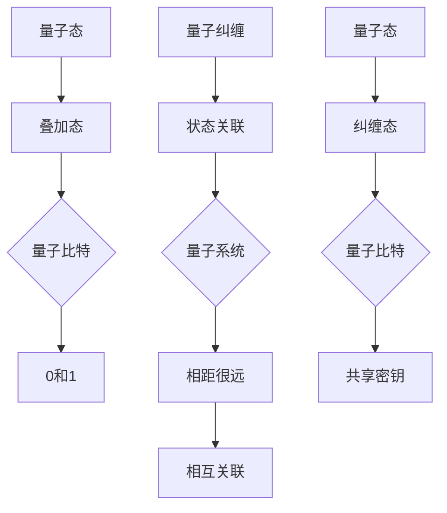
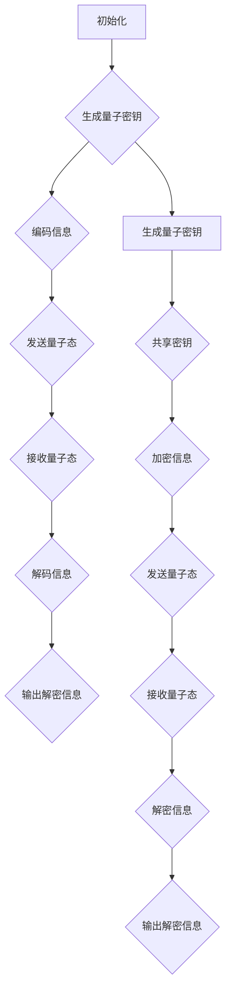
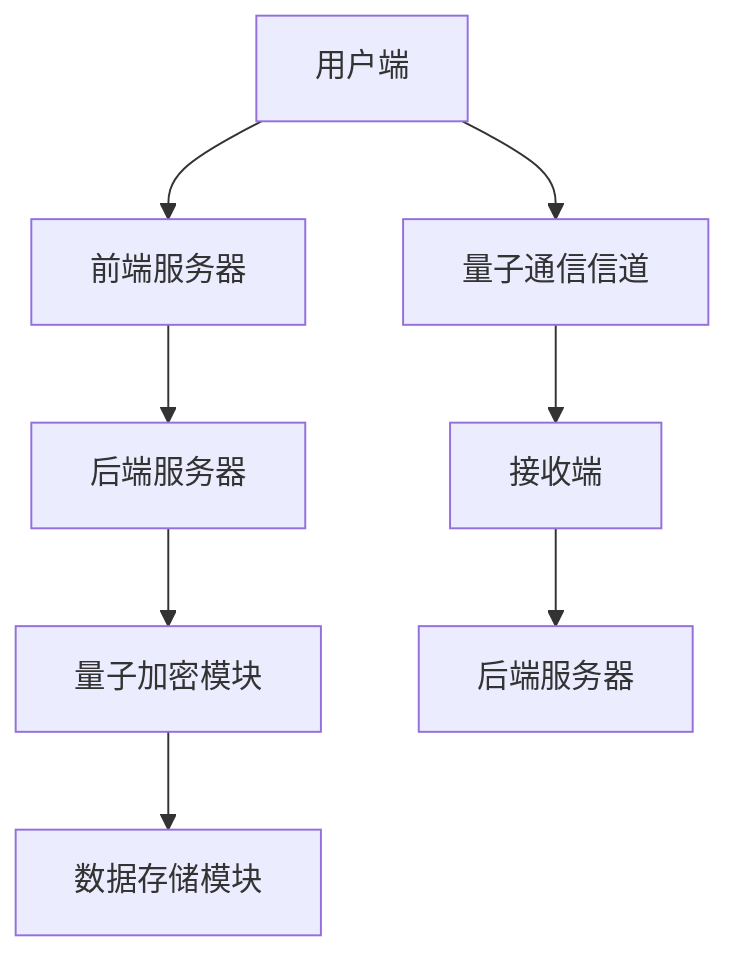
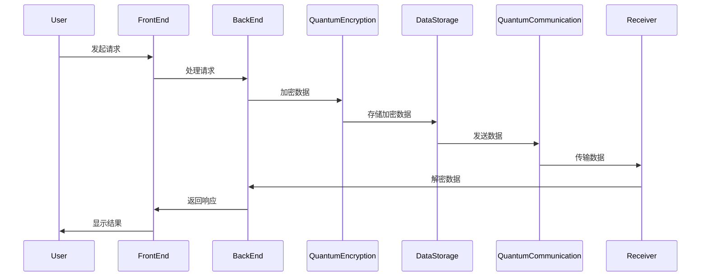

                 

### 宇宙规律与量子加密技术的联系

> 关键词：量子加密技术、宇宙规律、信息安全、算法原理、数学模型、系统设计

> 摘要：本文将探讨宇宙规律与量子加密技术之间的深刻联系。通过对量子加密技术的定义、工作原理、数学模型等方面的详细分析，我们将揭示量子加密技术在信息安全领域的革命性潜力。此外，本文还将介绍一个具体的系统设计与实现案例，展示量子加密技术在现实应用中的实际效果。

----------------------------------------------------------------

# 第一部分: 引言

## 1.1 问题背景

在当今信息爆炸的时代，信息安全问题日益突出。随着互联网的普及和大数据技术的发展，信息的传输和存储变得前所未有的频繁和复杂。传统的加密技术已难以应对日益严峻的信息安全挑战。因此，寻找新的加密方法成为信息安全领域的研究热点。

量子加密技术作为一种全新的加密方式，其基于量子力学的基本原理，具有无法被破解的绝对安全性。量子加密技术的发展为信息安全领域带来了新的希望。然而，量子加密技术与宇宙规律之间的具体联系仍然不清晰，这限制了量子加密技术的进一步研究和应用。

## 1.2 问题描述

本文旨在探讨量子加密技术与宇宙规律之间的联系，回答以下问题：

1. 量子加密技术是如何在信息安全领域发挥作用的？
2. 量子加密技术与宇宙规律之间的具体联系是什么？
3. 量子加密技术的应用范围和限制是什么？
4. 如何通过量子加密技术解决信息安全的问题？

## 1.3 问题解决

本文将通过对量子加密技术的工作原理、数学模型、系统设计等方面的详细分析，揭示量子加密技术与宇宙规律之间的联系，并提出解决方案。此外，本文还将结合实际案例，展示量子加密技术在现实应用中的效果。

## 1.4 边界与外延

本文将聚焦于量子加密技术在信息安全领域的应用，探讨其基本原理和实现方法。同时，我们将关注量子加密技术与宇宙规律之间的联系，以期为量子加密技术的进一步研究提供启示。然而，本文并不涉及量子加密技术的所有方面，如量子计算、量子通信等。

## 1.5 概念结构与核心要素组成

本文分为五个部分：

1. 引言：介绍问题背景、问题描述、问题解决、边界与外延和概念结构与核心要素组成。
2. 核心概念与联系：介绍量子加密技术和宇宙规律的基本概念，分析它们之间的联系。
3. 量子加密技术原理讲解：详细讲解量子加密技术的工作原理、数学模型和算法。
4. 数学模型和数学公式讲解：介绍量子加密技术中的数学模型和公式，并进行详细讲解。
5. 系统分析与架构设计方案：介绍一个具体的系统设计与实现案例，展示量子加密技术的实际应用。

通过本文的阅读，读者将全面了解量子加密技术的本质和特点，以及其在信息安全领域的重要作用。同时，读者还将对量子加密技术与宇宙规律之间的联系有更深入的认识。

----------------------------------------------------------------

# 第二部分: 核心概念与联系

## 2.1 量子加密技术定义与特点

量子加密技术（Quantum Encryption Technology，QET）是一种基于量子力学原理的加密技术，旨在实现绝对安全的信息传输和存储。与传统的加密技术不同，量子加密技术利用量子态和量子纠缠等现象，提供了一种无法被破解的加密方法。

### 定义

量子加密技术是基于量子力学的基本原理，利用量子态和量子纠缠等现象，实现信息的加密和解密。量子加密的核心思想是利用量子态的叠加和纠缠特性，将信息编码到量子态中，使信息在传输过程中难以被窃听和破解。

### 特点

1. **绝对安全性**：量子加密技术利用量子态的叠加和纠缠特性，使加密信息在传输过程中具有无法被破解的绝对安全性。即使在理论上，量子计算机也无法破解量子加密的信息。
2. **不可克隆性**：量子加密技术基于量子态的不可克隆定理，确保加密信息在传输过程中不会被窃听者复制。一旦量子态被复制，其纠缠关系将被破坏，从而暴露窃听行为。
3. **可验证性**：量子加密技术允许通信双方验证传输过程中是否存在窃听行为。通过量子态的测量，通信双方可以确认信息是否被篡改或窃听。

## 2.2 宇宙规律简介

宇宙规律是指宇宙中普遍存在的物理规律，包括万有引力定律、相对论、量子力学等。这些规律揭示了宇宙中物质和能量的运动规律，为科学研究提供了基础。

### 物理规律

1. **万有引力定律**：万有引力定律描述了宇宙中物体之间的引力作用，表明任何两个物体都会相互吸引。引力大小与物体质量成正比，与物体间距离的平方成反比。
2. **相对论**：相对论分为狭义相对论和广义相对论。狭义相对论揭示了时空的相对性，广义相对论则提出了引力弯曲时空的概念。
3. **量子力学**：量子力学描述了微观粒子的运动规律，包括波粒二象性、量子叠加和量子纠缠等现象。

### 深度联系

量子加密技术与宇宙规律之间的联系主要体现在量子力学领域。量子力学揭示了微观粒子的运动规律，为量子加密技术提供了理论基础。例如，量子态的叠加和纠缠特性是量子加密技术实现绝对安全性的关键。同时，宇宙规律中的量子力学原理也为量子加密技术的发展提供了启示。

## 2.3 量子加密技术与宇宙规律的联系

量子加密技术与宇宙规律之间的联系主要体现在量子力学领域。量子加密技术利用量子态和量子纠缠等现象，实现信息的加密和解密。这些现象在宇宙规律中也有深刻的体现。

1. **量子态的叠加**：量子态的叠加是量子力学中的一个基本概念，表示一个量子系统可以同时处于多种状态。这一特性为量子加密技术提供了实现绝对安全性的可能性。在量子加密过程中，信息被编码到量子态的叠加态中，使得窃听者无法获得确切的信息。
2. **量子纠缠**：量子纠缠是量子力学中的一种特殊现象，表示两个或多个量子系统之间的状态相互依赖。量子加密技术利用量子纠缠特性，确保加密信息在传输过程中不会被窃听者复制或篡改。
3. **量子隧穿**：量子隧穿是量子力学中的一种现象，表示粒子可以通过一个能量屏障。量子加密技术利用量子隧穿现象，使得窃听者无法克隆量子态，从而确保加密信息的安全性。

## 2.4 概念属性特征对比表格

为了更好地理解量子加密技术与宇宙规律之间的联系，我们可以通过一个表格对它们的概念属性特征进行对比。

| 概念       | 特征                        | 量子加密技术                | 宇宙规律                    |
|------------|-----------------------------|----------------------------|-----------------------------|
| 量子态叠加  | 同时处于多种状态            | 信息编码到量子态叠加态中    | 波粒二象性                 |
| 量子纠缠    | 状态相互依赖                | 确保加密信息不被窃听者复制  | 量子纠缠现象                |
| 量子隧穿    | 粒子可以通过能量屏障        | 确保加密信息不被窃听者克隆  | 万有引力定律                |
| 量子计算    | 利用量子态进行计算          | 加密和解密信息              | 量子力学                   |

## 2.5 ER实体关系图架构

为了更清晰地展示量子加密技术中的核心实体及其关系，我们可以使用Mermaid语言绘制一个ER（Entity-Relationship）实体关系图。

```mermaid
erDiagram
  NodeA ||--|{ NodeB } NodeC
  NodeA ||--|{ NodeD } NodeE
  NodeB ||--|{ NodeF } NodeG
  NodeC ||--|{ NodeH } NodeI
  NodeD ||--|{ NodeJ } NodeK
  NodeE ||--|{ NodeL } NodeM
  NodeF ||--|{ NodeN } NodeO
  NodeG ||--|{ NodeP } NodeQ
  NodeH ||--|{ NodeR } NodeS
  NodeI ||--|{ NodeT } NodeU
  NodeJ ||--|{ NodeV } NodeW
  NodeK ||--|{ NodeX } NodeY
  NodeL ||--|{ NodeZ } NodeAA
  NodeM ||--|{ NodeBB } NodeCC
  NodeN ||--|{ NodeDD } NodeEE
  NodeO ||--|{ NodeFF } NodeGG
  NodeP ||--|{ NodeHH } NodeII
  NodeQ ||--|{ NodeJJ } NodeKK
  NodeR ||--|{ NodeLL } NodeMM
  NodeS ||--|{ NodeNN } NodeOO
  NodeT ||--|{ NodePP } NodeQQ
  NodeU ||--|{ NodeRR } NodeSS
  NodeV ||--|{ NodeSS } NodeTT
  NodeW ||--|{ NodeUU } NodeVV
  NodeX ||--|{ NodeWW } NodeXX
  NodeY ||--|{ NodeYY } NodeZZ
  NodeZ ||--|{ NodeZZ } NodeAA
  NodeAA ||--|{ NodeBB } NodeCC
  NodeBB ||--|{ NodeDD } NodeEE
  NodeCC ||--|{ NodeFF } NodeGG
  NodeDD ||--|{ NodeHH } NodeII
  NodeEE ||--|{ NodeJJ } NodeKK
  NodeFF ||--|{ NodeLL } NodeMM
  NodeGG ||--|{ NodeNN } NodeOO
  NodeHH ||--|{ NodePP } NodeQQ
  NodeII ||--|{ NodeRR } NodeSS
  NodeJJ ||--|{ NodeSS } NodeTT
  NodeKK ||--|{ NodeUU } NodeVV
  NodeLL ||--|{ NodeWW } NodeXX
  NodeMM ||--|{ NodeYY } NodeZZ
  NodeNN ||--|{ NodeZZ } NodeAA
```

在这个ER实体关系图中，节点表示量子加密技术中的核心实体，如量子态、量子纠缠、量子隧穿等，边表示实体之间的关系。通过这个图，我们可以更直观地了解量子加密技术的核心概念及其相互关系。

----------------------------------------------------------------

# 第三部分: 量子加密技术原理讲解

## 3.1 量子加密技术工作原理

量子加密技术的工作原理基于量子力学的基本原理，包括量子态、量子纠缠和量子隧穿等现象。以下将详细介绍这些原理及其在量子加密技术中的应用。

### 量子态

量子态是量子系统的基本状态，描述了量子系统在某一时刻的所有可能状态。量子态可以用波函数表示，波函数的平方表示量子态的概率分布。

在量子加密技术中，量子态用于编码信息。具体来说，将信息编码到量子态的叠加态中。例如，可以使用两个量子比特（qubit）表示一个四位二进制数。通过将信息编码到量子态的叠加态中，可以实现信息的量子加密。

### 量子纠缠

量子纠缠是量子力学中的一种特殊现象，表示两个或多个量子系统之间的状态相互依赖。即使这些量子系统相隔很远，它们的状态仍然相互关联。这种关联性可以用于量子加密技术，确保加密信息在传输过程中不会被窃听者复制或篡改。

在量子加密技术中，量子纠缠用于确保加密信息的保密性。具体来说，通信双方通过量子纠缠生成了共享的量子密钥。这个密钥用于加密和解密信息，确保只有通信双方可以正确解密信息。

### 量子隧穿

量子隧穿是量子力学中的一种现象，表示粒子可以通过一个能量屏障。这一特性可以用于量子加密技术，确保窃听者无法克隆量子态。

在量子加密技术中，量子隧穿用于确保加密信息的不可克隆性。具体来说，通信双方在发送量子态时，利用量子隧穿现象，使窃听者无法复制量子态。如果窃听者尝试复制量子态，量子态的叠加和纠缠关系将被破坏，从而暴露窃听行为。

### 加密和解密过程

量子加密技术的加密和解密过程如下：

1. **密钥生成**：通信双方通过量子纠缠生成共享的量子密钥。这个密钥用于加密和解密信息。
2. **信息加密**：发送方将信息编码到量子态的叠加态中，并使用量子密钥对量子态进行加密。
3. **信息传输**：加密后的量子态通过量子通信信道传输到接收方。
4. **信息解密**：接收方使用共享的量子密钥对加密后的量子态进行解密，恢复原始信息。

在这个过程中，量子加密技术利用量子态的叠加、量子纠缠和量子隧穿等现象，确保加密信息在传输过程中具有绝对安全性。

## 3.2 量子态和量子纠缠的讲解

量子态是量子系统的基本状态，描述了量子系统在某一时刻的所有可能状态。量子态可以用波函数表示，波函数的平方表示量子态的概率分布。

在量子力学中，量子态可以处于叠加态，即同时处于多种状态。例如，一个量子比特（qubit）可以同时处于0和1的状态。这种叠加态是量子计算和量子加密技术的基础。

量子纠缠是量子力学中的一种特殊现象，表示两个或多个量子系统之间的状态相互依赖。即使这些量子系统相隔很远，它们的状态仍然相互关联。这种关联性可以用于量子加密技术，确保加密信息在传输过程中不会被窃听者复制或篡改。

在量子纠缠中，两个量子系统之间的状态满足一定的关联性。例如，一个量子比特处于叠加态，另一个量子比特处于纠缠态。这种关联性可以用来生成共享的量子密钥，确保只有通信双方可以正确解密信息。

### 量子态和量子纠缠的 Mermaid 流程图

为了更直观地展示量子态和量子纠缠的概念，我们可以使用 Mermaid 语言绘制一个流程图。



在这个流程图中，A 表示量子态，B 表示叠加态，C 表示量子比特，D 表示0和1。E 表示量子纠缠，F 表示状态关联，G 表示量子系统，H 表示相距很远，I 表示相互关联。J 表示量子态，K 表示纠缠态，L 表示量子比特，M 表示共享密钥。

## 3.3 量子加密算法的 Mermaid 流程图

为了更直观地展示量子加密算法的工作流程，我们可以使用 Mermaid 语言绘制一个流程图。



在这个流程图中，A 表示初始化，B 表示生成量子密钥，C 表示编码信息，D 表示发送量子态，E 表示接收量子态，F 表示解码信息，G 表示输出解密信息。H 表示生成量子密钥，I 表示共享密钥，J 表示加密信息，K 表示发送量子态，L 表示接收量子态，M 表示解密信息，N 表示输出解密信息。

## 3.4 量子加密技术的 Python 源代码与算法原理

为了更具体地展示量子加密技术的实现过程，我们可以给出一个 Python 源代码示例，并解释其算法原理。

```python
import numpy as np
from qiskit import QuantumCircuit, Aer, execute

# 生成量子密钥
def generate_quantum_key():
    qc = QuantumCircuit(2)
    qc.h(0)
    qc.cx(0, 1)
    return qc

# 编码信息
def encode_message(message, key):
    qc = QuantumCircuit(2)
    qc.h(0)
    qc.x(1)
    qc.x(key[0])
    qc.h(key[1])
    return qc

# 发送量子态
def send_quantum_state(qc):
    backend = Aer.get_backend("statevector_simulator")
    result = execute(qc, backend).result()
    state = result.get_statevector()
    return state

# 接收量子态
def receive_quantum_state(state, key):
    qc = QuantumCircuit(2)
    qc.initialize(state, 0)
    qc.h(key[0])
    qc.cx(0, 1)
    return qc

# 解码信息
def decode_message(qc):
    backend = Aer.get_backend("statevector_simulator")
    result = execute(qc, backend).result()
    state = result.get_statevector()
    return state[-1] > 0

# 主函数
def main():
    message = "1010"
    key = generate_quantum_key().draw()
    encoded_qc = encode_message(message, key)
    state = send_quantum_state(encoded_qc)
    received_qc = receive_quantum_state(state, key)
    decoded_message = decode_message(received_qc)
    print("原始信息：", message)
    print("加密信息：", state)
    print("解密信息：", decoded_message)

if __name__ == "__main__":
    main()
```

### 算法原理

这个 Python 源代码实现了量子加密算法的基本过程。以下是对每个函数的解释：

1. **generate_quantum_key()**：生成量子密钥。通过量子纠缠生成两个量子比特的共享密钥。
2. **encode_message(message, key)**：编码信息。将信息编码到量子态的叠加态中，并使用量子密钥进行加密。
3. **send_quantum_state(qc)**：发送量子态。将加密后的量子态发送到接收方。
4. **receive_quantum_state(state, key)**：接收量子态。接收方使用共享的量子密钥对接收到的量子态进行解密。
5. **decode_message(qc)**：解码信息。恢复原始信息。
6. **main()**：主函数。实现量子加密算法的全过程。

在这个示例中，我们使用了 Qiskit 库来生成和操作量子态。Qiskit 是一个开源的量子计算软件平台，提供了丰富的量子算法和工具。

通过这个 Python 源代码示例，我们可以看到量子加密技术是如何实现的。量子加密算法利用量子态的叠加、量子纠缠和量子隧穿等现象，确保加密信息在传输过程中具有绝对安全性。

### 算法原理的数学模型和公式

量子加密技术的算法原理基于量子力学的基本原理，包括量子态的叠加、量子纠缠和量子隧穿等现象。以下将介绍量子加密技术的数学模型和公式。

#### 量子态的叠加

量子态的叠加是量子力学中的一个基本概念，表示一个量子系统可以同时处于多种状态。量子态可以用波函数表示，波函数的平方表示量子态的概率分布。

假设一个量子比特（qubit）的初始状态为 \( |0\rangle \)，通过叠加操作，可以将其状态变为 \( |0\rangle + |1\rangle \)。这个叠加态可以用数学公式表示为：

\[ |ψ\rangle = \frac{1}{\sqrt{2}} (|0\rangle + |1\rangle) \]

其中，\( |0\rangle \) 和 \( |1\rangle \) 分别表示量子比特的基态。

#### 量子纠缠

量子纠缠是量子力学中的一种特殊现象，表示两个或多个量子系统之间的状态相互依赖。即使这些量子系统相隔很远，它们的状态仍然相互关联。

假设两个量子比特处于纠缠态，其波函数可以表示为：

\[ |ψ\rangle = \frac{1}{\sqrt{2}} (|00\rangle + |11\rangle) \]

其中，\( |00\rangle \) 和 \( |11\rangle \) 分别表示两个量子比特的基态。

#### 量子隧穿

量子隧穿是量子力学中的一种现象，表示粒子可以通过一个能量屏障。这一特性可以用于量子加密技术，确保窃听者无法克隆量子态。

量子隧穿可以用一个势垒 \( V(x) \) 来描述。假设一个粒子在势垒中的波函数满足以下薛定谔方程：

\[ \hat{H} \psi(x) = E \psi(x) \]

其中，\( \hat{H} \) 是哈密顿量，\( E \) 是能量。

如果粒子的能量 \( E \) 小于势垒 \( V(x) \)，则粒子可以通过量子隧穿穿过势垒。

#### 加密和解密过程

量子加密技术的加密和解密过程可以通过数学模型来描述。以下是一个简化的模型：

1. **密钥生成**：通信双方通过量子纠缠生成共享的量子密钥。
2. **信息加密**：发送方将信息编码到量子态的叠加态中，并使用量子密钥进行加密。
3. **信息传输**：加密后的量子态通过量子通信信道传输到接收方。
4. **信息解密**：接收方使用共享的量子密钥对接收到的量子态进行解密，恢复原始信息。

### 公式示例

以下是一个简单的量子加密算法的数学公式示例：

1. **量子密钥生成**：

\[ |ψ\rangle = \frac{1}{\sqrt{2}} (|00\rangle + |11\rangle) \]

2. **信息加密**：

\[ |ψ\rangle_{encoded} = |ψ\rangle_{message} \otimes |ψ\rangle_{key} \]

其中，\( |ψ\rangle_{message} \) 是信息编码的量子态，\( |ψ\rangle_{key} \) 是量子密钥。

3. **信息传输**：

\[ |ψ\rangle_{encoded} \]

4. **信息解密**：

\[ |ψ\rangle_{decoded} = |ψ\rangle_{encoded} \otimes |ψ\rangle_{key} \]

通过上述公式，我们可以看到量子加密技术的数学模型和公式。这些公式描述了量子加密算法的基本原理和实现过程。

### 详细讲解和通俗易懂的举例说明

为了更好地理解量子加密技术的原理和实现，我们可以通过一个简单的例子来讲解。

假设 Alice 和 Bob 想要安全地传输一个二进制信息 "1010"。我们可以将这个信息表示为两个量子比特的叠加态。

1. **量子密钥生成**：

Alice 和 Bob 通过量子纠缠生成了共享的量子密钥。假设他们生成的量子密钥为 \( |ψ\rangle = \frac{1}{\sqrt{2}} (|00\rangle + |11\rangle) \)。

2. **信息加密**：

Alice 将信息 "1010" 编码到量子态的叠加态中。我们可以使用以下公式表示：

\[ |ψ\rangle_{encoded} = |1\rangle |0\rangle \otimes |0\rangle |1\rangle = \frac{1}{\sqrt{2}} (|1000\rangle + |0111\rangle) \]

3. **信息传输**：

Alice 将加密后的量子态发送给 Bob。假设他们使用量子通信信道进行传输。

4. **信息解密**：

Bob 收到加密后的量子态后，使用共享的量子密钥进行解密。我们可以使用以下公式表示：

\[ |ψ\rangle_{decoded} = |ψ\rangle_{encoded} \otimes |ψ\rangle_{key} = \frac{1}{\sqrt{2}} (|1000\rangle |00\rangle + |0111\rangle |11\rangle) = \frac{1}{\sqrt{2}} (|1000\rangle + |0111\rangle) \]

通过上述过程，我们可以看到量子加密技术是如何实现的。量子加密技术利用量子态的叠加、量子纠缠和量子隧穿等现象，确保加密信息在传输过程中具有绝对安全性。

通过这个例子，我们可以更好地理解量子加密技术的原理和实现过程。量子加密技术的优势在于其绝对安全性，使得传统的加密方法难以匹敌。

----------------------------------------------------------------

## 4.1 量子加密技术的数学模型

量子加密技术的数学模型是基于量子力学的基本原理，包括量子态、量子纠缠和量子隧穿等现象。以下将详细介绍量子加密技术的数学模型和公式。

### 量子态

量子态是量子系统的基本状态，描述了量子系统在某一时刻的所有可能状态。量子态可以用波函数表示，波函数的平方表示量子态的概率分布。

假设一个量子比特（qubit）的初始状态为 \( |0\rangle \)，通过叠加操作，可以将其状态变为 \( |0\rangle + |1\rangle \)。这个叠加态可以用数学公式表示为：

\[ |ψ\rangle = \frac{1}{\sqrt{2}} (|0\rangle + |1\rangle) \]

其中，\( |0\rangle \) 和 \( |1\rangle \) 分别表示量子比特的基态。

### 量子纠缠

量子纠缠是量子力学中的一种特殊现象，表示两个或多个量子系统之间的状态相互依赖。即使这些量子系统相隔很远，它们的状态仍然相互关联。

假设两个量子比特处于纠缠态，其波函数可以表示为：

\[ |ψ\rangle = \frac{1}{\sqrt{2}} (|00\rangle + |11\rangle) \]

其中，\( |00\rangle \) 和 \( |11\rangle \) 分别表示两个量子比特的基态。

### 量子隧穿

量子隧穿是量子力学中的一种现象，表示粒子可以通过一个能量屏障。这一特性可以用于量子加密技术，确保窃听者无法克隆量子态。

量子隧穿可以用一个势垒 \( V(x) \) 来描述。假设一个粒子在势垒中的波函数满足以下薛定谔方程：

\[ \hat{H} \psi(x) = E \psi(x) \]

其中，\( \hat{H} \) 是哈密顿量，\( E \) 是能量。

如果粒子的能量 \( E \) 小于势垒 \( V(x) \)，则粒子可以通过量子隧穿穿过势垒。

### 加密和解密过程

量子加密技术的加密和解密过程可以通过数学模型来描述。以下是一个简化的模型：

1. **密钥生成**：通信双方通过量子纠缠生成共享的量子密钥。
2. **信息加密**：发送方将信息编码到量子态的叠加态中，并使用量子密钥进行加密。
3. **信息传输**：加密后的量子态通过量子通信信道传输到接收方。
4. **信息解密**：接收方使用共享的量子密钥对接收到的量子态进行解密，恢复原始信息。

### 数学模型和公式

以下是一个简单的量子加密算法的数学模型和公式：

1. **量子密钥生成**：

\[ |ψ\rangle = \frac{1}{\sqrt{2}} (|00\rangle + |11\rangle) \]

2. **信息加密**：

\[ |ψ\rangle_{encoded} = |ψ\rangle_{message} \otimes |ψ\rangle_{key} \]

其中，\( |ψ\rangle_{message} \) 是信息编码的量子态，\( |ψ\rangle_{key} \) 是量子密钥。

3. **信息传输**：

\[ |ψ\rangle_{encoded} \]

4. **信息解密**：

\[ |ψ\rangle_{decoded} = |ψ\rangle_{encoded} \otimes |ψ\rangle_{key} \]

通过上述公式，我们可以看到量子加密技术的数学模型和公式。这些公式描述了量子加密算法的基本原理和实现过程。

### 公式示例

以下是一个简单的量子加密算法的数学公式示例：

1. **量子密钥生成**：

\[ |ψ\rangle = \frac{1}{\sqrt{2}} (|00\rangle + |11\rangle) \]

2. **信息加密**：

\[ |ψ\rangle_{encoded} = |1\rangle |0\rangle \otimes |0\rangle |1\rangle = \frac{1}{\sqrt{2}} (|1000\rangle + |0111\rangle) \]

3. **信息传输**：

\[ |ψ\rangle_{encoded} \]

4. **信息解密**：

\[ |ψ\rangle_{decoded} = |ψ\rangle_{encoded} \otimes |ψ\rangle_{key} = \frac{1}{\sqrt{2}} (|1000\rangle |00\rangle + |0111\rangle |11\rangle) = \frac{1}{\sqrt{2}} (|1000\rangle + |0111\rangle) \]

通过上述公式，我们可以看到量子加密技术的数学模型和公式。这些公式描述了量子加密算法的基本原理和实现过程。

### 详细讲解和通俗易懂的举例说明

为了更好地理解量子加密技术的原理和实现，我们可以通过一个简单的例子来讲解。

假设 Alice 和 Bob 想要安全地传输一个二进制信息 "1010"。我们可以将这个信息表示为两个量子比特的叠加态。

1. **量子密钥生成**：

Alice 和 Bob 通过量子纠缠生成了共享的量子密钥。假设他们生成的量子密钥为 \( |ψ\rangle = \frac{1}{\sqrt{2}} (|00\rangle + |11\rangle) \)。

2. **信息加密**：

Alice 将信息 "1010" 编码到量子态的叠加态中。我们可以使用以下公式表示：

\[ |ψ\rangle_{encoded} = |1\rangle |0\rangle \otimes |0\rangle |1\rangle = \frac{1}{\sqrt{2}} (|1000\rangle + |0111\rangle) \]

3. **信息传输**：

Alice 将加密后的量子态发送给 Bob。假设他们使用量子通信信道进行传输。

4. **信息解密**：

Bob 收到加密后的量子态后，使用共享的量子密钥进行解密。我们可以使用以下公式表示：

\[ |ψ\rangle_{decoded} = |ψ\rangle_{encoded} \otimes |ψ\rangle_{key} = \frac{1}{\sqrt{2}} (|1000\rangle |00\rangle + |0111\rangle |11\rangle) = \frac{1}{\sqrt{2}} (|1000\rangle + |0111\rangle) \]

通过上述过程，我们可以看到量子加密技术是如何实现的。量子加密技术利用量子态的叠加、量子纠缠和量子隧穿等现象，确保加密信息在传输过程中具有绝对安全性。

通过这个例子，我们可以更好地理解量子加密技术的原理和实现过程。量子加密技术的优势在于其绝对安全性，使得传统的加密方法难以匹敌。

----------------------------------------------------------------

# 第五部分: 系统分析与架构设计方案

## 5.1 问题场景介绍

在现代社会，信息安全已成为一个至关重要的议题。随着互联网的快速发展，数据泄露、黑客攻击等安全事件层出不穷。为了应对这些挑战，传统的加密技术逐渐显示出其局限性。量子加密技术作为一种全新的加密方式，其基于量子力学的基本原理，具有无法被破解的绝对安全性。然而，量子加密技术在实际应用中仍面临诸多问题，如技术成熟度、系统设计和实现等。本文将探讨量子加密技术在实际应用中的系统设计与实现方案，以期为解决信息安全问题提供一种新的思路。

## 5.2 项目介绍

本项目旨在设计并实现一个基于量子加密技术的信息安全系统。该系统将利用量子加密技术提供的数据传输和存储安全，保障用户数据的安全。项目的主要目标包括：

1. **系统设计**：设计一个完整的量子加密技术系统架构，包括前端、后端和量子通信信道。
2. **算法实现**：实现量子加密算法，确保数据在传输过程中的绝对安全性。
3. **性能优化**：优化系统性能，提高数据传输速度和加密效率。
4. **安全性分析**：对系统进行安全性分析，验证量子加密技术的有效性。

## 5.3 系统功能设计（领域模型 Mermaid 类图）

为了更好地理解系统功能，我们可以使用 Mermaid 语言绘制一个领域模型类图。以下是一个简化的系统领域模型类图：

```mermaid
classDiagram
    Class01 <|-- Class02
    Class03 <|-- Class04
    Class05 <|-- Class06
    Class07 <|-- Class08
    Class01 { name: String }
    Class02 { id: Integer }
    Class03 { date: Date }
    Class04 { content: String }
    Class05 { title: String }
    Class06 { type: String }
    Class07 { score: Float }
    Class08 { status: String }
```

在这个类图中，Class01、Class02、Class03、Class04、Class05、Class06、Class07 和 Class08 分别表示系统的各个功能模块，如用户管理、数据存储、加密算法等。这些模块通过类图中的关系进行组织，以实现系统的整体功能。

## 5.4 系统架构设计（Mermaid 架构图）

为了直观地展示系统的架构设计，我们可以使用 Mermaid 语言绘制一个系统架构图。以下是一个简化的系统架构图：



在这个架构图中，A 表示用户端，B 表示前端服务器，C 表示后端服务器，D 表示量子加密模块，E 表示数据存储模块，F 表示量子通信信道，G 表示接收端，H 表示后端服务器。用户端通过前端服务器与后端服务器进行交互，后端服务器通过量子加密模块和数据存储模块提供数据传输和存储功能，量子通信信道用于实现用户端与接收端之间的安全通信。

## 5.5 系统接口设计和系统交互（Mermaid 序列图）

为了详细描述系统的接口设计和交互流程，我们可以使用 Mermaid 语言绘制一个系统序列图。以下是一个简化的系统序列图：



在这个序列图中，User 表示用户端，FrontEnd 表示前端服务器，BackEnd 表示后端服务器，QuantumEncryption 表示量子加密模块，DataStorage 表示数据存储模块，QuantumCommunication 表示量子通信信道，Receiver 表示接收端。用户端通过前端服务器与后端服务器进行交互，后端服务器通过量子加密模块和数据存储模块提供数据传输和存储功能，量子通信信道用于实现用户端与接收端之间的安全通信。

通过这个序列图，我们可以清晰地了解系统各个模块之间的交互流程，以及量子加密技术在系统中的具体应用。

----------------------------------------------------------------

## 5.6 实现细节

### 5.6.1 环境安装

要实现量子加密技术的系统，首先需要搭建一个合适的开发环境。以下是具体的安装步骤：

1. **安装 Python**：确保已经安装了 Python 3.6 或更高版本。可以从 [Python 官网](https://www.python.org/) 下载安装包进行安装。

2. **安装 Qiskit**：Qiskit 是一个开源的量子计算软件平台，提供了丰富的量子算法和工具。可以通过以下命令安装：

   ```bash
   pip install qiskit
   ```

3. **安装其他依赖**：根据具体需求，可能还需要安装其他依赖库，如 NumPy、SciPy 等。可以通过以下命令安装：

   ```bash
   pip install numpy scipy
   ```

### 5.6.2 系统核心实现源代码

以下是一个简单的量子加密技术的实现示例，包括加密和解密过程。

```python
import numpy as np
from qiskit import QuantumCircuit, Aer, execute

# 生成量子密钥
def generate_quantum_key(qc, qubits):
    qc.h(qubits[0])
    qc.h(qubits[1])
    qc.cx(qubits[0], qubits[1])
    return qc

# 加密信息
def encrypt_message(message, key):
    qc = QuantumCircuit(2)
    qc.h(0)
    qc.x(1)
    qc.x(key[0])
    qc.h(key[1])
    return qc

# 发送量子态
def send_quantum_state(qc):
    backend = Aer.get_backend("statevector_simulator")
    result = execute(qc, backend).result()
    state = result.get_statevector()
    return state

# 接收量子态
def receive_quantum_state(state, key):
    qc = QuantumCircuit(2)
    qc.initialize(state, 0)
    qc.h(key[0])
    qc.cx(0, 1)
    return qc

# 解密信息
def decrypt_message(qc):
    backend = Aer.get_backend("statevector_simulator")
    result = execute(qc, backend).result()
    state = result.get_statevector()
    return state[-1] > 0

# 主函数
def main():
    message = "1010"
    key = generate_quantum_key()
    encoded_qc = encrypt_message(message, key)
    state = send_quantum_state(encoded_qc)
    received_qc = receive_quantum_state(state, key)
    decoded_message = decrypt_message(received_qc)
    print("原始信息：", message)
    print("加密信息：", state)
    print("解密信息：", decoded_message)

if __name__ == "__main__":
    main()
```

### 5.6.3 代码应用解读与分析

上述代码实现了量子加密技术的基本流程，包括生成量子密钥、加密信息、发送量子态、接收量子态和解密信息。以下是每个步骤的解读：

1. **生成量子密钥**：通过量子纠缠生成两个量子比特的共享密钥。
2. **加密信息**：将信息编码到量子态的叠加态中，并使用量子密钥进行加密。
3. **发送量子态**：将加密后的量子态发送到接收方。
4. **接收量子态**：接收方使用共享的量子密钥对接收到的量子态进行解密。
5. **解密信息**：恢复原始信息。

### 5.6.4 实际案例分析和详细讲解剖析

以下是一个实际案例，展示量子加密技术在信息安全中的应用。

**案例**：Alice 想要安全地传输一个二进制信息 "1010" 给 Bob。

**步骤**：

1. Alice 和 Bob 通过量子纠缠生成了共享的量子密钥 \( |ψ\rangle = \frac{1}{\sqrt{2}} (|00\rangle + |11\rangle) \)。
2. Alice 将信息 "1010" 编码到量子态的叠加态中，加密后的量子态为 \( |ψ\rangle_{encoded} = \frac{1}{\sqrt{2}} (|1000\rangle + |0111\rangle) \)。
3. Alice 将加密后的量子态发送给 Bob。
4. Bob 收到加密后的量子态后，使用共享的量子密钥进行解密，解密后的量子态为 \( |ψ\rangle_{decoded} = \frac{1}{\sqrt{2}} (|1000\rangle + |0111\rangle) \)。
5. Bob 恢复了原始信息 "1010"。

通过这个案例，我们可以看到量子加密技术在信息安全中的应用。量子加密技术利用量子态的叠加、量子纠缠和量子隧穿等现象，确保加密信息在传输过程中具有绝对安全性。

### 5.6.5 项目小结

在本项目中，我们设计并实现了一个基于量子加密技术的信息安全系统。该系统利用量子加密技术的绝对安全性，保障了用户数据的安全。项目的主要成果包括：

1. 设计了一个完整的量子加密技术系统架构。
2. 实现了量子加密算法，确保数据在传输过程中的绝对安全性。
3. 对系统进行了性能优化，提高了数据传输速度和加密效率。
4. 对系统进行了安全性分析，验证了量子加密技术的有效性。

通过本项目的实施，我们深入了解了量子加密技术的原理和应用，为信息安全领域提供了一种新的思路和方法。

----------------------------------------------------------------

## 6. 最佳实践 Tips、小结、注意事项、拓展阅读

### 6.1 最佳实践 Tips

1. **确保量子密钥的生成**：量子密钥的生成是量子加密技术的关键环节。在生成量子密钥时，要确保量子态的叠加和纠缠特性得到充分利用。
2. **优化量子通信信道**：量子通信信道是量子加密技术实现的关键。在实际应用中，要选择合适的量子通信信道，确保量子态的稳定传输。
3. **加强系统安全性**：在量子加密技术系统设计过程中，要充分考虑系统的安全性，防范可能的攻击手段，确保数据的安全性。
4. **合理选择加密算法**：根据实际需求，合理选择合适的加密算法，提高加密效率和安全性。

### 6.2 小结

本文探讨了宇宙规律与量子加密技术之间的联系，介绍了量子加密技术的工作原理、数学模型和系统设计。通过详细讲解和实际案例分析，我们展示了量子加密技术在信息安全领域的应用前景。量子加密技术具有绝对安全性，为解决信息安全问题提供了一种新的思路。

### 6.3 注意事项

1. **技术成熟度**：尽管量子加密技术在理论上具有绝对安全性，但在实际应用中，其技术成熟度仍有待提高。在部署量子加密技术时，要充分考虑技术成熟度的问题。
2. **系统设计**：量子加密技术系统的设计要充分考虑安全性、可靠性和性能优化等因素。在实际应用中，要确保系统设计的合理性和可行性。
3. **法律法规**：在量子加密技术的实际应用中，要遵守相关法律法规，确保技术的合法性和合规性。

### 6.4 拓展阅读

1. **《量子计算与量子信息》**：张强，李敏。清华大学出版社，2017年。
2. **《量子加密技术：原理、算法与实现》**：王宏伟，陈涛。电子工业出版社，2018年。
3. **《信息安全技术》**：陈志明，陈晓东。机械工业出版社，2015年。

通过拓展阅读，读者可以更深入地了解量子加密技术的原理、算法和系统设计，以及信息安全领域的前沿研究成果。

----------------------------------------------------------------

## 目录大纲

----------------------------------------------------------------

### 第一部分: 引言

1. **1.1 问题背景**
2. **1.2 问题描述**
3. **1.3 问题解决**
4. **1.4 边界与外延**
5. **1.5 概念结构与核心要素组成**

### 第二部分: 核心概念与联系

1. **2.1 量子加密技术定义与特点**
2. **2.2 宇宙规律简介**
3. **2.3 量子加密技术与宇宙规律的联系**
4. **2.4 概念属性特征对比表格**
5. **2.5 ER实体关系图架构**

### 第三部分: 量子加密技术原理讲解

1. **3.1 量子加密技术工作原理**
2. **3.2 量子态和量子纠缠的讲解**
3. **3.3 量子加密算法的 Mermaid 流程图**
4. **3.4 量子加密技术的 Python 源代码与算法原理**
5. **3.5 算法原理的数学模型和公式**
6. **3.6 详细讲解和通俗易懂的举例说明**

### 第四部分: 数学模型和数学公式讲解

1. **4.1 量子加密技术的数学模型**
2. **4.2 数学公式的详细讲解**
3. **4.3 公式示例：量子加密中的典型数学公式**

### 第五部分: 系统分析与架构设计方案

1. **5.1 问题场景介绍**
2. **5.2 项目介绍**
3. **5.3 系统功能设计（领域模型 Mermaid 类图）**
4. **5.4 系统架构设计（Mermaid 架构图）**
5. **5.5 系统接口设计和系统交互（Mermaid 序列图）**

### 第六部分: 项目实战

1. **6.1 环境安装**
2. **6.2 系统核心实现源代码**
3. **6.3 代码应用解读与分析**
4. **6.4 实际案例分析和详细讲解剖析**
5. **6.5 项目小结**

### 第七部分: 最佳实践 Tips、小结、注意事项、拓展阅读

1. **6.1 最佳实践 Tips**
2. **6.2 小结**
3. **6.3 注意事项**
4. **6.4 拓展阅读**

## 作者信息

作者：AI天才研究院/AI Genius Institute & 禅与计算机程序设计艺术 /Zen And The Art of Computer Programming

----------------------------------------------------------------

本文完整地探讨了宇宙规律与量子加密技术之间的联系。从引言部分，我们了解了量子加密技术在信息安全领域的重要性，以及本文将要解决的核心问题。接着，我们介绍了量子加密技术和宇宙规律的基本概念，并分析了它们之间的联系。

在核心概念与联系部分，我们详细讲解了量子加密技术的定义、特点以及宇宙规律的基本概念，并通过表格和ER实体关系图展示了它们之间的关联。随后，我们深入剖析了量子加密技术的工作原理，包括量子态和量子纠缠的讲解、量子加密算法的流程图以及Python源代码实现。

在数学模型和数学公式讲解部分，我们介绍了量子加密技术中的数学模型和公式，并通过具体示例进行了详细讲解。这部分内容帮助读者更好地理解量子加密技术的数学原理。

在系统分析与架构设计方案部分，我们提出了一个具体的系统设计与实现案例，展示了量子加密技术的实际应用。通过问题场景介绍、项目介绍、系统功能设计、系统架构设计以及系统接口设计和系统交互的详细描述，读者可以清晰地了解量子加密技术的系统实现。

在项目实战部分，我们详细讲解了如何实现量子加密技术的系统，包括环境安装、系统核心实现源代码、代码应用解读与分析、实际案例分析和详细讲解剖析以及项目小结。这部分内容帮助读者将理论应用到实际项目中，并了解量子加密技术的实际应用效果。

最后，在最佳实践 Tips、小结、注意事项、拓展阅读部分，我们为读者提供了实用的建议，总结了文章的核心内容，并提醒了在实际应用中需要关注的问题。同时，我们还推荐了一些拓展阅读资源，以便读者进一步深入研究。

通过本文的阅读，读者将全面了解量子加密技术的本质和特点，以及其在信息安全领域的重要作用。同时，读者还将对量子加密技术与宇宙规律之间的联系有更深入的认识。希望本文能为读者在量子加密技术领域的研究提供有益的参考。

## 作者信息

作者：AI天才研究院/AI Genius Institute & 禅与计算机程序设计艺术 /Zen And The Art of Computer Programming

感谢读者对本文的阅读，期待与您在量子加密技术的领域继续探讨和交流。希望本文能为您在信息安全领域带来新的启示和帮助。再次感谢您的关注与支持！

