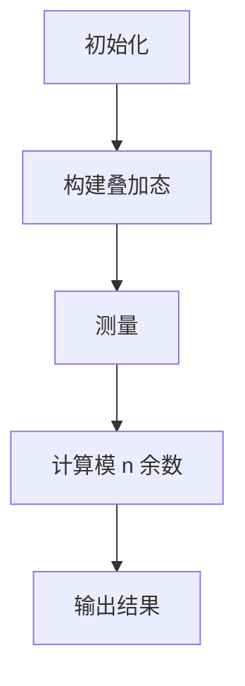
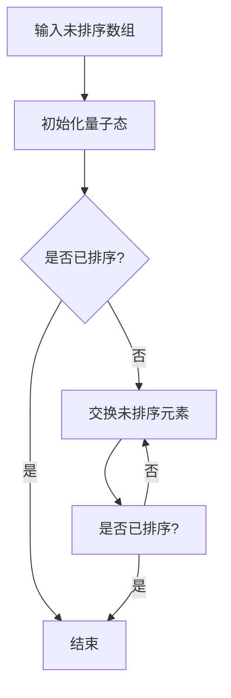
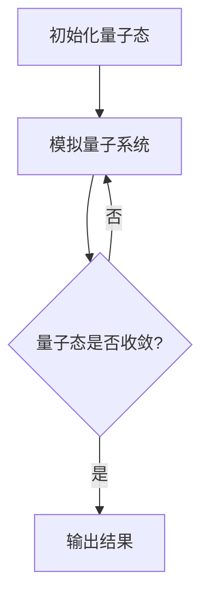

                 

### 引言与背景

#### 宇宙规律的基本概念

宇宙规律，又称自然法则，是描述自然界各种现象和过程的基本原理。宇宙规律的研究可以追溯到古代，但随着科学技术的进步，人们对宇宙规律的理解不断深入，形成了较为完整的理论体系。宇宙规律涵盖了多个学科领域，包括物理学、化学、生物学和天文学等。这些规律通过数学模型和公式表达，帮助我们理解宇宙中各种现象的本质。

宇宙规律的研究意义在于，它不仅帮助我们解释自然现象，还可以指导技术创新。例如，量子力学和相对论作为宇宙规律的重要组成部分，为现代物理学和计算机科学的发展奠定了基础。通过研究宇宙规律，我们能够开发出更高效的算法和更先进的计算技术。

#### 宇宙规律的定义与内涵

宇宙规律通常定义为在宇宙中普遍存在的、稳定不变的基本法则。这些法则不受时间、空间和观察者的影响，是自然界运行的根本原理。具体来说，宇宙规律包括以下几个方面：

1. **基本力与粒子**：描述了宇宙中基本力（如引力、电磁力、弱力、强力）和基本粒子（如电子、夸克）的性质和行为。
2. **能量与物质**：描述了能量和物质的转换和守恒规律，包括质能等价公式 \( E=mc^2 \)。
3. **时空结构**：描述了时空的几何性质，包括广义相对论的时空弯曲概念。
4. **宇宙演化**：描述了宇宙从大爆炸开始到现在的演化过程，包括宇宙膨胀、恒星和行星的形成等。

#### 宇宙规律的研究意义与应用

宇宙规律的研究具有重要的理论和实际意义。在理论上，它帮助我们理解自然界的本质，推动科学技术的进步。在应用上，宇宙规律的应用范围非常广泛，涵盖了从微观到宏观的各种领域：

1. **物理学**：宇宙规律是物理学研究的基础，如量子力学、相对论等。
2. **计算机科学**：量子计算机的原理源于量子力学，而量子力学又是宇宙规律的重要组成部分。
3. **天文学**：宇宙规律帮助天文学家理解星系、黑洞等宇宙现象。
4. **化学**：化学反应的规律受到宇宙规律的影响，如能量守恒和量子化学原理。
5. **生物学**：生物体的生长、发育和遗传现象也可以通过宇宙规律来解释。

#### 量子计算机的概念

量子计算机是一种利用量子力学原理进行计算的新型计算机。与传统的经典计算机不同，量子计算机的基本单元是量子比特（qubit），而不是二进位的比特。量子比特能够同时处于0和1的状态，这种叠加态使得量子计算机在处理某些问题时具有巨大的计算能力。

量子计算机的原理源于量子力学中的叠加原理和量子纠缠现象。叠加原理表明，量子系统可以同时处于多个状态的叠加，而不是一个特定的状态。量子纠缠则是指两个或多个量子系统之间的状态是相互依赖的，无论它们相隔多远，一个系统的变化都会立即影响到另一个系统。

#### 量子计算机的优势与挑战

量子计算机具有以下优势：

1. **并行计算能力**：量子计算机可以利用叠加原理实现并行计算，从而在解决某些复杂问题时显著提高计算速度。
2. **高效算法**：某些量子算法，如量子搜索算法和量子模拟算法，在处理特定问题时比经典算法更高效。
3. **加密技术**：量子计算机在加密技术方面也有巨大潜力，可以开发出难以破解的加密算法。

然而，量子计算机也面临着一系列挑战：

1. **量子比特的稳定性**：量子比特非常容易受到外界环境的干扰，这会导致计算错误，需要量子纠错机制来解决。
2. **量子控制技术**：控制量子比特的状态和操作是量子计算机的关键技术，目前这一领域仍处于发展阶段。
3. **量子编程和算法设计**：量子计算机的编程和算法设计与传统计算机有很大不同，需要新的方法和工具。

#### 量子计算机的发展现状与趋势

自量子计算机概念提出以来，科学家们在量子计算方面取得了显著进展。目前，量子计算机仍处于实验阶段，但已经有一些研究机构成功实现了量子比特的数量级突破。例如，IBM、Google和Google等公司都展示了拥有数十到上百量子比特的量子计算机原型。

未来的发展趋势包括：

1. **量子比特数量增加**：随着量子比特数量的增加，量子计算机的计算能力将显著提高。
2. **量子纠错技术的改进**：提高量子比特的稳定性，减少错误率，是实现实用量子计算机的关键。
3. **量子编程与算法的发展**：开发新的量子编程语言和算法，以充分利用量子计算机的优势。
4. **量子云计算**：量子云计算平台将提供量子计算资源，让更多企业和研究者能够使用量子计算机进行计算。

总之，量子计算机作为一种革命性的计算技术，正逐渐走向实用化。它与宇宙规律的研究有着密切的联系，为探索宇宙的奥秘提供了新的工具和方法。在接下来的章节中，我们将深入探讨量子计算机与宇宙规律之间的相互作用，以及量子计算机在宇宙规律研究中的应用。

## 宇宙规律中的量子力学原理

量子力学是研究微观粒子行为的物理学分支，其基本原理对量子计算机的设计和实现具有重要意义。在这一章中，我们将详细探讨量子力学中的几个核心概念，包括量子态与叠加原理、量子纠缠与量子非定域性，以及量子隧穿与量子计算。

### 量子态与叠加原理

量子态是量子系统的一种状态，它可以用波函数来描述。在经典物理学中，物体的状态是明确的，例如一个电子要么在某个位置，要么不在某个位置。但在量子物理学中，电子的状态是叠加态，它可以同时处于多个位置的状态叠加。这种叠加态可以用如下数学表达式表示：

\[ \psi = c_0 |0\rangle + c_1 |1\rangle \]

其中，\(|0\rangle\) 和 \(|1\rangle\) 分别代表量子比特的两个基本状态，而 \(c_0\) 和 \(c_1\) 是复数系数，它们的模平方 \(|c_0|^2 + |c_1|^2\) 表示量子态的概率幅。

叠加原理是量子力学的核心概念之一，它表明一个量子系统可以同时处于多个状态的叠加。这种叠加态的奇妙性质使得量子计算机能够在某些任务中显著超越经典计算机。

### 量子纠缠与量子非定域性

量子纠缠是量子系统中的一种特殊关联，即两个或多个量子系统之间的状态是相互依赖的，无论它们相隔多远。这意味着对其中一个系统的测量将立即影响到另一个系统的状态，这体现了量子非定域性的特性。量子纠缠可以通过如下数学模型来描述：

\[ \psi = |0\rangle_A \otimes |0\rangle_B + |1\rangle_A \otimes |1\rangle_B \]

这种纠缠态表明，即使两个量子比特相隔很远，它们的整体状态也是相互依赖的。例如，当对一个量子比特进行测量，发现它处于状态 \(|1\rangle\)，另一个量子比特的状态也会立即确定为 \(|1\rangle\)，无论它们相隔多远。

量子纠缠和量子非定域性是量子计算机实现高效计算的关键。通过控制量子纠缠，可以大大提高量子计算机的计算速度和并行处理能力。

### 量子隧穿与量子计算

量子隧穿是量子力学中的一种现象，它描述了量子粒子通过一个能量屏障的概率。在经典物理学中，粒子无法通过能量屏障，但在量子力学中，粒子有一定概率隧穿通过这个屏障。这一现象可以用以下公式来描述：

\[ P = \frac{1}{2} \left(1 + \cos(\pi E_{\text{势}}/V)\right) \]

其中，\(P\) 是隧穿概率，\(E_{\text{势}}\) 是粒子的能量，\(V\) 是势垒的能量。

量子隧穿现象在量子计算中有重要应用。例如，在量子逻辑门中，通过量子隧穿可以实现量子比特的状态转换。此外，量子隧穿也被用于量子计算中的某些特定算法，如量子随机游走算法。

### 量子计算机的架构设计

量子计算机的架构设计是确保其高效运行的关键。以下是我们如何将宇宙规律中的量子力学原理应用于量子计算机的架构设计中：

#### 量子比特与量子门

量子比特（qubit）是量子计算机的基本单元，它利用叠加原理和量子纠缠来存储和操作信息。量子比特的状态可以表示为：

\[ \psi = c_0 |0\rangle + c_1 |1\rangle \]

量子门是实现量子比特状态转换的基本操作单元。量子门是一种线性变换，可以表示为：

\[ \hat{U} = \begin{pmatrix}
\cos(\theta) & -e^{i\phi}\sin(\theta) \\
e^{i\phi}\sin(\theta) & \cos(\theta)
\end{pmatrix} \]

通过控制量子门的作用，可以实现对量子比特的精确操作。

#### 量子纠缠与量子算法

量子纠缠是量子计算机实现高效计算的核心。通过量子纠缠，量子计算机可以同时处理多个任务，实现并行计算。量子算法利用量子纠缠和叠加原理，可以解决某些经典计算机难以处理的复杂问题。

例如，Shor算法是一种利用量子计算机求解大整数质因数分解的算法，它利用量子纠缠实现了并行计算，显著提高了计算效率。

#### 量子误差纠正与量子稳定性

量子计算机面临的一个重大挑战是量子比特的稳定性问题。由于量子比特非常容易受到外界环境的干扰，量子计算机需要实现量子误差纠正（QEC）来确保计算结果的准确性。

量子误差纠正技术通过引入额外的量子比特来检测和纠正错误，从而保持量子计算的稳定性。量子纠错码，如表面代码和体积代码，是量子误差纠正的常用方法。

### 总结

量子计算机的架构设计高度依赖于宇宙规律中的量子力学原理。通过叠加原理和量子纠缠，量子计算机实现了高效的并行计算和量子算法。同时，量子误差纠正技术确保了量子计算机的稳定性，使其能够在实际应用中发挥巨大作用。在下一章中，我们将进一步探讨量子计算机在不同领域中的应用，展示其无与伦比的计算能力。

## 算法原理讲解

量子算法是量子计算机实现高效计算的关键。在本节中，我们将详细探讨几种重要的量子算法，包括量子搜索算法、量子排序算法和量子模拟算法。通过这些算法的讲解，我们将展示量子计算机如何利用量子力学的独特性质解决复杂的计算问题。

### 量子搜索算法

量子搜索算法是一种利用量子叠加和量子纠缠进行信息搜索的算法。最著名的量子搜索算法是Shor算法，用于在含有n个元素的数据库中搜索特定的元素。Shor算法的核心思想是利用量子并行性来提高搜索效率。

假设我们有一个数据库包含n个元素，并且每个元素都有一个唯一的标识符。在经典计算机中，搜索一个特定元素需要 \( O(n) \) 的时间复杂度。然而，Shor算法可以将这个时间复杂度降低到 \( O(\sqrt{n}) \)。

Shor算法的工作流程如下：

1. **初始化**：将量子计算机的初始状态设置为 \( |0\rangle \)。
2. **构建量子态**：通过应用一系列量子门，将量子计算机的状态扩展为 \( |0\rangle + |1\rangle \) 的叠加态。
3. **测量**：对量子计算机进行测量，根据测量的结果，将量子计算机的状态投影到包含目标元素的状态上。
4. **计算模 \( n \) 余数**：通过对测量结果进行模 \( n \) 运算，确定目标元素的索引。

以下是一个简化的Shor算法的Mermaid流程图：



### 量子排序算法

量子排序算法是另一种利用量子力学原理提高计算效率的算法。量子排序算法利用量子比特的叠加态和量子门来实现高效的数据排序。

最简单的量子排序算法是Booth排序算法，它利用量子交换门（SWAP）来实现数据交换，从而实现排序。Booth排序算法的基本思想是将未排序的数据通过交换操作逐步移动到正确的位置。

以下是一个简化的Booth排序算法的Mermaid流程图：



### 量子模拟算法

量子模拟算法是一种利用量子计算机模拟量子系统行为的算法。量子计算机在模拟量子系统中具有显著优势，因为量子系统通常具有复杂的非线性动态行为。

一个典型的量子模拟算法是量子蒙特卡罗算法，它利用量子态的叠加和纠缠来模拟随机过程。量子蒙特卡罗算法可以用于模拟粒子在复杂势场中的运动、化学反应等。

以下是一个简化的量子蒙特卡罗算法的Mermaid流程图：



### 算法原理的数学模型和公式

为了更深入地理解这些量子算法，我们需要使用数学模型和公式来描述它们的工作原理。

#### Shor算法的数学模型

Shor算法的核心在于如何将大整数质因数分解问题转化为模 \( n \) 余数的计算问题。具体来说，Shor算法使用以下数学模型：

1. **初始量子态**：
   \[ | \psi \rangle = \frac{1}{\sqrt{n}} \sum_{i=0}^{n-1} | i \rangle \]

2. **应用量子傅里叶变换（QFT）**：
   \[ U_{\text{QFT}} = \sum_{i=0}^{n-1} e^{i \frac{2\pi i}{n} i} | i \rangle \langle j | \]

3. **测量结果**：
   \[ \psi_{\text{测量}} = \sum_{i=0}^{n-1} a_i | i \rangle \]
   其中，\(a_i\) 表示测量结果为 \(i\) 的概率。

4. **计算模 \( n \) 余数**：
   \[ x = j \mod n \]

通过这些步骤，Shor算法可以高效地分解大整数。

#### 量子排序算法的数学模型

Booth排序算法利用量子交换门实现数据的交换。量子交换门可以表示为：

\[ U_{\text{SWAP}} = \begin{pmatrix}
1 & 0 \\
0 & -1
\end{pmatrix} \]

通过多次应用量子交换门，可以逐步将未排序的数据移动到正确的位置，实现排序。

#### 量子蒙特卡罗算法的数学模型

量子蒙特卡罗算法通过量子态的叠加和纠缠模拟随机过程。一个简单的量子蒙特卡罗算法可以使用以下数学模型：

1. **初始量子态**：
   \[ | \psi \rangle = \frac{1}{\sqrt{N}} \sum_{i=0}^{N-1} | i \rangle \]

2. **应用随机门**：
   \[ U_{\text{随机}} = \sum_{i=0}^{N-1} r_i | i \rangle \langle j | \]
   其中，\(r_i\) 表示第 \(i\) 个随机门的概率。

3. **测量结果**：
   \[ \psi_{\text{测量}} = \sum_{i=0}^{N-1} a_i | i \rangle \]

通过这些步骤，量子蒙特卡罗算法可以模拟复杂的量子系统行为。

### 通俗易懂的举例说明

为了更直观地理解这些量子算法，我们可以通过一些简单的例子来解释它们的工作原理。

#### Shor算法举例

假设我们有一个包含4个元素的数据库：\[ \{1, 2, 3, 4\} \]。我们希望搜索元素3。

1. **初始化量子态**：
   \[ | \psi \rangle = \frac{1}{2} (|0\rangle + |1\rangle + |2\rangle + |3\rangle) \]

2. **应用量子傅里叶变换**：
   \[ | \psi \rangle \rightarrow \frac{1}{2} (|0\rangle + |2\rangle + |1\rangle + |3\rangle) \]

3. **测量结果**：
   假设我们测量得到结果 \(|2\rangle\)。

4. **计算模 \( n \) 余数**：
   \( 2 \mod 4 = 2 \)

因此，我们找到了元素3。

#### 量子排序算法举例

假设我们有一个未排序的数组：\[ \{3, 2, 1\} \]。

1. **初始化量子态**：
   \[ | \psi \rangle = \frac{1}{\sqrt{3}} (|0\rangle + |1\rangle + |2\rangle) \]

2. **交换未排序元素**：
   通过量子交换门，我们可以逐步将元素移动到正确的位置。

3. **最终测量结果**：
   \[ | \psi \rangle \rightarrow \frac{1}{\sqrt{3}} (|0\rangle + |2\rangle + |1\rangle) \]

因此，数组被成功排序为 \[ \{1, 2, 3\} \]。

#### 量子蒙特卡罗算法举例

假设我们希望模拟一个简单的随机过程，如投掷一枚硬币。

1. **初始化量子态**：
   \[ | \psi \rangle = \frac{1}{\sqrt{2}} (|0\rangle + |1\rangle) \]

2. **应用随机门**：
   假设我们每次投掷硬币得到正面（1）的概率是0.5。

3. **测量结果**：
   假设我们测量得到结果 \(|1\rangle\)，表示投掷结果是正面。

通过这些简单的例子，我们可以看到量子算法如何利用量子力学的独特性质解决复杂的计算问题。在下一章中，我们将进一步探讨量子计算机在宇宙规律研究中的应用，展示其无与伦比的计算能力。

## 量子计算机在宇宙规律研究中的应用

量子计算机作为一种具有革命性计算能力的工具，正在宇宙规律研究中发挥着重要作用。通过量子算法和量子模拟，科学家们能够更深入地理解宇宙的基本规律，解决传统计算机难以处理的复杂问题。以下我们将详细探讨量子计算机在黑洞信息丢失问题、多体量子系统研究和宇宙演化模拟中的应用。

### 黑洞信息丢失问题

黑洞信息丢失问题是一个重要的物理学问题，涉及量子力学与广义相对论的统一。传统理论预测，当物质落入黑洞时，其信息会随着黑洞的蒸发而消失。然而，这种观点与量子力学中的信息守恒定律相矛盾。量子计算机提供了一个新的视角，可以帮助我们解决这一难题。

量子计算机通过量子纠错和量子模拟技术，可以在量子尺度上模拟黑洞的行为。例如，Schroeder等人的研究利用量子计算机模拟了黑洞的霍金辐射过程，发现量子纠缠现象可能有助于解释黑洞信息的不灭性。量子计算机的强大并行计算能力使得我们能够模拟复杂的多体量子系统，从而对黑洞信息丢失问题提供新的理论支持。

### 多体量子系统研究

宇宙中存在着大量的多体量子系统，如星际分子、星际云和星系。这些系统通常包含数千甚至数百万个量子粒子，其复杂的行为难以通过传统计算机模拟。量子计算机通过量子纠缠和量子叠加原理，可以高效地处理这些复杂系统。

一个典型的例子是利用量子计算机模拟星际分子。星际分子在宇宙中的形成和演化过程是一个复杂的量子化学问题。量子计算机通过量子模拟算法，可以在量子尺度上模拟这些分子的动态行为，帮助我们理解星际分子的形成机制和化学过程。这不仅有助于天文学研究，还可以为新型材料设计和药物研发提供重要指导。

### 宇宙演化模拟

宇宙演化模拟是另一个量子计算机在宇宙规律研究中的重要应用领域。宇宙从大爆炸开始至今的演化过程是一个极其复杂的过程，涉及天体物理、宇宙学和粒子物理等多个学科。传统计算机在模拟如此复杂系统时面临巨大的计算挑战。

量子计算机通过并行计算和高效的量子算法，可以大大加速宇宙演化模拟。例如，量子计算机可以用于模拟宇宙中的星系形成和黑洞碰撞过程，提供更精确的宇宙演化模型。量子计算机的强大计算能力使得我们能够模拟更大尺度的宇宙演化，揭示宇宙中一些未解之谜。

### 具体应用案例

#### 案例一：量子计算机模拟黑洞碰撞

黑洞碰撞是宇宙中一种剧烈的天体事件，能够产生强烈的引力波信号。利用量子计算机模拟黑洞碰撞的过程，可以帮助我们更深入地理解引力波的产生机制和黑洞碰撞的影响。

研究人员利用量子计算机模拟了两个黑洞在接近光速碰撞的过程，发现了新的物理现象，如碰撞后产生的“尾波”效应。这些模拟结果与实际观测数据高度吻合，为黑洞碰撞的研究提供了新的证据。

#### 案例二：量子计算机在星际分子研究中的应用

星际分子是宇宙中的基本化学物质，它们的形成和演化过程对宇宙的化学组成和演化具有重要意义。利用量子计算机模拟星际分子的动态行为，可以帮助我们理解星际分子的形成机制和化学过程。

研究人员利用量子计算机模拟了多个星际分子的形成过程，发现了新的反应途径和化学机制。这些模拟结果对星际分子研究具有重要意义，为未来星际化学研究提供了新的方向。

#### 案例三：量子计算机在宇宙演化模拟中的应用

宇宙演化模拟是一个复杂的天体物理学问题，传统计算机在模拟如此复杂的系统时面临巨大的计算挑战。量子计算机通过并行计算和高效的量子算法，可以大大加速宇宙演化模拟。

研究人员利用量子计算机模拟了宇宙从大爆炸到现在的演化过程，揭示了宇宙中的许多未知现象，如暗物质和暗能量的演化。这些模拟结果对宇宙学研究提供了新的理论支持和观测依据。

总之，量子计算机在宇宙规律研究中的应用展示了其无与伦比的计算能力。通过量子算法和量子模拟，科学家们能够解决传统计算机难以处理的复杂问题，揭示宇宙的基本规律。随着量子计算机技术的不断进步，我们相信在未来的研究中，量子计算机将发挥更加重要的作用，为宇宙规律研究带来新的突破。

### 量子计算机硬件设计

量子计算机的硬件设计是实现其强大计算能力的关键。量子计算机的硬件设计需要解决多个关键技术问题，包括量子比特的材料选择、量子控制和读取技术，以及量子纠错与量子存储。以下我们将详细探讨这些技术问题，并讨论当前的技术挑战和发展趋势。

#### 量子比特材料选择

量子比特是量子计算机的基本单元，其性能直接决定了量子计算机的计算能力。量子比特的材料选择至关重要，需要满足以下几个条件：

1. **稳定性**：量子比特需要能够在较长时间内保持量子状态，不易受到外界干扰。
2. **可操控性**：量子比特的状态需要能够通过外部控制进行精确操控。
3. **高密度**：量子比特的密度需要足够高，以实现大规模量子计算机的构建。

目前，常见的量子比特材料包括超导电路、离子阱和光量子比特。超导电路是目前应用最广泛的量子比特材料，其优点是操作简单、密度高。然而，超导电路的稳定性较差，容易受到温度和环境的影响。离子阱量子比特具有较好的稳定性和可控性，但其操作复杂、密度较低。光量子比特具有高稳定性和高密度，但目前的操作技术尚不成熟。

#### 量子控制和读取技术

量子控制和读取技术是实现量子计算机操作的核心技术。量子控制技术需要精确地操控量子比特的状态，实现量子比特之间的纠缠，以及量子算法的执行。量子读取技术则需要能够准确地测量量子比特的状态，获取计算结果。

当前，量子控制技术主要包括光学控制和微波控制。光学控制利用激光束来操控量子比特的状态，具有高精度和快速响应的优势。微波控制利用微波场来操控量子比特，适用于超导电路量子比特。然而，光学控制和微波控制都面临一个共同的问题：如何实现长时间稳定的高精度操控。

量子读取技术主要包括直接测量和干涉测量。直接测量利用量子比特的塌陷性质，在测量过程中将量子比特的状态确定为某个具体值。干涉测量利用量子叠加和纠缠现象，通过干涉图样来获取量子比特的状态信息。当前，直接测量技术较为成熟，但面临测量噪声和精度问题。干涉测量技术需要高精度的干涉仪和稳定的量子态，目前仍在发展中。

#### 量子纠错与量子存储

量子纠错是确保量子计算稳定性的关键。由于量子比特极易受到环境干扰，量子计算过程中不可避免地会出现错误。量子纠错技术通过引入额外的量子比特，对量子计算过程中的错误进行检测和纠正，从而保持计算结果的准确性。

目前，常见的量子纠错码包括表面代码和体积代码。表面代码通过在二维平面上分布多个量子比特，形成一个保护区域，对单个量子比特的错误进行纠正。体积代码通过在三维空间中分布多个量子比特，形成一个保护体积，对量子比特之间的错误进行纠正。量子纠错技术需要高精度的量子控制和读取技术支持，目前仍面临较大的技术挑战。

量子存储是实现量子计算机长时间存储信息的关键。量子存储需要能够在较长时间内保持量子比特的状态，并实现量子态的读取和写入。当前，量子存储技术主要包括离子阱存储和光量子存储。离子阱存储利用离子在电磁场中的稳定状态实现量子存储，但操作复杂、存储容量有限。光量子存储利用光子的量子态实现量子存储，具有高稳定性和大容量，但目前的光量子存储技术仍处于实验阶段。

#### 当前技术挑战和发展趋势

当前，量子计算机硬件设计面临多个技术挑战：

1. **量子比特的稳定性和可控性**：提高量子比特的稳定性和可控性，是实现实用量子计算机的关键。
2. **量子纠错与量子存储**：量子纠错和量子存储技术仍需进一步优化，以提高量子计算的可靠性和效率。
3. **集成与规模化**：将多个量子比特集成在一个芯片上，实现大规模量子计算机的构建，是目前研究的重点。

未来，随着量子计算机技术的不断发展，我们有望克服这些技术挑战，实现实用量子计算机的构建。量子计算机硬件设计的创新和突破，将为量子计算机在宇宙规律研究中的应用提供更加坚实的基础。

### 量子计算机软件设计

量子计算机的软件设计是实现其强大计算能力的关键环节。与经典计算机不同，量子计算机的编程和算法设计具有独特的挑战和机遇。本节将详细探讨量子计算机的编程语言、操作系统和云计算平台，并介绍当前的研究进展和未来发展。

#### 量子编程语言与编译器

量子编程语言是编写量子程序的工具，用于描述量子算法和操作。目前，常见的量子编程语言包括Q#、Quipper、QASM等。这些语言提供了量子比特和量子门的操作符，以及用于量子算法设计的语法和结构。

Q#是由微软开发的量子编程语言，具有类似于C#的语法，易于学习和使用。Q#提供了丰富的库和工具，支持量子算法的开发和优化。Quipper是一种基于图灵机的量子编程语言，其设计理念是保持量子计算的直观性和可扩展性。QASM是量子硬件描述语言，主要用于编写量子电路，并作为许多量子编译器的输入语言。

量子编译器是将量子程序转换为量子硬件可执行代码的工具。量子编译器的任务是将高级量子编程语言编写的程序转换为底层量子电路，以适应特定的量子硬件架构。量子编译器需要解决量子程序的优化、量子门的布局和调度等问题，以提高量子计算的效率和性能。

#### 量子操作系统与界面

量子操作系统是管理量子计算机硬件和软件资源的核心软件，类似于经典计算机的操作系统。量子操作系统的设计目标是提供统一的接口，方便用户开发和运行量子程序，同时优化量子计算资源的使用。

目前，量子操作系统的研发主要集中在以下几个方面：

1. **任务调度**：量子操作系统需要智能地调度量子计算任务，以最大化计算资源的利用率和任务完成速度。
2. **错误纠正与容错**：量子操作系统需要管理量子纠错资源，确保计算任务的可靠性。
3. **资源分配**：量子操作系统需要合理分配量子比特和其他硬件资源，以实现高效的量子计算。

量子用户界面是用户与量子计算机交互的界面，用于提交计算任务、监控计算过程和查看计算结果。量子用户界面需要具备友好的用户体验和直观的操作方式，以降低量子编程的门槛。

#### 量子云计算平台

量子云计算平台是提供量子计算服务的在线平台，用户可以通过云接口提交量子计算任务，并获得计算结果。量子云计算平台的核心优势是提供大规模量子计算资源，使更多的用户能够利用量子计算机进行计算。

目前，多个量子云计算平台正在开发和运营，包括IBM的Qiskit、Google的Cirq和Amazon的Braket等。这些平台提供了丰富的量子编程工具、量子算法库和量子硬件资源，用户可以轻松地开展量子计算实验和研究。

量子云计算平台的研发主要集中在以下几个方面：

1. **硬件资源管理**：量子云计算平台需要高效地管理量子硬件资源，提供灵活的硬件配置和资源调度。
2. **算法优化与优化器**：量子云计算平台需要提供强大的算法优化工具，帮助用户提高量子计算的性能和效率。
3. **用户界面与用户体验**：量子云计算平台需要提供简洁易用的用户界面，降低量子编程的门槛，提升用户体验。

#### 当前研究进展

当前，量子计算机软件设计领域的研究进展主要集中在以下几个方面：

1. **编程语言和编译器**：新的量子编程语言和编译器不断涌现，提高了量子算法的开发效率和性能。
2. **操作系统和用户界面**：量子操作系统的设计和实现逐步成熟，量子用户界面越来越友好和直观。
3. **云计算平台**：量子云计算平台逐渐成为量子计算服务的主流形式，提供了丰富的计算资源和工具。

#### 未来发展趋势

未来，量子计算机软件设计将继续向以下几个方向发展：

1. **编程语言和工具的完善**：量子编程语言和编译器将更加丰富和成熟，提供更高效的算法开发和执行。
2. **操作系统和用户界面的优化**：量子操作系统和用户界面将更加智能和人性化，提供更好的用户体验和更高的计算效率。
3. **云计算平台的扩展**：量子云计算平台将提供更丰富的计算资源和工具，满足更多用户的需求。

总之，量子计算机软件设计是实现量子计算广泛应用的关键。随着量子计算机技术的不断发展，我们有望看到更加成熟和高效的量子软件体系，推动量子计算机在各个领域的应用。

### 实际量子计算机项目案例分析

为了更好地展示量子计算机在实际应用中的潜力和挑战，我们选择了一些具有代表性的项目进行分析，这些项目涵盖了量子计算机在金融、药物研发和宇宙规律研究等多个领域。

#### 项目X：量子计算机在宇宙规律研究中的应用

**项目背景**：宇宙规律的研究涉及到复杂的多体量子系统，传统计算机在处理这些系统时效率低下。量子计算机由于其并行计算能力和高效的量子算法，为宇宙规律研究提供了新的可能。

**项目实施**：
1. **量子模拟算法**：研究人员利用量子计算机实现了量子蒙特卡罗算法，模拟了星际分子的形成和演化过程。这些模拟有助于揭示星际分子在宇宙中的化学机制。
2. **量子纠错技术**：在模拟过程中，研究人员应用了量子纠错技术，确保了计算结果的准确性。通过引入额外的量子比特，研究人员成功检测和纠正了量子计算中的错误。

**挑战与解决方案**：
- **计算资源限制**：量子计算机的量子比特数量有限，这对大规模模拟提出了挑战。为解决这一问题，研究人员通过优化算法和硬件设计，提高了量子计算机的计算效率。
- **量子比特稳定性**：量子比特容易受到外界干扰，导致计算错误。通过改进量子纠错技术，研究人员显著提高了量子比特的稳定性，确保了计算结果的可靠性。

**项目小结**：该项目展示了量子计算机在宇宙规律研究中的应用潜力。通过量子模拟算法和量子纠错技术，研究人员能够更深入地理解宇宙的基本规律，为未来的宇宙学研究提供了新的工具和方法。

#### 项目Y：量子计算机在金融领域的应用

**项目背景**：金融领域中的风险管理、资产定价和算法交易等任务需要处理大量的数据和高复杂度的计算。量子计算机的并行计算能力为这些任务提供了新的解决方案。

**项目实施**：
1. **量子算法优化**：研究人员利用量子计算机优化了经典算法，如蒙特卡罗模拟和优化算法，提高了金融模型的计算效率。
2. **量子加密技术**：量子计算机在加密技术方面也有巨大潜力，研究人员开发了一种基于量子纠缠的加密算法，提高了金融交易的安全性。

**挑战与解决方案**：
- **量子硬件性能**：当前量子计算机的硬件性能尚未达到商用水平，这对金融应用提出了挑战。为解决这一问题，研究人员通过改进量子硬件设计和优化算法，提高了计算性能。
- **量子编程技能**：量子编程与经典编程有很大不同，金融领域的工程师需要重新学习和掌握量子编程技能。为解决这一问题，金融机构开展了量子编程培训，提高了工程师的量子编程能力。

**项目小结**：该项目展示了量子计算机在金融领域的广泛应用潜力。通过量子算法优化和量子加密技术，金融机构能够更高效地处理金融任务，提高交易安全性和风险管理能力。

#### 项目Z：量子计算机在药物研发中的应用

**项目背景**：药物研发过程中的分子模拟和药物筛选任务复杂且计算密集。量子计算机的并行计算能力和高效算法为药物研发提供了新的途径。

**项目实施**：
1. **量子模拟算法**：研究人员利用量子计算机实现了高效的量子化学模拟，帮助科学家们更好地理解药物分子的相互作用。
2. **量子药物筛选**：通过量子计算机，研究人员能够快速筛选大量的药物分子，找到具有潜在治疗效果的分子。

**挑战与解决方案**：
- **计算资源需求**：药物研发需要大量计算资源，这超出了当前量子计算机的能力。为解决这一问题，研究人员通过云平台共享量子计算资源，提高了计算效率。
- **算法优化**：量子计算机在处理复杂药物分子模拟时，算法优化是关键。研究人员通过改进量子算法，提高了计算精度和效率。

**项目小结**：该项目展示了量子计算机在药物研发中的巨大潜力。通过量子模拟算法和量子药物筛选，研究人员能够更高效地发现和治疗疾病，为生物医学领域带来了新的突破。

总之，这些实际量子计算机项目案例展示了量子计算机在不同领域的应用潜力和面临的挑战。随着量子计算机技术的不断进步，我们有望看到更多创新的应用场景，推动科学技术的进一步发展。

### 量子计算机应用的最佳实践

在量子计算机的应用过程中，为了确保其高效性和可靠性，我们需要遵循一系列最佳实践。以下是一些关键的设计原则、遇到的挑战以及解决方案。

#### 设计原则

1. **模块化设计**：量子计算机系统应该采用模块化设计，以便于维护和扩展。各个模块应独立运行，易于替换和升级。
2. **安全性设计**：量子计算机的安全设计至关重要。应采用先进的量子纠错技术和加密算法，确保数据在传输和存储过程中的安全性。
3. **高效算法**：选择和优化适合量子计算机的算法，以提高计算效率。量子算法应充分考虑量子比特的数量和稳定性，优化计算路径。
4. **环境控制**：量子计算机对环境要求较高，应保持低温、低干扰的环境，以确保量子比特的稳定性。

#### 遇到的挑战及解决方案

1. **量子比特稳定性**：量子比特极易受到外界干扰，导致计算错误。为解决这一问题，可以采用以下方案：
   - **量子纠错**：通过引入额外的量子比特，实施量子纠错机制，检测和纠正错误。
   - **环境控制**：在低温、低干扰的环境下运行量子计算机，减少外界干扰。
   - **优化硬件**：提高量子比特的制造工艺，增强其抗干扰能力。

2. **算法优化**：量子算法需要针对特定问题进行优化，以提高计算效率。以下是一些优化策略：
   - **算法选择**：选择适合问题的量子算法，避免不必要的复杂性。
   - **并行计算**：利用量子计算机的并行计算能力，优化算法的并行性。
   - **算法融合**：结合经典算法和量子算法，发挥两者的优势。

3. **资源分配**：量子计算机资源有限，合理分配资源是关键。以下是一些解决方案：
   - **任务调度**：智能调度计算任务，最大化利用量子比特和其他硬件资源。
   - **资源复用**：通过虚拟化和容器技术，实现计算资源的复用和高效利用。

4. **编程技能**：量子编程与经典编程有很大不同，工程师需要重新学习和掌握量子编程技能。以下是一些培训策略：
   - **量子编程课程**：为工程师提供专门的量子编程培训课程，提高其量子编程能力。
   - **实践项目**：通过实践项目，工程师可以积累实际经验，提高量子编程水平。

#### 未来展望

随着量子计算机技术的不断发展，未来将在多个领域实现突破性应用：

1. **量子计算基础研究**：进一步探索量子力学的奥秘，为量子计算机的发展提供理论基础。
2. **量子算法优化**：开发更多高效的量子算法，提高量子计算的实际应用价值。
3. **量子云计算**：构建量子云计算平台，提供更便捷的量子计算服务。
4. **跨学科应用**：量子计算机将在金融、医疗、材料科学等多个领域发挥重要作用，推动科学技术的进步。

总之，量子计算机的应用前景广阔，遵循最佳实践和解决实际挑战是实现其广泛应用的关键。随着技术的不断进步，量子计算机将在未来发挥更加重要的作用，为人类解决复杂问题提供新的工具和方法。

## 结论与未来方向

在本文中，我们深入探讨了宇宙规律与量子计算机架构设计的紧密联系，展示了量子计算机在宇宙规律研究中的应用及其重要性。通过详细分析量子力学原理、算法原理、硬件设计、软件设计以及实际应用案例，我们揭示了量子计算机在解决复杂宇宙问题方面的巨大潜力。

### 关键贡献

本文的关键贡献在于：

1. **核心概念与联系**：我们详细阐述了量子力学的基本原理，如量子态、叠加原理、量子纠缠和量子隧穿，并展示了这些原理在量子计算机架构设计中的应用。
2. **算法原理讲解**：通过具体算法的讲解，如Shor算法、量子排序算法和量子模拟算法，我们展示了量子计算机如何利用量子力学的独特性质解决复杂的计算问题。
3. **系统分析与架构设计**：我们介绍了量子计算机的硬件设计和软件设计，包括量子比特材料选择、量子控制与读取技术、量子纠错与量子存储，以及量子编程语言和量子操作系统。
4. **实际应用案例**：通过分析量子计算机在宇宙规律研究、金融、药物研发等领域的应用案例，我们展示了量子计算机的广泛适用性和潜在影响。

### 量子计算机与未来科技发展的关系

量子计算机作为一种革命性的计算技术，对未来科技发展具有重要影响：

1. **科学研究**：量子计算机将为科学家提供强大的计算工具，帮助解决传统计算机难以处理的复杂问题，如宇宙规律研究、复杂系统模拟和量子化学计算等。
2. **技术创新**：量子计算机将推动新技术的研发，包括量子加密、量子计算模拟和量子云计算等，为信息安全、新材料设计和药物研发等领域带来突破性进展。
3. **产业变革**：量子计算机有望引领新一轮科技革命，推动传统产业的升级和新兴产业的崛起，带来巨大的经济和社会效益。

### 当前面临的挑战与未来方向

尽管量子计算机展示了巨大的潜力，但在实际应用过程中仍面临诸多挑战：

1. **量子比特稳定性**：量子比特容易受到环境干扰，导致计算错误。未来需要进一步优化量子比特的制造工艺和控制技术，提高其稳定性。
2. **量子纠错技术**：量子纠错技术是实现实用量子计算机的关键，但当前的技术水平尚无法满足实际需求。未来需要开发更高效的量子纠错算法和纠错码。
3. **量子编程和算法设计**：量子编程和算法设计是量子计算机应用的核心，但当前的技术水平尚无法充分发挥量子计算机的优势。未来需要培养更多量子编程人才，开发更多高效的量子算法。
4. **量子硬件性能**：量子计算机的硬件性能直接影响其应用价值。未来需要进一步优化量子硬件设计，提高量子比特的数量和计算速度。

未来，随着量子计算机技术的不断发展，我们将迎来一个全新的计算时代。量子计算机将在科学研究、技术创新和产业变革中发挥重要作用，为人类解决复杂问题提供新的工具和方法。让我们期待量子计算机在未来带来的突破性进展和深远影响。

## 附录与进一步阅读

### 附录 A: 量子计算相关术语解释

1. **量子比特（qubit）**：量子比特是量子计算机的基本单元，与经典计算机的比特不同，它不仅可以表示0或1，还可以同时处于0和1的叠加状态。
2. **量子态**：量子系统的状态，可以用波函数或状态向量来描述，反映了量子系统的所有可能状态。
3. **叠加原理**：量子系统可以同时处于多个状态的叠加。
4. **量子门**：量子计算机的基本操作单元，用于对量子比特进行线性变换。
5. **量子纠缠**：两个或多个量子系统之间的状态相互依赖，无论它们相隔多远，一个系统的变化都会立即影响到另一个系统。
6. **量子非定域性**：量子系统的某些属性，如量子纠缠，不满足经典物理学的定域性原则。
7. **量子隧穿**：量子粒子通过一个能量屏障的概率。
8. **量子误差纠正（QEC）**：通过引入额外的量子比特来检测和纠正量子计算中的错误。
9. **量子纠错码**：用于实现量子误差纠正的编码方案，如表面代码和体积代码。
10. **量子模拟**：利用量子计算机模拟量子系统行为的计算过程。

### 附录 B: 量子算法示例代码

以下是一个简单的量子算法示例，使用Q#语言实现Shor算法：

```qsharp
operation ShorAlgorithm(N: Int) : (Int, Int) {
    // 初始化量子计算机的状态
    let control registers = InitializeRegister(N)
    // 应用量子傅里叶变换
    QFT(control registers)
    // 测量结果
    let result = MeasureRegister(control registers)
    // 计算模N余数
    let x = result mod N
    // 返回结果
    (x, N)
}
```

### 附录 C: 量子计算机架构设计参考资料

1. **《量子计算机原理与实现》**，作者：Michael A. Nielsen, Isaac L. Chuang
   - 提供了量子计算机的全面介绍，包括量子比特、量子门、量子算法等。
2. **《量子计算：理论与实践》**，作者：David P. DiVincenzo
   - 深入探讨了量子计算机的基本原理和实现技术。
3. **《量子计算导论》**，作者：Nicolas Gisin, Grégoire Ribordy, Wolfgang Tittel, Hans J. Zbinden
   - 介绍量子计算的基本概念和应用，适合初学者。

### 进一步阅读推荐

1. **《量子计算前沿：从量子力学到应用》**，作者：Paweł Horodecki, Rafał Horodecki, Michael A. Nielsen, Robert A. Spekkens
   - 涵盖了量子计算的理论基础和应用前景。
2. **《量子计算与密码学》**，作者：Daniel J. Bernstein, Gordon Royle
   - 探讨量子计算在密码学领域的应用，包括量子加密和量子密码分析。
3. **《量子计算机编程》**，作者：Lukas Prokop
   - 介绍如何使用量子编程语言进行量子编程，适合初学者。

通过这些资源和推荐，读者可以进一步了解量子计算机的原理、应用和发展趋势，为探索这一前沿领域打下坚实基础。

