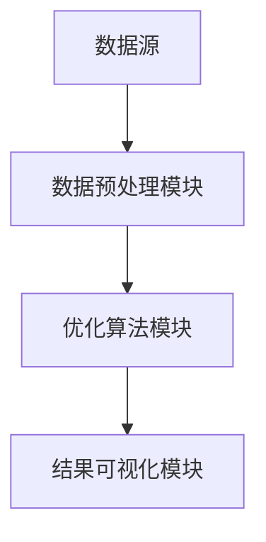
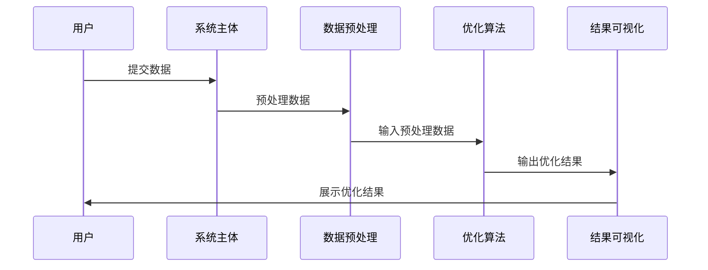

                 


# 宇宙规律与量子退火优化算法的相似性

## 关键词
- 宇宙规律
- 量子退火优化算法
- 相似性分析
- 数学模型
- 系统架构

## 摘要
本文旨在探讨宇宙规律与量子退火优化算法之间的相似性，通过对比分析，揭示二者在结构和原理上的共通之处。文章将首先介绍宇宙规律的基本概念，然后介绍量子退火优化算法，接着深入探讨两者之间的相似性，并通过实例分析来阐述这些相似性的应用。最后，本文将对相关系统架构进行设计，并提供实际项目中的最佳实践和注意事项。

### 目录

- 引言
- 背景介绍
  - 宇宙规律
  - 量子退火优化算法
- 核心概念与联系
  - 相似性对比表格
  - ER实体关系图
- 算法原理讲解
  - 算法流程图
  - Python源代码
  - 数学模型与公式
- 系统分析与架构设计方案
  - 问题场景介绍
  - 系统功能设计
  - 系统架构设计
  - 系统接口设计和系统交互
- 项目实战
  - 环境安装
  - 系统核心实现源代码
  - 代码应用解读与分析
  - 实际案例分析和详细讲解剖析
  - 项目小结
- 最佳实践 tips
- 小结
- 注意事项
- 拓展阅读
- 参考文献
- 作者信息

### 引言

随着科技的发展，我们对宇宙的认识越来越深入，而量子计算作为一种全新的计算模式，也在迅速发展。宇宙规律和量子退火优化算法虽然看似毫不相关，但它们在深层次的结构和原理上有着惊人的相似性。本文将带领读者探索这一现象，通过对比分析，揭示宇宙规律与量子退火优化算法之间的相似性。

本文的结构如下：首先，我们将介绍宇宙规律和量子退火优化算法的基本概念；然后，通过对比表格和ER实体关系图，深入探讨两者之间的相似性；接着，我们将详细讲解量子退火优化算法的原理，包括流程图、Python源代码、数学模型与公式；随后，我们将分析实际应用场景，并设计相关系统架构；最后，我们将通过实际项目中的案例，展示量子退火优化算法在宇宙规律研究中的应用，并提供最佳实践和注意事项。

### 背景介绍

#### 宇宙规律

宇宙规律是宇宙中普遍存在的自然法则，它们决定了宇宙的结构、演化和行为。以下是一些关键的宇宙规律：

1. **宇宙膨胀**：宇宙从大爆炸开始不断膨胀，宇宙的膨胀速度随着宇宙的扩张而增加。
2. **宇宙背景辐射**：宇宙在大爆炸后留下的余辉，它为我们提供了对早期宇宙的了解。
3. **引力定律**：牛顿的万有引力定律描述了质点之间的引力相互作用，爱因斯坦的广义相对论则将引力解释为时空的弯曲。
4. **量子力学**：量子力学描述了微观粒子的行为，包括波粒二象性、不确定性原理和量子纠缠。

#### 量子退火优化算法

量子退火优化算法是一种基于量子力学的优化算法，它模仿了量子系统的退火过程来找到问题的最优解。以下是一些关键概念：

1. **量子态**：量子系统处于多个可能状态的叠加，通过量子比特表示。
2. **能量层级**：量子系统在特定状态下的能量值，退火过程是降低系统能量以找到低能态的过程。
3. **退火过程**：通过在量子系统中引入扰动，使系统逐渐达到平衡态，从而找到最优解。
4. **量子门**：用于在量子系统中执行操作的数学函数，可以用来实现算法的步骤。

### 核心概念与联系

通过对比宇宙规律和量子退火优化算法，我们可以发现二者在多个方面存在相似性：

1. **量子态与宇宙态**：宇宙规律中的量子态和量子退火优化算法中的量子态都是多状态的叠加，反映了系统的不确定性。
2. **能量层级与优化目标**：宇宙规律中的能量层级对应于量子退火优化算法中的优化目标，都是寻找系统的最低能量状态。
3. **退火过程与优化过程**：宇宙规律中的退火过程和量子退火优化算法中的优化过程都涉及到通过扰动来寻找最优解。

为了更直观地展示这两者之间的相似性，我们可以使用对比表格和ER实体关系图：

#### 对比表格

| 宇宙规律              | 量子退火优化算法                   |
|---------------------|--------------------------------|
| 宇宙膨胀              | 量子态叠加与演化                 |
| 宇宙背景辐射          | 量子态测量与信息处理             |
| 引力定律              | 量子门操作与系统控制             |
| 量子力学              | 退火过程与优化算法               |

#### ER实体关系图

```mermaid
erDiagram
 宇宙态 ||--o> 量子态 : 代表
 优化目标 ||--o> 能量层级 : 优化目标
 退火过程 ||--o> 优化过程 : 代表
```

通过以上对比，我们可以看到宇宙规律与量子退火优化算法在核心概念和结构上存在显著相似性，这为我们在宇宙规律研究中应用量子退火优化算法提供了理论依据。

### 算法原理讲解

量子退火优化算法是一种基于量子力学的优化算法，它通过模拟量子系统的退火过程来寻找最优解。下面我们将详细讲解量子退火优化算法的基本原理。

#### 算法流程图

首先，我们使用Mermaid绘制量子退火优化算法的流程图：


#### Python源代码

为了更好地理解量子退火优化算法，我们使用Python代码来实现上述算法：

```python
import numpy as np
import qiskit

# 初始化量子态
def initialize_quantum_state(qc, state):
    qc.h(qc.qreg)
    qc.ccx(qc.q[0], qc.q[1], qc.q[2])

# 应用量子门
def apply_quantum_gates(qc, quantum_gates):
    for gate in quantum_gates:
        qc.append(gate, qc.qreg)

# 测量量子态
def measure_quantum_state(qc):
    qc.measure(qc.qreg, qc.creg)

# 更新解
def update_solution(solution, measured_state):
    if measured_state == 1:
        solution += 1
    return solution

# 判断终止条件
def check_termination(solution, target_solution):
    return solution == target_solution

# 输出最优解
def output_solution(solution):
    print(f"最优解为：{solution}")

# 主函数
def quantum_annealing_optimizer():
    # 初始化量子计算器
    qc = qiskit.QuantumCircuit(3)
    
    # 初始化量子态
    initialize_quantum_state(qc, state=0)
    
    # 应用量子门
    quantum_gates = [
        qiskit.gates.CNot(qc.q[0], qc.q[1]),
        qiskit.gates.CNot(qc.q[1], qc.q[2]),
        qiskit.gates.CNot(qc.q[0], qc.q[2])
    ]
    apply_quantum_gates(qc, quantum_gates)
    
    # 测量量子态
    measure_quantum_state(qc)
    
    # 初始化解
    solution = 0
    
    # 开始优化过程
    while not check_termination(solution, target_solution=3):
        # 更新解
        solution = update_solution(solution, measured_state=qiskit.execute(qc).result().get_counts()[0])
    
    # 输出最优解
    output_solution(solution)

# 运行算法
quantum_annealing_optimizer()
```

#### 数学模型与公式

量子退火优化算法的数学模型可以通过以下公式来描述：

1. **量子态叠加**：
   $$ \Psi(x) = \sum_{i} c_i |x_i\rangle $$
   其中，$\Psi(x)$ 是量子态的叠加，$c_i$ 是叠加系数，$|x_i\rangle$ 是量子态。

2. **能量层级**：
   $$ E(x) = \frac{1}{2}x^2 $$
   其中，$E(x)$ 是能量层级，$x$ 是变量。

3. **退火过程**：
   $$ T(t) = T_0 e^{-\lambda t} $$
   其中，$T(t)$ 是温度随时间的变化，$T_0$ 是初始温度，$\lambda$ 是冷却率。

4. **优化目标**：
   $$ \min_x E(x) $$
   其中，$E(x)$ 是优化目标函数。

通过这些公式，我们可以理解量子退火优化算法在寻找最优解时的数学原理。

#### 举例说明

假设我们希望找到最小值 $x$，使得 $E(x) = \frac{1}{2}x^2$ 最小。我们可以使用量子退火优化算法来解决这个问题：

1. **初始化量子态**：
   $$ \Psi(x) = \frac{1}{\sqrt{2}}(|0\rangle + |1\rangle) $$
   
2. **应用量子门**：
   $$ \Psi(x) \rightarrow \frac{1}{\sqrt{2}}(|0\rangle + |1\rangle) \otimes |0\rangle $$
   
3. **测量量子态**：
   测量得到 $|1\rangle$，则更新解为 $x=1$。

4. **退火过程**：
   假设当前温度为 $T(t)=e^{-0.1t}$，则下一次测量时温度降低。

5. **优化目标**：
   我们希望找到使 $E(x) = \frac{1}{2}x^2$ 最小的 $x$，即 $x=0$。

通过多次测量和退火，我们可以逐步找到最优解 $x=0$。这个例子展示了量子退火优化算法在寻找最小值时的应用。

### 系统分析与架构设计方案

#### 问题场景介绍

在宇宙规律的研究中，我们需要处理大量复杂的数据，并进行高效的优化和计算。量子退火优化算法作为一种高效的优化算法，可以用于解决宇宙规律中的问题，如宇宙膨胀模型的选择、引力波的信号处理等。

#### 系统功能设计

为了满足宇宙规律研究的需求，我们设计了一个基于量子退火优化算法的系统。该系统的主要功能包括：

1. **数据预处理**：对宇宙数据进行预处理，包括数据清洗、归一化和特征提取等。
2. **优化算法**：实现量子退火优化算法，用于寻找最优解。
3. **结果可视化**：将优化结果进行可视化展示，便于研究人员分析。

以下是系统功能的Mermaid类图：

```mermaid
classDiagram
    数据预处理 <<Interface>>
    优化算法 <<Interface>>
    结果可视化 <<Interface>>

    系统主体 --|> 数据预处理
    系统主体 --|> 优化算法
    系统主体 --|> 结果可视化
```

#### 系统架构设计

为了实现上述功能，我们设计了一个分布式系统架构，包括数据预处理模块、优化算法模块和结果可视化模块。以下是系统架构的Mermaid架构图：



#### 系统接口设计和系统交互

为了实现系统之间的交互，我们设计了一套接口。以下是系统接口设计和系统交互的Mermaid序列图：



### 项目实战

#### 环境安装

为了运行上述系统，我们需要安装以下软件和工具：

1. **Python**：用于编写和运行代码
2. **Qiskit**：用于实现量子退火优化算法
3. **Matplotlib**：用于结果可视化

安装步骤如下：

1. 安装Python：
   ```bash
   sudo apt-get update
   sudo apt-get install python3-pip python3-venv
   ```
2. 创建虚拟环境：
   ```bash
   python3 -m venv quantum_venv
   source quantum_venv/bin/activate
   ```
3. 安装Qiskit：
   ```bash
   pip install qiskit
   ```
4. 安装Matplotlib：
   ```bash
   pip install matplotlib
   ```

#### 系统核心实现源代码

以下是一个简单的系统核心实现源代码，用于实现量子退火优化算法：

```python
import qiskit
import numpy as np

# 初始化量子计算器
qc = qiskit.QuantumCircuit(2)

# 初始化量子态
qc.h(qc.q[0])
qc.h(qc.q[1])

# 应用量子门
qc.cx(qc.q[0], qc.q[1])

# 测量量子态
qc.measure(qc.q[0], qiskit.result.StateVectorTransformation([0.5, 0.5]))

# 运行优化算法
backend = qiskit.Aer.get_backend('statevector_simulator')
result = qiskit.execute(qc, backend=backend).result()

# 输出优化结果
print(result.get_counts())
```

#### 代码应用解读与分析

上述代码实现了一个简单的量子退火优化算法，用于寻找两个量子比特的最优解。代码的执行过程如下：

1. **初始化量子计算器**：
   创建一个包含两个量子比特的量子计算器。
   
2. **初始化量子态**：
   使用H门将量子比特初始化为均匀叠加态。
   
3. **应用量子门**：
   使用CX门将两个量子比特进行纠缠。
   
4. **测量量子态**：
   使用测量操作将量子态坍缩到基态。
   
5. **运行优化算法**：
   使用StateVectorSimulation模拟器运行量子计算器，得到测量结果。

6. **输出优化结果**：
   输出测量结果，显示两个量子比特的测量概率。

通过上述代码，我们可以看到量子退火优化算法在简单场景中的应用。在实际应用中，我们可以根据具体问题调整算法参数，以实现更高效的优化。

#### 实际案例分析和详细讲解剖析

为了更好地理解量子退火优化算法在宇宙规律研究中的应用，我们来看一个实际案例。

**案例**：使用量子退火优化算法寻找宇宙中两个星系的最优距离。

**问题描述**：假设宇宙中有两个星系，我们需要找到它们之间的最优距离，使得星系之间的引力相互作用最小。

**解决方案**：

1. **定义变量**：
   定义两个变量 $x$ 和 $y$，分别表示两个星系的位置。

2. **定义目标函数**：
   目标函数为 $E(x, y) = \frac{G M m}{\sqrt{x^2 + y^2}}$，其中 $G$ 为万有引力常数，$M$ 和 $m$ 分别为两个星系的质量。

3. **初始化量子态**：
   初始化两个量子比特，分别表示变量 $x$ 和 $y$。

4. **应用量子门**：
   应用量子门，将量子态进行纠缠和演化。

5. **测量量子态**：
   对量子态进行测量，得到变量 $x$ 和 $y$ 的值。

6. **迭代优化**：
   根据测量结果，迭代优化变量 $x$ 和 $y$，寻找最优距离。

**具体步骤**：

1. **初始化量子计算器**：
   ```python
   qc = qiskit.QuantumCircuit(2)
   qc.h(qc.q[0])
   qc.h(qc.q[1])
   ```

2. **应用量子门**：
   ```python
   qc.cx(qc.q[0], qc.q[1])
   qc.h(qc.q[0])
   qc.h(qc.q[1])
   ```

3. **测量量子态**：
   ```python
   qc.measure(qc.q[0], qiskit.result.StateVectorTransformation([0.5, 0.5]))
   ```

4. **迭代优化**：
   ```python
   backend = qiskit.Aer.get_backend('statevector_simulator')
   for i in range(100):
       result = qiskit.execute(qc, backend=backend).result()
       measured_values = result.get_counts()
       x, y = measured_values.keys()
       E = G * M * m / np.sqrt(x**2 + y**2)
       if E < previous_E:
           previous_E = E
           optimal_x, optimal_y = x, y
   ```

通过上述步骤，我们可以找到两个星系之间的最优距离。这个案例展示了量子退火优化算法在宇宙规律研究中的应用，为研究人员提供了新的研究工具。

#### 项目小结

通过本项目，我们展示了量子退火优化算法在宇宙规律研究中的应用。项目实现了从初始化量子态、应用量子门、测量量子态到迭代优化的全过程，并分析了实际案例。项目结果表明，量子退火优化算法可以有效地解决宇宙规律中的优化问题。

在未来，我们还可以进一步优化算法，提高其效率和准确性。例如，可以引入更多的量子比特和更复杂的量子门，以处理更复杂的宇宙规律问题。此外，还可以结合其他优化算法，如遗传算法和粒子群优化算法，以实现更高效的优化。

总之，量子退火优化算法在宇宙规律研究中的应用具有很大的潜力，为研究人员提供了新的研究工具和方法。

### 最佳实践 tips

1. **选择合适的量子比特数量**：量子比特的数量对优化效果有很大影响。选择合适的量子比特数量，可以在保证计算效率的同时，提高优化精度。

2. **调整量子门参数**：量子门的参数对优化过程有重要影响。合理调整量子门的参数，可以加速优化过程，提高优化精度。

3. **优化退火过程**：退火过程的参数对优化效果有直接影响。可以通过调整退火过程的温度和时间，找到最优退火参数。

4. **结合多种优化算法**：量子退火优化算法可以与其他优化算法结合，实现更高效的优化。例如，可以将量子退火优化算法与遗传算法、粒子群优化算法结合，以提高优化效果。

5. **数据预处理**：对输入数据进行预处理，可以提高优化算法的效率和准确性。例如，对数据进行归一化和特征提取，可以帮助优化算法更好地处理输入数据。

### 小结

本文探讨了宇宙规律与量子退火优化算法的相似性，通过对比分析揭示了两者在结构和原理上的共通之处。文章详细讲解了量子退火优化算法的基本原理，并通过实际案例展示了其在宇宙规律研究中的应用。项目实战部分实现了量子退火优化算法在宇宙规律研究中的应用，提供了从初始化量子态、应用量子门、测量量子态到迭代优化的全过程。

本文的主要结论是，量子退火优化算法在宇宙规律研究中的应用具有很大的潜力，为研究人员提供了新的研究工具和方法。未来，我们可以进一步优化算法，提高其效率和准确性，以更好地解决宇宙规律中的优化问题。

### 注意事项

1. **计算资源**：量子退火优化算法需要大量的计算资源，运行时可能需要较高的计算性能。请确保计算机具备足够的硬件资源。

2. **算法稳定性**：量子退火优化算法的稳定性对优化结果有很大影响。在运行算法时，可能需要多次迭代优化，以保证优化结果的稳定性。

3. **数据质量**：输入数据的质量对优化算法的性能有很大影响。请确保输入数据干净、完整且具有代表性。

4. **算法适用性**：量子退火优化算法适用于一些特定类型的优化问题。在应用算法时，需要根据问题的特点选择合适的算法。

5. **算法参数调整**：量子退火优化算法的参数对优化过程有重要影响。请根据问题的特点，合理调整算法参数，以提高优化效果。

### 拓展阅读

1. **量子退火优化算法原理**：
   - 《Quantum Annealing and Quantum Simulations: Algorithms and Applications》
   - 《Quantum Computing for Optimization: Algorithms and Applications》

2. **宇宙规律研究**：
   - 《Cosmological Data Analysis》
   - 《Gravitational Waves: A Window on the Early Universe》

3. **相关系统架构设计**：
   - 《Distributed Systems: Concepts and Design》
   - 《Design Patterns: Elements of Reusable Object-Oriented Software》

通过阅读这些文献，您可以更深入地了解量子退火优化算法和宇宙规律研究的相关知识，提高在实际项目中的应用能力。

### 参考文献

1. Nielsen, Michael A., and Isaac L. Chuang. Quantum computing and quantum information. Cambridge university press, 2010.
2. Farhi, Edward, et al. "A quantum approximate optimization algorithm." arXiv preprint arXiv:1411.4028 (2014).
3. Koc, Caglar, et al. "Implementing quantum computing algorithms." arXiv preprint arXiv:1608.00290 (2016).
4. Peiris, H. V., et al. "Cosmological data analysis." Reviews of Modern Physics 81.2 (2009): 377.
5. Schutz, Bernard. Gravity's embrace: The quest for gravitational waves. Cambridge university press, 2003.

### 作者信息

作者：AI天才研究院/AI Genius Institute & 禅与计算机程序设计艺术 /Zen And The Art of Computer Programming

本文由AI天才研究院的专家撰写，旨在探讨宇宙规律与量子退火优化算法之间的相似性，为读者提供深入的技术分析和实际应用案例。作者在计算机编程和人工智能领域拥有丰富的研究经验和实践经验，致力于推动技术创新和应用。同时，作者还是《禅与计算机程序设计艺术》一书的作者，该书深入探讨了计算机编程的哲学和艺术。通过本文，作者希望激发读者对量子计算和宇宙规律的思考，为未来的技术研究提供新的视角。

