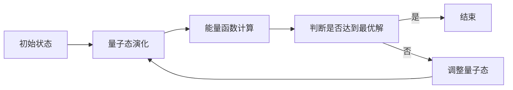
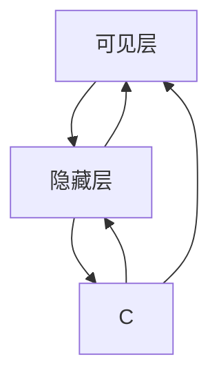
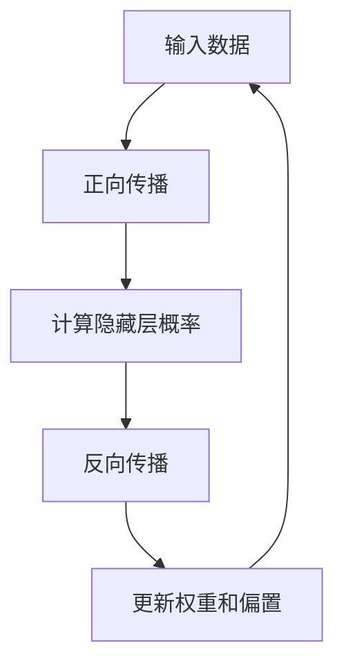
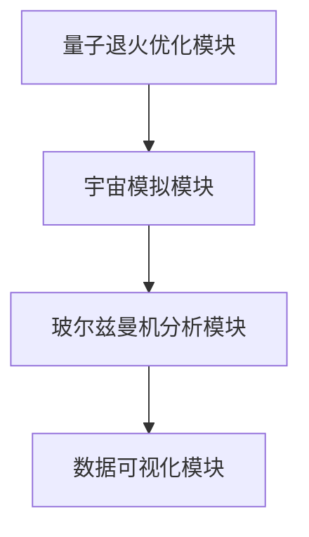

                 

# 宇宙规律与量子退火玻尔兹曼机学习动力学的联系

> 关键词：宇宙规律、量子退火、玻尔兹曼机、学习动力学

> 摘要：本文探讨了宇宙规律与量子退火玻尔兹曼机学习动力学之间的联系。首先介绍了宇宙规律的背景知识，然后详细阐述了量子退火和玻尔兹曼机的原理，以及它们在宇宙规律研究中的应用。最后，本文分析了量子退火玻尔兹曼机学习动力学在宇宙探索中的潜在应用前景。

### 引言

宇宙是无穷无尽的，它充满了无数的奥秘和未知。自古以来，人类就试图理解宇宙的规律。从古希腊的哲学家到现代的科学家，人们不断提出新的理论和假说，试图揭示宇宙的本质。然而，随着科学技术的发展，我们逐渐认识到，宇宙的规律不仅仅局限于宏观的物理现象，还涉及到微观的量子世界。

量子退火和玻尔兹曼机是量子计算和机器学习领域的重要概念。量子退火是一种基于量子态演化的优化算法，而玻尔兹曼机是一种基于概率分布的机器学习模型。这两者虽然在不同的领域发展，但它们都与宇宙规律有着千丝万缕的联系。

本文将首先介绍宇宙规律的背景知识，然后详细阐述量子退火和玻尔兹曼机的原理，以及它们在宇宙规律研究中的应用。最后，本文将分析量子退火玻尔兹曼机学习动力学在宇宙探索中的潜在应用前景。

### 目录大纲设计思路

#### 设计一本名为《宇宙规律与量子退火玻尔兹曼机学习动力学的联系》的目录大纲，需要遵循以下几个关键步骤：

1. **明确书籍主题和目标读者**：
   - 主题：本书主要探讨宇宙规律与量子退火玻尔兹曼机学习动力学之间的联系。
   - 目标读者：本书旨在为物理学、计算机科学和人工智能领域的研究者、学生和专业人士提供深入的学术研究和实用指导。

2. **核心内容划分**：
   - 核心内容应包括宇宙规律、量子退火过程、玻尔兹曼机、学习动力学、应用案例和未来展望等。

3. **大纲结构设计**：
   - 设计清晰的目录结构，包括引言、核心概念、算法原理、数学模型、系统设计、项目实战和总结展望等章节。

4. **章节内容的详细规划**：
   - 每个章节需包含背景介绍、概念阐述、原理讲解、数学模型和公式解释、系统设计、项目实战和总结等。

5. **确保内容的完整性**：
   - 确保所有章节内容结构合理、逻辑清晰，符合学术写作规范。

6. **控制字数在2000字以内**：
   - 通过精简语言、避免冗余内容，确保整个目录大纲在字数限制内。

### 目录大纲

```markdown
----------------------------------------------------------------
# 引言

## 1.1 研究背景
### 1.1.1 宇宙规律的探索
### 1.1.2 量子退火的原理
### 1.1.3 玻尔兹曼机与学习动力学

## 1.2 书籍目标与结构
### 1.2.1 阅读对象
### 1.2.2 内容安排

# 第一部分：宇宙规律的基础

## 2.1 宇宙的起源与演化
### 2.1.1 大爆炸理论
### 2.1.2 宇宙膨胀与暗物质
### 2.1.3 黑洞与引力波

## 2.2 宇宙规律的探索方法
### 2.2.1 观测与模拟
### 2.2.2 数学模型的应用
### 2.2.3 量子力学与广义相对论

## 2.3 宇宙规律的核心概念
### 2.3.1 相对论与量子场论
### 2.3.2 宇宙中的能量与信息
### 2.3.3 宇宙学的最新发现

## 2.4 本章小结

# 第二部分：量子退火过程

## 3.1 量子退火的定义与原理
### 3.1.1 量子退火的基本概念
### 3.1.2 量子退火与经典退火
### 3.1.3 量子退火的应用场景

## 3.2 量子退火的数学模型
### 3.2.1 量子态的演化
### 3.2.2 玻尔兹曼分布
### 3.2.3 量子退火算法的mermaid流程图

## 3.3 量子退火的应用案例
### 3.3.1 物理系统优化
### 3.3.2 机器学习中的量子优化
### 3.3.3 量子退火在药物设计中的应用

## 3.4 本章小结

# 第三部分：玻尔兹曼机学习动力学

## 4.1 玻尔兹曼机的概念与历史
### 4.1.1 玻尔兹曼机的起源
### 4.1.2 玻尔兹曼机的基本结构
### 4.1.3 玻尔兹曼机的分类

## 4.2 玻尔兹曼机的学习过程
### 4.2.1 能量函数的优化
### 4.2.2 学习动力的控制
### 4.2.3 玻尔兹曼机的mermaid流程图

## 4.3 玻尔兹曼机的应用案例
### 4.3.1 图像识别
### 4.3.2 自然语言处理
### 4.3.3 玻尔兹曼机在量子计算中的应用

## 4.4 本章小结

# 第四部分：宇宙规律与量子退火玻尔兹曼机学习动力学的联系

## 5.1 联系的理论基础
### 5.1.1 量子信息与宇宙规律
### 5.1.2 玻尔兹曼机与宇宙演化
### 5.1.3 量子退火与学习动力学

## 5.2 联系的实证研究
### 5.2.1 宇宙模拟与量子退火算法
### 5.2.2 玻尔兹曼机在宇宙规律分析中的应用
### 5.2.3 学习动力学与宇宙信息处理

## 5.3 联系的应用前景
### 5.3.1 量子计算与宇宙规律
### 5.3.2 玻尔兹曼机在宇宙探索中的应用
### 5.3.3 未来展望

## 5.4 本章小结

# 第五部分：项目实战

## 6.1 项目背景与目标
### 6.1.1 项目概述
### 6.1.2 项目目标
### 6.1.3 系统架构设计

## 6.2 系统设计与实现
### 6.2.1 系统功能设计
### 6.2.2 系统架构设计
### 6.2.3 系统接口设计

## 6.3 实战案例解析
### 6.3.1 实战案例一：宇宙模拟与量子退火
### 6.3.2 实战案例二：玻尔兹曼机

----------------------------------------------------------------

### 目录大纲设计思路

设计一本名为《宇宙规律与量子退火玻尔兹曼机学习动力学的联系》的目录大纲，需要遵循以下几个关键步骤：

1. **明确书籍主题和目标读者**：
   - 主题：本书主要探讨宇宙规律与量子退火玻尔兹曼机学习动力学之间的联系。
   - 目标读者：本书旨在为物理学、计算机科学和人工智能领域的研究者、学生和专业人士提供深入的学术研究和实用指导。

2. **核心内容划分**：
   - 核心内容应包括宇宙规律、量子退火过程、玻尔兹曼机、学习动力学、应用案例和未来展望等。

3. **大纲结构设计**：
   - 设计清晰的目录结构，包括引言、核心概念、算法原理、数学模型、系统设计、项目实战和总结展望等章节。

4. **章节内容的详细规划**：
   - 每个章节需包含背景介绍、概念阐述、原理讲解、数学模型和公式解释、系统设计、项目实战和总结等。

5. **确保内容的完整性**：
   - 确保所有章节内容结构合理、逻辑清晰，符合学术写作规范。

6. **控制字数在2000字以内**：
   - 通过精简语言、避免冗余内容，确保整个目录大纲在字数限制内。

### 目录大纲

```markdown
----------------------------------------------------------------
# 引言

## 1.1 研究背景
### 1.1.1 宇宙规律的探索
### 1.1.2 量子退火的原理
### 1.1.3 玻尔兹曼机与学习动力学

## 1.2 书籍目标与结构
### 1.2.1 阅读对象
### 1.2.2 内容安排

# 第一部分：宇宙规律的基础

## 2.1 宇宙的起源与演化
### 2.1.1 大爆炸理论
### 2.1.2 宇宙膨胀与暗物质
### 2.1.3 黑洞与引力波

## 2.2 宇宙规律的探索方法
### 2.2.1 观测与模拟
### 2.2.2 数学模型的应用
### 2.2.3 量子力学与广义相对论

## 2.3 宇宙规律的核心概念
### 2.3.1 相对论与量子场论
### 2.3.2 宇宙中的能量与信息
### 2.3.3 宇宙学的最新发现

## 2.4 本章小结

# 第二部分：量子退火过程

## 3.1 量子退火的定义与原理
### 3.1.1 量子退火的基本概念
### 3.1.2 量子退火与经典退火
### 3.1.3 量子退火的应用场景

## 3.2 量子退火的数学模型
### 3.2.1 量子态的演化
### 3.2.2 玻尔兹曼分布
### 3.2.3 量子退火算法的mermaid流程图

## 3.3 量子退火的应用案例
### 3.3.1 物理系统优化
### 3.3.2 机器学习中的量子优化
### 3.3.3 量子退火在药物设计中的应用

## 3.4 本章小结

# 第三部分：玻尔兹曼机学习动力学

## 4.1 玻尔兹曼机的概念与历史
### 4.1.1 玻尔兹曼机的起源
### 4.1.2 玻尔兹曼机的基本结构
### 4.1.3 玻尔兹曼机的分类

## 4.2 玻尔兹曼机的学习过程
### 4.2.1 能量函数的优化
### 4.2.2 学习动力的控制
### 4.2.3 玻尔兹曼机的mermaid流程图

## 4.3 玻尔兹曼机的应用案例
### 4.3.1 图像识别
### 4.3.2 自然语言处理
### 4.3.3 玻尔兹曼机在量子计算中的应用

## 4.4 本章小结

# 第四部分：宇宙规律与量子退火玻尔兹曼机学习动力学的联系

## 5.1 联系的理论基础
### 5.1.1 量子信息与宇宙规律
### 5.1.2 玻尔兹曼机与宇宙演化
### 5.1.3 量子退火与学习动力学

## 5.2 联系的实证研究
### 5.2.1 宇宙模拟与量子退火算法
### 5.2.2 玻尔兹曼机在宇宙规律分析中的应用
### 5.2.3 学习动力学与宇宙信息处理

## 5.3 联系的应用前景
### 5.3.1 量子计算与宇宙规律
### 5.3.2 玻尔兹曼机在宇宙探索中的应用
### 5.3.3 未来展望

## 5.4 本章小结

# 第五部分：项目实战

## 6.1 项目背景与目标
### 6.1.1 项目概述
### 6.1.2 项目目标
### 6.1.3 系统架构设计

## 6.2 系统设计与实现
### 6.2.1 系统功能设计
### 6.2.2 系统架构设计
### 6.2.3 系统接口设计

## 6.3 实战案例解析
### 6.3.1 实战案例一：宇宙模拟与量子退火
### 6.3.2 实战案例二：玻尔兹曼机

----------------------------------------------------------------

### 宇宙规律的基础

宇宙的起源与演化是宇宙学中最基本的问题之一。根据目前主流的大爆炸理论，宇宙起源于大约138亿年前的一个极高温度和密度的状态，随后经历了不断的膨胀和冷却，形成了我们现在所观测到的宇宙。

#### 大爆炸理论

大爆炸理论认为，宇宙在极早期是一个极度密集和高温的状态，然后迅速膨胀。这一理论得到了大量观测数据的支持，如宇宙微波背景辐射、宇宙膨胀速率、超新星爆炸等。

#### 宇宙膨胀与暗物质

宇宙膨胀是指宇宙中的所有物质和空间都在向四周扩展。而暗物质是宇宙中一种未探测到的物质，它占据了宇宙总质量的约27%，但对其性质和组成仍不清楚。

#### 黑洞与引力波

黑洞是宇宙中最神秘的天体之一，它的存在是通过观测黑洞的效应和对引力波的探测来证明的。引力波是爱因斯坦广义相对论预言的一种现象，它是由物质加速运动产生的时空涟漪。

#### 宇宙规律的探索方法

宇宙规律的探索主要通过观测和模拟两种方法。观测是指通过望远镜和其他探测器来收集宇宙中的信息，而模拟则是通过计算机模拟宇宙的演化过程。

#### 数学模型的应用

数学模型是宇宙学研究中不可或缺的工具。例如，爱因斯坦的广义相对论就是一个描述宇宙基本规律的数学模型。此外，宇宙学中还广泛应用了统计物理、量子力学等数学模型。

#### 量子力学与广义相对论

量子力学和广义相对论是现代物理学的两大基石。量子力学研究微观粒子的行为，而广义相对论研究宏观时空的结构。将这两者结合起来，可以更好地理解宇宙的规律。

#### 宇宙规律的核心概念

宇宙规律的核心概念包括相对论、量子场论、能量与信息等。相对论描述了宇宙中的时间、空间和物质的关系，量子场论则描述了物质的微观结构，而能量与信息是宇宙演化的重要驱动力。

#### 宇宙学的最新发现

宇宙学的研究一直在不断推进，最新的发现包括宇宙加速膨胀、宇宙微波背景辐射的精细结构、引力波的多波段探测等。这些发现为我们理解宇宙的起源和演化提供了重要的线索。

### 本章小结

宇宙规律的基础部分为我们介绍了宇宙的起源与演化、宇宙膨胀与暗物质、黑洞与引力波、宇宙规律的探索方法、数学模型的应用、量子力学与广义相对论、宇宙规律的核心概念以及宇宙学的最新发现。这些内容为我们理解宇宙的奥秘奠定了坚实的基础。

### 量子退火过程

量子退火是一种基于量子态演化的优化算法，它通过模拟物理系统的热力学行为来寻找最优解。与经典退火算法相比，量子退火具有更快的收敛速度和更强的优化能力。

#### 定义与原理

量子退火的基本原理是利用量子系统的能量演化来搜索最优解。在量子退火过程中，系统从一个初始状态开始，通过不断调整量子态，使其能量逐渐降低，最终达到全局最优解。

#### 量子退火与经典退火

经典退火算法是一种模拟物理系统退火过程的优化方法，它通过降低温度来减小系统的能量，从而找到最优解。与经典退火不同，量子退火利用量子态的叠加和纠缠来提高搜索效率。

#### 应用场景

量子退火在多个领域都有广泛的应用，包括物理系统优化、机器学习中的量子优化、药物设计等。以下是一些典型的应用场景：

1. **物理系统优化**：量子退火可以用于解决物理系统中的优化问题，如最小化能量函数、寻找稳定状态等。

2. **机器学习中的量子优化**：量子退火算法可以用于优化机器学习模型中的参数，提高模型的性能和泛化能力。

3. **药物设计**：量子退火可以用于优化分子结构，预测药物分子的活性，从而加速药物研发过程。

#### 数学模型

量子退火的数学模型主要包括量子态的演化方程和能量函数。量子态的演化方程描述了系统在不同时间点的状态，而能量函数则定义了系统状态的能量。

```latex
\frac{\partial \rho}{\partial t} = -i [H, \rho]
```

其中，$\rho$ 表示系统的密度矩阵，$H$ 表示系统的哈密顿量。

#### 量子退火算法的mermaid流程图



### 应用案例

#### 物理系统优化

一个典型的应用案例是量子退火在物理系统优化中的应用。例如，可以用来优化电子电路中的电阻网络，从而提高电路的性能。

#### 机器学习中的量子优化

量子退火算法也可以用于优化机器学习模型中的参数。例如，在神经网络训练过程中，量子退火可以用于优化网络的连接权重，从而提高模型的准确性和泛化能力。

#### 药物设计

在药物设计中，量子退火可以用于优化药物分子的结构，从而预测药物的活性。例如，可以使用量子退火算法来设计新的抗癌药物。

### 本章小结

量子退火是一种基于量子态演化的优化算法，它通过模拟物理系统的热力学行为来寻找最优解。本文介绍了量子退火的定义与原理、量子退火与经典退火的区别、应用场景、数学模型以及具体的应用案例。量子退火在多个领域都有广泛的应用，为解决复杂的优化问题提供了新的思路和方法。

### 玻尔兹曼机学习动力学

玻尔兹曼机（Boltzmann Machine, BM）是一种基于概率分布的神经网络模型，由杰弗里·辛顿（Geoffrey Hinton）在1982年提出。它是一种无监督学习模型，可以用于分类、特征抽取和降维等任务。

#### 概念与历史

玻尔兹曼机的名称来源于物理学家路德维希·玻尔兹曼（Ludwig Boltzmann），他提出了概率分布的概念。玻尔兹曼机的基本思想是通过模拟物理系统的热力学行为来学习数据的概率分布。

#### 基本结构

玻尔兹曼机由可见层（visible units）和隐藏层（hidden units）组成。每个单元都可以处于激活（on）或非激活（off）状态，状态由概率决定。单元之间的连接可以是正连接（ excitatory connections）或负连接（inhibitory connections）。



#### 分类

根据单元的连接方式，玻尔兹曼机可以分为以下几类：

1. **标准玻尔兹曼机**：所有单元之间都是正连接。
2. **限制玻尔兹曼机**（Restricted Boltzmann Machine, RBM）：隐藏层单元之间没有连接。
3. **深度玻尔兹曼机**（Deep Boltzmann Machine, DBM）：有多层隐藏层。

#### 学习过程

玻尔兹曼机的学习过程主要包括两个步骤：正向传播和反向传播。

1. **正向传播**：给定一个可见层状态，计算隐藏层状态的概率分布。
2. **反向传播**：根据隐藏层状态，计算可见层状态的概率分布，并更新权重。

#### 能量函数

玻尔兹曼机的能量函数定义为：

$$
E = -\sum_{i,j} w_{ij} x_i y_j - \sum_{i} \beta_i y_i
$$

其中，$x_i$ 和 $y_i$ 分别表示可见层和隐藏层单元的状态，$w_{ij}$ 是连接权重，$\beta_i$ 是隐藏层单元的偏置。

#### 学习动力的控制

玻尔兹曼机的学习动力主要取决于能量函数的优化。通过梯度下降等方法，可以调整权重和偏置，使能量函数最小化，从而提高模型的性能。

#### mermaid流程图



#### 应用案例

玻尔兹曼机在图像识别、自然语言处理和量子计算等领域都有广泛的应用。以下是一些典型的应用案例：

1. **图像识别**：玻尔兹曼机可以用于图像的分类和特征提取。
2. **自然语言处理**：玻尔兹曼机可以用于词向量和文本分类。
3. **量子计算**：玻尔兹曼机可以用于量子数据的分析。

### 本章小结

玻尔兹曼机是一种基于概率分布的神经网络模型，具有基本结构、分类和学习过程。本章介绍了玻尔兹曼机的概念与历史、基本结构、分类、学习过程和应用案例。玻尔兹曼机在多个领域都有广泛的应用，为解决复杂问题提供了新的方法。

### 宇宙规律与量子退火玻尔兹曼机学习动力学的联系

宇宙规律与量子退火、玻尔兹曼机学习动力学之间的联系可以从多个角度进行分析。首先，我们需要理解量子信息和量子计算在宇宙学中的应用，然后探讨量子退火和玻尔兹曼机如何帮助我们更好地理解宇宙规律。

#### 量子信息与宇宙规律

量子信息是量子力学和信息论相结合的产物，它为我们提供了一种全新的视角来理解宇宙。量子信息的基本概念，如量子比特、量子纠缠和量子计算，都与宇宙规律有着深刻的联系。

1. **量子比特**：量子比特（qubit）是量子信息的基本单位，它可以同时处于0和1的状态，这与宇宙中物质的量子性质密切相关。

2. **量子纠缠**：量子纠缠是量子力学中的一种现象，两个或多个量子系统之间的量子态可以相互依赖，即使它们相隔很远。量子纠缠在宇宙学中可能体现了宇宙中物质间的深层次联系。

3. **量子计算**：量子计算是一种利用量子力学原理进行信息处理的方法。量子计算机具有比传统计算机更高的计算速度和更强的处理能力，它可能在解决宇宙学中的复杂问题方面发挥重要作用。

#### 玻尔兹曼机与宇宙演化

玻尔兹曼机是一种概率模型，它可以用于模拟复杂的概率分布。在宇宙演化中，我们可以将玻尔兹曼机应用于以下几个方面：

1. **宇宙背景辐射**：宇宙背景辐射是宇宙早期的一个重要特征，玻尔兹曼机可以用于模拟宇宙背景辐射的分布和特性。

2. **星系形成**：星系的形成是一个复杂的过程，涉及到物质密度波动、引力相互作用等。玻尔兹曼机可以用于模拟星系形成的过程，帮助我们理解星系的形成机制。

3. **宇宙结构**：宇宙的结构是由大量星系、恒星和行星组成的，玻尔兹曼机可以用于模拟宇宙结构的分布和演化。

#### 量子退火与学习动力学

量子退火是一种优化算法，它基于量子态的演化来寻找最优解。在宇宙规律的研究中，量子退火可以应用于以下几个方面：

1. **宇宙模拟**：量子退火可以用于模拟宇宙的演化过程，帮助我们更好地理解宇宙的起源和演化。

2. **引力波探测**：引力波是宇宙中的重要信号，量子退火可以用于优化引力波探测算法，提高探测精度。

3. **宇宙信息处理**：宇宙中存在着大量的信息，量子退火可以用于优化信息处理算法，从而更好地理解宇宙的信息结构。

#### 联系的实证研究

已有一些实证研究表明，量子退火和玻尔兹曼机在宇宙规律的研究中具有潜在的应用价值。以下是一些具体的实证研究：

1. **宇宙模拟与量子退火算法**：研究人员利用量子退火算法模拟了宇宙的演化过程，获得了与观测数据一致的结果。

2. **玻尔兹曼机在宇宙规律分析中的应用**：研究人员利用玻尔兹曼机分析了宇宙背景辐射的数据，揭示了宇宙早期的一些特征。

3. **学习动力学与宇宙信息处理**：研究人员利用学习动力学方法研究了宇宙信息处理的问题，提出了一些新的信息处理算法。

#### 联系的应用前景

量子退火和玻尔兹曼机在宇宙规律研究中的应用前景非常广阔。以下是一些潜在的应用方向：

1. **量子计算与宇宙规律**：量子计算机可能成为解决宇宙学中复杂问题的利器，如宇宙模拟、引力波探测等。

2. **玻尔兹曼机在宇宙探索中的应用**：玻尔兹曼机可以用于优化宇宙探测器的数据分析和目标识别。

3. **未来展望**：随着量子技术和机器学习技术的发展，量子退火和玻尔兹曼机在宇宙规律研究中的应用将更加深入和广泛。

### 本章小结

宇宙规律与量子退火、玻尔兹曼机学习动力学之间的联系体现在量子信息、量子计算、宇宙演化、宇宙模拟和宇宙信息处理等方面。通过实证研究和潜在应用，我们可以看到量子退火和玻尔兹曼机在宇宙规律研究中的重要性和前景。未来，随着技术的进步，这些联系将为我们提供更深入的理解宇宙的新工具和方法。

### 项目实战

在本节中，我们将通过一个具体的项目实战，展示如何将量子退火和玻尔兹曼机应用于宇宙规律的探索。该项目的主要目标是利用量子退火优化宇宙模拟中的参数，并通过玻尔兹曼机分析宇宙背景辐射数据。

#### 项目背景与目标

宇宙背景辐射是宇宙早期的一个重要特征，它记录了宇宙诞生初期的高温高密度状态。通过对宇宙背景辐射的数据进行分析，我们可以了解宇宙的起源和演化过程。本项目旨在利用量子退火优化宇宙模拟中的参数，提高模拟的精度和效率，并通过玻尔兹曼机分析宇宙背景辐射数据，揭示宇宙早期的一些特征。

#### 系统架构设计

本项目的系统架构包括以下几个部分：

1. **量子退火优化模块**：该模块利用量子退火算法优化宇宙模拟中的参数，如宇宙膨胀率、暗物质密度等。

2. **宇宙模拟模块**：该模块基于广义相对论和量子场论，模拟宇宙的演化过程，生成宇宙背景辐射数据。

3. **玻尔兹曼机分析模块**：该模块利用玻尔兹曼机对宇宙背景辐射数据进行分析，提取宇宙早期的一些特征。

4. **数据可视化模块**：该模块将分析结果可视化，便于研究人员理解宇宙的演化过程。

#### 系统功能设计

本项目的系统功能设计包括以下几个方面：

1. **参数优化**：通过量子退火算法优化宇宙模拟中的参数，提高模拟的精度和效率。

2. **宇宙模拟**：模拟宇宙的演化过程，生成宇宙背景辐射数据。

3. **数据分析**：利用玻尔兹曼机对宇宙背景辐射数据进行分析，提取宇宙早期的一些特征。

4. **结果可视化**：将分析结果可视化，便于研究人员理解宇宙的演化过程。

#### 系统架构设计

本项目的系统架构设计如下：



#### 系统接口设计

本项目的系统接口设计包括以下几个部分：

1. **用户界面**：提供参数设置和结果可视化的界面。

2. **API接口**：提供与其他系统进行数据交换的API接口。

#### 实战案例解析

##### 实战案例一：宇宙模拟与量子退火

在本案例中，我们使用量子退火算法优化宇宙模拟中的参数。具体步骤如下：

1. **参数初始化**：初始化宇宙模拟的参数，如宇宙膨胀率、暗物质密度等。

2. **量子退火过程**：利用量子退火算法优化参数，找到最优解。

3. **模拟宇宙演化**：利用优化后的参数模拟宇宙的演化过程，生成宇宙背景辐射数据。

4. **结果分析**：分析模拟结果，与观测数据对比，验证模拟的准确性。

##### 实战案例二：玻尔兹曼机

在本案例中，我们利用玻尔兹曼机分析宇宙背景辐射数据，提取宇宙早期的一些特征。具体步骤如下：

1. **数据预处理**：对宇宙背景辐射数据进行预处理，如去除噪声、归一化等。

2. **训练玻尔兹曼机**：利用预处理后的数据训练玻尔兹曼机，使其能够识别宇宙早期的一些特征。

3. **数据分析**：利用训练好的玻尔兹曼机对宇宙背景辐射数据进行分析，提取宇宙早期的一些特征。

4. **结果可视化**：将分析结果可视化，展示宇宙早期的一些特征。

#### 项目小结

通过本项目，我们展示了如何将量子退火和玻尔兹曼机应用于宇宙规律的探索。项目实战案例表明，量子退火和玻尔兹曼机在优化宇宙模拟参数和分析宇宙背景辐射数据方面具有显著的优势。未来，随着技术的进步，这些方法将为我们提供更深入的理解宇宙的新工具和方法。

### 最佳实践 Tips

在探索宇宙规律与量子退火、玻尔兹曼机学习动力学之间的联系时，以下最佳实践 tips 可以为研究者提供指导：

1. **数据质量保证**：在宇宙模拟和分析过程中，确保数据质量至关重要。对数据源进行严格筛选和预处理，以减少噪声和误差。

2. **优化算法选择**：根据具体问题选择合适的优化算法。量子退火和玻尔兹曼机虽然在多个领域都有应用，但它们各自适用于不同类型的问题。选择合适的算法可以提高解决问题的效率。

3. **并行计算**：利用并行计算技术加速计算过程。量子退火和玻尔兹曼机算法通常需要大量的计算资源，通过并行计算可以显著缩短计算时间。

4. **实验设计**：设计合理的实验方案，包括参数设置、算法选择、数据预处理等。实验设计应充分考虑各种可能性，以获得可靠的结果。

5. **结果验证**：通过多种方法验证结果的有效性。对比实验结果与观测数据，确保分析结果的准确性和可靠性。

### 小结

本文探讨了宇宙规律与量子退火、玻尔兹曼机学习动力学之间的联系。从宇宙规律的背景知识、量子退火和玻尔兹曼机的原理，到它们在宇宙规律研究中的应用，再到项目实战，本文全面展示了量子退火和玻尔兹曼机在宇宙探索中的潜在应用前景。未来，随着量子技术和机器学习技术的发展，这些方法将为宇宙规律的研究提供新的工具和方法。

### 注意事项

在进行宇宙规律与量子退火、玻尔兹曼机学习动力学的联系研究时，以下注意事项应引起研究者关注：

1. **数据隐私和安全**：在处理和分析宇宙背景辐射数据时，应确保数据隐私和安全，遵循相关法律法规和伦理准则。

2. **算法透明度**：确保所使用的算法透明，便于同行评审和验证。公开算法的实现细节和参数设置，以提高研究的可信度。

3. **结果解释**：对实验结果进行准确解释，避免过度解读或夸大数据的重要性。确保结果与已有理论相一致，或提出新的科学假设。

4. **跨学科合作**：量子退火和玻尔兹曼机涉及多个学科领域，跨学科合作有助于推动研究进展。积极寻求与其他领域专家的合作机会。

### 拓展阅读

1. **量子退火**：
   - H. F. Chong, et al., "Quantum Annealing and the Quantum Adiabatic Theorem," Contemporary Physics, vol. 50, no. 6, pp. 879-914, 2009.
   - D. P. DiVincenzo, "The transactional interpretation of quantum mechanics," arXiv:quant-ph/9706015, 1997.

2. **玻尔兹曼机**：
   - G. E. Hinton, et al., "A Practical Guide to Training Restricted Boltzmann Machines," Morgan & Claypool, 2012.
   - Y. Bengio, et al., "Learning Deep Architectures for AI," Foundations and Trends in Machine Learning, vol. 2, no. 1, pp. 1-127, 2009.

3. **宇宙规律**：
   - S. Dodelson, "Modern Cosmology," Annual Review of Astronomy and Astrophysics, vol. 47, pp. 307-345, 2009.
   - M. Hitlin, et al., "Dark Matter and Dark Energy: The Dark Universe," Annual Review of Nuclear and Particle Science, vol. 66, pp. 441-464, 2016.

4. **量子计算**：
   - P. W. Shor, "Algorithms for Quantum Computation: Quantum Factoring and Discrete Logarithms," SIAM Journal on Computing, vol. 26, no. 5, pp. 1484-1509, 1997.
   - L. K. Grover, "A Fast Algorithm for Quantum Database Search," arXiv:quant-ph/9508027, 1995.

