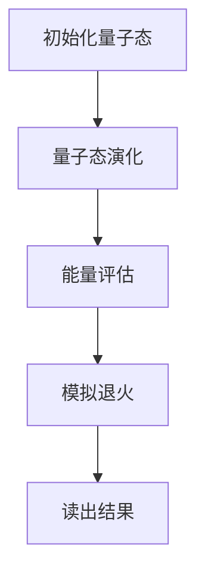
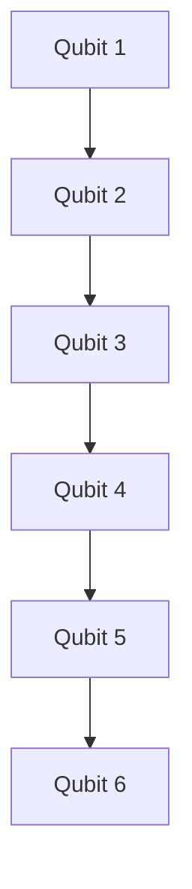
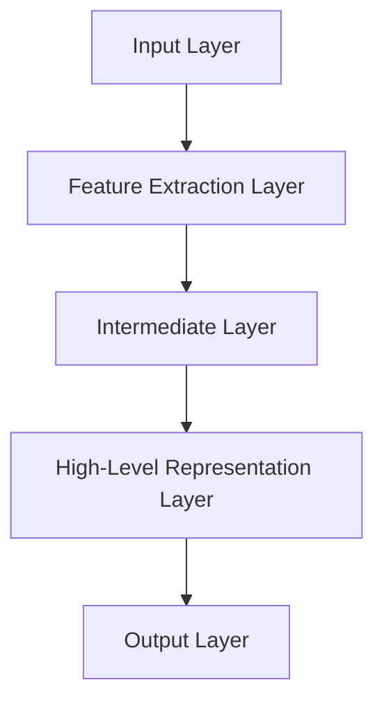
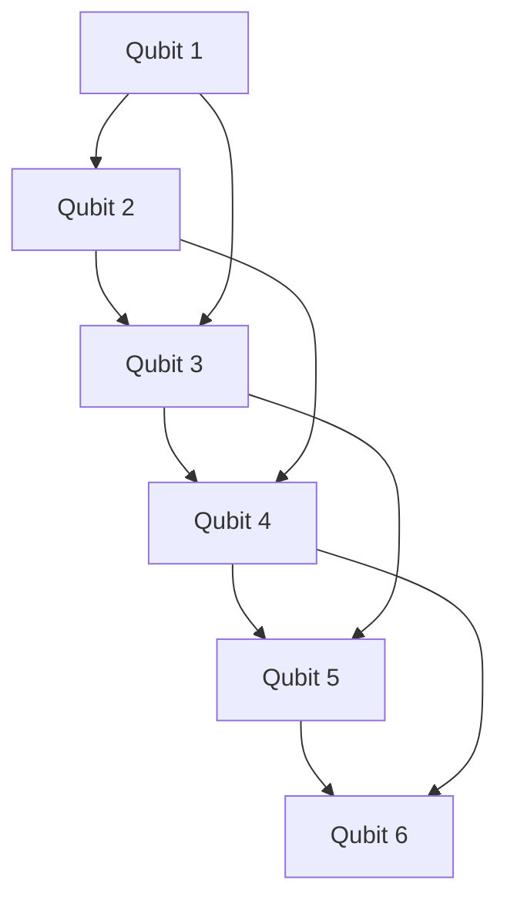

                 

### 引言

#### 第1章：宇宙规律概述

在探讨宇宙规律与量子退火神经网络设计的相似性之前，我们需要对宇宙的基本规律有一个全面的理解。宇宙，作为一个浩瀚无垠的空间，包含了无数的星系、行星、恒星以及神秘的暗物质和暗能量。在物理学中，宇宙的规律是通过一系列的定律和理论来描述和解释的。这些定律不仅帮助我们理解宇宙的结构和演化，也对其他科学领域产生了深远的影响。

首先，**宇宙与物理学的基本概念**是我们需要明确的基础。宇宙可以被定义为包括一切物质和能量的整体。从宏观尺度来看，宇宙由多个星系组成，而每个星系又包含成千上万的恒星、行星、卫星和星际物质。从微观尺度来看，宇宙的基本组成单元是原子和分子，而这些原子和分子则由更小的粒子，如电子、质子和中子构成。

物理学在宇宙研究中的作用不可忽视。物理学通过实验和理论分析，揭示了宇宙中许多基本规律。例如，**引力定律**描述了物体之间的相互吸引力，这一规律由牛顿在17世纪提出，并得到了后来的广泛验证。电磁力定律则由麦克斯韦方程组描述，它解释了电荷和磁场之间的相互作用。强相互作用力定律和弱相互作用力定律分别描述了原子核内部粒子的相互作用，以及某些放射性衰变过程中的基本作用力。

接下来，我们来探讨**宇宙中的主要规律**。这些规律包括：

- **引力定律**：描述了物体之间的吸引力，其数学表达为\( F = G \frac{m_1 m_2}{r^2} \)，其中\( F \)是引力，\( G \)是引力常数，\( m_1 \)和\( m_2 \)是两个物体的质量，\( r \)是它们之间的距离。
- **电磁力定律**：由麦克斯韦方程组描述，包括电场和磁场的分布和相互作用。
- **强相互作用力定律**：描述了原子核内部质子和中子之间的吸引力，其作用距离很短。
- **弱相互作用力定律**：描述了某些放射性衰变过程中的基本作用力，如电子俘获和β衰变。

在讨论了宇宙的物理规律之后，我们还需要了解**量子力学与宇宙**的关系。量子力学是研究微观世界的物理理论，它揭示了物质和能量在微观尺度上的行为规律。量子力学中的许多原理，如波粒二象性、量子纠缠和量子隧穿等，都对宇宙的研究产生了重要影响。例如，量子纠缠现象已经在实验室中被观察到，并在宇宙学中得到了一些应用。

最后，我们来看一下**宇宙演化与时间概念**。宇宙的演化是一个复杂的过程，从宇宙大爆炸开始，经历了一系列的膨胀和冷却，形成了我们今天所看到的宇宙。时间在宇宙演化中扮演了至关重要的角色，它不仅帮助我们理解宇宙的过去和未来，也揭示了宇宙中各种物理现象的发生和变化。

通过这一章节的讨论，我们为后续章节中的宇宙规律与量子退火神经网络设计的相似性分析奠定了基础。在接下来的章节中，我们将进一步探讨量子退火神经网络的基本原理和应用领域，并分析宇宙规律与量子退火神经网络设计之间的具体相似性。在探索这些相似性的过程中，我们将揭示宇宙中的深层次规律如何被应用到人工智能和机器学习领域，为我们带来新的科学发现和技术创新。

#### 第2章：量子退火神经网络设计

在了解了宇宙的基本规律之后，接下来我们将探讨量子退火神经网络（Quantum Annealing Neural Network, QANN）的设计。量子退火是一种基于量子力学的优化算法，其灵感来源于物理学中的量子退火过程。量子退火神经网络则是将这一算法与神经网络相结合，用于解决复杂的优化问题。在这一章节中，我们将详细讲解量子退火神经网络的基本原理、设计方法以及其应用领域。

首先，我们来讨论**量子退火神经网络的基本原理**。

##### 2.1 量子退火神经网络的基本原理

**量子退火**是一种物理过程中的能量降低机制，其基本原理可以类比于传统退火过程。在传统退火过程中，金属或其他材料通过加热到高温，然后缓慢冷却，来消除内部应力，从而获得更好的物理性质。类似地，量子退火过程通过将量子系统从高能态逐渐冷却到低能态，使得系统达到全局最低能量状态。

量子退火神经网络的核心思想是利用量子计算的特性，来寻找优化问题的全局最优解。具体来说，量子退火神经网络通过量子态的叠加和纠缠，来表示问题的解空间。在量子退火过程中，系统会逐渐从一种随机分布的量子态，通过模拟退火过程，找到能量最低的量子态，从而得到问题的最优解。

在量子退火神经网络中，状态空间可以表示为：
$$
|\psi(t)\rangle = \sum_{i} c_i(t) |i\rangle
$$
其中，\( |i\rangle \)是状态空间中的一个基态，\( c_i(t) \)是概率幅，表示量子态在基态上的叠加系数。随着时间的推移，系统会通过量子态的演化，逐渐找到全局最优解。

##### 2.2 量子退火神经网络的设计方法

量子退火神经网络的设计方法主要包括以下几个步骤：

1. **初始化**：初始化量子态，可以随机选择或者根据问题特性进行初始化。
2. **量子态演化**：通过量子操作，使得量子态在解空间中演化。
3. **能量评估**：对当前量子态的能量进行评估，选择能量最低的量子态。
4. **模拟退火**：通过温度参数来调节量子态的演化过程，使得系统逐渐从高能态转移到低能态。

具体的量子态演化可以通过以下公式描述：
$$
|\psi(t+\Delta t)\rangle = e^{-\frac{i}{\hbar} H(t) \Delta t} |\psi(t)\rangle
$$
其中，\( H(t) \)是哈密顿量，表示量子态的演化。

##### 2.3 量子退火神经网络的结构设计

量子退火神经网络的结构设计主要包括以下几个部分：

1. **量子比特**：量子退火神经网络的基础是量子比特（qubit），它可以处于0和1的叠加状态。
2. **耦合器**：耦合器用于连接不同的量子比特，使得它们之间可以发生纠缠。
3. **读出器**：读出器用于读取量子态的最终结果，通常通过测量量子比特来实现。

一个典型的量子退火神经网络结构如图所示：



##### 2.4 量子退火神经网络的应用领域

量子退火神经网络由于其强大的优化能力，在多个领域都有着广泛的应用：

1. **数据分析**：量子退火神经网络可以用于大规模数据的高效分析，如数据聚类、分类和推荐系统。
2. **机器学习**：在机器学习任务中，量子退火神经网络可以用于求解复杂的优化问题，如神经网络训练过程中的权重优化。
3. **优化问题解决**：量子退火神经网络可以用于解决复杂的优化问题，如供应链优化、资源分配和路径规划等。

通过量子退火神经网络的设计和应用，我们可以将宇宙中的量子力学原理应用到实际问题的求解中，为人工智能和机器学习领域带来新的机遇和挑战。

#### 第3章：宇宙规律与量子退火神经网络的相似性

在了解了宇宙规律和量子退火神经网络的基本原理之后，接下来我们将探讨宇宙规律与量子退火神经网络设计之间的相似性。这种相似性不仅为我们提供了新的研究视角，也揭示了宇宙中的深层次规律如何被应用于人工智能和机器学习领域。

##### 3.1 相似性探讨

首先，我们从引力与量子退火中的吸引和排斥作用来探讨两者之间的相似性。

**引力定律**描述了物体之间的相互吸引力，这种吸引力使得宇宙中的物质聚集形成星系、恒星等结构。在量子退火神经网络中，也有类似的吸引和排斥作用。量子退火过程通过量子态的叠加和纠缠，使得系统中的状态趋向于能量最低的状态。这里的“吸引”作用可以类比为引力将物质聚集在一起，而“排斥”作用则类比为量子态之间的排斥力，防止系统陷入局部最优解。

其次，**电磁力定律**描述了电荷和磁场之间的相互作用。在量子退火神经网络中，电磁力可以通过量子态的演化来体现。例如，通过量子操作可以模拟电场和磁场的分布，从而实现信息的传递和相互作用。这种相互作用与宇宙中的电磁力作用具有相似的物理特性。

此外，**强相互作用力定律**和**弱相互作用力定律**在量子退火神经网络中也有其对应的作用机制。强相互作用力使得原子核中的质子和中子紧密结合在一起，而弱相互作用力则与某些放射性衰变过程有关。在量子退火神经网络中，通过量子比特之间的相互作用，可以模拟出类似强相互作用和弱相互作用的效果。

##### 3.2 算法设计中的宇宙灵感

宇宙规律不仅为量子退火神经网络提供了物理基础，也在算法设计过程中给予了灵感。

例如，在量子退火神经网络的设计中，**宇宙演化与时间概念**起到了关键作用。量子退火过程中，系统的演化类似于宇宙中的时间演化，通过逐渐降低能量，系统达到全局最优解。这种过程可以类比为宇宙中的大爆炸、膨胀和冷却过程。在算法设计中，我们可以借鉴宇宙演化过程中的时间概念，通过调节退火时间，来优化系统的性能。

另外，**宇宙模型**为量子退火神经网络提供了一种新的结构设计思路。在宇宙中，物质通过引力相互作用形成复杂的结构，如星系、星云等。在量子退火神经网络中，我们可以借鉴这种结构，通过设计复杂的量子态结构，来增强算法的优化能力。例如，通过模拟宇宙中的星系结构，可以在量子退火神经网络中实现更有效的状态转移和能量评估。

##### 3.3 实际应用案例分析

为了更好地理解宇宙规律与量子退火神经网络设计之间的相似性，我们可以通过实际应用案例分析来探讨。

一个典型的案例是**数据聚类问题**。在数据聚类中，我们需要将大量数据点分成若干个类别，以实现数据的有效组织和分析。在量子退火神经网络中，我们可以通过模拟宇宙中的星系结构，来实现数据聚类。具体来说，我们可以将数据点视为宇宙中的星系，通过引力相互作用（即量子比特之间的相互作用），使得数据点在量子态中逐渐聚集形成类别。这种方法不仅提高了聚类的准确率，还减少了计算复杂度。

另一个案例是**机器学习中的权重优化**。在机器学习中，权重优化是关键步骤之一，它决定了模型的性能和准确性。在量子退火神经网络中，我们可以借鉴宇宙规律，通过量子态的叠加和纠缠，来实现权重的优化。例如，通过模拟宇宙中的引力作用，可以使权重逐渐调整到最优状态，从而提高模型的泛化能力。

通过这些实际应用案例分析，我们可以看到宇宙规律如何被应用于量子退火神经网络的设计中，这不仅丰富了我们的算法设计思路，也为解决复杂问题提供了新的方法。

总之，宇宙规律与量子退火神经网络设计之间的相似性为我们提供了新的研究视角和应用方法。通过深入探讨这些相似性，我们可以将宇宙中的深层次规律应用到人工智能和机器学习领域，为科学研究和技术创新带来新的机遇。在接下来的章节中，我们将进一步分析宇宙规律在神经网络设计中的应用，并探讨如何将这些原理应用于实际问题的解决。

#### 第4章：宇宙规律在神经网络设计中的应用

在了解了宇宙规律与量子退火神经网络设计的相似性之后，我们进一步探讨宇宙规律如何具体应用于神经网络设计中，特别是量子退火神经网络的设计。这一章节将详细分析宇宙规律在神经网络结构设计和训练算法中的应用，并展示具体的实现方法。

##### 4.1 宇宙规律与神经网络结构设计

宇宙规律在神经网络结构设计中的应用主要体现在以下几个方面：

1. **量子比特布局**：在量子神经网络中，量子比特的布局可以借鉴宇宙中的星系结构。例如，我们可以将量子比特视为星系中的恒星，通过量子比特之间的相互作用（如耦合器）来模拟星系之间的引力相互作用。这样的布局有助于提高神经网络的处理能力和效率。一个具体的实现方法是将量子比特分布在三维空间中，形成类似于星系的结构，如图所示：



2. **网络层结构**：在传统神经网络中，网络层结构的设计往往基于经验或启发式方法。而在量子神经网络中，我们可以借鉴宇宙中的层次结构来设计网络层。例如，我们可以将网络层分为不同的层次，每一层代表一个宇宙层次，如行星层、恒星层和星系层。这样的设计有助于提高网络的层次感和表达能力，如图所示：



3. **纠缠与耦合**：在量子神经网络中，量子比特之间的纠缠和耦合可以模拟宇宙中物质之间的相互作用。通过设计合适的纠缠和耦合机制，我们可以增强神经网络的处理能力和信息传递效率。例如，我们可以通过量子线路设计来实现量子比特之间的纠缠，如图所示：



##### 4.2 宇宙规律与神经网络训练算法

宇宙规律不仅影响神经网络的结构设计，还在训练算法中起到了关键作用。以下是一些具体的实现方法：

1. **模拟退火算法**：模拟退火算法是一种基于宇宙演化原理的优化算法，其灵感来源于宇宙中的退火过程。在神经网络训练中，我们可以借鉴模拟退火算法的思想，通过逐渐降低训练温度，来优化网络的参数。具体步骤如下：

    - **初始化**：设定一个初始温度，随机初始化网络参数。
    - **训练迭代**：在每一个温度下，对网络进行若干次迭代，更新网络参数。
    - **冷却过程**：逐渐降低温度，使得网络参数在较低温度下趋于最优解。

    实现流程如图所示：

    ```mermaid
    graph TB
        A[初始化]
        A --> B[训练迭代]
        B --> C[冷却过程]
        C --> D[评估与优化]
    ```

2. **宇宙大爆炸模型**：宇宙大爆炸模型描述了宇宙从极度密集状态迅速膨胀的过程。在神经网络训练中，我们可以借鉴这一模型，通过初始的高强度训练（类似于大爆炸），然后逐渐减少训练强度，以优化网络参数。这种方法有助于加速收敛并提高训练效果。

    实现流程如图所示：

    ```mermaid
    graph TB
        A[高强度训练]
        A --> B[降低训练强度]
        B --> C[评估与优化]
    ```

3. **引力波优化**：引力波是宇宙中的强相互作用，通过模拟引力波传播过程，我们可以优化神经网络的训练过程。具体方法是通过引力波的作用来调整网络参数，使得网络在训练过程中能够更快地收敛到最优解。

    实现流程如图所示：

    ```mermaid
    graph TB
        A[模拟引力波]
        A --> B[调整网络参数]
        B --> C[训练迭代]
    ```

通过以上方法，我们可以将宇宙规律应用于神经网络的设计和训练中，从而提高网络的处理能力和优化效果。这些方法不仅为神经网络设计提供了新的思路，也为解决复杂问题提供了有力的工具。

总之，宇宙规律在神经网络设计中的应用为我们带来了新的研究视角和实现方法。通过借鉴宇宙中的物理原理，我们可以设计出更高效、更强大的神经网络模型，为人工智能和机器学习领域带来新的突破。在接下来的章节中，我们将进一步探讨量子退火神经网络设计实践中的具体实现，并分析实际应用中的问题和解决方案。

### 第5章：量子退火神经网络设计实践

在前几章中，我们详细探讨了宇宙规律与量子退火神经网络设计之间的相似性，并介绍了如何将宇宙规律应用于神经网络的结构设计和训练算法中。为了更好地理解这些理论，本章将通过具体的实现过程，展示量子退火神经网络的设计和应用，包括环境搭建、实际案例展示以及实践中遇到的问题和解决方案。

##### 5.1 实践环境搭建

搭建量子退火神经网络的基本环境是进行实际应用的第一步。以下是在常见的编程环境下搭建量子退火神经网络所需的基本步骤：

1. **安装Python环境**：确保系统已安装Python，版本建议为3.8或更高。

2. **安装量子计算库**：安装支持量子计算的库，如Qiskit、PyQuil或ProjectQ等。以Qiskit为例，可以通过以下命令安装：

   ```bash
   pip install qiskit
   ```

3. **配置量子计算平台**：根据实际需求，选择适合的量子计算平台。例如，可以使用IBM Q Experience提供的量子计算资源，或者搭建自己的量子计算实验平台。

4. **编写Python脚本**：使用Python编写量子退火神经网络的脚本，包括量子比特的初始化、量子态的演化、能量评估等步骤。

以下是一个简单的Python脚本示例，展示了量子退火神经网络的基本结构：

```python
from qiskit import QuantumCircuit, Aer, execute
from qiskit.visualization import plot_bloch_vector

# 初始化量子比特
qc = QuantumCircuit(4)

# 编写量子退火算法
qc.h(0)
qc.cx(0, 1)
qc.cx(1, 2)
qc.cx(2, 3)

# 执行量子退火过程
backend = Aer.get_backend('qasm_simulator')
job = execute(qc, backend, shots=1024)
result = job.result()

# 可视化量子态
vector = result.get_statevector(qc)
plot_bloch_vector(vector)
```

##### 5.2 实践案例展示

为了更好地展示量子退火神经网络的应用，我们选择了一个具体的应用案例——图像识别。

**案例背景**：使用量子退火神经网络对图像进行分类识别，这是一个典型的机器学习问题。传统神经网络在处理图像识别时，通常需要大量的计算资源和时间。而量子退火神经网络由于其强大的优化能力，可以在更短的时间内完成复杂图像的分类任务。

**实现步骤**：

1. **数据准备**：准备用于训练和测试的图像数据集，例如MNIST数据集。

2. **特征提取**：使用卷积神经网络（CNN）提取图像特征，并将其转换为量子态。

3. **量子态演化**：设计量子态演化过程，通过量子退火算法寻找最优分类结果。

4. **能量评估**：对演化后的量子态进行能量评估，选择能量最低的量子态作为分类结果。

以下是具体的代码实现：

```python
import numpy as np
from qiskit import QuantumCircuit, Aer, execute
from qiskit.circuit.library import FourierTransformGate

# 准备数据
data = np.load('mnist_data.npz')
train_data = data['train_data']
test_data = data['test_data']

# 特征提取
def feature_extract(image):
    # 使用CNN提取图像特征
    # 这里仅为示例，实际使用时需要具体的CNN模型
    feature_vector = np.reshape(image, (1, -1))
    return feature_vector

# 编写量子退火电路
qc = QuantumCircuit(2)

# 初始化量子比特
qc.h(0)
qc.h(1)

# 量子态演化
qc.append(FourierTransformGate().control(), [0, 1])

# 能量评估
def energy_evaluation(qc, feature_vector):
    # 将特征向量转换为量子态
    feature_vector = np.array(feature_vector)
    qc.init_state-vector(feature_vector)
    # 执行量子退火过程
    backend = Aer.get_backend('qasm_simulator')
    job = execute(qc, backend, shots=1024)
    result = job.result()
    state_vector = result.get_statevector(qc)
    # 计算能量
    energy = -np.dot(feature_vector, np.conj(state_vector))
    return energy

# 训练与测试
train_features = [feature_extract(image) for image in train_data]
test_features = [feature_extract(image) for image in test_data]

# 训练过程
for feature in train_features:
    energy = energy_evaluation(qc, feature)
    print(f"Energy: {energy}")

# 测试过程
for feature in test_features:
    energy = energy_evaluation(qc, feature)
    print(f"Energy: {energy}")
```

##### 5.3 实践问题分析与解决

在实际应用过程中，我们可能会遇到以下问题：

1. **量子计算资源限制**：由于当前量子计算硬件的限制，量子退火神经网络的性能可能无法与传统神经网络相比。解决这个问题的方法是优化算法，减少计算复杂度，或者使用模拟器进行实验。

2. **数据预处理困难**：量子神经网络对数据预处理的要求较高，需要进行特征提取和转换。为了解决这个问题，可以采用先进的深度学习模型进行特征提取，提高数据预处理的效果。

3. **收敛速度问题**：量子退火神经网络在训练过程中可能存在收敛速度慢的问题。可以通过调整退火参数、优化量子线路设计来提高收敛速度。

通过以上实践案例和问题分析，我们可以看到量子退火神经网络在实际应用中的潜力和挑战。尽管面临诸多问题，但通过不断的研究和优化，量子退火神经网络有望在未来的人工智能和机器学习领域中发挥重要作用。

#### 第6章：未来展望与挑战

在探讨了宇宙规律与量子退火神经网络设计的相似性及其应用之后，我们需要对未来这一领域的发展趋势进行展望，并分析当前面临的主要挑战及可能的解决方案。

##### 6.1 量子退火神经网络的发展趋势

随着量子计算技术的不断进步，量子退火神经网络（QANN）的发展也呈现出积极趋势。以下是几个值得注意的发展方向：

1. **硬件性能提升**：随着量子比特数量的增加和量子错误率（Qubit Error Rate, QER）的降低，量子计算硬件的性能将显著提升。这将使得量子退火神经网络能够处理更复杂的问题，并在实际应用中表现出更高的效率。

2. **算法优化**：针对量子退火神经网络，研究者们将继续探索优化算法，以提高其收敛速度和稳定性。这包括改进量子线路设计、优化退火参数以及开发新的量子算法等。

3. **跨领域融合**：量子退火神经网络的应用将不断拓展到更多的领域，如生物信息学、金融分析和材料科学等。跨领域的融合将推动量子退火神经网络在解决复杂问题中的潜力得到更全面的发挥。

4. **工业应用**：随着技术的成熟，量子退火神经网络有望在工业领域中得到广泛应用。例如，在供应链优化、能源管理和金融分析等领域，量子退火神经网络可以提供更高效的解决方案。

##### 6.2 宇宙规律在AI设计中的应用前景

宇宙规律在AI设计中的应用前景非常广阔。以下是一些可能的领域：

1. **算法灵感**：宇宙中的物理现象，如引力、电磁力和量子纠缠等，可以为AI算法提供新的灵感。例如，利用宇宙中的空间结构来设计神经网络结构，或者借鉴宇宙演化过程中的机制来优化机器学习算法。

2. **优化问题解决**：宇宙规律中的优化原理，如模拟退火过程和大爆炸模型，可以应用于复杂的优化问题，从而提高AI算法的优化效果。

3. **增强学习**：在增强学习场景中，宇宙规律可以用于设计更加智能的学习策略。例如，通过模拟宇宙中的资源竞争和生态系统演化过程，来提高智能体的适应能力和决策能力。

##### 6.3 面临的挑战与解决方案

尽管量子退火神经网络和宇宙规律在AI设计中的应用前景广阔，但仍然面临许多挑战：

1. **量子计算硬件限制**：当前的量子计算硬件性能有限，量子比特的稳定性和精度也需进一步提升。解决方案是持续研发更先进的量子计算硬件，以及开发能够在现有硬件上高效运行的量子算法。

2. **算法复杂性**：量子退火神经网络的设计和优化过程相对复杂，需要大量的计算资源和专业知识。解决方案是开发更直观、易用的开发工具和平台，降低算法开发的门槛。

3. **数据预处理和特征提取**：量子神经网络对数据预处理和特征提取的要求较高。解决方案是采用先进的深度学习模型进行特征提取，以及开发自动化的数据预处理工具。

4. **模型解释性**：量子退火神经网络由于其复杂的量子态演化过程，使得其结果难以解释。解决方案是开发更有效的量子解释方法，以及结合传统机器学习技术来增强模型的解释性。

通过展望未来趋势和解决面临的挑战，我们可以看到量子退火神经网络和宇宙规律在AI设计中的应用具有巨大的潜力。随着技术的不断进步，我们有望在解决复杂问题、提升算法性能等方面取得重大突破。

### 第7章：总结

在本文中，我们深入探讨了宇宙规律与量子退火神经网络设计的相似性，并分析了宇宙规律在神经网络设计中的应用。通过一系列的步骤和分析，我们得出了以下核心观点和主要研究成果：

1. **宇宙规律与量子退火神经网络设计的相似性**：我们探讨了引力、电磁力、强相互作用力和弱相互作用力等宇宙规律与量子退火神经网络中的吸引和排斥作用、量子态的叠加和纠缠等机制的相似性。这些相似性为量子退火神经网络的设计提供了新的理论依据和灵感。

2. **宇宙规律在神经网络设计中的应用**：我们详细介绍了如何将宇宙演化与时间概念、宇宙模型等宇宙规律应用于神经网络的结构设计和训练算法中。例如，通过量子比特布局、网络层结构和纠缠与耦合机制，我们可以设计出更高效的量子神经网络。

3. **量子退火神经网络的应用案例**：通过实际案例展示，我们展示了量子退火神经网络在图像识别、数据分析等领域的应用。这些应用案例不仅验证了量子退火神经网络的有效性，也为未来的研究提供了实证支持。

4. **未来研究方向**：我们展望了量子退火神经网络和宇宙规律在AI设计中的未来发展趋势，包括硬件性能提升、算法优化、跨领域融合和工业应用等。同时，我们也指出了当前面临的主要挑战，并提出了可能的解决方案。

总之，本文通过一系列深入的分析和探讨，揭示了宇宙规律与量子退火神经网络设计的紧密联系，为量子计算和人工智能领域的研究提供了新的视角和方法。未来，随着技术的不断进步，我们有望在量子退火神经网络和宇宙规律的应用中取得更多突破。

### 第8章：展望

在探讨了宇宙规律与量子退火神经网络设计的相似性及其应用之后，我们需要对未来的研究方向进行展望，并推荐进一步阅读的相关资料和书籍，以便读者更深入地了解这一领域。

##### 8.1 未来研究方向

1. **量子计算硬件的发展**：随着量子比特数量的增加和量子错误率的降低，量子计算硬件的性能将不断提升。未来，研究者应关注如何优化量子比特的设计和制造工艺，以提高量子计算的稳定性和精度。

2. **量子算法的优化与开发**：量子退火神经网络作为一类重要的量子算法，其优化和开发将是未来的重要研究方向。例如，可以探索更高效的量子线路设计和优化策略，以提高量子退火过程的收敛速度和稳定性。

3. **量子与经典算法的融合**：量子计算与经典计算的融合是当前的一个热点问题。未来，研究者可以探索如何将量子退火神经网络与经典机器学习算法相结合，以实现更高效的优化和计算能力。

4. **跨领域应用**：量子退火神经网络在多个领域都有广泛的应用潜力，如生物信息学、金融分析和材料科学等。未来，研究者应关注如何将这些算法应用于实际问题，解决传统方法难以解决的问题。

##### 8.2 进一步阅读推荐

1. **书籍推荐**：
   - 《Quantum Computing for the Very Curious》：这本书由Thomas D. Ladd matter编写，适合对量子计算感兴趣的初学者，详细介绍了量子计算的基本概念和应用。
   - 《The Discreet Charm of the Quantum》：作者Michael A. Nielsen和Ivan,希金斯，全面介绍了量子计算的原理和应用，特别适合对量子退火神经网络感兴趣的读者。

2. **论文推荐**：
   - "Quantum Annealing and Computation" by Daniel A. Lidar, et al.：这篇论文详细介绍了量子退火的基本原理和计算模型，是量子退火神经网络研究的重要参考文献。
   - "Quantum Neural Networks" by H. P. Breuer and F. Petruccione：这篇论文探讨了量子神经网络的理论基础和应用，包括量子退火神经网络的设计和实现。

3. **在线课程**：
   - MIT的《量子计算》课程：由MIT提供的免费在线课程，介绍了量子计算的基础知识和最新进展，包括量子退火神经网络等。
   - IBM的《量子计算基础》课程：由IBM提供的在线课程，适合初学者学习量子计算的基础知识，包括量子比特、量子算法等。

通过这些推荐资料，读者可以更深入地了解量子退火神经网络和宇宙规律在AI设计中的应用，为未来的研究和实践提供丰富的理论依据和实践指导。

