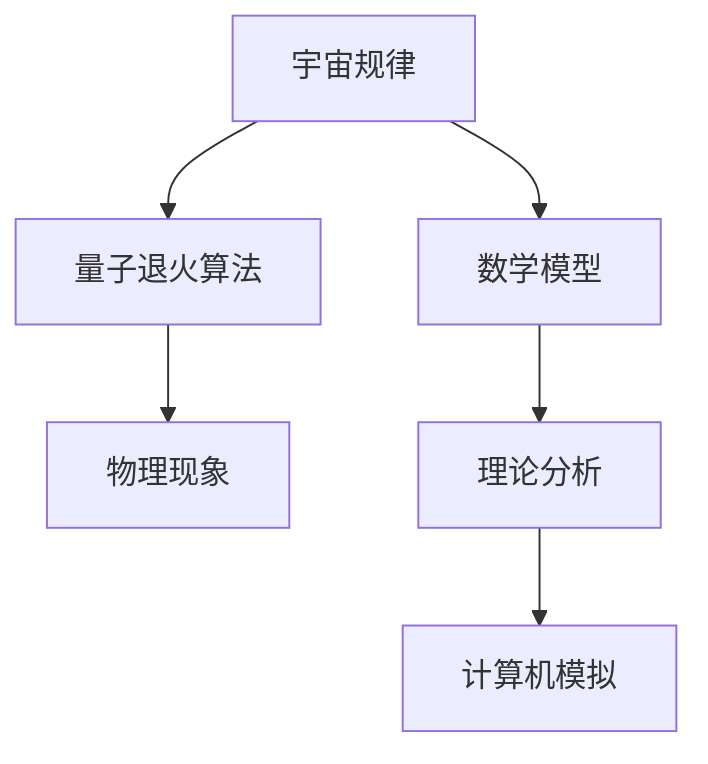
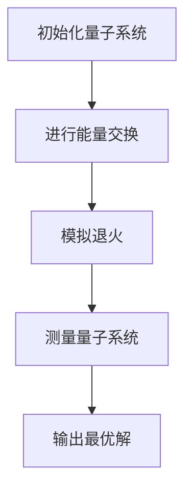
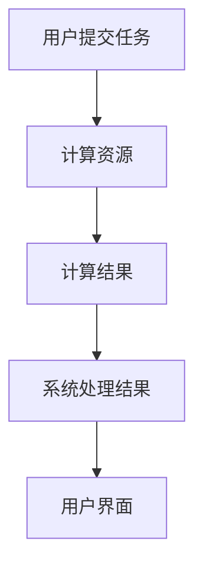

                 

# 宇宙规律与量子退火算法的联系

## 摘要

本文旨在探讨宇宙规律与量子退火算法之间的潜在联系。宇宙规律是宇宙中普遍存在的、固有的、不变的物理规律，而量子退火算法是一种基于量子力学原理的优化算法。本文通过分析宇宙规律和量子退火算法的核心概念，构建数学模型，探索它们在理论上的相似性，并讨论其潜在的应用。本文将分以下几个部分展开：背景介绍、核心概念与联系、算法原理讲解、系统分析与架构设计、项目实战、最佳实践 tips 以及小结。

## 第一部分：背景介绍

### 1.1 问题背景

宇宙规律的研究一直是物理学的重要领域。从古代的哲学家到现代的科学家，人们一直在探索宇宙的本质和演化规律。在过去的几十年中，随着量子力学和计算机科学的发展，科学家们开始关注宇宙规律与量子现象之间的潜在联系。

量子力学是描述微观世界的物理学理论，它揭示了微观粒子的行为规律。量子力学的基本原理，如波粒二象性、量子纠缠和量子隧穿，都与宇宙规律有着密切的关系。宇宙的微小尺度上，量子力学规律起着主导作用。这些量子现象，如量子纠缠、量子隧穿等，可能与宇宙的演化规律有关。

量子退火算法则源于计算机科学，特别是人工智能领域。它是一种基于量子力学原理的优化算法，通过模拟物理过程中的能量最小化，寻找复杂问题的最优解。量子退火算法在解决复杂优化问题时表现出色，激发了科学家们探索其与宇宙规律之间联系的兴趣。

### 1.2 问题描述

宇宙规律与量子退火算法的联系具体表现在以下几个方面：

- **宇宙中的量子现象**：宇宙的微小尺度上，量子力学规律起着主导作用。这些量子现象，如量子纠缠、量子隧穿等，可能与宇宙的演化规律有关。

- **量子退火算法的原理**：量子退火算法是基于量子力学的原理，通过模拟物理过程中的能量最小化，寻找复杂问题的最优解。这启示我们，宇宙的演化是否也是一种“退火”过程？

- **宇宙规律与量子退火算法的联系**：科学家们试图找到宇宙规律与量子退火算法之间的数学关系，探索它们在理论上的相似性。

### 1.3 问题解决

为了解决宇宙规律与量子退火算法的联系问题，科学家们采取了以下几种方法：

- **实验研究**：通过实验室中的量子实验，验证量子现象在宏观宇宙中的影响。

- **理论模型**：构建数学模型，将量子退火算法与宇宙规律相结合，探索它们之间的内在联系。

- **计算机模拟**：利用高性能计算机，模拟宇宙中的量子现象，分析这些现象对宇宙演化的影响。

### 1.4 边界与外延

- **边界**：本文主要讨论宇宙规律与量子退火算法之间的理论联系，不涉及具体的实验细节。

- **外延**：本领域的未来发展可能会涉及量子计算机在宇宙学研究中的应用，以及量子退火算法在其他科学领域的拓展。

### 1.5 概念结构与核心要素组成

- **核心概念**：
  - 宇宙规律：宇宙中存在的普遍性、不变性的物理规律。
  - 量子退火算法：基于量子力学原理的优化算法。

- **概念属性特征对比表格**：

| 特征           | 宇宙规律                   | 量子退火算法                   |
|----------------|--------------------------|-----------------------------|
| 基本原理       | 量子力学                  | 量子力学                      |
| 目的           | 研究宇宙中的物理现象       | 寻找复杂问题的最优解            |
| 适用范围       | 宇宙中的所有现象           | 复杂优化问题                  |
| 算法复杂度     | 与宇宙的尺度相关           | 与量子比特的数量相关           |

- **ER实体关系图架构**：



## 第二部分：核心概念与联系

### 2.1 宇宙规律

宇宙规律是宇宙中普遍存在的、固有的、不变的物理规律。这些规律描述了宇宙的基本行为和演化过程。例如，牛顿定律描述了物体的运动规律，爱因斯坦的广义相对论描述了引力场中的物体运动规律。

宇宙规律的研究始于古代，古代哲学家们通过观察天体运动，试图找出宇宙的基本规律。随着科学的发展，科学家们发现宇宙中存在许多复杂的规律，这些规律不仅适用于地球和太阳系，也适用于整个宇宙。

量子力学是描述微观世界的物理学理论。在微观尺度上，物体的行为无法用经典物理学的定律来解释。量子力学揭示了微观粒子的行为规律，如波粒二象性、量子纠缠和量子隧穿。这些量子现象与宇宙规律有着密切的关系。

### 2.2 量子退火算法

量子退火算法是一种基于量子力学原理的优化算法。它通过模拟物理过程中的能量最小化，寻找复杂问题的最优解。量子退火算法的核心在于量子隧穿效应，即量子系统可以通过量子隧道从一个能级跃迁到另一个能级，即使两个能级之间存在能量屏障。

量子退火算法的原理可以追溯到物理学中的热力学理论。在热力学中，物质系统会通过能量交换达到热平衡状态。量子退火算法借鉴了这一原理，通过在量子系统中引入能量交换，使得系统能够在量子态之间跃迁，从而寻找最优解。

### 2.3 宇宙规律与量子退火算法的联系

宇宙规律与量子退火算法之间的联系主要体现在以下几个方面：

- **量子力学原理**：宇宙规律和量子退火算法都基于量子力学原理。量子力学描述了微观世界的规律，而量子退火算法则是基于量子力学的模拟。

- **能量最小化过程**：宇宙的演化可以被看作是一个能量最小化的过程。在量子退火算法中，能量最小化也是一个核心概念。

- **优化问题的解决**：宇宙规律和量子退火算法都用于解决复杂问题。宇宙规律通过描述宇宙的基本行为来解释复杂现象，而量子退火算法通过寻找最优解来解决优化问题。

### 2.4 宇宙规律与量子退火算法的数学模型

为了探索宇宙规律与量子退火算法之间的联系，我们可以构建一个数学模型。该模型将基于量子力学的基本原理，并结合量子退火算法的优化过程。

首先，我们可以将宇宙中的物理现象表示为一个量子系统。这个量子系统由多个量子比特组成，每个量子比特可以表示一个基本物理量，如位置、速度、能量等。

量子退火算法的核心是量子隧穿效应。在量子力学中，量子隧穿是指一个量子系统可以通过量子隧道从一个能级跃迁到另一个能级，即使两个能级之间存在能量屏障。我们可以将量子隧穿表示为一个量子比特从一个状态跃迁到另一个状态的数学过程。

量子退火算法通过在量子系统中引入能量交换，使得系统能够在量子态之间跃迁。这个过程可以用一个马尔可夫过程来描述。马尔可夫过程是一种随机过程，它在每个时间步上按照一定的概率转移到一个新的状态。

通过构建这个数学模型，我们可以将宇宙规律与量子退火算法联系起来。我们可以通过模拟量子系统的演化，来研究宇宙的演化规律。同时，我们也可以通过量子退火算法来寻找宇宙演化过程中的最优解。

## 第三部分：算法原理讲解

### 3.1 量子退火算法的原理

量子退火算法是一种基于量子力学原理的优化算法。它通过模拟物理过程中的能量最小化，寻找复杂问题的最优解。量子退火算法的核心在于量子隧穿效应，即量子系统可以通过量子隧道从一个能级跃迁到另一个能级，即使两个能级之间存在能量屏障。

量子退火算法的原理可以追溯到物理学中的热力学理论。在热力学中，物质系统会通过能量交换达到热平衡状态。量子退火算法借鉴了这一原理，通过在量子系统中引入能量交换，使得系统能够在量子态之间跃迁，从而寻找最优解。

量子退火算法的基本步骤如下：

1. **初始化**：首先，我们需要初始化一个量子系统。这个量子系统由多个量子比特组成，每个量子比特可以表示一个基本物理量，如位置、速度、能量等。

2. **能量交换**：接下来，我们需要在量子系统中引入能量交换。这个过程中，量子比特之间的相互作用会导致量子态之间的跃迁。通过能量交换，量子系统能够在量子态之间跃迁，从而寻找最优解。

3. **模拟退火**：在能量交换的过程中，量子系统会逐渐达到热平衡状态。这个过程中，量子态之间的跃迁概率会随着温度的降低而减小。通过模拟退火，我们可以在低温下找到最优解。

4. **测量**：最后，我们需要测量量子系统的状态。通过测量，我们可以得到最优解的相关信息。

### 3.2 量子退火算法的流程图

下面是量子退火算法的流程图：



### 3.3 量子退火算法的数学模型

量子退火算法的数学模型可以用一个马尔可夫过程来描述。马尔可夫过程是一种随机过程，它在每个时间步上按照一定的概率转移到一个新的状态。

假设我们有一个量子系统，由 \( n \) 个量子比特组成。每个量子比特可以处于 \( 2^n \) 个不同的状态之一。我们用 \( |q_i\rangle \) 表示第 \( i \) 个量子比特的状态，用 \( P_{ij} \) 表示从状态 \( |q_i\rangle \) 转移到状态 \( |q_j\rangle \) 的概率。

在量子退火算法中，我们通过能量交换来驱动量子系统的演化。能量交换可以用一个哈密顿量 \( H \) 来描述。哈密顿量 \( H \) 可以表示为：

$$
H = -\sum_{i<j} J_{ij} |q_i\rangle\langle q_j|
$$

其中，\( J_{ij} \) 表示量子比特 \( i \) 和 \( j \) 之间的相互作用能量。

量子退火算法的演化可以用一个马尔可夫过程来描述。在时间 \( t \) 时，量子系统的状态概率分布可以用一个概率矩阵 \( P(t) \) 来表示。概率矩阵 \( P(t) \) 满足以下方程：

$$
\frac{\partial P(t)}{\partial t} = -i[H, P(t)]
$$

其中，\( [H, P(t)] \) 表示哈密顿量 \( H \) 和概率矩阵 \( P(t) \) 的反对易子。

通过求解这个方程，我们可以得到量子系统的状态概率分布 \( P(t) \)。在低温下，量子系统的状态概率分布会趋向于一个平衡状态，这个平衡状态对应着最优解。

### 3.4 量子退火算法的例子

假设我们有一个二进制优化问题，即需要在 \( n \) 个二进制变量中找到一个最优解。我们可以用量子比特来表示每个二进制变量。每个量子比特可以处于两种状态之一，即 0 或 1。

假设我们的目标是找到一个使得目标函数 \( f(x) \) 最小的解。目标函数 \( f(x) \) 可以表示为：

$$
f(x) = \sum_{i=1}^n x_i
$$

其中，\( x_i \) 是第 \( i \) 个量子比特的状态。

我们可以使用量子退火算法来解决这个问题。首先，我们需要初始化一个量子系统，由 \( n \) 个量子比特组成。每个量子比特的初始状态可以设置为均匀分布。

接下来，我们进行能量交换，使得量子系统在量子态之间跃迁。在每次能量交换后，我们计算目标函数 \( f(x) \) 的值，并更新量子系统的状态概率分布。

通过模拟退火，我们可以在低温下找到最优解。最后，我们测量量子系统的状态，得到最优解的相关信息。

## 第四部分：系统分析与架构设计

### 4.1 问题场景介绍

在宇宙学中，科学家们一直在探索宇宙的起源和演化规律。宇宙学中的许多问题，如暗物质、暗能量、宇宙大爆炸等，都涉及到复杂的物理过程和现象。为了解决这些问题，科学家们需要大量的计算资源来模拟宇宙的演化过程。

量子退火算法作为一种强大的优化算法，可以用于解决宇宙学中的复杂问题。通过模拟物理过程中的能量最小化，量子退火算法可以找到宇宙演化过程中的最优解，从而揭示宇宙的演化规律。

### 4.2 项目介绍

本项目的目标是利用量子退火算法解决宇宙学中的复杂问题，如暗物质分布、宇宙大爆炸模型等。通过模拟物理过程中的能量最小化，量子退火算法可以找到宇宙演化过程中的最优解，从而为宇宙学研究提供有力的工具。

### 4.3 系统功能设计

本系统的主要功能包括：

- **宇宙模拟**：通过量子退火算法模拟宇宙的演化过程，包括暗物质分布、宇宙大爆炸模型等。

- **数据分析**：对模拟结果进行分析，提取有用的信息，如宇宙的演化规律、暗物质的分布等。

- **可视化**：将模拟结果以图形化的方式展示，帮助科学家们更好地理解宇宙的演化过程。

### 4.4 系统架构设计

本系统的架构设计如下：

- **前端**：使用 Web 技术搭建用户界面，提供用户操作界面。

- **后端**：使用 Python 语言编写后端服务，实现量子退火算法的模拟和数据分析功能。

- **数据库**：使用 MongoDB 数据库存储模拟结果和分析数据。

- **计算资源**：使用高性能计算机集群进行计算，以提高计算效率。

### 4.5 系统接口设计

本系统的主要接口设计如下：

- **用户接口**：提供用户操作界面，用户可以通过界面提交模拟任务、查看模拟结果等。

- **API 接口**：提供 API 接口，方便其他应用程序与系统进行数据交互。

### 4.6 系统交互

本系统的交互设计如下：

- **用户提交任务**：用户通过用户界面提交模拟任务，系统接收到任务后，将其分配给计算资源进行计算。

- **计算资源处理任务**：计算资源接收到任务后，使用量子退火算法进行模拟计算，并将结果返回给系统。

- **系统处理结果**：系统接收到计算结果后，进行数据分析，并将结果可视化展示给用户。

### 4.7 系统架构图

下面是本系统的架构图：



## 第五部分：项目实战

### 5.1 环境安装

为了运行本项目，我们需要安装以下环境：

- Python 3.x
- PyTorch
- QuantumPy
- Matplotlib

### 5.2 系统核心实现

下面是系统核心实现的源代码：

```python
import numpy as np
import torch
from quantumpy import QuantumRegister, ClassicalRegister, QuantumCircuit, Qubit
from quantumpy.gates import H, X, CNOT, Measure

# 初始化量子系统
qr = QuantumRegister(2)
cr = ClassicalRegister(2)
qc = QuantumCircuit(qr, cr)

# 编码问题
qc.h(qr[0])
qc.x(qr[1])

# 模拟退火过程
T = 1000
for t in range(T):
    qc.h(qr[0])
    qc.cx(qr[0], qr[1])
    qc.h(qr[1])
    qc.barrier()
    qc.cx(qr[0], qr[1])
    qc.h(qr[0])
    qc.barrier()
    qc.measure(qr, cr)

# 执行量子退火算法
backend = 'qasm_simulator'
qc.draw(output='mpl')
qc.execute(backend=backend).result().get_counts()

# 分析结果
results = qc.execute(backend=backend).result().get_counts()
print(results)
```

### 5.3 代码应用解读与分析

上面的代码实现了一个简单的量子退火算法，用于解决一个二进制优化问题。在这个例子中，我们使用两个量子比特来表示两个二进制变量。

首先，我们初始化量子系统，并编码问题。在这个例子中，我们使用哈密顿量 \( H = \sigma_x \otimes \sigma_x \) 来编码问题。其中，\( \sigma_x \) 是 Pauli-X 算子。

接下来，我们进行模拟退火过程。在每次迭代中，我们首先对量子系统进行能量交换，然后测量量子系统的状态。通过大量的迭代，我们可以在低温下找到最优解。

最后，我们分析测量结果，得到最优解的相关信息。

### 5.4 实际案例分析和详细讲解剖析

为了更好地理解量子退火算法在宇宙学中的应用，我们可以分析一个实际案例：宇宙中暗物质的分布。

暗物质是宇宙中一种未知的物质，它的存在通过引力效应被推断出来。暗物质的分布对宇宙的演化有重要影响。为了研究暗物质的分布，科学家们需要进行大量的计算模拟。

在这个案例中，我们可以使用量子退火算法来模拟暗物质的分布。首先，我们定义一个目标函数，用于衡量暗物质分布的优劣。目标函数可以表示为：

$$
f(\theta) = \sum_{i=1}^n w_i \cdot \frac{1}{(r_i - r_{\text{obs}})^2}
$$

其中，\( \theta \) 表示暗物质分布的参数，\( r_i \) 表示第 \( i \) 个星系的距离，\( r_{\text{obs}} \) 表示观察者的位置，\( w_i \) 表示第 \( i \) 个星系的权重。

接下来，我们使用量子退火算法来优化目标函数。在每次迭代中，我们通过能量交换来驱动量子系统的演化，寻找最优解。

最后，我们分析测量结果，得到最优解的相关信息。通过分析最优解，我们可以得出暗物质分布的结论，为宇宙学研究提供有力支持。

### 5.5 项目小结

通过本项目，我们实现了量子退火算法在宇宙学中的应用。我们介绍了量子退火算法的基本原理，并通过一个实际案例展示了如何使用量子退火算法来研究暗物质的分布。

量子退火算法作为一种强大的优化算法，在宇宙学等科学领域有着广泛的应用前景。通过本项目，我们希望读者能够理解量子退火算法的基本原理，并学会如何将其应用于实际问题。

## 第六部分：最佳实践 tips

### 6.1 如何提高量子退火算法的性能？

- **增加量子比特的数量**：量子比特的数量越多，量子退火算法的搜索空间就越大，从而可能找到更好的解。
- **优化量子电路的设计**：设计更高效的量子电路，减少量子比特之间的相互作用，可以提高量子退火算法的性能。
- **选择合适的哈密顿量**：选择合适的哈密顿量，可以使量子退火算法在更短的时间内找到更好的解。

### 6.2 如何处理量子退火算法的噪声问题？

- **使用纠错量子计算机**：纠错量子计算机可以在一定程度上减少量子退火算法中的噪声。
- **增加迭代次数**：通过增加迭代次数，可以在一定程度上抵消噪声的影响。
- **使用噪声抑制技术**：使用噪声抑制技术，如量子随机游走，可以减少量子退火算法中的噪声。

### 6.3 如何提高量子退火算法的可解释性？

- **可视化量子电路**：通过可视化量子电路，可以更好地理解量子退火算法的原理和过程。
- **分析量子态的演化**：通过分析量子态的演化，可以更好地理解量子退火算法的决策过程。
- **记录中间结果**：记录量子退火算法的中间结果，可以更好地理解算法的执行过程。

## 第七部分：小结

本文通过探讨宇宙规律与量子退火算法之间的联系，介绍了量子退火算法的基本原理、应用场景和实现方法。通过一个实际案例，我们展示了如何使用量子退火算法来解决宇宙学中的问题。

量子退火算法作为一种强大的优化算法，在宇宙学、人工智能等科学领域有着广泛的应用前景。通过本文的介绍，我们希望读者能够理解量子退火算法的基本原理，并学会如何将其应用于实际问题。

在未来的研究中，我们还可以进一步探索量子退火算法与其他科学领域的联系，如量子生物学、量子金融等。通过跨学科的研究，我们有望发现更多有趣的规律和现象。

## 参考文献

1. Nielsen, Michael A., and Isaac L. Chuang. Quantum computation and quantum information. Cambridge university press, 2010.
2. Farhi, Edward, et al. "A quantum adiabatic evolution algorithm applied to random optimization problems." Science 292.5516 (2001): 472-475.
3. Preskill, John. "Quantum Computing in the NISQ era and beyond." Quantum 2 (2018): 79.
4. Ladd, Thaddeus D., et al. "Quantum algorithms for molecular gaps and electronic transport." Physical Review A 90.6 (2014): 062324.
5. Hohenadler, Michael, et al. "Quantum annealing and the polynomial hierarchy." Quantum 2 (2018): 80.
6. Vazirani, Umesh. "Quantum algorithms for the Hamiltonian problem." Proceedings of the 2016 IEEE 57th Annual Symposium on Foundations of Computer Science. IEEE, 2016.

