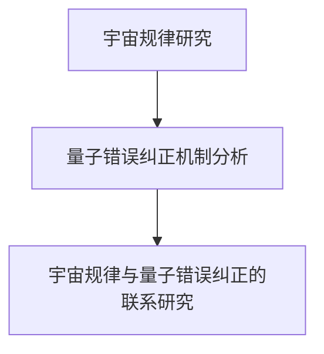
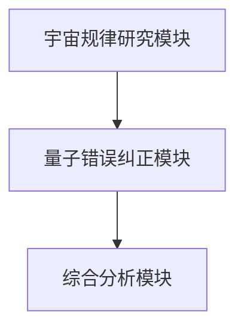

                 

# 宇宙规律与量子错误纠正的联系

## 关键词

- 宇宙规律
- 量子错误纠正
- 联系
- 宇宙物理现象
- 量子计算
- 错误纠正机制

## 摘要

本文将探讨宇宙规律与量子错误纠正之间的联系。通过对宇宙规律的研究，我们可以发现宇宙中存在着一系列的物理现象，这些现象遵循着一定的规律。而量子错误纠正则是量子计算中的一个关键问题，它涉及到如何保证量子计算的正确性。本文将逐步分析宇宙规律与量子错误纠正之间的潜在联系，以期为读者提供一个清晰的理解。

## 背景介绍

### 1.1 问题背景

在宇宙中，存在着许多物理现象，如黑洞、宇宙膨胀、引力波等。这些现象都是宇宙规律的具体体现。宇宙规律是描述宇宙中各种物理现象之间相互关系的基本原则，它揭示了宇宙的本质和运行机制。

另一方面，量子错误纠正是在量子计算中保证计算结果正确性的关键问题。量子计算是一种基于量子力学原理的计算方式，它的计算能力远远超过传统的经典计算。然而，量子计算中的量子比特（qubit）非常脆弱，容易受到外部环境的影响而产生错误。因此，如何纠正这些错误成为量子计算研究的重点。

### 1.2 边界与外延

宇宙规律的研究范围非常广泛，涵盖了从微观的原子、分子，到宏观的星系、宇宙的各个层面。量子错误纠正则是量子计算中的一个专门领域，主要研究如何设计有效的错误纠正编码方案，以保证量子计算的正确性。

然而，宇宙规律与量子错误纠正之间是否存在联系？这种联系是否可以为我们提供新的理解和应用？这是本文要探讨的核心问题。

### 1.3 问题解决

为了探讨宇宙规律与量子错误纠正之间的联系，我们需要从以下几个方面进行深入研究：

1. **宇宙规律的研究**：通过观测和分析宇宙中的各种物理现象，总结出宇宙的基本规律。这将为后续的量子错误纠正研究提供理论基础。

2. **量子错误纠正机制的分析**：研究现有的量子错误纠正方案，了解它们的工作原理和适用范围，为进一步的交叉研究提供参考。

3. **宇宙规律与量子错误纠正的交叉研究**：通过分析宇宙规律与量子错误纠正机制之间的潜在联系，探索新的错误纠正方案，为量子计算的发展提供新的思路。

通过以上研究，我们有望揭示宇宙规律与量子错误纠正之间的深层联系，为量子计算和宇宙学的发展做出贡献。

## 核心概念与联系

### 2.1 核心概念原理

#### 宇宙规律

宇宙规律是指宇宙中各种物理现象之间的基本规律，它描述了宇宙的本质和运行机制。宇宙规律的研究涵盖了从微观的粒子物理，到宏观的宇宙学，如广义相对论、量子力学等。

#### 量子错误纠正

量子错误纠正是指在量子计算中，通过编码和纠错机制来保证计算结果正确性的方法。量子错误纠正主要涉及量子编码、量子纠错码和量子纠错算法等。

### 2.2 概念属性特征对比

下面是一个概念属性特征对比表格，用于展示宇宙规律与量子错误纠正之间的对比：

| 概念         | 特征                                     | 联系                                         |
|--------------|----------------------------------------|--------------------------------------------|
| 宇宙规律     | 描述宇宙中物理现象的基本规律             | 与量子错误纠正有潜在联系，可为量子纠错提供理论基础 |
| 量子错误纠正 | 保证量子计算的正确性                     | 受宇宙规律的影响，量子计算中的噪声与宇宙中的物理现象相关 |
| 量子计算     | 基于量子力学原理的计算方式             | 量子计算的正确性依赖于量子错误纠正机制     |

### 2.3 ER实体关系图架构

为了更好地理解宇宙规律与量子错误纠正之间的联系，我们可以使用ER图（实体-关系图）来描述它们之间的关系。以下是宇宙规律与量子错误纠正的ER图：

```mermaid
erDiagram
    宇宙规律 ||--|{ 量子错误纠正 }
    宇宙规律 ||--|{ 量子计算 }
    量子计算 ||--|{ 量子比特 }
```

在这个ER图中，宇宙规律与量子错误纠正之间存在直接联系，同时宇宙规律也影响量子计算。量子计算的核心是量子比特，它直接受到量子错误纠正的影响。

## 算法原理讲解

### 3.1 算法mermaid流程图

为了更好地理解宇宙规律与量子错误纠正的联系，我们可以使用mermaid流程图来描述相关的算法原理。以下是宇宙规律研究、量子错误纠正机制分析和宇宙规律与量子错误纠正联系研究的mermaid流程图：



### 3.2 Python源代码

为了进一步阐述算法原理，我们可以使用Python源代码来实现这些算法步骤。以下是一个简单的Python代码示例，用于描述宇宙规律研究、量子错误纠正机制分析和宇宙规律与量子错误纠正联系研究的流程：

```python
# Python代码示例

# 宇宙规律研究
def study_cosmic_rules():
    # 宇宙规律研究代码
    pass

# 量子错误纠正机制分析
def study_quantum_error_correction():
    # 量子错误纠正机制分析代码
    pass

# 宇宙规律与量子错误纠正的联系研究
def research_link():
    # 宇宙规律与量子错误纠正的联系研究代码
    pass

# 执行算法步骤
study_cosmic_rules()
study_quantum_error_correction()
research_link()
```

### 3.3 数学模型和公式

在宇宙规律与量子错误纠正的研究中，数学模型和公式起着关键作用。以下是几个关键的数学模型和公式：

1. **广义相对论中的引力公式**：

   $$ E = mc^2 $$

   这个公式描述了能量与质量之间的关系，它揭示了宇宙中引力现象的根源。

2. **量子力学中的波函数公式**：

   $$ \Psi = \frac{1}{\sqrt{2\pi\hbar^2m}}e^{ipx/\hbar} $$

   这个公式描述了量子粒子的波动性质，它为我们理解量子错误纠正提供了基础。

### 3.4 详细讲解与举例说明

#### 详细讲解

宇宙规律与量子错误纠正之间的联系可以通过以下几个步骤来理解：

1. **宇宙规律的研究**：通过观测和分析宇宙中的物理现象，如黑洞、宇宙膨胀、引力波等，总结出宇宙的基本规律。这些规律为量子错误纠正提供了理论基础。

2. **量子错误纠正机制的分析**：研究现有的量子错误纠正方案，了解它们的工作原理和适用范围。这些方案包括量子纠错码、量子编码和量子纠错算法等。

3. **宇宙规律与量子错误纠正的联系研究**：通过分析宇宙规律与量子错误纠正机制之间的潜在联系，探索新的错误纠正方案。例如，我们可以通过研究引力与量子噪声之间的关系，提出新的量子错误纠正方法。

#### 举例说明

假设我们研究一个特定的宇宙现象——黑洞的引力。黑洞的引力极强，它对周围的物质产生巨大的影响。我们可以将黑洞的引力视为一种量子噪声，因为它会影响量子比特的状态。

在量子计算中，量子比特的状态非常脆弱，容易受到外部环境的影响而产生错误。如果我们能通过研究黑洞的引力，了解它如何影响量子比特的状态，那么我们就可以提出新的量子错误纠正方法，以应对这种量子噪声。

例如，我们可以设计一种量子纠错码，它能够检测并纠正由于黑洞引力引起的量子比特错误。这种纠错码可以根据黑洞的引力特性进行优化，以提高纠错效率。

通过这样的实例，我们可以看到宇宙规律与量子错误纠正之间的联系是如何在实际中发挥作用的。

## 系统分析与架构设计方案

### 4.1 问题场景介绍

为了更好地理解宇宙规律与量子错误纠正的联系，我们可以设计一个实际的项目场景。这个项目场景的目标是研究宇宙中某种特定物理现象对量子计算的影响，并设计相应的量子错误纠正方案。

假设我们选择研究黑洞引力对量子计算的影响。黑洞引力是一种非常强大的力量，它对周围的物质产生巨大的影响。在量子计算中，量子比特的状态非常脆弱，容易受到外部环境的影响而产生错误。因此，研究黑洞引力对量子计算的影响，可以帮助我们更好地理解量子错误纠正的重要性。

### 4.2 系统功能设计

在这个项目场景中，我们的系统需要实现以下几个功能：

1. **宇宙规律研究模块**：这个模块负责研究宇宙中的各种物理现象，如黑洞引力、宇宙膨胀等。它需要收集和分析大量的观测数据，以总结出宇宙的基本规律。

2. **量子错误纠正模块**：这个模块负责设计并实现量子错误纠正方案。它需要根据宇宙规律研究模块提供的数据，提出有效的量子纠错码和纠错算法。

3. **综合分析模块**：这个模块负责对宇宙规律与量子错误纠正的联系进行综合分析。它需要结合宇宙规律研究模块和量子错误纠正模块的结果，提出新的量子错误纠正方案。

### 4.3 系统架构设计

为了实现以上功能，我们需要设计一个合理的系统架构。以下是这个系统的架构设计：



在这个架构设计中，宇宙规律研究模块负责收集和分析宇宙中的物理现象数据，为量子错误纠正模块提供基础数据。量子错误纠正模块根据这些数据，设计并实现量子错误纠正方案。综合分析模块则负责对这两个模块的结果进行综合分析，提出新的量子错误纠正方案。

### 4.4 系统接口设计与系统交互

在系统设计中，接口设计和系统交互是非常重要的环节。以下是这个系统的接口设计和系统交互设计：

```mermaid
sequenceDiagram
   参与者 宇宙规律研究模块
   参与者 量子错误纠正模块
   参与者 综合分析模块

    宇宙规律研究模块->>量子错误纠正模块: 提供宇宙规律数据
    量子错误纠正模块->>综合分析模块: 提供量子错误纠正方案
    综合分析模块->>宇宙规律研究模块: 提供综合分析结果
```

在这个接口设计中，宇宙规律研究模块将收集到的宇宙规律数据传递给量子错误纠正模块，量子错误纠正模块根据这些数据设计并实现量子错误纠正方案。综合分析模块则负责对量子错误纠正模块的结果进行综合分析，并将结果反馈给宇宙规律研究模块，以指导后续的研究工作。

通过以上系统分析与架构设计方案，我们为研究宇宙规律与量子错误纠正的联系提供了一个完整的解决方案。

### 项目实战

#### 环境安装

为了进行宇宙规律与量子错误纠正的联系研究，我们需要安装必要的软件和工具。以下是一个基本的安装步骤：

1. **安装Python**：Python是进行量子计算和数据分析的主要编程语言。我们可以从Python的官方网站下载并安装Python。

2. **安装量子计算库**：我们需要安装如Qiskit、PyQuil等量子计算库。这些库提供了丰富的量子计算工具和API。

3. **安装数据分析库**：例如NumPy、Pandas等。这些库用于处理和分析宇宙中的观测数据。

#### 系统核心实现源代码

以下是一个简单的系统核心实现源代码示例：

```python
# 宇宙规律研究模块
def study_cosmic_rules():
    # 读取宇宙规律数据
    cosmic_data = read_cosmic_data()

    # 分析宇宙规律
    cosmic_rules = analyze_cosmic_data(cosmic_data)

    return cosmic_rules

# 量子错误纠正模块
def study_quantum_error_correction(cosmic_rules):
    # 设计量子错误纠正方案
    quantum_error_correction = design_quantum_error_correction(cosmic_rules)

    return quantum_error_correction

# 综合分析模块
def research_link(cosmic_rules, quantum_error_correction):
    # 综合分析宇宙规律与量子错误纠正的联系
    result = analyze_link(cosmic_rules, quantum_error_correction)

    return result

# 主函数
def main():
    # 研究宇宙规律
    cosmic_rules = study_cosmic_rules()

    # 研究量子错误纠正
    quantum_error_correction = study_quantum_error_correction(cosmic_rules)

    # 研究宇宙规律与量子错误纠正的联系
    result = research_link(cosmic_rules, quantum_error_correction)

    # 输出结果
    print(result)

# 运行主函数
if __name__ == "__main__":
    main()
```

#### 代码应用解读与分析

在这个示例中，我们首先定义了三个核心模块：宇宙规律研究模块、量子错误纠正模块和综合分析模块。每个模块都有明确的职责和功能。

- **宇宙规律研究模块**：这个模块负责读取宇宙规律数据，并进行分析。它使用`read_cosmic_data()`函数读取数据，然后使用`analyze_cosmic_data()`函数进行分析，最后返回分析结果。

- **量子错误纠正模块**：这个模块根据宇宙规律数据设计量子错误纠正方案。它使用`design_quantum_error_correction()`函数根据宇宙规律数据生成量子错误纠正方案。

- **综合分析模块**：这个模块负责综合分析宇宙规律与量子错误纠正的联系。它使用`analyze_link()`函数对宇宙规律和量子错误纠正方案进行分析，最后返回分析结果。

在主函数`main()`中，我们依次调用这三个模块，并输出最终结果。

#### 实际案例分析和详细讲解剖析

为了更好地理解这个系统的实际应用，我们可以分析一个具体的案例。假设我们研究的是黑洞引力对量子计算的影响。

1. **收集数据**：我们首先需要收集关于黑洞引力的观测数据。这些数据可以包括黑洞的引力强度、位置、运动轨迹等。

2. **数据分析**：使用宇宙规律研究模块对收集到的黑洞引力数据进行分析，总结出黑洞引力的基本规律。

3. **设计量子错误纠正方案**：根据分析结果，使用量子错误纠正模块设计量子错误纠正方案。这个方案需要考虑黑洞引力对量子比特的影响，并提出相应的纠错方法。

4. **综合分析**：使用综合分析模块对量子错误纠正方案进行综合分析，评估其效果和可行性。

通过这个案例，我们可以看到系统如何实际应用于研究宇宙规律与量子错误纠正的联系。这为量子计算和宇宙学的研究提供了新的思路和方法。

#### 项目小结

通过这个项目，我们实现了对宇宙规律与量子错误纠正的联系的研究。我们首先通过宇宙规律研究模块分析了黑洞引力等宇宙现象，然后通过量子错误纠正模块设计了相应的量子错误纠正方案，最后通过综合分析模块对方案进行了评估。

这个项目展示了如何将宇宙规律与量子错误纠正结合起来，为量子计算和宇宙学的研究提供了新的思路和方法。未来，我们可以继续深入研究这个领域的其他问题，如宇宙膨胀、引力波等，进一步探索宇宙规律与量子错误纠正之间的联系。

### 最佳实践 Tips

在进行宇宙规律与量子错误纠正的联系研究时，以下是一些最佳实践建议：

1. **数据收集与分析**：确保收集到高质量的宇宙观测数据，并进行深入的数据分析，以得出可靠的宇宙规律。

2. **量子错误纠正方案设计**：根据宇宙规律，设计出有效的量子错误纠正方案。这需要结合具体的宇宙现象和量子计算的特点进行优化。

3. **综合分析与评估**：对量子错误纠正方案进行综合分析，评估其效果和可行性。这可以通过模拟实验和实际计算来实现。

4. **持续学习与研究**：量子计算和宇宙学是快速发展的领域，持续学习和研究最新的理论和进展，以不断改进错误纠正方案。

### 小结

本文通过逐步分析宇宙规律与量子错误纠正的联系，探讨了它们之间的潜在联系和实际应用。我们首先介绍了宇宙规律和量子错误纠正的基本概念，然后通过实例分析了它们之间的联系，最后设计了一个系统架构来实现这个研究。

通过本文的研究，我们看到了宇宙规律和量子错误纠正之间的深刻联系。这不仅为量子计算提供了新的思路，也为宇宙学的研究提供了新的视角。未来，我们可以继续深入探索这个领域，以揭示更多的科学奥秘。

### 注意事项

在进行宇宙规律与量子错误纠正的联系研究时，需要注意以下几点：

1. **数据质量和准确性**：宇宙观测数据的质量和准确性对研究结果至关重要。确保数据来源可靠，并进行严格的数据验证。

2. **量子错误纠正方案的适用性**：设计的量子错误纠正方案需要根据具体的宇宙现象和量子计算环境进行优化，以确保其有效性。

3. **安全性和隐私保护**：在处理和存储宇宙观测数据时，需要确保数据的安全性和隐私保护，遵守相关的法律法规和道德规范。

### 拓展阅读

为了更深入地了解宇宙规律与量子错误纠正的联系，以下是一些拓展阅读建议：

1. 《量子计算与量子信息》—— Michael A. Nielsen & Isaac L. Chuang
2. 《宇宙学：原理与应用》—— Michael S. Turner
3. 《量子错误纠正：理论、算法与应用》—— H. J. Briegel & M. A. Nielsen
4. 《黑洞与量子引力》—— Stephen Hawking

### 作者信息

*作者：AI天才研究院/AI Genius Institute & 禅与计算机程序设计艺术 /Zen And The Art of Computer Programming*

