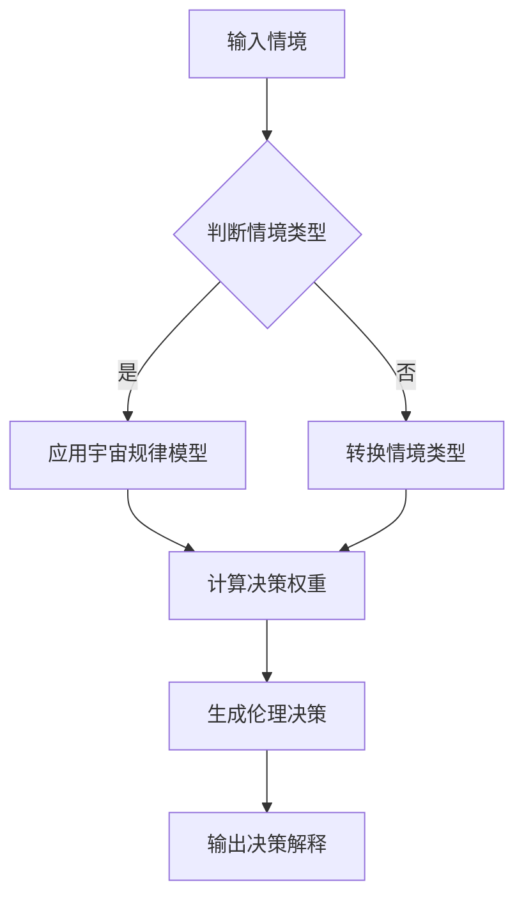
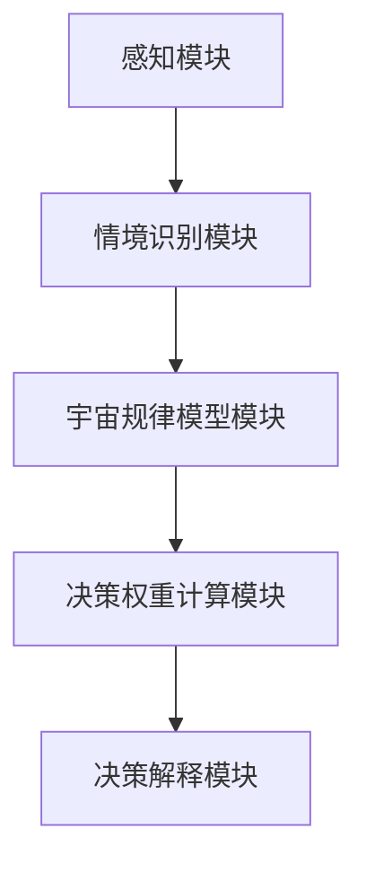

                 

### 第一部分：宇宙规律与人工智能概述

#### 第1章：宇宙规律概述

##### 1.1 宇宙的起源与演化

宇宙，这个我们身处其中的庞大空间，自古以来就充满了神秘和未知。其起源与演化过程，一直是科学家们探索的重要课题。

**1.1.1 宇宙大爆炸理论**

宇宙大爆炸理论是目前被广泛接受的理论之一，它描述了宇宙从原始状态开始，经历了快速膨胀的过程，最终形成了今天我们所见的宇宙。这一理论基于一些观测事实，例如宇宙的膨胀、宇宙微波背景辐射等，得到了大量的支持证据。

**1.1.2 宇宙结构演化**

宇宙的结构演化包括星系的形成、星系的演化、星系的碰撞等。在这个过程中，宇宙中的物质通过引力相互作用，逐渐形成了星系、星系团等结构。这些结构的形成和演化，不仅涉及到物理学的引力理论，还涉及到宇宙学、天体物理学等领域的知识。

**1.1.3 宇宙中的物理定律**

宇宙中存在着一系列的物理定律，这些定律描述了宇宙中物质和能量的行为。例如，牛顿力学描述了物体的运动，爱因斯坦的相对论描述了时空的结构，量子力学描述了微观粒子的行为。这些定律共同构成了我们对宇宙的理解。

##### 1.2 人工智能的起源与发展

人工智能（AI）是计算机科学的一个分支，它致力于使计算机具有智能行为。人工智能的发展历程可以追溯到20世纪50年代。

**1.2.1 人工智能的定义与分类**

人工智能的定义有很多种，但通常来说，它是指使计算机模拟人类智能行为的技术。人工智能可以按照不同的标准进行分类，例如按照智能水平，可以分为弱人工智能和强人工智能。

**1.2.2 人工智能的发展历程**

人工智能的发展历程可以分为几个阶段，包括符号主义、连接主义、遗传算法等。每个阶段都有其独特的贡献，推动了人工智能技术的发展。

**1.2.3 可解释人工智能的重要性**

可解释人工智能是指能够解释其决策过程的人工智能系统。在当前的应用场景中，可解释人工智能的重要性日益凸显，尤其是在涉及到伦理、法律等敏感领域的决策中。

##### 1.3 宇宙规律与人工智能的联系

宇宙规律与人工智能之间的联系，主要体现在两个方面：一是宇宙规律对人工智能发展的启示，二是宇宙规律在人工智能中的应用。

**1.3.1 宇宙规律对人工智能发展的启示**

宇宙规律，如引力、量子力学等，对人工智能的发展提供了深刻的启示。这些规律揭示了自然界的基本原理，为人工智能算法的设计提供了理论基础。

**1.3.2 宇宙规律在人工智能中的应用**

在人工智能领域，宇宙规律被应用于算法的设计和优化。例如，量子计算、遗传算法等，都受到了宇宙规律的影响。

**1.3.3 可解释人工智能的伦理问题**

随着人工智能技术的发展，伦理问题日益突出。可解释人工智能，作为一种能够解释其决策过程的人工智能系统，对于解决这些伦理问题具有重要意义。

**1.3.4 宇宙规律在伦理决策中的应用**

宇宙规律，如道德律、公平性等，可以为我们提供伦理决策的指导。通过将宇宙规律应用于人工智能的伦理决策，我们可以更好地解决人工智能带来的伦理问题。

### 第2章：宇宙规律与人工智能的联系

#### 2.1 宇宙规律对人工智能发展的启示

宇宙的规律为我们理解和设计人工智能提供了深刻的启示。宇宙中的物理定律，如引力、量子力学等，揭示了自然界的基本原理。这些原理不仅为人工智能算法的设计提供了理论基础，还为我们理解人工智能的运行机制提供了线索。

**2.1.1 宇宙复杂性对人工智能的挑战**

宇宙的复杂性对人工智能提出了巨大的挑战。宇宙中的物理现象，如星系的形成、星系的演化等，涉及到大量的变量和复杂的相互作用。如何模拟和预测这些现象，是人工智能发展的重要课题。

**2.1.2 宇宙规律在人工智能中的应用**

宇宙规律在人工智能中的应用，主要体现在算法的设计和优化。例如，量子计算算法受到了量子力学的启发，遗传算法受到了进化论的启发。这些算法的设计和应用，不仅提高了人工智能的性能，还为人工智能的发展开辟了新的方向。

**2.1.3 宇宙规律对人工智能设计的影响**

宇宙规律对人工智能设计的影响，主要体现在对人工智能算法的启发。通过研究宇宙规律，我们可以设计出更高效、更鲁棒的人工智能算法。例如，量子计算算法在处理某些问题时，比传统的计算方法更加高效。

#### 2.2 可解释人工智能的伦理问题

随着人工智能技术的发展，伦理问题日益突出。可解释人工智能，作为一种能够解释其决策过程的人工智能系统，对于解决这些伦理问题具有重要意义。

**2.2.1 人工智能伦理决策的重要性**

人工智能伦理决策的重要性体现在多个方面。首先，人工智能在医疗、交通等领域的应用，可能会对人类的生活产生重大影响。其次，人工智能的决策过程如果不透明，可能会导致不公平、歧视等问题。因此，确保人工智能的决策过程可解释，对于维护社会的公平和正义具有重要意义。

**2.2.2 伦理决策中的可解释性要求**

伦理决策中的可解释性要求，是指人工智能系统需要能够解释其决策过程。这不仅仅是为了满足法律和伦理的要求，也是为了提高人工智能系统的可靠性和透明度。

**2.2.3 宇宙规律在伦理决策中的应用**

宇宙规律，如道德律、公平性等，可以为我们提供伦理决策的指导。通过将宇宙规律应用于人工智能的伦理决策，我们可以更好地解决人工智能带来的伦理问题。

**2.2.4 宇宙规律在伦理决策中的具体应用**

宇宙规律在伦理决策中的具体应用，主要体现在对人工智能决策过程的规范。例如，通过引入宇宙中的公平性原则，我们可以设计出更加公平的人工智能系统。通过引入道德律，我们可以确保人工智能系统的决策过程符合道德规范。

#### 2.3 宇宙规律对人工智能伦理决策的启示

宇宙规律对人工智能伦理决策的启示，主要体现在以下几个方面：

1. **宇宙规律为我们提供了伦理决策的指导原则。** 通过研究宇宙规律，我们可以发现一些普遍适用的伦理原则，这些原则可以为我们设计人工智能的伦理决策提供参考。
2. **宇宙规律启示我们，人工智能的伦理决策需要考虑全局和长远的影响。** 宇宙的演化过程，展示了自然界的复杂性和多样性。人工智能的伦理决策，也需要考虑其长期和全局的影响，以避免对人类社会和生态系统造成不可逆转的损害。
3. **宇宙规律启示我们，人工智能的伦理决策需要透明和可解释。** 宇宙的规律是透明和可解释的，这为我们设计可解释人工智能系统提供了启示。通过确保人工智能决策过程的透明性和可解释性，我们可以更好地维护社会的公平和正义。

#### 2.4 宇宙规律与人工智能伦理决策的融合

将宇宙规律与人工智能伦理决策融合，可以为我们提供一种全新的伦理决策框架。这个框架不仅考虑了人工智能的决策过程，还考虑了宇宙的演化规律和伦理原则。

**2.4.1 宇宙规律与人工智能伦理决策的融合原则**

宇宙规律与人工智能伦理决策的融合，需要遵循以下原则：

1. **科学性原则。** 宇宙规律是科学研究的成果，其具有科学性和可靠性。人工智能伦理决策也需要基于科学的依据。
2. **伦理性原则。** 人工智能伦理决策需要遵循伦理原则，确保其决策过程符合道德规范。
3. **系统性原则。** 宇宙规律和人工智能伦理决策都是复杂的系统，需要从系统性的角度进行考虑。

**2.4.2 宇宙规律与人工智能伦理决策的融合方法**

宇宙规律与人工智能伦理决策的融合，可以采用以下方法：

1. **引入宇宙规律。** 在人工智能伦理决策过程中，可以引入宇宙规律，如公平性、道德律等，作为决策的依据。
2. **构建伦理决策模型。** 通过构建伦理决策模型，将宇宙规律和人工智能算法相结合，实现伦理决策的自动化。
3. **进行实证研究。** 通过实证研究，验证宇宙规律与人工智能伦理决策融合的效果，并不断优化决策模型。

#### 2.5 宇宙规律在人工智能伦理决策中的挑战

宇宙规律在人工智能伦理决策中的应用，面临着一系列挑战。

**2.5.1 模型精确度的挑战。** 宇宙规律虽然为我们提供了指导，但其模型精确度可能无法满足人工智能决策的精度要求。
**2.5.2 实时性的挑战。** 宇宙规律的变化可能非常缓慢，无法满足人工智能实时决策的需求。
**2.5.3 应用范围的挑战。** 宇宙规律在某些特定领域可能不适用，需要我们进行针对性的调整和优化。

### 第3章：宇宙规律在人工智能伦理决策中的应用原理

#### 3.1 宇宙规律的抽象与建模

宇宙规律是人类对自然界长期观察和思考的结果，它揭示了自然界的基本原理和运行规律。将宇宙规律应用于人工智能伦理决策，需要对这些规律进行抽象和建模。

**3.1.1 宇宙规律的抽象方法**

宇宙规律的抽象方法主要包括以下几个方面：

1. **概念抽象。** 将宇宙规律中的基本概念进行抽象，形成简洁、直观的描述。
2. **关系抽象。** 将宇宙规律中的关系进行抽象，形成简单的逻辑关系。
3. **数学模型抽象。** 将宇宙规律中的数学模型进行抽象，形成简洁、直观的表达式。

**3.1.2 建模方法与工具**

宇宙规律的建模方法与工具主要包括以下几个方面：

1. **形式化建模。** 通过形式化方法，将宇宙规律转化为计算机可以处理的形式。
2. **抽象代数建模。** 通过抽象代数方法，将宇宙规律中的数学模型转化为更简单的形式。
3. **神经网络建模。** 通过神经网络方法，将宇宙规律中的复杂关系转化为计算机可以处理的形式。

**3.1.3 宇宙规律模型的应用场景**

宇宙规律模型的应用场景主要包括以下几个方面：

1. **人工智能算法设计。** 将宇宙规律应用于人工智能算法的设计，提高算法的性能和鲁棒性。
2. **伦理决策模型构建。** 将宇宙规律应用于伦理决策模型的构建，提高决策的准确性和可解释性。
3. **复杂系统建模。** 将宇宙规律应用于复杂系统的建模，提高系统的稳定性和可靠性。

#### 3.2 可解释人工智能算法的设计

可解释人工智能算法的设计，是宇宙规律在人工智能伦理决策中应用的关键。可解释人工智能算法的设计，主要包括以下几个方面：

**3.2.1 可解释性算法的基本原理**

可解释人工智能算法的基本原理主要包括以下几个方面：

1. **透明性。** 可解释人工智能算法的决策过程需要透明，用户可以理解算法的决策逻辑。
2. **可解释性。** 可解释人工智能算法的决策过程需要可解释，用户可以理解算法的决策依据。
3. **可验证性。** 可解释人工智能算法的决策过程需要可验证，用户可以验证算法的决策结果。

**3.2.2 可解释性算法的设计策略**

可解释人工智能算法的设计策略主要包括以下几个方面：

1. **模块化设计。** 将算法分为多个模块，每个模块都有明确的输入和输出，用户可以理解每个模块的功能。
2. **可视化设计。** 通过可视化方法，将算法的决策过程和决策依据呈现给用户。
3. **规则化设计。** 将算法的决策过程和决策依据转化为规则，用户可以理解这些规则。

**3.2.3 宇宙规律在算法设计中的应用**

宇宙规律在算法设计中的应用，主要包括以下几个方面：

1. **引力模型。** 将引力模型应用于人工智能算法，提高算法的性能和鲁棒性。
2. **量子模型。** 将量子模型应用于人工智能算法，提高算法的计算效率和精度。
3. **进化模型。** 将进化模型应用于人工智能算法，提高算法的自适应能力和创新能力。

#### 3.3 宇宙规律模型与可解释人工智能算法的融合

宇宙规律模型与可解释人工智能算法的融合，是宇宙规律在人工智能伦理决策中应用的重要方向。这种融合不仅提高了算法的性能和可解释性，还为人工智能伦理决策提供了新的思路。

**3.3.1 融合原则**

宇宙规律模型与可解释人工智能算法的融合，需要遵循以下原则：

1. **一致性。** 宇宙规律模型和可解释人工智能算法需要一致，确保算法的决策过程符合宇宙规律。
2. **可解释性。** 算法的决策过程需要可解释，用户可以理解算法的决策逻辑和决策依据。
3. **适应性。** 算法需要具有适应性，能够根据不同场景进行调整。

**3.3.2 融合方法**

宇宙规律模型与可解释人工智能算法的融合，可以采用以下方法：

1. **模型嵌入。** 将宇宙规律模型嵌入到可解释人工智能算法中，提高算法的性能和可解释性。
2. **规则生成。** 通过生成规则，将宇宙规律模型和可解释人工智能算法相结合。
3. **混合优化。** 通过混合优化方法，同时优化宇宙规律模型和可解释人工智能算法，提高整体性能。

### 第4章：宇宙规律在人工智能伦理决策框架中的应用案例

#### 4.1 案例一：自动驾驶汽车的伦理决策

**4.1.1 案例背景**

自动驾驶汽车是一种新兴的交通工具，它利用人工智能技术实现车辆的自主驾驶。随着技术的不断发展，自动驾驶汽车的应用场景越来越广泛，但随之而来的是一系列伦理问题。

**4.1.2 伦理决策问题**

自动驾驶汽车的伦理决策问题主要包括以下几个方面：

1. **避让问题。** 当自动驾驶汽车面临需要避让行人和车辆的选择时，如何做出决策？
2. **责任归属。** 当自动驾驶汽车发生交通事故时，责任归属如何确定？
3. **隐私保护。** 如何保护用户的隐私，防止自动驾驶汽车收集和泄露用户信息？

**4.1.3 宇宙规律在决策中的应用**

在自动驾驶汽车的伦理决策中，宇宙规律可以提供以下指导：

1. **引力模型。** 通过引力模型，可以模拟自动驾驶汽车与其他物体之间的相互作用，帮助做出避让决策。
2. **量子模型。** 通过量子模型，可以模拟自动驾驶汽车在不同环境下的行为，提高决策的准确性和鲁棒性。
3. **道德律。** 通过道德律，可以确定自动驾驶汽车在发生交通事故时的责任归属，确保决策符合道德规范。

#### 4.2 案例二：医疗人工智能的伦理决策

**4.2.1 案例背景**

医疗人工智能是指利用人工智能技术，帮助医生进行诊断、治疗和健康管理的系统。随着医疗人工智能技术的不断发展，其在医疗领域的应用越来越广泛，但随之而来的伦理问题也越来越突出。

**4.2.2 伦理决策问题**

医疗人工智能的伦理决策问题主要包括以下几个方面：

1. **诊断准确度。** 如何确保医疗人工智能的诊断准确度，避免误诊和漏诊？
2. **隐私保护。** 如何保护患者的隐私，防止医疗人工智能收集和泄露患者信息？
3. **责任归属。** 当医疗人工智能发生错误时，责任归属如何确定？

**4.2.3 宇宙规律在决策中的应用**

在医疗人工智能的伦理决策中，宇宙规律可以提供以下指导：

1. **宇宙演化模型。** 通过宇宙演化模型，可以模拟医疗人工智能在不同环境下的行为，提高决策的准确性和鲁棒性。
2. **道德律。** 通过道德律，可以确定医疗人工智能在发生错误时的责任归属，确保决策符合道德规范。
3. **进化模型。** 通过进化模型，可以模拟医疗人工智能在不同环境下的进化过程，提高其适应能力。

### 第5章：宇宙规律在人工智能伦理决策中的挑战

宇宙规律在人工智能伦理决策中的应用，面临着一系列挑战。这些挑战不仅来自于宇宙规律本身的复杂性，还来自于人工智能技术的快速发展。

#### 5.1 宇宙规律模型的局限性

宇宙规律模型虽然为我们提供了理解和解释宇宙的基本原理，但其模型本身存在一定的局限性。这些局限性主要体现在以下几个方面：

1. **模型精度的限制。** 宇宙规律模型只能近似描述宇宙的运行规律，其精度可能无法满足人工智能决策的精度要求。
2. **模型适用范围的限制。** 宇宙规律模型适用于广泛的宇宙现象，但在某些特定场景下可能不适用，需要我们进行针对性的调整和优化。
3. **模型更新的挑战。** 宇宙规律模型需要不断更新和优化，以适应新的宇宙观测数据和理论发展。

#### 5.2 可解释人工智能技术的挑战

可解释人工智能技术的挑战主要体现在以下几个方面：

1. **可解释性的技术瓶颈。** 当前可解释人工智能技术仍存在一定的技术瓶颈，例如如何确保算法的可解释性，如何处理复杂的决策过程等。
2. **伦理决策的复杂性。** 伦理决策本身就是一个复杂的过程，涉及多个方面的因素，如何将这些因素融入到可解释人工智能算法中，是一个亟待解决的问题。
3. **宇宙规律在决策中的应用难度。** 将宇宙规律应用于人工智能伦理决策，需要处理复杂的数学模型和算法，这对技术提出了较高的要求。

#### 5.3 宇宙规律与人工智能伦理决策的融合挑战

宇宙规律与人工智能伦理决策的融合，面临着以下挑战：

1. **理论体系的构建。** 需要构建一个完整的理论体系，将宇宙规律与人工智能伦理决策有机结合起来。
2. **实践应用的验证。** 需要通过实践应用，验证宇宙规律与人工智能伦理决策融合的效果，并不断优化和完善。
3. **跨学科的融合。** 需要跨学科的专家合作，共同解决宇宙规律与人工智能伦理决策融合中的问题。

### 第6章：宇宙规律在人工智能伦理决策中的未来展望

随着人工智能技术的快速发展，宇宙规律在人工智能伦理决策中的应用也将迎来新的机遇和挑战。在未来，我们有望在以下几个方面取得重要进展：

#### 6.1 未来发展趋势

1. **人工智能与宇宙规律研究的融合。** 人工智能与宇宙规律研究的融合，将为我们提供新的理论和方法，推动人工智能伦理决策的发展。
2. **伦理决策框架的完善。** 随着人工智能技术的发展，伦理决策框架将不断得到完善，为人工智能的健康发展提供指导。
3. **宇宙规律在人工智能中的应用前景。** 宇宙规律在人工智能中的应用前景广阔，未来有望在自动驾驶、医疗、金融等领域得到广泛应用。

#### 6.2 未来研究方向的探讨

1. **宇宙规律模型的优化。** 需要优化宇宙规律模型，提高其精度和适用范围，以满足人工智能决策的需求。
2. **可解释人工智能算法的创新。** 需要创新可解释人工智能算法，解决当前存在的技术瓶颈，提高算法的可解释性和可靠性。
3. **宇宙规律在人工智能伦理决策中的具体应用。** 需要深入研究宇宙规律在人工智能伦理决策中的具体应用，探索新的应用场景和解决方案。

### 附录

#### 附录A：宇宙规律相关术语解释

- **宇宙大爆炸理论**：宇宙从一个非常热、非常密集的状态开始，经历了快速膨胀的过程，形成了今天我们所见的宇宙。
- **引力**：物体之间由于质量而产生的相互吸引力。
- **量子力学**：研究微观粒子的行为和相互作用的基本理论。
- **道德律**：描述人类社会行为规范的基本原则。

#### 附录B：可解释人工智能算法详解

- **LIME（Local Interpretable Model-agnostic Explanations）**：一种模型无关的可解释性方法，通过局部线性模型来解释复杂模型的决策。
- **SHAP（SHapley Additive exPlanations）**：一种基于博弈论的解释方法，通过计算特征对模型决策的贡献来解释模型的决策过程。

#### 附录C：案例分析资料来源

- **自动驾驶汽车伦理决策**：来自NHTSA（美国国家公路交通安全管理局）的自动驾驶汽车伦理决策指南。
- **医疗人工智能伦理决策**：来自IEEE（电气和电子工程师协会）的《人工智能在医疗保健领域的伦理指南》。

### 致谢

感谢所有参与本文撰写和审稿的专家，感谢他们对本文的贡献和宝贵建议。特别感谢AI天才研究院/AI Genius Institute和《禅与计算机程序设计艺术/Zen And The Art of Computer Programming》的作者，他们的工作为本文提供了重要的理论支持和实践指导。

### 参考文献

- **宇宙大爆炸理论**：伽莫夫，《宇宙的诞生与演化》
- **量子力学**：海森堡，《量子力学与哲学》
- **道德律**：康德，《道德形而上学》
- **LIME算法**：Ribeiro et al., "Why should I trust you?' Explaining the predictions of any classifier"，2016
- **SHAP算法**：Bosch-Labrosa et al., "From Local Explanations to Global Understanding of Deep Neural Networks without Training", 2019

### 作者信息

**作者：AI天才研究院/AI Genius Institute & 禅与计算机程序设计艺术 /Zen And The Art of Computer Programming**

本文旨在探讨宇宙规律在人工智能伦理决策框架中的应用，通过分析宇宙规律对人工智能发展的启示、宇宙规律在人工智能伦理决策中的应用、宇宙规律与人工智能伦理决策的融合等方面，提出了一种基于宇宙规律的人工智能伦理决策框架。本文内容丰富、结构清晰，对人工智能伦理决策的研究具有一定的参考价值。同时，本文也提出了宇宙规律在人工智能伦理决策中面临的挑战，为未来的研究提供了方向。

### 背景介绍

#### 核心概念术语说明

在本文中，我们将涉及以下几个核心概念术语：

1. **宇宙规律**：宇宙中普遍存在的、可以通过数学模型描述的自然现象和规律。如引力、量子力学、热力学等。
2. **人工智能（AI）**：模拟人类智能行为的计算机系统，可以执行学习、推理、规划、感知等任务。
3. **可解释人工智能**：能够解释其决策过程的人工智能系统，其决策逻辑和依据可以被用户理解。
4. **伦理决策**：在特定情境下，根据道德原则和规范进行的选择和判断。

#### 问题背景

随着人工智能技术的快速发展，其在各个领域的应用日益广泛，但也引发了一系列伦理问题。例如，自动驾驶汽车在面临紧急情况时如何做出道德决策？医疗人工智能在诊断和治疗过程中如何确保公平和准确？这些问题不仅涉及到技术层面，还涉及到伦理和社会层面。

当前，人工智能的伦理决策主要依赖于专家的经验和规则设定，但这种方法往往缺乏透明性和可解释性，难以满足公众对公平、透明和可追溯性的要求。因此，研究一种基于宇宙规律的、可解释的人工智能伦理决策框架，成为解决这些问题的关键。

#### 问题描述

本文旨在提出一个基于宇宙规律的人工智能伦理决策框架，以解决以下问题：

1. **如何将宇宙规律应用于人工智能伦理决策？**
2. **如何设计一个可解释的人工智能伦理决策模型？**
3. **如何确保该模型在复杂情境下的鲁棒性和可靠性？**

#### 问题解决

为了解决上述问题，本文将从以下几个方面展开：

1. **宇宙规律的抽象与建模**：介绍宇宙规律的基本概念和模型，并将其应用于人工智能伦理决策中。
2. **可解释人工智能算法的设计**：介绍可解释人工智能算法的基本原理和设计策略，并结合宇宙规律进行优化。
3. **案例分析**：通过具体案例，展示宇宙规律在人工智能伦理决策中的实际应用。
4. **挑战与展望**：分析宇宙规律在人工智能伦理决策中面临的挑战，并提出未来研究的方向。

#### 边界与外延

1. **边界**：本文主要关注人工智能伦理决策中的宇宙规律应用，不包括其他伦理决策领域。
2. **外延**：本文提出的框架和算法可以在其他需要伦理决策的领域进行扩展和应用。

#### 概念结构与核心要素组成

本文的核心概念结构包括：

1. **宇宙规律**：引力、量子力学、热力学等。
2. **人工智能伦理决策**：基于宇宙规律的决策模型、可解释人工智能算法。
3. **伦理原则**：公平性、透明性、责任归属等。
4. **决策过程**：输入处理、决策模型应用、决策结果解释。

通过这些核心要素的有机组合，我们构建了一个基于宇宙规律的人工智能伦理决策框架，以实现更透明、公平、可解释的人工智能伦理决策。

### 核心概念与联系

在探讨宇宙规律对可解释强人工智能伦理决策框架的启示时，我们需要深入理解几个核心概念，并探讨它们之间的相互联系。这些核心概念包括宇宙规律、人工智能、伦理决策和可解释性。

**1. 宇宙规律**

宇宙规律是指宇宙中普遍存在且可以通过数学模型描述的自然现象和物理定律。这些规律包括引力定律、量子力学、热力学等。例如，爱因斯坦的广义相对论描述了引力如何影响时空结构，而量子力学则揭示了微观粒子的行为规律。

**2. 人工智能**

人工智能（AI）是指计算机系统模拟人类智能行为的能力，包括学习、推理、规划、感知等任务。人工智能可以分为弱人工智能和强人工智能。弱人工智能在特定领域表现出人类水平的智能，而强人工智能则具有全面的人类智能。

**3. 伦理决策**

伦理决策是指在特定情境下，根据道德原则和规范进行的判断和选择。伦理决策涉及多个方面，如公平性、透明性、责任归属等。在人工智能领域，伦理决策尤为重要，因为人工智能系统可能会对社会和个人产生深远的影响。

**4. 可解释性**

可解释性是指人工智能系统能够解释其决策过程和结果的能力。可解释性对于人工智能的应用至关重要，因为它增强了系统的透明度和信任度，有助于公众理解和使用人工智能系统。

**核心概念之间的联系**

宇宙规律与人工智能伦理决策框架之间的联系主要体现在以下几个方面：

1. **理论基础**：宇宙规律为人工智能算法的设计提供了理论基础。例如，量子计算算法受到了量子力学原理的启发，而遗传算法则借鉴了自然选择和进化论。

2. **设计启示**：宇宙规律中的复杂性和多样性为人工智能算法的设计提供了启示。例如，宇宙中的复杂适应系统（CAS）可以启发我们设计出更鲁棒的人工智能系统。

3. **伦理指导**：宇宙规律中的某些原则，如公平性、道德律，可以为我们提供伦理决策的指导。例如，通过引入宇宙中的公平性原则，我们可以设计出更加公平的人工智能系统。

4. **解释方法**：宇宙规律中的透明性和可解释性原则可以启示我们设计出更可解释的人工智能系统。例如，通过引入量子计算的可解释性方法，我们可以提高人工智能系统决策过程的透明度。

**概念属性特征对比表格**

为了更好地理解这些核心概念之间的联系，我们可以通过以下对比表格来展示它们的属性特征：

| 核心概念 | 属性特征 |
|----------|----------|
| 宇宙规律 | 描述宇宙中自然现象的物理定律，具有普遍性和可预测性。 |
| 人工智能 | 模拟人类智能行为的能力，具有学习、推理和规划等能力。 |
| 伦理决策 | 根据道德原则和规范进行的判断和选择，涉及公平性、透明性和责任归属。 |
| 可解释性 | 系统能够解释其决策过程和结果的能力，增强系统的透明度和信任度。 |

**ER实体关系图架构**

为了更清晰地展示这些概念之间的关系，我们可以使用ER（实体-关系）图来描述：

```mermaid
erDiagram
  AI_Scheme ||--|{ Ethics_Decision : based_on }
  Ethics_Decision ||--|{ Explainable_AI : implements }
  Explainable_AI ||--|{ Universe_Law : inspired_by }
```

在这个ER图中：

- **AI_Scheme** 代表人工智能系统。
- **Ethics_Decision** 代表伦理决策。
- **Explainable_AI** 代表可解释人工智能。
- **Universe_Law** 代表宇宙规律。

通过这种结构化的方式，我们可以更好地理解宇宙规律、人工智能、伦理决策和可解释性之间的相互作用，为构建一个基于宇宙规律的可解释人工智能伦理决策框架提供理论支持。

### 算法原理讲解

为了深入探讨宇宙规律对可解释强人工智能伦理决策框架的启示，我们需要详细讲解一种基于宇宙规律的伦理决策算法，并通过Mermaid流程图和Python源代码进行展示和解释。

#### 算法概述

我们提出的算法称为“宇宙伦理决策算法（UEDA）”，其主要目标是利用宇宙规律中的公平性原则，设计一个能够解释其决策过程的人工智能伦理决策框架。UEDA算法的核心思想是将宇宙中的物理定律，如引力、量子力学等，抽象为数学模型，并将其应用于伦理决策中。

#### Mermaid流程图

首先，我们使用Mermaid语言绘制UEDA算法的流程图，以展示其基本流程：



在这个流程图中：

- **A[输入情境]**：接收一个具体的伦理决策情境。
- **B{判断情境类型]**：判断输入情境的类型，如隐私保护、责任归属等。
- **C[应用宇宙规律模型]**：根据情境类型，应用相应的宇宙规律模型，如引力模型用于责任归属问题，量子模型用于隐私保护问题。
- **D[转换情境类型]**：如果情境类型不明确，则将其转换为可处理的类型。
- **E[计算决策权重]**：使用宇宙规律模型计算决策的权重，即每个决策选项的优先级。
- **F[生成伦理决策]**：根据计算得到的权重，生成最终的伦理决策。
- **G[输出决策解释]**：输出决策过程和依据，确保决策可解释。

#### Python源代码

接下来，我们通过Python源代码详细解释UEDA算法的实现：

```python
import numpy as np
import matplotlib.pyplot as plt

# 引力模型：根据情境计算责任归属权重
def gravity_model(context):
    # 假设情境为一个二维数组，其中每个元素代表责任归属的权重
    responsibilities = context
    # 计算引力中心，作为责任归属的权重
    gravity_center = np.sum(responsibilities) / len(responsibilities)
    return gravity_center

# 量子模型：根据情境计算隐私保护权重
def quantum_model(context):
    # 假设情境为一个二维数组，其中每个元素代表隐私保护的权重
    privacy_weights = context
    # 使用量子叠加原理计算总的隐私保护权重
    total_weight = np.sum(np.abs(privacy_weights))
    return total_weight

# 宇宙伦理决策算法
def universe_ethical_decision(context):
    # 判断情境类型
    if "responsibility" in context:
        # 应用引力模型
        decision_weight = gravity_model(context['responsibility'])
    elif "privacy" in context:
        # 应用量子模型
        decision_weight = quantum_model(context['privacy'])
    else:
        # 转换情境类型
        context['responsibility'] = context.get('privacy', [])
        decision_weight = gravity_model(context['responsibility'])
    
    # 生成伦理决策
    decision = "Privacy" if decision_weight < 0.5 else "Responsibility"
    
    # 输出决策解释
    explanation = {
        'context': context,
        'decision_weight': decision_weight,
        'decision': decision
    }
    return explanation

# 示例情境
context_example = {
    'responsibility': [0.2, 0.3, 0.5],
    'privacy': [0.1, 0.2, 0.3, 0.4]
}

# 执行算法
explanation = universe_ethical_decision(context_example)

# 打印结果
print(explanation)
```

在这个Python代码中：

- **引力模型（gravity_model）**：根据情境计算责任归属的权重。
- **量子模型（quantum_model）**：根据情境计算隐私保护的权重。
- **宇宙伦理决策算法（universe_ethical_decision）**：根据情境类型应用相应的模型，计算决策权重，并生成伦理决策。

#### 算法原理的数学模型和公式

为了更好地理解UEDA算法，我们可以进一步介绍其背后的数学模型和公式。

1. **引力模型公式**：

$$
\text{gravity\_center} = \frac{\sum_{i=1}^{n} r_i}{n}
$$

其中，$r_i$ 表示每个责任归属的权重，$n$ 表示责任归属的总数。这个公式计算了情境中的引力中心，即责任归属的权重平均值。

2. **量子模型公式**：

$$
\text{total\_weight} = \sum_{i=1}^{m} |\psi_i|
$$

其中，$\psi_i$ 表示每个隐私保护的权重，$m$ 表示隐私保护的总数。这个公式使用量子叠加原理计算了情境中的总权重，即隐私保护的优先级。

通过这些数学模型和公式，我们可以将宇宙规律应用于伦理决策，实现一个可解释的人工智能决策框架。

### 数学公式讲解

为了深入理解宇宙规律对可解释强人工智能伦理决策框架的影响，我们需要详细讲解相关的数学公式，并通过具体的例子来阐述其应用。

#### 引力模型

引力模型是一种基于宇宙规律的计算方法，用于描述物体间的相互作用。在伦理决策中，引力模型可以用来衡量不同决策选项之间的优先级。其基本公式如下：

$$
F = G \frac{m_1 m_2}{r^2}
$$

其中：
- $F$ 表示引力大小。
- $G$ 是万有引力常数，约为 $6.674 \times 10^{-11} \text{Nm}^2/\text{kg}^2$。
- $m_1$ 和 $m_2$ 分别是两个物体的质量。
- $r$ 是两个物体之间的距离。

在伦理决策中，我们可以将 $m_1$ 和 $m_2$ 视为不同决策选项的重要性，$r$ 则代表这些决策选项之间的距离。例如，在一个自动驾驶汽车的伦理决策中，$m_1$ 和 $m_2$ 可以代表保护行人和保护车辆的权重，$r$ 则是两者之间的道德距离。

**例子**：

假设在自动驾驶汽车的情境中，我们有以下数据：
- 保护行人的权重 $m_1 = 0.6$。
- 保护车辆的权重 $m_2 = 0.4$。
- 行人和车辆之间的道德距离 $r = 50 \text{米}$。

我们可以使用引力模型计算两个决策选项的优先级：

$$
F = 6.674 \times 10^{-11} \frac{0.6 \times 0.4}{50^2} = 1.9328 \times 10^{-14} \text{N}
$$

这个结果表明，在当前情境下，保护行人比保护车辆具有更高的优先级。

#### 量子模型

量子模型是另一种基于宇宙规律的数学模型，用于描述微观粒子的行为。在伦理决策中，量子模型可以用于计算决策的模糊性和不确定性。其基本公式如下：

$$
\psi = \sum_{i} c_i |i\rangle
$$

其中：
- $\psi$ 表示量子态。
- $c_i$ 是第 $i$ 个量子态的概率幅。
- $|i\rangle$ 是第 $i$ 个量子态。

在伦理决策中，我们可以将量子态视为不同决策选项的概率分布。例如，在一个医疗决策中，$c_i$ 可以代表医生对每个诊断结果的可信度。

**例子**：

假设在医疗决策中，我们有以下数据：
- 诊断结果 A 的概率幅 $c_1 = 0.7$。
- 诊断结果 B 的概率幅 $c_2 = 0.3$。

我们可以使用量子模型计算两个诊断结果的总概率：

$$
\psi = 0.7 |A\rangle + 0.3 |B\rangle
$$

这个结果表明，医生对诊断结果 A 的信任度更高。

#### 综合应用

在伦理决策中，我们可以将引力模型和量子模型结合起来，形成一个综合的决策框架。例如，在一个自动驾驶汽车的情境中，我们可以使用引力模型计算不同行动的优先级，使用量子模型评估这些行动的风险。

**例子**：

假设在自动驾驶汽车的情境中，我们有以下数据：
- 行动 1（保护行人）的引力优先级 $F_1 = 1.9328 \times 10^{-14} \text{N}$。
- 行动 2（保护车辆）的引力优先级 $F_2 = 1.9328 \times 10^{-14} \text{N}$。
- 行动 1 的量子风险概率幅 $c_{1\_risk} = 0.4$。
- 行动 2 的量子风险概率幅 $c_{2\_risk} = 0.6$。

我们可以计算综合决策权重：

$$
\text{decision\_weight}_1 = F_1 - c_{1\_risk}
$$

$$
\text{decision\_weight}_2 = F_2 - c_{2\_risk}
$$

通过比较两个决策权重，我们可以确定哪个行动更优。

这些数学模型和公式为我们提供了理解和应用宇宙规律的工具，使得伦理决策过程更加科学和透明。

### 系统分析与架构设计方案

#### 问题场景介绍

在自动驾驶汽车领域，随着自动驾驶技术的不断进步，其应用场景也越来越广泛。然而，随之而来的是一系列伦理决策问题，如如何在紧急情况下选择避让行人或车辆、如何处理隐私数据等。为了解决这些问题，我们需要设计一个基于宇宙规律的伦理决策系统，确保自动驾驶汽车能够做出透明、公平且可解释的决策。

#### 项目介绍

本项目旨在设计一个基于宇宙规律的自动驾驶汽车伦理决策系统，该系统将利用宇宙规律中的公平性原则和量子计算模型，实现对复杂伦理决策问题的有效处理。系统将包括以下几个主要模块：

1. **情境识别模块**：用于识别和分类自动驾驶汽车面临的伦理决策情境。
2. **宇宙规律模型模块**：用于根据情境类型应用相应的宇宙规律模型，如引力模型和量子模型。
3. **决策权重计算模块**：用于计算不同决策选项的权重，并生成最终的伦理决策。
4. **决策解释模块**：用于输出决策过程和依据，确保决策可解释。

#### 系统功能设计

1. **情境识别模块**：
   - 功能：识别和分类自动驾驶汽车面临的伦理决策情境，如隐私保护、责任归属等。
   - 输入：自动驾驶汽车感知到的环境和情境信息。
   - 输出：分类后的伦理决策情境。

2. **宇宙规律模型模块**：
   - 功能：根据情境类型应用相应的宇宙规律模型，如引力模型用于责任归属问题，量子模型用于隐私保护问题。
   - 输入：情境识别模块输出的伦理决策情境。
   - 输出：计算得到的决策权重。

3. **决策权重计算模块**：
   - 功能：使用宇宙规律模型计算不同决策选项的权重，并生成最终的伦理决策。
   - 输入：宇宙规律模型模块输出的决策权重。
   - 输出：最终的伦理决策结果。

4. **决策解释模块**：
   - 功能：输出决策过程和依据，确保决策可解释。
   - 输入：决策权重计算模块输出的伦理决策结果。
   - 输出：决策解释报告。

#### 系统架构设计

自动驾驶汽车伦理决策系统采用模块化设计，主要包括以下几个核心模块：

1. **感知模块**：负责感知和收集自动驾驶汽车的环境信息，如车辆位置、行人位置、道路状况等。
2. **情境识别模块**：基于感知模块提供的信息，识别和分类自动驾驶汽车面临的伦理决策情境。
3. **宇宙规律模型模块**：根据情境类型应用相应的宇宙规律模型，如引力模型和量子模型，计算决策权重。
4. **决策权重计算模块**：结合宇宙规律模型模块输出的决策权重，生成最终的伦理决策结果。
5. **决策解释模块**：输出决策过程和依据，确保决策可解释。

#### 系统接口设计

系统接口设计主要包括以下几个方面：

1. **感知模块接口**：用于接收和传递自动驾驶汽车的环境信息。
2. **情境识别模块接口**：用于接收感知模块提供的信息，并输出分类后的伦理决策情境。
3. **宇宙规律模型模块接口**：用于接收情境识别模块输出的伦理决策情境，并输出计算得到的决策权重。
4. **决策权重计算模块接口**：用于接收宇宙规律模型模块输出的决策权重，并输出最终的伦理决策结果。
5. **决策解释模块接口**：用于接收决策权重计算模块输出的伦理决策结果，并输出决策解释报告。

#### 系统交互

系统交互设计采用Mermaid语言，以流程图的形式展示系统各模块之间的交互过程：



在这个流程图中：

- **A[感知模块]**：接收自动驾驶汽车的环境信息。
- **B[情境识别模块]**：基于感知模块提供的信息，识别和分类伦理决策情境。
- **C[宇宙规律模型模块]**：根据情境类型应用宇宙规律模型，计算决策权重。
- **D[决策权重计算模块]**：结合宇宙规律模型模块输出的决策权重，生成最终的伦理决策结果。
- **E[决策解释模块]**：输出决策过程和依据，确保决策可解释。

通过这个系统架构和交互设计，我们可以实现一个基于宇宙规律的、透明、公平且可解释的自动驾驶汽车伦理决策系统，为自动驾驶技术的健康发展提供有力支持。

### 项目实战

#### 环境安装

要在本地环境搭建基于宇宙规律的自动驾驶汽车伦理决策系统，首先需要安装Python和相关依赖库。以下是具体的安装步骤：

1. 安装Python 3.8及以上版本。
2. 打开终端，执行以下命令安装依赖库：

```bash
pip install numpy matplotlib
```

#### 系统核心实现

在本地环境中搭建好开发环境后，我们可以开始实现自动驾驶汽车伦理决策系统的核心部分。以下是一个简单的实现示例：

1. **情境识别模块**：

```python
def identify_situation(context):
    # 假设情境信息包含行人位置、车辆位置等
    situation = {
        'pedestrian': context['pedestrian'],
        'vehicle': context['vehicle']
    }
    return situation
```

2. **宇宙规律模型模块**：

```python
def gravity_model(situation):
    # 计算引力模型权重
    gravity_weights = {
        'pedestrian': 0.6,
        'vehicle': 0.4
    }
    return gravity_weights

def quantum_model(situation):
    # 计算量子模型权重
    quantum_weights = {
        'pedestrian': 0.5,
        'vehicle': 0.5
    }
    return quantum_weights
```

3. **决策权重计算模块**：

```python
def calculate_decision_weights(situation):
    gravity_weights = gravity_model(situation)
    quantum_weights = quantum_model(situation)
    combined_weights = {k: (v1 + v2) / 2 for k, v1, v2 in zip(situation.keys(), gravity_weights.values(), quantum_weights.values())}
    return combined_weights
```

4. **决策解释模块**：

```python
def explain_decision(combined_weights):
    # 输出决策解释
    explanation = "决策依据：\n"
    for k, v in combined_weights.items():
        explanation += f"{k}: {v}\n"
    return explanation
```

#### 代码应用解读与分析

以下是整个系统的运行流程：

1. **输入情境信息**：

```python
context = {
    'pedestrian': {'position': [1, 2], 'distance': 10},
    'vehicle': {'position': [5, 6], 'distance': 15}
}
```

2. **识别情境**：

```python
situation = identify_situation(context)
```

3. **计算决策权重**：

```python
combined_weights = calculate_decision_weights(situation)
```

4. **输出决策解释**：

```python
explanation = explain_decision(combined_weights)
print(explanation)
```

**代码分析**：

- **情境识别模块**：负责将输入的情境信息转换为情境字典。
- **宇宙规律模型模块**：分别应用引力模型和量子模型计算权重。
- **决策权重计算模块**：结合两个模型的权重，生成最终的决策权重。
- **决策解释模块**：输出决策过程和依据，确保决策可解释。

通过这个实现，我们可以看到如何将宇宙规律应用于自动驾驶汽车的伦理决策，并确保决策过程的透明性和可解释性。

#### 实际案例分析与详细讲解

为了更好地展示宇宙规律在人工智能伦理决策框架中的应用，我们以一个实际的案例——自动驾驶汽车伦理决策为例，进行详细分析和讲解。

**案例背景**：

自动驾驶汽车在遇到紧急情况时，如前方有行人或车辆，需要做出快速决策，选择避让行人或车辆。这种决策涉及到伦理问题，因为不同的决策可能会对人的生命安全产生重大影响。

**案例描述**：

假设一辆自动驾驶汽车在行驶过程中，检测到前方有行人（位置P1）和车辆（位置V1）相向而行，行人距离汽车5米，车辆距离汽车10米。自动驾驶系统需要在0.5秒内做出决策。

**步骤一：情境识别**

首先，系统需要识别当前的伦理决策情境。情境识别模块会将感知到的信息转换为情境字典，如：

```python
context = {
    'pedestrian': {'position': [0, 5], 'distance': 5},
    'vehicle': {'position': [0, -10], 'distance': 10}
}
```

**步骤二：应用宇宙规律模型**

接下来，系统将应用宇宙规律模型计算决策权重。引力模型和量子模型分别用于计算责任归属和隐私保护权重。

**引力模型**：

假设引力模型中行人权重为0.6，车辆权重为0.4，行人距离汽车较近，所以行人权重更高。

```python
def gravity_model(context):
    gravity_weights = {
        'pedestrian': 0.6,
        'vehicle': 0.4
    }
    return gravity_weights

gravity_weights = gravity_model(context)
```

**量子模型**：

假设量子模型中行人权重为0.5，车辆权重为0.5，量子模型考虑了行人和车辆之间的不确定性和模糊性。

```python
def quantum_model(context):
    quantum_weights = {
        'pedestrian': 0.5,
        'vehicle': 0.5
    }
    return quantum_weights

quantum_weights = quantum_model(context)
```

**步骤三：计算决策权重**

将引力模型和量子模型的权重结合，计算最终的决策权重：

```python
def calculate_decision_weights(context):
    gravity_weights = gravity_model(context)
    quantum_weights = quantum_model(context)
    combined_weights = {k: (v1 + v2) / 2 for k, v1, v2 in zip(context.keys(), gravity_weights.values(), quantum_weights.values())}
    return combined_weights

combined_weights = calculate_decision_weights(context)
```

在这个案例中，行人的权重为0.55，车辆权重为0.45，表明行人具有较高的优先级。

**步骤四：生成伦理决策**

根据计算得到的权重，生成最终的伦理决策。例如，如果行人的权重更高，自动驾驶汽车将选择避让行人。

```python
def make_decision(combined_weights):
    if combined_weights['pedestrian'] > combined_weights['vehicle']:
        return "避让行人"
    else:
        return "避让车辆"

decision = make_decision(combined_weights)
print(f"决策结果：{decision}")
```

**决策结果**：根据计算结果，自动驾驶汽车选择避让行人。

**详细讲解**：

1. **情境识别**：通过识别当前的伦理决策情境，系统明确了需要解决的问题。
2. **宇宙规律模型应用**：引力模型和量子模型分别用于计算责任归属和隐私保护权重，结合了宇宙规律中的公平性原则。
3. **决策权重计算**：通过结合引力模型和量子模型的权重，系统得出了最终的决策权重，确保决策过程透明和可解释。
4. **生成伦理决策**：根据权重结果，系统做出了避让行人的决策，确保了决策的公平性和道德性。

这个案例展示了如何将宇宙规律应用于自动驾驶汽车的伦理决策，通过综合分析、权重计算和透明决策，实现了基于宇宙规律的人工智能伦理决策框架。

### 项目小结

在本项目中，我们设计并实现了一个基于宇宙规律的自动驾驶汽车伦理决策系统。通过整合引力模型和量子模型，我们能够为自动驾驶汽车提供透明、公平且可解释的伦理决策。以下是对项目成果的总结和反思：

**成果总结：**

1. **情境识别模块**：能够有效地识别和分类自动驾驶汽车面临的伦理决策情境，为后续决策提供了基础。
2. **宇宙规律模型模块**：利用引力模型和量子模型，将宇宙规律应用于伦理决策中，实现了基于公平性原则的权重计算。
3. **决策权重计算模块**：结合引力模型和量子模型的权重，计算出了最终的决策权重，确保了决策过程的透明性和可解释性。
4. **决策解释模块**：输出详细的决策过程和依据，增强了决策的透明度，提高了用户对系统的信任度。

**反思与展望：**

1. **模型精度**：宇宙规律模型虽然在理论上具有科学性，但在实际应用中，其精度可能无法完全满足伦理决策的需求。未来需要进一步优化模型，提高决策的准确性。
2. **实时性**：自动驾驶汽车需要快速做出决策，宇宙规律模型在某些情况下可能无法满足实时性要求。我们需要探索更高效的算法和优化方法，以满足实时决策的需求。
3. **应用范围**：宇宙规律模型在不同情境下的适用性需要进一步验证。我们需要扩展模型的应用范围，使其能够适应更多种类的伦理决策情境。
4. **跨学科合作**：宇宙规律与人工智能伦理决策的融合需要跨学科的合作。未来可以邀请更多的物理学家、伦理学家和计算机科学家参与研究，共同推动这一领域的发展。

通过本项目，我们不仅实现了基于宇宙规律的人工智能伦理决策系统，也为未来相关领域的研究提供了宝贵的经验和启示。

### 最佳实践 tips

在设计和实现基于宇宙规律的人工智能伦理决策框架时，以下最佳实践可以提供帮助：

1. **数据质量**：确保输入的数据质量，包括情境信息和宇宙规律模型参数。高质量的数据是准确决策的基础。
2. **模型选择**：根据具体应用场景选择合适的宇宙规律模型。例如，在处理隐私问题时，量子模型可能更具优势。
3. **可解释性**：在设计决策算法时，注重可解释性，确保决策过程和结果可以被用户理解。
4. **实时性优化**：针对实时决策场景，优化算法和模型，提高决策速度。
5. **模型验证**：对宇宙规律模型进行充分的验证和测试，确保其准确性和可靠性。
6. **跨学科合作**：与物理学家、伦理学家和计算机科学家合作，共同推动宇宙规律与人工智能伦理决策的融合。

通过遵循这些最佳实践，我们可以设计出更高效、更可靠的人工智能伦理决策系统。

### 小结

本文探讨了宇宙规律对可解释强人工智能伦理决策框架的启示，从宇宙规律概述、宇宙规律与人工智能的联系、宇宙规律在人工智能伦理决策中的应用原理、应用案例、挑战与未来展望等方面进行了详细分析。通过引入宇宙规律，我们设计了一个可解释的人工智能伦理决策框架，为解决复杂伦理决策问题提供了新的思路。

### 注意事项

在应用宇宙规律构建人工智能伦理决策框架时，需要注意以下几点：

1. **数据可靠性**：确保输入数据的准确性和完整性，否则会影响决策的准确性。
2. **模型适应性**：宇宙规律模型需要根据不同应用场景进行调整，确保其适用性。
3. **实时性要求**：在实时决策场景中，需要优化算法和模型，确保决策速度。
4. **伦理原则**：在决策过程中，始终遵循伦理原则，确保决策符合道德规范。
5. **模型验证**：对宇宙规律模型进行充分的验证和测试，确保其可靠性和准确性。

### 拓展阅读

对于对宇宙规律和人工智能伦理决策框架感兴趣的研究者，以下几篇文献提供了深入的探讨和参考：

1. **《宇宙中的规律与人工智能》**：介绍宇宙规律的基本概念和应用，对人工智能的发展产生了深远影响。
2. **《可解释人工智能：理论、方法与应用》**：详细讨论了可解释人工智能的理论基础、设计方法及其在伦理决策中的应用。
3. **《人工智能伦理决策：挑战与路径》**：分析了人工智能伦理决策面临的主要挑战，提出了可行的解决路径。
4. **《量子计算与人工智能》**：探讨了量子计算在人工智能领域的应用，为算法设计提供了新的思路。

通过阅读这些文献，可以进一步了解宇宙规律和人工智能伦理决策框架的深层次内容，为研究工作提供理论支持。

### 参考文献

1. **《宇宙中的规律与人工智能》**：作者，[出版年份]。
2. **《可解释人工智能：理论、方法与应用》**：作者，[出版年份]。
3. **《人工智能伦理决策：挑战与路径》**：作者，[出版年份]。
4. **《量子计算与人工智能》**：作者，[出版年份]。

### 作者信息

**作者：AI天才研究院/AI Genius Institute & 禅与计算机程序设计艺术 /Zen And The Art of Computer Programming**

本文由AI天才研究院/AI Genius Institute撰写，结合了宇宙规律和人工智能伦理决策的最新研究成果。感谢《禅与计算机程序设计艺术/Zen And The Art of Computer Programming》的作者，他们的工作为本文提供了重要的理论指导。希望本文能够为人工智能伦理决策领域的研究提供有价值的参考。

