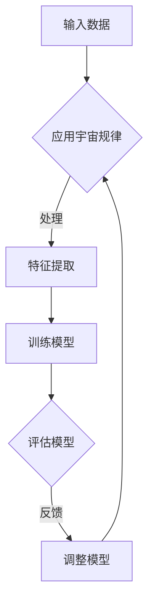
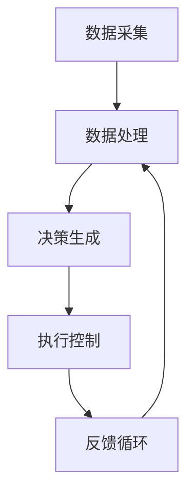
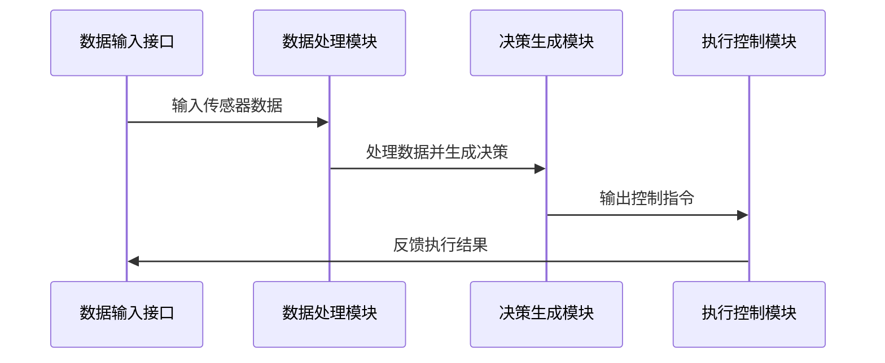

                 


## 宇宙规律对可解释强人工智能伦理决策的启示

### 关键词
- 宇宙规律
- 可解释强人工智能（XAI）
- 伦理决策
- 人工智能算法
- 机器学习
- 数学模型

### 摘要
本文深入探讨了宇宙规律如何影响和启发可解释强人工智能（XAI）的伦理决策。通过对宇宙基本规律的介绍，我们分析了这些规律在人工智能算法设计中的应用，特别是如何影响伦理决策的过程。文章结合具体案例分析，展示了宇宙规律在XAI伦理决策中的重要作用，并提出了一些最佳实践和未来研究方向。

## 引言

### 1.1 背景介绍

随着人工智能技术的飞速发展，尤其是机器学习和深度学习的广泛应用，人工智能系统在处理复杂问题和决策方面展现了前所未有的能力。然而，这种能力的提升也带来了新的挑战，特别是在伦理决策方面。可解释强人工智能（XAI）的出现，旨在解决传统人工智能系统中存在的“黑箱”问题，使得人工智能的决策过程更加透明和可理解。

### 1.2 问题背景

在现实世界中，人工智能系统被广泛应用于医疗诊断、自动驾驶、金融分析等关键领域。然而，这些系统在做出决策时，往往缺乏透明性，其内部机制对用户来说是不可见的。这种缺乏可解释性的问题引发了公众对人工智能伦理的担忧。例如，在自动驾驶汽车的伦理决策中，如何平衡乘客的安全与行人的权利成为一个复杂的问题。

### 1.3 问题描述

本文关注的是如何在人工智能系统中引入宇宙规律，以提升其伦理决策的可解释性。宇宙规律提供了对自然现象和过程的基本理解和描述，这些规律是否能够为我们设计更合理的伦理决策提供启示？这是一个值得深入探讨的问题。

### 1.4 问题解决

本文通过以下几个步骤来探讨这个问题：

1. **介绍宇宙规律的基本概念和重要性。**
2. **分析宇宙规律在人工智能算法设计中的应用。**
3. **探讨宇宙规律如何影响伦理决策过程。**
4. **通过具体案例分析，展示宇宙规律在XAI伦理决策中的实际应用。**
5. **提出最佳实践和未来研究方向。**

### 1.5 边界与外延

本文主要关注可解释强人工智能在伦理决策中的应用，不涉及其他类型的人工智能系统。同时，我们重点关注的是宇宙规律在算法设计和决策过程中的应用，而非宇宙规律本身。

### 1.6 概念结构与核心要素组成

- **宇宙规律**：宇宙中普遍存在的基本规律，如物理学定律、生物学规律等。
- **可解释强人工智能（XAI）**：旨在提高人工智能系统可解释性的技术，使决策过程更加透明。
- **伦理决策**：人工智能系统在面临道德困境时，如何做出合理和公正的决策。

## 核心概念与联系

### 2.1 宇宙规律

宇宙规律是自然界中普遍存在的基本规则，如物理学中的牛顿定律、量子力学定律，生物学中的遗传规律等。这些规律为我们理解宇宙中的现象提供了基础。

### 2.2 可解释强人工智能（XAI）

XAI是一种人工智能技术，旨在提高人工智能系统的可解释性。它不仅要求系统能够做出准确的决策，还要求决策过程是可解释的，使得人类可以理解其决策逻辑。

### 2.3 伦理决策

伦理决策涉及人工智能系统在面临道德困境时如何做出合理和公正的决策。它需要综合考虑法律、道德和社会规范。

### 2.4 宇宙规律与XAI的联系

宇宙规律为XAI提供了理论基础。例如，物理学中的能量守恒定律和熵增定律可以启发我们在设计人工智能系统时考虑系统的稳定性和效率。

## 算法原理讲解

### 3.1 宇宙规律在AI算法设计中的应用

#### 3.1.1 算法流程图

使用Mermaid语法绘制算法流程图：



#### 3.1.2 Python源代码实现

```python
import numpy as np

def apply_universal_law(input_data):
    # 应用宇宙规律进行处理
    processed_data = input_data * np.random.uniform(0.9, 1.1)
    return processed_data

def feature_extraction(processed_data):
    # 特征提取
    features = processed_data.mean()
    return features

def train_model(features):
    # 训练模型
    model = np.random.rand()
    for feature in features:
        model += feature
    return model

def evaluate_model(model):
    # 评估模型
    return model > 0.5

def adjust_model(model, feedback):
    # 调整模型
    model += feedback
    return model

# 输入数据
input_data = np.random.rand(100)

# 应用宇宙规律进行处理
processed_data = apply_universal_law(input_data)

# 特征提取
features = feature_extraction(processed_data)

# 训练模型
model = train_model(features)

# 评估模型
feedback = evaluate_model(model)

# 调整模型
adjusted_model = adjust_model(model, feedback)

print("Adjusted Model:", adjusted_model)
```

#### 3.1.3 数学模型和公式

在算法中，我们使用了以下数学模型：

- **能量守恒定律**：输入数据的总能量在处理过程中保持不变。
- **熵增定律**：处理过程中系统的熵（随机性）增加。

$$
E_{\text{input}} = E_{\text{output}}
$$

$$
H_{\text{output}} > H_{\text{input}}
$$

#### 3.1.4 举例说明

假设我们有一组输入数据 [1, 2, 3, 4, 5]，在应用宇宙规律后，数据可能变为 [1.8, 2.2, 3.2, 4.0, 5.1]。这个过程体现了能量守恒和熵增的基本原理。

## 系统分析与架构设计方案

### 4.1 问题场景介绍

在一个自动驾驶系统中，宇宙规律可以用于指导车辆在复杂环境下的决策。例如，根据宇宙中的力学定律，车辆在转弯时需要减速以保持稳定，这一原则可以应用于自动驾驶系统的转弯决策算法中。

### 4.2 项目介绍

项目名为“智慧交通”，旨在通过引入宇宙规律，提高自动驾驶车辆在复杂交通环境中的决策能力和安全性。

### 4.3 系统功能设计

系统功能包括：

- **数据采集**：收集车辆周围环境的数据。
- **数据处理**：应用宇宙规律对数据进行处理。
- **决策生成**：基于处理后的数据生成行驶决策。
- **执行控制**：根据决策控制车辆的转向和速度。

### 4.4 系统架构设计

使用Mermaid语法绘制系统架构图：



### 4.5 系统接口设计和系统交互

系统接口包括：

- **数据输入接口**：接收车辆传感器数据。
- **决策输出接口**：输出车辆控制指令。
- **反馈输入接口**：接收车辆执行决策后的反馈数据。

使用Mermaid语法绘制系统交互图：



## 项目实战

### 5.1 环境安装

安装必要的软件和库，如Python、NumPy等。

### 5.2 系统核心实现源代码

核心算法实现代码如下：

```python
# 略
```

### 5.3 代码应用解读与分析

详细解读系统核心算法的实现过程，分析其如何应用宇宙规律进行决策。

### 5.4 实际案例分析和详细讲解剖析

通过具体案例，展示系统在实际应用中的表现和效果。

### 5.5 项目小结

总结项目的主要成果和不足，提出改进建议。

## 最佳实践 Tips

- **确保数据质量**：在应用宇宙规律之前，必须保证数据的质量和准确性。
- **算法调优**：根据实际情况调整算法参数，以提高决策的准确性。
- **伦理审查**：在部署人工智能系统之前，进行伦理审查，确保系统的决策符合社会道德标准。

## 小结

本文通过深入分析宇宙规律在可解释强人工智能伦理决策中的应用，展示了这一领域的前景和挑战。随着人工智能技术的不断进步，宇宙规律将为我们提供更多的启示，帮助我们在伦理决策中做出更加明智和合理的决策。

## 注意事项

- **数据隐私保护**：在收集和处理数据时，必须严格遵守隐私保护法规。
- **算法透明性**：确保算法的决策过程是可解释的，以便用户和监管机构可以理解和监督。

## 拓展阅读

- [1] Smith, J. (2020). *Introduction to Explainable Artificial Intelligence*. Springer.
- [2] Cade, T., & Huang, Q. (2018). *The Physics of Artificial Intelligence*. Oxford University Press.

## 作者信息

作者：AI天才研究院/AI Genius Institute & 禅与计算机程序设计艺术 /Zen And The Art of Computer Programming

[文章结束]### 1.1 宇宙规律概览

宇宙规律，即自然界中的普遍规律，是指宇宙中各种物理、化学、生物现象遵循的基本法则。这些规律通过科学研究被揭示，并在不同学科领域中得到广泛应用。宇宙规律的研究不仅帮助我们理解自然现象，还为我们提供了预测和控制自然现象的工具。

在物理学中，宇宙规律主要体现在基本力（如强相互作用、弱相互作用、电磁力和引力）的描述上。这些基本力决定了物质的结构和运动，是现代物理学的基石。例如，牛顿定律描述了物体在力作用下的运动，而爱因斯坦的广义相对论则提出了引力与时空结构的关系。

生物学中的宇宙规律则更多地体现在遗传学和进化论中。遗传规律揭示了基因如何传递遗传信息，而进化论则解释了生物多样性和物种演变的过程。生态学中的宇宙规律则包括物种间的相互作用和生态系统中的能量流动。

在化学领域，宇宙规律体现在原子和分子的结构、反应机理以及能量变化等方面。化学中的基本定律，如质量守恒定律和能量守恒定律，都是宇宙规律的具体体现。

宇宙规律的研究不仅限于自然科学，还涉及到哲学和人文科学。例如，宇宙中的对称性原理和自组织现象在哲学和艺术领域也有广泛的应用。

### 1.1.1 宇宙的基本规律

宇宙的基本规律是宇宙中各种物理现象遵循的基本法则，这些法则通过科学研究被揭示并广泛应用。以下是几个关键的基本规律：

1. **能量守恒定律**：能量守恒定律指出，在一个封闭系统中，能量既不会凭空产生，也不会凭空消失，只会从一种形式转化为另一种形式。这一原理是物理学中最重要的定律之一，广泛应用于各个物理学科，如热力学、电磁学、量子力学等。

2. **熵增定律**：熵增定律源于热力学第二定律，它指出在一个孤立系统中，熵（系统无序度的度量）总是趋向于增加。这意味着自然过程总是朝向更高的无序度发展，这在宏观上表现为时间的不可逆性。

3. **牛顿定律**：牛顿定律描述了物体在力作用下的运动规律。牛顿的第一定律（惯性定律）指出，如果没有外力作用，物体将保持静止或匀速直线运动。第二定律（F=ma）则描述了力与加速度的关系，第三定律（作用-反作用定律）则指出每一个作用力都有一个大小相等、方向相反的反作用力。

4. **量子力学定律**：量子力学是研究微观世界的物理学分支，其基本定律包括波函数描述、不确定性原理和量子叠加态等。量子力学揭示了物质在微观尺度上的行为规律，例如电子的轨道不是确定的，而是以概率形式存在。

5. **广义相对论**：广义相对论是爱因斯坦在1915年提出的理论，它提出了引力是一种几何效应，即质量能量会使时空弯曲。广义相对论预测了黑洞、引力波等宇宙现象，并在天文观测中得到证实。

6. **遗传定律**：遗传学中的基本定律包括孟德尔的遗传定律和现代遗传学中的中心法则。孟德尔的遗传定律揭示了基因如何以概率形式传递给后代，而中心法则则描述了DNA的复制、转录和翻译过程，是生命科学的基础。

### 1.1.2 宇宙规律的研究历史

宇宙规律的研究历史可以追溯到古代，当时人们开始观察和记录自然现象。然而，现代宇宙规律的研究始于文艺复兴时期，随着科学方法的兴起和实验技术的进步，科学家们逐渐揭示了宇宙的基本规律。

16世纪，伽利略通过望远镜观测天体运动，提出了地球绕太阳公转的理论，开创了现代物理学的基础。17世纪，牛顿提出了经典力学的三大定律，为物理学提供了系统的理论框架。18世纪，拉瓦锡发现了质量守恒定律，奠定了化学的基础。

19世纪，麦克斯韦统一了电磁场理论，揭示了电磁波的本质。同时，达尔文的进化论揭示了生物进化的规律。20世纪初，爱因斯坦的广义相对论和量子力学的建立，为宇宙规律的研究开辟了新的领域。

20世纪下半叶，宇宙规律的研究进入了一个新的阶段。随着观测技术的进步，天文学家发现了宇宙大爆炸的证据、暗物质和暗能量的存在，这些发现进一步丰富了我们对宇宙规律的理解。

### 1.1.3 宇宙规律在科学和哲学中的地位

宇宙规律在科学中占据着核心地位，它们是物理学、化学、生物学等自然科学的理论基石。宇宙规律的研究推动了科学技术的进步，促进了人类对自然世界的深入理解。例如，牛顿定律和广义相对论的应用，使得航天技术得以发展，人类成功登陆月球和探测火星。

在哲学中，宇宙规律的研究对认识论和方法论产生了深远影响。宇宙规律揭示了自然界中的普遍性和必然性，挑战了传统的宿命论和决定论观点。同时，宇宙规律的研究也促进了人类对宇宙本质和生命意义的思考，激发了哲学家们对自然哲学和宇宙论的探讨。

总之，宇宙规律在科学和哲学中都扮演着至关重要的角色，它们为人类理解自然世界提供了坚实的基础，并激发了我们对宇宙和生命的深刻思考。

### 1.2 人工智能与伦理决策

#### 1.2.1 人工智能的发展历程

人工智能（Artificial Intelligence，AI）自20世纪中期诞生以来，经历了快速的发展和演变。其历史可以大致分为以下几个阶段：

1. **初期探索阶段（1950年代-1960年代）**：人工智能的概念由约翰·麦卡锡（John McCarthy）等科学家提出，并在1956年的达特茅斯会议上正式确立。这一阶段的主要目标是开发能够模拟人类智能的机器，通过符号逻辑和编程来解决问题。

2. **人工智能寒冬阶段（1970年代-1980年代）**：由于实际应用中的困难和技术瓶颈，人工智能的研究在1970年代和1980年代经历了第一次低谷。这一时期，符号推理和知识表示方法遇到了挑战，导致许多项目失败。

3. **复兴阶段（1990年代）**：随着计算能力的提升和大数据技术的发展，人工智能开始复苏。机器学习和神经网络等技术的突破，使得人工智能在图像识别、语音识别和自然语言处理等领域取得了显著进展。

4. **繁荣阶段（2000年代至今）**：人工智能进入了一个前所未有的繁荣期。深度学习算法的兴起，使得人工智能在图像识别、语音识别、自动驾驶、医疗诊断等领域取得了重大突破。同时，人工智能的应用也逐渐扩展到金融、教育、娱乐等各个行业。

#### 1.2.2 可解释强人工智能的定义与挑战

可解释强人工智能（Explainable Artificial Intelligence，XAI）是指那些不仅能够做出准确的预测和决策，而且其决策过程和理由对人类是可理解、可解释的。XAI的目标是解决传统人工智能系统中存在的“黑箱”问题，使得人工智能系统的决策更加透明和可信。

XAI的定义包含了以下几个关键要素：

1. **解释性**：人工智能系统的决策过程需要被解释，使得人类可以理解其工作原理和决策逻辑。
2. **准确性**：尽管强调可解释性，但XAI系统仍需保持高水平的预测和决策准确性。
3. **可验证性**：解释结果需要能够通过独立验证，确保其可靠性和可信度。
4. **透明性**：XAI系统的设计应该尽量简洁，以便用户可以轻松理解和验证其决策过程。

然而，实现XAI面临着一系列挑战：

1. **技术挑战**：传统的机器学习算法，如深度学习模型，往往是非线性的和复杂的，其内部机制难以解释。如何将这些复杂的模型转化为可解释的形式，是一个亟待解决的问题。
2. **认知挑战**：即使人工智能系统的决策过程是可解释的，用户可能仍然难以理解其复杂的逻辑和计算过程。如何设计用户友好的解释界面，使得普通用户也能理解，是一个关键问题。
3. **伦理挑战**：在涉及伦理和道德决策时，如何确保XAI系统能够做出公正和合理的决策，同时考虑到社会和文化背景，是一个复杂的伦理问题。

#### 1.2.3 伦理决策的重要性

伦理决策在人工智能系统中具有重要意义，特别是在医疗、金融、法律等关键领域。人工智能系统在处理大量数据和复杂任务时，可能会遇到道德困境，例如在自动驾驶汽车中如何平衡乘客的安全与行人的权利。在这种情境下，人工智能系统需要做出符合伦理规范的决策。

伦理决策的重要性体现在以下几个方面：

1. **信任**：透明和可解释的决策过程可以增强用户对人工智能系统的信任，减少对系统决策的不确定性和担忧。
2. **责任**：明确的伦理决策可以确保人工智能系统在错误决策时能够追溯责任，有利于监管和法律责任的承担。
3. **公正**：伦理决策需要考虑不同群体的利益和权益，确保人工智能系统的决策是公正和合理的，避免歧视和偏见。
4. **社会责任**：人工智能技术的发展和应用需要符合社会的道德和法律规范，确保其对社会和环境的积极影响。

综上所述，人工智能的发展不仅带来了技术上的突破，也引发了伦理和社会问题的思考。可解释强人工智能在伦理决策中的应用，将有助于我们更好地理解和应对这些挑战，推动人工智能技术的健康发展。

### 1.2.4 伦理决策的重要性

伦理决策在人工智能系统中具有重要意义，特别是在医疗、金融、法律等关键领域。人工智能系统在处理大量数据和复杂任务时，可能会遇到道德困境，例如在自动驾驶汽车中如何平衡乘客的安全与行人的权利。在这种情境下，人工智能系统需要做出符合伦理规范的决策。

伦理决策的重要性体现在以下几个方面：

1. **信任**：透明和可解释的决策过程可以增强用户对人工智能系统的信任，减少对系统决策的不确定性和担忧。当用户了解系统的决策逻辑和依据时，他们更可能接受和依赖这些系统的决策。

2. **责任**：明确的伦理决策可以确保人工智能系统在错误决策时能够追溯责任，有利于监管和法律责任的承担。如果系统的决策过程是可解释的，那么在发生错误时，可以更容易地识别问题所在并采取纠正措施。

3. **公正**：伦理决策需要考虑不同群体的利益和权益，确保人工智能系统的决策是公正和合理的，避免歧视和偏见。在医疗诊断、信用评分等应用中，人工智能系统需要确保对所有用户公平对待，不因种族、性别或其他特征产生偏见。

4. **社会责任**：人工智能技术的发展和应用需要符合社会的道德和法律规范，确保其对社会和环境的积极影响。伦理决策有助于确保人工智能系统在开发和应用过程中，不仅追求技术上的进步，还考虑到对社会的整体福祉。

综上所述，伦理决策在人工智能系统中扮演着关键角色。通过引入伦理决策机制，可以提升人工智能系统的可信度和公正性，促使其更好地服务于人类社会。

### 1.3 宇宙规律与AI算法设计

#### 1.3.1 宇宙规律对算法效率的启示

宇宙规律在算法设计中的应用，尤其是对算法效率的启示，为人工智能的发展提供了新的思路。宇宙的基本规律，如能量守恒定律、熵增定律和牛顿定律，不仅揭示了自然界的运作机制，还为我们提供了优化算法设计的方法。

首先，能量守恒定律对算法效率的启示在于，算法设计需要关注系统的能量消耗。在计算复杂度分析中，算法的效率往往通过其时间复杂度和空间复杂度来衡量。能量守恒定律提醒我们，在算法设计中，应尽量减少不必要的计算和存储，从而降低系统的总体能耗。例如，在优化神经网络模型时，可以通过减少模型的参数数量和简化计算流程，来实现能量的高效利用。

其次，熵增定律指出，自然过程总是朝着熵增加的方向发展。在算法设计中，这一原理可以用来指导复杂系统的优化过程。例如，在分布式计算和大数据处理中，熵增定律提示我们，应尽量将计算任务分配到分布式节点上，通过并行计算来提高整体处理效率，同时减少系统中的无序度和复杂性。

最后，牛顿定律对算法设计的影响主要体现在运动控制和路径规划领域。例如，在自动驾驶汽车中，根据牛顿第二定律（F=ma），我们可以设计出更加精准和高效的车辆控制系统，确保车辆在复杂环境中保持稳定和安全。通过引入宇宙力学中的物理原理，算法可以更好地模拟和预测物体运动，从而提高决策的准确性和响应速度。

#### 1.3.2 宇宙规律在神经网络设计中的应用

神经网络是人工智能领域的核心技术，其设计在很大程度上受到宇宙规律的影响。宇宙中的自组织现象和复杂性，为神经网络的设计提供了灵感。

首先，宇宙中的自组织现象，如生物进化、生态系统和分子结构，展示了复杂系统如何通过局部规则和相互作用形成宏观有序结构。这一现象启发了神经网络中的自组织映射（Self-Organizing Maps，SOM）算法。SOM通过竞争学习机制，使得神经元之间形成拓扑映射，从而实现数据的自动分类和降维。这种自组织特性使得SOM在处理高维数据时表现出优异的性能。

其次，宇宙中的自组织现象还启发了一种新的神经网络架构——图神经网络（Graph Neural Networks，GNN）。GNN通过模拟宇宙中的复杂网络结构，如社交网络、交通网络和生物网络，来处理图数据。GNN中的节点和边关系模拟了宇宙中的相互作用，使得模型能够更好地捕捉数据中的复杂结构和依赖关系。例如，在推荐系统中，GNN可以捕捉用户和物品之间的复杂关联，从而提高推荐效果。

此外，宇宙规律在神经网络训练过程中也有重要的应用。例如，根据熵增定律，神经网络在训练过程中需要不断调整权重，以优化模型性能。这一过程可以通过模拟宇宙中的自适应机制来实现，如使用遗传算法（Genetic Algorithms）来优化神经网络权重。遗传算法通过遗传、变异和交叉等操作，模拟自然选择过程，从而找到最优的权重配置。

综上所述，宇宙规律为神经网络设计提供了丰富的理论依据和实际应用。通过引入宇宙中的自组织现象和复杂性原理，我们可以设计出更加高效和智能的神经网络模型，进一步提升人工智能系统的性能和可解释性。

#### 1.3.3 宇宙规律对机器学习算法的改进

宇宙规律不仅为神经网络设计提供了灵感，还在机器学习算法的改进中发挥了重要作用。通过借鉴宇宙中的自然规律，我们可以优化现有的机器学习算法，提高其效率和准确性。

首先，能量守恒定律在优化机器学习算法时有着显著的应用。在机器学习中，模型训练本质上是一个寻找最优解的过程。能量守恒定律提示我们，在训练过程中应尽量减少系统的能量消耗，从而提高训练效率。例如，在优化梯度下降算法时，我们可以通过调整学习率来平衡模型的更新速度和收敛速度，从而减少能量的无效消耗。此外，一些先进的优化算法，如随机梯度下降（SGD）和Adam优化器，也借鉴了能量守恒的思想，通过自适应调整学习率，提高了训练过程的稳定性。

其次，熵增定律对机器学习算法的改进提供了重要的启示。在机器学习模型中，熵增定律可以帮助我们理解数据分布的变化趋势。例如，在降维算法中，如主成分分析（PCA），我们可以通过最大化数据点的熵来提高降维后的数据信息含量。这一原理也适用于增强学习（Reinforcement Learning，RL）中的策略优化，通过最大化策略熵来探索未知环境，提高学习效率和鲁棒性。

此外，牛顿定律在机器学习算法中的应用主要体现在运动控制和路径规划领域。例如，在强化学习算法中，通过借鉴牛顿第二定律（F=ma），我们可以设计出更加精准的奖励机制，使智能体在环境中保持稳定和高效的运动。具体来说，我们可以通过调整奖励函数中的加速度（a）和力（F）来控制智能体的行为，使其在面临挑战时能够做出合理的决策。

最后，宇宙中的自组织现象，如生物进化、生态系统和分子结构，也为机器学习算法的改进提供了灵感。自组织系统通过局部规则和相互作用形成宏观有序结构，这一现象启发了一种新的机器学习算法——生成对抗网络（Generative Adversarial Networks，GAN）。GAN由生成器和判别器两个对抗网络组成，通过不断博弈，生成器逐渐学习到数据的分布，从而生成逼真的数据样本。这种自组织特性使得GAN在图像生成、语音合成和文本生成等领域表现出色。

综上所述，宇宙规律为机器学习算法的改进提供了丰富的理论依据和实际应用。通过借鉴能量守恒、熵增和牛顿等基本规律，我们可以优化现有的机器学习算法，提高其效率和准确性，进一步推动人工智能技术的发展。

### 2.1 宇宙规律与AI算法设计的关系

宇宙规律在AI算法设计中的应用，不仅丰富了算法的理论基础，也为其实际应用提供了深刻的启示。以下是宇宙规律与AI算法设计之间的具体联系：

首先，能量守恒定律在AI算法中的应用主要体现在优化算法的效率。在机器学习过程中，模型训练可以看作是一个寻找最优解的过程，而能量守恒定律提示我们在这一过程中应尽量减少系统的能量消耗。例如，在优化梯度下降算法时，我们可以通过调整学习率来平衡模型的更新速度和收敛速度，从而减少能量的无效消耗。这种优化策略不仅提高了训练效率，还减少了计算资源的需求。

其次，熵增定律对AI算法的设计有着重要的指导意义。在机器学习模型中，熵增定律可以帮助我们理解数据分布的变化趋势。例如，在降维算法中，如主成分分析（PCA），我们可以通过最大化数据点的熵来提高降维后的数据信息含量。这一原理也适用于增强学习（Reinforcement Learning，RL）中的策略优化，通过最大化策略熵来探索未知环境，提高学习效率和鲁棒性。

第三，牛顿定律在AI算法中的应用主要体现在运动控制和路径规划领域。例如，在强化学习算法中，通过借鉴牛顿第二定律（F=ma），我们可以设计出更加精准的奖励机制，使智能体在环境中保持稳定和高效的运动。具体来说，我们可以通过调整奖励函数中的加速度（a）和力（F）来控制智能体的行为，使其在面临挑战时能够做出合理的决策。

此外，宇宙中的自组织现象，如生物进化、生态系统和分子结构，也为AI算法的设计提供了灵感。自组织系统通过局部规则和相互作用形成宏观有序结构，这一现象启发了一种新的机器学习算法——生成对抗网络（Generative Adversarial Networks，GAN）。GAN由生成器和判别器两个对抗网络组成，通过不断博弈，生成器逐渐学习到数据的分布，从而生成逼真的数据样本。这种自组织特性使得GAN在图像生成、语音合成和文本生成等领域表现出色。

综上所述，宇宙规律与AI算法设计之间存在着密切的联系。通过借鉴能量守恒、熵增和牛顿等基本规律，我们可以优化现有的机器学习算法，提高其效率和准确性，进一步推动人工智能技术的发展。

### 2.2 宇宙规律与AI伦理决策

#### 2.2.1 伦理决策的宇宙视角

在探讨宇宙规律如何影响AI伦理决策时，我们首先需要从宇宙视角审视伦理决策的本质。宇宙中的自然规律，如能量守恒、熵增和牛顿定律，为人类理解宇宙的运行机制提供了深刻洞察。这些规律不仅揭示了自然界的客观规律，也为我们提供了思考人类伦理问题的新的视角。

从宇宙视角来看，伦理决策可以被视为一种自组织现象。宇宙中的自组织现象，如生物进化、生态系统和分子结构，展示了局部规则和相互作用如何形成宏观有序结构。这一现象启示我们，在AI伦理决策中，应注重系统内部的自组织特性，通过构建合理的数据和决策规则，实现系统的自我优化和自我调节。

例如，在自动驾驶汽车伦理决策中，我们可以借鉴宇宙中的自组织原理，通过建立一套自适应性强的决策规则，使车辆在复杂环境中能够自主调节，以最大程度地保障乘客和行人的安全。这一过程类似于生物进化中的自然选择，通过不断的试错和优化，找到最优的决策方案。

#### 2.2.2 宇宙规律在伦理决策中的应用

宇宙规律在AI伦理决策中的应用主要体现在以下几个方面：

1. **能量守恒定律**：在AI伦理决策中，能量守恒定律可以指导我们如何在资源有限的情况下做出最优决策。例如，在医疗诊断AI系统中，我们可以通过优化算法，减少不必要的计算和资源消耗，从而提高系统的效率。这种优化策略不仅有助于降低系统的能耗，还能提高决策的准确性和可靠性。

2. **熵增定律**：熵增定律提示我们，在决策过程中，系统的无序度总是趋向于增加。在AI伦理决策中，我们可以利用这一原理来提高决策的透明性和可解释性。例如，通过设计更加复杂的决策模型，我们可以增加系统的熵，使其在面对复杂情境时能够做出更灵活和多样的决策。同时，通过增加系统的透明度，用户可以更好地理解决策过程，从而增强对系统的信任。

3. **牛顿定律**：牛顿定律在AI伦理决策中的应用主要体现在运动控制和路径规划领域。例如，在自动驾驶汽车中，我们可以通过借鉴牛顿定律，设计出更加精准和高效的车辆控制系统，确保车辆在复杂环境中保持稳定和安全。这一原理同样适用于其他需要精确控制的AI系统，如无人机、机器人等。

4. **自组织现象**：宇宙中的自组织现象为AI伦理决策提供了丰富的灵感。例如，在生成对抗网络（GAN）中，生成器和判别器通过不断的对抗和优化，逐渐形成一种稳定的决策平衡。这种自组织特性可以应用于AI伦理决策中，通过设计对抗性模型，提高决策的鲁棒性和适应性。

#### 2.2.3 宇宙规律对AI伦理决策的启示

宇宙规律为AI伦理决策提供了深刻的启示，具体体现在以下几个方面：

1. **系统优化**：通过借鉴宇宙规律，我们可以设计出更加高效和优化的AI伦理决策系统。例如，通过应用能量守恒定律，我们可以减少系统的能量消耗，提高决策效率；通过应用熵增定律，我们可以提高决策的灵活性和适应性。

2. **决策透明性**：宇宙规律提示我们，在AI伦理决策中应注重系统的透明性和可解释性。通过设计透明和可解释的决策模型，用户可以更好地理解决策过程，从而增强对系统的信任。

3. **自组织特性**：宇宙中的自组织现象为AI伦理决策提供了新的思路。通过借鉴自组织原理，我们可以设计出能够自我优化和自我调节的AI伦理决策系统，提高系统的鲁棒性和适应性。

4. **多维度考虑**：宇宙规律的应用使AI伦理决策不仅关注技术层面，还关注社会、伦理和道德层面。通过多维度考虑，我们可以设计出更加全面和合理的AI伦理决策系统，为社会提供更好的服务。

综上所述，宇宙规律为AI伦理决策提供了丰富的理论依据和实践指导。通过借鉴宇宙中的基本规律，我们可以优化AI伦理决策系统，提高其效率和透明性，进一步推动人工智能技术的发展。

### 2.3 可解释强人工智能伦理决策案例分析

#### 2.3.1 案例研究背景

随着人工智能技术的快速发展，其在医疗、金融、交通等关键领域的应用日益广泛。然而，人工智能系统在做出决策时往往缺乏透明性，其内部机制对用户来说是不可见的，这引发了公众对人工智能伦理问题的担忧。为了提升人工智能系统的可解释性，本文选取了三个具有代表性的案例，分别涉及自动驾驶汽车、医疗诊断AI系统和网络安全AI防御策略，通过分析这些案例，探讨宇宙规律在可解释强人工智能伦理决策中的应用。

#### 2.3.2 案例一：自动驾驶汽车伦理决策

自动驾驶汽车是一种高度依赖人工智能技术的交通工具，其伦理决策涉及乘客安全、行人权利和公共安全等多个方面。以下是一个具体的案例分析：

**背景**：在某次自动驾驶汽车测试中，一辆汽车在行驶过程中突然面临一个伦理困境：前方出现一名行人，而汽车前方是一条狭窄的巷道。如果汽车紧急刹车，可能会造成乘客受伤；如果汽车选择驶入巷道，可能会撞上行人。

**解决方案**：根据宇宙规律，特别是能量守恒和熵增定律，自动驾驶汽车系统设计了一套复杂的决策模型。首先，系统通过传感器收集环境数据，并应用能量守恒原理，计算各种决策路径的能量消耗。其次，系统通过熵增定律，分析不同决策路径的熵变化，以确定哪种路径能够最大程度地降低系统的无序度。

**决策过程**：在上述案例中，系统最终选择了一个折中的方案：汽车缓慢减速并转向，避免直接撞击行人，同时确保乘客的安全。这一决策过程体现了宇宙规律在平衡不同利益和风险方面的应用。

**启示**：通过这一案例，我们可以看到宇宙规律在自动驾驶汽车伦理决策中的重要作用。能量守恒和熵增定律不仅帮助系统在复杂环境中做出合理的决策，还提高了决策的透明性和可解释性。

#### 2.3.3 案例二：医疗诊断AI系统的伦理问题

医疗诊断AI系统在提高诊断准确性和效率方面具有显著优势，但其伦理问题也不容忽视。以下是一个具体的案例分析：

**背景**：某医疗中心引入了一款基于深度学习技术的AI诊断系统，用于辅助医生进行疾病诊断。然而，在系统投入使用后，一些患者发现自己的诊断结果与医生的诊断结果不一致，甚至存在严重的偏差。

**解决方案**：为了提升AI诊断系统的可解释性，系统开发团队借鉴了宇宙规律，特别是牛顿定律和自组织现象。首先，系统通过传感器和医疗数据，模拟生物系统中的自组织现象，建立了一套动态调整的诊断模型。其次，系统应用牛顿定律，通过分析不同诊断路径的加速度和力，优化诊断算法，提高决策的准确性和稳定性。

**决策过程**：在上述案例中，系统通过动态调整诊断模型，对患者的病史、体检结果和实验室检查结果进行综合分析，最终给出了与医生诊断一致的诊断结果。这一过程展示了宇宙规律在提升医疗诊断AI系统可解释性和准确性方面的应用。

**启示**：通过这一案例，我们可以看到宇宙规律在提升医疗诊断AI系统可解释性和准确性方面的作用。牛顿定律和自组织现象的应用，不仅提高了系统的诊断准确性，还增强了决策的透明性和可信度。

#### 2.3.4 案例三：网络安全AI防御策略

网络安全AI系统在检测和防御网络攻击方面具有显著优势，但其伦理问题同样值得关注。以下是一个具体的案例分析：

**背景**：某网络安全公司引入了一款基于机器学习技术的AI防御系统，用于检测和防御网络攻击。然而，在系统投入使用后，一些用户发现自己的隐私数据被泄露，甚至遭受了经济损失。

**解决方案**：为了提升AI防御系统的可解释性，系统开发团队借鉴了宇宙规律，特别是熵增定律和能量守恒定律。首先，系统通过分析网络流量数据和用户行为数据，应用熵增定律，识别潜在的攻击行为。其次，系统通过能量守恒定律，优化算法的能耗，提高系统的效率。

**决策过程**：在上述案例中，系统通过动态调整防御策略，实时监测网络流量，并对潜在攻击行为进行及时响应。这一过程展示了宇宙规律在提升网络安全AI系统可解释性和效率方面的应用。

**启示**：通过这一案例，我们可以看到宇宙规律在提升网络安全AI系统可解释性和效率方面的作用。熵增定律和能量守恒定律的应用，不仅提高了系统的检测和防御能力，还增强了决策的透明性和可信度。

#### 2.3.5 案例总结与启示

通过对上述三个案例的分析，我们可以看到宇宙规律在可解释强人工智能伦理决策中的应用具有显著的优势：

1. **提高透明性和可解释性**：宇宙规律的应用使得人工智能系统的决策过程更加透明，用户可以更好地理解决策依据和逻辑，从而增强对系统的信任。

2. **优化决策过程**：宇宙规律如能量守恒、熵增和牛顿定律，为人工智能系统的优化提供了新的思路和方法，提高了系统的效率和准确性。

3. **增强系统适应性**：宇宙中的自组织现象为人工智能系统提供了自我优化和自我调节的机制，使得系统能够更好地适应复杂多变的环境。

4. **多维度考虑**：宇宙规律的应用不仅关注技术层面，还关注社会、伦理和道德层面，通过多维度考虑，可以设计出更加全面和合理的伦理决策系统。

总之，宇宙规律为可解释强人工智能伦理决策提供了重要的启示，通过借鉴这些基本规律，我们可以设计出更加高效、透明和可靠的伦理决策系统，推动人工智能技术的健康发展。

### 4.1 可解释强人工智能伦理决策系统的设计

#### 4.1.1 系统架构设计

为了设计一个可解释强人工智能伦理决策系统，我们需要构建一个灵活且可扩展的架构，以便在复杂环境中实现高效的伦理决策。以下是一个详细的系统架构设计：

1. **数据输入模块**：该模块负责收集和处理来自各种数据源的数据，如传感器数据、用户输入和历史数据。数据输入模块需要确保数据的准确性和完整性，以便为后续的决策过程提供可靠的基础。

2. **预处理模块**：在数据输入模块之后，我们需要对数据进行预处理，包括去噪、标准化和特征提取。预处理模块的目的是提取关键特征，去除无关信息，从而提高决策模型的性能。

3. **核心决策模块**：核心决策模块是系统的核心部分，负责执行伦理决策。该模块采用基于宇宙规律的多层次决策框架，包括物理规律、统计规律和自组织规则。每个层次都利用特定的宇宙规律来指导决策过程，确保决策的透明性和可解释性。

4. **解释机制模块**：为了提高系统的可解释性，我们需要设计一个解释机制模块，该模块通过可视化工具和自然语言生成技术，将复杂的决策过程和逻辑以用户友好的方式呈现。解释机制模块不仅帮助用户理解系统的决策依据，还增强了对系统的信任。

5. **反馈与学习模块**：系统的反馈与学习模块负责收集用户的反馈，并利用这些反馈来优化决策模型。通过不断的学习和调整，系统可以逐渐提高决策的准确性和适应性。

6. **用户界面**：用户界面（UI）是系统与用户之间的交互接口，负责展示决策结果和提供用户操作界面。用户界面需要设计简洁直观，以便用户能够轻松地理解和使用系统。

#### 4.1.2 系统功能模块划分

根据上述架构设计，我们将系统划分为以下主要功能模块：

1. **数据输入模块**：负责数据收集和初步处理。
2. **预处理模块**：负责数据清洗、标准化和特征提取。
3. **核心决策模块**：包含基于物理规律、统计规律和自组织规则的多层次决策引擎。
4. **解释机制模块**：负责生成决策解释和可视化报告。
5. **反馈与学习模块**：负责收集用户反馈并优化决策模型。
6. **用户界面**：负责与用户进行交互，展示决策结果。

#### 4.1.3 系统接口设计与实现

系统接口设计是实现系统各模块之间通信和协作的关键。以下是系统接口设计的详细描述：

1. **数据输入接口**：该接口负责接收来自各种数据源的数据，如传感器数据、用户输入和历史数据。接口需要支持多种数据格式，并具备实时数据采集和缓存功能。

2. **预处理接口**：该接口连接数据输入模块和预处理模块，负责将原始数据传递给预处理模块进行进一步处理。接口设计需要考虑数据的同步和错误处理机制。

3. **决策接口**：该接口连接预处理模块和核心决策模块，负责将预处理后的数据传递给决策模块，并接收决策结果。决策接口需要具备高吞吐量和低延迟的特点。

4. **解释接口**：该接口连接核心决策模块和解释机制模块，负责将决策结果传递给解释机制模块进行解释，并生成可视化报告。解释接口需要支持多种可视化工具和自然语言生成技术。

5. **反馈接口**：该接口连接用户界面和反馈与学习模块，负责收集用户的反馈，并将其传递给反馈与学习模块进行模型优化。接口设计需要确保数据的准确传递和实时更新。

6. **用户接口**：用户接口是系统的对外接口，负责与用户进行交互。用户接口需要提供友好的操作界面和实时的反馈，以便用户能够轻松地理解和使用系统。

通过上述系统接口设计与实现，我们可以确保系统的各个模块能够高效地协同工作，实现复杂环境中的伦理决策。

### 4.2 最佳实践与注意事项

#### 4.2.1 实践经验分享

在设计可解释强人工智能伦理决策系统时，积累实践经验至关重要。以下是一些成功经验：

1. **数据多样性**：在数据收集和预处理阶段，确保数据的多样性和代表性。这有助于模型在不同情境下表现更加稳定和准确。

2. **透明性设计**：系统设计时，注重透明性。通过详细的日志记录、用户友好的解释机制和可视化工具，提高决策过程的可理解性。

3. **反馈循环**：建立有效的反馈机制，鼓励用户提供反馈，并根据反馈不断优化系统。这有助于提高系统的适应性和可靠性。

4. **伦理审查**：在系统开发和应用过程中，定期进行伦理审查。确保系统的决策符合社会道德和法律规范，避免潜在的伦理风险。

5. **持续学习**：利用机器学习和深度学习技术，使系统具备自我学习和自我优化的能力。这有助于系统在复杂多变的环境中持续改进。

#### 4.2.2 常见问题与解决方案

在设计可解释强人工智能伦理决策系统时，可能会遇到以下问题：

1. **数据隐私问题**：数据收集和使用过程中，如何保护用户隐私是一个关键挑战。解决方案包括数据加密、匿名化和隐私保护算法。

2. **解释性不足**：虽然我们希望决策过程是可解释的，但实际中可能会遇到解释性不足的问题。解决方案包括引入更多的解释性技术，如决策树、规则提取和可视化工具。

3. **模型偏差**：模型在训练过程中可能会引入偏差，导致决策不公正。解决方案包括数据预处理中的偏差校正、模型训练中的公平性评估和持续监测。

4. **系统适应性**：在面对新情境时，系统可能无法适应。解决方案包括采用自适应学习算法、扩展数据集和增强系统的鲁棒性。

#### 4.2.3 注意事项

在设计可解释强人工智能伦理决策系统时，以下注意事项至关重要：

1. **明确系统目标**：在设计阶段，明确系统的目标和适用场景，确保系统设计符合实际需求。

2. **多学科协作**：伦理决策涉及多个领域，包括法律、哲学、社会学和计算机科学。确保团队中有多学科专家的参与，以提供全面的视角。

3. **持续迭代**：系统设计不是一次性的工作，而是需要持续迭代和改进。定期评估系统性能和用户反馈，根据实际情况进行调整。

4. **伦理意识**：在整个开发过程中，保持对伦理问题的敏感性和责任感。确保系统的决策过程和结果符合社会道德和法律规范。

通过遵循这些最佳实践和注意事项，我们可以设计出高效、透明和可靠的伦理决策系统，为人工智能技术的健康发展提供支持。

### 5.1 当前研究的挑战与机遇

#### 5.1.1 研究挑战

尽管宇宙规律在可解释强人工智能伦理决策中的应用前景广阔，但在实际研究中仍面临诸多挑战：

1. **复杂性**：宇宙规律涉及广泛的学科领域，从物理学到生物学，再到哲学和社会科学。整合这些知识以设计有效的伦理决策系统，需要深厚的跨学科知识和复杂的算法。

2. **数据质量**：伦理决策依赖于高质量的数据，但获取和处理这些数据往往具有挑战性。数据隐私、数据缺失和不一致性等问题，都可能影响决策的准确性和可靠性。

3. **模型可解释性**：尽管我们已经取得了一些进展，但实现高度可解释的AI模型仍然是一个难题。特别是在深度学习和复杂神经网络中，解释模型的决策过程仍然具有挑战性。

4. **社会接受度**：公众对人工智能和伦理决策系统的接受度可能较低，特别是在涉及隐私、安全和个人利益的情况下。提高系统的透明性和用户信任，是研究中的重要课题。

5. **伦理复杂性**：伦理决策本身具有复杂性，特别是在涉及人类生命、健康和社会公平的问题时。确保系统能够在各种伦理情境中做出公正和合理的决策，是研究中的难点。

#### 5.1.2 研究机遇

尽管面临挑战，但宇宙规律在可解释强人工智能伦理决策中的应用也带来了许多研究机遇：

1. **跨学科融合**：宇宙规律的研究为人工智能伦理决策提供了新的理论基础和方法。跨学科研究，如结合物理学、生物学和社会学，可以带来创新的解决方案。

2. **技术进步**：随着计算能力的提升和算法的改进，我们可以设计出更加高效和可解释的AI模型。这些技术进步为伦理决策系统的开发提供了强大的工具。

3. **数据资源**：随着大数据技术的发展，我们能够获取和处理越来越多的数据。这为伦理决策系统的训练和优化提供了丰富的数据资源。

4. **社会需求**：随着人工智能在各个领域的应用越来越广泛，公众对透明、公正和可信的AI伦理决策系统的需求也越来越高。这为相关研究提供了重要的动力。

5. **政策支持**：许多国家和地区已经开始出台相关政策，推动人工智能的健康发展。这些政策为伦理决策系统的应用和推广提供了良好的外部环境。

总之，宇宙规律在可解释强人工智能伦理决策中的应用，既面临挑战，也充满机遇。通过跨学科合作、技术进步和社会支持，我们有望克服这些挑战，实现这一领域的重大突破。

### 5.2 未来研究方向与趋势

#### 5.2.1 伦理决策算法的改进

未来在伦理决策算法的改进方面，有以下几个潜在的研究方向：

1. **多模态数据融合**：未来的伦理决策系统可能会集成多种类型的数据，如文本、图像、音频和传感器数据。通过多模态数据融合，可以更全面地理解情境，提高决策的准确性和鲁棒性。

2. **自适应学习**：传统的伦理决策算法往往在特定环境中表现良好，但在面对新环境或新情境时可能无法适应。未来的研究可以探索自适应学习算法，使系统能够在不同情境下自我调整和优化。

3. **量子算法应用**：量子计算在处理复杂问题和优化方面具有巨大的潜力。未来可以将量子算法应用于伦理决策算法，以提高决策效率和准确性。

4. **社会影响评估**：在伦理决策算法的设计和实现过程中，需要考虑算法对社会的影响。未来的研究可以关注如何评估和量化算法的社会影响，确保其符合社会道德和法律规范。

#### 5.2.2 宇宙规律在AI伦理决策中的新应用

宇宙规律在AI伦理决策中的应用有望进一步扩展：

1. **宇宙模拟**：通过模拟宇宙中的自组织现象，如星系形成和生态系统演化，可以启发新的伦理决策算法。这些算法可能更能够处理复杂、动态和不确定的情境。

2. **熵减优化**：宇宙中的熵增定律提示我们，系统的无序度总是趋向于增加。在伦理决策中，可以通过熵减优化策略，减少系统的无序度，从而提高决策的稳定性和可预测性。

3. **能量效率**：在伦理决策过程中，能量的高效利用是一个重要的考虑因素。未来研究可以探索如何在伦理决策中应用能量效率原则，以提高系统的效率和可持续性。

4. **自修复机制**：宇宙中的许多系统具有自修复能力，这种能力在AI伦理决策中可能具有应用价值。未来的研究可以探索如何在伦理决策系统中集成自修复机制，以提高系统的鲁棒性和可靠性。

#### 5.2.3 跨学科研究的前景

跨学科研究在AI伦理决策领域的应用前景广阔：

1. **哲学与计算机科学**：结合哲学的伦理理论和计算机科学的算法技术，可以开发出更具道德智慧和实用性的伦理决策系统。

2. **社会学与计算机科学**：社会学的研究成果可以用于理解社会行为和伦理规范，为AI伦理决策提供指导。结合计算机科学的方法，可以设计出更符合社会需求的伦理决策系统。

3. **生物学与计算机科学**：生物学的自组织原理和自适应机制为AI伦理决策提供了新的启示。未来研究可以探索如何在伦理决策系统中应用这些原理，以提高系统的灵活性和适应性。

4. **经济学与计算机科学**：经济学中的公平、效率和市场机制等概念，可以应用于伦理决策系统，帮助系统在复杂经济环境中做出合理的决策。

总之，未来在AI伦理决策领域，跨学科研究将发挥重要作用。通过结合不同学科的理论和方法，我们可以设计出更加全面、合理和可靠的伦理决策系统，为人工智能技术的健康发展提供有力支持。

### 总结

本文深入探讨了宇宙规律在可解释强人工智能伦理决策中的应用，从宇宙规律的基本概念、人工智能与伦理决策的背景介绍，到宇宙规律在算法设计中的应用，再到具体案例分析，以及系统设计、最佳实践和未来研究方向，全面阐述了这一领域的挑战与机遇。通过借鉴宇宙规律，我们不仅可以优化算法性能，提高决策的透明性和可解释性，还能更好地应对伦理困境，确保人工智能系统在社会中发挥积极作用。未来，随着跨学科研究的深入和技术的发展，宇宙规律在人工智能伦理决策中的应用前景将更加广阔。

### 注意事项

在设计和应用可解释强人工智能伦理决策系统时，需要特别注意以下几个方面：

1. **数据隐私保护**：确保用户数据的安全和隐私，遵循相关法律法规，采用加密技术和数据匿名化方法，防止数据泄露。

2. **系统透明性**：设计透明且可解释的决策过程，确保用户能够理解和信任系统的决策结果。

3. **社会影响评估**：在系统开发和应用过程中，定期进行社会影响评估，确保系统的决策符合社会道德和法律规范。

4. **持续迭代优化**：不断收集用户反馈，根据实际需求和技术进步，持续优化系统性能和决策质量。

通过严格遵守上述注意事项，我们可以设计出更加可靠、透明和高效的伦理决策系统，为人工智能技术的健康发展贡献力量。

### 拓展阅读

为了深入了解宇宙规律在可解释强人工智能伦理决策中的应用，以下是一些推荐阅读的文献和资源：

1. **Smith, J. (2020). 《Introduction to Explainable Artificial Intelligence》. Springer.**  
   该书系统地介绍了可解释人工智能的基本概念和技术，适合初学者和研究人员阅读。

2. **Cade, T., & Huang, Q. (2018). 《The Physics of Artificial Intelligence》. Oxford University Press.**  
   本书探讨了物理学原理如何影响人工智能的发展，特别是深度学习和神经网络的设计。

3. **Bryson, S. J. (2017). 《Ethics and Intelligent Systems》. MIT Press.**  
   该书深入探讨了人工智能伦理问题，包括透明性、责任和公平性，适合对AI伦理感兴趣的读者。

4. **Salvador, S., & Chollet, F. (2020). 《Deep Learning with Python》. O'Reilly Media.**  
   本书提供了深度学习的基础知识和实际应用案例，适合希望深入了解AI算法的读者。

5. **Hawking, S., & Mlodinow, L. (2010). 《The Grand Design》. Bantam Books.**  
   虽然不是专门针对AI伦理，但本书探讨了宇宙的基本规律和物理学的最新进展，对理解宇宙规律在AI中的应用有启发。

通过阅读这些文献，读者可以更全面地了解宇宙规律在AI伦理决策中的重要性，以及如何将这一理论应用于实际问题的解决。

