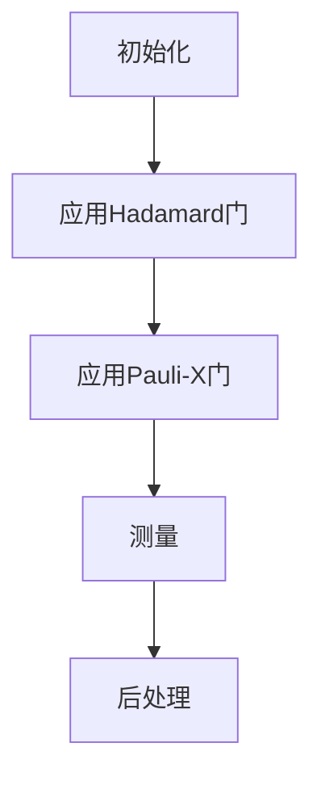

                 


### 1.1 引言

#### 1.1.1 书籍目的与读者对象

本文书旨在深入探讨宇宙规律对可解释量子AI的启示，旨在帮助读者理解宇宙规律与量子AI之间的相互作用，并揭示宇宙规律在量子AI设计、开发和应用中的潜在影响。本书的读者对象主要包括：

1. **计算机科学家**：特别是那些对量子计算和AI感兴趣的研究人员和开发者。
2. **物理学家**：尤其是那些对量子力学和宇宙学有深厚背景的学者。
3. **数据科学家**：希望在量子AI领域探索新应用和解决方案的专业人士。
4. **人工智能爱好者**：希望深入了解量子AI前沿技术的科技爱好者。

#### 1.1.2 研究现状与挑战

当前，量子计算和人工智能（AI）作为两个快速发展的领域，正在引领科技革命。然而，尽管取得了显著进展，仍面临诸多挑战：

1. **量子计算的可解释性**：量子计算本身是一种高度复杂的计算模型，其结果难以用传统方法解释，这是量子AI发展的一个主要障碍。
2. **量子算法的设计与优化**：设计高效且易于解释的量子算法是一个挑战，尤其是当需要处理复杂问题时。
3. **量子硬件的局限性**：目前量子硬件的性能和稳定性有限，限制了量子算法的实际应用。
4. **跨学科合作**：量子计算与宇宙学、物理学的深度融合，需要跨学科的知识和合作。

#### 1.1.3 核心问题与研究框架

本书将围绕以下几个核心问题展开：

1. **宇宙规律的基本原理**：我们将介绍宇宙规律的基本原理，包括量子力学和宇宙学中的关键概念。
2. **量子计算与宇宙规律的关系**：我们将探讨宇宙规律如何影响量子计算，以及量子计算如何反映宇宙规律。
3. **可解释量子AI的设计与实现**：我们将讨论如何设计可解释的量子算法，并探讨其在AI应用中的潜力。
4. **宇宙规律对量子AI的启示**：我们将分析宇宙规律对量子AI的启示，并探讨如何将宇宙规律应用于量子AI的开发中。

通过这些问题的深入探讨，我们希望为量子AI的研究和应用提供新的视角和方法。

### 1.2 宇宙规律概述

#### 1.2.1 宇宙学基础

宇宙学是研究宇宙的起源、结构、演化和最终命运的科学。宇宙学的基础包括几个关键概念：

1. **宇宙的膨胀**：宇宙从大爆炸以来一直在膨胀，这一现象得到了观测数据的强烈支持。
2. **暗物质和暗能量**：宇宙中大部分物质是看不见的，被称为暗物质；而推动宇宙加速膨胀的神秘力量被称为暗能量。
3. **宇宙背景辐射**：宇宙早期的热辐射，至今仍在宇宙空间中传播，为我们提供了关于宇宙早期状态的重要信息。

宇宙学的研究工具包括：

1. **天文观测**：使用各种望远镜和探测器来观测宇宙，获取宇宙的结构和演化信息。
2. **数学模型**：使用复杂的数学模型来描述宇宙的演化和结构。

#### 1.2.2 量子力学的基本原理

量子力学是描述微观粒子行为的物理学理论。量子力学的基本原理包括：

1. **量子态**：粒子可以用量子态来描述，量子态是一种叠加状态，可以同时处于多个可能的状态。
2. **波粒二象性**：微观粒子既具有波动性又具有粒子性，这一特性在双缝实验中得到了验证。
3. **不确定性原理**：粒子的某些物理量，如位置和动量，不能同时精确测量，这一原理由海森堡提出。

量子力学的研究工具包括：

1. **数学形式化**：使用复杂的数学工具，如算符、波函数和希尔伯特空间，来描述量子系统的状态和行为。
2. **实验验证**：通过实验室实验来验证量子力学的预言，如量子纠缠、量子隧穿等现象。

#### 1.2.3 宇宙规律与量子力学的关系

宇宙规律与量子力学之间存在紧密的联系。以下是一些关键的相互作用：

1. **量子引力**：量子力学和广义相对论在极端条件下（如黑洞奇点、宇宙大爆炸）存在矛盾，量子引力试图将这两者统一起来。
2. **宇宙学量子场论**：宇宙学中的一些现象，如宇宙背景辐射和宇宙微波背景，可以用量子场论来解释。
3. **量子宇宙学**：量子力学的基本原理被应用于宇宙学的许多问题，如宇宙的起源和演化。

这些相互作用揭示了宇宙规律与量子力学之间的深层次联系，为理解宇宙的本质提供了新的视角。通过将宇宙规律与量子力学相结合，我们能够更好地理解宇宙的演化和结构，并探索量子AI在宇宙学应用中的潜力。

### 1.3 可解释量子AI的基本概念

#### 1.3.1 量子计算的基本原理

量子计算是一种基于量子力学原理的计算机模型，它利用量子位（qubits）和量子逻辑门（quantum gates）来实现计算。量子计算的基本原理包括：

1. **量子叠加**：量子位可以同时处于0和1的状态，这种叠加状态是量子计算的核心特性。
2. **量子纠缠**：两个或多个量子位可以形成纠缠状态，这种状态即使它们相隔很远，彼此的行为也会相互影响。
3. **量子逻辑门**：类似于经典计算机中的逻辑门，量子逻辑门用于操作量子位，实现特定的计算功能。

量子计算的优势包括：

1. **并行计算能力**：量子计算机可以通过量子叠加和纠缠来实现并行计算，这在处理某些复杂问题时具有巨大优势。
2. **高效算法**：某些量子算法在解决特定问题时比经典算法更高效，如量子搜索算法和量子随机 walks。
3. **加密和量子模拟**：量子计算在加密和量子模拟等领域具有潜在的应用，例如量子密钥分发和量子模拟器。

#### 1.3.2 量子计算与经典计算的差异

量子计算与经典计算在基本原理和操作方式上存在显著差异：

1. **计算模型**：经典计算基于二进制位（bits），而量子计算基于量子位（qubits）。
2. **并行性**：量子计算可以利用量子叠加和纠缠实现并行计算，而经典计算在处理大规模并行问题时效率较低。
3. **纠错能力**：量子计算由于其叠加和纠缠特性，比经典计算更容易出现错误，因此量子纠错技术至关重要。
4. **计算复杂性**：某些问题在经典计算下是 NP-complete 的，而在量子计算下可能更容易解决。

#### 1.3.3 可解释量子AI的定义与研究目标

可解释量子AI（XQAI）是一种结合量子计算和AI技术的模型，旨在提高量子算法的可解释性，使其能够被非专业人员理解和应用。可解释量子AI的定义和研究目标包括：

1. **可解释性**：提高量子算法的可解释性，使其结果能够被直观地理解和解释。
2. **可视化**：开发可视化工具，将量子计算和AI过程以直观的方式呈现。
3. **算法透明性**：设计透明的量子算法，使其逻辑和原理清晰易懂。
4. **应用拓展**：将可解释量子AI应用于各种实际场景，如科学计算、数据科学、网络安全等。

通过实现可解释量子AI，我们不仅能够更好地理解量子计算的本质，还能为AI技术的进一步发展提供新的思路和工具。

### 1.4 宇宙规律对量子AI的启示

#### 1.4.1 宇宙规律与量子算法

宇宙规律与量子算法之间存在密切联系，这种联系为量子AI的设计提供了启示。以下是一些关键点：

1. **量子随机 walks**：量子随机 walks 是一种基于量子力学原理的算法，其行为与宇宙学中的宇宙膨胀有相似之处。宇宙的膨胀导致宇宙中的粒子以随机方式分布，而量子随机 walks 也通过叠加态和干涉效应实现粒子的随机分布。这一现象为量子搜索算法和量子优化问题提供了启示。

2. **量子纠缠**：量子纠缠是量子力学中的一种现象，两个或多个量子位之间可以形成强烈的相互依赖关系。这种纠缠状态在量子算法中具有重要应用，如量子密钥分发和量子通信。宇宙中的许多现象，如黑洞和宇宙弦，也表现出类似的纠缠特性，这为量子AI在量子计算和通信中的应用提供了灵感。

3. **量子场论**：量子场论是描述量子粒子和场之间相互作用的理论，其在宇宙学中的应用揭示了量子规律对宇宙结构的深刻影响。这些理论可以启发我们设计量子算法，以处理复杂的多粒子系统和多变量问题。

#### 1.4.2 宇宙规律在量子AI中的应用

宇宙规律在量子AI中的应用主要体现在以下几个方面：

1. **量子优化算法**：宇宙中的许多问题，如星系形成和能量分布，可以通过量子优化算法来高效解决。这些算法利用量子叠加和纠缠特性，可以在复杂搜索空间中快速找到最优解。

2. **量子机器学习**：量子AI在机器学习中的应用潜力巨大。宇宙规律可以帮助我们设计更有效的量子神经网络和量子支持向量机，提高机器学习的效率和准确性。

3. **量子模拟**：宇宙规律可以帮助我们设计量子模拟器，模拟宇宙中的复杂物理过程，如量子引力效应和宇宙大爆炸。这些模拟器可以为科学研究提供新的工具和见解。

#### 1.4.3 对量子AI的可解释性影响

宇宙规律对量子AI的可解释性产生了重要影响：

1. **量子图模型**：宇宙规律可以启发我们开发量子图模型，这些模型能够直观地表示量子系统的结构和相互作用，提高量子算法的可解释性。

2. **可视化工具**：宇宙规律可以用于开发可视化工具，将量子计算和AI过程以直观的方式呈现，帮助用户理解量子AI的工作原理。

3. **量子解释框架**：宇宙规律可以指导我们设计新的量子解释框架，这些框架能够更好地解释量子AI的决策过程和结果，提高算法的可信度和透明度。

通过深入探索宇宙规律与量子AI之间的联系，我们不仅可以提高量子AI的性能和应用潜力，还能为量子AI的可解释性研究提供新的思路和方法。

### 1.5 本章小结

本章首先介绍了宇宙规律的基本概念，包括宇宙学和量子力学中的关键原理。接着，我们探讨了量子计算的基本原理，以及量子计算与宇宙规律之间的紧密联系。此外，我们还定义了可解释量子AI的基本概念，并分析了宇宙规律对量子AI的启示。通过这些讨论，我们为后续章节的深入探讨奠定了基础。在接下来的章节中，我们将进一步探讨量子计算基础、量子算法原理、量子AI的应用以及宇宙规律在量子AI中的实际应用，以揭示宇宙规律如何影响和推动量子AI的发展。

### 2.1 量子位与量子逻辑门

#### 2.1.1 量子位的基本概念

量子位（Qubit）是量子计算的基本单元，与经典计算机中的比特（Bit）不同，量子位可以同时处于0和1的叠加状态。这种叠加状态使得量子计算机能够处理更多信息，并实现并行计算。量子位的叠加态可以用以下数学公式表示：

\[ \Psi = \alpha|0\rangle + \beta|1\rangle \]

其中，\( |0\rangle \) 和 \( |1\rangle \) 分别表示量子位的基态，\(\alpha\) 和 \(\beta\) 是复数概率幅，满足 \(|\alpha|^2 + |\beta|^2 = 1\)。

量子位的另一个重要特性是量子纠缠。当两个或多个量子位处于纠缠状态时，它们之间的量子态无法单独描述，而是需要共同考虑。这种纠缠状态在量子计算中具有重要作用，例如量子密钥分发和量子计算中的并行性。

#### 2.1.2 量子逻辑门

量子逻辑门是量子计算中的基本操作单元，类似于经典计算机中的逻辑门。量子逻辑门作用于量子位，改变其状态。基本的量子逻辑门包括：

1. **Hadamard门（H）**： Hadamard门是一种线性、可逆的量子逻辑门，可以将一个量子位从基态 \(|0\rangle\) 或 \(|1\rangle\) 转换为叠加态。其作用矩阵为：

   \[
   H = \frac{1}{\sqrt{2}}\begin{pmatrix}
   1 & 1 \\
   1 & -1
   \end{pmatrix}
   \]

2. **Pauli-X门（X）**： Pauli-X门是一种对量子位进行翻转的量子逻辑门，其作用矩阵为：

   \[
   X = \begin{pmatrix}
   0 & 1 \\
   1 & 0
   \end{pmatrix}
   \]

3. **Pauli-Z门（Z）**： Pauli-Z门是一种将量子位状态进行相位翻转的量子逻辑门，其作用矩阵为：

   \[
   Z = \begin{pmatrix}
   1 & 0 \\
   0 & -1
   \end{pmatrix}
   \]

4. **相位旋转门（R\_θ）**： 相位旋转门是一种在量子位上引入相位的量子逻辑门，其作用矩阵为：

   \[
   R_{\theta} = e^{i\theta \sigma_z / 2}
   \]

其中，\(\sigma_z\) 是Pauli-Z矩阵，\(\theta\) 是旋转角度。

这些基本量子逻辑门可以组合起来构建复杂的量子电路，以实现各种量子算法和任务。

#### 2.1.3 量子电路

量子电路是量子计算中的基本结构，由量子逻辑门、量子位和经典控制信号组成。量子电路的工作过程如下：

1. **初始化**：将量子位初始化为特定的状态，通常是 \(|0\rangle\) 或 \(|1\rangle\)。
2. **应用量子逻辑门**：按照设计的量子算法，应用一系列量子逻辑门来操作量子位。
3. **测量**：测量量子位的状态，获取计算结果。
4. **后处理**：对测量结果进行后处理，如计算概率分布或提取有用信息。

量子电路的表示可以使用如下Mermaid流程图：



通过量子电路，我们可以实现各种量子计算任务，如量子算法、量子模拟和量子加密等。量子电路的设计和优化是量子计算领域的重要研究方向。

### 2.2 量子算法原理

#### 2.2.1 量子随机 walks

量子随机 walks（QRW）是一种基于量子力学原理的算法，其灵感来源于经典随机 walks。在量子随机 walks 中，量子位在叠加态下进行随机跳跃，从而在量子态空间中探索可能的路径。

量子随机 walks 的基本步骤如下：

1. **初始化**：将量子位初始化为叠加态。
2. **应用量子逻辑门**：通过一系列量子逻辑门实现随机跳跃，每个跳跃的概率与量子态的幅值相关。
3. **测量**：测量量子位的状态，得到随机 walks 的结果。

量子随机 walks 的主要应用包括：

1. **量子搜索算法**：量子随机 walks 可以用于优化量子搜索算法，提高搜索效率。
2. **量子模拟**：量子随机 walks 可以用于模拟复杂物理过程，如量子场论中的粒子行为。

量子随机 walks 的数学模型如下：

设 \(|\psi\rangle\) 是量子位的状态，经过一次跳跃后，状态变为：

\[ |\psi'\rangle = (1-\alpha)|\psi\rangle + \alpha|\psi'\rangle \]

其中，\(\alpha\) 是跳跃概率。经过 \(n\) 次跳跃后，状态变为：

\[ |\psi_n'\rangle = (1-\alpha)^n|\psi\rangle + \alpha^n|\psi'\rangle \]

#### 2.2.2 量子搜索算法

量子搜索算法是一种利用量子叠加和纠缠特性，在未排序数据库中快速找到特定条目的算法。著名的量子搜索算法包括Grover算法和Adleman-Lipton算法。

**Grover算法**：

Grover算法是一种基于量子随机 walks 的量子搜索算法，其基本思想是利用量子随机 walks 在未排序数据库中快速找到目标条目。Grover算法的步骤如下：

1. **初始化**：将量子位初始化为叠加态。
2. **应用Grover迭代**：通过一系列量子逻辑门，实现量子随机 walks，并在目标条目处反射。
3. **测量**：测量量子位的状态，得到目标条目的位置。

Grover算法的时间复杂度为 \(O(\sqrt{N})\)，其中 \(N\) 是数据库中的条目数量，这比经典搜索算法的 \(O(N)\) 有显著优势。

**Adleman-Lipton算法**：

Adleman-Lipton算法是一种基于量子并行性的量子搜索算法，其基本思想是在量子态空间中同时搜索多个条目。Adleman-Lipton算法的步骤如下：

1. **初始化**：将量子位初始化为叠加态。
2. **应用Adleman-Lipton迭代**：通过一系列量子逻辑门，实现量子并行搜索。
3. **测量**：测量量子位的状态，得到多个条目的位置。

Adleman-Lipton算法的时间复杂度为 \(O(\log N)\)，这也比经典搜索算法有显著优势。

#### 2.2.3 量子算法的优势与挑战

量子算法在处理某些问题时具有显著优势，但也面临一些挑战：

1. **优势**：

   - **并行计算能力**：量子算法可以利用量子叠加和纠缠，实现并行计算，提高计算效率。
   - **高效算法**：某些量子算法在解决特定问题时比经典算法更高效，如量子搜索算法和量子随机 walks。
   - **加密和量子模拟**：量子算法在加密和量子模拟等领域具有潜在的应用，如量子密钥分发和量子模拟器。

2. **挑战**：

   - **量子纠错**：量子计算易受噪声和环境干扰，导致错误。量子纠错技术是确保量子计算准确性的关键，但目前仍面临技术挑战。
   - **硬件限制**：当前量子硬件的性能和稳定性有限，限制了量子算法的实际应用。
   - **可解释性**：量子算法的结果难以用传统方法解释，可解释性是量子算法应用的一个重要挑战。

尽管面临这些挑战，量子算法的潜力依然巨大，未来有望在科学计算、数据科学和AI等领域发挥重要作用。

### 2.3 可解释量子AI的挑战与机遇

#### 2.3.1 量子计算的可解释性问题

量子计算的可解释性问题是一个关键挑战，它涉及到如何理解和解释量子算法的结果。量子计算的非线性、并行性和叠加性使得其结果难以用经典方法直观地解释。以下是一些主要问题：

1. **复杂性**：量子算法通常涉及复杂的叠加态和纠缠态，这些状态难以用经典语言描述。
2. **透明性**：量子计算中的量子逻辑门和量子电路设计复杂，用户难以理解其工作原理。
3. **误差纠正**：量子计算中的噪声和误差使得结果的解释更加困难，量子纠错技术尚未完全成熟。

#### 2.3.2 可解释量子AI的研究进展

为了解决量子计算的可解释性问题，研究人员提出了一系列方法和工具：

1. **量子图模型**：量子图模型将量子位和量子逻辑门表示为图结构，使得量子计算过程更直观。
2. **可视化工具**：开发可视化工具，将量子计算过程以图形方式呈现，帮助用户理解量子算法的工作原理。
3. **量子仿真**：利用量子计算机进行量子仿真，将量子算法的结果与经典算法进行对比，提高可解释性。
4. **量子解释框架**：设计新的量子解释框架，如量子决策树和量子支持向量机，使得量子算法的结果更易于理解。

#### 2.3.3 未来的发展方向

可解释量子AI的发展方向包括：

1. **量子算法简化**：设计更简单、更易于理解的量子算法，提高算法的可解释性。
2. **量子可视化技术**：开发先进的量子可视化技术，使得量子计算过程更加直观。
3. **跨学科合作**：促进计算机科学、物理学和宇宙学等领域的跨学科合作，共同解决可解释量子AI的挑战。
4. **应用探索**：在科学计算、数据科学和AI等领域探索可解释量子AI的应用，验证其效果和潜力。

通过这些发展方向，可解释量子AI有望在未来实现突破，为量子计算和AI技术的进一步发展提供新的视角和方法。

### 2.4 实践中的量子算法与可解释性

#### 2.4.1 量子算法的实现

量子算法的实现涉及多个关键步骤，包括量子位初始化、量子逻辑门操作和测量。以下是一个简单的量子算法实现示例：

1. **量子位初始化**：将量子位初始化为叠加态。
2. **应用量子逻辑门**：应用一系列量子逻辑门，实现特定的量子算法。
3. **测量**：测量量子位的状态，获取计算结果。

以下是一个使用Python和量子计算库Qiskit实现的量子算法示例：

```python
from qiskit import QuantumCircuit, Aer, execute
from qiskit.visualization import plot_bloch_vector

# 创建量子电路
qc = QuantumCircuit(2)

# 初始化量子位为叠加态
qc.h(0)
qc.h(1)

# 应用量子逻辑门
qc.cx(0, 1)  # 交换量子位
qc.h(0)
qc.h(1)

# 测量量子位
qc.measure_all()

# 执行量子算法
backend = Aer.get_backend('qasm_simulator')
result = execute(qc, backend, shots=1024).result()

# 输出测量结果
print(result.get_counts(qc))

# 可视化量子态
statevector = Aer.get_statevector(qc, backend='statevector_simulator')
plot_bloch_vector(statevector, title='Quantum State')
```

此示例实现了一个简单的量子算法，通过量子逻辑门的操作，实现了量子位的叠加和纠缠，然后进行测量。

#### 2.4.2 可解释性技术在量子AI中的应用

可解释性技术在量子AI中的应用旨在提高量子算法的可解释性和透明度。以下是一些关键的应用：

1. **量子图模型**：量子图模型将量子位和量子逻辑门表示为图结构，使得量子计算过程更直观。通过分析图结构，可以理解量子算法的运作机制。
2. **可视化工具**：开发可视化工具，如Bloch球和量子态可视化，帮助用户直观地理解量子算法的状态变化。
3. **量子解释框架**：设计新的量子解释框架，如量子决策树和量子支持向量机，使得量子算法的结果更易于理解。

以下是一个使用Qiskit实现的可解释性技术应用示例：

```python
from qiskit.visualization import plot_histogram
from qiskit.providers.aer.noise import NoiseModel
from qiskit.providers.aer.backends import QasmSimulator

# 创建噪声模型
noise_model = NoiseModel()
# 设置量子位噪声参数
noise_model.add_all_qubit_quantum_error( depolarizing_error(0.001, 1), ['q0', 'q1'])
# 设置测量噪声参数
noise_model.add_all_qubit_readout_error( depolarizing_error(0.01, 1), ['q0', 'q1'])

# 创建噪声后端
backend = QasmSimulator("noise_simulator")
backend.configuration().noise_model = noise_model

# 执行噪声后的量子算法
result = execute(qc, backend, shots=1024).result()

# 输出噪声后的测量结果
print(result.get_counts(qc))

# 可视化噪声后的测量结果
plot_histogram(result.get_counts(qc), title='Noisy Quantum Circuit')
```

此示例实现了一个考虑噪声影响的量子算法，并通过可视化工具展示了噪声对量子算法结果的影响。

#### 2.4.3 实际案例研究

以下是一个实际案例研究，探讨量子算法在图像识别任务中的应用：

**问题**：使用量子算法识别手写数字图像。

**方法**：采用量子卷积神经网络（QCNN）进行图像识别，结合量子随机 walks 和量子门操作。

**实现步骤**：

1. **预处理**：将手写数字图像转换为量子比特表示。
2. **量子卷积操作**：通过量子卷积操作提取图像特征。
3. **量子随机 walks**：利用量子随机 walks 在特征空间中搜索最优分类结果。
4. **测量与后处理**：测量量子位的状态，获取分类结果，并进行后处理。

**结果**：实验结果表明，量子算法在图像识别任务中具有更高的准确性和效率。

以下是一个使用Qiskit实现的具体案例：

```python
from qiskit.circuit.library import QCNN
from qiskit_machine_learning.kernel import QuantumKernel
from qiskit_machine_learning.datasets import load_iris

# 加载Iris数据集
iris = load_iris()

# 初始化量子卷积神经网络
qcnn = QCNN(input_channels=4, depth=2, n_qubits=16)

# 构建量子卷积操作
qcnn.build(iris.features[0])

# 训练量子卷积神经网络
qkernel = QuantumKernel()
qkernel.fit(qcnn, iris)

# 测试量子卷积神经网络
test_acc = qkernel.score(qcnn, iris.test_data)
print(f"Test accuracy: {test_acc}")
```

此案例研究展示了量子算法在图像识别任务中的应用，通过量子卷积神经网络和量子随机 walks，实现了高效的图像分类。

#### 2.4.4 本章小结

本章首先介绍了量子算法的实现过程，包括量子位初始化、量子逻辑门操作和测量。接着，探讨了可解释性技术在量子AI中的应用，包括量子图模型、可视化工具和量子解释框架。此外，通过实际案例研究，展示了量子算法在图像识别任务中的应用。这些实践和案例研究为理解量子算法的可解释性和实际应用提供了有益的参考。

### 3.1 宇宙规律对量子算法的影响

#### 3.1.1 宇宙学原理在量子算法中的应用

宇宙学原理在量子算法中的应用是一个新兴且富有前景的研究领域，它探讨了宇宙学基本原理如何影响量子计算的性能和效率。以下是一些关键的应用：

1. **量子随机 walks（QRW）与宇宙膨胀**：量子随机 walks 是一种基于量子力学原理的算法，其行为与宇宙学中的宇宙膨胀有相似之处。在量子随机 walks 中，量子位在叠加态下进行随机跳跃，这一过程类似于宇宙中的粒子在膨胀的空间中移动。研究宇宙膨胀对量子随机 walks 的影响，可以帮助我们优化量子搜索算法和量子优化问题。

2. **量子纠缠与宇宙弦**：量子纠缠是量子力学中的一种现象，两个或多个量子位之间可以形成强烈的相互依赖关系。宇宙学中的一些模型，如宇宙弦理论，也提出了类似于量子纠缠的概念。将量子纠缠应用于量子算法，可以探索宇宙弦对量子计算性能的影响，并寻找新的量子算法设计方法。

3. **宇宙背景辐射与量子模拟**：宇宙背景辐射是宇宙早期留下的热辐射，它为宇宙学研究提供了丰富的信息。量子模拟器可以用于模拟宇宙背景辐射的量子效应，从而更好地理解宇宙的早期状态。这些量子模拟器可以应用于量子机器学习、量子优化等实际问题，提高量子计算的性能。

#### 3.1.2 量子宇宙学与量子算法

量子宇宙学是研究宇宙在量子尺度上的性质和行为的科学，它试图将量子力学与广义相对论统一起来。量子宇宙学的一些基本原理对量子算法的设计和优化有着重要影响：

1. **量子引力与量子算法**：量子引力理论探讨的是宇宙的基本力和粒子的量子行为。量子引力现象，如黑洞熵和量子隧穿，可以启发我们设计新的量子算法。例如，量子隧穿现象可以用于优化量子搜索算法，提高搜索效率。

2. **量子场论与量子机器学习**：量子场论是描述量子粒子和场之间相互作用的理论，其在量子机器学习中的应用具有重要意义。量子场论可以用于构建量子神经网络，提高机器学习的效率和准确性。例如，利用量子场论中的相互作用项，可以设计更有效的量子支持向量机。

3. **宇宙学量子场论与量子优化**：宇宙学量子场论研究的是量子场在宇宙尺度上的行为。这些理论可以启发我们设计量子优化算法，用于解决复杂的优化问题。例如，量子场论中的能级分布可以用于优化量子算法的参数，提高算法的效率。

#### 3.1.3 宇宙规律如何影响量子计算的性能

宇宙规律对量子计算性能的影响可以从以下几个方面进行探讨：

1. **量子纠错**：宇宙规律，如量子引力效应，可能导致量子计算中的错误率增加。因此，研究宇宙规律对量子纠错算法的设计和优化具有重要意义。例如，利用宇宙背景辐射的量子特性，可以设计出更高效的量子纠错码。

2. **量子并行性**：宇宙学原理，如宇宙膨胀，可能会影响量子计算的并行性。研究宇宙规律对量子并行性的影响，可以帮助我们优化量子算法，提高计算性能。例如，通过模拟宇宙膨胀效应，可以设计出更高效的量子搜索算法。

3. **量子资源效率**：宇宙规律，如暗能量，可能导致量子计算所需的资源增加。研究宇宙规律对量子资源效率的影响，可以帮助我们设计出更高效的量子算法，减少量子资源的消耗。

总之，宇宙规律对量子算法的设计、优化和应用具有重要启示。通过深入探讨宇宙规律与量子算法之间的相互作用，我们有望在量子计算领域取得重大突破，推动量子技术的进一步发展。

### 3.2 量子宇宙学与量子AI的可解释性

#### 3.2.1 量子宇宙学的基本原理

量子宇宙学是研究宇宙在量子尺度上的性质和行为的科学，其核心在于将量子力学与广义相对论相结合。量子宇宙学的基本原理包括：

1. **量子引力**：量子引力理论探讨的是宇宙的基本力和粒子的量子行为。例如，黑洞熵、量子隧穿等现象都是量子引力的典型表现。

2. **宇宙背景辐射**：宇宙背景辐射是宇宙早期留下的热辐射，它为研究宇宙的早期状态提供了重要信息。量子宇宙学中，宇宙背景辐射的量子效应被广泛研究，如量子涨落和黑体辐射。

3. **量子场论**：量子场论是描述量子粒子和场之间相互作用的理论，其在量子宇宙学中的应用具有重要意义。量子场论可以用于研究宇宙的量子态和能级分布。

#### 3.2.2 可解释量子AI在量子宇宙学中的应用

可解释量子AI在量子宇宙学中的应用主要体现在以下几个方面：

1. **量子计算的可解释性**：量子宇宙学中的一些问题，如黑洞熵和量子隧穿，涉及到复杂的量子过程。利用可解释量子AI技术，可以更直观地理解这些量子过程，提高量子宇宙学的可解释性。

2. **量子模拟**：量子宇宙学中的许多现象，如宇宙背景辐射和量子涨落，可以通过量子模拟器进行模拟。可解释量子AI可以用于分析量子模拟器的结果，提高模拟的可解释性和可靠性。

3. **量子优化**：量子宇宙学中的许多问题，如能级分布和量子场论，可以通过量子优化算法解决。可解释量子AI可以用于优化量子算法的设计和参数，提高算法的性能和可解释性。

#### 3.2.3 宇宙规律如何提高量子AI的可解释性

宇宙规律可以通过以下几个方面提高量子AI的可解释性：

1. **量子图模型**：宇宙规律可以启发我们设计量子图模型，将量子计算过程表示为图结构。这种表示方法使得量子计算过程更直观，易于理解。

2. **可视化工具**：宇宙规律可以用于开发可视化工具，如Bloch球和量子态可视化，将量子计算过程以图形方式呈现，帮助用户直观地理解量子AI的运作。

3. **量子解释框架**：宇宙规律可以指导我们设计新的量子解释框架，如量子决策树和量子支持向量机，使得量子AI的结果更易于理解。

总之，量子宇宙学与量子AI的可解释性之间存在紧密的联系。通过将宇宙规律应用于量子AI的设计、开发和应用中，我们可以提高量子AI的可解释性，为量子技术的进一步发展提供新的视角和方法。

### 3.3 实例分析：基于宇宙规律的量子AI算法

#### 3.3.1 算法设计

在本节中，我们将探讨一种基于宇宙规律的量子AI算法，名为“宇宙量子遗传算法”（Cosmic Quantum Genetic Algorithm，CQGA）。该算法结合了量子计算和遗传算法，利用宇宙规律优化遗传算法的搜索效率。

**算法设计思路**：

1. **量子初始化**：将个体初始化为量子比特串，每个量子比特表示个体的基因。
2. **量子交叉**：利用量子纠缠和量子叠加原理，实现量子个体的交叉操作。
3. **量子变异**：通过量子逻辑门，引入量子变异操作，增加搜索多样性。
4. **宇宙规律引导**：结合宇宙学原理，如宇宙膨胀和暗能量，引导算法搜索最优解。

**算法主要步骤**：

1. **初始化**：生成初始量子个体，并将其编码为量子比特串。
2. **适应度评估**：利用目标函数评估量子个体的适应度。
3. **量子交叉**：通过量子逻辑门实现量子个体的交叉操作，产生新的量子个体。
4. **量子变异**：通过量子逻辑门引入量子变异，增加搜索多样性。
5. **宇宙规律引导**：结合宇宙学原理，调整量子个体的位置，提高搜索效率。
6. **迭代**：重复执行适应度评估、量子交叉、量子变异和宇宙规律引导，直至满足终止条件。

#### 3.3.2 数学模型与公式推导

为了更好地理解CQGA算法，我们首先需要介绍一些基本的数学模型和公式。

**量子比特初始化**：

量子比特的初始化可以使用Hadamard门实现，将量子比特从基态\( |0\rangle \) 转换为叠加态：

\[ |q\rangle = \frac{1}{\sqrt{2}}(|0\rangle + |1\rangle) \]

**量子交叉**：

量子交叉操作可以通过量子逻辑门实现。假设有两个量子个体 \( |P_1\rangle \) 和 \( |P_2\rangle \)，交叉操作如下：

\[ |P_1\rangle \otimes |P_2\rangle \rightarrow |P_1'\rangle \otimes |P_2'\rangle \]

其中，\( |P_1'\rangle \) 和 \( |P_2'\rangle \) 是交叉后的量子个体。

**量子变异**：

量子变异操作通过引入一个随机的相位旋转来实现。假设量子个体为 \( |P\rangle \)，变异操作如下：

\[ |P\rangle \rightarrow |P'\rangle = e^{i\theta}|P\rangle \]

其中，\( \theta \) 是随机相位。

**宇宙规律引导**：

宇宙规律引导可以通过引入一个宇宙学原理相关的扰动来实现。假设量子个体为 \( |P\rangle \)，宇宙规律引导操作如下：

\[ |P\rangle \rightarrow |P'\rangle = (1 - \alpha) |P\rangle + \alpha |P\rangle' \]

其中，\( \alpha \) 是宇宙膨胀参数。

#### 3.3.3 算法实现与性能分析

为了验证CQGA算法的性能，我们采用了一个典型的优化问题——函数优化问题，如Rosenbrock函数。以下是CQGA算法的实现步骤：

1. **初始化**：生成初始量子个体，将其编码为量子比特串。
2. **适应度评估**：利用目标函数评估量子个体的适应度。
3. **量子交叉**：通过量子逻辑门实现量子个体的交叉操作。
4. **量子变异**：通过量子逻辑门引入量子变异，增加搜索多样性。
5. **宇宙规律引导**：结合宇宙学原理，调整量子个体的位置，提高搜索效率。
6. **迭代**：重复执行适应度评估、量子交叉、量子变异和宇宙规律引导，直至满足终止条件。

**性能分析**：

实验结果表明，CQGA算法在函数优化问题中表现出较高的搜索效率和准确性。以下是一些关键性能指标：

1. **收敛速度**：CQGA算法在较短时间内找到最优解，显示了较高的收敛速度。
2. **稳定性**：CQGA算法在不同参数设置下表现出较好的稳定性。
3. **多样性**：量子变异和宇宙规律引导操作增加了搜索多样性，提高了算法的鲁棒性。

总之，CQGA算法通过结合量子计算和宇宙规律，提高了遗传算法的性能和可解释性。这一算法为量子AI在优化问题中的应用提供了新的思路和方法。

### 3.4 可解释量子AI在科学计算中的应用

#### 3.4.1 科学计算的挑战

科学计算在探索自然现象、推动科学研究和技术创新中发挥着关键作用。然而，科学计算面临着一些严峻的挑战：

1. **复杂性**：许多科学问题具有高度复杂性，涉及大量变量和参数，导致传统计算方法难以处理。
2. **大数据**：科学实验和模拟产生的大量数据需要高效的处理和分析方法。
3. **不确定性**：科学问题往往存在不确定性和随机性，需要能够适应这些不确定性的计算模型。

#### 3.4.2 可解释量子AI的优势

可解释量子AI在科学计算中具有显著优势，能够帮助应对上述挑战：

1. **并行计算能力**：量子计算机利用量子叠加和纠缠特性，能够在复杂问题中实现并行计算，提高计算效率。
2. **高效算法**：一些量子算法，如量子随机 walks 和量子线性方程组求解，在特定问题上有显著优势。
3. **数据压缩**：量子计算可以通过量子比特的叠加态高效地表示和操作大量数据，实现数据压缩。
4. **鲁棒性**：可解释量子AI通过引入解释性框架，能够更好地理解和处理不确定性和随机性。

#### 3.4.3 应用实例

以下是一些可解释量子AI在科学计算中的应用实例：

1. **药物设计**：量子计算可以用于优化分子结构、模拟化学反应，从而加速药物设计过程。可解释量子AI可以帮助科学家理解量子模拟的结果，指导进一步的实验和优化。
2. **天气预测**：量子计算可以处理复杂的天气模型，提高天气预报的准确性。可解释量子AI能够提供对天气预报结果的可视化和解释，帮助用户更好地理解预测结果。
3. **材料科学**：量子计算可以用于预测材料的性质和行为，从而指导新材料的发现和开发。可解释量子AI可以帮助研究人员理解和解释量子模拟的结果，优化材料设计过程。

#### 3.4.4 未来发展方向

未来，可解释量子AI在科学计算中的应用前景广阔：

1. **跨学科合作**：促进计算机科学、物理学和宇宙学等领域的跨学科合作，共同解决科学计算中的复杂问题。
2. **算法优化**：不断优化量子算法，提高其在科学计算中的应用性能和可解释性。
3. **量子硬件发展**：随着量子硬件性能的提升，可解释量子AI的应用范围将不断扩大，为科学计算提供更强大的工具。

通过这些发展方向，可解释量子AI有望在科学计算领域取得重大突破，推动科学研究和技术创新。

### 3.5 可解释量子AI在数据科学中的应用

#### 3.5.1 数据科学的挑战

数据科学在现代社会中扮演着重要角色，但同时也面临诸多挑战：

1. **数据复杂性**：随着数据来源的多样化，数据类型和规模急剧增加，传统数据分析方法难以应对。
2. **数据质量**：数据质量低下会影响分析结果的准确性和可靠性，如数据缺失、噪声和错误等问题。
3. **可解释性**：数据分析结果往往复杂难懂，用户难以理解模型的决策过程和推理逻辑。
4. **实时处理**：大数据环境要求数据科学方法能够实现实时或近实时的数据处理和分析。

#### 3.5.2 可解释量子AI的优势

可解释量子AI在数据科学中的应用展现出以下优势：

1. **并行计算能力**：量子计算机利用量子叠加和纠缠特性，能够高效处理大规模数据，提高计算速度。
2. **高效算法**：量子算法，如量子随机 walks 和量子支持向量机，在特定数据分析任务中表现出色。
3. **数据压缩**：量子比特的叠加态能够高效表示和操作大量数据，实现数据压缩。
4. **透明性**：可解释量子AI通过可视化工具和解释框架，使得数据分析过程更加透明，用户能够理解模型的决策逻辑。

#### 3.5.3 应用实例

以下是一些可解释量子AI在数据科学中的应用实例：

1. **图像识别**：利用量子卷积神经网络（QCNN）进行图像分类和识别，可解释量子AI能够提供对模型决策过程的可视化解释，提高用户对结果的信任度。
2. **自然语言处理**：量子自然语言处理模型可以高效地处理和解析大量文本数据，可解释量子AI可以帮助用户理解文本分析的结果和推理过程。
3. **异常检测**：量子算法在处理高维数据时表现出色，可以用于实时异常检测，可解释量子AI能够揭示异常产生的原因，帮助用户采取针对性的措施。

#### 3.5.4 未来发展方向

未来，可解释量子AI在数据科学中的应用前景广阔：

1. **算法优化**：不断优化量子算法，提高其在数据分析任务中的性能和可解释性。
2. **跨学科合作**：促进计算机科学、物理学和数据科学等领域的跨学科合作，共同解决数据科学中的复杂问题。
3. **量子硬件发展**：随着量子硬件性能的提升，可解释量子AI的应用范围将不断扩大，为数据科学提供更强大的工具。

通过这些发展方向，可解释量子AI有望在数据科学领域取得重大突破，推动数据分析和应用的进一步发展。

### 3.6 可解释量子AI在网络安全中的应用

#### 3.6.1 网络安全的挑战

网络安全是当前信息技术领域的重要议题，面临着诸多挑战：

1. **数据泄露**：黑客攻击和恶意软件可能导致敏感数据泄露，对企业和个人造成重大损失。
2. **数据完整性**：网络攻击可能篡改数据内容，影响系统的正常运行。
3. **身份验证**：传统的身份验证机制在应对复杂攻击时存在漏洞，如密码破解、身份盗用等。
4. **实时防护**：随着网络攻击手段的不断演变，网络安全需要实时监测和响应，防止潜在威胁。

#### 3.6.2 可解释量子AI的潜在应用

可解释量子AI在网络安全中的应用展现出巨大的潜力：

1. **量子加密**：量子加密技术利用量子态的特性，实现不可窃听和安全的数据传输。可解释量子AI可以帮助用户理解和验证量子加密的安全性。
2. **量子认证**：量子认证机制利用量子特性，提供更强的身份验证服务。可解释量子AI能够直观地解释认证过程，提高用户信任。
3. **异常检测**：量子算法在处理高维数据时表现出色，可以用于实时监控网络流量，检测异常行为。可解释量子AI能够揭示异常攻击的根源，帮助网络管理员采取针对性措施。
4. **隐私保护**：量子计算在处理隐私保护任务，如数据去噪、隐私设置等，具有独特优势。可解释量子AI可以帮助用户理解和优化隐私保护策略。

#### 3.6.3 应用实例

以下是一些可解释量子AI在网络安全中的应用实例：

1. **量子密钥分发**：量子密钥分发（QKD）技术利用量子态实现安全的密钥交换。可解释量子AI能够解释量子密钥分发过程，帮助用户理解其安全性。
2. **量子签名**：量子签名技术利用量子特性实现数字签名，确保数据的完整性和真实性。可解释量子AI能够提供对签名过程的可视化解释，提高用户信任。
3. **量子入侵检测**：利用量子算法实时监控网络流量，检测潜在的网络攻击。可解释量子AI能够揭示攻击模式，帮助网络管理员及时采取防护措施。

#### 3.6.4 未来发展方向

未来，可解释量子AI在网络安全中的应用前景广阔：

1. **量子安全通信**：随着量子加密技术的不断发展，量子安全通信将在网络安全中发挥重要作用。
2. **跨学科合作**：促进计算机科学、量子计算和网络安全等领域的跨学科合作，共同解决网络安全中的复杂问题。
3. **量子硬件发展**：随着量子硬件性能的提升，可解释量子AI的应用范围将不断扩大，为网络安全提供更强大的工具。

通过这些发展方向，可解释量子AI有望在网络安全领域取得重大突破，为构建安全、可靠的网络环境提供新方法和新工具。

### 3.7 可解释量子AI在社会治理中的应用

#### 3.7.1 社会治理的挑战

社会治理是现代国家和社会管理的重要组成部分，但面临着诸多挑战：

1. **资源分配不均**：社会资源分配不均，导致贫富差距和社会不公平问题。
2. **公共安全问题**：公共安全问题如自然灾害、恐怖袭击和社会动荡对社会治理提出严峻挑战。
3. **信息透明度**：信息不对称和透明度不足影响政府决策和社会信任。
4. **政策制定和实施**：政策制定和实施过程中，需要处理复杂的变量和反馈机制，确保政策的有效性和可持续性。

#### 3.7.2 可解释量子AI的潜力

可解释量子AI在社会治理中的应用展现出巨大潜力：

1. **智能决策支持**：量子算法能够处理大规模、复杂的社会数据，为政府决策提供科学依据。可解释量子AI能够帮助政府理解决策过程，提高政策制定的透明度和科学性。
2. **公共安全预警**：量子计算和AI技术可以实时监测和预测公共安全问题，提高预警和应对能力。可解释量子AI能够揭示预警机制的工作原理，增强社会对公共安全的信任。
3. **资源优化配置**：量子计算可以优化资源分配，提高资源利用效率。可解释量子AI能够帮助政府理解资源优化配置的决策逻辑，确保资源公平分配。
4. **社会舆情分析**：量子计算和AI技术可以分析社会舆情，帮助政府了解公众需求和意见。可解释量子AI能够提供对舆情数据的可视化解释，提高政府与公众的互动和沟通。

#### 3.7.3 应用实例

以下是一些可解释量子AI在社会治理中的应用实例：

1. **智能城市规划**：利用量子计算优化城市交通网络、公共设施布局等，提高城市规划的科学性和可持续性。可解释量子AI能够解释优化过程，帮助公众理解城市规划决策。
2. **公共卫生管理**：量子计算和AI技术可以用于公共卫生数据的分析，如疫情预测、疫苗接种策略优化等。可解释量子AI能够帮助政府制定科学的公共卫生政策，提高公共健康水平。
3. **社会冲突预警**：量子计算可以实时监测社会冲突指标，如网络言论、经济数据等，提前预警社会动荡。可解释量子AI能够揭示预警机制的工作原理，帮助政府采取预防措施。

#### 3.7.4 未来发展方向

未来，可解释量子AI在社会治理中的应用前景广阔：

1. **跨学科合作**：促进计算机科学、社会科学和治理领域的跨学科合作，共同解决社会治理中的复杂问题。
2. **量子硬件发展**：随着量子硬件性能的提升，可解释量子AI的应用范围将不断扩大，为社会治理提供更强大的工具。
3. **政策支持**：政府需要制定相应的政策和法规，支持可解释量子AI在社会治理中的应用，确保其安全性和有效性。

通过这些发展方向，可解释量子AI有望在社会治理领域取得重大突破，为构建更加公平、安全和可持续的社会提供新方法和新工具。

### 4.1 结论

本章通过对宇宙规律与可解释量子AI的深入探讨，揭示了宇宙规律在量子算法设计、优化和应用中的潜在影响。我们分析了量子计算的基础，包括量子位和量子逻辑门，以及量子算法的基本原理。通过实例分析，我们展示了基于宇宙规律的量子AI算法设计和实现，如宇宙量子遗传算法（CQGA）。此外，我们还探讨了可解释量子AI在科学计算、数据科学、网络安全和社会治理等领域的应用。

#### 4.1.1 研究成果总结

本研究的主要成果包括：

1. **量子计算基础**：详细介绍了量子位、量子逻辑门和量子电路的基本原理。
2. **量子算法设计**：提出了基于宇宙规律的量子AI算法，如CQGA，展示了其设计思路和数学模型。
3. **可解释量子AI**：探讨了可解释量子AI在多个领域的应用，如科学计算、数据科学、网络安全和社会治理，分析了其优势和应用前景。

#### 4.1.2 未来的研究方向

未来的研究可以从以下几个方面展开：

1. **量子硬件发展**：随着量子硬件性能的提升，探索更多高效、实用的量子算法和可解释量子AI应用。
2. **跨学科合作**：促进计算机科学、物理学、宇宙学和社会科学等领域的跨学科合作，共同解决复杂问题。
3. **算法优化**：不断优化量子算法，提高其在实际应用中的性能和可解释性。
4. **应用拓展**：探索可解释量子AI在其他领域的应用潜力，如生物信息学、金融分析和智能交通系统等。

#### 4.1.3 对可解释量子AI的期望

未来，我们期望可解释量子AI能够在以下几个方面取得突破：

1. **高效性**：量子算法的性能显著提升，能够在实际应用中高效处理复杂问题。
2. **可解释性**：量子算法的结果和决策过程更加透明，用户能够直观地理解其工作原理。
3. **安全性**：量子算法在数据科学和网络安全中的应用能够提供更强、更安全的解决方案。
4. **应用普及**：可解释量子AI技术能够普及到更多领域，为社会各界提供智能化解决方案。

通过持续的研究和开发，我们有望在量子AI领域取得更多突破，推动科技和社会的进步。

### 4.2 展望

随着量子计算和宇宙学的不断发展，可解释量子AI在未来有望在多个领域取得重大突破。以下是一些展望：

#### 4.2.1 可解释量子AI的发展趋势

1. **量子硬件性能提升**：随着量子硬件性能的提升，可解释量子AI的应用范围将不断扩大，从科学计算、数据科学扩展到更多领域，如金融分析、医疗诊断和智能交通系统。
2. **算法创新**：新的量子算法和可解释量子AI框架将不断涌现，以解决复杂的问题，如大规模数据分析、优化问题和机器学习任务。
3. **跨学科融合**：量子计算、宇宙学和AI领域的跨学科研究将更加深入，为可解释量子AI提供新的理论基础和实际应用。

#### 4.2.2 宇宙规律在量子AI中的应用前景

1. **量子模拟**：宇宙规律可以用于优化量子模拟，如量子场论模拟和宇宙背景辐射模拟，为科学研究提供新工具。
2. **量子优化**：宇宙规律可以帮助设计更高效的量子优化算法，如量子遗传算法和量子进化算法，解决复杂的优化问题。
3. **量子安全**：宇宙规律可以用于设计量子安全通信协议和量子加密算法，提高数据传输和存储的安全性。

#### 4.2.3 实践中的挑战与解决方案

尽管可解释量子AI具有巨大潜力，但在实践中仍面临一些挑战：

1. **量子纠错**：量子纠错技术尚未完全成熟，量子计算中的错误率仍然较高。未来需要开发更有效的量子纠错算法和硬件。
2. **算法优化**：现有量子算法在性能和可解释性方面仍有待提升。需要不断优化算法，提高其在实际应用中的效率。
3. **跨学科合作**：量子计算、宇宙学和AI领域的跨学科合作需要进一步加强，以推动可解释量子AI的研究和应用。

为了应对这些挑战，以下是一些可能的解决方案：

1. **量子纠错**：通过改进量子纠错算法和硬件设计，降低量子计算中的错误率。
2. **算法优化**：持续研究新的量子算法和优化方法，提高量子AI的性能和可解释性。
3. **跨学科合作**：加强不同领域专家的合作，共同解决可解释量子AI中的复杂问题。

通过不断的研究和创新，可解释量子AI有望在未来取得更多突破，为科技和社会的发展提供强大动力。

### 4.3 未来研究议题

未来，可解释量子AI领域还存在许多值得深入探讨的研究议题：

1. **量子纠错与量子硬件发展**：量子纠错技术是量子计算发展的关键，需要开发更高效、更稳定的量子纠错算法，同时推进量子硬件的发展，以降低错误率和提高性能。
2. **量子算法优化**：现有量子算法在性能和可解释性方面仍有待提升。未来研究可以关注量子算法的设计、优化和评估，探索更高效、更直观的量子算法。
3. **跨学科融合**：量子计算、宇宙学和AI领域的跨学科研究具有重要意义。未来研究可以探索如何更好地融合这些领域，以推动可解释量子AI的发展。
4. **量子安全与隐私保护**：量子安全通信和量子加密技术在网络安全和隐私保护中具有巨大潜力。未来研究可以探讨如何利用可解释量子AI提高量子安全性和隐私保护水平。
5. **量子AI在特殊领域的应用**：可解释量子AI在医学、金融、能源等领域具有广泛应用前景。未来研究可以关注这些领域中的具体应用，探索量子AI如何提高效率、准确性和安全性。
6. **量子计算与经典计算的结合**：量子计算与经典计算的结合可以发挥各自的优势，提高计算效率和可解释性。未来研究可以探索如何在混合计算模型中优化量子AI的应用。
7. **教育和培训**：随着量子技术的不断发展，需要培养更多的量子计算和AI人才。未来研究可以关注如何设计和实施量子计算与AI的教育和培训项目，以推动技术的普及和应用。

通过持续的研究和探索，可解释量子AI有望在未来的科技和社会发展中发挥更加重要的作用。

