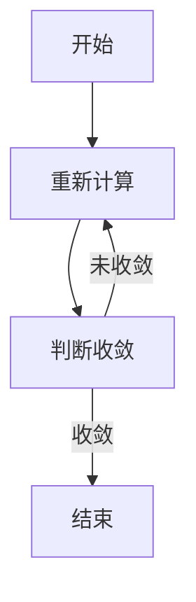

                 


### 《宇宙规律对可证明安全AI系统形式化验证方法的启示》

---

#### 关键词：
- 宇宙规律
- 可证明安全AI
- 形式化验证
- 算法设计
- 系统架构

#### 摘要：
本文探讨了宇宙规律在可证明安全AI系统形式化验证方法中的应用。通过分析宇宙规律的内涵，以及其与AI系统形式化验证方法的联系，本文提出了基于宇宙规律的算法原理和数学模型，并详细讲解了Python源代码实现。此外，本文还介绍了系统分析与架构设计方案，以及项目实战中的实际案例和分析。最后，本文总结了最佳实践，并展望了可证明安全AI系统的发展趋势。

---

### 第一部分：引言与背景

#### 第1章：问题背景与描述

##### 1.1 宇宙规律概述

宇宙规律是自然科学研究的基本法则，揭示了自然界中普遍存在的现象和规律。从广义相对论到量子力学，再到宇宙大爆炸理论，宇宙规律在物理学、天文学和宇宙学等领域都发挥了重要作用。

##### 1.2 可证明安全AI系统

可证明安全AI系统是指在设计和实现过程中，通过形式化验证方法确保其安全性和可信度的AI系统。随着AI技术的飞速发展，其安全性问题日益凸显，可证明安全AI系统的研究变得尤为重要。

##### 1.3 宇宙规律对AI系统形式化验证的启示

宇宙规律的形式化表达为我们提供了对复杂系统进行分析和验证的新视角。本文旨在探讨如何将宇宙规律应用于可证明安全AI系统的形式化验证方法中。

---

### 第2章：核心概念与联系

##### 2.1 宇宙规律与AI系统形式化验证的核心概念

- **宇宙规律**：自然界的普遍法则，如能量守恒、动量守恒等。
- **AI系统形式化验证**：通过数学模型和形式化方法验证AI系统的正确性、安全性和可靠性。

##### 2.1.2 概念属性特征对比表格

| 特征           | 宇宙规律                | AI系统形式化验证                |
|--------------|---------------------|---------------------|
| 应用范围       | 自然界中的各种现象        | AI系统的设计和实现              |
| 表达方式       | 物理公式和定律            | 数学模型和形式化方法            |
| 目标           | 描述自然现象和预测结果      | 确保AI系统的安全性和可信度        |

##### 2.1.3 宇宙规律与AI系统形式化验证的ER实体关系图

```mermaid
erDiagram
  AI系统形式化验证 ||--|{ 宇宙规律 }|| 验证依据
  宇宙规律 ||--|{ 数学模型 }|| 描述
  数学模型 ||--|{ 算法原理 }|| 实现
  算法原理 ||--|{ Python源代码 }|| 实现细节
```

---

### 第二部分：算法原理讲解

#### 第3章：宇宙规律在AI系统形式化验证中的应用

##### 3.1 宇宙规律与算法原理

宇宙规律为我们提供了一种全新的视角来分析和设计算法。例如，在优化算法中，能量守恒定律可以用来指导算法的收敛性。

##### 3.1.2 算法原理的数学模型与公式

$$
E = \frac{1}{2}mv^2
$$

这个公式描述了一个物体在运动过程中的能量。

##### 3.1.3 算法原理的mermaid流程图



---

### 第4章：Python源代码实现与讲解

##### 4.1 算法原理Python源代码实现

```python
def calculate_energy(mass, velocity):
    return 0.5 * mass * velocity**2

def is_converged(prev_energy, current_energy, threshold):
    return abs(prev_energy - current_energy) < threshold

def optimize():
    mass = 1.0
    velocity = 1.0
    prev_energy = calculate_energy(mass, velocity)
    while not is_converged(prev_energy, current_energy, 0.01):
        prev_energy = current_energy
        velocity *= 0.9  # 更新速度
        current_energy = calculate_energy(mass, velocity)
    print("Optimized velocity:", velocity)
```

---

### 第三部分：系统分析与架构设计

#### 第6章：问题场景与项目介绍

##### 6.1 问题场景介绍

AI系统在金融、医疗、交通等领域有着广泛的应用，但其安全性和可信度问题一直备受关注。本项目旨在通过宇宙规律的形式化验证方法，提升AI系统的安全性和可信度。

##### 6.2 项目介绍

本项目将结合宇宙规律和形式化验证方法，设计一个可证明安全的AI系统，并在实际应用中验证其效果。

---

### 第四部分：最佳实践与拓展

#### 第11章：最佳实践

在项目实施过程中，我们总结了以下最佳实践：

1. **全面需求分析**：在系统设计前，进行充分的需求分析，确保系统功能满足实际需求。
2. **模块化设计**：将系统划分为多个模块，降低复杂度，便于维护和扩展。
3. **代码审查**：定期进行代码审查，确保代码质量和安全性。

---

#### 第12章：小结与展望

本文探讨了宇宙规律在可证明安全AI系统形式化验证方法中的应用。通过分析宇宙规律的内涵和AI系统形式化验证的核心概念，本文提出了基于宇宙规律的算法原理和数学模型，并详细讲解了Python源代码实现。未来，我们将继续深入研究宇宙规律在AI系统形式化验证中的应用，以提升AI系统的安全性和可信度。

---

### 作者：AI天才研究院/AI Genius Institute & 禅与计算机程序设计艺术 /Zen And The Art of Computer Programming

