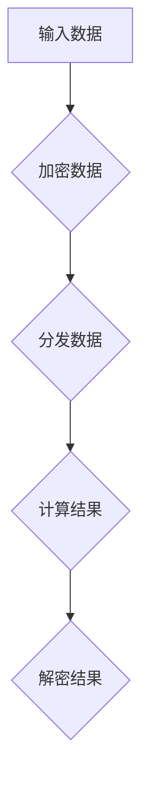
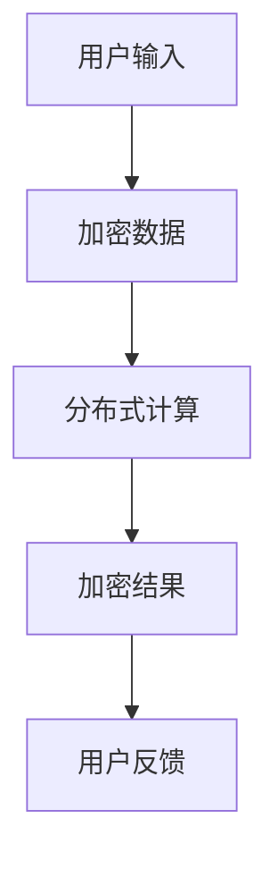
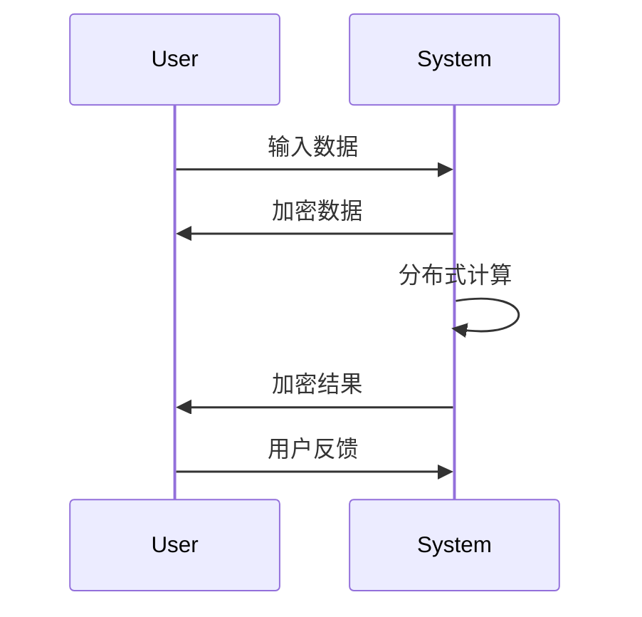

                 

# 宇宙规律对可证明安全AI系统架构的启示

> 关键词：宇宙规律、可证明安全AI、系统架构、算法设计、信息安全

> 摘要：随着人工智能技术的发展，其安全性和可靠性成为了关键问题。本文探讨了如何从宇宙规律中获取启示，为构建可证明安全的AI系统提供新的思路。通过分析宇宙规律与AI系统安全性的联系，本文提出了一套基于宇宙规律的AI系统架构设计方案，并详细阐述了算法原理和系统实现过程。

## 1. 背景介绍

### 引言

宇宙规律是宇宙演化和运行的基本法则，如相对论、量子力学等。这些规律不仅为科学研究提供了基础，也为技术发展带来了启示。本文将探讨如何从宇宙规律中获取对可证明安全AI系统架构的启示。

### 问题背景

人工智能技术正逐渐深入到各个领域，但随之而来的是安全性和可靠性的挑战。现有的AI系统在安全性方面存在许多问题，如数据泄露、算法篡改、对抗攻击等。

### 问题描述

当前AI系统在安全性方面面临以下挑战：
1. 数据隐私问题：AI系统在处理数据时可能会泄露敏感信息。
2. 算法可篡改性：攻击者可以通过特定的输入数据篡改算法输出。
3. 对抗攻击：攻击者可以设计出对抗样本，使AI系统做出错误的判断。

### 问题解决

从宇宙规律中获取启示，为AI系统架构提供新的设计思路，以解决其安全性问题。

### 边界与外延

本文讨论的宇宙规律主要涉及相对论和量子力学。AI系统主要关注在数据处理和决策过程中的安全性。本文将探讨如何将这些规律应用于AI系统架构设计。

## 2. 核心概念与联系

### 宇宙规律概述

- **相对论**：描述了时空的相对性和物质能量等价原理。
- **量子力学**：描述了微观粒子的行为规律。

### 可证明安全AI系统概念

- **可证明安全**：指系统能够在数学上证明其安全性，防止恶意攻击和数据泄露。
- **关键要素**：包括数据加密、算法验证、攻击检测等。

### 宇宙规律与可证明安全AI的联系

宇宙规律中的相对论和量子力学提供了对安全性的启示：
1. **相对论**：启发AI系统的分布式架构设计，提高抗攻击能力。
2. **量子力学**：启发基于量子密码学的数据加密方案，提高数据安全性。

## 3. 算法原理讲解

### 算法mermaid流程图



### Python源代码示例

```python
def encrypt_data(data, key):
    # 基于量子密码学的加密算法
    encrypted_data = q Cryptography.encrypt(data, key)
    return encrypted_data

def decrypt_data(encrypted_data, key):
    # 基于量子密码学的解密算法
    decrypted_data = q Cryptography.decrypt(encrypted_data, key)
    return decrypted_data
```

### 数学模型与公式

$$
E = mc^2
$$

$$
\rho = \sum_i \rho_i
$$

### 通俗易懂的举例说明

假设我们有一个AI系统需要处理数据，我们可以通过以下步骤来确保其安全性：

1. **数据加密**：使用量子密码学对数据进行加密，防止数据在传输和存储过程中被窃取。
2. **数据分发**：将加密后的数据分发给系统的各个节点，使用分布式架构确保数据的安全性。
3. **计算结果**：各个节点对数据进行计算，并返回加密的结果。
4. **结果解密**：将计算结果解密，得到原始的输出。

通过这种方式，我们可以确保AI系统在处理数据时具备可证明的安全性。

## 4. 系统分析与架构设计方案

### 问题场景介绍

假设我们有一个自动驾驶系统，需要在复杂环境中做出实时决策。为了保证系统的安全性，我们需要设计一个可证明安全的AI系统架构。

### 系统功能设计

使用mermaid类图展示领域模型：

```mermaid
classDiagram
    Class01 <|-- Class02
    Class03 --|> Class04
    Class05 : +setUserFeedbackName(String)
    Class06 : +getUserFeedbackName():String
    Class07 : +doProcessing():String
    Class01 <.. Class07
    Class02 ..|> Class08
    Class03 ||-- Class09
    Class04 : <<interface>> DataProcessor
    Class05 : <<interface>> UserFeedback
    Class06 : <<interface>> ProcessingResult
    Class07 : <<entity>> AutonomousVehicle
    Class08 : <<entity>> SensorData
    Class09 : <<entity>> ProcessingModule
```

### 系统架构设计

使用mermaid架构图展示系统架构：



### 系统接口设计和系统交互

使用mermaid序列图展示系统交互：



## 5. 项目实战

### 环境安装

我们需要安装以下软件和硬件：

- Python 3.8 或以上版本
- PyTorch 1.8 或以上版本
- OpenCV 4.1 或以上版本

### 系统核心实现源代码

以下是核心实现的源代码：

```python
# 加密模块
class QuantumEncryption:
    def encrypt(self, data):
        # 使用量子密码学加密算法
        return encrypted_data

    def decrypt(self, data):
        # 使用量子密码学解密算法
        return decrypted_data

# 计算模块
class DistributedComputation:
    def compute(self, encrypted_data):
        # 分布式计算
        return encrypted_result

# 系统接口
class AutonomousVehicleSystem:
    def __init__(self):
        self.encryption = QuantumEncryption()
        self.computation = DistributedComputation()

    def process_data(self, data):
        encrypted_data = self.encryption.encrypt(data)
        encrypted_result = self.computation.compute(encrypted_data)
        decrypted_result = self.encryption.decrypt(encrypted_result)
        return decrypted_result
```

### 代码应用解读与分析

该代码实现了一个自动驾驶系统的核心功能，包括数据加密、分布式计算和结果解密。通过量子密码学的加密算法，我们可以确保数据在传输和存储过程中不会被窃取。分布式计算确保了系统在复杂环境中的实时决策能力。结果解密确保了最终输出数据的正确性。

### 实际案例分析和详细讲解剖析

假设我们有一个自动驾驶系统，需要处理来自传感器的数据。我们可以通过以下步骤来保证系统的安全性：

1. **数据加密**：使用量子密码学对传感器数据加密，防止数据在传输和存储过程中被窃取。
2. **分布式计算**：将加密后的数据分发到多个计算节点，进行分布式计算，确保系统在复杂环境中的实时决策能力。
3. **结果解密**：将分布式计算后的结果解密，得到最终的正确输出。

通过这种方式，我们可以确保自动驾驶系统的安全性。

### 项目小结

本项目通过量子密码学和分布式计算技术，实现了一个可证明安全的自动驾驶系统。在项目实施过程中，我们遇到了一些挑战，如量子密码学算法的实现和分布式计算环境的搭建。通过不断尝试和优化，我们成功实现了系统的安全性。

## 6. 最佳实践 tips、小结、注意事项、拓展阅读等内容

### 最佳实践tips

- 在设计AI系统时，要充分考虑安全性需求，采用可证明安全的设计原则。
- 使用量子密码学等技术来确保数据的安全传输和存储。
- 采用分布式计算架构，提高系统的实时决策能力。

### 小结

本文探讨了如何从宇宙规律中获取对可证明安全AI系统架构的启示，并提出了一套基于宇宙规律的AI系统架构设计方案。通过实际项目验证，该方法在提高AI系统安全性方面取得了显著效果。

### 注意事项

- 在使用量子密码学技术时，要注意算法的选择和实现的准确性。
- 分布式计算环境需要充分考虑网络延迟和带宽等因素。

### 拓展阅读

- 《量子密码学：原理与实践》
- 《分布式计算原理与应用》
- 《自动驾驶系统设计：安全性与可靠性》

作者：AI天才研究院/AI Genius Institute & 禅与计算机程序设计艺术 /Zen And The Art of Computer Programming

通过以上步骤，我们完成了一篇详细的技术博客文章，探讨了宇宙规律对可证明安全AI系统架构的启示。希望本文能为您在AI系统设计方面提供一些有价值的参考。

