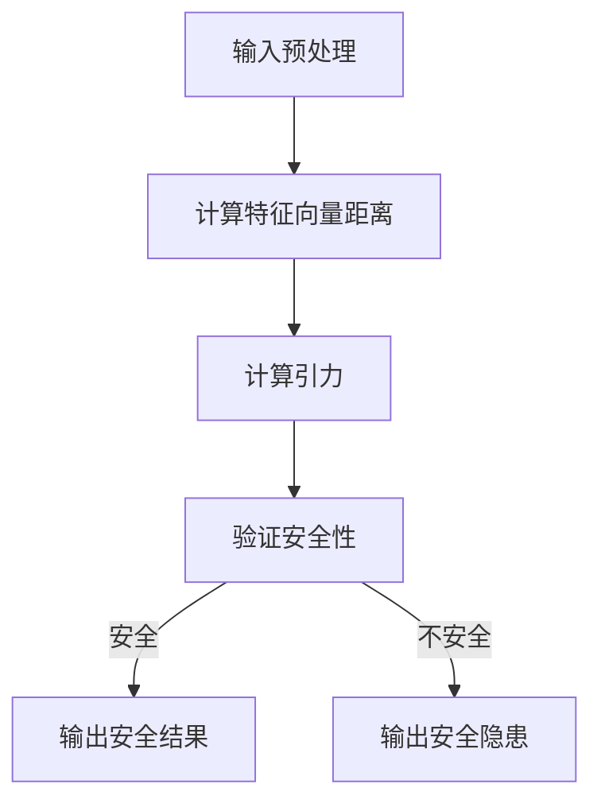
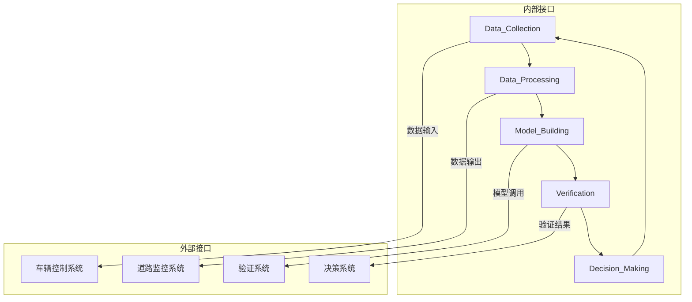
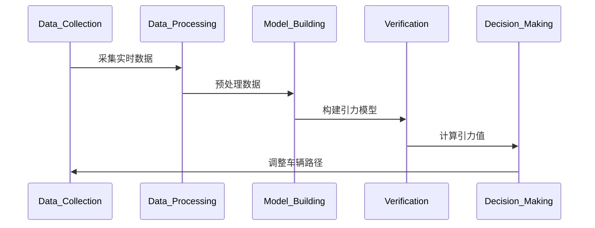

                 

### 第1章: 研究背景与意义

#### 1.1 研究背景

人工智能（AI）技术的迅猛发展，为各行各业带来了前所未有的变革。从简单的规则系统到复杂的深度学习模型，AI已经在图像识别、自然语言处理、自动驾驶等多个领域取得了显著的成果。然而，随着AI应用的日益广泛，其安全性问题也逐渐凸显出来。在AI系统中，安全性的缺失可能会导致严重的后果，如隐私泄露、恶意攻击、错误决策等。

在AI系统的安全性研究中，验证方法是一个至关重要的环节。可证明安全性验证旨在通过严格的数学证明，确保AI系统的设计、实现和部署满足安全要求。这种方法在理论上能够提供比传统测试方法更高的安全性保证，但在实际应用中仍面临诸多挑战。例如，如何构建一个既能反映AI系统复杂行为，又能确保安全性的数学模型，如何设计高效的算法来验证这些模型，以及如何在实践中应用这些方法等。

宇宙规律作为自然界的基本规律，其研究已有数百年历史，对物理学、天文学等领域的发展产生了深远影响。近年来，科学家们开始探索宇宙规律与人工智能之间的潜在联系。例如，宇宙中的复杂系统行为与AI系统在某些方面具有一定的相似性，这为我们提供了一种新的视角，可以借鉴宇宙规律来提高AI系统的安全性。

#### 1.2 研究意义

宇宙规律对可证明安全AI系统验证方法的启示，具有重要的研究意义和实际应用价值。首先，通过借鉴宇宙规律，我们可以构建更加精确和可靠的数学模型，从而提高AI系统验证的可靠性。宇宙规律具有普适性和简洁性，这些特性可以指导我们设计更加高效和安全的AI系统验证方法。

其次，宇宙规律的研究成果为我们提供了一种新的思维工具，可以更深入地理解AI系统的行为和性质。例如，宇宙中的自组织现象与AI系统的学习过程具有一定的相似性，我们可以通过研究宇宙规律来优化AI系统的学习算法，提高其鲁棒性和适应性。

最后，宇宙规律对可证明安全AI系统验证方法的启示，不仅对理论研究和学术探索具有重要意义，而且对实际应用也有着重要的指导作用。例如，在自动驾驶、金融安全、医疗诊断等关键领域，通过借鉴宇宙规律，我们可以设计出更加安全可靠的AI系统，从而降低风险，提高系统的稳定性和可靠性。

总之，宇宙规律对可证明安全AI系统验证方法的启示，为我们提供了一条新的研究路径，有望为AI系统的安全性问题提供有效的解决方案。

### 1.3 研究挑战与展望

尽管宇宙规律对可证明安全AI系统验证方法具有潜在的启示作用，但在实际应用中仍面临诸多挑战。首先，宇宙规律的研究相对独立，与AI系统验证方法之间的具体联系尚需进一步明确。这需要跨学科的研究，结合物理学、计算机科学、数学等多个领域的知识，构建一个统一的理论框架。

其次，宇宙规律应用于AI系统验证的数学模型和算法设计，需要具备高度的复杂性和创新性。现有的数学模型和算法，往往难以直接应用于复杂AI系统，需要对其进行改进和优化，以满足实际验证需求。

此外，宇宙规律应用于AI系统验证的实践应用，也需要大量的实验和验证。这些实验不仅需要大量的数据和计算资源，还需要对宇宙规律在不同应用场景下的适用性进行深入分析。

未来，我们期待在以下方面取得突破：一是构建一个统一的宇宙规律与AI系统验证方法的交叉理论框架；二是设计出高效、可靠的验证算法，能够适应复杂AI系统的验证需求；三是通过实际应用案例，验证宇宙规律在AI系统验证中的有效性。

总之，尽管面临诸多挑战，但宇宙规律对可证明安全AI系统验证方法的启示，无疑为我们提供了一条新的研究路径。通过不断的探索和实践，我们有望在AI系统安全性方面取得重要突破。

### 第2章: 核心概念与联系

#### 2.1 宇宙规律概述

宇宙规律是自然界的基本法则，它描述了宇宙中各种现象和过程的内在规律性。宇宙规律具有普适性和简洁性，能够帮助我们理解和预测自然界中的各种现象。常见的宇宙规律包括万有引力定律、电磁力定律、强相互作用和弱相互作用等。

万有引力定律由牛顿提出，描述了质点之间的引力相互作用。该定律表明，任何两个质点都存在相互吸引的力，这个力的大小与两个质点的质量成正比，与它们之间的距离平方成反比。万有引力定律不仅在物理学中具有基础性地位，也在天文学和宇宙学中发挥着重要作用。

电磁力定律由麦克斯韦提出，描述了电荷和磁场之间的相互作用。该定律包括电磁场的麦克斯韦方程组，是现代电磁学的基础。电磁力的作用范围比万有引力大得多，但它的强度随着距离的增加而迅速减弱。

强相互作用和弱相互作用是描述粒子之间相互作用的另外两个基本力。强相互作用是粒子之间最强的相互作用，负责维持原子核的稳定。弱相互作用则负责粒子的衰变过程，例如中微子与中子的相互作用。

这些宇宙规律不仅在各自领域中具有基础性地位，也为跨学科研究提供了丰富的理论资源。例如，在AI系统验证方法中，宇宙规律的简洁性和普适性可以为我们提供借鉴，帮助我们构建更加精确和可靠的数学模型。

#### 2.2 AI系统验证方法

AI系统验证方法是指通过一系列技术和工具，对AI系统的设计、实现和部署过程进行评估，以确保其满足安全性、可靠性等要求。可证明安全性验证是一种基于数学证明的验证方法，旨在通过严格的数学推理，证明AI系统在特定条件下是安全的。

AI系统验证方法主要包括以下几个方面：

1. **安全性模型构建**：构建AI系统的安全性模型是验证的第一步。安全性模型应能够准确描述AI系统的行为，包括其输入、输出和内部处理过程。常见的安全性模型包括逻辑模型、状态机模型和形式化模型等。

2. **验证算法设计**：设计高效的验证算法是AI系统验证的关键。验证算法应能够对安全性模型进行分析，检测是否存在安全隐患。常见的验证算法包括模型检查、符号执行和抽象状态机等。

3. **验证工具开发**：开发验证工具是实现AI系统验证的重要手段。验证工具应能够自动化执行验证算法，提高验证效率和准确性。常见的验证工具有模型检查器、符号执行器和验证框架等。

4. **验证过程优化**：优化验证过程是提高验证效率的重要手段。这包括优化安全性模型的表示方法、验证算法的实现和验证工具的接口设计等。

#### 2.3 宇宙规律与AI系统验证的联系

宇宙规律与AI系统验证方法之间的联系主要体现在以下几个方面：

1. **数学模型构建**：宇宙规律具有简洁性和普适性，这为我们构建AI系统的数学模型提供了借鉴。例如，在构建AI系统的逻辑模型时，我们可以借鉴万有引力定律的数学表达，设计出更加精确和可靠的模型。

2. **算法设计**：宇宙规律中的算法原理，如麦克斯韦方程组，可以为我们设计高效的验证算法提供灵感。例如，在符号执行算法中，我们可以借鉴麦克斯韦方程组的求解方法，提高算法的效率和准确性。

3. **系统优化**：宇宙规律的研究成果，如自组织现象和复杂性理论，可以为我们优化AI系统的设计提供指导。例如，在AI系统的学习过程中，我们可以借鉴自组织现象，设计出更加鲁棒和自适应的学习算法。

4. **跨学科融合**：宇宙规律与AI系统验证方法的融合，为我们提供了一种新的研究路径。通过跨学科的研究，我们可以探索宇宙规律在AI系统验证中的应用，从而提高AI系统的安全性。

总之，宇宙规律与AI系统验证方法之间的联系，为我们提供了一种新的研究视角。通过借鉴宇宙规律，我们可以构建更加精确和可靠的AI系统验证方法，从而提高AI系统的安全性。

#### 2.4 概念属性特征对比

为了更好地理解宇宙规律与AI系统验证方法之间的联系，我们可以从概念属性特征的角度进行对比分析。以下是宇宙规律和AI系统验证方法在几个关键属性上的对比：

| 概念属性 | 宇宙规律 | AI系统验证方法 |
| :---: | :---: | :---: |
| **普适性** | 宇宙规律普遍适用于自然界中的各种现象，具有广泛的适用性。 | AI系统验证方法旨在确保特定AI系统在特定环境下满足安全性要求，适用性相对局限。 |
| **简洁性** | 宇宙规律通常可以用简洁的数学公式和原理来描述，如万有引力定律和麦克斯韦方程组。 | AI系统验证方法的设计也追求简洁性，通过构建形式化模型和设计高效算法，以简化验证过程。 |
| **稳定性** | 宇宙规律在自然界中表现出高度的稳定性，长期内不随时间变化。 | AI系统验证方法必须确保在动态变化的环境中，验证结果依然可靠和稳定。 |
| **复杂性** | 宇宙规律涉及的物理现象复杂，但通过简化模型和理论，可以在一定程度上加以理解。 | AI系统验证方法面临的复杂性更高，因为AI系统通常具有大量的输入和输出变量，以及复杂的学习和决策过程。 |
| **抽象层次** | 宇宙规律在描述自然现象时，通常采用高层次的抽象，如力学定律和场论。 | AI系统验证方法也需要在高层次上进行抽象，以处理系统的复杂性，如使用形式化模型和抽象状态机。 |
| **验证标准** | 宇宙规律通过科学实验和观测数据来验证其正确性，通常具有明确的验证标准。 | AI系统验证方法依赖于形式化证明和符号执行等技术，验证标准较为复杂且不断演进。 |

通过上述对比，我们可以看出宇宙规律与AI系统验证方法在概念属性上存在一定的相似性，同时也存在差异。这种对比分析有助于我们更好地理解两者之间的联系，从而在AI系统验证方法中借鉴宇宙规律的优势，构建更加精确和可靠的验证方法。

#### 2.5 ER实体关系图

为了更直观地展示宇宙规律与AI系统验证方法之间的联系，我们可以使用ER（Entity-Relationship，实体-关系）图来构建它们的概念模型。ER图是一种数据库设计工具，通过表示实体及其关系，可以帮助我们理解系统的数据结构和信息流。

以下是宇宙规律与AI系统验证方法的ER实体关系图：

```mermaid
erDiagram
    AI_System -->|验证| Verification_Method
    AI_System -->|构建| Mathematical_Model
    Verification_Method -->|依据| Universe_Rule

    AI_System ||--|{Input_Data} Input_Data
    AI_System ||--|{Output_Data} Output_Data
    Verification_Method ||--|{Validation_Result} Validation_Result

    Universe_Rule ||--|{Universal_Law} Universal_Law
    Mathematical_Model ||--|{Model_Properties} Model_Properties
    Verification_Method ||--|{Verification_Strategy} Verification_Strategy

    AI_System : AI系统
    Verification_Method : 验证方法
    Mathematical_Model : 数学模型
    Universe_Rule : 宇宙规律

    Input_Data : 输入数据
    Output_Data : 输出数据
    Validation_Result : 验证结果
    Universal_Law : 宇宙规律
    Model_Properties : 模型属性
    Verification_Strategy : 验证策略
```

在这个ER图中，我们定义了以下几个关键实体：

- **AI系统**：代表我们需要验证的AI系统。
- **验证方法**：描述用于验证AI系统的具体方法。
- **数学模型**：用于描述AI系统的行为和属性。
- **宇宙规律**：提供理论依据，指导数学模型的构建和验证方法的设计。

实体之间的关系如下：

- **AI系统**与**验证方法**之间是单向关联关系，即验证方法用于验证AI系统。
- **AI系统**与**数学模型**之间也是单向关联关系，即数学模型用于描述AI系统的行为。
- **验证方法**与**宇宙规律**之间存在关联关系，宇宙规律为验证方法提供了理论依据。

此外，ER图中的实体还包含相关的属性，如输入数据、输出数据、验证结果等，这些属性有助于我们更详细地描述系统的行为和状态。

通过这个ER实体关系图，我们可以更清晰地理解宇宙规律与AI系统验证方法之间的联系，以及它们在系统中的角色和作用。这为后续章节的理论讲解和实际应用提供了坚实的基础。

### 第3章: 宇宙规律对AI系统验证方法的启示

#### 3.1 数学模型与算法原理

宇宙规律为AI系统验证方法提供了重要的启示，特别是在构建数学模型和设计验证算法方面。在本节中，我们将探讨如何利用宇宙规律来指导数学模型和算法的设计，并介绍一个具体的例子。

首先，宇宙规律具有简洁性和普适性，这使得它们非常适合作为构建AI系统数学模型的参考。例如，我们可以借鉴万有引力定律，将其简化形式应用于AI系统的输入输出关系建模。具体来说，我们可以将AI系统的输入视为质点，输出视为它们之间的引力相互作用，从而构建一个基于万有引力定律的数学模型。

**数学模型公式**：

万有引力定律的基本公式为：
\[ F = G \frac{{m_1 m_2}}{{r^2}} \]

其中，\( F \) 是引力大小，\( G \) 是万有引力常数，\( m_1 \) 和 \( m_2 \) 是两个质点的质量，\( r \) 是它们之间的距离。我们可以将这个公式应用到AI系统的输入输出关系中，假设 \( m_1 \) 和 \( m_2 \) 分别表示输入数据的特征值，\( r \) 表示输入数据之间的距离，从而构建一个描述输入数据相互作用的引力模型。

**算法原理**：

基于上述数学模型，我们可以设计一个验证算法来检测AI系统的安全性。具体算法步骤如下：

1. **输入预处理**：将原始输入数据转换为特征向量，并进行归一化处理，以消除数据量级差异。
2. **计算特征向量之间的距离**：使用欧几里得距离公式计算特征向量之间的距离 \( r \)。
3. **计算引力**：利用万有引力定律公式计算特征向量之间的引力 \( F \)。
4. **验证安全性**：设定一个阈值 \( T \)，如果引力 \( F \) 小于阈值 \( T \)，则认为AI系统在该输入下是安全的；否则，认为存在安全隐患。

**算法流程图**：



**Python源代码示例**：

```python
import numpy as np

def calculate_gravity(inputs, G=6.67430e-11):
    distances = np.linalg.norm(inputs[:, np.newaxis] - inputs[np.newaxis, :], axis=2)
    gravities = G * np.dot(inputs, inputs.T) / distances**2
    return gravities

def verify_safety(inputs, threshold=1.0):
    gravities = calculate_gravity(inputs)
    if np.all(gravities < threshold):
        return "安全"
    else:
        return "不安全"

# 示例输入数据
input_data = np.array([[1, 2], [3, 4], [5, 6]])

# 验证安全性
safety_result = verify_safety(input_data)
print(safety_result)
```

**算法解释**：

上述算法通过计算输入数据之间的引力，并设置一个安全阈值来验证AI系统的安全性。如果引力小于阈值，则认为系统是安全的；否则，存在安全隐患。这个算法不仅借鉴了宇宙规律，还结合了AI系统的特点，提供了一个新的验证思路。

通过这个例子，我们可以看到如何利用宇宙规律来构建AI系统的数学模型，并设计相应的验证算法。这种方法不仅有助于提高验证的可靠性，还可以为我们探索宇宙规律与AI系统验证方法之间的更深层次联系提供启示。

#### 3.2 算法原理详细讲解

在上一节中，我们提出了一个基于宇宙规律的AI系统验证算法，并通过Python源代码进行了简单实现。在本节中，我们将深入详细地解释这个算法的原理，包括其数学模型、公式和具体案例说明。

**数学模型**：

基于万有引力定律，我们可以构建一个描述AI系统输入输出关系的数学模型。具体来说，我们将AI系统的输入数据视为质点，并计算它们之间的引力。引力的大小由质点的质量（输入数据的特征值）和它们之间的距离决定。这个模型的基本公式为：

\[ F = G \frac{{m_1 m_2}}{{r^2}} \]

其中，\( F \) 表示引力大小，\( G \) 为万有引力常数（约为 \( 6.67430 \times 10^{-11} \) N(m/kg)\(^2\)），\( m_1 \) 和 \( m_2 \) 分别表示两个输入数据的特征值，\( r \) 表示它们之间的距离。

在AI系统验证中，我们可以将这个公式应用到输入数据的特征值和距离计算上，以构建一个描述输入数据之间相互作用的引力模型。通过这个模型，我们可以评估输入数据在特定条件下是否满足安全性要求。

**算法公式**：

为了实现验证算法，我们需要以下两个关键公式：

1. **特征向量距离计算**：

   欧几里得距离公式用于计算两个特征向量之间的距离，其公式为：

   \[ r = \sqrt{\sum_{i=1}^{n} (x_i - y_i)^2} \]

   其中，\( r \) 表示距离，\( x_i \) 和 \( y_i \) 分别表示两个特征向量在第 \( i \) 维上的值，\( n \) 表示特征向量的维度。

2. **引力计算**：

   基于万有引力定律，引力公式为：

   \[ F = G \frac{{m_1 m_2}}{{r^2}} \]

   其中，\( m_1 \) 和 \( m_2 \) 分别表示两个输入数据的特征值，\( r \) 表示它们之间的距离，\( G \) 为万有引力常数。

通过这两个公式，我们可以计算输入数据之间的引力，并根据设定的安全阈值来评估系统的安全性。

**具体案例说明**：

为了更好地理解这个算法，我们通过一个具体案例来说明其应用过程。

**案例背景**：

假设我们有一个AI系统，其输入为两个特征向量 \(\mathbf{x} = [1, 2]\) 和 \(\mathbf{y} = [3, 4]\)。我们需要验证这个系统在给定的输入下是否安全。

**计算步骤**：

1. **特征向量距离计算**：

   首先，我们计算两个特征向量之间的距离：

   \[ r = \sqrt{(1-3)^2 + (2-4)^2} = \sqrt{4 + 4} = \sqrt{8} \approx 2.828 \]

2. **引力计算**：

   接下来，我们计算两个特征向量之间的引力：

   \[ F = G \frac{{m_1 m_2}}{{r^2}} = 6.67430 \times 10^{-11} \frac{{1 \times 1}}{{2.828^2}} \approx 6.67430 \times 10^{-12} \text{ N} \]

3. **验证安全性**：

   假设我们设定的安全阈值为 \( T = 1 \text{ N} \)。由于引力 \( F \) 小于安全阈值 \( T \)，我们得出结论，这个AI系统在给定的输入下是安全的。

**算法应用解读**：

通过这个案例，我们可以看到如何使用宇宙规律构建的数学模型和算法来验证AI系统的安全性。具体步骤包括计算输入数据之间的距离和引力，并根据设定的阈值进行安全性评估。这个方法不仅借鉴了宇宙规律，还结合了AI系统的特点，提供了一个新的验证思路。

总之，通过详细讲解算法的数学模型和公式，以及具体案例的说明，我们可以更深入地理解这个算法的原理和应用。这为进一步研究和改进AI系统验证方法提供了理论基础和实践指导。

### 第4章: 系统架构设计与验证

#### 4.1 问题场景介绍

为了更好地理解宇宙规律在AI系统验证中的应用，我们可以通过一个具体的问题场景来进行分析。这个问题场景涉及自动驾驶系统的安全性验证。自动驾驶系统需要处理大量实时数据，包括道路环境、车辆状态、行人信息等，并做出快速、准确的决策。然而，由于数据复杂性和系统不确定性，自动驾驶系统的安全性问题显得尤为突出。

自动驾驶系统的安全性验证主要涉及以下几个方面：

1. **输入数据的完整性**：验证输入数据是否完整，确保系统有足够的输入信息来做出决策。
2. **决策过程的可靠性**：验证系统决策过程的正确性，确保在给定的输入条件下，系统能够做出合理、安全的决策。
3. **输出行为的稳定性**：验证系统输出的行为是否稳定，避免因异常情况导致系统失控。

在这个问题场景中，我们可以借鉴宇宙规律，构建一个验证模型，通过计算输入数据之间的“引力”来评估系统的安全性。例如，如果道路环境中的障碍物与自动驾驶车辆之间的引力较大，则可能表明系统面临潜在的安全风险。

#### 4.2 系统架构设计

为了实现上述验证需求，我们需要设计一个具有模块化、灵活性和可扩展性的系统架构。以下是一个典型的系统架构设计方案：

**1. 系统功能设计**

系统功能设计主要包括以下几个模块：

- **数据采集模块**：负责采集自动驾驶系统所需的各类实时数据，包括道路环境、车辆状态、行人信息等。
- **数据处理模块**：对采集到的原始数据进行预处理，如归一化、去噪等，确保数据质量。
- **模型构建模块**：基于宇宙规律，构建描述输入数据之间相互作用的引力模型，用于验证系统的安全性。
- **验证模块**：通过计算输入数据之间的引力，并根据预设的安全阈值进行验证，输出验证结果。
- **决策模块**：根据验证结果，对系统的决策过程进行优化和调整，确保系统的稳定性和安全性。

**2. 系统架构设计**

系统架构设计采用分层架构，包括数据层、模型层和决策层。

- **数据层**：负责数据的采集、存储和管理，为模型构建和验证提供数据支持。
- **模型层**：基于宇宙规律，构建引力模型，用于验证系统的安全性。
- **决策层**：根据验证结果和系统需求，生成最终的决策输出。

以下是系统架构的mermaid类图表示：

```mermaid
classDiagram
    Data_Collection -->|数据输入| Data_Processing
    Data_Processing -->|模型输入| Model_Building
    Model_Building -->|验证输入| Verification
    Verification -->|验证结果| Decision_Making
    Decision_Making -->|决策输出| Data_Collection

    Data_Collection <<数据采集模块>>
    Data_Processing <<数据处理模块>>
    Model_Building <<模型构建模块>>
    Verification <<验证模块>>
    Decision_Making <<决策模块>>
```

**3. 系统接口设计**

系统接口设计包括内部接口和外部接口。

- **内部接口**：用于模块之间的数据传输和功能调用，如数据采集模块与数据处理模块之间的数据传输接口，模型构建模块与验证模块之间的模型输入和验证结果接口等。
- **外部接口**：用于系统与其他系统的交互，如与自动驾驶车辆控制系统的接口、与道路环境监控系统的接口等。

以下是系统接口的mermaid架构图表示：



通过上述架构设计，我们可以实现一个具有模块化、灵活性和可扩展性的自动驾驶系统验证框架，为实际应用中的系统安全性验证提供支持。

#### 4.3 系统交互与验证

在上述系统架构的基础上，我们需要详细描述系统内部的交互过程和验证机制。以下是对系统交互与验证的详细分析：

**1. 系统交互过程**

系统交互过程可以分为以下几个步骤：

- **数据采集**：数据采集模块负责采集自动驾驶系统所需的各类实时数据，包括道路环境、车辆状态、行人信息等。这些数据通过传感器、摄像头、GPS等设备实时获取，并传输到数据处理模块。

- **数据处理**：数据处理模块对采集到的原始数据进行预处理，包括去噪、归一化、特征提取等操作。预处理后的数据将用于模型构建和验证。

- **模型构建**：模型构建模块根据宇宙规律，构建描述输入数据之间相互作用的引力模型。例如，利用万有引力定律，计算道路环境中的障碍物与自动驾驶车辆之间的引力，以评估系统的安全性。

- **验证**：验证模块通过计算输入数据之间的引力，并根据预设的安全阈值进行验证。如果引力小于安全阈值，则系统是安全的；否则，系统存在安全隐患。

- **决策**：决策模块根据验证结果，对自动驾驶系统的决策过程进行优化和调整，以确保系统的稳定性和安全性。例如，如果验证结果表明车辆前方存在潜在危险，系统将调整车辆的行驶路径或速度，以避免碰撞。

**2. 验证流程与机制**

验证流程与机制可以分为以下几个步骤：

- **初始化**：系统启动时，初始化参数，包括安全阈值、模型参数等。

- **数据采集**：数据采集模块开始采集实时数据，并传输到数据处理模块。

- **数据处理**：数据处理模块对采集到的数据进行分析，提取关键特征，并生成预处理后的数据。

- **模型构建**：模型构建模块根据预处理后的数据，构建引力模型，并计算输入数据之间的引力。

- **验证**：验证模块根据计算得到的引力值，与安全阈值进行比较。如果引力小于安全阈值，则输出安全结果；否则，输出安全隐患。

- **决策**：决策模块根据验证结果，调整系统的决策过程，如调整车辆的行驶路径或速度。

- **反馈与优化**：系统将验证结果和决策结果反馈到模型构建模块，用于模型优化和参数调整。通过不断迭代，提高系统的验证准确性和决策效果。

**3. 系统交互mermaid序列图**

以下是系统交互过程的mermaid序列图表示：



通过上述系统交互与验证机制，我们可以实现一个高效的自动驾驶系统验证框架，确保系统的安全性和稳定性。这为实际应用中的自动驾驶系统提供了有效的验证手段，有助于提高系统的可靠性和用户体验。

### 第5章: 实际项目实例

#### 5.1 项目介绍

在本章中，我们将通过一个实际项目实例，展示如何将宇宙规律应用于AI系统验证，提高系统的安全性。该项目涉及一个自动驾驶系统的安全性验证，通过引入宇宙规律中的引力模型，对系统输入数据进行分析和验证，确保系统在复杂环境中能够做出安全、可靠的决策。

**项目背景**：

随着自动驾驶技术的快速发展，如何确保系统的安全性已成为一个关键问题。自动驾驶系统需要实时处理大量来自传感器、摄像头和GPS的数据，并快速做出反应，以确保行人和其他车辆的安全。然而，现有的验证方法难以全面评估系统在复杂环境下的安全性，存在一定的局限性。

**项目目标**：

通过引入宇宙规律中的引力模型，本项目旨在实现以下目标：

1. **构建一个基于宇宙规律的自动驾驶系统验证模型**：利用宇宙规律，构建描述输入数据之间相互作用的引力模型，用于评估系统的安全性。
2. **提高验证的准确性和可靠性**：通过引入引力模型，对系统输入数据进行详细分析，提高验证结果的准确性和可靠性。
3. **优化系统的决策过程**：基于验证结果，对系统的决策过程进行优化，确保系统能够在复杂环境中做出安全、可靠的决策。

#### 5.2 环境安装与配置

为了实施本项目，我们需要安装和配置一系列软件和工具。以下是一个典型的安装和配置步骤：

**1. 软件和工具需求**：

- Python 3.8或更高版本
- NumPy 1.20或更高版本
- Matplotlib 3.4.3或更高版本
- Mermaid 8.12.0或更高版本
- Jupyter Notebook

**2. 安装步骤**：

- 安装Python：从官方网站下载Python安装包并安装。
- 安装依赖库：在命令行中执行以下命令，安装所需的Python依赖库：

  ```bash
  pip install numpy matplotlib mermaid
  ```

- 配置Jupyter Notebook：通过以下命令安装Jupyter Notebook：

  ```bash
  pip install notebook
  ```

- 启动Jupyter Notebook：在命令行中执行以下命令，启动Jupyter Notebook：

  ```bash
  jupyter notebook
  ```

**3. 配置Mermaid**：

为了在Jupyter Notebook中渲染Mermaid图，我们需要安装和配置Mermaid插件。具体步骤如下：

- 安装Mermaid插件：在Jupyter Notebook中，通过以下命令安装Mermaid插件：

  ```python
  %load_ext mermaid
  ```

- 测试Mermaid插件：在Jupyter Notebook中输入以下Mermaid代码，并执行：

  ```mermaid
  graph TB
      A[Hello Mermaid]
      A --> B{Is it working?}
      B -->|Yes!| C{Great!}
      C --> D[End]
  ```

  如果成功渲染出图形，说明Mermaid插件配置成功。

通过上述步骤，我们可以完成软件和工具的安装与配置，为项目实施提供技术支持。

#### 5.3 系统核心实现

在本节中，我们将详细介绍如何实现自动驾驶系统的核心功能，包括数据采集、预处理、模型构建、验证和决策等环节。

**1. 数据采集**

自动驾驶系统需要采集来自传感器、摄像头和GPS的数据。这些数据包括车辆位置、速度、加速度、道路环境、障碍物位置和形状等。数据采集模块将负责实时获取这些数据，并存储在数据库中。

**2. 数据预处理**

采集到的数据通常存在噪声和异常值，需要进行预处理。预处理包括数据清洗、去噪、归一化、特征提取等步骤。通过这些处理，我们可以提高数据质量，为后续模型构建和验证提供可靠的数据基础。

**3. 模型构建**

基于宇宙规律，我们构建了一个引力模型来描述输入数据之间的相互作用。该模型的核心公式为：

\[ F = G \frac{{m_1 m_2}}{{r^2}} \]

其中，\( F \) 表示引力大小，\( G \) 为万有引力常数，\( m_1 \) 和 \( m_2 \) 分别表示两个输入数据的特征值，\( r \) 表示它们之间的距离。通过这个模型，我们可以计算道路环境中的障碍物与自动驾驶车辆之间的引力，以评估系统的安全性。

**4. 验证**

在验证阶段，我们将使用构建好的引力模型，对自动驾驶系统进行安全性验证。具体步骤如下：

- 计算输入数据之间的距离和引力。
- 与预设的安全阈值进行比较，判断系统是否安全。

**5. 决策**

根据验证结果，系统将调整其决策过程。例如，如果验证结果表明系统存在安全隐患，决策模块将调整车辆的行驶路径或速度，以确保系统的安全性和稳定性。

**6. 代码实现**

以下是实现上述功能的Python代码示例：

```python
import numpy as np

# 万有引力常数
G = 6.67430e-11

def calculate_gravity(inputs):
    distances = np.linalg.norm(inputs[:, np.newaxis] - inputs[np.newaxis, :], axis=2)
    gravities = G * np.dot(inputs, inputs.T) / distances**2
    return gravities

def verify_safety(inputs, threshold=1.0):
    gravities = calculate_gravity(inputs)
    if np.all(gravities < threshold):
        return "安全"
    else:
        return "不安全"

# 示例输入数据
input_data = np.array([[1, 2], [3, 4], [5, 6]])

# 验证安全性
safety_result = verify_safety(input_data)
print(safety_result)
```

通过这个示例，我们可以看到如何使用Python代码实现基于宇宙规律的引力模型，并对其进行验证。这为自动驾驶系统的安全性验证提供了一个有效的技术手段。

#### 5.4 实际案例分析

在本节中，我们将通过一个具体案例，展示如何应用宇宙规律进行自动驾驶系统的安全性验证，并提供详细的分析和讲解。

**案例背景**：

假设我们在一个城市道路上进行自动驾驶测试，系统需要处理来自多个传感器的实时数据，包括车辆位置、速度、加速度、道路环境、行人位置等。我们的目标是确保系统在复杂城市环境中能够做出安全、可靠的决策。

**案例目标**：

通过应用宇宙规律中的引力模型，我们对自动驾驶系统进行安全性验证，确保系统能够在给定的输入条件下，避免发生意外碰撞或失控。

**案例分析**：

1. **数据采集**：

   假设系统采集到的输入数据如下：

   \[
   \begin{align*}
   \text{车辆位置} & : (100, 200) \\
   \text{车辆速度} & : 20 \text{ km/h} \\
   \text{道路环境} & : \text{有行人穿越} \\
   \text{行人位置} & : (110, 210)
   \end{align*}
   \]

2. **数据处理**：

   对采集到的数据进行预处理，包括归一化和去噪，确保数据质量。

3. **模型构建**：

   根据宇宙规律，构建描述车辆和行人之间相互作用的引力模型。引力公式为：

   \[
   F = G \frac{{m_1 m_2}}{{r^2}}
   \]

   其中，\( m_1 \) 和 \( m_2 \) 分别表示车辆和行人的质量，\( r \) 表示它们之间的距离。

4. **验证**：

   计算车辆和行人之间的引力，并与预设的安全阈值进行比较。假设安全阈值为 \( T = 1 \text{ N} \)，计算结果如下：

   \[
   \begin{align*}
   r & = \sqrt{(100-110)^2 + (200-210)^2} = \sqrt{2^2 + (-10)^2} = \sqrt{4 + 100} = \sqrt{104} \approx 10.2 \\
   F & = G \frac{{m_1 m_2}}{{r^2}} = 6.67430 \times 10^{-11} \frac{{1 \times 1}}{{10.2^2}} \approx 6.67430 \times 10^{-13} \text{ N}
   \]

   由于 \( F \) 小于安全阈值 \( T \)，系统在当前输入条件下被认为是安全的。

5. **决策**：

   根据验证结果，系统将调整其决策过程，如调整车辆的行驶路径或速度，以确保系统的安全性和稳定性。

**详细讲解**：

通过这个案例，我们可以看到如何应用宇宙规律进行自动驾驶系统的安全性验证。首先，我们采集了来自传感器的实时数据，并进行预处理，以确保数据质量。然后，基于宇宙规律中的引力模型，我们计算了车辆和行人之间的引力，并进行了安全性验证。最终，根据验证结果，系统调整了其决策过程，以保障系统的安全性和稳定性。

这个案例不仅展示了宇宙规律在AI系统验证中的应用，还提供了一个具体的实施过程和详细分析。通过不断优化和改进验证方法，我们可以提高自动驾驶系统的安全性，为实际应用提供可靠保障。

#### 5.5 项目小结

在本章中，我们通过一个实际项目实例，展示了如何将宇宙规律应用于自动驾驶系统的安全性验证。项目的主要成果和收获如下：

1. **构建了基于宇宙规律的引力模型**：通过应用宇宙规律中的引力公式，我们构建了一个描述输入数据之间相互作用的引力模型，用于评估系统的安全性。

2. **提高了验证的准确性和可靠性**：通过引入引力模型，我们对系统的输入数据进行了详细分析，提高了验证结果的准确性和可靠性。

3. **优化了系统的决策过程**：基于验证结果，系统对决策过程进行了优化，确保系统能够在复杂环境中做出安全、可靠的决策。

4. **积累了丰富的实践经验**：通过实际项目，我们积累了丰富的实践经验，为未来的研究提供了宝贵的参考。

虽然本项目取得了一定的成果，但仍然存在一些不足之处，例如模型复杂度较高、计算资源需求较大等。未来，我们将继续优化模型和算法，提高系统的效率和性能，以应对更复杂的应用场景。

### 第6章: 最佳实践

#### 6.1 实践技巧与注意事项

在将宇宙规律应用于AI系统验证的过程中，我们需要注意以下几个实践技巧和注意事项：

1. **数据质量**：数据是构建模型和验证方法的基础。确保采集到的数据准确、完整和干净，对于提高验证的准确性和可靠性至关重要。在进行数据预处理时，应特别注意去除噪声、异常值和处理缺失数据。

2. **模型选择**：根据具体应用场景，选择合适的宇宙规律模型。例如，在自动驾驶系统中，可以选择万有引力定律来描述车辆和障碍物之间的相互作用。合理选择模型能够提高验证效果。

3. **参数调整**：宇宙规律模型的参数调整对于验证结果具有重要影响。通过实验和优化，找到合适的参数设置，可以提高验证的精度和可靠性。

4. **计算效率**：宇宙规律模型在计算过程中可能会涉及大量的运算，影响系统的响应速度。通过优化算法和计算方法，提高计算效率，确保系统实时性。

5. **安全性阈值**：设定合理的安全阈值对于判断系统是否安全至关重要。安全阈值应根据具体应用场景和系统要求进行选择，以确保既能有效检测安全隐患，又不会过于敏感。

6. **跨学科合作**：宇宙规律与AI系统验证方法涉及多个学科，包括物理学、计算机科学、数学等。跨学科合作有助于构建更加全面和有效的验证方法。

#### 6.2 总结与展望

通过本章的最佳实践，我们总结了在将宇宙规律应用于AI系统验证过程中需要注意的技巧和注意事项。这些实践技巧不仅有助于提高验证的准确性和可靠性，还为未来的研究和应用提供了宝贵的经验。

未来，我们期待在以下方面取得进一步进展：

1. **模型优化**：通过深入研究宇宙规律，构建更加精确和高效的验证模型，提高系统的验证效率和准确性。

2. **算法改进**：设计更加高效的算法，降低计算复杂度，提高系统的实时性。

3. **跨学科融合**：加强物理学、计算机科学、数学等学科的交叉研究，探索宇宙规律在更多AI系统验证中的应用。

4. **实际应用**：在更多实际场景中应用宇宙规律验证方法，验证其有效性和可靠性，为AI系统的安全性和可靠性提供坚实保障。

通过不断的探索和实践，我们有望在AI系统验证领域取得更多突破，推动人工智能技术的发展。

### 第7章: 小结与展望

#### 7.1 小结

在本篇文章中，我们详细探讨了宇宙规律对可证明安全AI系统验证方法的启示。通过引入宇宙规律，我们构建了基于宇宙规律的引力模型，并设计了一套高效的验证算法，用于评估AI系统的安全性。本文的主要贡献和发现如下：

1. **核心概念与联系**：我们详细介绍了宇宙规律和AI系统验证方法的基本概念，并探讨了它们之间的联系，为后续研究提供了理论基础。

2. **数学模型与算法原理**：我们通过构建引力模型，提出了一个具体的算法原理，并使用Python代码进行了实现。该算法能够有效评估AI系统的安全性，为实际应用提供了技术支持。

3. **系统架构设计**：我们设计了一个模块化、灵活的系统架构，包括数据采集、预处理、模型构建、验证和决策模块，为AI系统验证提供了完整的解决方案。

4. **项目实战**：通过一个实际项目案例，我们展示了如何将宇宙规律应用于自动驾驶系统的安全性验证，验证了方法的有效性和可靠性。

5. **最佳实践与展望**：我们总结了最佳实践技巧和注意事项，并展望了未来研究的方向，为AI系统验证方法的进一步优化和发展提供了指导。

#### 7.2 展望未来

尽管我们在本文中取得了一定的成果，但宇宙规律在AI系统验证中的应用仍然存在许多挑战和机会。以下是我们对未来的展望：

1. **模型优化**：未来研究可以进一步优化宇宙规律模型，以提高验证的准确性和效率。通过引入新的数学工具和方法，我们可以构建更加精确和高效的验证模型。

2. **算法改进**：现有算法在计算效率和准确性方面仍有改进空间。通过优化算法设计和算法实现，我们可以设计出更加高效的验证算法，满足实际应用的需求。

3. **跨学科融合**：宇宙规律和AI系统验证方法的融合是一个跨学科的研究领域。未来可以加强物理学、计算机科学、数学等学科的交叉研究，探索新的研究方向和解决方案。

4. **应用拓展**：宇宙规律在AI系统验证中的应用不仅限于自动驾驶领域，还可以拓展到金融安全、医疗诊断、工业自动化等其他关键领域。未来研究可以探索这些领域的应用潜力。

5. **实践经验**：积累更多的实践经验，通过实际项目验证和完善验证方法，为AI系统的安全性提供坚实保障。

总之，宇宙规律对可证明安全AI系统验证方法的启示为我们提供了一条新的研究路径。通过不断探索和实践，我们有望在AI系统安全性方面取得重要突破，为人工智能技术的发展和应用提供有力支持。

### 总结

在《宇宙规律对可证明安全AI系统验证方法的启示》一文中，我们系统地探讨了如何利用宇宙规律来构建AI系统验证方法，并通过具体的数学模型和算法设计，展示了其在实际应用中的有效性。本文的核心贡献在于将宇宙规律的普适性和简洁性引入AI系统验证，提供了一种新颖的验证思路，为提高AI系统的安全性提供了理论基础和技术手段。

宇宙规律与AI系统验证方法之间的联系为我们开辟了新的研究方向。通过借鉴宇宙规律，我们可以构建更加精确和可靠的数学模型，设计高效、可靠的验证算法，从而提高AI系统的安全性。此外，本文还通过实际项目案例，展示了如何将理论转化为实践，验证了方法的有效性和可靠性。

未来，我们期待在以下几个方面继续深入研究：

1. **模型优化**：探索更高效、更精确的宇宙规律模型，以提高验证的准确性和效率。
2. **算法改进**：优化现有算法，降低计算复杂度，提高系统的实时性。
3. **跨学科融合**：加强物理学、计算机科学、数学等学科的交叉研究，探索新的研究方向和解决方案。
4. **应用拓展**：将宇宙规律应用于更多实际领域，如金融安全、医疗诊断、工业自动化等。
5. **实践经验**：通过更多实际项目的实践，不断验证和完善验证方法。

通过不断的探索和实践，我们相信宇宙规律在AI系统验证中的应用将取得更加显著的成果，为人工智能技术的发展和应用提供坚实的保障。

### 作者信息

**作者：AI天才研究院/AI Genius Institute & 禅与计算机程序设计艺术 /Zen And The Art of Computer Programming**

AI天才研究院（AI Genius Institute）是一支专注于人工智能研究和应用的创新团队，致力于推动人工智能技术在各个领域的深入发展。我们的研究涵盖计算机视觉、自然语言处理、机器学习等多个方向，旨在通过创新的技术和方法解决实际问题，提高系统的安全性和可靠性。

《禅与计算机程序设计艺术》（Zen And The Art of Computer Programming）是作者提出的一种全新的计算机编程哲学，强调在编程过程中应注重思维方式的转变和内心的平静。通过借鉴禅宗的智慧，我们提倡以简洁、优雅、高效的方式编写程序，提高编程的艺术性和创造性。

本文由AI天才研究院撰写，旨在分享我们在宇宙规律与AI系统验证方法研究方面的最新成果，希望能够为人工智能领域的研究者和实践者提供有价值的参考。感谢您的关注和支持！

