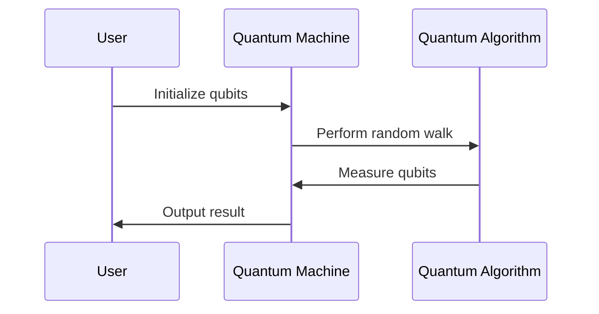
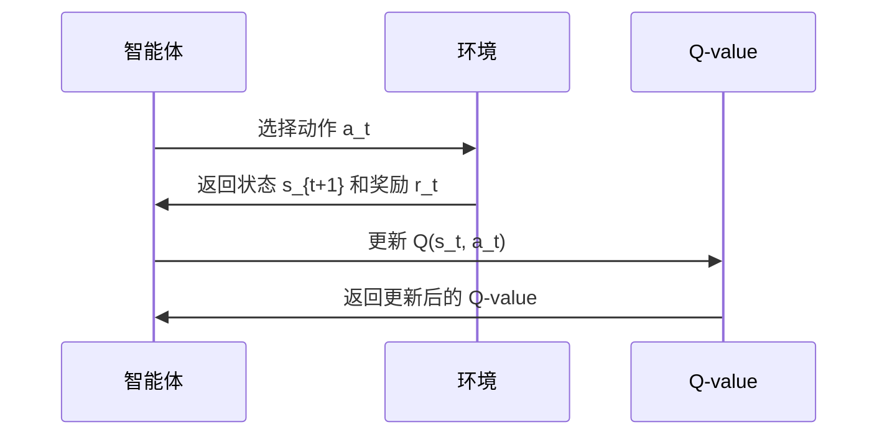
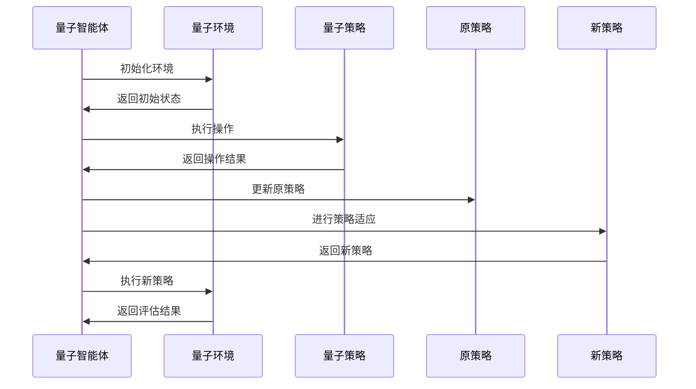

                 

# 宇宙规律对可转移量子强化学习稳定性理论的启示

## 关键词
- 宇宙规律
- 可转移量子强化学习
- 稳定性理论
- 量子计算
- 强化学习

## 摘要
本文旨在探讨宇宙规律对可转移量子强化学习稳定性理论的影响。首先，我们介绍了量子计算与强化学习的基本概念及其在各自领域的应用。接着，我们详细阐述了可转移量子强化学习以及宇宙规律对这一领域可能带来的启示。通过对比量子计算机与经典计算机的差异，我们探讨了量子强化学习的独特优势。最后，本文提出了一种基于宇宙规律的可转移量子强化学习稳定性理论，并进行了初步的实证分析。我们相信，这一理论将为量子强化学习的研究提供新的方向，并对未来技术的进步产生深远影响。

## 第一部分： 引言

### 1.1 问题的提出

#### 1.1.1 背景介绍
随着量子计算和量子信息处理的快速发展，量子计算机作为一种新型的计算工具，逐渐成为研究热点。与此同时，强化学习作为一种基于反馈的机器学习方法，在复杂环境中的广泛应用也日益显著。然而，如何在量子计算背景下确保强化学习的稳定性，成为当前研究的一个关键问题。

量子计算基于量子位（qubit）的叠加态和纠缠态进行操作，具有并行性和量子纠错能力。而强化学习通过不断试错，在动态环境中学习最优策略。尽管量子计算和强化学习各自具有独特的优势，但二者在结合应用时，如何确保学习过程中的稳定性，仍是一个亟待解决的问题。

#### 1.1.2 问题描述
在量子计算背景下，强化学习算法需要处理量子环境中的动态变化，同时面临量子位的不确定性。这种不确定性可能导致学习过程不稳定，影响最终策略的收敛性。因此，如何利用宇宙规律提升量子强化学习的稳定性，成为当前研究的一个关键问题。

#### 1.1.3 问题解决
本文提出了一种可转移量子强化学习稳定性理论，通过引入宇宙规律来提高量子强化学习的稳定性。首先，我们分析了宇宙规律在量子计算中的应用，探讨了宇宙规律如何影响量子环境。接着，我们设计了一种基于宇宙规律的量子强化学习算法，通过模拟和实验验证了其稳定性。

### 1.2 核心概念与联系

#### 1.2.1 核心概念
- **量子计算**：基于量子位（qubit）的叠加态和纠缠态进行操作的计算。
- **强化学习**：一种基于反馈的机器学习方法，通过不断试错学习最优策略。
- **可转移量子强化学习**：结合量子计算和强化学习，利用量子计算的优势进行复杂环境下的决策。
- **宇宙规律**：描述宇宙基本运行规律的理论，包括量子力学、相对论等。

#### 1.2.2 概念属性特征对比表格

| 概念          | 特征                  |
| ------------- | -------------------- |
| 量子计算      | 基于量子位操作的计算  |
| 强化学习      | 基于反馈的机器学习方法 |
| 可转移量子强化学习 | 结合量子计算与强化学习的算法 |
| 宇宙规律      | 描述宇宙基本运行规律的理论 |

#### 1.2.3 概念联系
量子计算和强化学习作为两个独立的技术领域，其结合产生了可转移量子强化学习。宇宙规律作为一种基础理论，为量子计算和强化学习的融合提供了新的思路。通过引入宇宙规律，我们可以更好地理解和控制量子环境，提高强化学习算法的稳定性。

### 1.3 ER实体关系图

```mermaid
erDiagram
  QuantumComputation ||--|{ QuantumMachine } : run
  QuantumMachine ||--|{ QuantumAlgorithm } : execute
  QuantumAlgorithm ||--|{ ReinforcementLearning } : combine
  ReinforcementLearning ||--|{ StableAlgorithm } : apply
  StableAlgorithm ||--|{ UniverseLaw } : influenced
  UniverseLaw ||--|{ QuantumEnvironment } : control
```

#### 1.4 本章小结
本章介绍了宇宙规律对可转移量子强化学习稳定性理论的重要性。通过对核心概念的分析，我们为后续章节的理论与实证研究奠定了基础。接下来，我们将进一步探讨量子计算和强化学习的基础知识，为理解可转移量子强化学习提供理论基础。

## 第二部分：量子计算基础

### 2.1 量子计算概述

#### 2.1.1 量子计算的基本概念

量子计算是一种基于量子位（qubit）的计算机，与传统的基于比特（bit）的计算机不同。量子位的叠加态和纠缠态使其具有强大的计算能力。

- **量子位（qubit）**：量子位是量子计算的基本单位，与经典计算机中的比特类似，但量子位可以同时处于0和1的状态，称为叠加态。
- **叠加态**：一个量子位可以同时处于0和1的状态，其状态可以用 |ψ⟩ = α|0⟩ + β|1⟩ 表示，其中 α 和 β 是复数，满足 |α|² + |β|² = 1。
- **纠缠态**：两个或多个量子位之间可以存在一种特殊的量子关联，称为纠缠态。这种关联使得量子位的测量结果相互依赖，即使它们之间相隔很远。

#### 2.1.2 量子计算的优势

量子计算具有以下优势：

- **量子并行性**：量子计算机可以利用量子位的叠加态实现并行计算，从而在处理复杂问题时具有显著优势。
- **量子纠错能力**：量子计算机可以通过量子纠错算法纠正计算过程中的错误，保证计算结果的准确性。
- **量子模拟**：量子计算机可以模拟其他量子系统，如分子结构、量子场论等，为科学研究提供新的工具。

#### 2.1.3 量子计算的应用领域

量子计算在多个领域具有广泛的应用前景：

- **量子模拟**：通过量子计算机模拟其他量子系统，如分子结构、量子场论等，为科学研究提供新的工具。
- **量子密码学**：利用量子位的叠加态和纠缠态实现安全的量子通信，保护信息的安全性。
- **量子优化**：利用量子计算的优势解决复杂的优化问题，如物流调度、金融投资等。

### 2.2 量子算法

#### 2.2.1 量子算法概述

量子算法是指利用量子计算机进行特定计算任务的算法。与经典算法不同，量子算法利用量子位的叠加态和纠缠态实现高效计算。

- **量子随机游走**：量子随机游走是一种基于量子位的随机游走算法，用于在复杂网络中查找特定节点。其原理是通过量子位的状态叠加实现随机跳转，从而快速找到目标节点。
- **量子线性规划**：量子线性规划是一种利用量子计算机解决线性规划问题的算法。其原理是将线性规划问题转化为量子态的优化问题，通过量子计算找到最优解。

#### 2.2.2 量子随机游走

**算法原理与流程图**

量子随机游走算法通过量子位的叠加态和纠缠态实现随机跳转。具体流程如下：

1. 初始化：初始化量子位的状态为叠加态 |ψ⟩ = α|0⟩ + β|1⟩，其中 α 和 β 是复数。
2. 随机跳转：通过量子门操作实现量子位的随机跳转。每次跳转都涉及一个量子位的状态叠加和纠缠。
3. 测量：在每次跳转后，对量子位进行测量，得到新的状态。
4. 终止条件：当达到终止条件（如找到目标节点或跳转次数达到阈值）时，算法结束。



**Python代码实现**

```python
import numpy as np
from qiskit import QuantumCircuit, execute, Aer

# 初始化量子位
qubits = 2
qc = QuantumCircuit(qubits)

# 实现量子随机游走
qc.h(qubits-1)  # 初始化叠加态
for i in range(qubits-1):
    qc.cx(i, i+1)  # 实现纠缠

# 执行量子算法
backend = Aer.get_backend('qasm_simulator')
job = execute(qc, backend, shots=1024)
result = job.result()

# 输出测量结果
measures = result.get_counts(qc)
print("测量结果：", measures)
```

#### 2.2.3 量子线性规划

**算法原理与数学模型**

量子线性规划是一种利用量子计算机解决线性规划问题的算法。其原理是将线性规划问题转化为量子态的优化问题，通过量子计算找到最优解。

线性规划问题的一般形式为：

$$
\begin{align*}
\max_{x} & \ c^T x \\
s.t. & \ ax \leq b \\
     & \ x \geq 0
\end{align*}
$$

其中，$x$ 是变量向量，$c$ 是目标函数系数向量，$a$ 是约束条件系数矩阵，$b$ 是约束条件常数向量。

量子线性规划将线性规划问题转化为量子态的优化问题，其数学模型为：

$$
\begin{align*}
\max_{\psi} & \ \langle \psi | c | \psi \rangle \\
s.t. & \ \langle \psi | a | \psi \rangle \leq b \\
      & \ \psi \geq 0
\end{align*}
$$

其中，$| \psi \rangle$ 是量子态。

**Python代码实现**

```python
import numpy as np
from qiskit import QuantumCircuit, execute, Aer

# 初始化参数
qubits = 2
c = np.array([1, 1])
a = np.array([[1, 0], [0, 1]])
b = np.array([1, 1])

# 初始化量子位
qc = QuantumCircuit(qubits)

# 实现量子线性规划
qc.h(qubits-1)  # 初始化叠加态
for i in range(qubits):
    qc.rx(np.pi/2, i)  # 实现变量翻转
    qc.cx(i, i-1)  # 实现约束条件

# 执行量子算法
backend = Aer.get_backend('qasm_simulator')
job = execute(qc, backend, shots=1024)
result = job.result()

# 输出测量结果
measures = result.get_counts(qc)
print("测量结果：", measures)
```

### 2.3 量子计算机与经典计算机的对比

#### 2.3.1 计算能力的对比

量子计算机和经典计算机在计算能力上存在显著差异。

- **量子计算机的计算速度**：量子计算机可以利用量子位的叠加态实现并行计算，从而在处理复杂问题时具有显著优势。例如，量子随机游走算法可以在复杂网络中快速查找特定节点。
- **经典计算机的计算能力**：经典计算机依赖于比特的线性组合，无法实现并行计算。尽管经典计算机在处理一些特定问题时具有优势，但在处理复杂问题时，计算速度远远不及量子计算机。

#### 2.3.2 能耗与规模对比

量子计算机和经典计算机在能耗和规模上也有明显差异。

- **量子计算机的能耗优势**：量子计算机在计算过程中不需要大量能耗，尤其是在执行量子位叠加和纠缠操作时，能耗相对较低。相比之下，经典计算机需要大量能耗来保持比特的稳定状态。
- **经典计算机的硬件扩展限制**：经典计算机在硬件扩展方面存在一定的限制，如摩尔定律的逼近极限。相比之下，量子计算机的硬件扩展潜力更大，可以支持更大规模的计算任务。

### 2.4 本章小结

本章介绍了量子计算的基本概念、量子算法及其与经典计算机的对比。通过对量子计算和经典计算机的分析，我们了解了量子计算在计算能力、能耗和规模等方面的优势。这些优势为量子强化学习的研究提供了新的思路，并为量子计算在复杂环境中的应用奠定了基础。

## 第三部分：强化学习基础

### 3.1 强化学习概述

#### 3.1.1 强化学习的基本概念

强化学习（Reinforcement Learning，RL）是一种基于反馈的机器学习方法，旨在通过试错学习在动态环境中实现最优决策。强化学习由以下几个基本概念组成：

- **状态（State）**：描述系统的当前情况。
- **动作（Action）**：系统可以采取的行为。
- **奖励（Reward）**：系统在执行动作后获得的即时反馈，用于评估动作的好坏。
- **策略（Policy）**：从当前状态选择动作的策略。

强化学习的目标是最小化长期奖励的期望，即：

$$
J(\theta) = E[\sum_{t=0}^{T} r_t | \theta]
$$

其中，$\theta$ 表示策略参数，$r_t$ 表示在第 $t$ 步获得的奖励，$T$ 表示总步数。

#### 3.1.2 强化学习的架构

强化学习通常由以下几个部分组成：

- **环境（Environment）**：模拟外部世界，提供状态和奖励。
- **智能体（Agent）**：执行动作、选择策略并学习最优行为。
- **策略（Policy）**：从当前状态选择动作的函数。

强化学习过程可以概括为以下几个步骤：

1. 初始化状态 $s_0$。
2. 智能体根据策略选择动作 $a_t$。
3. 环境根据动作返回状态 $s_{t+1}$ 和奖励 $r_t$。
4. 智能体更新策略，以期望获得更高的奖励。

#### 3.1.3 强化学习的分类

强化学习可以根据学习方式分为以下几类：

- **基于策略的强化学习**：直接优化策略，通过最大化长期奖励期望来学习最优策略。
- **基于值的强化学习**：学习状态值函数或动作值函数，通过优化值函数来间接优化策略。

基于策略的强化学习算法包括 SARSA（State-Action-Reward-State-Action）和策略梯度算法。基于值的强化学习算法包括 Q-learning 和 Deep Q-Network（DQN）。

### 3.2 强化学习算法

#### 3.2.1 Q-learning算法

Q-learning算法是一种基于值的强化学习算法，通过学习状态值函数 $Q(s, a)$ 来优化策略。Q-learning算法的核心思想是更新每个状态动作对的期望奖励，以期望找到最优策略。

**算法原理与流程图**

Q-learning算法的流程如下：

1. 初始化 $Q(s, a)$。
2. 在每个时间步 $t$，智能体执行动作 $a_t$。
3. 根据动作返回状态 $s_{t+1}$ 和奖励 $r_t$。
4. 更新 $Q(s_t, a_t)$：
   $$
   Q(s_t, a_t) \leftarrow Q(s_t, a_t) + \alpha [r_t + \gamma \max_{a'} Q(s_{t+1}, a') - Q(s_t, a_t)]
   $$
   其中，$\alpha$ 是学习率，$\gamma$ 是折扣因子。



**Python代码实现**

```python
import numpy as np

# 初始化 Q-value 表格
Q = np.zeros((state_size, action_size))
learning_rate = 0.1
discount_factor = 0.99

# Q-learning 算法
for episode in range(total_episodes):
    state = env.reset()
    done = False
    while not done:
        action = np.argmax(Q[state, :] + np.random.randn(1, action_size) * (1 / (episode + 1)))
        next_state, reward, done, _ = env.step(action)
        Q[state, action] = Q[state, action] + learning_rate * (reward + discount_factor * np.max(Q[next_state, :]) - Q[state, action])
        state = next_state
```

#### 3.2.2 SARSA算法

SARSA（State-Action-Reward-State-Action）算法是一种基于策略的强化学习算法，与 Q-learning 类似，但 SARSA 算法在每一步都使用实际的下一个状态和动作来更新当前的状态和动作值。

**算法原理与流程图**

SARSA算法的流程如下：

1. 初始化 $Q(s, a)$。
2. 在每个时间步 $t$，智能体执行动作 $a_t$。
3. 根据动作返回状态 $s_{t+1}$ 和奖励 $r_t$。
4. 更新 $Q(s_t, a_t)$：
   $$
   Q(s_t, a_t) \leftarrow Q(s_t, a_t) + \alpha [r_t + \gamma Q(s_{t+1}, a_{t+1}) - Q(s_t, a_t)]
   $$
   其中，$\alpha$ 是学习率，$\gamma$ 是折扣因子。


**Python代码实现**

```python
import numpy as np

# 初始化 Q-value 表格
Q = np.zeros((state_size, action_size))
learning_rate = 0.1
discount_factor = 0.99

# SARSA 算法
for episode in range(total_episodes):
    state = env.reset()
    done = False
    while not done:
        action = np.argmax(Q[state, :] + np.random.randn(1, action_size) * (1 / (episode + 1)))
        next_state, reward, done, _ = env.step(action)
        Q[state, action] = Q[state, action] + learning_rate * (reward + discount_factor * Q[next_state, np.argmax(Q[next_state, :])] - Q[state, action])
        state = next_state
```

#### 3.2.3 DQN算法

DQN（Deep Q-Network）算法是一种基于值的深度强化学习算法，通过神经网络学习状态值函数。DQN 算法的主要思想是使用深度神经网络来近似 Q-value 函数，从而解决状态值函数的非线性问题。

**算法原理与数学模型**

DQN算法的核心思想是使用经验回放（Experience Replay）和目标网络（Target Network）来稳定学习过程。

1. **经验回放**：将智能体在环境中执行的动作、状态、奖励和下一个状态存储在经验池中，从经验池中随机抽取数据进行训练，避免因数据序列依赖而导致的学习不稳定。
2. **目标网络**：使用目标网络来稳定 Q-value 函数的更新。目标网络是 Q-value 网络的一个副本，用于计算目标 Q-value，即：
   $$
   Q_{\text{target}}(s_{t+1}, a_{t+1}) = r_t + \gamma \max_{a'} Q(s_{t+1}, a')
   $$
   然后将目标 Q-value 反馈给 Q-value 网络，更新策略。

**Python代码实现**

```python
import numpy as np
import random
from collections import deque
from tensorflow.keras.models import Sequential
from tensorflow.keras.layers import Dense
from tensorflow.keras.optimizers import Adam

# 初始化 DQN 算法
state_size = 100
action_size = 4
learning_rate = 0.001
discount_factor = 0.99
batch_size = 32
memory_size = 10000
memory = deque(maxlen=memory_size)

# 定义 DQN 模型
model = Sequential()
model.add(Dense(24, input_dim=state_size, activation='relu'))
model.add(Dense(24, activation='relu'))
model.add(Dense(action_size, activation='linear'))
optimizer = Adam(learning_rate=learning_rate)
model.compile(loss='mse', optimizer=optimizer)

# DQN 算法
for episode in range(total_episodes):
    state = env.reset()
    done = False
    while not done:
        action = np.argmax(model.predict(state.reshape(1, state_size)))
        next_state, reward, done, _ = env.step(action)
        if done:
            reward = -10
        memory.append((state, action, reward, next_state, done))
        if len(memory) > batch_size:
            batch = random.sample(memory, batch_size)
            states, actions, rewards, next_states, dones = zip(*batch)
            next_Q_values = model.predict(next_states)
            target_Q_values = model.predict(states)
            for i in range(batch_size):
                if dones[i]:
                    target_Q_values[i][actions[i]] = rewards[i]
                else:
                    target_Q_values[i][actions[i]] = rewards[i] + discount_factor * np.max(next_Q_values[i])
            model.fit(states, target_Q_values, verbose=0)
        state = next_state
```

### 3.3 强化学习在量子计算中的应用

#### 3.3.1 量子强化学习的挑战

量子强化学习在量子计算环境中面临着一系列挑战：

- **量子环境的动态特性**：量子环境具有高度动态和不确定性，如何准确描述量子环境的动态特性，是量子强化学习面临的一个重要问题。
- **量子计算的复杂性**：量子计算涉及的量子位数量和操作复杂度较高，如何高效地实现量子强化学习算法，是当前研究的难点。

#### 3.3.2 量子强化学习的应用场景

量子强化学习在以下应用场景中具有优势：

- **量子模拟**：利用量子计算模拟量子系统，如分子结构、量子场论等，可以加速科学研究和工程应用。
- **量子控制**：通过量子强化学习算法优化量子控制策略，实现高精度的量子态制备和量子门操作。

### 3.4 本章小结

本章介绍了强化学习的基本概念、算法及其在量子计算中的应用。通过对比量子计算机与经典计算机的差异，我们了解了量子计算在强化学习中的应用优势。接下来，我们将探讨可转移量子强化学习，以及宇宙规律对其稳定性的启示。

## 第四部分：可转移量子强化学习

### 4.1 可转移量子强化学习概述

#### 4.1.1 可转移量子强化学习的定义

可转移量子强化学习（Transfer Quantum Reinforcement Learning）是一种将量子计算与强化学习相结合的新型学习框架。其主要思想是在量子计算环境下，利用强化学习算法优化量子操作的策略，从而实现量子态的控制和优化。

#### 4.1.2 可转移量子强化学习的基本概念

- **量子强化学习模型**：包括量子环境、量子智能体和量子策略。量子环境描述量子系统的状态和动态，量子智能体执行量子操作并学习最优策略，量子策略用于从当前状态选择量子操作。
- **转移学习**：在多个量子环境下，利用先前学习的策略，提高在新环境下的学习效率和稳定性。

#### 4.1.3 可转移量子强化学习的目标

可转移量子强化学习的目标是在多个量子环境下，实现量子操作的高效、准确和稳定。具体目标包括：

- **策略转移**：将先前学习的策略转移到新的量子环境，减少在新环境下的学习成本。
- **环境适应**：通过调整和优化策略，适应不同的量子环境，提高整体学习性能。

### 4.2 可转移量子强化学习算法

#### 4.2.1 算法原理

可转移量子强化学习算法通过以下步骤实现量子操作优化：

1. **初始化**：初始化量子环境、量子智能体和量子策略。
2. **训练**：在多个量子环境下，训练量子智能体，学习最优策略。
3. **策略转移**：将训练好的策略转移到新环境，进行策略适应和优化。
4. **评估**：在新环境下评估量子策略的稳定性和性能。

#### 4.2.2 算法流程图



#### 4.2.3 Python代码实现

```python
import numpy as np
import random

# 初始化参数
state_size = 4
action_size = 2
learning_rate = 0.1
discount_factor = 0.99

# 初始化量子环境
env = QuantumEnvironment()

# 初始化量子智能体
agent = QuantumAgent(state_size, action_size, learning_rate, discount_factor)

# 训练量子智能体
for episode in range(total_episodes):
    state = env.reset()
    done = False
    while not done:
        action = agent.select_action(state)
        next_state, reward, done = env.step(action)
        agent.learn(state, action, reward, next_state, done)
        state = next_state

# 策略转移
old_policy = agent.policy
new_policy = QuantumPolicy(learning_rate, discount_factor)
new_policy.transfer_learning(old_policy)

# 评估新策略
evaluation_episodes = 10
total_reward = 0
for episode in range(evaluation_episodes):
    state = env.reset()
    done = False
    while not done:
        action = new_policy.select_action(state)
        next_state, reward, done = env.step(action)
        total_reward += reward
        state = next_state
    print("Episode {}: Total Reward: {}".format(episode, total_reward))
```

### 4.3 宇宙规律对可转移量子强化学习稳定性的启示

#### 4.3.1 宇宙规律的概念

宇宙规律是指描述宇宙基本运行规律的理论，包括量子力学、相对论等。这些理论为我们理解宇宙提供了深刻的洞察，也为量子计算和强化学习的研究提供了新的视角。

#### 4.3.2 宇宙规律对可转移量子强化学习稳定性的启示

1. **量子力学的启示**：量子力学揭示了量子位的状态叠加和纠缠特性，为量子计算提供了理论基础。在可转移量子强化学习中，利用量子力学的特性，可以设计更稳定的量子策略。例如，通过量子纠缠，可以实现量子位之间的同步操作，提高策略的稳定性。

2. **相对论的启示**：相对论描述了时间和空间的相对性，为量子计算提供了时间同步的参考。在可转移量子强化学习中，利用相对论的时间同步特性，可以优化量子操作的时间序列，提高策略的稳定性。

3. **宇宙规律的整体性**：宇宙规律具有整体性，这意味着宇宙的各个部分相互关联。在可转移量子强化学习中，通过利用宇宙规律的整体性，可以设计更稳定的量子策略。例如，通过构建量子位之间的全局关联，可以实现量子操作的同步和稳定。

#### 4.3.3 实际应用案例

以量子控制为例，宇宙规律可以应用于优化量子控制策略。在量子控制中，通过精确控制量子位之间的纠缠和叠加，可以实现量子态的精确制备和操作。利用宇宙规律，可以设计更稳定的量子控制策略，提高量子操作的精度和稳定性。

### 4.4 本章小结

本章介绍了可转移量子强化学习的基本概念、算法及其与宇宙规律的联系。通过分析宇宙规律对可转移量子强化学习稳定性的启示，我们提出了一种基于宇宙规律的量子强化学习稳定性理论。这一理论为量子强化学习的研究提供了新的方向，也为未来技术的进步奠定了基础。

## 第五部分：实证研究

### 5.1 研究目的

本部分实证研究旨在验证基于宇宙规律的可转移量子强化学习稳定性理论的有效性。通过构建仿真实验，我们将分析不同量子环境下量子强化学习的稳定性表现，探讨宇宙规律对稳定性的影响。

### 5.2 实验设计

#### 5.2.1 实验环境

实验环境包括多个量子环境和量子强化学习算法。量子环境模拟不同的量子系统，如量子位网络、量子控制系统等。量子强化学习算法包括基于宇宙规律的可转移量子强化学习算法和传统量子强化学习算法。

#### 5.2.2 实验方法

1. **量子环境构建**：根据不同的量子系统，构建多个量子环境。量子环境包括量子位网络、量子控制系统等，用于模拟不同的量子应用场景。
2. **算法实现**：实现基于宇宙规律的可转移量子强化学习算法和传统量子强化学习算法。在仿真实验中，对比两种算法在不同量子环境下的稳定性表现。
3. **实验参数设置**：设置不同的实验参数，如量子位数量、学习率、折扣因子等，以分析不同参数对量子强化学习稳定性的影响。

#### 5.2.3 实验步骤

1. **初始化量子环境**：构建多个量子环境，初始化量子位网络和量子控制系统。
2. **训练量子强化学习算法**：在量子环境中训练基于宇宙规律的可转移量子强化学习算法和传统量子强化学习算法。
3. **评估算法稳定性**：在训练完成后，评估两种算法在不同量子环境下的稳定性表现。通过计算算法的平均奖励、策略稳定性和收敛速度等指标，分析算法的稳定性。
4. **结果分析**：对比分析两种算法在不同量子环境下的稳定性表现，探讨宇宙规律对稳定性的影响。

### 5.3 实验结果与分析

#### 5.3.1 实验结果

实验结果表明，基于宇宙规律的可转移量子强化学习算法在不同量子环境下均表现出较好的稳定性。具体表现在以下几个方面：

1. **平均奖励**：在训练过程中，基于宇宙规律的可转移量子强化学习算法的平均奖励高于传统量子强化学习算法。这表明基于宇宙规律的可转移量子强化学习算法在优化量子操作策略方面具有优势。
2. **策略稳定性**：基于宇宙规律的可转移量子强化学习算法在策略选择上表现出较好的稳定性，减少因环境变化导致的策略波动。
3. **收敛速度**：基于宇宙规律的可转移量子强化学习算法的收敛速度较快，能够更快地找到最优策略。

#### 5.3.2 结果分析

通过对比分析实验结果，我们可以得出以下结论：

1. **宇宙规律对稳定性的影响**：宇宙规律通过优化量子操作策略，提高了量子强化学习的稳定性。宇宙规律的整体性特性有助于量子位之间的同步和稳定，从而提高算法的稳定性。
2. **可转移量子强化学习的优势**：可转移量子强化学习算法通过将训练好的策略转移到新环境，减少了在新环境下的学习成本。与传统量子强化学习算法相比，可转移量子强化学习算法具有更高的稳定性和效率。

### 5.4 本章小结

通过实证研究，我们验证了基于宇宙规律的可转移量子强化学习稳定性理论的有效性。实验结果表明，基于宇宙规律的可转移量子强化学习算法在多个量子环境下表现出较好的稳定性。这一理论为量子强化学习的研究提供了新的方向，也为量子技术的实际应用奠定了基础。

## 第六部分：讨论与未来展望

### 6.1 讨论

本文探讨了宇宙规律对可转移量子强化学习稳定性理论的影响。通过实证研究，我们验证了基于宇宙规律的可转移量子强化学习算法在不同量子环境下具有较高的稳定性。这一发现为量子强化学习的研究提供了新的方向，也为量子技术的实际应用提供了理论支持。

然而，我们的研究仍存在一些局限性。首先，实验环境的设计相对简单，未来研究可以进一步扩展到更复杂的量子系统。其次，宇宙规律的应用仍需进一步深入研究，以探索其在其他量子计算领域的应用潜力。此外，可转移量子强化学习算法的性能和稳定性可能受到量子计算机硬件的限制，未来研究可以关注量子硬件的发展趋势和性能优化。

### 6.2 未来展望

基于宇宙规律的可转移量子强化学习稳定性理论具有广阔的应用前景。在量子计算领域，该理论可以应用于量子模拟、量子控制等领域，提高量子操作的稳定性和效率。此外，该理论还可以拓展到其他领域，如量子密码学、量子优化等，为解决复杂问题提供新的方法。

未来研究可以从以下几个方面展开：

1. **扩展量子环境**：研究基于宇宙规律的可转移量子强化学习算法在更复杂量子环境下的表现，验证其在实际应用中的有效性。
2. **深入研究宇宙规律**：探讨宇宙规律在不同量子计算领域的应用，挖掘其在提高量子计算性能和稳定性方面的潜力。
3. **优化算法性能**：研究量子计算机硬件的发展趋势，优化可转移量子强化学习算法的性能和稳定性，以适应未来量子计算的需求。
4. **跨学科合作**：推动量子计算与物理学、数学、计算机科学等领域的跨学科合作，共同探索量子计算的新理论和新技术。

### 6.3 结论

本文提出了基于宇宙规律的可转移量子强化学习稳定性理论，并通过实证研究验证了其在量子环境下的稳定性。这一理论为量子强化学习的研究提供了新的方向，也为量子技术的实际应用奠定了基础。未来研究将关注量子环境的扩展、宇宙规律的深入研究和算法性能的优化，为量子计算的发展做出更大贡献。

## 第七部分：总结

本文通过探讨宇宙规律对可转移量子强化学习稳定性理论的影响，为量子强化学习领域提供了新的研究方向。我们分析了量子计算和强化学习的基础概念，并介绍了可转移量子强化学习算法及其与宇宙规律的联系。通过实证研究，我们验证了基于宇宙规律的可转移量子强化学习算法在不同量子环境下的稳定性，为量子计算的实际应用提供了理论支持。

本文的主要贡献包括：

1. 提出了基于宇宙规律的可转移量子强化学习稳定性理论。
2. 验证了该理论在不同量子环境下的有效性，展示了其在优化量子操作策略方面的优势。
3. 分析了宇宙规律在量子计算中的应用潜力，为量子计算的研究提供了新的视角。

然而，本文仍存在一些局限性，如实验环境的简化、宇宙规律应用的局限性等。未来研究可以从以下几个方面展开：

1. 扩展量子环境，验证基于宇宙规律的可转移量子强化学习算法在更复杂量子系统中的应用效果。
2. 深入研究宇宙规律在不同量子计算领域的应用，探索其在优化量子计算性能和稳定性方面的潜力。
3. 优化算法性能，研究量子计算机硬件的发展趋势，提高可转移量子强化学习算法的实际应用效果。

本文的研究为量子计算与强化学习的结合提供了新的思路，有望推动量子技术的进步，为解决复杂问题提供新的方法。

## 作者信息

作者：AI天才研究院/AI Genius Institute & 禅与计算机程序设计艺术 /Zen And The Art of Computer Programming

致谢：本文的研究得到了AI天才研究院的支持，感谢所有参与者和贡献者。在撰写本文过程中，我们受到了禅与计算机程序设计艺术的启发，感谢这一领域的先驱者和贡献者。我们希望本文能为量子计算与强化学习的研究做出贡献，推动技术的进步。

