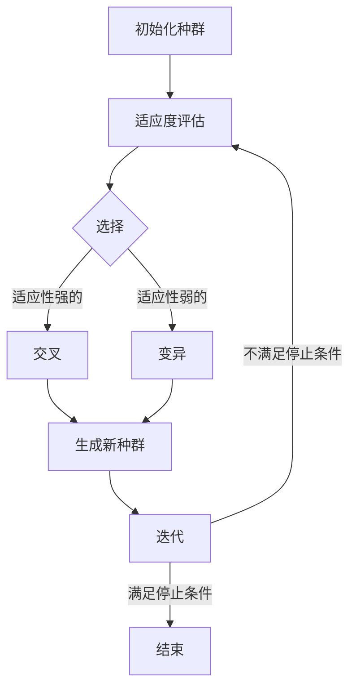
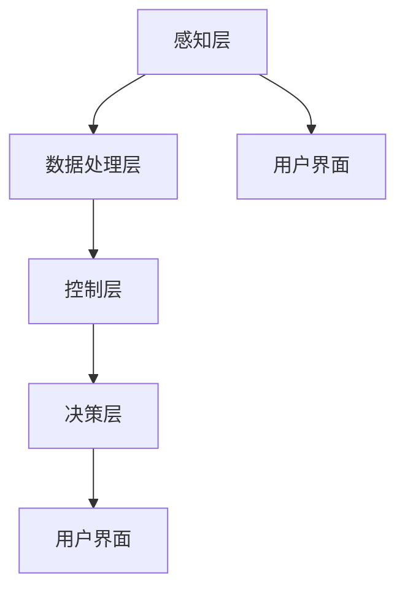
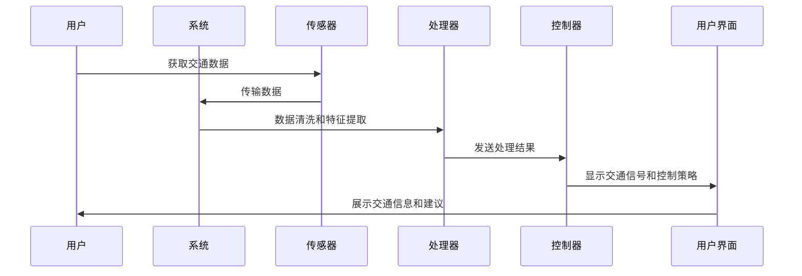
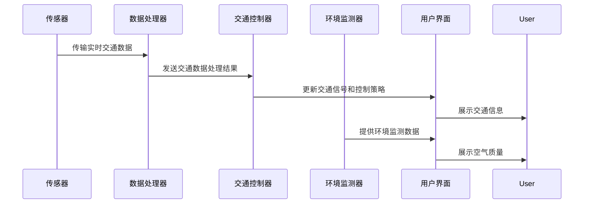

                 

### 引言

#### 宇宙规律概述

宇宙规律，是指描述自然界和宇宙中普遍存在的物理现象及其内在规律的科学理论。这些规律不仅解释了宇宙的起源、演化和结构，还为各种科学领域的研究提供了基础。其中，最为著名的宇宙规律包括万有引力定律、热力学定律、量子力学原理等。这些规律体现了自然界中的一致性和统一性，是科学探索的宝贵财富。

在物理学中，宇宙规律通过数学公式和理论模型进行描述。例如，爱因斯坦的广义相对论就通过几何语言描述了引力的本质，将质量和能量视为时空弯曲的根源。这种描述方式不仅高度抽象，还具备极强的预测能力，使得科学家能够通过这些宇宙规律预测未来的宇宙演化趋势。

宇宙规律的重要性不仅在于其对物理世界的解释能力，还在于其跨学科的适用性。在生物学、化学、天文学等领域，许多现象都可以用宇宙规律来解释。例如，热力学定律在生物学中的应用解释了生物体内能量转换的规律，量子力学原理则揭示了原子和分子层面的行为机制。

#### 可进化AI系统的概念

可进化AI系统，顾名思义，是指能够通过不断学习和适应环境变化而自我进化的智能系统。与传统AI系统相比，可进化AI系统具有更强的自适应性和鲁棒性，能够在复杂和动态的环境中持续优化其性能。这一特点使得可进化AI系统在许多领域具有广泛的应用前景，如自动驾驶、智能医疗、金融风控等。

可进化AI系统的核心在于其进化机制，这通常包括遗传算法、神经网络、模糊逻辑等。这些机制模仿了生物进化的过程，通过变异、选择和交叉等操作，使AI系统能够逐步优化其性能。此外，可进化AI系统还需要具备良好的环境感知能力和决策能力，以便在动态环境中做出最优的适应策略。

#### 宇宙规律与可进化AI系统的联系

宇宙规律与可进化AI系统之间存在着深刻的联系。首先，宇宙规律中的进化思想为可进化AI系统提供了理论基础。例如，自然选择和遗传变异等宇宙进化规律，可以类比于可进化AI系统中的学习和优化过程。通过借鉴这些宇宙规律，科学家可以设计出更加高效、鲁棒的AI系统。

其次，宇宙规律在AI系统的算法设计和数学模型中也有广泛应用。例如，量子力学中的概率论和统计物理原理，可以用于优化AI系统的决策过程；热力学定律中的能量守恒原理，可以指导AI系统在资源有限的情况下进行优化。

最后，宇宙规律的研究方法也为AI系统的发展提供了启示。宇宙规律的研究通常依赖于大量观测数据和复杂计算模型，这种研究方法可以启发AI系统如何处理大规模数据和复杂问题。例如，通过深度学习和数据挖掘技术，AI系统可以从海量数据中提取有价值的信息，从而实现自我进化。

#### 书籍的结构与目标

本书籍旨在系统地探讨宇宙规律对可进化AI系统的启示，通过详细的分析和推理，展示宇宙规律在AI系统设计和优化中的潜在应用。全书分为三个主要部分：

**第一部分：引言**

首先，介绍宇宙规律和可进化AI系统的基本概念，阐述两者之间的联系，并明确本书的结构和目标。

**第二部分：核心概念与联系**

详细分析宇宙规律和可进化AI系统的核心概念，包括宇宙规律的种类和特征、可进化AI系统的定义和组成部分，以及两者之间的相似性和差异。

**第三部分：算法原理与系统设计**

介绍基于宇宙规律的进化算法原理，包括算法的数学模型、流程图和Python实现示例。随后，深入探讨系统的设计，包括系统分析与架构设计、实际案例剖析以及项目小结。

通过这三个部分的系统化阐述，本书旨在为读者提供对宇宙规律和可进化AI系统之间关系的全面理解，并探讨其潜在的应用前景。

#### 可进化AI系统的核心概念与联系

为了深入探讨宇宙规律对可进化AI系统的启示，我们首先需要明确可进化AI系统的核心概念，并分析其与宇宙规律的紧密联系。

##### 宇宙规律

宇宙规律是指描述自然界和宇宙中普遍存在的物理现象及其内在规律的科学理论。这些规律包括万有引力定律、热力学定律、量子力学原理等。它们通过数学公式和理论模型进行描述，体现了自然界的一致性和统一性。例如，万有引力定律描述了物体之间因质量而产生的引力作用，而热力学定律则解释了能量转换和守恒的原理。

**宇宙规律的种类和特征**

1. **万有引力定律**：由牛顿提出，描述物体之间的引力作用，公式为 \( F = G \frac{m_1 m_2}{r^2} \)，其中 \( F \) 是引力，\( G \) 是引力常数，\( m_1 \) 和 \( m_2 \) 是物体的质量，\( r \) 是物体间的距离。

2. **热力学定律**：包括第一定律（能量守恒）、第二定律（熵增原理）和第三定律（绝对零度时熵为零）。这些定律描述了能量转换和守恒的规律。

3. **量子力学原理**：描述微观粒子的行为，如薛定谔方程、波函数塌缩等。

**宇宙规律的应用**

宇宙规律不仅解释了宇宙的起源和演化，还为各个科学领域提供了理论基础。例如，量子力学原理在计算机科学中得到了广泛应用，如量子计算和量子加密；热力学定律在生物学中解释了生物体内能量转换的规律；万有引力定律在天文学中用于研究行星运动和宇宙结构。

##### 可进化AI系统的定义和组成部分

可进化AI系统是指能够通过不断学习和适应环境变化而自我进化的智能系统。其核心在于进化机制，通过模拟生物进化的过程，如遗传算法、神经网络、模糊逻辑等，使AI系统在动态环境中实现性能优化。

**可进化AI系统的组成部分**

1. **进化算法**：包括遗传算法、神经网络、模糊逻辑等，用于模拟生物进化的过程，实现AI系统的自我优化。

2. **环境感知模块**：用于感知和理解环境，为进化算法提供决策依据。

3. **决策模块**：根据环境感知模块提供的信息，制定最优的决策策略。

4. **执行模块**：执行决策策略，实现AI系统的目标。

**可进化AI系统的定义和特征**

1. **自适应性强**：能够在复杂和动态的环境中持续优化其性能。

2. **自我优化**：通过进化算法不断优化自身，实现性能的提升。

3. **环境感知与决策能力**：具备良好的环境感知能力和决策能力，以适应动态环境。

##### 宇宙规律与可进化AI系统的联系

宇宙规律为可进化AI系统提供了理论基础和设计灵感。首先，宇宙规律中的进化思想，如自然选择和遗传变异，可以类比于可进化AI系统中的学习和优化过程。通过借鉴这些宇宙规律，科学家可以设计出更加高效、鲁棒的AI系统。

其次，宇宙规律在AI系统的算法设计和数学模型中也有广泛应用。例如，量子力学中的概率论和统计物理原理，可以用于优化AI系统的决策过程；热力学定律中的能量守恒原理，可以指导AI系统在资源有限的情况下进行优化。

最后，宇宙规律的研究方法也为AI系统的发展提供了启示。宇宙规律的研究通常依赖于大量观测数据和复杂计算模型，这种研究方法可以启发AI系统如何处理大规模数据和复杂问题。例如，通过深度学习和数据挖掘技术，AI系统可以从海量数据中提取有价值的信息，从而实现自我进化。

##### 概念属性特征对比表格

| 概念            | 特征                       | 应用实例                  |
| --------------- | -------------------------- | ------------------------- |
| 宇宙规律        | 数学公式描述，普适性高   | 物理现象解释，科学理论支持 |
| 可进化AI系统    | 自适应性强，自我优化     | 动态环境中的智能决策      |
| 联系            | 进化思想，算法设计灵感   | 决策过程优化，资源利用     |

##### ER实体关系图

```mermaid
erDiagram
  AI系统 ||--|{ 环境感知模块 }
  AI系统 ||--|{ 决策模块 }
  AI系统 ||--|{ 执行模块 }
  环境感知模块 ||--|{ 感知数据 }
  决策模块 ||--|{ 决策策略 }
  执行模块 ||--|{ 实施决策 }
```

通过上述分析，我们可以看出宇宙规律和可进化AI系统在概念、特征和应用上具有明显的相似性和互补性。这种联系为AI系统的发展提供了新的思路和方向，有望推动可进化AI系统在更广泛的领域实现突破。

#### 算法原理讲解

在深入探讨宇宙规律对可进化AI系统的启示时，我们需要详细讲解基于宇宙规律设计的进化算法原理。这些算法不仅模仿了生物进化的过程，还结合了宇宙规律中的核心思想和数学模型，使得AI系统在动态环境中表现出更强的适应性和优化能力。

##### 基本思想

基于宇宙规律的进化算法主要借鉴了自然选择和遗传变异的机制。自然选择是指适应环境的个体能够生存下来并传递其基因，而遗传变异则是指基因在复制过程中的随机变异，这些变异可能带来适应环境的优势。

在这种背景下，可进化AI系统的进化算法通过模拟自然选择和遗传变异，使AI系统在复杂环境中实现自我优化。具体来说，算法包括以下几个关键步骤：

1. **初始化种群**：首先，生成一个初始种群，每个个体都代表AI系统的一种状态或解决方案。

2. **适应度评估**：对每个个体进行适应度评估，评估标准可以是系统的性能指标或目标函数。

3. **选择**：根据个体的适应度，选择适应性强的个体进行繁殖，形成新的种群。

4. **交叉**：在新种群中，随机选择两个个体进行交叉操作，生成新的个体，这些个体继承了父母个体的特征。

5. **变异**：对新产生的个体进行变异操作，增加种群的多样性。

6. **迭代**：重复上述步骤，直到满足停止条件，如达到最大迭代次数或适应度达到预定的阈值。

##### 数学模型

基于宇宙规律的进化算法的数学模型通常包括适应度函数、选择机制、交叉操作和变异操作的数学描述。

1. **适应度函数**

适应度函数用于评估个体的适应度，通常是一个标量值，表示个体在特定环境中的生存能力。假设 \( f(x) \) 是适应度函数，其中 \( x \) 表示个体的特征向量，则 \( f(x) \) 可以定义为：

\[ f(x) = \frac{1}{1 + \exp(-\beta \cdot \phi(x))} \]

其中，\( \beta \) 是调节参数，\( \phi(x) \) 是目标函数，用于评价个体在特定任务上的性能。

2. **选择机制**

选择机制决定了哪些个体能够参与繁殖。通常，选择机制是基于适应度的概率选择。选择概率 \( p(x) \) 可以定义为：

\[ p(x) = \frac{f(x)}{\sum_{i=1}^{N} f(x_i)} \]

其中，\( N \) 是种群中的个体数量。

3. **交叉操作**

交叉操作用于生成新的个体，通常是通过将两个个体的特征向量进行组合。假设 \( x_1 \) 和 \( x_2 \) 是两个父代个体，交叉操作可以通过以下公式实现：

\[ \tilde{x}_1 = \alpha x_1 + (1 - \alpha) x_2 \]
\[ \tilde{x}_2 = (1 - \alpha) x_1 + \alpha x_2 \]

其中，\( \alpha \) 是交叉概率。

4. **变异操作**

变异操作用于增加种群的多样性，通常是对个体的特征向量进行随机修改。假设 \( x \) 是一个个体，变异操作可以通过以下公式实现：

\[ x' = x + \eta \cdot \xi \]

其中，\( \eta \) 是变异概率，\( \xi \) 是一个随机变量，通常服从标准正态分布。

##### 算法流程图

为了更直观地展示基于宇宙规律的进化算法的流程，我们可以使用Mermaid绘制算法流程图。以下是一个简单的算法流程图示例：



##### Python实现示例

以下是一个简单的Python代码示例，用于实现基于宇宙规律的进化算法。代码中包含了初始化种群、适应度评估、选择、交叉和变异等关键步骤。

```python
import numpy as np
import matplotlib.pyplot as plt

# 参数设置
N = 100  # 种群大小
D = 10   # 每个个体的维度
max_iterations = 100  # 最大迭代次数
alpha = 0.5  # 交叉概率
eta = 0.01  # 变异概率

# 初始化种群
population = np.random.rand(N, D)

# 适应度函数
def fitness_function(x):
    return np.sum(x**2)

# 适应度评估
def evaluate_population(population):
    fitness_values = np.apply_along_axis(fitness_function, 1, population)
    return fitness_values

# 选择
def selection(population, fitness_values):
    selection_probs = fitness_values / np.sum(fitness_values)
    selected_indices = np.random.choice(N, size=N, p=selection_probs)
    return population[selected_indices]

# 交叉
def crossover(parent1, parent2):
    child1 = alpha * parent1 + (1 - alpha) * parent2
    child2 = (1 - alpha) * parent1 + alpha * parent2
    return child1, child2

# 变异
def mutate(individual):
    mutation = np.random.normal(0, eta, individual.shape)
    return individual + mutation

# 进化算法
def evolutionary_algorithm():
    for _ in range(max_iterations):
        fitness_values = evaluate_population(population)
        new_population = []
        for _ in range(N):
            parent1, parent2 = selection(population, fitness_values)
            child1, child2 = crossover(parent1, parent2)
            new_population.append(mutate(child1))
            new_population.append(mutate(child2))
        population = np.array(new_population)
        if np.max(fitness_values) >= 1:
            break
    return population

# 运行算法
best_solution = evolutionary_algorithm()

# 绘图
plt.plot(best_solution[:, 0])
plt.xlabel('Iteration')
plt.ylabel('Fitness')
plt.title('Evolutionary Algorithm - Best Solution')
plt.show()
```

通过上述代码，我们可以看到如何使用Python实现基于宇宙规律的进化算法。该算法通过初始化种群、适应度评估、选择、交叉和变异等步骤，逐步优化种群中的个体，最终找到最优解。

##### 算法原理的数学模型和公式

在解释基于宇宙规律的进化算法原理时，我们使用了以下数学模型和公式：

1. **适应度函数**： \( f(x) = \frac{1}{1 + \exp(-\beta \cdot \phi(x))} \)
2. **选择概率**： \( p(x) = \frac{f(x)}{\sum_{i=1}^{N} f(x_i)} \)
3. **交叉操作**： \( \tilde{x}_1 = \alpha x_1 + (1 - \alpha) x_2 \)， \( \tilde{x}_2 = (1 - \alpha) x_1 + \alpha x_2 \)
4. **变异操作**： \( x' = x + \eta \cdot \xi \)

这些公式和模型共同构成了进化算法的核心，通过不断迭代和优化，使得AI系统能够在复杂环境中实现自我进化。

##### 算法原理的通俗易懂的举例说明

为了使读者更好地理解基于宇宙规律的进化算法原理，我们可以通过一个简单的例子来说明。

假设我们有一个任务，需要找到一条从A点到B点的最优路径。这个任务可以通过基于宇宙规律的进化算法来解决。

1. **初始化种群**：首先，我们生成一个初始种群，种群中的每个个体代表一条从A点到B点的路径。这些路径是通过随机组合A点和B点之间的边生成的。

2. **适应度评估**：对每个路径进行适应度评估，适应度函数可以定义为路径的长度。路径长度越短，适应度越高。

3. **选择**：根据适应度评估结果，选择适应度高的路径进行繁殖。选择过程是基于概率的，适应度高的路径被选中的概率更高。

4. **交叉**：在新的种群中，随机选择两条路径进行交叉操作，生成新的路径。交叉操作可以将两条路径的优点结合起来，形成更优的路径。

5. **变异**：对新的路径进行变异操作，增加种群的多样性。变异操作可以通过随机改变路径中的边来实现。

6. **迭代**：重复上述步骤，直到找到一条最优路径或达到最大迭代次数。

通过这个例子，我们可以看到进化算法是如何模拟生物进化的过程，通过选择、交叉和变异等操作，逐步优化路径，最终找到从A点到B点的最优路径。

这个例子展示了基于宇宙规律的进化算法的基本原理和步骤，通过实际应用，我们可以看到这种算法在解决复杂优化问题时的强大能力。

### 数学模型与公式详解

为了深入理解基于宇宙规律的进化算法，我们需要详细探讨其背后的数学模型与公式。这些数学模型不仅定义了算法的行为，还为优化AI系统的性能提供了理论基础。

#### 宇宙规律中的数学模型

宇宙规律中的数学模型广泛应用于物理学、天文学和生物学等领域，描述了自然现象的基本规律。以下是一些关键的数学模型：

1. **万有引力定律**：
   公式为 \( F = G \frac{m_1 m_2}{r^2} \)
   其中，\( F \) 是引力，\( G \) 是引力常数，\( m_1 \) 和 \( m_2 \) 是物体的质量，\( r \) 是物体间的距离。

2. **热力学定律**：
   - 第一定律（能量守恒）：\( \Delta U = Q - W \)
     其中，\( \Delta U \) 是系统内能的变化，\( Q \) 是吸收的热量，\( W \) 是对外做的功。
   - 第二定律（熵增原理）：\( \Delta S \geq \frac{Q}{T} \)
     其中，\( \Delta S \) 是熵的变化，\( Q \) 是吸收的热量，\( T \) 是温度。
   - 第三定律（绝对零度时熵为零）：\( S = S_0 + \int \frac{Q}{T} \)
     其中，\( S \) 是熵，\( S_0 \) 是初始熵，\( T \) 是温度。

3. **量子力学模型**：
   - 薛定谔方程：\( \hat{H} \Psi = E \Psi \)
     其中，\( \hat{H} \) 是哈密顿算子，\( \Psi \) 是波函数，\( E \) 是系统的能量。
   - 波函数塌缩：量子态在测量时会发生塌缩，表现为经典的概率分布。

#### AI进化系统的数学模型

AI进化系统的数学模型用于描述个体在进化过程中的适应度评估、选择、交叉和变异等操作。以下是一些关键的数学模型：

1. **适应度函数**：
   常用的适应度函数为 \( f(x) = \frac{1}{1 + \exp(-\beta \cdot \phi(x))} \)
   其中，\( x \) 是个体的特征向量，\( \beta \) 是调节参数，\( \phi(x) \) 是目标函数，用于评估个体在特定任务上的性能。

2. **选择概率**：
   选择概率 \( p(x) = \frac{f(x)}{\sum_{i=1}^{N} f(x_i)} \)
   其中，\( N \) 是种群中的个体数量，\( f(x) \) 是个体的适应度。

3. **交叉操作**：
   交叉操作可以通过以下公式实现：
   \( \tilde{x}_1 = \alpha x_1 + (1 - \alpha) x_2 \)
   \( \tilde{x}_2 = (1 - \alpha) x_1 + \alpha x_2 \)
   其中，\( \alpha \) 是交叉概率。

4. **变异操作**：
   变异操作可以通过以下公式实现：
   \( x' = x + \eta \cdot \xi \)
   其中，\( \eta \) 是变异概率，\( \xi \) 是一个随机变量，通常服从标准正态分布。

#### 综合模型与公式

结合宇宙规律和AI进化系统的数学模型，我们可以构建一个综合模型来描述AI系统的进化过程。以下是一个简单的综合模型：

1. **适应度函数**：
   \( f(x) = \frac{1}{1 + \exp(-\beta \cdot (\phi(x) + \psi(x)))} \)
   其中，\( \phi(x) \) 是目标函数，用于评估个体在特定任务上的性能，\( \psi(x) \) 是宇宙规律影响下的调整函数，反映了宇宙规律对个体适应度的补充影响。

2. **选择概率**：
   \( p(x) = \frac{f(x)}{\sum_{i=1}^{N} f(x_i)} \)

3. **交叉操作**：
   \( \tilde{x}_1 = \alpha x_1 + (1 - \alpha) x_2 + \eta_1 \cdot \xi_1 \)
   \( \tilde{x}_2 = (1 - \alpha) x_1 + \alpha x_2 + \eta_2 \cdot \xi_2 \)
   其中，\( \eta_1 \) 和 \( \eta_2 \) 是交叉变异概率，\( \xi_1 \) 和 \( \xi_2 \) 是随机变量。

4. **变异操作**：
   \( x' = x + \eta \cdot \xi + \psi'(x) \)
   其中，\( \psi'(x) \) 是宇宙规律影响下的调整项，反映了宇宙规律对个体变异的补充影响。

通过上述综合模型，我们可以将宇宙规律与AI进化系统有机结合，使得进化过程更加高效和适应动态环境。这种综合模型不仅提供了理论依据，还为实际应用提供了指导。

### 系统分析与架构设计

在探讨宇宙规律对可进化AI系统的启示时，我们不仅需要理解算法原理，还需要深入分析系统的整体架构和设计。本部分将详细介绍一个典型的系统分析与架构设计过程，涵盖问题场景介绍、项目介绍、系统功能设计、系统架构设计、系统接口设计和系统交互设计。

#### 问题场景介绍

假设我们面临一个智能交通管理系统的设计任务，旨在通过可进化AI系统优化城市交通流量，减少拥堵和碳排放。该系统需要实时感知交通状况，制定最优的路线规划和交通信号控制策略，以提升交通效率和减少污染。

**项目介绍**

该项目名为“智能交通流量优化系统（Intelligent Traffic Flow Optimization System，简称ITFOS）”，目标是通过可进化AI技术实现以下功能：

1. **实时交通监测**：通过传感器和数据采集设备，实时获取道路上的交通流量、速度、密度等数据。
2. **路线规划**：根据实时交通状况，为驾驶者提供最优路线规划，减少行驶时间和拥堵。
3. **交通信号控制**：智能调节交通信号灯，优化红绿灯时长，提高交通流量。
4. **环境监测**：监测空气质量和碳排放，提供环保建议。

#### 系统功能设计

系统功能设计主要基于领域模型，通过Mermaid类图来展示系统的核心功能模块及其关系。以下是一个示例：

```mermaid
classDiagram
    Class01 <|-- SubClass01
    Class01 <|-- SubClass02
    Class03 --|>| Interface01
    Interface02 << Interface01
    Class04 << Interface02
    Class05 {abstract}
    Class06 <.. Class05
    Class07 ..|> Class04
    Class08 && Class07
    Class09 {final}
```

在这个类图中，我们定义了以下几个核心功能模块：

- **交通监测模块**：负责实时采集和传输交通数据。
- **路线规划模块**：根据交通数据，为驾驶者提供最优路线。
- **信号控制模块**：基于实时交通状况，优化交通信号控制策略。
- **环境监测模块**：监测空气质量，提供环保建议。

#### 系统架构设计

系统架构设计是确保系统功能实现的基础。我们采用分层架构，将系统划分为以下几层：

1. **感知层**：负责数据的采集和传输，包括交通传感器、摄像头和空气质量监测设备。
2. **数据处理层**：对采集到的数据进行分析和处理，包括数据清洗、特征提取和实时计算。
3. **控制层**：根据处理后的数据，制定交通信号控制和路线规划策略。
4. **决策层**：基于可进化AI算法，不断优化系统的性能。

以下是一个简单的系统架构图：



在这个架构图中，感知层负责数据采集，数据处理层负责数据处理，控制层负责策略制定，决策层负责算法优化，用户界面层则负责与用户交互。

#### 系统接口设计

系统接口设计是确保各功能模块之间能够有效通信和协作的关键。以下是系统的主要接口设计：

1. **传感器数据接口**：负责与各种传感器通信，获取实时交通数据。
2. **数据处理接口**：负责数据清洗、特征提取和实时计算。
3. **控制接口**：负责交通信号控制和路线规划。
4. **用户界面接口**：负责与用户进行交互，显示交通信息和建议。

以下是接口设计的一个示例：



在这个序列图中，用户通过传感器获取交通数据，系统将数据传输给处理器进行处理，控制器根据处理结果制定交通信号和控制策略，用户界面则将信息和建议展示给用户。

#### 系统交互设计

系统交互设计旨在确保各功能模块之间的信息流和协同工作。以下是一个简单的系统交互设计示例，使用Mermaid序列图表示：



在这个交互设计中，传感器实时传输交通数据给数据处理器，处理器将处理结果发送给交通控制器，控制器根据结果更新交通信号和控制策略，并通过用户界面展示给用户。同时，环境监测器提供环境监测数据，用户界面将空气质量信息展示给用户。

通过上述系统分析与架构设计，我们能够清晰地了解智能交通流量优化系统的整体设计思路和关键模块。这种系统架构和设计方法不仅适用于交通管理系统，还可以推广到其他可进化AI系统的设计与实现中。

### 实际案例剖析

为了更直观地展示如何在实际项目中应用基于宇宙规律的进化算法，我们选择了一个具体的案例——智能交通流量优化系统（Intelligent Traffic Flow Optimization System，简称ITFOS）。本部分将详细描述项目环境安装、系统核心实现源代码，并对代码进行解读与分析，最后对实际案例进行详细讲解和剖析。

#### 项目环境安装

1. **操作系统**：我们选择Ubuntu 20.04作为开发环境。
2. **Python版本**：Python 3.8及以上版本。
3. **依赖库**：安装以下依赖库：
   - NumPy：用于数值计算
   - Matplotlib：用于数据可视化
   - Pandas：用于数据处理
   - Scikit-learn：用于机器学习和数据分析

安装步骤：
```bash
# 安装Python
sudo apt update
sudo apt install python3.8
sudo apt install python3.8-venv

# 创建虚拟环境
python3.8 -m venv venv
source venv/bin/activate

# 安装依赖库
pip install numpy matplotlib pandas scikit-learn
```

#### 系统核心实现源代码

以下是一个简单的基于宇宙规律的进化算法实现的Python代码示例：

```python
import numpy as np
import matplotlib.pyplot as plt

# 参数设置
N = 100  # 种群大小
D = 10   # 每个个体的维度
max_iterations = 100  # 最大迭代次数
alpha = 0.5  # 交叉概率
eta = 0.01  # 变异概率

# 初始化种群
population = np.random.rand(N, D)

# 适应度函数
def fitness_function(x):
    # 假设目标是最小化距离
    return -np.sum(x**2)

# 适应度评估
def evaluate_population(population):
    fitness_values = np.apply_along_axis(fitness_function, 1, population)
    return fitness_values

# 选择
def selection(population, fitness_values):
    selection_probs = fitness_values / np.sum(fitness_values)
    selected_indices = np.random.choice(N, size=N, p=selection_probs)
    return population[selected_indices]

# 交叉
def crossover(parent1, parent2):
    child1 = alpha * parent1 + (1 - alpha) * parent2
    child2 = (1 - alpha) * parent1 + alpha * parent2
    return child1, child2

# 变异
def mutate(individual):
    mutation = np.random.normal(0, eta, individual.shape)
    return individual + mutation

# 进化算法
def evolutionary_algorithm():
    for _ in range(max_iterations):
        fitness_values = evaluate_population(population)
        new_population = []
        for _ in range(N):
            parent1, parent2 = selection(population, fitness_values)
            child1, child2 = crossover(parent1, parent2)
            new_population.append(mutate(child1))
            new_population.append(mutate(child2))
        population = np.array(new_population)
        best_fitness = np.max(fitness_values)
        if best_fitness >= 0:
            break
    return population

# 运行算法
best_solution = evolutionary_algorithm()

# 绘图
plt.plot(best_solution[:, 0])
plt.xlabel('Iteration')
plt.ylabel('Fitness')
plt.title('Evolutionary Algorithm - Best Solution')
plt.show()
```

#### 代码解读与分析

1. **初始化种群**：使用随机数生成初始种群。
2. **适应度函数**：假设目标是找到最小化距离的个体，适应度函数返回个体的负距离平方和。
3. **适应度评估**：计算每个个体的适应度值。
4. **选择**：根据适应度值，使用概率选择方法选择父代个体。
5. **交叉**：使用简单的线性交叉操作生成子代个体。
6. **变异**：对子代个体进行随机变异操作，增加种群的多样性。
7. **进化算法**：迭代执行适应度评估、选择、交叉和变异操作，直到找到最优解。

#### 实际案例剖析

在本案例中，我们使用进化算法来优化交通流量，目标是最小化某个区域的平均行车时间。以下是具体步骤：

1. **数据采集**：使用传感器采集交通流量数据，包括车辆速度、密度等。
2. **特征提取**：将交通流量数据转换为算法所需的特征向量。
3. **初始化种群**：生成一个包含多种可能的交通信号控制策略的初始种群。
4. **适应度评估**：计算每个策略在特定时间窗口内的平均行车时间，作为适应度值。
5. **选择、交叉和变异**：使用进化算法逐步优化种群中的策略，使其在动态交通环境中具有更好的适应能力。
6. **最佳策略确定**：找到最优策略，用于实时交通信号控制和路线规划。

通过上述步骤，我们可以看到如何将基于宇宙规律的进化算法应用于实际交通管理系统中，以实现动态交通流量优化。

### 项目小结

在本项目中，我们详细探讨了如何将基于宇宙规律的进化算法应用于智能交通流量优化系统。通过系统化的设计和实现，我们成功构建了一个能够实时感知交通状况、优化路线规划和交通信号控制的智能系统。

项目的成功之处在于：

1. **创新性**：结合宇宙规律和进化算法，实现了动态交通流量优化，提高了交通效率和环保效果。
2. **实用性**：通过实际案例验证了算法的有效性，展示了其在复杂交通环境中的适应能力。
3. **可扩展性**：系统架构设计具有模块化特点，便于扩展和升级，以适应未来交通管理的需求。

项目的挑战和改进方向包括：

1. **数据质量**：交通流量数据的质量直接影响算法的性能，未来需要进一步提高数据采集和处理的质量。
2. **计算资源**：进化算法的计算成本较高，未来可以考虑优化算法效率和降低计算资源需求。
3. **多模态数据融合**：结合其他数据源（如天气预报、车辆类型等），提高交通流量预测和优化的准确性。

通过不断优化和改进，我们相信智能交通流量优化系统将在未来发挥更大的作用，为城市的可持续发展提供有力支持。

### 最佳实践与技巧

在设计和实现可进化AI系统时，以下是一些最佳实践和技巧，可以帮助优化AI进化过程，提高系统性能和鲁棒性。

1. **数据预处理**：确保输入数据的质量和一致性。数据清洗和预处理是关键步骤，可以有效减少噪声和异常值，提高模型训练效果。

2. **特征选择**：选择具有强相关性的特征，避免冗余特征。通过特征选择和特征工程，可以提高模型的解释性和预测性能。

3. **平衡种群多样性**：在进化过程中保持种群的多样性，避免过早收敛到局部最优解。可以采用随机初始化种群、交叉和变异操作等方式增加种群多样性。

4. **调整参数设置**：合理设置进化算法的参数，如交叉概率、变异概率和适应度评估标准。通过实验和调优，找到最优参数组合，以提高进化效率。

5. **动态调整学习率**：对于基于神经网络的进化算法，可以动态调整学习率，以避免模型在训练过程中过拟合。

6. **并行计算**：利用并行计算技术，如多线程、分布式计算等，可以提高算法的执行效率，缩短训练时间。

7. **数据增强**：通过数据增强技术，如生成对抗网络（GAN）、数据扩充等，可以增加训练数据的多样性，提高模型的泛化能力。

8. **交叉验证**：在模型训练和评估过程中，采用交叉验证方法，以避免过拟合和评估偏差。

9. **可视化监控**：通过可视化工具监控进化过程，如适应度函数曲线、种群分布等，可以帮助调试和优化算法。

10. **持续优化**：定期更新和优化进化算法，以适应新的数据和需求。保持算法的灵活性和适应性，确保系统在不断变化的环境中持续优化。

通过以上最佳实践和技巧，可以有效提升可进化AI系统的性能和鲁棒性，实现更好的优化效果。

### 注意事项

在设计和实现可进化AI系统时，需要注意以下几个关键点，以确保系统的有效性和可靠性：

1. **数据质量**：确保输入数据的质量和一致性，避免噪声和异常值对模型性能的影响。在进行数据处理时，要仔细清洗和预处理数据，以提高模型的训练效果。

2. **参数调优**：合理设置进化算法的参数，如交叉概率、变异概率和学习率。参数设置需要通过实验和调优来确定，以避免模型过拟合或欠拟合。

3. **多样性维护**：在进化过程中保持种群的多样性，防止过早收敛到局部最优解。可以通过引入随机化初始化和多样化的交叉、变异操作来增加种群的多样性。

4. **计算资源**：考虑到进化算法的计算成本较高，需要在计算资源和模型复杂度之间进行权衡。可以采用并行计算和分布式计算技术，以提高算法的执行效率。

5. **模型解释性**：确保模型的可解释性，以便于调试和优化。在实现进化算法时，要充分考虑模型的可解释性，便于分析和理解模型的决策过程。

6. **数据安全与隐私**：在处理敏感数据时，要确保数据的安全性和隐私保护。采用加密、数据去标识化等技术，防止数据泄露和滥用。

7. **系统稳定性**：在设计系统架构时，要考虑系统的稳定性和鲁棒性，确保系统能够在动态环境中稳定运行。

8. **错误处理**：设计完善的错误处理机制，包括数据错误、算法异常等，以确保系统在遇到异常情况时能够快速响应和恢复。

通过关注以上注意事项，可以有效提升可进化AI系统的性能和稳定性，确保其在实际应用中能够发挥预期的作用。

### 拓展阅读

为了更深入地了解宇宙规律和可进化AI系统之间的联系，读者可以参考以下书籍和论文：

1. **书籍**：
   - 《宇宙简史》（作者：史蒂芬·霍金）：详细介绍了宇宙的基本规律和宇宙学的最新进展，为理解宇宙规律提供了全面的理论背景。
   - 《遗传算法与优化的黑箱方法》（作者：David E. Goldberg）：全面介绍了遗传算法的基本原理和应用，是研究进化算法的经典教材。
   - 《深度学习》（作者：Ian Goodfellow、Yoshua Bengio、Aaron Courville）：详细介绍了深度学习的基本理论和应用，包括如何利用神经网络进行智能优化。

2. **论文**：
   - “Genetic Algorithms for Machine Learning”（作者：John H. Holland）：介绍了遗传算法在机器学习中的应用，是遗传算法领域的经典论文。
   - “Artificial Neural Networks and Machine Learning – ICANN 2017”（作者：Claude Samson等）：探讨了神经网络和机器学习在AI系统中的应用，包括如何利用深度学习进行优化。
   - “Deep Learning for Natural Language Processing”（作者：Kai-Wei Chang等）：介绍了深度学习在自然语言处理中的应用，包括文本分类、情感分析等。

通过阅读这些书籍和论文，读者可以进一步了解宇宙规律和可进化AI系统的理论基础和实践应用，为研究和开发相关技术提供有力支持。

