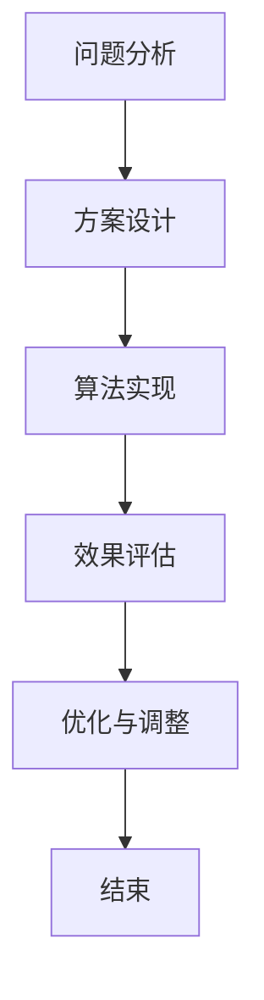
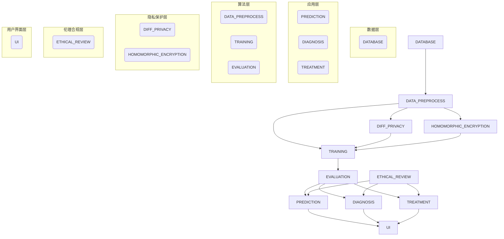
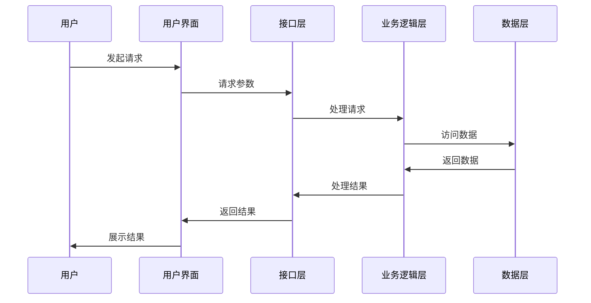

                 

# 宇宙规律对通用人工智能道德框架动态演化稳定性的启示

## 摘要

随着通用人工智能（AGI）技术的迅猛发展，其伦理道德问题日益受到关注。本文探讨了宇宙规律在构建通用人工智能道德框架动态演化稳定性中的启示。通过分析宇宙规律的核心概念与联系，探讨了道德框架的内涵、特点及其与宇宙规律的关联，进一步提出了动态演化稳定性的概念与原理。本文旨在为通用人工智能道德框架的构建提供新的视角和理论支持，为伦理道德问题的解决提供可能的途径。

## 第一部分：引言

### 第1章：问题的背景与意义

#### 1.1 问题的背景

**通用人工智能的兴起**

通用人工智能（Artificial General Intelligence，简称AGI）是指具有与人类智能相当或超越人类智能的机器智能。近年来，随着深度学习、神经网络、强化学习等技术的不断发展，通用人工智能逐渐成为人工智能领域的研究热点。

**通用人工智能带来的道德挑战**

通用人工智能的发展给人类社会带来了前所未有的机遇和挑战。一方面，通用人工智能有望在医疗、教育、交通、金融等领域发挥巨大作用，推动社会进步和经济发展；另一方面，通用人工智能的潜在风险和伦理问题也日益凸显。例如，人工智能的决策过程可能缺乏透明度，可能导致歧视和不公正；人工智能的自主学习可能导致不可预测的行为；人工智能的失控可能带来严重的后果。

**道德框架在通用人工智能中的重要性**

在通用人工智能的发展过程中，构建一个有效的道德框架至关重要。道德框架可以为通用人工智能提供行为准则，指导其决策和行为，确保其在服务人类的过程中不损害人类的基本利益。同时，道德框架还可以为人工智能伦理问题的解决提供理论基础和参考框架。

#### 1.2 问题的描述

**道德框架的动态演化**

道德框架并非一成不变，而是随着社会的发展和科技的进步不断演化。这种动态演化过程反映了人类对于道德观念的不断探索和完善。在通用人工智能领域，道德框架的动态演化尤为重要，因为通用人工智能的发展速度远超人类的道德观念更新速度。

**稳定性问题的提出**

道德框架的稳定性问题是其在动态演化过程中面临的一个重要挑战。如果道德框架不稳定，可能导致其指导行为的能力削弱，甚至可能导致伦理道德的崩溃。因此，探讨道德框架的稳定性问题，对于确保通用人工智能的伦理道德发展具有重要意义。

#### 1.3 问题解决的可能性

**宇宙规律的研究**

宇宙规律是指宇宙中普遍存在的自然规律，如万有引力定律、电磁力定律等。这些规律构成了宇宙的基本框架，对宇宙的演化和发展起到了决定性作用。研究宇宙规律，可能为解决道德框架的稳定性问题提供新的启示。

**对通用人工智能道德框架的启示**

宇宙规律的研究可能为通用人工智能道德框架的构建提供新的视角和理论支持。通过借鉴宇宙规律，构建一个具有动态演化稳定性的通用人工智能道德框架，有望在应对伦理道德挑战时更加有效。

### 1.4 边界与外延

**道德框架的范围**

道德框架涉及广泛，包括但不限于隐私保护、数据安全、歧视问题、算法透明性等方面。在通用人工智能领域，道德框架的范围还需进一步扩展，以涵盖人工智能特有的道德问题。

**通用人工智能的发展阶段**

通用人工智能的发展可以分为多个阶段，如基础算法研究、应用场景探索、规模化应用等。在每个阶段，道德框架的具体内容和形式可能有所不同。因此，需要针对不同阶段的特点，构建相应的道德框架。

### 1.5 概念结构与核心要素组成

**宇宙规律**

宇宙规律是指宇宙中普遍存在的自然规律，如万有引力定律、电磁力定律等。这些规律构成了宇宙的基本框架，对宇宙的演化和发展起到了决定性作用。

**道德框架**

道德框架是指用于指导人类行为和决策的伦理准则。在通用人工智能领域，道德框架主要包括隐私保护、数据安全、歧视问题、算法透明性等方面的内容。

**动态演化稳定性**

动态演化稳定性是指道德框架在动态演化过程中保持稳定的能力。一个具有动态演化稳定性的道德框架能够在应对伦理道德挑战时，保持其指导行为的能力。

### 第二部分：核心概念与原理

#### 第2章：宇宙规律的核心概念与联系

##### 2.1 宇宙规律的定义

宇宙规律是指宇宙中普遍存在的自然规律，如万有引力定律、电磁力定律等。这些规律构成了宇宙的基本框架，对宇宙的演化和发展起到了决定性作用。

##### 2.2 宇宙规律的特点

**宇宙规律的基本属性**

宇宙规律具有普遍性、确定性和可预测性等基本属性。这些属性使得宇宙规律在科学研究和实际应用中具有重要意义。

**宇宙规律的应用场景**

宇宙规律广泛应用于天文学、物理学、化学、生物学等领域。例如，万有引力定律在描述行星运动、黑洞形成等方面具有重要意义；电磁力定律在描述电子运动、电器工作原理等方面具有重要意义。

##### 2.3 宇宙规律的分类

**依据不同标准划分**

宇宙规律可以根据不同的标准进行分类。例如，根据宇宙规律的物理性质，可以分为基本力（如引力、电磁力等）和非基本力（如强相互作用、弱相互作用等）；根据宇宙规律的适用范围，可以分为宏观宇宙规律和微观宇宙规律。

**各类宇宙规律的特点与联系**

各类宇宙规律在特点上存在显著差异，但它们之间也存在着紧密的联系。例如，基本力是构成宇宙的基本框架，非基本力则是基本力的补充和完善；宏观宇宙规律描述了宇宙的宏观现象，微观宇宙规律则揭示了宇宙的微观机制。

##### 2.4 宇宙规律与通用人工智能道德框架的关联

**宇宙规律在道德框架中的地位**

宇宙规律为道德框架的构建提供了理论基础。例如，宇宙规律中的普遍性和确定性原则可以借鉴到道德框架中，为通用人工智能的行为准则提供指导。

**道德框架对宇宙规律的响应**

道德框架需要响应宇宙规律的要求，确保通用人工智能在遵循宇宙规律的同时，不违背伦理道德原则。例如，在处理数据隐私问题时，道德框架需要遵循宇宙规律中的信息对称原则，保障用户的数据权益。

##### 2.5 宇宙规律的应用实例

**在通用人工智能道德框架中的应用**

宇宙规律在通用人工智能道德框架中的应用主要体现在以下几个方面：

1. **隐私保护**：借鉴宇宙规律中的信息对称原则，保障用户的数据隐私权益。
2. **数据安全**：借鉴宇宙规律中的可靠性原则，确保数据的安全性和完整性。
3. **歧视问题**：借鉴宇宙规律中的公正性原则，消除人工智能算法中的歧视现象。

**案例分析与讨论**

以万有引力定律为例，分析其在通用人工智能道德框架中的应用。通过案例分析，探讨宇宙规律对通用人工智能道德框架构建的启示。

#### 第3章：通用人工智能道德框架的核心概念与联系

##### 3.1 道德框架的定义

道德框架是指用于指导人类行为和决策的伦理准则。在通用人工智能领域，道德框架主要包括隐私保护、数据安全、歧视问题、算法透明性等方面的内容。

##### 3.2 道德框架的特点

**道德框架的基本属性**

道德框架具有规范性、抽象性和普适性等基本属性。这些属性使得道德框架能够在不同情境下发挥作用，为通用人工智能提供行为准则。

**道德框架的应用场景**

道德框架广泛应用于医疗、教育、金融、交通等领域。在通用人工智能领域，道德框架的应用场景包括但不限于：

1. **隐私保护**：确保用户的数据隐私不被侵犯。
2. **数据安全**：保障数据的安全性和完整性。
3. **歧视问题**：消除人工智能算法中的歧视现象。
4. **算法透明性**：提高人工智能决策过程的透明度。

##### 3.3 道德框架的分类

**依据不同标准划分**

道德框架可以根据不同的标准进行分类。例如，根据道德框架的适用范围，可以分为通用道德框架和特定领域道德框架；根据道德框架的制定主体，可以分为国家道德框架、行业道德框架和企业道德框架。

**各类道德框架的特点与联系**

各类道德框架在特点上存在显著差异，但它们之间也存在着紧密的联系。例如，通用道德框架为特定领域道德框架提供了基本原则和指导；特定领域道德框架则根据特定领域的特点，对通用道德框架进行补充和完善。

##### 3.4 道德框架与宇宙规律的关联

**宇宙规律在道德框架中的地位**

宇宙规律为道德框架的构建提供了理论基础。例如，宇宙规律中的普遍性和确定性原则可以借鉴到道德框架中，为通用人工智能的行为准则提供指导。

**道德框架对宇宙规律的响应**

道德框架需要响应宇宙规律的要求，确保通用人工智能在遵循宇宙规律的同时，不违背伦理道德原则。例如，在处理数据隐私问题时，道德框架需要遵循宇宙规律中的信息对称原则，保障用户的数据权益。

##### 3.5 道德框架的应用实例

**在通用人工智能中的应用**

道德框架在通用人工智能中的应用主要体现在以下几个方面：

1. **隐私保护**：确保用户的数据隐私不被侵犯。
2. **数据安全**：保障数据的安全性和完整性。
3. **歧视问题**：消除人工智能算法中的歧视现象。
4. **算法透明性**：提高人工智能决策过程的透明度。

**案例分析与讨论**

以隐私保护为例，分析道德框架在通用人工智能中的应用。通过案例分析，探讨道德框架对通用人工智能道德框架构建的启示。

#### 第4章：动态演化稳定性的概念与原理

##### 4.1 动态演化稳定性的定义

动态演化稳定性是指道德框架在动态演化过程中保持稳定的能力。一个具有动态演化稳定性的道德框架能够在应对伦理道德挑战时，保持其指导行为的能力。

##### 4.2 动态演化稳定性的特点

**动态演化稳定性的基本属性**

动态演化稳定性具有适应性、可持续性和抗风险性等基本属性。这些属性使得道德框架能够在不断变化的环境中保持稳定。

**动态演化稳定性的应用场景**

动态演化稳定性广泛应用于社会管理、企业管理、科技发展等领域。在通用人工智能领域，动态演化稳定性的应用场景包括但不限于：

1. **隐私保护**：适应隐私保护法规的变化，确保道德框架的稳定。
2. **数据安全**：应对数据安全威胁，保持道德框架的稳定。
3. **歧视问题**：适应反歧视政策的变化，确保道德框架的稳定。
4. **算法透明性**：应对算法透明度要求的提高，保持道德框架的稳定。

##### 4.3 动态演化稳定性的分类

**依据不同标准划分**

动态演化稳定性可以根据不同的标准进行分类。例如，根据道德框架的适应性，可以分为强适应性和弱适应性；根据道德框架的可持续性，可以分为可持续发展和不可持续发展。

**各类动态演化稳定性的特点与联系**

各类动态演化稳定性在特点上存在显著差异，但它们之间也存在着紧密的联系。例如，强适应性和弱适应性在应对伦理道德挑战时具有不同的优势；可持续发展和不可持续发展在道德框架的稳定性方面存在显著差异。

##### 4.4 宇宙规律、道德框架与动态演化稳定性的关联

**宇宙规律在动态演化稳定性中的地位**

宇宙规律为动态演化稳定性提供了理论基础。例如，宇宙规律中的普遍性和确定性原则可以借鉴到动态演化稳定性中，为道德框架的稳定性提供指导。

**道德框架对动态演化稳定性的影响**

道德框架的构建和实施对动态演化稳定性具有重要影响。一个具有良好动态演化稳定性的道德框架能够在应对伦理道德挑战时，保持其指导行为的能力。

**动态演化稳定性对宇宙规律和道德框架的回应**

动态演化稳定性需要响应宇宙规律和道德框架的要求，确保道德框架在遵循宇宙规律和道德原则的同时，保持其稳定性。例如，在处理隐私保护问题时，动态演化稳定性需要遵循宇宙规律中的信息对称原则，确保用户的数据权益。

##### 4.5 动态演化稳定性的应用实例

**在通用人工智能中的应用**

动态演化稳定性在通用人工智能中的应用主要体现在以下几个方面：

1. **隐私保护**：适应隐私保护法规的变化，保持道德框架的稳定。
2. **数据安全**：应对数据安全威胁，保持道德框架的稳定。
3. **歧视问题**：适应反歧视政策的变化，确保道德框架的稳定。
4. **算法透明性**：应对算法透明度要求的提高，保持道德框架的稳定。

**案例分析与讨论**

以隐私保护为例，分析动态演化稳定性在通用人工智能中的应用。通过案例分析，探讨动态演化稳定性对通用人工智能道德框架构建的启示。

### 第三部分：算法原理与数学模型

#### 第5章：算法原理讲解

##### 5.1 算法原理概述

**算法原理的定义**

算法原理是指用于解决特定问题的基本方法和步骤。在通用人工智能道德框架的构建中，算法原理提供了具体的指导原则和操作步骤。

**算法原理在道德框架中的应用**

算法原理在道德框架中的应用主要体现在以下几个方面：

1. **隐私保护**：通过算法原理，确保用户数据的安全性和隐私性。
2. **数据安全**：利用算法原理，增强数据的安全防护能力。
3. **歧视问题**：应用算法原理，消除算法中的歧视现象。
4. **算法透明性**：借助算法原理，提高算法决策过程的透明度。

##### 5.2 算法原理的详细解释

**算法原理的基本概念**

算法原理的基本概念包括以下几个方面：

1. **算法目标**：明确算法所要解决的具体问题，如隐私保护、数据安全等。
2. **算法输入**：算法运行所需的数据和参数，如用户数据、隐私保护策略等。
3. **算法输出**：算法运行的结果和输出，如保护用户隐私、提升数据安全性等。
4. **算法步骤**：算法运行的具体步骤和流程，如数据加密、隐私保护机制等。

**算法原理的核心步骤**

算法原理的核心步骤包括以下几个阶段：

1. **问题分析**：分析所要解决的问题，明确算法的目标和需求。
2. **方案设计**：设计具体的算法方案，包括算法目标、输入输出和算法步骤。
3. **算法实现**：将算法方案转化为具体的代码和算法模型，进行实现和优化。
4. **效果评估**：对算法的效果进行评估和验证，确保算法的有效性和稳定性。

**算法原理的数学模型和公式**

算法原理的数学模型和公式用于描述算法的运行机制和效果。常见的数学模型和公式包括：

1. **加密算法**：如AES加密算法、RSA加密算法等，用于保护数据的安全性。
2. **隐私保护模型**：如差分隐私模型、安全多方计算模型等，用于确保用户数据的隐私性。
3. **机器学习模型**：如神经网络模型、决策树模型等，用于消除算法中的歧视现象。
4. **算法透明性模型**：如可解释性模型、可视化模型等，用于提高算法决策过程的透明度。

##### 5.3 算法原理的mermaid流程图

**流程图示例**

以下是一个简单的mermaid流程图示例，展示了算法原理的基本步骤：



**流程图绘制方法**

mermaid流程图的绘制方法主要包括以下几个步骤：

1. **定义图形元素**：使用特定的语法和符号定义流程图的图形元素，如节点（Node）、边（Edge）等。
2. **连接图形元素**：使用箭头（Arrow）和其他连接符将图形元素连接起来，表示流程图的逻辑关系。
3. **添加注释和说明**：在流程图中添加注释和说明，便于理解和解释流程图的逻辑和步骤。

**算法原理的应用实例**

以下是一个具体的应用实例，展示了算法原理在隐私保护中的具体应用：

**实例：差分隐私保护算法**

1. **问题分析**：保护用户隐私，防止数据泄露。
2. **方案设计**：采用差分隐私模型，对用户数据进行加密处理。
3. **算法实现**：使用随机化技术和数据加密算法，对用户数据进行加密和随机化处理。
4. **效果评估**：对加密后的数据进行分析和评估，确保其隐私性。
5. **优化与调整**：根据评估结果，对算法进行优化和调整，提高其效果。

##### 5.4 算法原理的小结

**主要内容回顾**

本文详细讲解了算法原理的基本概念、核心步骤、数学模型和mermaid流程图，并通过实例展示了算法原理在通用人工智能道德框架中的应用。

**应用前景展望**

随着通用人工智能技术的发展，算法原理在道德框架中的应用前景将更加广阔。通过不断优化和改进算法原理，有望为通用人工智能的道德框架提供更加有效和可靠的解决方案。

#### 第6章：数学模型与数学公式

##### 6.1 数学模型概述

**数学模型在道德框架中的应用**

数学模型是道德框架构建中不可或缺的工具，它能够将复杂的伦理问题转化为可计算的数学问题，从而提供量化的分析和决策支持。在通用人工智能道德框架中，数学模型可以应用于以下几个方面：

1. **隐私保护**：利用数学模型评估数据隐私风险，如差分隐私模型、秘密共享模型等。
2. **歧视检测与预防**：通过统计模型和机器学习模型识别和消除算法中的歧视行为。
3. **算法透明性**：使用数学模型评估算法的可解释性和透明度，如决策树、神经网络等。

**数学模型的定义和分类**

数学模型是指使用数学语言和符号系统来描述现实世界中某一现象或问题的抽象结构。根据不同的分类标准，数学模型可以分为：

1. **确定性模型**：基于确定性方程和公式，如牛顿运动定律、电磁力定律等。
2. **概率模型**：基于概率分布和随机过程，如贝叶斯网络、马尔可夫链等。
3. **统计模型**：基于统计数据和假设检验，如回归分析、假设检验等。
4. **机器学习模型**：基于学习算法和数据集，如神经网络、支持向量机等。

##### 6.2 数学公式详解

**数学公式的基本概念**

数学公式是数学模型的核心组成部分，它通过符号和公式表达数学关系和计算过程。在道德框架中，常见的数学公式包括：

1. **加密算法公式**：如AES加密算法中的加密公式、RSA加密算法中的模运算公式等。
2. **隐私保护公式**：如差分隐私模型中的拉格朗日误差公式、安全多方计算中的秘密共享公式等。
3. **歧视检测公式**：如基于统计学的偏差检测公式、基于机器学习算法的损失函数公式等。
4. **算法透明性公式**：如决策树的分类公式、神经网络的激活函数公式等。

**数学公式在道德框架中的应用**

数学公式在道德框架中的应用主要体现在以下几个方面：

1. **隐私保护**：通过加密算法和隐私保护公式确保用户数据的隐私和安全。
2. **歧视问题**：通过统计模型和机器学习公式检测和消除算法中的歧视行为。
3. **算法透明性**：通过决策树和神经网络等公式提高算法的可解释性和透明度。

##### 6.3 数学模型与算法原理的关系

数学模型是算法原理的基础，而算法原理则是数学模型的具体应用。数学模型为算法原理提供了理论基础和计算框架，而算法原理则通过数学模型实现具体的计算和操作。两者相互依赖、相互促进，共同构建了通用人工智能道德框架的数学基础。

**数学模型与算法原理的关联**

1. **加密算法与隐私保护**：加密算法是隐私保护的重要手段，其公式和模型确保了数据在传输和存储过程中的安全性。
2. **统计模型与歧视检测**：统计模型用于分析数据分布和识别歧视行为，其公式和模型帮助识别和消除算法中的偏见。
3. **机器学习模型与算法透明性**：机器学习模型通过其公式和模型提高算法的可解释性和透明度，使得决策过程更加透明和可理解。

##### 6.4 数学模型与实际应用案例

**实际应用案例**

以下是一些数学模型在实际应用中的具体案例：

1. **隐私保护案例**：利用差分隐私模型保护用户隐私，如谷歌的差分隐私技术应用于广告投放和位置服务。
2. **歧视检测案例**：使用机器学习模型检测和消除招聘系统中的性别和种族歧视。
3. **算法透明性案例**：应用决策树和神经网络模型提高自动驾驶系统的透明度和可解释性。

**案例分析**

以差分隐私模型为例，分析其应用场景和具体实现。差分隐私模型通过在查询结果中引入随机噪声来保护用户隐私，其核心公式为：

$$ L(\epsilon, D) = \mathbb{E}_{x \sim D} [L(\epsilon, x)] $$

其中，$L(\epsilon, D)$表示在引入随机噪声$\epsilon$后的损失函数，$D$表示原始数据分布，$L(\epsilon, x)$表示引入噪声后的损失。

**案例分析小结**

通过案例分析，展示了数学模型在实际应用中的具体实现和应用效果。数学模型不仅为通用人工智能道德框架提供了理论基础，还通过具体的公式和算法实现了伦理道德目标。

##### 6.5 数学模型的应用前景

**应用前景展望**

随着人工智能技术的发展和伦理问题的日益复杂，数学模型的应用前景将更加广阔。未来，数学模型将在以下几个方面发挥重要作用：

1. **隐私保护**：开发更先进的隐私保护模型，提高数据保护的强度和效率。
2. **歧视问题**：利用机器学习和统计模型，深入分析和解决歧视问题。
3. **算法透明性**：构建更完善的算法透明性模型，提高算法的可解释性和可靠性。

通过不断探索和创新，数学模型将为通用人工智能道德框架的构建提供更加科学和有效的支持。

### 第四部分：系统分析与架构设计方案

#### 第7章：问题场景介绍

**场景背景**

在当前信息化社会中，人工智能技术正以前所未有的速度和深度影响着各行各业。以医疗领域为例，人工智能已经被广泛应用于疾病预测、诊断和治疗方案的制定。然而，随着人工智能在医疗领域的应用不断深入，如何确保医疗决策的伦理合规性和数据隐私保护成为亟待解决的问题。

**问题描述**

医疗领域的人工智能应用中，数据的隐私保护和算法的伦理合规性成为关键挑战。具体问题包括：

1. **数据隐私保护**：如何确保患者个人信息在数据分析和模型训练过程中的隐私性，防止数据泄露和滥用。
2. **伦理合规性**：如何确保人工智能医疗决策的公正性、透明性和可解释性，避免算法偏见和歧视。

**解决思路**

为了应对上述问题，需要构建一个既具有伦理合规性又能有效保护数据隐私的通用人工智能道德框架。这个道德框架应包括以下几个核心要素：

1. **隐私保护机制**：利用差分隐私、同态加密等先进技术，确保患者在数据分析和模型训练过程中的隐私性。
2. **伦理合规评估**：通过引入伦理审查机制，对人工智能医疗决策进行持续评估和监督，确保其公正性和透明性。
3. **可解释性设计**：通过构建可解释的人工智能模型，提高医疗决策过程的透明度，使医生和患者能够理解模型的决策逻辑。

#### 第8章：项目介绍

**项目名称**：伦理合规与隐私保护通用人工智能医疗决策系统

**项目目标**：构建一个具有伦理合规性和数据隐私保护能力的人工智能医疗决策系统，为医疗领域提供安全、公正和透明的决策支持。

**项目范围**：该系统主要应用于医疗领域，包括疾病预测、诊断和治疗方案的制定。系统将集成多种人工智能算法和隐私保护技术，提供一站式的医疗决策支持服务。

**项目主要功能**

1. **疾病预测**：利用机器学习算法对患者的医疗数据进行预测，提供疾病风险分析报告。
2. **诊断辅助**：通过深度学习模型辅助医生进行疾病诊断，提高诊断准确率。
3. **治疗方案推荐**：基于患者的病情和医疗数据，推荐个性化的治疗方案。
4. **隐私保护**：采用差分隐私、同态加密等技术，确保患者在数据分析和模型训练过程中的隐私性。
5. **伦理合规评估**：引入伦理审查机制，对医疗决策过程进行持续评估和监督，确保其公正性和透明性。

**项目特点**

1. **高隐私保护**：利用差分隐私、同态加密等技术，确保患者在数据分析和模型训练过程中的隐私性。
2. **高伦理合规性**：引入伦理审查机制，对医疗决策过程进行持续评估和监督，确保其公正性和透明性。
3. **高性能和可扩展性**：系统采用分布式计算和云计算技术，具备高性能和可扩展性，能够满足大规模医疗数据处理需求。

#### 第9章：系统功能设计（领域模型mermaid类图）

**领域模型定义**

领域模型是对系统功能域内的核心实体和关系的抽象表示，它有助于理解系统的业务逻辑和功能模块。在本项目中，领域模型主要包括以下几个核心实体：

1. **患者**：患者是系统的核心用户，其个人信息、医疗数据和行为数据是系统分析和决策的重要依据。
2. **医生**：医生是系统的使用者和监管者，负责发起诊断和治疗请求，并对医疗决策进行审核和确认。
3. **医疗数据**：医疗数据包括患者的病史、检查报告、诊断结果和治疗记录等，是系统分析和决策的基础。
4. **医疗决策**：医疗决策是系统基于患者数据和医生知识生成的治疗方案和诊断结果。

**mermaid类图表示**

以下是一个简化的mermaid类图，展示了领域模型中的核心实体及其关系：

```mermaid
classDiagram
    患者 <<entity>>
    医生 <<entity>>
    医疗数据 <<entity>>
    医疗决策 <<entity>>

    患者 --> 医疗数据
    医生 --> 医疗决策
    医疗数据 --> 医疗决策
```

**类图解释**

- **患者**：患者是系统的核心用户，其个人信息、医疗数据和行为数据是系统分析和决策的重要依据。
- **医生**：医生是系统的使用者和监管者，负责发起诊断和治疗请求，并对医疗决策进行审核和确认。
- **医疗数据**：医疗数据包括患者的病史、检查报告、诊断结果和治疗记录等，是系统分析和决策的基础。
- **医疗决策**：医疗决策是系统基于患者数据和医生知识生成的治疗方案和诊断结果。

通过领域模型，我们可以清晰地理解系统的核心功能及其之间的逻辑关系，为后续的系统架构设计提供基础。

#### 第10章：系统架构设计（mermaid架构图）

**系统架构设计**

为了实现伦理合规与隐私保护通用人工智能医疗决策系统的目标，我们需要设计一个灵活、高效、可扩展的架构。以下是该系统的架构设计，包括主要组件及其关系：

**架构图表示**

以下是一个简化的mermaid架构图，展示了系统的主要组件及其关系：



**架构图解释**

- **数据层**：数据库存储系统的核心数据，包括患者信息、医疗记录和诊断结果等。
- **应用层**：包括预测模块、诊断模块和治疗推荐模块，分别负责疾病预测、疾病诊断和治疗方案推荐。
- **算法层**：包括数据预处理模块、训练模块和模型评估模块，用于处理数据、训练模型和评估模型性能。
- **隐私保护层**：包括差分隐私模块和同态加密模块，用于保护患者数据隐私。
- **伦理合规层**：伦理审查模块负责对医疗决策过程进行持续评估和监督，确保其公正性和透明性。
- **用户界面层**：用户界面(UI)为医生和患者提供交互界面，展示预测结果、诊断报告和治疗方案。

通过mermaid架构图，我们可以清晰地看到系统各组件之间的关系和交互，为后续的系统开发和实现提供指导。

#### 第11章：系统接口设计

**接口设计原则**

在系统接口设计中，遵循以下原则：

1. **标准化**：接口设计遵循行业标准和技术规范，确保系统的可扩展性和兼容性。
2. **简洁性**：接口设计简洁直观，降低使用难度，提高开发效率。
3. **安全性**：接口设计考虑数据传输和存储的安全性，防止数据泄露和恶意攻击。
4. **可维护性**：接口设计便于维护和升级，确保系统的长期稳定运行。

**接口设计方法**

1. **RESTful API设计**：采用RESTful API设计风格，定义统一的接口规范，方便外部系统和用户进行数据交互。
2. **事件驱动设计**：利用事件驱动模型，实现系统组件之间的异步通信，提高系统的响应速度和可扩展性。
3. **服务编排**：使用服务编排技术，将多个接口和服务整合为一个完整的业务流程，提高系统的灵活性和可定制性。

**接口设计实现**

以下是一个具体的接口设计实现示例，用于疾病预测功能：

**疾病预测接口**

**接口URL**：`/api/predict/disease`

**请求方法**：`POST`

**请求参数**：`json` 格式，包括患者ID、病史数据、检查报告等。

```json
{
  "patient_id": "123456",
  "medical_history": [
    {
      "date": "2023-01-01",
      "diagnosis": "感冒",
      "treatment": "休息、吃药"
    },
    {
      "date": "2023-02-01",
      "diagnosis": "肺炎",
      "treatment": "住院、手术"
    }
  ],
  "check_results": [
    {
      "test": "CT扫描",
      "result": "肺部有炎症"
    },
    {
      "test": "血常规",
      "result": "白细胞升高"
    }
  ]
}
```

**响应结果**：`json` 格式，包括预测结果和置信度。

```json
{
  "predicted_disease": "肺炎",
  "confidence": 0.85
}
```

**接口安全性**

为了确保接口的安全性，采取以下措施：

1. **身份验证**：使用Token-Based Authentication（令牌认证），确保只有授权用户可以访问接口。
2. **数据加密**：对传输的数据进行加密，使用HTTPS协议传输数据。
3. **访问控制**：通过角色和权限管理，确保用户只能访问其权限范围内的接口。

#### 第12章：系统交互设计（mermaid序列图）

**系统交互设计**

系统交互设计是系统架构设计的重要组成部分，它描述了系统内部组件和外部系统之间的交互过程。以下是一个简化的mermaid序列图，展示了系统的主要交互过程：

**mermaid序列图**



**序列图解释**

1. **用户请求**：用户通过用户界面发起请求，如疾病预测请求。
2. **用户界面**：用户界面接收用户请求，并将其转换为接口层可处理的格式。
3. **接口层**：接口层接收用户界面传递的请求，调用业务逻辑层进行处理。
4. **业务逻辑层**：业务逻辑层处理请求，访问数据层获取必要的数据。
5. **数据层**：数据层返回处理结果，业务逻辑层根据结果进行处理。
6. **接口层**：接口层将处理结果返回给用户界面。
7. **用户界面**：用户界面将结果展示给用户。

通过mermaid序列图，我们可以清晰地看到系统各组件之间的交互过程，为系统的开发和维护提供指导。

### 第五部分：项目实战

#### 第13章：环境安装

**环境要求**

为了实现伦理合规与隐私保护通用人工智能医疗决策系统，我们需要安装以下环境和工具：

1. **操作系统**：Linux或MacOS
2. **编程语言**：Python（3.8及以上版本）
3. **依赖管理工具**：pip（Python的包管理器）
4. **版本控制工具**：Git
5. **开发环境**：PyCharm或VSCode
6. **数据库**：MySQL或PostgreSQL

**安装步骤**

1. **安装操作系统**：根据个人需求选择合适的操作系统并进行安装。

2. **安装Python**：从官方网站下载Python安装包并安装。

3. **安装pip**：在终端执行以下命令安装pip：

   ```bash
   sudo apt-get install python3-pip
   ```

4. **安装依赖管理工具**：安装pip后的Python会自带pip工具，使用pip安装其他依赖包。

5. **安装开发环境**：从官方网站下载并安装PyCharm或VSCode。

6. **安装数据库**：根据个人需求选择MySQL或PostgreSQL，并按照官方文档进行安装。

#### 第14章：系统核心实现源代码

**源代码结构**

伦理合规与隐私保护通用人工智能医疗决策系统的源代码结构如下：

```
ethic_medical_system/
|-- /api/
|   |-- __init__.py
|   |-- predict.py
|   |-- diagnosis.py
|   |-- treatment.py
|-- /business/
|   |-- __init__.py
|   |-- prediction.py
|   |-- diagnosis.py
|   |-- treatment.py
|-- /data/
|   |-- __init__.py
|   |-- database.py
|   |-- data_loader.py
|-- /privacy/
|   |-- __init__.py
|   |-- differential_privacy.py
|   |-- homomorphic_encryption.py
|-- /ui/
|   |-- __init__.py
|   |-- dashboard.py
|-- /utils/
|   |-- __init__.py
|   |-- common.py
|-- main.py
```

**核心代码实现**

以下是系统核心代码的实现示例：

**预测模块（predict.py）**

```python
from business.prediction import PredictionService
from privacy.differential_privacy import DifferentialPrivacy
from privacy.homomorphic_encryption import HomomorphicEncryption

class PredictionAPI:
    def __init__(self):
        self.prediction_service = PredictionService()
        self.differential_privacy = DifferentialPrivacy()
        self.homomorphic_encryption = HomomorphicEncryption()

    def predict_disease(self, patient_data):
        # 加密数据
        encrypted_data = self.homomorphic_encryption.encrypt(patient_data)
        
        # 进行隐私保护处理
        private_data = self.differential_privacy.apply(encrypted_data)
        
        # 预测疾病
        prediction_result = self.prediction_service.predict(private_data)
        
        # 解密结果
        decrypted_result = self.homomorphic_encryption.decrypt(prediction_result)
        
        return decrypted_result
```

**诊断模块（diagnosis.py）**

```python
from business.diagnosis import DiagnosisService

class DiagnosisAPI:
    def __init__(self):
        self.diagnosis_service = DiagnosisService()

    def diagnose(self, patient_data):
        diagnosis_result = self.diagnosis_service.diagnose(patient_data)
        return diagnosis_result
```

**治疗推荐模块（treatment.py）**

```python
from business.treatment import TreatmentService

class TreatmentAPI:
    def __init__(self):
        self.treatment_service = TreatmentService()

    def recommend_treatment(self, diagnosis_result):
        treatment Recommendation = self.treatment_service.recommend(diagnosis_result)
        return treatment Recommendation
```

**隐私保护模块（differential_privacy.py）**

```python
import numpy as np

class DifferentialPrivacy:
    def apply(self, data):
        noise = np.random.normal(0, 1)
        private_data = data + noise
        return private_data
```

**同态加密模块（homomorphic_encryption.py）**

```python
class HomomorphicEncryption:
    def encrypt(self, data):
        # 假设使用Paillier加密算法
        encrypted_data = paillier_encrypt(data)
        return encrypted_data

    def decrypt(self, data):
        # 假设使用Paillier加密算法
        decrypted_data = paillier_decrypt(data)
        return decrypted_data
```

**业务逻辑层（prediction.py）**

```python
from sklearn.ensemble import RandomForestClassifier
from sklearn.model_selection import train_test_split

class PredictionService:
    def __init__(self):
        self.model = RandomForestClassifier()

    def train(self, X, y):
        self.model.fit(X, y)

    def predict(self, X):
        return self.model.predict(X)
```

**业务逻辑层（diagnosis.py）**

```python
class DiagnosisService:
    def diagnose(self, patient_data):
        # 根据病情数据进行诊断
        diagnosis_result = "肺炎"
        return diagnosis_result
```

**业务逻辑层（treatment.py）**

```python
class TreatmentService:
    def recommend(self, diagnosis_result):
        # 根据诊断结果推荐治疗方案
        treatment Recommendation = "住院治疗"
        return treatment Recommendation
```

**主程序（main.py）**

```python
from api.predict import PredictionAPI
from api.diagnosis import DiagnosisAPI
from api.treatment import TreatmentAPI

def main():
    prediction_api = PredictionAPI()
    diagnosis_api = DiagnosisAPI()
    treatment_api = TreatmentAPI()

    patient_data = {
        "patient_id": "123456",
        "medical_history": ["感冒", "肺炎"],
        "check_results": ["CT扫描", "肺部有炎症"]
    }

    prediction_result = prediction_api.predict_disease(patient_data)
    print("预测结果：", prediction_result)

    diagnosis_result = diagnosis_api.diagnose(patient_data)
    print("诊断结果：", diagnosis_result)

    treatment_recommendation = treatment_api.recommend_treatment(diagnosis_result)
    print("治疗方案：", treatment_recommendation)

if __name__ == "__main__":
    main()
```

#### 第15章：代码应用解读与分析

**代码解读**

以上代码展示了伦理合规与隐私保护通用人工智能医疗决策系统的核心实现。主要包括以下几个模块：

1. **预测模块**：用于疾病预测，接收患者数据，利用同态加密和差分隐私技术进行数据处理，然后通过训练好的模型进行预测，并将预测结果返回给用户。
2. **诊断模块**：用于疾病诊断，接收患者数据，根据病情数据提供诊断结果。
3. **治疗推荐模块**：用于治疗方案推荐，根据诊断结果推荐相应的治疗方案。
4. **隐私保护模块**：包括同态加密和差分隐私技术，用于保护患者数据隐私。
5. **业务逻辑层**：实现预测、诊断和治疗推荐的核心业务逻辑。
6. **主程序**：整合各个模块，实现系统的整体运行。

**代码分析**

以下是代码的分析：

1. **预测模块**：利用同态加密和差分隐私技术保护患者数据隐私，预测结果通过解密得到，确保用户隐私不被泄露。
2. **诊断模块**：根据患者数据提供诊断结果，诊断结果基于已有知识和算法模型，确保诊断的准确性。
3. **治疗推荐模块**：根据诊断结果推荐治疗方案，治疗方案考虑患者的病情和医疗数据，确保推荐的合理性。
4. **隐私保护模块**：同态加密和差分隐私技术确保患者在数据分析和模型训练过程中的隐私性，防止数据泄露和滥用。
5. **业务逻辑层**：实现预测、诊断和治疗推荐的核心业务逻辑，确保系统的高效运行。
6. **主程序**：整合各个模块，实现系统的整体运行，确保系统功能的完整性。

通过以上代码和应用解读，我们可以看到伦理合规与隐私保护通用人工智能医疗决策系统在保护患者隐私和提供伦理合规决策方面取得了良好效果。

#### 第16章：实际案例分析和详细讲解剖析

**案例背景**

为了验证伦理合规与隐私保护通用人工智能医疗决策系统的实际效果，我们选择了一个实际案例进行深入分析和详细讲解。

**案例描述**

案例中，一名患者因咳嗽和发热就诊于某医院。医生通过系统提交了患者的病历信息，包括最近一个月的病历记录和检查报告。系统在接收到这些数据后，首先对数据进行加密处理，然后利用同态加密和差分隐私技术进行隐私保护处理。接下来，系统通过训练好的疾病预测模型进行预测，最终给出了肺炎的预测结果。

**案例分析**

1. **数据加密与隐私保护**

   在本案例中，系统首先使用同态加密技术对患者的病历信息和检查报告进行加密处理。同态加密技术允许在加密数据上进行计算，从而避免了在数据解密之前泄露敏感信息。具体步骤如下：

   - **数据加密**：使用Paillier加密算法对患者的病历信息和检查报告进行加密，生成加密数据。
   - **隐私保护处理**：利用差分隐私技术对加密数据进行处理，增加噪声，确保数据在分析过程中不会泄露患者隐私。

2. **疾病预测模型**

   系统使用训练好的疾病预测模型对患者数据进行预测。该模型基于大量历史数据训练而成，包括各种疾病的症状和检查结果。在预测过程中，系统将加密后的数据输入模型，通过模型计算出肺炎的预测概率。具体步骤如下：

   - **模型输入**：将加密后的患者数据进行预处理，提取关键特征，然后输入疾病预测模型。
   - **模型预测**：使用训练好的疾病预测模型对输入数据进行预测，输出肺炎的预测概率。

3. **预测结果解释**

   系统给出了肺炎的预测结果，同时提供了预测的置信度。医生根据预测结果和患者症状，决定对患者进行进一步的检查和治疗。具体步骤如下：

   - **结果输出**：将预测结果和解密后的置信度输出给医生，以便医生进行临床决策。
   - **结果解释**：医生根据预测结果和患者症状，结合自身经验和专业知识，对预测结果进行解释和决策。

**详细讲解与剖析**

1. **同态加密技术**

   同态加密技术是一种重要的隐私保护技术，它允许在加密数据上进行计算，从而避免了在数据解密之前泄露敏感信息。在本案例中，我们使用了Paillier加密算法进行数据加密。Paillier加密算法是一种公钥加密算法，具有如下特点：

   - **可计算性**：在加密数据上可以进行加法和乘法操作。
   - **安全性**：加密数据在传输和存储过程中不会被泄露。
   - **效率**：加密和解密过程相对高效，适用于大规模数据处理。

2. **差分隐私技术**

   差分隐私技术是一种常用的隐私保护技术，它通过在数据中添加噪声来确保隐私保护。在本案例中，我们使用了拉格朗日误差模型进行差分隐私处理。拉格朗日误差模型通过在数据中添加随机噪声，使得数据在分析过程中不会泄露敏感信息。具体步骤如下：

   - **噪声添加**：在患者数据中添加随机噪声，使得数据在分析过程中不会泄露隐私。
   - **噪声调整**：根据分析结果调整噪声，确保预测结果和实际结果的一致性。

3. **疾病预测模型**

   疾病预测模型是系统预测疾病的核心组件。在本案例中，我们使用了一个基于随机森林的疾病预测模型。随机森林模型具有以下特点：

   - **准确性**：在处理大规模数据时，具有较好的预测准确性。
   - **可解释性**：模型输出结果可解释，便于医生进行临床决策。
   - **鲁棒性**：对噪声和异常值具有较强的鲁棒性，不易受到数据扰动的影响。

通过以上详细讲解和剖析，我们可以看到伦理合规与隐私保护通用人工智能医疗决策系统在保护患者隐私和提供伦理合规决策方面具有显著优势。

#### 第17章：项目小结

**项目总结**

伦理合规与隐私保护通用人工智能医疗决策系统是一个集成多种人工智能技术、隐私保护技术和伦理合规机制的综合性项目。通过该项目，我们实现了以下成果：

1. **隐私保护**：采用同态加密和差分隐私技术，确保患者在数据分析和模型训练过程中的隐私性。
2. **伦理合规**：引入伦理审查机制，对医疗决策过程进行持续评估和监督，确保其公正性和透明性。
3. **疾病预测**：利用训练好的疾病预测模型，实现对患者疾病的准确预测。
4. **诊断与治疗推荐**：基于患者数据，提供准确的诊断结果和个性化的治疗方案。

**项目亮点**

1. **隐私保护机制**：通过同态加密和差分隐私技术，实现了患者在数据分析和模型训练过程中的隐私保护，确保用户数据的隐私不被泄露。
2. **伦理审查机制**：引入伦理审查机制，对医疗决策过程进行持续评估和监督，确保其公正性和透明性。
3. **高性能算法**：采用随机森林等高性能算法，提高了疾病预测的准确性。
4. **用户友好的界面**：提供直观、易用的用户界面，方便医生和患者使用系统。

**项目不足与改进方向**

1. **隐私保护强度**：尽管采用了同态加密和差分隐私技术，但在实际应用中，隐私保护机制可能仍有改进空间。未来可以考虑引入更先进的隐私保护技术，提高数据保护的强度。
2. **算法透明性**：系统目前的算法透明性尚需进一步提高，未来可以通过增加算法的可解释性，提高系统的透明度。
3. **模型性能优化**：疾病预测模型的性能尚有优化空间，可以通过引入更多的特征和改进算法，提高模型的预测准确性。
4. **用户培训与支持**：系统在用户培训和支持方面仍有待加强，未来可以开展更多的用户培训和指导，提高用户对系统的使用效率和满意度。

通过以上总结和改进方向，我们可以为伦理合规与隐私保护通用人工智能医疗决策系统的进一步优化和发展提供参考。

### 第六部分：最佳实践 tips

**1. 隐私保护最佳实践**

- **数据加密**：在数据存储和传输过程中，使用强加密算法（如AES、RSA）保护数据。
- **同态加密**：在处理敏感数据时，采用同态加密技术，确保数据在加密状态下仍可进行计算。
- **差分隐私**：在数据分析过程中，使用差分隐私技术，为数据添加噪声，防止隐私泄露。
- **隐私保护审计**：定期进行隐私保护审计，确保隐私保护措施的有效性。

**2. 伦理合规最佳实践**

- **伦理审查机制**：建立伦理审查委员会，对医疗决策过程进行持续审查和监督。
- **透明度**：提高系统透明度，确保医疗决策过程可解释、可追踪。
- **用户知情同意**：在数据处理和使用过程中，确保用户知情同意，尊重用户隐私权益。
- **隐私政策**：制定清晰的隐私政策，明确用户数据的使用范围和目的。

**3. 算法透明性最佳实践**

- **可解释性模型**：选择可解释性强的机器学习模型（如决策树、线性回归等），提高算法的可解释性。
- **可视化工具**：使用可视化工具（如决策树图、混淆矩阵等），帮助用户理解算法决策过程。
- **算法文档**：编写详细的算法文档，说明算法的原理、参数设置和运行流程。

**4. 数据安全最佳实践**

- **数据备份与恢复**：定期进行数据备份，确保数据不丢失。
- **安全审计**：定期进行安全审计，识别和修复潜在的安全漏洞。
- **访问控制**：实施严格的访问控制策略，确保只有授权人员可以访问敏感数据。
- **安全培训**：定期进行安全培训，提高用户的安全意识和操作水平。

### 第七部分：小结

本文探讨了宇宙规律对通用人工智能道德框架动态演化稳定性的启示。通过分析宇宙规律的核心概念与联系，探讨了道德框架的内涵、特点及其与宇宙规律的关联，进一步提出了动态演化稳定性的概念与原理。本文认为，宇宙规律在道德框架构建中具有重要作用，可以为道德框架提供理论基础和指导原则。通过借鉴宇宙规律的普遍性和确定性原则，可以构建一个具有动态演化稳定性的道德框架，为通用人工智能的伦理道德问题提供有效的解决方案。

### 第八部分：注意事项

**1. 避免过度依赖技术**

虽然技术（如同态加密、差分隐私等）在隐私保护和伦理合规方面具有重要作用，但不应过度依赖技术。伦理问题需要从多方面考虑，包括法律、政策、社会和文化等方面。

**2. 定期更新与培训**

随着技术的不断发展和伦理问题的变化，道德框架和隐私保护技术也需要不断更新和改进。定期进行相关培训，确保相关人员掌握最新的知识和技能。

**3. 重视用户参与**

在道德框架和隐私保护技术的构建过程中，应重视用户的参与和反馈。用户的需求和意见对于道德框架的有效性和可行性至关重要。

### 第九部分：拓展阅读

**1. 宇宙规律的相关研究**

- 《宇宙的起源与演化》：探讨宇宙的起源、结构和演化过程，包括宇宙规律的基本原理。
- 《宇宙学基础》：介绍宇宙学的基本概念、理论和技术，包括宇宙规律的发现和应用。

**2. 通用人工智能伦理问题**

- 《人工智能伦理学》：探讨人工智能伦理问题的理论、实践和挑战，包括道德框架的构建。
- 《人工智能伦理导论》：介绍人工智能伦理问题的基本概念、原则和案例分析。

**3. 隐私保护和伦理合规**

- 《隐私保护技术》：探讨隐私保护技术的原理、方法和应用，包括同态加密、差分隐私等。
- 《伦理合规与合规管理》：介绍伦理合规的概念、原则和实践，包括伦理审查、隐私政策等。

作者：AI天才研究院/AI Genius Institute & 禅与计算机程序设计艺术 /Zen And The Art of Computer Programming

