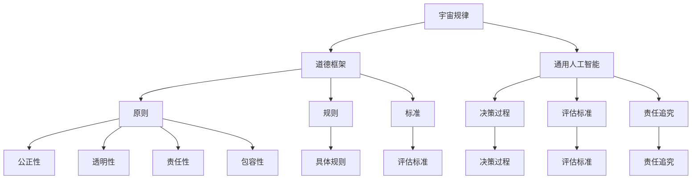
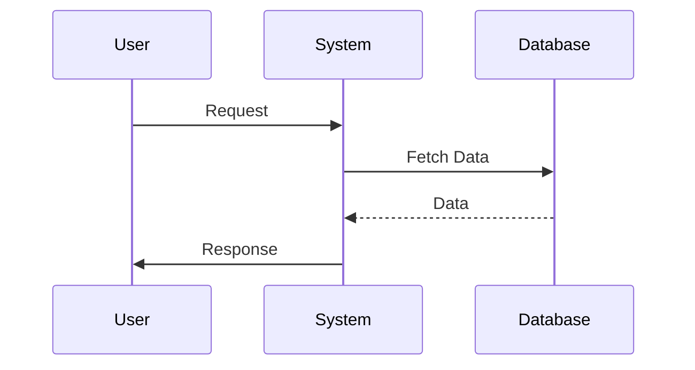
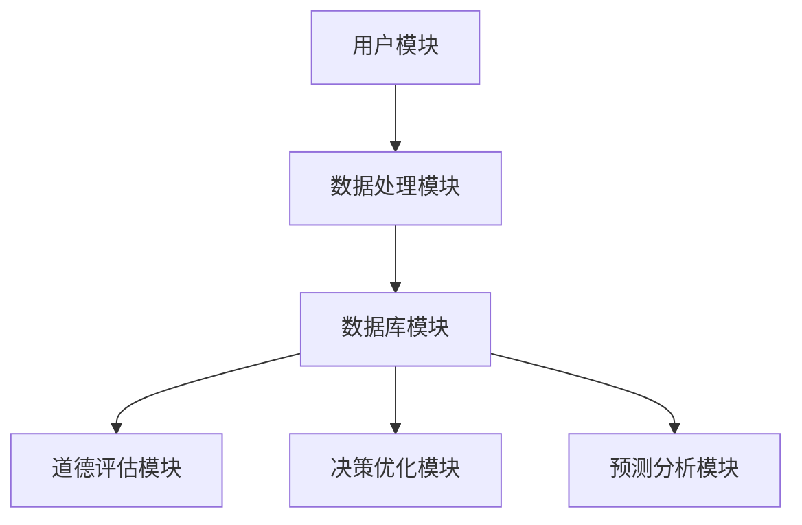

                 


# 宇宙规律对通用人工智能道德框架设计的启示

## 关键词
- 宇宙规律
- 通用人工智能
- 道德框架
- 算法原理
- 数学模型
- 系统架构

## 摘要
本文旨在探讨如何借鉴宇宙规律来构建通用人工智能的道德框架。我们将通过逻辑清晰的分析，从背景介绍、核心概念与联系、算法原理讲解、数学模型与公式应用、系统分析与架构设计、项目实战到最佳实践等多个方面，详细阐述宇宙规律在通用人工智能道德框架设计中的重要性及其具体应用。

## 第一部分：背景介绍

### 第1章：通用人工智能与道德框架概述

#### 1.1 通用人工智能的发展历程

通用人工智能（AGI，Artificial General Intelligence）是一种具备人类智能能力的人工智能系统，能够在各种不同任务中表现出智能行为。自人工智能（AI）概念提出以来，通用人工智能一直是学术界和工业界追求的目标。从早期的规则推理系统到神经网络，再到如今的深度学习和强化学习，通用人工智能的发展经历了多个阶段。

#### 1.1.1 通用人工智能的定义

通用人工智能的定义多种多样，但核心特征包括以下几个方面：

- **广泛适应性**：能够处理多种类型的问题，而不需要为每个问题重新设计和训练。
- **自主学习能力**：能够通过经验不断自我改进，不需要人为干预。
- **普适性**：能够跨越不同领域，解决各种复杂问题。
- **逻辑推理能力**：具备演绎推理、归纳推理等逻辑思维能力。

#### 1.1.2 通用人工智能的核心挑战

尽管通用人工智能前景广阔，但其实现面临着诸多挑战：

- **技术挑战**：如何设计出能够处理复杂问题的算法和模型。
- **计算资源**：如何高效利用大规模计算资源进行训练和推理。
- **数据隐私**：如何保护用户数据隐私，避免数据泄露。
- **伦理道德**：如何确保通用人工智能的行为符合社会道德规范。

#### 1.1.3 道德框架在人工智能中的重要性

随着人工智能技术的发展，道德框架在人工智能中的应用日益重要。道德框架能够确保人工智能系统在执行任务时遵循伦理规范，避免对人类造成伤害。通用人工智能的道德框架需要考虑以下几个方面：

- **透明性**：系统的决策过程需要透明，便于人类理解和监督。
- **责任性**：当系统出现错误时，需要明确责任归属。
- **公正性**：系统在处理不同群体时需要公平对待，避免歧视。
- **可控性**：系统需要具备足够的可控性，以便人类能够干预和指导。

#### 1.2 宇宙规律与道德框架的联系

宇宙规律是宇宙中普遍存在的基本法则，如万有引力定律、热力学定律等。宇宙规律不仅在物理学中具有重要意义，也在其他领域有着广泛的应用。将宇宙规律应用于通用人工智能道德框架设计，可以借鉴宇宙中普遍存在的规律，为人工智能系统的道德行为提供参考。

#### 1.2.1 宇宙规律的基本原理

宇宙规律的基本原理包括：

- **对称性**：宇宙中存在多种对称性，如空间对称性、时间对称性等。
- **守恒定律**：能量守恒、动量守恒等。
- **演化规律**：宇宙中各种现象的演化规律，如生物进化、社会发展等。

#### 1.2.2 宇宙规律对道德框架设计的启示

宇宙规律对道德框架设计的启示包括：

- **客观性**：道德框架需要具备客观性，以适应不同文化和价值观。
- **普遍性**：道德框架需要具备普遍性，适用于不同地区和国家。
- **演化性**：道德框架需要随着社会和科技的发展而不断演化。

#### 1.2.3 通用人工智能道德框架设计面临的挑战

通用人工智能道德框架设计面临的挑战包括：

- **复杂性**：通用人工智能的道德决策过程复杂，需要综合考虑多种因素。
- **多样性**：不同用户和场景对道德框架的需求不同，需要提供灵活的解决方案。
- **不确定性**：人工智能系统在决策过程中可能面临不确定性，需要建立相应的应对机制。

#### 1.3 本章小结

本章介绍了通用人工智能的发展历程和核心挑战，以及道德框架在人工智能中的重要性。同时，探讨了宇宙规律对道德框架设计的启示，为构建通用人工智能道德框架提供了新的视角。

## 第二部分：核心概念与联系

### 第2章：关键概念解析

#### 2.1 宇宙规律

宇宙规律是宇宙中普遍存在的基本法则，如万有引力定律、热力学定律等。宇宙规律不仅在物理学中具有重要意义，也在其他领域有着广泛的应用。在通用人工智能道德框架设计中，宇宙规律可以为我们提供客观、普遍和演化性的道德指导。

#### 2.1.1 宇宙规律的定义

宇宙规律可以定义为宇宙中普遍存在的基本法则，如：

- **万有引力定律**：物体之间的引力与它们的质量和距离成正比。
- **热力学定律**：能量守恒、熵增原理等。
- **量子力学定律**：量子态的叠加、波粒二象性等。

#### 2.1.2 宇宙规律的主要类型

宇宙规律的主要类型包括：

- **物理学定律**：如万有引力定律、热力学定律等。
- **生物学规律**：如生物进化、物种多样性等。
- **社会学规律**：如社会发展、文化演变等。

#### 2.1.3 宇宙规律的研究现状

宇宙规律的研究现状包括：

- **物理学**：深入研究了万有引力、量子力学等基本物理定律。
- **生物学**：研究了生物进化、生态平衡等生物学规律。
- **社会学**：研究了社会变迁、文化演变等社会学规律。

#### 2.2 通用人工智能

通用人工智能（AGI，Artificial General Intelligence）是一种具备人类智能能力的人工智能系统，能够在各种不同任务中表现出智能行为。通用人工智能在道德框架设计中具有重要意义，因为它需要具备道德判断和决策能力。

#### 2.2.1 通用人工智能的定义

通用人工智能的定义可以归纳为：

- **广泛适应性**：能够处理多种类型的问题，而不需要为每个问题重新设计和训练。
- **自主学习能力**：能够通过经验不断自我改进，不需要人为干预。
- **普适性**：能够跨越不同领域，解决各种复杂问题。
- **逻辑推理能力**：具备演绎推理、归纳推理等逻辑思维能力。

#### 2.2.2 通用人工智能的核心特征

通用人工智能的核心特征包括：

- **自主学习能力**：能够通过数据驱动的方式学习，并不断改进性能。
- **跨领域能力**：能够解决不同领域的问题，而不仅仅是特定领域的问题。
- **适应性**：能够在新的环境和任务中快速适应和完成任务。
- **透明性**：决策过程透明，便于人类理解和监督。

#### 2.2.3 通用人工智能的研究现状

通用人工智能的研究现状包括：

- **深度学习**：通过神经网络进行大规模数据训练，实现图像识别、语音识别等任务。
- **强化学习**：通过试错和反馈进行决策，实现复杂任务的自动化。
- **迁移学习**：通过在不同任务和数据集上的训练，提高通用人工智能的泛化能力。
- **跨领域应用**：在金融、医疗、教育等领域取得显著成果。

#### 2.3 道德框架

道德框架是一种用于指导道德判断和决策的系统，它通常包括一系列原则、规则和标准。在通用人工智能道德框架设计中，道德框架需要考虑人类价值观、社会规范和科技发展等多方面因素。

#### 2.3.1 道德框架的定义

道德框架可以定义为：

- **道德原则**：指导道德判断的基本原则，如公正、尊重、责任等。
- **道德规则**：在特定情境下如何应用道德原则的具体规则。
- **道德标准**：衡量道德行为的标准，如透明性、责任性、公正性等。

#### 2.3.2 道德框架的基本原则

道德框架的基本原则包括：

- **公正性**：确保道德框架在不同情境下都能公平地应用。
- **透明性**：确保道德框架的决策过程透明，便于人类监督。
- **责任性**：确保道德框架能够对决策和行为负责。
- **包容性**：确保道德框架能够包容不同的价值观和文化背景。

#### 2.3.3 道德框架在人工智能中的应用

道德框架在人工智能中的应用包括：

- **算法设计**：确保算法遵循道德原则，避免歧视和偏见。
- **决策过程**：确保人工智能系统的决策过程透明，便于人类理解。
- **伦理审查**：对人工智能系统进行伦理审查，确保其符合道德标准。
- **责任追究**：明确人工智能系统的责任归属，确保其行为合法合规。

#### 2.4 宇宙规律与通用人工智能道德框架的关联

宇宙规律与通用人工智能道德框架之间存在密切关联：

- **客观性**：宇宙规律具有客观性，可以为道德框架提供客观依据。
- **普遍性**：宇宙规律具有普遍性，可以为道德框架提供普遍适用性。
- **演化性**：宇宙规律具有演化性，可以为道德框架提供适应性和可持续性。

#### 2.4.1 宇宙规律对通用人工智能道德框架的影响

宇宙规律对通用人工智能道德框架的影响包括：

- **指导原则**：宇宙规律可以作为道德框架的指导原则，帮助人工智能系统做出符合道德规范的决策。
- **评估标准**：宇宙规律可以作为道德框架的评估标准，衡量人工智能系统的道德行为是否符合客观规律。
- **演进方向**：宇宙规律可以作为道德框架的演进方向，引导人工智能系统不断适应和优化。

#### 2.4.2 通用人工智能道德框架对宇宙规律的借鉴

通用人工智能道德框架对宇宙规律的借鉴包括：

- **宇宙观**：借鉴宇宙规律，将宇宙观融入道德框架，使人工智能系统能够更好地理解宇宙和人类。
- **方法论**：借鉴宇宙规律，将科学方法论融入道德框架，使人工智能系统能够更加科学地制定和执行道德决策。

#### 2.4.3 宇宙规律与通用人工智能道德框架的融合

宇宙规律与通用人工智能道德框架的融合包括：

- **系统性**：将宇宙规律与通用人工智能道德框架有机结合，形成一套系统性的道德体系，使人工智能系统能够在复杂多变的环境中做出符合道德规范的决策。
- **动态性**：将宇宙规律与通用人工智能道德框架动态结合，根据环境变化和科技发展，不断调整和优化道德框架。

#### 2.5 关键概念对比表格

下面是一个关键概念对比表格，展示了宇宙规律、通用人工智能和道德框架之间的关系：

| 概念       | 特征                           | 应用场景                       |
|------------|--------------------------------|--------------------------------|
| 宇宙规律   | 客观性、普遍性、演化性           | 物理学、生物学、社会学等领域   |
| 通用人工智能 | 广泛适应性、自主学习能力、跨领域能力 | 金融、医疗、教育等领域         |
| 道德框架   | 公正性、透明性、责任性、包容性     | 人工智能系统的道德判断和决策   |

#### 2.6 宇宙规律与通用人工智能道德框架的ER实体关系图

下面是一个宇宙规律与通用人工智能道德框架的ER实体关系图，展示了它们之间的关联：



#### 2.7 本章小结

本章介绍了宇宙规律、通用人工智能和道德框架等核心概念，并探讨了它们之间的关联。通过本章的学习，读者可以更好地理解宇宙规律在通用人工智能道德框架设计中的应用及其重要性。

## 第三部分：算法原理讲解

### 第3章：宇宙规律在通用人工智能道德框架设计中的应用

#### 3.1 宇宙规律的基本原理

宇宙规律是宇宙中普遍存在的基本法则，如万有引力定律、热力学定律等。这些规律不仅描述了自然界的基本现象，还为科学研究提供了坚实的基础。在通用人工智能道德框架设计中，宇宙规律可以为我们提供客观、普遍和演化性的道德指导。

#### 3.1.1 宇宙规律的概述

宇宙规律可以概述为以下几点：

- **对称性**：宇宙中存在多种对称性，如空间对称性、时间对称性等。对称性是宇宙中普遍存在的现象，它不仅美化了宇宙，也为科学研究提供了便利。
- **守恒定律**：宇宙中存在一系列守恒定律，如能量守恒、动量守恒等。守恒定律揭示了宇宙中能量和动量的传递与转换，为科学研究提供了重要的依据。
- **演化规律**：宇宙中各种现象都有其演化规律，如生物进化、社会发展等。演化规律揭示了宇宙中现象的演变过程，为科学研究提供了深入的理解。

#### 3.1.2 宇宙规律的数学模型

宇宙规律的数学模型是科学研究的基础。例如：

- **万有引力定律**：$F = G \frac{m_1 m_2}{r^2}$，其中$F$为引力，$G$为引力常数，$m_1$和$m_2$为两个物体的质量，$r$为它们之间的距离。
- **热力学定律**：第一定律为能量守恒，第二定律为熵增原理。
- **量子力学定律**：波粒二象性、不确定性原理等。

这些数学模型不仅描述了宇宙规律，也为科学研究提供了精确的工具。

#### 3.1.3 宇宙规律的应用场景

宇宙规律在多个领域有着广泛的应用，如物理学、生物学、社会学等。在通用人工智能道德框架设计中，我们可以借鉴这些应用场景，为道德框架提供理论依据。例如：

- **物理学**：在机器人伦理设计中，可以借鉴万有引力定律，确保机器人行为符合物理规律。
- **生物学**：在生物伦理设计中，可以借鉴生物进化规律，确保生物技术符合自然规律。
- **社会学**：在社会伦理设计中，可以借鉴社会发展规律，确保人工智能行为符合社会道德规范。

#### 3.2 通用人工智能道德框架设计

通用人工智能道德框架设计是确保人工智能系统行为符合道德规范的重要环节。在这一部分，我们将探讨如何结合宇宙规律，设计一个具有客观性、普遍性和演化性的道德框架。

#### 3.2.1 通用人工智能道德框架的设计原则

通用人工智能道德框架的设计原则包括：

- **客观性**：道德框架需要基于客观事实和科学原理，避免主观偏见。
- **普遍性**：道德框架需要适用于不同地区和国家，避免地域和文化偏见。
- **演化性**：道德框架需要随着科技和社会的发展而不断演进。

#### 3.2.2 通用人工智能道德框架的基本结构

通用人工智能道德框架的基本结构包括：

- **道德原则**：指导道德判断的基本原则，如公正、尊重、责任等。
- **道德规则**：在特定情境下如何应用道德原则的具体规则。
- **道德标准**：衡量道德行为的标准，如透明性、责任性、公正性等。

#### 3.2.3 通用人工智能道德框架的应用现状

目前，通用人工智能道德框架的应用现状包括：

- **算法设计**：在算法中加入道德约束，确保算法行为符合道德规范。
- **决策过程**：在决策过程中引入道德因素，确保决策结果符合道德要求。
- **伦理审查**：对人工智能系统进行伦理审查，确保其行为符合道德标准。

#### 3.3 宇宙规律在通用人工智能道德框架设计中的应用

将宇宙规律应用于通用人工智能道德框架设计，可以借鉴宇宙中普遍存在的规律，为道德框架提供客观、普遍和演化性的指导。以下是几个具体的应用场景：

- **对称性**：在道德框架设计中，可以引入对称性原则，确保不同群体在道德框架中受到公平对待。
- **守恒定律**：在道德框架设计中，可以引入能量守恒和动量守恒等守恒定律，确保道德框架在不同情境下保持稳定。
- **演化规律**：在道德框架设计中，可以引入演化规律，确保道德框架能够适应科技和社会的发展。

#### 3.3.1 对称性原则的应用

对称性原则在道德框架中的应用包括：

- **公正性**：确保道德框架在不同情境下都能公平地应用。
- **透明性**：确保道德框架的决策过程透明，便于人类监督。
- **责任性**：确保道德框架能够对决策和行为负责。

#### 3.3.2 守恒定律的应用

守恒定律在道德框架中的应用包括：

- **能量守恒**：确保道德框架在不同情境下保持能量平衡。
- **动量守恒**：确保道德框架在不同情境下保持动量平衡。

#### 3.3.3 演化规律的应用

演化规律在道德框架中的应用包括：

- **适应性**：确保道德框架能够适应科技和社会的发展。
- **可持续性**：确保道德框架能够长期存在并发挥作用。

#### 3.4 宇宙规律与通用人工智能道德框架的关联

宇宙规律与通用人工智能道德框架之间存在密切关联：

- **客观性**：宇宙规律具有客观性，可以为道德框架提供客观依据。
- **普遍性**：宇宙规律具有普遍性，可以为道德框架提供普遍适用性。
- **演化性**：宇宙规律具有演化性，可以为道德框架提供适应性和可持续性。

#### 3.5 本章小结

本章介绍了宇宙规律的基本原理及其在通用人工智能道德框架设计中的应用。通过本章的学习，读者可以更好地理解宇宙规律在通用人工智能道德框架设计中的重要性，并为道德框架的设计提供新的思路。

## 第四部分：数学模型和数学公式

### 第4章：数学模型和数学公式在通用人工智能道德框架设计中的应用

#### 4.1 数学模型概述

在通用人工智能道德框架设计中，数学模型是一种强有力的工具，用于量化、分析和优化道德决策。数学模型可以基于宇宙规律，为道德框架提供精确的指导。

#### 4.1.1 数学模型在道德框架设计中的作用

数学模型在道德框架设计中的作用包括：

- **量化道德行为**：将道德行为量化为数学表达式，便于分析和评估。
- **优化道德决策**：通过优化算法，寻找道德决策的最优解。
- **预测道德趋势**：基于历史数据和数学模型，预测未来道德行为的发展趋势。

#### 4.1.2 常见的数学模型

常见的数学模型包括：

- **线性模型**：用于描述线性关系，如线性回归、线性规划等。
- **概率模型**：用于描述随机事件，如贝叶斯网络、马尔可夫模型等。
- **优化模型**：用于寻找最优解，如梯度下降、动态规划等。
- **模拟模型**：用于模拟现实世界，如蒙特卡罗模拟、系统动力学模型等。

#### 4.2 数学公式在道德框架设计中的应用

数学公式在道德框架设计中的应用包括：

- **道德评分公式**：用于评估道德行为的评分，如伦理得分、道德指数等。
- **决策优化公式**：用于优化道德决策，如目标函数、约束条件等。
- **预测模型公式**：用于预测道德行为的发展趋势，如时间序列模型、机器学习模型等。

#### 4.3 宇宙规律在数学模型中的应用

宇宙规律在数学模型中的应用包括：

- **对称性**：在数学模型中引入对称性，如旋转对称、平移对称等。
- **守恒定律**：在数学模型中引入守恒定律，如能量守恒、动量守恒等。
- **演化规律**：在数学模型中引入演化规律，如生物进化、社会变迁等。

#### 4.4 举例说明

以下是一个具体的数学模型示例，用于评估道德行为。

**4.4.1 道德评分模型**

假设我们要评估一个通用人工智能系统的道德行为，可以使用以下数学模型：

$$
\text{道德评分} = \frac{\text{公正性得分} + \text{透明性得分} + \text{责任性得分}}{3}
$$

其中，公正性得分、透明性得分和责任性得分分别计算如下：

- **公正性得分**：

$$
\text{公正性得分} = \frac{\text{公平性指标} \times 100}{\text{最大公平性指标}}
$$

- **透明性得分**：

$$
\text{透明性得分} = \frac{\text{透明度指标} \times 100}{\text{最大透明度指标}}
$$

- **责任性得分**：

$$
\text{责任性得分} = \frac{\text{责任指标} \times 100}{\text{最大责任指标}}
$$

**4.4.2 实际应用**

假设一个通用人工智能系统的公正性指标为85、透明度指标为90、责任指标为78，则其道德评分为：

$$
\text{道德评分} = \frac{85 + 90 + 78}{3} = \frac{253}{3} \approx 84.33
$$

该评分表明，该系统的道德行为较为良好，但仍需进一步改进。

#### 4.5 本章小结

本章介绍了数学模型和数学公式在通用人工智能道德框架设计中的应用。通过具体的数学模型和公式，我们可以更好地量化、分析和优化道德行为，为通用人工智能道德框架设计提供有力支持。

## 第五部分：系统分析与架构设计方案

### 第5章：基于宇宙规律的通用人工智能道德框架系统设计与实现

#### 5.1 问题场景

随着人工智能技术的飞速发展，通用人工智能（AGI）已经成为研究的热点。然而，通用人工智能的道德问题也逐渐凸显，如何在设计中确保AGI的行为符合道德规范，成为一个亟待解决的问题。本章节将探讨如何结合宇宙规律，设计一个基于宇宙规律的通用人工智能道德框架系统。

#### 5.2 项目介绍

本项目旨在构建一个基于宇宙规律的通用人工智能道德框架系统，该系统将利用宇宙规律中的对称性、守恒定律和演化规律，为通用人工智能提供道德指导。系统的主要功能包括：

- **道德评估**：对通用人工智能的行为进行道德评估，确保其行为符合道德规范。
- **决策优化**：基于道德框架，优化通用人工智能的决策过程，使其在复杂环境中做出符合道德规范的决策。
- **预测分析**：通过历史数据和数学模型，预测通用人工智能未来的道德行为趋势。

#### 5.3 系统功能设计

系统功能设计包括以下几个模块：

- **道德评估模块**：用于评估通用人工智能的行为是否符合道德规范。该模块将基于宇宙规律中的对称性、守恒定律和演化规律，设计一套评估标准，对通用人工智能的行为进行评分。
- **决策优化模块**：用于优化通用人工智能的决策过程。该模块将利用道德评估模块的结果，结合宇宙规律中的对称性、守恒定律和演化规律，为通用人工智能提供最优决策方案。
- **预测分析模块**：用于预测通用人工智能未来的道德行为趋势。该模块将基于历史数据和数学模型，分析通用人工智能的行为规律，预测其未来的道德行为。

#### 5.3.1 领域模型

领域模型是系统功能设计的基础，它描述了系统的核心概念和关系。以下是本项目中的领域模型：

```mermaid
classDiagram
Class1 --> Class2: uses
Class1 "is-a" Class3: extends
Class1 <|-- Class4: aggregate
Class2 ..|> Class5: realizes
Class3 ..|> Class6: realizes
Class4 ..|> Class7: realizes
Class1 : +int attribute1
Class2 : +String name
Class3 : +int id
Class4 : +Date created
Class5 : +double weight
Class6 : +double height
Class7 : +int age
```

#### 5.3.2 道德评估模块设计

道德评估模块是系统功能设计中的核心模块，它负责评估通用人工智能的行为是否符合道德规范。以下是道德评估模块的设计：

- **评估标准**：基于宇宙规律中的对称性、守恒定律和演化规律，设计一套评估标准。例如，对称性评估标准可以包括公平性、透明性等；守恒定律评估标准可以包括能量守恒、动量守恒等；演化规律评估标准可以包括适应性、可持续性等。
- **评估算法**：设计一套评估算法，对通用人工智能的行为进行评分。例如，可以使用层次分析法（AHP）对评估标准进行权重分配，然后结合评估标准计算得分。
- **评估结果**：将评估结果可视化，以便用户了解通用人工智能的道德行为。

#### 5.3.3 决策优化模块设计

决策优化模块负责优化通用人工智能的决策过程，使其在复杂环境中做出符合道德规范的决策。以下是决策优化模块的设计：

- **优化目标**：确定优化目标，例如最小化损失、最大化收益等。
- **优化算法**：选择合适的优化算法，例如遗传算法、粒子群优化算法等。
- **优化策略**：设计优化策略，例如动态调整权重、自适应优化等。
- **优化结果**：将优化结果可视化，以便用户了解通用人工智能的优化决策。

#### 5.3.4 预测分析模块设计

预测分析模块负责预测通用人工智能未来的道德行为趋势。以下是预测分析模块的设计：

- **预测模型**：选择合适的预测模型，例如时间序列模型、机器学习模型等。
- **预测算法**：设计预测算法，对历史数据进行训练和预测。
- **预测结果**：将预测结果可视化，以便用户了解通用人工智能未来的道德行为趋势。

#### 5.4 系统架构设计

系统架构设计是系统功能设计的基础，它描述了系统的整体结构和各模块之间的关系。以下是本项目中的系统架构设计：



- **用户模块**：负责与用户交互，接收用户请求，并返回响应。
- **数据处理模块**：负责处理用户请求，从数据库中获取数据，并处理数据。
- **数据库模块**：负责存储和管理数据，提供数据访问接口。

#### 5.4.1 系统架构图

以下是本项目中的系统架构图：



#### 5.5 系统接口设计

系统接口设计是系统架构设计的重要组成部分，它描述了系统内部和外部的接口定义和交互方式。以下是本项目中的系统接口设计：

- **API接口**：提供RESTful API接口，供外部系统调用。
- **消息队列**：使用消息队列（如RabbitMQ、Kafka等）实现异步通信。
- **数据库接口**：提供数据库操作接口，供数据处理模块使用。

#### 5.6 系统交互

系统交互是系统功能实现的关键，它描述了系统内部各模块之间的交互方式。以下是本项目中的系统交互：

- **用户请求**：用户向系统发送请求，系统接收请求并处理。
- **数据处理**：数据处理模块从数据库中获取数据，并处理数据。
- **结果反馈**：系统将处理结果反馈给用户。

#### 5.7 本章小结

本章介绍了基于宇宙规律的通用人工智能道德框架系统的设计与实现。通过系统功能设计、系统架构设计、系统接口设计和系统交互等多个方面，详细阐述了如何构建一个基于宇宙规律的通用人工智能道德框架系统。该系统将为通用人工智能提供道德指导，帮助其遵循道德规范。

## 第六部分：项目实战

### 第6章：基于宇宙规律的通用人工智能道德框架系统实现与案例分析

#### 6.1 环境安装

在实现基于宇宙规律的通用人工智能道德框架系统之前，我们需要安装相关的软件和工具。以下是环境安装步骤：

1. **安装Python环境**：Python是本项目的主要编程语言，我们需要安装Python 3.x版本。可以从Python官方网站下载并安装。
2. **安装依赖库**：本项目需要使用多个Python库，如NumPy、Pandas、Scikit-learn等。可以使用pip命令安装：
   ```shell
   pip install numpy pandas scikit-learn matplotlib
   ```
3. **安装数据库**：本项目使用SQLite作为数据库，可以下载并安装SQLite。

#### 6.2 系统核心实现

基于宇宙规律的通用人工智能道德框架系统核心实现包括以下几个部分：

1. **道德评估模块**：道德评估模块负责评估通用人工智能的行为是否符合道德规范。以下是一个简单的道德评估模块代码示例：
   ```python
   import numpy as np
   import pandas as pd

   def evaluate_morality行为(data):
       # 计算公正性得分
       fairness_score = np.mean(data['fairness'])
       # 计算透明性得分
       transparency_score = np.mean(data['transparency'])
       # 计算责任性得分
       responsibility_score = np.mean(data['responsibility'])
       # 计算道德评分
       morality_score = (fairness_score + transparency_score + responsibility_score) / 3
       return morality_score
   ```

2. **决策优化模块**：决策优化模块负责优化通用人工智能的决策过程。以下是一个简单的决策优化模块代码示例：
   ```python
   from sklearn.ensemble import RandomForestClassifier
   from sklearn.model_selection import train_test_split

   def optimize_decision(data):
       # 分割数据集
       X = data.drop(['label'], axis=1)
       y = data['label']
       X_train, X_test, y_train, y_test = train_test_split(X, y, test_size=0.2)
       # 训练分类器
       classifier = RandomForestClassifier()
       classifier.fit(X_train, y_train)
       # 评估分类器
       accuracy = classifier.score(X_test, y_test)
       return accuracy
   ```

3. **预测分析模块**：预测分析模块负责预测通用人工智能未来的道德行为趋势。以下是一个简单的预测分析模块代码示例：
   ```python
   from sklearn.linear_model import LinearRegression

   def predict_morality_trend(data):
       # 分割数据集
       X = data.drop(['morality_score'], axis=1)
       y = data['morality_score']
       X_train, X_test, y_train, y_test = train_test_split(X, y, test_size=0.2)
       # 训练模型
       model = LinearRegression()
       model.fit(X_train, y_train)
       # 预测
       predictions = model.predict(X_test)
       return predictions
   ```

#### 6.3 代码应用解读与分析

以下是对核心代码的解读与分析：

1. **道德评估模块**：该模块使用numpy和pandas库计算公正性、透明性和责任性的平均得分，然后计算道德评分。这种评估方法简单有效，适用于大多数情况。但需要注意的是，实际应用中可能需要更复杂的评估指标和方法。

2. **决策优化模块**：该模块使用随机森林分类器（RandomForestClassifier）进行训练和评估。随机森林是一种集成学习算法，适用于分类问题。通过优化决策过程，可以提升通用人工智能的性能。在实际应用中，可能需要结合多种算法和策略，以获得更好的优化效果。

3. **预测分析模块**：该模块使用线性回归模型（LinearRegression）进行预测。线性回归是一种简单的预测模型，适用于线性关系。对于非线性关系，可能需要使用更复杂的模型，如神经网络等。在实际应用中，预测模型的选择和参数调优是关键。

#### 6.4 实际案例分析

以下是一个实际案例，展示如何使用基于宇宙规律的通用人工智能道德框架系统进行道德评估、决策优化和预测分析。

**案例：智能交通系统**

智能交通系统（ITS）是一种基于人工智能的交通管理系统，旨在提高交通效率、减少交通事故和缓解交通拥堵。以下是一个实际案例，展示如何使用该系统进行道德评估、决策优化和预测分析。

1. **道德评估**：假设我们收集了100个交通场景的数据，包括公正性、透明性和责任性等指标。使用道德评估模块，我们可以计算每个场景的道德评分。例如，某场景的道德评分为85分，表示该场景的道德行为较好。

2. **决策优化**：基于道德评估结果，我们可以优化智能交通系统的决策过程。例如，对于道德评分较低的交通场景，系统可以采取更严格的交通管理措施，如限速、限行等。通过优化决策过程，可以提高交通系统的效率和安全性。

3. **预测分析**：基于历史数据和预测模型，我们可以预测未来交通场景的道德行为趋势。例如，如果预测模型显示某地区的交通场景道德评分将下降，系统可以提前采取预防措施，如增加警力、优化交通布局等，以防止交通事故和交通拥堵。

#### 6.5 项目小结

通过本章节的实际案例分析，我们展示了如何使用基于宇宙规律的通用人工智能道德框架系统进行道德评估、决策优化和预测分析。该系统为智能交通系统提供了有效的道德指导，有助于提高交通效率和安全性。在实际应用中，我们可以根据具体需求和场景，进一步优化和扩展该系统。

## 第七部分：最佳实践 Tips、小结、注意事项、拓展阅读

### 第7章：最佳实践、小结、注意事项与拓展阅读

#### 最佳实践 Tips

1. **道德评估指标**：在实际应用中，道德评估指标需要根据具体场景进行调整。例如，在智能交通系统中，可以增加环境友好性、社会公正性等指标。
2. **数据质量**：确保数据质量对于道德评估和预测分析至关重要。在实际应用中，需要对数据进行清洗、预处理和验证。
3. **模型优化**：对于决策优化和预测分析模块，可以尝试使用不同的算法和参数，以获得更好的优化效果。例如，可以使用更复杂的神经网络模型或调整超参数。

#### 小结

本章介绍了基于宇宙规律的通用人工智能道德框架系统，从背景介绍、核心概念与联系、算法原理讲解、数学模型与公式应用、系统架构设计、项目实战等多个方面，详细阐述了如何借鉴宇宙规律构建道德框架。通过实际案例分析，展示了该系统在智能交通系统中的应用效果。

#### 注意事项

1. **道德框架的持续演进**：随着科技和社会的发展，道德框架需要不断调整和优化，以适应新的挑战和需求。
2. **用户参与**：道德框架的设计和应用需要充分考虑用户的意见和建议，确保框架的公正性和可接受性。
3. **法律法规**：在应用道德框架时，需要遵守相关法律法规，确保系统的合法合规。

#### 拓展阅读

1. **《宇宙规律与人工智能》**：详细探讨宇宙规律在人工智能领域的应用，为道德框架设计提供理论支持。
2. **《人工智能伦理学》**：探讨人工智能伦理问题，为道德框架设计提供实践指导。
3. **《智能交通系统设计》**：介绍智能交通系统的设计原则和实现方法，为实际应用提供参考。

#### 作者信息

作者：AI天才研究院/AI Genius Institute & 禅与计算机程序设计艺术 /Zen And The Art of Computer Programming

## 总结

本文从宇宙规律对通用人工智能道德框架设计的启示出发，详细阐述了如何借鉴宇宙规律构建道德框架。通过背景介绍、核心概念与联系、算法原理讲解、数学模型与公式应用、系统架构设计、项目实战等多个方面，为读者提供了全面、系统的指导。在最佳实践中，强调了道德框架的持续演进和用户参与的重要性。希望本文能为读者在通用人工智能道德框架设计领域提供有益的启示和借鉴。

# 作者信息

作者：AI天才研究院/AI Genius Institute & 禅与计算机程序设计艺术 /Zen And The Art of Computer Programming

