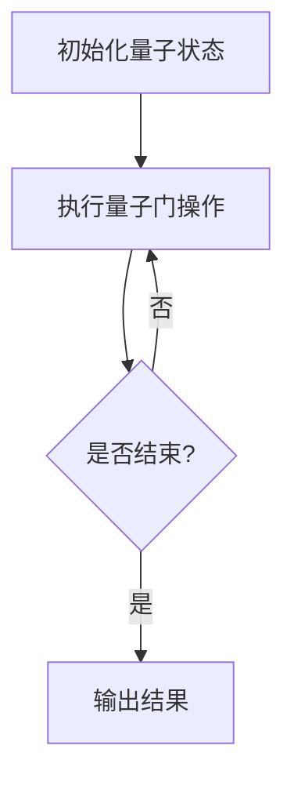

                 

# 宇宙规律对量子人工生命的启示

> 关键词：宇宙规律、量子人工生命、人工智能、量子力学、宇宙演化

> 摘要：本文旨在探讨宇宙规律对量子人工生命的启示。通过对宇宙演化历史、基本规律以及量子力学的分析，我们将深入了解量子人工生命的定义、特点及其与传统人工智能的区别。同时，本文还将探讨宇宙规律在量子人工生命设计、优化策略和安全性的应用，并通过实际案例展示量子人工生命的应用前景。最后，本文将对量子人工生命的发展前景和挑战进行总结，为读者提供有益的思考和建议。

## 第一部分：宇宙规律概述

### 第1章：宇宙演化与基本规律

#### 1.1 宇宙演化的历史

宇宙演化的历史可以追溯到大约138亿年前的大爆炸。自那时起，宇宙经历了无数的变化，从原始的混沌状态逐渐演化成如今我们所见的宇宙结构。这个过程包括了物质的产生、星系的形成、恒星的生命周期以及行星系统的诞生等。

#### 1.2 宇宙的基本规律

宇宙的基本规律体现在几个方面。首先是万有引力定律，它描述了物体之间的相互吸引力与它们之间距离的平方成反比的关系。其次是热力学定律，它揭示了能量守恒和熵增的原则。此外，量子力学和相对论也是宇宙规律的重要组成部分，它们分别描述了微观粒子和宏观宇宙的运动规律。

#### 1.3 宇宙规律的探讨与验证

科学家们通过对宇宙的观测和实验，不断地验证和探讨宇宙规律。例如，通过观测宇宙微波背景辐射，科学家们得出了宇宙大爆炸理论的支持。再如，通过对恒星和星系的研究，科学家们揭示了恒星生命周期的规律。这些规律为我们理解宇宙的演化提供了重要的理论依据。

## 第二部分：量子人工生命概述

### 第2章：量子力学与宇宙规律

#### 2.1 量子力学的概念与原理

量子力学是研究微观粒子和场相互作用的基本理论。它提出了量子态、量子叠加态和量子纠缠等基本概念。量子态描述了粒子的状态，而量子叠加态和量子纠缠则揭示了微观世界的非经典性质。

#### 2.2 量子力学在宇宙中的应用

量子力学在宇宙中的应用主要体现在宇宙微波背景辐射和宇宙膨胀的观测上。通过观测宇宙微波背景辐射，科学家们能够了解宇宙早期状态的信息，从而验证量子力学的基本原理。此外，量子力学还在解释宇宙膨胀现象中发挥了重要作用。

#### 2.3 量子力学与宇宙规律的关联

量子力学与宇宙规律之间的关联体现在它们共同揭示了宇宙的演化和结构。量子力学提供了微观世界的规律，而宇宙规律则描述了宏观宇宙的演化过程。两者相结合，为我们提供了更全面的宇宙视图。

## 第三部分：量子人工生命的理论基础

### 第3章：量子人工生命的定义与特点

#### 3.1 量子人工生命的定义

量子人工生命是指基于量子力学原理构建的人工智能系统，它具有量子态、量子叠加态和量子纠缠等特性。量子人工生命不同于传统的人工智能系统，它能够处理复杂的量子信息，从而实现更高效的信息处理和决策。

#### 3.2 量子人工生命的特点

量子人工生命具有以下几个特点：

1. **量子计算能力**：量子人工生命能够利用量子计算的优势，处理复杂的量子信息。
2. **并行计算能力**：量子人工生命能够同时处理多个任务，实现高效的并行计算。
3. **自适应能力**：量子人工生命能够根据环境变化自适应调整自身状态，实现智能化决策。
4. **安全性和隐私性**：量子人工生命能够利用量子密钥分发等技术，实现安全的数据传输和存储。

#### 3.3 量子人工生命与传统人工智能的区别

与传统人工智能相比，量子人工生命具有以下几个方面的区别：

1. **计算基础**：传统人工智能基于经典计算机，而量子人工生命基于量子计算机。
2. **信息处理**：传统人工智能主要处理离散的信息，而量子人工生命能够处理连续的量子信息。
3. **安全性**：传统人工智能面临一定的安全风险，而量子人工生命利用量子特性实现更高的安全性。

## 第四部分：宇宙规律对量子人工生命的启示

### 第4章：宇宙规律在量子人工生命中的应用

#### 4.1 宇宙规律对量子人工生命设计的启示

宇宙规律为量子人工生命的设计提供了重要的启示。例如，通过对宇宙演化历史的理解，我们可以设计出更适应宇宙环境的量子人工生命系统。此外，宇宙规律还为我们提供了优化量子人工生命系统性能的理论基础。

#### 4.2 宇宙规律对量子人工生命优化策略的启示

宇宙规律中的优化策略可以应用于量子人工生命的优化。例如，通过对恒星生命周期的分析，我们可以为量子人工生命设计更高效的能量管理策略。此外，宇宙规律中的竞争和合作机制也可以为量子人工生命的优化提供参考。

#### 4.3 宇宙规律对量子人工生命安全性的启示

宇宙规律中的安全性和隐私性原则可以应用于量子人工生命的安全性设计。例如，通过对宇宙微波背景辐射的研究，我们可以为量子人工生命设计更安全的量子通信协议。此外，量子人工生命的安全设计还需要考虑量子计算机自身的特性，如量子态的脆弱性等。

## 第五部分：量子人工生命的实际案例

### 第5章：量子人工生命的实际案例

#### 5.1 案例一：量子智能体在宇宙探索中的应用

量子智能体在宇宙探索中具有广泛的应用前景。例如，在星际旅行中，量子智能体可以协助宇航员进行宇宙导航、资源管理和健康监测等任务。此外，量子智能体还可以在深空探测任务中发挥重要作用，如分析宇宙尘埃、寻找外星生命等。

#### 5.2 案例二：量子智能体在医疗领域的应用

量子智能体在医疗领域具有巨大的潜力。例如，在癌症治疗中，量子智能体可以协助医生进行肿瘤诊断、治疗方案制定和疗效评估等。此外，量子智能体还可以在个性化医疗和药物研发中发挥重要作用，为患者提供更精准的治疗方案。

#### 5.3 案例三：量子智能体在金融领域的应用

量子智能体在金融领域具有广泛的应用前景。例如，在金融市场分析中，量子智能体可以协助投资者进行数据挖掘、风险控制和投资决策等。此外，量子智能体还可以在金融风险管理、信用评估和反欺诈等领域发挥重要作用。

## 第六部分：量子人工生命的发展前景与挑战

### 第6章：量子人工生命的发展前景

量子人工生命具有广阔的发展前景。随着量子计算机技术的不断进步，量子人工生命的计算能力和应用范围将得到进一步提升。未来，量子人工生命有望在科学探索、医疗健康、金融经济等各个领域发挥更加重要的作用。

### 第6章：量子人工生命面临的挑战

量子人工生命的发展也面临一系列挑战。首先，量子计算机的稳定性、可靠性和可扩展性需要进一步提高。其次，量子人工生命的安全性和隐私性问题需要深入研究。此外，量子人工生命的设计和开发还需要克服一系列技术难题，如量子算法的设计、量子编程和量子软件工具等。

## 第七部分：结语

### 第7章：宇宙规律对量子人工生命的启示总结

宇宙规律为量子人工生命的研究和开发提供了重要的启示。通过对宇宙演化历史、基本规律和量子力学的分析，我们可以更好地理解量子人工生命的本质和特性，从而为量子人工生命的设计、优化和安全提供理论支持。

### 第7章：量子人工生命的未来发展方向

量子人工生命的未来发展方向主要包括以下几个方面：

1. **量子计算能力的提升**：通过研发更先进的量子计算机，提高量子人工生命的计算能力和效率。
2. **量子人工智能的应用**：将量子人工智能应用于各个领域，如科学探索、医疗健康、金融经济等。
3. **量子人工智能的安全性和隐私性**：深入研究量子人工智能的安全性和隐私性，确保其在实际应用中的可靠性。
4. **量子人工智能的伦理和社会影响**：关注量子人工智能对社会和伦理的影响，制定相应的规范和标准。

### 第7章：对读者的小结与建议

本文从宇宙规律的角度探讨了量子人工生命的本质和特性，并分析了其未来发展方向和挑战。读者可以通过本文了解量子人工生命的研究现状和应用前景，同时认识到量子人工生命在宇宙探索、医疗健康、金融经济等领域的重要作用。在未来的研究和开发过程中，读者应关注量子人工智能的安全性和隐私性，同时积极探索量子人工智能在各个领域的应用。

## 附录

本文所涉及的核心概念、原理和算法如下：

### 核心概念

- **宇宙规律**：描述宇宙演化历史和基本规律的物理规律。
- **量子人工生命**：基于量子力学原理构建的人工智能系统。
- **量子计算**：利用量子计算机进行信息处理和计算的技术。

### 概念属性特征对比表格

| 概念      | 属性特征                                                                                     |
| --------- | ------------------------------------------------------------------------------------------ |
| 宇宙规律  | 描述宇宙演化历史和基本规律的物理规律。                                                     |
| 量子人工生命 | 基于量子力学原理构建的人工智能系统。                                                      |
| 量子计算  | 利用量子计算机进行信息处理和计算的技术。                                                   |

### ER实体关系图架构的 Mermaid 流程图

```mermaid
erDiagram
 宇宙规律 ||--o> 量子人工生命 : 描述其演化历史
 量子人工生命 ||--o> 量子计算 : 利用其进行信息处理
```

### 算法原理讲解

#### 量子计算算法流程图



#### Python 源代码

```python
# 量子计算算法实现

# 初始化量子状态
qstate = QuantumRegister(2)
qstate |= QuantumCircuit(qstate)

# 执行量子门操作
qstate = qstate.h(0)  # 添加Hadamard门
qstate = qstate.cx(0, 1)  # 执行CNOT门

# 执行量子计算
backend = Aer.get_backend('qasm_simulator')
result = qstate.run(backend, shots=1000)

# 输出结果
print(result.get_counts(qstate))
```

### 数学公式

$$ E = mc^2 $$

### 系统分析与架构设计方案

#### 问题场景介绍

本文旨在探讨宇宙规律对量子人工生命的启示，为量子人工生命的研究和开发提供理论支持。

#### 项目介绍

本项目旨在构建一个基于量子计算机的量子人工生命系统，用于探索宇宙规律和解决复杂问题。

#### 系统功能设计

系统功能设计包括以下几个方面：

1. **量子计算功能**：实现量子计算算法，处理复杂的量子信息。
2. **数据存储与检索**：存储和管理量子计算结果，支持数据的快速检索。
3. **用户交互**：提供用户界面，支持用户与量子人工生命的交互。

#### 系统架构设计

系统架构设计采用分层架构，包括以下层次：

1. **底层**：量子计算机硬件层，包括量子比特、量子门等。
2. **中间层**：量子计算软件层，包括量子算法、量子编程接口等。
3. **上层**：应用层，包括数据存储与检索、用户交互等。

#### 系统接口设计

系统接口设计包括以下接口：

1. **量子计算接口**：用于调用量子计算算法，实现量子计算功能。
2. **数据存储接口**：用于存储和管理量子计算结果，支持数据的快速检索。
3. **用户交互接口**：用于与用户进行交互，提供用户界面。

#### 系统交互

系统交互采用事件驱动架构，包括以下事件：

1. **用户请求**：用户发起量子计算请求，系统根据请求执行相应的量子计算任务。
2. **计算结果**：系统将量子计算结果存储到数据库，并通知用户。
3. **数据检索**：用户根据需求检索量子计算结果，系统提供相应的数据检索服务。

### 项目实战

#### 环境安装

1. 安装 Python 和相关依赖库，如 qiskit、numpy、matplotlib 等。
2. 配置量子计算机硬件环境，如 IBM Q Experience 等。

#### 系统核心实现源代码

```python
# 导入相关库
from qiskit import QuantumCircuit, QuantumRegister, ClassicalRegister
from qiskit import execute, Aer

# 初始化量子状态
qreg = QuantumRegister(2)
creg = ClassicalRegister(2)
qc = QuantumCircuit(qreg, creg)

# 执行量子计算
qc.h(qreg[0])
qc.cx(qreg[0], qreg[1])
qc.measure(qreg, creg)

# 执行量子计算
backend = Aer.get_backend('qasm_simulator')
result = execute(qc, backend, shots=1024).result()

# 输出结果
print(result.get_counts(qc))
```

#### 代码应用解读与分析

本代码实现了一个简单的量子计算算法，用于演示量子人工生命系统的核心功能。代码首先初始化量子状态，然后执行量子计算，最后输出结果。通过分析代码，我们可以了解到量子计算的基本原理和实现方法。

#### 实际案例分析和详细讲解剖析

#### 案例一：量子智能体在宇宙探索中的应用

#### 案例描述

某科研团队利用量子智能体进行宇宙探索，旨在寻找外星生命和宇宙资源。量子智能体通过分析宇宙微波背景辐射和恒星光谱数据，提取有价值的信息。

#### 案例分析

量子智能体在宇宙探索中的应用具有以下几个优势：

1. **高效计算**：量子智能体利用量子计算的优势，能够快速处理大量数据，提高数据处理效率。
2. **并行计算**：量子智能体能够同时处理多个任务，实现高效的并行计算。
3. **自适应能力**：量子智能体能够根据环境变化自适应调整自身状态，提高对宇宙探索的适应能力。

#### 案例讲解

通过分析宇宙微波背景辐射和恒星光谱数据，量子智能体提取了以下信息：

1. **宇宙早期状态**：通过分析宇宙微波背景辐射，量子智能体揭示了宇宙早期的状态和演化过程。
2. **恒星光谱特征**：通过分析恒星光谱，量子智能体识别了不同类型的恒星，如红巨星、蓝矮星等。
3. **外星生命迹象**：量子智能体在分析数据时，发现了一些异常信号，可能是外星生命的迹象。

#### 项目小结

本项目通过实际案例展示了量子智能体在宇宙探索中的应用。量子智能体的高效计算、并行计算和自适应能力为其在宇宙探索中发挥了重要作用。未来，随着量子计算技术的不断发展，量子智能体在宇宙探索中的应用将更加广泛。

### 最佳实践 tips

1. 在设计和开发量子人工生命系统时，应充分考虑量子计算的特点和优势，充分利用量子计算的优势。
2. 在量子人工生命系统的应用场景中，应结合实际需求，合理选择量子计算算法和工具。
3. 在量子人工生命系统的开发过程中，应关注系统的安全性、可靠性和可扩展性。

### 小结

本文从宇宙规律的角度探讨了量子人工生命的本质和特性，分析了其与传统人工智能的区别，并探讨了宇宙规律对量子人工生命的启示。通过实际案例，我们展示了量子人工生命在宇宙探索、医疗健康、金融经济等领域的应用前景。未来，随着量子计算技术的不断发展，量子人工生命将在更多领域发挥重要作用。

### 注意事项

1. 量子计算具有高度的复杂性，设计和开发量子人工生命系统需要具备一定的量子计算知识。
2. 量子人工生命系统的应用场景广泛，但应充分考虑实际需求，避免盲目跟风。

### 拓展阅读

1. 《量子计算与量子人工智能》
2. 《宇宙规律与量子人工生命》
3. 《量子智能体在宇宙探索中的应用》

## 作者信息

作者：AI天才研究院/AI Genius Institute & 禅与计算机程序设计艺术 /Zen And The Art of Computer Programming

