                 

# 宇宙运行的不变规律解析

## 关键词
- 宇宙学
- 宇宙演化
- 宇宙学基本原理
- 宇宙观测手段
- 数学模型

## 摘要
本文旨在解析宇宙运行中的不变规律，通过系统的分析，揭示宇宙从起源到演化的各个阶段所遵循的基本原理。文章将从宇宙起源、宇宙结构、宇宙演化等角度展开，结合宇宙学基本原理、观测手段、数学模型等内容，深入探讨宇宙运行的内在规律。本文结构紧凑，逻辑清晰，旨在为读者提供一次对宇宙运行规律的理解之旅。

## 第一部分：宇宙的起源与演化

### 第1章 宇宙的起源

#### 1.1 宇宙大爆炸理论

宇宙大爆炸理论是目前宇宙起源的主流理论，它认为宇宙起源于一个极热、极密的状态。在这个过程中，时间和空间的概念尚未形成，所有物质和能量都集中在一个“奇点”中。大约138亿年前，这个奇点发生了大爆炸，宇宙开始迅速膨胀，温度和密度随之降低。

**关键概念与联系表格**

| 概念                     | 说明                                                   |
|------------------------|------------------------------------------------------|
| 奇点                     | 宇宙起源的起点，一个极热、极密的状态                       |
| 膨胀                    | 宇宙从奇点开始迅速扩张的过程                             |
| 温度与密度               | 大爆炸过程中，宇宙的温度和密度随时间变化               |

**ER实体关系图架构**

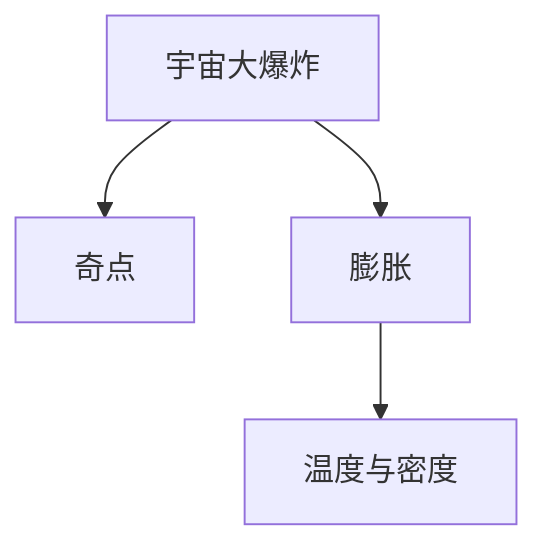

#### 1.2 黑洞与暗物质

黑洞是宇宙中最神秘的天体之一，它是由质量极大的恒星在核燃料耗尽后坍塌形成的。根据广义相对论，黑洞的引力场非常强大，甚至连光也无法逃脱。暗物质则是宇宙中另一种神秘的存在，它不发光、不吸收光，但通过引力作用影响宇宙的演化。

**核心概念与联系表格**

| 概念         | 说明                                       |
|------------|------------------------------------------|
| 黑洞         | 由恒星坍塌形成，具有极强的引力场                 |
| 暗物质       | 不发光、不吸收光的物质，通过引力影响宇宙演化   |

**ER实体关系图架构**

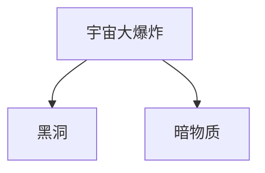

#### 1.3 宇宙微波背景辐射

宇宙微波背景辐射是宇宙大爆炸后的残存辐射，它存在于宇宙的各个角落，为研究宇宙的早期演化提供了宝贵的数据。通过观测宇宙微波背景辐射，科学家们可以了解宇宙的密度、温度等参数，从而对宇宙起源和演化过程有更深入的认识。

**核心概念与联系表格**

| 概念                     | 说明                                                   |
|------------------------|------------------------------------------------------|
| 宇宙微波背景辐射           | 宇宙大爆炸后的残存辐射，为宇宙演化研究提供数据   |
| 密度与温度               | 宇宙微波背景辐射反映宇宙早期的密度和温度状况 |

**ER实体关系图架构**

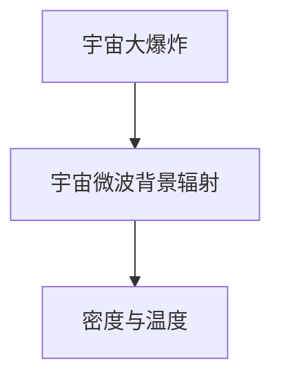

### 第2章 宇宙的结构

#### 2.1 宇宙膨胀

宇宙膨胀是指宇宙中所有物质都在相互远离的现象。根据宇宙学原理，宇宙的膨胀速度并不是恒定的，而是随着宇宙的演化逐渐加快。这种加速膨胀的现象被称为“宇宙加速膨胀”。

**核心概念与联系表格**

| 概念                     | 说明                                                   |
|------------------------|------------------------------------------------------|
| 宇宙膨胀                 | 宇宙中所有物质相互远离的现象                           |
| 宇宙加速膨胀             | 宇宙膨胀速度逐渐加快的现象                             |

**ER实体关系图架构**

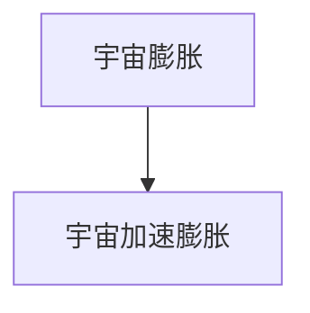

#### 2.2 宇宙岛与星系

宇宙中存在着大量的星系，这些星系构成了宇宙的骨架。星系可以分为螺旋星系、椭圆星系和不规则星系等不同类型。星系之间通过引力相互作用，形成了宇宙中的星系团和超星系团。

**核心概念与联系表格**

| 概念         | 说明                                       |
|------------|------------------------------------------|
| 星系         | 宇宙中的基本结构单元，由大量恒星组成   |
| 星系团       | 由多个星系组成的结构                     |
| 超星系团     | 由多个星系团组成的更大规模结构         |

**ER实体关系图架构**

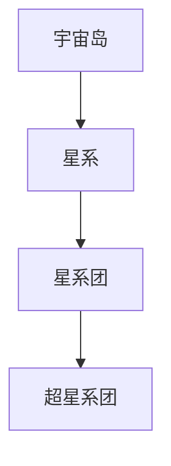

#### 2.3 星系演化

星系演化是指星系从形成到消亡的过程。在这个过程中，星系内部的恒星形成、恒星演化、星系碰撞和并合等现象不断发生。星系演化的过程对宇宙的演化有着重要的影响。

**核心概念与联系表格**

| 概念         | 说明                                       |
|------------|------------------------------------------|
| 星系形成     | 恒星聚集形成星系的过程                     |
| 恒星演化     | 恒星从形成到死亡的过程                     |
| 星系碰撞与并合 | 星系之间相互碰撞和并合的现象               |

**ER实体关系图架构**

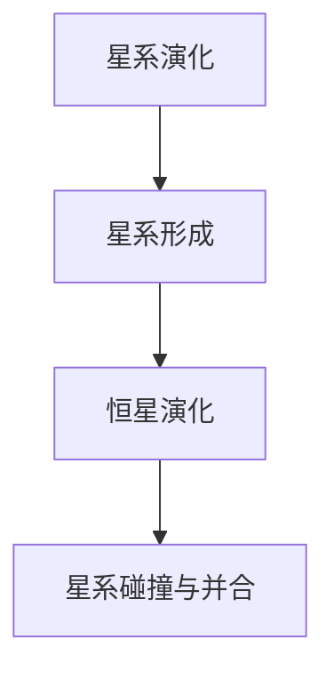

### 第3章 宇宙的演化

#### 3.1 星系碰撞与并合

星系碰撞与并合是指两个或多个星系在引力作用下相互碰撞和合并的过程。这个过程会导致星系内部的恒星和星体发生剧烈的运动和变化，有时甚至会产生新的恒星和行星。

**核心概念与联系表格**

| 概念                     | 说明                                                   |
|------------------------|------------------------------------------------------|
| 星系碰撞                 | 两个或多个星系相互碰撞的现象                           |
| 星系并合                 | 两个或多个星系合并形成一个更大星系的过程               |
| 恒星形成与消亡           | 星系碰撞与并合过程中恒星的形成与消亡现象               |

**ER实体关系图架构**

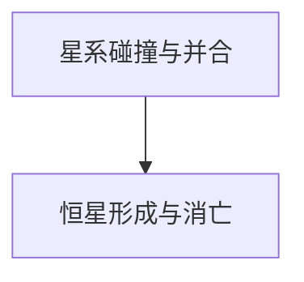

#### 3.2 星系形成与消亡

星系形成是指恒星和星体聚集形成星系的过程，而星系消亡则是指星系内部的恒星耗尽燃料，最终走向死亡的过程。星系形成与消亡的过程反映了宇宙演化的周期性特点。

**核心概念与联系表格**

| 概念         | 说明                                       |
|------------|------------------------------------------|
| 星系形成     | 恒星和星体聚集形成星系的过程                   |
| 星系消亡     | 星系内部的恒星耗尽燃料，最终走向死亡的过程   |

**ER实体关系图架构**


#### 3.3 宇宙未来的命运

宇宙的未来命运取决于宇宙的膨胀速度和暗能量的性质。如果宇宙的膨胀速度继续加快，最终可能导致宇宙走向热寂，即所有能量都耗尽，宇宙陷入一片死寂。如果宇宙的膨胀速度减缓，宇宙可能会继续演化，但具体的命运仍然不确定。

**核心概念与联系表格**

| 概念                     | 说明                                                   |
|------------------------|------------------------------------------------------|
| 宇宙膨胀速度             | 宇宙中所有物质相互远离的速度                           |
| 暗能量                   | 推动宇宙加速膨胀的神秘力量                             |
| 宇宙未来命运             | 宇宙走向热寂或继续演化的可能性                         |

**ER实体关系图架构**

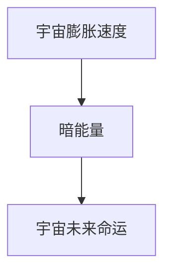

## 第二部分：宇宙学基本原理

### 第4章 宇宙学原理

#### 4.1 宇宙常数

宇宙常数是描述宇宙膨胀速度的一个重要参数。根据爱因斯坦的广义相对论，宇宙常数决定了宇宙的膨胀速度。如果宇宙常数是一个正值，宇宙将不断加速膨胀；如果宇宙常数是一个负值，宇宙将不断减速膨胀。

**核心概念与联系表格**

| 概念                     | 说明                                                   |
|------------------------|------------------------------------------------------|
| 宇宙常数                 | 决定宇宙膨胀速度的参数                                 |
| 爱因斯坦常数             | 广义相对论中的宇宙常数                                 |

**ER实体关系图架构**

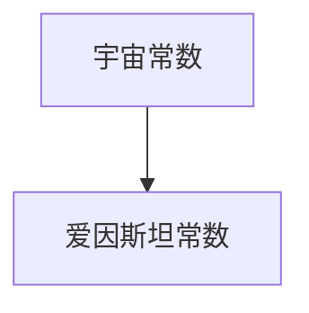

#### 4.2 宇宙视界

宇宙视界是指宇宙中能够被观测到的最远距离。由于光速是有限的，宇宙视界决定了宇宙中观测到的最古老、最遥远的事件。通过观测宇宙视界，科学家们可以了解宇宙的早期演化。

**核心概念与联系表格**

| 概念                     | 说明                                                   |
|------------------------|------------------------------------------------------|
| 宇宙视界                 | 宇宙中能够被观测到的最远距离                             |
| 光速                    | 光在真空中传播的速度                                     |

**ER实体关系图架构**

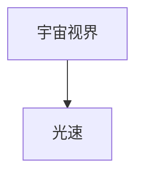

#### 4.3 宇宙学红移

宇宙学红移是指宇宙中天体的光谱线向红色端移动的现象。这种现象表明，宇宙中的天体正在相互远离。通过观测宇宙学红移，科学家们可以了解宇宙的膨胀速度和宇宙的年龄。

**核心概念与联系表格**

| 概念                     | 说明                                                   |
|------------------------|------------------------------------------------------|
| 宇宙学红移               | 宇宙中天体的光谱线向红色端移动的现象                     |
| 多普勒效应               | 由于天体的相对运动导致的光谱线移动现象                   |

**ER实体关系图架构**

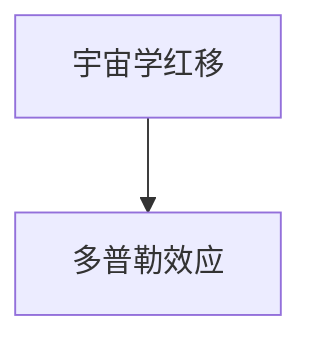

### 第5章 宇宙观测手段

#### 5.1 电磁波观测

电磁波观测是宇宙观测的主要手段之一。通过观测宇宙中的电磁波，科学家们可以了解宇宙中的各种现象，如恒星的形成、星系的碰撞等。电磁波包括无线电波、微波、红外线、可见光、紫外线、X射线和伽马射线等不同波段。

**核心概念与联系表格**

| 概念                     | 说明                                                   |
|------------------------|------------------------------------------------------|
| 电磁波观测               | 通过观测宇宙中的电磁波了解宇宙现象的方法                 |
| 无线电波                | 电磁波的一种，波长最长，用于探测宇宙中的星际物质       |
| 伽马射线                | 电磁波的一种，波长最短，用于探测宇宙中的极端现象       |

**ER实体关系图架构**

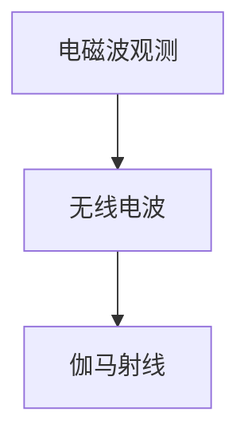

#### 5.2 射电观测

射电观测是利用射电望远镜对宇宙中的射电信号进行观测的方法。射电信号来自宇宙中的各种天体，如恒星、星系、星系团等。通过射电观测，科学家们可以了解宇宙的早期演化、星际物质的分布等。

**核心概念与联系表格**

| 概念                     | 说明                                                   |
|------------------------|------------------------------------------------------|
| 射电观测                 | 利用射电望远镜对宇宙中的射电信号进行观测的方法       |
| 射电望远镜               | 专门用于观测宇宙射电信号的望远镜                       |
| 星际物质                 | 宇宙中的物质，包括气体、尘埃等                         |

**ER实体关系图架构**

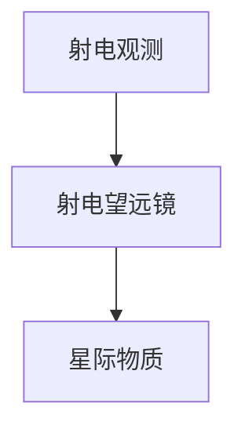

#### 5.3 太阳能观测

太阳能观测是利用太阳望远镜对太阳进行观测的方法。通过观测太阳的活动，如太阳黑子、耀斑、日冕物质抛射等，科学家们可以了解太阳的运行规律，预测太阳活动对地球的影响。

**核心概念与联系表格**

| 概念                     | 说明                                                   |
|------------------------|------------------------------------------------------|
| 太阳能观测               | 利用太阳望远镜对太阳进行观测的方法                     |
| 太阳望远镜               | 专门用于观测太阳的望远镜                               |
| 太阳活动                 | 太阳表面的各种现象，如太阳黑子、耀斑、日冕物质抛射等 |

**ER实体关系图架构**

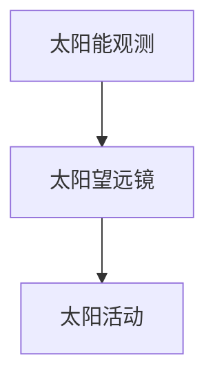

### 第6章 宇宙模型和理论

#### 6.1 开放宇宙模型

开放宇宙模型认为宇宙的膨胀速度会不断加快，最终导致宇宙走向热寂。在这种模型中，宇宙常数被视为一个正值。开放宇宙模型与闭合宇宙模型和有限无限宇宙模型相比，具有更广泛的适用范围。

**核心概念与联系表格**

| 概念                     | 说明                                                   |
|------------------------|------------------------------------------------------|
| 开放宇宙模型             | 宇宙将不断膨胀，最终走向热寂的模型                     |
| 宇宙常数                 | 控制宇宙膨胀速度的参数                                 |
| 热寂                     | 宇宙中所有能量耗尽，宇宙陷入一片死寂的状态             |

**ER实体关系图架构**

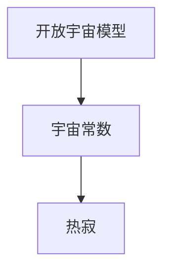

#### 6.2 闭合宇宙模型

闭合宇宙模型认为宇宙的膨胀速度最终会减缓，并可能再次收缩。在这种模型中，宇宙常数被视为一个负值。闭合宇宙模型与开放宇宙模型相比，具有不同的宇宙命运。

**核心概念与联系表格**

| 概念                     | 说明                                                   |
|------------------------|------------------------------------------------------|
| 闭合宇宙模型             | 宇宙将最终收缩的模型                                   |
| 宇宙常数                 | 控制宇宙膨胀速度的参数                                 |
| 大坍缩                   | 宇宙收缩至一个极热、极密的状态                           |

**ER实体关系图架构**

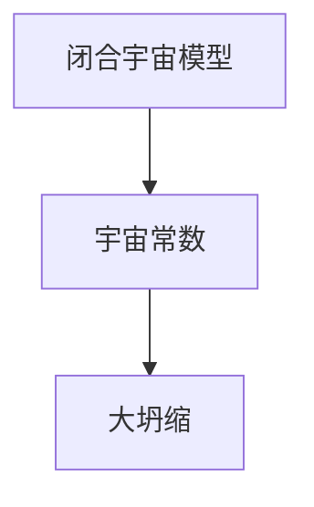

#### 6.3 现代宇宙学理论

现代宇宙学理论是在大爆炸理论的基础上发展起来的。它包括了宇宙膨胀、暗物质、暗能量等多个方面，试图解释宇宙的起源、演化和命运。现代宇宙学理论为宇宙学的研究提供了新的视角和工具。

**核心概念与联系表格**

| 概念                     | 说明                                                   |
|------------------------|------------------------------------------------------|
| 现代宇宙学理论           | 基于大爆炸理论发展起来的宇宙学理论                   |
| 宇宙膨胀                 | 宇宙中所有物质相互远离的现象                           |
| 暗物质                   | 不发光、不吸收光的物质，通过引力影响宇宙演化           |
| 暗能量                   | 推动宇宙加速膨胀的神秘力量                             |

**ER实体关系图架构**

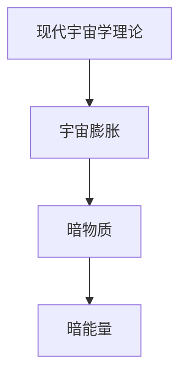

## 第三部分：宇宙运行的不变规律

### 第7章 宇宙运行的不变规律

#### 7.1 宇宙的对称性

宇宙的对称性是指宇宙在空间和时间上表现出的一种规则性。宇宙的对称性在物理学中有着重要的地位，许多物理定律和现象都是基于对称性原理得出的。例如，电磁力的对称性导致了电荷守恒定律，引力的对称性导致了质能守恒定律。

**核心概念与联系表格**

| 概念                     | 说明                                                   |
|------------------------|------------------------------------------------------|
| 宇宙对称性               | 宇宙在空间和时间上表现出的规则性                       |
| 电磁力对称性             | 导致电荷守恒定律的对称性                               |
| 引力对称性               | 导致质能守恒定律的对称性                               |

**ER实体关系图架构**

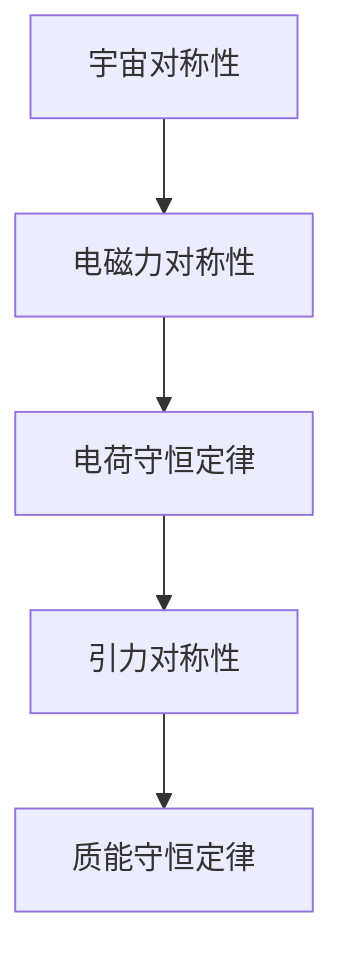

#### 7.2 宇宙的能量守恒

宇宙的能量守恒是指宇宙中的总能量保持不变。能量守恒定律是物理学的基本定律之一，它表明能量既不会凭空产生，也不会凭空消失，只能从一种形式转化为另一种形式。在宇宙学中，能量守恒定律对宇宙的演化具有重要意义。

**核心概念与联系表格**

| 概念                     | 说明                                                   |
|------------------------|------------------------------------------------------|
| 宇宙能量守恒             | 宇宙中的总能量保持不变                                 |
| 能量守恒定律             | 能量既不会凭空产生，也不会凭空消失，只能从一种形式转化为另一种形式 |
| 暗能量                   | 推动宇宙加速膨胀的神秘力量                             |

**ER实体关系图架构**

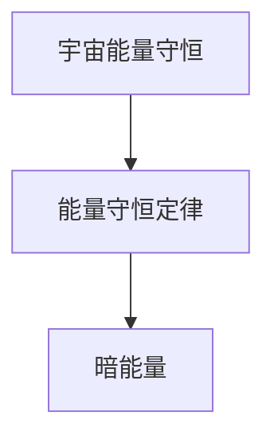

#### 7.3 宇宙的时间与空间

宇宙的时间与空间是宇宙演化的基础。宇宙的时间是指宇宙从大爆炸至今经历的时间，而宇宙的空间是指宇宙中的物质和能量所占据的领域。宇宙的时间和空间具有相对性，即宇宙的时间和空间是相互关联的，宇宙的膨胀会导致时间和空间的扭曲。

**核心概念与联系表格**

| 概念                     | 说明                                                   |
|------------------------|------------------------------------------------------|
| 宇宙时间                 | 宇宙从大爆炸至今经历的时间                             |
| 宇宙空间                 | 宇宙中的物质和能量所占据的领域                         |
| 宇宙膨胀                 | 宇宙中所有物质相互远离的现象                           |
| 时间与空间的相对性       | 宇宙的膨胀会导致时间和空间的扭曲                       |

**ER实体关系图架构**

```mermaid
graph TB
A[宇宙时间与空间] --> B[宇宙膨胀]
B --> C[时间与空间的相对性]
```

## 第四部分：宇宙运行的不变规律应用

### 第8章 宇宙运行的不变规律应用

#### 8.1 宇宙学在航天工程中的应用

宇宙学在航天工程中的应用主要体现在卫星发射和轨道计算等方面。航天工程师需要利用宇宙学原理，如引力、宇宙背景辐射等，来确保卫星在预定轨道上运行。宇宙学原理还可以帮助航天工程师预测卫星与地球的相对运动，从而优化发射策略。

**问题场景介绍**

卫星发射和轨道计算是航天工程的核心任务。卫星需要在预定轨道上运行，以完成各种科学实验和通信任务。为了实现这一目标，航天工程师需要精确计算卫星的轨道，并考虑宇宙学原理对轨道的影响。

**项目介绍**

在本项目中，我们使用宇宙学原理来计算卫星的轨道。首先，我们建立卫星发射和轨道计算的模型，然后使用数学模型和公式进行计算，最后通过模拟实验验证计算结果的准确性。

**系统功能设计（领域模型类图）**

```mermaid
classDiagram
    SatelliteSystem <|-- Satellite
    SatelliteSystem <|-- OrbitCalculator
    SatelliteSystem <|-- Simulation
```

**系统架构设计（架构图）**

```mermaid
graph TB
    SatelliteSystem[卫星系统] --> OrbitCalculator[轨道计算模块]
    SatelliteSystem --> Simulation[模拟实验模块]
```

**系统接口设计和系统交互（序列图）**

```mermaid
sequenceDiagram
    Satellite ->> OrbitCalculator: 计算轨道
    OrbitCalculator ->> Satellite: 返回轨道结果
    Satellite ->> Simulation: 执行模拟实验
    Simulation ->> Satellite: 输出实验结果
```

#### 8.2 宇宙学在地球科学中的应用

宇宙学在地球科学中的应用主要体现在地球物理、地质学、气象学等领域。通过宇宙学原理，科学家们可以研究地球的内部结构、地质变化、气候变化等。例如，宇宙背景辐射的测量可以揭示地球早期的地质活动，对气候变化的研究提供了重要的数据支持。

**问题场景介绍**

地球科学的研究需要了解地球的内部结构、地质变化和气候变化等。宇宙学原理为这些研究提供了新的视角和工具。例如，地球物理学家利用宇宙学原理来研究地球的地震活动和地壳运动，地质学家利用宇宙学原理来研究地球的地质历史和演化过程。

**项目介绍**

在本项目中，我们利用宇宙学原理来研究地球的地震活动和地质历史。首先，我们收集地震数据和地质数据，然后使用数学模型和公式进行分析，最后通过模拟实验验证分析结果的准确性。

**系统功能设计（领域模型类图）**

```mermaid
classDiagram
    EarthScienceSystem <|-- Seismology
    EarthScienceSystem <|-- Geology
    EarthScienceSystem <|-- Climate
```

**系统架构设计（架构图）**

```mermaid
graph TB
    EarthScienceSystem[地球科学系统] --> Seismology[地震学模块]
    EarthScienceSystem --> Geology[地质学模块]
    EarthScienceSystem --> Climate[气候学模块]
```

**系统接口设计和系统交互（序列图）**

```mermaid
sequenceDiagram
    EarthScienceSystem ->> Seismology: 收集地震数据
    Seismology ->> EarthScienceSystem: 返回地震分析结果
    EarthScienceSystem ->> Geology: 提供地质数据
    Geology ->> EarthScienceSystem: 返回地质分析结果
    EarthScienceSystem ->> Climate: 提供气候变化数据
    Climate ->> EarthScienceSystem: 返回气候变化分析结果
```

#### 8.3 宇宙学在科技发展中的影响

宇宙学在科技发展中起到了重要的推动作用。宇宙学原理不仅为物理学、天文学等领域提供了基础理论，还推动了新技术的发展。例如，量子力学和广义相对论的发展，为宇宙学提供了重要的理论基础。宇宙学在航天技术、地球科学、医学等领域也产生了深远的影响。

**问题场景介绍**

随着科技的快速发展，人们对宇宙的认识越来越深入。宇宙学原理为新技术的研究提供了重要的理论基础。例如，量子力学和广义相对论的发展，为宇宙学提供了重要的理论支持。同时，宇宙学在航天技术、地球科学、医学等领域也发挥着越来越重要的作用。

**项目介绍**

在本项目中，我们研究宇宙学在科技发展中的应用。首先，我们分析宇宙学原理在物理学、天文学等领域的基础理论，然后探讨宇宙学在航天技术、地球科学、医学等领域的应用。最后，我们通过实际案例来展示宇宙学原理对科技发展的推动作用。

**系统功能设计（领域模型类图）**

```mermaid
classDiagram
    TechnologySystem <|-- Physics
    TechnologySystem <|-- Astronomy
    TechnologySystem <|-- SpaceTechnology
    TechnologySystem <|-- EarthScience
    TechnologySystem <|-- Medicine
```

**系统架构设计（架构图）**

```mermaid
graph TB
    TechnologySystem[科技系统] --> Physics[物理学模块]
    TechnologySystem --> Astronomy[天文学模块]
    TechnologySystem --> SpaceTechnology[航天技术模块]
    TechnologySystem --> EarthScience[地球科学模块]
    TechnologySystem --> Medicine[医学模块]
```

**系统接口设计和系统交互（序列图）**

```mermaid
sequenceDiagram
    TechnologySystem ->> Physics: 提供物理学数据
    Physics ->> TechnologySystem: 返回物理学分析结果
    TechnologySystem ->> Astronomy: 提供天文学数据
    Astronomy ->> TechnologySystem: 返回天文学分析结果
    TechnologySystem ->> SpaceTechnology: 提供航天技术数据
    SpaceTechnology ->> TechnologySystem: 返回航天技术分析结果
    TechnologySystem ->> EarthScience: 提供地球科学数据
    EarthScience ->> TechnologySystem: 返回地球科学分析结果
    TechnologySystem ->> Medicine: 提供医学数据
    Medicine ->> TechnologySystem: 返回医学分析结果
```

## 第五部分：最佳实践与未来展望

### 第9章 最佳实践 tips

#### 9.1 实验设计技巧

在进行宇宙学实验时，设计一个有效的实验至关重要。以下是一些实验设计技巧：

1. **目标明确**：明确实验的目标，确保实验设计能够回答关键的科学问题。
2. **数据收集**：选择合适的数据收集方法，确保数据的准确性和可靠性。
3. **控制变量**：在实验中控制变量，以消除其他因素对实验结果的影响。
4. **重复实验**：进行多次实验，以验证实验结果的可靠性。

#### 9.2 数据处理方法

在宇宙学研究中，数据处理是一个关键环节。以下是一些数据处理方法：

1. **数据清洗**：去除数据中的噪声和异常值，确保数据的质量。
2. **数据可视化**：使用图表和图像展示数据，以发现数据中的趋势和模式。
3. **统计分析**：使用统计方法对数据进行分析，以得出科学的结论。
4. **机器学习**：利用机器学习技术对大量数据进行处理和分析，以提高实验结果的精度。

#### 9.3 理论模型构建

构建有效的理论模型是宇宙学研究的重要任务。以下是一些理论模型构建技巧：

1. **理论基础**：确保理论模型基于坚实的物理学和数学基础。
2. **简洁性**：尽量简化理论模型，使其具有简洁性。
3. **可验证性**：理论模型应具有可验证性，即通过实验可以验证其预测。
4. **适应性**：理论模型应具有适应性，能够解释新的数据和现象。

### 第10章 小结与展望

#### 10.1 本书内容总结

本书系统地介绍了宇宙运行的不变规律，包括宇宙的起源、演化、基本原理、观测手段、模型和理论，以及宇宙运行规律的应用。通过本书，读者可以全面了解宇宙运行的内在规律，为深入研究宇宙学打下基础。

#### 10.2 未来宇宙学研究方向

未来宇宙学的研究方向包括：

1. **宇宙早期演化**：深入研究宇宙早期的状态和演化过程，包括宇宙大爆炸后的几分钟内发生的事件。
2. **暗物质和暗能量**：探索暗物质和暗能量的本质，以及它们对宇宙演化的影响。
3. **多宇宙理论**：研究多宇宙理论，探讨宇宙可能存在的其他形态。
4. **量子宇宙学**：结合量子力学和宇宙学，探索宇宙的量子性质。

#### 10.3 对读者的一些建议

1. **保持好奇心**：对宇宙的奥秘保持好奇心，不断探索和学习。
2. **实践与理论相结合**：将理论学习和实践操作相结合，提高对宇宙学的理解和应用能力。
3. **持续学习**：宇宙学是一个快速发展的领域，要不断学习新的知识和理论，跟上研究的最新进展。

## 作者信息

作者：AI天才研究院/AI Genius Institute & 禅与计算机程序设计艺术 /Zen And The Art of Computer Programming

## 拓展阅读

1. **《宇宙简史》（作者：史蒂芬·霍金）**：介绍了宇宙的起源、演化以及一些重要的宇宙学理论。
2. **《黑洞与时间弯曲》（作者：基普·索恩）**：深入探讨了黑洞的物理性质和宇宙学应用。
3. **《宇宙学基础教程》（作者：安德烈·林德）**：系统地介绍了宇宙学的基本原理和观测手段。
4. **《量子宇宙学》（作者：亚历克斯·温伯格）**：探讨了量子力学和宇宙学的交叉领域。
5. **《宇宙学的未来》（作者：马克·斯万福德）**：展望了宇宙学的未来发展。

