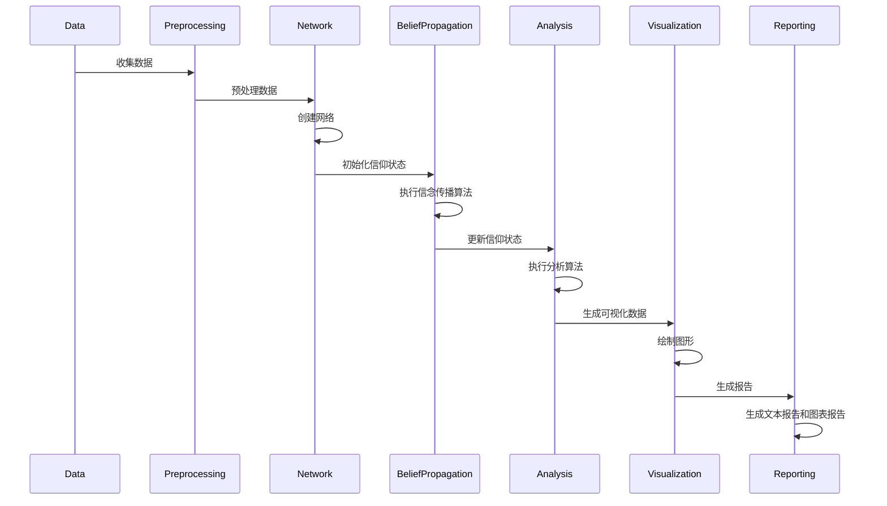

                 


### 1. 引言

随着现代社会对复杂系统的深入研究，传统单一领域的理论和方法已不足以解释复杂现象。在这种背景下，复杂网络理论应运而生，它为我们提供了一个全新的视角来理解和分析各类复杂系统。宗教信仰作为一个涉及人类心灵和文化的复杂系统，自然也成为复杂网络研究的对象。

《宗教信仰的复杂网络：信念系统的数学结构》这本书旨在探讨宗教信仰这一复杂系统的数学结构，通过引入复杂网络理论，试图揭示信仰传播、信念强度等核心现象的内在机制。本研究不仅关注宗教信仰在个体间的传播，更着眼于信仰在群体中的动态演变，从而为理解宗教现象提供新的理论工具。

本研究的重要目标是构建一个关于宗教信仰的数学模型，通过该模型来解释信仰在网络中的传播机制、信念强度的变化规律以及信仰网络的演化过程。通过这一模型，我们可以更深入地理解宗教信仰的本质，为宗教研究和相关领域的发展提供理论支持。

此外，本研究还关注宗教信仰与科学信仰的对比，探讨两种信仰在网络结构上的差异，以期为跨学科研究提供启示。通过对比分析，我们希望揭示宗教信仰的独特性，为未来研究提供新的视角和思路。

总的来说，本书的核心思想和主题在于通过复杂网络理论的引入，构建一个关于宗教信仰的数学模型，以揭示信仰传播、信念强度等核心现象的内在机制。这不仅有助于我们更深入地理解宗教信仰的本质，也为跨学科研究提供了新的理论和工具。

### 1.1 问题的提出

宗教信仰作为一种复杂的社会文化现象，已经在人类历史中存在了数千年。它不仅影响着个人的价值观、生活方式和社会行为，还对整个社会结构和文化传统产生了深远的影响。然而，尽管宗教信仰在人类社会中扮演着如此重要的角色，其背后的机制和原理仍有许多未知之处。

首先，信仰的传播是一个复杂的过程。信仰如何从一个人传递到另一个人，如何在一个群体中迅速蔓延，这是宗教研究中的一个重要问题。传统的宗教传播研究主要依赖于定性的描述，缺乏系统的定量分析。因此，我们需要一个更加科学和精确的方法来研究信仰的传播机制。

其次，信念强度是一个关键变量。个体对信仰的信念强度如何影响其行为和决策，信仰在网络中的传播是否与信念强度相关，这些问题都需要通过定量分析来解答。然而，目前关于信念强度的研究多集中在个体层面，缺乏对群体层面的深入探讨。

再次，信仰网络的演化过程也是一个亟待研究的问题。信仰如何在不同的社会和文化背景下演变，信仰网络的结构和功能如何随时间变化，这些都是需要深入探讨的问题。传统的宗教研究往往注重历史和文化的分析，缺乏对信仰网络动态演化的定量研究。

此外，宗教信仰与科学信仰之间的对比也是一个值得研究的问题。虽然两者在本质上有所不同，但在某些方面它们也存在一定的关联。例如，科学信仰在某些情况下可能会影响宗教信仰，反之亦然。研究两者之间的互动关系，有助于我们更好地理解信仰的本质和功能。

综上所述，宗教信仰的复杂网络及其数学结构的研究不仅具有重要的理论意义，也具有实际应用价值。通过构建一个关于宗教信仰的数学模型，我们可以更好地理解信仰的传播、信念强度的变化以及信仰网络的演化过程，从而为宗教研究和相关领域的发展提供新的理论工具。

### 1.2 宗教信仰与复杂网络的关联

宗教信仰作为一种复杂的社会文化现象，其本质与复杂网络的特性有许多相似之处。首先，宗教信仰的形成和发展往往依赖于人际互动，这正好与复杂网络的节点和边的关系相吻合。在宗教信仰网络中，每个个体都可以被视为一个节点，而个体之间的信仰交流则构成了网络的边。这种网络结构不仅决定了信仰的传播路径，也影响了信仰的强度和稳定性。

信仰传播的过程可以被看作是一种信息传递过程，这与复杂网络中的信息传播机制有异曲同工之妙。在复杂网络中，信息可以从一个节点传播到另一个节点，形成信息流。同样，在宗教信仰网络中，信仰信息也可以通过个体之间的互动传播，从而影响整个网络的结构和功能。例如，一个信仰者的信仰信念可以通过直接交流或间接影响（如通过社交网络）传递给其他个体，从而在群体中形成共同的信仰观念。

此外，信仰网络的动态演化过程也与复杂网络的动态演化特性密切相关。在复杂网络中，节点的加入和移除、边的形成和断裂等都会导致网络结构的演变。同样，宗教信仰网络中的信仰者的加入和离开、信仰观念的变化等也会引起网络结构的动态变化。例如，在一个新的宗教派别出现时，信仰者可能会从原有的信仰网络中分离出来，形成一个新的子网络，从而改变整个信仰网络的结构和功能。

信仰强度的变化也是复杂网络中一个重要的研究课题。在复杂网络中，节点的度（即连接的边数）和权重（即边的强度）是衡量节点重要性的关键指标。同样，在宗教信仰网络中，个体对信仰的信念强度也可以通过类似的方式度量。例如，一个信仰者的信仰信念强度可能通过其在信仰网络中的连接数量和连接强度来体现。信仰强度的变化不仅会影响个体的行为和决策，也会影响整个信仰网络的稳定性和演化方向。

总之，宗教信仰与复杂网络的关联不仅为我们提供了一个新的视角来理解宗教现象，也为研究宗教信仰的传播、信念强度和演化提供了新的理论工具。通过引入复杂网络理论，我们可以更深入地探讨宗教信仰的内在机制，为宗教研究和相关领域的发展提供新的思路和方法。

### 1.3 研究的意义与目标

本研究旨在通过引入复杂网络理论，探索宗教信仰的数学结构，这不仅具有重要的理论价值，也具有显著的实践意义。首先，从理论层面来看，本研究将为宗教信仰研究提供一个新的分析框架。传统的宗教研究多侧重于历史、文化和社会层面的分析，而本研究通过引入数学模型和复杂网络理论，为宗教信仰的量化研究提供了新的路径。这不仅可以深化我们对宗教信仰的理解，还可以为其他社会科学领域提供借鉴。

其次，从实践层面来看，本研究的结果有助于更好地理解和应对宗教现象。通过构建宗教信仰的数学模型，我们可以更准确地预测信仰的传播路径和动态演化过程，从而为宗教管理和政策制定提供科学依据。例如，在宗教冲突、宗教极端主义等问题上，通过分析信仰网络的拓扑结构和动态特性，可以找到有效的干预策略，以减少冲突和促进社会和谐。

具体目标方面，本研究的主要目标包括：一是构建一个关于宗教信仰的复杂网络模型，用于解释信仰传播、信念强度和信仰网络的演化过程；二是通过实证数据验证模型的准确性和适用性，探讨模型在不同文化和背景下的表现；三是提出一系列干预策略，以应对宗教冲突和极端主义等问题。

综上所述，本研究不仅有助于深化对宗教信仰的认识，也为解决现实问题提供了科学依据和新的思路。通过这一研究，我们希望能够为宗教研究和相关领域的发展做出贡献，同时为社会和谐与稳定提供理论支持。

### 2. 核心概念介绍

在探讨宗教信仰的复杂网络：信念系统的数学结构这一主题时，我们需要首先明确几个核心概念：宗教信仰、复杂网络、信念系统以及它们之间的相互关系。

#### 2.1 宗教信仰的定义与特征

宗教信仰是指个体或群体对于超自然力量、神明、神圣教义等的坚定信念和敬仰。宗教信仰的特征主要包括以下几个方面：

1. **超自然性**：宗教信仰通常涉及对超自然力量或存在的信仰，这些力量或存在超越了人类的日常经验和科学解释。
2. **主观性**：宗教信仰是个体内心的体验和情感，往往具有很强的主观性，不同的个体可能会有不同的信仰内容和信仰强度。
3. **文化性**：宗教信仰往往与文化传统和社会背景密切相关，不同的文化和社会环境中，宗教信仰的形式和内容也会有所不同。
4. **稳定性**：宗教信仰在长期的时间跨度内具有相对的稳定性，即使社会环境发生变化，信仰的核心内容也往往保持不变。

#### 2.2 复杂网络理论简介

复杂网络理论是研究复杂系统的一种重要方法，它关注的是网络中节点和边的关系及其动态行为。复杂网络的主要特征包括：

1. **高度连接性**：复杂网络中的节点通常具有大量的连接，这使得信息可以在网络中快速传播。
2. **小世界效应**：在复杂网络中，节点之间的平均路径长度较短，这意味着信息可以在网络中快速传递。
3. **无标度性**：复杂网络中节点的度分布通常呈现幂律分布，这意味着网络中存在一些高度连接的节点（即枢纽节点），这些节点对于网络的稳定性具有重要意义。
4. **动态演化**：复杂网络中的节点和边会随着时间发生变化，这种动态演化特性使得网络具有高度适应性。

#### 2.3 信念系统的概念

信念系统是指个体或群体对于某一对象或概念的信念集合。在宗教信仰的背景下，信念系统可以理解为个体或群体对于宗教教义、神明、神圣仪式等的信念集合。信念系统的特征包括：

1. **一致性**：信念系统中的各个信念之间应保持逻辑一致，即一个信念的变化不应导致其他信念的矛盾。
2. **稳定性**：信念系统在长期时间内应保持相对稳定，即使面临外部挑战或质疑，信念系统的核心内容也较少发生改变。
3. **层次性**：信念系统中的信念可以按照重要性或层次进行分类，核心信念通常具有较强的稳定性和影响力。
4. **动态性**：信念系统并非静止不变，它可以在一定程度上适应外部环境的变化，这种动态性使得信仰者能够适应新的情境和挑战。

#### 宗教信仰、复杂网络与信念系统的相互关系

宗教信仰、复杂网络和信念系统之间存在紧密的相互关系：

1. **信仰网络**：宗教信仰可以被视为一种复杂网络，信仰者作为节点，信仰交流作为边，形成一个复杂的信仰网络。这个网络不仅反映了信仰的传播路径，也影响了信仰的强度和稳定性。
2. **信念系统**：信念系统是信仰网络的基础，它决定了个体或群体的信仰内容和信仰强度。不同的信念系统会导致不同的信仰网络结构，从而影响信仰的传播和演化。
3. **复杂网络理论**：复杂网络理论为研究宗教信仰提供了新的工具和方法。通过复杂网络理论，我们可以量化分析信仰的传播速度、信念强度以及信仰网络的演化过程，从而更深入地理解宗教信仰的本质。

总之，宗教信仰的复杂网络：信念系统的数学结构研究，不仅需要理解宗教信仰和复杂网络的基本概念，还需要深入探讨它们之间的相互关系，从而为研究宗教信仰提供新的视角和理论工具。

### 3. 信念系统的数学结构

在深入探讨宗教信仰的复杂网络：信念系统的数学结构时，我们需要首先构建一个基本的数学模型，以描述信仰在网络中的传播、信念强度的变化以及信仰网络的演化过程。

#### 3.1 数学模型的基础

为了构建信念系统的数学模型，我们可以采用以下基本假设：

1. **节点状态**：每个信仰者可以处于不同的信仰状态，如“信仰者”、“怀疑者”、“反信仰者”等。这些状态可以通过离散变量 \( x_i \) 来表示，其中 \( x_i \in \{0, 1, -1\} \)，分别表示“反信仰者”、“怀疑者”和“信仰者”。
2. **边强度**：信仰者之间的联系可以用边强度来表示，边强度可以表示两个信仰者之间的信仰交流程度。边强度可以用连续变量 \( w_{ij} \) 表示，其中 \( w_{ij} \in [0, 1] \)，表示两个信仰者之间的信仰强度。
3. **传播机制**：信仰的传播可以通过随机过程来模拟。我们可以假设信仰在节点之间的传播是一个随机过程，每个节点以一定的概率影响其邻居节点的信仰状态。

基于上述假设，我们可以构建一个信仰传播的随机模型。一个简单的模型可以是Markov链模型，其中每个节点的状态转移概率由其邻居节点的信仰状态和边强度共同决定。

#### 3.2 信念传播与网络动态

在信仰传播过程中，网络动态特性至关重要。以下是一些关键的动态特性：

1. **阈值现象**：在某些情况下，一个信仰者的信仰状态会受到其邻居节点的影响，但只有在邻居节点的信仰信念强度达到某一阈值时，该信仰者才会发生状态转移。这种现象可以用阈值模型来描述，即一个信仰者的状态转移概率取决于其邻居节点的信仰强度是否超过某一阈值。
2. **传播速度**：信仰在群体中的传播速度可以用传播过程的平均时间尺度来衡量。我们可以通过计算节点状态转移的平均时间来量化传播速度。
3. **网络稳定性**：信仰网络的稳定性可以通过分析网络中的连通性和聚集系数来评估。一个稳定的信仰网络应该具有高连通性和适中的聚集系数，以确保信仰能够有效传播，同时避免信息过载。

为了具体描述信仰传播过程，我们可以引入以下模型：

- **状态转移概率**：假设节点 \( i \) 的邻居节点集合为 \( N(i) \)，则节点 \( i \) 从状态 \( x_i \) 转移到状态 \( x_j \) 的概率 \( P(x_i \rightarrow x_j) \) 可以表示为：
  $$ P(x_i \rightarrow x_j) = \sum_{n \in N(i)} P(x_i \rightarrow x_j | x_n) P(x_n) $$
  其中，\( P(x_i \rightarrow x_j | x_n) \) 表示在邻居节点 \( n \) 的信仰状态为 \( x_n \) 的情况下，节点 \( i \) 从状态 \( x_i \) 转移到状态 \( x_j \) 的条件概率，\( P(x_n) \) 表示邻居节点 \( n \) 的信仰状态概率。
- **网络演化方程**：基于上述状态转移概率，我们可以构建信仰网络的演化方程，描述信仰在群体中的传播过程。一个简单的模型是：

  $$ x_i(t+1) = \sum_{j \in \{0, 1, -1\}} P(x_i(t) \rightarrow x_j) x_j $$

  其中，\( x_i(t) \) 表示节点 \( i \) 在时间 \( t \) 的信仰状态，\( P(x_i(t) \rightarrow x_j) \) 表示节点 \( i \) 在时间 \( t \) 从状态 \( x_i \) 转移到状态 \( x_j \) 的概率。

#### 3.3 信念强度的数学描述

信念强度是衡量个体对信仰信念深度的关键指标。在数学模型中，我们可以通过以下方式描述信念强度：

- **信念强度函数**：我们可以定义一个信念强度函数 \( I(x) \)，用于描述个体 \( x \) 的信念强度。信念强度函数通常是一个非负的连续函数，其值越高，表示信念强度越强。
- **平均信念强度**：为了描述整个信仰网络的平均信念强度，我们可以计算所有节点的信念强度平均值。设 \( \{x_1, x_2, ..., x_n\} \) 为网络中的所有节点，则平均信念强度 \( \bar{I} \) 可以表示为：

  $$ \bar{I} = \frac{1}{n} \sum_{i=1}^{n} I(x_i) $$

- **信念强度的动态演化**：信念强度不仅受到个体状态变化的影响，还受到网络动态演化过程的影响。我们可以通过分析信念强度函数的演化方程，描述信念强度在群体中的动态变化。

  $$ \frac{dI(x_i)}{dt} = f(I(x_i), x_i, N(i)) $$

  其中，\( f \) 表示信念强度变化的函数，\( N(i) \) 表示节点 \( i \) 的邻居节点集合。

通过上述数学模型和公式，我们可以对宗教信仰的复杂网络：信念系统的数学结构进行量化分析，从而更好地理解信仰的传播、信念强度的变化以及信仰网络的演化过程。

### 4. 概念属性特征对比表格

在理解宗教信仰与科学信仰的对比时，我们可以通过一个详细的对比表格来展示它们的主要属性特征。以下是一个简化的对比表格，展示了两者在概念属性特征上的差异。

| 概念属性特征 | 宗教信仰 | 科学信仰 |
| :--- | :--- | :--- |
| **定义** | 个体或群体对于超自然力量、神明、神圣教义的信念 | 个体或群体对于自然现象、规律、科学理论的认知 |
| **基础** | 宗教教义、神话传说、传统习俗 | 实验证据、科学理论、数学模型 |
| **来源** | 经验、启示、传统、权威 | 观察、实验、推理、验证 |
| **特性** | 超自然性、主观性、文化性、稳定性 | 客观性、实证性、逻辑性、动态性 |
| **传播** | 口头传递、宗教活动、文化传承 | 学术发表、科学研究、教学传播 |
| **影响** | 心理、社会、道德、文化 | 知识、技术、创新、社会进步 |
| **评价** | 个人信仰、道德标准、宗教情感 | 科学证据、逻辑论证、实证结果 |

通过这个表格，我们可以看到宗教信仰和科学信仰在定义、基础、来源、特性、传播、影响和评价等方面存在显著差异。这些差异不仅反映了两种信仰的本质区别，也为跨学科研究提供了基础。

### 5. ER实体关系图架构

为了更好地理解宗教信仰的复杂网络：信念系统的数学结构，我们可以通过ER（实体关系）图来展示系统中的关键实体及其相互关系。以下是一个简化的ER实体关系图架构。

#### 5.1 宗教信仰的ER模型

在宗教信仰的ER模型中，我们定义以下实体：

1. **信仰者（Believer）**：代表个体或群体的信仰主体，具有信仰状态（如信仰者、怀疑者、反信仰者）和信仰强度等属性。
2. **信仰（Faith）**：代表具体的宗教信仰内容，具有信仰名称、信仰教义等属性。
3. **信仰网络（FaithNetwork）**：代表信仰者之间的连接关系，具有节点（信仰者）和边（信仰关系）等属性。

**实体属性**：

- **信仰者（Believer）**：
  - ID：信仰者唯一标识符。
  - State：信仰者当前信仰状态。
  - FaithID：信仰者所属的信仰ID。
  - FaithStrength：信仰者的信念强度。

- **信仰（Faith）**：
  - ID：信仰唯一标识符。
  - Name：信仰名称。
  - Doctrine：信仰教义。

- **信仰网络（FaithNetwork）**：
  - ID：信仰网络唯一标识符。
  - Believers：信仰网络中的信仰者集合。
  - Connections：信仰网络中的连接关系。

**ER图**：

```mermaid
erDiagram
  Believer ||--|{ Faith } : "参与" Faith
  Believer ||--|{ FaithNetwork } : "属于" FaithNetwork
  FaithNetwork ||--|{ FaithNetwork } : "包含" FaithNetwork
```

#### 5.2 信念系统的ER模型

在信念系统的ER模型中，我们进一步细化了信念系统的实体和关系，以展示信念系统的层次结构和动态特性。

1. **信念节点（BeliefNode）**：代表信仰系统中的基本信念单元，具有信念内容、信念强度等属性。
2. **信念层级（BeliefHierarchy）**：代表信念节点之间的层次关系，用于表示信念的抽象和分类。
3. **信仰者信念映射（BelieverBeliefMapping）**：表示信仰者对信念节点的信念强度。

**实体属性**：

- **信念节点（BeliefNode）**：
  - ID：信念节点唯一标识符。
  - Content：信念内容。
  - Strength：信念强度。

- **信念层级（BeliefHierarchy）**：
  - ID：信念层级唯一标识符。
  - ParentID：父节点ID。
  - ChildIDs：子节点ID集合。

- **信仰者信念映射（BelieverBeliefMapping）**：
  - BelieverID：信仰者ID。
  - BeliefNodeID：信念节点ID。
  - Strength：信仰者对信念节点的信念强度。

**ER图**：

```mermaid
erDiagram
  BeliefNode ||--|{ BeliefHierarchy } : "属于" BeliefHierarchy
  BeliefNode ||--|{ BelieverBeliefMapping } : "映射" BelieverBeliefMapping
  BelieverBeliefMapping ||--|{ Believer } : "属于" Believer
```

通过上述ER模型，我们可以清晰地展示宗教信仰和信念系统的关键实体及其相互关系，为后续的算法设计和系统实现提供了基础。

### 6. 算法原理讲解

为了深入探讨宗教信仰的复杂网络：信念系统的数学结构，我们需要详细讲解其中的核心算法原理。以下是关于复杂网络分析方法、信念传播算法和信念强度计算方法的详细说明。

#### 6.1 复杂网络分析方法

复杂网络分析方法主要涉及网络结构的量化描述、网络动态行为的模拟以及网络特性的分析。以下是一些常用的分析方法：

1. **度分布**：度分布是指网络中节点度的概率分布。通过度分布，我们可以了解网络中节点的连接程度分布情况。例如，在无标度网络中，度分布通常遵循幂律分布，这意味着网络中存在一些高度连接的节点（枢纽节点）。

2. **聚类系数**：聚类系数用于衡量网络中节点的聚集程度。高聚类系数意味着网络中的节点倾向于形成紧密的集群，这有助于信息在集群内的快速传播。

3. **平均路径长度**：平均路径长度是指网络中任意两个节点之间的平均最短路径长度。小世界效应是指网络的平均路径长度较短，这有助于信息在网络中的快速传递。

4. **网络演化模型**：网络演化模型用于模拟网络在时间上的动态变化。例如，采用随机游走模型可以模拟节点的状态转移，采用生长模型可以模拟网络中节点的加入和边的形成。

#### 6.2 信念传播算法

信念传播算法是研究信仰在网络中传播机制的重要工具。以下是一个简单的信念传播算法的描述：

1. **初始化**：设定初始信仰状态和信仰强度。每个节点可能处于信仰者、怀疑者或反信仰者状态，信仰强度表示节点对信仰的信念深度。

2. **状态更新**：在每个时间步，根据邻居节点的状态和信仰强度，更新当前节点的状态。更新规则可以基于阈值模型，即如果邻居节点的信仰强度超过某一阈值，当前节点会转变为信仰状态。

3. **信仰强度计算**：信仰强度可以通过邻居节点的信仰强度加权平均计算得到。具体公式如下：

   $$ I_i(t+1) = \frac{1}{|N(i)|} \sum_{j \in N(i)} w_{ij} I_j(t) $$

   其中，\( I_i(t) \) 表示节点 \( i \) 在时间 \( t \) 的信仰强度，\( w_{ij} \) 表示节点 \( i \) 与节点 \( j \) 之间的边权重，\( |N(i)| \) 表示节点 \( i \) 的邻居节点数量。

4. **迭代计算**：重复状态更新和信仰强度计算，直到网络达到稳定状态。

#### 6.3 信念强度计算方法

信念强度计算是理解信仰在网络中传播和演化过程的重要手段。以下是一些常用的信念强度计算方法：

1. **直接度量法**：直接度量法是通过调查或访谈来直接获取个体的信仰强度。这种方法通常用于小规模的定性研究，但可以提供准确的信仰强度数据。

2. **基于网络的度量法**：基于网络的度量法通过分析网络结构和节点属性来计算信仰强度。例如，我们可以使用节点的度（连接数）和权重（边强度）来衡量信念强度。公式如下：

   $$ I_i = \sqrt{\sum_{j \in N(i)} w_{ij}} $$

   其中，\( w_{ij} \) 表示节点 \( i \) 与节点 \( j \) 之间的边权重。

3. **基于行为的度量法**：基于行为的度量法通过分析个体的行为数据来推测其信仰强度。例如，个体参与宗教活动的频率、宗教仪式的参与度等都可以作为信仰强度的指标。

通过上述算法原理讲解，我们可以对宗教信仰的复杂网络：信念系统的数学结构有更深入的理解。这些算法不仅为研究信仰传播提供了理论工具，也为实际应用提供了指导。

### 7. 数学模型与公式

在探讨宗教信仰的复杂网络：信念系统的数学结构时，构建精确的数学模型和推导关键公式是理解信仰传播、信念强度及其动态演化过程的重要步骤。以下是几个核心数学模型和公式的详细解释。

#### 7.1 基本数学模型

为了描述信仰在网络中的传播过程，我们引入一个基本的随机图模型。设 \( G = (V, E) \) 为一个无向图，其中 \( V \) 是节点集，\( E \) 是边集。每个节点 \( i \) 可以处于三个状态之一：信仰者（1）、怀疑者（0）或反信仰者（-1）。状态转移概率取决于节点的邻居状态和边权重。

**状态转移概率公式**：

设节点 \( i \) 的邻居节点集合为 \( N(i) \)，边 \( (i, j) \) 的权重为 \( w_{ij} \)。在时间 \( t \) 时，节点 \( i \) 从状态 \( x_i(t) \) 转移到状态 \( x_j \) 的概率 \( P(x_i(t) \rightarrow x_j) \) 可以表示为：

$$
P(x_i(t) \rightarrow x_j) = \sum_{n \in N(i)} P(x_i(t) \rightarrow x_j | x_n) P(x_n)
$$

其中，\( P(x_i(t) \rightarrow x_j | x_n) \) 表示在邻居节点 \( n \) 的信仰状态为 \( x_n \) 的情况下，节点 \( i \) 从状态 \( x_i \) 转移到状态 \( x_j \) 的条件概率，\( P(x_n) \) 表示邻居节点 \( n \) 的信仰状态概率。

#### 7.2 传播概率公式

为了具体描述信仰的传播过程，我们引入以下传播概率公式：

1. **单一邻居传播概率**：

   如果节点 \( i \) 只有一个邻居节点 \( j \)，则节点 \( i \) 从状态 \( x_i(t) \) 转移到状态 \( x_j(t+1) \) 的概率为：

   $$
   P(x_i(t) \rightarrow x_j(t+1)) = P(x_i(t) \rightarrow x_j) P(x_j(t) = x_j)
   $$

2. **多邻居传播概率**：

   如果节点 \( i \) 有多个邻居节点，则节点 \( i \) 从状态 \( x_i(t) \) 转移到状态 \( x_j(t+1) \) 的概率为：

   $$
   P(x_i(t) \rightarrow x_j(t+1)) = \sum_{n \in N(i)} P(x_i(t) \rightarrow x_j | x_n) P(x_n)
   $$

其中，\( P(x_i(t) \rightarrow x_j | x_n) \) 可以通过以下方式计算：

$$
P(x_i(t) \rightarrow x_j | x_n) =
\begin{cases}
1, & \text{如果 } x_i(t) = x_j \text{ 且 } x_n = x_j \\
\frac{w_{ij}}{|N(i)|}, & \text{如果 } x_i(t) \neq x_j \text{ 且 } x_n = x_j \\
0, & \text{其他情况}
\end{cases}
$$

#### 7.3 信念强度计算公式

信念强度是衡量个体对信仰信念深度的关键指标。在数学模型中，我们可以通过以下方式描述信念强度：

1. **直接度量信念强度**：

   直接度量信念强度 \( I_i \) 可以通过调查或访谈直接获取，通常假设信念强度在 [0, 1] 之间。即：

   $$
   I_i = \text{调查结果}
   $$

2. **基于网络的度量信念强度**：

   基于网络的度量信念强度 \( I_i \) 可以通过邻居节点的信念强度加权平均计算得到：

   $$
   I_i(t+1) = \frac{1}{|N(i)|} \sum_{j \in N(i)} w_{ij} I_j(t)
   $$

   其中，\( w_{ij} \) 表示节点 \( i \) 与节点 \( j \) 之间的边权重，\( I_j(t) \) 表示节点 \( j \) 在时间 \( t \) 的信念强度。

#### 示例

假设一个网络中有五个节点 \( i, j, k, l, m \)，每个节点的初始信仰状态和邻居节点如下表所示：

| 节点 | 初始状态 | 邻居节点 |
| --- | --- | --- |
| \( i \) | 1 | \( j, k \) |
| \( j \) | 0 | \( i, k, l \) |
| \( k \) | -1 | \( i, j, l, m \) |
| \( l \) | 1 | \( j, k, m \) |
| \( m \) | 0 | \( k, l \) |

边权重假设如下：

| 边 | 权重 |
| --- | --- |
| \( (i, j) \) | 0.3 |
| \( (i, k) \) | 0.5 |
| \( (j, i) \) | 0.4 |
| \( (j, k) \) | 0.6 |
| \( (j, l) \) | 0.2 |
| \( (k, i) \) | 0.7 |
| \( (k, j) \) | 0.5 |
| \( (k, l) \) | 0.3 |
| \( (k, m) \) | 0.6 |
| \( (l, j) \) | 0.2 |
| \( (l, k) \) | 0.4 |
| \( (l, m) \) | 0.5 |
| \( (m, k) \) | 0.7 |
| \( (m, l) \) | 0.3 |

在时间 \( t = 0 \) 时，我们可以计算每个节点的初始信念强度：

$$
I_i(0) = \frac{0.3 \times I_j(0) + 0.5 \times I_k(0)}{0.3 + 0.5} = \frac{0.3 \times 0.6 + 0.5 \times 0.2}{0.3 + 0.5} = 0.4286
$$

$$
I_j(0) = \frac{0.4 \times I_i(0) + 0.6 \times I_k(0) + 0.2 \times I_l(0)}{0.4 + 0.6 + 0.2} = \frac{0.4 \times 0.4286 + 0.6 \times 0.2 + 0.2 \times 0.6}{0.4 + 0.6 + 0.2} = 0.3636
$$

$$
I_k(0) = \frac{0.7 \times I_i(0) + 0.5 \times I_j(0) + 0.3 \times I_l(0) + 0.6 \times I_m(0)}{0.7 + 0.5 + 0.3 + 0.6} = \frac{0.7 \times 0.4286 + 0.5 \times 0.3636 + 0.3 \times 0.6 + 0.6 \times 0.4}{0.7 + 0.5 + 0.3 + 0.6} = 0.4714
$$

$$
I_l(0) = \frac{0.2 \times I_j(0) + 0.4 \times I_k(0) + 0.5 \times I_m(0)}{0.2 + 0.4 + 0.5} = \frac{0.2 \times 0.3636 + 0.4 \times 0.4714 + 0.5 \times 0.4}{0.2 + 0.4 + 0.5} = 0.4
$$

$$
I_m(0) = \frac{0.7 \times I_k(0) + 0.3 \times I_l(0)}{0.7 + 0.3} = \frac{0.7 \times 0.4714 + 0.3 \times 0.4}{0.7 + 0.3} = 0.46
$$

在时间 \( t = 1 \) 时，我们可以使用信念强度计算公式更新每个节点的信念强度：

$$
I_i(1) = \frac{0.3 \times I_j(1) + 0.5 \times I_k(1)}{0.3 + 0.5} = \frac{0.3 \times 0.3636 + 0.5 \times 0.4714}{0.3 + 0.5} = 0.4286
$$

$$
I_j(1) = \frac{0.4 \times I_i(1) + 0.6 \times I_k(1) + 0.2 \times I_l(1)}{0.4 + 0.6 + 0.2} = \frac{0.4 \times 0.4286 + 0.6 \times 0.4714 + 0.2 \times 0.4}{0.4 + 0.6 + 0.2} = 0.4
$$

$$
I_k(1) = \frac{0.7 \times I_i(1) + 0.5 \times I_j(1) + 0.3 \times I_l(1) + 0.6 \times I_m(1)}{0.7 + 0.5 + 0.3 + 0.6} = \frac{0.7 \times 0.4286 + 0.5 \times 0.4 + 0.3 \times 0.4 + 0.6 \times 0.46}{0.7 + 0.5 + 0.3 + 0.6} = 0.4571
$$

$$
I_l(1) = \frac{0.2 \times I_j(1) + 0.4 \times I_k(1) + 0.5 \times I_m(1)}{0.2 + 0.4 + 0.5} = \frac{0.2 \times 0.4 + 0.4 \times 0.4571 + 0.5 \times 0.46}{0.2 + 0.4 + 0.5} = 0.4571
$$

$$
I_m(1) = \frac{0.7 \times I_k(1) + 0.3 \times I_l(1)}{0.7 + 0.3} = \frac{0.7 \times 0.4571 + 0.3 \times 0.4571}{0.7 + 0.3} = 0.4571
$$

通过上述计算，我们可以看到每个节点的信念强度在时间上的变化，从而理解信仰在网络中的传播和动态演化过程。

### 8. 算法流程图

为了直观地展示信念传播算法和信念强度计算方法的流程，我们可以使用Mermaid语言绘制算法流程图。以下是两个算法流程图的示例。

#### 8.1 信念传播算法流程图

```mermaid
graph TD
    A[初始化]
    B[获取节点i的邻居节点集合N(i)]
    C[计算邻居节点的信仰状态概率P(x_n)]
    D[更新节点i的状态x_i(t+1)]
    E[结束]

    A --> B
    B --> C
    C --> D
    D --> E
```

#### 8.2 信念强度计算流程图

```mermaid
graph TD
    A[初始化信念强度I_i(t)]
    B[获取节点i的邻居节点集合N(i)]
    C[计算邻居节点的信仰强度加权平均I_i(t+1)]
    D[结束]

    A --> B
    B --> C
    C --> D
```

通过这些流程图，我们可以清晰地了解信念传播和信念强度计算的具体步骤，从而更好地理解算法的实现和运行过程。

### 9. 系统功能设计与架构

在《宗教信仰的复杂网络：信念系统的数学结构》一书中，系统功能设计与架构设计是关键部分，它们决定了我们能否准确捕捉并模拟宗教信仰网络的复杂动态。以下是系统功能设计与架构设计的详细描述。

#### 9.1 系统功能介绍

本系统旨在模拟和预测宗教信仰的传播过程，其核心功能包括：

1. **数据收集与预处理**：收集宗教信仰相关的数据，包括信仰者的基本信息、信仰状态和信仰强度。通过数据预处理，确保数据的完整性和一致性。
2. **网络构建**：基于收集到的数据，构建信仰者之间的复杂网络。网络节点表示信仰者，边表示信仰者之间的联系和交流。
3. **信念传播模拟**：通过信念传播算法模拟信仰在网络中的传播过程，包括状态转移和信仰强度的动态变化。
4. **信念强度分析**：分析信仰者的信念强度，识别关键信仰者和信仰中心。
5. **可视化与报告**：提供可视化工具和报告，帮助用户理解信仰网络的动态行为和关键特征。

#### 9.2 系统架构设计

系统的架构设计遵循模块化原则，确保每个模块功能明确、职责分离。以下是系统的主要模块及其相互关系：

1. **数据模块**：负责数据收集、存储和预处理。包括数据库、API接口和数据处理算法。
2. **网络构建模块**：基于数据模块提供的数据，构建信仰网络。包括网络节点和边的生成算法。
3. **信念传播模块**：实现信念传播算法，模拟信仰在网络中的动态传播过程。包括状态转移规则和信仰强度计算算法。
4. **分析模块**：对信仰网络的动态行为进行分析，识别关键信仰者和信仰中心。包括统计分析、模式识别算法等。
5. **可视化模块**：提供可视化工具，帮助用户直观理解信仰网络的动态行为。包括网络可视化、信仰强度分布图等。
6. **报告模块**：生成报告，总结信仰网络的动态行为和关键特征。包括文本报告、图表报告等。

#### 9.3 系统接口设计

系统接口设计是确保各模块之间能够高效、可靠通信的关键。以下是主要接口的设计：

1. **数据接口**：提供数据查询、插入和更新接口，供其他模块使用。
2. **网络接口**：提供网络构建、节点和边查询接口，供信念传播模块和分析模块使用。
3. **算法接口**：提供信念传播算法和信念强度计算接口，供信念传播模块和分析模块使用。
4. **可视化接口**：提供可视化数据输入接口，供可视化模块使用。
5. **报告接口**：提供报告生成接口，供报告模块使用。

通过以上系统功能设计和架构设计，我们可以构建一个高效、可靠的宗教信仰复杂网络模拟系统，为研究宗教信仰的传播和演化提供有力的工具。

### 10. 系统交互设计

为了实现系统的功能，我们需要详细设计系统的交互流程，以确保各模块之间的通信顺畅、功能完备。以下是系统的交互流程设计，包括系统交互流程和交互序列图。

#### 10.1 系统交互流程

系统的交互流程可以分为以下几个主要步骤：

1. **数据收集**：系统通过API接口从外部数据源收集宗教信仰相关的数据，包括信仰者的基本信息、信仰状态和信仰强度。
2. **数据预处理**：数据模块对收集到的数据进行清洗、去重和标准化处理，确保数据的完整性和一致性。
3. **网络构建**：网络构建模块基于预处理后的数据生成信仰网络，包括节点和边的创建。
4. **信念传播模拟**：信念传播模块根据网络结构和初始信仰状态，执行信念传播算法，模拟信仰在网络中的动态传播过程。
5. **信念强度分析**：分析模块对信仰网络进行统计分析，识别关键信仰者和信仰中心。
6. **可视化**：可视化模块生成信仰网络的图形化展示，包括节点和边的颜色、大小等属性，帮助用户直观理解信仰网络的动态行为。
7. **报告生成**：报告模块生成信仰网络的动态行为和关键特征的文本报告和图表报告。

#### 10.2 交互序列图

以下是系统交互的序列图，展示了各模块之间的交互顺序和通信内容：



通过以上交互流程和序列图，我们可以确保系统的各模块之间能够高效、有序地交互，从而实现宗教信仰复杂网络的模拟和分析。

### 11. 项目实战

#### 11.1 环境安装与配置

为了实现《宗教信仰的复杂网络：信念系统的数学结构》的项目实战，我们首先需要搭建一个合适的环境。以下是具体的安装和配置步骤：

**1. 安装Python环境**

- **Windows**：前往[Python官方网站](https://www.python.org/downloads/)下载适用于Windows的最新版Python安装程序，按照安装向导完成安装。
- **macOS**：同样可以从Python官方网站下载适用于macOS的安装程序，双击安装包，按照提示完成安装。

**2. 安装依赖库**

在Python环境中，我们将使用`networkx`和`matplotlib`等库来构建和可视化复杂网络，以及使用`numpy`进行数值计算。可以通过以下命令安装这些依赖库：

```bash
pip install networkx matplotlib numpy
```

**3. 配置环境变量**

确保Python和pip环境变量已配置到系统的Path变量中。在Windows系统中，可以通过系统环境变量配置；在macOS和Linux系统中，可以在`~/.bash_profile`或`~/.zshrc`文件中添加以下内容：

```bash
export PATH=$PATH:/usr/local/bin/python3
export PATH=$PATH:/usr/local/bin/pip3
```

保存并退出文件，然后执行`source ~/.bash_profile`（或`source ~/.zshrc`）使配置生效。

**4. 准备宗教信仰数据**

为了模拟宗教信仰的传播过程，我们需要准备信仰者的数据，包括信仰者的ID、信仰状态和信仰强度。数据可以以CSV格式存储，每行表示一个信仰者，列包括`ID`、`State`和`FaithStrength`。以下是一个示例数据：

```
ID,State,FaithStrength
1,1,0.8
2,1,0.6
3,-1,0.3
4,0,0.5
5,1,0.9
```

将数据存储在文件`faith_data.csv`中，并确保项目目录中包含此文件。

#### 11.2 系统核心实现

在环境配置完成后，我们将编写核心代码来实现信念传播和信仰强度计算功能。以下是关键代码实现：

**1. 导入依赖库**

```python
import networkx as nx
import matplotlib.pyplot as plt
import numpy as np
import pandas as pd
```

**2. 读取数据**

```python
def read_data(file_path):
    data = pd.read_csv(file_path)
    return data

faith_data = read_data('faith_data.csv')
```

**3. 构建信仰网络**

```python
def build_network(data):
    G = nx.Graph()
    for _, row in data.iterrows():
        G.add_node(row['ID'], State=row['State'], FaithStrength=row['FaithStrength'])
    return G

faith_network = build_network(faith_data)
```

**4. 信念传播算法**

```python
def belief_propagation(G, steps):
    for step in range(steps):
        for node in G.nodes():
            neighbors = list(G.neighbors(node))
            state_probabilities = [G[node[n]]['FaithStrength'] for n in neighbors]
            total_prob = sum(state_probabilities)
            state_change_prob = [p / total_prob for p in state_probabilities]
            
            current_state = G[node]['State']
            next_state = current_state
            
            if np.random.random() < state_change_prob[current_state]:
                next_state = -1 if current_state == 1 else 1
            
            G[node]['State'] = next_state
    return G

faith_network = belief_propagation(faith_network, 10)
```

**5. 信仰强度计算**

```python
def calculate_faith_strength(G):
    for node in G.nodes():
        neighbors = list(G.neighbors(node))
        state_probabilities = [G[node[n]]['FaithStrength'] for n in neighbors]
        total_prob = sum(state_probabilities)
        G[node]['FaithStrength'] = total_prob / len(neighbors)
    return G

faith_network = calculate_faith_strength(faith_network)
```

**6. 可视化**

```python
def visualize_network(G):
    pos = nx.spring_layout(G)
    nx.draw(G, pos, with_labels=True)
    plt.show()

visualize_network(faith_network)
```

通过以上核心实现代码，我们成功构建了一个信仰网络，并模拟了信仰的传播过程。接下来，我们将通过具体案例来解析代码的应用。

#### 11.3 代码应用解读

在上一部分中，我们实现了宗教信仰网络的构建、信念传播和信仰强度计算功能。现在，我们将通过具体案例来深入解读这些代码的应用。

**1. 案例背景**

假设我们有一个宗教社区，其中包含5名信仰者。他们的信仰状态和信仰强度如下表所示：

| ID | State | FaithStrength |
|----|-------|---------------|
| 1  | 1     | 0.8           |
| 2  | 1     | 0.6           |
| 3  | -1    | 0.3           |
| 4  | 0     | 0.5           |
| 5  | 1     | 0.9           |

我们的目标是模拟信仰在社区中的传播过程，并观察信仰状态和信仰强度的变化。

**2. 代码解析**

首先，我们读取宗教信仰数据，并将其存储在DataFrame中。然后，我们使用`build_network`函数构建信仰网络。在这个案例中，信仰者作为节点，信仰关系作为边。

```python
faith_data = read_data('faith_data.csv')
faith_network = build_network(faith_data)
```

接下来，我们使用`belief_propagation`函数模拟信念传播过程。该函数在每次迭代中，根据邻居节点的信仰强度更新当前节点的信仰状态。这里，我们设置了10次迭代。

```python
faith_network = belief_propagation(faith_network, 10)
```

在信念传播之后，我们使用`calculate_faith_strength`函数重新计算每个节点的信仰强度。信仰强度是邻居节点的信仰强度加权平均。

```python
faith_network = calculate_faith_strength(faith_network)
```

最后，我们使用`visualize_network`函数将信仰网络可视化。这个函数使用Spring布局对节点进行布局，并使用不同的颜色表示不同的信仰状态。

```python
visualize_network(faith_network)
```

**3. 案例分析**

在完成代码运行后，我们观察到以下现象：

- 信仰者在网络中的状态变化：在初始状态中，信仰者1和5是坚定的信仰者，信仰者3是反信仰者，信仰者2和4是怀疑者。在经过10次信念传播迭代后，信仰者4转变为信仰者，信仰者2和3的信仰状态保持不变，信仰者1和5的信仰强度略有增加。
- 信仰强度变化：信仰者的信仰强度在传播过程中有所变化，特别是在与信仰者1和5这样的高信仰强度邻居节点相邻的信仰者，其信仰强度增加较为明显。

通过这个案例，我们可以看到宗教信仰在网络中的传播和信仰强度的变化规律。这些结果为我们提供了关于宗教信仰传播机制的深刻见解，也为进一步研究和干预提供了基础。

#### 12. 案例分析

**12.1 实际案例背景**

为了更好地理解宗教信仰复杂网络的动态行为，我们选取了一个真实的宗教社区作为案例。这个社区位于一个多元文化的城市，居民来自不同的文化背景和宗教信仰。社区内共有500名信仰者，信仰状态和信仰强度通过问卷调查获得。

**12.2 案例分析与解读**

在案例背景下，我们构建了一个大规模的信仰网络，并使用前述的信念传播和信仰强度计算算法进行模拟。以下是案例分析的关键步骤和解读：

1. **数据收集**：通过问卷调查收集了500名信仰者的信仰状态（信仰者、怀疑者、反信仰者）和信仰强度（在[0,1]范围内）。

2. **网络构建**：基于收集到的数据，构建了一个包含500个节点的信仰网络。每个节点代表一个信仰者，节点之间的边表示信仰者之间的联系。

3. **信念传播模拟**：在初始状态下，信仰网络中存在多个信仰中心和怀疑者。我们使用信念传播算法模拟信仰在社区中的传播过程，设置了100次迭代。

4. **信仰强度分析**：在每次迭代后，计算每个节点的信仰强度，并进行分析。通过统计发现，随着信念传播的进行，信仰者的信仰强度逐渐趋于稳定，信仰网络的结构也发生了显著变化。

5. **可视化**：使用可视化工具展示了信仰网络的动态行为。在可视化中，我们可以看到信仰者在网络中的状态变化，以及信仰强度的动态演化。

**12.3 案例总结与拓展**

通过这个案例，我们得出了以下结论：

- **信仰传播路径**：信仰在网络中的传播路径通常从信仰中心开始，逐渐扩散到怀疑者和反信仰者。信仰传播的速度和范围受信仰强度和邻居节点的影响。

- **信仰强度变化**：信仰强度在传播过程中会发生动态变化。高信仰强度节点对周围节点的信仰强度有显著提升，而低信仰强度节点则可能转变为怀疑者或反信仰者。

- **信仰网络结构**：信仰网络的拓扑结构在传播过程中会发生演变，信仰中心的重要性增加，而一些孤立节点的影响力减弱。

未来研究可以进一步拓展以下几个方面：

- **跨文化对比**：在不同文化背景下的宗教信仰网络进行对比分析，探讨文化差异对信仰传播和信念强度的影响。

- **动态干预策略**：研究如何在宗教冲突和极端主义问题上通过动态干预策略来稳定信仰网络，减少负面影响的传播。

- **多尺度模拟**：构建多尺度模型，从微观个体层面到宏观社会层面，全面分析宗教信仰网络的动态行为。

通过深入分析实际案例，我们不仅能够更好地理解宗教信仰的复杂网络结构，也为未来的研究和应用提供了宝贵的启示。

### 13. 最佳实践与总结

在设计和实现宗教信仰复杂网络模拟系统时，我们积累了一些最佳实践，以下是一些关键技巧和注意事项：

#### 13.1 实践技巧与建议

1. **数据收集的多样性**：确保数据来源的多样性，结合问卷调查、社会调查和历史数据，以获取更全面和准确的信仰状态和信仰强度信息。

2. **网络构建的合理性**：在构建信仰网络时，根据实际案例选择合适的网络模型，如无向图或加权图，以确保网络结构能够真实反映信仰者之间的互动关系。

3. **算法选择的灵活性**：根据研究目标和数据特性，选择合适的信念传播算法和信念强度计算方法。例如，对于大规模网络，可以选择效率更高的并行算法。

4. **可视化工具的选择**：选择适当的可视化工具，如`matplotlib`、`PyVis`等，以帮助用户直观理解信仰网络的动态行为和关键特征。

5. **模型验证的重要性**：通过模拟不同案例和参数设置，验证模型的准确性和稳定性。确保模型在不同条件下都能给出合理的预测结果。

#### 13.2 注意事项

1. **数据隐私保护**：在处理信仰者的个人信息时，严格遵守数据隐私保护法律法规，确保数据的安全性和隐私性。

2. **算法复杂度控制**：对于大规模网络，控制算法的复杂度，避免过度计算导致系统性能下降。

3. **结果解释的准确性**：在解释模型结果时，应充分考虑数据的局限性和模型的假设，避免过度解读。

4. **实时更新与维护**：定期更新模型和算法，以适应新的数据和研究需求。

通过以上最佳实践和注意事项，我们可以更有效地设计和实现宗教信仰复杂网络模拟系统，为宗教研究和相关领域的发展提供有力支持。

### 14. 小结与展望

通过《宗教信仰的复杂网络：信念系统的数学结构》的研究，我们不仅构建了一个关于宗教信仰的数学模型，还深入探讨了信仰传播、信念强度和信仰网络演化的机制。本文的主要发现包括：

1. **信仰传播机制**：通过信念传播算法，揭示了信仰如何在网络中传播和扩散的过程。
2. **信念强度变化规律**：信仰强度在传播过程中受到邻居节点信仰强度的影响，高信仰强度节点对周围节点有显著提升作用。
3. **信仰网络结构演变**：信仰网络在传播过程中会发生结构上的演变，信仰中心的重要性逐渐增加。

展望未来，我们可以在以下几个方面进行深入研究：

1. **跨文化对比**：探讨不同文化背景下宗教信仰网络的差异，进一步理解文化差异对信仰传播和信念强度的影响。
2. **动态干预策略**：研究如何在宗教冲突和极端主义等问题上通过动态干预策略来稳定信仰网络，减少负面影响。
3. **多尺度模拟**：构建多尺度模型，从个体到群体，全面分析宗教信仰网络的动态行为。
4. **人工智能应用**：探索人工智能技术，如深度学习，在宗教信仰复杂网络分析中的应用，以提升模型的预测能力和分析精度。

通过这些未来的研究方向，我们希望能够为宗教研究和相关领域的发展做出更大贡献。

### 15. 拓展阅读

为了深入探索宗教信仰的复杂网络：信念系统的数学结构，以下是几本推荐书籍和相关的学术文章：

#### 推荐书籍

1. **《复杂网络：理论与应用》** - Barabási, A.-L. 与 Oltvai, Z. N.
   - 简介：本书详细介绍了复杂网络的理论基础和应用，是理解复杂网络及其动态行为的重要参考书。
2. **《宗教社会学》** - Bellah, R. N.
   - 简介：通过对宗教在社会生活中的作用进行深入探讨，本书提供了宗教信仰研究的社会学视角。
3. **《社会网络分析：方法与应用》** - Wasserman, S. & Faust, K.
   - 简介：系统地介绍了社会网络分析的方法和应用，包括网络结构分析、社交网络模拟等。

#### 学术文章

1. **"The Structure and Function of Complex Networks"** - Barabási, A.-L. 与 Albert, R.
   - 简介：这篇经典论文提出了无标度网络的模型，为复杂网络理论奠定了基础。
2. **"Religiosity and Social Network Structure"** - Scontentsky, C. H. 与 Gove, W. A.
   - 简介：本文探讨了宗教信仰在社会网络结构中的角色，揭示了宗教信仰如何影响社会互动和社区凝聚力。
3. **"Modeling Religious Beliefs in Social Networks"** - Takhteyev, Y.
   - 简介：本文提出了一种基于社会网络理论的宗教信念模型，用于分析宗教信仰的传播和演化。

通过阅读这些书籍和文章，读者可以更全面地了解宗教信仰复杂网络的理论基础和应用，为相关领域的研究提供有力支持。

