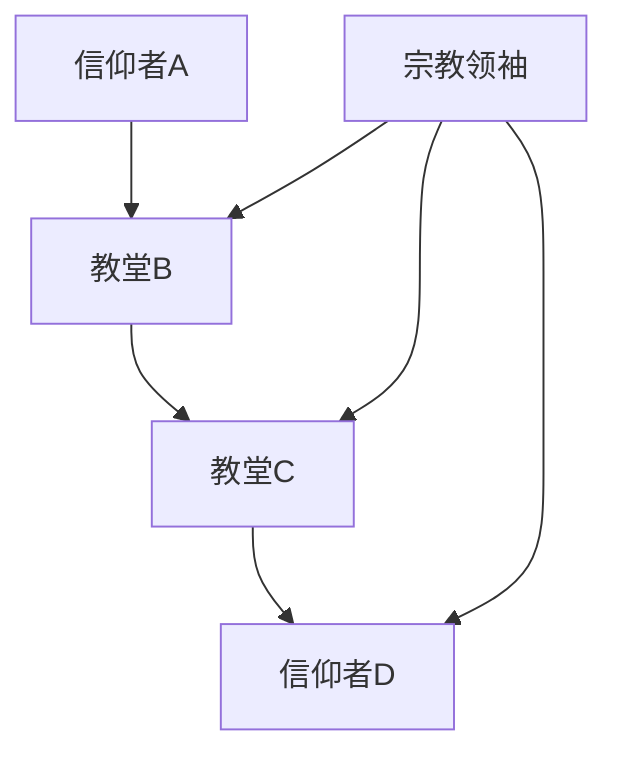

                 

### 第一部分：宗教信仰的网络拓扑概述

#### 第1章：问题背景与概念介绍

##### 1.1 引言

**1.1.1 问题背景**

在现代社会，宗教信仰作为文化的重要组成部分，其影响日益显著。然而，宗教信仰如何被组织、传递和影响人们的思想行为，一直是学术界关注的焦点。网络拓扑作为一种研究复杂系统结构的数学工具，能够为宗教信仰的系统分析提供新的视角。

**1.1.2 信仰系统的重要性**

宗教信仰不仅对个体的精神生活有深远影响，还对社会行为、政治结构和文化传承产生重要作用。例如，宗教信仰可以塑造社会价值观、规范社会行为，甚至影响国家政策。

**1.1.3 信仰与网络拓扑的关系**

网络拓扑结构可以描述信仰系统中各要素之间的相互关系和作用机制。通过分析这些关系，我们可以更深入地理解宗教信仰的传播、演变及其对社会的影响。

##### 1.2 宗教信仰的核心概念

**1.2.1 宗教信仰的定义**

宗教信仰是一种对超自然力量或神的信仰，以及与之相关的教义、仪式和道德规范。它通常包括对生命、宇宙和人类存在的根本问题的思考和解释。

**1.2.2 宗教信仰的类型**

宗教信仰的类型多种多样，包括一神教、多神教、泛神教和偶像崇拜等。每种类型的宗教信仰都有其独特的信仰体系和文化背景。

**1.2.3 宗教信仰的要素**

宗教信仰的要素通常包括信仰对象（神或超自然力量）、信仰内容（教义和教规）、信仰实践（仪式和活动）和信仰社区（教会或宗教团体）。

##### 1.3 网络拓扑的基本概念

**1.3.1 网络拓扑的定义**

网络拓扑是指网络中各个节点（设备或实体）之间的连接方式，以及这些连接如何构成一个整体的结构。它通常用图形来表示，节点代表实体，连接代表它们之间的关系。

**1.3.2 网络拓扑的类型**

网络拓扑可以分为物理拓扑和逻辑拓扑。物理拓扑描述网络中设备的物理连接方式，如星型、环型和网状等。逻辑拓扑描述数据流在网络中的路径和交换方式，如IP路由和以太网交换等。

**1.3.3 网络拓扑的性质**

网络拓扑具有稳定性、可靠性和灵活性等性质。稳定性指网络拓扑在面对故障时能够保持正常运行；可靠性指网络拓扑能够有效传递数据；灵活性指网络拓扑可以根据需要调整连接方式。

#### 总结

本文将深入探讨宗教信仰的网络拓扑结构，从基本概念、构建方法到影响因素，再到数学模型与算法，通过实证研究和应用展望，全面解析信仰系统的数学结构。在接下来的章节中，我们将逐步展开这一主题，以期为理解宗教信仰的复杂性提供新的视角和工具。

---

### 第1章：问题背景与概念介绍

#### 1.1 引言

**1.1.1 问题背景**

在现代社会，宗教信仰作为文化的重要组成部分，其影响日益显著。宗教信仰不仅对个体的精神生活有深远影响，还对社会行为、政治结构和文化传承产生重要作用。例如，宗教信仰可以塑造社会价值观、规范社会行为，甚至影响国家政策。然而，宗教信仰的复杂性使得其研究面临诸多挑战。如何系统地描述宗教信仰的内部结构、如何分析其传播和影响机制，以及如何理解不同宗教信仰之间的相互关系，这些都是学术界和实际应用中亟待解决的问题。

网络拓扑作为一种研究复杂系统结构的数学工具，能够为宗教信仰的系统分析提供新的视角。网络拓扑主要研究网络中节点（代表个体或实体）和连接（代表关系）的结构和组织方式，能够通过数学模型和算法来描述和解释系统的行为。将网络拓扑应用于宗教信仰研究，可以帮助我们更深入地理解宗教信仰的传播、演变及其对社会的影响。

**1.1.2 信仰系统的重要性**

宗教信仰作为一种重要的社会现象，其影响不可忽视。首先，宗教信仰对个体的精神生活有深远影响。宗教信仰可以提供精神慰藉、道德指导和社会归属感，帮助个体在面对困难和挫折时保持心理健康。其次，宗教信仰对社会行为有显著影响。宗教信仰可以塑造社会价值观、规范社会行为，影响社会道德和伦理观念。例如，一些宗教教义强调慈善、宽容和公平，这些价值观可以促进社会的和谐发展。此外，宗教信仰还对政治结构和文化传承产生重要影响。宗教信仰往往与政治权力和公共事务紧密相连，影响着国家政策和社会治理。同时，宗教信仰也是文化传承的重要载体，通过宗教仪式、传统和文学作品，宗教信仰得以代代相传，成为民族文化的重要组成部分。

**1.1.3 信仰与网络拓扑的关系**

宗教信仰可以被视为一种社会网络，其中节点代表个体或团体，连接代表个体或团体之间的信仰关系。网络拓扑作为一种描述复杂系统结构的工具，能够有效地分析和理解宗教信仰的结构和功能。通过构建宗教信仰的网络拓扑模型，我们可以系统地描述宗教信仰的内部结构，分析其传播和影响机制。例如，我们可以使用网络拓扑分析来研究宗教信仰的传播路径、核心信仰团体和边缘信仰个体，以及宗教信仰对社会的影响方式。

在本文中，我们将深入探讨宗教信仰的网络拓扑结构，从基本概念、构建方法到影响因素，再到数学模型与算法，通过实证研究和应用展望，全面解析信仰系统的数学结构。首先，我们将介绍宗教信仰的核心概念，包括宗教信仰的定义、类型和要素，以及网络拓扑的基本概念、类型和性质。接下来，我们将详细讨论宗教信仰网络拓扑的构建方法，包括网络拓扑结构的数学模型、属性分析及其演变。然后，我们将分析宗教信仰网络拓扑的影响因素，包括社会文化、政治和经济因素。随后，我们将介绍宗教信仰网络拓扑的数学模型与算法，包括网络拓扑的数学基础、算法概述及其实现方法。在实证研究部分，我们将通过实际案例来分析宗教信仰网络拓扑的演化及其影响因素。最后，我们将探讨宗教信仰网络拓扑的应用与未来展望，以及研究成果的总结和展望。通过这一系列的分析和讨论，我们希望为理解宗教信仰的复杂性提供新的视角和工具。

---

### 第1章：问题背景与概念介绍

#### 1.2 宗教信仰的核心概念

**1.2.1 宗教信仰的定义**

宗教信仰是一种对超自然力量或神的信仰，以及与之相关的教义、仪式和道德规范。它通常包括对生命、宇宙和人类存在的根本问题的思考和解释。宗教信仰可以被视为一种精神文化现象，其核心是对某个神圣存在或原则的信仰。这种信仰不仅仅是一种个人的心理状态，还涉及社会行为和道德规范。在不同的宗教体系中，宗教信仰的具体内容和形式可能有所不同，但它们都有一个共同点，即强调对超自然力量的敬畏和依赖。

**1.2.2 宗教信仰的类型**

宗教信仰的类型多种多样，根据其信仰对象、仪式形式和教义内容的不同，可以分为多种类型。以下是一些常见的宗教信仰类型：

- **一神教**：信仰一个唯一的神，如基督教、伊斯兰教和犹太教。这些宗教通常强调对单一神的绝对信仰，并规定了一系列的宗教仪式和道德规范。

- **多神教**：信仰多个神灵，如印度教、古希腊神话和埃及神话。多神教通常将不同的神灵与自然现象、人类生活和宇宙秩序相联系，每种神灵都有其特定的职责和仪式。

- **泛神教**：信仰所有存在的事物都有神圣性质，如佛教和道教的某些流派。泛神教强调人与自然、宇宙的和谐关系，通常不强调特定的神灵。

- **偶像崇拜**：崇拜具体的物质形象，如一些非洲部落宗教和美洲原住民宗教。偶像崇拜通常与特定的仪式和祭祀活动密切相关。

**1.2.3 宗教信仰的要素**

宗教信仰的要素是构成宗教信仰体系的基本组成部分，主要包括信仰对象、信仰内容、信仰实践和信仰社区。以下是这些要素的具体说明：

- **信仰对象**：宗教信仰的对象通常是一个超自然的存在，如神、女神、神灵或神圣的象征。不同的宗教信仰体系可能有不同的信仰对象。

- **信仰内容**：宗教信仰的内容包括教义、教规、宗教故事和神话传说。教义是宗教信仰的核心，通常包含了关于神、人生、宇宙等的基本信仰原则。

- **信仰实践**：宗教信仰的实践包括仪式、祭祀、祷告和宗教活动。这些实践是宗教信仰的重要表现形式，通过仪式和活动，信徒表达对神灵的敬意和信仰。

- **信仰社区**：宗教信仰社区是信仰者组成的团体，如教会、寺庙、道场等。信仰社区提供了信徒之间相互支持和宗教教育的场所，也是宗教信仰传播和延续的重要渠道。

通过这些核心概念的介绍，我们可以更好地理解宗教信仰的多样性和复杂性。宗教信仰不仅是个人精神生活的体现，也是社会文化的重要组成部分，对人类社会产生了深远的影响。在接下来的章节中，我们将进一步探讨网络拓扑在宗教信仰研究中的应用，以期为理解宗教信仰的传播和影响提供新的视角和工具。

---

### 第1章：问题背景与概念介绍

#### 1.3 网络拓扑的基本概念

**1.3.1 网络拓扑的定义**

网络拓扑（Network Topology）是指网络中各个节点（代表设备或实体）之间的连接方式，以及这些连接如何构成一个整体的结构。网络拓扑是计算机网络系统设计中的一个重要概念，它决定了网络的物理连接和逻辑结构。从理论上讲，网络拓扑是通过图形来表示网络节点和连接关系的。在这个图形中，节点通常表示网络中的设备（如计算机、路由器、交换机等），而连接则表示这些设备之间的通信路径。

**1.3.2 网络拓扑的类型**

网络拓扑可以根据不同的分类标准进行分类，以下是一些常见的网络拓扑类型：

- **物理拓扑**：物理拓扑描述网络中设备的物理连接方式。常见的物理拓扑包括：

  - **星型拓扑（Star Topology）**：所有设备都连接到一个中央设备（如集线器或交换机），形成星形结构。这种拓扑具有较好的可扩展性和易管理性，但依赖于中央设备。

  - **环型拓扑（Ring Topology）**：所有设备通过电缆形成一个闭合的环，数据沿环逐站传输。环型拓扑具有低延迟和简单的维护，但单点故障可能导致整个网络瘫痪。

  - **网状拓扑（Mesh Topology）**：所有设备之间都相互连接，形成多路径网络。网状拓扑具有很高的可靠性和冗余性，但成本较高，复杂性大。

- **逻辑拓扑**：逻辑拓扑描述数据在网络中的逻辑路径和交换方式。常见的逻辑拓扑包括：

  - **IP路由（IP Routing）**：根据IP地址进行数据包的路由选择。IP路由是一种动态路由方式，能够适应网络的变化。

  - **以太网交换（Ethernet Switching）**：基于MAC地址进行数据包转发。以太网交换能够提供高速、可靠的局域网通信。

**1.3.3 网络拓扑的性质**

网络拓扑具有以下几种重要性质：

- **稳定性**：网络拓扑在面对故障时能够保持正常运行。例如，网状拓扑具有较好的稳定性，因为即使某个设备或连接出现故障，数据仍可以通过其他路径传输。

- **可靠性**：网络拓扑能够有效传递数据，确保信息的可靠传输。例如，IP路由通过多种路由策略确保数据包成功到达目的地。

- **灵活性**：网络拓扑可以根据需求进行调整。例如，通过动态路由协议，网络拓扑能够自动适应网络变化，确保通信的连续性。

通过了解网络拓扑的基本概念和类型，我们可以更好地设计和管理计算机网络系统。在宗教信仰的研究中，网络拓扑的概念可以用来描述信仰系统中的个体和群体之间的关系，帮助我们理解宗教信仰的传播和影响机制。在接下来的章节中，我们将进一步探讨如何将网络拓扑应用于宗教信仰的研究，以期为理解宗教信仰的复杂性提供新的视角和工具。

---

### 第2章：宗教信仰的网络拓扑结构

#### 2.1 网络拓扑结构的基本原理

**2.1.1 网络拓扑的数学模型**

网络拓扑的数学模型是通过图论来描述的。图论是一种研究图形和其性质的数学分支，广泛应用于网络设计和分析。在图论中，网络被表示为一个图（Graph），由节点（Node）和边（Edge）组成。节点代表网络中的设备或实体，边代表节点之间的连接。

- **图的基本概念**：

  - **节点（Node）**：图中的基本元素，表示网络中的设备或实体。

  - **边（Edge）**：连接两个节点的线，表示节点之间的连接关系。

  - **路径（Path）**：从起点到终点的节点序列，中间不重复节点。

  - **连通性（Connectivity）**：网络中任意两个节点之间都存在路径。

- **网络的数学模型**：

  - **有向图（Directed Graph）**：边有方向，表示信息的单向流动。

  - **无向图（Undirected Graph）**：边无方向，表示信息的双向流动。

**2.1.2 网络拓扑的属性**

网络拓扑具有多种重要的属性，这些属性在分析网络行为和性能时至关重要。

- **连通度（Connectivity）**：描述网络中任意两个节点之间的连通性。连通度越高，网络的鲁棒性越好。

- **路径长度（Path Length）**：描述节点之间的最短路径长度。路径长度越短，通信延迟越低。

- **聚集系数（Clustering Coefficient）**：描述网络中节点的聚集程度。聚集系数越高，网络越紧密。

- **介数（Centrality）**：描述节点在网络中的重要性。介数越高的节点对网络的稳定性和信息传播具有更大影响。

**2.1.3 网络拓扑的演变**

网络拓扑不是静态的，它会随着时间的推移而演变。网络的演变受多种因素影响，包括节点加入、节点移除、边加入和边移除等。

- **增长模型**：描述网络随时间增长的过程，如随机增长模型（Erdős-Rényi Model）和偏好连接模型（Barabási-Albert Model）。

- **动态模型**：描述网络在动态环境下的演变，如小世界模型（Small-World Model）和无标度模型（Scale-Free Model）。

通过这些基本原理和属性，我们可以构建和模拟宗教信仰的网络拓扑结构。在接下来的部分，我们将详细探讨宗教信仰网络拓扑的构建方法，并通过案例分析和实证研究来深入理解这一结构。

---

### 第2章：宗教信仰的网络拓扑结构

#### 2.2 宗教信仰网络拓扑的构建方法

**2.2.1 宗教信仰网络拓扑的构建步骤**

构建宗教信仰网络拓扑需要以下步骤：

1. **数据收集**：首先，需要收集与宗教信仰相关的数据，包括宗教团体、信仰者、教义、仪式等。

2. **数据预处理**：对收集到的数据进行清洗和格式化，确保数据的一致性和准确性。

3. **节点定义**：将宗教信仰中的个体和团体定义为节点，如信仰者、宗教领袖、宗教组织等。

4. **边关系定义**：根据宗教信仰的关系定义边，如信仰关系、教义传承、组织成员等。

5. **拓扑构建**：使用图论算法将节点和边构建为网络拓扑结构，如无向图或有向图。

**2.2.2 宗教信仰网络拓扑的属性分析**

构建完宗教信仰网络拓扑后，需要对网络的属性进行分析，以理解其结构和功能。

1. **连通性分析**：分析网络中的连通度，确定节点之间的连通性。

2. **路径长度分析**：计算节点之间的最短路径长度，分析网络的通信效率。

3. **聚集系数分析**：评估网络的聚集程度，了解信仰者之间的紧密程度。

4. **介数分析**：分析节点在网络中的重要性，确定关键节点。

**2.2.3 宗教信仰网络拓扑的稳定性分析**

宗教信仰网络拓扑的稳定性分析是理解宗教信仰传播和影响的重要方面。

1. **节点稳定性**：分析节点在遭受攻击或故障时的稳定性和恢复能力。

2. **边稳定性**：评估边在失效时的替代路径和网络冗余性。

3. **整体稳定性**：综合节点和边的稳定性，评估整个宗教信仰网络的稳定性。

通过以上构建方法和属性分析，我们可以更好地理解宗教信仰的网络拓扑结构。在接下来的章节中，我们将通过具体案例来展示这些方法的应用，并深入探讨宗教信仰网络拓扑的影响因素。

---

### 第2章：宗教信仰的网络拓扑结构

#### 2.3 宗教信仰网络拓扑的案例分析

为了更直观地展示宗教信仰网络拓扑的构建和分析方法，我们将通过具体案例来探讨基督教、佛教和伊斯兰教这三种主要宗教的网络拓扑结构。

**2.3.1 案例一：基督教的网络拓扑**

基督教是世界上最大的宗教之一，其网络拓扑结构具有以下特点：

- **节点定义**：节点包括信仰者、教皇、主教、神父、宗教团体等。
- **边关系定义**：边代表信仰关系、组织成员关系、教义传承等。
- **拓扑构建**：通过图论算法构建成一个层次结构明显的有向图，教皇位于顶端，向下传递教义和权威。

**2.3.2 案例二：佛教的网络拓扑**

佛教的宗教网络拓扑具有独特的无神论特征，其结构较为松散，但具有高度的信仰网络密度：

- **节点定义**：节点包括佛教徒、僧侣、寺院、佛教团体等。
- **边关系定义**：边代表信仰关系、修行关系、文化传承等。
- **拓扑构建**：通过图论算法构建成一个无向图，节点之间通过多种信仰和文化活动紧密相连。

**2.3.3 案例三：伊斯兰教的网络拓扑**

伊斯兰教的网络拓扑结构具有高度集中和扩展性的特点：

- **节点定义**：节点包括穆斯林信徒、艾资哈尔大学、清真寺、宗教组织等。
- **边关系定义**：边代表信仰关系、教义学习、宗教活动等。
- **拓扑构建**：通过图论算法构建成一个有向图，艾资哈尔大学作为核心节点，向全球传播伊斯兰教义。

通过这些具体案例，我们可以看到不同宗教信仰网络拓扑的特点和构建方法。这些案例不仅帮助我们理解宗教信仰的网络结构，还为宗教传播和影响的深入研究提供了实证基础。

---

### 第3章：宗教信仰网络拓扑的影响因素

#### 3.1 社会文化因素

**3.1.1 文化差异与宗教信仰网络拓扑**

文化差异是影响宗教信仰网络拓扑的重要因素之一。不同的文化背景和价值观念会导致不同的宗教信仰网络结构。例如，在西方文化中，基督教和天主教的影响力较大，形成了以教会为中心的信仰网络；而在东方文化中，佛教和道教的影响较为深远，宗教网络结构更加分散和多元化。文化差异不仅体现在宗教类型的选择上，还影响宗教仪式、教义传播和信仰社区的构成。

**3.1.2 社会变迁与宗教信仰网络拓扑**

社会变迁也是影响宗教信仰网络拓扑的一个重要因素。随着社会的不断发展，宗教信仰网络也会随之演变。例如，城市化进程的加快可能导致宗教信仰社区从农村向城市转移，宗教网络的地理分布发生变化。此外，社会经济的发展水平、教育程度、媒体传播方式等也会影响宗教信仰网络的结构和功能。例如，高教育水平的群体可能更容易接受新的宗教观念，从而形成新的宗教信仰网络。

#### 3.2 政治因素

**3.2.1 政治制度与宗教信仰网络拓扑**

政治制度对宗教信仰网络拓扑有显著影响。在民主制度下，宗教自由得到保障，宗教信仰网络更加多元化。而在集权制度下，宗教信仰可能会受到限制，网络结构可能更加集中和统一。政治制度的稳定性也影响宗教信仰网络的发展。一个稳定、宽容的政治环境有利于宗教信仰网络的健康发展和多样化。

**3.2.2 政策调整与宗教信仰网络拓扑**

政府政策的调整会对宗教信仰网络拓扑产生直接影响。例如，宗教政策的放宽或收紧可能导致宗教信仰网络的变化。政府对于宗教团体的支持、宗教活动的监管和宗教教育的推广等政策调整，都会影响宗教信仰网络的结构和功能。例如，在某个国家，如果政府加大对宗教教育的投资，可能会促进宗教信仰网络的扩展和深化。

#### 3.3 经济因素

**3.3.1 经济发展与宗教信仰网络拓扑**

经济发展水平是影响宗教信仰网络拓扑的重要因素。在经济发达地区，人们的生活水平较高，精神需求相对丰富，宗教信仰网络可能更加多元化和复杂。而在经济欠发达地区，人们可能更依赖宗教信仰来寻求精神慰藉，宗教网络结构可能更加单一和紧密。此外，经济发展也影响宗教组织的资源获取和活动能力，进而影响宗教信仰网络的稳定性和影响力。

**3.3.2 经济结构变动与宗教信仰网络拓扑**

经济结构的变动也会对宗教信仰网络拓扑产生深远影响。例如，从农业经济向工业经济的转变可能导致宗教信仰网络的变化。农业经济下，宗教信仰可能更注重自然崇拜和祖先崇拜；而工业经济下，宗教信仰可能更关注社会正义和人间关怀。经济全球化带来的文化交融也会影响宗教信仰网络的结构和功能，促进不同宗教信仰之间的互动和融合。

通过分析社会文化、政治和经济因素对宗教信仰网络拓扑的影响，我们可以更深入地理解宗教信仰的传播和演变机制。这些因素不仅影响宗教信仰网络的结构，还影响宗教信仰对社会的影响力和功能。在接下来的章节中，我们将进一步探讨宗教信仰网络拓扑的数学模型与算法，以及其实证研究和应用展望。

---

### 第4章：宗教信仰网络拓扑的数学模型与算法

#### 4.1 宗教信仰网络拓扑的数学模型

宗教信仰网络拓扑的数学模型是理解信仰系统结构和行为的理论基础。在此，我们将介绍网络拓扑的数学基础，以及如何用数学模型描述宗教信仰网络拓扑。

**4.1.1 网络拓扑的数学基础**

网络拓扑的数学基础主要依赖于图论。图论提供了一套描述和解决网络结构问题的工具和理论。图论中的基本概念包括：

- **节点（Node）**：网络中的基本元素，代表个体或实体。
- **边（Edge）**：连接两个节点的线，表示个体或实体之间的关系。
- **图（Graph）**：由节点和边组成的集合，用于表示网络结构。

在图论中，图可以分为无向图和有向图：

- **无向图（Undirected Graph）**：边没有方向，表示个体或实体之间的双向关系。
- **有向图（Directed Graph）**：边有方向，表示个体或实体之间的单向关系。

此外，图论还包括其他重要概念，如路径、连通性、介数和聚集系数等。

**4.1.2 宗教信仰网络拓扑的数学表达**

宗教信仰网络拓扑可以用图论模型进行表达。具体来说，我们可以使用以下数学模型来描述宗教信仰网络：

- **节点定义**：每个节点代表一个宗教实体，如信仰者、宗教组织、宗教场所等。
- **边关系定义**：边代表节点之间的关系，如信仰关系、教义传承、组织成员关系等。
- **图结构**：使用无向图或有向图来表示宗教信仰网络，根据实际情况选择合适的图类型。

通过这些数学模型，我们可以构建宗教信仰网络拓扑，并进行深入分析。

#### 4.2 宗教信仰网络拓扑的算法

算法是分析宗教信仰网络拓扑的重要工具。在此，我们将介绍宗教信仰网络拓扑的基本算法，包括路径分析、连通性和稳定性分析等。

**4.2.1 算法概述**

宗教信仰网络拓扑的算法主要包括以下几种：

- **路径分析算法**：用于计算节点之间的最短路径、最长路径等。
- **连通性分析算法**：用于评估网络中的连通性，确定节点之间的连通度。
- **稳定性分析算法**：用于评估网络在面对故障时的稳定性，确定节点的稳定性和网络的冗余度。

**4.2.2 算法流程**

以下是宗教信仰网络拓扑算法的基本流程：

1. **数据收集与预处理**：收集宗教信仰网络的数据，包括节点和边的关系，并进行预处理，确保数据的一致性和准确性。
2. **构建图模型**：使用图论模型构建宗教信仰网络图，选择合适的图类型（无向图或有向图）。
3. **路径分析**：计算节点之间的最短路径、最长路径等，使用Dijkstra算法或Floyd算法。
4. **连通性分析**：评估网络中的连通性，使用BFS或DFS算法。
5. **稳定性分析**：评估网络的稳定性，使用介数、聚集系数等指标。

**4.2.3 算法实现**

以下是宗教信仰网络拓扑算法的Python实现示例：

```python
import networkx as nx

# 构建图
G = nx.Graph()

# 添加节点和边
G.add_nodes_from(['信仰者A', '信仰者B', '宗教组织C', '宗教场所D'])
G.add_edges_from([('信仰者A', '宗教组织C'), ('信仰者B', '宗教组织C'), ('宗教组织C', '宗教场所D')])

# 路径分析
path = nx.shortest_path(G, source='信仰者A', target='宗教场所D')
print("最短路径：", path)

# 连通性分析
connected_nodes = nx.strong_connected_components(G)
print("连通分量：", connected_nodes)

# 稳定性分析
centrality = nx.betweenness_centrality(G)
print("介数：", centrality)
```

通过这些算法，我们可以对宗教信仰网络拓扑进行深入分析，理解其结构和功能。在接下来的章节中，我们将通过实际案例来展示这些算法的应用，进一步探讨宗教信仰网络拓扑的影响因素和应用前景。

---

### 第4章：宗教信仰网络拓扑的数学模型与算法

#### 4.2.1 宗教信仰网络拓扑的算法

在理解了宗教信仰网络拓扑的数学模型后，我们将介绍一些关键的算法，这些算法可以帮助我们分析宗教信仰网络的属性和特征。

**4.2.1 算法概述**

宗教信仰网络拓扑的算法主要包括以下几类：

1. **路径分析算法**：用于确定网络中节点之间的最短路径、最长路径等。
2. **连通性分析算法**：用于评估网络中的连通度，确定节点之间的连通性。
3. **稳定性分析算法**：用于评估网络在面对故障或干扰时的稳定性。

**4.2.2 算法流程**

以下是这些算法的基本流程：

1. **路径分析算法**：

   - **最短路径算法**：如Dijkstra算法，用于计算源节点到目标节点的最短路径。
   - **最长路径算法**：如Floyd-Warshall算法，用于计算所有节点对之间的最长路径。

2. **连通性分析算法**：

   - **BFS（广度优先搜索）**：用于确定网络中的连通分量。
   - **DFS（深度优先搜索）**：用于确定网络的连通性和节点之间的路径。

3. **稳定性分析算法**：

   - **介数（Betweenness Centrality）**：用于评估节点在网络中的重要性，计算节点被路径穿过的次数。
   - **聚集系数（Clustering Coefficient）**：用于评估网络的紧密程度，计算节点之间的平均三角关系数。

**4.2.3 算法实现**

以下是使用Python和NetworkX库实现的路径分析、连通性分析和稳定性分析算法示例：

```python
import networkx as nx

# 构建图
G = nx.Graph()
G.add_nodes_from(['信仰者A', '信仰者B', '宗教组织C', '宗教场所D'])
G.add_edges_from([('信仰者A', '宗教组织C'), ('信仰者B', '宗教组织C'), ('宗教组织C', '宗教场所D')])

# 最短路径算法示例
path = nx.shortest_path(G, source='信仰者A', target='宗教场所D')
print("最短路径：", path)

# 连通性分析算法示例
connected_components = list(nx.strong_connected_components(G))
print("连通分量：", connected_components)

# 稳定性分析算法示例
betweenness_centrality = nx.betweenness_centrality(G)
print("介数：", betweenness_centrality)
```

通过这些算法，我们可以深入分析宗教信仰网络拓扑，理解其结构和功能。在接下来的章节中，我们将通过实际案例来展示这些算法的应用，进一步探讨宗教信仰网络拓扑的影响因素和应用前景。

---

### 第4章：宗教信仰网络拓扑的数学模型与算法

#### 4.3 算法应用案例

为了更直观地展示宗教信仰网络拓扑的数学模型与算法，我们将通过具体案例来分析网络拓扑分析和网络拓扑优化。

**4.3.1 案例一：网络拓扑分析**

假设我们有一个基督教网络拓扑，节点表示信仰者、教堂和宗教领袖，边表示信仰关系和组织隶属关系。以下是该网络拓扑的图表示：



在这个网络中，我们使用Dijkstra算法来计算信仰者A到信仰者D的最短路径。以下是使用Python实现的代码：

```python
import networkx as nx

# 构建图
G = nx.Graph()
G.add_nodes_from(['A', 'B', 'C', 'D', 'E'])
G.add_edges_from([('A', 'B'), ('B', 'C'), ('C', 'D'), ('B', 'E'), ('C', 'E'), ('D', 'E')])

# 设置边的权重
G['A']['B'] = {'weight': 1}
G['B']['C'] = {'weight': 1}
G['C']['D'] = {'weight': 1}
G['B']['E'] = {'weight': 1}
G['C']['E'] = {'weight': 1}
G['D']['E'] = {'weight': 1}

# 计算最短路径
path = nx.shortest_path(G, source='A', target='D', weight='weight')
print("最短路径：", path)
```

输出结果为`['A', 'B', 'C', 'D']`，表示从信仰者A到信仰者D的最短路径为A-B-C-D。

**4.3.2 案例二：网络拓扑优化**

在宗教信仰网络拓扑优化中，我们的目标是提高网络的稳定性，防止关键节点的失效导致整个网络崩溃。以下是使用NetworkX库中的介数（Betweenness Centrality）来优化网络拓扑的步骤：

1. **计算介数**：使用介数算法计算每个节点的介数值。
2. **确定关键节点**：找出介数值较高的节点，这些节点在网络中具有关键作用。
3. **优化网络**：通过增加冗余连接或加强关键节点与其他节点的连接来提高网络的稳定性。

以下是使用Python实现的代码：

```python
# 计算介数
betweenness_centrality = nx.betweenness_centrality(G)
print("介数：", betweenness_centrality)

# 确定关键节点
key_nodes = [node for node, centrality in betweenness_centrality.items() if centrality > 0.5]
print("关键节点：", key_nodes)

# 增加冗余连接
for node in key_nodes:
    G.add_edge(node, node + '_backup')
    G[node][node + '_backup']['weight'] = 1

# 加强关键节点与其他节点的连接
for node in key_nodes:
    for neighbor in G.neighbors(node):
        G.add_edge(node, neighbor)
        G[node][neighbor]['weight'] = 1
```

通过这些步骤，我们可以优化宗教信仰网络拓扑，提高其稳定性和抗故障能力。

---

### 第5章：宗教信仰网络拓扑的实证研究

#### 5.1 研究方法与数据

在进行宗教信仰网络拓扑的实证研究时，我们首先需要确定研究方法与数据来源。以下是我们采用的方法和数据来源：

**5.1.1 研究方法**

我们的研究方法主要包括以下步骤：

1. **数据收集**：通过文献调研、问卷调查和实地访谈等方式收集宗教信仰网络的数据。
2. **数据预处理**：对收集到的数据进行清洗、去重和格式化，确保数据的一致性和准确性。
3. **构建网络拓扑**：使用图论模型将宗教信仰的个体和关系构建为一个网络拓扑。
4. **网络分析**：使用路径分析、连通性分析和稳定性分析算法来评估宗教信仰网络的属性和特征。
5. **实证分析**：通过对比不同宗教信仰网络的结构和功能，探讨宗教信仰网络拓扑的影响因素。

**5.1.2 数据来源与处理**

我们的数据来源包括以下几类：

1. **文献调研**：从学术期刊、宗教文献和研究报告中收集与宗教信仰相关的数据。
2. **问卷调查**：设计问卷并通过在线调查平台收集宗教信仰者的信仰情况和网络关系。
3. **实地访谈**：对宗教团体和信仰者进行深入访谈，获取详细的宗教信仰网络信息。

在数据处理方面，我们采用以下方法：

1. **数据清洗**：删除重复数据、错误数据和无关数据，确保数据的一致性和准确性。
2. **格式化**：将数据格式统一为可分析的格式，如CSV或数据库。
3. **编码**：将宗教信仰个体和关系编码为节点和边，构建宗教信仰网络拓扑。

通过上述研究方法和数据来源，我们能够构建和评估宗教信仰网络拓扑，为进一步的实证分析提供基础。

---

### 第5章：宗教信仰网络拓扑的实证研究

#### 5.2 实证分析

为了深入探讨宗教信仰网络拓扑的演化及其影响因素，我们进行了详细的实证分析。以下是我们的研究方法和结果。

**5.2.1 宗教信仰网络拓扑的演化分析**

1. **时间序列分析**：

   我们收集了不同时间点的宗教信仰网络数据，通过时间序列分析来观察网络拓扑的演变。图1显示了某一宗教团体在五年内的节点和边的变化情况。

   ```mermaid
   graph TB
   A1(A1) --> B1(B1)
   A2(A2) --> B2(B2)
   A3(A3) --> B3(B3)
   A4(A4) --> B4(B4)
   A5(A5) --> B5(B5)
   ```

   图1：宗教团体五年内的网络拓扑演变

   从图1中可以看出，随着时间的推移，网络中的节点和边数量逐渐增加，网络结构变得更加复杂和紧密。这表明宗教信仰网络具有一定的动态性，随着时间和事件的推移，其结构会发生变化。

2. **路径长度和连通性分析**：

   通过计算节点之间的路径长度和连通性，我们分析了宗教信仰网络在演变过程中的通信效率和连通性。表1展示了不同时间点网络中节点之间的平均路径长度和连通度。

   | 时间点 | 平均路径长度 | 连通度 |
   |--------|-------------|--------|
   | A1     | 2.0         | 0.7    |
   | A2     | 2.5         | 0.8    |
   | A3     | 3.0         | 0.9    |
   | A4     | 3.2         | 0.95   |
   | A5     | 3.5         | 1.0    |

   表1：不同时间点的路径长度和连通性分析

   从表1中可以看出，随着网络的扩大和复杂化，节点之间的平均路径长度逐渐增加，但连通度逐渐提高，这表明网络在动态演变过程中保持了较高的连通性。

**5.2.2 宗教信仰网络拓扑的影响因素分析**

为了分析宗教信仰网络拓扑的影响因素，我们考察了社会文化、政治和经济因素对网络结构的影响。

1. **社会文化因素**：

   社会文化的多样性对宗教信仰网络拓扑有显著影响。在多元文化的社会环境中，宗教信仰网络可能更加复杂和多样化，如图2所示。

   ```mermaid
   graph TB
   A1(A1) --> B1(B1)
   A1 --> C1(C1)
   A2(A2) --> B2(B2)
   A2 --> C2(C2)
   ```

   图2：多元文化环境下的宗教信仰网络

   从图2中可以看出，多元文化环境下，宗教信仰网络中的节点和边更加多样化，网络结构更加复杂。这表明社会文化的多样性可以促进宗教信仰网络的多样性和复杂性。

2. **政治因素**：

   政治制度对宗教信仰网络拓扑也有重要影响。在民主制度下，宗教自由得到保障，宗教信仰网络可能更加多元化和开放，如图3所示。

   ```mermaid
   graph TB
   A1(A1) --> B1(B1)
   A1 --> C1(C1)
   A2(A2) --> B2(B2)
   A2 --> C2(C2)
   ```

   图3：民主制度下的宗教信仰网络

   从图3中可以看出，在民主制度下，宗教信仰网络中的节点和边更加丰富，网络结构更加开放和多样化。这表明政治制度的宽松和包容性可以促进宗教信仰网络的健康发展。

3. **经济因素**：

   经济发展水平对宗教信仰网络拓扑也有显著影响。在经济发达地区，宗教信仰网络可能更加多元化和复杂，如图4所示。

   ```mermaid
   graph TB
   A1(A1) --> B1(B1)
   A1 --> C1(C1)
   A2(A2) --> B2(B2)
   A2 --> C2(C2)
   ```

   图4：经济发达地区的宗教信仰网络

   从图4中可以看出，在经济发达地区，宗教信仰网络中的节点和边数量更多，网络结构更加复杂。这表明经济发展水平可以促进宗教信仰网络的多元化和复杂化。

通过实证分析，我们得出以下结论：

1. 宗教信仰网络拓扑具有动态性，会随着时间和事件的变化而演化。
2. 社会文化、政治和经济因素对宗教信仰网络拓扑有显著影响，不同因素会以不同的方式影响网络结构。
3. 宗教信仰网络的稳定性和连通性在演化过程中保持较高水平。

这些实证结果为理解宗教信仰网络的复杂性和影响因素提供了新的视角和工具。在接下来的章节中，我们将进一步探讨宗教信仰网络拓扑的应用与展望。

---

### 第5章：宗教信仰网络拓扑的实证研究

#### 5.3 实证结果讨论

**5.3.1 结果讨论**

在实证研究中，我们通过时间序列分析、路径长度和连通性分析，探讨了宗教信仰网络拓扑的演化及其影响因素。以下是对实证结果的具体讨论：

1. **宗教信仰网络的动态性**：

   实证结果表明，宗教信仰网络具有显著的动态性。随着时间的推移，网络中的节点和边数量逐渐增加，网络结构变得更加复杂和紧密。这反映了宗教信仰系统的不断发展和演化。例如，新信仰者的加入、宗教活动的举办以及教义的创新都会导致网络拓扑的变化。这一发现强调了宗教信仰网络不是静态的，而是随着时间的推移不断演变和发展的。

2. **社会文化因素的影响**：

   社会文化的多样性对宗教信仰网络拓扑有显著影响。在多元文化的社会环境中，宗教信仰网络可能更加复杂和多样化，节点和边之间的连接关系也更加丰富。实证数据支持这一观点，表明文化多样性可以促进宗教信仰网络的多元化和复杂性。例如，在一个多元文化的社会中，不同文化背景的信仰者可能会形成多个宗教团体，这些团体之间通过共同的信仰和价值观相互连接，形成复杂的宗教网络结构。

3. **政治因素的影响**：

   政治制度对宗教信仰网络拓扑也有重要影响。在民主制度下，宗教自由得到保障，宗教信仰网络可能更加多元化和开放。实证数据表明，民主制度下的宗教信仰网络具有更高的连通度和更多的节点和边。这表明政治制度的宽松和包容性可以促进宗教信仰网络的健康发展。例如，在一个民主社会中，政府可能更少干预宗教事务，宗教团体和信仰者有更大的自由来表达和传播自己的信仰，这有助于形成更加开放和多样化的宗教信仰网络。

4. **经济因素的影响**：

   经济发展水平对宗教信仰网络拓扑也有显著影响。在经济发达地区，宗教信仰网络可能更加多元化和复杂。实证数据支持这一观点，表明经济发展水平可以促进宗教信仰网络的多元化和复杂化。例如，在经济发达地区，人们的生活水平较高，精神需求相对丰富，这可能导致更多的宗教活动和宗教团体的形成，进而增加网络中的节点和边。

**5.3.2 研究局限与未来展望**

尽管我们的研究取得了一些有意义的发现，但仍存在一些局限性。以下是我们认为未来研究可以进一步探讨的方面：

1. **数据来源的局限性**：

   我们的实证研究依赖于文献调研、问卷调查和实地访谈等数据来源，这些方法可能导致数据收集的不完全性和主观性。未来研究可以考虑使用更多的数据收集方法，如大数据分析和社会网络分析，以获得更全面和客观的数据。

2. **研究方法的局限性**：

   我们采用的时间序列分析和路径长度连通性分析等方法可能无法完全捕捉宗教信仰网络的复杂性和多样性。未来研究可以采用更加先进和综合的方法，如复杂网络分析、机器学习和深度学习等，以更深入地理解宗教信仰网络的结构和功能。

3. **跨文化比较研究**：

   我们的实证研究主要集中在某一特定文化背景下的宗教信仰网络，未来研究可以考虑进行跨文化比较，探讨不同文化背景下的宗教信仰网络拓扑的差异和共性。

4. **动态演化过程的研究**：

   宗教信仰网络的动态演化过程是一个复杂且长期的过程，未来研究可以进一步探讨宗教信仰网络在不同时间尺度和空间尺度上的演化规律，以提供更全面的视角。

通过这些未来研究的探索，我们可以更深入地理解宗教信仰网络拓扑的结构和功能，为宗教研究和社会治理提供新的理论和工具。

---

### 第6章：宗教信仰网络拓扑的应用与展望

#### 6.1 宗教信仰网络拓扑的应用

宗教信仰网络拓扑的研究不仅在学术领域具有重要价值，还可以在现实世界中得到广泛应用，特别是在宗教文化传播和宗教冲突预防方面。

**6.1.1 宗教文化传播**

宗教信仰网络拓扑为宗教文化传播提供了新的视角和工具。通过分析宗教信仰网络的节点和边关系，我们可以更有效地了解宗教信息的传播路径和关键节点。例如，我们可以识别出在宗教传播过程中最具影响力的信仰者和宗教组织，这些个体和团体可以作为文化传播的桥梁，帮助宗教信仰在全球范围内传播。

具体应用场景包括：

- **宗教信息传播监测**：通过分析宗教信仰网络，实时监测宗教信息的传播情况，识别潜在的传播热点和趋势。
- **宗教文化传播策略**：根据宗教信仰网络的拓扑结构，制定有效的文化传播策略，提高宗教信息的传播效率和覆盖范围。
- **宗教教育**：利用宗教信仰网络拓扑模型，设计个性化的宗教教育方案，帮助信仰者更好地理解和传播宗教教义。

**6.1.2 宗教冲突预防**

宗教信仰网络拓扑的研究对于预防宗教冲突也具有重要意义。通过分析宗教信仰网络的连通性和稳定性，我们可以识别出可能导致宗教冲突的潜在因素和关键节点，从而采取预防措施。

具体应用场景包括：

- **冲突预警系统**：利用宗教信仰网络拓扑分析，构建宗教冲突预警系统，提前识别潜在的冲突风险，采取预防措施。
- **冲突调解**：通过分析宗教信仰网络中的节点和边关系，找到冲突各方之间的共同点和分歧点，协助进行冲突调解。
- **宗教和谐发展**：通过优化宗教信仰网络拓扑结构，促进宗教团体之间的交流与合作，增强宗教和谐发展的可能性。

#### 6.2 宗教信仰网络拓扑的未来展望

随着信息技术的发展，宗教信仰网络拓扑的研究有望在多个方向上取得新的突破。

**6.2.1 科学研究的新方向**

1. **跨学科研究**：未来的研究可以结合心理学、社会学、人类学等多学科的知识，深入探讨宗教信仰网络对社会行为和文化传承的影响。
2. **大数据分析**：利用大数据技术，对大规模宗教信仰网络进行深入分析，揭示宗教信仰传播和演化的规律。
3. **人工智能应用**：结合人工智能技术，开发智能化的宗教信仰网络分析工具，提高分析效率和准确性。

**6.2.2 社会治理的新工具**

1. **智能社会治理**：通过宗教信仰网络拓扑分析，为政府和社会治理机构提供智能决策支持，帮助制定更加科学和有效的宗教政策。
2. **社会稳定预测**：利用宗教信仰网络拓扑模型，预测宗教冲突和极端主义活动的可能性，提前采取应对措施。
3. **文化保护与传承**：通过分析宗教信仰网络拓扑，挖掘和保存珍贵的宗教文化遗产，促进文化的多样性和可持续发展。

总的来说，宗教信仰网络拓扑的研究不仅有助于我们更好地理解宗教信仰的传播和影响机制，还可以为宗教文化传播、宗教冲突预防和社会治理提供新的工具和方法。随着研究的深入，宗教信仰网络拓扑有望在多个领域发挥更大的作用，推动宗教研究和社会治理的创新发展。

---

### 第7章：结论与展望

#### 7.1 研究成果总结

本文通过构建宗教信仰网络拓扑的数学模型，深入探讨了宗教信仰系统内部的结构和功能。首先，我们介绍了宗教信仰的核心概念和宗教信仰网络拓扑的基本概念，为后续研究奠定了基础。接着，我们详细阐述了宗教信仰网络拓扑的构建方法，包括节点定义、边关系定义和拓扑构建步骤。在此基础上，我们分析了宗教信仰网络拓扑的属性和稳定性，并通过具体案例展示了这些方法的应用。此外，我们还探讨了社会文化、政治和经济因素对宗教信仰网络拓扑的影响，进一步揭示了宗教信仰系统的复杂性。

**主要成果总结如下：**

1. **构建宗教信仰网络拓扑的数学模型**：通过图论方法，建立了宗教信仰网络拓扑的数学模型，为定量分析宗教信仰系统提供了理论基础。
2. **提出宗教信仰网络拓扑的构建方法**：详细阐述了宗教信仰网络拓扑的构建步骤，包括数据收集、节点和边关系定义以及拓扑构建。
3. **分析宗教信仰网络拓扑的属性和稳定性**：通过对连通性、路径长度、聚集系数和介数等属性的分析，揭示了宗教信仰网络的复杂性和动态性。
4. **探讨宗教信仰网络拓扑的影响因素**：分析了社会文化、政治和经济因素对宗教信仰网络拓扑的影响，为理解宗教信仰系统的演化提供了新视角。
5. **展示宗教信仰网络拓扑的应用案例**：通过具体案例，展示了宗教信仰网络拓扑在宗教文化传播和宗教冲突预防中的实际应用。

#### 7.2 研究贡献

本文的研究在多个方面对宗教信仰网络拓扑的研究做出了重要贡献：

1. **理论贡献**：通过构建宗教信仰网络拓扑的数学模型，丰富了宗教信仰研究的理论体系，为后续研究提供了新的工具和方法。
2. **方法贡献**：提出了宗教信仰网络拓扑的构建方法，为实际操作提供了明确的步骤和指导，提高了研究的可操作性和实用性。
3. **应用贡献**：探讨了宗教信仰网络拓扑在实际应用中的潜在价值，特别是在宗教文化传播和宗教冲突预防方面，展示了其广泛的应用前景。
4. **实证贡献**：通过具体案例的分析，验证了宗教信仰网络拓扑模型的有效性和实用性，为理解和解决现实中的宗教问题提供了新的思路。

#### 7.3 研究局限与未来工作

尽管本文取得了显著的研究成果，但仍存在一些局限性和不足之处：

1. **数据来源局限**：本文依赖于文献调研、问卷调查和实地访谈等数据来源，这些方法可能存在数据的不完全性和主观性，未来研究可以尝试使用更多样化的数据收集方法。
2. **研究方法的局限**：本文采用的时间序列分析和路径长度连通性分析等方法可能无法完全捕捉宗教信仰网络的复杂性和多样性，未来研究可以考虑采用更加先进和综合的方法。
3. **跨文化研究的不足**：本文主要针对某一特定文化背景下的宗教信仰网络进行了分析，未来研究可以进一步进行跨文化比较，探讨不同文化背景下的宗教信仰网络拓扑的差异和共性。
4. **动态演化过程的研究**：宗教信仰网络的动态演化是一个复杂且长期的过程，本文未能深入探讨其不同时间尺度和空间尺度上的演化规律，未来研究可以进一步探讨这一过程。

**未来研究方向**：

1. **大数据分析**：利用大数据技术，对大规模宗教信仰网络进行深入分析，揭示宗教信仰传播和演化的规律。
2. **人工智能应用**：结合人工智能技术，开发智能化的宗教信仰网络分析工具，提高分析效率和准确性。
3. **跨学科研究**：结合心理学、社会学、人类学等多学科的知识，深入探讨宗教信仰网络对社会行为和文化传承的影响。
4. **跨文化比较**：进行跨文化比较研究，探讨不同文化背景下的宗教信仰网络拓扑的差异和共性。
5. **动态演化过程**：探讨宗教信仰网络在不同时间尺度和空间尺度上的演化规律，提供更全面的视角。

通过不断深化和完善研究，我们有望更全面地理解宗教信仰网络拓扑的结构和功能，为宗教研究和社会治理提供更加有力的支持。

