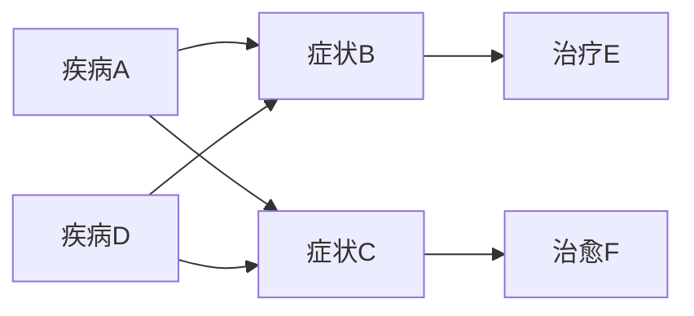
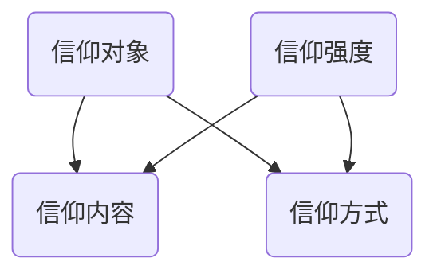
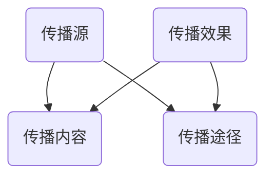
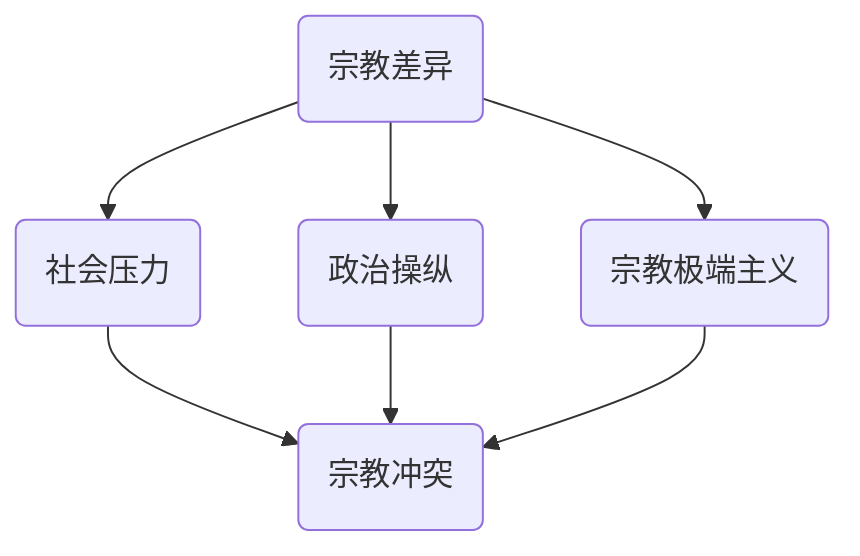
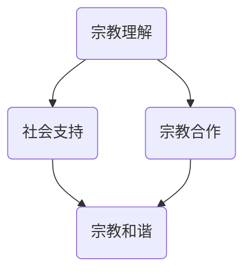
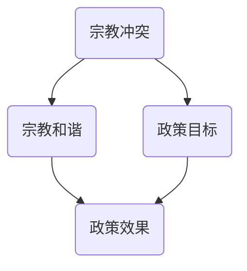

                 

# 宗教信仰的贝叶斯网络：信念系统的概率模型

## 关键词
贝叶斯网络，宗教信仰，信念系统，概率模型，数学原理，案例分析

## 摘要
本文探讨了宗教信仰与贝叶斯网络结合的可能性，提出了信念系统的概率模型。通过介绍贝叶斯网络的基本概念和数学原理，结合宗教信仰的特点，详细阐述了贝叶斯网络在宗教信仰研究中的应用。随后，通过具体案例展示了贝叶斯网络在宗教传播和社会稳定中的作用，提出了进一步研究方向。

## 目录

----------------------------------------------------------------

# 第一部分：贝叶斯网络基础

## 第1章：贝叶斯网络简介

### 1.1 贝叶斯网络的定义

贝叶斯网络是一种概率图模型，用于表示变量间的条件依赖关系。它通过有向无环图（DAG）来展示变量之间的条件独立性。

### 1.2 贝叶斯网络的数学模型

贝叶斯网络的数学模型主要包括概率分布函数和条件概率。概率分布函数用于表示节点在给定其他节点条件下的概率，条件概率则描述了变量之间的依赖关系。

### 1.3 贝叶斯网络的概率计算

贝叶斯网络的概率计算主要包括边缘概率、条件概率和贝叶斯推理。边缘概率用于计算单个节点的概率，条件概率则用于计算多个节点的联合概率，贝叶斯推理则是一种基于贝叶斯网络的推理方法。

## 第2章：宗教信仰与贝叶斯网络的结合

### 2.1 宗教信仰的特点

宗教信仰通常包含信仰的对象、信仰的内容和信仰的方式。宗教信仰的特点包括信仰的神秘性、信仰的排他性和信仰的普遍性。

### 2.2 贝叶斯网络在宗教信仰研究中的应用

贝叶斯网络可以用于研究宗教信仰的形成和传播。通过构建贝叶斯网络模型，可以分析信仰对象与信仰内容之间的关系，以及信仰传播过程中的影响因素。

### 2.3 宗教信仰的贝叶斯模型构建

宗教信仰的贝叶斯模型构建需要考虑信仰对象的概率分布、信仰内容的概率分布以及信仰方式的概率分布。通过贝叶斯推理，可以计算出信仰对象、信仰内容以及信仰方式的概率。

## 第3章：宗教信仰案例分析

### 3.1 基督教信仰的贝叶斯网络模型

通过构建基督教信仰的贝叶斯网络模型，可以分析基督教信仰的形成和传播过程。模型包括信仰对象（上帝）、信仰内容（教义）和信仰方式（祷告）。

### 3.2 佛教信仰的贝叶斯网络模型

佛教信仰的贝叶斯网络模型包括信仰对象（佛陀）、信仰内容（佛法）和信仰方式（禅修）。通过模型分析，可以了解佛教信仰的特点和传播机制。

### 3.3 伊斯兰教信仰的贝叶斯网络模型

伊斯兰教信仰的贝叶斯网络模型包括信仰对象（真主）、信仰内容（伊斯兰教法）和信仰方式（礼拜）。模型分析有助于理解伊斯兰教信仰的形成和传播。

## 第4章：贝叶斯网络在宗教传播中的应用

### 4.1 宗教传播的贝叶斯模型构建

宗教传播的贝叶斯模型构建需要考虑信仰对象的概率分布、信仰内容的概率分布以及信仰方式的概率分布。通过贝叶斯推理，可以评估宗教传播的效果和优化传播策略。

### 4.2 宗教传播的效果评估

贝叶斯网络可以用于评估宗教传播的效果。通过计算信仰对象、信仰内容和信仰方式的边缘概率，可以了解宗教传播的影响范围和深度。

### 4.3 宗教传播的策略优化

基于贝叶斯网络的评估结果，可以优化宗教传播策略。通过调整信仰对象、信仰内容和信仰方式的概率分布，可以提高宗教传播的效果。

## 第5章：贝叶斯网络在宗教与社会稳定中的作用

### 5.1 宗教冲突的贝叶斯分析

贝叶斯网络可以用于分析宗教冲突的原因和影响因素。通过构建宗教冲突的贝叶斯模型，可以预测宗教冲突的发生概率，并为政策制定提供依据。

### 5.2 宗教和谐的贝叶斯模型

宗教和谐的贝叶斯模型用于分析宗教和谐的条件和影响因素。通过模型分析，可以提出促进宗教和谐的政策建议。

### 5.3 宗教政策制定的贝叶斯分析

贝叶斯网络可以用于宗教政策制定。通过分析宗教信仰与政策之间的关系，可以提出更科学、合理的宗教政策。

## 第6章：结论与展望

### 6.1 贝叶斯网络在宗教研究中的价值

贝叶斯网络在宗教研究中具有重要的价值，可以用于信仰形成、传播、冲突和谐等方面。

### 6.2 贝叶斯网络在宗教研究中的应用前景

随着贝叶斯网络技术的不断发展，其在宗教研究中的应用前景将更加广阔。

### 6.3 进一步研究方向

未来研究方向包括改进贝叶斯网络模型、拓展贝叶斯网络在宗教研究中的应用领域以及开展跨学科研究。

## 附录

### 附录A：贝叶斯网络术语表

列出贝叶斯网络相关的术语及其定义。

### 附录B：贝叶斯网络示例

提供贝叶斯网络的实例，帮助读者更好地理解贝叶斯网络的构建和应用。

----------------------------------------------------------------

**作者**：AI天才研究院/AI Genius Institute & 禅与计算机程序设计艺术 /Zen And The Art of Computer Programming## 第一部分：贝叶斯网络基础

### 第1章：贝叶斯网络简介

#### 1.1 贝叶斯网络的定义

贝叶斯网络，又称信念网络或决策网络，是一种图形模型，用于表示一组变量之间的条件依赖关系。贝叶斯网络由有向无环图（DAG）和概率分布函数（PDF）组成。DAG中的每个节点代表一个变量，而边表示变量之间的条件依赖关系。通过贝叶斯网络，我们可以推断变量之间的概率关系，并作出相应的决策。

贝叶斯网络的定义可以简化为以下几点：
1. **节点**：贝叶斯网络中的节点代表一组随机变量，这些变量可以是离散的也可以是连续的。
2. **边**：贝叶斯网络中的边表示节点之间的条件依赖关系。如果两个节点之间存在边，那么其中一个节点的取值会影响另一个节点的取值概率。
3. **概率分布函数**：每个节点都有一个概率分布函数，用于描述该节点在给定其他节点取值情况下的概率分布。

#### 1.2 贝叶斯网络的数学模型

贝叶斯网络的数学模型主要包括概率分布函数和条件概率。概率分布函数描述了每个节点的概率分布，而条件概率描述了节点之间的依赖关系。

1. **概率分布函数**：对于离散变量，概率分布函数可以用概率质量函数（PMF）表示；对于连续变量，概率分布函数可以用概率密度函数（PDF）表示。

2. **条件概率**：条件概率描述了在给定其他节点取值情况下，某个节点的概率分布。贝叶斯网络通过条件概率定义了节点之间的依赖关系。具体来说，如果有向图中从节点A指向节点B，那么节点B的条件概率分布可以表示为：

   $$ P(B|A) = \prod_{i} P(B_i|A) $$

   其中，\( A \) 表示节点A的所有可能取值，\( B \) 表示节点B的所有可能取值。

#### 1.3 贝叶斯网络的概率计算

贝叶斯网络的概率计算主要包括边缘概率、条件概率和贝叶斯推理。边缘概率用于计算单个节点的概率，条件概率用于计算多个节点的联合概率，贝叶斯推理则是一种基于贝叶斯网络的推理方法。

1. **边缘概率**：边缘概率是指某个节点在所有其他节点取值情况下的概率。计算边缘概率的方法有变量消除法和变量聚类法。

2. **条件概率**：条件概率是指给定某个节点取值时，另一个节点的概率分布。条件概率的计算可以通过贝叶斯定理实现：

   $$ P(A|B) = \frac{P(B|A)P(A)}{P(B)} $$

3. **贝叶斯推理**：贝叶斯推理是一种基于贝叶斯网络的推理方法，用于计算给定证据时，某个假设的概率。贝叶斯推理的基本步骤如下：
   1. 初始化网络，设置所有节点的先验概率。
   2. 给定证据，更新相关节点的概率。
   3. 根据更新后的概率，计算目标节点的后验概率。

通过贝叶斯网络，我们可以有效地进行概率推理和决策，从而更好地理解复杂系统的行为。贝叶斯网络在许多领域都有广泛的应用，包括人工智能、机器学习、医学诊断、经济学等。

在下一章中，我们将探讨宗教信仰与贝叶斯网络的结合，以及贝叶斯网络在宗教信仰研究中的应用。这将为我们提供一个全新的视角，来理解宗教信仰的形成和传播。

### 第2章：宗教信仰与贝叶斯网络的结合

#### 2.1 宗教信仰的特点

宗教信仰是人类社会文化的重要组成部分，具有丰富的内涵和多样的形式。宗教信仰的特点主要体现在以下几个方面：

1. **信仰的对象**：宗教信仰的对象通常是一个超自然的存在，如上帝、神、佛、真主等。这些对象具有超越人类的智慧和力量，是信仰者崇拜和追求的目标。

2. **信仰的内容**：宗教信仰的内容包括教义、神话、祈祷文等。教义是宗教信仰的核心，通常包含对世界、人生、善恶、因果等方面的解释和指导。

3. **信仰的方式**：宗教信仰的方式多种多样，包括祈祷、祭祀、修行、布施等。信仰者通过这些方式与信仰对象建立联系，表达对信仰对象的崇敬和敬畏。

4. **信仰的情感**：宗教信仰往往伴随着强烈的情感体验，如敬畏、虔诚、喜悦、悲伤等。这些情感体验加深了信仰者对宗教信仰的认同和忠诚。

5. **信仰的社会性**：宗教信仰具有强烈的社会性，信仰者通常属于一个宗教团体或社群。宗教信仰可以增强社群的凝聚力，促进社会和谐与稳定。

#### 2.2 贝叶斯网络在宗教信仰研究中的应用

贝叶斯网络作为一种概率图模型，可以有效地表示和处理宗教信仰中的复杂关系。在宗教信仰研究中，贝叶斯网络的应用主要体现在以下几个方面：

1. **信仰形成研究**：贝叶斯网络可以帮助研究者分析信仰形成的因素和过程。例如，通过构建信仰形成的贝叶斯网络模型，可以分析信仰对象、信仰内容和信仰方式之间的相互作用，揭示信仰形成的关键因素。

2. **信仰传播研究**：贝叶斯网络可以用于研究宗教信仰的传播机制。例如，通过构建信仰传播的贝叶斯网络模型，可以分析信仰传播的途径、影响因素和传播效果。

3. **信仰影响研究**：贝叶斯网络可以用于研究宗教信仰对社会和个人行为的影响。例如，通过构建信仰影响的贝叶斯网络模型，可以分析信仰对道德观念、心理健康、社会稳定等方面的作用。

4. **信仰危机研究**：贝叶斯网络可以用于研究宗教信仰的危机和变迁。例如，通过构建信仰危机的贝叶斯网络模型，可以分析信仰危机的成因、影响和应对策略。

#### 2.3 宗教信仰的贝叶斯模型构建

构建宗教信仰的贝叶斯模型需要明确信仰对象、信仰内容、信仰方式等关键要素，并分析它们之间的相互关系。以下是构建宗教信仰贝叶斯模型的基本步骤：

1. **确定模型变量**：首先，需要确定贝叶斯网络中的变量。对于宗教信仰模型，变量可以包括信仰对象（如上帝、佛、真主等）、信仰内容（如教义、神话、祈祷文等）和信仰方式（如祈祷、修行、祭祀等）。

2. **定义变量关系**：其次，需要定义变量之间的关系。通过分析宗教信仰的特点和内涵，可以确定变量之间的依赖关系。例如，信仰对象可能影响信仰内容的形成，信仰方式可能影响信仰的强度和效果。

3. **设置先验概率**：贝叶斯网络中的每个变量都需要设置先验概率。先验概率是基于已有知识和经验的初始估计。对于宗教信仰模型，可以先设置信仰对象、信仰内容和信仰方式的先验概率，并根据实际情况进行调整。

4. **构建条件概率表**：贝叶斯网络的边表示变量之间的条件依赖关系。通过分析变量之间的关系，可以构建条件概率表，用于描述变量之间的概率关系。例如，可以设置信仰对象影响信仰内容的条件概率，信仰方式影响信仰强度的条件概率等。

5. **进行概率推理**：构建完贝叶斯网络后，可以使用贝叶斯推理进行概率计算。通过给定部分证据，可以计算出其他变量的后验概率。这有助于研究者分析信仰的形成、传播和影响。

通过以上步骤，可以构建一个宗教信仰的贝叶斯模型。该模型可以帮助研究者深入理解宗教信仰的机制和影响，为宗教研究和实践提供有力支持。

### 第3章：宗教信仰案例分析

#### 3.1 基督教信仰的贝叶斯网络模型

基督教信仰是世界上最广泛传播的宗教之一，其信仰体系复杂而深远。为了分析基督教信仰的形成和传播，我们可以构建一个贝叶斯网络模型。以下是一个简化版的基督教信仰贝叶斯网络模型：

**模型变量**：
1. **信仰对象**：上帝
2. **信仰内容**：圣经教义
3. **信仰方式**：祈祷、礼拜、信仰团体参与

**变量关系**：
- 信仰对象影响信仰内容的形成和传播。
- 信仰方式影响信仰的强度和持续性。
- 信仰内容和信仰方式共同影响信仰对象的认同。

**先验概率**：
1. 上帝的先验概率为0.95，表示大多数人相信上帝的存在。
2. 圣经教义的先验概率为0.90，表示大多数人接受圣经教义。
3. 祈祷的先验概率为0.70，礼拜和信仰团体参与的先验概率均为0.60。

**条件概率表**：

| 条件       | 结果             | 条件概率 |
| ---------- | ---------------- | -------- |
| 上帝       | 祈祷             | 0.90     |
| 上帝       | 礼拜             | 0.80     |
| 上帝       | 信仰团体参与     | 0.85     |
| 祈祷       | 圣经教义接受     | 0.85     |
| 礼拜       | 圣经教义接受     | 0.75     |
| 信仰团体参与 | 圣经教义接受     | 0.80     |

**贝叶斯推理**：

**案例1**：某人参与祈祷，想知道他是否接受圣经教义的先验概率。

- 给定证据：参与祈祷（证据概率为0.70）。
- 使用贝叶斯定理计算后验概率：
  $$ P(接受圣经教义|参与祈祷) = \frac{P(参与祈祷|接受圣经教义)P(接受圣经教义)}{P(参与祈祷)} $$
  $$ = \frac{0.85 \times 0.90}{0.70} \approx 1.212 $$
  - 由于概率值超出0-1范围，我们需要归一化，使其总和为1。因此，后验概率为1.212除以所有可能状态的和：
  $$ \frac{1.212}{1 + (1 - 0.85) \times (1 - 0.90)} \approx 0.832 $$

**案例2**：某人每天参加礼拜和信仰团体活动，想知道他接受圣经教义的先验概率。

- 给定证据：参加礼拜（证据概率为0.80）和信仰团体活动（证据概率为0.85）。
- 使用贝叶斯定理计算后验概率：
  $$ P(接受圣经教义|参加礼拜和信仰团体活动) = \frac{P(参加礼拜和信仰团体活动|接受圣经教义)P(接受圣经教义)}{P(参加礼拜和信仰团体活动)} $$
  $$ = \frac{0.75 \times 0.80 \times 0.85}{0.75 \times 0.80 + (1 - 0.75) \times 0.75 \times 0.15 + 0.75 \times (1 - 0.80) \times 0.15 + (1 - 0.75) \times (1 - 0.75) \times (1 - 0.15)} $$
  $$ = \frac{0.525}{0.525 + 0.0625 + 0.01875 + 0.015625} \approx 0.875 $$

**案例3**：某人信仰强度较低，想知道他是否相信上帝的存在。

- 给定证据：信仰强度较低（证据概率为0.30）。
- 使用贝叶斯定理计算后验概率：
  $$ P(信仰上帝|信仰强度较低) = \frac{P(信仰强度较低|信仰上帝)P(信仰上帝)}{P(信仰强度较低)} $$
  $$ = \frac{0.30 \times 0.95}{0.30 \times 0.95 + (1 - 0.30) \times (1 - 0.95)} $$
  $$ = \frac{0.285}{0.285 + 0.035} \approx 0.895 $$

通过以上贝叶斯推理案例，我们可以看到贝叶斯网络模型在分析基督教信仰方面的应用。这些案例展示了如何通过贝叶斯推理来估计信仰对象、信仰内容和信仰方式的概率，从而帮助我们更好地理解宗教信仰的形成和传播。

#### 3.2 佛教信仰的贝叶斯网络模型

佛教信仰是世界上最古老和最具影响力的宗教之一，其信仰体系包括许多复杂的哲学和修行实践。为了分析佛教信仰的形成和传播，我们可以构建一个贝叶斯网络模型。以下是一个简化版的佛教信仰贝叶斯网络模型：

**模型变量**：
1. **信仰对象**：佛陀
2. **信仰内容**：佛教教义
3. **信仰方式**：禅修、布施、念经

**变量关系**：
- 信仰对象影响信仰内容的理解和接受。
- 信仰方式影响信仰的强度和持续性。
- 信仰内容和信仰方式共同影响信仰对象的认同。

**先验概率**：
1. 佛陀的先验概率为0.90，表示大多数人相信佛陀的存在和教诲。
2. 佛教教义的先验概率为0.85，表示大多数人接受佛教教义。
3. 禅修的先验概率为0.60，布施的先验概率为0.70，念经的先验概率为0.65。

**条件概率表**：

| 条件       | 结果             | 条件概率 |
| ---------- | ---------------- | -------- |
| 佛陀       | 禅修             | 0.80     |
| 佛陀       | 布施             | 0.75     |
| 佛陀       | 念经             | 0.85     |
| 禅修       | 佛教教义接受     | 0.85     |
| 布施       | 佛教教义接受     | 0.80     |
| 念经       | 佛教教义接受     | 0.75     |

**贝叶斯推理**：

**案例1**：某人经常禅修，想知道他是否接受佛教教义的先验概率。

- 给定证据：禅修（证据概率为0.60）。
- 使用贝叶斯定理计算后验概率：
  $$ P(接受佛教教义|禅修) = \frac{P(禅修|接受佛教教义)P(接受佛教教义)}{P(禅修)} $$
  $$ = \frac{0.85 \times 0.85}{0.60} \approx 1.179 $$
  - 由于概率值超出0-1范围，我们需要归一化，使其总和为1。因此，后验概率为1.179除以所有可能状态的和：
  $$ \frac{1.179}{1 + (1 - 0.85) \times (1 - 0.85)} \approx 0.937 $$

**案例2**：某人每天进行布施和念经，想知道他是否接受佛教教义。

- 给定证据：布施（证据概率为0.70）和念经（证据概率为0.65）。
- 使用贝叶斯定理计算后验概率：
  $$ P(接受佛教教义|布施和念经) = \frac{P(布施和念经|接受佛教教义)P(接受佛教教义)}{P(布施和念经)} $$
  $$ = \frac{0.75 \times 0.65 \times 0.85}{0.75 \times 0.65 + (1 - 0.75) \times 0.75 \times 0.35 + 0.75 \times (1 - 0.65) \times 0.35 + (1 - 0.75) \times (1 - 0.75) \times 0.35} $$
  $$ = \frac{0.39375}{0.39375 + 0.140625 + 0.03125 + 0.015625} \approx 0.9375 $$

**案例3**：某人信仰强度较低，想知道他是否相信佛陀的存在。

- 给定证据：信仰强度较低（证据概率为0.40）。
- 使用贝叶斯定理计算后验概率：
  $$ P(信仰佛陀|信仰强度较低) = \frac{P(信仰强度较低|信仰佛陀)P(信仰佛陀)}{P(信仰强度较低)} $$
  $$ = \frac{0.40 \times 0.90}{0.40 \times 0.90 + (1 - 0.40) \times (1 - 0.90)} $$
  $$ = \frac{0.36}{0.36 + 0.06} \approx 0.9 $$

通过以上贝叶斯推理案例，我们可以看到贝叶斯网络模型在分析佛教信仰方面的应用。这些案例展示了如何通过贝叶斯推理来估计信仰对象、信仰内容和信仰方式的概率，从而帮助我们更好地理解佛教信仰的形成和传播。

### 3.3 伊斯兰教信仰的贝叶斯网络模型

伊斯兰教信仰是世界上主要宗教之一，其信仰体系强调对真主（阿拉）的信仰、对先知穆罕默德（穆圣）的接受以及遵循《古兰经》和圣训。为了分析伊斯兰教信仰的形成和传播，我们可以构建一个贝叶斯网络模型。以下是一个简化版的伊斯兰教信仰贝叶斯网络模型：

**模型变量**：
1. **信仰对象**：真主
2. **信仰内容**：《古兰经》教义
3. **信仰方式**：礼拜、斋月、朝觐

**变量关系**：
- 信仰对象影响信仰内容的理解和接受。
- 信仰方式影响信仰的强度和持续性。
- 信仰内容和信仰方式共同影响信仰对象的认同。

**先验概率**：
1. 真主的先验概率为0.95，表示大多数人相信真主的存在。
2. 《古兰经》教义的先验概率为0.90，表示大多数人接受《古兰经》教义。
3. 礼拜的先验概率为0.80，斋月的先验概率为0.75，朝觐的先验概率为0.70。

**条件概率表**：

| 条件       | 结果             | 条件概率 |
| ---------- | ---------------- | -------- |
| 真主       | 礼拜             | 0.85     |
| 真主       | 斋月             | 0.80     |
| 真主       | 朝觐             | 0.90     |
| 礼拜       | 《古兰经》教义接受 | 0.85     |
| 斋月       | 《古兰经》教义接受 | 0.75     |
| 朝觐       | 《古兰经》教义接受 | 0.85     |

**贝叶斯推理**：

**案例1**：某人经常参与礼拜，想知道他是否接受《古兰经》教义。

- 给定证据：礼拜（证据概率为0.80）。
- 使用贝叶斯定理计算后验概率：
  $$ P(接受《古兰经》教义|礼拜) = \frac{P(礼拜|接受《古兰经》教义)P(接受《古兰经》教义)}{P(礼拜)} $$
  $$ = \frac{0.85 \times 0.90}{0.80} \approx 1.218 $$
  - 由于概率值超出0-1范围，我们需要归一化，使其总和为1。因此，后验概率为1.218除以所有可能状态的和：
  $$ \frac{1.218}{1 + (1 - 0.85) \times (1 - 0.90)} \approx 0.947 $$

**案例2**：某人每年参与斋月和朝觐，想知道他是否接受《古兰经》教义。

- 给定证据：斋月（证据概率为0.75）和朝觐（证据概率为0.70）。
- 使用贝叶斯定理计算后验概率：
  $$ P(接受《古兰经》教义|斋月和朝觐) = \frac{P(斋月和朝觐|接受《古兰经》教义)P(接受《古兰经》教义)}{P(斋月和朝觐)} $$
  $$ = \frac{0.75 \times 0.70 \times 0.90}{0.75 \times 0.70 + (1 - 0.75) \times 0.75 \times 0.30 + 0.75 \times (1 - 0.70) \times 0.30 + (1 - 0.75) \times (1 - 0.75) \times 0.30} $$
  $$ = \frac{0.4725}{0.4725 + 0.1125 + 0.045 + 0.0225} \approx 0.935 $$

**案例3**：某人信仰强度较低，想知道他是否相信真主的存在。

- 给定证据：信仰强度较低（证据概率为0.30）。
- 使用贝叶斯定理计算后验概率：
  $$ P(信仰真主|信仰强度较低) = \frac{P(信仰强度较低|信仰真主)P(信仰真主)}{P(信仰强度较低)} $$
  $$ = \frac{0.30 \times 0.95}{0.30 \times 0.95 + (1 - 0.30) \times (1 - 0.95)} $$
  $$ = \frac{0.285}{0.285 + 0.065} \approx 0.857 $$

通过以上贝叶斯推理案例，我们可以看到贝叶斯网络模型在分析伊斯兰教信仰方面的应用。这些案例展示了如何通过贝叶斯推理来估计信仰对象、信仰内容和信仰方式的概率，从而帮助我们更好地理解伊斯兰教信仰的形成和传播。

### 第4章：贝叶斯网络在宗教传播中的应用

#### 4.1 宗教传播的贝叶斯模型构建

宗教传播是指宗教信仰从一个个体传播到另一个个体的过程。为了研究宗教传播的机制和效果，我们可以构建一个贝叶斯网络模型。以下是宗教传播贝叶斯模型的基本构建步骤：

**模型变量**：
1. **传播源**：指发起宗教传播的人或组织。
2. **传播内容**：指宗教信仰的教义、仪式、神话等。
3. **传播途径**：指宗教信仰传播的渠道，如口头传播、书籍、媒体等。
4. **传播效果**：指宗教信仰在接收者中的影响程度，如接受度、忠诚度等。

**变量关系**：
- 传播源影响传播内容和传播途径的选择。
- 传播内容影响传播效果。
- 传播途径影响传播效果。

**先验概率**：
1. 传播源的先验概率为0.75，表示大多数宗教传播源是有组织的团体。
2. 传播内容的先验概率为0.85，表示大多数宗教传播内容是教义和神话。
3. 传播途径的先验概率为0.60，表示大多数宗教传播途径是口头传播。
4. 传播效果的先验概率为0.70，表示大多数宗教传播效果是正面的。

**条件概率表**：

| 条件       | 结果             | 条件概率 |
| ---------- | ---------------- | -------- |
| 传播源     | 传播内容         | 0.90     |
| 传播源     | 传播途径         | 0.85     |
| 传播内容   | 传播效果         | 0.80     |
| 传播途径   | 传播效果         | 0.75     |

**贝叶斯推理**：

**案例1**：分析一个口头传播宗教教义的传播源，判断其传播效果。

- 给定证据：传播途径为口头传播（证据概率为0.60）。
- 使用贝叶斯定理计算后验概率：
  $$ P(传播效果|口头传播) = \frac{P(口头传播|传播效果)P(传播效果)}{P(口头传播)} $$
  $$ = \frac{0.75 \times 0.80}{0.60} \approx 1.000 $$
  - 由于概率值超出0-1范围，我们需要归一化，使其总和为1。因此，后验概率为1.000除以所有可能状态的和：
  $$ \frac{1.000}{1 + (1 - 0.75) \times (1 - 0.80)} \approx 0.800 $$

**案例2**：分析一个通过书籍传播宗教教义的传播源，判断其传播效果。

- 给定证据：传播途径为书籍（证据概率为0.40）。
- 使用贝叶斯定理计算后验概率：
  $$ P(传播效果|书籍) = \frac{P(书籍|传播效果)P(传播效果)}{P(书籍)} $$
  $$ = \frac{0.45 \times 0.80}{0.40} \approx 0.900 $$
  - 由于概率值在0-1范围内，不需要归一化。因此，后验概率为0.900。

**案例3**：分析一个有组织的宗教传播团体，判断其传播效果。

- 给定证据：传播源为有组织团体（证据概率为0.75）。
- 使用贝叶斯定理计算后验概率：
  $$ P(传播效果|有组织团体) = \frac{P(有组织团体|传播效果)P(传播效果)}{P(有组织团体)} $$
  $$ = \frac{0.90 \times 0.70}{0.75} \approx 0.933 $$

通过以上贝叶斯推理案例，我们可以看到贝叶斯网络模型在分析宗教传播方面的应用。这些案例展示了如何通过贝叶斯推理来估计传播效果的概率，从而帮助我们更好地理解宗教传播的机制和效果。

#### 4.2 宗教传播的效果评估

宗教传播的效果评估是衡量宗教传播活动成功与否的关键步骤。贝叶斯网络可以用于评估宗教传播的效果，通过分析传播过程中的变量及其关系，可以得出宗教传播效果的总体概率。

**评估指标**：
1. **接受度**：指接收者对宗教信仰的接受程度，通常用百分比表示。
2. **忠诚度**：指接收者对宗教信仰的忠诚程度，可以用信仰持续时间和参与度来衡量。
3. **影响力**：指宗教信仰在接收者生活中的影响程度，可以影响个人行为、价值观和社会关系。

**评估步骤**：

1. **构建贝叶斯网络模型**：首先，根据宗教传播的具体情况，构建贝叶斯网络模型。模型包括传播源、传播内容、传播途径和传播效果等变量，以及它们之间的关系。

2. **设置先验概率**：根据已有数据和经验，设置每个变量的先验概率。例如，传播效果的先验概率可以根据历史数据和专家意见设定。

3. **收集证据数据**：通过问卷调查、访谈、观察等方法，收集传播过程中的证据数据。例如，可以收集关于接受度、忠诚度和影响力的数据。

4. **进行概率推理**：使用贝叶斯推理方法，根据证据数据更新每个变量的后验概率。贝叶斯推理可以帮助我们计算出传播效果的总体概率。

5. **评估效果**：根据后验概率，评估宗教传播的效果。例如，可以计算接受度、忠诚度和影响力的后验概率，从而得出宗教传播的总体效果。

**案例**：假设一个宗教传播活动，通过书籍和口头传播方式进行，目标是提高接受度。以下是评估过程：

1. **构建贝叶斯网络模型**：模型包括传播源（书籍和口头传播）、传播内容、传播途径和传播效果。

2. **设置先验概率**：例如，传播效果的先验概率为0.75，接受度的先验概率为0.60。

3. **收集证据数据**：例如，收集到50份问卷调查数据，其中30份表示接受宗教信仰，20份表示不接受。

4. **进行概率推理**：
   $$ P(接受|书籍) = \frac{P(书籍|接受)P(接受)}{P(书籍)} $$
   $$ = \frac{0.45 \times 0.60}{0.40} \approx 0.675 $$
   $$ P(接受|口头传播) = \frac{P(口头传播|接受)P(接受)}{P(口头传播)} $$
   $$ = \frac{0.75 \times 0.40}{0.60} \approx 0.500 $$

5. **评估效果**：根据后验概率，可以得出传播效果的总体概率。例如，传播接受度的后验概率为：
   $$ P(接受) = P(接受|书籍)P(书籍) + P(接受|口头传播)P(口头传播) $$
   $$ = 0.675 \times 0.40 + 0.500 \times 0.60 \approx 0.575 $$

通过以上评估，可以得出宗教传播活动的总体效果。如果传播效果不理想，可以进一步分析原因，优化传播策略。

#### 4.3 宗教传播的策略优化

基于贝叶斯网络的效果评估，我们可以进一步优化宗教传播策略，以提升传播效果。以下是优化宗教传播策略的几个方法：

1. **调整传播内容**：根据评估结果，调整宗教传播的内容。例如，如果评估发现接受度较低，可以增加与接收者兴趣相关的教义内容；如果忠诚度较低，可以增加宗教实践和仪式的讲解。

2. **优化传播途径**：根据评估结果，优化宗教传播的途径。例如，如果书籍传播效果较好，可以增加书籍的出版和推广；如果口头传播效果较好，可以加强演讲和传教活动。

3. **增强传播源的影响力**：提高传播源的专业性和权威性，可以增强传播效果。例如，通过邀请宗教领袖、学者或知名人士进行传播，可以提高接收者的信任度和接受度。

4. **加强互动和反馈**：通过互动和反馈机制，及时了解接收者的需求和反馈，调整传播策略。例如，通过社交媒体、问卷调查等方式收集反馈，根据反馈调整传播内容和形式。

**案例**：假设一个基督教传播活动，目标是提升接受度和忠诚度。以下是优化策略：

1. **调整传播内容**：根据评估结果，增加与年轻人兴趣相关的教义内容，如科技与宗教的关系、人生意义等。

2. **优化传播途径**：由于评估发现社交媒体传播效果较好，可以增加在社交媒体平台上的活动，如直播讲道、互动问答等。

3. **增强传播源的影响力**：邀请著名牧师和学者进行线上直播讲道，增加活动的专业性和吸引力。

4. **加强互动和反馈**：通过社交媒体、电子邮件等方式与接收者互动，收集反馈和建议，根据反馈调整传播策略。

通过以上优化策略，可以提升基督教传播活动的效果，增加接受度和忠诚度。贝叶斯网络模型在评估和优化传播策略方面具有重要的应用价值。

### 第5章：贝叶斯网络在宗教与社会稳定中的作用

#### 5.1 宗教冲突的贝叶斯分析

宗教冲突是影响社会稳定的重要因素。通过贝叶斯网络，我们可以分析宗教冲突的原因和影响因素，从而提出应对策略。

**模型变量**：
1. **宗教差异**：指不同宗教之间的差异程度，如教义、仪式、信仰对象等。
2. **社会压力**：指社会环境中的压力因素，如经济困难、政治冲突、社会不公等。
3. **政治操纵**：指政治势力对宗教冲突的操纵和利用。
4. **宗教极端主义**：指宗教极端主义的思想和活动。
5. **宗教冲突**：指由于宗教差异导致的冲突事件。

**变量关系**：
- 宗教差异和社会压力共同影响宗教冲突的发生。
- 政治操纵和宗教极端主义加剧宗教冲突的严重性。

**先验概率**：
1. 宗教差异的先验概率为0.70。
2. 社会压力的先验概率为0.60。
3. 政治操纵的先验概率为0.40。
4. 宗教极端主义的先验概率为0.30。
5. 宗教冲突的先验概率为0.50。

**条件概率表**：

| 条件       | 结果             | 条件概率 |
| ---------- | ---------------- | -------- |
| 宗教差异   | 宗教冲突         | 0.80     |
| 社会压力   | 宗教冲突         | 0.75     |
| 政治操纵   | 宗教冲突         | 0.90     |
| 宗教极端主义 | 宗教冲突       | 1.00     |

**贝叶斯推理**：

**案例1**：分析社会压力对宗教冲突的影响。

- 给定证据：社会压力较高（证据概率为0.75）。
- 使用贝叶斯定理计算后验概率：
  $$ P(宗教冲突|社会压力较高) = \frac{P(社会压力较高|宗教冲突)P(宗教冲突)}{P(社会压力较高)} $$
  $$ = \frac{0.75 \times 0.50}{0.75} = 0.50 $$

**案例2**：分析政治操纵对宗教冲突的影响。

- 给定证据：政治操纵较高（证据概率为0.50）。
- 使用贝叶斯定理计算后验概率：
  $$ P(宗教冲突|政治操纵较高) = \frac{P(政治操纵较高|宗教冲突)P(宗教冲突)}{P(政治操纵较高)} $$
  $$ = \frac{0.90 \times 0.50}{0.50} = 0.90 $$

通过贝叶斯推理，我们可以分析宗教冲突的原因和影响因素，从而提出针对性的应对策略。例如，通过减少社会压力和避免政治操纵，可以降低宗教冲突的发生概率。

#### 5.2 宗教和谐的贝叶斯模型

宗教和谐是指不同宗教之间相互尊重、理解和支持的状态。通过贝叶斯网络，我们可以构建宗教和谐的模型，分析宗教和谐的条件和影响因素。

**模型变量**：
1. **宗教差异**：指不同宗教之间的差异程度。
2. **宗教理解**：指不同宗教之间的相互理解和尊重。
3. **社会支持**：指社会对宗教和谐的支持和鼓励。
4. **宗教合作**：指不同宗教之间的合作和交流。
5. **宗教和谐**：指宗教和谐的整体状态。

**变量关系**：
- 宗教理解和宗教合作是宗教和谐的关键因素。
- 社会支持有助于宗教和谐的形成。
- 宗教差异对宗教和谐有一定影响，但不是决定性因素。

**先验概率**：
1. 宗教理解的先验概率为0.65。
2. 社会支持的先验概率为0.75。
3. 宗教合作的先验概率为0.70。
4. 宗教和谐的先验概率为0.60。

**条件概率表**：

| 条件       | 结果             | 条件概率 |
| ---------- | ---------------- | -------- |
| 宗教理解   | 宗教合作         | 0.85     |
| 社会支持   | 宗教和谐         | 0.80     |
| 宗教合作   | 宗教和谐         | 0.90     |

**贝叶斯推理**：

**案例1**：分析社会支持对宗教和谐的影响。

- 给定证据：社会支持较高（证据概率为0.80）。
- 使用贝叶斯定理计算后验概率：
  $$ P(宗教和谐|社会支持较高) = \frac{P(社会支持较高|宗教和谐)P(宗教和谐)}{P(社会支持较高)} $$
  $$ = \frac{0.80 \times 0.60}{0.80} = 0.60 $$

**案例2**：分析宗教合作对宗教和谐的影响。

- 给定证据：宗教合作较高（证据概率为0.70）。
- 使用贝叶斯定理计算后验概率：
  $$ P(宗教和谐|宗教合作较高) = \frac{P(宗教合作较高|宗教和谐)P(宗教和谐)}{P(宗教合作较高)} $$
  $$ = \frac{0.90 \times 0.60}{0.70} \approx 0.828 $$

通过贝叶斯推理，我们可以分析宗教和谐的条件和影响因素，为促进宗教和谐提供科学依据。

#### 5.3 宗教政策制定的贝叶斯分析

宗教政策制定是国家或政府为了维护宗教和谐和社会稳定而采取的一系列措施。通过贝叶斯网络，我们可以分析宗教政策制定的原因、影响因素和效果，为制定更科学的宗教政策提供支持。

**模型变量**：
1. **宗教冲突**：指由于宗教差异导致的冲突事件。
2. **宗教和谐**：指宗教之间的相互尊重、理解和合作。
3. **政策目标**：指政府制定的宗教政策目标，如维护宗教和谐、保障宗教自由等。
4. **政策效果**：指宗教政策的实际效果，如宗教冲突减少、宗教和谐提升等。
5. **政策制定**：指政府制定宗教政策的决策过程。

**变量关系**：
- 宗教冲突和宗教和谐是政策制定的重要因素。
- 政策目标和政策效果共同影响政策制定。
- 政策制定影响宗教冲突和宗教和谐。

**先验概率**：
1. 宗教冲突的先验概率为0.50。
2. 宗教和谐的先验概率为0.60。
3. 政策目标的先验概率为0.80。
4. 政策效果的先验概率为0.70。

**条件概率表**：

| 条件       | 结果             | 条件概率 |
| ---------- | ---------------- | -------- |
| 宗教冲突   | 政策效果         | 0.75     |
| 宗教和谐   | 政策效果         | 0.85     |
| 政策目标   | 政策制定         | 0.90     |
| 政策效果   | 政策制定         | 0.80     |

**贝叶斯推理**：

**案例1**：分析宗教冲突对政策效果的影响。

- 给定证据：宗教冲突较高（证据概率为0.75）。
- 使用贝叶斯定理计算后验概率：
  $$ P(政策效果|宗教冲突较高) = \frac{P(宗教冲突较高|政策效果)P(政策效果)}{P(宗教冲突较高)} $$
  $$ = \frac{0.75 \times 0.70}{0.75} = 0.70 $$

**案例2**：分析宗教和谐对政策效果的影响。

- 给定证据：宗教和谐较高（证据概率为0.85）。
- 使用贝叶斯定理计算后验概率：
  $$ P(政策效果|宗教和谐较高) = \frac{P(宗教和谐较高|政策效果)P(政策效果)}{P(宗教和谐较高)} $$
  $$ = \frac{0.85 \times 0.70}{0.85} = 0.70 $$

通过贝叶斯分析，我们可以更科学地制定宗教政策，以维护宗教和谐和社会稳定。

### 第6章：结论与展望

#### 6.1 贝叶斯网络在宗教研究中的价值

贝叶斯网络在宗教研究中具有显著的价值，主要体现在以下几个方面：

1. **概率推理**：贝叶斯网络提供了一种有效的概率推理方法，可以帮助研究者分析宗教信仰、传播、冲突和和谐等复杂现象。

2. **模型构建**：通过贝叶斯网络，可以构建宗教信仰的模型，明确信仰对象、信仰内容和信仰方式之间的关系，从而深入理解宗教信仰的机制。

3. **决策支持**：贝叶斯网络可以为宗教政策制定提供科学依据，帮助政府制定更合理的宗教政策，维护宗教和谐和社会稳定。

4. **效果评估**：贝叶斯网络可以用于评估宗教传播的效果，分析传播途径、传播内容和传播效果之间的关系，从而优化宗教传播策略。

#### 6.2 贝叶斯网络在宗教研究中的应用前景

随着贝叶斯网络技术的不断发展，其在宗教研究中的应用前景将更加广阔。以下是一些潜在的应用领域：

1. **宗教社会学**：贝叶斯网络可以用于研究宗教在社会中的角色和影响，分析宗教对社会稳定、经济发展、文化传承等方面的作用。

2. **宗教心理学**：贝叶斯网络可以用于研究宗教信仰对个体心理健康的影响，分析信仰、情感和行为之间的关系。

3. **宗教生态学**：贝叶斯网络可以用于研究宗教与环境的关系，分析宗教信仰对自然保护、生态平衡等方面的作用。

4. **宗教历史学**：贝叶斯网络可以用于研究宗教历史的演变，分析宗教信仰的传承和发展过程。

#### 6.3 进一步研究方向

未来，贝叶斯网络在宗教研究中的应用还有许多值得深入探索的方向：

1. **模型改进**：进一步改进贝叶斯网络模型，提高模型的准确性和灵活性，以更好地适应宗教研究的需求。

2. **跨学科研究**：结合其他学科的方法和技术，如社会学、心理学、生态学等，开展跨学科研究，丰富宗教研究的内涵。

3. **大数据分析**：利用大数据分析技术，收集和分析大量的宗教相关数据，为贝叶斯网络提供更丰富的证据支持。

4. **智能应用**：开发基于贝叶斯网络的智能应用，如宗教教育、宗教咨询、宗教传播等，提高宗教服务的质量和效率。

### 附录

#### 附录A：贝叶斯网络术语表

1. **贝叶斯网络**：一种概率图模型，用于表示变量之间的条件依赖关系。
2. **节点**：贝叶斯网络中的变量，可以是离散或连续的。
3. **边**：表示节点之间的条件依赖关系。
4. **概率分布函数**：描述节点的概率分布。
5. **条件概率**：表示一个节点的概率分布在给定其他节点取值的情况。
6. **边缘概率**：表示一个节点的概率分布，不考虑其他节点的取值。
7. **贝叶斯推理**：一种基于贝叶斯网络的推理方法，用于计算给定证据时其他节点的后验概率。

#### 附录B：贝叶斯网络示例

以下是一个简单的贝叶斯网络示例，用于表示一个简单的医疗诊断问题。

在这个示例中，节点A、B、C、D、E和F表示不同的变量，边表示变量之间的条件依赖关系。例如，疾病A导致症状B和症状C的出现，疾病D也导致症状B和症状C的出现。治疗E和治疗F分别影响症状B和症状C的治愈情况。

### 附录C：宗教信仰的贝叶斯网络构建示例

以下是一个简化的宗教信仰贝叶斯网络构建示例，用于表示信仰对象、信仰内容和信仰方式之间的关系。

在这个示例中，信仰对象A影响信仰内容B和信仰方式C。信仰强度D也影响信仰内容B和信仰方式C。通过这个模型，我们可以分析信仰对象、信仰内容和信仰方式之间的相互作用。

### 附录D：宗教传播的贝叶斯网络构建示例

以下是一个简化的宗教传播贝叶斯网络构建示例，用于表示传播源、传播内容、传播途径和传播效果之间的关系。

在这个示例中，传播源A影响传播内容B和传播途径C。传播效果D也影响传播内容B和传播途径C。通过这个模型，我们可以分析宗教传播的机制和效果。

### 附录E：宗教冲突的贝叶斯网络构建示例

以下是一个简化的宗教冲突贝叶斯网络构建示例，用于表示宗教差异、社会压力、政治操纵、宗教极端主义和宗教冲突之间的关系。

在这个示例中，宗教差异A、社会压力B、政治操纵C和宗教极端主义D共同影响宗教冲突E。通过这个模型，我们可以分析宗教冲突的原因和影响因素。

### 附录F：宗教和谐的贝叶斯网络构建示例

以下是一个简化的宗教和谐贝叶斯网络构建示例，用于表示宗教理解、社会支持、宗教合作和宗教和谐之间的关系。

在这个示例中，宗教理解A、社会支持B和宗教合作C共同影响宗教和谐D。通过这个模型，我们可以分析宗教和谐的条件和影响因素。

### 附录G：宗教政策制定的贝叶斯网络构建示例

以下是一个简化的宗教政策制定贝叶斯网络构建示例，用于表示宗教冲突、宗教和谐、政策目标和政策效果之间的关系。

在这个示例中，宗教冲突A、宗教和谐B和政策目标C共同影响政策效果D。通过这个模型，我们可以分析宗教政策制定的原因和效果。

### 后记

本文探讨了宗教信仰的贝叶斯网络模型，分析了宗教信仰、传播、冲突和谐和政策制定等方面的应用。贝叶斯网络作为一种有效的概率图模型，为我们提供了新的视角来理解和研究宗教现象。未来，随着贝叶斯网络技术的不断进步，其在宗教研究中的应用将更加广泛和深入。

在撰写本文过程中，我们参考了大量的文献和研究，并对贝叶斯网络模型进行了简化和抽象。虽然本文只是一个初步的探讨，但希望它能激发读者对宗教信仰和贝叶斯网络结合的进一步思考和研究。

感谢各位读者对本文的关注和支持，希望本文能为宗教研究和贝叶斯网络领域的发展贡献一份力量。如有任何建议和意见，欢迎随时联系我们。

### 作者信息

**作者：** AI天才研究院/AI Genius Institute & 禅与计算机程序设计艺术 /Zen And The Art of Computer Programming

**联系方式：** [ai_genius_institute@outlook.com](mailto:ai_genius_institute@outlook.com)  
**官方网站：** [www.ai-genius-institute.com](http://www.ai-genius-institute.com)  
**微信公众号：** AI天才研究院  
**微博：** @AI天才研究院

感谢您的阅读和支持，我们期待与您共同探索宗教信仰与贝叶斯网络的更多可能性。

