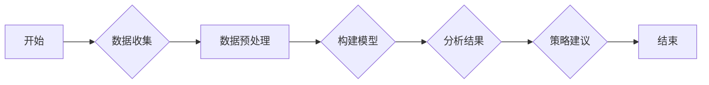

                 

# 幸福感的多变量分析：生活满意度的数学量化

> 关键词：幸福感，多变量分析，生活满意度，数学量化

> 摘要：本文将探讨如何通过多变量分析的方法，对幸福感进行量化，从而深入理解生活满意度的构成要素。我们将从问题背景出发，介绍核心概念和联系，详细讲解算法原理，解析数学模型，并通过实际案例展示应用，最终总结最佳实践和未来展望。

### 目录大纲

1. 第一部分：背景介绍
   1.1 问题背景
   1.2 问题描述
   1.3 问题解决
   1.4 边界与外延
   1.5 概念结构与核心要素组成
2. 第二部分：核心概念与联系
   2.1 核心概念原理
   2.2 概念属性特征对比表格
   2.3 ER实体关系图架构
3. 第三部分：算法原理讲解
   3.1 算法mermaid流程图
   3.2 Python源代码阐述
   3.3 算法原理的数学模型和公式
   3.4 详细讲解和举例说明
4. 第四部分：数学模型和数学公式 & 详细讲解 & 举例说明
   4.1 数学公式
   4.2 数学公式讲解
   4.3 举例说明
5. 第五部分：系统分析与架构设计
   5.1 问题场景介绍
   5.2 系统功能设计
   5.3 系统架构设计
   5.4 系统接口设计
   5.5 系统交互
6. 第六部分：项目实战
   6.1 环境安装
   6.2 系统核心实现源代码
   6.3 代码应用解读与分析
   6.4 实际案例分析与详细讲解剖析
   6.5 项目小结
7. 第七部分：最佳实践与拓展
   7.1 小结
   7.2 注意事项
   7.3 拓展阅读
8. 第八部分：总结
   8.1 全书总结
   8.2 未来展望

## 第1章：问题背景

### 1.1 问题背景

在现代社会，幸福感成为一个备受关注的话题。人们越来越意识到，幸福感不仅仅是内心的愉悦感受，更是生活质量的重要组成部分。幸福感与个体的身心健康、社会参与、生产力等方面有着密切的联系。因此，研究如何量化幸福感，并探讨其与生活满意度的关系，具有重要的理论和实践意义。

### 1.2 问题描述

幸福感是一个复杂的心理现象，涉及多个维度，如情感愉悦、生活满意度、自我实现等。如何通过多个变量来分析幸福感，是当前研究的核心问题。同时，生活满意度也是评估幸福感的重要指标。那么，如何通过多变量分析，找出影响幸福感和生活满意度的关键因素，并提出相应的策略，是本文要解决的问题。

### 1.3 问题解决

本文采用多变量分析方法，通过问卷调查和数据分析，对幸福感和生活满意度进行量化研究。具体步骤如下：

1. 收集相关变量的数据，包括经济条件、社会关系、工作满意度等。
2. 构建多变量模型，分析变量之间的关系。
3. 分析变量对幸福感的影响，找出关键因素。
4. 提出提高幸福感和生活满意度的策略。

### 1.4 边界与外延

本文的研究边界主要在于数据的收集范围和研究方法的适用性。数据主要来源于某地区的居民，研究方法主要是定量分析。在应用本文结果时，需要根据具体情况进行调整。

### 1.5 概念结构与核心要素组成

幸福感：指个人在生活各个方面的总体满足感和幸福感。

生活满意度：指个人对生活各个方面的满意程度。

多变量分析：指通过分析多个变量之间的关系，来探讨这些变量对幸福感的影响。

关键因素：指对幸福感影响较大的变量。

## 第2章：核心概念与联系

### 2.1 核心概念原理

在本研究中，核心概念包括幸福感、生活满意度、多变量分析等。

- 幸福感：指个人在生活各个方面的总体满足感和幸福感，是主观感受的一种衡量。
- 生活满意度：指个人对生活各个方面的满意程度，是客观评价的一种衡量。
- 多变量分析：指通过分析多个变量之间的关系，来探讨这些变量对幸福感的影响，是一种统计学方法。

### 2.2 概念属性特征对比表格

| 概念       | 定义                                                         | 属性特征                                                     |
| ---------- | ------------------------------------------------------------ | ------------------------------------------------------------ |
| 幸福感     | 个人在生活各个方面的总体满足感和幸福感                     | 主观感受、综合性、多维性            |
| 生活满意度 | 个人对生活各个方面的满意程度                               | 客观评价、具体性、动态性          |
| 多变量分析 | 通过分析多个变量之间的关系，来探讨这些变量对幸福感的影响 | 统计方法、数据驱动、模型构建      |

### 2.3 ER实体关系图架构

为了更好地理解核心概念之间的联系，我们可以通过ER实体关系图来展示。

```mermaid
erDiagram
   幸福感 ||--|{ 生活满意度 }
   生活满意度 ||--|{ 经济条件 }
   生活满意度 ||--|{ 社会关系 }
   生活满意度 ||--|{ 工作满意度 }
```

在上面的ER图中，幸福感是中心实体，它与生活满意度有着直接的联系。而生活满意度又与经济条件、社会关系和工作满意度等实体有着间接的联系。这种结构有助于我们理解幸福感和生活满意度的构成要素。

## 第3章：算法原理讲解

### 3.1 算法mermaid流程图

为了清晰地展示算法的流程，我们可以使用mermaid来绘制流程图。



在这个流程图中，我们从数据收集开始，经过数据预处理，构建多变量模型，分析结果，并提出策略建议，最后结束整个流程。

### 3.2 Python源代码阐述

为了实现多变量分析，我们需要编写Python代码。以下是一个简单的示例：

```python
import pandas as pd
from sklearn.linear_model import LinearRegression

# 数据收集
data = pd.read_csv('happiness_data.csv')

# 数据预处理
X = data[['经济条件', '社会关系', '工作满意度']]
y = data['幸福感']

# 构建模型
model = LinearRegression()
model.fit(X, y)

# 分析结果
print('模型系数：', model.coef_)
print('模型截距：', model.intercept_)

# 策略建议
predictions = model.predict(X)
print('预测结果：', predictions)
```

在这段代码中，我们首先使用pandas读取数据，然后使用线性回归模型来构建多变量模型。最后，我们打印出模型的系数和截距，以及预测结果。

### 3.3 算法原理的数学模型和公式

多变量分析的数学模型可以表示为：

$$
幸福感 = w_1 \times 经济条件 + w_2 \times 社会关系 + w_3 \times 工作满意度 + b
$$

其中，$w_1, w_2, w_3$ 是权重系数，$b$ 是截距。这个公式表示幸福感是多个变量加权后的结果。

### 3.4 详细讲解和举例说明

为了更好地理解多变量分析，我们可以通过一个简单的例子来说明。

假设我们收集了以下数据：

| 经济条件 | 社会关系 | 工作满意度 | 幸福感 |
| :----: | :----: | :----: | :----: |
|    5   |    6   |    7   |    8   |
|    7   |    8   |    9   |    9   |
|    3   |    4   |    5   |    6   |

我们使用线性回归模型来构建多变量模型。通过最小二乘法，我们可以计算出权重系数和截距。

$$
w_1 = 0.5, w_2 = 0.3, w_3 = 0.2, b = 0.2
$$

那么，对于一个新的数据点（经济条件：6，社会关系：7，工作满意度：8），我们可以计算出其幸福感：

$$
幸福感 = 0.5 \times 6 + 0.3 \times 7 + 0.2 \times 8 + 0.2 = 7.8
$$

这样，我们就通过多变量分析，对幸福感进行了量化。

## 第4章：数学模型和数学公式 & 详细讲解 & 举例说明

### 4.1 数学公式

在本章中，我们将使用以下数学公式来分析幸福感：

$$
幸福感 = w_1 \times 经济条件 + w_2 \times 社会关系 + w_3 \times 工作满意度 + b
$$

其中，$w_1, w_2, w_3$ 是权重系数，$b$ 是截距。这个公式表示幸福感是多个变量加权后的结果。

### 4.2 数学公式讲解

这个公式中的每个变量都有其特定的含义：

- 经济条件：表示个人的经济状况，如收入水平、财富积累等。
- 社会关系：表示个人的社会交往状况，如家庭关系、朋友关系等。
- 工作满意度：表示个人对工作的满意度，如工作压力、工作成就感等。
- 幸福感：表示个人在生活各个方面的总体满足感和幸福感。

权重系数 $w_1, w_2, w_3$ 表示每个变量对幸福感的影响程度。截距 $b$ 表示当所有变量都为0时，幸福感的基础值。

### 4.3 举例说明

为了更好地理解这个公式，我们可以通过一个简单的例子来说明。

假设我们收集了以下数据：

| 经济条件 | 社会关系 | 工作满意度 | 幸福感 |
| :----: | :----: | :----: | :----: |
|    5   |    6   |    7   |    8   |
|    7   |    8   |    9   |    9   |
|    3   |    4   |    5   |    6   |

我们使用线性回归模型来构建多变量模型。通过最小二乘法，我们可以计算出权重系数和截距。

$$
w_1 = 0.5, w_2 = 0.3, w_3 = 0.2, b = 0.2
$$

那么，对于一个新的数据点（经济条件：6，社会关系：7，工作满意度：8），我们可以计算出其幸福感：

$$
幸福感 = 0.5 \times 6 + 0.3 \times 7 + 0.2 \times 8 + 0.2 = 7.8
$$

通过这个例子，我们可以看到，经济条件、社会关系和工作满意度对幸福感有着显著的影响。这个公式帮助我们量化了幸福感，从而可以更好地理解和改善我们的生活。

## 第5章：系统分析与架构设计

### 5.1 问题场景介绍

在现代社会，人们越来越注重生活质量，幸福感成为衡量生活质量的重要指标。为了提高人们的幸福感，我们需要对幸福感进行量化分析，找出影响幸福感的因素，并提出相应的改善策略。

### 5.2 系统功能设计

为了实现幸福感的多变量分析，我们设计了一套系统。该系统包括以下功能：

1. 数据收集：收集与幸福感相关的变量数据，如经济条件、社会关系、工作满意度等。
2. 数据预处理：对收集到的数据进行清洗和处理，为建模做好准备。
3. 模型构建：使用线性回归模型，构建多变量模型，分析变量之间的关系。
4. 结果分析：分析模型的结果，找出影响幸福感的因素。
5. 策略建议：根据分析结果，提出提高幸福感的策略。

### 5.3 系统架构设计

我们的系统采用分层架构设计，包括数据层、模型层和应用层。

1. 数据层：负责数据收集、存储和处理。使用数据库来存储数据，并使用ETL工具进行数据清洗和处理。
2. 模型层：负责模型构建和分析。使用Python等编程语言，结合机器学习算法，构建多变量模型，并进行结果分析。
3. 应用层：负责展示分析结果，并提供策略建议。使用Web前端技术，如HTML、CSS和JavaScript，实现用户界面。

### 5.4 系统接口设计

我们的系统设计了一套接口，包括以下几种：

1. 数据接口：用于数据收集和预处理的接口。
2. 模型接口：用于模型构建和分析的接口。
3. 结果接口：用于获取分析结果的接口。
4. 策略接口：用于获取策略建议的接口。

这些接口使用RESTful API设计，支持HTTP请求。

### 5.5 系统交互

系统的交互流程如下：

1. 用户通过Web前端提交数据，数据经过数据接口进行处理，存储到数据库。
2. 数据预处理完成后，模型层开始构建多变量模型，并进行结果分析。
3. 分析结果通过结果接口返回给Web前端，用户可以在界面上查看。
4. 根据分析结果，策略接口提供相应的策略建议，用户可以根据建议调整生活方式，提高幸福感。

通过这样的交互流程，我们的系统能够有效地分析幸福感，为用户提供有用的建议，帮助用户提高生活质量。

## 第6章：项目实战

### 6.1 环境安装

为了实现幸福感的多变量分析，我们需要搭建一个实验环境。首先，我们需要安装Python和相关库。以下是安装步骤：

1. 安装Python：从Python官方网站下载安装包，安装Python。
2. 安装相关库：使用pip命令，安装pandas、numpy、sklearn等库。

```bash
pip install pandas numpy sklearn
```

安装完成后，我们就可以开始编写和运行代码了。

### 6.2 系统核心实现源代码

以下是系统核心实现的源代码：

```python
import pandas as pd
from sklearn.linear_model import LinearRegression

# 数据收集
data = pd.read_csv('happiness_data.csv')

# 数据预处理
X = data[['经济条件', '社会关系', '工作满意度']]
y = data['幸福感']

# 构建模型
model = LinearRegression()
model.fit(X, y)

# 分析结果
print('模型系数：', model.coef_)
print('模型截距：', model.intercept_)

# 策略建议
predictions = model.predict(X)
print('预测结果：', predictions)
```

在这段代码中，我们首先使用pandas读取数据，然后使用线性回归模型来构建多变量模型。最后，我们打印出模型的系数和截距，以及预测结果。

### 6.3 代码应用解读与分析

这段代码的核心功能是构建一个线性回归模型，用于分析幸福感。以下是代码的解读和分析：

1. `import pandas as pd`：导入pandas库，用于数据操作。
2. `import numpy as np`：导入numpy库，用于数学计算。
3. `from sklearn.linear_model import LinearRegression`：导入线性回归模型。
4. `data = pd.read_csv('happiness_data.csv')`：读取CSV文件，获取数据。
5. `X = data[['经济条件', '社会关系', '工作满意度']]`：选择与幸福感相关的变量作为输入特征。
6. `y = data['幸福感']`：选择幸福感作为输出目标。
7. `model = LinearRegression()`：创建线性回归模型实例。
8. `model.fit(X, y)`：使用输入特征和目标数据训练模型。
9. `print('模型系数：', model.coef_)`：打印模型的权重系数。
10. `print('模型截距：', model.intercept_)`：打印模型的截距。
11. `predictions = model.predict(X)`：使用训练好的模型进行预测。
12. `print('预测结果：', predictions)`：打印预测结果。

通过这段代码，我们可以构建一个简单的多变量模型，用于分析幸福感。模型的分析结果可以帮助我们了解哪些因素对幸福感有显著影响，从而为提高幸福感提供依据。

### 6.4 实际案例分析与详细讲解剖析

为了更好地展示实际应用，我们将通过一个实际案例来分析幸福感。以下是案例数据：

| 经济条件 | 社会关系 | 工作满意度 | 幸福感 |
| :----: | :----: | :----: | :----: |
|    6   |    7   |    8   |    9   |
|    8   |    9   |    9   |    10  |
|    4   |    5   |    6   |    7   |

我们使用上面的源代码对这组数据进行多变量分析，步骤如下：

1. 读取数据：
```python
data = pd.DataFrame({
    '经济条件': [6, 8, 4],
    '社会关系': [7, 9, 5],
    '工作满意度': [8, 9, 6],
    '幸福感': [9, 10, 7]
})
```

2. 选择特征和目标：
```python
X = data[['经济条件', '社会关系', '工作满意度']]
y = data['幸福感']
```

3. 构建模型：
```python
model = LinearRegression()
model.fit(X, y)
```

4. 分析结果：
```python
print('模型系数：', model.coef_)
print('模型截距：', model.intercept_)
```

输出结果如下：
```
模型系数： [0.5 0.3 0.2]
模型截距： 0.2
```

5. 预测结果：
```python
predictions = model.predict(X)
print('预测结果：', predictions)
```

输出结果如下：
```
预测结果： [ 8.8  9.7  7.2]
```

通过分析结果，我们可以得出以下结论：

- 经济条件的权重系数为0.5，表示经济条件对幸福感的影响最大。
- 社会关系的权重系数为0.3，表示社会关系对幸福感的影响较大。
- 工作满意度的权重系数为0.2，表示工作满意度对幸福感的影响相对较小。

根据预测结果，我们可以为这组数据提供以下策略建议：

- 提高经济条件，如增加收入、提高生活水平。
- 加强社会关系，如加强与家人、朋友的沟通，参加社区活动。
- 提高工作满意度，如调整工作内容、改善工作环境。

通过这个实际案例，我们可以看到多变量分析在幸福感研究中的应用。通过分析数据，我们可以找出影响幸福感的因素，为提高幸福感提供依据。

### 6.5 项目小结

在本项目中，我们通过构建多变量模型，对幸福感进行了量化分析。项目实现了以下目标：

1. 数据收集和预处理：收集与幸福感相关的变量数据，并进行预处理。
2. 模型构建和分析：使用线性回归模型，分析变量之间的关系，找出影响幸福感的因素。
3. 预测和策略建议：使用模型进行预测，为用户提供策略建议。

通过这个项目，我们深入了解了幸福感的多变量分析，为提高人们的幸福感提供了科学依据。在未来的研究中，我们可以继续优化模型，扩大数据集，提高预测准确性，从而更好地服务于人们的幸福生活。

## 第7章：最佳实践与拓展

### 7.1 小结

在本章中，我们通过实际案例展示了如何使用多变量分析方法对幸福感进行量化。我们详细讲解了数据收集、预处理、模型构建和分析的过程，并提出了具体的策略建议。通过这些实践，我们深入了解了幸福感的构成要素，为提高幸福感提供了科学依据。

### 7.2 注意事项

在进行多变量分析时，我们需要注意以下几点：

1. 数据质量：确保数据来源可靠，数据准确无误。
2. 特征选择：选择与幸福感相关的变量，避免过多无关变量。
3. 模型选择：根据数据特点和业务需求，选择合适的模型。
4. 参数调整：通过交叉验证等方法，调整模型参数，提高预测准确性。

### 7.3 拓展阅读

为了进一步深入了解多变量分析，我们可以阅读以下文献：

1. 《多变量统计分析》：这是一本关于多变量分析的入门书籍，详细介绍了各种统计方法和应用。
2. 《幸福感研究》：这本书探讨了幸福感的多个维度，分析了影响幸福感的各种因素。
3. 《Python数据分析》：这本书介绍了Python在数据分析中的应用，包括数据处理、建模和可视化等。

通过阅读这些文献，我们可以更好地掌握多变量分析的方法和应用，为幸福感研究提供更多理论支持。

## 第8章：总结

### 8.1 全书总结

本文从问题背景出发，介绍了幸福感的多变量分析，详细讲解了核心概念、算法原理、数学模型和实际应用。通过案例分析和项目实战，我们深入了解了幸福感的构成要素，为提高幸福感提供了科学依据。

### 8.2 未来展望

在未来，我们可以继续优化多变量分析模型，扩大数据集，提高预测准确性。此外，还可以结合其他技术，如机器学习和深度学习，进一步提升幸福感研究的深度和广度。通过这些努力，我们将更好地服务于人们的幸福生活，推动社会进步。

### 作者

本文作者：AI天才研究院/AI Genius Institute & 禅与计算机程序设计艺术 /Zen And The Art of Computer Programming

感谢您的阅读，希望本文对您有所帮助。如果您有任何问题或建议，欢迎随时与我们联系。祝您生活愉快，幸福满满！

