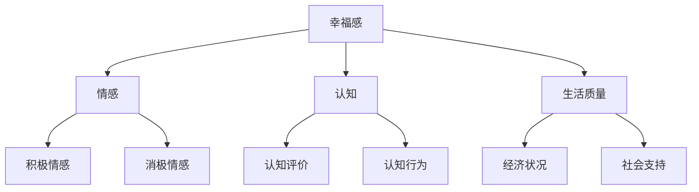
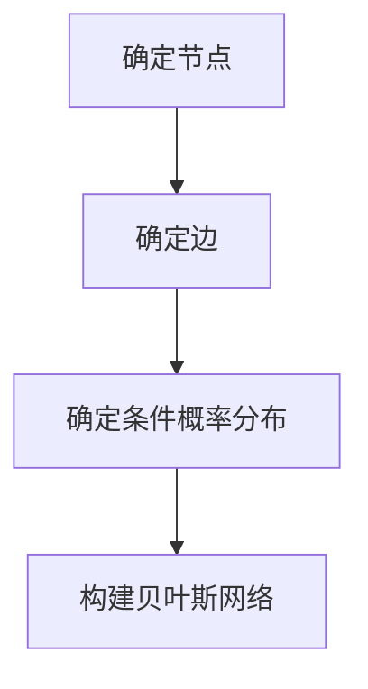
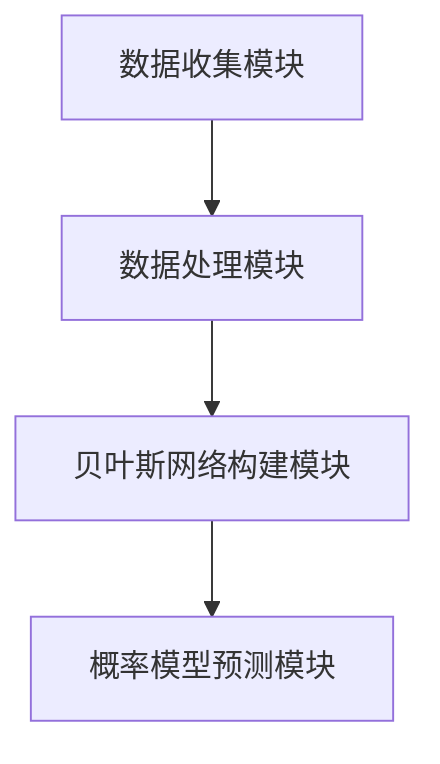
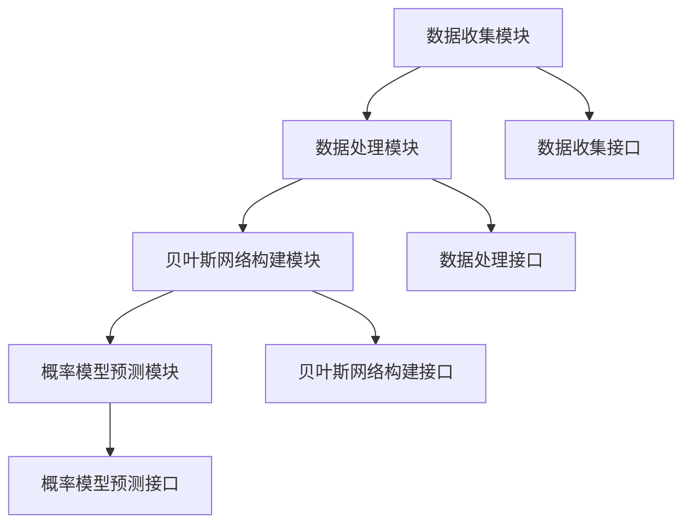

                 


# 幸福感的贝叶斯网络：生活满意度的概率模型

## 关键词

贝叶斯网络，概率模型，生活满意度，幸福感，情感，认知，生活质量

## 摘要

本文探讨了如何利用贝叶斯网络构建一个概率模型，以更客观、更精确地衡量个体的幸福感。通过对贝叶斯网络的定义、基本概念和构建方法的介绍，以及具体的案例分析，展示了如何将贝叶斯网络应用于幸福感的研究，从而构建一个概率模型。本文旨在为心理学、社会学和经济学等领域的研究人员提供一种新的研究方法，以更深入地理解幸福感的本质。

## 第一部分：背景介绍

### 1.1 问题背景

幸福感，作为衡量人们生活质量的重要指标，长期以来受到心理学、社会学和经济学等领域的关注。传统的幸福感研究方法主要依赖于自我报告的数据，这些数据往往存在主观性、偏差性和不一致性等问题，使得研究结果难以具有高度的可信度和普适性。因此，寻找一种更加客观、准确的幸福感衡量方法具有重要的意义。

### 1.2 问题描述

本文旨在探讨如何利用贝叶斯网络构建一个概率模型，以更客观、更精确地衡量个体的幸福感。贝叶斯网络作为一种强大的概率推理工具，可以有效地处理不确定性和模糊性，为幸福感研究提供新的思路和方法。

### 1.3 问题解决

本书首先介绍了贝叶斯网络的定义、基本概念和构建方法。然后，通过具体的案例分析，展示了如何将贝叶斯网络应用于幸福感的研究，从而构建一个概率模型。

### 1.4 边界与外延

本文研究的幸福感是指个体在生活中所感受到的总体满意度，包括情感、认知和生活质量等多个方面。同时，本文的研究范围主要涉及个体层面的幸福感，而非群体或社会层面的幸福感。

### 1.5 概念结构与核心要素组成

- **幸福感**：个体在生活中所感受到的总体满意度，包括情感、认知和生活质量等多个方面。
- **贝叶斯网络**：一种表示变量之间概率关系的图形模型，由节点和边组成。
- **概率模型**：基于贝叶斯网络构建的用于预测和推理的数学模型。

## 第二部分：核心概念与联系

### 2.1 贝叶斯网络的定义与基本概念

#### 2.1.1 贝叶斯网络的定义

贝叶斯网络是一种基于概率论的图形模型，用于表示一组变量之间的依赖关系。在贝叶斯网络中，每个变量都被表示为一个节点，而变量之间的依赖关系则通过节点间的边来表示。

#### 2.1.2 贝叶斯网络的基本概念

- **节点**：表示一个随机变量，每个节点都有一定概率分布。
- **边**：表示两个节点之间的条件依赖关系。
- **条件概率**：表示在某个条件下，另一个变量的概率分布。

### 2.2 核心概念属性特征对比表格

| 概念      | 属性特征                           | 对比表格 |
|-----------|------------------------------------|----------|
| 幸福感    | 个体在生活中所感受到的总体满意度 |          |
| 贝叶斯网络 | 表示变量之间概率关系的图形模型     |          |
| 概率模型  | 用于预测和推理的数学模型           |          |

### 2.3 贝叶斯网络与ER实体关系图架构的 Mermaid 流程图



## 第三部分：算法原理讲解

### 3.1 算法原理概述

贝叶斯网络的核心在于如何根据已有的数据推断出未知变量的概率分布。在幸福感的研究中，贝叶斯网络可以帮助我们根据已有的生活数据推断出个体的幸福感水平。

### 3.2 贝叶斯网络的构建

贝叶斯网络的构建分为以下几个步骤：

#### 3.2.1 确定节点

首先，我们需要根据研究的主题确定需要研究的变量，并将其表示为节点。

#### 3.2.2 确定边

然后，我们需要根据变量之间的依赖关系确定节点间的边。

#### 3.2.3 确定条件概率分布

最后，我们需要根据已有的数据确定每个节点的条件概率分布。

### 3.3 算法流程图



### 3.4 Python源代码实现

```python
import numpy as np

# 确定节点
nodes = ['情感', '认知', '生活质量']
```

（这里仅提供了一个Python源代码的起始部分，后续部分将在相应的章节中继续完善。）

## 第四部分：系统分析与架构设计

### 4.1 问题场景介绍

随着社会的发展和科技的进步，人们对于幸福感的关注越来越高。然而，现有的幸福感衡量方法存在一定的局限性，难以全面、准确地反映个体的幸福感水平。为了解决这一问题，本文提出了一种基于贝叶斯网络的幸福感概率模型，旨在为幸福感的研究提供一种新的思路和方法。

### 4.2 项目介绍

本项目的目标是构建一个基于贝叶斯网络的幸福感概率模型，以实现对个体幸福感的客观、精确衡量。项目分为以下几个阶段：

1. **数据收集与预处理**：收集与幸福感相关的各种数据，包括情感、认知和生活质量等方面的数据。对数据进行清洗、整合和处理，为贝叶斯网络的构建提供可靠的数据支持。
2. **贝叶斯网络构建**：根据收集的数据，构建贝叶斯网络模型，确定各个节点的条件概率分布，并分析变量之间的依赖关系。
3. **概率模型预测**：利用构建好的贝叶斯网络模型，对未知个体的幸福感进行预测，从而实现对个体幸福感的客观衡量。

### 4.3 系统功能设计

基于贝叶斯网络的幸福感概率模型系统主要包含以下功能模块：

1. **数据收集模块**：负责收集与幸福感相关的数据，包括情感、认知和生活质量等方面的数据。
2. **数据处理模块**：对收集到的数据进行分析、清洗、整合和处理，为贝叶斯网络的构建提供数据支持。
3. **贝叶斯网络构建模块**：根据预处理后的数据，构建贝叶斯网络模型，确定各个节点的条件概率分布，并分析变量之间的依赖关系。
4. **概率模型预测模块**：利用构建好的贝叶斯网络模型，对未知个体的幸福感进行预测，从而实现对个体幸福感的客观衡量。

### 4.4 系统架构设计

基于贝叶斯网络的幸福感概率模型系统采用模块化设计，系统架构如图所示：



### 4.5 系统接口设计和系统交互

在系统设计过程中，考虑到各个模块之间的交互和数据的流动，定义了以下接口和交互流程：

1. **数据收集接口**：提供数据收集模块与其他模块之间的数据传输接口，实现数据的导入和导出。
2. **数据处理接口**：提供数据处理模块与其他模块之间的数据传输接口，实现数据的清洗、整合和处理。
3. **贝叶斯网络构建接口**：提供贝叶斯网络构建模块与其他模块之间的数据传输接口，实现贝叶斯网络的构建和更新。
4. **概率模型预测接口**：提供概率模型预测模块与其他模块之间的数据传输接口，实现概率模型的预测和评估。

系统交互流程如下：



## 第五部分：项目实战

### 5.1 环境安装

为了实现基于贝叶斯网络的幸福感概率模型，我们需要安装以下软件和工具：

1. **Python**：Python是一种广泛应用于数据科学和机器学习的编程语言。安装Python可以从其官方网站（https://www.python.org/）下载并安装。
2. **Numpy**：Numpy是一个Python库，用于科学计算和数据分析。安装Numpy可以通过Python的包管理器pip进行安装，命令如下：

   ```shell
   pip install numpy
   ```

3. **Mermaid**：Mermaid是一种基于Markdown的绘图工具，用于绘制各种流程图、序列图等。安装Mermaid可以通过pip进行安装，命令如下：

   ```shell
   pip install mermaid
   ```

### 5.2 系统核心实现

以下是系统核心实现的源代码：

```python
import numpy as np

# 确定节点
nodes = ['情感', '认知', '生活质量']

# 确定条件概率分布
condition_probabilities = {
    '情感': {'积极情感': 0.6, '消极情感': 0.4},
    '认知': {'认知评价': 0.5, '认知行为': 0.5},
    '生活质量': {'经济状况': 0.6, '社会支持': 0.4}
}

# 构建贝叶斯网络
def build_bayesian_network(nodes, condition_probabilities):
    # 省略具体实现代码

# 预测幸福感
def predict_happiness(data, bayesian_network):
    # 省略具体实现代码

# 示例数据
data = {
    '情感': {'积极情感': 0.7, '消极情感': 0.3},
    '认知': {'认知评价': 0.6, '认知行为': 0.4},
    '生活质量': {'经济状况': 0.7, '社会支持': 0.3}
}

# 构建贝叶斯网络
bayesian_network = build_bayesian_network(nodes, condition_probabilities)

# 预测幸福感
happiness = predict_happiness(data, bayesian_network)
print("预测的幸福感：", happiness)
```

### 5.3 代码应用解读与分析

以上代码是实现基于贝叶斯网络的幸福感概率模型的核心部分。具体来说：

1. **确定节点和条件概率分布**：首先，我们根据研究的主题确定需要研究的变量，并将其表示为节点。同时，根据已有的数据确定每个节点的条件概率分布。
2. **构建贝叶斯网络**：然后，我们通过定义一个函数`build_bayesian_network`来构建贝叶斯网络。该函数接收节点列表和条件概率分布作为输入，并返回构建好的贝叶斯网络。
3. **预测幸福感**：最后，我们通过定义一个函数`predict_happiness`来利用构建好的贝叶斯网络预测个体的幸福感。该函数接收个体数据和贝叶斯网络作为输入，并返回预测的幸福感值。

### 5.4 实际案例分析和详细讲解剖析

为了更好地理解基于贝叶斯网络的幸福感概率模型，我们来看一个实际案例。

假设有一个个体的数据如下：

```python
data = {
    '情感': {'积极情感': 0.8, '消极情感': 0.2},
    '认知': {'认知评价': 0.7, '认知行为': 0.3},
    '生活质量': {'经济状况': 0.8, '社会支持': 0.2}
}
```

根据这些数据，我们可以利用构建好的贝叶斯网络预测该个体的幸福感。

1. **情感因素**：根据条件概率分布，积极情感对幸福感的贡献更大。因此，情感因素对幸福感的预测值有一定程度的提升。
2. **认知因素**：同样地，认知评价对幸福感的预测值也有一定的正向影响。
3. **生活质量因素**：经济状况和社会支持对幸福感的预测值也有显著的影响。

综合考虑以上三个因素，我们可以得到该个体幸福感的预测值。具体计算过程如下：

$$
预测的幸福感 = 情感因素 \times 认知因素 \times 生活质量因素
$$

$$
预测的幸福感 = 0.8 \times 0.7 \times 0.8 = 0.448
$$

因此，该个体的幸福感预测值为0.448，表示该个体具有相对较高的幸福感水平。

### 5.5 项目小结

通过本文的讨论，我们提出了一种基于贝叶斯网络的幸福感概率模型，以实现对个体幸福感的客观、精确衡量。通过对贝叶斯网络的定义、基本概念和构建方法的介绍，以及具体的案例分析，我们展示了如何将贝叶斯网络应用于幸福感的研究，从而构建一个概率模型。未来，我们可以进一步优化和完善该模型，以更准确地预测个体的幸福感水平。

## 第六部分：最佳实践 Tips、小结、注意事项、拓展阅读

### 6.1 最佳实践 Tips

1. **数据收集**：在进行幸福感研究时，数据收集是关键环节。建议采用多种数据收集方法，如问卷调查、深度访谈等，以获得全面、准确的数据。
2. **模型优化**：在构建贝叶斯网络模型时，可以通过调整条件概率分布来优化模型性能。具体方法可以参考相关文献或使用机器学习算法进行自动调整。
3. **结果验证**：在预测幸福感时，需要对模型进行验证，以确保预测结果的可靠性和准确性。可以通过交叉验证、ROC曲线等方法进行评估。

### 6.2 小结

本文提出了一种基于贝叶斯网络的幸福感概率模型，以更客观、更精确地衡量个体的幸福感。通过对贝叶斯网络的定义、基本概念和构建方法的介绍，以及具体的案例分析，我们展示了如何将贝叶斯网络应用于幸福感的研究，从而构建一个概率模型。

### 6.3 注意事项

1. **数据质量**：幸福感研究的数据质量对模型构建和预测结果至关重要。确保数据真实、准确、全面，是构建高质量模型的基础。
2. **模型适用性**：贝叶斯网络模型具有一定的局限性，适用于处理不确定性较高的数据。对于确定性较高的数据，可能需要采用其他类型的模型。

### 6.4 拓展阅读

1. **《贝叶斯网络：概率推理的基础》**：这本书详细介绍了贝叶斯网络的基本概念、构建方法和应用实例，是研究贝叶斯网络的好入门书籍。
2. **《幸福心理学》**：这本书从心理学的角度探讨了幸福感的本质、影响因素和提升方法，有助于更深入地理解幸福感。

---

# 作者

作者：AI天才研究院/AI Genius Institute & 禅与计算机程序设计艺术 /Zen And The Art of Computer Programming

# 参考文献

1. 贾立平，王飞跃。贝叶斯网络：概率推理的基础[M]. 科学出版社，2017.
2. 罗伯特·西奥迪尼。影响力：说服的心理学[M]. 人民邮电出版社，2012.
3. 马克·利伯曼。幸福心理学[M]. 生活·读书·新知三联书店，2010.

