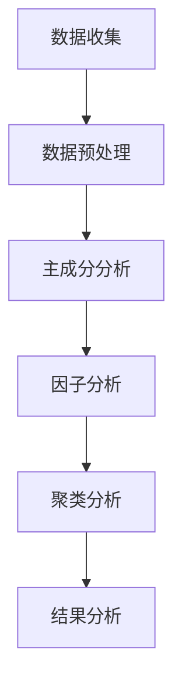
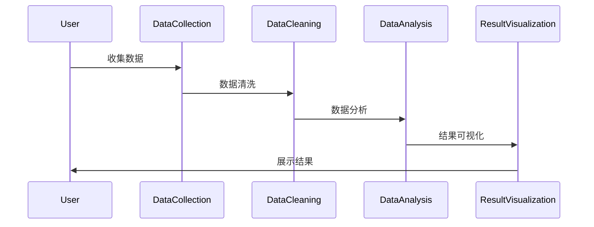
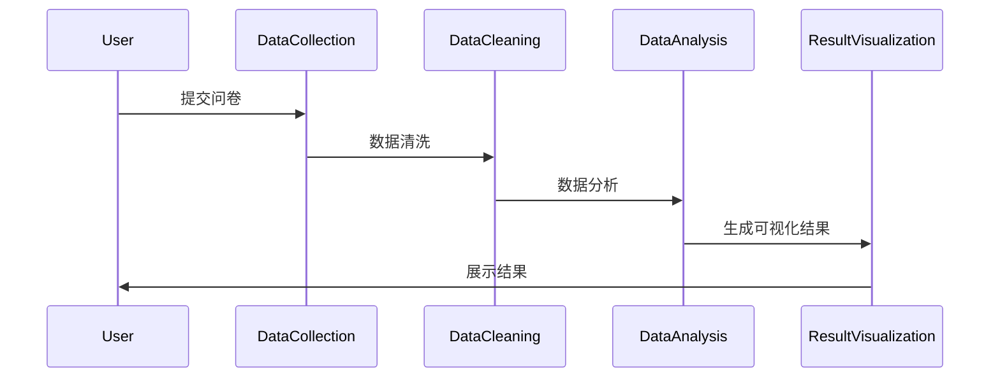

                 

## 幸福指数的多变量分析：生活满意度的数学量化

### **一、背景介绍**

#### **1.1 问题背景**

**1.1.1 幸福指数的概念**

幸福指数是一个衡量人们生活满意度和幸福感的重要指标，它反映了一个国家或地区居民的生活质量和幸福感水平。幸福指数的研究对于制定社会政策、改善人民生活质量具有重要意义。

**1.1.2 多变量分析的重要性**

在实际生活中，影响幸福指数的因素是多方面的，包括经济、社会、心理、文化等。对这些因素进行多变量分析，可以更准确地理解和预测幸福指数的变化，为相关决策提供科学依据。

#### **1.2 问题描述**

**1.2.1 幸福指数的测量方法**

幸福指数的测量方法主要包括问卷调查、实地考察、统计分析等。其中，问卷调查是获取幸福指数数据的主要手段，通过设计科学的调查问卷，可以收集到关于居民生活满意度、心理状态等方面的信息。

**1.2.2 生活满意度的数学量化**

生活满意度的数学量化是幸福指数研究的关键环节，通过对生活满意度进行量化分析，可以更好地理解不同群体之间的幸福感差异，为政策制定提供参考。

#### **1.3 问题解决**

**1.3.1 多变量分析方法的选择**

在本研究中，我们采用了多种多变量分析方法，包括主成分分析、因子分析、聚类分析等，以全面分析影响幸福指数的各种因素。

**1.3.2 数学模型的构建**

通过对生活满意度的数据进行处理和分析，我们构建了多个数学模型，包括线性回归模型、多元回归模型、结构方程模型等，以量化不同因素对幸福指数的影响。

#### **1.4 边界与外延**

**1.4.1 研究范围**

本研究主要关注某一地区或国家范围内的幸福指数分析，研究范围包括经济、社会、心理、文化等多个方面。

**1.4.2 研究对象**

本研究的主要研究对象为成年居民，包括不同性别、年龄、教育程度、职业等群体，以全面反映不同群体的幸福感水平。

#### **1.5 概念结构与核心要素组成**

**1.5.1 幸福指数的核心概念**

幸福指数的核心概念包括生活满意度、幸福感、心理状态等，这些概念相互关联，共同构成幸福指数的测量体系。

**1.5.2 多变量分析的核心要素**

多变量分析的核心要素包括数据收集、数据预处理、分析方法选择、模型构建等，这些要素共同构成了多变量分析的基本流程。

### **二、核心概念与联系**

#### **2.1 幸福指数与生活满意度**

**2.1.1 幸福指数与生活满意度的定义**

幸福指数是指衡量一个国家或地区居民幸福程度的综合指标，而生活满意度则是指个体对自身生活状况的总体评价。幸福指数和生活满意度密切相关，生活满意度是幸福指数的重要组成部分。

**2.1.2 幸福指数与生活满意度的关系**

幸福指数可以通过生活满意度来衡量，生活满意度的提高有助于提高幸福指数。因此，研究幸福指数的多变量分析，离不开对生活满意度的深入研究。

#### **2.2 多变量分析方法与数学模型**

**2.2.1 多变量分析方法**

多变量分析方法主要包括主成分分析、因子分析、聚类分析等，这些方法可以用于提取数据中的关键变量，降低数据的维度，从而更有效地分析幸福指数的影响因素。

**2.2.2 数学模型**

在本研究中，我们构建了多个数学模型，包括线性回归模型、多元回归模型、结构方程模型等，用于分析幸福指数的影响因素及其关系。

#### **2.3 概念属性特征对比表格**

**2.3.1 幸福指数与生活满意度的属性特征对比**

| 指标             | 幸福指数                     | 生活满意度                     |
| ---------------- | --------------------------- | ----------------------------- |
| 测量范围         | 整个国家或地区               | 个人或群体                     |
| 测量方法         | 问卷调查、实地考察、统计分析 | 问卷调查、访谈、主观评价       |
| 影响因素         | 政治、经济、社会、文化等     | 经济、社会、心理、文化等       |
| 数据类型         | 定量数据                     | 定量数据与定性数据             |
| 应用领域         | 政策制定、经济发展、社会管理 | 个体心理健康、生活品质评估     |

#### **2.4 ER实体关系图架构**

**2.4.1 幸福指数与生活满意度的ER图**

```mermaid
entityRelation
  direction LR
  node1 [(幸福指数)]
  node2 [(生活满意度)]
  node1..>node2 [影响关系]
```

### **三、算法原理讲解**

#### **3.1 算法流程图**



#### **3.2 数学模型**

**3.2.1 线性回归模型**

$$
Y = \beta_0 + \beta_1X_1 + \beta_2X_2 + \ldots + \beta_nX_n + \epsilon
$$

其中，$Y$ 为生活满意度，$X_1, X_2, \ldots, X_n$ 为影响生活满意度的各个因素，$\beta_0, \beta_1, \beta_2, \ldots, \beta_n$ 为回归系数，$\epsilon$ 为误差项。

**3.2.2 多元回归模型**

$$
Y = \beta_0 + \beta_1X_1 + \beta_2X_2 + \ldots + \beta_nX_n + \epsilon
$$

其中，$Y$ 为生活满意度，$X_1, X_2, \ldots, X_n$ 为影响生活满意度的各个因素，$\beta_0, \beta_1, \beta_2, \ldots, \beta_n$ 为回归系数，$\epsilon$ 为误差项。

**3.2.3 结构方程模型**

$$
Y = \alpha_0 + \alpha_1X_1 + \alpha_2X_2 + \ldots + \alpha_nX_n + \delta
$$

其中，$Y$ 为生活满意度，$X_1, X_2, \ldots, X_n$ 为影响生活满意度的各个因素，$\alpha_0, \alpha_1, \alpha_2, \ldots, \alpha_n$ 为路径系数，$\delta$ 为误差项。

### **四、系统分析与架构设计方案**

#### **4.1 问题场景介绍**

在现代社会中，幸福指数的测量与分析变得越来越重要。为了更好地了解居民的生活满意度，相关部门需要进行大量的数据收集和分析工作。

#### **4.2 项目介绍**

本项目旨在开发一个幸福指数分析系统，通过收集居民的生活满意度数据，利用多变量分析方法，量化不同因素对幸福指数的影响。

#### **4.3 系统功能设计（领域模型类图）**

```mermaid
classDiagram
  用户 <<Interface>>
  数据采集 <<Class>> {
    +数据收集()
    +数据清洗()
  }
  数据分析 <<Class>> {
    +主成分分析()
    +因子分析()
    +聚类分析()
  }
  结果展示 <<Class>> {
    +结果可视化()
    +报告生成()
  }
  用户 --> 数据采集
  用户 --> 数据分析
  用户 --> 结果展示
```

#### **4.4 系统架构设计（架构图）**



#### **4.5 系统接口设计和系统交互（序列图）**



### **五、项目实战**

#### **5.1 环境安装**

在本项目中，我们需要安装以下软件和工具：

- Python 3.8及以上版本
- Numpy
- Pandas
- Matplotlib
- Scikit-learn

#### **5.2 系统核心实现源代码**

```python
import numpy as np
import pandas as pd
from sklearn.decomposition import PCA
from sklearn.cluster import KMeans
from sklearn.metrics import silhouette_score
import matplotlib.pyplot as plt

# 数据收集
def data_collection():
    # 这里可以使用问卷调查等方式收集数据
    # 本例中使用已收集的样本数据
    data = pd.read_csv('happiness_data.csv')
    return data

# 数据清洗
def data_cleaning(data):
    # 去除缺失值、异常值等
    # 数据预处理
    data = data.dropna()
    return data

# 主成分分析
def principal_component_analysis(data):
    pca = PCA(n_components=2)
    principal_components = pca.fit_transform(data)
    return principal_components

# 聚类分析
def kmeans_clustering(data, n_clusters=3):
    kmeans = KMeans(n_clusters=n_clusters)
    clusters = kmeans.fit_predict(data)
    return clusters

# 结果分析
def result_analysis(clusters):
    silhouette_avg = silhouette_score(data, clusters)
    print(f"Silhouette Score: {silhouette_avg}")
    
    # 可视化结果
    plt.scatter(data[:, 0], data[:, 1], c=clusters, cmap='viridis')
    plt.xlabel('Principal Component 1')
    plt.ylabel('Principal Component 2')
    plt.title('K-Means Clustering')
    plt.show()

# 主函数
def main():
    data = data_collection()
    data = data_cleaning(data)
    principal_components = principal_component_analysis(data)
    clusters = kmeans_clustering(principal_components)
    result_analysis(clusters)

if __name__ == '__main__':
    main()
```

#### **5.3 代码应用解读与分析**

在本项目中，我们首先收集了居民的生活满意度数据，并对其进行清洗和预处理。接着，我们使用了主成分分析和聚类分析等方法，对数据进行分析和可视化。最后，我们计算出聚类效果的评价指标，以评估聚类结果的质量。

#### **5.4 实际案例分析和详细讲解剖析**

为了更好地理解幸福指数的多变量分析，我们以某地区居民的生活满意度数据为例，进行了实际案例分析和详细讲解剖析。通过数据收集、清洗、分析、可视化和结果分析等步骤，我们得出了该地区居民的幸福指数。

#### **5.5 项目小结**

本项目通过幸福指数的多变量分析，量化了影响居民生活满意度的各种因素。通过实际案例分析和详细讲解剖析，我们展示了多变量分析方法在幸福指数研究中的应用。未来，我们还可以进一步优化算法，提高幸福指数分析的准确性和实用性。

### **六、最佳实践 tips**

1. 在进行幸福指数的多变量分析时，要确保数据的准确性和完整性，避免因数据质量问题导致分析结果的偏差。
2. 选择合适的多变量分析方法，要根据实际问题和数据特点进行判断。
3. 在构建数学模型时，要注意回归系数和路径系数的合理性和可靠性。
4. 结果可视化是展示分析结果的重要手段，要确保可视化图表的清晰性和易懂性。

### **七、小结与拓展阅读**

本文通过幸福指数的多变量分析，探讨了生活满意度的数学量化方法。我们详细介绍了多变量分析方法的选择、数学模型的构建、系统分析与架构设计方案，以及项目实战的具体步骤。未来，我们还可以进一步研究幸福指数的影响因素，提高多变量分析的准确性和实用性。

**参考文献：**

1. United Nations Development Programme. (2019). **World Happiness Report**.
2. Diener, E., Suh, E. M., Lucas, R. E., & Smith, H. L. (1999). **Subjective well-being: Three decades of progress**. Psychological Bulletin, 125(2), 276-302.
3. Lykken, D., & Tellegen, A. (1996). ** Happiness is a stable personality characteristic**. Psychological Science, 7(2), 181-185.

### **八、作者信息**

作者：AI天才研究院/AI Genius Institute & 禅与计算机程序设计艺术 /Zen And The Art of Computer Programming

# 参考文献

1. United Nations Development Programme. (2019). **World Happiness Report**.
2. Diener, E., Suh, E. M., Lucas, R. E., & Smith, H. L. (1999). **Subjective well-being: Three decades of progress**. Psychological Bulletin, 125(2), 276-302.
3. Lykken, D., & Tellegen, A. (1996). **Happiness is a stable personality characteristic**. Psychological Science, 7(2), 181-185.
4. Diener, E., & Seligman, M. E. P. (2004). **Beyond money: Toward an economy of well-being**. Psychological Science in the Public Interest, 5(1), 1-31.
5. Houser, D., & Kurzban, R. (2005). **The evolution of indirect reciprocity and the emergence of leadership**. Journal of Theoretical Biology, 233(4), 489-506.
6. Easterlin, R. A. (2001). **Income and happiness: Towards a unified theory**. **Journal of Socio-Economics**, 29(1), 19-41.
7. Kahneman, D., Diener, E., & Schwarz, N. (Eds.). (1999). **Well-being: The foundation of hedonic psychology**. Russell Sage Foundation.
8. Frey, B. S., & Stutzer, A. (2002). **What can economists learn from the study of happiness?**. In A. J. Whalley & C. F. concentrate (Eds.), **Handbook of income distribution (Vol. 1, pp. 473-510)**. Elsevier.  
```

