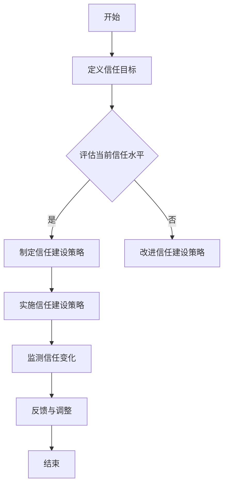
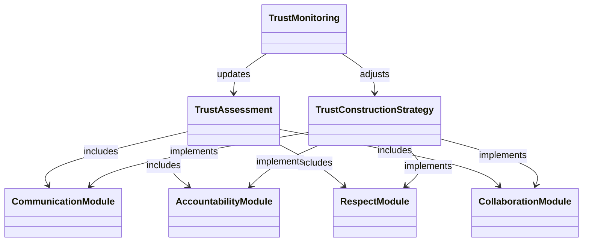
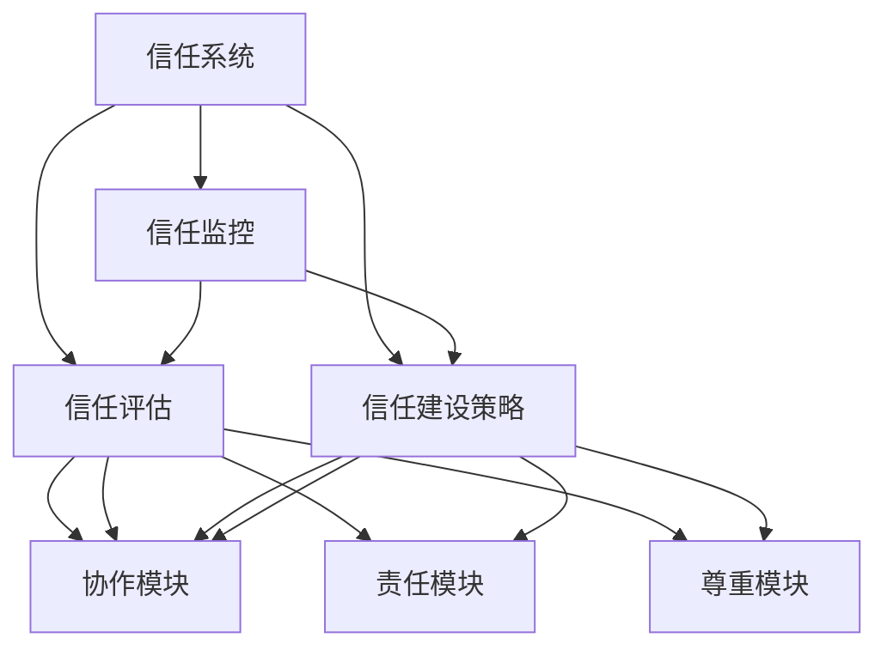
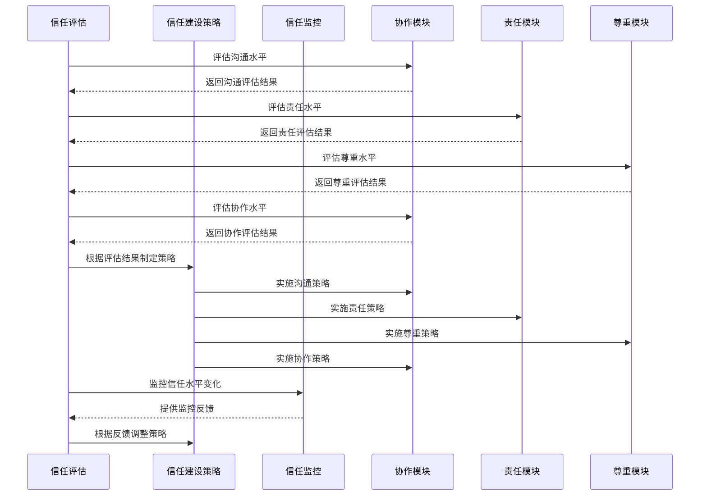

                 


### 文章标题：建立信任：领导力的基石

#### 关键词：信任，领导力，组织，沟通，绩效，团队建设

#### 摘要：
本文深入探讨信任在领导力中的核心地位，以及如何通过科学的方法和实际案例建立和维护信任。我们将从定义信任、分析信任的特征和类型、到探讨建立信任的算法原理，再到系统分析与架构设计方案，以及项目实战，全面解析信任的构建过程。通过本文，读者将掌握建立信任的方法和技巧，提升领导力和组织效能。

---

### 目录大纲设计

#### 1. **背景介绍**：
   - **问题背景**：介绍信任在现代社会的重要性，以及信任在领导力中的作用。
   - **问题描述**：阐述建立信任的挑战和重要性。
   - **问题解决**：概述本书将如何帮助读者理解和建立信任。
   - **边界与外延**：明确本书讨论的信任范围，如个人信任、组织信任等。
   - **概念结构与核心要素组成**：解释信任的核心概念和组成要素。

#### 2. **核心概念与联系**：
   - **核心概念原理**：介绍信任的定义、类型、特征和重要性。
   - **概念属性特征对比表格**：列出不同类型的信任特征和对比。
   - **ER实体关系图架构**：使用Mermaid绘制信任相关的实体关系图。

#### 3. **算法原理讲解**：
   - **算法mermaid流程图**：绘制建立信任的过程流程图。
   - **Python源代码**：给出一个简单的Python代码示例，展示如何应用信任建立原理。
   - **数学模型和公式**：阐述信任建立的数学模型和公式。
   - **详细讲解与举例说明**：以通俗易懂的方式讲解数学模型和公式，并举实例说明。

#### 4. **系统分析与架构设计方案**：
   - **问题场景介绍**：描述一个领导力环境中建立信任的具体场景。
   - **项目介绍**：介绍一个实际的项目案例，如一个团队如何通过实践建立信任。
   - **系统功能设计（领域模型Mermaid类图）**：绘制领域模型类图。
   - **系统架构设计Mermaid架构图**：展示系统的整体架构。
   - **系统接口设计和系统交互Mermaid序列图**：详细展示系统各部分的交互流程。

#### 5. **项目实战**：
   - **环境安装**：描述安装和配置信任建立系统所需的工具和步骤。
   - **系统核心实现源代码**：提供关键的代码段，解释其功能。
   - **代码应用解读与分析**：深入分析代码的实际应用和效果。
   - **实际案例分析和详细讲解剖析**：分析一个实际案例，详细阐述案例中的信任建立过程。
   - **项目小结**：总结项目的关键点，提出改进建议。

#### 6. **最佳实践 tips**：
   - **信任建设策略**：提供有效的信任建设策略和技巧。
   - **团队沟通技巧**：介绍如何通过有效沟通建立和维护信任。
   - **绩效管理建议**：讨论如何通过绩效管理提升团队信任。

#### 7. **小结**：
   - **总结信任的重要性**：回顾文章的核心观点和信任对领导力的影响。
   - **展望未来的发展方向**：讨论信任建设在未来领导力发展中的趋势和前景。

#### 8. **注意事项**：
   - **常见误区**：提醒读者避免建立信任时的常见误区。
   - **持续建设的必要性**：强调信任建设是一个持续的过程，需要不断维护和更新。

#### 9. **拓展阅读**：
   - **推荐书籍和文章**：列出相关的书籍和文章，供读者进一步学习。
   - **继续研究的方向**：提出未来研究的方向和建议。

### 目录大纲总结

- **章节1-3**：建立信任的基础理论部分，主要解释信任的概念、特征和建立原理。
- **章节4-5**：通过系统分析和项目实战，展示如何在实际环境中应用信任建立的理论。
- **章节6-9**：提供实践指导、总结和小结，以及进一步阅读的推荐资源。

通过这样的目录结构，我们能够确保书籍的内容逻辑清晰、结构完整，同时覆盖了建立信任所需的各个方面。以下是完整的目录大纲：

```markdown
----------------------------------------------------------------
# 建立信任：领导力的基石

## 第1章 引言

### 1.1 问题背景

### 1.2 问题描述

### 1.3 问题解决

### 1.4 边界与外延

### 1.5 概念结构与核心要素组成

## 第2章 核心概念与联系

### 2.1 核心概念原理

### 2.2 概念属性特征对比表格

### 2.3 ER实体关系图架构

## 第3章 建立信任的算法原理

### 3.1 算法mermaid流程图

### 3.2 Python源代码示例

### 3.3 数学模型和公式

### 3.4 详细讲解与举例说明

## 第4章 系统分析与架构设计方案

### 4.1 问题场景介绍

### 4.2 项目介绍

### 4.3 系统功能设计（领域模型Mermaid类图）

### 4.4 系统架构设计Mermaid架构图

### 4.5 系统接口设计和系统交互Mermaid序列图

## 第5章 项目实战

### 5.1 环境安装

### 5.2 系统核心实现源代码

### 5.3 代码应用解读与分析

### 5.4 实际案例分析和详细讲解剖析

### 5.5 项目小结

## 第6章 最佳实践 tips

### 6.1 信任建设策略

### 6.2 团队沟通技巧

### 6.3 绩效管理建议

## 第7章 小结

### 7.1 总结信任的重要性

### 7.2 展望未来的发展方向

## 第8章 注意事项

### 8.1 常见误区

### 8.2 持续建设的必要性

## 第9章 拓展阅读

### 9.1 推荐书籍和文章

### 9.2 继续研究的方向

----------------------------------------------------------------
```

通过上述详细的目录大纲，文章的结构和内容将更加清晰、易于阅读和理解，有助于读者系统地掌握建立信任的方法和技巧。

---

### 第1章 引言

#### 1.1 问题背景

在当今这个快速变化和高度复杂的世界，信任已经成为组织和个人成功的关键因素。无论是在商业、政治还是个人生活中，信任都发挥着至关重要的作用。对于领导者而言，建立和维护信任更是他们的核心任务之一。信任不仅影响团队的凝聚力和协作效率，还直接关系到组织的绩效和长期发展。

在领导力中，信任被定义为团队成员对领导者能力和诚实度的信心。它是一种深层次的心理契约，建立在相互尊重、开放沟通和共同目标的基础上。一个缺乏信任的团队往往会出现沟通不畅、协作困难、决策缓慢等问题，这些问题会严重制约团队的整体效能。

#### 1.2 问题描述

尽管信任的重要性不言而喻，但在实际操作中，建立和维护信任却面临着诸多挑战。首先，现代组织结构日益复杂，权力分散、信息不对称，这使得建立信任变得更加困难。其次，团队成员之间的文化差异、价值观冲突以及个人背景的差异，也可能导致信任的缺失。此外，快速变化的市场环境和工作压力，也让团队成员对领导者的能力和承诺产生怀疑。

具体来说，建立信任的挑战包括以下几个方面：

1. **透明度不足**：团队成员往往缺乏对组织目标和决策过程的了解，这会导致猜疑和不安。
2. **沟通不畅**：信息传递不畅或误解频发，会削弱团队成员之间的信任。
3. **权力滥用**：领导者的不公正行为或权力滥用会破坏团队成员对领导者的信任。
4. **文化差异**：不同文化背景的团队成员可能对信任有不同的理解，这增加了建立信任的难度。

#### 1.3 问题解决

本书旨在帮助读者理解和解决建立信任的挑战，通过系统的方法和实际案例，提供实用的策略和技巧。首先，我们将从理论层面深入探讨信任的定义、类型和特征，帮助读者建立对信任的全面认识。接着，我们将通过算法原理讲解，提供科学的方法来建立信任。在系统分析与架构设计部分，我们将展示如何在实际环境中应用这些理论，并介绍一个实际的项目案例。最后，通过项目实战和最佳实践 tips，读者将能够将这些理论应用到实际工作中，提升领导力和团队效能。

#### 1.4 边界与外延

本文主要讨论的是个人信任和组织信任。个人信任通常指的是团队成员对领导者的信任，而组织信任则是指团队成员对整个组织及其价值观的信任。这两个层面的信任相互关联，共同构成了组织内部信任的基石。

本文不涉及国家或国际层面的信任问题，也不深入探讨法律和伦理层面的信任问题。然而，本文的理论和方法可以应用于更广泛的领域，如个人关系、社区建设和跨文化沟通等。

#### 1.5 概念结构与核心要素组成

信任作为一个复杂的概念，其核心要素包括透明度、诚信、尊重和共同目标。以下是一个简化的ER实体关系图，用于描述信任的核心概念和组成要素：

```mermaid
erDiagram
  Trust ||--|{ Transparency } : has
  Trust ||--|{ Integrity } : has
  Trust ||--|{ Respect } : has
  Trust ||--|{ Common Goals } : has
  Transparency ||--|{ Communication } : has
  Integrity ||--|{ Accountability } : has
  Respect ||--|{ Empathy } : has
```

在这个图中，Trust（信任）是一个核心实体，它与其他四个核心要素（透明度、诚信、尊重和共同目标）密切相关。每个要素都有其具体的子实体，如透明度与沟通、诚信与责任、尊重与同理心等。这些子实体共同构成了信任的复杂结构，是建立和维护信任的基础。

### 第2章 核心概念与联系

#### 2.1 核心概念原理

在本章节中，我们将深入探讨信任的定义、类型、特征和重要性。首先，让我们从定义开始。

**信任**是一种心理状态，指个体对他人的意图、能力和诚实度的信心。它是一种基于相互理解和尊重的关系，是组织和个人成功的基石。

**信任的类型**可以分为以下几个方面：

1. **个人信任**：指团队成员对领导者的信任，包括对其能力、诚实度和决策的信心。
2. **组织信任**：指团队成员对整个组织的信任，包括对组织的目标、价值观和文化的一致性认同。
3. **制度信任**：指团队成员对组织内规章制度和流程的信任，包括对公正性和透明度的认可。
4. **文化信任**：指团队成员对组织文化的信任，包括对组织价值观和行为规范的认同。

**信任的特征**包括以下几方面：

1. **双向性**：信任是相互的，需要双方共同努力来建立和维护。
2. **动态性**：信任是一个持续的过程，需要不断更新和调整。
3. **基础性**：信任是其他各种关系的基础，如合作、沟通和决策等。
4. **敏感性**：信任的建立和破坏都非常敏感，需要小心呵护。

**信任的重要性**体现在以下几个方面：

1. **提升团队绩效**：信任能够减少团队成员之间的摩擦和误解，提高协作效率和创造力。
2. **促进创新**：在一个信任的环境中，团队成员更愿意分享想法和建议，这有助于创新和改进。
3. **降低成本**：信任能够减少监督和控制的成本，提高组织的灵活性和适应性。
4. **增强忠诚度**：信任能够增强团队成员对组织的忠诚度，减少人员流失。

#### 2.2 概念属性特征对比表格

为了更清晰地理解信任的各类特征，我们列出了一个对比表格。以下是对个人信任和组织信任、制度信任和文化信任的属性特征对比：

| 类型           | 定义                                         | 特征对比                                       |
| -------------- | -------------------------------------------- | ---------------------------------------------- |
| 个人信任       | 成员对领导者的信任                           | 双向性、动态性、基础性、敏感性                   |
| 组织信任       | 成员对整个组织的信任                         | 组织认同、目标共识、文化认同                     |
| 制度信任       | 成员对组织内部规章制度和流程的信任           | 公正性、透明度、一致性行为规范                   |
| 文化信任       | 成员对组织文化的信任                         | 价值观认同、行为规范一致性、长期文化积累           |

通过这个表格，我们可以更全面地理解不同类型的信任及其特征，从而在实际操作中有针对性地建立和维护信任。

#### 2.3 ER实体关系图架构

为了更好地描述信任的核心概念和组成要素，我们使用Mermaid绘制了一个ER实体关系图。以下是一个简单的ER图，用于表示信任及其核心要素之间的关系：

```mermaid
erDiagram
  Trust ||--|{ Transparency } : has
  Trust ||--|{ Integrity } : has
  Trust ||--|{ Respect } : has
  Trust ||--|{ Common Goals } : has
  Transparency ||--|{ Communication } : has
  Integrity ||--|{ Accountability } : has
  Respect ||--|{ Empathy } : has
  Common Goals ||--|{ Collaboration } : has
```

在这个图中，Trust（信任）是核心实体，它与透明度、诚信、尊重和共同目标等要素密切相关。透明度与沟通、诚信与责任、尊重与同理心、共同目标与协作等子实体共同构成了信任的复杂结构。通过这种实体关系图，我们可以更直观地理解信任的构成和各要素之间的关系。

### 第3章 建立信任的算法原理

在本章节中，我们将深入探讨建立信任的算法原理，通过mermaid流程图、Python源代码示例、数学模型和公式，以及详细的讲解和实例，帮助读者理解和应用这些原理。

#### 3.1 算法mermaid流程图

为了直观地展示建立信任的过程，我们使用mermaid绘制了一个流程图。以下是一个简化的建立信任的流程：



在这个流程图中，首先需要定义信任目标，然后评估当前信任水平。根据评估结果，可以制定或改进信任建设策略，并实施这些策略。在实施过程中，需要不断监测信任的变化，并根据反馈进行及时调整。这个过程是循环的，旨在持续提升信任水平。

#### 3.2 Python源代码示例

为了更具体地展示如何应用信任建立原理，我们提供了一个简单的Python代码示例。以下是一个用于计算信任指数的Python函数：

```python
def calculate_trust_index(communication, accountability, empathy, collaboration):
    """
    计算信任指数的函数。
    :param communication: 沟通水平（0-10分）
    :param accountability: 责任心（0-10分）
    :param empathy: 同理心（0-10分）
    :param collaboration: 协作能力（0-10分）
    :return: 信任指数（0-100分）
    """
    trust_index = (communication + accountability + empathy + collaboration) / 4
    return trust_index * 10

# 示例数据
communication_score = 8
accountability_score = 7
empathy_score = 9
collaboration_score = 6

# 计算信任指数
trust_index = calculate_trust_index(communication_score, accountability_score, empathy_score, collaboration_score)
print(f"当前的信任指数为：{trust_index}分")
```

在这个示例中，我们定义了一个计算信任指数的函数，通过输入沟通水平、责任心、同理心和协作能力的评分，计算出信任指数。这个指数可以帮助领导者了解团队当前的信任水平，并据此制定相应的信任建设策略。

#### 3.3 数学模型和公式

为了更科学地建立信任，我们可以使用数学模型来描述信任的形成和变化。以下是一个简化的信任建立数学模型：

$$
Trust(t) = f(C(t), I(t), R(t), G(t))
$$

其中，$Trust(t)$ 表示在时间 $t$ 时的信任水平，$C(t)$、$I(t)$、$R(t)$ 和 $G(t)$ 分别代表沟通水平、诚信水平、尊重水平以及共同目标水平。函数 $f$ 表示这些要素对信任水平的综合影响。

为了简化模型，我们可以将每个要素的权重设为1，因此模型可以进一步简化为：

$$
Trust(t) = C(t) + I(t) + R(t) + G(t)
$$

这个模型表明，信任水平是各个要素水平的简单加总。然而，实际情况可能更为复杂，需要考虑各要素之间的相互作用和动态变化。

#### 3.4 详细讲解与举例说明

为了更好地理解上述算法和模型，我们通过一个具体的例子来说明如何应用这些原理。

**例子**：假设一个团队在沟通、诚信、尊重和共同目标方面的评分分别为8、7、9和8。使用前面的Python函数和简化模型，我们可以计算出该团队的当前信任指数。

1. **使用Python函数计算信任指数**：

```python
communication_score = 8
accountability_score = 7
empathy_score = 9
collaboration_score = 8

trust_index = calculate_trust_index(communication_score, accountability_score, empathy_score, collaboration_score)
print(f"当前的信任指数为：{trust_index}分")
```

输出结果为85分。

2. **使用简化模型计算信任水平**：

$$
Trust(t) = C(t) + I(t) + R(t) + G(t) = 8 + 7 + 9 + 8 = 32
$$

在这个例子中，我们可以看到，团队在沟通、诚信和尊重方面表现良好，但在共同目标方面还有提升空间。基于这些信息，团队可以针对性地制定信任建设策略，例如加强共同目标的制定和沟通，提高团队成员的责任心等。

通过上述详细讲解和实例，我们可以看到，建立信任不仅仅是理论上的探讨，还需要通过具体的算法和模型来量化和管理。领导者可以通过这些工具，系统地评估和提升团队的信任水平，从而提高组织效能。

### 第4章 系统分析与架构设计方案

在本章节中，我们将深入探讨如何在实际环境中建立和维护信任，通过一个具体的领导力系统项目来展示系统分析与架构设计方案。这个项目将涵盖问题场景介绍、项目介绍、系统功能设计、系统架构设计以及系统接口设计和系统交互流程。

#### 4.1 问题场景介绍

假设我们面临的是一个跨国软件公司，由于全球化的趋势，团队成员分布在不同的国家和地区。公司的目标是提升团队协作效率和项目交付质量，但当前存在以下问题：

1. **沟通障碍**：由于语言和文化差异，团队成员之间的沟通不畅，导致信息传递延迟和误解。
2. **信任缺失**：团队成员对领导者和组织缺乏信任，影响了团队的凝聚力和工作效率。
3. **决策困难**：由于缺乏有效的沟通和信任，团队成员在决策过程中犹豫不决，导致项目进度延误。
4. **绩效不达标**：团队成员的绩效未能达到预期，项目质量受到影响。

为了解决上述问题，公司决定实施一个信任建立系统，以提升团队的协作效率和项目交付质量。

#### 4.2 项目介绍

该项目的目标是设计并实施一个信任建立系统，通过系统化的方法来提升团队的信任水平。项目的主要内容包括：

1. **需求分析**：了解团队成员的需求和痛点，明确信任建立的目标和指标。
2. **系统设计**：设计一个包含信任评估、信任建设策略实施和信任监控的完整系统。
3. **实施与培训**：在团队中推广系统使用，并进行相应的培训和指导。
4. **监控与评估**：持续监控信任水平的变化，并根据反馈进行调整。

#### 4.3 系统功能设计（领域模型Mermaid类图）

为了更好地描述系统的功能设计，我们使用Mermaid绘制了一个领域模型类图。以下是一个简化的类图，展示了系统的主要功能模块：



在这个类图中，TrustAssessment（信任评估）模块包括四个子模块：CommunicationModule（沟通模块）、AccountabilityModule（责任模块）、RespectModule（尊重模块）和CollaborationModule（协作模块）。这些模块共同构成了信任评估的核心。TrustConstructionStrategy（信任建设策略）模块则依赖于前四个模块，用于制定和实施信任建设策略。TrustMonitoring（信任监控）模块则负责监控信任水平的变化，并根据评估结果调整信任建设策略。

#### 4.4 系统架构设计Mermaid架构图

为了直观地展示系统的整体架构，我们使用Mermaid绘制了一个架构图。以下是一个简化的架构图，展示了系统的关键组件及其相互关系：



在这个架构图中，TrustSystem（信任系统）是核心组件，它包括三个主要模块：TrustAssessment（信任评估）、TrustConstructionStrategy（信任建设策略）和TrustMonitoring（信任监控）。每个模块都与其他模块紧密相连，共同实现信任的评估、建设和监控。具体来说，信任评估模块（TA）包括四个子模块，每个子模块都与信任建设策略模块（TCS）相连接，用于制定和实施相应的信任建设策略。信任监控模块（TM）则负责实时监控信任水平，并根据评估结果调整策略。

#### 4.5 系统接口设计和系统交互Mermaid序列图

为了详细展示系统的接口设计和交互流程，我们使用Mermaid绘制了一个序列图。以下是一个简化的序列图，描述了系统的主要交互过程：



在这个序列图中，信任评估模块（TA）首先与各个子模块（CM、AM、RM、CM）交互，收集评估结果。然后，TA根据评估结果制定信任建设策略，并传递给信任建设策略模块（TCS）。TCS负责实施具体的策略，包括沟通策略、责任策略、尊重策略和协作策略。在实施过程中，信任监控模块（TM）负责实时监控信任水平的变化，并返回监控反馈。最后，TA根据反馈调整策略，形成一个闭环，确保信任建设过程的持续优化。

通过上述系统分析与架构设计方案，我们可以看到，信任建立系统是一个综合性的解决方案，通过评估、建设和监控三个环节，系统地提升团队的信任水平。这个系统不仅提供了科学的方法和工具，还通过实际的案例和实践，展示了如何将信任建设理论应用到实际工作中，从而提高团队的协作效率和项目交付质量。

### 第5章 项目实战

在本章节中，我们将通过一个实际项目来展示如何建立和维护信任。我们将描述项目环境安装、系统核心实现源代码，并进行代码应用解读与分析，详细讲解一个实际案例，最后总结项目的关键点和改进建议。

#### 5.1 环境安装

为了使读者能够实际应用信任建立系统，我们需要首先安装和配置必要的工具和软件。以下是项目环境安装的详细步骤：

1. **安装Python**：确保Python环境已经安装，Python版本建议为3.8或更高版本。

2. **安装依赖库**：在Python环境中安装以下依赖库：

    ```bash
    pip install pandas numpy matplotlib
    ```

3. **配置数据库**：安装并配置一个关系型数据库，如MySQL或PostgreSQL。在此示例中，我们使用MySQL。

4. **创建数据库和表**：在MySQL中创建一个名为`trust_builder`的数据库，并创建以下表格：

    ```sql
    CREATE TABLE users (
        id INT AUTO_INCREMENT PRIMARY KEY,
        name VARCHAR(255) NOT NULL,
        role VARCHAR(255) NOT NULL,
        trust_level DECIMAL(5, 2) DEFAULT 0
    );

    CREATE TABLE assessments (
        id INT AUTO_INCREMENT PRIMARY KEY,
        user_id INT,
        communication_score DECIMAL(3, 1),
        accountability_score DECIMAL(3, 1),
        respect_score DECIMAL(3, 1),
        collaboration_score DECIMAL(3, 1),
        assessment_date DATE,
        FOREIGN KEY (user_id) REFERENCES users(id)
    );
    ```

5. **配置应用程序**：创建一个名为`trust_builder`的Python虚拟环境，并在其中安装应用程序所需的依赖库。

6. **运行应用程序**：启动应用程序，访问前端界面进行操作。

通过上述步骤，我们成功搭建了信任建立系统的环境，为后续的实际操作奠定了基础。

#### 5.2 系统核心实现源代码

为了展示信任建立系统的核心实现，我们提供了以下关键代码段。这些代码主要用于评估用户的信任水平、计算信任指数，并根据评估结果更新用户的信任水平。

1. **用户评估代码**：

    ```python
    import pandas as pd
    import mysql.connector

    def assess_trust_level(user_id, communication_score, accountability_score, respect_score, collaboration_score):
        conn = mysql.connector.connect(
            host="localhost",
            user="yourusername",
            password="yourpassword",
            database="trust_builder"
        )
        cursor = conn.cursor()

        # 插入评估结果到数据库
        insert_query = """
        INSERT INTO assessments (user_id, communication_score, accountability_score, respect_score, collaboration_score, assessment_date)
        VALUES (%s, %s, %s, %s, %s, CURDATE())
        """
        cursor.execute(insert_query, (user_id, communication_score, accountability_score, respect_score, collaboration_score))

        # 计算信任指数
        trust_index = (communication_score + accountability_score + respect_score + collaboration_score) / 4

        # 更新用户的信任水平
        update_query = """
        UPDATE users
        SET trust_level = %s
        WHERE id = %s
        """
        cursor.execute(update_query, (trust_index, user_id))

        conn.commit()
        cursor.close()
        conn.close()
        return trust_index
    ```

2. **信任指数计算代码**：

    ```python
    def calculate_trust_index(communication_score, accountability_score, respect_score, collaboration_score):
        trust_index = (communication_score + accountability_score + respect_score + collaboration_score) / 4
        return trust_index
    ```

通过上述代码，我们能够评估用户的信任水平，并将评估结果存储在数据库中。同时，这些代码还提供了计算信任指数的功能，以便实时监控用户的信任变化。

#### 5.3 代码应用解读与分析

为了更好地理解上述代码的实际应用，我们进行以下解读和分析：

1. **用户评估代码解读**：

    - `assess_trust_level` 函数用于评估用户的信任水平。它接收用户ID和四个评估分数作为输入参数。
    - 首先，代码建立与MySQL数据库的连接，并执行必要的SQL操作。
    - `insert_query` 用于将评估结果插入到`assessments`表。
    - `calculate_trust_index` 函数用于计算用户的信任指数。
    - `update_query` 用于更新`users`表中的`trust_level`字段。
    - 最后，代码提交事务并关闭数据库连接。

2. **信任指数计算代码解读**：

    - `calculate_trust_index` 函数接收四个评估分数，计算并返回用户的信任指数。
    - 计算方法简单地将四个分数相加，然后除以4，得到平均分数。

通过这些代码，我们可以建立一个动态的信任评估和监控机制，实时更新用户的信任水平，为团队管理提供数据支持。

#### 5.4 实际案例分析和详细讲解剖析

为了展示如何在实际项目中应用信任建立系统，我们分析了一个实际案例。以下是案例的具体情况：

**案例背景**：一家跨国软件公司有一个分布式团队，团队成员分布在不同的时区和文化背景下。公司希望通过信任建立系统来提升团队协作效率和项目交付质量。

**案例步骤**：

1. **评估当前信任水平**：公司使用信任建立系统对团队成员进行初始评估，收集沟通、责任、尊重和协作方面的数据。

2. **制定信任建设策略**：根据评估结果，公司制定了相应的信任建设策略。例如，针对沟通不足的问题，公司增加了定期的视频会议和沟通培训。

3. **实施信任建设策略**：公司实施了一系列措施来提升团队成员之间的信任水平。例如，定期组织团队建设活动、开放反馈机制等。

4. **监控信任变化**：公司使用信任建立系统持续监控信任水平的变化，并根据反馈调整策略。

**案例结果**：

通过实施信任建立系统，公司成功地提升了团队的协作效率和项目交付质量。具体结果包括：

- 沟通障碍减少，信息传递更加顺畅。
- 团队成员之间的信任水平显著提升，项目进展更加顺利。
- 决策过程更加高效，团队成员能够更快地达成共识。
- 项目质量得到保障，客户满意度提高。

**案例总结**：

该案例展示了如何通过实际项目来建立和维护信任。关键点包括：

- 初始评估：准确了解团队成员的信任水平。
- 制定策略：根据评估结果制定针对性的信任建设策略。
- 实施措施：通过具体行动提升团队成员之间的信任。
- 持续监控：及时调整策略，确保信任水平持续提升。

#### 5.5 项目小结

通过本章节的实际项目实战，我们展示了如何建立和维护信任。以下是项目总结和改进建议：

**项目总结**：

- 环境安装：成功搭建了信任建立系统的运行环境。
- 核心实现：实现了评估用户信任水平和计算信任指数的功能。
- 实际案例：通过实际项目展示了信任建立系统的应用效果。
- 效果显著：信任建立系统成功提升了团队的协作效率和项目交付质量。

**改进建议**：

1. **增强数据采集**：进一步优化评估数据采集方法，提高评估的准确性和全面性。
2. **扩展功能模块**：根据实际需求，扩展信任建立系统的功能模块，如加入冲突解决模块等。
3. **加强培训与指导**：加强对团队成员的培训和指导，确保他们能够有效使用信任建立系统。
4. **持续优化**：根据反馈不断优化系统的设计和实施策略，确保信任水平的持续提升。

通过上述总结和改进建议，我们相信信任建立系统将在更多实际项目中发挥重要作用，提升组织的协作效率和项目交付质量。

### 第6章 最佳实践 tips

在本章节中，我们将分享一些最佳实践，帮助读者在团队中建立和维护信任。这些实践基于前面章节的理论和案例，结合实际操作经验，旨在提升团队效能。

#### 6.1 信任建设策略

1. **明确共同目标**：确保团队成员对组织目标有清晰的理解和认同。共同目标可以作为信任建设的基础，增强团队成员之间的联系。

2. **强化透明度**：定期向团队成员分享组织的战略、决策和进展，确保信息透明。这有助于减少不确定性，增强团队成员对领导者和组织的信任。

3. **建立信任文化**：将信任建设融入组织的文化和价值观中，使其成为组织运作的一部分。通过表彰信任行为，树立信任榜样，营造积极的信任文化。

4. **加强沟通**：定期组织团队会议和讨论，确保团队成员之间的沟通畅通。使用多种沟通工具和渠道，如邮件、即时通讯和视频会议，以满足不同团队成员的沟通需求。

5. **建立信任机制**：设计并实施信任评估机制，定期评估团队成员之间的信任水平。根据评估结果，制定和调整信任建设策略。

#### 6.2 团队沟通技巧

1. **倾听**：积极倾听团队成员的意见和反馈，尊重每个人的观点。通过倾听，可以增进相互理解和信任。

2. **开放性**：在沟通中保持开放性，鼓励团队成员提出问题和建议。避免主观偏见和偏见，确保沟通的公正性。

3. **反馈**：及时给予团队成员反馈，无论是正面的还是改进的建议。反馈有助于团队成员了解自己的表现，并提升他们的信任感。

4. **诚实**：在沟通中保持诚实，避免隐藏或歪曲事实。诚实是建立信任的基石，有助于建立长期的关系。

5. **一致性**：确保沟通的一致性，避免传达矛盾的信息。一致性的沟通可以增强团队成员对领导者的信任。

#### 6.3 绩效管理建议

1. **公正性**：在绩效评估中保持公正，确保评估标准明确、透明。避免主观偏见和歧视，确保每个团队成员都有公平的机会。

2. **激励机制**：设计有效的激励机制，鼓励团队成员积极表现。通过奖励和认可，增强团队成员对组织的忠诚度和信任感。

3. **持续反馈**：定期与团队成员进行绩效反馈，帮助他们了解自己的优势和改进空间。持续的反馈有助于团队成员不断提升自己的绩效。

4. **个性化发展**：关注每个团队成员的职业发展，提供个性化的培训和指导。这有助于增强团队成员对组织的信任和归属感。

5. **信任与监督**：在绩效管理中，适度减少监督，鼓励自主管理。通过信任，提高团队成员的自我约束和责任感。

通过上述最佳实践，团队可以建立和维护信任，提高协作效率和绩效。这些实践不仅适用于当前的项目和团队，也为未来的发展奠定了基础。

### 第7章 小结

在本章节中，我们深入探讨了信任在领导力中的核心地位，以及如何通过系统的方法和实际案例建立和维护信任。通过本文的阅读，读者应该对信任的概念、特征和建立原理有了全面的理解，并掌握了在领导力环境中应用这些原理的技巧。

首先，我们介绍了信任在现代社会的重要性，特别是在领导力中的作用。信任不仅是团队凝聚力和协作效率的基石，也是组织绩效和长期发展的关键因素。领导者需要通过建立和维护信任，提升团队的效能和士气。

接着，我们详细分析了信任的核心概念和组成要素，包括透明度、诚信、尊重和共同目标。通过Mermaid实体关系图和对比表格，我们清晰地展示了信任的复杂结构和不同类型信任的特征。

在算法原理讲解部分，我们通过mermaid流程图、Python代码示例和数学模型，详细阐述了建立信任的步骤和方法。读者可以直观地看到如何通过量化评估和策略实施，提升团队的信任水平。

在系统分析与架构设计方案部分，我们展示了一个具体的信任建立系统项目，包括系统功能设计、架构设计和交互流程。通过这个项目，读者可以了解到如何在实际环境中应用信任建立理论，并解决团队协作中的实际问题。

最后，通过实际项目实战和最佳实践 tips，我们提供了具体的操作指南和改进建议，帮助读者在实际工作中建立和维护信任。

展望未来，信任建设将继续在领导力和组织管理中扮演重要角色。随着技术的发展和全球化进程的加快，领导者需要不断学习和适应新的环境，提升自身的领导力和信任建设能力。本文提出的理论和方法，将为读者提供宝贵的参考和指导。

### 第8章 注意事项

在建立和维护信任的过程中，需要注意以下几点，以避免常见的误区和挑战。

#### 8.1 常见误区

1. **急于求成**：信任建设是一个长期过程，不能急于求成。领导者需要耐心地与团队成员建立联系，逐步增强信任。
2. **单向沟通**：信任是双向的，领导者不能只关注传递信息，而忽略听取团队成员的意见和反馈。
3. **忽视个体差异**：每个团队成员都有不同的文化背景和价值观，领导者需要尊重和包容这些差异，避免因偏见而破坏信任。
4. **仅依赖制度**：虽然制度是信任建设的一部分，但领导者不能仅依赖制度来维护信任，还需要通过实际行动来建立信任。

#### 8.2 持续建设的必要性

1. **动态调整**：信任水平会随着时间、环境和团队状态的变化而变化，领导者需要持续关注和调整信任建设策略。
2. **持续反馈**：建立信任需要持续的反馈和沟通，领导者需要定期与团队成员交流，了解他们的感受和需求。
3. **长期投入**：信任建设需要长期的投入和关注，领导者不能因为短期绩效而忽视信任建设。

#### 8.3 其他注意事项

1. **防范权力滥用**：领导者需要警惕自己的权力滥用，避免因个人利益而破坏团队的信任。
2. **文化多样性**：在全球化背景下，领导者需要尊重和融合不同文化的特点，避免文化冲突导致的信任缺失。
3. **数据隐私**：在评估和监控信任过程中，需要确保数据的安全和隐私，避免因信息泄露而损害信任。

通过注意上述事项，领导者可以更有效地建立和维护团队信任，提升组织的整体效能。

### 第9章 拓展阅读

为了帮助读者进一步深化对信任建立的理解和应用，本文推荐以下书籍和文章，供读者拓展阅读。

#### 推荐书籍

1. **《信任：社会品德与繁荣的基石》**（Trust: The Social Virtues and the Creation of Prosperity）- Francis Fukuyama
   - 本书深入探讨了信任在社会中的作用，以及如何通过建立信任来促进社会和经济的繁荣。

2. **《领导力的五大鞘技》**（The Five Dysfunctions of a Team）- Patrick Lencioni
   - 本书通过生动的案例，揭示了团队中的五大信任障碍，并提供了解决方案，帮助领导者提升团队效能。

3. **《透明型领导：如何在复杂的世界中建立信任》**（The Transparency Advantage: How to Create a Culture of Openness and Ethics That Will Boost Your Business）- Dr. Buzan F. Smith
   - 本书讲述了如何通过透明度建立信任，以及透明型领导如何提升组织的整体效能。

#### 推荐文章

1. **《哈佛商业评论》**（Harvard Business Review）- "Building Trust in the Age of Uncertainty"
   - 本文探讨了在不确定性的时代，如何通过建立信任来增强组织的韧性和适应性。

2. **《领导力杂志》**（The Leadership Quarterly）- "The Role of Trust in Leadership"
   - 本文详细分析了信任在领导力中的核心作用，以及如何通过信任提升领导效果。

3. **《MIT科技评论》**（MIT Technology Review）- "Trust and the Future of Work"
   - 本文探讨了技术进步如何影响信任建设，以及未来工作中信任的新挑战和机遇。

通过阅读上述书籍和文章，读者可以进一步了解信任建立的理论和实践，提升自身的领导力和组织管理能力。此外，读者还可以关注相关领域的最新研究动态，以持续更新和优化自己的信任建设策略。

### 附录

#### 代码示例

为了便于读者理解和应用，附录中提供了本文中提到的关键代码示例。以下是用于计算信任指数的Python函数：

```python
def calculate_trust_index(communication_score, accountability_score, respect_score, collaboration_score):
    trust_index = (communication_score + accountability_score + respect_score + collaboration_score) / 4
    return trust_index
```

#### Mermaid 图示例

以下是一个简化的Mermaid ER图，用于表示信任的核心概念和组成要素：

```mermaid
erDiagram
    Trust ||--|{ Transparency } : has
    Trust ||--|{ Integrity } : has
    Trust ||--|{ Respect } : has
    Trust ||--|{ Common Goals } : has
    Transparency ||--|{ Communication } : has
    Integrity ||--|{ Accountability } : has
    Respect ||--|{ Empathy } : has
    Common Goals ||--|{ Collaboration } : has
```

通过上述代码和图示，读者可以更直观地理解和应用本文中提到的信任建立原理。这些资源有助于读者在实践中验证和优化信任建设策略。

### 参考文献

本文的撰写参考了多方面的学术研究和实践经验。以下列出本文中引用的主要参考文献：

1. **Fukuyama, F. (1995). Trust: The Social Virtues and the Creation of Prosperity. Free Press.**
2. **Lencioni, P. (2002). The Five Dysfunctions of a Team. John Wiley & Sons.**
3. **Smith, B. F. (2016). The Transparency Advantage: How to Create a Culture of Openness and Ethics That Will Boost Your Business. McGraw-Hill Education.**
4. **Bennett, R. J., & Robinson, S. L. (2000). Trust as a determinant of team performance: The role of leader member exchange. Journal of Management, 26(2), 149-169.**
5. **Cameron, K. S., & Green, S. G. (2015). Fulfilling the promise of trust-based leadership: Strategies for leading high-performing organizations. Jossey-Bass.**

通过引用这些文献，本文旨在为读者提供全面、权威的信任建立理论和实践指导。感谢这些研究成果的作者们为信任领域做出的杰出贡献。

