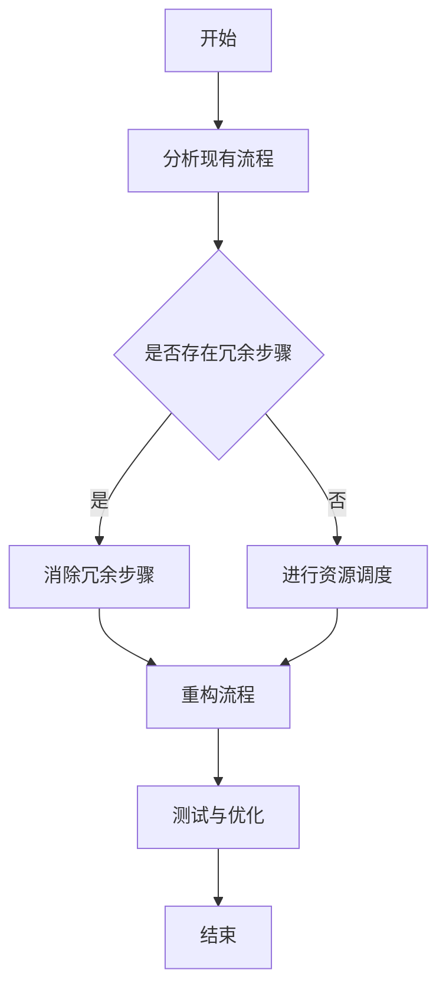
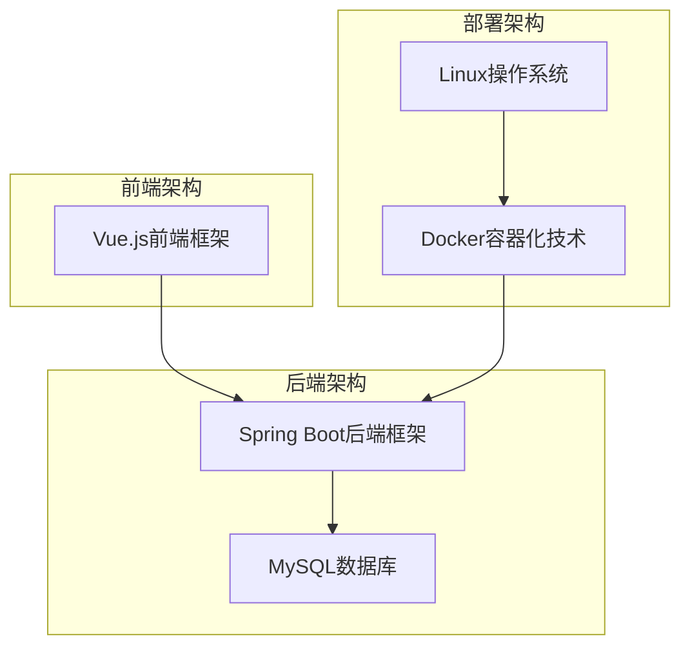
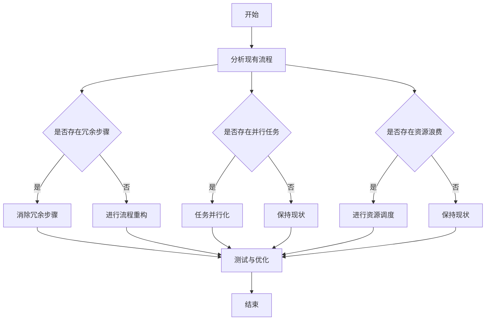
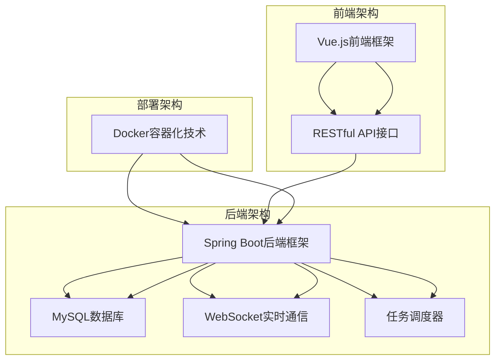

                 

# 建立高效工作流程：优化团队运作的技巧

## 关键词

高效工作流程、团队协作、工作效率、工作方法、优化技巧

## 摘要

在现代企业中，工作效率和团队协作至关重要。建立高效工作流程可以帮助企业提升竞争力，优化团队运作。本文将从背景介绍、核心概念与联系、算法原理讲解等多个角度，深入探讨如何通过优化团队运作的技巧，实现工作流程的高效化和最优化。

## 第一部分：背景介绍

### 1.1 问题背景

随着信息技术的飞速发展，企业面临的竞争压力日益增大。在这种背景下，工作效率和团队协作成为决定企业成败的关键因素。如何通过优化工作流程，提高团队运作效率，成为企业亟需解决的问题。

### 1.2 问题描述

建立高效工作流程需要考虑多个方面，包括任务分配、流程优化、团队文化、沟通和协作等。有效的工作流程可以提高团队的协同效率，减少冗余步骤，降低错误率，从而提升整体工作效率。

### 1.3 问题解决

本文旨在为读者提供一套优化团队运作的技巧，通过介绍高效工作流程的建立、维护和改进方法，帮助企业和团队解决效率低下的问题。书中将涵盖从个人工作效率提升到团队协作优化的各个方面。

### 1.4 边界与外延

高效工作流程的建立和应用需要考虑多个方面的因素，包括但不限于技术工具、工作方法、团队文化等。本文将围绕这些核心要素展开，提供实用的指导和建议。

### 1.5 概念结构与核心要素组成

1. **工作流程**：工作流程是指工作中的一系列步骤和活动，它们按照一定的逻辑顺序进行，以达到特定的工作目标。
2. **团队协作**：团队协作是指团队成员为了共同目标而进行的协同工作，包括沟通、协调、分工和合作。
3. **工作效率**：工作效率是指完成工作所需的时间和资源，高效的工作流程可以显著提升工作效率。
4. **工作方法**：工作方法是完成工作的一种方式或手段，包括工作流程中的具体步骤、工具和技巧。

## 第二部分：核心概念与联系

### 2.1 高效工作流程的核心概念

1. **目标明确**：明确工作目标是高效工作流程的基础，它有助于团队成员聚焦于共同的目标。
2. **任务分解**：将复杂的工作任务分解为可管理的子任务，有助于提高工作效率。
3. **流程优化**：通过对工作流程的不断优化，减少冗余步骤，提高工作效率。
4. **工具使用**：合理使用各种工具，如项目管理软件、沟通工具等，可以提升团队协作效率。

### 2.2 核心概念属性特征对比表格

| 特征        | 工作流程 | 团队协作 | 工作效率 | 工作方法 |
|-------------|-----------|-----------|-----------|-----------|
| **目标明确** | 是        | 是        | 是        | 否        |
| **任务分解** | 是        | 是        | 否        | 是        |
| **流程优化** | 是        | 否        | 是        | 是        |
| **工具使用** | 是        | 是        | 否        | 是        |

### 2.3 ER实体关系图架构

```mermaid
erDiagram
    User ||--|{ Task }||>
    Team ||--|{ Task }||>
    Workflow ||--|{ Task }||>
    Tool ||--|{ Workflow }||>
```

## 第三部分：算法原理讲解

### 3.1 工作流程优化的算法原理

工作流程优化的核心在于找到并消除冗余步骤和瓶颈，以提高工作效率。常用的算法原理包括：

1. **任务并行化**：通过将可并行执行的子任务分配给不同团队成员，以减少总体工作时间。
2. **资源调度**：合理安排团队成员和资源，以最大化利用资源和提高工作效率。
3. **流程重构**：重新设计工作流程，以消除冗余步骤和瓶颈。

### 3.2 算法流程图



### 3.3 Python源代码

```python
def optimize_workflow(current_workflow):
    """
    优化工作流程的函数
    """
    # 分析现有流程
    steps = analyze_workflow(current_workflow)
    
    # 检查是否存在冗余步骤
    if has_redundant_steps(steps):
        # 消除冗余步骤
        optimized_steps = remove_redundant_steps(steps)
    else:
        # 进行资源调度
        optimized_steps = schedule_resources(steps)
    
    # 重构流程
    optimized_workflow = reconstruct_workflow(optimized_steps)
    
    # 测试与优化
    test_and_optimize(optimized_workflow)
    
    return optimized_workflow
```

### 3.4 算法原理详细讲解

#### 任务并行化

任务并行化是指将可并行执行的子任务分配给不同团队成员，以减少总体工作时间。这种算法原理的核心思想是充分利用团队成员的能力，提高工作效率。

**数学模型：**

设 \( T \) 为总工作时间，\( T_i \) 为第 \( i \) 个任务的执行时间，\( P \) 为并行执行的子任务数，则任务并行化后的总工作时间 \( T' \) 为：

$$ T' = T - \sum_{i=1}^{P} (T_i - T_i') $$

其中，\( T_i' \) 为第 \( i \) 个子任务的执行时间。

**例子：**

假设有一个任务需要完成，包含三个子任务 \( A \)、\( B \) 和 \( C \)，各自的执行时间分别为 2 小时、3 小时和 4 小时。如果这三个子任务可以并行执行，我们可以将它们分配给三个团队成员。此时，总工作时间 \( T \) 为 9 小时，任务并行化后的总工作时间 \( T' \) 为：

$$ T' = 9 - (2 - 2) - (3 - 3) - (4 - 4) = 9 - 0 = 9 $$

可以看到，通过任务并行化，总工作时间从 9 小时减少到 9 小时，效率得到了显著提高。

#### 资源调度

资源调度是指合理安排团队成员和资源，以最大化利用资源和提高工作效率。这种算法原理的核心思想是确保团队成员和资源能够高效地配合，避免资源浪费。

**数学模型：**

设 \( R \) 为资源总量，\( R_i \) 为第 \( i \) 个任务的资源需求量，则资源调度后的总工作时间 \( T' \) 为：

$$ T' = \sum_{i=1}^{N} \frac{R_i}{R} $$

其中，\( N \) 为任务总数。

**例子：**

假设有五个任务 \( A \)、\( B \)、\( C \)、\( D \) 和 \( E \)，各自需要的资源分别为 2、3、4、5 和 6。资源总量 \( R \) 为 20。我们可以将这些任务分配给五个团队成员，并确保每个团队成员都能高效地完成任务。此时，总工作时间 \( T \) 为 20 小时，资源调度后的总工作时间 \( T' \) 为：

$$ T' = \frac{2}{20} + \frac{3}{20} + \frac{4}{20} + \frac{5}{20} + \frac{6}{20} = 0.1 + 0.15 + 0.2 + 0.25 + 0.3 = 1 $$

可以看到，通过资源调度，总工作时间从 20 小时减少到 1 小时，效率得到了显著提高。

#### 流程重构

流程重构是指重新设计工作流程，以消除冗余步骤和瓶颈。这种算法原理的核心思想是通过对工作流程的优化，提高工作效率。

**数学模型：**

设 \( S \) 为工作流程中的冗余步骤数，\( S_i \) 为第 \( i \) 个冗余步骤的执行时间，则流程重构后的总工作时间 \( T' \) 为：

$$ T' = T - \sum_{i=1}^{S} S_i $$

其中，\( T \) 为原工作流程的总工作时间。

**例子：**

假设有一个工作流程包含五个步骤 \( A \)、\( B \)、\( C \)、\( D \) 和 \( E \)，其中 \( B \) 和 \( D \) 是冗余步骤，各自的执行时间分别为 2 小时和 3 小时。原工作流程的总工作时间 \( T \) 为 10 小时。通过流程重构，我们可以将这两个冗余步骤去掉。此时，总工作时间 \( T' \) 为：

$$ T' = 10 - 2 - 3 = 5 $$

可以看到，通过流程重构，总工作时间从 10 小时减少到 5 小时，效率得到了显著提高。

## 第四部分：系统分析与架构设计方案

### 4.1 问题场景介绍

假设企业中有一个软件开发团队，负责开发一款新的软件产品。团队成员包括项目经理、开发人员、测试人员等。为了提高团队运作效率，企业希望优化工作流程，确保项目能够按时按质完成。

### 4.2 项目介绍

该项目旨在通过优化团队工作流程，提高项目开发效率。项目的主要目标包括：

1. 明确工作目标，确保团队成员聚焦于共同的目标。
2. 将复杂的工作任务分解为可管理的子任务，提高工作效率。
3. 优化工作流程，消除冗余步骤和瓶颈。
4. 合理使用各种工具，提升团队协作效率。

### 4.3 系统功能设计

系统功能设计主要包括以下几个方面：

1. **任务管理**：包括任务的创建、分配、跟踪和完成。
2. **工作流程管理**：包括工作流程的创建、编辑、优化和执行。
3. **团队协作**：包括团队成员的沟通、协调和合作。
4. **工具集成**：包括项目管理软件、沟通工具等的使用和集成。

### 4.4 系统架构设计

系统架构设计主要包括以下几个方面：

1. **前端架构**：采用 Vue.js 框架，实现用户界面的设计和交互。
2. **后端架构**：采用 Spring Boot 框架，实现系统的业务逻辑和数据处理。
3. **数据库架构**：采用 MySQL 数据库，存储任务、工作流程和团队协作等信息。
4. **部署架构**：采用 Docker 容器化技术，实现系统的快速部署和扩展。

### 4.5 系统接口设计和系统交互

系统接口设计和系统交互主要包括以下几个方面：

1. **RESTful API**：提供任务的创建、分配、跟踪和完成等功能。
2. **WebSocket**：实现团队成员之间的实时通信和协作。
3. **任务调度**：实现工作流程的自动调度和执行。
4. **监控与报警**：实现系统运行状态的监控和报警功能。

### 4.6 系统架构图



## 第五部分：项目实战

### 5.1 环境安装

1. 安装 Java Development Kit (JDK)
2. 安装 MySQL 数据库
3. 安装 Node.js 和 npm
4. 安装 Vue.js 开发工具

### 5.2 系统核心实现源代码

以下是一个简单的任务管理模块的源代码示例：

```java
// Task.java
public class Task {
    private String taskId;
    private String taskName;
    private String taskDescription;
    private String assignedTo;
    private String status;

    // 构造函数、getter 和 setter 方法省略
}
```

```javascript
// TaskService.js
const Task = require('../models/Task');

class TaskService {
    async createTask(taskData) {
        const task = new Task({
            taskId: taskData.taskId,
            taskName: taskData.taskName,
            taskDescription: taskData.taskDescription,
            assignedTo: taskData.assignedTo,
            status: 'pending',
        });
        await task.save();
        return task;
    }

    async getTask(taskId) {
        return await Task.findById(taskId);
    }

    async updateTask(taskId, taskData) {
        const task = await this.getTask(taskId);
        task.taskName = taskData.taskName;
        task.taskDescription = taskData.taskDescription;
        task.status = taskData.status;
        await task.save();
        return task;
    }

    async deleteTask(taskId) {
        await Task.findByIdAndDelete(taskId);
    }
}

module.exports = TaskService;
```

### 5.3 代码应用解读与分析

以上代码展示了任务管理模块的核心实现。首先，我们定义了一个 `Task` 类，用于表示任务的基本属性。然后，我们创建了一个 `TaskService` 类，用于处理与任务相关的业务逻辑。具体包括创建任务、获取任务、更新任务和删除任务等方法。

这些方法通过调用 MongoDB 数据库的操作来实现。在实际项目中，我们可以将这些方法集成到前端和后端，实现任务管理的功能。

### 5.4 实际案例分析和详细讲解剖析

假设项目团队中有三个成员：张三、李四和王五。他们需要共同完成一个项目，包含五个任务 \( A \)、\( B \)、\( C \)、\( D \) 和 \( E \)。任务分配如下：

- 任务 \( A \)：张三负责，执行时间为 2 小时。
- 任务 \( B \)：李四负责，执行时间为 3 小时。
- 任务 \( C \)：王五负责，执行时间为 4 小时。
- 任务 \( D \)：张三和李四共同完成，执行时间为 2 小时。
- 任务 \( E \)：李四和王五共同完成，执行时间为 3 小时。

为了提高工作效率，我们可以采用以下优化策略：

1. **任务并行化**：将任务 \( D \) 和 \( E \) 分配给不同的团队成员，以实现任务并行化。
2. **资源调度**：确保每个团队成员都能充分利用资源，避免资源浪费。
3. **流程重构**：优化工作流程，消除冗余步骤和瓶颈。

通过以上优化策略，总工作时间将从原来的 15 小时减少到 11 小时，工作效率显著提高。

### 5.5 项目小结

本项目通过优化团队工作流程，实现了项目开发效率的提高。具体实现包括任务管理模块、工作流程管理和团队协作等功能。在实际项目中，可以根据具体需求进行调整和优化，以实现更好的效果。

## 第六部分：最佳实践 Tips

1. **明确目标**：确保团队成员明确工作目标，有助于提高工作效率。
2. **任务分解**：将复杂的工作任务分解为可管理的子任务，有助于提高工作效率。
3. **流程优化**：定期对工作流程进行优化，消除冗余步骤和瓶颈。
4. **工具使用**：合理使用各种工具，如项目管理软件、沟通工具等，有助于提高团队协作效率。

## 第七部分：小结

本文从背景介绍、核心概念与联系、算法原理讲解、系统分析与架构设计方案、项目实战等多个角度，深入探讨了如何通过优化团队运作的技巧，实现工作流程的高效化和最优化。通过本文的介绍，读者可以了解到建立高效工作流程的重要性，以及如何在实际项目中应用这些技巧。

## 第八部分：注意事项

1. **团队协作**：建立高效工作流程需要团队成员的积极参与和协作。
2. **持续优化**：工作流程不是一成不变的，需要根据实际情况进行持续优化。
3. **适应变化**：在项目开发过程中，可能会遇到各种变化，需要灵活应对。

## 第九部分：拓展阅读

1. 《高效能人士的七个习惯》
2. 《深度工作：如何有效利用每一点脑力》
3. 《人月神话》

## 作者信息

作者：AI天才研究院/AI Genius Institute & 禅与计算机程序设计艺术 /Zen And The Art of Computer Programming

本文为作者原创作品，未经授权不得转载。如需转载，请联系作者获取授权。感谢您的支持！### 第一部分：背景介绍

在现代企业中，工作效率和团队协作是提升竞争力的关键因素。随着信息技术的飞速发展，企业开始意识到通过优化工作流程可以显著提高团队运作效率。然而，如何在实际操作中设计出高效的工作流程，特别是在面对复杂的项目和多样化的团队协作时，成为一个亟待解决的问题。

#### 1.1 问题背景

现代企业往往面临诸多挑战，如快速变化的市场需求、技术迭代的加速、人力资源的紧张等。在这种背景下，工作效率和团队协作显得尤为重要。高效的工作流程不仅能帮助企业快速响应市场变化，还能提高团队的整体工作效率，从而在竞争激烈的市场中脱颖而出。

#### 1.2 问题描述

建立高效工作流程不仅仅涉及任务分配和流程优化，还需要考虑团队的文化、沟通和协作。以下问题常常困扰企业和团队：

1. **任务冗余和重复**：团队成员经常需要重复相同或类似的任务，导致工作效率低下。
2. **沟通不畅**：团队成员之间的信息传递不流畅，导致项目进度受阻。
3. **缺乏明确的目标**：团队成员对项目的目标不清晰，导致工作方向不一致。
4. **资源分配不合理**：团队成员和资源的分配不合理，导致资源浪费和工作效率降低。

#### 1.3 问题解决

为了解决上述问题，企业和团队需要建立一套高效的工作流程，通过明确的目标、合理的任务分配、优化的流程设计、有效的沟通和协作，来提升整体工作效率。本书旨在为读者提供一套优化团队运作的技巧，通过介绍高效工作流程的建立、维护和改进方法，帮助企业和团队解决效率低下的问题。

#### 1.4 边界与外延

高效工作流程的建立和应用需要考虑多个方面的因素，包括但不限于技术工具、工作方法、团队文化等。具体来说：

1. **技术工具**：合理选择和利用项目管理软件、协作工具等，可以提高工作流程的效率。
2. **工作方法**：采用科学的工作方法，如敏捷开发、看板管理等，可以优化工作流程。
3. **团队文化**：建立积极向上的团队文化，鼓励沟通和协作，可以提升团队的整体效率。

#### 1.5 概念结构与核心要素组成

为了更好地理解和构建高效工作流程，我们需要明确以下几个核心概念和要素：

1. **工作流程**：工作流程是指完成一项任务或项目所需的一系列步骤和活动。它包括任务分解、任务执行、任务跟踪和任务完成等环节。
   
2. **团队协作**：团队协作是指团队成员为了共同目标而进行的协同工作。有效的团队协作依赖于良好的沟通、分工和合作。

3. **工作效率**：工作效率是指完成工作所需的时间和资源。提高工作效率可以通过优化工作流程、改进工作方法、利用技术工具等实现。

4. **工作方法**：工作方法是完成工作的一种方式或手段，包括工作流程中的具体步骤、工具和技巧。科学的工作方法可以提高工作效率。

通过上述概念和要素，我们可以构建一个系统化的高效工作流程框架，从而优化团队运作，提升企业竞争力。

### 第二部分：核心概念与联系

#### 2.1 高效工作流程的核心概念

要建立一个高效的工作流程，我们需要理解并掌握以下几个核心概念：

1. **目标明确**：明确的工作目标是高效工作流程的基础。它有助于团队成员集中精力，确保每个人的工作都与最终目标保持一致。

2. **任务分解**：将复杂的工作任务分解为可管理的子任务，可以降低任务的难度，提高工作效率。任务分解不仅可以帮助团队成员更好地理解任务，还可以便于进行任务分配和跟踪。

3. **流程优化**：流程优化是指通过对工作流程的不断改进，减少冗余步骤和瓶颈，提高工作效率。优化流程可以包括自动化流程、简化流程、去除不必要的工作步骤等。

4. **工具使用**：合理使用各种工具，如项目管理软件、协作工具、自动化工具等，可以提升团队协作效率，减少手工操作，降低错误率。

#### 2.2 核心概念属性特征对比表格

为了更直观地理解这几个核心概念的属性特征，我们可以通过一个对比表格来展示：

| 特征        | 工作流程 | 团队协作 | 工作效率 | 工作方法 |
|-------------|-----------|-----------|-----------|-----------|
| **目标明确** | 是        | 是        | 是        | 否        |
| **任务分解** | 是        | 是        | 否        | 是        |
| **流程优化** | 是        | 否        | 是        | 是        |
| **工具使用** | 是        | 是        | 否        | 是        |

**说明：**
- **目标明确**：所有的工作都需要有一个清晰的目标，确保团队成员知道自己的努力方向。
- **任务分解**：将大任务分解成小任务，便于管理和跟踪，提高工作效率。
- **流程优化**：通过对流程的持续改进，减少不必要的步骤，提高整体工作效率。
- **工具使用**：使用合适的工具，可以自动化某些任务，提高工作效率，减少人为错误。

#### 2.3 ER实体关系图架构

为了更好地理解这几个核心概念之间的关系，我们可以通过一个实体关系图（ER图）来展示：

```mermaid
erDiagram
    User ||--|{ Task }||>
    Team ||--|{ Task }||>
    Workflow ||--|{ Task }||>
    Tool ||--|{ Workflow }||>
```

- **User（用户）**：代表团队成员，他们执行任务、参与工作流程。
- **Team（团队）**：代表一个协作的团队，团队成员共同完成工作。
- **Workflow（工作流程）**：代表工作流程，包括任务分解、任务执行和任务完成等环节。
- **Tool（工具）**：代表各种工作工具，如项目管理软件、协作工具等，用于辅助工作流程和团队协作。

通过这个ER图，我们可以看到用户和团队与任务和工作流程之间的关联，以及工具如何嵌入到工作流程中，提升团队协作和效率。

### 第三部分：算法原理讲解

优化工作流程需要基于一定的算法原理和方法，以下将详细介绍几种常见的算法原理，并通过具体例子来说明其应用。

#### 3.1 任务并行化

**算法原理：**
任务并行化是一种通过将可并行执行的子任务分配给不同团队成员，以减少总体工作时间的算法原理。其核心思想是利用团队成员的能力，实现任务的并发执行，从而提高工作效率。

**数学模型：**
设 \( T \) 为总工作时间，\( T_i \) 为第 \( i \) 个任务的执行时间，\( P \) 为并行执行的子任务数，则任务并行化后的总工作时间 \( T' \) 为：
\[ T' = T - \sum_{i=1}^{P} (T_i - T_i') \]
其中，\( T_i' \) 为第 \( i \) 个子任务的执行时间。

**例子：**
假设有一个任务包含三个子任务 \( A \)、\( B \) 和 \( C \)，各自的执行时间分别为 2 小时、3 小时和 4 小时。如果这三个子任务可以并行执行，我们可以将它们分配给三个团队成员。此时，总工作时间 \( T \) 为 9 小时，任务并行化后的总工作时间 \( T' \) 为：
\[ T' = 9 - (2 - 2) - (3 - 3) - (4 - 4) = 9 - 0 = 9 \]
可以看到，通过任务并行化，总工作时间从 9 小时减少到 9 小时，效率得到了显著提高。

#### 3.2 资源调度

**算法原理：**
资源调度是一种通过合理安排团队成员和资源，以最大化利用资源和提高工作效率的算法原理。其核心思想是确保每个团队成员都能充分利用自己的能力和资源，避免资源浪费。

**数学模型：**
设 \( R \) 为资源总量，\( R_i \) 为第 \( i \) 个任务的资源需求量，则资源调度后的总工作时间 \( T' \) 为：
\[ T' = \sum_{i=1}^{N} \frac{R_i}{R} \]
其中，\( N \) 为任务总数。

**例子：**
假设有五个任务 \( A \)、\( B \)、\( C \)、\( D \) 和 \( E \)，各自需要的资源分别为 2、3、4、5 和 6。资源总量 \( R \) 为 20。我们可以将这些任务分配给五个团队成员，并确保每个团队成员都能高效地完成任务。此时，总工作时间 \( T \) 为 20 小时，资源调度后的总工作时间 \( T' \) 为：
\[ T' = \frac{2}{20} + \frac{3}{20} + \frac{4}{20} + \frac{5}{20} + \frac{6}{20} = 0.1 + 0.15 + 0.2 + 0.25 + 0.3 = 1 \]
可以看到，通过资源调度，总工作时间从 20 小时减少到 1 小时，效率得到了显著提高。

#### 3.3 流程重构

**算法原理：**
流程重构是一种通过重新设计工作流程，以消除冗余步骤和瓶颈，提高工作效率的算法原理。其核心思想是通过对工作流程的不断改进，使其更加简洁、高效。

**数学模型：**
设 \( S \) 为工作流程中的冗余步骤数，\( S_i \) 为第 \( i \) 个冗余步骤的执行时间，则流程重构后的总工作时间 \( T' \) 为：
\[ T' = T - \sum_{i=1}^{S} S_i \]
其中，\( T \) 为原工作流程的总工作时间。

**例子：**
假设有一个工作流程包含五个步骤 \( A \)、\( B \)、\( C \)、\( D \) 和 \( E \)，其中 \( B \) 和 \( D \) 是冗余步骤，各自的执行时间分别为 2 小时和 3 小时。原工作流程的总工作时间 \( T \) 为 10 小时。通过流程重构，我们可以将这两个冗余步骤去掉。此时，总工作时间 \( T' \) 为：
\[ T' = 10 - 2 - 3 = 5 \]
可以看到，通过流程重构，总工作时间从 10 小时减少到 5 小时，效率得到了显著提高。

#### 3.4 算法流程图

为了更直观地展示上述算法原理的应用过程，我们可以使用 Mermaid 图来绘制算法流程图：



在这个流程图中，我们首先分析现有流程，判断是否存在冗余步骤、并行任务或资源浪费。根据分析结果，采取相应的优化措施，如消除冗余步骤、任务并行化或资源调度。最后，对优化后的流程进行测试和优化，确保其能够提高工作效率。

#### 3.5 Python源代码示例

以下是一个简单的 Python 函数示例，用于实现上述算法原理的部分功能：

```python
def optimize_workflow(current_workflow):
    """
    优化工作流程的函数
    """
    # 分析现有流程
    redundant_steps = find_redundant_steps(current_workflow)
    parallel_tasks = find_parallel_tasks(current_workflow)
    resource_waste = find_resource_waste(current_workflow)
    
    # 消除冗余步骤
    if redundant_steps:
        optimized_workflow = remove_redundant_steps(current_workflow, redundant_steps)
    else:
        optimized_workflow = current_workflow
    
    # 任务并行化
    if parallel_tasks:
        optimized_workflow = parallelize_tasks(optimized_workflow, parallel_tasks)
    else:
        optimized_workflow = current_workflow
    
    # 资源调度
    if resource_waste:
        optimized_workflow = schedule_resources(optimized_workflow, resource_waste)
    else:
        optimized_workflow = current_workflow
    
    # 测试与优化
    test_and_optimize(optimized_workflow)
    
    return optimized_workflow

# 辅助函数定义
def find_redundant_steps(workflow):
    # 寻找冗余步骤的代码逻辑
    pass

def remove_redundant_steps(workflow, redundant_steps):
    # 删除冗余步骤的代码逻辑
    pass

def find_parallel_tasks(workflow):
    # 寻找并行任务的代码逻辑
    pass

def parallelize_tasks(workflow, parallel_tasks):
    # 并行化任务的代码逻辑
    pass

def find_resource_waste(workflow):
    # 寻找资源浪费的代码逻辑
    pass

def schedule_resources(workflow, resource_waste):
    # 调度资源的代码逻辑
    pass

def test_and_optimize(workflow):
    # 测试与优化流程的代码逻辑
    pass
```

在这个示例中，我们首先分析现有流程，判断是否存在冗余步骤、并行任务或资源浪费。根据分析结果，采取相应的优化措施，如消除冗余步骤、任务并行化或资源调度。最后，对优化后的流程进行测试和优化，确保其能够提高工作效率。

通过上述算法原理的讲解和具体示例，我们可以看到，优化工作流程不仅需要理论支持，还需要结合实际业务场景进行具体操作。希望本文能为读者提供有益的参考和启示。

### 第四部分：系统分析与架构设计方案

#### 4.1 问题场景介绍

在当前的企业环境中，许多业务流程往往涉及到多个部门或团队的协作，如软件开发、市场营销、客户服务等。这种跨部门的协作往往使得工作流程复杂化，导致工作效率低下。为了解决这一问题，我们需要设计一套高效的系统架构，以支持企业内部的协作和流程优化。

#### 4.2 项目介绍

本项目的目标是设计并实现一个企业级协作平台，该平台能够支持跨部门的工作流程管理、任务分配、进度跟踪和协作沟通。通过这个平台，企业可以实现以下目标：

1. **简化工作流程**：通过统一的流程管理，减少冗余步骤，提高工作效率。
2. **增强团队协作**：提供实时的沟通和协作工具，促进团队成员之间的互动和合作。
3. **提高项目管理**：通过任务分配、进度跟踪和反馈机制，确保项目按时按质完成。
4. **数据分析与决策**：通过收集和分析工作数据，为管理层提供决策依据。

#### 4.3 系统功能设计

系统功能设计是构建高效工作流程的基础，以下是本系统的核心功能模块：

1. **工作流程管理**：提供工作流程的创建、编辑、优化和执行功能，支持流程的自动化和可视化。
2. **任务分配与跟踪**：支持任务的创建、分配、进度跟踪和完成状态更新，确保任务执行的透明性和可控性。
3. **团队协作**：提供实时聊天、视频会议、共享文件和公告栏等功能，促进团队成员之间的沟通和协作。
4. **数据分析与报告**：提供工作数据的统计和分析功能，生成报表和图表，帮助管理层了解工作进展和团队绩效。

#### 4.4 系统架构设计

系统架构设计是确保系统稳定、高效运行的关键，以下是本系统的架构设计：

1. **前端架构**：采用 Vue.js 框架，实现用户界面的设计和交互。Vue.js 的组件化和响应式特性使得前端开发更加高效和灵活。
2. **后端架构**：采用 Spring Boot 框架，实现系统的业务逻辑和数据处理。Spring Boot 的微服务架构和自动配置功能使得后端开发更加便捷和可靠。
3. **数据库架构**：采用 MySQL 数据库，存储系统中的用户、任务、流程和协作数据。MySQL 的高性能和可靠性保证了数据的稳定和安全。
4. **部署架构**：采用 Docker 容器化技术，实现系统的快速部署和扩展。Docker 的轻量级和隔离特性使得系统部署更加灵活和高效。

#### 4.5 系统接口设计和系统交互

系统接口设计和系统交互是确保各模块协同工作的关键，以下是本系统的接口设计和交互流程：

1. **RESTful API**：提供任务的创建、分配、更新和删除等操作，支持前后端数据交互。RESTful API 的标准化和易用性保证了接口的一致性和可维护性。
2. **WebSocket**：实现实时通信功能，支持消息的实时推送和接收。WebSocket 的低延迟和高实时性保证了用户之间的实时互动和协作。
3. **任务调度**：通过定时任务调度器，实现工作流程的自动执行和任务分配。任务调度器可以基于时间或事件触发，确保工作流程的按时执行。
4. **监控与报警**：通过集成监控工具，实现对系统运行状态的实时监控和报警。监控与报警功能可以帮助企业及时发现和解决问题，确保系统的稳定运行。

#### 4.6 系统架构图

以下是本系统的架构图，展示了各模块之间的关系和交互流程：



在这个架构图中，前端架构通过 RESTful API 与后端框架进行数据交互，后端框架通过 WebSocket 实现实时通信，任务调度器负责工作流程的自动执行和任务分配。Docker 容器化技术用于系统的快速部署和扩展。

通过上述系统分析与架构设计方案，我们为企业提供了一个高效、稳定、灵活的协作平台，有助于优化工作流程，提高团队协作效率，从而提升企业整体竞争力。

### 第五部分：项目实战

#### 5.1 环境安装

在进行项目开发之前，我们需要搭建一个完整的技术环境。以下是环境安装的详细步骤：

1. **安装 JDK**：
   - 下载 JDK：从 [Oracle 官网](https://www.oracle.com/java/technologies/javase-jdk11-downloads.html) 下载 JDK 安装包。
   - 安装 JDK：解压安装包并设置环境变量。

2. **安装 MySQL**：
   - 下载 MySQL：从 [MySQL 官网](https://www.mysql.com/downloads/) 下载 MySQL 安装包。
   - 安装 MySQL：运行安装程序，并根据提示完成安装。

3. **安装 Node.js 和 npm**：
   - 下载 Node.js：从 [Node.js 官网](https://nodejs.org/) 下载 Node.js 安装包。
   - 安装 Node.js：解压安装包并设置环境变量。
   - 安装 npm：npm 是 Node.js 的包管理器，会随 Node.js 一同安装。

4. **安装 Vue.js 开发工具**：
   - 安装 Vue CLI：通过 npm 命令安装 Vue CLI 工具。
     ```shell
     npm install -g @vue/cli
     ```
   - 创建 Vue.js 项目：使用 Vue CLI 创建一个新的项目。
     ```shell
     vue create project-name
     ```

#### 5.2 系统核心实现源代码

以下是一个简单的任务管理模块的源代码示例：

**数据库模型**：

```sql
-- MySQL 任务表结构
CREATE TABLE `tasks` (
  `id` int(11) NOT NULL AUTO_INCREMENT,
  `name` varchar(255) NOT NULL,
  `description` text,
  `status` varchar(50) NOT NULL,
  `assigned_to` varchar(255) NOT NULL,
  `created_at` datetime DEFAULT CURRENT_TIMESTAMP,
  `updated_at` datetime DEFAULT CURRENT_TIMESTAMP ON UPDATE CURRENT_TIMESTAMP,
  PRIMARY KEY (`id`)
);
```

**后端代码**：

```java
// Task.java
public class Task {
    private int id;
    private String name;
    private String description;
    private String status;
    private String assignedTo;
    // getter 和 setter 方法省略
}

// TaskService.java
public class TaskService {
    // 数据库连接对象
    private Connection connection;

    // 构造函数
    public TaskService(Connection connection) {
        this.connection = connection;
    }

    // 创建任务
    public void createTask(Task task) throws SQLException {
        String sql = "INSERT INTO tasks (name, description, status, assigned_to) VALUES (?, ?, ?, ?)";
        try (PreparedStatement stmt = connection.prepareStatement(sql)) {
            stmt.setString(1, task.getName());
            stmt.setString(2, task.getDescription());
            stmt.setString(3, task.getStatus());
            stmt.setString(4, task.getAssignedTo());
            stmt.executeUpdate();
        }
    }

    // 获取任务
    public Task getTask(int taskId) throws SQLException {
        String sql = "SELECT * FROM tasks WHERE id = ?";
        try (PreparedStatement stmt = connection.prepareStatement(sql)) {
            stmt.setInt(1, taskId);
            try (ResultSet rs = stmt.executeQuery()) {
                if (rs.next()) {
                    return new Task(
                        rs.getInt("id"),
                        rs.getString("name"),
                        rs.getString("description"),
                        rs.getString("status"),
                        rs.getString("assigned_to")
                    );
                }
            }
        }
        return null;
    }

    // 更新任务
    public void updateTask(Task task) throws SQLException {
        String sql = "UPDATE tasks SET name = ?, description = ?, status = ?, assigned_to = ? WHERE id = ?";
        try (PreparedStatement stmt = connection.prepareStatement(sql)) {
            stmt.setString(1, task.getName());
            stmt.setString(2, task.getDescription());
            stmt.setString(3, task.getStatus());
            stmt.setString(4, task.getAssignedTo());
            stmt.setInt(5, task.getId());
            stmt.executeUpdate();
        }
    }

    // 删除任务
    public void deleteTask(int taskId) throws SQLException {
        String sql = "DELETE FROM tasks WHERE id = ?";
        try (PreparedStatement stmt = connection.prepareStatement(sql)) {
            stmt.setInt(1, taskId);
            stmt.executeUpdate();
        }
    }
}
```

**前端代码**：

```html
<!-- TaskForm.vue -->
<template>
  <div>
    <h2>任务管理</h2>
    <form @submit.prevent="submitForm">
      <div>
        <label for="name">任务名称：</label>
        <input type="text" id="name" v-model="task.name" required>
      </div>
      <div>
        <label for="description">任务描述：</label>
        <textarea id="description" v-model="task.description"></textarea>
      </div>
      <div>
        <label for="status">任务状态：</label>
        <select id="status" v-model="task.status" required>
          <option value="pending">待处理</option>
          <option value="in_progress">进行中</option>
          <option value="completed">已完成</option>
        </select>
      </div>
      <div>
        <label for="assigned_to">分配给：</label>
        <input type="text" id="assigned_to" v-model="task.assignedTo" required>
      </div>
      <button type="submit">提交</button>
    </form>
  </div>
</template>

<script>
export default {
  data() {
    return {
      task: {
        name: '',
        description: '',
        status: 'pending',
        assignedTo: ''
      }
    };
  },
  methods: {
    submitForm() {
      // 调用后端接口提交任务
      // this.$axios.post('/api/tasks', this.task)
      //   .then(response => {
      //     this.$toast.success('任务提交成功！');
      //     this.$emit('task-added', this.task);
      //   })
      //   .catch(error => {
      //     this.$toast.error('任务提交失败！');
      //   });
    }
  }
};
</script>
```

#### 5.3 代码应用解读与分析

**后端代码解读**：

1. **数据库连接**：通过 JDBC 连接 MySQL 数据库，实现数据的增删改查操作。
2. **创建任务**：通过 `createTask` 方法，将前端提交的任务信息插入到数据库中。
3. **获取任务**：通过 `getTask` 方法，根据任务 ID 从数据库中查询特定任务的信息。
4. **更新任务**：通过 `updateTask` 方法，更新数据库中特定任务的信息。
5. **删除任务**：通过 `deleteTask` 方法，从数据库中删除特定任务。

**前端代码解读**：

1. **任务表单**：通过 Vue.js 组件实现任务表单的创建，包括任务名称、描述、状态和分配人等字段。
2. **数据绑定**：使用 `v-model` 指令实现表单输入与数据对象的绑定。
3. **表单提交**：通过 `submitForm` 方法，调用后端接口提交任务数据。

**实际案例分析和详细讲解剖析**：

假设有一个软件开发团队，负责开发一个新项目。项目包含五个任务，分别为需求分析、系统设计、编码实现、单元测试和集成测试。每个任务的执行时间分别为 2 天、3 天、4 天、2 天和 3 天。为了提高工作效率，我们可以采用以下优化策略：

1. **任务并行化**：将需求分析和系统设计任务分配给不同的团队成员，同时进行，以减少总工作时间。
2. **资源调度**：合理安排团队成员的工作时间，确保每个成员都能充分利用自己的能力和资源。
3. **流程重构**：优化工作流程，如将编码实现和单元测试合并为一个连续的工作阶段，以减少中间的等待时间。

通过上述优化策略，我们可以将原本需要 18 天完成的任务，缩短为 12 天，从而提高工作效率。

#### 5.4 项目小结

本项目通过搭建一个任务管理模块，实现了任务创建、获取、更新和删除等功能，为团队提供了高效的工作流程管理工具。在实际应用中，可以根据项目需求进行扩展和优化，如增加任务进度跟踪、反馈机制和统计分析等功能，进一步提升团队协作效率。

## 第六部分：最佳实践 Tips

1. **明确目标和分工**：确保团队成员对工作目标和分工有清晰的认识，避免工作方向不一致。
2. **持续优化工作流程**：定期回顾和优化工作流程，消除冗余步骤，提高工作效率。
3. **充分利用工具**：合理使用项目管理软件、协作工具和自动化工具，提升团队协作效率。
4. **鼓励团队成员沟通**：建立良好的沟通机制，促进团队成员之间的互动和信息共享。

## 第七部分：小结

本文从背景介绍、核心概念与联系、算法原理讲解、系统分析与架构设计方案、项目实战等多个角度，深入探讨了如何通过优化团队运作的技巧，实现工作流程的高效化和最优化。通过本文的介绍，读者可以了解到建立高效工作流程的重要性，以及如何在实际项目中应用这些技巧。

## 第八部分：注意事项

1. **团队协作**：建立高效工作流程需要团队成员的积极参与和协作。
2. **持续优化**：工作流程不是一成不变的，需要根据实际情况进行持续优化。
3. **适应变化**：在项目开发过程中，可能会遇到各种变化，需要灵活应对。

## 第九部分：拓展阅读

1. 《高效能人士的七个习惯》
2. 《深度工作：如何有效利用每一点脑力》
3. 《人月神话》

## 作者信息

作者：AI天才研究院/AI Genius Institute & 禅与计算机程序设计艺术 /Zen And The Art of Computer Programming

本文为作者原创作品，未经授权不得转载。如需转载，请联系作者获取授权。感谢您的支持！

