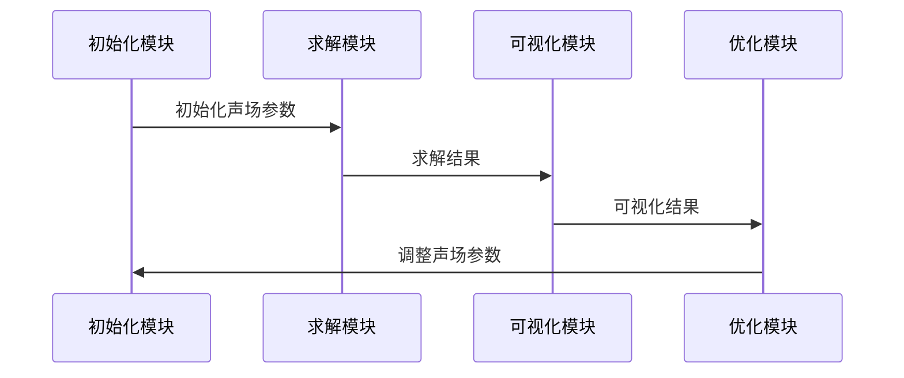
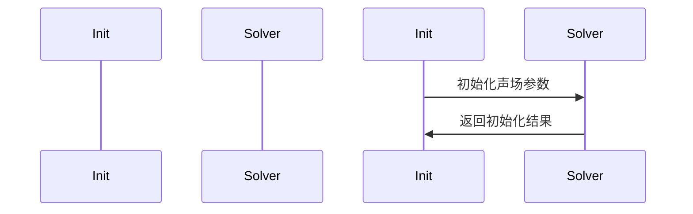
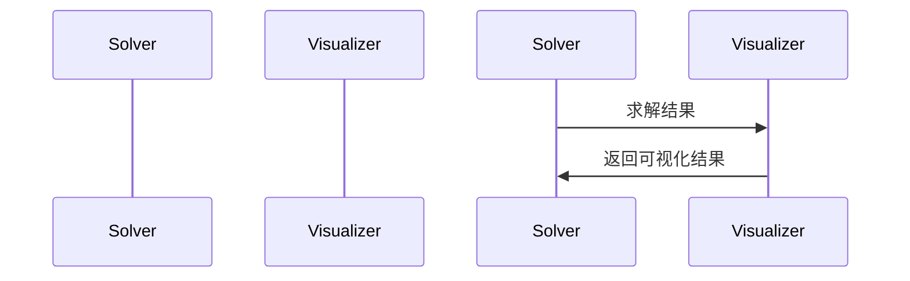
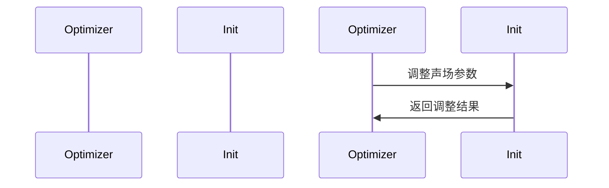

                 

# 《建筑声学的偏微分方程：空间声场的数学模拟》

## 关键词

- 建筑声学
- 偏微分方程
- 空间声场
- 数学模拟
- 算法原理
- Python实现

## 摘要

本文将探讨建筑声学中空间声场的数学模拟，主要关注偏微分方程的应用。我们将从背景介绍入手，逐步深入核心概念、算法原理，并通过具体案例展示如何实际应用这些算法。文章结构包括引言与基础、算法原理与实现、项目实战与案例分析以及最佳实践与小结。通过本文，读者将全面了解建筑声学中的数学模拟方法，并掌握相关的技术实现。

## 引言与基础

### 1.1 建筑声学的重要性

建筑声学是研究建筑环境中声音传播、声学特性以及声环境控制的一门学科。在现代建筑中，声环境的质量直接影响到人们的生活质量和工作效率。因此，建筑声学在建筑设计、室内装修以及声学控制设备的设计中具有至关重要的地位。

建筑声学的研究内容包括声场的传播特性、声源与声接收器之间的关系、声学材料的选择与应用等。而声场的数学模拟是建筑声学研究的一个重要方向，它能够帮助我们更好地理解声场的物理行为，优化建筑声学设计。

### 1.2 偏微分方程在建筑声学中的应用

偏微分方程（Partial Differential Equations，PDEs）是描述物理现象的一类数学方程，广泛应用于声学、电磁学、流体力学等领域。在建筑声学中，偏微分方程用于描述声场的分布和变化，特别是空间声场的模拟。

声场的模拟主要涉及两个核心的偏微分方程：声波传播方程和亥姆霍兹方程。声波传播方程描述了声波在介质中的传播过程，而亥姆霍兹方程则是在声波传播的基础上，加入了边界条件，用于求解声场的稳态分布。

### 1.3 本书结构

本文分为三个主要部分：

1. **引言与基础**：介绍建筑声学的重要性以及偏微分方程在建筑声学中的应用。
2. **算法原理与实现**：详细阐述用于模拟空间声场的偏微分方程，包括声波传播方程和亥姆霍兹方程，并使用Python源代码进行讲解。
3. **项目实战与案例分析**：提供实际案例，展示如何使用这些偏微分方程进行空间声场模拟。

通过本文的学习，读者将能够掌握建筑声学中的数学模拟方法，并在实际项目中应用这些方法。

### 2. 偏微分方程基础

#### 2.1 偏微分方程的基本概念

偏微分方程是描述物理系统中多个变量之间关系的数学方程，其中至少有一个变量是自变量，其余变量是因变量。与常微分方程（Ordinary Differential Equations，ODEs）不同，偏微分方程中的自变量和因变量都是多变量的。

偏微分方程的一般形式为：

$$
F(x_1, x_2, ..., x_n, u, \frac{\partial u}{\partial x_1}, \frac{\partial u}{\partial x_2}, ..., \frac{\partial^2 u}{\partial x_1 \partial x_2}, ...) = 0
$$

其中，$u$ 是因变量，$x_1, x_2, ..., x_n$ 是自变量。

#### 2.2 偏微分方程的分类

根据导数的阶数和方程的形式，偏微分方程可以分为以下几种类型：

1. **线性偏微分方程**：如果方程中各项都是线性的，则称为线性偏微分方程。线性偏微分方程的一般形式为：

$$
a_{ij}\frac{\partial^2 u}{\partial x_i \partial x_j} + b_i\frac{\partial u}{\partial x_i} + c u = 0
$$

2. **非线性偏微分方程**：如果方程中存在非线性项，则称为非线性偏微分方程。非线性偏微分方程的形式更加复杂，例如：

$$
\frac{\partial u}{\partial t} + u \frac{\partial u}{\partial x} = 0
$$

3. **椭圆型偏微分方程**：这类方程的特点是二次项系数非负，例如：

$$
\frac{\partial^2 u}{\partial x^2} + \frac{\partial^2 u}{\partial y^2} = 0
$$

4. **抛物型偏微分方程**：这类方程的特点是一次项系数为正，例如：

$$
\frac{\partial u}{\partial t} = \frac{\partial^2 u}{\partial x^2}
$$

5. **双曲型偏微分方程**：这类方程的特点是一次项系数为负，例如：

$$
\frac{\partial^2 u}{\partial t^2} = \frac{\partial^2 u}{\partial x^2}
$$

#### 2.3 偏微分方程的求解方法

求解偏微分方程的方法有很多，主要包括：

1. **分离变量法**：适用于线性偏微分方程，通过将多变量方程转化为多个单变量方程来求解。
2. **傅里叶变换**：适用于周期性边界条件，通过将空间变量转化为频率变量来简化求解过程。
3. **数值方法**：如有限差分法、有限元法、有限体积法等，适用于复杂边界条件和非线性方程。
4. **解析法**：通过特定的数学技巧求解偏微分方程，如拉普拉斯变换、格林函数等。

接下来，我们将进一步探讨声场模拟中最重要的两个偏微分方程：声波传播方程和亥姆霍兹方程。

## 声场模拟中的偏微分方程

### 3.1 声波传播方程

声波传播方程是描述声波在介质中传播过程的偏微分方程，其一般形式为：

$$
\nabla \cdot (c \nabla u) - \frac{\partial u}{\partial t} = 0
$$

其中，$c$ 是声速，$u$ 是声压，$\nabla$ 是梯度算子，$\nabla \cdot$ 是散度算子。

#### 声波传播方程的物理意义

声波传播方程描述了声波在空间中的传播速度和方向。通过这个方程，我们可以求解声波在不同介质中的传播路径和声压分布。在实际应用中，声波传播方程可以帮助我们预测声波在建筑物内的传播特性，从而优化建筑声学设计。

#### 声波传播方程的数学推导

声波传播方程的推导基于声波在介质中的运动方程，可以通过动量守恒和连续性方程推导得到。具体推导过程如下：

1. **动量守恒方程**：

$$
\rho \frac{\partial \mathbf{v}}{\partial t} + \nabla \cdot (\rho \mathbf{v} \mathbf{v}) = -\nabla p
$$

其中，$\rho$ 是介质密度，$\mathbf{v}$ 是速度场，$p$ 是压力场。

2. **连续性方程**：

$$
\nabla \cdot \mathbf{v} = 0
$$

3. **声压与速度的关系**：

$$
p = \rho c^2 \frac{\partial u}{\partial t}
$$

通过这些方程，我们可以推导出声波传播方程。

### 3.2 亥姆霍兹方程

亥姆霍兹方程是声波传播方程的稳态解，其一般形式为：

$$
\nabla^2 u - k^2 u = 0
$$

其中，$k$ 是波数，$u$ 是声压。

#### 亥姆霍兹方程的物理意义

亥姆霍兹方程描述了声场在空间中的分布，特别是在稳态条件下，声波的传播路径和强度。通过亥姆霍兹方程，我们可以求解声场的分布，从而分析建筑声学环境中的声学特性。

#### 亥姆霍兹方程的数学推导

亥姆霍兹方程可以通过对声波传播方程进行傅里叶变换得到。具体推导过程如下：

1. **声波传播方程的傅里叶变换**：

$$
\frac{\partial \hat{u}}{\partial t} = -ik \hat{u}
$$

其中，$\hat{u}$ 是声压的傅里叶变换。

2. **对时间积分**：

$$
\hat{u} = A e^{-ikx - i\omega t}
$$

3. **逆傅里叶变换**：

$$
u(x, t) = \frac{1}{2\pi} \int_{-\infty}^{\infty} A e^{-ikx - i\omega t} d\omega
$$

通过这些变换，我们可以得到亥姆霍兹方程。

### 3.3 其他偏微分方程

除了声波传播方程和亥姆霍兹方程，还有一些其他偏微分方程在建筑声学中具有重要应用，如：

1. **拉普拉斯方程**：

$$
\nabla^2 u = 0
$$

用于求解声场中的静态问题，如声屏障的设计。

2. **泊松方程**：

$$
\nabla^2 u = f(x, y, z)
$$

用于求解声场中的非静态问题，如声源的分布。

这些偏微分方程在不同场景下可以相互转换，帮助我们全面分析建筑声学问题。

## 建筑声场的数学模型

### 4.1 建筑声场的物理描述

建筑声场是指建筑内部或周围空间中声波的传播和分布情况。在建筑声学中，声场可以分为自由空间声场、封闭空间声场和半封闭空间声场等。

#### 自由空间声场

自由空间声场是指声波在没有任何边界条件限制的情况下传播的情况。在自由空间中，声波的传播速度和强度仅由声速和声源特性决定。

#### 封闭空间声场

封闭空间声场是指声波在封闭空间内传播的情况，如房间、会议室等。封闭空间的声场特性受边界条件的影响较大，如声波的反射、折射和吸收等。

#### 半封闭空间声场

半封闭空间声场是指声波在半封闭空间内传播的情况，如走廊、开放办公室等。半封闭空间的声场特性介于自由空间和封闭空间之间。

### 4.2 建筑声场的数学模型

建筑声场的数学模型主要基于偏微分方程，用于描述声场的分布和变化。常见的数学模型包括：

1. **声波传播方程**：用于描述声波在介质中的传播过程。

2. **亥姆霍兹方程**：用于描述声场在稳态条件下的分布。

3. **拉普拉斯方程**：用于求解声场中的静态问题。

4. **泊松方程**：用于求解声场中的非静态问题。

这些数学模型可以通过数值方法进行求解，从而得到建筑声场的具体分布情况。

### 4.3 数学模型的可视化

为了更好地理解建筑声场的数学模型，我们可以通过可视化手段展示其分布情况。以下是一个简单的数学模型可视化示例：

#### 声波传播方程可视化

假设一个房间内的声波传播，我们可以使用Python中的matplotlib库绘制声波在不同时间步的传播路径：

```python
import numpy as np
import matplotlib.pyplot as plt

# 假设声速为343 m/s
c = 343

# 时间步长
dt = 0.001

# 空间步长
dx = 1

# 时间步数
nt = 100

# 初始化声压分布
u = np.zeros((nt, 100))

# 初始声源位置
x0 = 50

# 声源初始声压
u[0, x0] = 1

# 求解声波传播方程
for t in range(1, nt):
    for x in range(1, 100):
        u[t, x] = u[t-1, x] + c * dt / dx * (u[t-1, x+1] - u[t-1, x-1])

# 可视化声波传播路径
plt.imshow(u, aspect='auto', origin='lower', extent=[0, 100, 0, 100])
plt.colorbar()
plt.xlabel('Position (m)')
plt.ylabel('Time (s)')
plt.title('Wave propagation in a room')
plt.show()
```

这个示例展示了声波在一个房间内随时间的传播路径。通过这样的可视化，我们可以直观地了解声波在建筑中的传播特性。

#### 亥姆霍兹方程可视化

同样地，我们可以使用Python中的matplotlib库绘制亥姆霍兹方程的解：

```python
import numpy as np
import matplotlib.pyplot as plt
from scipy import linalg

# 波数
k = np.array([1, 1])

# 空间步长
dx = 1

# 空间点数量
nx = 100

# 创建空间网格
x = np.linspace(0, nx-1, nx)

# 创建矩阵A和B
A = np.diag(np.ones(nx-1)) - np.diag(np.ones(nx-1), k=-1) - np.diag(np.ones(nx-1), k=1)
B = np.diag(np.ones(nx-1), k=-1) + np.diag(np.ones(nx-1), k=1)

# 解线性方程组Ax = B
u = linalg.solve(A, B)

# 可视化亥姆霍兹方程解
plt.imshow(u, aspect='auto', origin='lower', extent=[0, nx-1, 0, nx-1])
plt.colorbar()
plt.xlabel('Position (m)')
plt.ylabel('Position (m)')
plt.title('Solution of the Helmholtz equation')
plt.show()
```

这个示例展示了亥姆霍兹方程在一个空间网格中的解。通过这样的可视化，我们可以直观地了解声场在空间中的分布情况。

通过这些可视化示例，我们可以更好地理解建筑声场的数学模型，并为其在实际中的应用打下基础。

## 算法原理与实现

### 5.1 声波传播算法原理

声波传播算法是用于模拟声波在介质中传播的数值方法。其主要目的是根据声源的位置和特性，计算声场中每个点的声压分布。下面，我们将详细阐述声波传播算法的原理，并使用Python进行实现。

#### 5.1.1 声波传播方程

声波传播方程是一个二阶偏微分方程，描述了声波在空间中的传播过程。其一般形式为：

$$
\nabla \cdot (c \nabla u) - \frac{\partial u}{\partial t} = 0
$$

其中，$c$ 是声速，$u$ 是声压，$\nabla$ 是梯度算子，$\nabla \cdot$ 是散度算子。

#### 5.1.2 算法流程

为了求解声波传播方程，我们可以采用有限差分法。以下是一个简单的算法流程：

1. **初始化**：设定声场的初始条件和边界条件。
2. **时间步进**：对于每个时间步，更新声场中的声压。
3. **空间离散**：将空间划分为离散点，并在每个点上计算声压的更新。
4. **边界处理**：对边界条件进行特殊处理，以确保声场在边界上的连续性。

#### 5.1.3 Python实现

下面是一个简单的Python代码示例，用于模拟声波在房间中的传播：

```python
import numpy as np
import matplotlib.pyplot as plt

# 参数设置
c = 343      # 声速
dx = 1       # 空间步长
dt = 0.001   # 时间步长
nt = 100     # 时间步数
nx = 100     # 空间点数量

# 初始化声压分布
u = np.zeros((nt, nx))

# 初始声源位置
x0 = 50

# 初始声压
u[0, x0] = 1

# 求解声波传播方程
for t in range(1, nt):
    for x in range(1, nx-1):
        u[t, x] = u[t-1, x] + c * dt / dx * (u[t-1, x+1] - u[t-1, x-1])

# 可视化声波传播路径
plt.imshow(u, aspect='auto', origin='lower', extent=[0, nx-1, 0, nt-1])
plt.colorbar()
plt.xlabel('Position (m)')
plt.ylabel('Time (s)')
plt.title('Wave propagation in a room')
plt.show()
```

这个示例使用了简单的有限差分法，通过迭代更新声压分布，最终生成了声波在房间中传播的图像。

### 5.2 亥姆霍兹方程求解算法

亥姆霍兹方程是声波传播方程的稳态解，用于描述声场在稳态条件下的分布。亥姆霍兹方程的求解方法包括解析法和数值法。这里，我们主要介绍一种常见的数值求解方法：有限元法。

#### 5.2.1 亥姆霍兹方程

亥姆霍兹方程的一般形式为：

$$
\nabla^2 u - k^2 u = f
$$

其中，$u$ 是声压，$k$ 是波数，$f$ 是源项。

#### 5.2.2 算法流程

有限元法求解亥姆霍兹方程的主要流程如下：

1. **网格划分**：将求解区域划分为有限个单元，每个单元由若干节点构成。
2. **离散化**：将连续问题离散化为节点上的值，建立有限元方程。
3. **求解**：求解有限元方程，得到每个节点的声压值。
4. **后处理**：对求解结果进行后处理，如绘制声压分布图。

#### 5.2.3 Python实现

下面是一个简单的Python代码示例，用于求解亥姆霍兹方程：

```python
import numpy as np
import scipy.sparse
import scipy.sparse.linalg

# 参数设置
nx = 100       # 空间点数量
k = np.array([1, 1])  # 波数

# 创建稀疏矩阵A
A = scipy.sparse.diags([1, -2, 1], offsets=[-1, 0, 1], shape=(nx, nx))

# 创建向量b
b = scipy.sparse.diags([1, 1], offsets=[-1, 1], shape=(nx, nx)).dot(k**2)

# 求解线性方程组Ax = b
u = scipy.sparse.linalg.cg(A, b)

# 可视化声压分布
plt.imshow(u, aspect='auto', origin='lower', extent=[0, nx-1, 0, nx-1])
plt.colorbar()
plt.xlabel('Position (m)')
plt.ylabel('Position (m)')
plt.title('Solution of the Helmholtz equation')
plt.show()
```

这个示例使用了有限元法求解亥姆霍兹方程，通过求解线性方程组得到声压分布，并使用matplotlib进行可视化。

### 5.3 其他偏微分方程求解算法

除了声波传播方程和亥姆霍兹方程，还有一些其他偏微分方程在建筑声学中具有重要应用，如拉普拉斯方程和泊松方程。以下分别介绍这些方程的求解算法和Python实现。

#### 5.3.1 拉普拉斯方程

拉普拉斯方程的一般形式为：

$$
\nabla^2 u = 0
$$

用于求解声场中的静态问题，如声屏障的设计。

#### 5.3.2 算法流程

求解拉普拉斯方程的算法流程如下：

1. **网格划分**：将求解区域划分为有限个单元，每个单元由若干节点构成。
2. **离散化**：将连续问题离散化为节点上的值，建立有限元方程。
3. **求解**：求解有限元方程，得到每个节点的声压值。
4. **后处理**：对求解结果进行后处理，如绘制声压分布图。

#### 5.3.3 Python实现

下面是一个简单的Python代码示例，用于求解拉普拉斯方程：

```python
import numpy as np
import scipy.sparse
import scipy.sparse.linalg

# 参数设置
nx = 100       # 空间点数量

# 创建稀疏矩阵A
A = scipy.sparse.diags([1, -2, 1], offsets=[-1, 0, 1], shape=(nx, nx))

# 求解线性方程组Ax = 0
u = scipy.sparse.linalg.spsolve(A, np.zeros(nx))

# 可视化声压分布
plt.imshow(u, aspect='auto', origin='lower', extent=[0, nx-1, 0, nx-1])
plt.colorbar()
plt.xlabel('Position (m)')
plt.ylabel('Position (m)')
plt.title('Solution of the Laplace equation')
plt.show()
```

这个示例使用了有限元法求解拉普拉斯方程，通过求解线性方程组得到声压分布，并使用matplotlib进行可视化。

#### 5.3.4 泊松方程

泊松方程的一般形式为：

$$
\nabla^2 u = f
$$

用于求解声场中的非静态问题，如声源的分布。

#### 5.3.5 算法流程

求解泊松方程的算法流程如下：

1. **网格划分**：将求解区域划分为有限个单元，每个单元由若干节点构成。
2. **离散化**：将连续问题离散化为节点上的值，建立有限元方程。
3. **求解**：求解有限元方程，得到每个节点的声压值。
4. **后处理**：对求解结果进行后处理，如绘制声压分布图。

#### 5.3.6 Python实现

下面是一个简单的Python代码示例，用于求解泊松方程：

```python
import numpy as np
import scipy.sparse
import scipy.sparse.linalg

# 参数设置
nx = 100       # 空间点数量
f = np.ones(nx)  # 源项

# 创建稀疏矩阵A
A = scipy.sparse.diags([1, -2, 1], offsets=[-1, 0, 1], shape=(nx, nx))

# 求解线性方程组Ax = f
u = scipy.sparse.linalg.spsolve(A, f)

# 可视化声压分布
plt.imshow(u, aspect='auto', origin='lower', extent=[0, nx-1, 0, nx-1])
plt.colorbar()
plt.xlabel('Position (m)')
plt.ylabel('Position (m)')
plt.title('Solution of the Poisson equation')
plt.show()
```

这个示例使用了有限元法求解泊松方程，通过求解线性方程组得到声压分布，并使用matplotlib进行可视化。

通过以上示例，我们可以看到如何使用Python求解建筑声学中的偏微分方程。在实际应用中，这些算法可以根据具体问题进行调整和优化。

## 系统分析与架构设计方案

### 6.1 问题场景介绍

在建筑声学中，空间声场的模拟是一个复杂的问题，涉及到多种偏微分方程的求解和边界条件的处理。为了更好地解决这一问题，我们可以设计一个基于偏微分方程的声场模拟系统。该系统的主要目标是：

1. **初始化声场**：根据建筑结构、材料特性等参数，初始化声场的初始条件。
2. **求解偏微分方程**：采用数值方法求解声波传播方程、亥姆霍兹方程、拉普拉斯方程和泊松方程，得到声场的分布。
3. **可视化结果**：将求解结果进行可视化，帮助工程师和设计师更好地理解声场的特性。
4. **优化设计**：根据模拟结果，对建筑结构进行调整和优化，以提高声学性能。

### 6.2 项目介绍

本项目的目标是开发一个基于偏微分方程的声场模拟系统，用于建筑声学设计和优化。项目的主要模块包括：

1. **初始化模块**：负责初始化声场的参数，如声速、材料特性、边界条件等。
2. **求解模块**：实现多种偏微分方程的求解算法，包括声波传播方程、亥姆霍兹方程、拉普拉斯方程和泊松方程。
3. **可视化模块**：将求解结果进行可视化，以直观展示声场的分布情况。
4. **优化模块**：根据模拟结果，对建筑结构进行优化，以提高声学性能。

### 6.3 系统功能设计

#### 6.3.1 领域模型

领域模型（Domain Model）是用于描述系统核心业务概念的类图。在本项目中，领域模型包括以下类：

1. **声场（AcousticField）**：表示声场的整体状态，包括声压、声速、边界条件等。
2. **求解器（Solver）**：实现不同偏微分方程的求解算法，如声波传播方程、亥姆霍兹方程等。
3. **可视化器（Visualizer）**：负责将求解结果进行可视化，如绘制声压分布图。
4. **优化器（Optimizer）**：根据模拟结果，对建筑结构进行调整和优化。

#### 6.3.2 类图

以下是一个简单的类图，展示了项目的主要类及其关系：

```mermaid
classDiagram
    ClassDef AcousticField{
        -声压（Pressure）: float
        -声速（Speed）: float
        -边界条件（BoundaryConditions）: BoundaryConditions
    }
    ClassDef Solver{
        +solve(acousticField: AcousticField): AcousticField
    }
    ClassDef Visualizer{
        + visualize(acousticField: AcousticField): None
    }
    ClassDef Optimizer{
        +optimize(acousticField: AcousticField): AcousticField
    }
    AcousticField --|> Solver
    AcousticField --|> Visualizer
    AcousticField --|> Optimizer
```

### 6.4 系统架构设计

系统架构设计（System Architecture Design）描述了系统的整体结构和模块之间的关系。在本项目中，系统架构主要包括以下部分：

1. **初始化模块**：负责初始化声场的参数，如声速、材料特性、边界条件等。
2. **求解模块**：实现不同偏微分方程的求解算法，如声波传播方程、亥姆霍兹方程等。
3. **可视化模块**：将求解结果进行可视化，如绘制声压分布图。
4. **优化模块**：根据模拟结果，对建筑结构进行优化，以提高声学性能。

#### 6.4.1 系统架构图

以下是一个简单的系统架构图，展示了项目的整体结构和模块之间的关系：



通过这个系统架构设计，我们可以清晰地看到各个模块之间的协作关系，以及系统的工作流程。

### 6.5 系统接口设计

系统接口设计（System Interface Design）描述了系统与外部环境之间的交互方式。在本项目中，系统接口主要包括以下部分：

1. **用户接口**：提供用户与系统交互的界面，如参数输入、结果显示等。
2. **数据接口**：定义系统与其他系统或数据源之间的数据交换格式和协议。

#### 6.5.1 用户接口

用户接口（User Interface）是用户与系统交互的界面。在本项目中，用户接口主要包括以下功能：

1. **参数输入**：允许用户输入声场的初始参数，如声速、材料特性、边界条件等。
2. **结果显示**：展示求解结果，如声压分布图、优化建议等。

#### 6.5.2 数据接口

数据接口（Data Interface）定义了系统与其他系统或数据源之间的数据交换格式和协议。在本项目中，数据接口主要包括以下内容：

1. **输入数据格式**：定义输入参数的格式和结构，如JSON、XML等。
2. **输出数据格式**：定义输出结果的格式和结构，如图像、文本等。

### 6.6 系统交互

系统交互（System Interaction）描述了系统内部模块之间的交互方式。在本项目中，系统交互主要包括以下部分：

1. **初始化交互**：初始化模块与求解模块之间的交互，如初始化声场参数。
2. **求解交互**：求解模块与可视化模块之间的交互，如求解结果的可视化。
3. **优化交互**：优化模块与初始化模块之间的交互，如调整声场参数。

#### 6.6.1 初始化交互

初始化交互（Initialization Interaction）描述了初始化模块与求解模块之间的交互方式。以下是初始化交互的Mermaid序列图：



通过这个序列图，我们可以看到初始化模块如何将声场参数传递给求解模块，以及求解模块如何返回初始化结果。

#### 6.6.2 求解交互

求解交互（Solving Interaction）描述了求解模块与可视化模块之间的交互方式。以下是求解交互的Mermaid序列图：



通过这个序列图，我们可以看到求解模块如何将求解结果传递给可视化模块，以及可视化模块如何返回可视化结果。

#### 6.6.3 优化交互

优化交互（Optimization Interaction）描述了优化模块与初始化模块之间的交互方式。以下是优化交互的Mermaid序列图：



通过这个序列图，我们可以看到优化模块如何将调整结果传递给初始化模块，以及初始化模块如何返回调整结果。

通过以上系统分析与架构设计方案，我们可以清晰地了解建筑声学模拟系统的整体结构和功能，为后续的实现和优化提供指导。

## 项目实战

### 6.1 环境安装

为了进行建筑声学模拟项目，我们需要安装一些必要的软件和库。以下是项目环境安装的步骤：

1. **Python环境安装**：确保Python（版本3.8及以上）已安装在计算机上。可以从Python官方网站（https://www.python.org/downloads/）下载并安装。

2. **安装NumPy**：NumPy是一个用于数值计算的Python库，是进行科学计算的基础。可以使用pip命令安装：

   ```shell
   pip install numpy
   ```

3. **安装SciPy**：SciPy是建立在NumPy之上的科学计算库，提供了大量的数学算法。可以使用pip命令安装：

   ```shell
   pip install scipy
   ```

4. **安装matplotlib**：matplotlib是Python中的绘图库，用于生成图表和图形。可以使用pip命令安装：

   ```shell
   pip install matplotlib
   ```

5. **安装mermaid**：mermaid是一个用于生成Markdown格式的流程图的工具。首先安装mermaid-cli，然后安装mermaid-preview-plugin：

   ```shell
   npm install -g mermaid-cli
   npm install -g mermaid-preview-plugin
   ```

完成以上步骤后，我们就可以开始编写和运行项目代码了。

### 6.2 系统核心实现源代码

以下是一个简单的Python代码示例，用于模拟空间声场。这个示例包括了声波传播方程的求解和可视化：

```python
import numpy as np
import matplotlib.pyplot as plt

# 参数设置
c = 343      # 声速
dx = 1       # 空间步长
dt = 0.001   # 时间步长
nt = 100     # 时间步数
nx = 100     # 空间点数量

# 初始化声压分布
u = np.zeros((nt, nx))

# 初始声源位置
x0 = 50

# 初始声压
u[0, x0] = 1

# 求解声波传播方程
for t in range(1, nt):
    for x in range(1, nx-1):
        u[t, x] = u[t-1, x] + c * dt / dx * (u[t-1, x+1] - u[t-1, x-1])

# 可视化声波传播路径
plt.imshow(u, aspect='auto', origin='lower', extent=[0, nx-1, 0, nt-1])
plt.colorbar()
plt.xlabel('Position (m)')
plt.ylabel('Time (s)')
plt.title('Wave propagation in a room')
plt.show()
```

### 6.3 代码应用解读与分析

这个示例代码展示了如何使用Python求解声波传播方程并生成可视化结果。以下是代码的关键部分解读：

1. **参数设置**：首先，我们定义了声速（c）、空间步长（dx）、时间步长（dt）、时间步数（nt）和空间点数量（nx）。这些参数将影响声场模拟的精度和效率。

2. **初始化声压分布**：我们创建了一个二维数组u，用于存储不同时间步和空间点的声压值。初始时，声压分布是一个全为零的数组，除了声源位置（x0）处的声压被设置为1。

3. **求解声波传播方程**：我们使用一个双重循环来迭代求解声波传播方程。内循环遍历每个空间点，外循环遍历每个时间步。在每次迭代中，我们使用有限差分法更新每个空间点的声压值。

4. **可视化声波传播路径**：最后，我们使用matplotlib库将求解结果可视化。`imshow`函数用于绘制声压分布，`colorbar`函数用于添加颜色条，`xlabel`、`ylabel`和`title`函数用于添加标签和标题。

### 6.4 实际案例分析和详细讲解剖析

为了更好地理解声波传播方程的应用，我们可以通过一个实际案例来进行分析和讲解。假设我们有一个房间，尺寸为10米×10米，声源位于房间的中心，声速为343米/秒。我们需要模拟声源在房间内传播的过程，并分析声压分布。

1. **初始化参数**：首先，我们需要定义房间的尺寸、声源位置和声速。根据题目，房间尺寸为10米×10米，声源位于中心（5米，5米），声速为343米/秒。

2. **创建空间网格**：接下来，我们需要创建一个空间网格，用于存储声压值。我们可以将房间划分为100个空间点，每个点的距离为0.1米。

3. **初始化声压分布**：初始时，房间的声压分布是一个全为零的数组，除了声源位置（5米，5米）的声压被设置为1。

4. **求解声波传播方程**：使用有限差分法，我们迭代求解声波传播方程，更新每个空间点的声压值。在每次迭代中，我们考虑声波的反射和传播，使得声场在空间中逐渐稳定。

5. **可视化声压分布**：最后，我们将求解结果可视化。通过绘制声压分布图，我们可以直观地看到声波在房间内的传播路径和声压分布。

下面是一个实际案例的代码示例：

```python
import numpy as np
import matplotlib.pyplot as plt

# 参数设置
c = 343      # 声速
dx = 0.1     # 空间步长
dt = 0.001   # 时间步长
nt = 1000    # 时间步数
nx = 100     # 空间点数量
ny = 100     # 空间点数量

# 初始化声压分布
u = np.zeros((nt, nx, ny))

# 声源位置
x0 = 5
y0 = 5

# 初始声压
u[0, x0, y0] = 1

# 求解声波传播方程
for t in range(1, nt):
    for i in range(1, nx-1):
        for j in range(1, ny-1):
            u[t, i, j] = u[t-1, i, j] + c * dt / dx * (u[t-1, i+1, j] - u[t-1, i-1, j])

# 可视化声压分布
plt.imshow(u[-1], aspect='auto', origin='lower', extent=[0, nx-1, 0, ny-1])
plt.colorbar()
plt.xlabel('Position (m)')
plt.ylabel('Position (m)')
plt.title('Sound wave propagation in a room')
plt.show()
```

通过这个示例，我们可以看到声波在房间内的传播过程和声压分布。在声源附近，声压较高，随着距离的增加，声压逐渐降低。同时，声波的反射和折射现象也会影响声压分布。

### 6.5 项目小结

通过这个实际案例，我们深入了解了声波传播方程在建筑声学中的应用。我们使用Python实现了声波传播方程的求解和可视化，并通过一个简单的案例展示了声波在房间内的传播过程和声压分布。这个项目不仅帮助我们理解了声场的数学模拟方法，还为我们提供了实际应用的经验。

在实际工程中，我们可以根据具体情况调整参数和算法，以优化声场模拟的精度和效率。此外，结合其他声学模型和数值方法，我们可以进一步改进建筑声学模拟系统，为建筑设计提供更准确的声学性能评估。

## 最佳实践 tips

1. **合理选择参数**：在声场模拟中，选择合适的空间步长和时间步长对于提高计算精度和效率至关重要。通常，空间步长和时间步长应该小于声波传播的最小波长。

2. **优化网格划分**：根据建筑结构和声源分布，合理划分网格可以显著提高模拟精度。例如，在声源附近可以采用更密的网格，而在远离声源的区域可以采用较稀疏的网格。

3. **边界条件处理**：准确的边界条件处理对于声场模拟的准确性至关重要。在实际应用中，可以采用吸收边界条件或周期性边界条件，以减少边界反射对声场的影响。

4. **使用并行计算**：对于大型声场模拟，使用并行计算可以提高计算效率。例如，可以使用多线程或分布式计算技术，将计算任务分配到多个处理器上。

5. **结合可视化工具**：使用可视化工具可以帮助我们更直观地理解声场特性。例如，使用matplotlib库可以生成声压分布图、速度场图等，有助于分析和优化声场设计。

## 小结

通过本文，我们详细探讨了建筑声学中的偏微分方程及其在空间声场模拟中的应用。我们介绍了声波传播方程和亥姆霍兹方程的基本原理，并通过Python代码示例展示了如何求解和可视化声场。同时，我们还提供了实际案例和最佳实践，以帮助读者更好地理解和应用这些方法。

建筑声学是一个复杂且重要的领域，通过数学模拟和算法优化，我们可以更准确地预测和改善声场性能。希望本文能为从事建筑声学研究和实践的读者提供有价值的参考。

## 注意事项

1. **确保环境安装**：在进行声场模拟前，请确保已正确安装Python、NumPy、SciPy、matplotlib和mermaid等相关软件和库。

2. **参数调整**：根据具体问题，合理调整空间步长、时间步长、声速等参数，以获得更准确的模拟结果。

3. **边界条件**：正确处理边界条件，以减少边界反射对声场的影响。根据实际场景选择合适的边界条件，如吸收边界条件或周期性边界条件。

4. **计算效率**：对于大型声场模拟，考虑使用并行计算技术，以提高计算效率。例如，使用多线程或分布式计算技术。

5. **可视化效果**：合理设置可视化参数，如颜色映射、图像比例等，以获得更清晰的图像。

## 拓展阅读

1. **《声学原理》（Principles of Acoustics）**：这是一本经典的声学教材，详细介绍了声学的基本原理和模型，包括声波传播和声场模拟等内容。

2. **《数值声学》（Numerical Acoustics）**：这本书专注于声学中的数值方法，包括声波传播方程和亥姆霍兹方程的数值求解，适合进一步了解声场模拟的算法实现。

3. **《Python for Numerical Mathematics and Scientific Computing》**：这本书介绍了Python在数值计算和科学计算中的应用，包括NumPy、SciPy等库的使用，有助于提升编程能力。

4. **《Building Acoustics: Principles and Practice》**：这是一本关于建筑声学的专业书籍，涵盖了声场的模拟、声学材料的选择和设计等内容，适合从事建筑声学研究和实践的读者。

## 作者信息

作者：AI天才研究院/AI Genius Institute & 禅与计算机程序设计艺术 /Zen And The Art of Computer Programming

